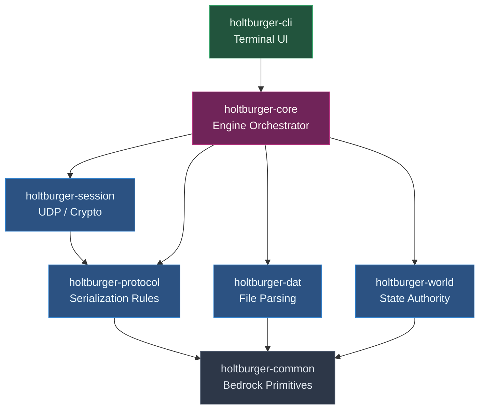
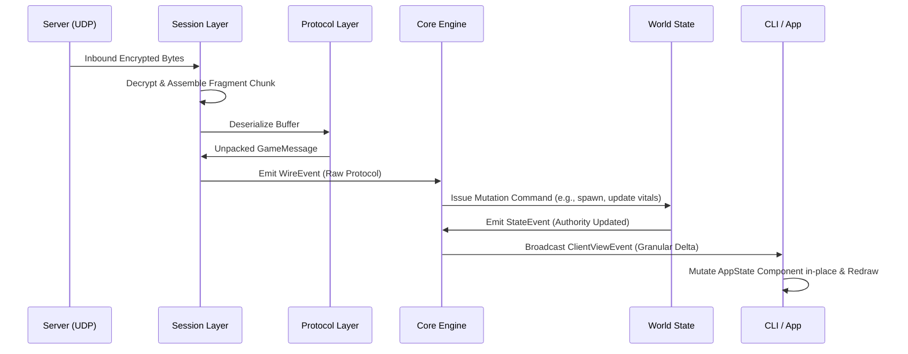

# Holtburger Architecture Overview 🍔

Welcome to the root architecture guide for the Holtburger project. This document illustrates how all the individual crates within the workspace tie together to form a cohesive, high-performance Asheron's Call client. 

## Architectural Philosophy

Holtburger is designed around **strict decoupling**. The network protocol is isolated from game state, game state is isolated from the application engine, and the user interface is completely decoupled from everything, acting purely as a consumer of delta streams. 

By separating concerns into discrete library crates, we achieve:
1. **Purity**: Networking components don't know about game entities; protocol parsers don't know about UI state.
2. **Performance**: Heavy tasks (like UDP chunk reassembly or `DAT` file extraction) are separated from the main coordination and rendering threads.
3. **Ergonomics**: Consumers (like the CLI/TUI) never have to manage lock contention on the world state. They receive a clean stream of semantic delta events.

---

## Crate Dependency Graph

---

## The Crates

### 1. The Bedrock: [`holtburger-common`](crates/holtburger-common/ARCHITECTURE.md)
The foundational layer. It contains pure, stateless primitives that every other crate relies on. It enforces the rule of having no upstream workspace dependencies.
- **Provides**: Vectors, Quaternions, global `Guid` representations, Property Enums, and Protocol Serialization Traits.

### 2. The Language: [`holtburger-protocol`](crates/holtburger-protocol/ARCHITECTURE.md)
Contains zero-logic data structures and deterministic serialization rules corresponding 1:1 with the Asheron's Call protocol (based directly on ACE Server ground truth).
- **Provides**: `GameOpcode`, packet representations, and binary `pack/unpack` implementations.

### 3. The Library: [`holtburger-dat`](crates/holtburger-dat/ARCHITECTURE.md)
Responsible for reading, mounting, and querying static local Asheron's Call data files (`.dat`). 
- **Provides**: Fast, memory-mapped queries for structural templates (Weenies), 3D models, and multi-layered Landblocks.

### 4. The Transport: [`holtburger-session`](crates/holtburger-session/ARCHITECTURE.md)
Encapsulates pure networking logic. It handles the lowest levels of transport without knowing anything about the game world.
- **Provides**: UDP fragment reassembly, packet sequencing, RC4 stream encryption/decryption, and socket loops.

### 5. The Authority: [`holtburger-world`](crates/holtburger-world/ARCHITECTURE.md)
The authoritative data graph for the client. Isolated from the orchestration loop, it tracks the live state of the 3D world, entity locations, and physics securely in memory.
- **Provides**: `WorldState`, `EntityManager`, Spatial Scenes, and stateless Rule Engines.

### 6. The Brain: [`holtburger-core`](crates/holtburger-core/ARCHITECTURE.md)
The primary engine orchestrator. It ties the networking (`session`) and data tracking (`world`) together. 
- **Provides**: Handshake coordination, client movement prediction, and translates raw inbound protocol `WireEvent`s into safe `ClientViewEvent` delta streams for applications to consume.

### 7. The Frontend: [`holtburger-cli`](apps/holtburger-cli/ARCHITECTURE.md)
A high-performance Terminal User Interface (TUI). Because of the architecture, this crate is astonishingly lightweight.
- **Provides**: Real-time ratatui screens, responsive UI layouts, and asynchronous local projection caches built purely from the Core's delta events.

---

## System Data Flow

The architecture solves the classic "massive monolithic state" problem by employing an authoritative center mapping to semantic deltas. Here is the life of a packet:

1. **Networking (`session`)** tracks sequence numbers and decrypts data.
2. **Parser (`protocol`)** turns data into Rust struct representations.
3. **Engine (`core`)** checks the rules and requests `world` to update the actual ground-truth layout of the environment.
4. **Authority (`world`)** updates its maps/trees and tells the engine what changed.
5. **App (`cli`)** receives a lightweight delta-update (e.g. `PropertyUpdated { guid, new_value }`) and updates its local screen instantly without needing lock access to the main thread's World State.
