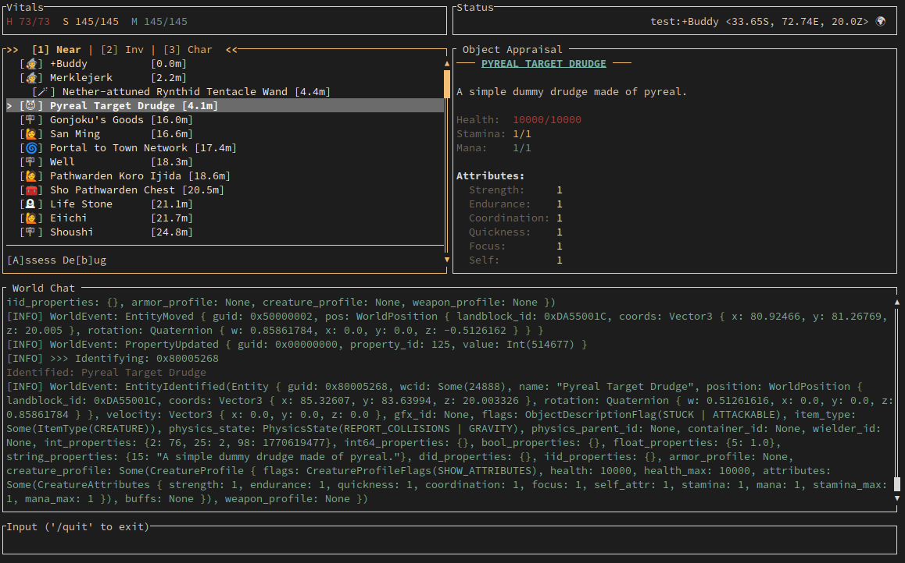

# Holtburger 🍔

Holtburger is a modern, cross-platform, exploratory Asheron's Call client ecosystem written in Rust. It aims to provide a modular, high-performance foundation for a new generation of clients and bots. The TUI client already covers a meaningful set of gameplay, automation, and data-projection workflows, and the stack keeps expanding.



## The Ecosystem

For a detailed breakdown of how these components interact, check out the [Architecture Overview](ARCHITECTURE.md).

Holtburger is comprised of several specialized crates:

- **[`holtburger-common`](crates/holtburger-common)**: The bedrock layer. Shared types, utilities, and constants used across the entire workspace.
- **[`holtburger-protocol`](crates/holtburger-protocol)**: The language of the world. Handles the deterministic serialization and deserialization of Asheron's Call packets, opcodes, and complex game messages.
- **[`holtburger-dat`](crates/holtburger-dat)**: A specialized library for parsing and querying Asheron's Call `.dat`, `.hba`, and other binary asset formats.
- **[`holtburger-session`](crates/holtburger-session)**: The pure networking layer. Handles UDP fragment reassembly, packet sequencing, and stream encryption.
- **[`holtburger-world`](crates/holtburger-world)**: The state authority. Tracks the live data graph of the 3D world, entity locations, and physics in memory.
- **[`holtburger-core`](crates/holtburger-core)**: The primary engine orchestrator. Manages client state, translates network messages into authoritative states, and broadcasts UI-safe delta streams.
- **[`holtburger-cli`](apps/holtburger-cli)**: A Terminal User Interface (TUI) client built on the Holtburger stack, designed for interaction, automation, and power users.
- **[`holtburger-tools`](apps/holtburger-tools)**: A collection of auxiliary command-line utilities for data extraction and protocol analysis.

## Current Capabilities vs Retail Client

Because Holtburger is a terminal-first client, its current feature set emphasizes protocol accuracy, authoritative world tracking, and functional gameplay systems rather than graphical rendering. Here is a high-level matrix of what is implemented today compared to the classic retail 3D experience:

| Feature | Retail Client | Holtburger TUI | Notes |
| :--- | :---: | :---: | :--- |
| **3D Graphics & Sound** | 🟢 | 🔴 | Intentional limitation. TUI relies on text and data projection. |
| **Login & Auth** | 🟢 | 🟢 | Full multi-stage GLS and world server handshake. |
| **Character Selection** | 🟢 | 🟢 | Login via terminal UI or CLI arguments. |
| **Character Creation** | 🟢 | 🔴 | Planned for a future update. |
| **Spatial Radar** | 🟢 | 🟢 | Live positional tracking of nearby entities. |
| **Movement & Physics** | 🟢 | 🟡 | Turn-to, locomotion primitives, sticky pursuit, and server-driven reposition handling work. Full 3D collision-aware navigation is still future-client territory. |
| **Chat & Messaging** | 🟢 | 🟢 | Full parsing of chat channels, server messages, and emotes. |
| **Inventory & Equipping** | 🟢 | 🟢 | Move, stack, split, drop, and equip items. |
| **Vendors & Trade** | 🟢 | 🟢 | Full merchant interaction including alternate currencies. |
| **Crafting** | 🟢 | 🟢 | Item combine flows, success prompts, and salvage preview/execution are implemented. |
| **Magic System** | 🟢 | 🟢 | Spell catalog loading, spellbook/enchantment tracking, and targeted or untargeted casting are implemented. In the TUI, this is effectively the ceiling without scripting or a richer frontend. |
| **Melee & Missile Combat** | 🟢 | 🟢 | Manual targeted melee and missile attacks work, and the TUI can drive shared combat-facing and sticky-melee helpers. This is the practical ceiling for the terminal client unless scripting is introduced. |
| **Scripting / Automation** | 🔴 | 🔴 | Embedded scripting remains planned, and that is the main path for pushing combat or spellcasting beyond the current TUI ceiling. |

## Disclaimers

Holtburger is **highly experimental**. APIs are unstable and subject to frequent breaking changes. Much of this code is heavily developed with the assistance of AI coding agents, so don't treat its implementation as authoritative.

### Prerequisites

- [Rust](https://www.rust-lang.org/tools/install) (latest stable or nightly)

## Installation

### Binary Releases (Recommended)
Pre-compiled binaries for the nightly builds are available on the [Releases](https://github.com/merklejerk/holtburger/releases) page. These archives include the bundled micro `portal.hba` required for the current TUI/runtime path.

1.  Download the archive for your platform (Windows, macOS, or Linux).
2.  Extract the contents.
3.  Run the `holtburger-cli` (or `holtburger-cli.exe` on Windows) binary.


### Flatpak (Linux)
For Linux users, a Flatpak bundle is built nightly:
```bash
# Install the bundle
flatpak install holtburger-cli.flatpak
```

### From Source
To build the ecosystem from scratch, ensure you have the [Rust toolchain](https://www.rust-lang.org/tools/install) installed.

```bash
git clone https://github.com/merklejerk/holtburger.git
cd holtburger
cargo build --release
```
The binaries will be located in `target/release/`.

## Running the TUI Client

### Using the Binary Release
Simply run the executable from your terminal. If you are in the folder where you extracted the release:
```bash
./holtburger-cli [ARGS]
```

### Windows
The TUI/CLI client requires a modern terminal emulator to render correctly. The built-in Command Prompt or PowerShell on Windows are not adequate. Fortunately, there are a number of options available, even directly from Microsoft, such as the [Windows Terminal](https://apps.microsoft.com/detail/9n0dx20hk701) app (preinstalled on Windows 11).

> [!TIP]
> If you get an error about missing `VCRuntime140.dll`, you may need to install the [VC Runtime](https://aka.ms/vc14/vc_redist.x64.exe). Additionally, you might have to whitelist the `.exe` with Windows Defender by attempting to run it once, hitting "More info", and then selecting "Run anyway".

After you have extracted the Windows zip file to a folder, open up your terminal emulator of choice, navigate to said folder, and run `holtburger-cli.exe --help` to get started.

### Using Flatpak (Linux)
```bash
flatpak run io.github.merklejerk.holtburger-cli [ARGS]
```

### Local Development
For development, you can run the TUI client directly through `cargo`. We use `--bin tui` as a shorthand in the dev environment. Note that this will require you to provide the client `.dat` files in the `./dats/` folder (see [below](#data-file-configuration)):
```bash
cargo run --bin tui -- [ARGS]
```

### Data File Configuration
The TUI client requires game data (`portal` and `cell`) to function. It is compatible with both official DAT files and our optimized HBA format, which is >90% smaller. The repo and source distribution does not check these files in so you will have to provide them separately. You can either provide your own DAT files or download the latest `hba.zip` from our [Releases](https://github.com/merklejerk/holtburger/releases) page and extract it into a `./dats` folder in the root of the project.

### Release Maintenance
The GitHub Actions workflows currently fetch release HBA assets from repository variables instead of committed archive files:

- `HBA_MICRO_LATEST_URL`: used by CI, nightly release packaging, and Flatpak packaging to fetch the micro `portal.hba` bundle that ships with current releases.
- `HBA_PRUNED_LATEST_URL`: reserved for workflows that need the larger pruned archive set. The current release workflows do not consume it.

**Search Priority:**
1.  `--dats <PATH>` command-line argument.
2.  `HOLTBURGER_DATS` environment variable.
3.  Local `./dats/` directory relative to the binary.
4.  Standard OS Data Directory:
    *   **Linux**: `~/.local/share/holtburger/dats/`
    *   **macOS**: `~/Library/Application Support/io.github.merklejerk.holtburger/dats/`
    *   **Windows**: `%APPDATA%\merklejerk\holtburger\data\dats\`

> **Note:** Official DAT files (`client_portal.dat` and `client_cell_1.dat`) must be renamed to `portal.dat` and `cell.dat` respectively.

## License

Holtburger is licensed under the [GNU General Public License v3.0](LICENSE).
