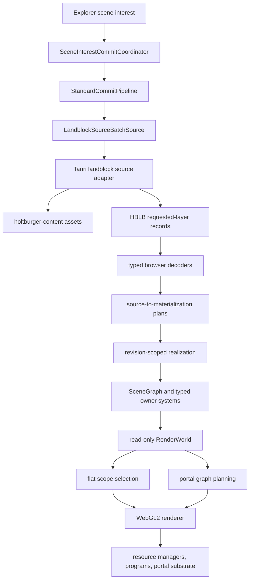
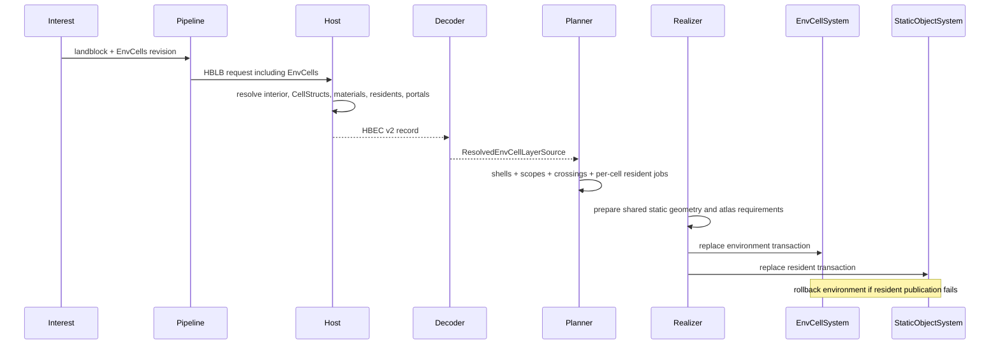

# Architectural Snapshot: holtburger-3d

_Last updated: 2026-07-30_

## Tech Lead North Stars

- Keep canonical DAT discovery and joins in shared content code while keeping frontend
  presentation projection app-local.
- Acquire each landblock once per request, but publish and evict its requested layers
  independently.
- Preserve authored environment-cell geometry, topology, containment, and residency facts without
  letting renderer policy leak back into the scene.
- Reuse one static material, texture, atlas, geometry, and draw path across outdoor objects,
  environment shells, and environment-cell residents.
- Keep explorer camera policy in the explorer. Shared runtime APIs expose facts and directed query
  primitives rather than implementing a future game client's movement controller.
- Make portal rendering correct by construction: scope-local traversal, one unique owner for each
  render domain, and one explicit schedule that distinguishes node identity from contribution
  occurrences.

## 1. Current System Shape

`LandblockSourceBatchSource` is an app-local acquisition capability, not an outdoor scene type. It
accepts the complete requested layer set for one landblock and returns independently decoded
Terrain, Buildings, Objects, Generated, and EnvCells records. The host loads one shallow
`LandblockAsset`; only explicitly requested deep products such as generated scenery and the
interior system are resolved.

The HBLB envelope groups transport only. Each record retains its own availability, decoder,
commit, revision, owner, publication, and eviction lifecycle.

## 2. Load-Bearing Bones

| Boundary                                         | Owned invariant                                                                                                                                         |
| ------------------------------------------------ | ------------------------------------------------------------------------------------------------------------------------------------------------------- |
| `src-tauri/src/landblock_source_batch.rs`        | One cumulative, requested-layer host acquisition with explicit requested/unrequested projections.                                                       |
| `src-tauri/src/env_cell_source.rs`               | HBEC v2 projection of CellStruct shells, materials, residents, containment, authored apertures, effective visibility apertures, and directed crossings. |
| `src-tauri/src/cell_struct_projection.rs`        | One generalized polygon projection for visible sides, material-free apertures, and the normalized positive-child Cell BSP containment chain.            |
| `src/lib/assets/decode-env-cell-record.ts`       | Strict, versioned, independently decodable browser boundary; malformed identity, ranges, topology, or geometry fail loudly.                             |
| `game/commit/env-cell-materialization.ts`        | Renderer-neutral shell, scope, aperture, crossing, and per-cell resident work; no scene or GPU ownership.                                               |
| `game/runtime/static-layer-realizer.ts`          | Revision currentness, geometry/atlas rendezvous, publication ordering, and stale-work withdrawal.                                                       |
| `game/runtime/env-cell-realization.ts`           | Reuses the static preparer for residents, builds proof-backed visibility islands, and creates one environment artifact.                                 |
| `game/systems/env-cell-system.ts`                | Failure-atomic ownership of scopes, crossings, shell nodes, aperture geometry, and rollback.                                                            |
| `game/scene/scene-graph.ts`                      | Scene transforms, scope-partitioned culling groups, exact point containment, directed portal traces, and immutable topology views.                      |
| `game/renderer/render-world.ts`                  | Read-only bridge from typed runtime systems to renderer resource keys and contributions.                                                                |
| `game/renderer/portal-view-window.ts`            | Exact normalized window construction, convex source decomposition, scope-coverage admission, projection, and clipping.                                  |
| `game/renderer/portal-render-graph.ts`           | Scope-local traversal, unique render domains, mask edges, explicit contributions, exterior scheduling, and capacity preflight.                          |
| `game/renderer/portal-render-plan-validation.ts` | Pure validation and indexing of the completed planner contract before any GPU resource resolution.                                                      |
| `game/renderer/webgl2-portal-executor.ts`        | Stateless execution of the completed graph; it invents no topology or second contribution schedule.                                                     |
| `game/renderer/webgl2-portal-substrate.ts`       | One extent-keyed scene-domain target and explicit WebGL color/depth/stencil state transitions.                                                          |

## 3. Environment-Cell Source and Ownership Flow

CellStruct geometry is reusable across cells, but material selection and placement are cell-owned.
Shells therefore share logical geometry keys while retaining independent material ranges,
landblock-space transforms, bounds, and EnvCell scope identity.

Every environment-cell static resident enters the same classifier, material planner, worker,
texture dependency collector, atlas, geometry manager, static object system, and renderer used by
outdoor static residents. Jobs are partitioned by EnvCell before batching, so no baked node,
instance stream, transparent population, or draw contribution spans scopes. Default-animated
residents remain explicitly deferred to the dynamic path.

Publication is failure-atomic across the environment and its residents. Geometry and atlas work
may prepare concurrently, but only a current scene-interest revision can publish. Stale work
withdraws its atlas claim and cannot become authoritative scene state.

## 4. Scene Graph and Spatial Queries

All root transforms are landblock-local. A root carries `landblockId`, optional `envCellId`, and a
local-to-landblock transform; children inherit the root residency and compose transforms exactly
once. Environment shells are roots in their EnvCell scope. Resident nodes are also landblock-space
roots produced by the shared static system, avoiding a second CellStruct transform.

The spatial index is organized by:

1. scene scope;
2. root landblock coordinate frame;
3. producer-owned culling group; and
4. exact node bounds.

Environment shells use `env-cell-shell`; static residents use the EnvCells layer group. A query
first rejects an aggregate group AABB and then tests each member AABB. Flat and portal modes share
this exact spatial selection; only their chosen scope sets differ.

The runtime exposes three distinct query contracts:

- `queryWorldPointResidencyCandidates` returns the outdoor result plus every EnvCell whose AABB is
  hit, together with its exact Cell BSP containment verdict. It preserves overlapping ambiguity.
- `queryEnvCellPointContainment` tests one caller-selected resident EnvCell.
- `tracePortalSegment` starts from caller-supplied authoritative residency and follows the earliest
  directed finite-aperture crossing. It does not infer residency from overlap.

The explorer uses candidate containment for best-effort initial/free-fly placement. It retains the
last resolved residency when overlap is ambiguous. No player movement, authoritative portal
history, third-person camera residency, or client controller policy has been implemented.

## 5. Authored and Effective Apertures

An authored aperture is material-free planar triangle geometry in landblock space. It retains its
plane, accepted traversal side, bounds, source identity, and polygon provenance. It is used by
directed spatial queries and never replaced by rendering preprocessing.

Each directed crossing also names one effective visibility aperture:

- an exact or unresolved crossing reuses the authored source aperture;
- a non-`ExactMatch` reciprocal pair receives the coplanar geometric intersection of the two
  authored apertures; and
- the host records static provenance for the synthesized intersection.

This preprocessing occurs once at the app-local host boundary. The renderer consumes the result
directly; it does not recompute reciprocal intersections per frame. Effective apertures constrain
visibility and masks only. They do not alter containment, collision, or portal-crossing queries.

Indoor reciprocal seams join one visibility island only when the host proves exact reciprocal
identity, `ExactMatch` on both sides, equivalent apertures, opposed accepted half-spaces, and cell
bounds separated by the portal plane. Any failed proof remains an explicit topology boundary.

## 6. Rendering Modes and Portal Execution

Flat mode selects outdoor plus every resident EnvCell scope, applies ordinary frustum/group/node
culling, and performs no portal planning, masks, targets, or composition. It forces single-sided
back-face culling for CellStruct shell ranges only, preserving useful bird's-eye inspection of
interiors. Static ranges retain authored DAT cull mode as provenance, but WebGL consumes the
effective front/back rejection for each side already expanded by the host.

Portal mode starts from the camera's supplied scope. The planner:

1. seeds only the camera scope with the full view window;
2. propagates exact clipped windows through source-keyed crossings;
3. crosses depth-continuous seams without masks while retaining scope-local coverage;
4. maps reached scopes to unique render domains without selecting unrelated island members;
5. records cross-domain masks before coverage subsumption;
6. assigns explicit ordinary, exterior, deferred, and additional contribution occurrences; and
7. preflights stencil capacity and a corruption-only work ceiling.

The executor consumes this schedule mechanically. It unions each contribution's masks under its
planner-owned label, resets depth only where declared, and submits the named nodes. Node identity
is unique, but contribution occurrences need not be: a root island can render ordinarily and then
again through a parent-constrained exterior-return suffix. Deferred suffix nodes are withheld by
the planner, not inferred by the executor.

A same-domain topology boundary remains available to spatial queries and propagates clipped
scope coverage, but produces no mask because ordinary depth already unifies its endpoint domain.
Outdoor/indoor transitions render directly into one renderer-owned full-size color plus
depth-stencil target. Exterior color and depth render once per view. The same contribution path
handles opaque, alpha-tested, transparent, and additive content. The target is lazy, extent-keyed,
retained across a switch back to flat mode, and disposed on resize or renderer destruction.

## 7. Boundary Audit

| Layer                 | May own                                                                    | Must not own                                             |
| --------------------- | -------------------------------------------------------------------------- | -------------------------------------------------------- |
| `holtburger-content`  | canonical landblock/interior joins and authored topology                   | app transport, browser geometry, portal render schedules |
| Tauri adapter         | app-local projection, HBLB/HBEC encoding, effective aperture preprocessing | scene revisions, camera policy, WebGL state              |
| browser assets/commit | strict decoding and source-to-plan conversion                              | runtime currentness or GPU handles                       |
| runtime/systems       | revision ownership, scene publication, topology, logical resources         | DAT discovery or portal draw scheduling                  |
| scene graph           | transforms, scope facts, culling, containment, directed query primitives   | explorer policy or stencil policy                        |
| renderer              | per-view visibility windows, graph schedule, passes, targets, device state | scene mutation or authoritative residency                |
| explorer              | free-fly controls, initial placement, render-mode UX                       | canonical topology or future client movement policy      |

No `WebGL2RenderingContext` escapes the renderer subtree. Scene and commit artifacts carry logical
geometry/texture keys, not driver objects. Host serialization carries source facts and proven
classification, not frame diagnostics or draw ordering.

HBSO and HBEC retain independent envelopes and required-section contracts while sharing one typed
Rust section writer and one TypeScript section validator/reader. Static geometry, material, and
presentation decoding lives in the neutral `decode-static-source-record.ts`; HBEC no longer
imports shared behavior through an outdoor-owned module.

## 8. Terminology and Dead-Contract Audit

- `OutdoorStaticLayerKind` remains accurate for Buildings, Objects, and Generated. EnvCells is a
  distinct static layer because it also owns shells, topology, queries, and apertures.
- `LandblockSourceBatchSource` names cumulative acquisition and is intentionally not
  outdoor-specific.
- The old first-match `queryWorldPointResidency` contract is gone; the remaining candidates API is
  ambiguity-preserving.
- The old object-only detail owner is gone. Active-region static detail owns building,
  environment, and object roles as one generation.
- Apertures have `PortalGeometryKey`/`PortalDrawUnit` resources and no textured material ranges.
- HBEC has one live version, v2. No v1 decoder or compatibility path remains.
- Paired renderer apertures, scratch stencil values, increment/decrement mask stacks, and
  push/pop-mask contracts are absent from production and tests.
- `visibilityProvenance` is source-validation evidence. Runtime diagnostics aggregate the resulting
  authored/intersection counts instead of carrying provenance into every frame.
- Static texture-fact compatibility and owner-ID parsing each have one runtime implementation.
- Portal-plan topology, contribution roles, labels, masks, transitions, and exterior facts are
  validated before the WebGL executor resolves masks or allocates targets.

## 9. Complexity, Debt, and Pruning Targets

Current large-file concentration:

| File                               | Approx. lines | Assessment                                                                                                                                                                                 |
| ---------------------------------- | ------------: | ------------------------------------------------------------------------------------------------------------------------------------------------------------------------------------------ |
| `renderer/webgl2-renderer.ts`      |         1,898 | Largest active debt. Contribution assembly, frame metrics, harness probes, and device drawing are coherent but crowded. Extract a measured seam before adding another rendering subsystem. |
| `src-tauri/src/env_cell_source.rs` |         1,169 | Large but cohesive source projection. Binary-section encoding is now shared; visibility preprocessing is the clearest future split if the format evolves.                                  |
| `src-tauri/src/lib.rs`             |         1,292 | Broad Tauri composition hub; split by command family when next materially touched.                                                                                                         |
| `runtime/game-runtime.ts`          |         1,219 | Legitimate composition root. Typed owner parsing and texture merging are now delegated; keep feature policy in planners, realizers, and systems.                                           |
| `assets/decode-env-cell-record.ts` |         1,140 | Strict semantic validation remains dense after shared binary-section and static-presentation decoding were extracted.                                                                      |
| `renderer/portal-render-graph.ts`  |         1,179 | Complex domain algorithm with strong pure-test coverage. Keep traversal, scheduling, and capacity here; avoid mixing GPU commands into it.                                                 |
| `renderer/portal-view-window.ts`   |           983 | Exact geometry hot path. Convex decomposition and normalization are cohesive but performance-sensitive; preserve archive timing gates when changing it.                                    |

There is no evidence-backed duplicate material or portal renderer to delete. The main risk is
future accretion into the renderer and host serializer hubs. The correct next refactor trigger is a
new responsibility or measured review burden, not line count alone.

Known concessions:

- Flat mode intentionally renders all resident EnvCells, so it is an inspection mode rather than a
  scalable gameplay visibility policy.
- Same-domain topology boundaries remain query-visible and propagate clipped scope reachability,
  but cannot create a useful stencil separation after their endpoints map to one proven render
  domain.
- Portal targets remain allocated after returning to flat mode to make mode changes cheap. They
  are released on resize/destroy, and their bytes are reported.
- Explorer residency is best effort and has no portal-crossing history. That is correct for the
  explorer and deliberately insufficient for a future authoritative client controller.

## 10. Verification Posture

Pure geometry, containment, topology, portal-window, graph, and executor contracts use synthetic
fixtures that require no local DAT/HBA archives. Archive-backed source and browser checks remain
opt-in diagnostic coverage. Frame metrics are consumed by the explorer, harness assertions, or
this audit; unused ceremonial fields are not retained.
