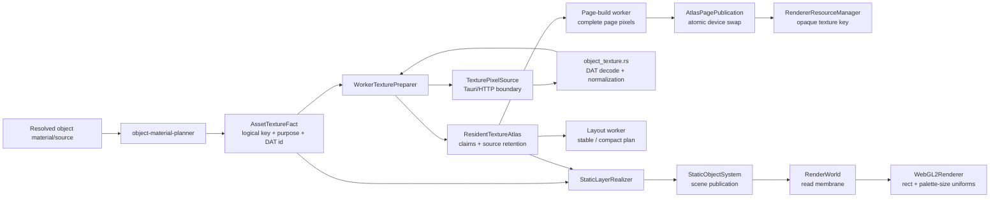
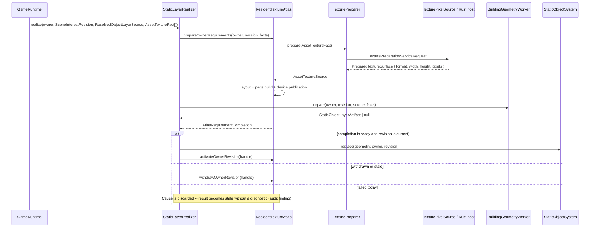
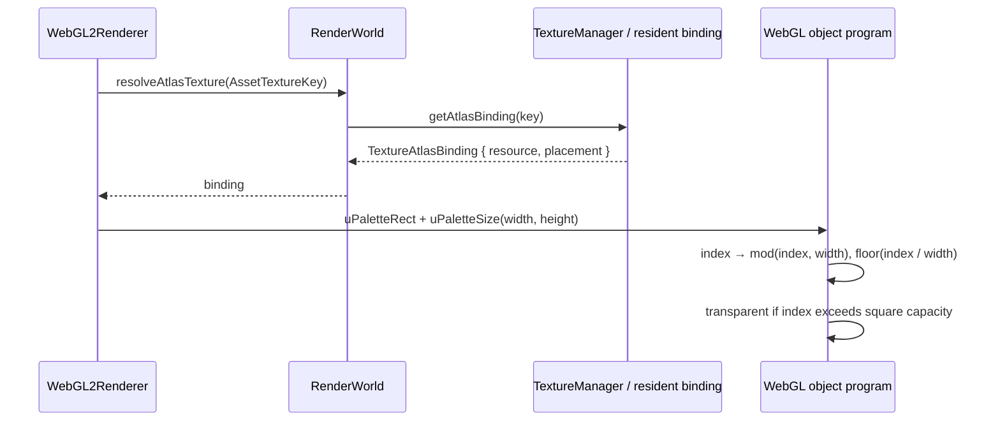

# Architectural Snapshot: holtburger-3d Atlas Residency Blast Radius

_Last updated: 2026-07-25_

## Audit Scope and Verdict

This is a fresh, intentionally narrow audit of the systems changed by or directly
coupled to `holtburger-3d-runtime-texture-atlas-residency-plan.md`: object material
planning, texture facts and preparation, resident atlas ownership and page
publication, static-layer realization, renderer binding, and the Tauri texture-pixel
boundary. Terrain arrays, Explorer UX, generic scene structure, and the legacy app are
out of scope except where they define a boundary.

The core design is sound. A logical `AssetTextureKey` remains independent from an
atlas placement; purpose fixes pixel format, page lane, gutter, and mip policy; exact
owner/revision claims prevent stale asynchronous work from publishing; and WebGL stays
behind `RenderWorld` and `WebGL2Renderer`. The recent palette change is correctly
app-local: the host emits a square prepared payload and the renderer consumes only its
placement dimensions.

The audit's code-level findings have been addressed. Atlas failure causes now cross
only the in-flight atlas-to-realizer seam, where a current revision logs them and then
becomes stale; no availability event, UI record, or retry state is created. Material
planning emits canonical texture facts, and device-page publication is isolated from
claim lifetime and rebuild orchestration. The intentionally deferred `src-tauri/lib.rs`
file-cohesion issue is the only original finding left open.

| Status              | Finding                                                               | Result                                                                                                                                         |
| ------------------- | --------------------------------------------------------------------- | ---------------------------------------------------------------------------------------------------------------------------------------------- |
| Resolved            | Atlas failures lost their cause                                       | Failure completion now carries `cause`; the injected realizer reporter logs only current failures before exact withdrawal and stale completion |
| Resolved            | Building dependency request/provenance mirror                         | `ObjectMaterialPlan` and building collection use `AssetTextureFact[]`; `TexturePreparer` is the sole fact-to-host-request translator           |
| Resolved            | `ResidentTextureAtlas` mixed claim, rebuild, and device-page concerns | Private `AtlasPagePublication` owns page replacement, bindings, and device counters; atlas ownership remains singular                          |
| Resolved            | Pixel-format byte-width mapping was duplicated                        | `texturePixelFormatByteLength()` is the one app-local format primitive                                                                         |
| Deferred by request | Tauri texture host file cohesion                                      | Keep `src-tauri/src/lib.rs` intact until the next transport contract requires a cohesive split                                                 |

## 1. System Topology and Import Matrix

| Layer                 | May know                                                           | Must not know                                    | Result                                                       |
| --------------------- | ------------------------------------------------------------------ | ------------------------------------------------ | ------------------------------------------------------------ |
| Resolution and commit | Source materials, logical texture keys/facts                       | Atlas pages, device resources, WebGL             | Clean, except the obsolete request mirror                    |
| Texture preparation   | Fact → app-local host request → complete pixels                    | Owners, revisions, placements, scene nodes       | Clean and intentionally narrow                               |
| Resident atlas        | Exact claims, prepared sources, plans, opaque backend keys         | Scene graph and Explorer policy                  | Clean authority; internally too dense                        |
| Static realization    | Currentness, atlas readiness, geometry, publication ports          | Pixels, page layouts, WebGL handles              | Clean failure-atomic sequencing, but failure cause is erased |
| Render world / WebGL  | Read-only logical resource lookup, placements, sampler/pass policy | Atlas mutation and source loading                | Clean; raw WebGL handles are confined to `renderer/webgl2-*` |
| Tauri host            | DAT/content APIs and binary envelope serialization                 | TypeScript runtime ownership and Explorer policy | Correct layer; wrong file granularity                        |

There is no raw WebGL handle outside `renderer/webgl2-*`. Texture and runtime
systems depend only on `RendererResourceManager` and opaque branded resource keys.
That is the boundary worth defending.

## 2. Load-Bearing Architectural Bones

| Bone                              | Files                                                                                               | Invariant it owns                                                                          | Refresher                                                                                                                  |
| --------------------------------- | --------------------------------------------------------------------------------------------------- | ------------------------------------------------------------------------------------------ | -------------------------------------------------------------------------------------------------------------------------- |
| Purpose and logical identity      | `textures/types.ts`, `resolution/object-material-planner.ts`                                        | A DAT source plus semantic purpose determines one logical key and one device policy        | Purpose is the physical bucket; a placement is replaceable realization metadata                                            |
| Pixel preparation boundary        | `textures/texture-preparer.ts`, `assets/texture-pixel-source.ts`, `src-tauri/src/object_texture.rs` | The host returns pixels whose source identity and format match the requested fact          | Host addresses are derived locally (`surface-texture/` or `palette/`), not operational provenance threaded through runtime |
| Exact residency ownership         | `textures/atlas/resident-texture-atlas.ts`                                                          | Only current owner/revision claims retain a source; final withdrawal releases it           | Claims are private and exact, so stale cleanup cannot delete a newer revision                                              |
| Deterministic page realization    | `textures/atlas/layout.ts`, `textures/atlas/page-build.ts`                                          | Pages are purpose-isolated, fixed-size, stable unless bounded compaction eliminates a page | Layout sees metadata; page build sees copied source pixels; neither receives scene policy                                  |
| Failure-atomic static publication | `runtime/static-layer-realizer.ts`, `systems/static-object-system.ts`                               | Geometry and atlas readiness precede scene replacement; a stale revision never activates   | The realizer is sequencing glue, not a second resource owner                                                               |
| Read-only renderer membrane       | `renderer/render-world.ts`, `renderer/webgl2-renderer.ts`, `renderer/webgl2-object-program.ts`      | Render code resolves current bindings but cannot mutate residency                          | Palette lookup receives a rect and dimensions, never page pixels or source IDs                                             |

## 3. Typed Execution Flows

### Static layer realization and atlas replacement

### Indexed material lookup during a frame

The current 2,048-entry palettes arrive as `46 × 46` RGBA payloads with transparent
padding. This is a presentation encoding, not a new canonical palette domain: index8
and index16 still share the complete authored palette fact.

## 4. Source Tree and Placement Review

Correct placement:

- Host-only palette shaping lives in `src-tauri/src/object_texture.rs`; it is not
  incorrectly promoted into `holtburger-content`.
- Static owner/revision sequencing lives in `runtime/static-layer-realizer.ts`,
  not in the renderer or scene system.
- The pure rectangle/layout and pixel-blit algorithms are colocated under
  `textures/atlas`.
- WebGL uniform setup and GLSL decoding are both renderer-local.

Placement to improve:

- `src-tauri/src/lib.rs` is a namespace dump, not a boundary violation. Split
  `load_texture_pixels` preparation and envelope serialization by contract when
  they next change; do not create a generic host framework.

## 5. Complexity and Nesting Hotspots

Scoped ESLint analysis at complexity 10 and nesting depth 4 now reports only these
pre-existing algorithm/renderer warnings:

| Complexity | Symbol                            | Assessment                                                                                       |
| ---------: | --------------------------------- | ------------------------------------------------------------------------------------------------ |
|         15 | `WebGL2Renderer.#drawObjectRange` | Renderer pass/state assembly; outside mutation authority but in the palette blast radius         |
|         13 | `planStableAtlasLayout`           | Core packing algorithm; leave together unless a proven deterministic helper improves readability |

`ResidentTextureAtlas` now owns claim/source/rebuild state while
`AtlasPagePublication` owns the device transaction. Both are app-local internals; no
second public residency service or duplicate state authority was introduced.

## 6. Coupling and Structural Hubs

| Hub                                             | Why it is acceptable                                                                   | Guardrail                                                                     |
| ----------------------------------------------- | -------------------------------------------------------------------------------------- | ----------------------------------------------------------------------------- |
| `TexturePurpose` / `texturePurposePolicy`       | Centralizes format, mip, and packing policy                                            | Keep new object roles here rather than adding renderer-local exceptions       |
| `ResidentTextureAtlas` + `AtlasPagePublication` | One private residency authority split by concern: claims/sources versus pages/bindings | Do not expose mutable maps or let `TextureManager` manufacture atlas bindings |
| `StaticLayerRealizer`                           | Deliberate integration seam between currentness, atlas, geometry, and publication      | Keep injected ports narrow; do not add scene-interest policy here             |
| `RenderWorld`                                   | Read-only cross-system renderer facade                                                 | Do not pass runtime systems or WebGL resources back upstream                  |
| `TextureManager`                                | Generic texture facade plus read-only packed-atlas delegate                            | Continue treating it as a facade; the atlas owns the packed physical state    |

No new runtime import cycle is implied by the atlas work. The only meaningful
coupling debt is type placement: `texture-preparer.ts` imports the asset-host port
while the host port imports its request/response types. It erases at runtime, but a
small neutral preparation-contract module would remove the type-only cycle if this
protocol grows.

## 7. Leaky Abstractions and Terminology

Good boundaries:

- `AssetTextureFact.sourceAssetId` is semantic identity, not ceremonial
  provenance. `ResidentTextureAtlas.normalizeFacts()` verifies it against the key.
- `renderSurfaceId` stays source evidence in material resolution and is absent from
  atlas identity and host preparation requests.
- Page pixels are copied into a closed worker job and released after device upload;
  diagnostics expose placements and aggregate counts, not a hidden pixel cache.

Leak / terminology finding:

- `AtlasRequirementCompletion` retains a failure cause only until the injected
  runtime reporter can log it. It does not become an availability event or retained
  diagnostics record.

## 8. Authority and Policy Drift

There is one authoritative holder for each operational concern:

| Concern                                    | Authority                                   | Verified non-authorities                                                |
| ------------------------------------------ | ------------------------------------------- | ----------------------------------------------------------------------- |
| Logical texture identity and device policy | `textures/types.ts`                         | Object planner, host, layout, and renderer consume it                   |
| Exact residency claim/source/page state    | `ResidentTextureAtlas`                      | `TextureManager` delegates reads; static realization owns no page state |
| Revision currentness                       | scene-interest coordinator/currentness port | Atlas does not decide whether a scene revision is current               |
| Scene publication                          | static-object publisher/system              | Atlas does not create scene nodes                                       |
| WebGL sampler and draw policy              | `WebGL2Renderer`                            | Material planner has no driver state                                    |

The failure path is now a short-lived policy handoff: the atlas returns a cause, the
realizer checks currentness and invokes its injected reporter, then it withdraws and
returns stale. `scene-content-failed` remains reserved for source/availability failure
because Explorer camera status consumes it.

## 9. Candidate Pruning and Recommended Order

1. **Defer host-file surgery until a contract changes.** The current Tauri boundary
   is correct by dependency direction; its problem is file cohesion, not architecture.

## Verification Context

The audited palette cutover previously passed Rust object-texture tests, its focused
Vitest shader contract, TypeScript checking, ESLint, Knip, clippy, and the browser
terrain harness. The harness exercised live page publication and reported five
resident `46 × 46` palette placements while rendering building geometry and completing
a lifecycle unload/reload.

Repository-wide `prettier --check .` remains red on 18 pre-existing files. It is not
an atlas-specific result and should be corrected in a dedicated mechanical formatting
change rather than bundled with architectural cleanup.
