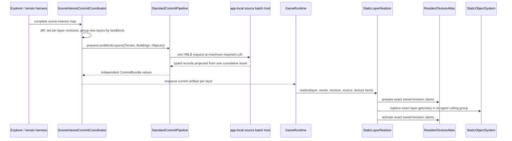

# Architectural Snapshot: holtburger-3d Outdoor Static Layers

_Last updated: 2026-07-25_

## Scope and Verdict

This is a fresh audit of the Level 2 explicit-object blast radius: cumulative landblock source
acquisition, app-local batch transport, commit fan-out, outdoor-static realization, ownership,
diagnostics, and the terrain browser harness. Terrain generation, dynamic rendering, generic
scene internals, and the deferred `src-tauri/src/lib.rs` cohesion work are outside scope.

The implementation is structurally sound. One scene-interest dispatch groups the newly requested
layers by landblock, obtains one maximum cumulative LoD source batch, and immediately fans its
typed records back into independently current Buildings and Objects commits. Runtime ownership
never follows the batch: each layer has its own revision, geometry allocation, scene node,
`buildings`/`objects` culling group, and eviction path. Shared atlas residency is the sole
intentional cross-layer physical state.

| Status                 | Finding                                                           | Resolution                                                                                                                                          |
| ---------------------- | ----------------------------------------------------------------- | --------------------------------------------------------------------------------------------------------------------------------------------------- |
| Resolved               | Scene-interest code split one dispatch into singleton requests    | `SceneInterestCommitCoordinator` groups new layers by landblock before calling the pipeline, then fans artifacts and unavailability back per layer. |
| Resolved               | DAT root parts became false hierarchy cycles                      | Host projection maps the documented `u32::MAX` root sentinel to JSON `null` before the baker sees it.                                               |
| Resolved               | Runtime diagnostics erased actual bake facts                      | `StaticObjectBakeDiagnostics` lives on the artifact and is consumed by the installed layer snapshot.                                                |
| Resolved               | Browser acceptance could not observe batching or layer separation | The dev HTTP adapter exposes immutable batch snapshots; runtime diagnostics expose culling group and node count without leaking resources.          |
| Intentionally deferred | Default-animated explicit residents                               | They cross the existing dynamic deferral seam after static publication; dynamic realization remains out of scope.                                   |
| Deferred by request    | `src-tauri/src/lib.rs` cohesion                                   | Do not mix a broad host-module split into this completed transport change.                                                                          |

## Load-Bearing Flow

The batch envelope is deliberately absent after `StandardCommitPipeline` turns each record into a
commit. `GameRuntime` receives a layer, not a source batch, and consequently cannot accidentally
couple Buildings and Objects lifecycle policy.

## Boundary Matrix

| Boundary                              | Owns                                                                        | Must not own                                                       |
| ------------------------------------- | --------------------------------------------------------------------------- | ------------------------------------------------------------------ |
| `holtburger-core` content runtime     | Cumulative LoD acquisition and lower/higher in-flight extension             | App layer-set mapping, HTTP/Tauri wire records, renderer ownership |
| Tauri/HTTP source boundary            | Requested-layer projection from one cumulative asset; binary/HTTP transport | Scene revisions, culling groups, atlas claims                      |
| `StandardCommitPipeline`              | Batch validation and typed record-to-commit fan-out                         | Host request timing, scene mutation, renderer resources            |
| `SceneInterestCommitCoordinator`      | Interest diff, layer revision ownership, per-landblock request grouping     | Object realization, atlas state, scene nodes                       |
| `GameRuntime` + `StaticLayerRealizer` | Currentness, atlas-before-scene sequencing, deferred-dynamic seam           | Source transport payload or page layout                            |
| `StaticObjectSystem`                  | Exact culling-group scene publication and withdrawal                        | Texture preparation or revision policy                             |
| Terrain harness + dev host            | Acceptance controls and read-only measurements                              | Production batch envelope or runtime mutation internals            |

## Invariants Worth Defending

1. A source batch is an acquisition optimization and validation boundary, never a runtime owner.
2. `LandblockLayerKind` is consumed at geometry identity, publication, culling, diagnostics, and
   eviction; it is not ceremonial provenance recovered from an owner string.
3. A root setup part has no parent. The DAT sentinel must not be serialized as a valid part index.
4. A current static layer becomes visible only after its exact atlas owner/revision claims are ready.
   Withdrawal cannot remove another layer's shared logical texture claim.
5. Default-animated residents are complete source facts but not static geometry or draw work.
6. Failures are logged and broadcast only as ephemeral `SceneAvailabilityEvent` notifications;
   there is no durable failure map, retry ledger, or diagnostic history.

## Terminology and Pruning Review

Searches find no `building-source`, `BuildingGeometry`, or `BuildingLayerSourceCommit` vestiges in
production code. The shared source, artifact, bake, and realization vocabulary is outdoor-static.
The remaining `SyntheticBlendedBuildingPipeline` and its `building-layer` resource key are an
intentional harness fixture: it produces Buildings only to exercise renderer blend phases. Making
that fixture pretend to produce generic layers would obscure its test purpose without improving a
production boundary.

`StaticObjectBakeDiagnostics` earns its extra type: the worker produces it, the artifact carries
it across the asynchronous realizer boundary, and `GameRuntime` publishes it in read-only layer
diagnostics. Conversely, source-batch byte/timing snapshots remain confined to
`HttpLandblockContentSource` and the terrain harness; they are not threaded through production
commits or retained by the runtime.

## Remaining Risks

- One geometry allocation/node per outdoor-static layer is intentionally coarse. The radius-one
  smoke run is acceptable evidence for activation, not a performance budget. Revisit only with
  measured visibility or transparency cost; do not preemptively add clustering or instancing.
- `SceneInterestCommitCoordinator` is a genuine integration hub. Keep its callbacks limited to
  prepared, unavailable, failed, and evicted layer effects; renderer or source-policy branches
  belong on their owning side of the boundary.
- Generated scenery can reuse the outdoor-static shape only after it has a real Level 3 source
  capability. Do not widen the current source union merely to advertise future reuse.

## Verification Context

The completed Level 2 matrix covered static setup, deferred dynamic, transparent, additive, DXT3,
radius-one lifecycle, and true interest relocation. Every live source request reported one
Terrain/Buildings/Objects batch at LoD 2. Focused coordinator coverage, 206 TypeScript tests, 17
Rust tests, type checking, ESLint, Knip, clippy with warnings denied, and targeted formatting all
passed.
