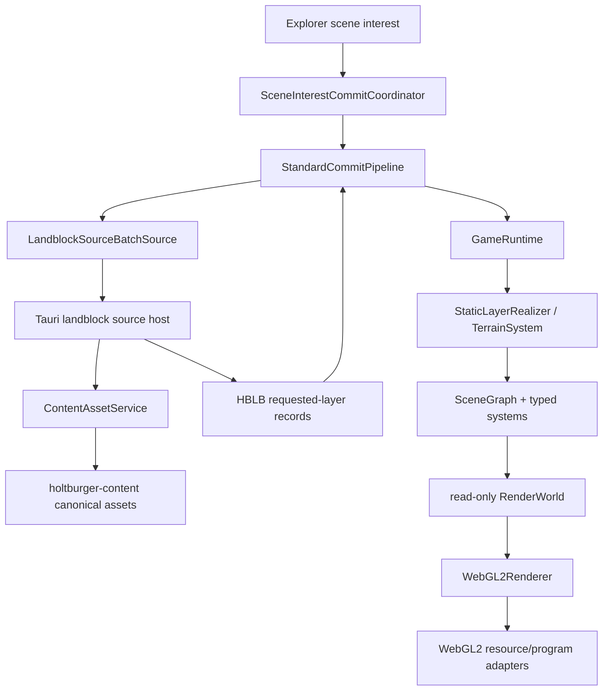
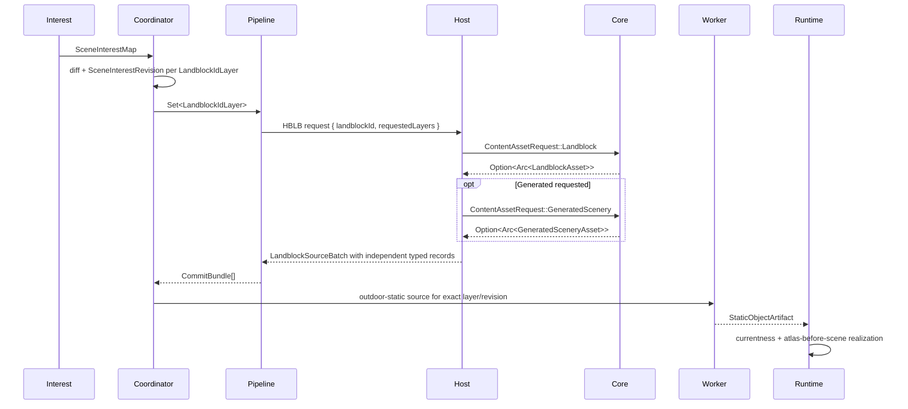
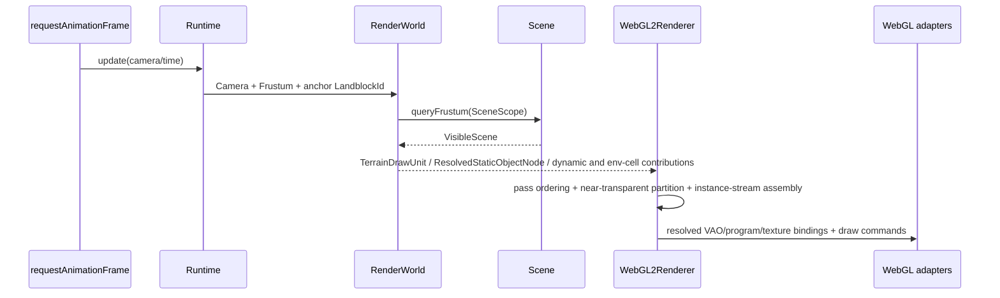

# Architectural Snapshot: holtburger-3d

_Last updated: 2026-07-27_

## 1. System Topology and Cross-Layer Import Matrix

The Tauri host acquires one cached shallow `LandblockAsset` for every outdoor request. Terrain,
Buildings, and Objects are projections of that foundation. Generated scenery triggers the
separate canonical generated resolution only when that exact layer is requested. The HBLB
envelope is an app-local transport and validation boundary; it never becomes runtime ownership.

| Layer                   | May import                                                | Must not own                                         |
| ----------------------- | --------------------------------------------------------- | ---------------------------------------------------- |
| `holtburger-content`    | DAT and common source-domain types                        | Renderer geometry, app layer selection, HBLB records |
| `src-tauri` host        | content/core assets, app-local geometry and serialization | browser revisions, scene nodes, draw policy          |
| `src/lib/assets`        | wire decoders and source adapters                         | scene mutation or WebGL resources                    |
| `src/lib/game/commit`   | typed source-to-artifact preparation                      | host loading policy or scene currentness             |
| `src/lib/game/runtime`  | interest revisions, currentness, realization sequencing   | binary transport layouts or raw WebGL handles        |
| `src/lib/game/systems`  | typed scene/resource ownership                            | source transport or interest-radius policy           |
| `src/lib/game/renderer` | visible draw assembly and WebGL execution                 | content discovery or scene mutation authority        |
| explorer/routes         | UX and interest selection                                 | DAT interpretation or renderer resource ownership    |

Current search evidence keeps `WebGL2RenderingContext` inside `game/renderer`. The active Tauri
path does not import content-prepared triangles, bounds, BVHs, or diagnostic ledgers.

## 2. Load-Bearing Architectural Bones Radar

| Bone                                                               | Invariant owned                                                                         | Refresher                                                                                                                           |
| ------------------------------------------------------------------ | --------------------------------------------------------------------------------------- | ----------------------------------------------------------------------------------------------------------------------------------- |
| `src-tauri/src/landblock_source_batch.rs`                          | One shallow foundation per landblock acquisition; deep generated fanout only on request | Converts canonical content assets into exact requested app-layer projections. Env cells remain a separate future capability.        |
| `src-tauri/src/outdoor_static_source.rs` and `gfx_obj_geometry.rs` | Presentation source closure is app-local                                                | Resolve GfxObj/SetupModel source facts, materials, triangulation, and geometry bounds without pushing renderer policy into content. |
| `src/lib/game/resolution/presentation.ts`                          | Runtime presentation transforms and bounds are browser-owned                            | Compose the hierarchy once and share it between conservative bounds and static geometry preparation.                                |
| `src/lib/game/runtime/scene-interest-commit-coordinator.ts`        | Only the current layer revision may publish                                             | Groups new layers by landblock, but tracks currentness, failure, unavailability, and eviction independently per layer.              |
| `src/lib/game/commit/pipeline.ts`                                  | HBLB batches fan out immediately into typed independent commits                         | Validates record identity/kind and prevents the transport envelope from becoming a runtime owner.                                   |
| `src/lib/game/runtime/static-layer-realizer.ts`                    | Atlas claims become active before exact scene publication                               | Preserves owner/revision isolation while allowing shared physical texture residency.                                                |
| `src/lib/game/renderer/render-world.ts`                            | Renderer reads typed system state without mutating it                                   | Resolves visible scene contributions into backend resource keys behind narrow read-only ports.                                      |

## 3. Core Execution Loops

### Landblock commit and state mutation

### Render frame assembly and device execution

## 4. Source Tree and Module Placement Audit

- `gfx_obj_geometry.rs` is correctly app-local: it prepares the geometry serialized by this
  frontend and does not belong in shared content.
- Canonical terrain height resolution now occurs in content. The browser
  `active-region-terrain-resolver.ts` consumes resolved heights and retains only presentation
  material lookup.
- `game/terrain/active-region-terrain-resolver.ts` imports the source-facing
  `assets/active-region-source` type. This is a minor directionality smell: if another frontend
  appears, the shared region presentation input should move to a game-level type rather than
  allowing more asset-adapter types to flow inward.
- `src-tauri/src/lib.rs` remains a broad command/serialization composition module. The dedicated
  landblock and object-source modules contain the new work, so this cleanup did not expand that
  hub, but it remains the clearest future module-split candidate.
- Browser `EnvCellSystem` and related render types are dormant forward structure; the active
  source/commit path still has no env-cell materialization capability. They must not dictate the
  canonical content interior shape.

## 5. Cyclomatic and Structural Complexity Hotspots

Branch-keyword counts are a coarse file-level proxy, not per-function McCabe scores.

| File                                      | Lines | Branch proxy | Assessment                                                                                                                  |
| ----------------------------------------- | ----: | -----------: | --------------------------------------------------------------------------------------------------------------------------- |
| `renderer/webgl2-renderer.ts`             | 1,316 |           62 | Expected backend complexity, but pass assembly and binding transitions should continue moving behind focused helpers.       |
| `commit/static-object-geometry-worker.ts` | 1,035 |           69 | Highest policy density; baked/instanced partitioning, transparency, and geometry assembly need careful review when changed. |
| `runtime/game-runtime.ts`                 |   997 |           41 | Genuine orchestration hub; keep new source policy out and continue delegating realization.                                  |
| `src-tauri/src/lib.rs`                    | 1,316 |           32 | Oversized composition/serialization hub; split by command family when next touched.                                         |
| `src-tauri/src/outdoor_static_source.rs`  |   793 |           44 | Cohesive but large presentation closure; hierarchy and material projection are the likely extraction seams.                 |

No new nested fallback or error-swallowing path was introduced by the content-boundary cutover.
Host assembly errors reject the request; only absent CellLandblock becomes layer unavailability.

## 6. Module Coupling and Structural Hubs

- `GameRuntime` has high fan-in because it is the composition root for scene, systems, textures,
  renderer-facing state, and commit callbacks. Its authority is legitimate, but feature-specific
  branching should remain delegated to systems/realizers.
- `commit/artifacts.ts` and `game-types.ts` are high fan-in type hubs. Keep them declarative; adding
  policy there would produce a broad change cascade.
- `webgl2-renderer.ts` has high fan-out across scene contributions, terrain, static resources,
  textures, and device programs. `RenderWorld` is the important containment seam preventing those
  dependencies from leaking back into runtime mutation.
- `src-tauri/src/lib.rs` has high fan-out across commands, content assets, source serialization,
  textures, and Tauri state. It is acyclic today but structurally expensive to review.
- No circular dependency was found between asset adapters, commit preparation, runtime ownership,
  scene systems, and renderer execution.

## 7. Leaky Abstractions and Terminology Honesty

- The old shared `Prepared*`, `LandblockOutdoorAsset`, and `StaticOutdoorScene` vocabulary has been
  removed from active crates. `PreparedStaticSource` in the browser geometry worker is an
  app-internal transient value and does not claim to be canonical content.
- `LoadedLandblockSourceBatch` is honest: it is an app-local projection with explicit
  requested/unrequested state, not a canonical aggregate asset.
- `ContentAssetRequest::GeneratedScenery` names a canonical deep resolution; it is not hidden
  behind a generic landblock load.
- WebGL handles remain behind renderer/resource-manager types. Scene, runtime, and commit artifacts
  carry logical keys rather than driver objects.
- Source and commit failures remain ephemeral availability events rather than successful artifact
  diagnostics.

## 8. Competing State and Policy Drift

- Layer currentness has one authority:
  `SceneInterestCommitCoordinator.#layerRevisions`. Runtime systems consume accepted callbacks and
  do not recreate request-currentness maps.
- The shallow landblock foundation has one host-side authority:
  `ContentAssetService` caches by normalized landblock ID. Generated requests reacquire that same
  `Arc`; Tauri does not reconstruct CellLandblock/LandblockInfo joins.
- Terrain heights have one canonical authority in `LandblockTerrain.heights`. The browser no
  longer repeats RegionDesc height-table lookup.
- Runtime ownership remains per layer even though acquisition is grouped per landblock. Shared
  atlas pages are physical residency, not competing logical ownership.
- Transparency partitioning and draw batching remain renderer policy. Neither content nor Tauri
  serializes draw ranges or visibility structures.

## 9. Structural File Size and Candidate Pruning

Completed in this boundary cleanup:

- removed the filtered prepared-outdoor and single-EnvCell content APIs;
- removed content-owned triangulation, aperture, bounds, and BVH products;
- removed durable source-attempt/candidate diagnostics;
- removed render-evidence harnesses that existed only to support the deleted contracts; and
- moved the surviving generated resolver into an honestly named canonical module.

Future candidates, in priority order:

1. Split `src-tauri/src/lib.rs` by command/serialization family without changing public Tauri
   commands.
2. Separate pass scheduling from device command execution in `webgl2-renderer.ts` when measured
   renderer work next requires changes.
3. Split the static geometry worker by resident classification, geometry assembly, and
   transparency ordering only if those seams remain stateless and testable.
4. Revisit the game-to-assets type import for active-region terrain presentation.

These are review targets, not authorization for opportunistic refactors in unrelated work.
