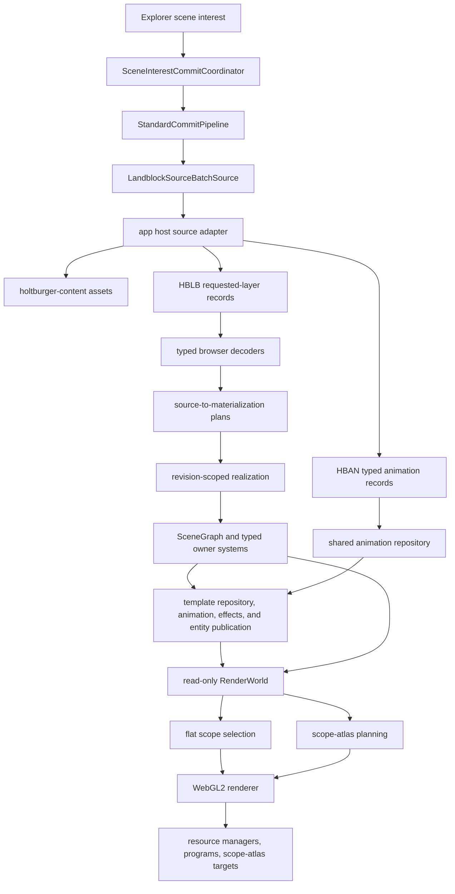
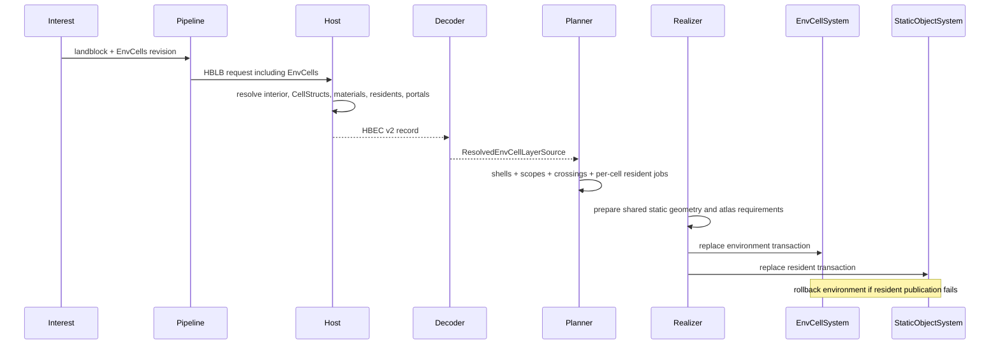

# Architectural Snapshot: holtburger-3d

_Last updated: 2026-08-25_

## Tech Lead North Stars

- Keep canonical DAT discovery and joins in shared content code while keeping frontend
  presentation projection app-local.
- Acquire each landblock once per request, but publish and evict its requested layers
  independently.
- Preserve authored environment-cell geometry, topology, containment, and residency facts without
  letting renderer policy leak back into the scene.
- Reuse one static material, texture, atlas, geometry, and draw path across outdoor objects,
  environment shells, and environment-cell residents.
- Keep one staged dynamic presentation runtime: immutable templates own geometry and atlas residency;
  animation owns semantic traversal and smooth rigid-part sampling; effects own persistent visual
  state; entity publication applies the complete sample.
- Keep Explorer free-camera policy in the explorer. Shared frontend camera code owns only semantic
  possession orbit/zoom, host-boom lifecycle, path presentation, and projection acknowledgement;
  the host owns physical placement and motion paths.
- Make portal rendering correct by construction: fixed-capacity scope-window traversal, path-free
  arrival propagation, one packed tile per selected authored scope, and deferred scope envelopes.

## 1. Current System Shape

`LandblockSourceBatchSource` is an app-local acquisition capability, not an outdoor scene type. It
accepts the complete requested layer set for one landblock and returns independently decoded
Terrain, Buildings, Objects, Generated, and EnvCells records. The host loads one shallow
`LandblockAsset`; only explicitly requested deep products such as generated scenery and the
interior system are resolved.

The HBLB envelope groups transport only. Each record retains its own availability, decoder,
commit, revision, owner, publication, and eviction lifecycle.

## 2. Load-Bearing Bones

| Boundary                                              | Owned invariant                                                                                                                                         |
| ----------------------------------------------------- | ------------------------------------------------------------------------------------------------------------------------------------------------------- |
| `host/src/landblock_source_batch.rs`                  | One cumulative, requested-layer host acquisition with explicit requested/unrequested projections.                                                       |
| `host/src/env_cell_source.rs`                         | HBEC v2 projection of CellStruct shells, materials, residents, containment, authored apertures, effective visibility apertures, and directed crossings. |
| `host/src/cell_struct_projection.rs`                  | One generalized polygon projection for visible sides, material-free apertures, and the normalized positive-child Cell BSP containment chain.            |
| `src/lib/assets/decode-env-cell-record.ts`            | Strict, versioned, independently decodable browser boundary; malformed identity, ranges, topology, or geometry fail loudly.                             |
| `game/commit/env-cell-materialization.ts`             | Renderer-neutral shell, scope, aperture, crossing, and per-cell resident work; no scene or GPU ownership.                                               |
| `game/runtime/static-layer-realizer.ts`               | Revision currentness, geometry/atlas rendezvous, publication ordering, and stale-work withdrawal.                                                       |
| `game/runtime/env-cell-realization.ts`                | Reuses the static preparer for residents, builds proof-backed visibility islands, and creates one environment artifact.                                 |
| `game/systems/env-cell-system.ts`                     | Failure-atomic ownership of scopes, crossings, shell nodes, aperture geometry, and rollback.                                                            |
| `game/systems/dynamic-entity-system.ts`               | Owner-atomic dynamic trees, staged activation, complete presentation publication, rigid-part contributions, and static visual fallback.                 |
| `game/systems/object-visual-template-repository.ts`   | Content-addressed immutable preparation plus staged geometry and atlas residency shared across dynamic owners.                                          |
| `game/systems/animation-system.ts`                    | Independent deterministic playback clocks, retail semantic traversal, discontinuity handling, and fractional rigid-pose sampling.                       |
| `game/systems/effect-system.ts`                       | Persistent `SetOmega` and per-part translucency state, deterministic timelines, bounded provenance, and fractional effect sampling.                     |
| `game/scene/scene-graph.ts`                           | Scene transforms, scope-partitioned culling groups, exact point containment, directed portal traces, and immutable topology views.                      |
| `game/renderer/render-world.ts`                       | Read-only bridge from typed runtime systems to renderer resource keys and contributions.                                                                |
| `game/renderer/portal-view-window.ts`                 | Readable exact normalized window construction, convex source decomposition, projection, clipping, and immutable proof admission.                        |
| `game/renderer/portal-scope-window-culler.ts`         | Fixed-capacity, arena-backed breadth-first traversal with atomic whole-frontier cutoff and reusable non-retained frame views.                           |
| `game/renderer/portal-scope-atlas-planner.ts`         | Conservative scope-tile packing, arrival metadata, bounded propagation depth, and mechanical GPU command counts.                                        |
| `game/renderer/webgl2-portal-scope-atlas-executor.ts` | Batched arrival propagation, authored-scope envelope reduction, and opaque resolve without CPU path reconstruction.                                     |
| `game/renderer/webgl2-portal-scope-atlas-targets.ts`  | Transactional ownership of the packed scene atlas, R8UI frontier planes, depth planes, scope envelopes, and framebuffers.                               |

## 3. Environment-Cell Source and Ownership Flow

CellStruct geometry is reusable across cells, but material selection and placement are cell-owned.
Shells therefore share logical geometry keys while retaining independent material ranges,
landblock-space transforms, bounds, and EnvCell scope identity.

Every environment-cell static resident enters the same classifier, material planner, worker,
texture dependency collector, atlas, geometry manager, static object system, and renderer used by
outdoor static residents. Jobs are partitioned by EnvCell before batching, so no baked node,
instance stream, transparent population, or draw contribution spans scopes. Default-animated
residents are promoted to the authored dynamic path while script-only residents retain valid static
presentation for the effects plan.

Publication is failure-atomic across the environment and its residents. Geometry and atlas work
may prepare concurrently, but only a current scene-interest revision can publish. Stale work
withdraws its atlas claim and cannot become authoritative scene state.

## 4. Authored Dynamic Presentation

Setup-backed residents with a default animation **or a default physics script** leave static baking
but retain their authored root placement and scope. That mirrors retail, which enrols a static object
as animating for either (`CPhysicsObj::InitDefaults` sets state bit `0x40000` or `0x80000`), so a
script-only resident is promoted for the same reason an animated one is; it simply has no playback. One appearance key owns a shared visual template; one animation ID owns a
shared immutable prepared clip. Entity identity appears only in mutable playback, effect state,
articulated pose data, and root ownership. `ObjectVisualTemplateRepository` stages the template's
immutable preparation, indexed geometry, exact material ranges, and atlas residency as one lifecycle.
Dynamic textures therefore do not depend on the containing static-layer atlas revision. Dynamic parts
enter the same frame-streamed object arena as static transparent and compatible opaque/cutout
contributions.

Animation preparation and template preparation settle together behind the owner generation. The
runtime validates part coverage and computes conservative bounds by sweeping every rigid animation
frame through the same retail-shaped transform used by static baking and dynamic rendering. A
`SetOmega` clip expands that sweep to a rotation-invariant envelope. Visibility is published only
after initial independent phase, persistent effect state, articulated pose, resources, and bounds are
complete.
Structural or unknown visual hooks keep a valid resting presentation with provenance rather than
activating partial behavior.

### Two behavior producers, one command union

Animation and physics scripts are **two independent clocks dispatching the same authored hook
vocabulary**. Both compile into one `PreparedBehaviorCommand` union and carry their own provenance
beside it, so neither producer owns a command shape. `BehaviorEventRouter` sits at that cut: it
routes each command to its consumer synchronously, records exactly one outcome with full provenance,
and owns no clocks, queues, state, or resources. Producers arrive already knowing _when_ a command
runs; the router decides only where it goes and what happened.

Every dispatch target is a `(nodeId, generation)` pair checked before each dispatch, because node ids
are recycled and a queued command must never land on a successor.

`PhysicsScriptSystem` owns per-entity wall-clock script timing — retail anchors record times to
`Timer::cur_time` and never sub-steps them, so it does not borrow the animation lane's fixed step. An
immediately chained `CallPES` starts its target at the caller's authored end rather than the current
clock, which is what makes a self-calling script repeat at exactly its authored length with zero
drift; a nonzero pause instead rolls a uniform delay. Catch-up and runaway share one per-entity
dispatch budget whose exhaustion resynchronizes the entity and reports it, rather than silently
discarding elapsed time the way retail's two-second cliff does. Statics run scripts before animation
each frame, matching `animate_static_object`.

`ParticleSystem` schedules and reaps but never integrates: particle motion is closed form in elapsed
time, so a live particle is spawn constants plus a birth time, and a dedicated vertex stage evaluates
its trajectory on the GPU. Emitters cull at emitter granularity against a preparation-time envelope
and cost nothing per frame while hidden — the suspended interval is reconciled once on return.
`AudioSystem` plays one-shot voices whose spatial parameters are computed once at trigger time and
never updated; voices deliberately outlive their emitting owner, matching retail's fire-and-forget
copies.

Every behavior asset a resident can reach — script closure, emitter definitions, sound table,
particle meshes — is staged before activation, and every frame-time lookup returns `null` for an
unstaged asset rather than starting a load. Frame-time IO is structurally impossible rather than
merely avoided.

`AnimationSystem` advances semantic playback and hooks at 30 Hz and rebases gaps above two seconds.
Visual sampling is a separate explicit operation over authoritative node IDs. The runtime samples
roots selected by the previous completed renderer frame at render cadence and samples other active
roots at a 100 ms product interval; zero remains the exact full-cadence baseline. `EffectSystem` is a
pure consumer: it owns persistent visual state — axis-angle visual-root rotation, whole-object scale,
and per-part translucency on the semantic clock — while its _lifetime_ belongs to the entity, not to
playback, because a script-only resident has effect state and no animation at all. A dispatch-only hook system and pass-through pose system
do not exist.

`DynamicEntitySystem` publishes each complete articulated-pose-plus-effect sample together with a
conservative bound for that exact published presentation. The stable scene-graph bound remains the
animation-wide envelope used for spatial membership; the presentation bound is renderer-facing and
changes only when the pose changes. Static-default position frames remain prepared but unused,
matching retail's null-root-offset path.

Full part translucency suppresses the draw. Partial translucency reclassifies that part into
transparent submission, carries instance alpha without widening the persistent instance record, and
uses stable transparent ordering. Effect teardown and owner replacement clear persistent ramps,
rotation, and per-part state before an identity can be reused.

This section describes a runtime that now serves both authored and spawned dynamic entities. The
authored effects runtime — scripts, particles, and audio — is complete, and spawned entities reuse
it through one source-neutral presentation input rather than a second dynamic system.

A spawned entity enters through an app-local Explorer registry above the host simulation's own
`SpatialScene`, crosses the narrow sidecar event boundary as one focused `DynamicEntityView`, and is realized by
the same template repository, animation system, effect dispatcher, and renderer path the authored
layer uses. The frontend mirror hydrates on mount or explicit reset by registering its listener and
then requesting one current-state snapshot; there is no replay, acknowledgement, or
renderer-recovery protocol. Solver output owns the entity root: the placement system evaluates
accepted sparse paths at render cadence, while animation and effects write visual-root and part
state only. No second dynamic system, stateful feed projector, or frontend placement authority
exists.

## 5. Scene Graph and Spatial Queries

All root transforms are landblock-local. A root carries `landblockId`, optional `envCellId`, and a
local-to-landblock transform; children inherit the root residency and compose transforms exactly
once. Environment shells are roots in their EnvCell scope. Resident nodes are also landblock-space
roots produced by the shared static system, avoiding a second CellStruct transform.

The spatial index is organized by:

1. scene scope;
2. root landblock coordinate frame;
3. producer-owned culling group; and
4. exact node bounds.

Environment shells use `env-cell-shell`; static residents use the EnvCells layer group. A query
first rejects an aggregate group AABB and then tests each member AABB. Flat and portal modes share
this exact spatial selection; only their chosen scope sets differ.

After this stable broad phase, the renderer may reject an independently optional presentation whose
conservative projected drawing-buffer footprint is below the configured object threshold. Generated
opaque and cutout streams apply the same fidelity setting per instance; buildings, explicit objects,
EnvCell residents, and anchored authored dynamics apply it per atomic presentation root before
contribution expansion. Terrain, EnvCell shells, generated transparent/additive streams, and future
runtime-authored actors are explicitly ineligible. Near-plane-straddling bounds remain retained.

The runtime exposes two frontend placement-query contracts:

- `queryWorldPointResidencyCandidates` returns the outdoor result plus every EnvCell whose AABB is
  hit, together with its exact Cell BSP containment verdict. It preserves overlapping ambiguity.
- `queryEnvCellPointContainment` tests one caller-selected resident EnvCell.

The explorer uses candidate containment only for best-effort initial/free-fly placement. Physical
camera and future actor placement paths are solved by the host against `holtburger-world` collision
topology; frontend scene code does not maintain a second actor portal traversal. Renderer visibility
still consumes the retained directed aperture topology from an already-known placement.

Possessed third-person camera placement follows the same authority boundary without registering a
camera body. The app host advances the shared kinematic-boom controller immediately after the
possessed entity on one fixed tick, then publishes camera positions, authoritative residency, and
the controller's filtered visual pivot in one placed path. Target-seed placement and
projection-derived camera clearance are separate host inputs. Radius growth remains recoverable and
the host labels every publishable path with the exact projection revision its collision envelope
proves.

The backend-neutral possession controller under `src/lib/game/camera` owns semantic orbit/zoom,
host lifecycle, fixed-tick presentation, and the requested/acknowledged projection handshake. It
contains no DOM or Explorer mode policy. The Explorer-local input controller retains free fly,
physical fly, mode switching, and raw event routing. Render extent is prepared before camera
synchronization and committed atomically with the primary camera; possession rendering retains the
currently playing acknowledged projection/extent until a host path solved under a newer envelope is
active. The frontend performs no collision query, position prediction, containment repair, or
independent boom simulation.

## 6. Authored and Effective Apertures

An authored aperture is material-free planar triangle geometry in landblock space. It retains its
plane, accepted traversal side, bounds, source identity, and polygon provenance. The renderer uses
it for directed entry-side, junction, and topology decisions; visibility preprocessing never
replaces it.

Each directed crossing also names one effective visibility aperture:

- an exact or unresolved crossing reuses the authored source aperture;
- a non-`ExactMatch` reciprocal pair receives the coplanar geometric intersection of the two
  authored apertures; and
- the host records static provenance for the synthesized intersection.

This preprocessing occurs once at the app-local host boundary. The renderer consumes the result
directly; it does not recompute reciprocal intersections per frame. Effective apertures constrain
visibility and masks only. Physical placement and crossing remain host-owned collision concerns.

The browser realizer projects each indexed authored or synthesized aperture into one producer
object shared by its directed crossing references. `SceneGraph` retains one defensive copy per
producer object, so topology preparation can reuse aperture identity without surrendering the
scene boundary's ownership guarantee. This does not add an aperture registry or change the host
record: the weak copy association expires with its producer artifact.

Indoor reciprocal seams join one visibility island only when the host proves exact reciprocal
identity, `ExactMatch` on both sides, equivalent apertures, opposed accepted half-spaces, and cell
bounds separated by the portal plane. Any failed proof remains an explicit topology boundary.

## 7. Rendering Modes and Portal Execution

Flat mode selects outdoor plus every resident EnvCell scope, applies ordinary frustum/group/node
culling, and performs no portal planning, masks, targets, or composition. It forces single-sided
back-face culling for CellStruct shell ranges only, preserving useful bird's-eye inspection of
interiors. Static ranges retain authored DAT cull mode as provenance, but WebGL consumes the
effective front/back rejection for each side already expanded by the host.

Portal mode starts from the camera's supplied scope. The planner:

1. seeds only the camera scope with the full view window;
2. propagates exact clipped windows through source-keyed crossings;
3. crosses depth-continuous seams without masks while retaining scope-local coverage;
4. maps reached scopes to unique render domains without selecting unrelated island members;
5. records cross-domain masks before coverage subsumption;
6. assigns explicit ordinary, exterior, deferred, and additional contribution occurrences; and
7. preflights stencil capacity and a corruption-only work ceiling.

The executor consumes this schedule mechanically. It unions each contribution's masks under its
planner-owned label, resets depth only where declared, and submits the named nodes. Node identity
is unique, but contribution occurrences need not be: a root island can render ordinarily and then
again through a parent-constrained exterior-return suffix. Deferred suffix nodes are withheld by
the planner, not inferred by the executor.

CellStruct and building-aperture projection record whether each authored portal also contributes
visible source geometry. Crossings retain the resulting equal-depth mask policy through scene
topology and the render plan. Only masks sharing a visible source surface use a positive polygon
offset; material-free apertures retain unbiased `LEQUAL`, and every non-mask pass explicitly
disables the offset. Near-plane ownership-transfer masks use `ALWAYS` and carry no source-surface
depth policy.

A same-domain topology boundary remains in the renderer topology and propagates clipped scope
coverage, but produces no mask because ordinary depth already unifies its endpoint domain.
Outdoor/indoor transitions render directly into one renderer-owned full-size color plus
depth-stencil target. Exterior color and depth render once per view. The same contribution path
handles opaque, alpha-tested, transparent, and additive content. The target is lazy, extent-keyed,
retained across a switch back to flat mode, and disposed on resize or renderer destruction.

## 8. Boundary Audit

| Layer                 | May own                                                                    | Must not own                                             |
| --------------------- | -------------------------------------------------------------------------- | -------------------------------------------------------- |
| `holtburger-content`  | canonical landblock/interior joins and authored topology                   | app transport, browser geometry, portal render schedules |
| app host              | app-local projection, HBLB/HBEC encoding, effective aperture preprocessing | scene revisions, camera policy, WebGL state              |
| browser assets/commit | strict decoding and source-to-plan conversion                              | runtime currentness or GPU handles                       |
| runtime/systems       | revision ownership, scene publication, topology, logical resources         | DAT discovery or portal draw scheduling                  |
| scene graph           | transforms, scope facts, culling, containment, portal topology views       | explorer policy or stencil policy                        |
| renderer              | per-view visibility windows, graph schedule, passes, targets, device state | scene mutation or authoritative residency                |
| explorer              | free-fly controls, initial placement, render-mode UX                       | canonical topology or future client movement policy      |

No `WebGL2RenderingContext` escapes the renderer subtree. Scene and commit artifacts carry logical
geometry/texture keys, not driver objects. Host serialization carries source facts and proven
classification, not frame diagnostics or draw ordering.

HBSO and HBEC retain independent envelopes and required-section contracts while sharing one typed
Rust section writer and one TypeScript section validator/reader. Static geometry, material, and
presentation decoding lives in the neutral `decode-static-source-record.ts`; HBEC no longer
imports shared behavior through an outdoor-owned module.

## 9. Terminology and Dead-Contract Audit

- `OutdoorStaticLayerKind` remains accurate for Buildings, Objects, and Generated. EnvCells is a
  distinct static layer because it also owns shells, topology, queries, and apertures.
- `LandblockSourceBatchSource` names cumulative acquisition and is intentionally not
  outdoor-specific.
- The old first-match `queryWorldPointResidency` contract is gone; the remaining candidates API is
  ambiguity-preserving.
- The old object-only detail owner is gone. Active-region static detail owns building,
  environment, and object roles as one generation.
- Apertures have `PortalGeometryKey`/`PortalDrawUnit` resources and no textured material ranges.
- HBEC has one live version, v2. No v1 decoder or compatibility path remains.
- Paired renderer apertures, stencil labels, and domain-owned contribution schedules are absent
  from production and tests.
- `visibilityProvenance` is source-validation evidence. Runtime diagnostics aggregate the resulting
  authored/intersection counts instead of carrying provenance into every frame.
- Static texture-fact compatibility and owner-ID parsing each have one runtime implementation.
- The scope-atlas pipeline validates topology/capacity, packs complete frontiers, and prepares the
  reusable crossing stream before the WebGL executor mutates propagation targets.
- Dynamic presentation has one `ObjectVisualTemplateRepository`, one `AnimationSystem`, one
  `EffectSystem`, and one `DynamicEntitySystem`. There is no `EntityTemplateCache`, `HookSystem`, or
  `PoseSystem` compatibility path.

## 10. Complexity, Debt, and Pruning Targets

Current large-file concentration:

| File                                     | Approx. lines | Assessment                                                                                                                                                                                |
| ---------------------------------------- | ------------: | ----------------------------------------------------------------------------------------------------------------------------------------------------------------------------------------- |
| `renderer/webgl2-renderer.ts`            |         2,945 | Largest active debt. Contribution assembly, frame metrics, scope routing, and device drawing are coherent but crowded. Extract a measured seam before adding another rendering subsystem. |
| `host/src/env_cell_source.rs`            |         1,446 | Large but cohesive source projection. Binary-section encoding is now shared; visibility preprocessing is the clearest future split if the format evolves.                                 |
| `host/src/lib.rs`                        |         2,177 | Broad app-host composition hub; split by command family when next materially touched.                                                                                                     |
| `runtime/game-runtime.ts`                |         2,053 | Legitimate composition root. Typed owner parsing and texture merging are delegated; keep feature policy in planners, realizers, and systems.                                              |
| `assets/decode-env-cell-record.ts`       |         1,141 | Strict semantic validation remains dense after shared binary-section and static-presentation decoding were extracted.                                                                     |
| `renderer/portal-scope-window-culler.ts` |         1,058 | Packed zero-record camera-time traversal. Keep it differentially paired with the immutable reference and do not add object-shaped frame state.                                            |
| `renderer/portal-view-window.ts`         |         1,287 | Readable exact geometry/proof path. It may allocate because production uses the arena kernel; preserve differential corpora when changing either implementation.                          |

There is no evidence-backed duplicate material or portal renderer to delete. The main risk is
future accretion into the renderer and host serializer hubs. The correct next refactor trigger is a
new responsibility or measured review burden, not line count alone.

Known concessions:

- Flat mode intentionally renders all resident EnvCells, so it is an inspection mode rather than a
  scalable gameplay visibility policy.
- Same-island topology boundaries remain query-visible and propagate clipped scope reachability;
  each reached authored scope still receives its own visibility envelope and packed tile.
- Portal targets remain allocated after returning to flat mode to make mode changes cheap. They
  are transactionally replaced on resize, released on destroy, and their bytes are reported.
- Explorer residency is best effort and has no portal-crossing history. That is correct for the
  explorer and deliberately insufficient for a future authoritative client controller.

## 11. Verification Posture

Pure geometry, containment, topology, portal-window, graph, and executor contracts use synthetic
fixtures that require no local DAT/HBA archives. Archive-backed source and browser checks remain
opt-in diagnostic coverage. Frame metrics are consumed by the explorer, harness assertions, or
this audit; unused ceremonial fields are not retained.
