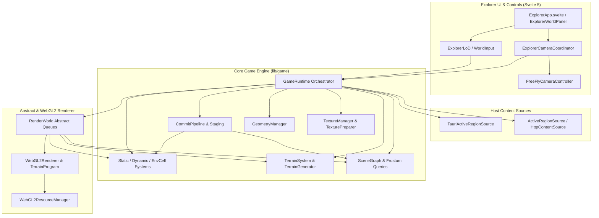
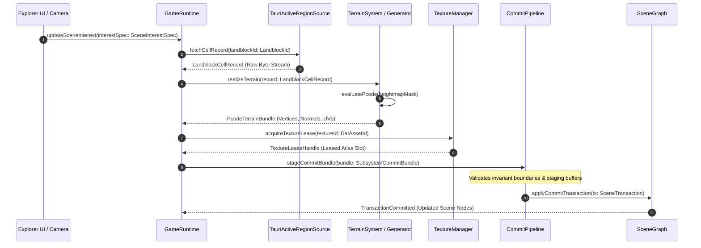

# Architectural Snapshot: holtburger-3d

_Last Updated: 2026-07-24_

## Table of Contents

1. [Subsystem Topology & Cross-Layer Import Matrix](#1-subsystem-topology--cross-layer-import-matrix)
2. [Core Execution Loop Sequence Diagrams (Typed Data Flows)](#2-core-execution-loop-sequence-diagrams-typed-data-flows)
3. [Source Tree & Module Placement Audit](#3-source-tree--module-placement-audit)
4. [Cyclomatic Complexity & Nesting Hotspots](#4-cyclomatic-complexity--nesting-hotspots)
5. [Module Coupling Matrix (Fan-In / Fan-Out)](#5-module-coupling-matrix-fan-in--fan-out)
6. [Boundary Leaks & State Ownership](#6-boundary-leaks--state-ownership)
7. [Structural File Size & Candidate Pruning](#7-structural-file-size--candidate-pruning)

---

## 1. Subsystem Topology & Cross-Layer Import Matrix

### Subsystem Architecture Diagram



### Cross-Layer Import Matrix

| Module Category | `app/explorer` (UI) | `lib/assets` (Host) | `lib/game/*` (Engine) | `renderer/webgl2-*` (Driver) |
| :--- | :--- | :--- | :--- | :--- |
| **`app/explorer`** | Internal | Imports Sources | Imports Runtime | No Direct Imports (Clean) |
| **`lib/assets`** | No Imports | Internal | Imports Primitives | No Direct Imports (Clean) |
| **`lib/game/*`** | No Imports | Imports Contracts | Internal | Imports Abstractions |
| **`renderer/webgl2-*`** | No Imports | No Imports | Imports Engine Types | Internal GL Driver |

---

## 2. Core Execution Loop Sequence Diagrams (Typed Data Flows)

### Pipeline Sequence 1: Content Streaming & State Commit Pipeline



### Pipeline Sequence 2: Render Frame Assembly & Hardware Execution Loop

```mermaid
sequenceDiagram
    autonumber
    participant Loop as rAF / ExplorerApp
    participant CamCoord as ExplorerCameraCoordinator
    participant Runtime as GameRuntime
    participant RenderWorld as RenderWorld
    participant Scene as SceneGraph
    participant GLRenderer as WebGL2Renderer
    participant GLResMgr as WebGL2ResourceManager

    Loop->>CamCoord: updateCamera(deltaTimeMs: number)
    CamCoord->>Runtime: setCameraPose(pose: CameraPose)
    
    Loop->>Runtime: renderFrame()
    Runtime->>RenderWorld: beginFrameAssembly(cameraPose: CameraPose)
    
    RenderWorld->>Scene: queryFrustum(frustumPlanes: FrustumPlanes)
    Scene-->>RenderWorld: VisibleNodesArray (Filtered Node Slices)

    RenderWorld->>RenderWorld: assembleDrawUnits(nodes: VisibleNodesArray)
    Note over RenderWorld: Produces TerrainDrawUnit & StaticObjectDrawUnit queues

    Runtime->>GLRenderer: executeDrawPass(world: RenderWorld)
    
    GLRenderer->>GLResMgr: acquireGLBindings(drawUnit: TerrainDrawUnit)
    GLResMgr-->>GLRenderer: WebGL2GeometryBinding (VAO Handle, ShaderProgram)
    
    GLRenderer->>GLRenderer: bindUniforms(matrixScratch: Mat4, cameraPose)
    GLRenderer->>GLRenderer: gl.drawElementsInstanced / drawArrays
    GLRenderer-->>Loop: Frame Complete
```

---

## 3. Source Tree & Module Placement Audit

> [!WARNING]
> **Misplaced Domain Math**: `src/explorer/explorer-lod.ts`
> * **Observation**: Contains both outdoor Chebyshev radius clamping math (`updateExplorerLodRadius`) and UI slider text formatting (`formatExplorerLodRadius`). Per `AGENTS.md`, shared domain semantics belong in `lib/game`, while frontend presentation belongs in `explorer`.
> * **Recommendation**: Split into `src/lib/game/runtime/lod-policy.ts` (domain interest clamping math) and `src/explorer/explorer-lod-ui.ts` (UI presentation text formatting).

> [!NOTE]
> **Clean Placement**: `src/explorer/world-input.ts`
> Pointer and key gesture mapping is correctly confined to `src/explorer/` as Explorer-mode UI viewport logic.

> [!NOTE]
> **Clean Placement**: `src/lib/assets/*`
> Static DAT asset parsers (`decode-texture-pixels.ts`, `decode-terrain-source.ts`) and Tauri IPC adapters (`tauri-active-region-source.ts`) stay strictly within `lib/assets/` without domain runtime pollution.

---

## 4. Cyclomatic Complexity & Nesting Hotspots

### High Cyclomatic Complexity (>10 Branches)

| Function / Location | Branch Complexity | Nesting Depth | Smell Description |
| :--- | :--- | :--- | :--- |
| `src/lib/assets/decode-texture-pixels.ts:139` (`parseManifest`) | **11 branches** | Depth 4 | Multi-format texture header signature decoding ladder |
| `src/lib/assets/decode-terrain-source.ts:115` (`parseManifest`) | **10 branches** | Depth 4 | Landblock heightmap & transition flag decoder |
| `src/lib/game/textures/types.ts:201` (`texturePurposePolicy`) | **10 branches** | Depth 3 | Multi-branch switch evaluating format policy |
| `src/lib/game/terrain/terrain-generator.ts:158` (`#generateSurfaceMesh`) | **10 branches** | Depth 5 | Edge transition blending & PCODE field mask calculation |

### Deep Nesting Outliers (Nesting Depth > 4)

| Location | Nesting Depth | Smell Description |
| :--- | :--- | :--- |
| `src/explorer/ExplorerTools.svelte:132` | **Depth 8** | Nested Svelte 5 control panels and reactive blocks |
| `src/lib/game/renderer/webgl2-renderer.ts:190` | **Depth 7** | Multi-pass render loop with state toggles & VAO binds |
| `src/lib/game/scene/scene-graph.ts:178` | **Depth 6** | Recursive spatial tree culling and frustum containment checks |
| `src/lib/game/runtime/game-runtime.ts:469` | **Depth 6** | Multi-subsystem interest delta processing and scene residency cleanup |

---

## 5. Module Coupling Matrix (Fan-In / Fan-Out)

### Top Fan-Out Modules (God Module Risk)

| Module Path | Outbound Imports | Risk Assessment |
| :--- | :--- | :--- |
| `src/lib/game/runtime/game-runtime.ts` | **28 imports** | Central orchestrator - candidate for interest cleanup split |
| `src/explorer/ExplorerApp.svelte` | **15 imports** | Top-level UI shell importing all Explorer controls & runtime |
| `src/lib/game/terrain/terrain-system.ts` | **14 imports** | Surface caching & generator/texture manager orchestrator |

### Top Fan-In Modules (High Cascade Risk)

| Module Path | Inbound Callers | Cascade Risk |
| :--- | :--- | :--- |
| `src/lib/game/math/types.ts` | **16 callers** | Core vector/matrix math types used across all layers |
| `src/lib/game/game-types.ts` | **12 callers** | Core domain primitives (`LandblockId`, `DatAssetId`) |
| `src/lib/game/landblocks.ts` | **10 callers** | Landblock coordinate conversions and world metrics |

---

## 6. Boundary Leaks & State Ownership

> [!NOTE]
> **Strict Driver Isolation**: Raw WebGL types (`WebGL2RenderingContext`, `WebGLVertexArrayObject`, `WebGLTexture`) are strictly confined to `src/lib/game/renderer/webgl2-*`. Zero leaks detected in domain math or UI files.

> [!WARNING]
> **Review Item**: `WebGL2ResourceManager` exports internal binding interfaces (`WebGL2GeometryBinding`, `WebGL2Texture2DBinding`) containing raw `WebGLVertexArrayObject` and `WebGLTexture` fields. Ensure these interfaces remain private to the driver package.

---

## 7. Structural File Size Outliers & Candidate Pruning

### Structural File Size Outliers

| File Path | Line Count | Category | Refactoring Recommendation |
| :--- | :--- | :--- | :--- |
| `src/lib/game/renderer/webgl2-resource-manager.ts` | **612 lines** | Engine Driver | Split into `webgl2-geometry-store.ts` and `webgl2-texture-store.ts` |
| `src/lib/game/textures/texture-manager.ts` | **583 lines** | Engine Core | Texture materialization & atlas allocation orchestrator |
| `src/lib/game/runtime/game-runtime.ts` | **574 lines** | Engine Core | Central orchestrator - split interest cleanup if grows |
| `src/lib/game/terrain/terrain-generator.ts` | **525 lines** | Engine Core | PCODE decoding & heightmap mesh generator |
| `src/lib/game/terrain/terrain-system.ts` | **503 lines** | Engine Core | Surface caching & draw unit manager |

### Recommended Pruning & Refactoring

1. **Split `src/explorer/explorer-lod.ts`**: Separate domain LoD clamping math (`lib/game/runtime/lod-policy.ts`) from UI text formatting (`explorer/explorer-lod-ui.ts`).
2. **De-God `webgl2-resource-manager.ts`**: Candidate for future splitting into geometry and texture stores.
3. **De-God `game-runtime.ts`**: Candidate for splitting subsystem interest management and residency cleanup into a separate orchestrator helper.
