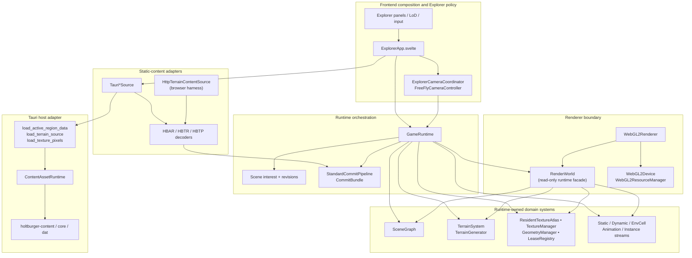
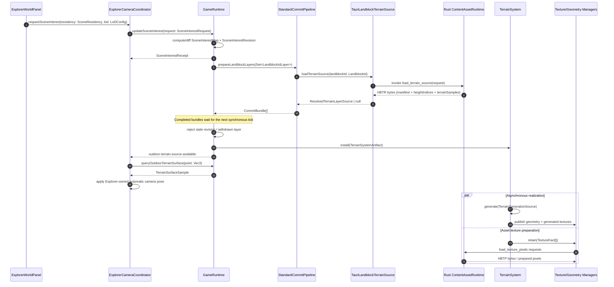

# Architectural Snapshot: holtburger-3d

_Last Updated: 2026-07-25_

## Audit Scope and Verdict

This snapshot covers authored code in `apps/holtburger-3d/src`, `src-tauri/src`,
and the app-local scripts. Generated output, dependencies, Tauri-generated
schemas, icons, and the legacy frontend are excluded from metrics.

The architecture is directionally sound for the current buildings-layer phase. Explorer
policy is app-local, the Tauri host is a narrow static-content adapter, runtime
state is hidden behind typed operations, and raw WebGL handles do not escape the
WebGL backend. Visual realization is intentionally best-effort: source
availability enables camera placement, while later texture or GPU failures are
console diagnostics rather than durable Explorer state. That policy keeps the
runtime lean during the stubbing phase.

Priority findings:

| Priority | Finding                                                       | Evidence                                                                                                                                                                             | Direction                                                                                                                                                                      |
| -------- | ------------------------------------------------------------- | ------------------------------------------------------------------------------------------------------------------------------------------------------------------------------------ | ------------------------------------------------------------------------------------------------------------------------------------------------------------------------------ |
| Medium   | `GameRuntime` remains a high fan-out composition hub          | It constructs the stateful runtime systems and owns interest revisions, async commit staging, availability publication, frame state, lifecycle diagnostics, and teardown             | Keep it as the composition authority. Building diagnostics are read-only snapshots; extract further receipt coordination before adding another independent static layer branch |
| Medium   | The Rust host boundary is concentrated in one 1,245-line file | `src-tauri/src/lib.rs` contains host state, commands, three binary contracts, active-region projection, serializers, and tests                                                       | Split by transport contract (`active_region`, `terrain_source`, `texture_pixels`) while keeping Tauri command registration in `lib.rs`                                         |
| Low      | Vestigial public lifecycle and mutation stubs exist           | `StandardCommitPipeline.build()` is needlessly async, `destroy()` is a no-op outside its interface, and unused `GameRuntime.updateDynamicEntityPlacement()` silently returns `false` | Delete inert API until ownership or behavior exists; add it back with a typed contract when the capability is implemented                                                      |
| Low      | Repository-wide Prettier baseline is stale                    | The final `prettier --check .` reports 18 unrelated pre-existing files; every atlas/architecture file touched by this work was formatted and rechecked                               | Restore a repository formatting baseline in a dedicated mechanical change; do not mix it into feature work                                                                     |

## 1. System Topology and Cross-Layer Import Matrix



The browser and Tauri paths converge on the same TypeScript decoders. The
headless browser harness also reuses the Rust byte-producing functions through
`dev_terrain_content_host`, so the diagnostic path exercises the real binary
contracts rather than a second fixture implementation.

| Importing layer                                                        | May depend on                                                                      | Must not depend on                                              | Current result                                                                  |
| ---------------------------------------------------------------------- | ---------------------------------------------------------------------------------- | --------------------------------------------------------------- | ------------------------------------------------------------------------------- |
| `client`, `explorer`, `harness`, `app`                                 | App composition, runtime public surface, source adapters, frontend policy          | Raw WebGL handles; Rust crate internals                         | Clean; `ExplorerApp` imports `WebGL2Device` only as the composition root        |
| `lib/assets`                                                           | Host transport APIs, decoders, source ports, resolved source types                 | Runtime stateful systems; renderer driver                       | Mostly clean; source ports and game preparation types form one type-only cycle  |
| `lib/game/commit`                                                      | Neutral source and commit artifacts                                                | Concrete stateful system classes or system-owned install shapes | Clean; `commit/artifacts.ts` owns data-only layer artifacts consumed by systems |
| `lib/game/runtime`                                                     | Commit port, domain systems, renderer abstractions, source ports                   | Svelte/Explorer policy; raw WebGL                               | Clean direction, but highest fan-out                                            |
| Domain systems (`scene`, `terrain`, `textures`, `geometry`, `systems`) | Domain primitives, renderer resource interface                                     | Svelte/Tauri; raw WebGL                                         | Clean; systems own mutable state and consume commit artifacts                   |
| `renderer/render-world` and abstract renderer types                    | Read-only domain query ports and opaque resource keys                              | Runtime mutation APIs                                           | Clean                                                                           |
| `renderer/webgl2-*`                                                    | Renderer contracts and browser WebGL API                                           | Svelte, Tauri, static-content decoding                          | Clean; all raw driver handles are confined here                                 |
| `src-tauri`                                                            | `holtburger-content`, `holtburger-core`, `holtburger-dat`, serialization and Tauri | Frontend presentation or runtime scene policy                   | Clean crate direction; file-level cohesion needs work                           |

Two source-level strongly connected components exist when type-only imports are
included:

1. `scene/index.ts` ↔ `scene-graph.ts` / `scope.ts` / `utils.ts`, caused by the
   scene barrel importing the implementation while implementation files import
   types from the barrel.
2. `texture-manager.ts` ↔ `texture-preparer.ts` ↔
   `assets/texture-pixel-source.ts`, caused by preparation ports and prepared
   result types living on both sides of the boundary.

They currently erase from emitted JavaScript, so there is no runtime module
cycle. Both remaining cycles are type-placement debt, not ownership inversions.

## 2. Load-Bearing Architectural Bones Radar

| Bone                                  | Files                                                                                                             | Invariant owned                                                                                                                                            | Anatomical refresher                                                                                                                                                                                                           |
| ------------------------------------- | ----------------------------------------------------------------------------------------------------------------- | ---------------------------------------------------------------------------------------------------------------------------------------------------------- | ------------------------------------------------------------------------------------------------------------------------------------------------------------------------------------------------------------------------------ |
| Runtime composition and revision gate | `src/lib/game/runtime/game-runtime.ts`, `scene-interest.ts`, `scene-availability.ts`                              | Only the latest requested landblock/layer revision may commit; evicted or late artifacts cannot republish withdrawn content                                | `GameRuntime` is the mutation membrane around every runtime system. Interest revisions are the guard against stale asynchronous source responses.                                                                              |
| Canonical scene and visibility index  | `src/lib/game/scene/scene-graph.ts`, `scene/index.ts`                                                             | Every node has one transform ancestry and root residency; spatial entries and culling groups derive from that canonical graph                              | Scene queries traverse reachable scopes, then broad-phase groups, then exact entry bounds. The returned `VisibleScene` is a documented frame-scoped reused buffer.                                                             |
| Resource identity and retention       | `ownership.ts`, `geometry/geometry-manager.ts`, `textures/texture-manager.ts`, `renderer/resource-manager.ts`     | Logical keys may map to one backend resource while one or more typed owners retain them; the final dropped lease releases the device resource exactly once | Domain systems never own WebGL handles. They retain opaque resource keys through logical managers, which delegate allocation to the backend.                                                                                   |
| Resident atlas and static realization | `textures/atlas/resident-texture-atlas.ts`, `runtime/static-layer-realizer.ts`, `systems/static-object-system.ts` | Exact owner/revision claims retain logical sources; one purpose lane atomically replaces pages and bindings; static replacement precedes atlas activation  | `ResidentTextureAtlas` owns packed-texture residency and immutable page generations. `StaticLayerRealizer` coordinates exact revision readiness and failure-atomic scene publication without owning pixels or WebGL resources. |
| Terrain source-to-draw pipeline       | `terrain/terrain-system.ts`, `terrain/terrain-generator.ts`, `terrain/types.ts`, `terrain/composition-table.ts`   | One canonical terrain source produces every required stride/transition variant and stable texture identity before it can become a draw unit                | Source terrain is immediately sampleable for camera placement. Generated geometry, surface fields, composition, and asset textures converge later at `getDrawUnit()`.                                                          |
| Renderer read membrane                | `renderer/render-world.ts`, `renderer/renderer.ts`, `renderer/webgl2-renderer.ts`                                 | Renderers can select and resolve visible contributions without receiving runtime mutation authority                                                        | `RenderWorld` exposes narrow structural query ports over private runtime systems. `WebGL2Renderer` owns pass policy and turns opaque resource keys into driver bindings.                                                       |
| Host/content contract                 | `src-tauri/src/lib.rs`, `lib/assets/decode-*.ts`, `active-region-source.ts`                                       | Tauri and browser hosts emit versioned, length-checked binary envelopes whose semantic payloads are validated before entering runtime                      | Rust resolves static content through shared crates. TypeScript owns the app-specific transport decoder and converts it into frontend runtime source types.                                                                     |

The most important bones for a fast tech-lead review are `GameRuntime`,
`SceneGraph`, `TerrainSystem`, `RenderWorld`, and the Tauri/decoder boundary.
Changes to those files can alter state authority, lifetime, visibility, or the
cross-language contract even when their local diff looks small. The resident atlas and static
realizer join that review set for any buildings-layer change.

## 3. Core Execution Loops

### Scene interest, source commit, and realization



The intentional two-phase behavior is good: a canonical source can place the
camera before GPU work completes. `outdoor-terrain-source-available` means
source availability only; it deliberately does not promise render readiness.
Texture and generation failures are console diagnostics, not durable Explorer
state or availability events.

### Render frame assembly and hardware execution

```mermaid
sequenceDiagram
    autonumber
    participant RAF as requestAnimationFrame
    participant Runtime as GameRuntime
    participant Renderer as WebGL2Renderer
    participant World as RenderWorld
    participant Scene as SceneGraph
    participant Systems as Runtime systems
    participant GPU as WebGL2ResourceManager / WebGL

    RAF->>Runtime: tick()
    Runtime->>Runtime: drain CommitBundle queue; AnimationSystem.update()
    RAF->>Runtime: render(timeSeconds: number)
    Runtime->>Renderer: drawFrame(input: FrameInput)
    Renderer->>Renderer: Camera -> projection/view matrices -> Frustum
    Renderer->>World: queryVisibleScene(camera, frustum, anchorLandblockId)
    World->>Scene: queryFrustum(frustum, anchor, originScope)
    Scene-->>World: VisibleScene (reused frame-scoped buffer)
    World-->>Renderer: VisibleScene
    loop SceneNodeId
        Renderer->>World: getRenderContribution(nodeId, anchor)
        World->>Systems: resolve TerrainDrawUnit / renderable
        Systems-->>World: logical keys and draw ranges
        World-->>Renderer: resolved opaque resource keys
    end
    Renderer->>GPU: getGeometry/getTexture bindings
    GPU-->>Renderer: WebGL2GeometryBinding / texture bindings
    Renderer->>GPU: uniforms, texture binds, drawElements
```

No frontend code assembles mutable GPU submissions, and no renderer code mutates
scene residency. That separation is the strongest part of the current design.

## 4. Source Tree and Module Placement Audit

### Correct placement

- `src/explorer/explorer-lod.ts`, `world-input.ts`, camera controls, floating
  panels, frame metrics, and environment controls are correctly app-local. Their
  clamping and formatting encode Explorer UX policy, not authoritative world
  semantics.
- `src/lib/game/environment` resolves app rendering presentation from immutable
  active-region facts; Explorer only chooses day/time overrides.
- `src/lib/assets` owns Tauri/HTTP transport adapters and binary decoding.
- `src-tauri` consumes parsed shared-crate content and projects an app-specific
  transport. It does not push disk discovery or archive policy into TypeScript.
- WebGL implementation files are colocated under `renderer/webgl2-*`.
- `commit/artifacts.ts` owns static-object and env-cell layer data. Commit
  producers and renderer/system consumers share those contracts without either
  side importing a mutable system implementation.

### Placement requiring review

- Texture preparation request/result types live in
  `game/textures/texture-preparer.ts`, while the source port that transports them
  lives in `lib/assets`. Move the transport-neutral request/result contract to a
  small neutral module to remove the type cycle; keep Tauri/HTTP adapters in
  `assets`.
- `src-tauri/src/lib.rs` is the correct layer but the wrong file granularity. Its
  command shell, content projection, binary layout, and tests are independently
  coherent modules hiding in one namespace.

The large set of Knip type ignores is acceptable only as explicit stubbing debt.
Fifteen contract-heavy files suppress unused type reports. When a capability is
implemented or abandoned, remove its ignore at the same time so dead contract
shapes cannot become permanent architecture fossils.

## 5. Cyclomatic Complexity and Nesting Hotspots

Measured with ESLint's `complexity` threshold of 10 and `max-depth` threshold of
4 against current authored frontend source.

| Complexity | Symbol                                   | Assessment                                                                                                                                          |
| ---------: | ---------------------------------------- | --------------------------------------------------------------------------------------------------------------------------------------------------- |
|         27 | `validateTerrainGenerationResult`        | Cohesive invariant validation, but too many independent guarantees in one function; split by geometry, ranges, surface fields, and variant coverage |
|         25 | `applyCardinalHalfResolutionClamps`      | High-risk retail terrain math; decompose by cardinal edge only if tests preserve every direction/stride invariant                                   |
|         18 | `decodeTexturePixels`                    | Linear boundary validation more than algorithmic branching; extract envelope, manifest, and pixel-section validators                                |
|         16 | `SceneGraph.#removeSpatialEntry`         | Stateful nested-map cleanup; highest cognitive-risk scene mutation hotspot                                                                          |
|         15 | `computeSceneInterest`                   | Nested grid walk plus repeated layer policy; a table of optional layer/radius selectors would reduce branches                                       |
|         13 | `WebGL2Renderer.#drawTerrain`            | Driver state setup and draw loop are mixed                                                                                                          |
|         13 | `validateTextureArrayDescription`        | Cohesive driver-boundary validation; split capability-limit checks from shape checks                                                                |
|         12 | `FreeFlyCameraController.#applyMovement` | Linear movement, acceleration, and yaw state transitions share one frame handler                                                                    |
|         12 | `resolveSceneEnvironment`                | Selection validation and temporal interpolation share one function                                                                                  |
|         12 | `WebGL2ResourceManager.#uploadGeometry`  | Geometry-kind dispatch plus resource allocation                                                                                                     |
|         12 | `validateTexture2DUpload`                | Boundary validation; lower urgency than mutable state hotspots                                                                                      |
|         11 | `decodeActiveRegionSource`               | Boundary validation; extraction would improve contract readability                                                                                  |
|         11 | `decodeTerrainSource`                    | Boundary validation; extraction would improve contract readability                                                                                  |
|         11 | texture-pixel `parseManifest`            | Manual unknown-value narrowing is concentrated here                                                                                                 |
|         11 | `generateVariantHeights`                 | Retail terrain transformation logic; refactor only with behavioral proof                                                                            |

One depth violation was found: `SceneGraph.queryFrustum()` reaches nesting depth
5 while walking scope → landblock → culling group → entry. This loop is
algorithmically honest, but extracting group selection would make the broad- and
narrow-phase boundary easier to inspect.

Complexity should not drive design blindly. Validator branch counts are less
dangerous than mutable state transitions with the same score. The first
refactoring targets should be `#removeSpatialEntry`, resident-atlas publication, and the
async realization path—not the pure retail terrain algorithms.

## 6. Coupling and Structural Hubs

Production source import counts:

### Fan-in outliers

| Imports from production files | Module                                  | Interpretation                                            |
| ----------------------------: | --------------------------------------- | --------------------------------------------------------- |
|                            28 | `lib/game/game-types.ts`                | Stable branded identity hub                               |
|                            25 | `lib/game/math/types.ts`                | Core coordinate/math hub; changes have broad blast radius |
|                            19 | `lib/game/scene/index.ts`               | Scene contract barrel; also participates in a type cycle  |
|                            13 | `lib/game/landblocks.ts`                | Canonical landblock/world conversion hub                  |
|                            10 | `lib/game/terrain/types.ts`             | Large terrain contract surface                            |
|                             9 | `lib/game/renderer/resource-manager.ts` | Opaque device resource boundary                           |
|                             9 | `lib/game/runtime/types.ts`             | Camera and LoD contract hub                               |

### Fan-out outliers

| Distinct production modules imported | Module                                 | Interpretation                                                                       |
| -----------------------------------: | -------------------------------------- | ------------------------------------------------------------------------------------ |
|                                   27 | `lib/game/runtime/game-runtime.ts`     | God-module threshold exceeded; load-bearing orchestrator                             |
|                                   15 | `explorer/ExplorerApp.svelte`          | Composition root at the threshold; acceptable while it remains wiring/lifecycle only |
|                                   13 | `lib/game/terrain/terrain-system.ts`   | Crosses scene, generation, geometry, texture, and renderer-resource concerns         |
|                                   12 | `lib/game/renderer/render-world.ts`    | Deliberate read facade over many systems                                             |
|                                   11 | `lib/game/renderer/webgl2-renderer.ts` | Backend assembly and pass policy                                                     |

`GameRuntime` and `RenderWorld` have high fan-out for legitimate reasons:
composition and read aggregation respectively. The guardrail is behavioral
cohesion. `RenderWorld` remains narrow and stateless; `GameRuntime` is already
accumulating layer-specific loading and commit behavior, so that is where the
next subsystem addition is most likely to trigger boundary drift.

## 7. Leaky Abstractions and Terminology Honesty

### Driver containment

Raw `WebGL2RenderingContext`, `WebGLBuffer`, `WebGLTexture`,
`WebGLVertexArrayObject`, `WebGLProgram`, and `WebGLUniformLocation` references
occur only in:

- `renderer/webgl2-device.ts`
- `renderer/webgl2-renderer.ts`
- `renderer/webgl2-resource-manager.ts`
- `renderer/webgl2-shader-utils.ts`
- `renderer/webgl2-terrain-program.ts`

`WebGL2ResourceManager` exports raw binding interfaces, but their consumers are
also inside the WebGL backend. Keep those exports package-private by convention;
do not let `RenderWorld`, domain systems, or UI import them.

### Query honesty

No `get*`, `is*`, or `read*` methods were found mutating authoritative domain
state. `SceneGraph.queryFrustum()` and `RenderWorld.queryVisibleScene()` mutate
and return reusable scratch buffers, but the `VisibleScene` contract explicitly
states that the next query overwrites them. This is a documented allocation
policy, not hidden authority mutation. Any future asynchronous or retained
consumer must copy the result.

### Naming and stub honesty

- `WorkerTexturePreparer` is named as a worker but is currently an in-process
  request coalescer. Its class comment calls it a future worker adapter, while
  the type name reads as present behavior. `HostTexturePreparer` or
  `CoalescingTexturePreparer` would be more honest until a worker exists.
- `GameRuntime.updateDynamicEntityPlacement()` is an unused public-looking
  mutation that always returns `false`. The comment admits the absence, but
  deletion is clearer during the stubbing phase.
- `StandardCommitPipeline.destroy()` and its async `build()` communicate
  lifecycle that the object does not own.

## 8. Competing State and Policy Drift

No duplicate authoritative game-state store was found. Similar values have
deliberately different owners:

| State                                          | Authority                                                               | Copies / derivations                                                                                | Result                                            |
| ---------------------------------------------- | ----------------------------------------------------------------------- | --------------------------------------------------------------------------------------------------- | ------------------------------------------------- |
| Explorer camera pose and manual-control status | `FreeFlyCameraController`                                               | `ExplorerCameraCoordinator` resolves residency; `GameRuntime` stores the submitted primary `Camera` | Clean policy/runtime split                        |
| Static content interest                        | `GameRuntime.#sceneInterest`                                            | Explorer retains editable `LoDConfig`; coordinator retains only one pending focus revision          | Clean request vs accepted-state split             |
| Scene topology and spatial membership          | `SceneGraph`                                                            | Systems retain component/renderable maps keyed by `SceneNodeId`                                     | Clean canonical graph plus typed component stores |
| Logical resource retention                     | `LeaseRegistry` inside geometry/texture managers                        | WebGL resource manager owns opaque-key-to-handle maps                                               | Clean logical vs device authority                 |
| Packed object-texture residency                | `ResidentTextureAtlas`                                                  | `TextureManager` exposes read-only bindings/diagnostics; renderer receives opaque page resources    | One residency path; exact owner/revision cleanup  |
| Static building realization                    | `StaticLayerRealizer`                                                   | `StaticObjectSystem` owns staged nodes/resources; coordinator owns dispatch currentness             | Clean sequencing without a second scene authority |
| Regional environment                           | Explorer owns selection inputs; runtime owns resolved frame environment | Renderer receives one immutable `FrameInput` snapshot                                               | Clean presentation policy split                   |

Visual realization intentionally does not become durable runtime or Explorer
state:

- Terrain keeps `loading`, `failed`, and `realized` internally to control
  resource lifetime.
- Texture preparation failures log to the console and release only the affected
  owner leases.
- `getDrawUnit()` returns `null` for loading, failed, or incompletely textured
  terrain, so the renderer treats the contribution as absent.
- Runtime availability events describe source/topology availability, not render
  realization.

This is a valid best-effort rendering policy for the current app. It means a
blank terrain result is diagnosed from the console, not from retained UI state;
that is intentional and should stay that way unless a concrete Explorer workflow
requires user-facing retry or failure presentation.

## 9. Structural Size and Candidate Pruning

### File-size outliers

| Lines | File                                       | Assessment                                                                                             |
| ----: | ------------------------------------------ | ------------------------------------------------------------------------------------------------------ |
| 1,245 | `src-tauri/src/lib.rs`                     | Multiple transport contracts and tests in one Rust module                                              |
| 1,068 | `textures/atlas/resident-texture-atlas.ts` | Packed-source claims, serialized purpose mutations, atomic page publication, diagnostics               |
|   953 | `runtime/game-runtime.ts`                  | Composition, interest loading, commit routing, frame state, queries, lifecycle                         |
|   944 | `renderer/webgl2-renderer.ts`              | View preparation, visibility collection, diagnostics, and terrain pass                                 |
|   781 | `src/styles.css`                           | App-global presentation surface; group by shell/panel/viewport before selectors become order-dependent |
|   721 | `assets/decode-building-source.ts`         | Host-source validation and normalized building projection                                              |
|   618 | `scene/scene-graph.ts`                     | Canonical graph plus spatial index plus portal traversal                                               |
|   597 | `renderer/webgl2-resource-manager.ts`      | Geometry, instance stream, 2D texture, array texture, validation, and release paths                    |
|   595 | `textures/atlas/layout.ts`                 | Pure placement and free-rectangle reconstruction                                                       |
|   560 | `textures/texture-manager.ts`              | Generic texture leases, preparation, standalone textures, arrays, and resident-atlas facade            |
|   552 | `terrain/terrain-system.ts`                | Source lifecycle, generation, resource publication, sampling, draw selection                           |
|   525 | `terrain/terrain-generator.ts`             | Pure terrain generation and retail transition logic                                                    |

### Addition-through-subtraction candidates

1. Delete `GameRuntime.updateDynamicEntityPlacement()` until dynamic ownership
   and movement semantics are implemented.
2. Delete the no-op `StandardCommitPipeline.destroy()` and make `build()`
   synchronous until the pipeline owns an actual asynchronous resource.
3. Replace type-only barrel back-imports inside `scene` with direct local type
   modules, removing the scene SCC without adding an adapter.

Do not split pure files solely to satisfy a line threshold. `terrain-generator`
is large but cohesive and heavily tested. The highest-value cuts are boundaries:
host contract modules, neutral commit artifacts, and the asynchronous
realization lifecycle.

## Verification Snapshot

Current checks at audit time:

- `npm run check`: passed with zero Svelte errors or warnings.
- `npm run test:ts`: 42 files and 187 tests passed.
- `npm run lint`: ESLint, Knip, and Rust clippy passed without new warnings.
- `cargo test --manifest-path src-tauri/Cargo.toml`: seven host/transport tests
  passed.
- Strict audit-only ESLint thresholds found the 16 complexity outliers and one
  nesting-depth outlier documented above.

The standard checks prove internal consistency, not feature completeness. The
client route remains an intentional shell, while terrain and Level 1 buildings
now have typed static source capabilities. The building path preserves its
boundaries: source commits remain data-only, `ResidentTextureAtlas` alone owns
packed-object source claims and page publication, `StaticLayerRealizer` sequences
revision-safe scene cutover, and transparent/additive policy stays in WebGL2.
