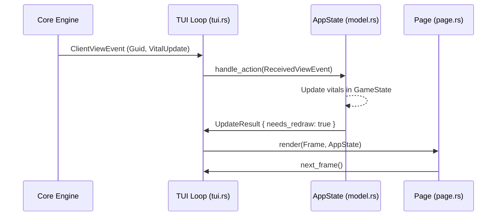

# CLI/TUI Architecture 🖥️

This crate is the primary interactive interface for Holtburger. It is a Terminal User Interface (TUI) built with [ratatui](https://ratatui.rs/) and follows a pattern inspired by the **Elm Architecture** (Model-Update-View), adapted for a multi-threaded asynchronous environment.

## 🏗️ Project Structure

- **`src/bin/`**: Contains the executable entry points.
    - `tui.rs`: The main TUI application loop, handling terminal initialization and event orchestration.
    - `cli.rs`: (Planned/Minimal) Non-interactive command-line interface.
- **`src/ui/`**: Core UI logic and state.
    - [model.rs](src/ui/model.rs): Defines `AppState` and `GameState`. This is the "God Object" that holds all information required for rendering.
    - [update/](src/ui/update/): Transition logic that moves the `AppState` from one state to another based on internal or external actions.
    - [page/](src/ui/page/): High-level screen abstractions (Selection, Game).
    - [widgets/](src/ui/widgets/): Reusable, mostly stateless UI components (Chat, Vitals, Dashboard).
    - [traits.rs](src/ui/traits.rs): Interfaces like `TabController` that allow different dashboard tabs to share logic.

## 🧠 State Management: The Model

The application uses a centralized state container: `AppState`.

### `AppState` ([src/ui/model.rs](src/ui/model.rs))
Manages the global lifecycle of the application:
- **`Page`**: An enum that strictly separates the "Character Selection" phase from the "In-Game" phase.
- **`NetStats`**: Real-time tracking of bytes in/out, used for the "Pulse" diagnostic widget.
- **Modals**: Global overlays for errors, confirmations, or interactions.

### `GameState` ([src/ui/model.rs](src/ui/model.rs))
When the user is in-game, `AppState` contains a `GameState` which is a projection of the `holtburger-core` world state. It caches:
- **World Entities**: Nearby monsters, NPCs, and items.
- **Player Stats**: Vitals, Skills, Attributes, and Resistances.
- **Inventory/Spellbook**: Local copies of the player's items and known magic.

## 🔄 The Interaction Loop: Update & View

The TUI operates on an asynchronous event loop located in [src/bin/tui.rs](src/bin/tui.rs).

### 1. Action Orchestration
We use `tokio::select!` to multiplex four event streams into a single **`AppAction`**:
- **Terminal Events**: Input (keys, mouse) and window resizing from `crossterm`.
- **Core Events**: Broadcasts from `holtburger-core` (`WireEvent`, `StateEvent`, `ViewEvent`).
- **Tick Timer**: A constant heartbeat for animations and network retries.

### 2. The `Update` Phase ([src/ui/update/mod.rs](src/ui/update/mod.rs))
Every `AppAction` is passed to `AppState::handle_action`. This method decomposes the update logic into domain-specific modules:
- **`input.rs`**: Maps crossterm `KeyEvent`s and `MouseEvent`s to state changes or intents.
- **`world.rs`**: Processes `holtburger-core` events (`WireEvent`, `StateEvent`, `ViewEvent`) to update the local `GameState` projection.
- **`effect.rs`**: Translates high-level UI intents (**`UIEffect`**) into concrete `ClientCommand`s to be sent to the server.

The update phase produces an **`UpdateResult`**, which may contain:
- `needs_redraw`: Boolean flag to trigger a terminal draw.
- `commands`: A list of `ClientCommand`s to be sent back to the core engine (e.g., "Use Item").
- `effect`: A `UIEffect` that requires further coordination (e.g., "Assess", "MoveTo", "Target").

### 3. The `View` Phase ([src/ui/page/mod.rs](src/ui/page/mod.rs))
If `needs_redraw` is true, the `Page::render` method is called.
- It uses **`get_layout`** ([src/ui/mod.rs](src/ui/mod.rs)) to calculate the responsive UI zones.
- It delegates rendering to specific **Widgets**, passing them sub-sections of the `AppState`.

## 📱 Responsive Layout Strategy

The TUI implements a "Mobile-First" style responsive design in terminal space.
- **Wide Mode**: Horizontal layout with Nearby list, Chat, and Context side-by-side.
- **Narrow Mode**: Vertical layout where Chat and Context stack, and the Dashboard takes priority.

The switch happens automatically at specific width/height breakpoints defined in [src/ui/mod.rs](src/ui/mod.rs).

## 🧩 Modularity & Extensibility

### Dashboard Tabs
The Dashboard panel (bottom right) is extensible via the **`TabController`** trait. Each tab (Inventory, Spells, Nearby) implements its own:
- Rendering logic.
- "Verbs" (actions you can perform on selected items).
- Context panel content (detailed info shown on the right).

### Interaction Flow

## 🛠️ Developer Navigation Guide

- **Adding a new UI element?** Create a new file in `widgets/` and call it from `page/game.rs`.
- **Handling a new server message?** Add it to the event handlers in `update/mod.rs` and update `GameState`.
- **Changing hotkeys?** Look in `update/input.rs`.
- **Adding a new tab to the bottom panel?** Implement `TabController` in `widgets/dashboard/tabs/`.
