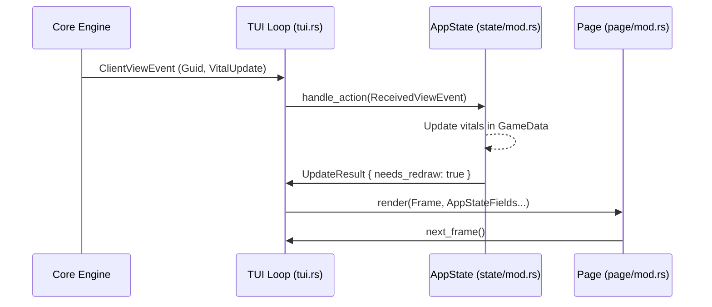

# CLI/TUI Architecture 🖥️

This crate is the primary interactive interface for Holtburger. It is a Terminal User Interface (TUI) built with [ratatui](https://ratatui.rs/) and follows a pattern inspired by the **Elm Architecture** (Model-Update-View), adapted for a multi-threaded asynchronous environment.

## 🏗️ Project Structure

- **`src/bin/`**: Contains the executable entry points.
    - `tui.rs`: The main TUI application loop, handling terminal initialization and event orchestration.
    - `cli.rs`: (Planned/Minimal) Non-interactive command-line interface.
- **`src/ui/`**: Core UI logic and state.
    - [state/](src/ui/state/): Defines `AppState` and its component parts. This is a collection of disjoint state containers (Net, Chat, Selection, Page, Game) to avoid borrow checker conflicts.
    - [update/](src/ui/update/): Transition logic that moves the `AppState` from one state to another based on internal or external actions.
    - [page/](src/ui/page/): High-level screen abstractions (Selection, Game).
    - [widgets/](src/ui/widgets/): Reusable, mostly stateless UI components (Chat, Vitals, Dashboard).
    - [traits.rs](src/ui/traits.rs): Interfaces like `TabController` that allow different dashboard tabs to share logic.

## 🧠 State Management: The Model

The application state is decomposed into granular modules within `src/ui/state/` to facilitate **disjoint borrowing**. This allows multiple parts of the application (e.g., Chat and Game) to be borrowed mutably at the same time.

### `AppState` ([src/ui/state/mod.rs](src/ui/state/mod.rs))
The root container that aggregates all sub-states:
- **`SelectionState`**: Tracks the currently selected entity and interaction targets.
- **`NetStats`**: Real-time network telemetry.
- **`ChatState`**: Manages the message log, line-wrapping cache, and scroll position.
- **`Page`**: High-level routing (Selection vs. Game).
- **`GameState`**: Contains the active world projection (see below).

### `GameState` ([src/ui/state/game.rs](src/ui/state/game.rs) & [src/ui/state/view.rs](src/ui/state/view.rs))
When in-game, state is further split to separate ground truth from UI transient state:
- **`GameData`**: A projection of the `holtburger-core` state (Entities, Stats, Inventory, Spells).
- **`ViewState`**: UI-only state (Scroll offsets, focused panes, dashboard tab state).

## 🔄 The Interaction Loop: Update & View

The TUI operates on an asynchronous event loop located in [src/bin/tui.rs](src/bin/tui.rs).

### 1. Action Orchestration
We use `tokio::select!` to multiplex event streams into **`AppAction`**.

### 2. The `Update` Phase ([src/ui/update/mod.rs](src/ui/update/mod.rs))
Events are processed by `handle_action`, which uses **disjoint borrows** to pass only required fields to handlers:
- **`input.rs`**: Maps crossterm events to intents.
- **`world.rs`**: Processes engine events to update `GameData`.

### 3. The `View` Phase ([src/ui/page/mod.rs](src/ui/page/mod.rs))
If a redraw is needed, the rendering loop passes granular slices of the state to widgets. 
- Widgets never receive the full `AppState` or `GameState`.
- Rendering is stateless where possible, relying on `ViewState` only for layout/scroll persistence.

## 📱 Responsive Layout Strategy

The TUI implements a "Mobile-First" style responsive design in terminal space.
- **Wide Mode**: Horizontal layout with Nearby list, Chat, and Context side-by-side.
- **Narrow Mode**: Vertical layout where Chat and Context stack, and the Dashboard takes priority.

The switch happens automatically at specific width/height breakpoints defined in [src/ui/mod.rs](src/ui/mod.rs).

## 🧩 Modularity & Extensibility

### Dashboard Tabs
The Dashboard panel (bottom right) is extensible via the **`TabController`** trait. Each tab (Inventory, Spells, Nearby) implements its own:
- Rendering logic.
- "Verbs" (actions you can perform on selected items).
- Context panel content (detailed info shown on the right).

### Interaction Flow

## 🛠️ Developer Navigation Guide

- **Adding a new UI element?** Create a new file in `widgets/` and call it from `page/game.rs`.
- **Handling a new server message?** Add it to the event handlers in `update/mod.rs` and update `GameData`.
- **Changing hotkeys?** Look in `update/input.rs`.
- **Adding a new tab to the dashboard?** Implement `TabController` in `widgets/dashboard/tabs/`.
- **Adding new UI persistent state?** Add fields to `ViewState`.

