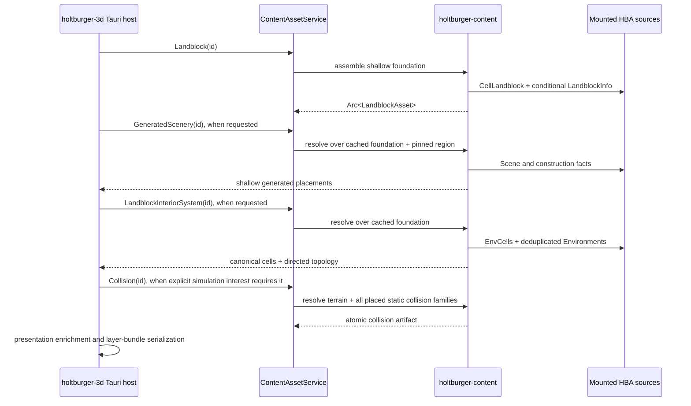

# Content Pipeline Architecture

The library crate responsible for runtime content discovery, decoded static-data reuse, and
canonical DAT-derived queries.

## Core Principles

- **Interpret content, not presentation**: this crate may decode, join, normalize, and derive
  source-domain facts. Authored collision polygons, terrain obstruction triangles, and conservative
  collision bounds are source-domain geometry because host behavior consumes them. Renderer
  coordinates, presentation triangulation, aperture meshes, batching, culling structures, and
  frontend LoD policy remain outside this crate.
- **Cheap foundations, explicit fanout**: a complete shallow landblock load is safe at a wide
  interest radius. Generated scenery and interiors are separate resolutions because they open
  materially larger dependency graphs.
- **Preserve authored uncertainty**: unsupported DIDs, directed nonreciprocal portal selectors,
  and outside endpoints remain domain state. Missing or corrupt required records fail with
  context; successful assets do not carry diagnostic ledgers.
- **Share immutable decoded graphs**: `ContentDecodeCache` retains decoded records through `Arc`.
  Repeated landblock derivations do not clone heavy Environment, Scene, SetupModel, or GfxObj
  graphs.
- **Frontend HBA first**: runtime consumers mount namespaced HBA bundles through
  `holtburger-dat` source composition rather than pointing clients at raw retail DATs.

## Key Components

### Repository Surface ([src/repository.rs](src/repository.rs))

`ContentRepository` owns HBA path or directory discovery, mounted-source precedence, raw resource
access, and focused material/texture queries. Repository construction remains frontend or tool
policy; shared orchestration receives an already constructed repository.

### Shared Decode Cache ([src/decode_cache.rs](src/decode_cache.rs))

`ContentDecodeCache` provides bounded immutable reuse for decoded CellLandblocks, LandblockInfo,
EnvCells, Environments, RegionDesc, Scenes, SetupModels, GfxObjs, palettes, and other recurring
records. Cache hits return the same `Arc` allocation.

### Landblock Foundation ([src/landblock.rs](src/landblock.rs))

`LandblockAsset` is the complete filter-free shallow projection of one CellLandblock, its
conditionally required LandblockInfo, and the pinned active RegionDesc:

- authored terrain samples and height indices plus resolved heights;
- every explicit object and building placement, including unsupported DID families;
- building portal metadata;
- the contiguous EnvCell reference range; and
- restriction-table entries.

`CellLandblock.has_objects` is the LandblockInfo presence contract. A missing CellLandblock is a
valid absent result. If `has_objects` is zero, the foundation does not read LandblockInfo; if it is
nonzero, missing or corrupt LandblockInfo is an error.

### Generated Scenery ([src/generated_scenery.rs](src/generated_scenery.rs))

`GeneratedSceneryAssetAssembler` resolves retail scenery population over an existing
`LandblockAsset`. It reads the pinned RegionDesc scene tables plus referenced Scene and object
construction facts needed for retail boundary acceptance. The output remains shallow: stable
provenance, source DID/family, placement, and scale.

### Interior System ([src/interior.rs](src/interior.rs))

`LandblockInteriorSystemAssembler` resolves every EnvCell referenced by the foundation and retains
one shared Environment per DID. CellStructs remain embedded in their owning Environment and are
referenced by `(Environment DID, local selector)`.

Topology preserves one directed record per authored EnvCell portal. Raw target selectors always
survive. In-range reciprocal internal links additionally receive a validated cross-link; outside
links may be enriched by one matching LandblockInfo building portal. No GfxObj aperture geometry,
CellStruct triangulation, render bounds, or BVH is produced.

### Static Collision Assembly

[`src/terrain_topology.rs`](src/terrain_topology.rs) owns retail's deterministic terrain-cell
diagonal rule. The diagonal grid travels with `LandblockTerrain`; both host obstruction triangles
and the frontend stride-one mesh consume it rather than maintaining separate hashes.

[`src/object_collision.rs`](src/object_collision.rs) resolves authored physics BSPs and polygons
for explicit objects, generated scenery, building shells, EnvCell structures, and indoor statics.
Shapes remain shared through the resolved-asset cache while placements retain component-wise
SetupModel part scales. Each placed part retains a stable authored-placement identity and
object-local vertex box so the resident world can reproduce retail's multipart static-shadow
traversal without cloning geometry. Interior containment volumes derive from the distinct cell BSP,
retain portal neighbors, and preserve the matched building index/origin on outside portals.
`LandblockColliders` is the atomic merge unit for placed shapes and volumes.

These artifacts deliberately contain no grounding, walkability, step, edge, movement-response, or
residency policy. They also do not bake cross-cell memberships: that fact depends on the complete
resident scene because shipped outdoor placements can enter a neighbor-owned building. The world
derives those shadow references transactionally from independently assembled landblock artifacts.
`ContentAssetService::resolve_collision` in `holtburger-core` is the sole complete product
composition path.

## Ownership Boundary

### What Belongs Here

- HBA discovery, mount ordering, and typed source access
- decoded-record caching and source-domain joins
- canonical terrain, object, building, restriction, generated-scenery, and interior facts
- retail-derived generated-scenery population semantics
- portal topology and stable source references required for later enrichment
- authored collision BSPs/polygons, conservative bounds, terrain obstruction triangles, and cell
  containment volumes
- reusable material, appearance, and texture-data queries

### What Does Not Belong Here

- runtime world mutation or gameplay rules
- app interest radii, requested-layer selection, or retry policy
- render-coordinate conversion and polygon-side expansion
- GfxObj/SetupModel presentation closure, presentation triangulation, or render bounds
- aperture meshes, draw ranges, batching, atlases, culling trees, or portal traversal policy
- durable success diagnostics, source-attempt ledgers, or renderer snapshots

`apps/holtburger-3d/src-tauri` owns presentation enrichment and binary landblock layer-bundle
production. The browser owns final baked/instanced draw units, runtime visibility, committed
bounds, and spatial structures.

## Runtime Data Flow

`ContentAssetService` in `holtburger-core` is the active composition root. It constructs without
reading RegionDesc, lazily pins one `Arc<ActiveRegionData>` for region-scoped operations, caches
the shallow foundation by normalized landblock ID, and exposes generated and interior ID requests
that reacquire that exact foundation. Region-independent asset requests remain available without
RegionDesc. Generated and interior results are not separately cached without measurements
demonstrating a need.

## Dependencies

- **`holtburger-dat`**: HBA/resource composition and low-level file parsers.
- **`holtburger-common`**: shared math and source-domain primitives.
- **`binrw`**: binary decoding support for focused content queries.
