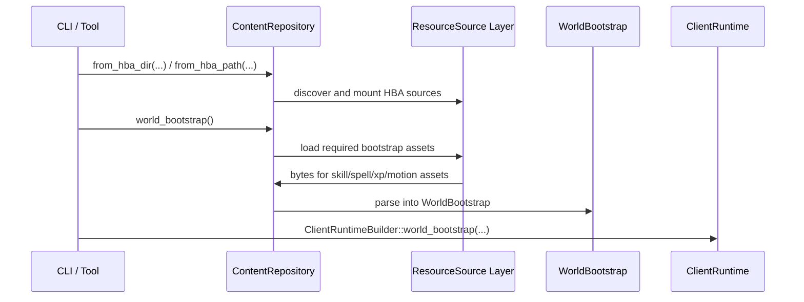

# Content Pipeline Architecture

The library crate responsible for frontend-owned content assembly, runtime bootstrap loading, and lightweight static reference-data queries.

## Core Philosophical Principles
- **Own Content Discovery, Not Runtime Semantics**: This crate is where HBA path discovery, archive mounting, and required bootstrap asset loading belong. It should not grow world-authority or gameplay-derivation logic.
- **Parsed Bootstrap Boundary**: Runtime consumers should receive a parsed `WorldBootstrap`, not raw paths, broad resolver types, or disk-shaped startup policy.
- **Frontend Query Surface**: Frontends may retain a `ContentRepository` for static reference-data lookups that do not belong on the semantic `ClientViewEvent` channel.
- **Runtime HBA First**: Runtime bootstrap is expected to come from namespaced HBA bundles layered through `holtburger-dat` source composition, not from raw retail DAT scanning.

## Key Components

### 1. Repository Surface ([src/repository.rs](src/repository.rs))
`ContentRepository` is the crate's main entry point.

It owns:

- HBA path or directory discovery
- mounting mixed-namespace HBA sources
- repository-scoped required-asset error reporting
- parsing runtime bootstrap assets into `WorldBootstrap`
- serving static reference data such as `SpellCatalog` and `CharGen`

This is intentionally a frontend or tool owned seam. `holtburger-core` should not know how archives were discovered or mounted.

### 2. Bootstrap Construction ([src/bootstrap.rs](src/bootstrap.rs))
The bootstrap module assembles the minimal parsed startup bundle that runtime code needs.

Today that means:

- `SkillTable`
- `SpellTable`
- `XpTable`
- `MotionKinematics`

Those are parsed into `holtburger_world::WorldBootstrap`, which becomes the explicit runtime startup contract.

### 3. Public Surface ([src/lib.rs](src/lib.rs))
The crate deliberately exports a small API:

- `ContentRepository`
- bootstrap helpers used to assemble `WorldBootstrap`

That small surface is intentional. The crate should stay focused on content loading and reference-data access rather than becoming a generic dumping ground for unrelated frontend helpers.

## Ownership Boundaries

### What Belongs Here
- HBA discovery and mount ordering
- required runtime asset loading and parse failures
- repository-scoped static reference-data queries
- caching parsed reference datasets when direct frontend lookup is useful

### What Does Not Belong Here
- authoritative world mutation
- gameplay rule interpretation that belongs in `holtburger-world`
- session or command orchestration that belongs in `holtburger-core`
- frontend-specific render state or control policy that belongs in the frontend app

## Runtime Data Flow

1. A frontend or tool constructs a `ContentRepository` from an HBA path, directory, or explicit mounts.
2. The repository owns source discovery and required-asset error reporting.
3. The frontend asks for `WorldBootstrap` when starting a runtime.
4. The frontend may also retain the repository for static lookup-style content queries.

## Static Reference Data

`SpellCatalog` and `CharGen` are the current reference-data queries served from this crate.

That is not because those datasets are uniquely special in principle. It is because the current client has direct lookup-style needs for spell metadata and character-creation definitions, while XP and skill tables remain internal gameplay inputs interpreted by `holtburger-world`.

The intended pattern is:

- semantic gameplay state flows through `world` and `core`
- static lookup-oriented content stays frontend-owned and query-driven

If more frontend-facing static datasets appear later, they should generally follow the repository-query pattern instead of being pushed one-by-one through runtime event channels.

## Dependencies
- **`holtburger-dat`**: Provides HBA readers, resource source composition, and low-level file parsers.
- **`holtburger-world`**: Defines the `WorldBootstrap` runtime contract and shared reference-data types such as `SpellCatalog`.
- **`binrw`**: Parses required binary assets into typed Rust models.
