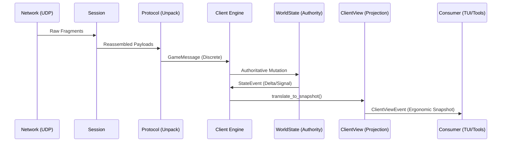

# Core Engine Architecture ⚙️

This crate is the "Brain" of the client. It orchestrates the connection, manages the world state, and translates network packets into meaningful gameplay events.

## Key Components

### 1. The Client ([src/client/mod.rs](src/client/mod.rs))
The top-level entry point. It manages the `Session` (networking), the `WorldState` (data), and the main event loop.

#### Bootstrap & Config
To instantiate a client, we use the `ClientBuilder` ([src/client/builder.rs](src/client/builder.rs)). This allows configuring credentials, server endpoints, and optional debug features like message dumping.

#### Event Streams
We use a 3-layer event model to separate protocol fidelity from UI ergonomics:
1. **`WireEvent`** (Protocol): 1:1 raw packet semantics. Use for debugging/replay.
2. **`StateEvent`** (State): Authoritative state mutations in core (e.g., `EntityMoved`, `VitalUpdated`).
3. **`ClientViewEvent`** ([src/client/types.rs](src/client/types.rs)): Ergonomic snapshots specifically modeled for UI consumption (e.g., `PlayerStatsSkillsUpdated`, `PlayerEnchantmentsUpdated`).

#### Interaction
- **ClientCommand**: Commands sent from the UI to the engine (e.g., `MoveTo`, `Use`).
- **Subscription**: Apps should subscribe to the `ClientViewEvent` broadcast channel for a stable, low-drift view of the authoritative game state.
- **Producer-Only Pattern**: The Core Engine is a strictly *producer-only* for these event streams. It never consumes its own broadcast events internally, as that would introduce unnecessary async latency and potential for state drift. It always uses direct, synchronous logic to move from Wire -> State -> View.

### 2. Specialized Systems

#### Auth & Connection ([src/client/auth.rs](src/client/auth.rs))
Manages the multi-stage handshake with GLS (Global Login Service) and then the World server. It handles ticket exchange, character selection, and the "Enter World" sequence.

#### Movement ([src/client/movement.rs](src/client/movement.rs))
The `MovementSystem` handles physics ticks, client-side prediction, and synchronization with the server's authoritative position. It runs at a fixed 30ms interval ([PHYSICS_TICK_MS](src/client/mod.rs)).

### 3. World State ([src/world/](src/world/))
This module tracks the current state of the 3D world:
- **WorldState** ([src/world/state.rs](src/world/state.rs)): The manager for all entities, time sync, and player state.
- **EntityManager** ([src/world/entity.rs](src/world/entity.rs)): A registry of every object in the player's "bubble."
- **SpatialScene** ([src/world/spatial.rs](src/world/spatial.rs)): A spatial index for fast distance-based queries (e.g., "What monsters are near me?").

### 4. Session Layer ([src/session/](src/session/))
Handles the low-level AC protocol transport details:
- Fragment reassembly.
- Packet Sequencing (Sequence IDs).
- Flow control and acknowledgments (ACK/NAK).

## Internal Data Flow

1. **Network**: `Session` receives raw UDP fragments.
2. **Protocol**: `holtburger-protocol` unpacks them into `GameMessage` structs via `binrw`.
3. **Engine**: `Client` processes the message and emits intents to `WorldState`.
4. **Authority**: `WorldState` performs the actual mutation and emits a `StateEvent`.
5. **Projection**: `Client` translates/normalizes `StateEvent` signals into an authoritative **`ClientViewEvent`** snapshot.
6. **UI**: Consumers receive the stable, projection-based event via the broadcast subscription.

### Mutation Boundary
Direct field mutation of the 3D world state from outside the `world/` module is strictly prohibited. `WorldState` provides a safe mutation API (e.g., `set_player_position`) that ensures mirrored data (like the player's entity record) stays in lockstep with session state.

## 🛠️ Developer Onboarding

### Adding a new Message Handler
1. **Identify the Opcode**: Find the opcode in the ACE Server source (ground truth).
2. **Update Protocol**: Add the message structure to `holtburger-protocol`.
3. **Handle in Core**: Add a case to the message processing loop in [src/client/messages.rs](src/client/messages.rs).
4. **Update State**: If the message changes the world, add a method to `WorldState` and emit a `StateEvent`.
5. **Map to View**: If the UI needs this data, update `ClientViewEvent` and the translation logic in [src/client/mod.rs](src/client/mod.rs).

### Running Tests
- Use `cargo test` to run protocol and state tests.
- Reference the `holtburger-debug-harness` for more complex integration scenarios.

## Dependencies
- **`holtburger-common`**: Math, Guids, and Shared Types.
- **`holtburger-protocol`**: The "Gold Standard" binary serialization mappings.
- **`holtburger-dat`**: Local file lookups (client_portal.dat, etc).
- **`tokio`**: The async runtime (used for net and task orchestration).
