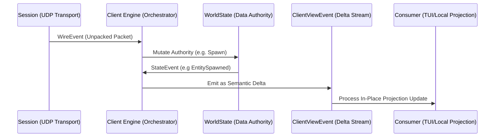

# Core Engine Architecture ⚙️

This crate is the "Brain" and Orchestrator of the client. It binds together the pure networking from [`holtburger-session`](../holtburger-session) and the data tracking from [`holtburger-world`](../holtburger-world) into a single, cohesive engine.

This crate orchestrates translating complex network packets into meaningful gameplay events without suffocating the application in massive struct clones or lock contention.

## Key Components

### 1. The Client ([src/client/mod.rs](src/client/mod.rs))
The top-level entry point. It instantiates the `Session` (networking) from `holtburger-session` and the `WorldState` (data graph) from `holtburger-world`, driving the main async event loop.

#### Bootstrap & Config
To instantiate a client, we use the `ClientBuilder` ([src/client/builder.rs](src/client/builder.rs)). This configures credentials, server endpoints, and optional debug features.

#### Event Streams
We use a 3-layer event model to separate protocol fidelity from UI ergonomics, solving the monolithic object-cloning problem via highly granular Delta Events:

1. **`WireEvent`** (Protocol): 1:1 raw packet semantics from `holtburger-session`. Used for logging, debugging, or deep client control.
2. **`StateEvent`** (World): Authoritative state mutations managed by `holtburger-world` (e.g., `EntitySpawned`, `PropertyUpdated`).
3. **`ClientViewEvent`** ([src/client/types.rs](src/client/types.rs)): The unified semantic delta-event feed. The core listens to incoming `WireEvent`s and `StateEvent`s and collapses them onto THIS SINGLE CHANNEL line.
   - Consumers (like `holtburger-cli`) **ONLY** subscribe to `ClientViewEvent` because it is lightweight. It broadcasts granular semantic delta-events (like `PropertyUpdated { guid, update }`) instead of massive `Box<Entity>` clones.

#### Interaction
- **ClientCommand**: Commands sent from the UI to the engine (e.g., `MoveTo`, `Use`). Handled in [src/client/commands.rs](src/client/commands.rs).
- **Producer-Only Pattern**: The Core Engine is strictly *producer-only* for the event streams. It never consumes its own broadcast events internally (that would introduce latency and state drift). It uses synchronous direct logic to move from Wire -> State -> View.

### 2. Specialized Systems

#### Auth & Connection ([src/client/auth.rs](src/client/auth.rs))
Manages the multi-stage handshake with GLS (Global Login Service) and the World server. Handles ticket exchange and character selection.

#### Movement ([src/client/movement.rs](src/client/movement.rs))
The `MovementSystem` runs on a fixed 30ms async interval, calculating physics ticks, client-side prediction, and pushing reliable synchronization with the server's authoritative position.

## Internal Data Flow

1. **Networking**: `holtburger-session` parses UDP packets.
2. **Engine**: `Client` processes the `WireEvent` and emits intents to `holtburger-world`'s `WorldState`.
3. **Authority**: `WorldState` performs the mutation and emits a `StateEvent`.
4. **Projection**: `Client` translates the `StateEvent` directly into a granular `ClientViewEvent` delta snapshot.
5. **UI**: Consumers receive the delta and mutate their local cached models safely without lock contention (`Arc<RwLock>`) or massive memory allocations.

## 🛠️ Developer Onboarding

### Adding a new Message Handler
1. **Identify**: Find the opcode in the ACE Server source (ground truth).
2. **Update Protocol**: Add the message structure to `holtburger-protocol`.
3. **Handle in Core**: Add a case to the core loop in [src/client/messages.rs](src/client/messages.rs).
4. **Update State**: If the message changes the world, add a method to `holtburger-world` and emit a `StateEvent`.
5. **Map to View**: Update the `ClientViewEvent` stream in `emit_wire_event` or `emit_world_view_projection` inside [src/client/mod.rs](src/client/mod.rs) to share the new delta with the UI.

## Dependencies
- **`holtburger-session`**: Network tracking, transport, and packet parsing.
- **`holtburger-world`**: The World State graph and entity tracking.
- **`holtburger-protocol`**: Binary packet structures.
- **`holtburger-dat`**: File access (DATs).
