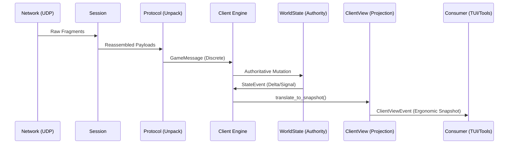

# Core Engine Architecture ⚙️

This crate is the "Brain" of the client. It orchestrates the connection, manages the world state, and translates network packets into meaningful gameplay events.

## Key Components

### 1. The Client ([src/client/mod.rs](src/client/mod.rs))
The top-level entry point. It manages the `Session` (networking), the `WorldState` (data), and the main event loop.

#### Event Streams
We use a 3-layer event model to separate protocol fidelity from UI ergonomics:
1. **`WireEvent`** (Protocol): 1:1 raw packet semantics. Use for debugging/replay.
2. **`StateEvent`** (State): Authoritative state mutations in core (e.g., `EntityMoved`, `VitalUpdated`).
3. **`ClientViewEvent`** ([src/client/types.rs](src/client/types.rs)): Ergonomic snapshots specifically modeled for UI consumption (e.g., `PlayerStatsSkillsUpdated`, `PlayerEnchantmentsUpdated`).

#### Interaction
- **ClientCommand**: Commands sent from the UI to the engine (e.g., `MoveTo`, `Use`).
- **Subscription**: Apps should prefer subscribing to the `ClientViewEvent` broadcast channel for a stable, low-drift view of the authoritative game state.

### 2. World State ([src/world/](src/world/))
This module tracks the current state of the 3D world:
- **WorldState** ([src/world/state.rs](src/world/state.rs)): The manager for all entities, time sync, and player state.
- **EntityManager** ([src/world/entity.rs](src/world/entity.rs)): A registry of every object in the player's "bubble."
- **SpatialScene** ([src/world/spatial.rs](src/world/spatial.rs)): A spatial index for fast distance-based queries (e.g., "What monsters are near me?").

### 3. Session Layer ([src/session/](src/session/))
Handles the low-level AC protocol transport details:
- Fragment reassembly.
- Packet Sequencing (Sequence IDs).
- Flow control and acknowledgments.

## Internal Data Flow

1. **Network**: `Session` receives raw UDP fragments.
2. **Protocol**: `holtburger-protocol` unpacks them into `GameMessage` structs.
3. **Engine**: `Client` processes the message and emits intents to `WorldState`.
4. **Authority**: `WorldState` performs the actual mutation and emits a `StateEvent`.
5. **Projection**: `Client` translates/normalizes `StateEvent` signals into an authoritative **`ClientViewEvent`** snapshot.
6. **UI**: Consumers receive the stable, projection-based event via the broadcast subscription.

### Mutation Boundary
Direct field mutation of the 3D world state from outside the `world/` module is strictly prohibited. `WorldState` provides a safe mutation API (e.g., `set_player_position`) that ensures mirrored data (like the player's entity record) stays in lockstep with session state.

## Dependencies
- Uses `holtburger-common` for math and core types.
- Uses `holtburger-protocol` for packet structures.
- Uses `holtburger-dat` for local file lookups.
