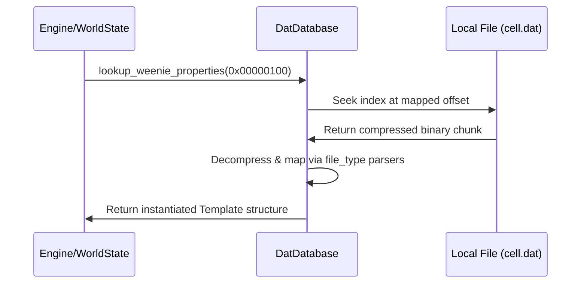

# DAT File Architecture 📚

The "Library" crate responsible for reading, mounting, and parsing Asheron's Call's static local data files (`client_portal.dat`, `client_cell.dat`, and `client_local_English.dat`). 

## Core Philosophical Principles
- **Read Only**: This library is strictly designed to query and project bytes read off the disk into structured domain models. Mutating DAT file contents or building DAT repacking tools is considered out of scope here.
- **Fast / Memoized**: Heavy lookup calls are structurally optimized or cached so indexing does not block the real-time game engine or UI ticks.

## Key Components

### 1. The Database Index ([src/lib.rs](src/lib.rs))
The `DatDatabase` acts as the primary logical entry point when executing queries. It mounts the underlying local file system buffers and reconstructs the B-Tree directory structure internally to map random IDs correctly to their disk offset mappings.

### 2. File Extractor Systems ([src/file_type/](src/file_type/))
Contains distinct semantic parsers for the actual internal file blobs unpacked from the DATs. Because the data within the DATs is a completely heterogenous mix of object binaries, these traits categorize it:
- **`gfx_obj`**: 3D model data, vertex placements, and polygonal UV mappings.
- **`weenie`**: The fundamental object templates. Often called "Blueprints", they dictate the base immutable stats of every spawnable monster, door, weapon, and player class in the game world.
- **`landblock`**: Contains terrain data, topological maps, and geographic cell linkages.

### 3. Geographic Maps ([src/landblock.rs](src/landblock.rs))
Includes specialized interpretation logic mapping Asheron's Call's multi-layered world.
- Understands how outdoor terrain chunking ties physically to indoor basement and dungeon grids.

## Internal Data Flow

1. Lookups begin with an ID request from `holtburger-world` when hydrating a newly spawned object from the network.
2. The index locates the disk offset natively.
3. Relevant structures unpack that byte buffer instantly into strongly typed internal data arrays.

## 🛠️ Developer Onboarding

### Validating Asset Queries
Because the project structure guarantees a local copy of DAT files resides locally when developers run the system, new parsers can easily be verified via integration tests querying specific well-known items (e.g. comparing the fetched dimensions of an `Axe (0x123)` against known ACE server data).

## Dependencies
- **`holtburger-protobuf` & `holtburger-common`**: Employs previously defined types (e.g. `PropertyString`, `Vector3`) directly in the structural output mappings.
- **`memmap2`**: Uses high-performance OS-level memory mapping for rapid DAT tree traversal.
