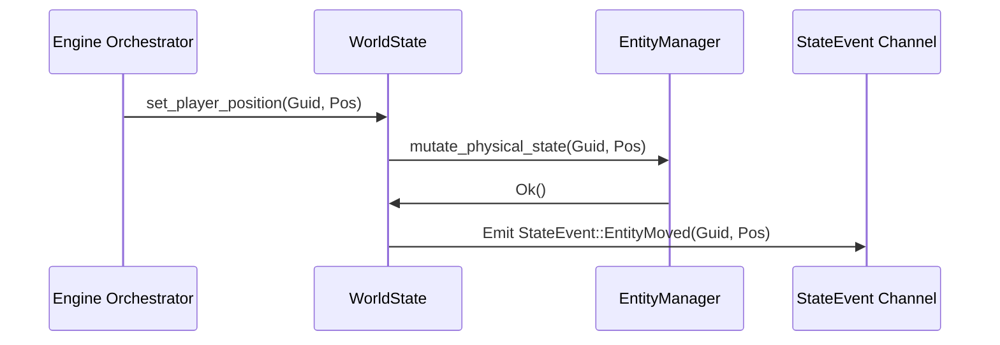

# World State Architecture 🌍

This crate serves as the **Data Graph and Authority** for the client. Isolated from the core orchestrator, it tracks the live state of the 3D world independently from networking or UI overhead, ensuring data integrity across the entity lifecycle.

## Core Philosophical Principles
- **No Networking**: This crate does not know about UDP or `holtburger-session`. It is mutated purely by imperative function calls (usually driven by `holtburger-core`).
- **Single Source of Truth**: The client's authoritative "Ground Truth" for stats, physics, and world configuration exists solely in memory here.
- **Pure Rule Traits**: Core game logic (such as whether you can sell an item) is abstracted into traits so that local UI projections can execute exactly the same logic without running a full server simulation.

## Key Components

### 1. WorldState ([src/state.rs](src/state.rs))
The root manager for the active server environment. Tracks:
- **Server Time Sync**: Converts local ticks to absolute Asheron's Call server epoch.
- **Global Settings**: Current land cell, server name, or weather states.

### 2. Entities & Hydration ([src/entity.rs](src/entity.rs), [src/hydration.rs](src/hydration.rs))
- **`EntityManager`**: A registry of every object (monster, player, tree) in the player's active bubble.
- **Hydration**: Entities in AC are not spawned completely. They start as a generic `EntitySpawned` packet and are progressively "hydrated" via multiple property mutation events. This module dictates the merging logic to construct a fully playable entity without overwriting state.

### 3. Spatial Scene ([src/spatial.rs](src/spatial.rs))
A 3D spatial index allowing for fast distance-based querying.
- Ex: "What monsters are within 15 meters of the player?" runs quickly instead of looping `O(N)` through the `EntityManager`.

### 4. Logic & Traits ([src/context.rs](src/context.rs))
- **`WorldContext`**: A pure trait boundary exposing high-level queries (e.g. `get_enchantments(guid)`, `can_sell_to_vendor(guid)`).
- Because UI consumers (like `holtburger-cli`) use a "Lossy Projection," they can implement `WorldContext` against their local cache. This prevents rules engines from being duplicated or trapped behind async locks on the core engine thread.

## Internal Data Flow

1. **Intention**: `holtburger-core` asks `WorldState` to mutate state, translating a raw network message into an authority change.
2. **Execution**: `WorldState` updates the in-memory graph (the actual hash maps and b-trees).
3. **Signal**: Upon successful mutation, `holburger-world` yields a highly specific `StateEvent`.
4. **Broadcast**: `holtburger-core` listens to the `StateEvent` stream and translates it into UI-safe `ClientViewEvent` snapshots.

## 🛠️ Developer Onboarding

### Mutation Boundary
Direct field mutation of the 3D world state from outside this crate is strictly prohibited. `WorldState` provides a safe mutation API that ensures mirrored data systems (like the spatial index and entity array) stay in perfect lockstep.

### Adding a Domain
If the client begins tracking a new cohesive mechanic (e.g., Guilds), you should:
1. Create a tracking struct in a new file (e.g. `guilds.rs`).
2. Manage that struct from the core `WorldState`.
3. Emit a `StateEvent` when mutation occurs.

## Dependencies
- **`holtburger-common`**: Vector math, Guids, Properties.
- **`strum`**: Enum macros for simplified definition mapping.
