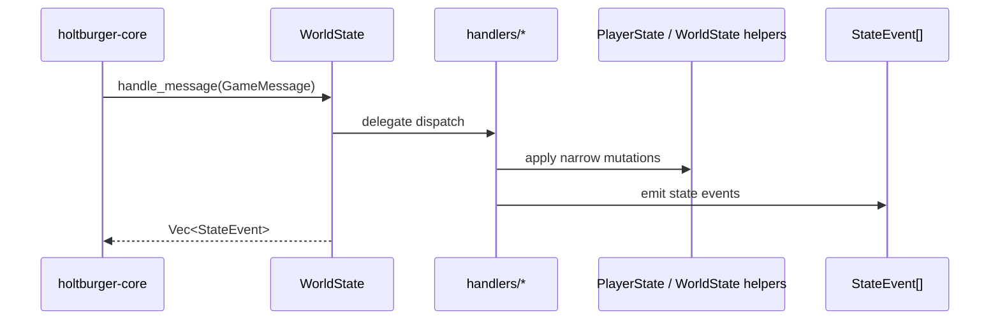

# World State Architecture 🌍

`holtburger-world` is the client's authoritative in-memory world model. It owns the live player
model, hydrated entities, spatial index, and world-domain state, while keeping protocol routing
separate from the state models themselves.

The refactor goal was simple: **handlers orchestrate, models mutate**.

## Core Design Rules

- **No transport ownership**: this crate does not own UDP/session concerns. It receives decoded
    messages from `holtburger-core`.
- **Feature-based routing**: protocol dispatch is grouped by gameplay/domain concern under
    [src/handlers](src/handlers), not by whichever state struct happens to hold most of the fields.
- **Stable facade**: callers still enter through `WorldState::handle_message()`, but that method is
    now just a facade over the handler layer.
- **Narrow mutation surfaces**: handlers call focused mutation helpers on `PlayerState` and
    `WorldState` instead of open-coding state changes.
- **Mirror invariants matter**: the current player is mirrored between `PlayerState` and the player
    `Entity` in `WorldState.entities`; movement/placement helpers must keep those views synchronized.

## Ownership Split

### `handlers/` — protocol orchestration
Files: [src/handlers](src/handlers)

This layer is responsible for turning decoded protocol messages into state mutations and
`StateEvent`s.

- `player`: player-local updates and shared player/world flows
- `movement`: movement and vector synchronization
- `inventory`: ownership, placement, containers, and object lifecycle
- `properties`: property fan-out across player, entities, vendor state, and derived side effects
- `login`: login/bootstrap flows such as `PlayerDescription`
- `trade`: trade/vendor protocol flows
- `system`: oddball protocol/system events such as `UseDone` and `WeenieError*`

Key rule: for shared flows, handlers preserve **player-first, world-second, event-last** ordering.

### `PlayerState` — player-local model
File: [src/player/mod.rs](src/player/mod.rs)

`PlayerState` owns session-local player data:

- attributes, vitals, skills, and their raw bases
- enchantments, spells, hotbars, and derived combat stats
- inventory/equipment membership
- player properties and protocol sequence tracking

`PlayerState` does **not** own the top-level message router anymore. Its job is to expose mutation
helpers that encode player-local invariants and derived-stat recalculation.

### `WorldState` — authoritative world graph
File: [src/state/mod.rs](src/state/mod.rs)

`WorldState` owns the rest of the authoritative world model:

- `EntityManager` and the hydrated entity graph
- `SpatialScene` and movement/placement invariants
- vendor state, trade state, open containers, and server time sync
- DAT-backed lookup tables such as XP, skill, and spell data

`WorldState::handle_message()` remains the stable public entry point, but its role is now to
delegate into the handler layer and return emitted `StateEvent`s.

### Entities & Hydration
Files: [src/entity.rs](src/entity.rs), [src/hydration.rs](src/hydration.rs)

- **`EntityManager`** stores every hydrated object currently known to the client.
- **Hydration** merges partial updates into complete entity state as object descriptions and
    property updates arrive over time.

### Spatial / Physics helpers
Files: [src/spatial.rs](src/spatial.rs), [src/state/physics.rs](src/state/physics.rs)

These modules own movement-facing invariants:

- nearby-entity queries
- player/entity movement synchronization
- collision-aware movement helpers
- player mirror helpers such as `set_player_position()` and `set_player_vector()`

### Query traits and projection-facing logic
File: [src/context.rs](src/context.rs)

`WorldContext` provides a pure query boundary for higher-level logic. That lets lossy projections
or UI layers answer gameplay questions without duplicating rules or depending on engine-thread
state directly.

## Dispatch Flow

1. `holtburger-core` decodes a protocol message and calls `WorldState::handle_message()`.
2. `WorldState` delegates dispatch to [src/handlers/mod.rs](src/handlers/mod.rs).
3. The relevant feature handler applies mutations through `PlayerState` or `WorldState` helpers.
4. Handlers emit `StateEvent`s describing the observable outcome.
5. Spell-name resolution and other final event decoration happen before control returns to the
     caller.

## Important Invariants

### Player mirror invariant
The current player exists in two forms:

- the session-local player model in `WorldState.player`
- the physical entity entry in `WorldState.entities`

Anything that changes the player's physical position or velocity must keep both views in sync.
Prefer `WorldState` movement helpers over direct field writes.

### Handler boundary
Handlers should orchestrate domain flows; they should not become mini state stores.

If a handler needs to do a multi-step update repeatedly, extract a named helper on the owning state
type instead of open-coding the mutation logic again.

### Event emission boundary
`StateEvent` emission should describe meaningful observable changes after mutation, not serve as a
shadow source of truth.

## Adding New Functionality

When introducing a new tracked domain:

1. Decide whether it is primarily player-local, world-global, or shared.
2. Add state storage to the owning model (`PlayerState`, `WorldState`, or a nested world module).
3. Add focused mutation helpers that encode the new invariants.
4. Route protocol messages through a feature handler under [src/handlers](src/handlers).
5. Emit `StateEvent`s only for meaningful external observations.

## Non-Goals

- This crate is not the protocol decoder.
- This crate is not the transport/session owner.
- This crate should not regress into model-owned router code just because a flow touches many
    fields.

## Dependencies

- **`holtburger-common`**: GUIDs, math, positions, properties, shared traits.
- **`holtburger-protocol`**: decoded message/event types.
- **`holtburger-dat`**: DAT-backed lookup tables and resource providers.
