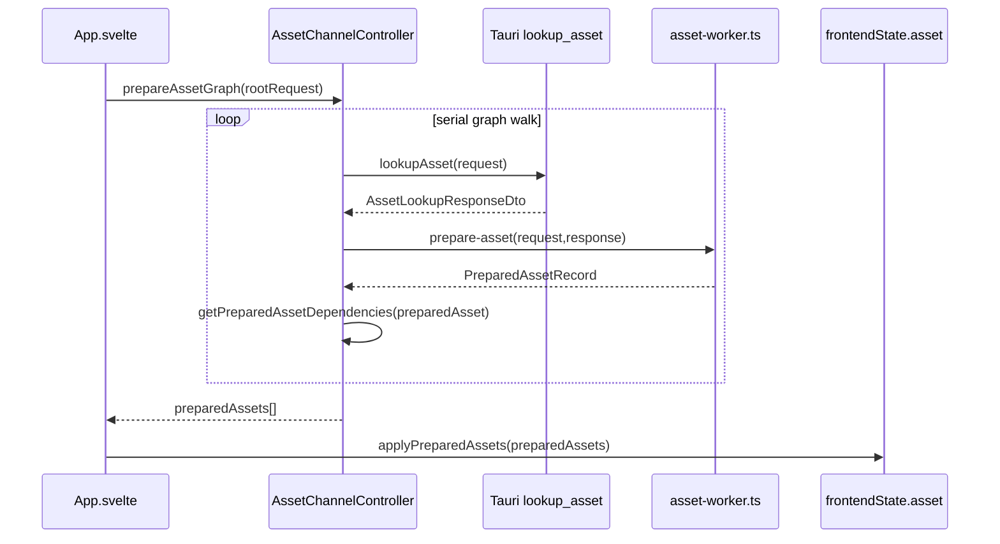
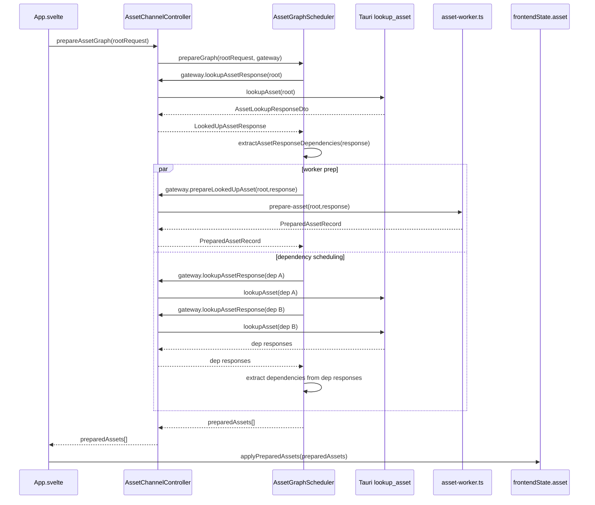

# Holtburger 3D Asset Hydration Parallelization Plan

## Context

The current 3D browser asset pipeline is demand-driven and mostly correct, but it still has avoidable latency:

- Scene coverage assets now apply immediately, which is good.
- `AssetChannelController` now globally de-dupes concurrent requests by `assetId`, which avoids duplicate lookup/worker preparation for shared dependencies.
- `prepareAssetGraph` still discovers graph dependencies from `PreparedAssetRecord`, so dependency traversal waits for both native lookup and worker preparation before it can enqueue the next dependency layer.
- `prepareAssetGraph` still walks dependencies serially inside each graph.

This plan focuses on removing those last two bottlenecks without changing ownership boundaries or pushing renderer policy into Rust.

## Terminology

- **Coverage pass**: one frontend request cycle for the currently relevant browser/client scene area. In outdoor browser mode this is usually a landblock ring.
- **Landblock scene asset**: one landblock-scoped static scene fact, currently `outdoor-static-scene/xxyyffff`.
- **Scene coverage asset**: an asset that directly contributes scene facts for the current coverage pass, such as `terrain/*`, `outdoor-static-scene/*`, `indoor-env-cell/*`, and `environment/*`.
- **Renderable dependency asset**: an asset needed to draw scene facts, such as `setup-model/*` and `gfx-obj/*`.
- **Asset graph**: the dependency closure starting from one root asset. The graph may span setup models, gfx objects, dependency manifests, and future material/texture families.
- **Response dependency discovery**: extracting dependency asset ids from the raw decoded `AssetLookupResponseDto` payload before worker preparation.
- **Worker preparation**: frontend worker transformation from raw host DTO payload into `PreparedAssetRecord` and renderer-friendly structures.

## Goals

- Keep the single asset worker saturated with non-duplicate preparation work while bounding native lookup pressure and main-thread store churn.
- Decouple graph traversal from asset transport and scene coverage request planning.
- Introduce a named graph scheduling abstraction instead of growing `AssetChannelController` into a broader god object.
- Discover graph dependencies from decoded response DTOs, not from worker-prepared records.
- Overlap dependency lookup and worker preparation where possible.
- Parallelize dependency traversal within a bounded concurrency limit.
- Use an explicit flat work-queue graph traversal, not recursive or deeply nested dependency descent.
- Keep scene coverage facts progressive: coverage assets should not wait for renderable dependencies before appearing in frontend state.
- Keep the main thread as the graph scheduler and global de-dupe owner.
- Preserve the worker as a pure preparation stage: it should not own graph traversal, scheduling policy, or asset cache identity.
- Avoid permanent tests that depend on real assets.

## Non-Goals

- Adding a worker pool in this pass.
- Implementing cache eviction or persistent asset storage.
- Reworking Rust content lookup ownership.
- Changing protocol/runtime semantics.
- Making browser mode define final client-mode streaming policy.

## Component Boundaries

The implementation should make graph traversal a first-class component. The current `AssetChannelController` owns too many concerns:

- Tauri asset lookup transport.
- Worker request/response correlation.
- Global in-flight asset de-dupe.
- Asset graph traversal.
- Browser/runtime coverage request construction.
- Outdoor/indoor scene-specific request policy.

Use the parallelization work to split the most important boundary:

- **`AssetChannelController`**: owns low-level asset lookup, worker preparation, response/prepared in-flight de-dupe, worker lifecycle, and request metadata rebinding.
- **`AssetGraphScheduler`**: owns flat graph traversal, bounded dependency scheduling, graph-local state, graph result assembly, and failure policy.
- **Coverage/request planning helpers**: own browser/runtime scene coverage requests and static renderable request planning. These helpers should not own graph traversal or worker lifecycle.

The graph scheduler should depend on a narrow gateway instead of directly knowing about Tauri or worker internals:

```ts
interface AssetPreparationGateway {
    lookupAssetResponse(
        request: AssetLookupRequestDto,
    ): Promise<LookedUpAssetResponse>;

    prepareLookedUpAsset(
        lookedUp: LookedUpAssetResponse,
        request: AssetLookupRequestDto,
    ): Promise<PreparedAssetRecord>;
}
```

`AssetChannelController` can implement this gateway. `App.svelte` should continue to talk to one high-level asset channel facade, but graph traversal internals should live in `AssetGraphScheduler`, not inline in the channel controller.

The explicit `request` argument on `prepareLookedUpAsset` is intentional. A looked-up response can be reused across callers by `assetId`, while each caller still needs honest request metadata for diagnostics and worker correlation.

Do not extract abstractions just to move code around. The split is justified because the graph scheduler has distinct state, tests, and failure behavior from lookup/worker transport.

## Scheduling North Star

The goal is not "maximum concurrency." The goal is a stable pipeline where useful work reaches each stage at the right pace:

```text
native lookup gets far enough ahead to reveal dependencies
asset worker stays busy preparing non-duplicate responses
frontendState batches store applies so Svelte does not react to every individual prepared asset
```

Use this as the implementation heuristic:

- If the worker is idle while graph dependencies remain undiscovered, traversal is too serial.
- If native lookup requests explode during large coverage changes, lookup concurrency is too high.
- If the worker is busy preparing duplicate asset ids, de-dupe is incomplete.
- If prepared assets arrive quickly but the UI janks, `frontendState` batching cadence or derived scene recomputation is the bottleneck.
- If graph latency remains high with low lookup and worker utilization, dependency scheduling is still too conservative.

This plan should optimize useful worker saturation first, then only consider a worker pool if profiling shows worker CPU is the sustained bottleneck after de-dupe and pipelined traversal are in place.

`AssetGraphScheduler` should not own Svelte state stability. It may return grouped graph results, but committing those records into app state is a `frontendState` responsibility. The store boundary is the right place to coalesce prepared assets, preserve stable state transitions, and avoid reactive churn across all callers, not only graph hydration.

## Current Pipeline



Problem: dependency discovery waits for worker preparation even when the raw DTO already contains all dependency ids.

## Dry-Run Findings Against Current Code

The first draft was directionally right, but a code-level dry run exposed several implementation details that should change the phase order:

- `AssetChannelController` currently has one `inFlightByAssetId` map whose value is a prepared-asset promise. Adding a second independent response-level map would make request rebinding, disposal, and priority handling awkward.
- A cleaner controller shape is one `AssetLoadEntry` per `assetId`, with separate optional `responsePromise` and `preparedPromise` fields.
- `AssetChannelController` also currently owns graph traversal and scene coverage planning. The graph traversal rewrite should introduce `AssetGraphScheduler`; coverage planning can be split after the graph work or as a small cleanup if it blocks clarity.
- `frontendState` already has `applyPreparedAssets`; future batching/stability work should stay there rather than leaking Svelte store policy into the graph scheduler.
- `App.svelte` currently names its pending set `inFlightSceneAssetIds`, but it now tracks scene and renderable dependency requests. That name is misleading and should be fixed before deeper scheduling work.
- `App.svelte` still owns the "scene coverage assets prepare directly; renderable dependencies use graph prep" policy inline. That policy should move into a small tested helper before graph traversal is rewritten.
- `prepareAssetGraph` receives a snapshot copy of `preparedByAssetId`. Concurrent coverage syncs can apply assets after that snapshot is taken. The controller-level in-flight de-dupe helps, but graph scheduling should still treat caller-provided prepared state as an initial cache, not as the only source of truth.
- `derivePreparedAssetDependencyStatus` currently depends on `getPreparedAssetDependencies(preparedAsset)`. If graph scheduling moves to response dependencies, status derivation either needs a response-level equivalent or should remain a prepared-record diagnostic only.
- `AssetWorkerLike` supports only one worker and request-id response matching. Bounded graph concurrency can still be implemented safely against one worker, but it will increase pending worker requests. Worker-pool work remains out of scope until this is measured.
- The first flat-scheduler sketch still treated lookup plus worker preparation as one active task. That is too coupled: dependency discovery should release lookup capacity as soon as the response arrives, while worker preparation continues separately.

## Target Pipeline



Key change: graph traversal advances from lookup responses while worker preparation runs in parallel.

## Traversal Shape

The graph traversal should be deliberately flat. Avoid recursive dependency descent and avoid nested promise chains that make graph state implicit in the call stack.

Use an explicit work-queue scheduler with a small state holder:

- `readyQueue`: requests that can start when concurrency allows.
- `activeLookupTasks`: currently running response lookup tasks, bounded by lookup concurrency.
- `activePreparationTasks`: currently running worker preparation tasks, tracked for result assembly but not used to block dependency discovery.
- `scheduledAssetIds`: asset ids already admitted to the graph.
- `completedAssetIds`: asset ids whose graph work has finished.
- `failedAssetIds`: asset ids whose graph work failed.
- `preparedByAssetId`: graph-local prepared results, seeded from the caller's cache snapshot.
- `preparedOrder`: deterministic return order, if needed.

This shape keeps the hard parts visible: bounded lookup concurrency, global de-dupe, response/prepared lifecycle split, failure handling, and request metadata rebinding. A recursive implementation would look smaller at first, but it would hide scheduling policy in nested async calls and become harder to reason about as soon as shared dependencies and partial failures are involved.

Do not model lookup and preparation as one active task that holds a scheduler slot until worker preparation completes. That would still let worker preparation throttle dependency discovery. The scheduler should release lookup capacity as soon as a decoded response arrives, enqueue discovered dependencies immediately, and track preparation promises separately until final result assembly.

## Phase 1: Clarify App Scheduling Policy And Names

### Work

- Rename `inFlightSceneAssetIds` in `App.svelte` to something honest, such as `inFlightAssetIds`.
- Extract inline scheduling policy from `App.svelte`:

```ts
function shouldPrepareAssetDirectly(assetId: string): boolean
```

or:

```ts
function classifyAssetHydration(assetId: string): "direct" | "graph";
```

- Keep current behavior:
  - Direct: `terrain/*`, `outdoor-static-scene/*`, `indoor-env-cell/*`, `environment/*`.
  - Graph: renderable dependencies and dependency manifests, currently `setup-model/*`, `gfx-obj/*`, and synthetic/dependency test assets.
- Move the helper into a small `asset-scheduling.ts` or `asset-hydration-policy.ts` module instead of keeping it inside `App.svelte` or adding more policy to `asset-channel.ts`.

### Tests

- Add synthetic unit tests for classification.
- Prove `outdoor-static-scene/*` is classified direct, not graph.
- Prove `setup-model/*` and `gfx-obj/*` are classified graph or dependency-prep as intended.

### Decision

Do this first because the graph rewrite depends on a clear boundary between scene coverage facts and renderable dependency hydration. This is a small, low-risk cleanup that reduces ambiguity before touching concurrency.

## Phase 2: Response-Level Dependency Discovery

### Work

- Add a new dependency extractor near the asset types/channel boundary:

```ts
export function getAssetResponseDependencies(
    response: AssetLookupResponseDto,
): AssetDependencyRef[]
```

- Put the extractor in `assets/types.ts` or a nearby `assets/dependencies.ts`, not in `asset-worker.ts`. Graph shape is scheduling metadata, not worker-owned render preparation.
- Use schema-safe parsing, not ad hoc string matching.
- Reuse existing schemas from `host/contracts.ts` where possible:
  - `outdoorStaticScenePayloadDtoSchema`
  - `indoorEnvCellPayloadDtoSchema`
  - `setupModelPayloadDtoSchema`
  - `dependencyManifestPayloadDtoSchema`
- Prefer `setupModel.parts[].gfxObjAssetId` over recomputing ids from `gfxObjId`, because Rust already emits the normalized frontend asset id.
- Cover all currently traversed asset families:
  - `outdoor-static-scene/*`: source asset ids from scenery, building, and generated scenery instances.
  - `indoor-env-cell/*`: static object source asset ids.
  - `setup-model/*`: `parts[].gfxObjId` converted to `gfx-obj/*`.
  - `dependency-manifest`: `dependencyAssetIds`.
  - `terrain/*`, `environment/*`, `gfx-obj/*`, appearance manifests, visual stubs, unknowns: no current traversal dependencies.
- Keep `getPreparedAssetDependencies` temporarily as a validation/diagnostic helper, but stop using it as the scheduling source.
- Update or duplicate dependency status derivation deliberately:
  - Either add `deriveAssetResponseDependencyStatus(response, preparedByAssetId, pendingAssetIds)`.
  - Or keep `derivePreparedAssetDependencyStatus` strictly as a post-preparation diagnostic and do not use it for graph scheduling.

### Tests

- Unit-test every dependency-bearing response kind using synthetic DTOs.
- Add a test proving `setup-model/*` dependencies can be extracted without worker preparation.
- Add a test proving unknown/generic payloads return no dependencies rather than throwing.

### Decisions

- Dependency discovery belongs at the decoded DTO/manifest level.
- Worker preparation builds renderer-ready payloads; it should not be required to decide graph shape.

## Phase 3: Unify In-Flight Response And Prepared De-Dupe

### Work

- Replace the current prepared-only `inFlightByAssetId` entry with one load entry:

```ts
interface AssetLoadEntry {
    responseRequestId: string | null;
    responsePromise: Promise<LookedUpAssetResponse> | null;
    preparedRequestId: string | null;
    preparedPromise: Promise<PreparedAssetRecord> | null;
}

type LookedUpAssetResponse = {
    request: AssetLookupRequestDto;
    response: AssetLookupResponseDto;
    dependencyAssetIds: string[];
};
```

- Split `prepareAsset` internally into:
  - `lookupAssetResponse(request)` using `AssetLoadEntry.responsePromise`.
  - `prepareLookedUpAsset(lookedUp)` using `AssetLoadEntry.preparedPromise` when possible.
- Expose those methods through an `AssetPreparationGateway`-compatible surface for the graph scheduler.
- Preserve public `prepareAsset(request)` behavior by composing lookup + worker preparation.
- Rebind request metadata on de-duped response reuse, as we already do for prepared asset reuse.
- Rebind looked-up response metadata as well. A reused response promise may have been created for another request id; callers should still see their own request metadata in diagnostics and prepared results.
- Keep worker `pendingRequests` keyed by `requestId`; that is still the right way to correlate worker responses.
- Disposal must reject or clear observable work:
  - pending worker requests
  - response promise wrappers
  - prepared promises
  - load entries
- Tauri lookup promises themselves are not cancellable from the frontend. Use a disposed flag or wrapper promise so a response that resolves after disposal does not post new worker messages, mutate load entries, or appear as successful graph work.

### Tests

- Direct duplicate `prepareAsset` requests still coalesce.
- Duplicate response lookups coalesce even if one caller only needs dependency discovery and another needs full preparation.
- Disposing the controller rejects/clears both pending worker requests and in-flight response lookup wrappers.
- A second caller can reuse an existing response promise and still receive caller-specific request metadata.
- A second caller can reuse an existing prepared promise and still receive caller-specific request metadata.

### Course Correction Watch

If `AssetLoadEntry` starts accumulating too much lifecycle state, split response/prepared tracking into small helper methods rather than adding controller-wide conditionals.

## Phase 4: Extract `AssetGraphScheduler`

### Work

- Move graph traversal responsibility out of `AssetChannelController` into `AssetGraphScheduler`.
- Keep public `AssetChannelController.prepareAssetGraph(...)` as a thin facade if that keeps `App.svelte` stable during the migration.
- Inject an `AssetPreparationGateway` into the scheduler rather than importing `lookupAsset` or worker types directly.
- Move graph-local helpers into the scheduler module:
  - dependency request creation
  - graph state tracking
  - result assembly
  - failure behavior
- Keep response/prepared de-dupe in `AssetChannelController`; the scheduler should ask for work and trust the gateway to coalesce duplicates globally.
- Keep scene coverage planning out of the scheduler. It starts from a root request and does not know why that request exists.

### Tests

- Add focused scheduler tests with a fake gateway.
- Prove the scheduler can prepare a root with no dependencies without a real worker.
- Prove scheduler failure behavior without Tauri/worker mocks.
- Keep existing `AssetChannelController.prepareAssetGraph` tests as facade/integration coverage where useful.

### Decisions

- `AssetGraphScheduler` is the right name because the component schedules bounded graph work; it does more than passively walk dependencies.
- The scheduler boundary should make later worker-pool experiments possible without changing traversal logic.

## Phase 5: Parallel Graph Traversal With Bounded Concurrency

### Work

- Replace the serial queue loop in `AssetGraphScheduler` with a bounded scheduler.
- Keep the scheduler flat and explicit. Prefer a small `GraphTraversalState` helper over recursive helper functions or nested promise chains.
- Maintain graph-local sets:
  - `scheduledAssetIds`
  - `completedAssetIds`
  - `failedAssetIds`
- Maintain graph-local maps:
  - `preparedByAssetId`, seeded from caller-provided prepared assets.
  - `preparedOrder`, if returned ordering must remain deterministic.
- Maintain channel-global in-flight de-dupe by `assetId` through the injected gateway.
- Schedule newly discovered dependencies as soon as each lookup response arrives.
- Run worker preparation for each looked-up response without holding a lookup scheduler slot.
- Track lookup tasks and preparation tasks separately:
  - Lookup concurrency controls native request pressure and dependency discovery.
  - Preparation tracking controls final graph completion and result assembly.
- Start with a conservative concurrency limit, probably `4` or `6`, configurable through `AssetGraphScheduler` options or the asset-channel facade.
- Treat caller-provided `preparedByAssetId` as an initial cache only. Do not assume it contains assets prepared by other concurrent graph walks after the graph starts.
- Preserve deterministic returned asset ordering if tests/UI need it:
  - either insertion/discovery order
  - or stable sorted order by asset id after completion
- Use a helper to create dependency requests:

```ts
function createDependencyRequest(
    rootRequest: AssetLookupRequestDto,
    dependencyAssetId: string,
): AssetLookupRequestDto
```

This keeps request-id formatting consistent with the current `rootRequest.requestId + "-dependency-" + assetId` pattern.

### Pseudocode

```ts
async prepareAssetGraph(rootRequest, preparedByAssetId) {
    const graph = new GraphState(rootRequest, preparedByAssetId);
    const readyQueue = [rootRequest];
    const activeLookups = new Set<Promise<void>>();
    const activePreparations = new Set<Promise<void>>();

    while (readyQueue.length > 0 || activeLookups.size > 0) {
        while (readyQueue.length > 0 && activeLookups.size < lookupConcurrencyLimit) {
            const request = readyQueue.shift();
            const task = runLookup(request).finally(() => activeLookups.delete(task));
            activeLookups.add(task);
        }

        await Promise.race(activeLookups);
    }

    await Promise.all(activePreparations);
    return graph.toResult();
}

async function runLookup(request) {
    const lookedUp = await lookupAssetResponse(request);
    graph.enqueueDependencies(lookedUp.dependencyAssetIds, readyQueue);
    const prepTask = prepareLookedUpAsset(lookedUp, request)
        .then((prepared) => graph.addPrepared(prepared))
        .catch((error) => graph.addFailure(request.assetId, error))
        .finally(() => activePreparations.delete(prepTask));
    activePreparations.add(prepTask);
}
```

### Scheduler Caution

The pseudocode needs one important implementation detail: remove completed promises from active sets before the next `Promise.race`. A safer shape is for each active task to return its own token:

```ts
const lookupTask = runLookup(request).finally(() =>
    activeLookups.delete(lookupTask),
);
activeLookups.add(lookupTask);
```

Avoid a loop where a resolved promise remains in an active set, because that can spin the main thread.

Also attach preparation failure handlers when the preparation task is created, not only when awaiting all preparations at the end. Otherwise a fast worker rejection can surface as an unhandled promise rejection before graph result assembly gets a chance to observe it.

### Tests

- A root with multiple independent dependencies starts those dependency lookups before the first dependency's worker preparation completes.
- A slow worker preparation does not consume a lookup concurrency slot after its response dependencies have been extracted.
- Shared dependencies across concurrent graphs still perform one lookup.
- Shared dependencies inside one graph still perform one lookup.
- Existing graph behavior still returns `rootAsset`, `preparedAssets`, `preparedByAssetId`, and dependency status.
- Failure semantics are explicit:
  - If root lookup/prep fails, graph fails.
  - If a dependency fails, decide whether graph fails hard or returns partial status. Current behavior effectively fails hard; keep that unless a product need says otherwise.
  - If lookup fails while preparation tasks are already active, reject the graph deliberately and make sure active preparation promises are handled or settled so they cannot become unhandled rejections.

### Decisions

- Bounded concurrency beats unbounded `Promise.all` because radius 8 coverage can generate hundreds of roots and many more dependencies.
- This is **within asset graph traversal**, not "within a landblock" only. In practice it helps landblock-derived static renderable dependencies, but the abstraction should work for any asset graph.
- Keep concurrency behind the asset-channel facade. The actual bounded graph logic should live in `AssetGraphScheduler`; `AssetChannelController` should provide the gateway and public facade.

## Phase 6: Keep Scene Coverage Progressive

### Work

- Keep `App.svelte` behavior where scene coverage assets use direct `prepareAsset`.
- Continue using graph prep for renderable dependency assets.
- Make sure response-level dependency discovery does not accidentally reintroduce graph prep for `outdoor-static-scene/*` roots in the coverage path.
- Consider a clearer helper:

```ts
function shouldPrepareProgressively(assetId: string): boolean
```

or

```ts
function isSceneCoverageAssetId(assetId: string): boolean
```

with tests, so policy does not live as an ambiguous inline condition. If Phase 1 already extracted this helper, this phase becomes a verification pass rather than new implementation.

### Tests

- `App.svelte` unit coverage is currently thin. Prefer extracting scheduler policy into testable helpers rather than testing component internals.
- Synthetic tests should prove `outdoor-static-scene/*` applies without waiting for `setup-model/*` / `gfx-obj/*`.

## Phase 7: Instrumentation And Cleanup

### Work

- Add non-noisy diagnostics in the HUD or asset state:
  - in-flight response count
  - in-flight worker count
  - de-dupe hits
  - graph concurrency limit
  - average lookup/prep latency buckets if easy
- Remove stale debug log labels from the old graph-only pipeline.
- Revisit whether coverage request planning should move from `asset-channel.ts` into a dedicated module such as `asset-coverage.ts` or `asset-request-planning.ts`.
- Revisit whether `getPreparedAssetDependencies` should remain:
  - Keep only if used for validation/diagnostics.
  - Remove if it becomes dead or misleading.
- Run static analysis:
  - `npm run --prefix apps/holtburger-3d lint:dead`
  - `npm run --prefix apps/holtburger-3d lint:ts`
  - `npm run --prefix apps/holtburger-3d check`

### Tests

- Do not add tests for debug logging.
- Add tests for any reusable diagnostic counters if they affect state shape or scheduling behavior.

## Expected Impact

- Scene facts should appear as soon as their own lookup + worker prep finishes.
- Renderable dependencies should start sooner because graph traversal no longer waits for worker preparation just to discover dependencies.
- Large coverage rings should feel less "spread out" because independent dependencies can load concurrently.
- Main thread jank should continue to be managed at the app-state boundary through `frontendState.applyPreparedAssets`, derived-state discipline, and slider-on-change behavior. The graph scheduler should not know about Svelte apply cadence.

## Risks

- More concurrency can increase native lookup pressure and worker message volume.
- Rebinding request metadata must stay honest enough for debug history.
- Response-level dependency extraction can drift from prepared-level dependency extraction if both APIs remain.
- Bounded concurrency needs careful failure handling to avoid dangling active promises.

## Open Questions

- Should the concurrency limit be static, environment-configured, or adaptive?
- Should graph dependency failures fail the whole graph or produce partial-ready status?
- Do we want priority promotion when a bootstrap request arrives for an asset already in-flight as streaming?
- Should prepared asset ordering be deterministic by discovery or sorted by asset id?

## Initial Recommendation

Implement Phases 1-3 before considering a worker pool. The current architecture still has scheduling inefficiency that extra workers would not fix. After response-level dependency discovery and bounded graph concurrency land, profile again before adding more workers.
