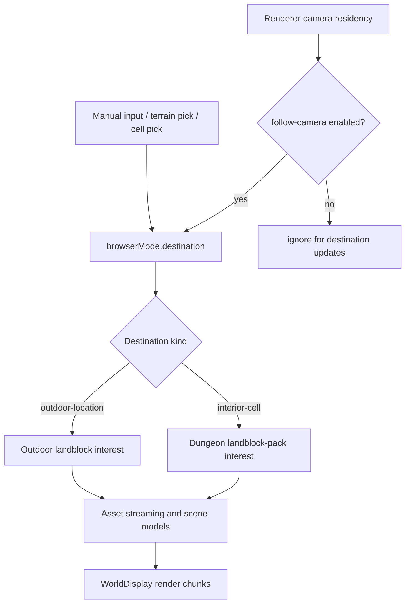

# Holtburger 3D Browser Follow Mode Plan

Status: Phase 1 implemented; Phase 2 partially pulled forward.

Implementation note: update this plan after each completed phase with progress, decisions, course
corrections, and any needed adjustment to later phases.

## Purpose

Add a browser-mode navigation option where `browserMode.destination` follows the free camera's
renderer-derived residency. The browser should behave like a standalone scene browser: its
destination, coverage, anchor, streaming, and camera continuity are owned by the frontend renderer
state, not by host/player state.

The follow-mode traversal model should become the standard browser scene model. Manual destination
entry, terrain/cell picks, and camera-follow updates should all feed the same destination-driven
coverage, anchoring, and streaming path.

## Goals

- Make `browserMode.destination` the single browser scene-interest source.
- Add `manual` and `follow-camera` navigation modes that differ only in how the destination is
  updated.
- Use the same coverage, anchoring, streaming, cache, and render-model path for manual and follow
  destinations.
- Allow follow mode in both outdoor and dungeon scenes.
- Stream outdoor landblock interest around outdoor destinations.
- Load dungeon scenes as isolated owning landblock packs; env-cell residency changes current focus
  metadata, not the loaded dungeon extent.
- Preserve already-loaded nearby chunks across destination changes.
- Avoid full-scene clears and camera snaps during ordinary traversal.
- Remove the legacy Rust-host browser residency contract and every browser-mode UI/state dependency
  on it.
- Keep Rust/Tauri in browser mode focused on asset delivery and explicit one-off diagnostics, not
  lifecycle/session/runtime state.
- Delete browser-facing "runtime" host contracts where the name or shape implies a fake
  authoritative client runtime.
- Use route-separated app surfaces as the mode boundary: `/browser` now, `/client` later. Do not add
  a global mode indicator unless a future command genuinely needs one.

## Non-Goals

- Do not implement true client/player traversal in this phase.
- Do not move browser free-camera policy or renderer-derived residency into Rust crates.
- Do not keep a placeholder authoritative/runtime residency field in browser-mode host DTOs.
- Do not replace deleted runtime ceremony with browser debug/lifecycle ceremony unless a concrete
  browser workflow needs it.
- Do not redesign the asset worker, graph scheduler, or DAT preparation pipeline.
- Do not implement collision, terrain grounding, or player physics.
- Do not add source-specific render-anchor behavior for manual vs follow destinations.

## Core Model

### Destination-Driven Scene Interest

Browser scene interest should always start from `browserMode.destination`.

```ts
type BrowserNavigationFocusMode = "manual" | "follow-camera";

type BrowserDestinationSource =
	| "manual"
	| "landblock-pick"
	| "follow-camera";
```

Manual mode writes `browserMode.destination` from user input and picks. Follow mode writes
`browserMode.destination` from typed renderer camera residency. Downstream code does not branch by
destination source.



### Standard Anchor Policy

Anchoring should not have separate "manual source" and "follow source" behavior. The browser has one
standard anchor policy:

1. Current destination defines the desired scene center.
2. Current anchor remains stable while the destination's owning landblock is inside the retain
   radius.
3. When the destination leaves the retain radius, commit the destination's owning landblock as the
   new anchor.
4. On anchor commit, compensate the browser camera so the visible world does not jump.

Manual navigation may additionally choose to reset or fit the camera as a UI action, but that is
separate from coverage/anchor/streaming behavior. The render-anchor policy itself stays isomorphic.

```text
retain radius: 2

destination moves:

    x x x x x
    x x x x x
    x x D x x        D = destination/followed camera landblock
    x x x x x
    x x x x x

anchor remains stable while D is inside radius:

    . . . . .
    . A . . .        A = committed render anchor
    . . D . .
    . . . . .
    . . . . .

when D exits radius:

    commit A := D
    convert camera frame from old anchor to new anchor
    update chunk transforms
```

### Dungeon Behavior

Follow mode should be valid in dungeon/interior scenes.

When renderer camera residency reports an env cell:

1. Convert the env-cell residency to an `interior-cell` browser destination.
2. The destination identifies the owning dungeon landblock pack.
3. Once the pack is prepared, render the pack's prepared interior cells as the dungeon scene.
4. The current env cell is focus metadata for highlighting, diagnostics, and camera residency text.
5. The isolated dungeon landblock remains the anchor unless the destination moves to a different
   dungeon landblock or outdoor scene.

```text
dungeon landblock 016C

        +---------+---------+
        | 0154    | 0155 D  |   D = current destination/focused env cell
        +---------+---------+
        | 0156    | 0157    |
        +---------+---------+

        The landblock pack supplies the dungeon cells.
        Follow mode can move D without changing the loaded dungeon extent.
```

### Typed Renderer Residency

The renderer should expose structured camera residency, not only formatted debug text:

```ts
interface BrowserCameraResidency {
	kind: "outdoor-landblock" | "env-cell" | "unknown";
	landblockId: number | null;
	envCellId: number | null;
	source: "cell-bsp" | "aabb-fallback" | "outdoor" | "unknown";
}
```

Use a deduplicated residency-change notification keyed by kind, landblock id, env-cell id, and
source. Do not update Svelte store state every render frame.

## Dry-Run Findings Against Current Code

### Legacy Rust-Host Browser Residency Must Be Removed

The current browser stack still synthesizes and consumes host/player residency. This is legacy
coupling to delete from browser mode, including the Rust/Tauri DTO path.

Observed browser-facing coupling:

- `contracts.rs` defines legacy residency DTO, and legacy host snapshot DTO embeds it.
- `HostBoundaryAdapter::legacy_host_snapshot` fills `legacy host snapshot DTO.residency`.
- `HostBoundaryAdapter::runtime_residency` synthesizes residency from the fake "Browser Scout"
  world/player position.
- legacy notification envelope can push that legacy host snapshot to the browser.
- legacy host overview exposes `runtimeChannel`, `runtimeNotificationEvent`,
  `runtimeLifecycleTopic`, and `legacyHostSnapshotCommand`, so the browser boundary itself advertises the
  wrong model.
- `readlegacy host snapshot` invokes `legacy host snapshot command` and makes legacy host snapshot mandatory before
  `BrowserWorldDisplay` can mount.
- `BrowserModePanel.svelte` shows host focus text and has a "Use current" action.
- `frontend-state.ts` seeds browser drafts from host focus and exposes
  legacy residency destination action.
- `browser-mode.ts` includes a `"legacy residency destination"` destination source and
  legacy residency destination selector.
- `BrowserWorldDisplay.svelte` derives outdoor focus and camera scene keys from host focus when no
  browser destination is available.
- `scene-asset-request-planner.ts`, `terrain-scene.ts`, `static-renderables.ts`,
  `structured-interior-scene.ts`, `render-anchor.ts`, `model.ts`, and `camera.ts` contain
  browser-visible branches that use host/player focus as scene interest.

Required cleanup:

- Delete legacy residency DTO from the browser-mode Tauri contract.
- Delete or replace legacy host snapshot DTO from the browser-mode Tauri contract; do not keep a
  browser-mode DTO named legacy host snapshot DTO.
- Delete `HostBoundaryAdapter::runtime_residency`.
- Replace `legacy host snapshot command` with a browser host/debug snapshot command only if the browser still
  needs synthetic debug entities. That snapshot must not contain focus, visible cells, or
  authoritative/player residency.
- Replace legacy notification envelope with a browser host notification envelope that carries
  lifecycle, debug feed, or asset availability changes, not legacy host snapshots.
- Rename overview fields away from `runtime*` terminology unless they truly refer to a future client
  runtime path that browser mode does not subscribe to.
- Remove tests that assert legacy host snapshot exposes residency facts.
- If a future real client mode needs authoritative residency, add a separate client-mode contract
  later instead of keeping it in browser mode.
- Delete browser UI/actions that expose host/player focus.
- Delete `"legacy residency destination"` as a browser destination source.
- Delete browser draft seeding from host focus.
- Make browser scene interest destination-only.
- If the native host still needs to exist for asset delivery, pass only an asset/request context to
  the browser streaming code. Do not pass host/player focus as browser scene input.

### Browser And Client Modes Should Be Route-Separated

The current app has no real browser/client mode boundary:

- `AppModeId` is only `"client"`.
- `deriveModeState` always returns `"client"` and treats browser navigation as an overlay/page.
- Rust `lifecycle_state` always reports `active_mode_hint: Some(Client)`.
- TypeScript host contracts only accept `legacy active mode hint: "client"`.
- `App.svelte` imports `BrowserWorldDisplay` directly and does not use a router.
- `tauri.conf.json` currently points the dev URL at the app root, not `/browser`.

That means browser mode currently runs inside client-mode-shaped plumbing. This should be deleted
from browser mode, not renamed into equally vague browser ceremony.

Current browser-facing snapshot shape:

```ts
interface legacy host snapshot {
	source: "tauri";
	lifecycleState: legacy lifecycle DTO;
	legacyHostSnapshot: legacy host snapshot DTO;
	legacy view-model feed: legacy view-model feed;
	overview: legacy host overview;
}
```

That shape keeps forcing runtime semantics into browser composition. The browser-mode replacement
should be delete-first and route-first:

```text
/browser
  browser scene browser
  asset/content commands
  frontend-owned destination, camera residency, streaming interest

/client
  future real client
  session/runtime commands
  authoritative residency, player traversal, entities
```

The loaded route is the mode boundary. Browser mode calls browser-safe commands directly:

- `lookup_asset`;
- `lookup_asset_binary`;
- `get_debug_config`, if still useful;
- explicit one-off diagnostics, if still useful.

Browser mode should not subscribe to runtime lifecycle or session notifications. It also does not
need a mandatory `BrowserHostSnapshot`, `BrowserDebugFeedDto`, or legacy lifecycle DTO. Startup can
mount `BrowserWorldDisplay` once required asset commands are available, and asset command failures
can drive the unavailable/error UI.

Do not add `set_app_mode({ mode })`, `Holtburger3dMode`, or another persistent mode indicator for
browser mode. If Tauri loads `/browser`, the browser surface has already selected the browser
contract. Future `/client` can import and call client-only commands.

Because this is a plain Svelte/Vite app, route separation does not require introducing SvelteKit or
a router dependency. A minimal pathname switch in `App.svelte` is enough for this phase:

```ts
const route = window.location.pathname === "/client" ? "client" : "browser";
```

The Tauri window should load `/browser` when supported by the local Tauri configuration. If that is
awkward in dev/build, loading `/` and internally treating it as `/browser` is acceptable as a
transitional default, as long as the browser surface does not consume runtime lifecycle/session
state. The route is a frontend import boundary, not a runtime-mode handshake.

If a browser UI later needs host status, add the narrowest DTO for that workflow, for example:

```ts
interface BrowserAssetHostStatusDto {
	phase: "ready" | "unavailable";
}
```

Do not add selected entities, interaction modes, session states, mode hints, or synthetic debug
feeds by default.

Future client mode should get its own route and contracts. Commands should stay shared only when
their behavior is truly mode-agnostic:

- shared: `lookup_asset`, `lookup_asset_binary`, `get_debug_config`;
- client mode: client session lifecycle, authoritative residency, entities, player traversal.

If a command is truly shared and mode-agnostic, keep it shared, for example `lookup_asset`. If a
command's behavior would depend on browser vs client mode, split it by command namespace instead of
adding global Tauri mode state.

### Route Separation Dry-Run Findings

Route separation narrows the first implementation phase, but it also exposes a few concrete cleanup
points:

- `App.svelte` currently gates rendering on `$frontendState.host.boundarySnapshot`. `/browser` must
  render without that snapshot.
- `App.svelte` currently subscribes to legacy runtime listener, calls
  `readlegacy host snapshot`, and logs `legacyHostSnapshot.residency`. `/browser` should delete that
  startup path.
- `SceneAssetStreamingController.syncSceneInterest` receives legacy host snapshot from the host snapshot
  and refuses to sync without it. This remains a hard blocker; browser streaming needs
  destination/revision input.
- `BrowserWorldDisplay` props include `activeMode`, `activeModeLabel`, `hostStatus`,
  legacy host snapshot, and `legacy view-model feed`. `/browser` should remove those props or replace display text
  with route-local constants and browser state.
- `deriveWorldDisplayModel`, `camera.ts`, scene derivation helpers, and render-anchor helpers still
  use legacy host snapshot DTO. Route separation alone does not fix this; it only makes the correct
  deletion boundary obvious.
- `lookup_asset` and `lookup_asset_binary` are already content/asset commands and can stay shared
  while they remain mode-agnostic.
- `get_debug_config` can stay shared if it remains a simple host diagnostic toggle.
- `submit_camera_hint` and `resolve_ray_pick` are optional diagnostics. If retained in `/browser`,
  they must not require legacy host snapshots or fake entities.
- Rust `main.rs` currently emits startup and interval legacy legacy notification event events unconditionally.
  Browser mode should not subscribe to them, and the Rust browser host can delete that emitter path
  once no current route consumes it.

### Browser Request Planning Needs Its Own Input Shape

`createSceneCoverageRequests` currently requires a full host batch and returns no requests without
one. Browser asset streaming should instead accept destination-driven input:

```ts
interface BrowserSceneRequestInput {
	requestRevision: number;
	destination: BrowserLocationSelection | null;
	terrainRadius: number;
	buildingRadius: number;
	detailRadius: number;
	envCellRadius: number;
	preparedByAssetId: Record<string, PreparedAssetRecord>;
	pendingAssetIds: string[];
}
```

`requestRevision` should be owned by browser state and increment when destination identity or LOD
radii change. It must not be derived from a host tick. Existing sync keys and request ids currently
include `legacyHostSnapshot.tick`; those should move to browser request revision plus destination identity.

The browser request planner should derive:

- outdoor destination -> landblock packs/summaries, outdoor statics, linked interiors, static deps;
- interior destination -> owning landblock pack and static deps for that pack's prepared cells;
- no destination -> no scene requests.

This decoupling is a hard blocker for browser independence.

### Scene Model Derivation Needs A Browser-Only Path

`BrowserWorldDisplay` currently gates outdoor focus on host/player state. Browser mode should derive
scene models from the destination alone:

- `outdoorFocusLandblockId` should come from an outdoor destination.
- `terrainScene` should accept browser destination interest without host focus.
- `staticRenderableScene` should accept browser destination interest and prepared assets.
- `structuredInteriorScene` should use the destination's owning landblock pack and focus env cell.
- panel rows should read destination/camera-residency text, not host focus text.

Future client-mode scene helpers can be added behind a separate client-mode boundary. Browser
composition should stop using mixed helpers that have host/player alternate-focus branches.

`deriveWorldDisplayModel` is also part of the cleanup. It currently produces text like
"authoritative residency" and "No runtime residency available yet" and builds scene context from
`legacyHostSnapshot.residency`. Browser mode should either retire this helper or replace it with
`deriveBrowserWorldDisplayModel` that accepts browser destination, renderer camera residency,
prepared asset state, and optional debug feed. The browser display model should not mention
authoritative/runtime residency.

### Camera Hints And Ray Picks Are Debug Services, Not Scene Interest

The browser can keep host-side camera-hint and ray-pick diagnostics, but they must be decoupled from
runtime residency.

Current coupling:

- `buildCameraHintFromSceneCameraFrame` returns `null` without legacy host snapshot DTO.
- `buildCameraHintFromSceneCameraFrame` falls back to
  `legacyHostSnapshot.residency.focusLocationLabel`.
- `buildCameraHint` in `model.ts` chooses a camera origin from fake runtime entities and falls back
  to runtime residency text.
- `resolve_ray_pick` uses `self.legacy_host_snapshot(state)` to pick synthetic debug entities.

Required cleanup:

- Build rendered camera hints from the renderer camera frame, active render anchor, route-specific
  source label, and `browserDestination?.label ?? null`.
- Remove legacy host snapshot from camera-hint builders.
- Keep ray pick explicitly debug-only if synthetic debug entities remain, or drop it from browser
  mode until a real client/debug target needs it.
- If ray pick remains, source it from a `BrowserDebugEntitySnapshotDto[]` carrier, not from
  legacy host snapshot DTO.

### Existing Camera Rebase Helper Should Be Reused

`convertCameraFrameBetweenAnchors` already exists in `render-chunks.ts` and has tests proving
canonical camera position is preserved across anchor changes.

Follow mode must apply equivalent compensation to both:

- `browserCameraFrame`, so the controlled renderer camera remains stable immediately;
- `browserCameraState.position`, so the next input event does not rebuild the frame from stale state.

This is a hard implementation detail.

### Camera Scene Key Currently Resets Too Often

`describeBrowserCameraSceneKey` currently keys camera reset on destination landblock/env-cell. If
follow mode updates `browserMode.destination`, the current reset effect would reset the camera on
ordinary traversal.

The reset key must be separated from raw destination identity:

- ordinary destination changes keep the camera;
- explicit reset button still resets;
- manual destination changes may optionally request a fit, but through an explicit UI policy, not
  through the render-anchor/streaming path.

### Renderer Residency Reporting Needs A Direct Channel

`world-display-renderer.ts` computes camera residency every rendered frame, but parent metrics are
reported on scene/camera updates and performance samples. Follow mode should not depend on that
indirect cadence.

Add a direct deduplicated residency-change callback, and keep metrics residency for display/debug
purposes.

### Bounds Auto-Fit Can Fight Traversal

`handleRenderMetricsChange` auto-fits to changing scene bounds unless manual control prevents it.
Follow mode should treat the free camera as traversal-controlled once it has accepted renderer
residency. Newly streamed bounds must not tug the camera.

## Hard Blockers

1. Remove browser-mode Rust/Tauri exposure of host/player residency.
2. Remove browser-mode dependence on legacy lifecycle DTO, legacy host snapshot,
   legacy view-model feed, legacy notifications, and client-mode legacy active mode hint.
3. Add a browser scene request input that does not carry host/player focus or host ticks.
4. Add typed, deduplicated renderer camera residency notifications.
5. Make destination-driven scene derivation the only browser path.
6. Decouple camera hints/ray picks from legacy host snapshots.
7. Prevent destination updates from triggering camera scene-key resets.
8. Apply anchor rebase compensation to both `browserCameraFrame` and `browserCameraState.position`.

## Revised Implementation Order

1. **Delete legacy browser residency contract**
   - Remove Rust/Tauri residency DTO fields and adapter synthesis.
   - Remove legacy host snapshot, lifecycle/session, mode-hint, snapshot, debug-feed, and notification
     dependencies from browser mode unless directly required by asset lookup.
   - Remove the "Use current" action, destination source, draft seeding, panel host-focus text, fake
     runtime startup notification, and lifecycle-derived app mode.
   - Make `/browser` the current route-level app surface. Reserve `/client` for future client mode
     instead of adding a persistent Tauri/frontend mode indicator.
   - Keep shared asset commands shared while they remain mode-agnostic.
   - Update tests so browser mode has no host/player focus destination path, legacy host snapshot DTO, or
     client lifecycle dependency.

2. **Decouple browser streaming from host ticks**
   - Create browser request input and browser-owned request revision.
   - Split scene streaming sync keys from host/legacy host snapshots.
   - Keep request IDs stable with destination identity and revision.

3. **Add typed renderer camera residency**
   - Add structured camera residency to renderer contracts.
   - Add a deduplicated `onCameraResidencyChange` path.

4. **Make browser scene derivation destination-only**
   - Outdoor destination drives outdoor interest.
   - Interior destination drives owning dungeon landblock-pack interest and focus metadata.
   - No destination produces no browser scene.
   - Replace browser display-model text that mentions runtime/authoritative residency.

5. **Decouple debug services**
   - Build camera hints from renderer camera frame and browser destination only.
   - Keep or remove ray-pick debug entities without feeding scene interest.

6. **Standardize anchor/streaming policy**
   - One destination-driven retain-radius anchor policy.
   - Reuse camera rebase helpers on anchor shifts.
   - Preserve camera state on ordinary destination changes.

7. **Add follow destination updater**
   - Convert renderer camera residency to browser destinations.
   - Write destination changes only when the residency key changes.

8. **Add UI and validate**
   - Add the navigation mode toggle.
   - Add destination source and renderer residency diagnostics.
   - Validate outdoor traversal, dungeon follow, backtracking, and manual entry.

## Implementation Phases

### Phase 1: Remove Legacy Browser Residency Exposure

- Remove legacy residency DTO from `apps/holtburger-3d/src-tauri/src/contracts.rs`.
- Delete or replace legacy host snapshot DTO; do not keep a browser-mode DTO named legacy host snapshot DTO.
- Remove `HostBoundaryAdapter::runtime_residency`.
- Replace `HostRuntimeService::legacy_host_snapshot`, `HostBoundaryAdapter::legacy_host_snapshot`,
  `legacy host snapshot command`, `legacy notification envelope.legacy_host_snapshot`, and the `legacy host snapshot notification`
  browser startup notification by deleting the browser-mode call/subscription path.
- Remove `legacy lifecycle DTO.active_mode_hint`, legacy mode hint DTO, and legacy session state from browser-mode
  contracts; keep them only if moved behind future client-mode-only contracts.
- Remove legacy host snapshot as a browser startup prerequisite. Browser startup should be driven
  by required asset command availability and explicit startup errors.
- Remove legacy view-model feed/`legacy view-model feed` from browser mode unless a concrete browser debug
  workflow is added in the same change.
- Remove legacy host overview as a browser-mode prerequisite. If asset channel names are still
  needed, use constants or a narrow asset-host config with no lifecycle/session/runtime fields.
- Remove Rust adapter tests that assert residency fields, replacing them with tests that assert the
  browser host contract has no residency field.
- Update generated TypeScript host contracts/tests for the changed DTO.
- Update `App.svelte`, `host-state.ts`, and `tauri.ts` to stop loading/listening through runtime
  lifecycle terms in browser mode.
- Add a minimal route switch in `App.svelte`; do not add SvelteKit or a routing dependency for this
  phase.
- Route browser mode through `/browser`, with `/` optionally redirecting to or internally selecting
  `/browser` during transition.
- Update Tauri window startup URL to `/browser` if supported cleanly by local Tauri config; otherwise
  let the frontend root choose the browser route.
- Do not add `set_app_mode`, `Holtburger3dMode`, or any other persistent mode indicator for the
  browser surface.
- Reserve `/client` for a future client-mode shell with client-only imports, commands, session
  lifecycle, authoritative residency, and player/entity state.
- Split command namespaces only when command behavior would differ by route. Shared content commands
  such as asset lookup can stay shared if they remain mode-agnostic.
- Keep `lookup_asset`, `lookup_asset_binary`, and `get_debug_config` available to `/browser`.
- Remove `"legacy residency destination"` from `BrowserDestinationSource`.
- Remove legacy residency destination selector.
- Remove `seedBrowserDraftFromResidency`.
- Remove legacy residency destination action.
- Remove panel rows/buttons that expose host/player focus as browser destination.
- Update tests that currently assert host-focus browser destination behavior.

Exit criteria:

- The Rust/Tauri browser-mode contract does not expose residency.
- The Rust/Tauri browser-mode contract does not expose a legacy host snapshot DTO.
- Browser startup does not emit or consume `legacy host snapshot notification`, lifecycle/session state, or client
  legacy active mode hint.
- Browser mode can mount from asset host availability without legacy host snapshot.
- Browser mode is selected by `/browser`, not by Tauri lifecycle state or a global mode flag.
- `/browser` can render without importing or passing legacy host snapshot, `legacy view-model feed`, `hostStatus`,
  `activeMode`, or `activeModeLabel`.
- Browser mode state cannot create a destination from host/player focus.
- Browser UI cannot select host/player focus.
- Browser draft input is initialized only from browser defaults or user actions.

Progress update:

- Completed in `apps/holtburger-3d`:
  - `/browser` is now the browser surface, with `/` accepted as a transitional browser route and
    other routes reserved for future client mode.
  - `App.svelte` no longer reads legacy host snapshot, lifecycle state, legacy host snapshots,
    frontend view-model feed, host overview, or legacy notifications before mounting
    `BrowserWorldDisplay`.
  - `BrowserWorldDisplay` no longer accepts or imports legacy host snapshot, `legacy view-model feed`,
    `hostStatus`, `activeMode`, or `activeModeLabel`.
  - `BrowserModePanel` no longer exposes a host/player "Use current" action or host focus fallback.
  - Browser app state now contains browser navigation state and asset state only; host connection
    and mode/lifecycle state were removed from the active browser store path.
  - TypeScript host contracts no longer export legacy host snapshot DTO, legacy residency DTO,
    legacy lifecycle DTO, legacy notification envelope, legacy view-model feed,
    legacy host snapshot, or legacy host overview.
  - Tauri browser commands now expose shared asset lookup, debug config, camera hints, and ray-pick
    diagnostics only. `legacy host snapshot command`, `get_lifecycle_state`, `get_view_model_feed`, and
    `get_host_boundary_overview` were removed.
  - Rust startup no longer emits legacy legacy notification event or a periodic `legacy host snapshot notification`.
  - Rust fake residency/entity generation was deleted from the browser host adapter.
  - Tauri dev URL now opens `/browser`.

Course corrections:

- Phase 2 request planning had to move forward enough to keep the browser functional. The old
  streaming controller refused to run without legacy host snapshot DTO, so phase 1 also introduced a
  browser-owned request revision and changed browser asset coverage requests to derive from
  `browserMode.destination`, prepared assets, pending assets, and LOD radii.
- Browser scene derivation also had to move forward enough to remove the prop-level legacy host snapshot.
  Terrain, static renderables, structured interiors, render anchors, world-display summary text, and
  camera hints now use browser destination input rather than host/player focus.
- The old TypeScript test suite was deeply coupled to the removed runtime DTOs. Stale tests that
  asserted the old host-driven architecture were deleted, and the remaining tests now pass against
  browser-owned state and asset-only fixtures. Future phases should add replacement tests for the
  new destination/follow behavior rather than restoring compatibility shims.
- Rust tests that asserted legacy host snapshot/lifecycle behavior were replaced or removed where they
  lived in the Tauri adapter. Asset lookup tests remain, and camera hint diagnostics now assert that
  hints work without runtime residency.

Verification:

- `npm run check` passes for production Svelte/TypeScript.
- `npm run check:rust` passes.
- `npm run lint:rust` passes.
- `npm run build` passes.
- `npm run format:check` still reports pre-existing formatting drift in unrelated files not touched
  by this phase.
- `npm run test:ts` passes after deleting stale host-driven tests and keeping asset-only fixtures.

### Phase 2: Browser Request Planning

- `BrowserSceneRequestInput` exists in the request planner.
- Browser request-planner entry points no longer require host/player scene input.
- `SceneAssetStreamingController` now uses browser request input.
- A browser-owned `requestRevision` exists and increments when the scene interest sync key changes.
- Use destination identity and `requestRevision`, not formatted labels or host ticks, in sync keys.
- Preserve warm cache retention behavior.
- Replace obsolete TypeScript planner/cache tests with browser-destination tests.
- Tighten request ids/sync keys if formatted destination labels prove too unstable for follow mode.

Exit criteria:

- Browser asset requests can be derived from destination + prepared assets + radii.
- Outdoor and dungeon browser requests work without host/player focus.
- `SceneAssetStreamingController` does not accept or inspect legacy host snapshot DTO.

### Phase 3: Typed Renderer Camera Residency

- Add `BrowserCameraResidency` or equivalent to renderer contracts.
- Convert `CameraViewResidencyContext` plus diagnostics into that typed shape.
- Add `onCameraResidencyChange` to `WorldDisplay` and `world-display-renderer.ts`.
- Deduplicate notifications by a stable residency key.
- Keep formatted residency text as debug display only.

Exit criteria:

- Browser composition receives prompt typed residency changes without parsing debug strings.
- Residency notifications do not write state every render frame.

### Phase 4: Destination-Only Scene Models

- Refactor `BrowserWorldDisplay` so outdoor interest derives from `browserMode.destination`.
- Refactor terrain/static/interior scene derivation or add browser-only wrappers.
- Retire browser panel text that uses host/player focus.
- Retire or replace `deriveWorldDisplayModel` for browser mode so labels/status text come from
  browser destination, renderer camera residency, prepared assets, and optional debug feed.
- Ensure dungeon scenes render whole prepared landblock packs with current env-cell focus metadata.

Exit criteria:

- Browser scene models do not consult host/player focus.
- Manual and follow destination updates use the same scene derivation path.
- Browser status text does not mention authoritative/runtime residency.

### Phase 5: Debug Camera Hints And Ray Picks

- Remove legacy host snapshot from `buildCameraHintFromSceneCameraFrame`.
- Use `browserDestination?.label ?? null` for camera-hint and ray-pick destination labels.
- Remove `buildCameraHint` paths that synthesize camera origin from fake runtime entities, unless
  retained under an explicit debug-only helper name.
- Update Rust ray-pick diagnostics so they do not call legacy host snapshot.
- If debug entity ray-pick remains, move synthetic entities into a browser debug DTO and keep them
  out of browser scene interest.

Exit criteria:

- Camera hints can be submitted without any legacy host snapshot.
- Ray-pick diagnostics, if retained, do not depend on runtime residency or legacy host snapshots.

### Phase 6: Standard Anchor And Camera Continuity

- Replace immediate browser destination anchor commits with the standard retain-radius policy.
- Use the same policy regardless of destination source.
- Reuse `convertCameraFrameBetweenAnchors`.
- Update both `browserCameraFrame` and `browserCameraState.position` on anchor shifts.
- Split camera reset/fit decisions from destination identity.
- Suppress bounds auto-fit during traversal-controlled camera use.

Exit criteria:

- Destination changes do not clear or snap the scene.
- Anchor shifts preserve visible camera/world continuity.
- Manual and follow destinations use the same coverage/anchor/streaming behavior.

### Phase 7: Follow Destination Updater And UI

- Add `navigationFocusMode`.
- Add `"follow-camera"` destination source.
- Convert outdoor renderer residency to outdoor destination.
- Convert env-cell renderer residency to interior-cell destination.
- Ignore unknown residency without inventing a replacement destination.
- Add the panel toggle and debug rows.

Exit criteria:

- Follow mode updates `browserMode.destination` from renderer residency.
- Manual mode ignores renderer residency for destination updates.
- Dungeon follow updates current env-cell destination while keeping the dungeon pack loaded.

### Phase 8: Validation

- Run TypeScript tests, Svelte checks, lint, and format checks.
- Manually validate:
  - slow outdoor boundary crossing;
  - fast keyboard traversal across several landblocks;
  - diagonal crossing;
  - backtracking within warm cache retention;
  - follow mode inside a dungeon;
  - unknown camera residency;
  - manual entry and picks after follow mode.

Exit criteria:

- Follow mode feels continuous during outdoor traversal.
- No full-scene clear/rebuild is visible during normal destination changes.
- Browser mode operates independently of host/player focus.

### Phase 9: Cleanup Legacy Smells And Migration Scaffolding

Status: running cleanup punch list. Add to it whenever a phase leaves behind a temporary adapter,
misleading name, duplicated helper, compatibility shim, obsolete test, optional-field workaround, or
migration-only abstraction.

Goal: keep the browser follow-mode work from accumulating hidden architectural debt while the
destination-driven model replaces the old host-driven model.

Initial cleanup targets:

- Replace deleted runtime-oriented TypeScript coverage with tests that prove the new destination
  contracts:
  - browser host contracts expose only asset/debug command shapes;
  - request planning derives coverage from browser destination and radii;
  - render-anchor policy does not depend on destination source;
  - camera hints and ray picks do not require host/player state.
- Audit old test deletion fallout before implementation is considered complete. Deleted tests should
  either be replaced with destination-owned tests or explicitly judged obsolete because their subject
  no longer exists.
- Rename browser helper APIs that still read as transitional after Phase 2. In particular, avoid
  names that imply landblock-pack-only coverage once summaries, dungeon packs, and renderer residency
  all share the same browser scene-interest path.
- Revisit `tsconfig.app.json` test exclusions after replacement tests are in place. The production
  typecheck should not hide active source files, and test exclusions should not become a permanent
  way to avoid broken contracts.
- Remove or rewrite status/debug text that still describes browser behavior as a "world shell" once
  follow mode lands. Browser text should describe destination, coverage, cache, anchor, and renderer
  state directly.
- Revisit camera hint and ray-pick command naming after Phase 5. If they remain browser diagnostics,
  name them as diagnostics; if future client mode needs authority-sensitive picks, keep that behind
  `/client` contracts.
- Audit plan prose after each phase for stale deleted identifiers. Grep should not keep old host
  architecture names alive unless the section is explicitly historical and useful.
- Collapse duplicate outdoor/interior focus derivation helpers once renderer camera residency and
  manual destinations both feed the same destination-normalization path.
- Revisit browser route handling once `/client` exists. `/` may remain a convenience redirect or
  become an explicit route selection page, but it should not grow a hidden mode flag.

Implemented cleanup slices:

- Phase 1 follow-up deleted stale host-driven TypeScript tests and restored a minimal asset-only
  fixture file.
- Phase 1 follow-up scrubbed the plan and app tree of the old runtime-batch identifiers so grep no
  longer suggests the browser depends on that model.

Validation:

- `rg` for the deleted runtime-batch identifiers across `apps/holtburger-3d` and this plan returns
  no matches.
- `npm run test:ts`.
- `npm run check`.
- `npm run lint:rust`.
- `npm run build`.

Notes:

- Cleanup is an explicit final phase, not permission to leave known debt untracked. If a phase
  creates temporary scaffolding, add it to this list immediately.
- Do not use cleanup to preserve backwards-compatible aliases for deleted browser/runtime contracts.
  If a compatibility shim is tempting, first ask whether it would keep the old architecture alive.

## Testing Plan

Add focused TypeScript tests:

- browser host contracts reject or omit legacy host snapshots, residency fields, lifecycle/session fields,
  and client mode hints;
- browser startup does not require legacy host snapshot;
- `/browser` mounts the browser surface without calling a mode-setting command or reading Tauri
  lifecycle state;
- `/browser` does not subscribe to legacy notifications;
- `/browser` keeps using shared asset lookup commands without a mode handshake;
- browser destination sources exclude host/player focus;
- renderer residency conversion preserves outdoor landblock ids and env-cell ids;
- unknown residency does not overwrite the current destination;
- manual mode ignores renderer residency updates;
- follow mode promotes outdoor residency into an outdoor destination;
- follow mode promotes env-cell residency into an interior-cell destination;
- browser request planning derives outdoor requests from destination only;
- browser request planning derives dungeon pack requests from interior destination only;
- retain-radius anchor policy avoids boundary ping-pong;
- camera rebase preserves canonical position and updates camera state;
- destination changes do not change the camera reset key unless an explicit fit/reset is requested.
- camera hints build from renderer camera frame without legacy host snapshots.

Add focused Rust/Tauri tests:

- browser mode does not require a host overview command;
- startup notifications do not include a `legacy host snapshot notification` topic in browser mode;
- shared asset lookup commands remain available without client lifecycle/session state;
- browser-mode contracts do not expose lifecycle/session/mode-hint DTOs unless moved behind a
  client-mode-only boundary;
- ray-pick diagnostics, if retained, do not construct a legacy host snapshot.

## Acceptance Criteria

- Browser mode has a follow-camera navigation option.
- `browserMode.destination` is the only browser scene-interest source.
- Manual and follow destinations use the same coverage, anchoring, streaming, and scene derivation.
- Outdoor follow destinations drive outdoor landblock interest and streaming.
- Dungeon follow destinations update current env-cell focus while the owning landblock pack remains
  the dungeon scene.
- Browser mode has no host/player focus button, source, draft seeding, panel text, or alternate
  focus path.
- Rust/Tauri browser-mode DTOs do not expose authoritative/runtime residency.
- Rust/Tauri browser-mode DTOs do not expose legacy host snapshot DTO, legacy lifecycle DTO,
  client legacy mode hint DTO, session state, or a `legacy host snapshot notification` notification.
- Browser mode is selected by `/browser`; future `/client` will use separate client-mode contracts
  rather than shared browser lifecycle plumbing.
- Crossing landblock boundaries does not visibly clear or rebuild the entire scene.
- Anchor shifts preserve camera/world continuity.
- Focus, request planning, and anchor policy are covered by pure TypeScript tests.
