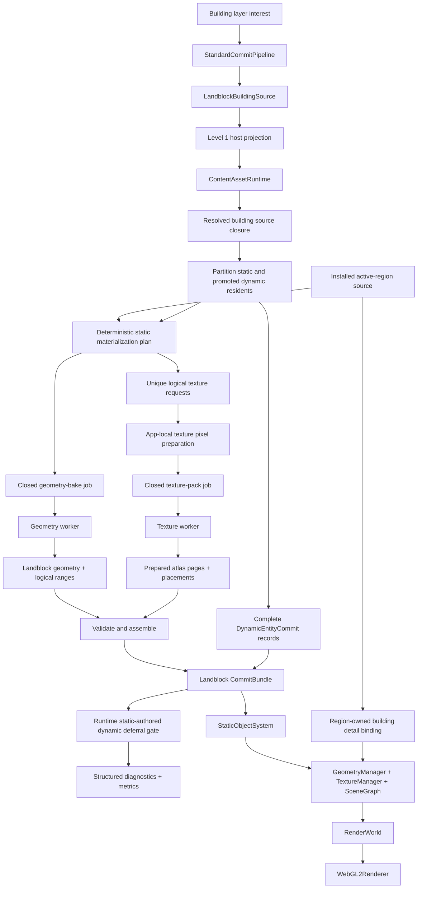

# Holtburger 3D Buildings Layer End-to-End Plan

Status: Active. Phases 0–2 are complete; Phase 3 closed-worker implementation is active.

## Context and Boundaries

### Goal

Load cumulative scene LoD Level 1 outdoor buildings, materialize each landblock into independently
prepared geometry and texture artifacts, install them through the existing static-object system, and
render the resulting direct-color and indexed materials with correct opaque, alpha-test,
transparent, and additive behavior, with terrain-equivalent distance fog on opaque and alpha-test
materials.

### Current State

The shared content pipeline already classifies outdoor buildings as scene LoD Level 1 and emits
their source identities, placements, scales, bounds, transition apertures, and outdoor BVH. The
core content runtime can resolve the dependent `GfxObj`, `SetupModel`, material, texture, and palette
assets.

The new 3D application already has:

- Level-aware scene interest including `buildingRadius`;
- resolved object and material source contracts;
- static-object commit artifacts;
- geometry, texture, instance-stream, and scene ownership managers;
- owner-scoped static-object installation and eviction;
- renderer-side discovery of visible static-object contributions; and
- logical `AssetTextureKey` identities whose physical atlas placement is resolved at draw time.

The missing path is the typed Level 1 source adapter, application-owned texture preparation and
packing, the landblock static-geometry baker, and WebGL2 object drawing. The current Tauri adapter
requests Level 0 terrain only, `StandardCommitPipeline` rejects every non-terrain layer, and the
renderer resolves static-object resources without drawing them.

### Material Ordering Vocabulary

- **Opaque** and **alpha-test** ranges write depth and may merge by complete material binding.
- **Transparent** means non-additive blended material behavior. Transparent ranges retain
  resident/part/material sort-unit boundaries for stable far ordering and near distance sorting.
- **Additive** means alpha-additive, inverse-alpha-additive, or unmodulated-additive behavior.
  Additive ranges use a distinct deterministic draw phase and may merge by complete material
  binding within that phase because their framebuffer contributions commute with one another.
- **Blended** is the umbrella term for transparent and additive behavior. It does not imply that the
  two ordering classes share sorting or batching policy.

### In Scope

- Outdoor building members from `LandblockSceneLodLayer::OutdoorBuildings`.
- Direct `GfxObj` and `SetupModel` object-source forms, including setup-part placement and scale.
  The authored Level 1 building population exercises only direct GfxObjs; setup-backed behavior is
  retained for the reusable non-terrain static pipeline and proven with explicit-object fixtures.
- A narrow, versioned building-source host contract and matching Tauri/browser adapters.
- Application-owned preparation of direct-color, indexed, palette, and detail texture pixels.
- Active-region ownership of the regional building-detail overlay so it is prepared once and shared
  by every building layer.
- Static-object atlas packing with an explicit configurable gutter constant.
- Closed worker jobs that never request additional assets from the main thread after dispatch.
- Reusable classification of setup-backed residents with a default animation into the existing
  `ResolvedObjectLayerSource.dynamicResidents` path.
- Preservation of each complete promoted resident produced by the reusable classifier through
  `CommitBundle.dynamicEntities`, followed by one explicit runtime deferral gate with structured
  diagnostics and metrics.
- Geometry baking and texture preparation/packing that execute concurrently.
- One landblock-local building geometry allocation with one material binding per draw range.
- One building-layer scene node with a baked union bound and the layer-specific `buildings` culling
  group.
- Deterministic merging within ordering classes that permit it.
- Independent transparent ranges carrying stable sort identities and sort centers.
- Additive ranges in a distinct draw phase, mergeable by complete material binding without
  distance sorting.
- Direct-color, untextured color, indexed/paletted, opaque, alpha-test, transparent, and additive
  rendering.
- Legacy-style stable far transparency and back-to-front near transparency.
- The same effective environment-based distance fog used by terrain for opaque and alpha-test
  object materials.
- Interest-driven loading, stale-completion rejection, installation, eviction, and resource cleanup.
- Diagnostics sufficient to measure source ranges, baked ranges, atlas pages, draw calls, and bytes.

### Out of Scope

- Level 2 explicit outdoor objects and Level 3 generated scenery.
- Level 4 env-cell shell, portal topology, or building-interior rendering.
- Building collision, picking, interaction, or selection UI.
- Per-building frustum culling or sub-landblock spatial clustering.
- Building instancing.
- Dynamic visual materialization, rendering, animation playback, or appearance mutation for
  promoted outdoor building residents. Resolution, classification, and pipeline carriage of their
  complete future-consumable records remain in scope.
- Distance fog for transparent or additive materials. These passes initially render without fog;
  revisit their fog semantics when distant non-building static layers require them.
- A generic asset router, generic baker framework, or general-purpose render graph.
- Porting the legacy streaming scheduler, residency service, or renderer wholesale.
- Permanent tests that require an installed or repository-local DAT/HBA archive.

## Ground Truth and Existing Precedent

Implementation must be verified against authoritative source records before relying on legacy
frontend behavior.

### Shared and Authoritative Content Sources

- `crates/holtburger-content/src/landblock_scene_assets.rs`
  - `LandblockSceneLodLevel`
  - `LandblockSceneLodOutdoorBuildingsLayer`
  - `LandblockOutdoorStaticMember`
  - `PreparedStaticInstance`
  - `PreparedStaticMesh`
  - `build_gfx_obj_render_geometry`
- `crates/holtburger-content/src/material_graph.rs`
  - `ResolvedMaterialRecipe`
  - `ResolvedSetupAppearance`
  - GfxObj material-slot and setup-appearance resolution
- `crates/holtburger-core/src/content_assets.rs`
  - `ContentAssetRequest`
  - cumulative scene-LoD caching and projection
- `ACE/Source/ACE.DatLoader/FileTypes/CellLandblock.cs`
- `ACE/Source/ACE.DatLoader/FileTypes/GfxObj.cs`
- `ACE/Source/ACE.DatLoader/FileTypes/SetupModel.cs`
- `ACE/Source/ACE.DatLoader/FileTypes/Surface.cs`
- `ACE/Source/ACE.DatLoader/FileTypes/SurfaceTexture.cs`
- `ACE/Source/ACE.DatLoader/FileTypes/Texture.cs`
- `ACE/Source/ACE.DatLoader/FileTypes/Palette.cs`
- `ACE/Source/ACE.DatLoader/Entity/Polygon.cs`
- `ACViewer/ACViewer/Render/R_GfxObj.cs`
- `ACViewer/ACViewer/Render/R_PartArray.cs`
- `ACViewer/ACViewer/Render/GfxObjTexturePalette.cs`
- `ACViewer/ACViewer/Physics/PartArray.cs`

The retail-client decompile remains authoritative for fixed-function material, clip, blend, and fog
behavior when ACE and ACViewer do not establish client presentation behavior. Any new material rule
must cite the relevant retail or ACViewer path in tests or implementation notes.

### Current Application Precedent

- `apps/holtburger-3d/src-tauri/src/lib.rs`
  - current host state, terrain-source projection, texture-pixel projection, and binary envelopes
- `apps/holtburger-3d/src/lib/assets/`
  - typed source ports, Tauri adapters, binary decoders, and browser adapter
- `apps/holtburger-3d/src/lib/game/commit/artifacts.ts`
  - static geometry, draw-unit, texture-page, and installation contracts
- `apps/holtburger-3d/src/lib/game/commit/pipeline.ts`
  - layer-parallel source preparation and commit production
- `apps/holtburger-3d/src/lib/game/textures/`
  - logical texture identity, purpose policy, preparation, atlas installation, and leasing
- `apps/holtburger-3d/src/lib/game/systems/static-object-system.ts`
  - owner-scoped static installation and removal
- `apps/holtburger-3d/src/lib/game/scene/scene-graph.ts`
  - scope/landblock/culling-group broad phase and exact node AABB/frustum tests
- `apps/holtburger-3d/src/lib/game/renderer/render-world.ts`
  - read-only renderer resource-resolution membrane
- `apps/holtburger-3d/src/lib/game/renderer/webgl2-terrain-program.ts`
  - effective horizontal-distance fog behavior
- `apps/holtburger-3d/src/lib/game/renderer/webgl2-renderer.ts`
  - visibility collection, terrain drawing, and renderer-owned pass policy
- `apps/holtburger-3d/ARCHITECTURE_AUDIT.md`
  - required host decomposition and runtime load-coordination extraction when adding the second
    static layer

### Legacy Prior Art to Mine, Not Port Wholesale

- `apps/holtburger-3d-legacy/src/lib/static/objects/outdoor-static-objects-resolver.ts`
- `apps/holtburger-3d-legacy/src/lib/static/objects/bake/static-object-job-baker.ts`
- `apps/holtburger-3d-legacy/src/lib/textures/packing/atlas-layout.ts`
- `apps/holtburger-3d-legacy/src/lib/textures/packing/packer.ts`
- `apps/holtburger-3d-legacy/src/lib/renderer/webgl2/webgl2-renderer.ts`
- `apps/holtburger-3d-legacy/src-tauri/src/adapter/prepared_texture.rs`
- `apps/holtburger-3d-legacy/src-tauri/src/adapter/prepared_texture_dxt.rs`
- `apps/holtburger-3d-legacy/src-tauri/src/adapter/prepared_palette_texture.rs`

Legacy establishes algorithms and observed behavior. Its generic asset services, mid-pipeline
worker/main-thread coordination, streaming scheduler, and large renderer are explicitly not the
target architecture.

## North Stars

1. **Level 1 is one cumulative content stratum.** Terrain remains Level 0; buildings are loaded and
   committed as the distinct Level 1 building layer.
2. **Source interpretation stays lossless.** Shared content owns AC record interpretation.
   Application-local code owns transport, presentation pixel formats, packing, batching, passes,
   shaders, and draw ordering.
3. **Packing never changes geometry identity.** Geometry keeps source-local UVs and logical texture
   keys. Atlas page and rectangle are replaceable physical bindings resolved at draw time.
4. **The host returns one closed non-pixel source bundle.** Rust fans Level 1 residents, GfxObjs,
   setups, materials, appearances, and texture/palette dependency identities into one typed
   response. The app obtains presentation pixels through its separate texture-pixel capability
   using only that manifest; frontend workers never request individual content assets.
5. **Workers receive closed jobs.** No worker pauses to ask the main thread for another asset,
   placement decision, or residency snapshot.
6. **Geometry and texture work run concurrently.** A cheap deterministic material plan is their
   only shared prerequisite; neither job consumes the other job's output.
7. **Promoted dynamics remain real pipeline data.** Setup-backed residents with an authored default
   animation travel through `ResolvedObjectLayerSource.dynamicResidents` and
   `CommitBundle.dynamicEntities`. Runtime diagnostics consume those complete records at one
   temporary deferral gate; no parallel diagnostic-only DTO is allowed.
8. **Each draw range owns exactly one complete material binding.** The same binding may appear on
   multiple transparent ranges when ordering boundaries require it. Do not add shader material
   tables merely to combine distinct logical textures that happen to share an atlas page.
9. **Bake for the landblock.** Transform outdoor building geometry into one landblock-local
   allocation. Accept landblock-level culling until measured evidence justifies clusters.
10. **Static culling groups reuse layer identity.** Installation supplies the non-terrain
    `LandblockLayerKind` instead of hard-coding a generic `static` group or creating a parallel
    culling-group enum. Level 1 therefore uses `buildings`; later static layers remain distinct
    without changing worker artifacts.
11. **Batch only where ordering permits it.** Opaque and alpha-test ranges may merge by complete
    material binding. Transparent geometry retains independent sortable ranges. Additive geometry
    occupies a distinct phase and may merge by complete binding because additive draws commute with
    one another.
12. **Purpose alone defines atlas compatibility.** `TexturePurpose` determines format, mip policy,
    and canonical physical preparation. Domain and owner affect scheduling and lifetime; filtering
    and wrap remain draw-time policy.
13. **Logical texture reuse must not serialize packing.** Independently prepared landblocks may
    overlap in texture keys; main-thread installation selects the strictly better canonical page
    without requiring a pre-pack residency snapshot.
14. **Regional detail is ambient presentation.** The active region owns one building-detail
    texture and tiling. Individual material recipes and landblock pack jobs reference it but do not
    duplicate it.
15. **Renderer policy remains renderer-owned.** Domain material facts do not gain WebGL pass names,
    blend constants, or atlas placement.
16. **Fog follows observed distance needs.** Opaque and alpha-test object programs share terrain's
    effective distance fog. Transparent and additive programs deliberately omit fog until distant
    blended statics establish a concrete need and reference behavior.
17. **Failures are explicit.** Unsupported source families, formats, malformed ranges, missing
    dependencies, and incomplete texture coverage fail with actionable diagnostics rather than
    silently dropping buildings.
18. **The second static layer pays down hub debt.** Do not add another monolithic branch to the
    Tauri `lib.rs` or `GameRuntime`.
19. **Reach visibility through final contracts early.** Render the evidence-backed
    `buildingRadius: 0` slice before page arbitration and synthetic blended-material completion.
    This is sequencing, not a temporary implementation path.

## Target Dataflow

The join validates texture coverage and projects each baked logical range one-to-one into an
installation-scoped draw unit, then constructs the static artifact beside the already classified
complete dynamic records in one `CommitBundle`. It does not rewrite geometry, adjust UVs, split or
merge ranges based on page placement, or project promoted residents into a diagnostic-only shape.

## Phased Implementation

### Phase 0: Evidence Census and Contract Dry Run

#### Deliverables

- Extend or add a non-interactive debug-harness command that reports, for selected landblocks:
  - building member count and source-family distribution;
  - direct `GfxObj` versus `SetupModel` usage;
  - setup part counts and placement/scale composition;
  - setup default-animation presence and resulting static/dynamic classification;
  - material source families and flags;
  - direct-color, indexed-8, indexed-16, palette, and detail dependencies;
  - source render-surface formats, including DXT variants;
  - opaque, alpha-test, transparent, and additive material occurrences;
  - missing or unsupported dependencies.
- Capture DA55FFFF as the primary manual acceptance sample. If the archive contains no
  setup-backed buildings, prove that absence with an archive census and retain separate
  setup-backed explicit-object samples for the shared resolver branch.
- Dry-run the proposed host manifest and worker job shapes against those samples before fixing the
  binary contract.

#### Task Checklist

- [x] Prove every source-family branch from ACE/content records.
- [x] Prove presentation pixel conversions required by actual building materials.
- [x] Prove the material flags used to distinguish opaque, alpha-test, transparent, and additive
      behavior.
- [x] Prove the legacy promotion predicate: a setup-backed resident with a non-null default
      animation is classified as dynamic and excluded from static baking.
- [x] Record initial atlas page-size policy from real dimensions and WebGL2 limits.
- [x] Confirm whether the initial configurable gutter value should remain the legacy-proven four
      pixels.

#### Acceptance Criteria

- The harness runs without either interactive client.
- Results contain no unexplained building omissions for the selected acceptance landblocks.
- Every permanent implementation branch is tied to observed source data or an authoritative
  reference.

#### Decisions and Course Corrections

- Added the non-interactive `inspect_building_layer_evidence` debug-harness command. It reports the
  selected Level 1 layer, source and material closure, first-available texture levels, missing
  preferred alternatives, presentation conversions, atlas inputs, and the proposed closed host and
  worker job shapes. Its optional archive census does not require either interactive client.
- DA55FFFF accounts for all 42 authored buildings with no assembler error or omission. They are 17
  unique direct `GfxObj` sources, 4,978 baked triangles, and 163 naive resident/material draws
  before landblock batching. All 42 classify static.
- The complete archive contains 6,979 building residents across 5,346 landblock-info records. Every
  building source is a direct `GfxObj`; there are no setup-backed buildings. Consequently there is
  no honest setup-backed Level 1 acceptance landblock.
- `0x0EBAFFFF` is the secondary Level 1 material acceptance sample. Its four buildings exercise
  actually referenced alpha-test, DXT1, DXT5, Index16, and palette paths with no unexplained
  omissions.
- Setup-backed resolver behavior is retained as shared non-terrain-static evidence rather than
  mislabeled building evidence. Authored explicit objects contain 1,074 static setup sources and 22
  setup sources with default animations. `0x02000065` in `0x0C78FFFF` is the static setup sample;
  `0x02000331` with default animation `0x030005CF` in `0x95D6FFFF` is the promoted-dynamic sample.
  The existing source inspector also proves their part placements and default scales.
- Building triangle slots across the archive use opaque and alpha-test passes only. Source closures
  contain unused transparent slots, which must not create texture-pack inputs or draw ranges.
  Static explicit objects prove that the shared pipeline still needs lossless transparent and
  additive classifications: the census found 69 used transparent source slots and 40 used additive
  source slots.
- Additive slots are not merely declared closure data. Polygons in GfxObjs including `0x010010F2`
  and `0x01004BCC` reference surfaces carrying alpha plus additive flags, and those GfxObjs belong
  to placed, non-animated setup models including `0x02001B7F`. Retail
  `D3DPolyRender::SetSurface` confirms distinct alpha-additive, inverse-alpha-additive, and
  unmodulated-additive blend behavior with depth writes disabled.
- Selected building texture levels require `R8G8B8`, `A8R8G8B8`, DXT1/BC1, DXT5/BC3, Index16, and
  palette preparation. No selected building level uses P8/Index8 or DXT3; explicit static objects do
  contain DXT3. Index8 remains a supported lossless object-texture purpose, but tests must not claim
  it is observed Level 1 building data.
- Missing preferred render-surface records are explained source-level alternatives, not closure
  failures. Packing selects the first available source level exactly as
  `ContentRepository::resolve_surface_texture_pixels` does and fails only when no level is usable.
- Begin with 2,048-by-2,048 static atlas pages, clamped to the runtime WebGL2
  `MAX_TEXTURE_SIZE`. The largest selected building color/index image in the complete census is 512
  by 512, while authored Index16 palettes contain up to 2,048 colors and therefore require a
  2,048-by-1 palette row. DA55FFFF's largest color/index image is 256 by 256, and each of its
  purpose buckets has a one-page area lower bound.
- Keep the initial filterable gutter at the legacy-proven configurable four pixels. This is an
  engineering starting point, not a proof that unrestricted whole-atlas mip generation cannot
  bleed. Phase 3 must make mip behavior explicit, and Phase 5 must validate the chosen maximum LOD
  or per-entry mip isolation at atlas edges.
- The largest authored building landblock is `0x3D0BFFFF` at 7,116 baked source triangles. Start
  with one landblock allocation; there is no evidence for an initial cluster split.

### Phase 1: Decompose the Host and Add a Typed Building Source

#### Deliverables

- Split `apps/holtburger-3d/src-tauri/src/lib.rs` into cohesive app-local modules for:
  - host state and command registration;
  - active-region transport;
  - terrain-source transport;
  - texture-pixel transport; and
  - building-source transport.
- Add a narrow `load_building_source` command and versioned binary envelope.
- Add `LandblockBuildingSource`, a Tauri adapter, a browser adapter route, and a strict TypeScript
  decoder.
- Make the Rust host fan `ContentAssetRuntime` requests into one closed non-pixel Level 1
  `OutdoorBuildings` render-source bundle:
  - residents, placements, scales, and source identities;
  - GfxObj geometry and polygon facts;
  - setup parts, default part placements, part scales, referenced GfxObjs, and default
    animation/motion/effect identities;
  - resolved material recipes and appearance substitutions;
  - logical texture and palette dependencies.
- Do not expose a frontend `PreparedAssetReader` equivalent or allow the resolver/geometry worker to
  request individual GfxObjs, setups, materials, palettes, or other source records.
- Keep building transition apertures out of the building render artifact. Their authoritative
  consumer is future env-cell topology, not `StaticObjectSystem`.
- Treat the canonical Rust producer plus strict frontend decoder round-trip as the phase's first
  review checkpoint before completing adapter integration, host-module cleanup, and deletion of
  superseded projection helpers.

#### Task Checklist

- [x] Define a composite, typed building-source DTO rather than parallel optional arrays.
- [x] Use aligned binary sections for geometry arrays and bounded structured metadata for the
      manifest.
- [x] Validate magic, version, total size, section alignment, counts, identifiers, finite values,
      index bounds, part references, and dependency closure.
- [x] Test a cold Level 1 request and a Level 1 request after Level 0 has warmed the cumulative LoD
      cache.
- [x] Test that one building-source request contains the complete non-pixel source closure required
      for material planning, resident classification, static geometry baking, and future dynamic
      materialization.
- [x] Reuse the Rust byte-producing function from the browser content host.
- [x] Delete any superseded generic or duplicate projection helpers introduced during the cutover.

#### Acceptance Criteria

- A DA55FFFF request decodes the expected 42 building residents.
- Direct GfxObj and setup-backed fixtures round-trip without JSON numeric geometry arrays.
- Missing building content returns a typed absence only when shared content proves absence;
  malformed or incomplete closure data is an error.
- Material planning and geometry baking require no follow-up source-record request after the bundle
  decodes.
- A setup-backed resident retains every field required to form a complete future
  `DynamicEntityCommit`, including its authored default-animation identity.
- Browser and Tauri adapters consume the same decoder and Rust producer.
- Strict Rust tests and frontend decoder tests pass.

#### Decisions and Course Corrections

- The host owns authoritative GfxObj polygon expansion and material-recipe closure; the frontend
  receives only the closed result. The binary envelope uses five aligned global geometry sections
  (`positions`, `normals`, `textureCoordinates`, `indices`, and source-side
  `materialSlots`) plus bounded JSON metadata describing each slice. This keeps geometry out of
  JSON numeric arrays while allowing deduplicated GfxObj definitions.
- The source response carries direct GfxObj definitions and complete setup-model part records.
  Setup records retain default part placements/scales and all authored default animation, motion,
  script, script-table, and sound identities. The frontend classifies only setup-backed residents
  with a default animation as dynamic; direct GfxObjs remain static.
- `source_bounds`, not an already transformed `instance_bounds`, is published as the resident's
  root-local bound. This corrects an initially tempting but structurally wrong coordinate-space
  shortcut.
- Deferred cleanup: the implementation is intentionally still colocated in Tauri `lib.rs` while
  the producer/decoder shape is reviewed. Before marking Phase 1 complete, split it into the
  planned host transport modules and add focused cold/warmed cumulative-LoD producer coverage.

### Phase 2: Establish App-Local Object Materialization Planning

#### Deliverables

- Extend the app-local texture-pixel capability for:
  - `ObjectDirectColor` as RGBA8;
  - `ObjectIndex8` as R8;
  - `ObjectIndex16` as RG8;
  - `ObjectPalette` as RGBA8; and
  - `ObjectDetail` as RGBA8.
- Implement required DXT and palette/index conversions inside `apps/holtburger-3d`, not
  `holtburger-content`.
- Extend active-region presentation ownership to prepare and retain the authored building-detail
  role once as an `ObjectDetail` texture. Individual building materials and landblock pack jobs
  reference that logical ambient binding and tiling without repacking its pixels.
- Remove `ResolvedMaterial.detailTextureId`. DAT material recipes do not own the regional detail
  overlay; carry the active-region building-detail binding separately in the materialization
  context.
- Add one reusable object-layer resident classifier shared by the future Buildings, Objects,
  Generated, and EnvCells paths:
  - a setup-backed resident with a non-null authored default animation enters
    `ResolvedObjectLayerSource.dynamicResidents`;
  - every other resident enters `staticResidents`;
  - both branches retain the same complete `ResolvedObjectResident` representation; and
  - no parallel deferred/diagnostic resident type is introduced.
- Add a pure materialization planner that produces:
  - stable complete material-binding identities;
  - logical `AssetTextureKey` references;
  - draw-time sampler facts;
  - canonical texture preparation requests;
  - geometry-ordering constraints distinguishing mergeable opaque/alpha-test, sortable
    transparent, and mergeable-within-phase additive ranges; and
  - stable sort-unit identities for transparent ranges only.
- Keep opaque, alpha-test, transparent, additive, and blend-function selection out of
  shared/domain material records. The renderer later compiles those from the same lossless facts.
- Execute the phase through two review checkpoints:
  1. resident classification plus stable lossless material/ordering planning; then
  2. presentation-pixel conversion plus active-region detail ownership.
     Phase 3 begins only after both checkpoints compose into closed geometry and texture job inputs.

#### Task Checklist

- [x] Port only proven DXT/palette conversion logic from the legacy app-local adapter.
- [x] Verify channel order, alpha semantics, index width, palette lookup, missing mip-level fallback,
      and byte lengths.
- [x] Preserve the retail paletted clip-map rule that indices below eight are transparent at the
      appropriate presentation stage.
- [x] Make complete material-binding equality include source material, chosen polygon side/surface,
      stippling, sampler facts, and every logical texture role.
- [x] Test that different logical textures remain different bindings even if later packed onto one
      page.
- [x] Test that identical bindings receive reproducible keys independent of source traversal order.
- [x] Test the retail-proven alpha-additive, inverse-alpha-additive, and unmodulated-additive source
      facts without introducing WebGL blend constants into shared/domain records.
- [x] Test that multiple building landblocks reuse one region-owned building-detail binding and do
      not include it in their per-landblock packing jobs.
- [x] Test active-region detail ownership through replacement and teardown.
- [x] Test that an animated setup enters `dynamicResidents`, an otherwise identical setup without a
      default animation enters `staticResidents`, and no resident appears in both collections.
- [x] Test that the complete promoted resident survives classification unchanged rather than being
      reduced to diagnostic fields.

#### Acceptance Criteria

- Every texture required by the selected Level 1 acceptance samples resolves to its required
  presentation pixel format.
- Material planning requires no device state or atlas placement.
- Unsupported formats and incomplete indexed/palette pairs fail loudly.
- Building-detail metadata comes from the installed active-region source, while its presentation
  pixels are prepared and retained exactly once per active-region owner.
- Static and promoted dynamic residents are exhaustively partitioned with the legacy-proven
  `setup-default-animation` rule.
- Shared content crates gain no holtburger-3d-specific RGBA8 policy.

#### Decisions and Course Corrections

- `HBBL` advanced to v3 to carry one clamp/repeat fact and one explicit source polygon-side fact
  per prepared triangle material slot. These facts come directly from prepared polygon expansion;
  neither is a frontend default.
- Object pixel requests are a narrow app-local extension of the existing texture capability.
  Terrain keeps `prepared-texture-surface`; object RenderSurfaces use
  `prepared-object-texture`, and palette rows use `prepared-object-palette`. There is no generic
  DAT asset reader exposed to the frontend.
- The host verifies that a requested RenderSurface is actually declared by the requested
  SurfaceTexture. When detail has no preselected level, it follows the existing first-available
  source-level policy. The returned encoding remains RGBA8/R8/RG8 only at this app boundary.
- The paletted clip-map rule is represented as the lossless `palettedClipMap` material-plan fact.
  It deliberately does not bake alpha into shared palettes, preserving palette reuse and leaving
  the eventual discard operation to renderer compilation.
- Region-owned building detail is loaded once by `ActiveRegionObjectDetailOwner` during explorer
  startup and released on explorer teardown. It retains CPU pixels for the active regional scope;
  Phase 4 will promote the same logical binding to device ownership rather than fetching or packing
  it per landblock.

### Phase 3: Add Closed, Parallel Geometry and Texture Workers

#### Deliverables

- Add a geometry worker protocol whose request contains all geometry, placement, material-binding,
  and transparent-sort facts needed to complete the bake.
- Add a texture-packing worker protocol whose request contains all prepared pixels, purpose/page
  policy, and gutter facts needed to complete packing.
- Port and simplify the proven legacy atlas layout and pixel blit algorithms.
- Define the canonical physical preparation for each `TexturePurpose`, including one explicit
  app-level static-object gutter constant. The initial value must be chosen and documented from
  Phase 0 evidence.
- Allocate the collision-free static installation namespace before dispatch. Include the geometry
  identity and deterministic draw-unit identity derivation inputs in the closed geometry job so the
  worker requires no manager or main-thread callback.
- Make `StandardCommitPipeline` own worker lifecycle and terminate workers in `destroy()`.
- Dispatch geometry baking as soon as geometry/material metadata is available while texture pixels
  load and pack independently; join both promises only when assembling the commit artifact.

#### Geometry-Bake Rules

- Accept only `ResolvedObjectLayerSource.staticResidents`; promoted dynamic residents never enter
  static geometry input.
- Compose resident placement, source scale, setup default-part placement, and part scale.
- Bake positions and normals into the owning landblock's local coordinate frame.
- Produce one installation-scoped geometry allocation for the building layer.
- Reorder triangles deterministically by ordering class and, where merging is permitted, complete
  material binding.
- Emit one material binding per contiguous draw range.
- Merge opaque, alpha-test, and additive occurrences sharing the same complete binding within their
  respective ordering class.
- Retain one independent range per transparent resident/part/material sort unit.
- Give every transparent range a deterministic stable ID and a landblock-local sort center.
- Preserve additive classification on its ranges, but do not allocate transparent sort identities
  or centers for additive geometry.
- Compute one finite, non-inverted building-layer AABB from the final baked static positions after
  every resident/setup/part transform. Validate that it contains every baked position rather than
  trusting optional source bounds.
- Return no static object, geometry allocation, draw range, or invalid placeholder bound when
  classification produces no static geometry; promoted records still continue through the commit.
- Do not generate atlas-adjusted texture coordinates.

#### Texture-Pack Rules

- Deduplicate sources by logical `AssetTextureKey`.
- Partition pages by `TexturePurpose` alone. Pixel format, mip policy, and canonical physical
  preparation derive from that purpose; domain and owner are not compatibility discriminators.
- Materialize the purpose-derived clamp/repeat-safe gutter. Filtering and wrap remain draw-time
  sampler policy.
- Exclude the active-region-owned building-detail texture from per-landblock packing jobs.
- Exclude promoted dynamic residents' material textures while their visual materialization remains
  deliberately deferred.
- Return complete page bytes and logical-key-to-interior-rectangle placements.
- Never query runtime residency or request more source pixels after worker dispatch.

#### Task Checklist

- [ ] Use transferable typed-array buffers for both worker protocols.
- [ ] Validate worker outputs before creating commit artifacts.
- [ ] Validate that every logical texture dependency of every baked range is covered by either its
      landblock texture result or the separately retained active-region detail binding before
      projecting that range one-to-one into a draw unit.
- [ ] Prove that packing layout changes do not change geometry bytes or draw ranges.
- [ ] Prove that a promoted resident contributes no vertices, indices, draw ranges, or texture-pack
      inputs.
- [ ] Retain source-side `ResolvedGeometry.materialSlotIndices` for triangle partitioning, but remove
      the vestigial GPU-side `ObjectGeometryData.materialSlots`, its vertex buffer/attribute,
      validation, and dynamic-preparer copy.
- [ ] Keep one material binding per draw range for static and future dynamic object drawing rather
      than reintroducing a shader material-slot table.
- [ ] Make pipeline destruction stop accepting work, terminate both workers, and settle every
      pending job promise without publishing partial results.
- [ ] Do not add cooperative mid-job cancellation, algorithm chunking, or shared cancellation flags
      without profiling evidence. Dropping queued but not-yet-started jobs is optional if the worker
      executor provides it naturally.
- [ ] Test transformed bound calculation, vertex containment, finite-value validation, and the
      all-promoted/no-static-output case.
- [ ] Record source-range count, baked-range count, transparent-range count, additive-range count,
      geometry bytes, page count, packed bytes, and worker durations.

#### Acceptance Criteria

- Geometry and texture jobs overlap in time in a controlled test.
- Neither worker emits a request for main-thread assistance after dispatch.
- Repacking the same texture set differently leaves geometry and logical draw units unchanged.
- Missing physical coverage for any logical texture dependency fails commit assembly rather than
  publishing a partially drawable layer.
- Packing inputs with the same purpose may share a page; different purposes may not, even when
  their currently derived byte formats happen to match.
- DA55FFFF produces one landblock-local geometry artifact with its opaque and alpha-test ranges
  merged where complete bindings match.
- Synthetic worker fixtures prove independent transparent ranges and mergeable-within-phase
  additive ranges because the authored Level 1 building population contains neither class.
- Worker termination releases pending requests cleanly; per-job interruption is not required.

#### Decisions and Course Corrections

- To be filled during execution.

### Phase 4: Install and Cull the Single-Landblock Building Commit

#### Deliverables

- Add the building source and both workers to a composite `StandardCommitPipeline` dependency
  object.
- Produce a Level 1 `CommitBundle` containing one landblock building-layer
  `StaticObjectLayerArtifact` plus the complete promoted residents in its existing
  `dynamicEntities` field.
- Add one explicit `GameRuntime` static-authored dynamic deferral method at the final landblock
  commit-routing seam. It consumes the real `CommitBundle.dynamicEntities`, emits structured
  diagnostics and metrics, and creates no nodes or visual resources.
- Keep spawned-dynamic routing unchanged. Do not add a second deferred-resident DTO, store, queue,
  or diagnostic projection.
- Document at the deferral method that future activation replaces its body with the existing
  `#installDynamic(ownerId, landblockId, dynamic)` route; no source, resolver, or commit-contract
  migration should be required.
- Retain the active-region building-detail binding under active-region ownership independently of
  landblock building commits.
- Replace `StaticObjectSystem`'s hard-coded generic `static` culling group with the
  installer-supplied non-terrain `LandblockLayerKind` already present at the commit-routing
  boundary. Do not create a parallel culling-group enum or add scene policy to worker/materialization
  artifacts.
- Pass `LandblockLayerKind.Buildings`, whose value is `buildings`, for Level 1 commits. Objects,
  Generated, and EnvCells naturally retain their own existing layer identities.
- Install one building-layer scene node with landblock placement, the validated baked union local
  bound, the `buildings` culling group, and all baked draw units. If the static artifact is empty,
  install no static node while still routing promoted records.
- Keep `instanceStreams` empty for this layer.
- Extract scene-interest loading/receipt coordination from `GameRuntime` as directed by the
  architecture audit; keep `GameRuntime` as composition and mutation authority.
- Capture the scene-interest revision at dispatch and reject a completion unless that exact revision
  still owns the layer. Preserve owner-scoped removal; a later re-request must not legitimize an
  older in-flight completion.

#### Task Checklist

- [ ] Test terrain and building requests for the same landblock completing in either order.
- [ ] Test that the complete promoted resident survives from `ResolvedObjectLayerSource` through
      `CommitBundle.dynamicEntities` to the runtime deferral method.
- [ ] Test that deferral diagnostics are derived from the real resident record and report layer,
      landblock, resident, setup, default-animation identity, and classification reason.
- [ ] Test that the runtime creates no dynamic node, geometry, texture, or animation state for a
      deferred resident.
- [ ] Test that ordinary spawned-dynamic commits continue through their existing route.
- [ ] Test building interest withdrawal during source loading, pixel preparation, geometry baking,
      and texture packing. Each test proves non-publication, not interruption of already-running
      computation.
- [ ] Test withdrawal followed by re-request of the same landblock/layer before the original work
      completes; only the completion dispatched for the current revision may install.
- [ ] Test that evicting every building landblock does not duplicate or prematurely release the
      still-active regional building-detail binding.
- [ ] Test eviction and reload without leaked nodes, geometry, pages, or worker completions.
- [ ] Test that a fully out-of-frustum building node is absent from renderer visibility, a partially
      intersecting node remains visible, anchor-landblock translation is honored, and eviction
      removes the node from the spatial index.
- [ ] Test that Buildings and another synthetic static layer in the same landblock occupy distinct
      culling groups and remain independently broad-phase cullable.
- [ ] Ensure a Level 1 building failure does not invalidate already committed Level 0 terrain.
- [ ] Keep Explorer controls and LoD policy app-local.

#### Acceptance Criteria

- `buildingRadius: 0` requests and installs the current landblock's building layer.
- Every promoted resident reaches the one explicit runtime deferral consumer; none disappears in
  resolution, materialization, commit assembly, or routing.
- Replacing the deferral method with the existing dynamic-install loop is sufficient to activate
  the same records without changing upstream contracts.
- Withdrawing building interest removes only Level 1 resources and leaves Level 0 terrain intact.
- Late results cannot republish an evicted layer or satisfy a later revision of the same layer.
- SceneGraph performs aggregate `buildings` broad-phase culling followed by exact building-node
  AABB/frustum culling before the renderer resolves its draw units.
- `GameRuntime` does not gain new layer-specific preparation internals.

#### Decisions and Course Corrections

- To be filled during execution.

### Phase 5: Render the Level 1 Golden Path

#### Deliverables

- Expose resolved static-node placement and atlas bindings through the read-only `RenderWorld`
  membrane.
- Add renderer-owned object programs for:
  - untextured/direct base color;
  - direct RGBA texture with the optional regional building-detail overlay;
  - indexed-8 plus palette;
  - indexed-16 plus palette.
- Compile lossless material and polygon facts into renderer-private:
  - opaque depth-writing state;
  - alpha-test depth-writing state and evidence-backed clip thresholds;
  - culling/sidedness;
  - sampler filtering and wrapping; and
  - color, translucency, diffuse, and luminosity uniforms.
- Draw one indexed call per baked draw range.
- Order opaque and alpha-test draws to reduce program and atlas-page changes without crossing
  ordering-class boundaries.
- Extract shared renderer-local fog GLSL and uniform binding used by terrain and the opaque and
  alpha-test object material programs.
- Match terrain's effective fog exactly for opaque and alpha-test object draws:
  - current environment/coverage-adjusted near and far;
  - horizontal camera distance;
  - cubic smoothing;
  - common fog/clear color; and
  - the frame-level distance-fog enable flag.
- Keep `buildingRadius: 0` as the initial visual milestone. Do not introduce a temporary geometry,
  material, texture, or installation path to reach it.
- Add the minimal non-interactive radius-zero building render harness using the canonical source,
  decoder, workers, commit path, runtime, and WebGL renderer. Phase 9 extends this same harness
  rather than creating another integration path.

#### Task Checklist

- [ ] Resolve landblock-to-anchor placement for the one building-layer node.
- [ ] Resolve every logical texture role to its current physical page and interior rectangle.
- [ ] Bind the active-region-owned building-detail texture and tiling separately from the source
      material recipe.
- [ ] Apply repeat/clamp behavior in source-local UV space before mapping into the atlas rectangle.
- [ ] Account for gutters and derivatives without sampling neighboring entries.
- [ ] Validate every index range against its uploaded geometry.
- [ ] Validate the Phase 3 packed-mip isolation or maximum-LOD decision at atlas edges.
- [ ] Test common terrain/opaque-object/alpha-test-object fog uniforms and shader function text.
- [ ] Test that a fully culled building node submits no draw ranges and that a partially
      intersecting node remains visible.
- [ ] Exercise DA55FFFF and `0x0EBAFFFF` through the radius-zero building render harness.
- [ ] Add renderer metrics for visible building layers, submitted ranges, triangles, program
      changes, and texture-page binds.
- [ ] Keep raw WebGL resources inside the renderer/backend boundary.

#### Acceptance Criteria

- DA55FFFF and `0x0EBAFFFF` render their direct-color, indexed, opaque, and alpha-test building
  materials through real WebGL2 calls using the final commit path.
- Opaque and alpha-test buildings converge to the same environment fog color and distance profile
  as terrain.
- Distinct logical textures on one page remain separate draw calls but reuse the page binding.
- Replacing a logical texture's page binding does not require geometry rebaking.
- No visible Level 1 building contribution is merely counted and discarded.
- The first visible building milestone uses the final source, worker, commit, installation, and
  renderer contracts.
- The milestone is reproducible through a non-interactive harness and does not require the TUI.

#### Decisions and Course Corrections

- To be filled during execution.

### Phase 6: Resteer from the Visible Single-Landblock Slice

#### Deliverables

- Review the completed source, material, worker, packing, installation, culling, and Level 1
  renderer shapes using real frame evidence.
- Update the remaining page-arbitration, blended-material, and integration phases from measured
  artifacts rather than carrying forward invalidated assumptions.

#### Task Checklist

- [ ] Compare actual DA55FFFF source-range, baked-range, material-class, packed-page, WebGL draw,
      program-change, and texture-bind counts.
- [ ] Confirm DA55FFFF reports the evidence-backed zero transparent and zero additive ranges rather
      than mistaking unused closure slots for draw work.
- [ ] Compare resolved, statically materialized, installed, frustum-visible, and promoted-dynamic
      resident counts and investigate every unexplained difference.
- [ ] Confirm that one landblock allocation is still a sound culling/memory tradeoff.
- [ ] Confirm baked union bounds are neither systematically loose nor excluding visible geometry.
- [ ] Confirm that the building-detail texture is prepared once under active-region ownership and
      absent from every landblock packing payload.
- [ ] Audit worker payload sizes, transfer counts, main-thread wall time, GPU geometry bytes, and GPU
      texture bytes.
- [ ] Inspect actual neighboring-landblock logical texture overlap and refine the Phase 7
      page-quality comparator or tests if the measured cases differ from Phase 0 assumptions.
- [ ] Check whether page constraints already cause excessive texture binding despite successful
      geometry batching.
- [ ] Resolve the deterministic cross-phase order between transparent and additive draws from
      retail evidence where possible; otherwise record a deliberate app-local presentation policy
      before Phase 8 begins.
- [ ] Refine or subdivide the remaining phases if visual or profiling evidence reveals another
      shader family, pass, culling need, or resource-lifetime constraint.
- [ ] Update this plan's decisions, concessions, risks, and remaining tasks.

#### Acceptance Criteria

- The visible Level 1 slice demonstrates source-to-draw correctness without a temporary path.
- No measured fact requires geometry to depend on physical atlas placement.
- Phase 7 arbitration inputs and Phase 8 renderer requirements are concrete enough to implement
  without another upstream contract rewrite.

#### Decisions and Course Corrections

- To be filled during execution.

### Phase 7: Arbitrate Packed Pages and Enable Multi-Landblock Buildings

#### Deliverables

- Update `TextureManager` so independently packed landblocks can reference overlapping
  `AssetTextureKey`s without a pre-pack reservation protocol.
- Retain the logical key for every interested owner regardless of which page supplies it.
- Reserve every requested logical key before changing page registration.
- Define one deterministic page-quality comparator using measurable retained utility:
  1. maximize the number of currently retained logical keys the candidate can canonically cover;
  2. maximize the number of existing canonical pages made unnecessary by that coverage;
  3. minimize allocated bytes for equivalent retained coverage and consolidation;
  4. maximize useful occupied texel area relative to allocated bytes.
- Do not reward raw page dimensions. A larger page is preferable only when its retained coverage or
  packing efficiency justifies its allocation.
- Keep the incumbent physical binding on an exact quality tie to avoid churn.
- Atomically rebind overlapping logical keys only when an incoming or repacked candidate is
  strictly better.
- Release pages that retain no canonical logical entries, while allowing a partially selected page
  to remain for the entries it wins.
- Use the same arbitration path for independently arriving pages and deliberate future repacking.
- Increase building interest beyond radius zero only after overlapping page publication is safe.

#### Task Checklist

- [ ] Test two landblock pages with disjoint texture sets.
- [ ] Test completely identical sets arriving in either order.
- [ ] Test partial overlap such as `{A, B}` followed by `{B, C}`.
- [ ] Test that a more efficiently packed or more consolidating candidate replaces an inferior
      incumbent atomically.
- [ ] Test that a larger but less efficient page does not win merely because it is larger.
- [ ] Test exact-score ties retain the incumbent and cannot oscillate across repeated publication.
- [ ] Test eviction of the first installer while a later owner still retains the shared key.
- [ ] Test late standalone/degenerate preparation completion after a packed binding wins.
- [ ] Test that a losing or partially selected candidate releases when it owns no canonical entries.
- [ ] Exercise neighboring building landblocks arriving, becoming visible, and evicting in different
      orders while tracking page switches and canonical replacements.
- [ ] Record the accepted concession that independently prepared candidates can contain unused
      texel regions for entries assigned to a better page.

#### Acceptance Criteria

- Parallel landblock packing never fails merely because another committed landblock shares a
  texture.
- Exactly one physical binding is selected for each logical `AssetTextureKey`.
- The canonical binding is the strictly preferred eligible page under the documented quality
  comparator, independent of worker completion order except for exact ties.
- The selected binding remains alive until the final logical owner is removed.
- No main-thread residency snapshot is required to construct either worker job.
- A building neighborhood renders correctly with arbitrary landblock completion and eviction order.

#### Decisions and Course Corrections

- To be filled during execution.

### Phase 8: Complete Transparent and Additive Static Materials

#### Deliverables

- Compile lossless material facts into renderer-private:
  - alpha/translucent (`SRC_ALPHA`, `ONE_MINUS_SRC_ALPHA`) and inverse-alpha
    (`ONE_MINUS_SRC_ALPHA`, `SRC_ALPHA`) transparent state; and
  - alpha-additive (`SRC_ALPHA`, `ONE`), inverse-alpha-additive
    (`ONE_MINUS_SRC_ALPHA`, `ONE`), and unmodulated additive (`ONE`, `ONE`) state.
- Preserve deterministic baked order for transparent ranges beyond the near-sort radius.
- Sort transparent ranges within the near radius back-to-front by their landblock-space sort
  centers, using stable range ID as the tie-breaker.
- Add the easy-to-locate exported
  `STATIC_TRANSPARENT_SORT_DISTANCE` constant to
  `apps/holtburger-3d/src/lib/game/renderer/object-rendering-policy.ts`; begin with the
  legacy-proven 16-world-unit value unless reference or visual evidence requires correction.
- Derive `STATIC_TRANSPARENT_SORT_DISTANCE_SQUARED` from that runtime constant. Tests import the
  runtime constant rather than repeating the numeric value.
- Submit additive ranges in a distinct deterministic phase with depth testing enabled and depth
  writes disabled. Additive ranges may be ordered by complete binding rather than camera distance.
- Apply the transparent/additive cross-phase order resolved in Phase 6; do not rely on incidental
  map or resource iteration order.
- Leave transparent and additive programs unfogged. This is an explicit initial
  presentation policy, not an unsupported-material fallback.

#### Task Checklist

- [ ] Verify transparent and additive blend factors against `D3DPolyRender::SetSurface` in the
      retail-client decompile.
- [ ] Test stable far ordering.
- [ ] Test near back-to-front ordering and equal-distance stable-ID ties.
- [ ] Test ranges crossing the near-sort threshold.
- [ ] Test threshold behavior through the exported runtime constant with no duplicated magic value.
- [ ] Test that opaque and alpha-test ordering is unaffected.
- [ ] Test that additive draws are never sent through the transparency sorter.
- [ ] Test that transparent and additive programs do not apply distance fog.
- [ ] Confirm transparent blending remains correct when page-binding minimization conflicts with
      draw order; transparency ordering must win.

#### Acceptance Criteria

- Synthetic near transparent static ranges sort as legacy does without rebaking or rewriting
  buffers.
- Synthetic far transparent static ranges incur no per-frame distance sort.
- Synthetic renderer fixtures cover the retail-proven transparent variants and all three additive
  variants without requiring a Level 2 layer loader.
- Additive ranges use their deterministic phase without per-frame distance sorting.
- Transparent and additive draws remain visible and correctly blended without fog-specific shader
  branches or uniforms.

#### Decisions and Course Corrections

- To be filled during execution.

### Phase 9: End-to-End Proof, Diagnostics, and Explorer Integration

#### Deliverables

- Extend the Phase 5 building render harness with multi-landblock, lifecycle, arbitration, and final
  diagnostic coverage.
- Exercise DA55FFFF first with building radius zero, then exercise a multi-landblock neighborhood
  after page arbitration is enabled.
- Expose concise diagnostics for:
  - expected and installed building residents;
  - resolved static, materialized static, promoted dynamic, and runtime-deferred resident counts;
  - source versus baked draw ranges;
  - transparent sortable and additive ranges;
  - geometry and texture bytes;
  - atlas pages, arbitration decisions, and page switches;
  - resident versus frustum-visible building-layer nodes, draw calls, and triangles;
  - source, preparation, worker, installation, and render failures.
- Preserve the existing Explorer building-radius control; do not force buildings into unrelated
  terrain harnesses.

#### Task Checklist

- [ ] Prove all 42 DA55FFFF buildings enter static materialization and that its promoted-dynamic and
      runtime-deferred counts are both the evidence-backed zero.
- [ ] Capture draw-range reduction metrics against naive resident/part/material submission.
- [ ] Verify direct, indexed, alpha-test, and scoped fog behavior at selected Level 1 reference
      viewpoints.
- [ ] Verify transparent and additive behavior with synthetic fixtures because the authored Level 1
      building population contains neither class.
- [ ] Exercise camera movement across landblock boundaries.
- [ ] Exercise fully culled, partially intersecting, and visible building-layer bounds while
      confirming culled nodes submit no draw ranges.
- [ ] Exercise building disable, eviction, reload, and application teardown.
- [ ] Compare visually against ACViewer and/or the retail client where practical.

#### Acceptance Criteria

- DA55FFFF loads, materializes, installs, and renders without unexplained omissions.
- Any promoted resident remains inspectable as the complete future-consumable commit record at the
  explicit runtime deferral gate.
- Runtime metrics show the expected landblock-batched draw shape.
- No worker, scene node, geometry resource, or texture page survives final ownership removal.
- The harness is non-interactive and does not require the TUI.

#### Decisions and Course Corrections

- To be filled during execution.

### Phase 10: Cleanup and Architectural Re-Audit

#### Deliverables

- Delete superseded static-object stubs, unused material-slot machinery, inert worker comments,
  obsolete source adapters, and dead tests.
- Collapse duplicate texture/material helper logic found during implementation.
- Verify host modules, runtime load coordination, commit pipeline, workers, systems, and renderer
  retain one-way dependency flow.
- Update `apps/holtburger-3d/ARCHITECTURE_AUDIT.md`.
- Record final implementation decisions and verification in this plan.

#### Task Checklist

- [ ] Run formatting, TypeScript/Svelte checks, ESLint, dead-code lint, frontend tests, Rust tests,
      and strict clippy.
- [ ] Audit comments and types for obsolete instancing or material-table assumptions.
- [ ] Confirm no renderer pass enums leaked into shared content or domain material contracts.
- [ ] Confirm source-side material-slot indices remain only where triangle partitioning consumes
      them and no GPU-side material-slot attribute remains.
- [ ] Confirm regional detail is absent from `ResolvedMaterial` and per-landblock pack payloads.
- [ ] Confirm promoted residents use only `ResolvedObjectLayerSource.dynamicResidents` and
      `CommitBundle.dynamicEntities`; delete any parallel deferred/diagnostic record shape.
- [ ] Confirm no static-layer installer retains the generic `static` culling group and no worker
      artifact carries scene culling policy.
- [ ] Confirm no app-specific pixel conversion leaked into `holtburger-content`.
- [ ] Confirm no permanent test depends on runtime asset archives.
- [ ] Review file sizes and split any new hub that accumulated during the feature.

#### Acceptance Criteria

- `npm run test:ts` passes in `apps/holtburger-3d`.
- `npm run check` passes in `apps/holtburger-3d`.
- `npm run lint` passes in `apps/holtburger-3d`.
- `npm run format:check` passes for the touched scope or the repository's agreed formatting gate.
- `cargo test -p holtburger-3d --lib` passes.
- `cargo clippy -p holtburger-content -p holtburger-core -p holtburger-3d --all-targets -- -D
warnings` passes.
- The updated architecture audit reports no new boundary inversion or unexplained hub growth.

#### Decisions and Course Corrections

- To be filled during execution.

## Risks and Mitigations

| Risk                                                                               | Consequence                                                                                                              | Mitigation                                                                                                                                   |
| ---------------------------------------------------------------------------------- | ------------------------------------------------------------------------------------------------------------------------ | -------------------------------------------------------------------------------------------------------------------------------------------- |
| Cumulative Level 1 cache responses differ between cold and Level 0-warmed requests | Buildings disappear depending on request order                                                                           | Test both cache states and project the named `OutdoorBuildings` layer rather than relying on layer position                                  |
| Building source closure becomes a generic asset API                                | App boundary and frontend become coupled to shared internals                                                             | Keep one narrow building-source capability with a typed, deduplicated closure                                                                |
| A worker requests assets after dispatch                                            | Main-thread coordination stalls return                                                                                   | Resolve complete job inputs first; workers accept one closed request and return one result                                                   |
| Active worker cancellation is treated as a requirement                             | Bakers gain cooperative chunking or shared cancellation state without measured benefit                                   | Require stale-result rejection and teardown termination; allow running bounded jobs to finish and discard their output                       |
| An old completion is accepted after the same layer is re-requested                 | A prior dispatch is published under a newer scene-interest revision                                                      | Capture the revision at dispatch and require an exact match at publication                                                                   |
| Promoted dynamic residents become diagnostic-only records                          | The temporary deferral survives while the real dynamic pipeline later requires new resolution and transport work         | Carry complete residents through the existing `dynamicResidents`/`dynamicEntities` contracts and derive diagnostics only at one runtime gate |
| Promoted dynamic residents leak into static materialization                        | Animated setups are frozen into landblock geometry or rendered twice after future dynamic activation                     | Exhaustively partition before baking and test that promoted residents contribute no static geometry or texture inputs                        |
| Atlas placement leaks into geometry UVs                                            | Packing serializes geometry and forces rebakes                                                                           | Keep source-local UVs and resolve `TextureAtlasBinding` at draw time                                                                         |
| Independently packed landblocks share textures                                     | Duplicate-key installation fails, arrival order chooses a poor canonical page, or packing gains a reservation bottleneck | Arbitrate completed candidates by retained coverage and packing efficiency; replace only on strict improvement without pre-pack coordination |
| Regional building detail is treated as a material or landblock dependency          | Every material or landblock repeats the same ambient texture work                                                        | Resolve the authored building role from active-region data and retain one region-owned `ObjectDetail` binding                                |
| Source material slots leak into uploaded geometry                                  | Every vertex carries an unused attribute and future code mistakes it for a shader material table                         | Keep source indices only through partitioning; delete `ObjectGeometryData.materialSlots` and the backend attribute                           |
| One landblock bake duplicates repeated source vertices                             | GPU geometry memory increases                                                                                            | Measure bytes and draw reduction; accept the initial trade, then add spatial clusters only if evidence warrants                              |
| One landblock node weakens culling                                                 | A partially visible baked union bound submits every building range in the landblock                                      | Use the validated baked union bound, record resident/visible triangles, and add cluster partitioning only after profiling                    |
| Static layers share one generic culling group                                      | Their broad-phase aggregate grows unnecessarily and couples unrelated layer visibility                                   | Reuse the non-terrain `LandblockLayerKind` at installation; Level 1 therefore uses `buildings`                                               |
| Material classification differs between baker and renderer                         | Blended geometry is merged incorrectly                                                                                   | Derive a narrow order-dependence constraint from the same lossless material facts and test it against renderer compilation                   |
| Transparent geometry is merged too aggressively                                    | Incorrect blend order near the camera                                                                                    | Retain independent resident/part/material ranges with stable IDs and sort centers                                                            |
| Additive geometry is treated as transparent geometry                               | Unnecessary sorting, incorrect blend factors, or unstable cross-pass composition                                         | Keep a distinct additive ordering class and deterministic draw phase; merge only complete bindings within that phase                         |
| Atlas gutters are insufficient for repeat/mip sampling                             | Bleeding between packed textures                                                                                         | Use one explicit evidence-backed gutter constant, materialize edge pixels, and add atlas-edge shader tests                                   |
| Indexed and palette paths lose source semantics                                    | Wrong colors or alpha-test edges                                                                                         | Preserve R8/RG8 indices and separate RGBA8 palettes; test retail clip-map index behavior                                                     |
| Setup placement or normal transforms are composed incorrectly                      | Exploded or incorrectly lit buildings                                                                                    | Cross-check ACE/ACViewer composition order and use non-uniform/rotated synthetic fixtures                                                    |
| Opaque or alpha-test renderer fog diverges from terrain                            | Buildings remain visible through the terrain fog wall                                                                    | Share renderer-local GLSL and uniform binding using the same effective frame fog                                                             |
| Fog is accidentally applied to blended materials                                   | Transparent or additive composition changes without a demonstrated distant-content need                                  | Explicitly keep transparent and additive programs unfogged in this slice and test that policy                                                |
| Host and runtime hubs grow further                                                 | Architectural boundary drift                                                                                             | Split host transports in Phase 1 and extract load coordination before installing the second static layer                                     |
| Asset-backed tests become environment-dependent                                    | CI and contributor failures                                                                                              | Keep archive runs in diagnostics/harnesses; permanent tests use synthetic records and byte fixtures                                          |

## Definition of Done

- [ ] Level 1 building interest loads a typed `OutdoorBuildings` source closure.
- [ ] The object-source contract supports direct GfxObj and SetupModel forms without silent
      omission; archive-backed Level 1 acceptance does not falsely claim a setup-backed building.
- [ ] The Rust host returns the complete non-pixel source closure in one typed building-layer
      response; workers issue no follow-up content requests.
- [ ] Setup-backed residents with a default animation are exhaustively classified into
      `ResolvedObjectLayerSource.dynamicResidents`; all others enter `staticResidents`.
- [ ] Complete promoted residents survive through `CommitBundle.dynamicEntities` and reach the one
      explicit runtime deferral consumer.
- [ ] Deferral diagnostics and metrics derive from those real commit records; no parallel
      diagnostic-only resident type exists.
- [ ] Promoted residents contribute no static geometry or per-landblock packed textures.
- [ ] Dynamic visual materialization and animation remain unimplemented without blocking or
      contaminating the static Level 1 slice.
- [ ] Application-local texture preparation supports all building formats proven by the evidence
      census.
- [ ] Geometry baking and texture preparation/packing execute concurrently from closed jobs.
- [ ] Geometry remains independent of physical atlas layout.
- [ ] Each non-empty building layer installs exactly one spatial artifact and one baked geometry
      allocation.
- [ ] The building artifact carries a validated union of its final baked static positions; an
      all-promoted layer installs no empty static node or placeholder bound.
- [ ] `StaticObjectSystem` receives the existing non-terrain `LandblockLayerKind` from installation
      policy; building nodes use `buildings`, not the generic `static` group or a parallel enum.
- [ ] Fully culled building nodes reach no renderer draw submission, while partial intersection and
      anchor-landblock transforms remain conservative and visible.
- [ ] Opaque, alpha-test, and additive geometry merge by complete material binding where permitted
      within their respective ordering classes.
- [ ] Transparent geometry retains independent stable sortable ranges.
- [ ] Static atlas packing uses an explicit configurable gutter constant.
- [ ] `TexturePurpose` is the sole atlas compatibility discriminator; its policy derives format,
      mip behavior, and canonical preparation.
- [ ] Shared logical textures can be consumed by independently packed landblocks without pipeline
      coordination.
- [ ] Competing packed pages select the strictly better canonical binding without arrival-order
      churn.
- [ ] The active region owns one shared building-detail binding; no material or landblock duplicates
      it.
- [ ] Source material-slot indices are consumed during partitioning, and no GPU-side object
      material-slot attribute remains.
- [ ] Direct-color, untextured, indexed/paletted, opaque, alpha-test, transparent, and additive
      materials draw.
- [ ] Alpha/translucent and inverse-alpha transparent blend states match retail.
- [ ] Alpha-additive, inverse-alpha-additive, and unmodulated-additive blend states match retail;
      additive draws use a distinct deterministic phase with depth writes disabled and no distance
      sorting.
- [ ] Near transparency sorts back-to-front; far transparency keeps deterministic order.
- [ ] `STATIC_TRANSPARENT_SORT_DISTANCE` is the single adjustable transparency threshold used by
      runtime code and tests.
- [ ] Opaque and alpha-test building programs use terrain's effective environment distance fog.
- [ ] Transparent and additive programs intentionally render without distance fog.
- [ ] Scene-interest completions carry their dispatch revision; withdrawal and same-layer re-request
      cannot publish an older result under the current revision.
- [ ] Pipeline destruction terminates owned workers and settles pending jobs. Cooperative mid-job
      cancellation is not implemented without profiling evidence.
- [ ] Scene-interest withdrawal and eviction release every Level 1 resource.
- [ ] DA55FFFF renders all expected 42 buildings statically and reports zero promoted or
      runtime-deferred residents, with no unexplained omission.
- [ ] Source-to-baked reduction and runtime draw metrics are observable.
- [ ] Browser harness, frontend tests/checks/lints, Rust tests, and strict clippy pass.
- [ ] Architecture audit and implementation record are updated.

## Phase 0 Open-Question Resolutions

1. Start with 2,048-by-2,048 pages clamped to the queried WebGL2 maximum. Observed building
   color/index images top out at 512 by 512, and Index16 palette rows reach 2,048 by 1.
2. Start with the configurable legacy four-pixel filterable gutter. Mip isolation or maximum-LOD
   policy remains an explicit Phase 3 implementation decision and Phase 5 atlas-edge validation
   target; four pixels alone do not prove an unrestricted full atlas mip chain safe.
3. No setup-backed building exists in the archive. Use DA55FFFF for the primary Level 1 proof and
   0x0EBAFFFF for alpha-test/DXT5 coverage. Use 0x0C78FFFF and 0x95D6FFFF only as shared
   explicit-object setup-resolution fixtures.
4. No authored building triangle uses an additive material, but additive draw submission remains a
   completion requirement for the shared non-terrain static pipeline. Authored explicit statics
   contain polygon-referenced alpha-additive materials, and retail implements alpha-additive,
   inverse-alpha-additive, and unmodulated-additive blend states. Exercise these with synthetic
   renderer fixtures and optional archive diagnostics without expanding this slice into Level 2
   loading.
5. Compare page candidates lexicographically by retained-key coverage, pages consolidated,
   allocated bytes, then occupied-area efficiency. Keep the incumbent on an exact tie and validate
   the precedence against real overlapping neighborhoods in Phase 7.
6. No initial cluster split is justified. The archive maximum is 7,116 building triangles in
   0x3D0BFFFF.

## Remaining Open Questions

1. **Packed mip isolation:** Phase 3 must choose and document either a safe per-entry mip strategy
   or an explicit maximum sampled LOD compatible with the configurable four-pixel gutter. Phase 5
   validates the selected policy at atlas edges; unrestricted whole-page mip generation is not an
   implicit fallback.
2. **Transparent/additive cross-phase order:** Phase 6 investigates retail delayed-draw ordering
   before blended-pass implementation. If the available reference does not prove one order, record
   a deliberate renderer-local presentation policy and its visual fixture before Phase 8 begins.

Neither question changes the source, worker-concurrency, geometry-identity, or texture-purpose
contracts established by Phases 1 through 4.

## Implementation Record

Phase 0 is complete. Production implementation has not started.

### 2026-07-25 — Phase 0 evidence census

Changes:

- Added `crates/holtburger-debug-harness/src/bin/inspect_building_layer_evidence.rs`.
- Ran selected Level 1 reports for DA55FFFF and 0EBAFFFF.
- Ran the archive census over 5,346 landblock-info records, 6,979 buildings, 398 unique building
  sources, and the setup-backed explicit-object population.
- Dry-ran a zero-pixel host closure, one closed geometry job, purpose-partitioned texture jobs, and
  the main-thread logical-binding join.

Verification:

- `cargo clippy -p holtburger-debug-harness --bin inspect_building_layer_evidence -- -D warnings`
  passes.
- Both selected landblocks report complete accounting with no assembler errors, omissions, or
  unsupported required dependencies.
- The global building census reports no unsupported required dependency and distinguishes 292
  unavailable preferred source levels from successfully selected fallbacks.

Concessions:

- The harness reports conversion requirements and authoritative source semantics; production
  app-local conversion code remains Phase 2 work.
- The four-pixel gutter remains provisional with respect to unrestricted packed-page mip chains.
  That risk is now an explicit worker/shader decision rather than an implicit claim.

### 2026-07-25 — Planning refinement

Decisions:

- Source-side `ResolvedGeometry.materialSlotIndices` remain long enough to partition triangles by
  material. GPU-side `ObjectGeometryData.materialSlots`, its backend attribute, validation, and
  dynamic-preparer copy are vestigial under one-material-per-range rendering and will be removed.
- The Rust host, not a frontend resolver worker, fans individual content requests into one closed,
  typed Level 1 building-source bundle. Texture pixels remain a separate app-local preparation
  capability so geometry baking can overlap their loading and packing.
- `TexturePurpose` is the sole atlas compatibility discriminator. Format, mip policy, and canonical
  physical preparation derive from it; domain/owner affect scheduling and lifetime, while filtering
  and wrap remain draw-time policy.
- Competing packed pages will be arbitrated by retained utility and packing efficiency. An incumbent
  survives a quality tie, while a strictly better candidate may atomically become the canonical
  binding. Raw page dimensions do not confer priority.
- The building-detail overlay comes from the installed active region's authored building role. It
  is prepared and retained once under active-region ownership, removed from
  `ResolvedMaterial.detailTextureId`, and excluded from per-landblock packing jobs.
- `STATIC_TRANSPARENT_SORT_DISTANCE` will be the single exported, adjustable near-sort threshold in
  `game/renderer/object-rendering-policy.ts`; its squared form and tests derive from that constant.
- The reusable object-layer resolver classifies a setup-backed resident with a non-null authored
  default animation into `ResolvedObjectLayerSource.dynamicResidents`; all other residents enter
  `staticResidents`.
- Promoted residents remain complete future-consumable records through
  `CommitBundle.dynamicEntities`. `GameRuntime` consumes them at one explicit temporary deferral
  method that emits structured diagnostics and metrics but creates no dynamic resources.
- No parallel deferred-resident or diagnostic DTO will be introduced. Future dynamic activation
  replaces the runtime deferral body with the existing dynamic-install route; upstream source and
  commit contracts remain unchanged.
- Deferred promoted residents are excluded from static geometry and per-landblock texture packing.
  Dynamic visual materialization, rendering, and animation playback remain out of scope for this
  Level 1 implementation.
- Additive drawing is included in the shared static renderer even though Level 1 buildings do not
  exercise it. Additive ranges use their own deterministic phase and do not enter the transparency
  distance sorter.
- Distance fog applies only to opaque and alpha-test object programs in this slice. Transparent and
  additive programs intentionally remain unfogged until distant blended static content establishes
  a gameplay need and reference behavior.

### 2026-07-25 — Coherence pass

Decisions:

- Defined opaque, alpha-test, transparent, additive, and blended terminology once and aligned the
  planner, baker, renderer, diagnostics, risks, and Definition of Done to those ordering classes.
- Corrected the draw-range invariant: each range has one complete material binding, while the same
  binding may appear on multiple transparent ranges when ordering boundaries require it.
- Clarified that the host bundle is closed for non-pixel source data. Presentation pixels remain a
  separate app-local capability planned entirely from the returned dependency manifest.
- Clarified the geometry/texture join: the geometry worker returns logical ranges, and commit
  assembly projects them one-to-one into draw units after validating complete logical texture
  coverage. Atlas placement never changes range count or geometry.
- Separated archive-backed Level 1 acceptance from shared-pipeline fixtures. DA55FFFF exercises no
  transparent, additive, setup-backed, or promoted-dynamic residents; those reusable branches use
  synthetic tests plus explicit-object evidence without being mislabeled as building occurrences.
- Recorded packed mip isolation and transparent/additive cross-phase ordering as the two remaining
  implementation questions, with explicit resolution gates before their dependent renderer work.

### 2026-07-25 — Worker lifecycle and culling refinement

Decisions:

- Cooperative interruption of an executing geometry or packing job is not required. Correctness
  comes from exact dispatch-revision validation before publication; bounded stale work may finish
  and be discarded.
- Pipeline destruction still stops new work, terminates owned workers, and settles pending promises.
  Executors may drop queued work when naturally supported, but the algorithms will not be chunked
  solely to poll cancellation state.
- The geometry worker computes and validates one union AABB from final transformed static vertices.
  An all-promoted layer emits no static object, allocation, range, or placeholder bound.
- Static scene culling groups reuse the non-terrain `LandblockLayerKind` available at commit routing
  rather than adding a parallel enum or worker-artifact field. Level 1 buildings therefore use
  `buildings` instead of the current hard-coded `static`.
- Initial culling remains one exact building-layer AABB per landblock after a `buildings` aggregate
  broad-phase test. Per-building bounds and sub-landblock clusters remain evidence-gated future
  work.

### 2026-07-25 — Vertical-slice pacing refinement

Decisions:

- The first visible milestone now follows commit installation directly: Phase 5 renders the
  evidence-backed opaque/alpha-test Level 1 population at `buildingRadius: 0` through final
  contracts and a minimal non-interactive building render harness.
- Packed-page arbitration moved after that visible slice. Single-landblock installation does not
  require overlapping-key arbitration, so Phase 7 can use measured neighboring texture overlap
  without introducing a disposable packing or renderer path.
- The resteering phase moved after initial WebGL rendering so it can inspect actual draw calls,
  page binds, GPU bytes, culling, fog, and visual output rather than CPU artifacts alone.
- Transparent sorting and additive submission moved to Phase 8. They remain completion requirements
  for the shared static pipeline but no longer delay the first building result that Level 1 data can
  honestly exercise.
- Multi-landblock interest remains gated on Phase 7 arbitration; the earlier visual milestone is
  intentionally limited to radius zero.

### 2026-07-25 — Phase 1 producer/decoder checkpoint

Changes:

- Added the `HBBL` v1 closed building-source envelope, `load_building_source` Tauri command, and
  the matching browser-host route. The host resolves Level 1 `OutdoorBuildings` members into
  deduplicated direct-GfxObj or setup-model definitions, material recipes, logical texture/palette
  dependencies, and aligned geometry sections.
- Added strict TypeScript decoding plus Tauri and HTTP source adapters. The decoder validates the
  complete metadata/section closure before producing `ResolvedObjectLayerSource`; it partitions
  default-animated setup residents into `dynamicResidents` without creating a lossy deferred type.
- Added synthetic decoder fixtures covering direct and setup-backed residents, malformed source
  closure, and out-of-range geometry indices.

Verification:

- `npm run check` passes in `apps/holtburger-3d`.
- `npm run test:ts -- decode-building-source.test.ts` passes in `apps/holtburger-3d`.
- `npm run lint:ts` passes in `apps/holtburger-3d`.
- `cargo test -p holtburger-3d --lib` and
  `cargo clippy -p holtburger-3d --all-targets -- -D warnings` pass.

Concessions and debt:

- This is a checkpoint, not the completion of Phase 1. `src-tauri/src/lib.rs` has not yet been
  decomposed, and the real DA55FFFF cold/warmed cumulative-LoD request test has not yet been added.
  Those are the next sequential Phase 1 tasks; Phase 2 must not begin until they are complete.
- The decoder currently carries the existing `ResolvedMaterial.detailTextureId: null` shape. Phase
  2 will remove that field in favor of active-region-owned building detail, as planned.

### 2026-07-25 — Phase 1 host-boundary progress

Changes:

- Extracted the closed Level 1 source closure, geometry-buffer layout, and HBBL serialization into
  `src-tauri/src/building_source.rs`. `lib.rs` now retains command registration and Level 1 request
  projection rather than accumulating another transport implementation hub.
- Added a durable synthetic Rust envelope-alignment test. A temporary archive-backed diagnostic
  loaded DA55FFFF twice through `load_building_source_bytes`; its cold and warmed responses were
  byte-identical and the decoded manifest contained 42 residents. The diagnostic was removed after
  execution because repository tests must not require local archives.

Verification:

- `cargo test -p holtburger-3d tests::temporary_archive_building_source_cold_and_warmed_requests_match -- --exact`
  passed while the temporary diagnostic was present.
- `cargo test -p holtburger-3d --lib`, strict app clippy, TypeScript check, focused decoder tests,
  and TypeScript lint pass after the extraction.

Debt:

- The building transport is now cohesive, but the pre-existing active-region, terrain, and texture
  transports still share `lib.rs`. This is retained Phase 10 cleanup debt rather than expanded
  Phase 1 scope: moving those already-working terrain transports would be unrelated churn with no
  bearing on the Level 1 contract, while the building implementation itself is isolated and no new
  host hub was introduced.

### 2026-07-25 — Phase 1 complete

Acceptance evidence:

- The actual-archive temporary diagnostic proved a cold DA55FFFF Level 1 request and a subsequent
  request through the same `ContentAssetRuntime` produce identical HBBL responses containing 42
  residents. It was deliberately not retained as a repository test.
- The permanent Rust test verifies HBBL section alignment and the frontend fixture verifies strict
  direct-GfxObj/setup-model decoding, source closure validation, geometry index validation, and the
  authored default-animation promotion rule.
- Tauri and browser-host routes both call the same Rust byte-producing function and TypeScript
  decoder.

### 2026-07-25 — Phase 2 material-planning checkpoint

Changes:

- Removed the false `ResolvedMaterial.detailTextureId` ownership edge. Building detail remains an
  active-region concern and will be bound from that owner during preparation/installation.
- Extended the closed building source with the first available RenderSurface encoding selected by
  the host. This closes a discovered request-cycle hole: object texture purpose cannot be inferred
  from a surface-texture identity alone.
- Added a pure object material planner that maps source encoding into direct/indexed logical
  texture identities, retains palette dependencies, and classifies opaque, alpha-test,
  transparent, and additive ordering without leaking renderer blend constants.

Decisions:

- The host-selected encoding is a source fact, not app-local pixel policy. The app maps it to a
  `TexturePurpose`; actual DXT/palette conversion still remains application-local Phase 2 work.
- Additive takes precedence over generic alpha/translucency when deriving ordering. This preserves
  the evidence-backed distinct additive phase planned for the renderer.

Outstanding work:

- Implement raw object render-surface/palette transport and app-local DXT, indexed, and palette
  conversions; then complete active-region building-detail ownership. Phase 2 remains active.

### 2026-07-25 — Phase 2 complete

Changes:

- Added app-local direct-color (including DXT1/DXT3/DXT5), Index8, Index16/RG8, and one-row
  palette/RGBA8 preparation. The implementation ports only the decoding semantics required by the
  legacy adapter; it does not promote renderer output formats into `holtburger-content`.
- Corrected and regression-tested DXT1 three-color transparency while porting: selector three owns
  its palette alpha and must not be overwritten by the generic DXT alpha path.
- Added closed object texture/palette requests to the existing binary pixel transport, including
  strict frontend validation of RG8 byte lengths. A temporary archive diagnostic swept every
  selected material texture in DA55FFFF and 0EBAFFFF through this host capability successfully;
  it was removed after execution because local archive tests are not repository fixtures.
- Added source RenderSurface IDs to resolved texture materials and source-side per-triangle
  clamp/repeat facts to `HBBL` v2. The pure planner now emits stable binding IDs, closed pixel
  requests, ordered material classes, and the deferred paletted clip-map fact without device or
  atlas state.
- Extracted the reusable, lossless setup-default-animation resident classifier and added the
  active-region-owned building-detail CPU binding. Explorer startup installs it once and teardown
  releases it.

Verification:

- `HOLTBURGER_DATS=/home/cluracan/code/holtburger/dats/assets.hba cargo test -p holtburger-3d tests::temporary_archive_object_texture_requests_cover_building_formats -- --exact`
  passed while the temporary diagnostic existed.
- `cargo test -p holtburger-3d --lib`, strict app clippy, `npm run check`, `npm run lint:ts`, and
  focused material/decoder/detail-owner/classifier tests pass.

Concessions and debt:

- The regional detail binding is intentionally CPU-owned until the Phase 4 commit seam exists.
  Moving it into `TextureManager` now would require inventing a premature device-ownership route
  and would blur the Phase 3 worker boundary. Phase 4 must promote this existing logical binding
  without changing its source or ownership scope.
- DXT mip-chain generation remains a packing/renderer concern. Phase 2 validates level-zero
  conversion and source-level fallback; Phase 3/5 still own explicit atlas-edge mip isolation and
  maximum-LOD policy.

### 2026-07-25 — Phase 2 source-contract corrections

- Phase 3 review found that `HBBL` v2 preserved the side-derived sampler fact but not the source
  polygon side itself. That would force the later worker to invent one-/two-sided binding facts.
- `PreparedPolygonSetRenderTriangle` now retains its expanded `Positive`, `PositiveReversed`, or
  `Negative` side as a shared geometry semantic. The first correction advanced `HBBL` to v3 with
  an aligned per-triangle `materialSideKinds` section.
- The Phase 3 contract review found the tag alone was still insufficient: retail `SetSurface`
  selects stippling from the rendered positive/negative side, while culling follows the authored
  `sides_type`. `HBBL` v4 therefore carries aligned raw `materialSideTypes` and
  `materialStippling` sections too. The decoder rejects cardinality or domain mismatches.
- Static material bindings now retain the exact authored cull mode, expanded render side, and
  side-selected stippling fact instead of an ambiguous pair of positive/negative material IDs.
  This is the smaller lossless representation needed by renderer compilation; the selected source
  material already identifies the surface used by the range.
- This correction keeps polygon ownership lossless through worker dispatch; it is required before
  geometry baking starts and does not require a product decision.

### 2026-07-25 — Phase 3 progress

Changes in progress:

- Added closed, callback-free geometry and texture-packing worker kernels. Geometry composes the
  resident pose and source scale with the full default setup-part hierarchy, partitions only static
  residents, emits one landblock-local allocation, and validates finite transformed bounds.
- Corrected the resident contract while wiring that composition: `placement.localTransform` is now
  pose-only and `resident.scale` is applied exactly once by the static baker. The previous decoder
  embedded that same scale in both fields, which would have doubled non-unit building scales.
- The initial packer partitions pages by `TexturePurpose`, deduplicates logical keys, uses the
  census-backed 2,048-pixel page limit, and uses a four-pixel repeat-safe gutter only for filterable
  direct-color entries. Index and palette lookups are level-zero, clamp-prepared entries and use
  nearest filtering so encoded index values cannot be interpolated before palette lookup.
- Chose an explicit maximum sampled LOD of zero for packed `ObjectDirectColor` pages by disabling
  packed-page mip generation. This avoids cross-entry mip bleed without pretending the four-pixel
  gutter proves whole-page mip safety. Per-entry mip isolation remains future work if visual
  evidence demands it.

Verification so far:

- Focused geometry-worker tests cover transformed bounds, vertex containment, independent
  transparent ranges, mergeable additive ranges, and all-promoted empty output.
- The standard pipeline now owns one geometry worker and one texture worker, starts geometry while
  closed pixel preparation is in flight, joins only to assemble the artifact, transfers typed-array
  buffers in both directions, and rejects all unsettled jobs on destruction. It validates logical
  texture coverage before publication.

Remaining Phase 3 work:

- Add the remaining paired-pipeline fixtures for overlap timing, promoted-resident texture exclusion,
  and pack-layout independence before closing the phase.

### 2026-07-25 — Phase 4 progress

- Static-object installation now receives the existing `LandblockLayerKind` as its culling group;
  building artifacts therefore install as `buildings` rather than under the former generic
  `static` label.
- The runtime captures the exact scene-interest revision before dispatch and rejects stale results,
  including a same-landblock withdrawal/re-request race. Static-authored default-animation residents
  now reach one structured deferral method that creates no node, geometry, texture, or animation
  state; spawned dynamics still use the existing activation route.
- The explorer promotes the already prepared active-region building-detail binding into
  `TextureManager` once under an active-region resource owner, independently of per-landblock
  packed pages. The CPU owner remains the source/lifetime authority until this UI path is moved
  behind a runtime region-change seam.

Debt:

- Runtime active-region replacement is not wired yet; explorer startup and teardown are correct,
  but a live region change still needs to replace the active-region detail resource atomically.
- The initial closed packer uses a deterministic shelf layout rather than the legacy MaxRects page
  scorer. It preserves purpose isolation, gutters, and logical identity, but may waste page area.
  Phase 7 page arbitration must replace it with the reviewed legacy-derived scorer before claiming
  packing efficiency as a selection signal.

Add dated progress, concessions, verification, and new cleanup targets here after every completed
phase.
