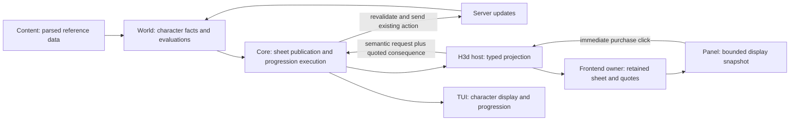

# H3d character sheet and progression

Status: implementation and automated verification complete. User visual
acceptance remains outside automated verification.

## Goal and boundaries

Let a connected player inspect one current character view in h3d—level,
attributes, vitals, skills, armor, resistances, vitae, and relevant effects—and
train or raise eligible stats with immediate, server-authoritative purchases.

In scope:

- Activate the existing Training dock shortcut as the Character panel.
- Character level, progress toward the next level, available XP and skill credits.
- Compact stat rows with important values and actions inline; expandable details.
- Attribute, vital, and skill advancement through +1, +10, and Max actions.
- Skill training, including exact credit costs and actionable rejection reasons.
- Detailed explanations of base/effective values, formulas, and enchantments.
- Armor, resistances, and vitae alongside trainable stats in the h3d Character
  panel, with relevant enchantment contributions at the affected rows.
- Live sheet refresh and purchase-guard release for network-originated stat and
  resource updates, including ACE `@god` and `@ungod` bursts.
- Migrate the TUI Character display to the same core character-state contract;
  remove redundant broad stat/level projections after named consumers move.
- Correct shared skill/vital stat semantics, including authored formula inputs,
  skill usability, and applicable augmentation bonuses, before exposing their
  breakdowns. This may change non-panel consumers of shared stats.
- Shared progression evaluation and execution, with the TUI migrated to the same
  machinery for its existing one-rank and training interactions.
- Typed host transport, session lifecycle, focused tests, and browser verification.

Out of scope: specialization purchases, untraining, augmentation or luminance
spending, character creation, a general character biography/equipment page,
renderer work, new protocol opcodes, redesigning the TUI layout, and replacing
the dedicated h3d Enchantments inspector.

User decisions: +1/+10/Max controls; all spending immediate without confirmation;
one row per skill with important facts inline and expandable detailed information.
Apply the same row pattern to attributes and vitals. The implementation defaults
below make the remaining routine UX choices explicit.

## Ground truth and existing owners

Paths are relative to the repository root. Recheck symbols during implementation;
these references describe the inspected source, not a promise that it is correct.

| Source | Evidence or role |
| --- | --- |
| `ACE/Source/ACE.Server/WorldObjects/Player_Attributes.cs` | Attribute purchases, available-XP and cap checks, stat/resource updates. |
| `ACE/Source/ACE.Server/WorldObjects/Player_Vitals.cs` | Vital purchase validation and updates. |
| `ACE/Source/ACE.Server/WorldObjects/Player_Skills.cs` | Trained/specialized XP curves, training costs, training resets, augmentation-induced specialization, and updates. |
| `ACE/Source/ACE.Server/Entity/AttributeFormula.cs` | Server formula inputs and rounding. Uses skill/secondary-attribute DAT tables. |
| `ACE/Source/ACE.Server/WorldObjects/Entity/CreatureSkill.cs` | How attribute contributions, ranks, initial values, and effects form skill values. |
| `ACE/Source/ACE.DatLoader/FileTypes/SecondaryAttributeTable.cs` and `Entity/SkillFormula.cs` | Vital formula record `0x0E000003` and six-field authored formula layout. |
| `ACE/Source/ACE.Server/WorldObjects/Player_Skills.cs` | Exact melee/missile/magic augmentation skill sets. |
| `acclient-eor-source/acclient.c:423329` | `SkillFormula::Calculate`: weighted authored expression, rounded with `floor(value + 0.5)`. Read-only reference. |
| `crates/holtburger-dat/src/file_type/{xp_table,skill_table}.rs` | Cumulative XP thresholds, skill definitions/formulas, and synthetic retired-skill entries. |
| `crates/holtburger-world/src/{stats,bootstrap,context}.rs` | Existing stat contracts and access to parsed runtime reference data. |
| `crates/holtburger-world/src/player/{mutations,stats_calc}.rs` | Initial hydration, incremental updates, cached values, and current hardcoded skill formulas. |
| `crates/holtburger-world/src/enchantments.rs` | Effective/overridden modifiers, shared enchantment identity, and skill-wide effects. |
| `crates/holtburger-core/src/client/{types,commands,mod}.rs` | Snapshots/events and existing amount-based progression commands. |
| `crates/holtburger-core/src/client/{runtime,messages,character_sheet}.rs` | Live packet routing, the separate sheet-emitting handler, and current shared sheet construction. |
| `crates/holtburger-core/src/client/item_use.rs` | Existing semantic preview/submission pattern; progression does not need a transaction executor. |
| `apps/holtburger-cli/src/pages/game/panels/dashboard/tabs/character/{render,tab}.rs` | Existing rows, formula text, eligibility arithmetic, and one-rank actions. |
| `apps/holtburger-cli/src/pages/game/domains/progression.rs` | TUI action-to-core dispatch. |
| `apps/holtburger-cli/src/pages/game/domains/player.rs` and `apps/holtburger-cli/src/scripting.rs` | Existing broad stat/level consumers and the focused vital-change script trigger. |
| `apps/holtburger-3d/host/src/{client_runtime,client_projection}.rs` | Actual client host command and event boundaries; this app currently uses Electron, not the older Tauri layout. |
| `apps/holtburger-3d/src/client/{client-host-contract,client-lifecycle-session}.ts` | Browser contracts and session ownership. |
| `apps/holtburger-3d/src/client/{ClientShortcutDock,ClientWorldView,ClientEnchantmentsPanel}.svelte` | Inactive Training shortcut, implemented-window dispatch, and existing enchantment UI. |
| `apps/holtburger-3d/src/client/ClientCharacterSheetPanel.svelte` and `client-enchantments-view.ts` | Current progression rows and already-resolved effect grouping for h3d presentation. |
| `ACE/Source/ACE.Server/Command/Handlers/AdminCommands.cs` | `@god`/`@ungod` emit level/resource and individual stat updates; useful high-volume live-update cases. |
| `apps/holtburger-3d/src/client/{client-hud-layout,client-ui-defaults}.ts` | Persisted placement integration and panel size defaults. |

Findings recorded during design and execution:

- World already exposes ranks, invested XP, next thresholds, base/effective values,
  skill training state, and costs. Reuse these facts rather than introducing a
  parallel character model.
- Before the original cutover, the TUI subtracted invested XP and decided
  affordability in rendering while core forwarded caller-supplied amounts.
  Shared progression now owns those decisions.
- Bulk purchases require one existing raise action with an XP amount; ACE derives
  resulting ranks. No loop of one-rank wire requests is needed.
- Shared skill calculation previously hardcoded formulas while TUI formula text
  read DAT. The calculation now uses authored formulas; explanations must come
  from that same calculation, not a second formula.
- Gameplay modifier arithmetic calls `PlayerEnchantments::top_for`, while
  `PlayerEnchantments::resolved` builds display groups. Both now use the same
  winner selection, so published breakdowns and arithmetic agree.
- `emit_player_derived_stats` refreshes cached values after direct stat updates
  have already calculated values for their immediate events. Both paths were
  kept coherent in the shared evaluation result.
- ACE skill values include usability gating and base/current augmentation bonuses;
  ACE vital contributions read the secondary-attribute DAT table. Shared world
  applies these inputs; breakdown and consumer verification is complete.
- ACE's formula evaluator and retail's weighted evaluator differ structurally.
  A census of the local `dats/assets.hba` portal skill table found 38 authored
  records: 32 active formulas with `w=0`, `x=1`, and a retail-equivalent second
  attribute coefficient, plus six `x=0` records without an attribute formula.
  All three vital formulas also match ACE's supported shape. No authored formula
  in this local bundle exposes the structural difference; retain a check for new
  or revised content rather than assuming arbitrary coefficients are equivalent.
- ACE handlers emit stat/resource updates and sometimes chat; they do not provide
  a dedicated progression transaction ID. Some rejections only log server-side.
- Before the extension, `ClientApplicationSnapshot` contained vitals but lacked
  a complete character sheet. Initial snapshots and incremental events now
  publish one.
- **Post-implementation finding:** normal network packets called
  `handle_runtime_world_event_with_context` and bypassed
  `handle_world_event`'s sheet emission and progression reconciliation.
  Direct-handler tests missed this route; packet-path regression coverage now
  protects the unified publication path.
- The TUI Character tab also displays armor, eight resistances, vitae, and
  resolved enchantments. The shared sheet now includes armor, resistances, and
  vitae; enchantments retain an independent live feed in both frontends.
- **Extension dry-run finding:** TUI resync previously applied
  `ApplicationSnapshot` only in its entity reducer. The player reducer now
  restores the sheet and resolved enchantments before progression requoting.
- **Extension dry-run finding:** one vital packet can emit both `VitalUpdated`
  and `DerivedStatsUpdated`; core previously turned both into
  `PlayerVitalsUpdated`. Packet-scoped projection now preserves one HUD/script
  edge and one final sheet publication.
- ACE sends `@god` resources before its individual stat packets and `@ungod`
  restores resources after its stat packets. There is no command transaction ID
  in these updates. Intermediate sheets may contain a mix of old and new fields;
  the client must deliver each authoritative update and converge to the final
  world state rather than delay publication while guessing a burst boundary.

Existing ACE submodule changes are unrelated; preserve them.

## North stars and layer ownership

1. **World owns game understanding.** Formulas, stat breakdowns, progression costs,
   caps, and eligibility are typed shared facts, computed once by their owner.
2. **Core owns reusable execution.** It validates current intent, prevents duplicate
   submissions against the same target state and sends actions. Server updates
   remain the source of displayed results; core does not infer transaction success.
3. **Content owns discovery.** Reuse parsed bootstrap/reference data; neither core
   nor world gains archive paths or disk-discovery policy.
4. **Protocol owns bytes.** Keep existing wire actions and deterministic encoding.
5. **H3d owns presentation.** Ordering, expansion, labels, window placement, and
   choosing to show +1/+10/Max belong in the app, not shared crates.
6. **Subtract before extending.** Replace duplicated formula/affordability logic;
   do not retain old and new progression paths for compatibility.
7. **Authoritative results only.** A submitted command is not a successful purchase.
   Never optimistically change stats, balances, or training state.
8. **Correct shared semantics before detailed presentation.** Show calculation
   inputs and effects from the same world evaluation that updates shared values.
   Keep authoritative player properties in world state, not a duplicate UI cache.
9. **One character-fact contract, separate UI policies.** Core publishes a
   coherent character snapshot for both frontends. H3d and TUI choose their own
   layout; focused vital-change notifications may remain for HUD or scripting
   consumers that need an edge rather than a replacement snapshot.

## Behavior and contract design

### Rows and interaction

- Summary: level, XP toward the next level, available XP, and skill credits. Render
  the level cap explicitly rather than presenting a nonexistent next level.
- Sections: Attributes, Vitals, Skills, and Defenses (armor and resistances),
  with vitae in the summary/vital context. Attributes/vitals use stable enum order;
  skills group Specialized, Trained, and Untrained/Unusable, alphabetically within
  each group. Use the existing end-of-retail skill predicate for visibility.
- Inline: name, base/effective value, skill training status, and enabled/disabled
  action buttons with exact costs. Vitals show current pool and effective maximum;
  their base maximum remains distinguishable from the current pool.
- +1 and +10 buy exactly that many ranks. An unavailable +10 never silently becomes
  a smaller purchase. Max buys all affordable complete ranks up to the cap.
- Max leaves any XP insufficient for another complete rank unspent. Max with no
  affordable rank is disabled. Never send zero-XP advancement requests.
- Train displays a credit cost; its success state comes from the server, including
  any automatic specialization caused by an existing augmentation.
- Disabled buttons explain insufficient resources, caps, missing facts, or a row
  awaiting a target update. Other rows remain usable subject to their own checks.
  Expanding a row never spends resources.
- Details: description, starting/initial value, purchased ranks, invested XP,
  attribute formula and input values, inherited attribute effects, direct effective
  modifiers, overridden modifiers, and relevant rounding/clamps. Link existing
  spell presentation rather than duplicating spell metadata or resolution.
- Show armor and each resistance as read-only current values. Show vitae as a
  penalty when active, with an explicit normal state where useful. Surface the
  effective and overridden enchantments affecting these rows through the
  existing resolved-enchantment feed; do not repeat effect-priority arithmetic
  or move the full searchable spell registry into the Character panel.
- Keep all purchases immediate. Do not add confirmation dialogs or a shopping cart.

### Shared contracts

Introduce focused modules under world and core rather than growing the command
dispatcher into a progression service. Names below are proposed implementation
names; final naming should follow neighboring modules consistently.

- `StatTarget`: attribute, vital, or skill with its typed identifier.
- `StatBreakdown`: the calculation's base/effective result and typed contributing
  inputs/operations. It is emitted by the value calculation, not independently
  reconstructed by the UI. The same modifier query must supply arithmetic and
  effective/overridden enchantment keys, including skill-wide channels; a second
  display-only priority pass is insufficient.
- `ProgressionIntent`: train a skill or raise a target by an explicit positive rank
  count / maximum affordable ranks. The evaluator supports arbitrary counts; only
  the frontend chooses the visible +1/+10 presets.
- `ProgressionEvaluation`: available quote or a typed unavailable reason. An
  available quote contains target, operation, exact spend, resulting rank/training
  expectation, and the source facts needed to reject stale submissions.
- `CharacterSheet`: coherent ready-state facts and breakdowns for the current
  character, including world-owned armor, resistances, and vitae. Distinguish
  not-yet-hydrated from an empty collection. Enchantment registry/timers remain
  a separate live contract; the frontends compose them with sheet values.
- Per-target submission guard: the training/ranks/invested-XP state already
  submitted for the active character. Expose guarded targets to disable their rows
  and use existing command-error reporting; no transaction-outcome state machine.

Do not add a revision that changes on unrelated movement or vital regeneration.
Quote validity depends on target training/ranks/invested XP, the relevant resource
balance, reference-data identity, and character/session identity. Recompute through
the same evaluator at submission and compare the quoted consequence. Reject and
refresh stale quotes; do not spend a different amount than the displayed quote.

Large character XP totals cross the JSON boundary as decimal strings. Format them
without converting through JavaScript `number`; Rust remains the arithmetic owner.
Individual wire spends remain checked against the existing integer field limits.

### Flow and lifecycle

- Publish character-sheet state in the complete application snapshot and update
  it after relevant authoritative mutations. Reopening a panel must not depend on
  having observed the original login events.
- The resolved-enchantment event follows the same core-to-frontend routes but
  remains independent of the sheet so effect lifetimes and registry changes do
  not alter character-fact ownership.
- The live packet path and synthetic/direct world-event path must share the
  sheet-refresh and guard-reconciliation decision. Publish the final state after
  the relevant world mutations in an authority turn; avoid one full-sheet copy
  for both a direct stat event and its derived-stat event from the same packet.
  Preserve ordered vital-change edges needed by scripts even if sheet publication
  is coalesced. A bounded `@god`/`@ungod` burst must end with the final sheet.
- Keep network-rate facts in an imperative frontend owner. Mounted UI pulls a
  coherent view at an explicit tuning-controlled cadence; user expansion and
  controls are ordinary cold Svelte state. Do not rebuild owners on stat changes.
- Allow one submission per target training/ranks/invested-XP state. Core checks and
  records this guard before dispatch so rapid clicks, alternate buttons, and other
  consumers cannot resubmit the same target state. A client-side disabled button
  alone is not the guard.
- Only that target's spending controls wait. An authoritative change to its
  training, ranks, or invested XP releases the guard. Balance changes, buffs,
  derived-value changes, and vital regeneration do not release it. This is duplicate
  suppression, not proof that a particular transaction succeeded.
- Other targets remain usable. Reevaluate their prices and affordability against
  current authoritative resources on every submission. Do not reserve XP locally
  or correlate exact balance deltas; ACE remains authoritative if multiple requests
  race against a balance whose updates have not arrived yet.
- Display incoming stat and resource updates normally. Sending a request does not
  produce a local purchase-success message. Surface send errors and existing server
  feedback, without interpreting generic chat as a correlated acknowledgement.
- If dispatch is known not to have occurred, clear its guard and report the error.
  An ambiguous send failure must not automatically permit a duplicate request.
  Never automatically retry spending.
- Accept that a silent server rejection can leave that row awaiting an update.
  Do not add timeout recovery, retry controls, a global spending lock, or a
  reconnect-as-recovery workflow in this slice. Revisit explicit recovery only if
  investigation or normal use demonstrates the need; a timeout cannot prove failure.
- Clear retained quotes and guards on session replacement. Ignore late responses
  from retired sessions. Panel close/reopen and cached snapshot reads preserve
  guards; they do not constitute new authoritative target state.

## Phased implementation

### Phase 1 — Prove rules and consolidate stat calculations

- [x] Trace each ACE raise/train handler through resource updates, success updates,
  cap checks, and rejection paths. Identify the authoritative target fields that
  change after each action; tests must not assume a transaction acknowledgement.
- [x] Decode `SecondaryAttributeTable` (`0x0E000003`) in DAT using the existing
  six-field skill-formula record shape, then load it beside skill/XP tables in
  content/bootstrap assembly. Update all `WorldBootstrap::new` callers and
  synthetic fixtures in one compiling cutover; no archive reads in world/core.
- [x] Compare ACE `AttributeFormula` and retail's weighted evaluator against
  authored skill and secondary-attribute records where assets are available.
  Check synthetic retired entries separately. ACE server behavior owns the
  connected client's resulting value; document any proven retail difference.
  The local `dats/assets.hba` contains the needed portal records; use them for
  a read-only census and synthetic fixtures for retained tests. Do not add tests
  whose success depends on that unchecked-in archive.
- [x] Replace the hardcoded skill/vital formula switches with parsed, typed
  inputs. Match ACE skill usability rules, additive base bonuses (all-skills,
  melee/missile/magic, enlightenment) and current-only bonuses (Jack of All
  Trades, specialized luminance); keep ACE ordering around multiplication,
  direct enchantments, rounding, and clamps. Read augmentation properties from
  the authoritative local-player entity through world-owned evaluation, without
  copying them into a second mutable cache.
- [x] Make one shared evaluation produce the cached stat value and its typed
  explanation. Include attribute inputs, ranks/initial values, augmentation
  contributions, direct/overridden enchantments, and rounding/clamps. First
  unify the modifier query behind `top_for` and `resolved` so winning keys and
  scalar values cannot diverge. Route immediate stat events and derived-stat
  refresh through the same evaluation; preserve refresh after stat, enchantment,
  and augmentation property updates. Verify untrained/unusable skill cases and
  character replacement.
- [x] Test authored formula decoding, skill/vital attribute dependencies,
  usability, each augmentation class, trained/specialized behavior, inherited
  and direct modifiers, overrides, rounding, clamps, and current/base separation.
  Compare affected movement, combat, and spell consumers against ACE behavior.

Deliverables: world calculation/breakdown contracts, parsed reference-data plumbing
where necessary, and focused tests. New types and unintuitive rules are commented.

Acceptance: explanations reconcile with the same results used by existing world
consumers; there is no independent display-formula evaluator. Synthetic fixtures
cover ACE ordering and all decoded formula fields. Proven changes to existing
values are documented with authoritative references and affected consumer tests.

### Phase 2 — Shared progression evaluation and execution

- [x] Add pure quote evaluation using cumulative XP thresholds minus invested XP.
  Use checked arithmetic and explicit unavailable cases; do not mask inconsistent
  thresholds with saturating subtraction.
- [x] Implement one-rank, arbitrary-rank, Max, and training evaluation. Validate
  trainability from authoritative references rather than assuming cost > 0 is the
  universal rule; preserve unavailable and zero-cost distinctions where applicable.
- [x] Add semantic core submission, current-state revalidation, and a per-target
  duplicate guard. Publish guarded targets and surface dispatch errors without
  introducing completion correlation, balance reservations, or timeout recovery.
- [x] Replace TUI amount-bearing progression actions with shared evaluations and
  submissions, retaining its existing one-rank/training UX. Remove the old raw
  amount command variants in the same compiling milestone.
- [x] Test partial investment, exact affordability, different XP curves, caps,
  invalid counts, integer limits, stale quotes, repeat clicks across button choices,
  and reordered updates. Verify other targets remain usable; balance/buff/pool
  changes cannot release a guard, but training/ranks/invested-XP changes do.

Deliverables: world progression evaluator, core progression module and events,
updated TUI consumers, and protocol action reuse.

Acceptance: both clients can use one evaluator; callers cannot choose arbitrary
wire spending amounts; a bulk purchase emits exactly one wire action; no local
stat/balance mutation is used to simulate success.

### Steering checkpoint — Validate submission and authoritative refresh

Trace one attribute purchase, one vital purchase, one skill purchase, and one
training action from quote through observed updates. Include concurrent XP gain,
attribute-dependent stat refresh, delayed replies, and silent server rejection.
Verify target-state guards prevent repeat submissions without blocking other rows
or claiming to establish transaction success. Exercise cross-target requests before
balance updates arrive; server rejection is an accepted consequence, not a reason
to introduce speculative local balances.

Keep the silent-rejection limitation explicit. If investigation demonstrates a
practical need for recovery, bring the evidence back before expanding this slice.
If truthful stat explanations require a broader semantic correction, record its
concrete scope and seek direction before expanding into unrelated systems. Update
remaining milestones with findings; do not add guessed acknowledgements or retries.

### Phase 3 — Host publication and frontend owner

- [x] Add complete sheet state and guarded targets to core application snapshots
  and relevant update events, projected through the mode-specific client host.
- [x] Add typed query/submission and response contracts across the host command
  inventory, Electron bridge/preload boundary, and frontend session. Follow existing
  command registration and validation patterns end to end.
- [x] Introduce a character-sheet frontend owner that retains facts and quotes,
  exposes display reads, invalidates stale responses, and survives panel remounts.
- [x] Preserve exact large XP totals and distinguish loading, ready, and failed
  states without fabricated zero values.
- [x] Test initial login, late snapshot attachment, updates, panel reopen, character
  replacement, disconnect, delayed responses, and integer serialization.

Acceptance: a session consumer can recover a complete sheet without replaying
earlier events, and an old character's quotes can never reach a new session.

### Phase 4 — Character panel and immediate actions

- [x] Activate the existing Training icon; label its shortcut and window Character.
  Add the panel discriminator, default placement, persistence normalization, and
  reset behavior without conflating it with the existing character HUD placement.
- [x] Add summary, grouped compact rows, exact action costs, disabled explanations,
  and expandable detailed breakdowns using existing app styles/components.
- [x] Render +1/+10/Max and Train as immediate actions using current shared quotes.
  Disable the submitted row immediately and reflect core guards thereafter; other
  rows remain usable subject to shared eligibility and affordability checks.
- [x] Reuse spell metadata, icons, and inspection where appropriate. Show effective
  and overridden effects distinctly; frontend code does not resolve effect priority.
- [x] Add synthetic showcase/browser scenarios for trained/untrained/capped stats,
  modifiers, low XP, guarded rows, send failures, and silent server rejection.

Acceptance: important information and spending controls are available without row
expansion; expansion exposes the explanation; all spending has no confirmation
dialog; unavailable actions explain why. Visual acceptance belongs to the user.

### Phase 5 — Cleanup and verification

- [x] Remove duplicated TUI affordability/formula logic, replaced command names,
  obsolete tests, dead adapters, and stale labels/comments from touched surfaces.
- [x] Review new shared fields for named consumers; keep sorting, expansion,
  window placement, and button presets app-local. Assess added lines against removed
  duplication; avoid a generic transaction framework for four progression actions.
- [x] Run focused Rust unit tests for changed crates and clippy with `-D warnings`.
- [x] In `apps/holtburger-3d`, run `npm run check`, `npm run test:ts` for affected
  tests, `npm run lint`, and `npm run format:check`; verify Rust formatting as well.
- [x] Exercise production panel components through `npm run harness:browser -- ...`
  with synthetic character/session fixtures. Assert interaction, emitted requests,
  lifecycle teardown, and absence of browser errors; no agent visual acceptance.
- [x] Report automated evidence, unresolved risks, and the user visual checklist.

No TUI launch, staging, commits, or tests depending on unchecked-in assets. A live
spending experiment changes a character and is not implied by browser verification;
use synthetic fixtures unless the user explicitly authorizes such an experiment.

### Phase 6 — Repair live publication and complete character facts

- [x] Add a regression that sends encoded level, resource, attribute, skill, and
  vital updates through `ClientRuntime::handle_message` (the real packet path),
  then observes a current `CharacterSheetUpdated` and released target guards.
  Include an ACE-shaped `@god`/`@ungod` sequence with high-but-valid `u32` spent
  XP and level 999. Start from a described character so readiness matches normal
  entry. No live admin command or unchecked-in asset is required.
- [x] Unify the common post-world-mutation decision used by network packets,
  direct world-event calls, and simulation-generated events. Let
  `handle_world_events` finish its packet-scoped follow-ups before flushing one
  character-state decision; keep motion/activation effects in the runtime
  handler. Reconcile progression and publish a sheet after authoritative
  character changes; do not call both old paths and duplicate entity
  projections or sheet events. Preserve spell-inspection refresh currently
  present only in `handle_world_event`.
- [x] Extend `ClientCharacterSheet` from world-owned
  `player_armor`/`player_resistances`/`player_vitae`; carry the fields through the
  host wire shape, TypeScript schema, initial snapshot, and incremental event.
  Use the existing resolved-enchantment contract for effects and timers.
- [x] Check the event count and final state for a bounded admin-command burst.
  Coalesce duplicate sheet publications within one packet/authority turn where
  needed; retain the final replacement. A vital packet's direct and derived
  events must yield one HUD/script vital update, while a current-only vital
  packet still yields one. Test the host's lag-resync snapshot with a populated
  sheet as well as ordinary event delivery.

Deliverables: one live core character-state path, complete shared defensive
facts, typed cross-boundary contracts, and packet-path regression tests.

Acceptance: outside stat/resource changes refresh the mounted or reopened h3d
sheet without a purchase or reconnect; a matching target update releases its
guard. The final `@god` and `@ungod` snapshots match world state, including
level, spent XP, armor, resistances, and vitae. No duplicate per-packet full-sheet
publication is introduced by combining direct and derived stat events.

### Phase 7 — Surface the unified view in h3d

- [x] Add read-only armor and resistance rows and a clear vitae value/penalty to
  the Character panel. Preserve the current compact/expandable stat row pattern
  and spending actions only where progression is supported.
- [x] Compose the Character panel with the session's existing resolved
  enchantment feed. Show effective and overridden contributions next to their
  affected attribute, vital, skill, armor, resistance, or vitae context. Reuse
  shared effect identity and existing spell metadata; calculate remaining time
  from the feed timestamp in presentation, not in the core sheet. Pass the
  already-owned `ClientWorldView` enchantment state into the mounted panel; do
  not add a second listener or enchantment cache to the sheet owner.
- [x] Keep the dedicated Enchantments panel as the searchable registry inspector;
  share grouping/label helpers where useful, without duplicating effect-priority
  logic or storing a second mutable character model in h3d.
- [x] Add focused state/component fixtures for normal and admin-sized values,
  no-effect and overridden-effect rows, live refresh while open, remount, and
  character replacement. Run noninteractive browser checks for interaction and
  console errors; user owns visual acceptance.

Acceptance: h3d shows the same categories of current character values as the
TUI Character tab. Changing a stat, resource, defense, or effect outside the
panel updates its appropriate row, while purchases remain immediate and gated
only by shared quote/guard state.

### Steering checkpoint — Check contract completeness and event cost

Compare one live packet trace and one synthetic `@god`/`@ungod` burst against
both frontend projections. Confirm the complete sheet has a named consumer for
every field, that effect rows use the independent resolved feed, and that one
stat packet does not cause redundant full-sheet publication. If throughput or
latency is poor, improve publication at the authority boundary before making
the TUI depend on it. Keep the bounded, final-state guarantee; do not invent a
parallel frontend polling route.

### Phase 8 — Cut the TUI Character view over to the shared sheet

- [x] Consume both `CharacterSheetUpdated` and
  `ApplicationSnapshot.character_sheet` as character-scoped replacements in the
  TUI player reducer; the latter is required after broadcast lag/resync. Populate
  its local display shape atomically with level, attributes, vitals, skills,
  armor, resistances, and vitae; clear it on character retirement. Keep TUI
  ordering, labels, and layout local. Match the sheet GUID to the selected
  character and test replacement/retirement rather than accepting a late old
  character sheet. Restore original enchantment records alongside resolved
  groups in resync snapshots so selecting a displayed effect still opens Details.
- [x] Requote only when sheet training/ranks/invested XP or spendable resources
  change; current vital pools and timed-effect presentation do not reprice a
  purchase. Read guarded targets from the same sheet state.
- [x] Preserve `PlayerVitalsUpdated` where its change edge is needed by the HUD
  or `SelfVitalsChanged` scripting event. The Character display reads its vital
  values from the sheet; a sheet replacement alone does not fire a vital-change
  script notification. Verify one notification for a vital packet and none for
  a recovery snapshot; inspect all remaining subscribers before retaining or
  renaming this focused event.
- [x] Once named consumers have moved, delete
  `PlayerStatsSkillsUpdated`/`PlayerLevelInfoUpdated` and their projection code,
  update TUI tests to exercise the shared sheet, and sweep obsolete labels and
  comments. Do not retain two full character-state event models for compatibility.

Acceptance: the TUI Character tab and progression controls render from the same
core sheet contract as h3d, while its vital-change scripts still fire once per
relevant server edge. Both frontends remain current through external stat
changes and a resync/replacement snapshot.

### Phase 9 — Cleanup and verification of the extension

- [x] Review full-sheet publication frequency and memory/serialization cost
  under normal pool updates and the admin burst; remove redundant clones/events
  rather than adding frontend throttles to mask a core fan-out problem.
- [x] Run focused world/core/host/TUI tests, workspace clippy with `-D warnings`,
  Rust formatting, h3d TypeScript checks/tests/lint/format, and the focused
  noninteractive Character browser probe. Do not launch the TUI client.
- [x] Check touched docs, metrics, names, and test fixtures for the removed
  broad event vocabulary. Report automated evidence and leave visual acceptance
  to the user.

Acceptance: no stale full-state stream remains, all affected checks pass, and
the only retained narrow events have explicit HUD or scripting consumers.

## Risks and mitigations

| Risk | Mitigation / accepted limitation |
| --- | --- |
| Displayed formulas disagree with computed stats | Produce explanations within the shared calculation; verify source semantics before replacing hardcoded formulas. |
| Stat fixes affect movement, combat, or casting consumers | Test dependency refresh and current shared consumers; avoid cosmetic-only patches hiding semantic disagreement. |
| Repeated clicks resubmit the same target state | Core-owned per-target duplicate guard, shared across button choices, plus quote revalidation. |
| Silent server rejection leaves a row waiting | Accept the row-local limitation initially; surface existing feedback, never auto-retry, and defer recovery UX until evidence warrants it. |
| Multiple targets spend before balance updates arrive | Validate against current authoritative facts; accept server rejection rather than introducing resource reservations or a global lock. |
| Large XP totals lose precision in JavaScript | Decimal-string wire totals; arithmetic remains in Rust. |
| Incoming stats drive excessive Svelte work | Imperative owner and bounded coherent display reads. |
| Live network packets bypass sheet emission and guard reconciliation | Exercise the actual packet path and share one post-mutation decision across runtime entry points. |
| Full sheets flood the host during admin stat bursts | Publish once per relevant packet/authority turn, verify bounded burst delivery and final state before considering broader coalescing. |
| Admin commands expose temporary mixed stat/resource values | Accept packet-authoritative intermediate states; verify final convergence rather than inventing transaction detection or speculative buffering. |
| TUI migration drops armor/resistance/vitae or vital-change script edges | Expand the shared sheet before cutover; keep the focused vital edge for named HUD/script consumers. |
| Resync restores entity facts but leaves the migrated TUI Character tab stale | Apply `ApplicationSnapshot.character_sheet` and its paired original/resolved enchantment records in the TUI player reducer; test character identity and effect selection. |
| Direct and derived vital events duplicate script notifications | Consolidate the per-packet vital projection while retaining current-only and derived maximum changes. |
| Enchantment duration and priority diverge between panels | Use the existing resolved registry and receipt time; keep arithmetic/effect selection in shared world code. |
| Missing reference data looks like a free or zero-valued stat | Explicit unavailable/error states; no implicit zero-cost fallback. |

## Definition of done

- [x] Character panel opens from the existing shortcut and restores its placement.
- [x] Level/resources and attributes/vitals/skills reflect live authoritative
  updates through the network path, including external changes.
- [x] Inline +1/+10/Max and Train implement the specified immediate behavior.
- [x] Expanded explanations reconcile with shared calculated values.
- [x] TUI and h3d share progression rules and semantic execution.
- [x] Stale/duplicate submissions and retired-session replies are covered by tests.
- [x] Guarded rows visibly await target updates; other rows remain usable. No
  invented success messages, automatic retries, or transaction-confirmation locks.
- [x] Original-slice Rust, TypeScript, formatting, lint, and browser checks passed.
- [x] Original-slice cleanup completed; visual acceptance was left to the user.
- [x] H3d also presents armor, resistances, vitae, and relevant effective and
  overridden effects in the Character panel.
- [x] TUI Character display uses the same complete core sheet; obsolete broad
  stat/level events are removed and vital-change scripting is preserved.
- [x] Packet-path and admin-burst regressions prove final-state delivery and
  purchase-guard release; extension checks pass without launching the TUI.

## Open questions and execution notes

**Resolved scope decision (user approved full correction):** ACE's
`CreatureSkill.Base`/`Current` add augmentation and enlightenment bonuses that
shared world previously omitted. ACE's vital attribute contributions come from
`SecondaryAttributeTable` (`0x0E000003`), which DAT/bootstrap previously lacked.
`CreatureSkill.IsUsable` gates the formula contribution by training state and
skill definition, while the previous shared calculation used a hardcoded formula
for every known skill. The user chose to correct these shared stat semantics
before detailed panel presentation. Phase 1 explicitly sizes effects on movement,
combat, and other consumers. The earlier claim that no retail portal asset was
available was incorrect: `dats/assets.hba` is present
locally. Its 38-record skill and three-record vital formula census is recorded
above; it is diagnostic evidence, not a checked-in test dependency.

Implementation evidence: `crates/holtburger-world/src/progression.rs` quotes
single-rank, fixed-count, Max, and training spends from current world facts and
cumulative DAT thresholds. DAT/bootstrap assembly, authored formulas, ACE skill
usability, augmentation bonuses, vitae ordering, and shared stat breakdowns are
implemented. The local HBA census covered 38 skills and three vitals. ACE
raise/train handlers confirm successful purchases update target ranks/invested
XP or training state and resource balances; some rejection paths only log
server-side. The affected-consumer audit found that movement reads world-owned
current Jump skill, spell inspection reads current school skill, and ACE combat
and magic decisions read `CreatureSkill.Current` (`Player_Combat.cs` and
`Player_Magic.cs`). No new client-side combat calculation was introduced; world
tests cover refreshed cached values and movement capability dependencies. The
final Rust runs passed 913 world tests, 537 core tests, 127 DAT
tests, 324 TUI tests across its library and binary, and 326 host tests. Workspace
clippy with `-D warnings` and Rust formatting passed. The app passed `npm run
check`, `npm run lint`, `npm run format:check`, and all 2,702 TypeScript tests. Two
unrelated renderer tests timed out during an overloaded parallel run; the full
suite passed when rerun alone. The focused production browser probe passed exact
large-XP display, immediate +1/+10/Train/Max submissions, independent target
controls, low-XP and cap reasons, effective and overridden modifier details,
guard retention after panel reopen and silent rejection, ambiguous send-failure
feedback, and retirement of a delayed old-character sheet. It reported no page
console errors. The broader HUD probe's earlier spell-search assertion is
unrelated to this focused Character check. Expanded modifier names resolve through
the existing spell-reference service; icon leases and full spell inspection remain
in the dedicated spell/enchantment presentation, where those controls have a
named consumer.

+10 exactness, complete-rank Max, and section ordering remain the documented
implementation defaults. The user approved replacing global purchase
confirmation with shared validation, a small per-target duplicate guard, and
server-driven display updates. Global locks,
exact balance reconciliation, timeout recovery, and reconnect-as-recovery policy
are removed from this slice.

Extension steering: the original validation covered direct sheet events and
synthetic panel interaction, but did not exercise external stat packets through
the live runtime path. That gap explains the stale h3d panel and can also delay
purchase-guard release. The user chose a unified Character view now, including
armor, resistances, vitae, and relevant effects in h3d, followed by a TUI
character-state cutover. The historical validation numbers above are a baseline,
not evidence that phases 6–9 pass. Keep the accepted silent-rejection limitation
visible in UI and verification; revisit recovery only with evidence from actual
use. Live spending was not run. Visual acceptance belongs to the user.

Phase 1 must establish discoverable facts rather than asking the user to guess:
the authoritative formula behavior for supported skill records, trainability edge
cases, and which updates change target training/ranks/invested XP. Record
findings and justified course corrections here during implementation.

Extension evidence: the encoded-message regression exercises external level,
resource, attribute, vital, and skill changes, including ACE-sized level 999 and
large spent-XP values. It observes one final sheet per packet, guard release,
and one focused vital edge for direct-plus-derived vital updates. The host lag
test restores a populated sheet from `ApplicationSnapshot`. H3d now joins
resolved effect groups to numeric stat identities, shows armor, eight
resistances, and vitae, and reuses the Enchantments countdown formatter. The
focused browser probe covers attribute, vital, skill, defense, and vitae row
effects, overridden effects, no-effect rows,
external defense/effect refresh while open, actions, remount, retirement, and
absence of page errors. TUI consumes both live sheets and resync snapshots,
including the independent resolved-effect feed; stale character sheets are
ignored, and current-pool/effect-only changes do not reprice purchases. The
resync snapshot now pairs original enchantment records with resolved groups;
the TUI can open Details on a restored effect without relying on an old event.
Broad
stat and level events are removed; `PlayerVitalsUpdated` remains for HUD and
`SelfVitalsChanged` consumers. The normal vital update publishes one full sheet
and one narrow vital event; the admin burst is bounded to one sheet per packet.
The full Rust runs passed 913 world, 537 core, 326 host, and 310 TUI library
tests. Workspace clippy with `-D warnings`, Rust formatting, h3d TypeScript
checks/lint/formatting, all 2,704 TypeScript tests with a 15-second test
timeout, focused Character tests, and the noninteractive browser probe passed.
Two default-timeout runs hit one or two unrelated renderer stress tests; an
earlier default-timeout full run also passed. Four
core tests that open local sockets initially hit sandbox `EPERM`; the complete
core suite passed when rerun with loopback permission. No live spending or
visual acceptance was performed.

Final code-quality review: the current browser probe deliberately specifies a
compact Character panel: only affordable raise controls, applied modifier names
and values, and no overridden-effect children or countdowns. This supersedes
the earlier detailed-row presentation and browser-evidence claims above; the
dedicated Enchantments inspector retains those richer registry controls. Numeric
stat IDs added solely for the retired effect join were removed from the host
sheet contract, along with its attribute/vital wrappers and the unused shared
countdown extraction. Shared calculation breakdowns still preserve their inputs
and results for richer clients.

The review traced DAT/bootstrap inputs into world stat calculations and quotes,
core validation/guards and packet-final publication, host serialization and
command dispatch, frontend reset/repricing/submission, and TUI live/snapshot
consumption. It fixed the incomplete TUI sheet fixture and a delayed bridge
failure that could overwrite feedback after reset or an authoritative target
change; regression tests cover both retirement paths. Live spending and visual
acceptance remain outside this review.
