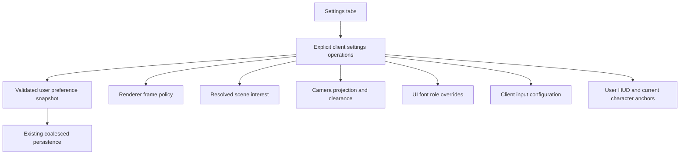

# H3D client settings

Status: implementation accepted by the user; final code quality review completed 2026-09-21.

## Final code quality review (2026-09-21)

- Reviewed the accumulated feature against HEAD, including new files, callers, tests, and the native character-selection form. ACE and ACViewer submodule contents are outside this change.
- Traced settings controls through ClientApp validation, section-specific application, the existing persistence scheduler, settings transport, and Electron disk replacement. Graphics were followed through scene interest, camera projection acknowledgement, GPU filtering capabilities, and renderer settings. Input was followed through the shared client instance, held-key cancellation, character/selection/combat/spell handlers, chat, and focused action bars. UI review covered font inheritance and placement reset using mounted action-bar geometry.
- Fixed two dispatch seams before commit: chat modifier restrictions now live in its default binding, allowing explicit remaps; native settings controls suppress cross-scope shortcut activation so Enter stays with the focused control. Added a browser regression check for the latter. Updated the character-picker browser probe from obsolete listbox navigation to native radio selection, Tab navigation, submit, and pending-entry locking.
- Retained separate runtime update handlers and shared durable snapshots. Retained migration support for settings versions used during acceptance, including removal of obsolete bindings. No shutdown acknowledgement was added; the previously accepted best-effort shutdown behavior remains.
- Maintenance walkthrough: adding a graphics preference requires its schema/default, editor, and consuming update path; adding a keyboard action requires its typed action/default, catalog label/context, and dispatch consumer. No generic settings framework is warranted.
- Limitations: this review does not establish renderer visual quality or performance across production scenes. Visual and interactive acceptance belongs to the user. The unchanged host protocol and renderer internals were inspected only at the settings seams.

## Implementation progress (2026-09-21)

- Added the v4 user document and v3 migration, preserving weather and character profiles. The new Graphics group and Settings HUD placement round-trip through the existing Electron store.
- Wired the Settings shortcut, tabbed window, graphics controls, GPU texture-filtering capability display, and keyboard access for settings controls. The browser HUD harness opens Settings, checks all three tabs, and verifies arrow-key navigation.
- Wired renderer graphics, stationary scene-demand refresh, and camera FOV clearance revision. Focused tests prove a stationary radius update and a FOV change without camera restart. Existing portal handling defers the active destination replacement until normal presentation resumes.
- The user judged an acknowledged renderer shutdown flush unnecessary for this feature. Removed its IPC callback, close interception, and failing synthetic probe. The existing debounced save and best-effort `beforeunload` behavior remain. A change made just before process exit can be lost; the main-process store still drains writes it has already received.
- Current checks: `npm run check`, all 2,640 TypeScript tests, `npm run lint:ts`, `npm run lint:dead`, `npm run format:check`, `npm run build`, `npm run build:electron:main`, and the post-cleanup `npm run harness:browser -- --client-hud --brief` pass. An earlier Graphics screenshot is `/tmp/holtburger-settings-hud.png.settings.png`.
- The user reported that the Graphics tab works and asked to complete the remaining UI and Input tabs. Font roles, current-character action-bar and user HUD placement reset, and disabled scaling placeholders are connected.
- The v7 user document persists the client keyboard map. The client owns a replaceable input configuration; the editor provides grouped bindings, key capture, conflict replacement, clear, per-action restore, restore all, and an alternate action modifier inside the Action bars group. Captured keys follow the current keyboard layout; existing physical-code bindings remain supported.
- Focused action bars now use the shared client cancel binding. The v6-to-v7 migration drops the separate bar-only cancel binding and preserves the shared one. Escape remains a fixed safety exit in the keyboard policy for focused UI; remapping client cancel does not remap every system window's close behavior.
- The browser HUD harness now exercises UI controls, key capture, restore, and contextual conflict replacement. Focused tests cover default conflict domains, replacement without release actions, and action-bar reset.
- The user will perform visual and interactive acceptance, including representative outdoor/indoor view distance, fonts, HUD reset, and remapped gameplay shortcuts. The synthetic harness does not establish scene density or visual quality.

## Goal and boundaries

Expose persistent client preferences through the existing Settings HUD shortcut, with Graphics, UI, and Input tabs, central ownership of configurable policy, and updates targeted to the subsystem that consumes each preference.

In scope:

- A floating settings window using existing HUD placement, focus, close, and resize behavior.
- Graphics: view distance, SAO, entity shadow mode, vertical FOV, texture filtering, render scale, and weather.
- UI: body/heading/monospace font selections, reset HUD placements, and visibly disabled text/icon scaling placeholders.
- Input: editable client keyboard bindings, capture, contextual conflict feedback, clear, restore defaults, and live application.
- Versioned persistence, bootstrap, lifecycle-safe application, focused tests, browser verification, and user visual acceptance.
- All new preferences are user-scoped in the existing config persistence system, shared across local characters. No per-character graphics, UI, or keyboard preference overrides.
- Consolidating the defaults and policies promoted into these settings, including removing competing client tuning reads.

Out of scope:

- General settings framework, event bus, renderer diagnostics editor, simultaneous system windows, actual text/icon scaling, OS font enumeration, pointer rebinding, Explorer settings UI, or server character options.
- New antialiasing algorithms, new shadow modes, automatic performance tuning, or extending server entity visibility.
- Color grading controls are deferred unless explicitly added to scope; the existing renderer support does not require exposing every parameter.

## Pre-implementation architecture baseline

Paths below are relative to `apps/holtburger-3d/`.

| Concern               | References and observed behavior                                                                                                                                                                                                                    |
| --------------------- | --------------------------------------------------------------------------------------------------------------------------------------------------------------------------------------------------------------------------------------------------- |
| Launcher/window       | `src/client/ClientShortcutDock.svelte`, `ClientWorldView.svelte`, `ClientHudWindow.svelte`: Settings is a stub; system panels share one `activePanel`                                                                                               |
| HUD geometry          | `src/client/client-hud-layout.ts`, `client-ui-defaults.ts`, `client-action-bar-state.ts`: ordinary placements are user-scoped; action-bar anchors are character-scoped                                                                              |
| Durable settings      | `src/client/client-settings-contract.ts`, `client-settings-defaults.ts`, `client-settings-persistence.ts`, `client-settings-transport.ts`; `electron/client-settings-store.ts`: strict versioned document, currently v3; coalesced serialized saves |
| Composition           | `src/client/ClientApp.svelte`: owns user settings, save errors, frame settings, and presentation lifetime                                                                                                                                           |
| Graphics defaults     | `src/client/client-tuning.ts`, `src/lib/frontend-frame-settings.ts`, `src/lib/frontend-tuning.ts`: client inherits renderer defaults, while FOV and scene interest are read directly from client tuning                                             |
| Live presentation     | `src/client/client-presentation-session.ts`: `setFrameSettings` already updates the retained/runtime policy; scene interest and camera projection need focused setters                                                                              |
| Scene rules           | `src/lib/game/runtime/scene-interest.ts`: subordinate radii must not exceed terrain; residency has an exit margin                                                                                                                                   |
| Shadow/filter options | `src/lib/game/renderer/entity-shadow-policy.ts`, `texture-filtering-policy.ts`: shadow modes `none`, `simple`, `shadow-maps`; filtering `nearest`, `linear`, anisotropic 2x/4x/8x, with capability resolution                                       |
| Typography            | `src/app/themes/holtburger-standard.css`, `src/app/ui-theme.ts`: body, heading, monospace CSS roles; world nameplates have separate renderer typography                                                                                             |
| Input                 | `src/lib/input/input-contract.ts`, `input-defaults.ts`, `app-input.ts`, `input-context.ts`, `keyboard-input-policy.ts`, `app-input-policy-context.ts`: typed semantic bindings exist, but client consumers import fixed `APP_INPUT`                 |
| Verification          | `src/harness/browser/ClientHudHarness.svelte`, client presentation tests, `scripts/verify-electron-settings-runtime.mjs`, package scripts                                                                                                           |

Additional integration references: `src/client/main.ts` loads/saves absence defaults before mounting; `electron/preload.cts` and `electron/main.ts` own settings IPC; `ClientSettingsStore.#document` explicitly writes the schema version. `src/lib/game/camera/possession-camera-controller.ts` and `client-camera-session.ts` distinguish requested projection from host-acknowledged projection. `src/lib/game/renderer/webgl2-renderer.ts` detects changed filtering and rebuilds dynamic appearances/flushes compiled draws, while the runtime frame-settings setter itself only validates selected fields and stores the snapshot.

This is app-local preference and presentation work. Shared Rust crates do not own font choices, binding editor behavior, radius presets, or tab state. The host camera boundary receives resolved projection/clearance facts through the existing typed path; preference storage stays in the frontend/Electron layers.

## North stars

1. One authoritative preference snapshot; no competing live copies in individual tabs.
2. One default source for each editable client value. Shared renderer primitives and internal tuning remain with their actual owners.
3. Disk snapshots and runtime update boundaries are independent. Saving the whole document must not reapply the whole runtime.
4. Explicit narrow operations, with no-op edits skipped. Tabs organize controls, not refresh scope.
5. Preserve imperative runtime lifetimes. Cold settings may be reactive; renderer/session/controller construction must not depend on mutable settings snapshots.
6. Derive the complete radius policy once in the client policy layer. Runtime consumers receive that policy without recreating its rules.
7. Prefer existing window, persistence, input matching, capability, and error-reporting mechanisms over new abstractions.
8. Every persisted field has a consumer. Disabled scaling stubs have no persisted values.

## Proposed settings and update contract

Extend the user preference contract with `graphics`, `ui`, and `input` groups. Keep existing HUD/layout and other unrelated fields in their current ownership unless moving one removes a real duplicate. Move the current top-level weather preference into `graphics` through migration; do not retain an alias.

Persist these groups under the existing document's `user.client` through `ClientSettingsPersistence` → `ClientSettingsTransport.saveUser` → the Electron settings store. Extend the existing schema, IPC validation, bootstrap loading, and migration. Do not introduce localStorage, a separate settings file, per-tab stores, or character-profile copies. Switching characters must neither reload these preferences from a character profile nor restore defaults.

Preserve the historical v3 user/HUD schemas before extending the current schema: the current v3 document directly references `clientUserSettingsSchema`, so extending that symbol in place would make old v3 documents fail before migration. Introduce a v4 document and v3-to-v4 migration, update the store's explicit emitted version, and keep older migrations returning their historical document types. Add later-phase fields only when their consumers land; if intermediate versions are shipped, version each durable shape rather than silently changing an already shipped schema.

The settings codec is imported by emitted Electron Node ESM. Keep its runtime import graph browser-free and Node-resolvable, including explicit `.js` specifiers. The shadow policy module currently imports frontend tuning; do not pull that entire runtime graph into the codec just to reuse an enum. If needed, extract the existing finite option vocabulary into a small dependency-free contract module consumed by both renderer and settings. Apply the same check to bounds and font identifiers; do not copy competing enum lists.

Keyboard preferences bind physical keys/chords to actions and are user-scoped, including spell and action-bar activation keys. Existing spell/item assignments to slots remain character data. Reset HUD placements is an operation, not a persisted preference: it also resets already character-owned action-bar anchors through their existing owner. This does not introduce any new character-scoped setting or migrate existing bar contents/layout ownership.

Conceptual shape (names finalized with the implementation):

```ts
graphics: {
  viewDistance: number;
  ambientOcclusionEnabled: boolean;
  entityShadowMode: EntityShadowMode;
  verticalFovDegrees: number;
  textureFiltering: TextureFilteringPolicy;
  renderScale: number;
  weatherEnabled: boolean;
}
ui: {
  fonts: {
    body: FontChoice;
    heading: FontChoice;
    monospace: FontChoice;
  }
}
input: ClientKeyboardBindings;
```

`FontChoice` is a validated identifier mapped to a curated CSS stack, including an explicit theme-default choice. Keep available choices stable across machines through fallback stacks. No arbitrary remote stylesheet or font loading.

`ClientKeyboardBindings` covers existing character/client/spell/combat/action-bar keyboard groups and the action-bar alternate modifier. Reuse the existing binding shape; exclude Explorer fly controls and pointer policy from client persistence. New captured chords use layout-resolved keys and explicit modifier states so they can be checked against existing default bindings. The contract still accepts physical codes. Existing defaults retain their intentional layout-key and wildcard-modifier semantics.

Place preference definitions, validation and defaults in the existing `client-settings-*` modules. Add a small `client-settings-policy.ts` only for the demonstrated radius resolution and preference-to-runtime projections. Use existing enum exports. Do not create a generic setting descriptor engine merely to render a few controls.



Only the relevant outgoing operation runs for an edit; arrows do not represent broadcast subscriptions. Keep operations in the client composition boundary initially, extracting a focused owner only if orchestration warrants it. Do not replace this with an effect watching the full settings object.

| Operation                          | Consumer/work                                                                                             | Commit cadence                                              |
| ---------------------------------- | --------------------------------------------------------------------------------------------------------- | ----------------------------------------------------------- |
| Set AO/shadow/filter/scale/weather | Recompose renderer frame policy and call existing setter; preserve diagnostics and unrelated frame policy | Toggle/select immediately; expensive scale slider on commit |
| Set view distance                  | Resolve radii and request new content demand                                                              | Slider release or completed keyboard change                 |
| Set FOV                            | Invalidate projection revision, update camera/clearance consumers                                         | Slider release or completed keyboard change                 |
| Set font role                      | Apply app-root CSS override                                                                               | Immediately                                                 |
| Reset placements                   | Rebuild user geometry and current character bar anchors                                                   | Button action                                               |
| Set bindings                       | Validate, cancel held gameplay state, replace bindings used by active contexts                            | Successful capture/clear/reset                              |

All commits publish the latest complete snapshot to the existing persistence scheduler. Do not close over a stale snapshot during successive edits. Save failures remain visible and retryable through the existing mechanism; a failed disk write does not claim that the live preference was reverted. Runtime validation precedes acceptance; asynchronous scene realization uses the existing presentation error path.

Bootstrap applies loaded preferences before the first usable client frame and input context. New world sessions receive the latest values. Tab changes and opening/closing Settings cause no runtime settings updates.

Use commit-on-change for FOV initially. The camera synchronization chain serializes work but does not establish a bounded slider-preview queue. Persist the requested FOV; render, minimap, picking, and target indicators must use the host-acknowledged effective projection until its successor is acknowledged. Do not present requested FOV as already effective while clearance still corresponds to the old projection.

Keep the existing debounced renderer scheduler and best-effort `beforeunload` flush. Electron drains the main-process writes it has received on quit. An edit in the final debounce window may not reach Electron before the renderer exits; this trade-off is accepted for the current settings scope. Do not claim immediate-close durability or add a renderer acknowledgment protocol without a demonstrated need.

## View distance policy

Start with one integer slider labelled View distance:

- Terrain and buildings use the selected radius `R`.
- Explicit objects and EnvCells use `min(R, configured cap)`; initial caps preserve today's value 1.
- Generated objects use `min(R, configured cap)`; initial cap preserves today's value 2.
- Initial selected radius preserves today's value 6.
- Start with the existing Explorer selectable interval 0–8, step 1, as a proposed client UX interval pending the visual/cost gate. This is not a renderer hard limit.
- Put these defaults/caps in the client settings policy; remove the competing `CLIENT_TUNING.sceneInterest` configuration after cutover.

This deliberately extends terrain/buildings without proportionally multiplying object detail. Communicate that meaning in concise helper text. Bounds and steps must be named policy constants, selected after checking existing Explorer bounds, camera far distance, and representative workload; do not turn today's default into a hard safety limit.

The runtime retains its existing residency hysteresis. Reducing the slider need not instantly evict every layer beyond the new nominal radius. This control changes static presentation demand, not authoritative server entity availability or simulation residency.

If visual acceptance demonstrates unacceptable object pop-in, revisit a second object-detail slider at the steering gate. Do not silently add proportional formulas or additional settings.

## Phased implementation

### Phase 1 — Consolidate policy, persistence, and ordinary graphics controls

- [ ] Inventory each editable value's definition and live consumers; classify shared defaults versus client preference defaults. Inspect the renderer setter to identify which changes recreate GPU resources.
- [ ] Add strict preference schemas, defaults, and a version migration preserving existing weather, HUD placements, and every character profile. Freeze historical migration defaults so later tuning edits do not change old-document migration.
- [ ] Freeze the v3 schema graph before adding v4; update `ClientSettingsStore.#document` and migration dispatch together. Keep the emitted codec's imports safe for Node ESM.
- [ ] Wire every new preference through the existing user save/load transport and Electron store, including bootstrap validation. Add no new preference fields to `ClientCharacterSettings`.
- [ ] Add a Settings placement to HUD contracts/defaults and migrate it. Audit exhaustive HUD key lists and harness fixtures.
- [ ] Enable Settings in `ClientSystemPanel` and render a focused `ClientSettingsPanel.svelte` with accessible tabs inside `ClientHudWindow`.
- [ ] Extend `client-ui-contract.ts` as well as the layout schema/default factory; `ClientHudLayout` is mapped from `ClientUiDefaults`. Replace the current final-else Debug rendering/title with explicit exhaustive panel branches so Settings cannot render diagnostics accidentally. Retain selected tab in `ClientWorldView` outside the keyed window, so closing/reopening preserves it within the session.
- [ ] Add an opt-in native-control keyboard scope for Settings. Current `KeyboardInputPolicy` blurs ranges/buttons, suppresses button focus, and always prevents Tab traversal; existing window chrome alone does not make these controls keyboard accessible. Within the opt-in scope allow native control focus, Tab/Shift+Tab traversal, Space/Enter activation, and arrow-key range/tab interaction while excluding gameplay. Retain the existing behavior outside this scope; pointer use of a slider must commit without leaking keys to gameplay.
- [ ] Add focused handlers for AO, entity shadows, texture filtering, render scale, and weather; initialize the presentation session from resolved settings.
- [ ] Filter displayed texture choices through actual renderer capabilities. Preserve requested preference across machines; expose effective downgraded filtering honestly if unsupported.
- [ ] Expose the existing `GamePresentationOwner.textureFilteringCapabilities` through a narrow cold client-session capability surface. Represent unavailable capabilities explicitly until owner creation; do not guess GPU support. Keep a visible explanation for a saved unsupported choice instead of rendering a select value absent from its options. Owner replacement updates capabilities without overwriting the saved preference.
- [ ] Keep frame-policy composition singular and preserve debug changes such as hidden geometry. Remove weather's old field and direct competing preference reads.
- [ ] Add migration/round-trip and operation-routing coverage. A graphics edit must not reset input or restart the presentation session.
- [ ] Verify preferences survive process restart and switching between two characters, including bindings; preference edits must leave character profiles unchanged. Test HUD reset's existing character-anchor mutation separately.

Acceptance: Settings opens/closes under existing single-system-panel behavior; persisted ordinary graphics controls work on first frame and after reconnect; unrelated settings and diagnostics survive edits; save failures remain visible.

### Phase 2 — Live scene interest and projection

- [ ] Add narrow scene-interest and FOV operations to `client-presentation-session.ts` and its interface, retaining values before runtime initialization.
- [ ] Include policy identity/revision in demand invalidation. Changing radius at an unchanged position must issue a request; stale completions must not install old demand.
- [ ] Cover both `#syncSceneInterest` and `#syncSceneActivation`. During an active portal transition, retain the latest desired radius and defer demand replacement until the activation barrier completes if immediate replacement would invalidate its receipt. New destinations use current policy.
- [ ] Preserve portal generation/receipt ownership; settings changes must not synthesize travel or reset transition progress.
- [ ] Extend projection cache identity beyond render extent to include FOV. Preserve monotonically increasing projection revisions and the existing host clearance acknowledgment path.
- [ ] Keep the current revision record when FOV changes and increment it on resolution; clearing it to null would restart revisions at 1 and let `ClientCameraSession.setClearance` reject the update as old. Synchronize through the existing controller without restarting the camera target or resetting orbit/zoom. Defer FOV submission during portal activation as needed, alongside the radius policy, and apply the latest desired value after the barrier.
- [ ] Replace fixed FOV reads in normal/fallback cameras and minimap. Targeting, picking and indicators consume the same effective projection; inspect portal-specific projection before deciding whether it shares the user FOV.
- [ ] Remove old client FOV and radius tuning sources after all consumers move. Keep camera near/far and internal orbit tuning outside preferences.
- [ ] Verify stationary outdoor/indoor radius changes, rapid replacement, session replacement, and changes during portal activation. Verify FOV at unchanged viewport size, host clearance agreement, and minimap/picking consistency.

Acceptance: view controls work without moving/resizing or recreating the session; no stale request installs, stuck portal barriers, or mismatched effective camera projection.

### Steering gate — Validate cost and visual policy

- [ ] Review the one-slider radius behavior with the user in representative outdoor and indoor scenes.
- [ ] Confirm usable slider bounds and render-scale labels/cost messaging. Render scale is sampling density relative to CSS pixels, not automatically device pixel ratio.
- [ ] Review operation boundaries: instrument through the harness where needed to prove unrelated consumers remain untouched.
- [ ] Record decisions here and adjust remaining phases. Do not infer visual approval from passing automated checks.

### Phase 3 — Fonts, layout reset, and scaling placeholders

- [ ] Add font role selections and apply overrides at the client UI root while respecting explicit theme-default selection. Do not change shared theme files as a substitute for runtime preferences.
- [ ] Ensure the override scope covers both `ClientWorldView` and the character-selection screen: `ClientApp` has distinct conditional roots. Verify computed `font-family` as well as custom properties; changing a descendant variable does not recompute an ancestor's already inherited font. Cover dialogs/inspection surfaces and remove overrides cleanly when Theme default is chosen.
- [ ] Implement Reset HUD placements using current viewport geometry and actual shortcut count. Reset positions/sizes, including Settings itself, without closing the window.
- [ ] Reset current character action-bar anchors deterministically with visible separation; preserve bar identities, contents, count, orientation, and shape. Leave other characters untouched. Disable the action until relevant character state is ready if needed to avoid a partial reset.
- [ ] Preserve spell-bar shape, filters, font preferences, and inspection split preference: these are not placements. Use existing owners for both user and character saves; report failures without claiming cross-profile atomicity.
- [ ] Add disabled text/icon scaling controls with clear placeholder labels and no durable fields.
- [ ] Check narrow viewport clamping, all cloned bars, font changes, and reset after relaunch.

Acceptance: font choices persist and affect intended CSS roles; reset recovers reachable windows/bars without clearing bindings; the user accepts font wrapping and window layout. World nameplate fonts remain separately owned and clearly outside this control.

### Phase 4 — Client input ownership cutover

- [ ] Construct a client-owned `AppInput` from persisted keyboard preferences plus existing fixed pointer policy. Provide it through app context to Svelte consumers and explicit injection to imperative helpers.
- [ ] Sweep `APP_INPUT` imports from client consumers: `ClientApp`, `ClientWorldView`, `ClientCharacterSelect`, `ClientChat`, `ClientActionBar`, `ActionCell`, selection/spell/combat input helpers, and corresponding harness consumers.
- [ ] Keep Explorer's explicit default configuration independent. Do not mutate a module-global object to change client bindings.
- [ ] Add an explicit configuration replacement path to input contexts or rebind their configuration through their owner; avoid recreating gameplay/presentation sessions. Existing contexts must not retain old bindings.
- [ ] On replacement, cancel held actions through existing gameplay cancellation, character input, and arbiter reset paths. Do not synthesize keyup actions: releasing a charged jump could execute it. Late keyup/repeat events must not revive old intent.
- [ ] Ensure all consumers including action-bar alternate-side clicks and character-selection shortcuts observe the same accepted configuration.
- [ ] Remove competing hardcoded binding restrictions from consumers. For example, `handleGameKeydown` checks `interact` through `AppInput` and then rejects Ctrl/Alt/Meta independently: move that default restriction into the default binding so a valid remapped chord can work. Sweep other consumers for equivalent checks while retaining semantic guards such as combat availability and IME handling.
- [ ] Replace hardcoded editable shortcut hints with labels derived from the accepted bindings; preserve stable numbered cell addresses used by drag/drop.

Acceptance: a binding update affects all client consumers immediately, leaves Explorer defaults independent, and cancels held movement/jump safely. Runtime configuration and displayed labels agree.

### Phase 5 — Binding editor and contextual validation

- [ ] Render grouped rows for movement, targeting/interactions, combat, spells, action bars, and chat/character selection. Support multiple alternatives, clear, per-action restore, and all-bindings restore.
- [ ] Include the alternate equipment-side modifier. Keep an escape/cancel route available in the editor independently of editable gameplay bindings.
- [ ] Capture through existing keyboard ownership policy, with explicit Enter/Space handling, modifier-only keys, Escape cancellation, blur/unmount cancellation, and ignored auto-repeat/IME composition.
- [ ] Consume candidate events before other scope activation checks. Complete modifier-only captures on release if no non-modifier key joined the chord, so pressing Shift does not prematurely capture a Shift+key chord. Cancel Escape through the editor's fixed UI policy; clear/reset remains available for actions whose existing defaults include Escape.
- [ ] Validate bindings before committing. Reuse existing matching/overlap semantics; contextual conflicts follow actual dispatch priority and gameplay scopes. Do not globally reject intentional combat/spell/focused-bar overlaps.
- [ ] Use one typed action/context catalog for editor labels and conflict domains. Derive valid action keys from the runtime binding contract, exclude fixed UI cancellation from editable claims, and document the actual dispatch order from `handleGameKeydown`, combat/spell helpers, and focused action-bar scopes. Do not assume movement and one-shot commands are separate conflict domains merely because they are different schema groups.
- [ ] Explain detectable conflicting actions and provide explicit replacement or cancellation. Never silently steal another binding. Preserve existing runtime checks for key/code ambiguities that depend on keyboard layout; static validation cannot prove all layouts.
- [ ] Capture must neither move the character, charge/release jump, cast, execute a bar, nor submit chat. Opening Settings alone should follow normal window focus policy rather than globally pausing gameplay.
- [ ] Cover persistence, restore defaults, conflict feedback, held-key replacement, focus loss, and remapped hints with focused unit/browser cases.

Acceptance: every exposed binding has a working runtime consumer; capture remains isolated; valid context overlaps work; invalid changes leave the accepted configuration intact.

### Phase 6 — Cleanup and final verification

- [ ] Sweep duplicate preference values, old weather vocabulary, fixed client FOV/radius reads, global client input dependencies, and stale editable shortcut labels.
- [ ] Review added lines and abstractions. Collapse repetitive projections/validation using existing primitives; avoid a second settings cache, per-tab persistence, or generic notification framework.
- [ ] Update durable architecture documentation only where ownership/contracts changed. Keep this document as temporary execution notes.
- [ ] Run package type checks, relevant unit tests, lint/dead-code checks, formatting check, and browser build using existing scripts. Run the emitted Electron module loading check for persistence changes. If Rust changes prove necessary, run host checks and clippy with warnings denied.
- [ ] Use the browser harness for interaction/lifecycle/GPU behavior and store tests with temporary directories for disk round trips. `check:electron:runtime` only imports the emitted codec to check module resolution; it is not a persistence or UI test. Keep retained tests independent of untracked runtime assets.
- [ ] Complete user visual acceptance for tab layout, fonts, radius policy, FOV, filtering, shadows, and render scale. Record remaining limitations honestly.

## Risks and mitigations

| Risk                                                | Mitigation                                                                                                   |
| --------------------------------------------------- | ------------------------------------------------------------------------------------------------------------ |
| Broad updates cause streaming/GPU refreshes         | Explicit consumer-specific operations; test that font/input/tab edits do not call presentation setters       |
| Projection only refreshes on resize                 | Include FOV in projection identity and verify unchanged extent                                               |
| Radius update breaks portal activation              | Preserve receipt/generation ownership; defer replacement during active activation where required             |
| Settings apply before owners exist                  | Retain accepted configuration and use it on construction; never let preference identity own lifecycle        |
| Old input contexts retain immutable maps            | Explicit replacement/cancellation contract plus a complete client import sweep                               |
| Remapping triggers charged jump                     | Cancel/reset intent without synthesizing release edges                                                       |
| Font overrides compete with theme                   | Explicit role override at client root; theme-default removes the override                                    |
| Reset loses character data                          | Change only current character anchors; verify identities and contents survive                                |
| Full-document migration corrupts prior profiles     | Test all supported document versions and unknown-version rejection                                           |
| Codec reuses a browser-only or extensionless import | Keep finite option contracts Node-safe; run emitted Electron module loading gate                             |
| Final debounce is lost at close                     | Accepted limitation of the existing best-effort `beforeunload` save; ordinary changes persist after debounce |
| Native settings controls leak keyboard actions      | Opt-in settings focus policy with native traversal and dedicated capture scope                               |
| Desired FOV runs ahead of host clearance            | Present acknowledged projection; monotonic revision and portal barrier tests                                 |
| Slider implies uniform object distance              | Label the behavior and gate any extra detail control on visual evidence                                      |

## Definition of done

The static walkthrough covered the following integration scenarios. During implementation, turn these into focused evidence using existing tests/harnesses; they are not claims of runtime verification already performed.

| Scenario                                                                            | Required evidence                                                                                                                       |
| ----------------------------------------------------------------------------------- | --------------------------------------------------------------------------------------------------------------------------------------- |
| Old v1/v2/v3 file opens; fresh/missing configuration starts                         | Historical decode succeeds before migration; defaults and profiles survive; existing ignore-persisted-config behavior stays intentional |
| Several tabs edited before save debounce, including layout drag                     | Latest complete snapshot contains every change; only relevant runtime consumers were called                                             |
| Graphics changed before owner creation or after reconnect                           | Latest preference applies once the owner exists; no session recreation caused by preference identity                                    |
| Saved anisotropy exceeds current GPU capability                                     | Requested value remains persisted; effective value is honestly displayed; capability refresh does not rewrite preference                |
| Radius changed while stationary, indoors, or during portal travel                   | Current demand changes at the correct barrier; stale requests cannot install; activation completes                                      |
| FOV changed with unchanged dimensions and while authority acknowledgment is delayed | New monotonic revision submitted; actual view and dependent consumers agree on acknowledged projection                                  |
| Render scale changed during transition                                              | Existing transition snapshot/target sizing remains coherent; no scene-demand or input reset                                             |
| Font/reset used with cloned bars and narrow viewport                                | Computed font roles update; windows remain reachable; current character contents/identities survive                                     |
| Settings controls operated using Tab, arrows, Enter, Space                          | Native control behavior works inside the explicit scope without gameplay leakage                                                        |
| Chord capture, standalone Shift capture, held-jump rebind, blur/cancel              | Correct chord retained; no accidental jump/cast/movement; old repeats/releases quarantined                                              |
| Interact remapped to Ctrl+key; spell/combat digits overlap                          | New chord works without stale modifier checks; intentional disjoint contexts still work                                                 |
| Character switched after changing preferences                                       | User preferences remain identical; only existing character slot/placement data changes                                                  |

- [ ] All enabled controls work, persist, and restore before use; scaling placeholders are honestly disabled.
- [ ] Single ownership of user-configurable client policy and focused runtime updates are demonstrable.
- [ ] Radius/FOV changes preserve camera, streaming, portal, and session lifetimes.
- [ ] Bindings work across every client consumer with safe capture and cancellation.
- [ ] Migration preserves existing user/character state; save errors remain observable.
- [ ] All new preferences round-trip through the existing user-scoped config store and remain identical across character switches; no new character-scoped preference fields exist.
- [ ] Settings controls are operable by keyboard without gameplay leakage.
- [ ] HUD reset preserves shortcuts/content and places all relevant windows/bars within reach.
- [ ] Required static, unit, browser, and Electron checks pass; no new warnings or asset-dependent retained tests.
- [ ] User visual gates pass and final defaults/bounds are recorded in code with named consumers.

## Decisions to settle during implementation

- Final view-distance, FOV, and render-scale bounds/steps: derive from runtime constraints and validate representative scenes before finalizing.
- Exact curated font stacks: begin with theme default and a small role-appropriate set; user visual acceptance decides the final list.
- Whether one scenery-distance slider is sufficient: start with the specified capped detail policy and revisit at the steering gate.
- Color grading and mouse sensitivity remain optional follow-up scope, not completion requirements.

These are bounded tuning/UX decisions, not reasons to invent a generic settings system or leave authorized implementation incomplete. Any scope expansion should be recorded explicitly.
