# Holtburger 3D Frontend Canonical Design

## Context

This document began as the V2 frontend design, but Phase 15 cut the browser over to the canonical
implementation on 2026-06-24. Historical sections still mention V2 and the replaced frontend where
they record migration evidence or decisions. Active architecture language should describe the
canonical `apps/holtburger-3d` frontend, not a parallel V2 mode.

The pre-cutover `apps/holtburger-3d` TypeScript frontend proved several important ideas:
browser-mode world inspection is useful, landblock-scoped streaming is viable, expensive preparation
and baking must run off the render thread, and a WebGL2 renderer can render terrain, static objects,
structured interiors, portals, indexed materials, and diagnostic overlays from Tauri-provided game
data.

It also accumulated too much implementation debt to remain a good foundation. The broad architecture
was useful, but the code mixed old and new models: early renderer-owned hydration, later
worker-owned preparation, reactive Svelte state bridges, imperative renderer setters,
diagnostics-driven interfaces, and patchwork material compaction/atlassing.

The canonical frontend is the first-principles replacement of that TypeScript frontend, not a
refactor that preserves accidental structure.

## Goal

Build a framework-light frontend architecture where browser mode proves reusable client components instead of owning them. Svelte is only a presentation shell, runtime services are usable without Svelte, renderer updates are explicit and imperative, vocabulary is stable, and the renderer consumes committed static and dynamic records rather than owning asset dependency policy.

## Scope

In scope:

- The TypeScript/Svelte side of `apps/holtburger-3d`.
- Browser-mode world inspection and navigation.
- Render and asset pipeline foundations that should be reusable by a future playable client frontend.
- Tauri host contract consumption from TypeScript.
- Asset lookup, dependency hydration, preparation, caching, committed prepared-asset leases, and warm retention.
- Worker protocols for expensive preparation, static landblock baking, and future dynamic renderable hydration.
- Renderer input construction and WebGL2 integration.
- UI panels, picking, texture/resource inspection, and targeted diagnostics.
- A migration record for decisions that replaced the old frontend without requiring old code as a
  reference.

Out of scope:

- Rewriting Rust shared crates.
- Changing ACE, ACViewer, or client-data decoding rules.
- Replacing Tauri as the host boundary.
- Replacing WebGL2 with a different graphics API during this frontend architecture pass.
- Designing backwards compatibility for replaced frontend internals.
- Preserving old debug panels, metric fields, or diagnostic interfaces unless they prove useful in
  the canonical frontend.

## Historical System Breakdown

This section describes the pre-cutover implementation that Phase 15 removed from active app source.
It is retained as historical evidence and anti-requirements, not as the current architecture.

The pre-cutover implementation had these major subsystems:

- `App.svelte`: composition root for asset store, asset worker channel, scene streamer, landblock render-product coordinator, scene runtime, and browser page.
- `src/app`: browser-mode state, location parsing, LOD settings, asset presentation state, and Svelte store facade.
- `src/lib/scene-runtime`: a small fanout runtime that syncs scene interest to asset and landblock-product runtimes.
- `src/lib/assets`: asset ID policy, scene coverage planning, worker-backed asset preparation, prepared asset store, cache pruning, dependency walking, hydration policy, and diagnostics.
- `src/workers/asset-worker.ts`: worker-side generic asset preparation.
- `src/workers/static-landblock-render-worker.ts`: worker-side landblock render-product construction.
- `src/lib/world-display`: renderer contracts, scene derivation, render product stores, WebGL2 resources, material planning, texture pages, compaction, portal work, BVH/picking, diagnostics, and `WorldDisplay.svelte`.
- `src/pages`: browser-mode Svelte components that bridged app state, renderer state, asset
  diagnostics, camera controls, picking, texture previews, and debug panels.

The dominant structural problem is not that these concepts exist. It is that their ownership is unclear and much of the code is organized around the `WorldDisplay` component even when it represents independent client services.

## Historical Design Topology

This section describes the replaced frontend as it existed before the canonical cutover. It is not a
proposed design. Its purpose is to make the old system legible enough that the canonical frontend can
keep useful requirements and discard accidental shape.

Historical primary source files:

- `src/App.svelte`
- `src/app/frontend-state.ts`
- `src/app/browser-mode.ts`
- `src/app/browser-scene-resource-controller.ts`
- `src/lib/scene-runtime/scene-resource-runtime.ts`
- `src/lib/assets/scene-asset-streaming-controller.ts`
- `src/lib/assets/scene-asset-request-planner.ts`
- `src/lib/assets/asset-graph-scheduler.ts`
- `src/lib/world-display/static-landblock-render-artifact-coordinator.ts`
- `src/lib/world-display/static-landblock-render-worker-client.ts`
- `src/workers/static-landblock-render-worker.ts`
- `src/lib/world-display/WorldDisplay.svelte`
- `src/lib/world-display/world-display-renderer.ts`
- `src/lib/world-display/webgl2-world-display-renderer-impl.ts`
- `src/pages/BrowserWorldDisplay.svelte`

### Topology Diagram

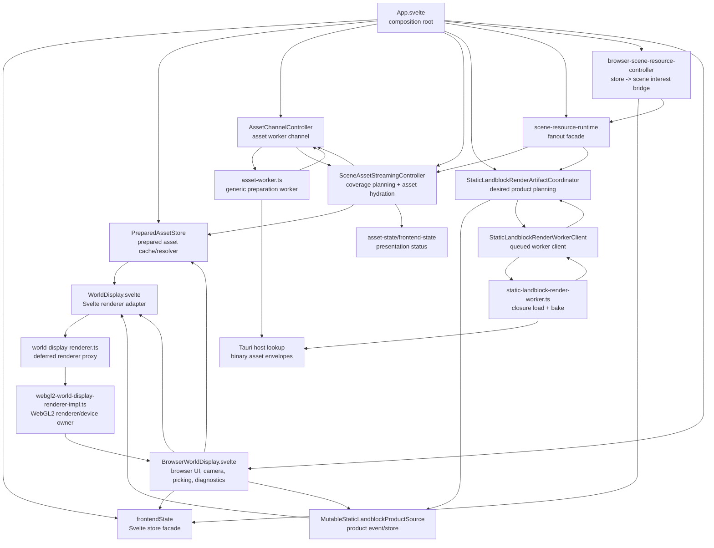
```mermaid
flowchart TB
  App["App.svelte<br/>composition root"]
  FrontendState["frontendState<br/>Svelte store facade"]
  BrowserController["browser-scene-resource-controller<br/>store -> scene interest bridge"]
  BrowserPage["BrowserWorldDisplay.svelte<br/>browser UI, camera, picking, diagnostics"]
  WorldDisplay["WorldDisplay.svelte<br/>Svelte renderer adapter"]
  RendererProxy["world-display-renderer.ts<br/>deferred renderer proxy"]
  WebglRenderer["webgl2-world-display-renderer-impl.ts<br/>WebGL2 renderer/device owner"]

  SceneRuntime["scene-resource-runtime<br/>fanout facade"]
  AssetStreamer["SceneAssetStreamingController<br/>coverage planning + asset hydration"]
  AssetChannel["AssetChannelController<br/>asset worker channel"]
  AssetWorker["asset-worker.ts<br/>generic preparation worker"]
  PreparedStore["PreparedAssetStore<br/>prepared asset cache/resolver"]
  AssetState["asset-state/frontend-state<br/>presentation status"]

  ProductCoordinator["StaticLandblockRenderArtifactCoordinator<br/>desired product planning"]
  ProductSource["MutableStaticLandblockProductSource<br/>product event/store"]
  ProductClient["StaticLandblockRenderWorkerClient<br/>queued worker client"]
  ProductWorker["static-landblock-render-worker.ts<br/>closure load + bake"]
  Host["Tauri host lookup<br/>binary asset envelopes"]

  App --> FrontendState
  App --> PreparedStore
  App --> AssetChannel
  App --> AssetStreamer
  App --> ProductCoordinator
  App --> SceneRuntime
  App --> BrowserController
  App --> BrowserPage

  BrowserController --> FrontendState
  BrowserController --> SceneRuntime
  SceneRuntime --> AssetStreamer
  SceneRuntime --> ProductCoordinator

  AssetStreamer --> PreparedStore
  AssetStreamer --> AssetState
  AssetStreamer --> AssetChannel
  AssetChannel --> AssetWorker
  AssetWorker --> Host
  AssetWorker --> AssetChannel
  AssetChannel --> AssetStreamer

  ProductCoordinator --> ProductSource
  ProductCoordinator --> ProductClient
  ProductClient --> ProductWorker
  ProductWorker --> Host
  ProductWorker --> ProductClient
  ProductClient --> ProductCoordinator

  BrowserPage --> FrontendState
  BrowserPage --> PreparedStore
  BrowserPage --> ProductSource
  BrowserPage --> WorldDisplay
  WorldDisplay --> RendererProxy
  RendererProxy --> WebglRenderer
  ProductSource --> WorldDisplay
  PreparedStore --> WorldDisplay
  WebglRenderer --> BrowserPage
```

The current system has three overlapping control planes:

- Svelte/app control: `App.svelte`, `frontendState`, `BrowserWorldDisplay.svelte`, and `WorldDisplay.svelte` mirror state, route user input, and call renderer setters.
- Asset control: `SceneAssetStreamingController` plans and prepares generic frontend assets into `PreparedAssetStore`.
- Landblock product control: `StaticLandblockRenderArtifactCoordinator` separately plans landblock render products and sends them to a worker that can do its own host lookup and preparation.

The third plane is the main architectural split-brain. Some dependency closure is owned by the generic asset stream, while some is rediscovered inside the landblock render worker.

### Scene Interest Flow

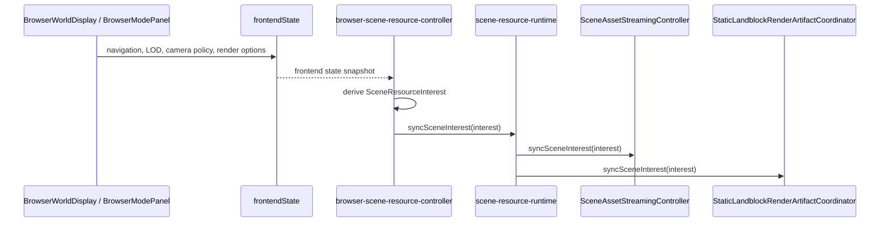
```mermaid
sequenceDiagram
  participant UI as BrowserWorldDisplay / BrowserModePanel
  participant Store as frontendState
  participant Bridge as browser-scene-resource-controller
  participant Runtime as scene-resource-runtime
  participant Assets as SceneAssetStreamingController
  participant Products as StaticLandblockRenderArtifactCoordinator

  UI->>Store: navigation, LOD, camera policy, render options
  Store-->>Bridge: frontend state snapshot
  Bridge->>Bridge: derive SceneResourceInterest
  Bridge->>Runtime: syncSceneInterest(interest)
  Runtime->>Assets: syncSceneInterest(interest)
  Runtime->>Products: syncSceneInterest(interest)
```

Important current behavior:

- `SceneResourceInterest` is the shared demand object, but it is still rooted in browser-mode state and Svelte store updates.
- `scene-resource-runtime` is only a fanout facade. It does not own planning, lifecycle, cancellation, or convergence.
- Asset hydration and landblock product baking respond to the same interest independently.

### Asset Hydration Flow

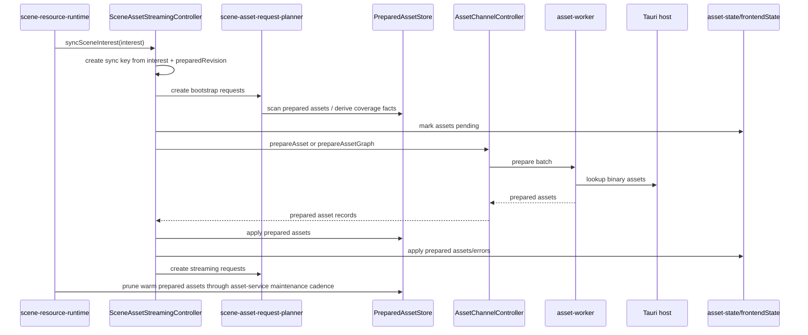
```mermaid
sequenceDiagram
  participant Runtime as scene-resource-runtime
  participant Streamer as SceneAssetStreamingController
  participant Planner as scene-asset-request-planner
  participant Store as PreparedAssetStore
  participant Channel as AssetChannelController
  participant Worker as asset-worker
  participant Host as Tauri host
  participant UIState as asset-state/frontendState

  Runtime->>Streamer: syncSceneInterest(interest)
  Streamer->>Streamer: create sync key from interest + preparedRevision
  Streamer->>Planner: create bootstrap requests
  Planner->>Store: scan prepared assets / derive coverage facts
  Streamer->>UIState: mark assets pending
  Streamer->>Channel: prepareAsset or prepareAssetGraph
  Channel->>Worker: prepare batch
  Worker->>Host: lookup binary assets
  Worker-->>Channel: prepared assets
  Channel-->>Streamer: prepared asset records
  Streamer->>Store: apply prepared assets
  Streamer->>UIState: apply prepared assets/errors
  Streamer->>Planner: create streaming requests
  Runtime->>Store: prune warm prepared assets through asset-service maintenance cadence
```

Current asset-hydration lifecycle:

```text
unrequested
  -> planned by scene coverage
  -> pending in frontend presentation state
  -> in flight in SceneAssetStreamingController
  -> host lookup in worker/host bridge
  -> prepared in asset worker
  -> applied to PreparedAssetStore
  -> visible to planner/renderer through PreparedAssetResolver
  -> warm retained or active retained by cache policy
  -> pruned by runtime-owned asset-service maintenance
```

Architectural observations:

- The sync key includes `preparedRevision`, so applying prepared assets can cause a broad resync even when the scene interest did not change.
- Bootstrap and streaming priorities are run sequentially inside one sync loop.
- The planner repeatedly derives scoped facts from the whole prepared asset set.
- Hydration is not one uniform model: some requests are direct, some use graph preparation.
- Presentation state (`asset-state`) records pending/ready/error, but it is not the authoritative lifecycle for assets.

### Landblock Render Product Flow

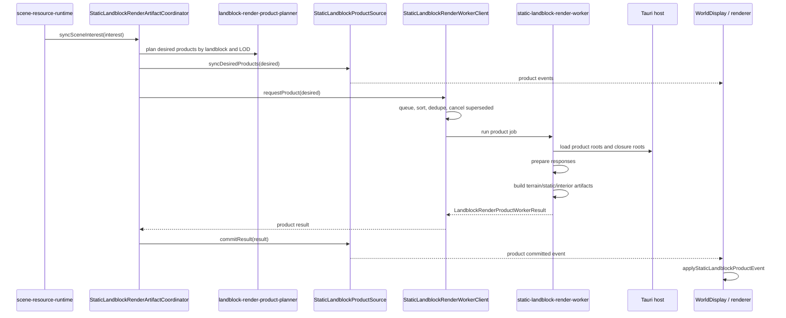
```mermaid
sequenceDiagram
  participant Runtime as scene-resource-runtime
  participant Coord as StaticLandblockRenderArtifactCoordinator
  participant Planner as landblock-render-product-planner
  participant Source as StaticLandblockProductSource
  participant Client as StaticLandblockRenderWorkerClient
  participant Worker as static-landblock-render-worker
  participant Host as Tauri host
  participant Display as WorldDisplay / renderer

  Runtime->>Coord: syncSceneInterest(interest)
  Coord->>Planner: plan desired products by landblock and LOD
  Coord->>Source: syncDesiredProducts(desired)
  Source-->>Display: product events
  Coord->>Client: requestProduct(desired)
  Client->>Client: queue, sort, dedupe, cancel superseded
  Client->>Worker: run product job
  Worker->>Host: load product roots and closure roots
  Worker->>Worker: prepare responses
  Worker->>Worker: build terrain/static/interior artifacts
  Worker-->>Client: LandblockRenderProductWorkerResult
  Client-->>Coord: product result
  Coord->>Source: commitResult(result)
  Source-->>Display: product committed event
  Display->>Display: applyStaticLandblockProductEvent
```

Current landblock-product lifecycle:

```text
not desired
  -> desired by scene interest + LOD radii
  -> in source as desired/in flight
  -> queued in StaticLandblockRenderWorkerClient
  -> posted to static-landblock-render-worker
  -> worker loads host asset roots
  -> worker expands closure and prepares companion assets
  -> worker builds render artifacts
  -> committed to StaticLandblockProductSource
  -> pushed into WorldDisplay and renderer
  -> evicted when desired set changes or products clear
```

Architectural observations:

- The render-product worker owns both bake construction and a second asset closure/preparation lane.
- `StaticLandblockRenderWorkerClient` defaults to `maxConcurrentJobs = 1`, so desired products are serialized unless explicitly configured otherwise.
- Render products are already closer to the V2 "static landblock bake product" idea than raw renderables, but they still carry historical `artifact` vocabulary and patchwork material/texture-page policy revisions.
- Product residency is tracked separately from prepared asset residency, even when both represent the same scene interest.

### Renderer And UI Flow

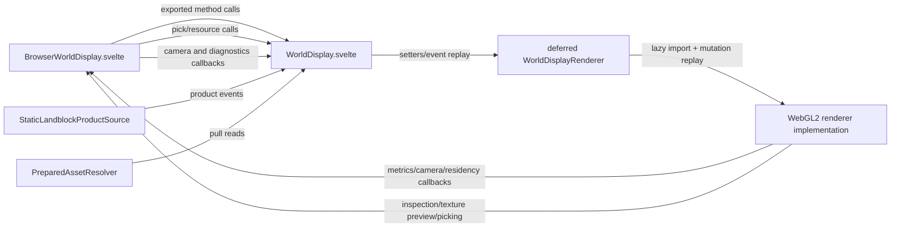
```mermaid
flowchart LR
  BrowserPage["BrowserWorldDisplay.svelte"]
  WorldDisplay["WorldDisplay.svelte"]
  Deferred["deferred WorldDisplayRenderer"]
  Webgl["WebGL2 renderer implementation"]
  ProductSource["StaticLandblockProductSource"]
  PreparedResolver["PreparedAssetResolver"]

  BrowserPage -- exported method calls --> WorldDisplay
  BrowserPage -- pick/resource calls --> WorldDisplay
  BrowserPage -- camera and diagnostics callbacks --> WorldDisplay
  ProductSource -- product events --> WorldDisplay
  PreparedResolver -- pull reads --> WorldDisplay
  WorldDisplay -- setters/event replay --> Deferred
  Deferred -- lazy import + mutation replay --> Webgl
  Webgl -- metrics/camera/residency callbacks --> BrowserPage
  Webgl -- inspection/texture preview/picking --> BrowserPage
```

Current renderer-facing lifecycle:

```text
Svelte component mounts
  -> WorldDisplay subscribes to product source
  -> deferred renderer proxy starts lazy WebGL2 import
  -> exported Svelte setters mutate local mirrored fields
  -> deferred proxy records the latest values
  -> WebGL2 renderer is created with current options
  -> product events and setter calls mutate renderer state
  -> renderer owns GPU resources and frame loop
  -> BrowserWorldDisplay samples metrics/resources/picking through imperative methods
  -> component unmount disposes renderer and product subscription
```

Architectural observations:

- Renderer input is a collection of setters and product events, not a single render-scene value.
- `WorldDisplay.svelte` duplicates some product-store mutation so it can update local Svelte state and replay events into the renderer.
- The deferred renderer proxy replays mutations while the WebGL2 module loads, which makes construction asynchronous and stateful.
- `BrowserWorldDisplay.svelte` owns camera interaction, render-anchor rebasing, picking, resource inspection, texture preview, debug report generation, and UI state projection.
- The renderer still receives a `PreparedAssetResolver`, so it can pull prepared assets instead of consuming explicit static draw units and dynamic renderable inputs.

### Resource And GPU Lifecycles

The current frontend does not have one clear resource lifecycle. It has several partially overlapping lifecycles:

```text
Host asset:
  requested by asset streamer or product worker
  -> returned as binary envelope
  -> discarded after preparation unless retained by caller-local maps

Prepared asset:
  prepared by asset worker or product worker
  -> stored globally only when produced by SceneAssetStreamingController
  -> scanned by planners and read by renderer/resource code
  -> pruned by prepared asset cache policy

Landblock render product:
  planned by product coordinator
  -> built by static landblock worker
  -> committed to product source
  -> pushed to renderer
  -> evicted by product source sync

Texture page / atlas data:
  built inside terrain/static artifact paths
  -> uploaded by renderer resource stores
  -> inspected through renderer resource snapshots
  -> destroyed when product/resource stores evict or renderer disposes

GPU resource:
  created inside WebGL2 resource stores from products/prepared data
  -> reused by renderer-specific signatures/keys
  -> sampled by diagnostics/resource inspection
  -> destroyed by resource eviction or renderer disposal
```

Lifecycle ambiguity that V2 must resolve:

- "Resource" can mean host bytes, prepared frontend data, landblock products, texture pages, WebGL objects, diagnostic snapshots, or UI presentation rows.
- Asset preparation can happen in the generic asset worker and inside the landblock render worker.
- Atlases are product-local outputs today, but texture identity is often global across landblocks.
- Eviction exists at multiple levels: prepared asset pruning, product-source desired-set eviction, renderer resource-store eviction, and final renderer disposal.
- Diagnostics and inspection APIs expose lifecycle facts but do not define lifecycle ownership.

### Current Flow Summary

The current architecture can be summarized as:

```text
Svelte browser state
  -> scene interest
  -> two independent pipelines:
       1. generic prepared asset hydration
       2. landblock render-product baking with its own closure loading
  -> Svelte renderer adapter
  -> deferred imperative WebGL2 renderer
  -> UI samples renderer/runtime state for picking, metrics, resources, and previews
```

The broad architecture is sound in the sense that there are separate concepts for app state, asset preparation, landblock baking, renderer resources, and UI. The implementation is hard to reason about because those concepts are not given clean ownership boundaries, and because Svelte, workers, planners, renderer stores, and diagnostics all participate in lifecycle decisions.

## Findings And Conclusions

These are the conclusions that have enough current-code or reference evidence to fold into the working model. They should replace answered investigation questions rather than live as a historical checklist.

### Materials

AC material source data is small. A resolved material recipe is essentially `surfaceId`, `surfaceType`, source, `translucency`, `luminosity`, and `diffuse`. The source is either solid color or texture. ACE `SurfaceType` is a bitflag set covering base solid/image/clip map, translucent, diffuse, luminous, alpha, inverse alpha, additive, detail, gouraud, stippled, and perspective.

The current frontend makes materials look much larger by coupling distinct concerns:

- Material interpretation from AC source facts.
- Texture normalization and palette/indexed handling.
- Atlas planning and texture-page readiness.
- Static geometry compaction eligibility.
- Draw slicing.
- Fallback diagnostics.
- WebGL upload readiness.

Validation pass: the simple bucket model mostly survives, but "material family" is too narrow if it tries to be the whole draw-unit key. The current code already has family-like classification in `CompactionMaterialFamily`, and its categories are small: flat color, textured opaque/cutout, transparent blended, opacity/translucent, indexed/paletted, debug, and unsupported. That supports the intuition that broad material strategy abstractions are not carrying much value.

The important correction is that final static draw units need more keys than family name. Existing planner behavior shows additional split dimensions: atlas texture index, indexed texel page, palette page, material-table slot range, render-state key, sampler key, detail atlas entry, alpha-test threshold, and domain/spatial partition. In other words, classification can be simple, but baking compatibility is a tuple.

The model also has hard edge cases that should stay explicit rather than become a general framework:

- Indexed/paletted materials require palette selection from appearance override, material recipe, or render-surface default; sub-palettes can derive a palette view, so palette identity is part of compatibility.
- Indexed/paletted sampling is data sampling, not color sampling. Index pages and palette pages should be typed atlas families (`R8`, `RG8`, and palette `RGBA8`) with nearest/no-mip exact lookup policy; they should not be collapsed into prepared RGBA color surfaces.
- Indexed/paletted visual filtering must happen after palette lookup. The v1 renderer keeps index and palette pages exact, samples the 2x2 neighboring index texels in shader, resolves each through the palette, and blends the resulting colors. Filtering raw index values is not a valid parity path. The v1 `index16` `RG8` path stores low/high bytes for one index texel, not prepacked neighbors.
- Palette data is packable, but it is still lookup data rather than a color surface. A packed palette page must be addressed by palette-view rect plus entry offset so palette entry selection is exact and independent from filtering/gutter behavior.
- Alpha-test/cutout surfaces are depth-writing discard materials and can participate in opaque-pass static batching. In the table-capable static-object path, the draw-unit material table carries the alpha-test threshold per material entry. Blended static materials are intentionally evidence-gated: ACE exposes `Translucent`, `Alpha`, `InvAlpha`, and `Additive` flags, but current ACViewer static-object evidence only proves a broad alpha bucket for `Base1ClipMap | Translucent | Alpha | Additive`, not a rich first-class static blend matrix. V2 should preserve and report those source facts as deferred material coverage until observed static triangle targets justify object/part transparent draw units and renderer sorting.
- Detail overlays are an additional texture role and atlas binding, not just a material flag. A HBA-backed terrain detail inspection found region detail roles using separate RGBA8 detail textures with tiling, nontrivial RGB data, and meaningful alpha.
- Texture velocity is a separate animated-UV constraint and is currently treated as non-atlas-batchable.
- Wrap intent is material-entry shader state for atlas-backed static-object sampling paths that support shader-local virtual wrap. Clamp/repeat should be applied against the local atlas rect in shader and should not split otherwise compatible physical atlas pages or static-object texture-use identity.
- Atlas capacity, current single-binding renderer constraints, and future material-table capacity create draw-unit slicing even when shader and material family match.

Conclusion: V2 should separate "what an AC material means" from "which static rendering bucket can draw this surface". A material family should remain a small shader/binding-layout compatibility class. A static draw unit should be the fuller compatibility product: family plus domain, pass/order constraints, sampler/device state, logical texture binding layout, placement revision assumptions, material-binding capacity, compacted geometry, sort/visibility partition facts, and draw slices. Current static-object draw units implement the single-binding subset of that model; Phase 11E4A3 should promote them to V1-style multi-material binding tables with renderer-visible material selectors and table uploads. Order-independent opaque/cutout units may compact broadly within the implemented binding contract; true blended units should be partitioned at object/part granularity for renderer distance sorting rather than at triangle granularity.

Setup appearance remains important, but it is appearance/selection complexity: selected parts, material slots, texture changes, animation part changes, palette, and sub-palettes. It should not be mistaken for evidence that the core material model needs to be broad.

### Dynamic Renderables

The current browser frontend does not have a real dynamic renderable pipeline. It renders static landblock and env-cell content by expanding prepared `gfx-obj`, `setup-model`, and `setup-appearance` assets from static source instances. The `"dynamic"` material kind in current code is only a placeholder, not an implemented dynamic rendering path.

The design implication is that static landblock baking should not become the default model for future entities just because it is the only current renderer path. Dynamic renderables remain a playable-client requirement that must be investigated from protocol/world state, not inferred from browser-mode static rendering.

### Lifecycles

There is no single current "resource lifecycle". There are separate lifecycles for prepared assets, static landblock products, and GPU resources:

- `PreparedAssetStore` owns prepared records, cache metadata revisions, prepared updates, evictions, and metadata events.
- `SceneAssetStreamingController` owns in-flight asset IDs and scene-interest sync loops.
- The runtime-owned asset service owns prepared cache pruning, warm-retention policy, and centralized prepared-asset diagnostics.
- `StaticLandblockRenderArtifactStore` owns desired product identities, in-flight identities, resident artifacts, stale results, commits, evictions, and errors.
- `MutableStaticLandblockProductSource` publishes product committed/evicted/cleared events.
- WebGL resource stores own GPU resources and dispose them when product signatures change, products evict, or the renderer is destroyed.

Those separate lifecycles are not inherently wrong. The problem is that their ownership boundaries are not visible enough, and their state words do not compose cleanly. Presentation state, diagnostics, prepared cache metadata, product residency, worker in-flight state, and GPU residency all expose words like `ready`, `pending`, or `resident` with different meanings.

The design implication is that V2 needs explicit lifecycle vocabulary. It does not necessarily need one universal lifecycle state machine, but every lifecycle state must be scoped: prepared-resident, static-product-resident, GPU-resident, in-flight host request, in-flight bake job, and so on.

## First-Principles V2 Model

This section replaces the earlier V2 hypothesis. It starts from the behavior the frontend must provide, then assigns ownership to the fewest durable parts that can satisfy it.

The core rule is simple: each layer receives facts from the layer below, adds exactly one kind of value, and exposes commands or snapshots to the layer above. No layer should reach sideways to compensate for ambiguity elsewhere.

### Design Principles

- Browser UI is a consumer. It does not own asset hydration, baking, renderer lifecycle, or renderer state diffing.
- Runtime is orchestration. It translates user/client intent into service commands and publishes snapshots, but it does not decode assets, bake geometry, or upload WebGL resources. Runtime also owns scene anchoring/rebasing policy and semantic scene queries: it converts canonical static/dynamic records into renderer-local placements before renderer ingestion, and it answers picking/visibility queries from committed scene records rather than asking the renderer to own AC source semantics.
- Asset service owns asset identity, cache, in-flight dedupe, shared preparation rules, committed prepared-asset leases, warm retention, and failure/retry semantics. It is a runtime-owned logical owner, not a resolver-worker-local durable cache. Workers may use a remote facade to request prepared assets, but cache identity and retention stay centralized.
- Static coordinator owns landblock-scoped static demand. It expands scene interest into concrete static work requests by landblock/domain and env-cell focus where needed, schedules resolver workers, groups resolved payloads into submitted static atlas batches, schedules baker workers, requests texture/atlas placement snapshots for those batches, and commits completed output.
- Static scope resolver workers own IO-heavy static source resolution. They resolve concrete static work requests into bakeable payloads by reading/fetching needed source assets, walking static dependencies, identifying referenced textures/surfaces, and producing source spatial facts and static-authored dynamic seeds.
- Static bake workers own CPU-heavy static baking. They consume resolved static scope payloads plus batch placement snapshots, then produce static draw-unit bake records, placement requirements/assumptions, and peer static records for spatial, visibility, portal/interior, source-mapping, and dynamic-seed output.
- Dynamic service owns entity/object render readiness. It hydrates dynamic visual resources and publishes instance state without static landblock baking.
- Renderer owns GPU residency and drawing. It consumes committed static/dynamic placements and frame state; it does not fetch host assets, walk dependency closures, classify AC materials, choose scene anchors/rebase policy, or own semantic picking/source inspection. Renderer-side acceleration structures may mirror committed query records later, but they are not the source of truth for AC object, env-cell, portal, or material identity.
- Diagnostics observe. They do not define required fields in core protocols.

### Minimal Vocabulary

The earlier vocabulary table was intentionally expansive. After the research pass, several words are not useful enough to keep as first-class concepts. V2 should bias toward fewer nouns with explicit ownership.

| Term                          | Meaning                                                                                                                                                                                                                                                                                                                                                                                                                                                                                                                                                                                                                                                                                                                                                                                                                                                                          | Replaces / clarifies                                                                        |
| ----------------------------- | -------------------------------------------------------------------------------------------------------------------------------------------------------------------------------------------------------------------------------------------------------------------------------------------------------------------------------------------------------------------------------------------------------------------------------------------------------------------------------------------------------------------------------------------------------------------------------------------------------------------------------------------------------------------------------------------------------------------------------------------------------------------------------------------------------------------------------------------------------------------------------- | ------------------------------------------------------------------------------------------- |
| Host asset                    | Raw host payload addressed through the host adapter. Host route strings are transport labels, not runtime resource identity.                                                                                                                                                                                                                                                                                                                                                                                                                                                                                                                                                                                                                                                                                                                                                     | binary envelope, DTO payload, string asset ID                                               |
| Host route string             | Host/Tauri transport address such as a landblock, palette, or prepared-texture route. It may appear at the host/preparation boundary and in explicit provenance/debug fields only.                                                                                                                                                                                                                                                                                                                                                                                                                                                                                                                                                                                                                                                                                               | string asset ID, route asset ID                                                             |
| Prepared asset                | Decoded and normalized frontend data derived from host assets by the shared preparation library.                                                                                                                                                                                                                                                                                                                                                                                                                                                                                                                                                                                                                                                                                                                                                                                 | prepared record, asset payload, renderer asset read model                                   |
| Asset service                 | Runtime-owned logical owner of typed asset identity, host fetch policy, prepared cache, in-flight dedupe, committed prepared-asset leases, warm retention, failure/retry semantics, and shared preparation semantics. It need not be a physical worker, but it is the durable cache authority in front of the host adapter.                                                                                                                                                                                                                                                                                                                                                                                                                                                                                                                                                      | asset channel, asset streamer, resolver-worker-local cache, asset prepare worker            |
| Runtime resource identity     | Typed internal identity used by resolver payloads, bake inputs/results, texture-manager state, renderer deltas, dynamic records, and source mappings. Discriminants such as `kind` are closed string-literal unions, never arbitrary `string`.                                                                                                                                                                                                                                                                                                                                                                                                                                                                                                                                                                                                                                   | semantic asset ID string, route-derived identity                                            |
| Opaque cache key              | Branded/canonical key derived from a typed runtime identity for local `Map`/cache indexing. It is not accepted as public semantic identity.                                                                                                                                                                                                                                                                                                                                                                                                                                                                                                                                                                                                                                                                                                                                      | string map key, record key                                                                  |
| Scene interest                | Client demand: location, retention, visibility, quality, and policy.                                                                                                                                                                                                                                                                                                                                                                                                                                                                                                                                                                                                                                                                                                                                                                                                             | scene resource interest, browser LOD state, coverage request                                |
| Scene anchor                  | Runtime-owned local-origin policy for mapping canonical landblock/env-cell/world records into renderer-local coordinates. Outdoor anchoring uses a focus landblock and 192-meter landblock offsets; dungeon/interior anchoring uses the owning landblock/env-cell context.                                                                                                                                                                                                                                                                                                                                                                                                                                                                                                                                                                                                       | renderer anchor, camera-owned rebase, chunk root policy                                     |
| Renderer-local placement      | Runtime-produced translation/transform attached to renderer residency deltas. It tells the renderer where a static draw unit or dynamic instance lives in the current local scene. It is not source identity and is not resolver/baker input.                                                                                                                                                                                                                                                                                                                                                                                                                                                                                                                                                                                                                                    | chunk root transform, renderer anchor field                                                 |
| Landblock env-cell bundle     | Landblock-owned env-cell facts resolved through the V2 `landblock-env-cells` source domain: landblock-info provenance, env-cell graph membership, env-cell portal/link metadata, accepted/visible cell sets, local cell structures, static seeds, landblock-wide env-cell BVH records, and per-cell local BVHs. Env-cell outside-transition portal records may remain query/debug metadata, but landblock-building transition mask geometry is sourced from outdoor building portal geometry, not from env-cell aperture polygons. The old host topology route may exist for V1/debug transport, but V2 should not use it as a runtime source domain.                                                                                                                                                                                                                            | landblock topology route, topology sidecar, indoor env-cell discovery, dungeon special case |
| Static scope                  | Static world ownership key, usually landblock anchored, with env-cell focus/records inside the landblock env-cell bundle when resolving dungeon or interior content.                                                                                                                                                                                                                                                                                                                                                                                                                                                                                                                                                                                                                                                                                                             | landblock product scope, render artifact identity                                           |
| Static resolver job           | Idempotent resolver input: scope plus source domain. It never contains camera state, interest radii, residency labels, scheduling priority, or broad policy revision. Coordinator-owned job ids may wrap resolver jobs for async correlation, but those ids are not resolver semantics.                                                                                                                                                                                                                                                                                                                                                                                                                                                                                                                                                                                          | desired product, desired layer, landblock render product request                            |
| Static scope payload          | Resolver output for one static work request: resolved source records, material facts, referenced texture keys, source spatial facts, typed heavy-geometry refs, and dynamic seeds. It should avoid carrying large render buffers when a typed asset-service geometry view can be attached later for bake.                                                                                                                                                                                                                                                                                                                                                                                                                                                                                                                                                                        | prepared closure, product roots, companion closure                                          |
| Static domain                 | Static rendering/residency or source-query domain such as outdoor terrain, `landblock-env-cells`, env-cell static geometry, outdoor buildings/detail, or portal mask. Domains express which landblock-owned source family is being resolved, not whether the landblock is "outdoor" or "dungeon". `landblock-env-cells` is isomorphic across outdoor-linked interiors and pure dungeon landblocks; scene entry policy decides how it is used. Building transition aperture masks are an outdoor-building-derived portal-mask output, while env-cell portals remain interior traversal/query metadata unless a later evidence pass defines a non-building transition case. `outdoor-detail` covers generated outdoor scenery such as trees/foliage and should also surface explicit non-building outdoor objects as the evidence-gathering path for known blended static targets. | landblock render product, bundle kind                                                       |
| Static draw unit              | Renderer-ingestible static submission unit in canonical static-scope coordinates: domain, source landblock/env-cell ownership, shader family, state, logical texture refs, batch atlas assumptions, compacted geometry, sort/visibility partition facts, and draw slices. Draw units carry ownership identity; runtime attaches renderer-local placement during commit. Draw-unit ownership remains landblock/env-cell scoped even when atlas pages are shared by a larger batch.                                                                                                                                                                                                                                                                                                                                                                                                | artifact, compacted batch, static bundle layer, material slice                              |
| Static spatial record         | Static-scope geometry/spatial fact used for culling, picking, inspection, or BVH binding.                                                                                                                                                                                                                                                                                                                                                                                                                                                                                                                                                                                                                                                                                                                                                                                        | spatial hint, local BVH sidecar, BVH item binding                                           |
| Static visibility record      | Static-scope visibility fact for object/cell visibility and renderer visibility structures.                                                                                                                                                                                                                                                                                                                                                                                                                                                                                                                                                                                                                                                                                                                                                                                      | object visibility record, cell visibility record                                            |
| Static portal/interior record | Static-scope portal, env-cell, structured-interior, aperture, and cell-structure facts. Records must preserve source ownership explicitly: env-cell portal records describe env-cell traversal and interior/debug metadata, while outdoor building aperture records own landblock-building transition mask geometry.                                                                                                                                                                                                                                                                                                                                                                                                                                                                                                                                                             | detailed landblock sidecars, portal links, cell metadata                                    |
| Static source mapping         | Static-scope mapping from draw units/slices/records back to source landblock, env-cell, object, material, and typed runtime resource identities. Host route strings may appear only as explicit provenance/debug text.                                                                                                                                                                                                                                                                                                                                                                                                                                                                                                                                                                                                                                                           | object records, part hints, diagnostic source metadata                                      |
| Static scene query            | Runtime-owned query service built from source-query payloads and committed static spatial, visibility, portal/interior, BVH, and source-mapping records. It exposes neutral `pickRay`/visibility query primitives for browser mode and the future game client, with caller-owned filters and selection policy. Queries are context-aware: outdoor rays test outdoor scene indexes, env-cell rays test that cell's local index and only cross portals through explicit portal traversal.                                                                                                                                                                                                                                                                                                                                                                                          | flat renderer spatial index, renderer-owned semantic picking                                |
| Static-authored dynamic seed  | Static-scope authored dynamic instance seed whose resource hydration and animation state are owned by the dynamic service.                                                                                                                                                                                                                                                                                                                                                                                                                                                                                                                                                                                                                                                                                                                                                       | animated static object, rotating windmill seed                                              |
| Static bake result            | Worker output for one static work request: draw units, bake-local texture uses, placement requirements/assumptions, static spatial records, static visibility records, static portal/interior records, static source mappings, static-authored dynamic seeds, and source/build revisions. It does not contain atlas pixel buffers, final texture refs, or resolver-owned prepared-asset cache state.                                                                                                                                                                                                                                                                                                                                                                                                                                                                             | landblock render product worker result, render artifacts                                    |
| Dynamic instance              | Renderer-visible entity/object instance with transform, appearance state, animation/motion state, and resource refs.                                                                                                                                                                                                                                                                                                                                                                                                                                                                                                                                                                                                                                                                                                                                                             | future dynamic renderable, dynamic material placeholder                                     |
| Texture key                   | Stable typed prepared texture identity plus sampling/format constraints. It is not a host route string.                                                                                                                                                                                                                                                                                                                                                                                                                                                                                                                                                                                                                                                                                                                                                                          | render surface ID, virtual texture ref, atlas entry key                                     |
| Bake texture use              | Bake-local handle for one material texture role in one bake result. It is resolved to texture-manager-owned texture refs during commit.                                                                                                                                                                                                                                                                                                                                                                                                                                                                                                                                                                                                                                                                                                                                          | virtual texture ref, texture page ref                                                       |
| Static atlas batch            | One submitted group of resolved static scope payloads whose compatible textures may share atlas pages. It is scoped by domain plus a runtime-assigned batch id. Draw units inside the batch remain individually landblock/env-cell owned.                                                                                                                                                                                                                                                                                                                                                                                                                                                                                                                                                                                                                                        | product batch, streaming chunk, atlas bucket                                                |
| Batch atlas group             | Texture/atlas-manager-owned placement state, texture refs, typed atlas pages, and leases for one static atlas batch. Atlas pages are grouped by format/sample/data semantics and sampler policy, not by host route strings. Later batches get distinct atlas groups and may duplicate source textures intentionally.                                                                                                                                                                                                                                                                                                                                                                                                                                                                                                                                                             | texture page store, atlas cache, domain atlas registry                                      |
| Batch placement snapshot      | Scoped serializable view of the active batch atlas group for the textures referenced by one or more static scope payloads in a submitted batch.                                                                                                                                                                                                                                                                                                                                                                                                                                                                                                                                                                                                                                                                                                                                  | texture pages, atlas inputs, domain placement snapshot                                      |
| Render update                 | Imperative renderer input split into resource changes and frame state.                                                                                                                                                                                                                                                                                                                                                                                                                                                                                                                                                                                                                                                                                                                                                                                                           | renderer setters, render scene snapshot, product events                                     |
| Runtime snapshot              | Coarse UI/client observation emitted by runtime.                                                                                                                                                                                                                                                                                                                                                                                                                                                                                                                                                                                                                                                                                                                                                                                                                                 | Svelte store state, metrics callbacks, panel state                                          |
| Diagnostic event              | Optional structured observation.                                                                                                                                                                                                                                                                                                                                                                                                                                                                                                                                                                                                                                                                                                                                                                                                                                                 | debug payloads, temporary regression fields, report-only metadata                           |

Terms demoted from core vocabulary:

- `Resource`: too broad. Use host asset, prepared asset, static draw unit, texture, GPU object, or diagnostic snapshot.
- `Artifact` and unqualified `product`: historical names that hide ownership.
- `Coverage`: useful internally as a planner result, not a system-level noun.
- `Asset closure`: an implementation detail of hydration, not a public runtime concept.
- `Product` and `layer`: current-code scheduling/output terms. In V2, prefer static work requests, static bake results, and output partitions unless a narrower term earns its keep.
- `Atlas delta`: unnecessary lifecycle labeling in worker output. The baker emits placement requirements/assumptions for a batch placement snapshot; the texture/atlas manager decides whether to commit, abort, or enqueue texture-packing work.
- `Sync`, `ready`, and `pending`: too vague without a target. Prefer `request`, `prepare`, `bake`, `upload`, `resident`, or `evict`.

### V2 Topology

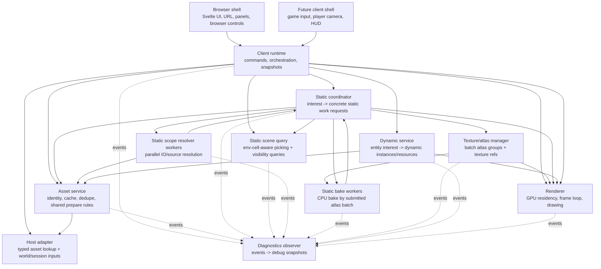
```mermaid
flowchart TB
  BrowserShell["Browser shell<br/>Svelte UI, URL, panels, browser controls"]
  ClientShell["Future client shell<br/>game input, player camera, HUD"]
  Runtime["Client runtime<br/>commands, orchestration, snapshots"]
  Host["Host adapter<br/>typed asset lookup + world/session inputs"]
  Assets["Asset service<br/>identity, cache, dedupe, shared prepare rules"]
  StaticCoordinator["Static coordinator<br/>interest -> concrete static work requests"]
  StaticSceneQuery["Static scene query<br/>env-cell-aware picking + visibility queries"]
  StaticResolver["Static scope resolver workers<br/>parallel IO/source resolution"]
  TextureManager["Texture/atlas manager<br/>batch atlas groups + texture refs"]
  StaticBaker["Static bake workers<br/>CPU bake by submitted atlas batch"]
  Dynamic["Dynamic service<br/>entity interest -> dynamic instances/resources"]
  Renderer["Renderer<br/>GPU residency, frame loop, drawing"]
  Diagnostics["Diagnostics observer<br/>events -> debug snapshots"]

  BrowserShell --> Runtime
  ClientShell --> Runtime
  Runtime --> Host
  Runtime --> Assets
  Runtime --> StaticCoordinator
  Runtime --> StaticSceneQuery
  Runtime --> Dynamic
  Runtime --> Renderer

  StaticCoordinator --> Assets
  StaticCoordinator --> StaticSceneQuery
  StaticCoordinator --> StaticResolver
  StaticCoordinator --> TextureManager
  TextureManager --> StaticBaker
  StaticResolver --> StaticCoordinator
  StaticResolver --> Assets
  StaticCoordinator --> StaticBaker
  StaticBaker --> StaticCoordinator
  Dynamic --> Assets

  Assets --> Host
  TextureManager --> Renderer
  StaticCoordinator --> Renderer
  Dynamic --> Renderer
  Runtime --> Renderer

  Runtime -. events .-> Diagnostics
  Assets -. events .-> Diagnostics
  StaticCoordinator -. events .-> Diagnostics
  StaticSceneQuery -. events .-> Diagnostics
  StaticResolver -. events .-> Diagnostics
  StaticBaker -. events .-> Diagnostics
  TextureManager -. events .-> Diagnostics
  Dynamic -. events .-> Diagnostics
  Renderer -. events .-> Diagnostics
```

The browser and future client sit at the same level. Browser-specific UI can be deleted without invalidating the runtime, asset service, static coordinator, resolver workers, baker workers, texture/atlas manager, dynamic service, or renderer.

### Ownership Cut

| Owner                         | Owns                                                                                                                                                                                                                                      | Does not own                                                                                                                                                   |
| ----------------------------- | ----------------------------------------------------------------------------------------------------------------------------------------------------------------------------------------------------------------------------------------- | -------------------------------------------------------------------------------------------------------------------------------------------------------------- |
| Shell                         | UI state, browser/client input mapping, panels, route/location affordances.                                                                                                                                                               | Asset lifecycles, bake jobs, renderer diffing, GPU resources.                                                                                                  |
| Runtime                       | Service composition, command routing, scene interest, snapshots, lifecycle, and semantic scene-query command routing.                                                                                                                     | Host decoding, static baking, dynamic asset interpretation, WebGL internals.                                                                                   |
| Host adapter                  | Typed boundary to Tauri/session/content providers.                                                                                                                                                                                        | Frontend cache policy, material families, renderer resource state.                                                                                             |
| Asset service                 | Typed asset identity, host fetch policy, shared preparation library, in-flight dedupe, prepared cache, committed prepared-asset leases, warm retention, failure/retry semantics.                                                          | Static bake bucketing, dynamic instance state, GPU upload, mandatory dedicated prepare worker, resolver-worker-local durable cache.                            |
| Static coordinator            | Expanding interest radii into concrete static work requests, scheduling resolver jobs, grouping resolved payloads into submitted static atlas batches, scheduling baker jobs, retaining committed static output, rejecting stale results. | Dependency walking on the render thread, texture handle allocation, WebGL upload.                                                                              |
| Static scene query            | Env-cell-aware static spatial query indexes, `pickRay`, visibility-query primitives, committed BVH/spatial/source-map ingestion, and neutral hit records for browser and future client selection.                                         | Browser/client selection policy, debug panel formatting, WebGL upload, material classification, asset dependency walking.                                      |
| Static scope resolver workers | IO-heavy static source resolution, static dependency walking, missing typed dependency discovery, referenced texture/surface discovery, source spatial facts, static-authored dynamic seeds, static scope payloads.                       | Scene interest radii, atlas mutation, material-family packing, geometry compaction, renderer handle allocation, GPU objects, durable prepared-asset retention. |
| Texture/atlas manager         | Logical texture refs, typed batch atlas groups, batch placement snapshots, placement table, leases from resident draw units, direct-placement fallback policy for non-packable resources, and texture-packing worker orchestration.       | Static source walking, material classification, geometry compaction, Svelte/UI state, WebGL upload.                                                            |
| Static bake workers           | CPU-heavy material-family classification, placement requirement/assumption output, draw-unit compatibility bucketing, geometry compaction, draw-slice/source mapping, static record production, and static bake results.                  | HBA/source dependency walking, scene interest radii, cache pruning, renderer handle allocation, GPU objects, atlas pixel packing.                              |
| Dynamic service               | Dynamic visual resource hydration and dynamic instance updates.                                                                                                                                                                           | Static landblock baking, static atlas policy, browser selection UX.                                                                                            |
| Renderer                      | GPU resources, render updates, frame loop, drawing, and optional mirrored acceleration needed strictly for rendering.                                                                                                                     | Dependency walking, host lookup, Svelte state, scene interest policy, semantic picking, source/material inspection ownership.                                  |
| Diagnostics observer          | Bounded events, derived debug snapshots, reports.                                                                                                                                                                                         | Required pipeline fields or control flow.                                                                                                                      |

### Runtime-Owned Components

The client runtime is the composition root and command/snapshot boundary. It should own or be constructed with focused components rather than absorbing their responsibilities directly.

The static coordinator is a runtime-owned component. It is not a worker, not a UI component, and not a renderer subsystem. It owns the static pipeline's control plane:

- current static demand derived from scene interest;
- concrete static work requests;
- resolver worker scheduling;
- baker worker scheduling;
- stale result rejection;
- static scope/domain residency;
- commit ordering into the texture/atlas manager and renderer;
- coarse static status for runtime snapshots.

The static coordinator does not own HBA/source dependency walking, expensive static source resolution, material bucketing, geometry compaction, atlas allocation internals, WebGL upload, or Svelte/UI state.

The same pattern applies to other runtime-owned components:

- The asset service owns logical asset identity, cache, in-flight dedupe, preparation semantics, committed prepared-asset leases, warm retention, and failure/retry semantics. Resolver and dynamic workers may execute source resolution or narrowly scoped preparation code through an asset-service protocol, but they do not own durable prepared-asset registries. Pending fetch/prepare work tracks waiters and priority, not residency leases.
- The texture/atlas manager owns logical texture refs, batch atlas groups, placement revisions, leases, and baker snapshots.
- The dynamic service owns dynamic resource hydration and instance state.
- The diagnostics observer owns optional event recording and debug snapshot assembly.

This keeps `ClientRuntime` from becoming a new `WorldDisplay`: it composes services, routes commands, and publishes snapshots, but focused components own their domains.

### Command And Snapshot Boundary

The runtime should expose a small imperative API. Svelte can wrap it in stores, but the runtime must not require Svelte.

```ts
interface ClientRuntime {
  dispatch(command: RuntimeCommand): void;
  subscribe(listener: (snapshot: RuntimeSnapshot) => void): Unsubscribe;
  pickRay(request: PickRayRequest): PickResult | null;
  captureDebugSnapshot(request: DebugSnapshotRequest): Promise<DebugSnapshot>;
  dispose(): void;
}
```

Commands are intent:

- Navigate or follow a player/entity.
- Change residency/quality policy.
- Update camera/control mode.
- Select, inspect, or pick.
- Toggle debug overlays.

Picking requests carry a scene-space context as well as a ray and caller-owned filters. An outdoor-context ray may test resident outdoor terrain/statics and building-sourced transition apertures for that outdoor scene. An env-cell-context ray may test the current env-cell local index and may only cross into another env cell or outdoor scene through an explicit portal traversal. It must not collide with outdoor or neighboring-cell objects merely because their renderer-local bounds overlap the ray. This preserves AC's portal-rendered, non-Euclidean scene model while still letting browser mode and the future game client share the same `pickRay` primitive.

Snapshots are observation:

- Current scene interest and camera mode.
- Static scope residency by coarse state.
- Dynamic instance/resource residency by coarse state.
- Renderer frame metrics and visible counts.
- Selection and inspection summaries.
- Diagnostics summaries when enabled.

The runtime does not publish low-level prepared asset rows, texture pages, material fallback strings, worker internals, or GPU object internals as normal UI state. Those are debug snapshots.

### Scene Interest Flow

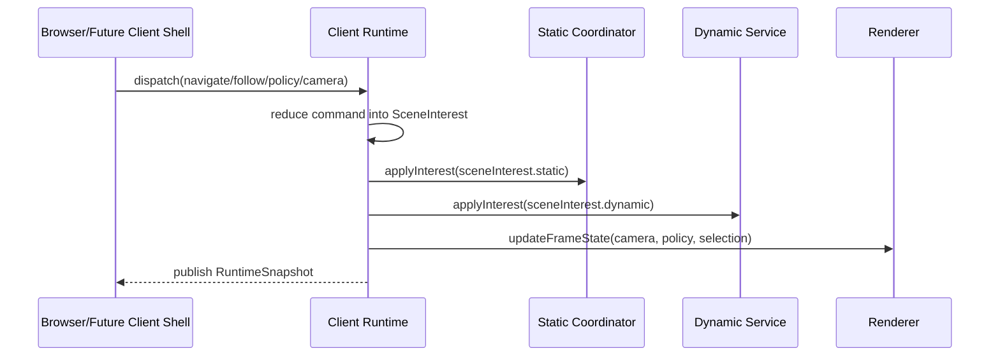
```mermaid
sequenceDiagram
  participant Shell as Browser/Future Client Shell
  participant Runtime as Client Runtime
  participant Static as Static Coordinator
  participant Dynamic as Dynamic Service
  participant Renderer as Renderer

  Shell->>Runtime: dispatch(navigate/follow/policy/camera)
  Runtime->>Runtime: reduce command into SceneInterest
  Runtime->>Static: applyInterest(sceneInterest.static)
  Runtime->>Dynamic: applyInterest(sceneInterest.dynamic)
  Runtime->>Renderer: updateFrameState(camera, policy, selection)
  Runtime-->>Shell: publish RuntimeSnapshot
```

Scene interest is demand, not work. Services may lag behind it while they converge. That lag is visible in snapshots, but convergence is owned by services, not by Svelte.

Dungeon support is first-class landblock support, not a late special renderer mode. Client cell data still uses landblock ownership: `XXYYFFFF` for the landblock, `XXYYFFFE` for landblock info/topology, and `XXYY0100+` for env cells. Outdoor landblocks add terrain and outdoor static source families; dungeon landblocks primarily resolve the landblock env-cell bundle. V2 should keep that common landblock ownership visible in request planning, payload identity, residency, eviction, and renderer chunking.

The static side must compile scene interest into concrete resolver jobs before worker work starts. Current landblock LoD is a set of domain radii, not a mesh-detail tier. Keep three layers separate:

```text
Outdoor scene interest:
  current outdoor landblock 0xAAAAFFFF
  terrain radius
  buildings radius
  detail radius
  env-cell/topology radius

Coordinator scheduling:
  landblock 0xAAAAFFFF / priority 0
  landblock 0xAAABFFFF / priority 10

Static resolver jobs:
  landblock 0xAAAAFFFF / outdoor-static
  landblock 0xAAABFFFF / outdoor-static

Resolver asset/preparation requests:
  landblock 0xAAAAFFFF / outdoor
  landblock 0xAAAAFFFF / topology
  terrain material ...
  env-cell 0xAAAA0100 ...
```

```text
Dungeon scene interest:
  dungeon landblock 0xBBBBFFFF
  current env-cell 0xBBBB0123

Coordinator scheduling:
  landblock 0xBBBBFFFF / priority 0

Static resolver jobs:
  landblock 0xBBBBFFFF / dungeon-static

Resolver asset/preparation requests:
  landblock 0xBBBBFFFF / topology
  env-cell 0xBBBB0100
  env-cell 0xBBBB0101
  environment ...
  cell-structure ...
```

Workers receive only concrete resolver jobs. They do not receive interest radii, camera state, browser state, Svelte state, or lifecycle labels such as `resident-now` and `prefetch`. Resolver jobs should be idempotent: the same scope/domain against the same source data should produce the same payload. Stale-result rejection belongs to the coordinator's async job tracking, not to resolver semantics.

### Asset Hydration Flow

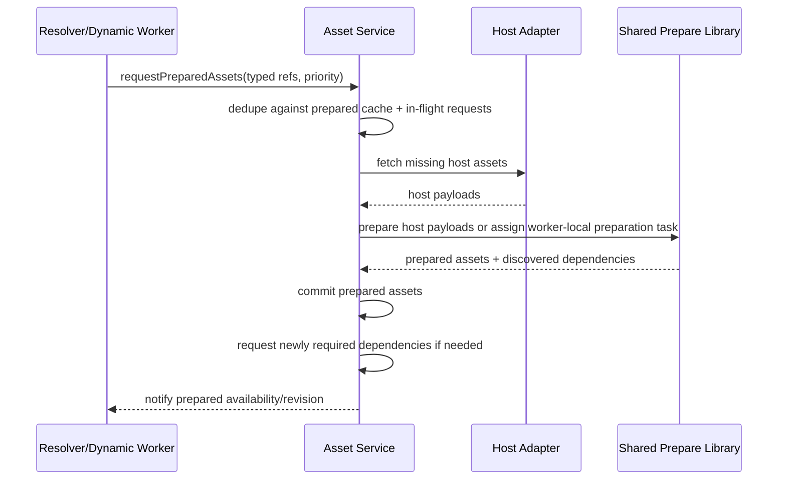
```mermaid
sequenceDiagram
  participant Consumer as Resolver/Dynamic Worker
  participant Assets as Asset Service
  participant Host as Host Adapter
  participant Prepare as Shared Prepare Library

  Consumer->>Assets: requestPreparedAssets(typed refs, priority)
  Assets->>Assets: dedupe against prepared cache + in-flight requests
  Assets->>Host: fetch missing host assets
  Host-->>Assets: host payloads
  Assets->>Prepare: prepare host payloads or assign worker-local preparation task
  Prepare-->>Assets: prepared assets + discovered dependencies
  Assets->>Assets: commit prepared assets
  Assets->>Assets: request newly required dependencies if needed
  Assets-->>Consumer: notify prepared availability/revision
```

Hydration can walk reusable dependencies, but cache identity and in-flight dedupe remain private to the asset service. Static scope resolver and dynamic hydrator workers may execute the shared preparation library through asset-service-assigned work when that avoids an extra worker hop. They should not invent private asset registries, divergent preparation logic, or competing cache/retention policy. A resolver-local memo is acceptable only as a per-job optimization for repeated typed refs inside one concrete resolver job.

Static scope resolver workers may still discover missing typed dependencies while resolving a concrete scope. They should report those missing refs instead of performing main-thread work or inventing a second host lookup model. The coordinator/asset service can then hydrate the missing refs and retry resolution.

Pending asset demand is not the same thing as a prepared-asset lease. An in-flight fetch/prepare entry may track waiters, the highest requested priority, cancellation/demand revision, host request state, and worker preparation state. Those waiters keep useful pending work from being canceled, but they do not count as residency leases because no prepared asset has been committed yet.

Prepared-asset leases begin only after a prepared asset is committed to the runtime-owned asset service cache. Resident static draw units, active resolver/baker jobs that need committed prepared data, dynamic resources, and explicit inspection/debug captures can hold leases. Unleased prepared assets may still be warm-retained by cache policy, but warm retention is a cache optimization rather than consumer ownership. Resolver workers do not extend prepared-asset lifetime by keeping their own durable committed maps.

### Static Landblock-First Flow

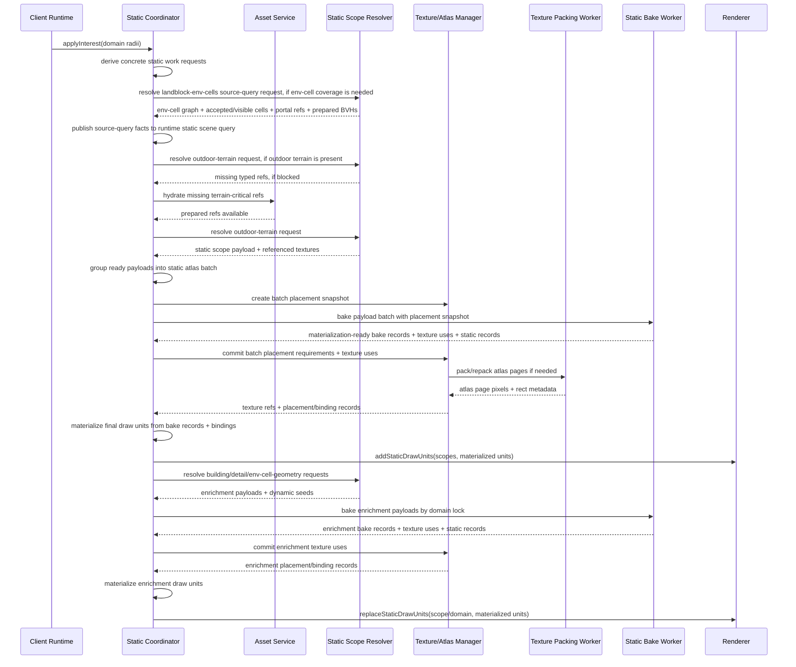
```mermaid
sequenceDiagram
  participant Runtime as Client Runtime
  participant Static as Static Coordinator
  participant Assets as Asset Service
  participant Resolver as Static Scope Resolver
  participant Textures as Texture/Atlas Manager
  participant Packer as Texture Packing Worker
  participant Baker as Static Bake Worker
  participant Renderer as Renderer

  Runtime->>Static: applyInterest(domain radii)
  Static->>Static: derive concrete static work requests
  Static->>Resolver: resolve landblock-env-cells source-query request, if env-cell coverage is needed
  Resolver-->>Static: env-cell graph + accepted/visible cells + portal refs + prepared BVHs
  Static->>Static: publish source-query facts to runtime static scene query
  Static->>Resolver: resolve outdoor-terrain request, if outdoor terrain is present
  Resolver-->>Static: missing typed refs, if blocked
  Static->>Assets: hydrate missing terrain-critical refs
  Assets-->>Static: prepared refs available
  Static->>Resolver: resolve outdoor-terrain request
  Resolver-->>Static: static scope payload + referenced textures
  Static->>Static: group ready payloads into static atlas batch
  Static->>Textures: create batch placement snapshot
  Static->>Baker: bake payload batch with placement snapshot
  Baker-->>Static: materialization-ready bake records + texture uses + static records
  Static->>Textures: commit batch placement requirements + texture uses
  Textures->>Packer: pack/repack atlas pages if needed
  Packer-->>Textures: atlas page pixels + rect metadata
  Textures-->>Static: texture refs + placement/binding records
  Static->>Static: materialize final draw units from bake records + bindings
  Static->>Renderer: addStaticDrawUnits(scopes, materialized units)
  Static->>Resolver: resolve building/detail/env-cell-geometry requests
  Resolver-->>Static: enrichment payloads + dynamic seeds
  Static->>Baker: bake enrichment payloads by domain lock
  Baker-->>Static: enrichment bake records + texture uses + static records
  Static->>Textures: commit enrichment texture uses
  Textures-->>Static: enrichment placement/binding records
  Static->>Static: materialize enrichment draw units
  Static->>Renderer: replaceStaticDrawUnits(scope/domain, materialized units)
```

The first visible outdoor result should not wait for every static object dependency. Terrain gets a privileged fast path because it establishes outdoor world readability. Dungeon readability comes from the parallel `landblock-env-cells` bundle path: a dungeon landblock can render without outdoor terrain, but it should still be planned, retained, and evicted as a landblock-owned static scope. Source-query bundles may update the runtime static scene query without implying bake, atlas placement, materialization, or renderer submission.

### Static Resolution And Bake Flow

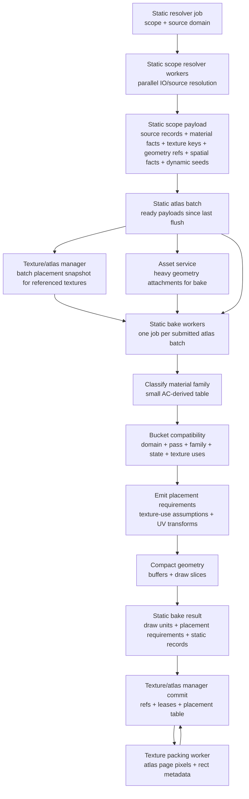
```mermaid
flowchart TB
  Request["Static resolver job<br/>scope + source domain"]
  Resolver["Static scope resolver workers<br/>parallel IO/source resolution"]
  Payload["Static scope payload<br/>source records + material facts + texture keys + geometry refs + spatial facts + dynamic seeds"]
  Batch["Static atlas batch<br/>ready payloads since last flush"]
  Atlas["Texture/atlas manager<br/>batch placement snapshot for referenced textures"]
  Geometry["Asset service<br/>heavy geometry attachments for bake"]
  Baker["Static bake workers<br/>one job per submitted atlas batch"]
  Classify["Classify material family<br/>small AC-derived table"]
  Bucket["Bucket compatibility<br/>domain + pass + family + state + texture uses"]
  Placement["Emit placement requirements<br/>texture-use assumptions + UV transforms"]
  Compact["Compact geometry<br/>buffers + draw slices"]
  Product["Static bake result<br/>draw units + placement requirements + static records"]
  Packer["Texture packing worker<br/>atlas page pixels + rect metadata"]
  Commit["Texture/atlas manager commit<br/>refs + leases + placement table"]

  Request --> Resolver --> Payload --> Batch
  Batch --> Atlas --> Baker
  Batch --> Geometry --> Baker
  Batch --> Baker
  Baker --> Classify --> Bucket --> Placement --> Compact --> Product
  Product --> Commit
  Commit --> Packer --> Commit
```

Baking is static-only. It combines material classification and VAO-compaction concerns into one compatibility problem: if two surfaces cannot share shader family, pass/order class, sampler/device state, logical texture binding layout, capacity limits, domain, ownership scope, sort policy, or visibility scope, they do not share a coarse static material plan. Final renderer draw units are materialized after texture placement data exists. Static bake plans reference bake-local texture uses, placement assumptions, and UV transforms. They do not bind physical atlas pages, renderer texture refs, GPU IDs, or raw texture pixels.

Static object partitioning should make those axes explicit instead of hiding them inside one string key. The expected axes are material/render compatibility, source ownership, sort policy, visibility policy, and capacity slicing. Today, outdoor opaque and alpha-test objects mostly exercise material/render and capacity axes under a single-binding renderer contract: concrete texture/data-use identities, material constants, palette ranges, detail bindings, alpha-test threshold, and wrap policy are hard compatibility keys. Phase 11E4A3 should relax those concrete texture/material hard keys through a two-stage pipeline: coarse partitioning groups logical table-compatible materials before packing, then placement-aware materialization splits or emits final draw units once texture refs/pages/rects are known. Initial table batching should stay render-family scoped, mirroring the V1 shape: `texture-rgba` entries table together, indexed-paletted entries table together, and flat-color remains its own simple family unless a later phase proves cross-family tables are useful. Generated `outdoor-detail` foliage then exercises alpha-test/cutout under the same opaque/depth-writing model; true blended material support exercises object/part sortable draw units; env-cell statics exercise visibility keys such as resident-cell or visible-cell membership.

The resolver is parallel and IO-bound. It reads/fetches source assets through the shared asset service/host boundary, runs source-resolution code for one concrete static resolver job, and emits a compact payload. For static object sources, that payload should carry lightweight metadata and typed heavy-geometry refs rather than full position/UV/normal buffers. The coordinator does not inspect heavy geometry or walk closures; it groups ready payloads by static domain into submitted static atlas batches, asks the texture/atlas manager for a batch placement snapshot, and asks the asset service to attach the heavy geometry views required by that batch.

The baker is CPU-bound. It consumes one or more static scope payloads, batch placement assumptions, and any explicit source-geometry attachment table required by that batch. It performs material-family classification, coarse compatibility bucketing, geometry/source mapping preparation, and emits materialization-ready bake records. Placement-aware materialization consumes the committed texture placement/binding records, assigns draw-local role slots, fine-splits over renderer binding limits, and emits final draw units. The normal sharing unit is the submitted batch, not the whole static domain. Batches may run independently because later batches intentionally receive distinct atlas groups and may duplicate source textures. Draw units produced inside the batch still carry source landblock/env-cell ownership so runtime query, renderer submission, inspection, sorting, and eviction stay granular.

The baker does not assign texture refs, renderer IDs, GPU IDs, physical atlas pages, or atlas pixel buffers. It emits bake-local texture uses, placement requirements/assumptions, materialization-ready static bake records, and peer static records. Static records include spatial records, visibility records, portal/interior records, source mappings, and static-authored dynamic seeds when the source scope contains animated or otherwise dynamic-authored content. The texture/atlas manager resolves bake-local texture uses to texture refs and placement-table entries when committing the result. If new or repacked atlas pages are needed, the texture/atlas manager delegates pixel packing to a texture-packing worker. The final materialization step then uses the committed placement/binding records to produce legal renderer draw units and sends those plus placement updates to the renderer.

Texture packing is typed by page format and sample/data semantics. The reusable atlas work is layout, page sizing, rect allocation, cohort grouping, placement commits, leases, diagnostics, and worker scheduling; pixel allocation, blitting, upload format, and sampler legality are page-format-specific. `RGBA8` color/detail/mask pages, `R8`/`RG8` index pages, and palette `RGBA8` data pages should all use the same texture/atlas ownership model when they are packable. Direct placement remains a degenerate fallback for resources that are not yet or not meaningfully packable, not the preferred architecture for indexed or palette data.

Indexed/paletted material filtering is shader-owned, not texture-sampler-owned. Index and palette atlas pages should use exact lookup policy; the renderer samples neighboring index texels, converts each through the packed palette rect, and blends palette-resolved colors to match v1's `shader-palette-linear` behavior.

Wrap policy is not inherently a physical atlas-page discriminator. When a renderer shader can virtualize wrap against a placement rect, authored clamp/repeat intent should travel as binding/material sampling data, and the shader should apply `clamp` or `fract` before mapping local UVs into the atlas rect. Page-level WebGL wrap state may still be part of a fallback or specialized path, but it should not define the general atlas compatibility model.

Terrain is a dedicated static resolution and baking path, not just a generic static renderable family. Terrain baking still follows the same resolver -> placement snapshot -> baker -> texture manager -> renderer ownership chain, but the terrain adapter owns terrain-specific work: terrain mesh extraction, blend/mask/detail planning, road overlays, terrain draw slices, terrain fallback geometry, terrain BVH bindings, and terrain shader binding layout.

Terrain role-page capacity is a renderer binding constraint, not an atlas packing constraint. A terrain draw unit may reference several color or mask atlas pages through draw-local role-page slots, bounded by named renderer limits such as `MAX_TERRAIN_COLOR_PAGES_PER_DRAW` and `MAX_TERRAIN_MASK_PAGES_PER_DRAW`. Texture packing should decide where compatible batch textures fit across atlas pages; terrain materialization should then map each base, overlay, road, and alpha role to an atlas rect plus a draw-local role-page slot. Same-draw-unit texture compatibility therefore means "fits within the renderer's role-page slots", not "all color roles must share one physical atlas page".

The landblock env-cell bundle and env-cell static geometry are likewise first-class static/source-query paths. The bundle resolver owns landblock-info provenance, env-cell membership, env-cell portal/link metadata, accepted/visible cell sets, landblock-wide env-cell BVH records, static seeds, and per-cell local BVHs. Later env-cell geometry resolution/baking owns environment/cell-structure geometry, local placement, indoor static objects, env-cell-local portal apertures for traversal/debug metadata, and bake-ready env-cell-local records. Landblock-building transition mask geometry is not derived from env-cell outside-transition aperture polygons; it is prepared from outdoor building `GfxObj` portal geometry and committed with the outdoor-building route. Outdoor interiors and pure dungeon landblocks should share this bundled env-cell path; the difference is scene entry and which source families are present, not a separate renderer architecture.

Current-code `product` and `layer` vocabulary maps roughly to scheduling and output partitioning:

```text
product = requested/scheduled static domain result
layer = static object bundle partition inside some products
```

V2 should not preserve both terms unless they remain useful. The load-bearing concepts are concrete static work requests, bake results, and domain-specific output partitions.

### Dynamic Renderable Flow

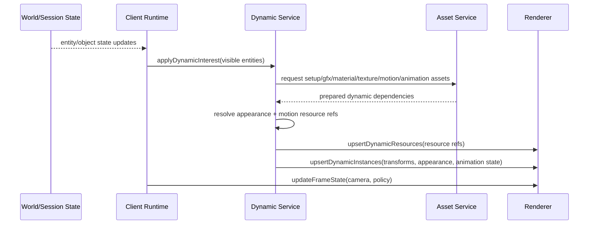
```mermaid
sequenceDiagram
  participant World as World/Session State
  participant Runtime as Client Runtime
  participant Dynamic as Dynamic Service
  participant Assets as Asset Service
  participant Renderer as Renderer

  World-->>Runtime: entity/object state updates
  Runtime->>Dynamic: applyDynamicInterest(visible entities)
  Dynamic->>Assets: request setup/gfx/material/texture/motion/animation assets
  Assets-->>Dynamic: prepared dynamic dependencies
  Dynamic->>Dynamic: resolve appearance + motion resource refs
  Dynamic->>Renderer: upsertDynamicResources(resource refs)
  Dynamic->>Renderer: upsertDynamicInstances(transforms, appearance, animation state)
  Runtime->>Renderer: updateFrameState(camera, policy)
```

Dynamic rendering shares prepared assets with static rendering where the source data overlaps. It does not share static draw units, packed static VAOs, or static landblock atlas assumptions.

Some dynamic instances are authored by static landblock data. A rotating windmill is static-scoped for residency but dynamic for rendering. Static scope resolver workers may emit dynamic seeds while resolving static scopes; the dynamic service owns their animation state, resource refs, renderer instance updates, and lifetime tied to the owning static scope.

### Renderer Input Flow

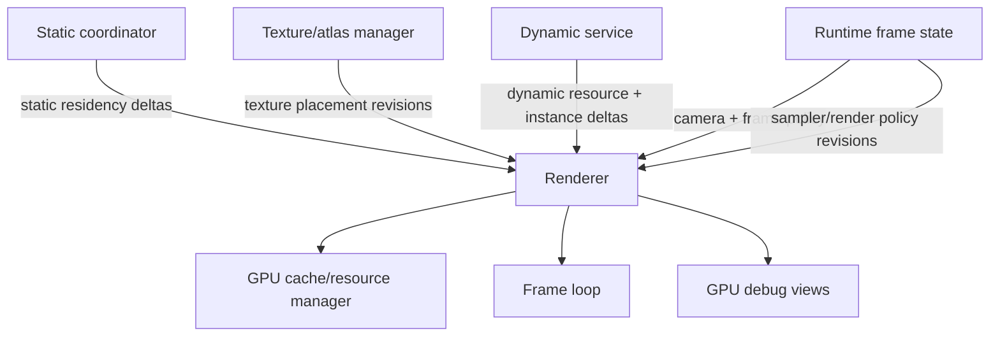
```mermaid
flowchart TB
  StaticBake["Static coordinator"]
  Dynamic["Dynamic service"]
  Textures["Texture/atlas manager"]
  Runtime["Runtime frame state"]
  Renderer["Renderer"]
  GpuCache["GPU cache/resource manager"]
  Frame["Frame loop"]
  DebugViews["GPU debug views"]

  StaticBake -->|static residency deltas| Renderer
  Textures -->|texture placement revisions| Renderer
  Dynamic -->|dynamic resource + instance deltas| Renderer
  Runtime -->|camera + frame policy| Renderer
  Runtime -->|sampler/render policy revisions| Renderer
  Renderer --> GpuCache
  Renderer --> Frame
  Renderer --> DebugViews
```

Renderer input should be incremental, not setter confetti and not a giant deep scene object every frame.

```ts
interface Renderer {
  applyStaticDelta(delta: StaticResidencyDelta): void;
  applyDynamicDelta(delta: DynamicResidencyDelta): void;
  applyTexturePlacementUpdate(update: TexturePlacementUpdate): void;
  applySamplerPolicyUpdate(update: SamplerPolicyUpdate): void;
  updateFrameState(state: FrameState): void;
  dispose(): void;
}
```

A `RenderScene` can still exist as an inspection/debug snapshot assembled from renderer and runtime state. It should not be the only way to update the renderer.

### Logical And Renderer Resource Tables

Many resources have two tables: a logical runtime-owned table and a renderer-owned GPU realization table. That does not mean there are two authorities. Runtime-side managers own identity, residency, revisions, leases, and policy. The renderer mirrors committed updates into GPU objects and binding-time lookup tables.

Textures need the richest split:

```text
Texture/atlas manager:
  TextureKey -> TextureRefId
  TextureRefId -> logical placement
  domain + staticBatchId -> batch atlas group/revision
  leases and eviction policy

Renderer:
  TextureRefId -> mirrored GPU texture placement
  AtlasPageId -> WebGLTexture
  uploaded page revisions
  sampler/binding state revisions
```

Static geometry is simpler:

```text
Static coordinator:
  scope/domain -> StaticDrawUnitId[]
  StaticDrawUnitId -> committed draw-unit record
  draw unit -> texture refs + draw-slice identity
  scope/domain -> spatial/visibility/portal/interior/source records

Renderer:
  StaticDrawUnitId -> GPU buffers/VAO/index state/uploaded revision

Static scene query:
  static records -> env-cell-aware picking/visibility/query structures
```

Dynamic resources follow the same pattern:

```text
Dynamic service:
  DynamicResourceId -> logical model/material/animation resource
  EntityId/static seed id -> resource refs + instance state

Renderer:
  DynamicResourceId -> GPU buffers/material tables/animation textures
  EntityId/static seed id -> instance buffer slot/state
```

Materials should start local to draw units/resources unless duplication proves otherwise:

```text
Runtime services:
  material binding -> shader family + constants + texture refs

Renderer:
  material binding/draw unit -> uploaded material table slot or uniform data
```

Spatial and picking metadata should also keep logical ownership separate from renderer acceleration structures:

```text
Static/dynamic services:
  source ids, pickable ids, draw-slice mappings, BVH item bindings

Static scene query:
  outdoor indexes, env-cell residency indexes, env-cell-local indexes,
  portal traversal gates, pickRay/query results

Renderer:
  optional mirrored render acceleration built from committed deltas
```

The general rule is: logical resource owners emit stable refs and revisions; the renderer mirrors committed refs into GPU resources. Workers do not mint renderer IDs.

### Lifecycle Ownership

There is no universal lifecycle and no universal `ready`. V2 has several scoped lifecycles with different owners. State names should name their owner rather than pretending asset readiness, static scope readiness, atlas residency, GPU residency, and frame visibility are the same thing.

The labels in these diagrams are explanatory, not proposed enum variants or required code identifiers. Most should be derived from concrete ownership facts: cache membership, in-flight host requests, resolver/baker queue membership, active worker jobs, committed batch atlas revisions, texture leases, renderer resource maps, and current frame selection. Add explicit status enums only for coarse external snapshots, error handling, or UI summaries where a projection genuinely simplifies consumers.

Asset service lifecycle:

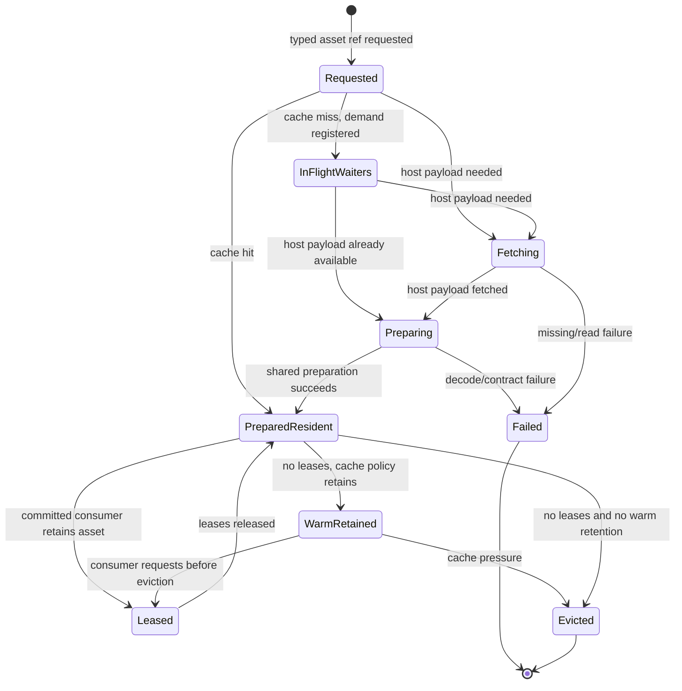
```mermaid
stateDiagram-v2
  [*] --> Requested: typed asset ref requested
  Requested --> InFlightWaiters: cache miss, demand registered
  Requested --> Fetching: host payload needed
  Requested --> PreparedResident: cache hit
  InFlightWaiters --> Fetching: host payload needed
  InFlightWaiters --> Preparing: host payload already available
  Fetching --> Preparing: host payload fetched
  Preparing --> PreparedResident: shared preparation succeeds
  Preparing --> Failed: decode/contract failure
  Fetching --> Failed: missing/read failure
  PreparedResident --> Leased: committed consumer retains asset
  Leased --> PreparedResident: leases released
  PreparedResident --> WarmRetained: no leases, cache policy retains
  WarmRetained --> Leased: consumer requests before eviction
  WarmRetained --> Evicted: cache pressure
  PreparedResident --> Evicted: no leases and no warm retention
  Failed --> [*]
  Evicted --> [*]
```

`InFlightWaiters` is explanatory only: it represents pending demand sharing one fetch/prepare job. It is not a prepared-asset residency state and does not create a lease.

Static coordinator lifecycle:

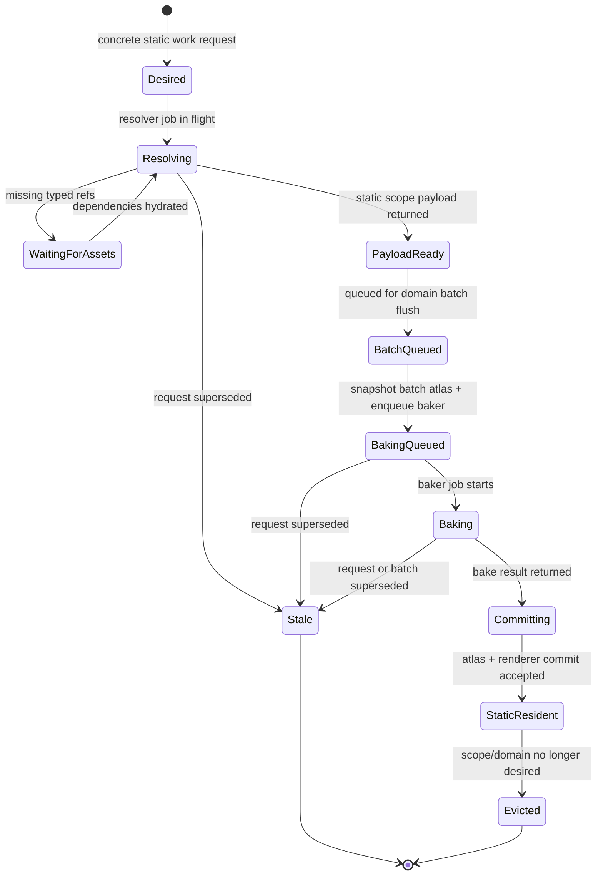
```mermaid
stateDiagram-v2
  [*] --> Desired: concrete static work request
  Desired --> Resolving: resolver job in flight
  Resolving --> WaitingForAssets: missing typed refs
  WaitingForAssets --> Resolving: dependencies hydrated
  Resolving --> PayloadReady: static scope payload returned
  PayloadReady --> BatchQueued: queued for domain batch flush
  BatchQueued --> BakingQueued: snapshot batch atlas + enqueue baker
  BakingQueued --> Baking: baker job starts
  Baking --> Committing: bake result returned
  Committing --> StaticResident: atlas + renderer commit accepted
  Resolving --> Stale: request superseded
  BakingQueued --> Stale: request superseded
  Baking --> Stale: request or batch superseded
  StaticResident --> Evicted: scope/domain no longer desired
  Stale --> [*]
  Evicted --> [*]
```

Batch atlas placement lifecycle:

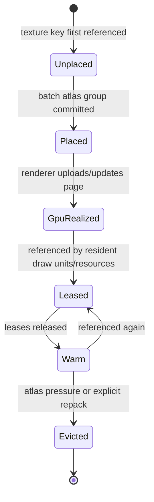
```mermaid
stateDiagram-v2
  [*] --> Unplaced: texture key first referenced
  Unplaced --> Placed: batch atlas group committed
  Placed --> GpuRealized: renderer uploads/updates page
  GpuRealized --> Leased: referenced by resident draw units/resources
  Leased --> Warm: leases released
  Warm --> Leased: referenced again
  Warm --> Evicted: atlas pressure or explicit repack
  Evicted --> [*]
```

Batch atlas commit sequence:

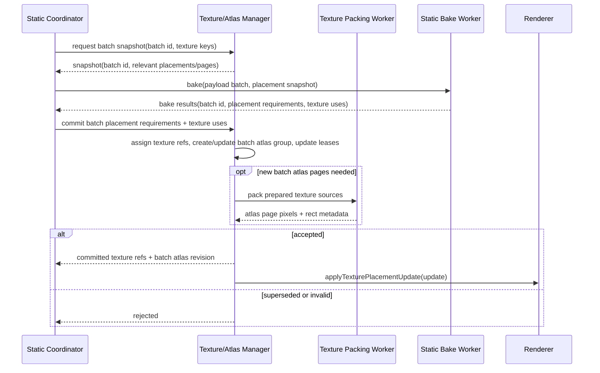
```mermaid
sequenceDiagram
  participant Static as Static Coordinator
  participant Atlas as Texture/Atlas Manager
  participant Packer as Texture Packing Worker
  participant Baker as Static Bake Worker
  participant Renderer as Renderer

  Static->>Atlas: request batch snapshot(batch id, texture keys)
  Atlas-->>Static: snapshot(batch id, relevant placements/pages)
  Static->>Baker: bake(payload batch, placement snapshot)
  Baker-->>Static: bake results(batch id, placement requirements, texture uses)
  Static->>Atlas: commit batch placement requirements + texture uses
  Atlas->>Atlas: assign texture refs, create/update batch atlas group, update leases
  opt new batch atlas pages needed
    Atlas->>Packer: pack prepared texture sources
    Packer-->>Atlas: atlas page pixels + rect metadata
  end
  alt accepted
    Atlas-->>Static: committed texture refs + batch atlas revision
    Atlas->>Renderer: applyTexturePlacementUpdate(update)
  else superseded or invalid
    Atlas-->>Static: rejected
  end
```

Renderer static residency lifecycle:

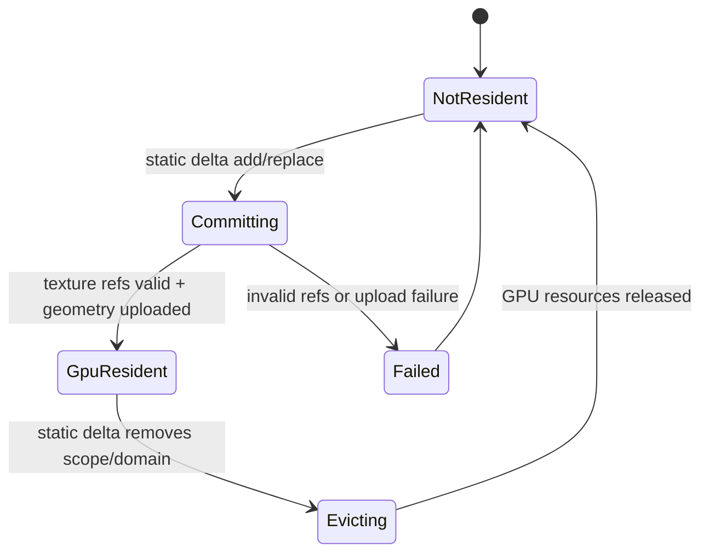
```mermaid
stateDiagram-v2
  [*] --> NotResident
  NotResident --> Committing: static delta add/replace
  Committing --> GpuResident: texture refs valid + geometry uploaded
  Committing --> Failed: invalid refs or upload failure
  GpuResident --> Evicting: static delta removes scope/domain
  Evicting --> NotResident: GPU resources released
  Failed --> NotResident
```

Renderer static commit sequence:

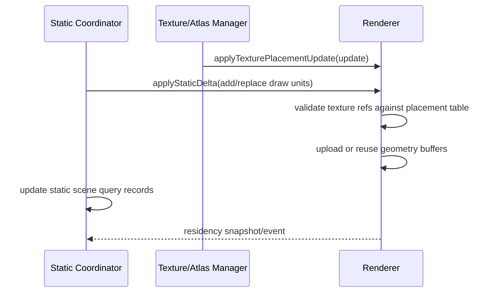
```mermaid
sequenceDiagram
  participant Static as Static Coordinator
  participant Atlas as Texture/Atlas Manager
  participant Renderer as Renderer

  Atlas->>Renderer: applyTexturePlacementUpdate(update)
  Static->>Renderer: applyStaticDelta(add/replace draw units)
  Renderer->>Renderer: validate texture refs against placement table
  Renderer->>Renderer: upload or reuse geometry buffers
  Static->>Static: update static scene query records
  Renderer-->>Static: residency snapshot/event
```

Renderer static frame sequence:

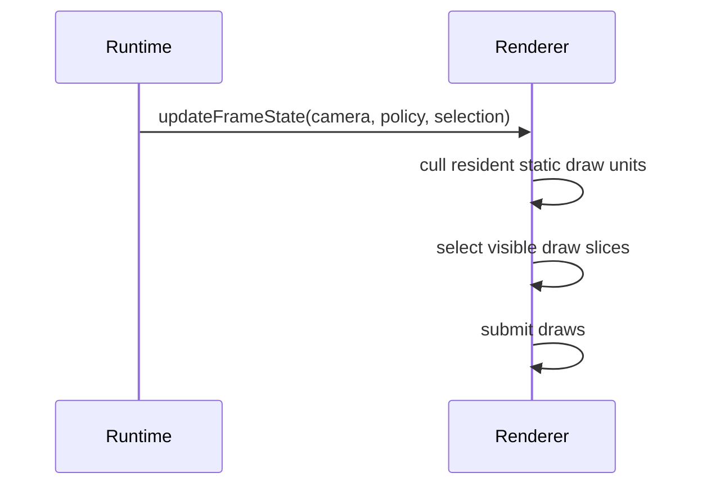
```mermaid
sequenceDiagram
  participant Runtime as Runtime
  participant Renderer as Renderer

  Runtime->>Renderer: updateFrameState(camera, policy, selection)
  Renderer->>Renderer: cull resident static draw units
  Renderer->>Renderer: select visible draw slices
  Renderer->>Renderer: submit draws
```

Dynamic lifecycle:

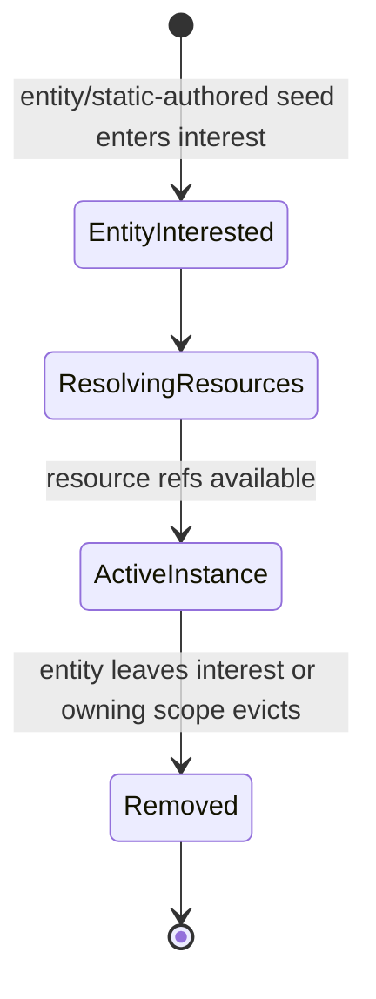
```mermaid
stateDiagram-v2
  [*] --> EntityInterested: entity/static-authored seed enters interest
  EntityInterested --> ResolvingResources
  ResolvingResources --> ActiveInstance: resource refs available
  ActiveInstance --> Removed: entity leaves interest or owning scope evicts
  Removed --> [*]
```

Dynamic update sequence:

```mermaid
sequenceDiagram
  participant Dynamic as Dynamic Service
  participant Renderer as Renderer

  Dynamic->>Renderer: upsertDynamicResources(resource refs)
  Dynamic->>Renderer: upsertDynamicInstances(transform, appearance, animation state)
  Renderer->>Renderer: update resident instance buffers/state
```

### Texture Residency

Texture reuse should be handled below static scope ownership and above raw GPU upload. Resolver output reports referenced texture keys. The static coordinator groups ready payloads into a submitted static atlas batch, and the texture/atlas manager creates a batch placement snapshot for that batch. The baker consumes that snapshot and emits placement requirements/assumptions plus bake-local texture uses. The texture/atlas manager maps those uses to texture refs, maintains the batch atlas group placement table, and delegates atlas page pixel assembly to a texture-packing worker when direct placement is insufficient. The renderer mirrors committed texture refs into GPU texture placement state and performs final WebGL upload.

```mermaid
flowchart LR
  PreparedTexture["Prepared texture"]
  TextureKey["Texture key<br/>identity + sampling constraints"]
  ScopePayload["Static scope payload<br/>referenced texture keys"]
  BatchGroup["Batch atlas group<br/>shared within one submitted batch"]
  BatchSnapshot["Batch placement snapshot<br/>only referenced textures/pages"]
  BakeUse["Bake texture use<br/>local to one bake result"]
  PlacementReq["Placement requirements<br/>assumptions + UV transforms"]
  PackingWorker["Texture packing worker<br/>atlas page pixels + rect metadata"]
  TextureRef["Texture ref<br/>owned by texture manager"]
  Placement["Placement table<br/>ref -> page/rect/direct"]
  StaticUnits["Committed static draw units<br/>reference texture refs"]
  DynamicResources["Dynamic resources<br/>reference texture refs"]
  RendererResidency["Renderer texture residency<br/>direct or atlas-backed"]
  GpuTexture["GPU texture/atlas page"]

  PreparedTexture --> TextureKey
  TextureKey --> ScopePayload
  ScopePayload --> BatchGroup
  BatchGroup --> BatchSnapshot
  BatchSnapshot --> BakeUse
  BakeUse --> PlacementReq
  PlacementReq --> TextureRef
  TextureRef --> PackingWorker
  PackingWorker --> Placement
  TextureRef --> Placement
  TextureRef --> StaticUnits
  TextureRef --> DynamicResources
  Placement --> RendererResidency
  StaticUnits --> RendererResidency
  DynamicResources --> RendererResidency
  RendererResidency --> GpuTexture
```

Draw units bind texture refs, not physical atlas pages. A direct texture is represented as a degenerate atlas placement. Repacking is possible because refs can resolve to new placements without rewriting draw-unit geometry.

The hard lifecycle rule is that draw units are landblock/env-cell-owned output, while atlases are batch-owned resources. This is the root archetype for static baking domains: terrain, outdoor static objects, dungeon/env-cell static geometry, topology-derived renderables, and later detail domains should share batch-scoped atlas lifetimes with landblock/env-cell-scoped geometry/VAO ownership unless a future optimization explicitly proves a narrower exception:

```text
static scope residency:
  scope/domain -> draw units -> texture refs

atlas residency:
  domain + staticBatchId -> batch atlas group
  texture refs -> current placements
  placement lease count from resident draw units in the batch group

GPU residency:
  placement table/page revision -> WebGL texture objects
```

Evicting a landblock releases leases from its draw units but does not necessarily evict the batch atlas group if other draw units from the same batch still reference it. The texture/atlas manager may keep unleased batch placements warm or discard the whole unleased batch atlas group later.

Submitted static atlas batches are the default sharing unit. Textures are shared across scopes inside a batch, but not across later batches by default. This allows terrain/static streaming to parallelize and avoids global atlas revision contention while preserving coarse landblock/env-cell draw-unit residency.

### Directory Shape

This is not an implementation plan, but ownership should be visible in paths. A small first cut is enough:

```text
src/client/
  runtime/
  host/
  assets/
  static/
  textures/
  workers/
  dynamic/
  renderer/
  diagnostics/
  browser/
```

The `browser/` folder is the only place Svelte belongs. A future client shell should be able to reuse everything outside it, subject to replacing host/session adapters and input policy.

## Research Findings

These findings replace the earlier open threads. They are not an implementation plan; they narrow the shape enough to avoid bikeshedding the rewrite.

### Runtime Boundary

The smallest useful runtime boundary is an imperative client-facing object with:

- Lifecycle: create, start/stop or attach/detach, dispose.
- Inputs: scene interest, camera/control commands, selection/picking requests, render policy toggles.
- Outputs: coarse snapshots and subscriptions for scene/resource/metrics/picking/debug state.

The runtime should orchestrate content, world state, hydration, static baking, dynamic hydration, and renderer updates. The renderer should own GPU resources and its frame loop. Browser Svelte should instantiate the runtime, forward UI commands, and render snapshots. A non-Svelte browser harness should only need a content/host adapter, a canvas, initial scene interest or player state, and imperative runtime commands.

State that should be snapshots: scene interest, renderer membership summaries, resource residency, metrics, inspection snapshots, debug report data. State that should be commands: camera movement, picking, selection, policy toggles, debug capture requests, and runtime lifecycle.

### Asset Hydration And Planning

Dependency walks split cleanly into source-data facts and frontend policy.

Source-data facts:

- Landblock topology, outdoor statics, generated scenery, buildings, env-cell links, and terrain material references.
- Setup model to gfx object parts.
- Gfx object to material surfaces.
- Material surface to surface texture, render surfaces, palette, and default palette.
- Region profile to terrain detail roles, terrain alpha maps, road alpha maps, and surface texture IDs.
- Object description/model data to setup appearance, palette, sub-palettes, texture changes, and part/model changes.

Frontend policy:

- Scene interest and retention radius.
- Hydration priority, progressive scheduling, cancellation, and cache pruning.
- Texture preparation policy, detail texture enablement, atlas policy, and renderer capability fallback.
- Diagnostics, debug panels, and one-frame reports.

Asset identity should be structured internally. The Rust side already has typed request shapes such as `ContentAssetRequest` and `SetupAppearanceRequest`; the TS side relies too heavily on string IDs and parsing. V2 should use typed asset refs in service/worker boundaries. Host route strings are allowed at the host adapter/preparation boundary for transport and validation, and as explicit provenance/debug text, but they must not become resolver, baker, texture-manager, renderer, or dynamic-service identity.

When V2 needs string keys for `Map`/cache indexing, those keys should be opaque/branded canonical strings derived from typed identities by a single local function. Callers should pass typed identities, not arbitrary strings. `Record<string, T>` should be avoided for semantic resource maps because it makes every string look valid.

Prepared/resolved records should translate host DTO route strings into typed runtime resource identities before entering static resolver payloads or bake inputs. Runtime-facing discriminants such as `kind` must be closed string-literal unions, never arbitrary `string`.

Minimum first visible outdoor terrain does not require static objects. It requires the cell landblock terrain mesh, region profile/material table, and the surface textures/render surfaces needed by visible terrain pcodes and alpha/detail layers. Minimum first visible dungeon content does not require outdoor terrain. It requires the landblock env-cell bundle, selected or resident env-cell payloads, and their environment/cell-structure geometry. Static object enrichment, portal mask refinement, and dynamic renderable hydration can trail those first visible slices.

The current dedicated asset worker is not enough evidence for a dedicated V2 asset-prepare worker. Current `asset-worker.ts` does useful work: host binary lookup bridging, payload validation/routing, provenance normalization, a few payload reshapes, transferable collection, and `PreparedAssetRecord` emission. But much of the current static-heavy path immediately needs another worker, and the static landblock worker already duplicates host lookup, `prepareAssetPayload`, and companion closure walking. That suggests the durable abstraction is a shared asset preparation library plus asset-service ownership of identity/cache/dedupe, not a mandatory physical asset-prepare worker.

V2 resolver and dynamic hydrator workers may execute narrowly scoped preparation work through asset-service-assigned tasks when that avoids unnecessary worker-boundary portering. The asset service should still own typed identity, prepared asset views, in-flight dedupe, prepared cache, committed prepared-asset leases, warm retention, source revision/failure semantics, and shared preparation rules. Pending fetch/prepare entries have waiters, not leases. Workers should not grow private asset registries, durable geometry caches, or divergent preparation logic.

The performance conclusion is not a magic number yet. The failed larger `audit_static_materials --max-landblocks 4096` run showed that naive broad static-source walking is expensive enough to avoid full rescans in hot paths. Prefer progressive, monotonic hydration over comprehensive upfront planning: scene-interest changes should produce useful terrain first, then continue closure and enrichment as prepared assets reveal dependencies.

### Static Work Requests

Current landblock LoD is domain residency radii, not a mesh LoD tier. `SceneResourceInterest` carries `terrain`, `buildings`, `detail`, and `envCells` radii for outdoor coverage, while dungeon/interior destinations select an owning landblock pack plus a current env-cell focus. `deriveOutdoorSceneInterest` clamps outdoor buildings and detail so they do not exceed terrain coverage, and product planning turns demand into concrete landblock products. Outdoor detail resolved generated scenery first because foliage was the main alpha-test/cutout proof for the domain; the next explicit-object slice should join that domain to surface known blended static targets before broader env-cell/static breadth.

V2 should preserve the "compile demand before workers" behavior while making dungeon landblocks first-class. Resolver jobs should receive concrete landblock IDs and source domains, not interest radii, current-camera state, scheduling labels, or generic policy revisions. Dungeon scenes have a single owning landblock; current env-cell belongs to scene interest/navigation/visibility policy and should not become resolver job identity unless V2 later chooses partial dungeon loading. The coordinator compiles outdoor radii and dungeon/interior interest into scheduled jobs; workers operate on idempotent resolver jobs.

Current-code mapping:

- Scheduled source/render domains should be V2-owned domain names such as `outdoor-terrain`, `outdoor-buildings`, `outdoor-detail`, and `landblock-env-cells`. `landblock-env-cells` is the isomorphic bundle path for outdoor-linked interiors and pure dungeon landblocks; V2 should not split this into separate outdoor/dungeon topology products.
- `StaticObjectBundleArtifact` / static bundle layer is an output partition used by some products: `outdoor-buildings`, `outdoor-detail`, or `env-cell-static`.
- Older V1 decisions already found that dungeon behavior stays on the detailed env-cell path and does not request an outdoor product. V2 should carry that lesson forward as a landblock env-cell bundle plus later env-cell static geometry domains, not as a late "interior" bolt-on and not as the old flat topology route.

V2 does not need both words as core vocabulary. Prefer scheduled resolver jobs for source resolution, static bake inputs/results for baking, and domain-specific output partitions for worker output. Coordinator job ids are for async correlation and stale-result rejection only.

Static work should split into two dedicated services:

- Static scope resolver workers: parallel, IO-bound source resolution against concrete idempotent resolver jobs.
- Static bake workers: CPU-bound material classification, placement-assumption handling, and geometry baking against batch placement snapshots.

Code should name abstract service boundaries by what they do, not by whether the implementation is local, worker-backed, or pooled. Prefer `StaticResolver`, `StaticBaker`, and `TexturePacker` as the coordinator/texture-manager-facing interfaces. Reserve `Worker...` / `...WorkerClient` names for main-thread transport adapters that own worker ports, request correlation, cancellation, disposal, and later worker-pool dispatch. Resolver, baker, and packer workers themselves should remain dumb worker-side service hosts: receive a message, run the concrete service operation, and post one response. Runtime/browser composition chooses local, worker-backed, or pooled adapters; the static coordinator and texture/atlas manager should not know the topology.

Concurrency and worker-count defaults should be named constants at the owner boundary rather than hardcoded literals. Resolver worker count, baker worker count, texture-packing worker count, static batch coalesce limits, and texture pack-group concurrency are runtime/adapter tuning policy. They should be easy to find and change in code, but not surfaced as browser UI or broad user configuration until measured need appears.

The main thread/runtime control plane sits between them because the texture/atlas manager owns batch atlas groups and placement state. It should feed the baker only the batch placement snapshot relevant to the submitted payload batch's referenced surfaces/textures; atlas pixel assembly is delegated to texture-packing workers.

### Static Draw Units

Static landblock materialization should produce renderer-ingestible output after texture placement commit. Static draw units are wider than material family: they must include logical texture-use bindings, shader/binding layout, render state, sampler state, pass/order class, sort policy, visibility policy, and capacity partition facts. Current pre-11E4A3 V2 static-object draw units implement a single-binding subset: one base/index/palette/detail binding set, one material color/emissive set, one alpha threshold, one palette range, and one wrap policy per draw unit. Phase 11E4A3 should extend the existing static-object geometry draw-unit contract in place with per-vertex or per-triangle selectors and bounded material/texture entries rather than introducing a parallel public table-backed subtype. The one-entry/single-binding case is the degenerate table case; singular fields may survive temporarily only as derived compatibility/debug summaries while the shader path cuts over. Physical atlas pages and rects remain placement-table concerns owned by the texture/atlas manager, while placement-aware materialization maps committed texture refs/pages/rects into final table entries. Static-object material tables also need draw-local role-slot limits, parallel to terrain role-page limits, so a table can reference several committed texture pages without assuming one atlas page per draw unit.

Opaque and alpha-test/cutout static object draw units are order-independent relative to each other because they write depth. They can compact by material/render compatibility, texture-role layout, batchable ownership scope, visibility scope, and capacity; object identity should remain metadata unless the partition policy needs it as a hard grouping key. Alpha/translucent blended static-object coverage emits object/part draw units with render-state facts and sort center/bounds metadata, and the WebGL2 renderer draws those resources after depth-writing static passes with per-frame back-to-front ordering by renderer-local camera distance. Additive, alpha-additive, inverse-alpha, and inverse-alpha-additive remain evidence-gated and render-deferred until a concrete static-world target justifies the extra blend behavior. Transparent sorting is object/part-level; triangle-level transparent sorting is intentionally out of scope unless later evidence proves object/part sorting is insufficient.

Terrain, static objects, structured interiors, and portal masks should not be forced into one physical draw-unit struct. A shared draw-unit vocabulary is useful, but domain-specific variants are justified:

- Terrain has its own resolution and baking path: grid topology, blend masks, road masks, detail roles, draw-slice/fallback behavior, terrain BVH bindings, and terrain shader layout.
- Static objects and structured interiors can likely share the closest model: baked geometry plus material slices and peer static records.
- Portal masks are a special transition/visibility domain, not a normal material family.

Static records should be enough for culling, picking, portal/interior traversal, debug inspection, and ownership: source instance IDs, owner landblock/env cell or outdoor building, bounds or BVH item refs, draw-slice to source mapping, typed material/resource references, cell visibility records, portal links/apertures, and interior cell metadata. For landblock-building transitions, the aperture record's primary source identity is the outdoor building portal geometry plus matched `CBldPortal` metadata; env-cell outside-transition records may be attached as metadata but must not be the mask geometry owner. They should not become a renderer-owned scene graph. They should also not carry host route strings as semantic identity; route strings belong only in explicitly named provenance/debug fields.

Worker output should use bake-local typed texture-use IDs rather than renderer texture handles or host asset route strings. Static bake output may reference placement assumptions from a scoped texture/atlas placement snapshot, but it should not contain atlas page pixels or own final placement-table mutation. The commit/resource step maps bake-local texture uses to texture-manager-owned texture refs and placement-table entries. This keeps worker output independent of renderer ID allocation while still allowing the baker to validate compatibility against a concrete batch placement snapshot.

### Static BVH And Spatial Metadata

The frontend architecture has separate BVH/spatial concepts that should stay separate:

- Prepared source BVHs: terrain BVH, outdoor static BVH, landblock-wide env-cell BVH, and env-cell local BVHs.
- Resolver/source-query records: preserved prepared BVH nodes/items, object/cell/static-seed bindings, portal refs, accepted/visible cell sets, and source spatial facts that can feed runtime queries before bake/materialization.
- Worker-produced static records: object visibility records, cell visibility records, local BVH bindings, draw/source mapping, and renderer-output spatial summaries produced with static output.
- Static scene query state: live semantic picking, visibility-query, portal traversal, and future culling inputs derived from source-query records and committed static deltas.
- Renderer visibility state: draw submission state derived from runtime/static-scene visibility decisions and committed renderer deltas.

Static/source-query deltas should include runtime-ingestible spatial metadata rather than forcing the
renderer or browser UI to pull prepared assets for BVH queries. Resolver workers preserve
host/prepared BVHs and source spatial facts; baker workers produce draw/source mappings and BVH item
bindings for baked output; the runtime-owned static scene query builds and owns live semantic
picking/visibility structures from those records. Normal object picking should traverse preserved
outdoor/env-cell BVHs and use runtime-owned root transforms for scene anchoring/rebasing. Draw-unit
or frontend-computed bounds are diagnostic output facts, not semantic picking fallbacks; if a source
object is not reachable through its prepared/source BVH, the canonical frontend should treat it as
non-queryable and surface diagnostics. The renderer may later mirror a reduced acceleration
structure for draw submission, but it is not the semantic owner of AC object, material, env-cell, or
portal identity.

The env-cell bundle should expose two BVH layers. The landblock-wide env-cell BVH is the coarse residency and candidate-selection structure: its items are env-cell-grained records with bounds in the bundle's implied landblock/env-cell-root space. Each env cell then exposes a local BVH over that cell's cell-structure geometry, static seeds, and env-cell-local portal apertures in implied env-cell-local space. Portal walking is a semantic visibility layer over the candidate/resident cells; it does not replace the landblock-wide BVH needed to establish initial residency or broad query candidates. DTO field ownership implies the spatial space, so V2 env-cell DTOs should not carry `coordinateSpace` decoration except at temporary compatibility boundaries. Building-sourced outdoor transition aperture masks live outside this env-cell-local BVH ownership path and are retained with outdoor building residency.

### Portal Renderer Architecture

Canonical interior rendering is portal traversal driven, not whole-domain interior rendering. The
historical course-correction plan is
[holtburger-3d-v2-portal-renderer-course-correction-plan.md](holtburger-3d-v2-portal-renderer-course-correction-plan.md).

The portal renderer preserves the source and bake ownership model:

- `landblock-env-cells` remains the landblock-owned source domain for outdoor-linked interiors and pure dungeon landblocks.
- Static resolver and baker output remains source/bake truth: draw units, texture uses, spatial records, visibility records, portal/interior records, source mappings, and dynamic seeds.
- Texture/atlas ownership remains batch-scoped, while draw units remain landblock/env-cell scoped.
- Runtime/static-scene query remains the semantic owner of env-cell, portal, BVH, source-mapping, picking, and visibility facts.
- Renderer owns GPU resources and drawing, but it receives explicit frame plans or equivalent
  visibility updates rather than inferring AC portal semantics from source DTOs.

The durable concept is env-cell render visibility membership. Resident structured-interior and
env-cell static-object resources must be addressable by owning env cell at frame-submission time.
This does not imply one host request, atlas batch, or source bake per env cell. It means the renderer
or materializer must preserve enough membership indexing or draw-slice data for a portal traversal
result to submit env cell A without also submitting unrelated resident env cell B. The WebGL2
renderer exposes this as `RendererEnvCellResourceMembership`: structured-interior draw-unit ids,
env-cell static-object draw-unit ids, and the count of shared static-object draw units for each
resident landblock/env-cell pair.

Production interior rendering starts from camera/current env-cell residency and traverses committed
env-cell portal records to produce a bounded per-frame reachable-cell plan. That plan carries the
reachable env cells, traversal depth, portal aperture stack, scene-domain crossings, and
rejection/truncation diagnostics needed by renderer execution and browser inspection. Browser-only
flat resident interior rendering may remain as an explicit diagnostic mode, but it is not the
production or future-client architecture.

Traversal must not collapse portal rendering to unique env cells too early. Env-cell resources are
deduped by owning cell for residency and draw-resource lookup, but portal execution needs a
separate portal-view/group layer. Multiple same-depth apertures from one parent visibility context
to the same target env cell should merge into one stencil region and draw that target cell once
under the merged mask. The same target env cell may still need multiple portal view groups when it
is reached through distinct parent portal-stack contexts. `already-visible` edges are therefore
render-relevant aperture facts until they have been folded into a view group or explicitly capped.

The renderer-facing frame contract is `PortalFrameWorkPlan`. It is the production portal-frame
shape:

- `direct-env-cell` records an outdoor offscreen target or direct env-cell base scene, direct
  env-cell draw requests, traversal depth, portal stack identity, resource availability, selected
  portal-aperture geometry resources, aperture mask passes, and transition crossings as
  outdoor/env-cell scene-domain crossings.
- `legacy-render-pass` is retained only where diagnostics need to label historical or flat-resident
  behavior. It must not become a second production execution path.

Runtime and diagnostics may still report historical render-pass labels, but direct env-cell portal
execution is the production path. The legacy scene-domain interior compositor should remain removed
or explicitly diagnostic-only.

The minimum production model is camera residency plus bounded portal reachability plus direct
env-cell submission. Screen-footprint pruning, narrowed child frusta, and literal clipping against
portal polygons are optional later tools if reachability and aperture masks prove insufficient.

Portal aperture geometry is reusable resource data, not production visibility policy. The renderer may
deduplicate uploaded portal polygon vertex/index ranges by canonicalized transformed geometry,
because reciprocal and duplicate portal polygons are common. It must still preserve distinct
per-edge semantics for traversal: source env cell, target endpoint, portal ids, flags, face policy,
and portal stack identity. A frame plan selects active portal edges/passes and references aperture
resources; resident baked portal batches must not imply that every portal polygon is drawn in the
production frame. This does not mean ordinary structured-interior cell-structure baking should
blanket-skip polygons whose ids also appear in env-cell portal/aperture metadata. Source
cell-structure polygons remain visible geometry when their material/stippling rules say they are
visible; portal metadata selects aperture mask resources and traversal edges.

The current WebGL2 direct env-cell executor uses depth-level stencil refs rather than unique
per-edge refs. WebGL's fixed-function stencil test uses one ref value for both the comparison and
`REPLACE`, so unique child refs cannot be written while testing a different parent ref in one pass.
The executor therefore runs portal children depth-first: enter a selected aperture mask or merged
same-context aperture group with fixed depth testing, draw the target env-cell resources once under
the child stencil ref, recurse while that mask is active, then draw the same aperture group in exit
mode to decrement the stencil back to the parent level before visiting siblings. This preserves
sibling isolation without introducing shader-side sampled-depth authority or CPU-side
portal-frustum clipping.

Outdoor and env-cell execution should not be symmetric. Outdoor terrain, buildings, and detail are large scene-domain inputs, so the renderer may render the outdoor domain into an offscreen target and use that target as a compositor source. Env cells should not be pre-rendered into one broad interior target before compositing. Portal execution should draw traversal-selected env-cell resources directly under the active aperture stencil/depth mask state. This is the practical consequence of treating env cells as first-class render visibility nodes.

Outdoor-to-indoor and indoor-to-outdoor transition portals are scene-domain crossings in the portal model, not a separate visibility universe. Building-sourced transition aperture geometry remains the mask authority for building portals. Env-cell outside-transition records remain traversal/query/debug metadata unless a later evidence pass proves a non-building transition case that needs them as mask geometry.

Transition unification routes outdoor-base transition frames through the shared portal executor.
Runtime converts building-sourced transition aperture facts into selected portal aperture resources
and mask passes whose source is an outdoor target and whose targets are linked direct env-cell roots.
The linked env-cell root then seeds the same env-cell portal traversal and grouped aperture-mask
recursion used by pure interiors. This means outdoor-to-indoor rendering does not draw a broad
all-resident interior scene target for the supported direct path.

Production portal aperture resources are selected-edge resources, not transition-specific renderer
batches. The frame planner feeds env-cell portal apertures and building-sourced transition
apertures through one selected aperture builder, which emits deduped
`PortalApertureGeometryResourcePlan` entries, `PortalApertureMaskPass` records, and aperture
diagnostics. Geometry resources carry source categories such as `env-cell-portal` and
`building-transition`; mask passes carry selected-edge metadata such as source id, source kind,
stack ids, and cull mode. `TransitionApertureBatch` is historical/source-provenance vocabulary, not
a production renderer input. Direct portal execution consumes only the unified selected aperture
resources in `PortalFrameWorkPlan`.

`PortalTransitionSceneCrossing` records both `apertureBatchId` and `aperturePortalId` so transition
crossings can remain selected-edge facts even when their source data came from a building aperture
batch. Batch identity is source provenance, not the production draw unit.

Indoor-to-outdoor and outdoor -> indoor -> outdoor composition use explicit scene-source copy work.
The outdoor target is the reusable source, and interior-origin return-to-outdoor passes belong in
the shared executor rather than a revived two-surface transition compositor.

The WebGL2 renderer should carry forward the portal depth-copy lesson: aperture coverage must prefer framebuffer depth transfer and fixed-function depth/stencil behavior where WebGL2 can express it. Shader-side sampled-depth comparisons should not become the authority for portal aperture coverage.

The current source-backed portal-renderer inspection targets are:

- `0x1a73ffff` / `0x1a730103` for pure dungeon/current-cell rendering and the tunnel overlap
  artifact where the reported obstruction is cell-structure geometry, not a raw env-cell static
  seed.
- `0x1a73ffff` tunnel cluster around `0x1a730102`, `0x1a730103`, and `0x1a730304`, with
  `0x40d8ffff` as the secondary duplicate/coplanar portal-topology comparison target.
- `0xf418ffff` transition arch involving `0xf4180103/portal/01` and `0xf418010b/portal/00`, where
  exact duplicate transformed aperture points prove that transition aperture batches are too coarse
  as the smallest portal-logic unit.

These targets are manual browser-inspection fixtures, not permanent special cases. Production code
must not hard-code them. They exist to prove that renderer membership, portal traversal, and
transition scene-domain crossings are working for known high-risk data.

### Scene Anchoring And Renderer-Local Placement

AC static source data is landblock/env-cell owned, but the renderer should not use global outdoor coordinates directly. The client needs a local origin so nearby landblocks, env cells, dynamics, camera, culling, and picking stay numerically stable and easy to inspect. V1 already proved the useful outdoor rule: a focus/anchor landblock is local origin, neighboring outdoor chunks are translated by `(chunkX - anchorX) * 192` in renderer X and `-(chunkY - anchorY) * 192` in renderer Z.

That rule is domain policy, not WebGL policy:

- Scene interest chooses the focus landblock or current interior/env-cell context.
- Static coordinator schedules and commits canonical landblock/env-cell-owned output. It should not bake a browser camera anchor into source payloads or static bake results.
- Runtime owns the active scene anchor and converts committed canonical output into renderer-local placements. When the anchor changes, runtime either rebases existing placements/camera state or evicts and recommits with new placements, depending on the phase and supported workflow.
- Renderer consumes placements. It may cache uploaded GPU resources using draw-unit/resource identity, but it should not infer landblock offsets, select anchors, or mutate source identities.
- Picking, culling, debug overlays, BVH bindings, and dynamic instance transforms must use the same renderer-local placement layer so static and dynamic records agree spatially.

Renderer-local placement is therefore a normal residency-delta field: add/replace deltas carry draw units plus placement transforms; remove deltas carry renderer/resource ids. Anchor ids may appear in runtime/debug snapshots, but they should not be accepted by renderer APIs as a policy input.

HBA material audit results from `dats/assets.hba`:

- 6,152 material records: 153 solid, 5,999 textured.
- Family-like source distribution: 4,904 opaque textures, 640 clipmap textures, 455 blended textures, 153 solid colors.
- Render-surface formats include 3,269 `Index16`, 2,024 `Dxt1`, 682 `R8G8B8`, 202 `A8R8G8B8`, 148 `Dxt5`, plus small counts of `Dxt3`, `P8`, `R5G6B5`, and `A4R4G4B4`.
- 3,273 render surfaces carry default palettes.
- 2,292 referenced render surfaces are absent from this HBA, so the pipeline needs explicit missing-resource behavior even when material source records are present.

### Dynamic Renderables

The browser has no real dynamic-renderable pipeline, but protocol/world code gives enough shape to stop treating this as mysterious.

`ObjectDescriptionData` carries or can carry model data, physics flags/state, movement bytes, autonomous movement, animation frame, world position, motion table ID, sound table ID, physics-effect table ID, setup ID, parent/children, object scale, friction, elasticity, translucency, velocity, acceleration, omega, default physics script, sequence numbers, and public weenie description. `ModelData` carries palette, sub-palettes, texture changes, and model/part changes. World `Entity` stores position, velocity, acceleration, omega, gfx/icon IDs, flags, physics state, parent, motion snapshot, health fraction, properties, equipment-related state, and combat/book/profile data.

Shared dependencies with static rendering:

- Setup model, gfx object, material recipe, surface texture, render surface, palette, sub-palette, and texture-change resolution.

New or separate dynamic hydration domains:

- Motion tables/kinematics, animation state, equipment composition, physics scripts/effects, sound table references, parent-child attachments, per-instance scale/translucency, and continuously updated position/velocity/motion state.

Renderer input should receive dynamic instance state and resource handles/refs, not baked static draw units. Renderer-side caches should own uploaded model/material/texture/animation resources keyed by stable asset identity; runtime/world should own authoritative entity state and push instance updates.

### Atlas Residency

The source facts support shared texture residency, but the default V2 sharing boundary is a submitted static atlas batch rather than a domain-global atlas. This intentionally trades cross-batch texture deduplication for simpler coordination, higher bake/pack throughput, bounded atlas lifetimes, and fewer global revision hazards.

The material audit shows many repeated static render-surface references, and a 256-landblock outdoor sample showed extreme neighbor overlap in a biased low-variety region: 125 textured landblocks, 3 global render surfaces, all reused, 57 of 58 neighbor pairs overlapping. This sample is not representative enough to size caches, but it validates that landblock-local atlas packing can duplicate common textures.

Static bake jobs cannot be texture-placement blind if draw-unit compatibility depends on binding layout, atlas bucket, sampler state, material-table capacity, or placement revision. They should receive a batch placement snapshot, use bake-local typed texture-use IDs, and emit draw-unit bake records with placement requirements/assumptions that reference those local uses. The texture/atlas manager owns final batch atlas group mutation, texture refs, placement-table entries, and lease accounting.

Static bake workers should not label atlas output as a delta type such as create/revise/repack, and should not output atlas pixel buffers. That lifecycle decision belongs to the texture/atlas manager, which stages and commits batch atlas groups. Independent batches do not compete to mutate one shared domain atlas revision; later batches may duplicate textures already present in earlier batch atlas groups.

Atlas pixel packing is a separate texture-packing worker concern owned by the texture/atlas manager. The texture/atlas manager supplies prepared texture sources and packing jobs to that worker, receives atlas page pixel buffers plus rect metadata, and then emits renderer texture placement updates. This keeps expensive pixel packing off the main thread while keeping atlas policy, refs, leases, stale-result rejection, and placement revisions in one runtime-owned service. The renderer still performs final WebGL upload on the GL-owning thread.

Baker jobs that depend on placement assumptions are serialized within one submitted batch, but separate batches may run independently because each batch receives its own atlas group. Texture-packing jobs may run independently under texture/atlas manager control and can be canceled or discarded if their batch commit is superseded. Cross-batch and cross-domain texture sharing should be later explicit optimizations, not default coupling.

Eviction should follow split ownership:

- Geometry and draw units: landblock/env-cell scoped, evicted with scene interest and retention policy.
- Texture refs and placements: batch-scoped, lease-counted across resident draw units in that batch atlas group; a source texture referenced by multiple batches may have multiple texture refs/pages.
- GPU atlas pages: renderer/resource scoped, rebuilt or compacted independently of source geometry when residency changes.

Texture/atlas manager indexes may use opaque/branded canonical string keys internally when `Map` keys need strings, but those keys must be derived from typed texture/resource identities and must not be accepted as public semantic IDs. Host route strings should not be atlas keys, draw-unit texture bindings, renderer texture refs, or placement-table identities.

### Renderer Contract

The current renderer boundary is too setter-heavy. The replacement should separate long-lived resource residency from frame/update input:

- Residency updates: add/remove/replace static draw-unit placements, dynamic resource handles/placements, texture/atlas pages, debug overlays.
- Resource policy updates: texture placement revisions, sampler policy revisions, and renderer capability changes that should not require rebaking geometry.
- Frame/update input: camera, visible domains, frame render policy, and dynamic instance transforms/state.
- Runtime query APIs: picking and semantic resource/source inspection.
- Renderer debug APIs: GPU resource inspection and texture/page preview.
- Debug APIs: explicit opt-in report capture and texture/page preview.

V2 should use explicit residency deltas plus frame state as the primary renderer contract. Static add deltas carry canonical draw units with runtime-produced renderer-local placements; static remove deltas carry draw-unit/resource ids. A `RenderScene`-like value may still be useful as an inspection snapshot, but not as the normal update mechanism.

After static draw units are baked, the renderer only needs ownership ids for resource/debug association, renderer-local placement transforms for drawing, and renderer-facing submission facts. Static spatial/query metadata belongs to the runtime-owned static scene query service. The renderer should not resolve landblock dependencies, classify materials, choose a scene anchor, derive landblock translations from source ids, or own semantic picking.

### Diagnostics And Debug Workflows

Durable workflows:

- Resource inspection: texture pages, materials, geometry, static bundles, structured interiors.
- Picking and source mapping.
- One-frame debug reports.
- Pipeline timing/cache/residency counters.
- Source-data provenance for missing or malformed assets.
- Render correctness probes for portals, BVH visibility, atlas pages, and material fallbacks.

Diagnostics that mostly exist because the current design is unclear:

- Repeated fallback reason plumbing through core data.
- Cachebuster/build-tag strings in stable protocols.
- Renderer-upload family filters as structural behavior.
- Broad metrics objects that mix durable counters with temporary regression probes.

The useful shape is an opt-in event stream plus snapshot subscribers:

- Source provenance events.
- Hydration and bake timing events.
- Residency/cache mutation events.
- Renderer resource events.
- Frame metrics.
- Explicit debug capture events.

One-frame debug reports should be assembled by a diagnostics observer from recent events and current snapshots. Core data types should not carry report-only fields.

## Risks And Mitigations

Risk: V2 accidentally recreates current complexity under new names.

Mitigation: enforce vocabulary, module ownership, and "Svelte is not runtime" rules before implementation.

Risk: Batch-scoped atlas residency duplicates common textures across submitted batches.

Mitigation: accept bounded duplication as the default tradeoff for simpler coordination, higher throughput, and clearer eviction. Keep atlas state a texture/atlas-manager concern scoped by static domain plus static batch id. Resolvers emit referenced texture keys; the manager creates batch placement snapshots; bakers emit placement requirements/assumptions with bake-local texture-use IDs; the manager commits texture refs, placements, leases, delegates atlas pixel packing to texture-packing workers, and emits renderer GPU realization updates.

Risk: Dynamic renderables inherit static landblock bake assumptions.

Mitigation: model dynamic renderable hydration as a separate pipeline with entity/object-scoped lifecycles, no packed static VAO requirement, and no dependency on static landblock baking. Static-authored animated objects enter the dynamic path as scope-owned dynamic seeds.

Risk: Material handling gets overgeneralized again.

Mitigation: define material families as concrete shader/sampler/binding/pixel-format compatibility buckets. Prefer simple tables and discriminated unions over strategy frameworks that mix source interpretation, atlas planning, compaction, fallback diagnostics, and upload readiness.

Risk: Renderer updates become too coarse and recreate the old full-scene resubmission problem.

Mitigation: renderer input is split into static residency deltas, dynamic residency/instance deltas, and frame state. Inspection snapshots should contain stable IDs/revisions and references, not deep copies of every vertex buffer.

Risk: Diagnostics are still needed during reverse engineering.

Mitigation: keep diagnostics powerful but optional, event-based, and outside primary data contracts.

Risk: Worker protocols become another pile of magic strings.

Mitigation: centralize typed worker RPC contracts, keep static work requests concrete, and avoid dated protocol names.

Risk: Host asset route strings become runtime resource identity.

Mitigation: treat host route strings as transport/provenance only. Resolver payloads, bake inputs/results, atlas records, draw units, source mappings, texture-manager state, renderer deltas, and dynamic records use typed internal identities, runtime-assigned handles, or opaque/branded cache keys derived from typed identities.

Risk: Dropping the dedicated asset-prepare worker creates divergent asset preparation paths.

Mitigation: keep asset preparation as shared library code and keep asset identity, cache, in-flight dedupe, committed prepared-asset leases, warm retention, source revisions, and failure semantics owned by the asset service. Resolver and dynamic workers may execute preparation locally, but they must not own private asset registries.

Risk: Static coordination drifts back into main-thread dependency walking.

Mitigation: static coordinators compile interest into concrete scope/domain requests and schedule work. Expensive source expansion, dependency discovery, BVH record production, and baking stay in resolver/baker workers.

Risk: Batch sizing becomes a streaming bottleneck or causes excessive duplication.

Mitigation: batch ready resolved payloads by domain using explicit flush policy: max payload count, max wait time, priority, and demand supersession. Batch atlas groups let independent batches run without domain-global atlas revision contention while atlas pixel packing runs in texture-packing workers under texture/atlas manager control.

Risk: V2 diverges from game-data truth.

Mitigation: when semantics are uncertain, verify against ACE, ACViewer, checked-in assets, or focused harnesses before baking assumptions into the frontend.

## Design Validation Criteria

- Runtime can be created and exercised without Svelte.
- Browser UI is a thin shell over runtime snapshots and commands.
- Renderer consumes explicit render updates: static deltas, dynamic deltas, and frame state.
- Renderer does not fetch, hydrate, or dependency-walk assets.
- The design does not require a dedicated asset-prepare worker; asset preparation is shared library behavior governed by the asset service.
- Resolver and dynamic workers can prepare host payloads locally without creating private asset registries or divergent preparation logic.
- Static work requests contain concrete landblock/env-cell IDs and domains, not interest radii or browser state.
- Runtime-facing resource identities use typed data and closed string-literal discriminants. Host route strings do not appear as semantic identity outside host/preparation boundaries.
- Static scope resolver workers perform IO-heavy source resolution and static dependency walking off the render thread.
- Static bake workers perform CPU-heavy material classification, placement-assumption handling, and geometry baking off the render thread. They do not pack atlas pixels.
- Baker jobs consume submitted static atlas batches. Draw units remain landblock/env-cell scoped inside the batch, while atlas pages are shared across the batch and may be duplicated by later batches.
- Static landblock draw units are baked before renderer upload and combine bake-local texture uses, material family, sampler/device state, domain, compacted geometry, draw slices, and placement assumptions. Runtime attaches renderer-local placements during residency commit. Static deltas also carry peer records for spatial, visibility, portal/interior, BVH, and source-mapping facts.
- Worker bake output uses bake-local texture-use IDs; texture refs are assigned by the texture/atlas manager during commit and mirrored by the renderer for GPU placement.
- Texture atlas pixel packing is delegated to texture-packing workers owned by the texture/atlas manager; the renderer performs final WebGL upload only.
- Opaque string cache keys are allowed only when derived from typed identities; public service/worker/renderer APIs do not accept arbitrary strings as resource identity.
- Dynamic renderables can enter the render scene without static landblock baking, packed static VAOs, or static landblock atlases.
- Static-authored animated objects can enter the dynamic path as scope-owned dynamic seeds.
- Texture atlas policy shares compatible texture placements across scopes inside a submitted static atlas batch through leases from resident draw units. Cross-batch sharing is an explicit future optimization, not the default.
- Static BVH/spatial metadata is included in static deltas; the runtime/static scene query uses those records for semantic picking and visibility queries, and the renderer does not pull prepared assets to build normal culling/picking state.
- Production interior rendering is portal traversal driven. Resident env-cell resources are addressable by env-cell membership at render-submission time, and browser flat-resident interior drawing is diagnostic-only.
- Diagnostics are optional observers, not required fields in core data.
- Independent services and workers have names and directories that reflect ownership rather than proximity to a UI component.

## Decisions And Course Corrections

- 2026-06-09: Treat current frontend as requirements and anti-requirements, not as implementation precedent.
- 2026-06-09: Svelte must not own asset or renderer pipelines.
- 2026-06-09: Static landblock baking should classify static renderables into material-family compatibility buckets, then bake those buckets into static draw units.
- 2026-06-09: Diagnostics must be opt-in observers rather than structural dependencies.
- 2026-06-09: Baking is only for static landblock assets. Dynamic renderables need a separate hydration path and should not inherit packed static VAO or static atlas assumptions.
- 2026-06-09: AC material source facts are simple; material-family complexity should be limited to static rendering compatibility. Static draw-unit compatibility is wider than material family and includes logical texture binding layout, render/sampler state, pass/order class, placement revision assumptions, and capacity partitions.
- 2026-06-09: Tauri DTO shape is not the root cause of the current frontend design problems. Treat DTO adaptation as an edge concern, not a central rewrite driver.
- 2026-06-09: Demote `RenderScene` from primary renderer contract to optional inspection snapshot. Normal renderer input should be explicit static deltas, dynamic deltas, and frame state.
- 2026-06-09: Static workers receive concrete landblock/env-cell/domain requests, not interest radii. Current landblock LoD is domain residency radii, not a mesh LoD tier.
- 2026-06-09: Static work splits into dedicated static scope resolver workers and static bake workers. Static coordination is not permission to walk dependencies or expand static scopes on the render thread.
- 2026-06-09: Worker bake output uses bake-local texture-use IDs and placement requirements/assumptions. Renderer texture refs, atlas registry mutation, placement lifecycles, and texture-packing jobs belong to the texture/atlas manager.
- 2026-06-09: Current `product` and `layer` vocabulary maps to scheduling/result units and output partitions, but V2 should prefer static work requests, bake results, and domain-specific partitions.
- 2026-06-09: Domain-scoped atlas registries were originally selected as the default sharing unit. This is superseded by the 2026-06-11 batch-scoped atlas-group course correction.
- 2026-06-09: A dedicated asset-prepare worker is not a required V2 actor. Keep shared asset preparation code and asset-service ownership of identity/cache/dedupe; let resolver and dynamic workers execute preparation locally when that avoids unnecessary worker-boundary portering.
- 2026-06-10: Static bake results are broader than draw units. They also carry peer static records for spatial metadata, source mappings, visibility records, portal/interior facts, BVH item bindings, and static-authored dynamic seeds.
- 2026-06-10: Terrain has a dedicated static resolution and baking path. It follows the same ownership chain as other static domains, but terrain-specific mesh, blend/mask/detail, draw-slice, fallback, and BVH rules belong in a terrain bake adapter.
- 2026-06-10: Draw units bind logical texture refs and placement revisions, not physical atlas pages. Placement changes and sampler policy changes are renderer/resource updates and should not require geometry rebaking.
- 2026-06-10: Host asset route strings are boundary transport/provenance, not runtime resource identity. Typed identities or runtime-assigned handles are required for resolver payloads, bake outputs, texture manager state, renderer deltas, dynamic records, and source mappings; opaque string cache keys must be derived from typed identities.
- 2026-06-10: Scene anchoring and landblock rebasing are runtime/domain policy, not renderer policy. Static resolver/baker outputs remain canonical landblock/env-cell-owned records; runtime converts committed draw units and dynamic instances into renderer-local placements before renderer ingestion.
- 2026-06-11: Static bake workers should not output atlas pixel buffers. Texture/atlas manager owns atlas policy, refs, leases, batch commit/abort rules, and delegates atlas pixel assembly to texture-packing workers; the renderer only uploads committed texture pages on the GL-owning thread.
- 2026-06-11: Static atlas sharing is batch-scoped by default. Submitted batches receive distinct atlas groups under the texture/atlas manager, and source textures may be duplicated across batches intentionally. Draw units remain landblock/env-cell scoped within each batch so runtime query, renderer submission, inspection, and eviction stay granular.
- 2026-06-11: Terrain material compatibility is bounded by renderer role-page capacity, not by a requirement that every color or mask role for one draw unit share one physical atlas page. Terrain materialization maps committed texture placements to draw-local role-page slots, while atlas packing remains free to distribute compatible textures across batch atlas pages.
- 2026-06-12: Static-object material tables should use the same separation of concerns as terrain role pages. Coarse static-object material plans are produced before packing from logical compatibility facts; final renderer draw units are materialized after committed texture placement/binding records exist, so fine partitioning can use actual texture refs/pages/rects without making the baker partition by atlas topology.
- 2026-06-12: Static-object table cutover should extend `StaticObjectGeometryStaticDrawUnit` directly instead of introducing a second public table-backed draw-unit subtype. V1's compacted geometry parity shape is a single geometry layout with material-slot selectors, and V2 should treat one-entry static objects as degenerate table-backed draw units rather than keeping a parallel single-binding renderer contract.
- 2026-06-12: Static-object authored wrap is virtual shader state, not physical texture-use identity. Texture-use ids and physical page placement should be keyed by source/data-use identity and sample class; material entries carry wrap mode for shader `fract`/`clamp` selection.
- 2026-06-12: Static-object fine materialization may rewrite one coarse draw unit into multiple renderer draw units after texture placement is committed. The first renderer slice should keep the source draw-unit id when possible, additional slices should use deterministic suffix ids, and runtime must keep source-to-materialized id mappings so coordinator removals evict every renderer slice.
- 2026-06-12: Texture placement updates distinguish GPU page uploads from committed texture-use placement facts. Fine materialization should consume committed texture-use placement facts, because original coarse draw-unit role bindings may overflow before the materializer rewrites the draw unit into legal renderer slices.
- 2026-06-12: Static-object source/spatial provenance follows the same materialization boundary as renderer draw-unit ids. Static-object draw units may carry per-triangle source mapping sidecars and a spatial summary so fine splitting can rewrite provenance to `source#fine-*` ids instead of leaving inspection keyed to stale coarse draw-unit ids.
- 2026-06-11: Abstract static and texture service interfaces should use service names (`StaticResolver`, `StaticBaker`, `TexturePacker`). Worker/client names are transport adapter names only. Worker-pool adapters belong on the main-thread composition side beside current worker clients, not inside the static coordinator, texture manager, or worker-side service implementations.
- 2026-06-11: Worker counts and concurrency/coalesce limits should be surfaced as named code constants at the owning runtime/adapter boundary. Keep them tuneable in code without adding browser controls or broad configuration until diagnostics show a real need.
- 2026-06-15: Runtime asset service ownership is centralized in front of the host adapter. Resolver workers may use a remote asset facade and per-job memoization, but they should not own durable prepared-asset caches. Static-object resolver payloads should carry lightweight metadata plus typed geometry refs; heavy source geometry buffers should be attached to bake inputs through the asset service.
- 2026-06-19: V2 interior rendering should course-correct to a proper portal renderer. Env cells become first-class render visibility nodes for frame submission, portal traversal becomes the authority for production interior visibility, and whole-domain/flat resident interior drawing is retained only as an explicit diagnostic mode. Outdoor scene-domain rendering may use an offscreen target because exterior scenes are broad and expensive, but env cells should be drawn directly on demand during portal compositing rather than pre-rendered as one interior source target. Transition portals remain scene-domain crossings in the same portal model, with building-sourced aperture geometry as the mask authority for building portals.
- 2026-06-20: A temporary env-cell portal/aperture polygon-id filter in structured-interior baking was reverted after it removed visible ceiling geometry in a large subdivided dungeon. Portal metadata should drive aperture mask resources and traversal grouping, not blanket suppression of source cell-structure polygons.
- 2026-06-20: Portal rendering needs a portal-view/group layer in addition to unique reachable env cells. Same-context multi-aperture links to one target env cell should merge into one stencil region and draw the target once; distinct parent portal-stack contexts remain distinct views even if they target the same env cell.
- 2026-06-24: Phase 15 cut over the browser implementation to canonical source paths and deleted the
  replaced `WorldDisplay`, `src/v2`, old prepared-asset/render-product pipeline, and old worker
  architecture from active app source. Design language after this point should treat direct portal
  execution as current architecture, not a future V2 harness.
