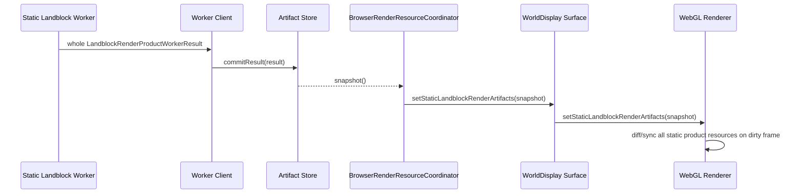
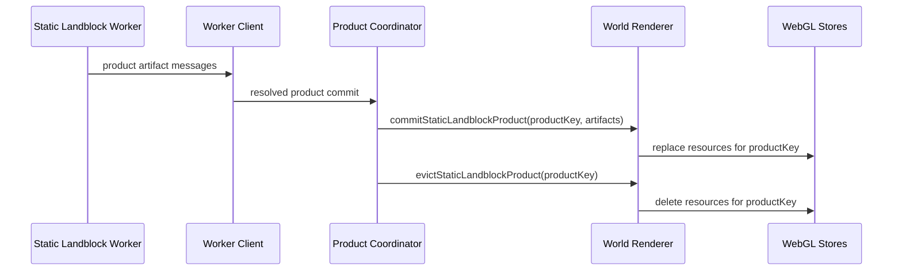

# Holtburger 3D Imperative Landblock Product Commit Replacement Plan

## Context And Boundaries

Goal: replace the remaining snapshot/diff-based static landblock renderer handoff with direct, imperative commits of worker-built landblock product artifacts.

This plan supersedes the snapshot bridge portions of `holtburger-3d-static-landblock-render-bundle-replacement-plan.md`. The old plan remains historical context for asset and artifact semantics, but new implementation work should follow this plan when touching the landblock worker-to-renderer boundary.

### Guiding Thesis

The current stability and performance problems are likely caused less by one overloaded subsystem and more by structural complexity: worker products are converted through product sets, scene-model adapters, browser report state, broad WebGL reconciliation, renderer graph bookkeeping, and diagnostic/picker consumers before they become draw resources. Each layer adds another place for duplicated ownership, stale lifecycle state, full-set scans, and resource multiplication.

The correction strategy is therefore simplification, not tuning. Each phase should reduce the number of owners, remove broad diff/sync behavior, and make product lifetime explicit. If a proposed fix preserves the current multi-stage handoff and only adds throttles, logging, compatibility modes, or smarter diffing, it is probably treating a symptom rather than the cause.

Architectural rules for this plan:

- One worker-built static landblock product enters the renderer through one imperative commit.
- Product keys own static resource lifetime; request IDs and scheduling tokens do not.
- Product-scoped payloads are uploaded once per product, then referenced by cells, tiles, slices, and draw candidates.
- Per-cell, per-tile, and per-slice resources own only their local geometry, placement, and bindings.
- Worker execution is serialized until measured evidence justifies more concurrency.
- Debug, picker, metrics, and report consumers observe low-fidelity product/resource facts and must not keep legacy staging alive.
- Full-set snapshot/diff synchronization is deleted rather than optimized.

### In Scope

- Worker-built landblock products for outdoor terrain/buildings/detail, detailed env-cell interiors, portals, spatial/culling data, and dungeon landblocks.
- Main-thread product coordination, residency, replacement, stale result rejection, and eviction.
- Renderer/WebGL resource creation from worker-shaped artifacts.
- Removal of `BrowserRenderResourceSnapshot` and `StaticLandblockRenderArtifactStoreSnapshot` from render-critical paths.
- Removal of `BrowserRenderResourceCoordinator` ownership over static landblock product application.
- Removal of broad WebGL full-state diff/sync for static landblock products.
- Isolation of runtime appearance preview staging from landblock static product rendering.
- Demotion of renderer graph, picker, debug report, staged draw-unit diagnostics, and compaction metrics where they currently preserve legacy pipelines.
- Removal of legacy main-thread static landblock hydration, static addition, incremental compaction, and prepared-cache closure accounting once product commits cover the corresponding artifact families.

### Out Of Scope

- Dynamic entity rendering.
- Runtime appearance previews, except where they must stop sharing static landblock resource plumbing.
- Higher-fidelity picker/debug diagnostics. These consumers are expendable and must not preserve legacy static render pipelines.
- Global texture atlas reuse across landblocks. Landblock-product-scoped texture pages are the supported static path for this replacement.

## Ground Truth

Primary code paths:

- `apps/holtburger-3d/src/workers/static-landblock-render-worker.ts`
- `apps/holtburger-3d/src/lib/world-display/static-landblock-render-worker-client.ts`
- `apps/holtburger-3d/src/lib/world-display/static-landblock-render-artifact-coordinator.ts`
- `apps/holtburger-3d/src/lib/world-display/static-landblock-render-artifact-store.ts`
- `apps/holtburger-3d/src/lib/world-display/browser-render-resource-coordinator.ts`
- `apps/holtburger-3d/src/lib/world-display/WorldDisplay.svelte`
- `apps/holtburger-3d/src/lib/world-display/world-display-renderer-contract.ts`
- `apps/holtburger-3d/src/lib/world-display/webgl2-world-display-renderer-impl.ts`
- `apps/holtburger-3d/src/lib/world-display/webgl2-world-resources.ts`
- `apps/holtburger-3d/src/lib/world-display/webgl2/resources/static-bundle-layer-resources.ts`
- `apps/holtburger-3d/src/lib/world-display/webgl2/resources/structured-interior-resources.ts`
- `apps/holtburger-3d/src/lib/world-display/webgl2/resources/terrain-tile-resources.ts`
- `apps/holtburger-3d/src/lib/world-display/render-bvh-visibility-snapshot.ts`
- `apps/holtburger-3d/src/lib/world-display/render-spatial-scene.ts`
- `apps/holtburger-3d/src/lib/world-display/scene-renderable-readiness.ts`
- `apps/holtburger-3d/src/lib/world-display/static-renderable-readiness.ts`

Reference artifact contracts:

- `apps/holtburger-3d/src/lib/world-display/landblock-render-product.ts`
- `apps/holtburger-3d/src/lib/world-display/static-bundle-layer.ts`
- `apps/holtburger-3d/src/lib/world-display/terrain-render-artifact.ts`
- `apps/holtburger-3d/src/lib/world-display/render-spatial-scene.ts`
- `apps/holtburger-3d/src/lib/world-display/world-residency-index.ts`

## Diagnosis

The current handoff still has a legacy shape:



This is the wrong abstraction now that the worker owns whole-product static hydration. The main thread should not rebuild a scene picture from snapshots, and the renderer should not infer product lifecycle by diffing large arrays every frame. The bridge also encourages us to keep `renderResourceSnapshot` as a mixed render/debug model, which hides legacy dependencies.

The replacement shape:



## Product Commit Model

Every static landblock product has a stable product key:

```ts
type StaticLandblockProductKey = {
  landblockId: number;
  product: "outdoor" | "outdoor-env-cells" | "dungeon-env-cells";
  buildPolicyRevision: string;
  texturePagePolicyRevision: string;
};
```

The coordinator owns desired/in-flight/resident product identity. The renderer owns GPU resources and culling structures for resident products. The browser resource coordinator does not own static landblock products.

`requestId` is job identity, not product identity. Stale-result rejection should compare request identity before commit, but product resource ownership must not include request IDs or other scheduling tokens. Otherwise ordinary browser movement forces needless GPU resource replacement for unchanged product artifacts.

## Legacy Abstractions To Remove Or Quarantine

The product commit cutover is not only a method rename. These abstractions currently preserve the old renderer architecture and must be removed from the static landblock hot path:

- `BrowserRenderResourceCoordinator` as a render-state god object. It currently derives scenes, applies renderer resources, caches picker diagnostics, writes UI report text, gates artifact-vs-asset paths, and stores surface signatures. Static landblock product commits must bypass it. Its remaining duties should split into a small runtime-appearance preview updater and a UI/debug report builder.
- `StaticRenderableSceneModel`, `StructuredInteriorSceneModel`, and `TerrainSceneModel` as landblock artifact adapters. These can remain temporarily for runtime appearance previews, frame culling, or report text, but worker landblock products should not be converted into these broad scene models before reaching WebGL resources.
- Broad `syncWebgl2WorldResources` / `syncWebgl2StaticLandblockRenderArtifactResources` reconciliation. Static product resources should be created/replaced/evicted by product key. Full-state scans are legacy diffing.
- `syncWebgl2StaticBundleLayerResources` and `syncWebgl2StructuredInteriorResources` retained-key scans. These are smaller but still full-set sync APIs; product stores should commit/evict resource groups by owning product key.
- `staged-world-*` naming and helpers in static product paths. Geometry helpers may survive with neutral names, but staged draw-unit assembly must be runtime-preview-only.
- `RendererResourceGraph` as hot-path ownership. Product keys already define ownership; graph data can remain debug-only or be deleted.
- Picker/debug diagnostics that require staged draw-unit fidelity. These consumers can lose fidelity or consume renderer product metadata cheaply.
- Compaction/atlas/fallback diagnostics that describe runtime staging as the center of the renderer. Product/resource readiness is the durable diagnostic model.
- Readiness models that exist to filter partially prepared main-thread scenes: `deriveStaticRenderableReadinessModel` and `deriveSceneRenderableReadinessModel`. Worker landblock products should be complete/resolved or fail; product commits should not re-run fallback-resolved readiness gates.
- Browser-owned render chunk transform, spatial index, transition portal candidate, and debug overlay derivation from scene adapters. Product resources should expose product-owned render candidates/spatial facts directly; browser reports can observe them later.
- Request-scoped `sourceRevision` values in artifacts/resources. Source revisions that include `requestId` defeat product reuse and should be replaced with product-content or policy revisions.
- Texture filtering/sampler policy updates that currently piggyback on full resource sync. Product stores need an explicit sampler-policy update path across resident product texture pages.
- Worker job lifecycle. A single worker can interleave multiple async jobs while they await host lookups; the replacement should prefer one active landblock build per worker for now because it makes stale-work cancellation, product assembly ownership, and commit ordering deterministic. This is a simplification choice, not an assumption that IPC throughput is inherently the bottleneck.

### Resource Multiplication Audit

The strongest current stability lead is renderer-side resource multiplication, not worker IPC throughput. Worker detailed landblock artifacts already expose product-scoped `structuredInteriorTexturePages`, `structuredInteriorTexturePageRefs`, and `structuredInteriorMaterialRecords`, but `syncWebgl2StructuredInteriorResources()` recreates those product-scoped texture pages and material records inside every cell resource. Dense env-cell products can therefore multiply identical GPU texture uploads by cell count, which plausibly explains freezes, unresponsiveness, and graphics corruption under detailed landblock startup.

Known audit findings:

- `webgl2/resources/structured-interior-resources.ts`: high severity. Detailed artifact texture pages/material records are product-scoped data but are uploaded/recreated per structured cell. Product stores must hoist these to a product resource and let cells reference shared bindings.
- `webgl2-world-resources.ts`: medium severity. `createOrReuseWebgl2TerrainTile()` creates terrain draw-slice GL buffers while computing the upload plan before the previous tile reuse decision. Even when the tile resource is reused, previous draw slices are destroyed and replaced. Product terrain commit should separate immutable terrain geometry uploads from placement and binding updates.
- `webgl2-world-resources.ts`: medium severity. Broad world sync still owns global terrain texture-page generation and prepared direct texture caches. Product resource commits must not rely on `retainedTextureKeys` or broad full-state cleanup to keep product-owned texture pages alive.
- `browser-render-resource-coordinator.ts`: medium severity. Render spatial index replacement and render chunk transform derivation are full-set operations tied to report generation. This is CPU-side multiplication rather than GPU upload multiplication, but it is the same stale snapshot/diff pattern and should move behind product-owned commit/update APIs.
- `webgl2/resources/static-bundle-layer-resources.ts`: currently lower risk. Static bundle texture pages are layer-owned, not per-object/per-batch, but the retained-key full-set sync still needs replacement with product-keyed ownership.
- Runtime appearance preview direct textures use `texturesByKey` caches and are lower priority. They can stay preview-only while static landblock products leave the staged path.

### Product Commit Boundary

```ts
interface StaticLandblockProductCommitSurface {
  commitStaticLandblockProduct(result: LandblockRenderProductWorkerResult): void;
  evictStaticLandblockProduct(key: StaticLandblockProductKey): void;
  updateStaticLandblockProductSamplerPolicy(policy: TextureFilteringMode): void;
  clearStaticLandblockProducts(): void;
}
```

Full-set replacement is not part of the target renderer contract. Coarse resets should clear resident products and then apply normal product commits, so the reset path cannot preserve snapshot-style reconciliation under a different name.

## Phased Implementation

### Phase 0: Remove Crash-Hunt Diagnostics

Status: complete.

Deliverables:

- Remove temporary Tauri renderer diagnostic command and browser bridge.
- Remove worker progress message protocol.
- Remove WebGL dirty-resource/RAF diagnostic callbacks.
- Revert the host lookup batching experiment.
- Keep hard contract guards that expose real invalid state, such as missing worker closure responses.

Acceptance criteria:

- No `recordRendererDiagnostic`, `WorldRendererDiagnostic`, `onRendererDiagnostic`, or worker progress message types remain.
- Existing lint, type checks, and focused worker/coordinator tests pass.

Progress:

- Removed the temporary Tauri renderer diagnostic command and browser bridge.
- Removed startup/global renderer diagnostic handlers.
- Removed worker progress response messages and progress callback plumbing.
- Removed WebGL dirty-resource/RAF diagnostic callbacks.
- Reverted the bounded/sequential host lookup batching experiment.
- Kept worker closure missing-response and no-progress failures because those are real contract guards, not logging shims.

### Phase 1: Product Identity And Commit Surface Contract

Status: complete.

Deliverables:

- Add a shared `StaticLandblockProductKey` helper and formatting/comparison functions.
- Split scheduling identity from resource identity:
  - request IDs stay on jobs and stale-result checks;
  - product keys exclude request IDs;
  - artifact/resource revisions exclude request IDs unless the underlying product content or policy changed.
- Add renderer contract methods:
  - `commitStaticLandblockProduct(result)`
  - `evictStaticLandblockProduct(key)`
  - `clearStaticLandblockProducts()`
- Wire these through `WorldDisplay.svelte`, `world-display-renderer.ts`, and WebGL implementation.
- Keep renderer construction on empty/default preview scenes; static products should arrive only through commit calls, not an initial product set.
- Rename product lifecycle types away from `Snapshot`.
- Keep frame-local visibility snapshot naming only where it describes a per-frame culling result, not product residency.

Acceptance criteria:

- Static product results can be committed to the renderer without `BrowserRenderResourceCoordinator.update`.
- Tests prove stale product commits are rejected before renderer commit.
- Tests prove request-ID-only replans reuse the same product/resource keys.
- Static bundle `sourceRevision`, terrain `artifactRevision`, and detailed artifact resource keys are not request-scoped.
- Knip reports no unused legacy renderer contract methods.

Progress:

- Renamed static product residency surfaces away from `StaticLandblockRenderArtifactStoreSnapshot` to `StaticLandblockRenderProductSet`.
- Renamed the browser UI return object away from `BrowserRenderResourceSnapshot`/`renderResourceSnapshot` to `BrowserRenderResourceReport`/`renderResourceReport`.
- Renamed renderer replacement API from `setStaticLandblockRenderArtifacts` to `replaceStaticLandblockProducts`.
- Left the actual renderer handoff as a full-set replacement pending the explicit commit/evict contract. This is transitional debt and must be removed in this phase, not deferred past the commit surface work.
- Added `StaticLandblockProductKey` helpers with stable product/policy identity and routed store artifact keys through them.
- Changed worker product job IDs and static bundle `sourceRevision` inputs to use product/policy identity rather than request IDs.
- Added `commitStaticLandblockProduct`, `evictStaticLandblockProduct`, and `clearStaticLandblockProducts` to the renderer contract, deferred renderer wrapper, Svelte surface, and WebGL implementation. The WebGL implementation still forwards through the transitional full-set resource dirty path until Phase 3B-5 deletes the broad sync.
- Added focused tests proving request-only replans keep the same product job identity and stale request results are still rejected before commit.

### Phase 1A: Worker Single-Active-Build Guard

Status: complete.

Deliverables:

- Serialize static landblock product builds inside the worker. The client may still prioritize requested products, but the worker executes one build at a time.
- Drop stale client-queued products before sending them to the worker when a newer desired identity supersedes the same product target.
- Add a cancellation/supersession message for worker-queued jobs that have not started.
- Add cancellation checks at worker phase boundaries before expensive artifact assembly and before posting a completed result.
- Default the worker client to one active posted job unless a later measured need justifies increasing it.

Acceptance criteria:

- Worker tests prove only one static landblock product build is active at a time, even when host lookups resolve out of order.
- Client tests prove stale queued products can be dropped before they are sent to the worker.
- Superseded worker-queued products do not start hydration/building.
- Product assembly failure rejects the job and does not partially commit.

Progress:

- Defaulted `StaticLandblockRenderWorkerClient` to one active posted job.
- Added stale queued-work dropping in the client before superseded products are posted to the worker.
- Added a worker cancellation message and client-side cancellation for superseded posted products.
- Serialized the worker message loop so only one product build executes at a time, even when multiple job messages arrive.
- Added cancellation checks before product root lookup, before/after companion closure work, before detailed artifact assembly, and before posting a completed result.
- Added focused tests for default single-active posting, stale queue dropping, posted cancellation, queued pumping, stale result rejection, and worker cancellation before root lookup.

### Phase 2: Product Coordinator Cutover

Status: complete with transitional report dependencies.

Deliverables:

- `StaticLandblockRenderArtifactCoordinator` becomes `StaticLandblockRenderProductCoordinator`.
- `StaticLandblockRenderArtifactStore` becomes a product residency index or is folded into the coordinator.
- Split job identity from product identity:
  - request ID participates in stale rejection only;
  - product key excludes request ID;
  - source revisions are stable for unchanged product content/policy.
- Replace `onStoreChanged(productSet)` with explicit callbacks:
  - `onProductCommitted(result)`;
  - `onProductEvicted(key)`;
  - `onProductsCleared()` for coarse resets only.
- Keep only coordinator-owned maps for desired, in-flight, resident, and stale product identity.
- Expose coordinator counters/report facts separately from renderer commit input.

Acceptance criteria:

- Browser landblock streaming no longer calls `getProductSet()` to drive renderer state.
- `BrowserWorldDisplay.svelte` routes coordinator callbacks directly to renderer product commit/evict methods.
- Resident/in-flight counts used by UI are derived from coordinator counters, not renderer inputs.
- Stale worker results never reach the renderer.
- No product callback is named around stores, snapshots, or artifact layers.
- Replanning the same product with a new request ID does not evict/recreate resident renderer resources.

Progress:

- Added coordinator lifecycle callbacks for `onProductCommitted`, `onProductEvicted`, and `onProductsCleared`.
- Made `StaticLandblockRenderArtifactStore.syncDesiredProducts()` return stable product keys for evicted resident products.
- Wired `BrowserWorldDisplay.svelte` to call `commitStaticLandblockProduct`, `evictStaticLandblockProduct`, and `clearStaticLandblockProducts` directly on the `WorldDisplay` surface from coordinator callbacks.
- Removed `BrowserRenderResourceCoordinator`'s static product surface application; it no longer calls whole-set replacement on the renderer.
- Kept `getProductSet()` and `BrowserRenderResourceCoordinatorInput.staticLandblockRenderProducts` as transitional report/scene-derivation inputs. This is Phase 4 debt, not renderer product application.
- Added focused coordinator tests for direct commit and product eviction callbacks.

### Phase 2A: Product Granularity And LoD Preset Audit

Status: complete.

Deliverables:

- Dry-run product planning against current LoD sliders and backend artifact routes before building renderer product stores.
- Decide whether `outdoor` remains a single product containing terrain/buildings/detail, or whether product/preset naming must better reflect backend artifact granularity.
- Avoid sub-product runtime filtering that reintroduces partial graph diffing. If a backend route loads terrain/buildings/detail together, the LoD UI should coarse-match that product instead of pretending those radii are independently cheap.
- Document dungeon behavior as the same env-cell product path with no outdoor product.

Acceptance criteria:

- Product planning does not request a broad product and then depend on renderer-side filtering to simulate narrower LoD.
- LoD controls map clearly to worker product residency choices.
- No phase assumes terrain/building/detail can be independently committed unless the worker product contract actually separates them.

Progress:

- Audited `landblock-render-product-planner.ts`: terrain, building, and detail interests all coalesce into the same `outdoor` product; env-cell detail remains `outdoor-env-cells`; indoor/dungeon destinations use `dungeon-env-cells`.
- Decision: keep `outdoor` as one coarse product containing terrain, outdoor buildings, and outdoor detail because the worker/backend product route currently loads those artifact families together.
- Decision: do not introduce renderer-side terrain/building/detail filtering to mimic independent products. LoD controls may request different landblock radii, but once any outdoor interest selects a landblock, the committed worker product is the full `outdoor` product for that landblock.
- Decision: dungeon behavior stays on the same detailed env-cell product path and does not request an outdoor product.

### Phase 3A: Detailed Interior Product Resource Hoist

Status: complete.

Deliverables:

- Replace per-cell detailed interior texture page ownership with a product-scoped detailed interior resource.
- Upload `DetailedLandblockRenderArtifacts.structuredInteriorTexturePages` once per resident product key.
- Build `structuredInteriorMaterialRecords` once per product key against the product texture page map.
- Make structured interior cells own only geometry/slice buffers, model matrix/placement state, and references to shared product material/page resources.
- Add tests that build one detailed artifact with multiple cells and assert texture page/material resource count is product/page-count based, not cell-count multiplied.
- Add resource counters that can expose product page count, cell count, material slice count, and duplicated-page count during the transition.

Acceptance criteria:

- A detailed artifact with `N` cells and `P` texture pages creates `P` WebGL texture page resources, not `N * P`.
- Cell eviction does not dispose shared product texture pages until the owning product is evicted.
- Sampler-policy updates touch each product texture page once.
- Existing structured interior rendering tests cover shared material binding lookup from cell slices to product materials.

Progress:

- Added product-scoped detailed interior resources inside `Webgl2StructuredInteriorResourceStore`.
- Uploaded `structuredInteriorTexturePages` once per detailed product resource instead of once per cell.
- Built `structuredInteriorMaterialRecords` once per detailed product resource and shared those bindings with all cell resources.
- Changed structured interior cells to dispose only local slice/shell geometry; product resources own texture page disposal.
- Moved sampler-policy updates to product resources so each product page is touched once per sync.
- Removed request IDs from detailed artifact keys.
- Added product/page/material counters for detailed interior resources.
- Extended WebGL resource tests to build one detailed product with two cells and one texture page, asserting one product resource, one texture page resource, two cell resources, and one texture upload.

### Phase 3B-0: Renderer-Owned Product Placement And Spatial Facts

Status: complete.

Why this phase exists:

- The previous Phase 3B attempt exposed a real dependency inversion: product resources cannot be committed honestly by product key while `BrowserRenderResourceCoordinator` still derives render chunk transforms, terrain scene tiles, transition portal candidates, and browser picking spatial facts from product sets and scene-model adapters.
- Wrapping `syncWebgl2StaticLandblockRenderArtifactResources()` or `syncWebgl2WorldResources()` in product-keyed methods would preserve the broad scan/diff architecture under better names. That is fake progress, bestie.

Deliverables:

- Add renderer-owned static product placement state keyed by `StaticLandblockProductKey`.
- Move the render chunk transform application needed by static products behind renderer/product APIs.
- Add low-fidelity renderer/product spatial facts for terrain, static bundle entries, detailed interior cells, portals, and product scene bounds.
- Add a renderer-owned spatial query or product metadata query that browser picking can consume without requiring `BrowserRenderResourceCoordinator` to rebuild a product-derived spatial index.
- Move transition portal candidate facts for landblock products out of browser report generation and into renderer/product-owned metadata.
- Keep browser report text as an observer of product metadata; it must not be a renderer input.
- Define the direct terrain artifact commit payload shape needed by Phase 3B-4, including placement and texture-page facts that do not require `TerrainSceneModel`.

Acceptance criteria:

- Static product placement can update when the render anchor/chunk transforms change without recommitting products.
- Browser picking can query product-owned spatial facts, even if fidelity is lower than the old staged diagnostics.
- Product portal facts are available without deriving `TransitionPortalCandidateModel` from the browser report path.
- No new product path depends on `StaticRenderableSceneModel`, `StructuredInteriorSceneModel`, or `TerrainSceneModel` for placement/spatial facts.
- `BrowserRenderResourceCoordinator` can be disabled for static product report generation without changing committed product resources.

Progress:

- Added product-level spatial derivation from a single `LandblockRenderProductWorkerResult`, covering terrain artifacts, static bundle spatial hints, detailed structured cells, and low-fidelity detailed portal aperture facts.
- Added `StaticLandblockProductMetadataStore`, keyed by `StaticLandblockProductKey`, with product commit/evict/clear, render chunk transform updates, and a renderer-owned spatial query.
- Wired WebGL renderer product commit/evict/clear and render chunk transform updates into the metadata store.
- Implemented renderer `pickAtViewportPoint` and `pickTerrainLandblockAtViewportPoint` against product-owned metadata.
- Changed browser picker flow to prefer the renderer-owned product query, falling back to the transitional browser report query for runtime preview/debug overlay facts.
- Added focused metadata-store tests proving product commit creates spatial facts and product eviction removes them.

### Phase 3B-1: Static Product Store Shell

Status: complete.

Deliverables:

- Introduce a WebGL static landblock product store keyed by `StaticLandblockProductKey`.
- The store tracks resident product keys, product generation/signature, family resource ownership, placement state, spatial facts, resource counters, and sampler policy.
- Add product-keyed `commit`, `evict`, `clear`, `updatePlacement`, and `updateSamplerPolicy` methods.
- Keep family-specific resource creation delegated to existing helpers until later subphases.
- Keep full-set static sync alive only as a transitional fallback outside the product-store path; new tests must target product-store commit/evict APIs directly.

Acceptance criteria:

- Product replacement is idempotent for the same product key and generation.
- Eviction releases all resources registered under one product key.
- `clear` releases every product resource exactly once.
- Placement and sampler updates do not call product commit.
- Product-store tests do not invoke `replaceStaticLandblockProducts`.

Progress:

- Added `Webgl2StaticLandblockProductStore`, keyed by `StaticLandblockProductKey`.
- Added product-keyed commit, evict, clear, placement update, sampler policy update, product count, and owned resource count APIs.
- Product commit computes a product-content signature that excludes request IDs.
- Same-key, same-signature commits reuse the resident product resource; same-key changed-signature commits dispose and replace owned resources.
- Added focused product-store lifecycle tests without invoking `replaceStaticLandblockProducts`.

### Phase 3B-2: Static Bundle Product Commit/Evict

Status: complete.

Deliverables:

- Replace `syncWebgl2StaticBundleLayerResources()` retained-key scanning for product commits with product-keyed static bundle commit/evict APIs.
- Static bundle texture pages, materials, compacted batches, direct entries, render candidates, and spatial facts are owned under the product key.
- Static bundle sampler-policy updates touch each resident product texture page once.
- Preserve current static bundle rendering behavior while deleting whole-store retained-key scans for committed products.

Acceptance criteria:

- Committing one product creates or replaces only that product's static bundle resources.
- Evicting one product does not scan or mutate unrelated product bundle resources.
- Texture filtering changes update resident static bundle texture pages without rebuilding geometry.
- Static bundle resource counters are product-derived, not global retained-set-derived.

Progress:

- Added product-keyed static bundle commit/evict APIs alongside the transitional retained-key sync.
- Added a static bundle product index inside `Webgl2StaticBundleLayerResourceStore`.
- Same-signature product commits reuse layer resources and only update sampler policy.
- Changed-signature product commits dispose and replace only that product's layer resources.
- Product eviction disposes only the layers registered under that product key.
- Added direct product commit/reuse/evict tests that do not invoke full-set sync.

### Phase 3B-3: Detailed Interior Product Commit/Evict

Status: complete.

Deliverables:

- Move the Phase 3A product-scoped detailed interior resources behind product-keyed commit/evict APIs.
- Delete retained-key scanning for detailed interior product cells on the product-store path.
- Detailed product eviction disposes shared product texture pages/materials after local cell resources are disposed.
- Placement updates refresh detailed cell model matrices without rebuilding texture pages, materials, or geometry.

Acceptance criteria:

- A detailed product with `N` cells and `P` pages still creates `P` page resources after moving to product commits.
- Evicting one detailed product leaves other detailed products' shared page/material resources alive.
- Changing render anchor updates detailed cell placement state without recommit.
- The product-store detailed path does not consume `StructuredInteriorSceneModel`.

Progress:

- Added product-keyed detailed interior commit/evict APIs that reuse the Phase 3A product-scoped texture page/material hoist.
- Detailed interior cells are now indexed by static product key for direct product eviction without scanning unrelated products.
- Same product commits update cell placement and sampler policy while reusing uploaded product pages, material records, and cell geometry.
- Product eviction disposes cell resources before disposing the shared product texture pages.
- Added focused tests for direct detailed interior commit, sampler update reuse, and eviction without invoking the full-set static product sync.

### Phase 3B-4A: Terrain Upload Reuse Fix And Extraction

Status: complete.

Deliverables:

- Split terrain artifact upload planning so unchanged worker-built terrain can be detected before draw-slice buffers are created.
- Fix the current terrain draw-slice reuse bug where draw-slice buffers are created before the previous tile reuse decision.
- Add a direct regression test proving unchanged worker terrain artifact sync does not recreate draw-slice buffers.

Acceptance criteria:

- Re-syncing an unchanged worker terrain artifact does not recreate terrain geometry or draw-slice buffers.
- The terrain artifact upload path exposes enough artifact-shaped inputs for Phase 3B-4B to commit without `TerrainSceneModel`.
- Existing terrain scene sync behavior remains unchanged.

Progress:

- Split terrain draw-slice upload planning from WebGL buffer creation.
- Fixed unchanged terrain artifact sync so reusable tiles update placement and metadata before deciding whether each draw slice needs a new upload.
- Converted page-overflow terrain slices to the same upload-plan creation path.
- Added a multi-slice worker terrain artifact regression proving unchanged sync reuses draw-slice buffers and vertex arrays while updating placement.

### Phase 3B-4B: Terrain Product Commit/Evict

Status: complete.

Deliverables:

- Commit `LandblockTerrainRenderArtifact` directly into terrain product resources without deriving a `TerrainSceneModel`.
- Separate immutable terrain geometry/draw-slice uploads from placement, texture-page binding, and sampler updates.
- Move worker-built terrain texture-page planning/binding out of broad `syncWebgl2WorldResources()`.
- Expose terrain render candidates, scene bounds, BVH keys, and resource counters from product-owned terrain resources.

Acceptance criteria:

- Terrain product commit does not call `deriveTerrainSceneModelFromLandblockArtifacts`.
- Recommitting an unchanged terrain product does not recreate terrain geometry or draw-slice buffers.
- Moving the render anchor updates terrain model matrices/placement without rebuilding terrain uploads.
- Changing texture filtering updates terrain product texture pages/samplers without recommit.
- Product terrain resources do not depend on broad `retainedTextureKeys` cleanup in `syncWebgl2WorldResources()`.

Progress:

- Added product-keyed terrain commit, product-result commit, evict, and sampler-policy refresh APIs.
- Direct terrain commit consumes `LandblockTerrainRenderArtifact` and current render chunk transforms without deriving or accepting a `TerrainSceneModel`.
- Terrain product resources reuse unchanged tile geometry and draw-slice buffers while updating placement.
- Terrain artifact texture-page planning and bindings can now refresh through a terrain-specific product path instead of the broad world-resource sync.
- Added direct terrain product tests covering commit, unchanged recommit placement updates, sampler refresh without artifact recommit, and eviction.

### Phase 3B-5: Static Product Store Cutover

Status: complete.

Deliverables:

- Route renderer `commitStaticLandblockProduct`, `evictStaticLandblockProduct`, and `clearStaticLandblockProducts` to the product store only.
- Delete `replaceStaticLandblockProducts` from the renderer contract, deferred renderer wrapper, Svelte surface, WebGL implementation, tests, and BRC surface types.
- Delete `syncWebgl2StaticLandblockRenderArtifactResources()` as a render-critical path.
- Ensure static product commits do not mark broad world resources dirty.
- Keep coarse resets as `clear` followed by normal commits, never as whole-set replacement.

Acceptance criteria:

- No static landblock WebGL resources are synchronized by scanning a global product set.
- Static landblock-derived terrain, static bundles, detailed interiors, portals, and spatial facts enter the renderer through product commit/evict/clear only.
- Static product rendering works without `StaticRenderableSceneModel`, `StructuredInteriorSceneModel`, or `TerrainSceneModel` adapter derivation.
- `replaceStaticLandblockProducts` and its tests are gone.
- Runtime appearance preview updates do not trigger static product reconciliation.

Progress:

- Routed WebGL renderer product commit/evict/clear through direct static bundle, detailed interior, terrain, and renderer metadata product APIs.
- Removed `replaceStaticLandblockProducts` from the renderer contract, deferred renderer wrapper, Svelte surface, and WebGL implementation.
- Deleted `syncWebgl2StaticLandblockRenderArtifactResources()` and its legacy full-set sync tests.
- Static product commits now update GPU resources immediately and no longer mark broad world resources dirty.
- Render chunk transform, texture filtering, and detail-texture changes recommit resident products through product-keyed APIs, reusing geometry while updating placement/sampler state.
- `syncWebgl2WorldResources()` now preserves product-owned terrain tiles while syncing runtime terrain scene tiles.

### Phase 4: Browser Resource Coordinator Decomposition

Status: complete.

Deliverables:

- Finish removing static landblock product application and product-derived facts from `BrowserRenderResourceCoordinator`.
- Split remaining browser UI/debug facts into a report builder that does not drive renderer state and can be disabled without changing rendering.
- Move runtime appearance preview updates into a small preview-only updater that may still use staged scene assembly.
- Delete transitional `BrowserRenderResourceCoordinatorInput.staticLandblockRenderProducts` and `getProductSet()` report plumbing once Phase 3B-0 provides renderer-owned metadata queries.
- Move any remaining browser spatial index population for product terrain/static/interior items to renderer/product metadata queries.
- Delete `BrowserRenderResourceReport` if it continues to couple renderer updates and UI text; otherwise keep it report-only with no surface application.
- Rename or split `BrowserRenderResourceCoordinator` once its remaining role is runtime preview/report-only.

Acceptance criteria:

- No symbol named `BrowserRenderResourceSnapshot` or `renderResourceSnapshot` remains.
- `BrowserRenderResourceCoordinator` does not accept static landblock product sets.
- `BrowserRenderResourceCoordinator` no longer calls landblock static renderer surface methods.
- Runtime appearance preview resource updates remain isolated from landblock static product commits.
- UI report generation can be disabled without changing renderer state.
- Browser picking/debug overlays cannot force landblock products through scene-model adapters.
- Static product report generation has no authority over product resource residency, placement, or eviction.

Progress:

- Removed `BrowserRenderResourceCoordinatorInput.staticLandblockRenderProducts` and the Browser page handoff of coordinator product sets into BRC.
- BRC now derives only asset/runtime-preview terrain, static renderable, structured interior, debug overlay, and report state.
- Product-owned terrain/static/interior spatial facts are no longer populated through BRC; renderer product metadata handles static product picking.
- Transition portal candidate ownership moved into the WebGL renderer resident product path so BRC no longer derives portal masks from product sets.
- Static landblock report text is now a renderer-owned placeholder instead of BRC product residency counters.

### Phase 5: Broad WebGL Sync Split

Status: complete for production static product rendering; residual test-only legacy helpers remain tracked in cleanup targets.

Deliverables:

- Restrict `syncWebgl2WorldResources` to non-product resources, especially runtime appearance previews and any remaining non-product portal masks.
- Delete or rename staged resource assembly that only exists for static landblock products.
- Keep `RenderBvhVisibilitySnapshot` only as frame-local visibility output; it must consume renderer product resources or product metadata, not product residency sets.
- Remove `deriveSceneRenderableReadinessModel` / `deriveStaticRenderableReadinessModel` from landblock product rendering. Keep them only if runtime appearance previews still need them; otherwise delete them.
- Delete broad terrain texture-page planning for worker-built terrain once Phase 3B-4 owns terrain product texture-page resources.

Acceptance criteria:

- A static product commit does not mark broad world resources dirty for a full sync.
- Runtime preview updates do not force static product resource reconciliation.
- Static product frame culling reads product-owned render candidates.
- Static product rendering does not use fallback-resolved readiness gates intended for partially prepared main-thread scenes.

Progress:

- Removed static product full-set sync from WebGL dirty world-resource frames.
- `syncWebgl2WorldResources()` now handles runtime appearance preview resources, runtime terrain-scene resources, and portal-mask resources while retaining product-owned terrain tiles.
- Static product commits no longer reconcile bundle/detailed resources through scene-model adapters or retained-key product-set scans.
- Deleted the detailed interior retained-key sync API and the top-level static product full-set sync API.
- Renderer-owned transition portal model refresh keeps BRC out of product-set portal derivation while portal mask buffers remain in the non-product world sync.

### Phase 6: Result Protocol Cleanup

Status: complete.

Deliverables:

- Keep the result protocol product-oriented. Chunked artifact delivery is optional follow-up, only if profiling proves monolithic product transfer remains a real problem after imperative commits and worker serialization.
- If chunking becomes necessary, supported message families are:
  - product header;
  - terrain artifact;
  - static bundle artifact chunk;
  - detailed landblock artifact;
  - texture page payload chunk;
  - portal/spatial artifact;
  - product complete.
- Main thread commits exactly once per completed product. Partial product messages, if introduced later, are assembly details and must not partially mutate renderer state.

Acceptance criteria:

- Chunked result delivery is not required for this phase unless a new measured failure shows the remaining product transfer is the cause.

Progress:

- No measured transfer failure appeared after worker serialization and direct renderer product commits.
- Kept the result protocol product-oriented and did not introduce partial product renderer mutation.

### Phase 7: Debug, Picker, Graph, And Metrics Demotion

Status: complete for static product ownership.

Deliverables:

- Remove staged draw-unit requirements from picker diagnostics.
- Move `RendererResourceGraph` off the static product hot path or delete it if no durable consumer remains.
- Rewrite debug report rows around product/resource readiness instead of staged/compacted/fallback paths.
- Keep compaction/atlas diagnostics only where they describe worker/product build output or WebGL resource readiness.

Acceptance criteria:

- Picker/debug consumers do not require main-thread static hydration, staged draw units, or fallback direct draw identity.
- Static product rendering works when renderer graph diagnostics are disabled.
- Debug text no longer implies static landblock rendering has staged and compacted runtime modes.

Progress:

- Browser picking now uses renderer product metadata before the old browser spatial query path.
- BRC no longer populates product-owned static/terrain/interior spatial items or product-derived debug overlays.
- Static product resource lifetime no longer uses `RendererResourceGraph`; graph leases remain for runtime/non-product resource diagnostics.
- Static product report text was demoted to a renderer-owned placeholder instead of BRC residency counters.

### Phase 8: Legacy Static Pipeline Deletion

Status: complete for production paths; historical helper tests remain.

Deliverables:

- Delete main-thread static landblock hydration/addition paths replaced by worker products.
- Delete incremental static compaction accounting for landblock-derived statics.
- Delete old fallback direct-draw paths that exist only to support partially staged static landblock graphs.
- Remove tests that only verify legacy snapshot/diff behavior.

Acceptance criteria:

- Static landblock-derived renderables enter the renderer only through product commits.
- Knip has no reachable legacy static addition/compaction symbols.
- Browser mode still renders terrain, outdoor statics, detailed interiors, portals, and dungeons through worker products.

Progress:

- Removed BRC's main-thread static landblock product application and product-set scene derivation.
- Static landblock WebGL resources now enter through imperative product commit/evict/clear APIs.
- `npm run lint:dead` passes after deleting/demoting stale exports from the product cutover.
- Historical adapter helpers such as artifact-to-scene derivation remain only where tests still document older behavior; they are no longer render-critical.

### Phase 9: Cleanup And Naming Pass

Status: complete for this cutover pass.

Deliverables:

- Rename lingering `layer` terms that now mean artifact/product.
- Rename neutral geometry helpers currently living under `staged-world-*` if they remain useful outside preview staging.
- Remove compatibility helpers and reexports introduced during the transition.
- Simplify docs to point at the product commit model as the only static landblock renderer path.

Acceptance criteria:

- No static landblock code path is documented as optional, fallback, or compatibility mode.
- `npm run check`, `npm run lint:ts`, `npm run lint:dead`, and `npm run lint:rust` pass for `apps/holtburger-3d`.

Progress:

- Removed public `replaceStaticLandblockProducts` compatibility surfaces.
- Deleted the top-level full-set static product sync API and cleaned stale exports found by `knip`.
- Updated plan cleanup targets with the remaining historical/test-only adapter and retained-key helper debt.

### Phase 10: Delete Historical Full-Set Static Bundle Sync

Status: complete.

Deliverables:

- Rewrite or delete legacy `syncWebgl2StaticBundleLayerResources()` tests that only prove retained-key full-set reconciliation.
- Delete `syncWebgl2StaticBundleLayerResources()` after equivalent product-keyed commit/evict tests cover bundle lifecycle, sampler updates, replacement, and eviction.
- Ensure static bundle production rendering has no retained-key full-set resource helper.

Acceptance criteria:

- No production or test import of `syncWebgl2StaticBundleLayerResources()` remains.
- `commitWebgl2StaticBundleProductResources()` and `evictWebgl2StaticBundleProductResources()` cover all retained behavior that still matters.
- `npm run test:ts -- src/lib/world-display/webgl2/resources/static-bundle-layer-resources.test.ts`, `npm run check`, and `npm run lint:dead` pass.

Dry-run findings:

- Current `syncWebgl2StaticBundleLayerResources()` imports are confined to `webgl2/resources/static-bundle-layer-resources.test.ts`; production already commits static bundle resources with `commitWebgl2StaticBundleProductResources()`.
- The existing product-owned test already covers commit, reuse, sampler update, revision replacement, and eviction at a high level.
- The remaining retained-key tests still cover low-level texture upload validation and sampler behavior through the old full-set helper. During implementation, rewrite those cases to call `commitWebgl2StaticBundleProductResources()` with a stable product key before deleting the helper.
- Keep `destroyWebgl2StaticBundleLayerResources()` coverage. It still owns store teardown and is not a historical full-set sync API.

Progress:

- Repointed static bundle resource tests at `commitWebgl2StaticBundleProductResources()` through a product-keyed test helper.
- Deleted `syncWebgl2StaticBundleLayerResources()` and verified no source/test imports remain.
- Kept destroy coverage for store teardown.

### Phase 11: Delete Artifact Scene Adapters

Status: complete.

Deliverables:

- Delete historical artifact-to-scene adapter helpers that are no longer production static rendering paths:
  - `deriveTerrainSceneModelFromLandblockArtifacts`
  - `deriveStructuredInteriorSceneModelFromLandblockArtifacts`
- Remove tests that keep those helpers reachable only to document the old product-set scene adapter architecture.
- Keep only runtime-preview or asset-state scene derivation helpers that are still production-relevant.
- If a temporary quarantine is needed to preserve a fixture during implementation, it must be listed as a Phase 15 purge item with the exact file/symbol and removal condition.

Acceptance criteria:

- Static product rendering has no artifact-to-`TerrainSceneModel` or artifact-to-`StructuredInteriorSceneModel` path, including test-only imports.
- `npm run lint:dead` does not report adapter-related dead code.
- Runtime appearance preview and asset-state fallback tests still pass.

Dry-run findings:

- `deriveTerrainSceneModelFromLandblockArtifacts()` is only referenced by `terrain-scene.test.ts` and its own export; no production renderer path depends on it after the product commit cutover.
- `deriveStructuredInteriorSceneModelFromLandblockArtifacts()` is only referenced by `structured-interior-scene.test.ts` and its own export; BRC now feeds an empty runtime structured-interior scene while product interiors commit directly to renderer resources.
- Deleting the helpers should be straightforward, but move any behavior still worth preserving into product resource tests before removal. The old tests currently document artifact-to-scene translation, not the live product lifecycle.
- Do not delete runtime scene derivation helpers such as `deriveTerrainSceneModel()` or appearance-preview static renderable derivation; those still feed runtime preview and debug paths.
- Quarantine is not an acceptable final state for these adapters. If deletion needs staging, the staging must be brief and Phase 15 must remove it.

Progress:

- Deleted `deriveTerrainSceneModelFromLandblockArtifacts()` and removed the historical terrain scene adapter test file.
- Deleted `deriveStructuredInteriorSceneModelFromLandblockArtifacts()` and removed the worker detailed artifact scene-adapter test case/scaffolding.
- Kept runtime asset-state scene derivation helpers intact.

### Phase 12: Product-Owned Portal Masks And Terrain Texture Pages

Status: complete.

Deliverables:

- Move transition portal mask resources to product-owned commit/evict APIs. The renderer may continue deriving portal candidates from resident products, but mask buffers should not be created by broad `syncWebgl2WorldResources()`.
- Split product-owned terrain texture pages from runtime terrain texture-page resources so worker terrain products no longer share broad terrain texture-page store ownership.
- Keep runtime terrain scene texture pages and product terrain texture pages isolated enough that runtime terrain sync cannot evict product terrain texture resources.

Acceptance criteria:

- Static product portal mask buffers are committed and evicted by product key.
- Product terrain texture pages can update sampler policy without broad world sync or runtime terrain texture page cleanup.
- `syncWebgl2WorldResources()` no longer owns worker-product portal mask buffers or worker-product terrain texture pages.
- Terrain product and portal product tests prove unchanged recommits reuse geometry and only update placement/bindings/samplers.

Dry-run findings:

- Portal candidates are already renderer-derived from resident static products through `syncStaticProductTransitionPortalModel()`, but portal mask draw-unit resources are still built inside broad `syncWebgl2WorldResources()` via `buildTransitionPortalMaskDrawUnitAssemblies()`.
- Product terrain tiles are preserved across runtime world sync with `terrainTileIdsByProductKey`, but terrain texture pages still share `store.terrainTexturePagesByKey`.
- `collectTerrainTexturePageAtlasCandidates()`, `syncWebgl2TerrainTexturePageResources()`, and `resolveWebgl2TerrainTileTexturePageBindings()` operate over the combined `store.terrainTiles` set. The cleanup loop in `syncWebgl2TerrainTexturePageResources()` deletes any page outside the latest combined atlas plan, so product texture ownership is not isolated yet.
- Implement this phase in two internal steps: first product-key portal mask commit/evict, then terrain texture-page ownership split. The terrain split likely needs a product-owned terrain page store or ownership metadata before the broad runtime terrain sync can be narrowed safely.
- Add explicit tests proving runtime terrain sync cannot evict product terrain texture pages and product recommit only updates sampler/binding state when geometry and page content are unchanged.

Progress:

- Added product-keyed portal mask commit/evict APIs and wired renderer product commit, evict, clear, and render-chunk recommit paths through them.
- Removed portal mask buffer creation from broad `syncWebgl2WorldResources()`; broad sync now retains product-owned portal mask draw units by product key.
- Split product terrain texture pages into `productTerrainTexturePagesByKey` with product-only atlas planning and binding resolution.
- Narrowed runtime terrain texture-page sync to non-product terrain tiles so runtime cleanup cannot evict product terrain pages.
- Added tests proving product portal masks commit/evict by key and runtime world sync does not delete product terrain texture pages.

### Phase 13: Renderer-Owned Product Metrics And Debug Demotion

Status: complete.

Deliverables:

- Replace the BRC static product report placeholder with lightweight renderer-owned product metrics.
- Keep BRC as a passive consumer of renderer facts; it must not regain product residency, placement, spatial, or eviction authority.
- Narrow `RendererResourceGraph` to runtime preview/debug diagnostics or delete it if no durable non-product consumer remains.
- Revisit `BrowserWorldDisplay.svelte` debug copy that still centers staged, compacted, fallback, or static draw-unit terminology.

Acceptance criteria:

- Static product report text comes from renderer-owned product/resource facts.
- Disabling BRC report generation does not change static product rendering, picking, portal masks, or resource lifetime.
- Static product debug text uses product/resource readiness language instead of staged/compacted/fallback architecture language.
- `RendererResourceGraph` names and call sites no longer imply static product lifetime ownership.

Dry-run findings:

- BRC still returns the placeholder `Static landblock products are renderer-owned.` for `staticLandblockRenderArtifactText`; this is the main report handoff to replace.
- Renderer metrics already read from `Webgl2WorldResourceStore`, but product-specific facts are currently folded into legacy debug counters such as static render batches, static candidates, compaction eligibility, and fallback samples.
- `RendererResourceGraph` remains wired through `BrowserWorldDisplay.svelte`, `WorldDisplay.svelte`, `world-display-renderer-contract.ts`, and runtime resource tests. Its current hot-path value is prepared-asset retention and debug dependency leasing, not product ownership.
- Browser debug copy still uses "draw units", "Static eligibility", "compaction", "fallbacks", and "staged static draw units". Treat this as a wording and metrics-source pass, not a renderer lifecycle change.
- Add lightweight renderer-owned product metrics first, then update BRC/report text to consume them passively. Rename or scope `RendererResourceGraph` only after confirming whether runtime preview prepared-asset retention still needs it.

Progress:

- Added renderer-owned static product/resource counters to `WorldRenderDebugMetrics`.
- Removed BRC's `staticLandblockRenderArtifactText` placeholder instead of making BRC own product facts.
- Updated `BrowserWorldDisplay.svelte` to display static product status from renderer metrics.
- Demoted browser debug wording from staged/static eligibility/fallback-centered language toward product/resource/runtime-material-batching language.
- Left `RendererResourceGraph` in place for runtime preview/debug dependency leasing; static product lifetime remains product-key owned.

### Phase 14: Staged Naming And Historical Test Cleanup

Status: complete.

Deliverables:

- Rename neutral helpers currently under `staged-world-*` only where they remain useful outside runtime preview staging.
- Avoid broad naming churn; target helpers still referenced by product metadata, renderer runtime diagnostics, or non-preview resource paths.
- Remove historical unit tests that keep legacy artifact snapshot/scene adapter APIs reachable after equivalent product commit behavior is covered.
- Update docs to describe the imperative product commit model as the only supported static landblock renderer path.

Acceptance criteria:

- Remaining `staged-world-*` references are either runtime-preview-specific or intentionally neutralized/renamed.
- No test keeps a legacy snapshot/diff API alive.
- `npm run check`, `npm run test:ts`, `npm run lint`, and relevant Rust checks pass.

Dry-run findings:

- `staged-world-assembly.ts` is still production-relevant for runtime appearance previews and picker diagnostics, so broad renaming would create churn without simplifying product rendering.
- Some helpers under `staged-world-*` are now neutral renderer building blocks outside preview staging, notably `buildStaticRenderablePartMatrix()` and `StagedWorldIndexedGeometry` usages in terrain, portal mask, structured-interior, and compaction code.
- Start by extracting clearly neutral helpers to focused modules before considering file-wide renames. Good candidates are static renderable placement/matrix helpers and generic indexed geometry builders.
- Keep runtime-preview names where the feature is genuinely staged appearance preview assembly. Do not rename tests just to erase the word "staged" when the behavior is still preview-specific.
- Historical scene-adapter tests from Phase 11 and retained-key sync tests from Phase 10 are the main removal candidates once product commit coverage is in place.
- If any historical fixture or compatibility name survives Phase 14 for sequencing reasons, it must be treated as Phase 15 purge debt, not accepted cleanup residue.

Progress:

- Renamed neutral indexed geometry helpers from `staged-world-geometry` to `indexed-render-geometry`.
- Renamed `StagedWorldIndexedGeometry` to `RenderIndexedGeometry`, `buildStagedPolygonSetGeometry()` to `buildPolygonSetRenderGeometry()`, and `buildStagedPortalApertureGeometry()` to `buildPortalApertureRenderGeometry()`.
- Extracted `buildStaticRenderablePartMatrix()` to `static-renderable-placement.ts`.
- Left `staged-world-assembly` naming only on runtime appearance preview assembly and picker-diagnostic paths.

### Phase 15: True Purge Of Historical Product-Commit Debt

Status: complete.

Deliverables:

- Delete any temporary quarantines created during Phases 10-14.
- Delete remaining legacy artifact snapshot, scene-adapter, retained-key sync, compatibility API, and misleading diagnostic surfaces that are not used by the product commit model.
- Remove or rename tests whose only purpose is to keep historical architecture names, adapters, or compatibility seams reachable.
- Run a targeted symbol audit for old architecture terms and either delete, rename, or document why each remaining use is still current architecture.

Acceptance criteria:

- No source or test references remain for deleted architecture APIs such as artifact-to-scene landblock adapters, full-set static bundle sync, `replaceStaticLandblockProducts`, or static landblock snapshot/diff compatibility paths.
- No quarantine directory, historical compatibility fixture, or test-only adapter remains under `apps/holtburger-3d/src`.
- Remaining uses of terms like staged, compacted, fallback, artifact, snapshot, and graph are either runtime-preview-specific, rendering-technique-specific, or current product/resource terminology. None describe old product commit plumbing.
- `rg` audits for the deleted symbols produce no matches except in this plan or other historical docs.
- `npm run check`, `npm run test:ts`, `npm run lint`, and relevant Rust checks pass.

Dry-run findings:

- Phase 10 and Phase 11 currently have concrete purge candidates with isolated call sites: `syncWebgl2StaticBundleLayerResources()` and the two artifact-to-scene adapter exports/tests.
- Phase 12 may create short-lived bridge code while terrain texture-page ownership is split; this phase is where that bridge must be deleted after product-owned pages and portal masks are established.
- Phase 13 may leave diagnostic wording or `RendererResourceGraph` naming in place while product metrics land. This phase must force a second audit so debug/report surfaces do not preserve old ownership concepts by inertia.
- Phase 14 should reduce naming ambiguity before this phase starts, but Phase 15 is the hard stop: no compatibility quarantine is considered done until it is deleted or converted to current terminology.

Progress:

- No temporary quarantines were created during Phases 10-14.
- Final source audit found no `replaceStaticLandblockProducts`, `syncWebgl2StaticBundleLayerResources()`, artifact-to-scene landblock adapter, static landblock snapshot/diff compatibility, or old staged geometry module references under `apps/holtburger-3d/src`.
- Renamed final misleading test/debug wording discovered during purge (`compatibility output`, `stage it separately`).
- Remaining `staged` names are runtime appearance preview specific; remaining `compacted`, `fallback`, `artifact`, `snapshot`, and `graph` uses are rendering technique, current product/resource, frame visibility, or runtime debug terminology.

### Phase 16: Remove Runtime Appearance Preview Rendering

Status: add-on.

Deliverables:

- Remove runtime appearance preview spawning, prepared-asset collection, renderer resource creation, picker diagnostics, and UI controls from browser mode.
- Delete `runtimeAppearancePreviews` plumbing in `BrowserWorldDisplay.svelte` and `BrowserRenderResourceCoordinatorInput`.
- Delete preview-only scene derivation such as `deriveAppearancePreviewStaticRenderableSceneModel()` if no production consumer remains.
- Delete preview draw-unit assembly functions and tests if they become unused:
  - `buildStagedAppearancePreviewSceneAssembly()`
  - `buildStagedAppearancePreviewDrawUnitAssemblies()`
  - `StagedAppearancePreviewDrawUnitAssembly`
- Do not leave a disabled feature flag or stub UI unless there is a compile-time need during the deletion. If a temporary stub is required, it must be deleted in this phase before completion.

Acceptance criteria:

- No browser UI path can spawn runtime appearance previews.
- No renderer resource path builds `appearance-preview` draw units.
- `rg "runtimeAppearancePreviews|StagedAppearancePreview|appearance-preview-staged|appearance-preview"` under `apps/holtburger-3d/src` returns no production references, except current docs if retained.
- Any tests that only verify preview staging or preview picker diagnostics are deleted.
- `npm run check`, `npm run test:ts`, and `npm run lint` pass.

Notes:

- Runtime appearance previews are likely a future consumer of a dynamic entity pipeline, but they should not preserve the legacy staged/static renderer path while that pipeline does not exist.
- Future dynamic entity rendering should introduce its own entity/appearance resource ownership model instead of inheriting runtime preview staging.

Dry-run findings:

- Start with `BrowserWorldDisplay.svelte`: delete preview state, spawn/clear actions, prepared asset ID requests, debug report preview payloads, and the preview UI rows. The current flow still calls `requestMissingAssetIds(collectRuntimeAppearancePreviewAssetIds(runtimeAppearancePreviews))`, so deleting the collection path is part of the feature removal rather than a later cleanup.
- Delete `BrowserRuntimeAppearancePreview` and `runtimeAppearancePreviews` from `BrowserRenderResourceCoordinatorInput`; the coordinator currently derives `appearancePreviewScene` and assigns it as the only `staticRenderableScene` source.
- Removing previews should make `deriveAppearancePreviewStaticRenderableSceneModel()`, `buildStagedAppearancePreviewSceneAssembly()`, `buildStagedAppearancePreviewDrawUnitAssemblies()`, `StagedAppearancePreviewDrawUnitAssembly`, preview picker diagnostics, and `staged-world-assembly.test.ts` candidates for deletion rather than quarantine.
- Remove `appearance-preview` and `appearance-preview-staged` categories from frame/render metrics, submit tests, world-resource tests, picker diagnostics, and render debug report types once no production renderer path emits those draw units.
- This phase should run before Phase 17 because `syncWebgl2WorldResources()` still builds preview assemblies today; deleting previews first narrows the later world sync purge.

### Phase 17: Delete Non-Product Terrain And Broad Runtime World Sync

Status: add-on.

Deliverables:

- Delete the non-product terrain scene resource path. Terrain rendering should come from landblock product terrain commits only.
- Remove runtime terrain tile creation from `syncWebgl2WorldResources()` and delete any tests whose only purpose is `TerrainSceneModel` to WebGL terrain resource conversion.
- Move any still-needed metrics refresh into explicit product/resource metric helpers rather than a broad reconciliation pass.
- Delete `syncWebgl2WorldResources()` after runtime previews and non-product terrain are removed, or split any remaining narrow work into explicitly named non-sync helpers before deleting the broad API.
- Remove broad retained-key cleanup sets that exist only because `syncWebgl2WorldResources()` reconciles mixed runtime state.

Acceptance criteria:

- `syncWebgl2WorldResources()` no longer exists.
- WebGL terrain resources are created only through `commitWebgl2TerrainProductResources()` / result commit wrappers and evicted only through product-keyed eviction/clear paths.
- `TerrainSceneModel` is not a renderer resource input; if it remains, it is report/UI planning data only.
- Runtime texture-page maps that existed only for non-product terrain are deleted or renamed to product-owned terrain page storage.
- `npm run check`, `npm run test:ts`, and `npm run lint` pass.

Notes:

- After Phase 16 removes runtime previews, there should be no architectural reason to keep a broad `sync*WorldResources` pattern. Product rendering should be commit/evict/update driven.
- If a remaining concern appears during implementation, prefer deleting the consumer or extracting a tiny explicit helper over preserving `syncWebgl2WorldResources()` as a catch-all.

Dry-run findings:

- The non-product terrain path is the `TerrainSceneModel` asset-state path. It still feeds `BrowserRenderResourceCoordinator`, `WorldDisplay.svelte`, `world-display-renderer*` contracts, frame visibility snapshots, scene readiness, render spatial items, debug report text, and `webgl2-render-metrics.ts`.
- WebGL runtime terrain creation is still concentrated in `syncWebgl2WorldResources()`: it creates/reuses terrain tiles from `terrainScene.tiles`, uses runtime `terrainTexturePagesByKey`, updates material/atlas metrics, and runs graph sync. Product terrain texture pages already use `productTerrainTexturePagesByKey` and should remain.
- Delete renderer consumption first, then decide what report-only terrain facts still matter. BRC terrain cache/status/height/geometry text likely needs replacement from product metadata or renderer-owned metrics before `TerrainSceneModel` can disappear completely from browser UI.
- If `TerrainSceneModel` survives this phase, it must not be a renderer resource input. Treat any surviving use as browser planning/reporting debt and document the exact follow-up instead of preserving renderer sync.
- Most `webgl2-world-resources.test.ts` terrain sync tests should either become product commit tests or be deleted. Tests that exist only to prove `TerrainSceneModel` to WebGL conversion should not survive this phase.
- Runtime `terrainTexturePagesByKey` should be deleted with the non-product terrain resource path. Keep product page storage product-keyed.

### Phase 18: Delete Or Re-Introduce Renderer Resource Graph Deliberately

Status: add-on.

Deliverables:

- Audit all `RendererResourceGraph` call sites after Phases 16 and 17.
- If the graph becomes unused outside tests, delete it, its tests, renderer contract option plumbing, and graph lease fields on `Webgl2WorldResourceStore`.
- If a durable non-preview consumer remains, rename/scope the graph to that consumer and document why product-key ownership is insufficient for that path.
- Do not keep `RendererResourceGraph` solely because a future dynamic entity pipeline might need a graph.

Acceptance criteria:

- Static landblock product lifetime has no renderer graph dependency.
- Either no `RendererResourceGraph` source references remain, or every remaining reference is tied to an active non-static-product consumer with a current comment/name that explains the ownership model.
- Future dynamic entity resource lifetime is not pre-modeled by the current graph unless the dynamic pipeline exists in code.
- `npm run check`, `npm run test:ts`, and `npm run lint` pass.

Notes:

- Static landblock resources are now landblock-product scoped: interest drives desired products, product keys own renderer resources, and eviction deletes those resources.
- Dynamic entities may need entity/appearance/animation/equipment/shared-asset lifetime tracking later, but that should be designed from the dynamic pipeline's real shape rather than inherited from the preview/static bridge.

Dry-run findings:

- Current graph plumbing enters through browser/renderer options and terminates inside `syncWebgl2WorldResources()`. No static product commit API requires `RendererResourceGraph`.
- After Phase 16 removes preview assemblies and Phase 17 removes non-product terrain sync, delete graph option plumbing from `BrowserWorldDisplay.svelte`, `WorldDisplay.svelte`, `world-display-renderer-contract.ts`, `world-display-renderer.ts`, and `webgl2-world-display-renderer-impl.ts`.
- Delete graph lease/signature fields on `Webgl2WorldResourceStore`, `syncWebgl2AssemblyGraph()`, `syncWebgl2TerrainTileGraph()`, and graph-only tests if no active non-static-product consumer remains.
- Do not keep graph leasing around merely because future dynamic entities may need resource lifetime tracking. If dynamics need a graph later, that model should be introduced from entity ownership, not inherited from preview and terrain sync.

### Phase 19: Rehome Surviving Renderer Primitives

Status: add-on.

Deliverables:

- Re-audit lower-level renderer primitives after Phases 16-18 delete runtime previews, non-product terrain sync, and any unused resource graph plumbing.
- Delete primitives whose only remaining consumer was preview/world-sync staging.
- Rehome surviving primitives into folders and filenames that describe their current role rather than their legacy path. Candidate moves:
  - `staged-world-material-strategy.ts` -> material batching or render material strategy module;
  - `staged-world-materials.ts` -> material slot planning module;
  - `compaction/compaction-family-planner.ts` -> stay private under `compaction/` only if it remains a low-level batching implementation detail, otherwise move under a material batching namespace;
  - `runtime-render-diagnostics.ts` / `webgl2-runtime-render-diagnostics.ts` -> draw-unit or material-batching diagnostics if that is their surviving scope;
  - `static-material-artifacts.ts` -> product/static-bundle material facts or neutral render material inputs depending on its post-deletion consumers.
- Rename public/debug metric fields that expose `compaction*` as if static product rendering depends on compaction staging. Prefer `runtimeMaterialBatching*`, `atlasBatching*`, or private/internal names depending on remaining consumers.
- Keep low-level `compaction` terminology only inside the actual batching planner where it describes a rendering technique.

Acceptance criteria:

- No surviving production module or exported type uses `staged-world` naming unless it still represents a live staged world assembly path.
- Surviving material/texture/page/batching primitives live near the renderer subsystem that owns them and have names matching their current responsibility.
- Public `WorldRenderDebugMetrics` no longer presents static product readiness through `compaction*` field names.
- Browser debug text continues to describe product resources separately from runtime material batching.
- `npm run check`, `npm run test:ts`, and `npm run lint` pass.

Dry-run findings:

- `staged-world-materials.ts`, `staged-world-material-strategy.ts`, texture-page atlas planning, and `compaction/compaction-family-planner.ts` still back real renderer material batching. Do not delete the low-level batching planner just because the old staged preview path is gone.
- Phase 16 may delete preview-specific uses of staged material assembly and the store material plan cache. Re-audit after that phase before renaming modules, because some files may become dead rather than worth neutralizing.
- Public/debug metrics expose many `compaction*` fields through `WorldRenderDebugMetrics`, `webgl2-render-metrics.ts`, `BrowserWorldDisplay.svelte`, and runtime picker diagnostics. Those names leak internal batching mechanics into browser-facing debug language.
- Keep `compaction` terminology only inside the actual compaction planner and private draw-unit internals where it describes the rendering technique. Rename exported/debug-facing fields toward runtime material batching or atlas batching once the surviving surface is known.
- `texture-pages/*` already reads like a real renderer primitive namespace and should not move unless ownership changes during deletion. This phase should focus on names/locations that still imply the old staged world path.

### Phase 20: Keep BrowserRenderResourceCoordinator On Watch

Status: add-on watch item.

Deliverables:

- Re-audit `BrowserRenderResourceCoordinator` after Phases 16 and 17 remove runtime previews and broad world sync.
- Delete responsibilities that become dead, especially preview scene derivation, preview picker diagnostic caching, and surface setters for deleted renderer inputs.
- If the coordinator still has multiple live jobs, split only along real boundaries:
  - browser report derivation;
  - renderer surface application;
  - browser spatial index/picking;
  - debug overlay derivation.
- Do not refactor BRC merely for tidiness if it no longer preserves legacy renderer architecture.

Acceptance criteria:

- BRC does not own static product application, product residency, product placement, product spatial facts, or product resource lifetime.
- BRC has no references to deleted runtime preview or non-product terrain renderer paths.
- Any remaining BRC responsibilities are browser-main-thread concerns and do not leak into shared crates or renderer product stores.
- `npm run check`, `npm run test:ts`, and `npm run lint` pass.

Dry-run findings:

- BRC currently owns browser-main-thread glue for report derivation, render spatial index updates, surface setter signatures, terrain scene derivation, runtime preview scene derivation, empty structured/portal/debug scenes, chunk transforms, and picker diagnostics.
- After Phase 16, remove preview derivation and preview picker diagnostics from BRC. After Phase 17, remove `setTerrainScene()` application and any terrain scene renderer input from the surface contract.
- The surface interface should shrink with deleted renderer inputs: `setStaticRenderableScene()` is likely removable with preview deletion, `setTerrainScene()` with non-product terrain deletion, and structured/portal setters should be checked against product-owned rendering before preserving them.
- Keep BRC only where it remains browser policy: applying live surface state, maintaining browser spatial/picking data, deriving reports, and debug overlays. Do not split it just for tidiness before the dead responsibilities are removed.

## Risks And Mitigations

- Risk: product commits still transfer too much data in one message.
  Mitigation: do not assume this is the dominant failure mode. Phase 1A serializes worker builds and the renderer phases remove legacy commit/diff churn first; chunked transfer by artifact family is reserved for measured transfer failures after that simplification.

- Risk: fixes preserve the multi-stage architecture while making it more clever.
  Mitigation: each phase must remove at least one broad owner, diff/sync pass, or resource lifecycle ambiguity. Throttles, diagnostics, and compatibility paths are not sufficient phase outcomes unless they support an explicit deletion.

- Risk: UI/debug code currently reads render state from snapshots.
  Mitigation: move UI facts to coordinator counters or renderer metrics; drop fidelity where keeping it would preserve legacy renderer ownership.

- Risk: renderer product store initially duplicates some WebGL resource sync helpers.
  Mitigation: Phase 3B is now split by prerequisite and artifact family: product placement/spatial facts first, then store shell, then static bundles, detailed interiors, terrain, and final cutover. Product-keyed helpers are acceptable only when they do not call whole-set retained-key scans.

- Risk: detailed interior product commits duplicate product texture pages per env cell.
  Mitigation: Phase 3A requires product-scoped texture page/material ownership for detailed interiors; cells own geometry and material bindings, not duplicate page uploads.

- Risk: terrain resource sync recreates draw-slice buffers during reuse checks.
  Mitigation: Phase 3B-4 commits terrain artifacts through product-owned terrain resources that separate immutable geometry uploads from placement and texture-binding updates.

- Risk: runtime appearance previews still need prepared asset resource sync.
  Mitigation: keep preview resource sync separate from static landblock products; do not route static landblock artifacts through preview surfaces.

- Risk: scene-model adapters make the transition look complete while static landblock products still flow through main-thread scene derivation.
  Mitigation: acceptance criteria require static product resources to bypass `StaticRenderableSceneModel`, `StructuredInteriorSceneModel`, and `TerrainSceneModel` before the broad sync path is deleted.

- Risk: picker/debug/report consumers keep staged draw-unit and fallback identity alive.
  Mitigation: explicitly demote these consumers in Phase 7; lose fidelity rather than preserving renderer architecture debt.

- Risk: `RendererResourceGraph` keeps dependency-lease accounting in the hot path after product keys already provide ownership.
  Mitigation: move it to debug-only or delete it before final cleanup.

- Risk: product keys or artifact source revisions include request IDs.
  Mitigation: Phase 1 separates request identity from product/resource identity and tests resource reuse across request replans.

- Risk: current LoD sliders imply terrain/building/detail independence while the worker/backend product route is broader.
  Mitigation: Phase 2A audits product granularity and aligns UI presets to actual product shapes before building product stores or deleting legacy fallback paths.

- Risk: texture filtering changes accidentally force product recommit or full resource sync.
  Mitigation: Phase 3B-1 adds a product-store sampler-policy API; Phase 3B-2 through Phase 3B-4 implement family-specific sampler updates.

- Risk: one worker runs multiple async product jobs concurrently because host lookups yield to the worker event loop.
  Mitigation: Phase 1A serializes product builds inside the worker and adds stale queued-work cancellation. This is primarily a state-space and memory-lifetime simplification, not an IPC throughput workaround.

- Risk: render chunk transforms are still derived outside the product store and some resources bake placement into GPU resource objects.
  Mitigation: Phase 3B-0 moves product placement/spatial facts behind renderer-owned APIs before product resource commits are cut over. Phase 3B-2 through Phase 3B-4 then separate product uploads from placement state.

- Risk: Phase 3B-0 becomes a second browser coordinator by another name.
  Mitigation: the renderer/product metadata query should expose only product-owned placement, spatial, portal, and bounds facts. UI text, filters, and browser workflow policy stay in the browser app and cannot drive renderer state.

## Cleanup Targets

- Full-set `replaceStaticLandblockProducts` replacement handoff
- `replaceStaticLandblockProducts` compatibility API after Phase 3B-5
- `StaticLandblockRenderArtifactStore` naming once the coordinator becomes product-native
- `StaticLandblockRenderArtifactCoordinator` naming once callbacks become product commit/evict events
- `syncWebgl2StaticLandblockRenderArtifactResources` snapshot input shape
- `syncWebgl2StaticBundleLayerResources` retained-key full-set sync API
- `syncWebgl2StructuredInteriorResources` retained-key full-set sync API
- static landblock fields on `BrowserRenderResourceCoordinatorInput`
- `BrowserRenderResourceCoordinator` as renderer surface applier
- landblock artifact derivation through `StaticRenderableSceneModel`, `StructuredInteriorSceneModel`, and `TerrainSceneModel`
- `staged-world-assembly` in static product paths
- `deriveSceneRenderableReadinessModel` and `deriveStaticRenderableReadinessModel` in landblock product rendering
- request-scoped artifact `sourceRevision` values
- render chunk transform derivation owned by browser report generation
- transition portal candidate derivation owned by browser report generation
- render spatial index population owned by browser report generation
- terrain texture-page planning inside broad `syncWebgl2WorldResources`
- detailed interior texture pages recreated per cell instead of per product
- terrain draw-slice buffers recreated during otherwise reusable terrain tile updates
- product placement/model matrix updates coupled to product resource recreation
- `RendererResourceGraph` leases for static product ownership
- picker/debug rows that require staged draw-unit facts
- compaction/atlas/fallback metrics that describe runtime staging instead of product/resource readiness
- worker-client concurrency defaults that allow overlapping landblock builds inside one worker
- legacy tests named around artifact snapshots where the tested behavior is product commit or product eviction
- old diagnostic text that describes static renderables as staged, compacted, fallback, or partially hydrated
- runtime appearance preview spawning/rendering until a real dynamic entity pipeline exists
- `syncWebgl2WorldResources()` as a broad reconciliation API after product commits own renderer resources
- non-product terrain WebGL resource creation from `TerrainSceneModel`
- `RendererResourceGraph` if runtime preview deletion leaves no active lifetime consumer
- public/debug `compaction*` metric names that describe runtime material batching rather than product readiness
- surviving renderer primitive modules/types whose filenames or exported names still imply `staged-world`, preview, or broad runtime sync ownership

## Definition Of Done

- All static landblock-derived terrain, outdoor statics, detailed interiors, portals, spatial/culling structures, and dungeon contents reach the renderer through imperative product commits.
- The static landblock renderer has fewer ownership layers than before this plan: no product-set scene adapter handoff, no browser-owned static product application, no renderer graph leases for product lifetime, and no broad static product full-set sync.
- No main-thread static landblock hydration or incremental compaction pipeline remains.
- No render-critical state is routed through `BrowserRenderResourceSnapshot` or `StaticLandblockRenderArtifactStoreSnapshot`.
- No render-critical static product state is routed through `BrowserRenderResourceCoordinator`, scene-model adapters, broad WebGL full-state sync, or renderer graph dependency leases.
- Dense product delivery is not interleaved across multiple active builds in one worker; chunked delivery is added only if measured as necessary after the imperative commit cutover.
- Product keys and renderer resource keys are stable across request-ID-only replans.
- LoD controls map to actual worker/backend product granularity without sub-product runtime diffing.
- Texture filtering/sampler policy changes update resident product resources without rebuild/recommit.
- Worker scheduling has deterministic single-active-build behavior and bounded stale queued work.
- Product texture pages/material records are owned at product scope and are not multiplied per env cell.
- Render anchor/placement changes update product placement state without rebuilding static product GPU uploads.
- Runtime appearance preview rendering is removed unless/until the dynamic entity pipeline replaces it with current ownership.
- No broad `syncWebgl2WorldResources()`-style reconciliation remains after static products, terrain, portal masks, and runtime preview deletion have explicit ownership paths.
- Surviving lower-level renderer primitives are rehomed under current ownership names; no live production primitive keeps a legacy staged-world/preview/sync name by inertia.
- Picker/debug/report consumers are low-fidelity product/resource observers, not architecture drivers.
- Lint, dead-code checks, TypeScript checks, and Rust lint pass.

## Dry Run Findings

- `BrowserRenderResourceCoordinator.update()` still does too much: product-set scene derivation, runtime preview staging, render chunk transform calculation, spatial index replacement, transition portal model derivation, debug overlay derivation, surface application, picker diagnostic cache, and report generation all happen in one call. Phase 3B-0 must move product placement/spatial authority out first; Phase 4 finishes decomposing the remaining report/preview responsibilities.
- `WorldDisplayRendererOptions` and `WorldDisplay.svelte` still require legacy scene-model inputs at renderer construction. A new commit method alone is not enough; the renderer needs empty/default preview inputs plus product commit/evict methods so product rendering can initialize without a product set.
- The current renderer contract still has a full-set `replaceStaticLandblockProducts` method. Keeping that as a reset path would preserve snapshot reconciliation. The target contract should use explicit commit/evict/clear only.
- `syncWorldResources()` in `webgl2-world-display-renderer-impl.ts` still invokes both static product sync and broad world sync in one dirty-frame pass. Product commits must not mark broad world resources dirty.
- `syncWebgl2StaticLandblockRenderArtifactResources()` delegates to smaller retained-key sync APIs for static bundles and structured interiors. These smaller sync APIs are also legacy full-set reconciliation and need product-keyed commit/evict replacements.
- `syncWebgl2WorldResources()` still builds runtime staged assembly, terrain resources, terrain texture pages, direct indexed material resources, compaction plans, renderer graph leases, and broad metrics together. Terrain product resources and runtime preview resources need separate ownership.
- Terrain is still worker-produced but renderer-created through a `TerrainSceneModel` adapter and broad world sync. Because terrain has no acceptable main-thread direct-draw fallback in the target architecture, terrain product commit must be part of the first renderer product-store slice.
- `syncWebgl2StructuredInteriorResources()` creates texture page resources inside each cell resource from `artifact.structuredInteriorTexturePages`. For dense detailed products this can multiply the same product page uploads by cell count. Product stores must hoist detailed texture pages/material records to product scope.
- `createOrReuseWebgl2TerrainTile()` creates draw-slice GL buffers before it knows whether the existing terrain tile can be reused, then destroys and replaces previous slices on the reuse path. Terrain product resources should reuse immutable slice buffers and update only placement/binding state when geometry is unchanged.
- Structured interior resources currently bake render chunk offsets into `modelMatrix` during sync. Product stores need placement updates driven by current render chunk transforms instead of recreating resources on product commit or anchor changes.
- `deriveRenderBvhVisibilitySnapshot()` still mixes product BVHs with fallback asset-state/scene-model BVHs. The frame-local snapshot can stay, but product rendering must stop requiring `assetState`, `StaticRenderableSceneModel`, `StructuredInteriorSceneModel`, or `TerrainSceneModel` for product visibility.
- `render-spatial-scene.ts` has product-derived spatial item helpers, but the browser coordinator still owns when/how those feed the spatial index. Product stores or renderer-owned spatial queries should own product spatial facts; picker/debug can consume lower-fidelity product metadata.
- `BrowserWorldDisplay.svelte` picks through `renderResourceReport.renderSpatialQuery`, so decomposing BRC requires a replacement low-fidelity product spatial query source for UI/picker before report generation is made passive.
- `scene-renderable-readiness.ts` and `static-renderable-readiness.ts` exist for partially prepared main-thread scenes and fallback-resolved rendering. Worker products should emit a complete resolved picture or error; these readiness gates should be runtime-preview-only or deleted.
- `StaticLandblockRenderWorkerClient` can post multiple jobs to one worker (`maxConcurrentJobs` defaults to `2`). Because worker jobs await host lookups, multiple product builds can overlap inside one worker. The next worker phase should serialize builds in the worker and treat chunked delivery as optional measured follow-up, not the primary stability thesis.
- Current product planning coalesces terrain/building/detail interests into the same `outdoor` product. If `outdoor` contains all outdoor product artifacts, independent terrain/building/detail radii are misleading and can force broader work than the UI implies. Phase 2A must align product granularity and LoD controls.
- Current product key draft originally included `requestId`, and artifact `sourceRevision` values can be request-scoped. That would recreate churn even after commit/evict exists. Request identity must remain outside product/resource identity.

## Decisions And Course Corrections

- 2026-06-05: Cutover direction changed from snapshot bridge stabilization to imperative product commits. The crash logs showed worker artifact construction completing, with hangs around dense result transfer/legacy commit application. The correct fix is to remove the snapshot/diff handoff rather than keep adding diagnostics around it.
- 2026-06-05: Temporary renderer diagnostic bridges and worker progress messages are not part of the replacement architecture. Real contract failures should throw or reject; routine product progress should not become a second coordination channel.
- 2026-06-05: Phase 0 also removed snapshot terminology from product residency/report surfaces so future work cannot accidentally treat the transitional full-set replacement as an acceptable architecture. This is a naming cleanup, not the final commit cutover.
- 2026-06-05: Added a legacy-abstraction audit to prevent a shallow commit-method cutover. `BrowserRenderResourceCoordinator`, scene-model adapters, broad WebGL sync, staged assembly, renderer graph leases, picker/debug fidelity, and runtime compaction diagnostics are all explicit transition targets now.
- 2026-06-05: Dry run added product identity, LoD granularity, sampler policy, readiness, resource-store sync, and worker lifecycle targets. These are structural constraints for the cutover, not optional cleanup.
- 2026-06-05: Refined the worker scheduling thesis. Dense queues, dense results, and IPC pressure are not assumed to be the main instability cause. The plan now favors worker-side serialization because it dramatically simplifies lifecycle and cancellation while we delete the legacy snapshot/diff renderer handoff. Chunked result delivery is no longer a required phase outcome unless later measurements justify it.
- 2026-06-05: Second dry run moved worker serialization earlier, moved LoD/product granularity before renderer product-store work, removed full-set replacement from the target commit surface, and made product-scoped detailed interior texture ownership explicit. The most concrete renderer-side footgun found was detailed interior texture page upload duplication per cell.
- 2026-06-05: Resource multiplication audit promoted detailed interior texture/material hoisting into Phase 3A. Other similar issues found: terrain draw-slice buffers are allocated during reuse checks, broad terrain texture-page resources still depend on full-world sync retention, and browser spatial/report updates still rebuild full-set CPU structures.
- 2026-06-05: Reframed the plan around structural simplification as the primary fix. Future implementation phases should delete ownership layers and broad reconciliation paths before adding more scheduling, diagnostics, or compatibility behavior.
- 2026-06-05: Phase 3B was revised after implementation reached a real blocker: product-keyed WebGL commits depend on renderer-owned placement, portal, spatial, and terrain artifact facts that were still derived by `BrowserRenderResourceCoordinator` and scene-model adapters. The revised sequence adds Phase 3B-0 as a prerequisite and splits the product store into shell, static bundle, detailed interior, terrain, and final cutover phases. This avoids a fake product store that merely wraps the old full-set sync.
- 2026-06-05: After the Phase 15 purge, runtime appearance previews were identified as the last meaningful consumer of staged/static preview assembly and broad runtime resource sync. Decision: remove preview rendering rather than disable it, and let the future dynamic entity pipeline introduce a fresh entity/appearance ownership model when it exists.
- 2026-06-05: Non-product terrain scene tiles are considered legacy for renderer resource creation. Terrain should reach WebGL through landblock product terrain commits only.
- 2026-06-05: `RendererResourceGraph` should not be kept as speculative infrastructure for future dynamic entities. If preview deletion makes it unused, delete it; if a real current consumer remains, rename/scope it to that consumer.
- 2026-06-05: Phase 19 was reframed from cosmetic metric/module renaming into a rehome pass for surviving lower-level renderer primitives. Anything still named after staged-world, preview, or broad sync ownership must either die or move under a current responsibility.
