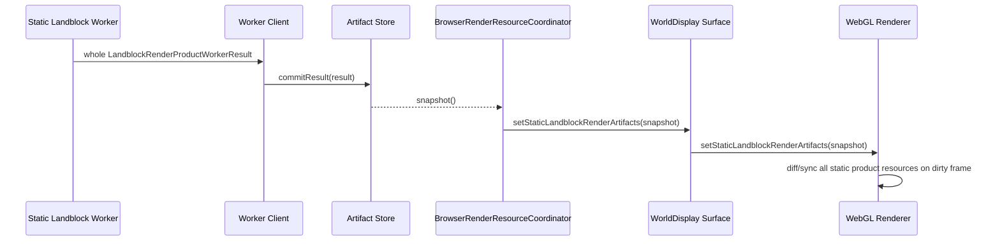
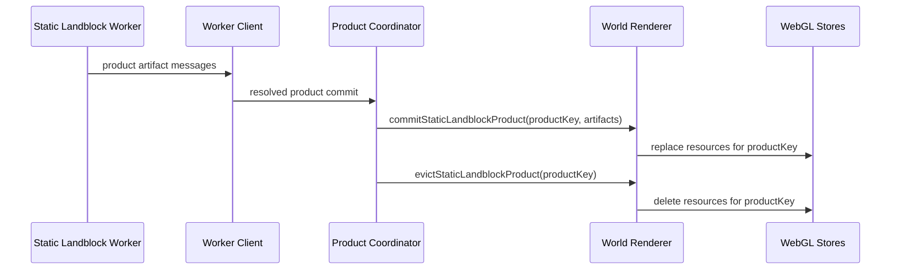

# Holtburger 3D Imperative Landblock Product Commit Replacement Plan

## Context And Boundaries

Goal: replace the remaining snapshot/diff-based static landblock renderer handoff with direct, imperative commits of worker-built landblock product artifacts.

This plan supersedes the snapshot bridge portions of `holtburger-3d-static-landblock-render-bundle-replacement-plan.md`. The old plan remains historical context for asset and artifact semantics, but new implementation work should follow this plan when touching the landblock worker-to-renderer boundary.

### In Scope

- Worker-built landblock products for outdoor terrain/buildings/detail, detailed env-cell interiors, portals, spatial/culling data, and dungeon landblocks.
- Main-thread product coordination, residency, replacement, stale result rejection, and eviction.
- Renderer/WebGL resource creation from worker-shaped artifacts.
- Removal of `BrowserRenderResourceSnapshot` and `StaticLandblockRenderArtifactStoreSnapshot` from render-critical paths.
- Removal of `BrowserRenderResourceCoordinator` ownership over static landblock product application.
- Removal of legacy main-thread static landblock hydration, static addition, incremental compaction, and prepared-cache closure accounting once product commits cover the corresponding artifact families.

### Out Of Scope

- Dynamic entity rendering.
- Runtime appearance previews, except where they must stop sharing static landblock resource plumbing.
- Higher-fidelity picker/debug diagnostics. These consumers are expendable and must not preserve legacy static render pipelines.
- Global texture atlas reuse across landblocks. Landblock-product-scoped texture pages are the supported static path for this replacement.

## Ground Truth

Primary code paths:

- `apps/holtburger-3d/src/workers/static-landblock-render-worker.ts`
- `apps/holtburger-3d/src/lib/world-display/static-landblock-render-worker-client.ts`
- `apps/holtburger-3d/src/lib/world-display/static-landblock-render-artifact-coordinator.ts`
- `apps/holtburger-3d/src/lib/world-display/static-landblock-render-artifact-store.ts`
- `apps/holtburger-3d/src/lib/world-display/browser-render-resource-coordinator.ts`
- `apps/holtburger-3d/src/lib/world-display/WorldDisplay.svelte`
- `apps/holtburger-3d/src/lib/world-display/world-display-renderer-contract.ts`
- `apps/holtburger-3d/src/lib/world-display/webgl2-world-display-renderer-impl.ts`
- `apps/holtburger-3d/src/lib/world-display/webgl2-world-resources.ts`

Reference artifact contracts:

- `apps/holtburger-3d/src/lib/world-display/landblock-render-product.ts`
- `apps/holtburger-3d/src/lib/world-display/static-bundle-layer.ts`
- `apps/holtburger-3d/src/lib/world-display/terrain-render-artifact.ts`
- `apps/holtburger-3d/src/lib/world-display/render-spatial-scene.ts`
- `apps/holtburger-3d/src/lib/world-display/world-residency-index.ts`

## Diagnosis

The current handoff still has a legacy shape:



This is the wrong abstraction now that the worker owns whole-product static hydration. The main thread should not rebuild a scene picture from snapshots, and the renderer should not infer product lifecycle by diffing large arrays every frame. The bridge also encourages us to keep `renderResourceSnapshot` as a mixed render/debug model, which hides legacy dependencies.

The replacement shape:



## Product Commit Model

Every static landblock product has a stable product key:

```ts
type StaticLandblockProductKey = {
  landblockId: number;
  product: "outdoor" | "outdoor-env-cells" | "dungeon-env-cells";
  requestId: string;
  buildPolicyRevision: string;
  texturePagePolicyRevision: string;
};
```

The coordinator owns desired/in-flight/resident product identity. The renderer owns GPU resources and culling structures for resident products. The browser resource coordinator does not own static landblock products.

### Product Commit Boundary

```ts
interface StaticLandblockProductCommitSurface {
  commitStaticLandblockProduct(result: LandblockRenderProductWorkerResult): void;
  evictStaticLandblockProduct(key: StaticLandblockProductKey): void;
  replaceStaticLandblockProducts(results: readonly LandblockRenderProductWorkerResult[]): void;
}
```

`replaceStaticLandblockProducts` is only for coarse lifecycle resets. Normal streaming uses explicit commit/evict.

## Phased Implementation

### Phase 0: Remove Crash-Hunt Diagnostics

Status: complete.

Deliverables:

- Remove temporary Tauri renderer diagnostic command and browser bridge.
- Remove worker progress message protocol.
- Remove WebGL dirty-resource/RAF diagnostic callbacks.
- Revert the host lookup batching experiment.
- Keep hard contract guards that expose real invalid state, such as missing worker closure responses.

Acceptance criteria:

- No `recordRendererDiagnostic`, `WorldRendererDiagnostic`, `onRendererDiagnostic`, or worker progress message types remain.
- Existing lint, type checks, and focused worker/coordinator tests pass.

Progress:

- Removed the temporary Tauri renderer diagnostic command and browser bridge.
- Removed startup/global renderer diagnostic handlers.
- Removed worker progress response messages and progress callback plumbing.
- Removed WebGL dirty-resource/RAF diagnostic callbacks.
- Reverted the bounded/sequential host lookup batching experiment.
- Kept worker closure missing-response and no-progress failures because those are real contract guards, not logging shims.

### Phase 1: Commit Surface Contract

Status: prepared.

Deliverables:

- Add renderer contract methods:
  - `commitStaticLandblockProduct(result)`
  - `evictStaticLandblockProduct(key)`
  - `replaceStaticLandblockProducts(results)`
- Wire these through `WorldDisplay.svelte`, `world-display-renderer.ts`, and WebGL implementation.
- Rename product lifecycle types away from `Snapshot`.
- Keep frame-local visibility snapshot naming only where it describes a per-frame culling result, not product residency.

Acceptance criteria:

- Static product results can be committed to the renderer without `BrowserRenderResourceCoordinator.update`.
- Tests prove stale product commits are rejected before renderer commit.
- Knip reports no unused legacy renderer contract methods.

Progress:

- Renamed static product residency surfaces away from `StaticLandblockRenderArtifactStoreSnapshot` to `StaticLandblockRenderProductSet`.
- Renamed the browser UI return object away from `BrowserRenderResourceSnapshot`/`renderResourceSnapshot` to `BrowserRenderResourceReport`/`renderResourceReport`.
- Renamed renderer replacement API from `setStaticLandblockRenderArtifacts` to `replaceStaticLandblockProducts`.
- Left the actual renderer handoff as a full-set replacement pending the explicit commit/evict contract. This is transitional debt and must be removed in this phase, not deferred past the commit surface work.

### Phase 2: Renderer Product Store

Deliverables:

- Introduce a WebGL static landblock product store keyed by product key.
- Move resource replacement from broad snapshot sync into product-keyed commit/evict functions.
- Product commit creates/replaces terrain, static bundle, detailed interior, portal, and spatial resources for that product.
- Eviction deletes all resources owned by the product key.

Acceptance criteria:

- No static landblock WebGL resources are synchronized by scanning a global artifact snapshot.
- Product replacement is idempotent for the same product key.
- Product eviction releases terrain/static/interior/portal/spatial resources in one call.

### Phase 3: Coordinator Cutover

Deliverables:

- `StaticLandblockRenderArtifactCoordinator` becomes `StaticLandblockRenderProductCoordinator`.
- Replace `onStoreChanged(snapshot)` with explicit callbacks:
  - `onProductCommitted(result)`
  - `onProductEvicted(key)`
  - `onProductSetReplaced(results)`
- Delete `StaticLandblockRenderArtifactStoreSnapshot`.
- Keep only coordinator-owned maps for desired, in-flight, resident, and stale product identity.

Acceptance criteria:

- Browser landblock streaming no longer calls `getSnapshot()` for static products.
- Resident/in-flight counts used by UI are derived from coordinator counters, not renderer inputs.
- Stale worker results never reach the renderer.

### Phase 4: Browser Resource Coordinator Extraction

Deliverables:

- Remove static landblock product application from `BrowserRenderResourceCoordinator`.
- Split remaining browser UI/debug facts into a report object that does not drive renderer state.
- Delete `BrowserRenderResourceSnapshot` and `renderResourceSnapshot`.
- Make `BrowserWorldDisplay.svelte` call renderer product commits directly from product coordinator callbacks.

Acceptance criteria:

- No symbol named `BrowserRenderResourceSnapshot` or `renderResourceSnapshot` remains.
- `BrowserRenderResourceCoordinator` does not accept `staticLandblockRenderArtifacts`.
- Runtime appearance preview resource updates remain isolated from landblock static product commits.

### Phase 5: Worker Result Protocol Split

Deliverables:

- Replace monolithic dense product `postMessage` with product artifact commit messages.
- Supported message families:
  - product header;
  - terrain artifact;
  - static bundle artifact chunk;
  - detailed landblock artifact;
  - texture page payload chunk;
  - portal/spatial artifact;
  - product complete.
- Main thread assembles a product commit imperatively, then commits exactly once when complete.

Acceptance criteria:

- Dense detailed landblocks do not transfer as one giant structured clone message.
- Worker result delivery can be tested with chunked artifact messages.
- Product assembly failure rejects the job and does not partially commit.

### Phase 6: Legacy Static Pipeline Deletion

Deliverables:

- Delete main-thread static landblock hydration/addition paths replaced by worker products.
- Delete incremental static compaction accounting for landblock-derived statics.
- Delete old fallback direct-draw paths that exist only to support partially staged static landblock graphs.
- Remove tests that only verify legacy snapshot/diff behavior.

Acceptance criteria:

- Static landblock-derived renderables enter the renderer only through product commits.
- Knip has no reachable legacy static addition/compaction symbols.
- Browser mode still renders terrain, outdoor statics, detailed interiors, portals, and dungeons through worker products.

### Phase 7: Cleanup And Naming Pass

Deliverables:

- Rename lingering `layer` terms that now mean artifact/product.
- Remove debug-report rows that imply staged/compacted dual paths.
- Remove compatibility helpers and reexports introduced during the transition.
- Simplify docs to point at the product commit model as the only static landblock renderer path.

Acceptance criteria:

- No static landblock code path is documented as optional, fallback, or compatibility mode.
- `npm run check`, `npm run lint:ts`, `npm run lint:dead`, and `npm run lint:rust` pass for `apps/holtburger-3d`.

## Risks And Mitigations

- Risk: product commits still transfer too much data in one message.
  Mitigation: Phase 5 splits transfer protocol by artifact family and commits only at product completion.

- Risk: UI/debug code currently reads render state from snapshots.
  Mitigation: move UI facts to coordinator counters or renderer metrics; drop fidelity where keeping it would preserve legacy renderer ownership.

- Risk: renderer product store initially duplicates some WebGL resource sync helpers.
  Mitigation: extract product-keyed helper functions first, then delete the global snapshot sync once all artifact families commit through the store.

- Risk: runtime appearance previews still need prepared asset resource sync.
  Mitigation: keep preview resource sync separate from static landblock products; do not route static landblock artifacts through preview surfaces.

## Cleanup Targets

- Full-set `replaceStaticLandblockProducts` replacement handoff
- `StaticLandblockRenderArtifactStore` naming once the coordinator becomes product-native
- `syncWebgl2StaticLandblockRenderArtifactResources` snapshot input shape
- static landblock fields on `BrowserRenderResourceCoordinatorInput`
- legacy tests named around artifact snapshots where the tested behavior is product commit or product eviction
- old diagnostic text that describes static renderables as staged, compacted, fallback, or partially hydrated

## Definition Of Done

- All static landblock-derived terrain, outdoor statics, detailed interiors, portals, spatial/culling structures, and dungeon contents reach the renderer through imperative product commits.
- No main-thread static landblock hydration or incremental compaction pipeline remains.
- No render-critical state is routed through `BrowserRenderResourceSnapshot` or `StaticLandblockRenderArtifactStoreSnapshot`.
- Dense product delivery avoids monolithic structured clone messages.
- Lint, dead-code checks, TypeScript checks, and Rust lint pass.

## Decisions And Course Corrections

- 2026-06-05: Cutover direction changed from snapshot bridge stabilization to imperative product commits. The crash logs showed worker artifact construction completing, with hangs around dense result transfer/legacy commit application. The correct fix is to remove the snapshot/diff handoff rather than keep adding diagnostics around it.
- 2026-06-05: Temporary renderer diagnostic bridges and worker progress messages are not part of the replacement architecture. Real contract failures should throw or reject; routine product progress should not become a second coordination channel.
- 2026-06-05: Phase 0 also removed snapshot terminology from product residency/report surfaces so future work cannot accidentally treat the transitional full-set replacement as an acceptable architecture. This is a naming cleanup, not the final commit cutover.
