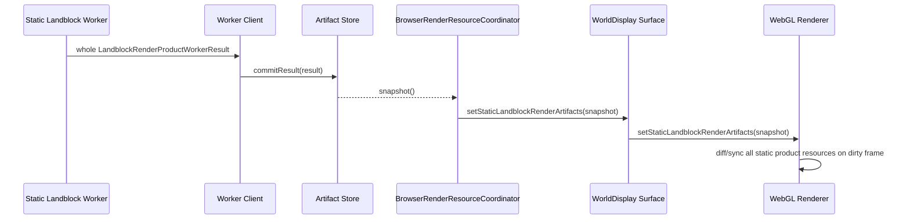
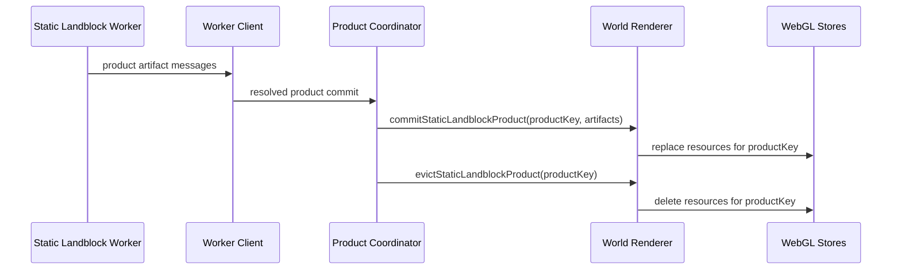

# Holtburger 3D Imperative Landblock Product Commit Replacement Plan

## Context And Boundaries

Goal: replace the remaining snapshot/diff-based static landblock renderer handoff with direct, imperative commits of worker-built landblock product artifacts.

This plan supersedes the snapshot bridge portions of `holtburger-3d-static-landblock-render-bundle-replacement-plan.md`. The old plan remains historical context for asset and artifact semantics, but new implementation work should follow this plan when touching the landblock worker-to-renderer boundary.

### In Scope

- Worker-built landblock products for outdoor terrain/buildings/detail, detailed env-cell interiors, portals, spatial/culling data, and dungeon landblocks.
- Main-thread product coordination, residency, replacement, stale result rejection, and eviction.
- Renderer/WebGL resource creation from worker-shaped artifacts.
- Removal of `BrowserRenderResourceSnapshot` and `StaticLandblockRenderArtifactStoreSnapshot` from render-critical paths.
- Removal of `BrowserRenderResourceCoordinator` ownership over static landblock product application.
- Removal of broad WebGL full-state diff/sync for static landblock products.
- Isolation of runtime appearance preview staging from landblock static product rendering.
- Demotion of renderer graph, picker, debug report, staged draw-unit diagnostics, and compaction metrics where they currently preserve legacy pipelines.
- Removal of legacy main-thread static landblock hydration, static addition, incremental compaction, and prepared-cache closure accounting once product commits cover the corresponding artifact families.

### Out Of Scope

- Dynamic entity rendering.
- Runtime appearance previews, except where they must stop sharing static landblock resource plumbing.
- Higher-fidelity picker/debug diagnostics. These consumers are expendable and must not preserve legacy static render pipelines.
- Global texture atlas reuse across landblocks. Landblock-product-scoped texture pages are the supported static path for this replacement.

## Ground Truth

Primary code paths:

- `apps/holtburger-3d/src/workers/static-landblock-render-worker.ts`
- `apps/holtburger-3d/src/lib/world-display/static-landblock-render-worker-client.ts`
- `apps/holtburger-3d/src/lib/world-display/static-landblock-render-artifact-coordinator.ts`
- `apps/holtburger-3d/src/lib/world-display/static-landblock-render-artifact-store.ts`
- `apps/holtburger-3d/src/lib/world-display/browser-render-resource-coordinator.ts`
- `apps/holtburger-3d/src/lib/world-display/WorldDisplay.svelte`
- `apps/holtburger-3d/src/lib/world-display/world-display-renderer-contract.ts`
- `apps/holtburger-3d/src/lib/world-display/webgl2-world-display-renderer-impl.ts`
- `apps/holtburger-3d/src/lib/world-display/webgl2-world-resources.ts`
- `apps/holtburger-3d/src/lib/world-display/webgl2/resources/static-bundle-layer-resources.ts`
- `apps/holtburger-3d/src/lib/world-display/webgl2/resources/structured-interior-resources.ts`
- `apps/holtburger-3d/src/lib/world-display/webgl2/resources/terrain-tile-resources.ts`
- `apps/holtburger-3d/src/lib/world-display/render-bvh-visibility-snapshot.ts`
- `apps/holtburger-3d/src/lib/world-display/render-spatial-scene.ts`
- `apps/holtburger-3d/src/lib/world-display/scene-renderable-readiness.ts`
- `apps/holtburger-3d/src/lib/world-display/static-renderable-readiness.ts`

Reference artifact contracts:

- `apps/holtburger-3d/src/lib/world-display/landblock-render-product.ts`
- `apps/holtburger-3d/src/lib/world-display/static-bundle-layer.ts`
- `apps/holtburger-3d/src/lib/world-display/terrain-render-artifact.ts`
- `apps/holtburger-3d/src/lib/world-display/render-spatial-scene.ts`
- `apps/holtburger-3d/src/lib/world-display/world-residency-index.ts`

## Diagnosis

The current handoff still has a legacy shape:



This is the wrong abstraction now that the worker owns whole-product static hydration. The main thread should not rebuild a scene picture from snapshots, and the renderer should not infer product lifecycle by diffing large arrays every frame. The bridge also encourages us to keep `renderResourceSnapshot` as a mixed render/debug model, which hides legacy dependencies.

The replacement shape:



## Product Commit Model

Every static landblock product has a stable product key:

```ts
type StaticLandblockProductKey = {
  landblockId: number;
  product: "outdoor" | "outdoor-env-cells" | "dungeon-env-cells";
  buildPolicyRevision: string;
  texturePagePolicyRevision: string;
};
```

The coordinator owns desired/in-flight/resident product identity. The renderer owns GPU resources and culling structures for resident products. The browser resource coordinator does not own static landblock products.

`requestId` is job identity, not product identity. Stale-result rejection should compare request identity before commit, but product resource ownership must not include request IDs or other scheduling tokens. Otherwise ordinary browser movement forces needless GPU resource replacement for unchanged product artifacts.

## Legacy Abstractions To Remove Or Quarantine

The product commit cutover is not only a method rename. These abstractions currently preserve the old renderer architecture and must be removed from the static landblock hot path:

- `BrowserRenderResourceCoordinator` as a render-state god object. It currently derives scenes, applies renderer resources, caches picker diagnostics, writes UI report text, gates artifact-vs-asset paths, and stores surface signatures. Static landblock product commits must bypass it. Its remaining duties should split into a small runtime-appearance preview updater and a UI/debug report builder.
- `StaticRenderableSceneModel`, `StructuredInteriorSceneModel`, and `TerrainSceneModel` as landblock artifact adapters. These can remain temporarily for runtime appearance previews, frame culling, or report text, but worker landblock products should not be converted into these broad scene models before reaching WebGL resources.
- Broad `syncWebgl2WorldResources` / `syncWebgl2StaticLandblockRenderArtifactResources` reconciliation. Static product resources should be created/replaced/evicted by product key. Full-state scans are legacy diffing.
- `syncWebgl2StaticBundleLayerResources` and `syncWebgl2StructuredInteriorResources` retained-key scans. These are smaller but still full-set sync APIs; product stores should commit/evict resource groups by owning product key.
- `staged-world-*` naming and helpers in static product paths. Geometry helpers may survive with neutral names, but staged draw-unit assembly must be runtime-preview-only.
- `RendererResourceGraph` as hot-path ownership. Product keys already define ownership; graph data can remain debug-only or be deleted.
- Picker/debug diagnostics that require staged draw-unit fidelity. These consumers can lose fidelity or consume renderer product metadata cheaply.
- Compaction/atlas/fallback diagnostics that describe runtime staging as the center of the renderer. Product/resource readiness is the durable diagnostic model.
- Readiness models that exist to filter partially prepared main-thread scenes: `deriveStaticRenderableReadinessModel` and `deriveSceneRenderableReadinessModel`. Worker landblock products should be complete/resolved or fail; product commits should not re-run fallback-resolved readiness gates.
- Browser-owned render chunk transform, spatial index, transition portal candidate, and debug overlay derivation from scene adapters. Product resources should expose product-owned render candidates/spatial facts directly; browser reports can observe them later.
- Request-scoped `sourceRevision` values in artifacts/resources. Source revisions that include `requestId` defeat product reuse and should be replaced with product-content or policy revisions.
- Texture filtering/sampler policy updates that currently piggyback on full resource sync. Product stores need an explicit sampler-policy update path across resident product texture pages.
- Worker job lifecycle. A single worker can interleave multiple async jobs while they await host lookups; the replacement should prefer one active landblock build per worker for now because it makes stale-work cancellation, product assembly ownership, and commit ordering deterministic. This is a simplification choice, not an assumption that IPC throughput is inherently the bottleneck.

### Product Commit Boundary

```ts
interface StaticLandblockProductCommitSurface {
  commitStaticLandblockProduct(result: LandblockRenderProductWorkerResult): void;
  evictStaticLandblockProduct(key: StaticLandblockProductKey): void;
  updateStaticLandblockProductSamplerPolicy(policy: TextureFilteringMode): void;
  replaceStaticLandblockProducts(results: readonly LandblockRenderProductWorkerResult[]): void;
}
```

`replaceStaticLandblockProducts` is only for coarse lifecycle resets. Normal streaming uses explicit commit/evict.

## Phased Implementation

### Phase 0: Remove Crash-Hunt Diagnostics

Status: complete.

Deliverables:

- Remove temporary Tauri renderer diagnostic command and browser bridge.
- Remove worker progress message protocol.
- Remove WebGL dirty-resource/RAF diagnostic callbacks.
- Revert the host lookup batching experiment.
- Keep hard contract guards that expose real invalid state, such as missing worker closure responses.

Acceptance criteria:

- No `recordRendererDiagnostic`, `WorldRendererDiagnostic`, `onRendererDiagnostic`, or worker progress message types remain.
- Existing lint, type checks, and focused worker/coordinator tests pass.

Progress:

- Removed the temporary Tauri renderer diagnostic command and browser bridge.
- Removed startup/global renderer diagnostic handlers.
- Removed worker progress response messages and progress callback plumbing.
- Removed WebGL dirty-resource/RAF diagnostic callbacks.
- Reverted the bounded/sequential host lookup batching experiment.
- Kept worker closure missing-response and no-progress failures because those are real contract guards, not logging shims.

### Phase 1: Product Commit Surface Contract

Status: prepared.

Deliverables:

- Add renderer contract methods:
  - `commitStaticLandblockProduct(result)`
  - `evictStaticLandblockProduct(key)`
  - `replaceStaticLandblockProducts(results)`
- Wire these through `WorldDisplay.svelte`, `world-display-renderer.ts`, and WebGL implementation.
- Rename product lifecycle types away from `Snapshot`.
- Keep frame-local visibility snapshot naming only where it describes a per-frame culling result, not product residency.

Acceptance criteria:

- Static product results can be committed to the renderer without `BrowserRenderResourceCoordinator.update`.
- Tests prove stale product commits are rejected before renderer commit.
- Knip reports no unused legacy renderer contract methods.

Progress:

- Renamed static product residency surfaces away from `StaticLandblockRenderArtifactStoreSnapshot` to `StaticLandblockRenderProductSet`.
- Renamed the browser UI return object away from `BrowserRenderResourceSnapshot`/`renderResourceSnapshot` to `BrowserRenderResourceReport`/`renderResourceReport`.
- Renamed renderer replacement API from `setStaticLandblockRenderArtifacts` to `replaceStaticLandblockProducts`.
- Left the actual renderer handoff as a full-set replacement pending the explicit commit/evict contract. This is transitional debt and must be removed in this phase, not deferred past the commit surface work.

### Phase 2: Product Coordinator Cutover

Deliverables:

- `StaticLandblockRenderArtifactCoordinator` becomes `StaticLandblockRenderProductCoordinator`.
- `StaticLandblockRenderArtifactStore` becomes a product residency index or is folded into the coordinator.
- Split job identity from product identity:
  - request ID participates in stale rejection only;
  - product key excludes request ID;
  - source revisions are stable for unchanged product content/policy.
- Replace `onStoreChanged(productSet)` with explicit callbacks:
  - `onProductCommitted(result)`;
  - `onProductEvicted(key)`;
  - `onProductSetReplaced(results)` for coarse resets only.
- Keep only coordinator-owned maps for desired, in-flight, resident, and stale product identity.
- Expose coordinator counters/report facts separately from renderer commit input.

Acceptance criteria:

- Browser landblock streaming no longer calls `getProductSet()` to drive renderer state.
- Resident/in-flight counts used by UI are derived from coordinator counters, not renderer inputs.
- Stale worker results never reach the renderer.
- No product callback is named around stores, snapshots, or artifact layers.
- Replanning the same product with a new request ID does not evict/recreate resident renderer resources.

### Phase 3: Renderer Product Store

Deliverables:

- Introduce a WebGL static landblock product store keyed by product key.
- Move resource replacement from broad full-set sync into product-keyed commit/evict functions.
- Product commit creates/replaces terrain, static bundle, detailed interior, portal, and spatial resources for that product.
- Eviction deletes all resources owned by the product key.
- `replaceStaticLandblockProducts` is restricted to reset/initialization and then deleted once normal streaming uses commit/evict.
- Static bundle, structured interior, and terrain resource stores gain product-keyed commit/evict APIs instead of retained-key scan sync APIs.
- Product stores expose render candidates, scene bounds, residency/spatial facts, and resource counters without converting back through scene models.
- Product stores expose sampler-policy updates for resident texture pages without rebuilding geometry or re-uploading page pixels.

Acceptance criteria:

- No static landblock WebGL resources are synchronized by scanning a global product set.
- Product replacement is idempotent for the same product key.
- Product eviction releases terrain/static/interior/portal/spatial resources in one call.
- Static landblock product resources are not built through `StaticRenderableSceneModel`, `StructuredInteriorSceneModel`, or `TerrainSceneModel` adapter derivation.
- Changing texture filtering updates resident product samplers without committing or evicting products.

### Phase 4: Browser Resource Coordinator Decomposition

Deliverables:

- Remove static landblock product application from `BrowserRenderResourceCoordinator`.
- Split remaining browser UI/debug facts into a report builder that does not drive renderer state.
- Move runtime appearance preview updates into a small preview-only updater that may still use staged scene assembly.
- Move render chunk transform derivation needed by product resources into the renderer/product store boundary or product commit payloads.
- Move transition portal candidate derivation for landblock products out of browser report generation and into product-owned renderer resources.
- Move spatial index population for product terrain/static/interior items out of `BrowserRenderResourceCoordinator`; browser picking should consume a renderer/product spatial query or low-fidelity product metadata.
- Delete `BrowserRenderResourceReport` if it continues to couple renderer updates and UI text; otherwise keep it report-only with no surface application.
- Make `BrowserWorldDisplay.svelte` call renderer product commits directly from product coordinator callbacks.

Acceptance criteria:

- No symbol named `BrowserRenderResourceSnapshot` or `renderResourceSnapshot` remains.
- `BrowserRenderResourceCoordinator` does not accept static landblock product sets.
- `BrowserRenderResourceCoordinator` no longer calls landblock static renderer surface methods.
- Runtime appearance preview resource updates remain isolated from landblock static product commits.
- UI report generation can be disabled without changing renderer state.
- Browser picking/debug overlays cannot force landblock products through scene-model adapters.

### Phase 5: Broad WebGL Sync Split

Deliverables:

- Split static product resource commit/evict from `syncWebgl2WorldResources`.
- Restrict `syncWebgl2WorldResources` to non-product resources, especially runtime appearance previews and portal masks until they have product-owned inputs.
- Delete or rename staged resource assembly that only exists for static landblock products.
- Keep `RenderBvhVisibilitySnapshot` only as frame-local visibility output; it must consume renderer product resources or product metadata, not product residency sets.
- Remove `deriveSceneRenderableReadinessModel` / `deriveStaticRenderableReadinessModel` from landblock product rendering. Keep them only if runtime appearance previews still need them; otherwise delete them.
- Terrain texture-page planning for worker-built terrain moves to product artifacts or product-resource commit. It must not run inside broad `syncWebgl2WorldResources`.

Acceptance criteria:

- A static product commit does not mark broad world resources dirty for a full sync.
- Runtime preview updates do not force static product resource reconciliation.
- Static product frame culling reads product-owned render candidates.
- Static product rendering does not use fallback-resolved readiness gates intended for partially prepared main-thread scenes.

### Phase 6: Worker Job Serialization And Result Protocol Cleanup

Deliverables:

- Serialize static landblock product builds inside the worker. The client may still queue and prioritize requested products, but the worker should execute one build at a time.
- Drop stale queued work before product hydration/building starts.
- Add cancellation checks at phase boundaries before expensive artifact assembly and before posting a completed result.
- Keep the result protocol product-oriented. Chunked artifact delivery is optional follow-up, only if profiling proves monolithic product transfer remains a real problem after imperative commits and worker serialization.
- If chunking becomes necessary, supported message families are:
  - product header;
  - terrain artifact;
  - static bundle artifact chunk;
  - detailed landblock artifact;
  - texture page payload chunk;
  - portal/spatial artifact;
  - product complete.
- Main thread commits exactly once per completed product. Partial product messages, if introduced later, are assembly details and must not partially mutate renderer state.

Acceptance criteria:

- Worker tests prove only one static landblock product build is active at a time, even when host lookups resolve out of order.
- Client tests prove stale queued products can be dropped before they are sent to the worker.
- Product assembly failure rejects the job and does not partially commit.
- Stale queued work is dropped before expensive build/transfer when a newer product identity supersedes it.
- Chunked result delivery is not required for this phase unless a new measured failure shows the remaining product transfer is the cause.

### Phase 6A: Product Granularity And LoD Preset Audit

Deliverables:

- Dry-run product planning against current LoD sliders and backend artifact routes.
- Decide whether `outdoor` remains a single product containing terrain/buildings/detail, or whether product/preset naming must better reflect backend artifact granularity.
- Avoid sub-product runtime filtering that reintroduces partial graph diffing. If a backend route loads terrain/buildings/detail together, the LoD UI should coarse-match that product instead of pretending those radii are independently cheap.
- Document dungeon behavior as the same env-cell product path with no outdoor product.

Acceptance criteria:

- Product planning does not request a broad product and then depend on renderer-side filtering to simulate narrower LoD.
- LoD controls map clearly to worker product residency choices.
- No phase assumes terrain/building/detail can be independently committed unless the worker product contract actually separates them.

### Phase 7: Debug, Picker, Graph, And Metrics Demotion

Deliverables:

- Remove staged draw-unit requirements from picker diagnostics.
- Move `RendererResourceGraph` off the static product hot path or delete it if no durable consumer remains.
- Rewrite debug report rows around product/resource readiness instead of staged/compacted/fallback paths.
- Keep compaction/atlas diagnostics only where they describe worker/product build output or WebGL resource readiness.

Acceptance criteria:

- Picker/debug consumers do not require main-thread static hydration, staged draw units, or fallback direct draw identity.
- Static product rendering works when renderer graph diagnostics are disabled.
- Debug text no longer implies static landblock rendering has staged and compacted runtime modes.

### Phase 8: Legacy Static Pipeline Deletion

Deliverables:

- Delete main-thread static landblock hydration/addition paths replaced by worker products.
- Delete incremental static compaction accounting for landblock-derived statics.
- Delete old fallback direct-draw paths that exist only to support partially staged static landblock graphs.
- Remove tests that only verify legacy snapshot/diff behavior.

Acceptance criteria:

- Static landblock-derived renderables enter the renderer only through product commits.
- Knip has no reachable legacy static addition/compaction symbols.
- Browser mode still renders terrain, outdoor statics, detailed interiors, portals, and dungeons through worker products.

### Phase 9: Cleanup And Naming Pass

Deliverables:

- Rename lingering `layer` terms that now mean artifact/product.
- Rename neutral geometry helpers currently living under `staged-world-*` if they remain useful outside preview staging.
- Remove compatibility helpers and reexports introduced during the transition.
- Simplify docs to point at the product commit model as the only static landblock renderer path.

Acceptance criteria:

- No static landblock code path is documented as optional, fallback, or compatibility mode.
- `npm run check`, `npm run lint:ts`, `npm run lint:dead`, and `npm run lint:rust` pass for `apps/holtburger-3d`.

## Risks And Mitigations

- Risk: product commits still transfer too much data in one message.
  Mitigation: do not assume this is the dominant failure mode. Phase 6 first serializes worker builds and removes legacy commit/diff churn; chunked transfer by artifact family is reserved for measured transfer failures after that simplification.

- Risk: UI/debug code currently reads render state from snapshots.
  Mitigation: move UI facts to coordinator counters or renderer metrics; drop fidelity where keeping it would preserve legacy renderer ownership.

- Risk: renderer product store initially duplicates some WebGL resource sync helpers.
  Mitigation: extract product-keyed helper functions first, then delete the global snapshot sync once all artifact families commit through the store.

- Risk: runtime appearance previews still need prepared asset resource sync.
  Mitigation: keep preview resource sync separate from static landblock products; do not route static landblock artifacts through preview surfaces.

- Risk: scene-model adapters make the transition look complete while static landblock products still flow through main-thread scene derivation.
  Mitigation: acceptance criteria require static product resources to bypass `StaticRenderableSceneModel`, `StructuredInteriorSceneModel`, and `TerrainSceneModel` before the broad sync path is deleted.

- Risk: picker/debug/report consumers keep staged draw-unit and fallback identity alive.
  Mitigation: explicitly demote these consumers in Phase 7; lose fidelity rather than preserving renderer architecture debt.

- Risk: `RendererResourceGraph` keeps dependency-lease accounting in the hot path after product keys already provide ownership.
  Mitigation: move it to debug-only or delete it before final cleanup.

- Risk: product keys or artifact source revisions include request IDs.
  Mitigation: Phase 2 separates request identity from product/resource identity and tests resource reuse across request replans.

- Risk: current LoD sliders imply terrain/building/detail independence while the worker/backend product route is broader.
  Mitigation: Phase 6A audits product granularity and aligns UI presets to actual product shapes before deleting legacy fallback paths.

- Risk: texture filtering changes accidentally force product recommit or full resource sync.
  Mitigation: Phase 3 adds an explicit product-store sampler-policy update path.

- Risk: one worker runs multiple async product jobs concurrently because host lookups yield to the worker event loop.
  Mitigation: Phase 6 serializes product builds inside the worker and adds stale queued-work cancellation. This is primarily a state-space and memory-lifetime simplification, not an IPC throughput workaround.

## Cleanup Targets

- Full-set `replaceStaticLandblockProducts` replacement handoff
- `StaticLandblockRenderArtifactStore` naming once the coordinator becomes product-native
- `StaticLandblockRenderArtifactCoordinator` naming once callbacks become product commit/evict events
- `syncWebgl2StaticLandblockRenderArtifactResources` snapshot input shape
- `syncWebgl2StaticBundleLayerResources` retained-key full-set sync API
- `syncWebgl2StructuredInteriorResources` retained-key full-set sync API
- static landblock fields on `BrowserRenderResourceCoordinatorInput`
- `BrowserRenderResourceCoordinator` as renderer surface applier
- landblock artifact derivation through `StaticRenderableSceneModel`, `StructuredInteriorSceneModel`, and `TerrainSceneModel`
- `staged-world-assembly` in static product paths
- `deriveSceneRenderableReadinessModel` and `deriveStaticRenderableReadinessModel` in landblock product rendering
- request-scoped artifact `sourceRevision` values
- render chunk transform derivation owned by browser report generation
- transition portal candidate derivation owned by browser report generation
- render spatial index population owned by browser report generation
- terrain texture-page planning inside broad `syncWebgl2WorldResources`
- `RendererResourceGraph` leases for static product ownership
- picker/debug rows that require staged draw-unit facts
- compaction/atlas/fallback metrics that describe runtime staging instead of product/resource readiness
- worker-client concurrency defaults that allow overlapping landblock builds inside one worker
- legacy tests named around artifact snapshots where the tested behavior is product commit or product eviction
- old diagnostic text that describes static renderables as staged, compacted, fallback, or partially hydrated

## Definition Of Done

- All static landblock-derived terrain, outdoor statics, detailed interiors, portals, spatial/culling structures, and dungeon contents reach the renderer through imperative product commits.
- No main-thread static landblock hydration or incremental compaction pipeline remains.
- No render-critical state is routed through `BrowserRenderResourceSnapshot` or `StaticLandblockRenderArtifactStoreSnapshot`.
- No render-critical static product state is routed through `BrowserRenderResourceCoordinator`, scene-model adapters, broad WebGL full-state sync, or renderer graph dependency leases.
- Dense product delivery is not interleaved across multiple active builds in one worker; chunked delivery is added only if measured as necessary after the imperative commit cutover.
- Product keys and renderer resource keys are stable across request-ID-only replans.
- LoD controls map to actual worker/backend product granularity without sub-product runtime diffing.
- Texture filtering/sampler policy changes update resident product resources without rebuild/recommit.
- Worker scheduling has deterministic single-active-build behavior and bounded stale queued work.
- Runtime appearance preview staging remains isolated and cannot trigger static product reconciliation.
- Picker/debug/report consumers are low-fidelity product/resource observers, not architecture drivers.
- Lint, dead-code checks, TypeScript checks, and Rust lint pass.

## Dry Run Findings

- `BrowserRenderResourceCoordinator.update()` still does too much: product-set scene derivation, runtime preview staging, render chunk transform calculation, spatial index replacement, transition portal model derivation, debug overlay derivation, surface application, picker diagnostic cache, and report generation all happen in one call. Phase 4 must decompose this before later phases can be considered complete.
- `syncWorldResources()` in `webgl2-world-display-renderer-impl.ts` still invokes both static product sync and broad world sync in one dirty-frame pass. Product commits must not mark broad world resources dirty.
- `syncWebgl2StaticLandblockRenderArtifactResources()` delegates to smaller retained-key sync APIs for static bundles and structured interiors. These smaller sync APIs are also legacy full-set reconciliation and need product-keyed commit/evict replacements.
- `syncWebgl2WorldResources()` still builds runtime staged assembly, terrain resources, terrain texture pages, direct indexed material resources, compaction plans, renderer graph leases, and broad metrics together. Terrain product resources and runtime preview resources need separate ownership.
- `deriveRenderBvhVisibilitySnapshot()` still mixes product BVHs with fallback asset-state/scene-model BVHs. The frame-local snapshot can stay, but product rendering must stop requiring `assetState`, `StaticRenderableSceneModel`, `StructuredInteriorSceneModel`, or `TerrainSceneModel` for product visibility.
- `render-spatial-scene.ts` has product-derived spatial item helpers, but the browser coordinator still owns when/how those feed the spatial index. Product stores or renderer-owned spatial queries should own product spatial facts; picker/debug can consume lower-fidelity product metadata.
- `scene-renderable-readiness.ts` and `static-renderable-readiness.ts` exist for partially prepared main-thread scenes and fallback-resolved rendering. Worker products should emit a complete resolved picture or error; these readiness gates should be runtime-preview-only or deleted.
- `StaticLandblockRenderWorkerClient` can post multiple jobs to one worker (`maxConcurrentJobs` defaults to `2`). Because worker jobs await host lookups, multiple product builds can overlap inside one worker. The next worker phase should serialize builds in the worker and treat chunked delivery as optional measured follow-up, not the primary stability thesis.
- Current product planning coalesces terrain/building/detail interests into the same `outdoor` product. If `outdoor` contains all outdoor product artifacts, independent terrain/building/detail radii are misleading and can force broader work than the UI implies. Phase 6A must align product granularity and LoD controls.
- Current product key draft originally included `requestId`, and artifact `sourceRevision` values can be request-scoped. That would recreate churn even after commit/evict exists. Request identity must remain outside product/resource identity.

## Decisions And Course Corrections

- 2026-06-05: Cutover direction changed from snapshot bridge stabilization to imperative product commits. The crash logs showed worker artifact construction completing, with hangs around dense result transfer/legacy commit application. The correct fix is to remove the snapshot/diff handoff rather than keep adding diagnostics around it.
- 2026-06-05: Temporary renderer diagnostic bridges and worker progress messages are not part of the replacement architecture. Real contract failures should throw or reject; routine product progress should not become a second coordination channel.
- 2026-06-05: Phase 0 also removed snapshot terminology from product residency/report surfaces so future work cannot accidentally treat the transitional full-set replacement as an acceptable architecture. This is a naming cleanup, not the final commit cutover.
- 2026-06-05: Added a legacy-abstraction audit to prevent a shallow commit-method cutover. `BrowserRenderResourceCoordinator`, scene-model adapters, broad WebGL sync, staged assembly, renderer graph leases, picker/debug fidelity, and runtime compaction diagnostics are all explicit transition targets now.
- 2026-06-05: Dry run added product identity, LoD granularity, sampler policy, readiness, resource-store sync, and worker backpressure targets. These are structural constraints for the cutover, not optional cleanup.
- 2026-06-05: Refined the worker scheduling thesis. Dense queues, dense results, and IPC pressure are not assumed to be the main instability cause. The plan now favors worker-side serialization because it dramatically simplifies lifecycle and cancellation while we delete the legacy snapshot/diff renderer handoff. Chunked result delivery is no longer a required phase outcome unless later measurements justify it.
