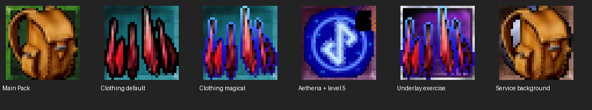
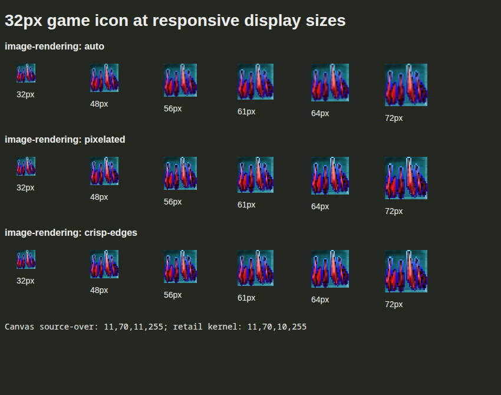

# Game-backed inventory icons — phased implementation plan

Status: Phases 0–7 complete. Game-backed icons, persistent retention, failure
fallbacks and production verification are implemented; the unobserved live artwork
property update is explicitly documented below. Created 2026-09-11. This is a new slice following the
[inventory implementation](holtburger-3d-client-inventory-scope.md).

Follow-up: [stack-count overlays](#follow-up-scope-stack-count-overlays) are implemented
and verified; execution evidence is recorded below.

## Purpose and current context

Replace the temporary clipped item names in the 3D client's inventory cells with
icons backed by the game assets, preserving persistent frontend view state and
shared icon resources independently of whether the inventory panel is open.

The contents grids and pack strip already share `ItemGridCell`. Cells are square,
flow with their containing UI, share selected-entity state, and have theme-owned
selection styling (including the holtburger-standard golden glow). Main Pack
represents the local player and selects that player's GUID. These behaviors form
the surrounding context; an icon is the visual content of a cell.

Inventory consumes a recoverable semantic entity mirror through bounded UI
sampling. Inventory-only objects need not have scene presentation. Icon data must
therefore work independently of scene residency and retain the existing Svelte
reactivity discipline.

## Scope and engineering constraints

In scope: authoritative icon-property consolidation; retail mapping/image access;
static composition including authored effects, overlays and underlays; burst-safe
preparation; shared prepared images retained by persistent consumers; inventory
contents/pack-strip integration; themed scaling, selection, accessibility and
explicit degraded-image behavior.

Out of scope: new wire messages, generic panel/resource frameworks, drag/drop,
quantity/cooldown/capacity decorations, worker pools, visibility prioritization,
persistent disk caching, prefetching, and TUI UI changes. Do not build future panels
merely to demonstrate reuse; a second synthetic persistent consumer can verify it.

North stars:

- One authoritative property source, one place for retail recipe interpretation.
- Extract existing state before inventing new systems. Persistent inventory state
  belongs to the frontend session composition, not a mounted Svelte panel.
- The resource owner retains shared results for persistent consumers. Panel
  visibility neither resets state nor releases claims.
- Bounded imperative sampling; no producer-rate Svelte payload graph.
- Measure complete bursts before fixing execution placement, encoding, or batching.
- Keep pure asset decoding reusable and app presentation policy app-local.
- Prefer a clean cutover, including deleting obsolete fields, paths, and vocabulary.

Accepted first-slice limits proposed by the design: deterministic scalar blending,
transparent padding for undersized source images, themeable pixelated enlargement,
name fallback for required-image failures, and available artwork with reported
missing optional layers. Preserve all authored layers that are available. No claim
of pixel identity with every retail CPU path or coverage of arbitrary custom content.

## Phased implementation

Phases are ordered by dependency. Check off a phase only when its acceptance
criteria pass. Record findings and changes in the decision log below; rewrite
remaining phases when an earlier gate changes the architecture. Execution was subsequently authorized by the user.

### Phase 0 — fit ownership into the existing client

Deliverable: an ownership/call-path decision recorded here, with chosen concrete
owners and a rough added/deleted-line estimate. No generic framework presumed.

- [x] Trace `ClientApp.svelte`, `client-lifecycle-session.ts`,
  `client-presentation-session.ts`, `client-entity-mirror.ts`, and
  `ClientInventoryPanel.svelte` for creation, reset, content replacement and disposal.
- [x] Inspect existing texture/resource ownership and request sharing, including
  `src/lib/game/renderer/resource-manager.ts`, its WebGL implementation, existing
  texture preparation, and host shared-content dispatch. Reuse appropriate pure
  helpers or ownership patterns without introducing scene/GPU requirements for UI.
- [x] Choose the minimal home for persistent inventory preferences and icon
  references. Keep authoritative facts in the entity mirror; derive sections, pack
  slots and sorted display projections when consumed, using existing revisions.
  Do not make persistence require eager hidden-panel display computation or a
  general panel-state registry.
- [x] Decide whether shared preparation/retention fits an existing owner or needs
  one focused app-local helper. If a helper is needed, name its callers, keys,
  lifetime and cleanup. Start from a focused shared icon repository and ordinary
  persistent references. Registered claim sets, union reconciliation and a separate
  scheduling abstraction require evidence that they simplify actual callers; they
  are not the starting API.
- [x] Trace host content-command execution and identify where CPU preparation can
  run without blocking the client-runtime actor, event forwarding or movement.
  Include the shared sidecar stdout queue/writer, not just CPU thread placement.
- [x] Name the existing lifecycle signals for character entry/reset, recovery and
  disposal. A mirror `pending` read alone cannot distinguish entry from recovery;
  wire the existing lifecycle owner rather than adding another world event.
- [x] Choose URL retirement ordering relative to UI snapshot adoption: old display
  URLs must remain usable until mounted consumers have replaced them. Use the
  existing UI commit boundary where appropriate; do not guess with timeouts or
  make the DOM the persistent resource owner.

Acceptance: each piece of state/resource has one named owner and reset condition;
no owner lifetime depends on the active floating panel; the host execution path is
verified from code. Record why any new helper is smaller/cleaner than alternatives.

### Phase 1 — measure burst preparation and settle the execution boundary

Deliverable: a reproducible diagnostic probe and recorded measurements, followed by
one chosen execution/encoding/batch design. Use local assets and synthetic demand;
no live account is required for this gate.

- [x] Prototype the pure composition and candidate host batch path using research
  helpers or a focused harness. Keep experimental plumbing out of production UI.
- [x] Exercise the workload matrix in concrete-shape section 7: 100/300/600 distinct
  specifications plus representative duplicate-heavy inventories, shared assets and
  initial hydration while hidden. Repeat timed runs; report distribution.
  Replacement/failure/disposal checks run against the real owners in phases 4–5
  (see sequencing decision below), not a duplicate experimental owner.
- [x] Exercise the real framed sidecar path with runtime events interleaved with
  icon responses. Measure event delivery delay and writer-queue pressure; an
  HTTP-only browser result is not evidence for Electron stdio responsiveness.
  Choose request/response byte ceilings as well as entry count below the existing
  protocol frame limit (currently 16 MiB, import its constant in probe checks).
  Measure actual envelope overhead. Phase 4 enforces the chosen byte bound on
  requests and complete responses, including failure messages.
- [x] Record item count, distinct raw specifications, resolved recipes and source
  images separately. Do not assume request deduplication is complete image
  deduplication. Different raw masks resolving to identical artwork are checked
  against the real resolver in phase 3 (see sequencing decision below).
- [x] Separate source decode, composition, encoding, transport and browser image
  installation. Measure host event responsiveness and browser main-thread stalls,
  time to first/all images, and retained resources; capture baseline without icons.
- [x] Establish the benchmark's responsiveness criterion from existing application
  budgets/baseline before comparing variants; record hardware, corpus, cache state
  and acceptance thresholds alongside results rather than choosing them after a run.
- [x] Select host execution context, bounded batch size and response representation
  from the results. Host composition is the leading candidate. Compare a frontend
  worker only if evidence warrants it; retain only the selected production path.
- [x] Update concrete shapes and phases 3–6 to the chosen contract before proceeding.

Acceptance: recorded repeated whole-burst results meet the declared criterion;
interleaved event delivery remains responsive; encoded image transport and browser
installation have been measured, not inferred from pixel-loop cost. Actual gameplay
actor responsiveness is rechecked through the production adapter in phase 4. Any failed
criterion leads to a narrower experiment/revision, not an unmeasured scheduler.

### Phase 2 — unify icon facts end to end

Deliverable: authoritative appearance inputs on existing client snapshots/deltas,
with no duplicate base-icon storage. Existing text UI continues to function.

- [x] Add base Icon hydration at `WorldObjectPropertiesHydrationExt::hydrate_from_pwd`
  in `crates/holtburger-world/src/hydration.rs`; delete `Entity.icon_id` and sweep
  its consumers/fixtures. Retain mandatory description zero in raw properties;
  preserve existing DID-update removal and nonzero accessor semantics.
- [x] Add the icon appearance composite to `entity_facts.rs::EntityDescription::Known`.
  Keep ItemType where it is; exclude WCID-derived guesses, 3D palette/shade,
  `IconOverlaySecondary`, resource readiness and caches.
- [x] Carry the shape through existing core snapshot/delta, host projection and
  frontend mirror schemas. Reuse `PropertiesUpdated` dirty processing; no new stream.
- [x] Verify description A → property update B → replacement C, explicit zero/removal,
  optional layer disappearance, and private-player retention where incoming C wins.
- [x] Verify initial snapshot, subsequent icon/effects delta and recovery snapshot
  all produce equivalent accepted facts for inventory-only entities.

Acceptance: focused Rust/TypeScript tests cover initial/update/recreation and mirror
recovery; no base-icon field/fallback remains; no scene placement is required.

### Phase 3 — provide reusable asset resolution and pure composition

Deliverable: tested preparation primitives at the owners selected in phases 0–1.

- [x] Add DID-mapper decoding in `holtburger-dat`, preserving the two ID maps and
  validating compressed counts/record bounds. Use ACE format references below.
- [x] Add narrow content lookup for the master/group mappings and direct RenderSurface
  access; validate required default/main-pack entries. Keep debug names out of UI
  transport unless there is a named consumer.
- [x] Consolidate pure direct-color normalization currently in
  `host/src/object_texture.rs` with reusable content conversion. Preserve existing
  renderer roles and tests; avoid a new unrelated palette pipeline.
- [x] Implement app-local recipe resolution and pure scalar compositor at the
  selected execution boundary. Cover main pack, lowest-bit mapping, default effects,
  missing preferred effects, optional layers and non-32px source extents.
- [x] Add focused synthetic fixtures for exact white replacement, layer order,
  three/four-channel alpha including partially transparent pairs, RGB ordering and
  malformed lengths. Runtime-asset checks stay in the diagnostic harness, not tests
  requiring untracked DATs.
- [x] Visually compare real composites with the research sheet. Add compatibility
  markers where required by app guidance, using the cited allocation/blend paths
  and measured content census for intentional departures.

Acceptance: deterministic pixel cases pass; actual mapping closure and representative
assets resolve; smaller sources are clipped/padded rather than stretched; existing
object texture tests still pass after conversion reuse. Failures identify their
asset/mapping rather than producing successful empty pixels.

### Phase 4 — integrate the selected batch boundary

Deliverable: the selected preparation request/response works through production host
transport and the browser harness, without involving world GUID lookup.

- [x] Add the narrow typed batch command and binary response in the shared app host
  content path, using the phase-1 encoding and dispatch decision. Wire the transport
  variants actually used by Electron/client and browser verification.
- [x] Validate request keys/specifications and response completeness. Test duplicate,
  missing and unexpected response keys at their actual boundary, not redundant
  validation in every layer.
- [x] Preserve per-icon ready/degraded/failed results and batch transport failures.
  Verify one broken optional layer does not fail unrelated icons in the batch.
- [x] On command rejection, transport/decode failure or malformed response, settle
  affected live entries to reported failure and release the preparation slot on
  every completion path. Suppress stale completion after disposal; remaining
  work must not stay blocked behind a failed slot or restart failed work per sample.
  Add fault injection for each path, not just per-asset missing-file responses.
- [x] Add source/content lifetime handling so disposal cannot publish into a
  replacement owner. Keep temporary pixel/encoding allocations scoped to work.
- [x] Repeat the burst probe against this real path; check the phase-1 criterion and
  report any variance attributable to production transport/dispatch.

Acceptance: complete images round-trip with correct identity, pixels and failures;
production execution satisfies the measured responsiveness criterion; no discarded
experimental worker/encoding path remains wired into the app.

### Phase 5 — extract persistent view state and integrate shared retention

Deliverable: inventory state and prepared images persist independently of the panel.
This phase supplies real ownership; it does not introduce a generic claims system.

- [x] Extract persistent preferences and resource-reference maintenance from
  `ClientInventoryPanel.svelte` into the frontend owner selected in phase 0. Wire
  it into session composition independently of first panel open. Keep pure display
  grouping/sorting derived on consumption, invalidated by existing revisions;
  do not add a hidden-panel timer solely to rebuild display projections.
- [x] Extract/reuse one pure inventory-membership calculation for resource reference
  maintenance and display projections from `client-inventory-sections.ts`. Cover
  main pack, direct carried storage, ordinary items, foci and pending slots under
  the existing view rules. Do not independently interpret all owned entities as
  displayed inventory; equipped/deeper storage must follow the same membership.
- [x] Reconcile appearance references at bounded cadence while closed. Keep the
  entity mirror authoritative and its pending state distinct from confirmed removal.
  Use existing entry/initial-entry lifecycle signals to reset character references,
  retain them during resync, and release on actual disposal. Make repeated initial
  activation signals idempotent; a same-character teleport is not a reset.
- [x] Implement the minimal shared icon repository API selected in phase 0:
  identical-request sharing, retained results for persistent references, bounded
  batch submission and stale-result protection. Do not add a demand/claims registry
  merely to implement these capabilities.
- [x] Distinguish raw request keys from host-resolved recipes. Share equal resolved
  work within a batch where straightforward; add cross-batch caching or a new
  canonical image identity only if phase-1 duplication measurements justify it.
- [x] Reuse identical results between pack strip/contents and distinct objects.
  Keep failures terminal while continuously claimed; no sample-driven retries.
- [x] Reconcile reference changes by acquiring additions before releasing removals
  (or equivalent net changes). Item A disappearing while B arrives with the same
  recipe must not evict/reprepare a still-needed image.
- [x] Release references on actual removal, replacement, model reset/disposal and
  content replacement. Closing/hiding a panel performs none of these operations.
  Retire old URLs only after the previously published UI display has been replaced,
  following the commit ordering selected in phase 0; verify no broken-image flash.
- [x] Test two persistent consumers sharing an icon: releasing/resetting one must
  leave the other's resource usable. A synthetic second consumer suffices.
- [x] Test character change/recovery, removal and appearance changes while hidden,
  close/reopen during preparation, and stale completion after disposal. Verify
  prepared URLs are eventually revoked when the last genuine owner releases them.

Acceptance: persistent state (including sort) survives close/reopen; unchanged
images need no re-preparation; hidden updates reconcile; duplicate specifications
share preparation and resources; obsolete results cannot replace current artwork.

### Phase 6 — replace cell visuals and verify the client

Deliverable: real icons in both inventory surfaces with existing UX preserved.

- [x] Add a visual snippet to common `ItemGridCell` and a focused common icon visual.
  Components render results and actions; persistent references stay in the model.
  The phase-0 display bridge uses existing lease accounting solely to guard URLs
  until Svelte replacement/unmount commits.
- [x] Bind inventory contents and pack strip to persistent view state and shared
  image displays. Keep empty cells empty and Main Pack mapped to player selection.
- [x] Sample asset completion even when entity revision has not changed. Publish
  only changed display values to Svelte at the existing bounded cadence.
- [x] Keep square/responsive geometry, accessible names/tooltips and selectable
  name fallbacks. Surface degraded/missing-asset detail and preserve theme-owned
  gold selection glow. Add themeable pixelated rendering without baking it into art.
- [x] Log missing/failed icon resources to the frontend console with asset identity,
  reason and useful request context, once per retained failure rather than per cell
  or sample. Render a name fallback for unavailable required art and available
  layers for optional-art failures. Image decode/display failures take the same
  fallback path. Selection, pack navigation and inventory controls stay usable.
  Handle expected preparation failures at the repository boundary; no unhandled
  promise rejection, render exception or modal is caused by a missing icon.
- [x] Extend the canonical browser harness with initial-hidden hydration, multiple
  packs, duplicate icons, delayed/failed assets, close/reopen, shared selection and
  appearance replacement. Inspect screenshots at representative panel sizes/themes.
- [x] Use the authorized live-client workflow for a smoke check with real inventory
  and an observed icon/effects update. Prefer a reversible item action; do not modify
  server templates or player data merely to manufacture a test. If the update cannot
  be safely exercised, report the exact gap and retain deterministic delta coverage.

Acceptance: both grids display actual composites; existing selection/pack scrolling/
sorting behavior remains correct; opening is presentation of retained state, not a
new asset owner; browser checks pass without unhandled application errors; injected missing assets
produce expected console diagnostics and usable fallbacks. Record live evidence
and its limits without claiming a simulated update was observed live.

### Phase 7 — cleanup, cumulative quality review, and completion

Deliverable: one coherent implementation with verification and durable boundary docs.

- [x] Remove obsolete fields, mounted model timers, duplicate conversion, stale names,
  experimental commands and unselected execution paths. Keep only useful reproducible
  diagnostics; no automated test depends on untracked assets.
- [x] Apply code-quality-review to the cumulative change, including world facts,
  content reuse, host dispatch, persistent view state, resource lifetime and Svelte
  sampling. Recheck whether each new owner/abstraction still earns its size.
- [x] Update affected architecture/theming docs (including `ITEM_UI_THEMING.md` if
  changed) with actual ownership and extension points. Mark this plan implemented
  only when required work is complete; retain unresolved limitations explicitly.
- [x] Run affected Rust tests and strict Clippy, frontend tests/check/lints, formatting,
  and the browser acceptance/burst checks. Broaden only where changed seams warrant it.
- [x] Report changed behavior, measured burst results, validation, remaining risks and
  any deferred cases. Do not commit, push or deploy unless separately requested.

Acceptance: no unresolved correctness/ownership blocker from review; required checks
pass; the shipped path matches this document's final shapes and measured limits.

## Verification commands and completion criteria

Use existing package scripts from `apps/holtburger-3d`: `npm run test:ts`,
`npm run check`, `npm run lint:ts`, `npm run lint:dead`, and
`npm run harness:browser -- --client-hud --brief` (extend the harness options for
icon/burst coverage as needed). Run formatter checks over touched files. Rust scope
starts with world/core/dat/content/3d-host and expands to affected consumers;
`cargo clippy ... --all-targets -- -D warnings` treats warnings as failures.

Definition of done:

- [x] Authoritative create/update/recreate facts reach icon presentation through the
  existing recoverable stream with no duplicate source or scene requirement.
- [x] Retail layers, main-pack override, undersized images and known failures behave
  as specified and are supported by pixel tests plus real browser inspection.
  Missing art produces contextual console diagnostics and a working fallback, never
  an unhandled rendering failure or disabled inventory interaction.
- [x] Persistent frontend ownership survives panel visibility changes and correctly
  shares/releases resources across consumers and actual model/content resets.
- [x] Whole-burst measurements meet the criterion recorded before comparison;
  neither UI nor host runtime responsiveness rests on a per-icon estimate.
- [x] No generic panel/claims/scheduling framework or second production execution
  path was introduced without a concrete need established during the gates.
- [x] Automated checks, cumulative review and recorded live evidence/limits are complete.

## Risks, gates, and decision log

| Risk | Required resolution |
| --- | --- |
| Icon repository becomes a demand-management framework | Phase 0 chooses the smallest reference/lookup API against actual callers and existing patterns; no set-registration or scheduler is presumed. Phase 7 reviews abstraction cost. |
| Persistence becomes hidden display churn | Maintain preferences and resource references while closed; derive display grouping/sorting on consumption using existing revisions. |
| Raw-spec deduplication overstates artwork reuse | Phase 1 counts raw specifications, resolved recipes and source images separately before deciding on further caches/identity contracts. |
| Host composition moves stalls rather than removing them | Phase 1 measures host and browser responsiveness; phase 4 repeats through real transport. |
| Browser installation dominates burst cost | Measure separately; change bounded batch size/representation based on evidence, not a worker that cannot address that stage. |
| Panel lifetime accidentally owns model/resources | Phase 5 tests closed updates, reopen, shared consumers and reset; phase 6 verifies actual Svelte mounts. |
| Stale facts or stale async results | Phase 2 tests property precedence; phases 4–5 verify lifecycle causes, content identity and specification/result matching. |
| Shared stdout delays runtime events | Phase 1 measures real sidecar output with interleaved events; phase 4 enforces measured byte/count bounds. |
| Reference handoff or UI sampling revokes a live URL | Phase 5 acquires additions before removals and verifies URL retirement after display replacement. |
| Whole-batch failure stalls or loops | Phase 4 faults the batch boundary, verifies terminal fallback state and slot release, and tests subsequent work. |
| Hidden reference logic diverges from visible inventory | Phase 5 shares pure membership logic with display projections; sorting stays separate. |
| Corpus-specific missing or unusual assets | Explicit typed degradation/failure; synthetic edge cases plus the measured World/DAT census. |

Execution decisions (fill in before dependent work):

- Phase 0 owner/reuse choice, rationale and size estimate: complete; see the
  decision record below.
- Phase 1 environment, performance criterion, repeated results and selected
  execution/encoding/batch design: complete; see measurement record below.
  Diagnostic limits declared before comparison: no attributable browser long task
  of 50 ms or more; p95 event delivery below 50 ms; 600 images installed within
  2 seconds. Report baseline, hardware and cache state; these experimental limits
  are not universal production budgets.
- Changes to downstream shapes after measurement: host PNG batches of 32, one batch
  in flight, 256 KiB response-frame ceiling; no worker/alias/claims framework.
- Final verification and live limitations: complete; see final integration/quality
  audit and production burst acceptance below.

No further requirements question blocks drafting this plan. The explicit gates
above resolve technical choices during authorized execution; they are not blanket
permission checkpoints. Material changes to intended UX or scope should be raised
with the user while independent work continues.

## Phase 0 decision record — completed 2026-09-11

This phase changes the plan only. The following choices are grounded in the current
code; they are not claims that the new owners/commands already exist. Phase 1 still
chooses the measured batch size, encoding and performance criterion.

### Existing patterns inspected and reuse decisions

| Existing mechanism | Evidence | Decision |
| --- | --- | --- |
| App-session owner composition | `ClientApp.svelte:730` constructs transport, lifecycle, dialogs, selection and interactions before `owner.start()`, then destroys dependents before `owner.stop()`. `ClientDialogs` demonstrates a small lifecycle-attached UI owner. | Construct persistent inventory state and shared icon repository at this same app-session composition boundary. |
| Canvas/presentation owner | `ClientApp.svelte:532` builds `ClientPresentationSession` in an effect requiring the canvas; the session owns renderer/presentation disposal. | Do not attach inventory resources here: canvas/presentation lifetime is the wrong dependency. |
| Authoritative mirror | `client-entity-mirror.ts` publishes immutable levels and monotonically advanced local revisions, with an undifferentiated `pending` read. | Read this mirror; do not copy authoritative entities into a second model. |
| Inventory component | `ClientInventoryPanel.svelte` currently owns sort state and a mounted `onMount` grouping timer; `client-inventory-sections.ts` owns pure grouping/sort rules. | Extract preferences/reference maintenance; reuse the grouping semantics and leave display sorting on consumption. |
| Existing ownership primitive | `src/lib/game/ownership.ts::LeaseRegistry` has owner-to-key sets, reference counts, add/drop operations and `takeEmptyLeases`. It has no GPU/DOM dependencies. | Reuse this implementation internally. Do not introduce another reference counter, claims registry or generic ownership API. |
| Texture resource owner | `TextureManager` uses `LeaseRegistry` but also depends on renderer resources, texture roles, atlases and texture arrays. `RendererResourceManager`/WebGL implementation allocate GPU resources. | Reuse accounting, not the texture manager or GPU handles for UI images. Keep the primitive at its existing app-local path; no relocation just for taxonomy. |
| In-flight preparation | `WorkerTexturePreparer` deduplicates pending work by key and retires the pending entry on completion. | Follow this pattern in the icon repository; do not reuse a renderer-specific worker protocol. Icon batching remains focused code in the repository. |
| Host content lifetime | `SharedHostContent` retains an `Arc<ContentRepository>` and shared content services for the HostRuntime. | Icons use this content owner; they do not create another archive reader or world-aware cache. |

### Selected frontend owners and minimal API

Proposed production files, to be added in later phases:

- `src/client/client-inventory-state.ts`: one `ClientInventoryState` constructed in
  the existing `ClientApp` onMount composition, before lifecycle start. Dependencies
  are lifecycle read/subscribe capability and the icon repository. It owns sort
  preference, last processed semantic revision, and its persistent inventory owner
  token. It has one bounded imperative maintenance timer, stopped only on destroy.
- `src/app/item-icon-repository.ts`: one `ItemIconRepository` in the same composition,
  constructed from a narrow preparation callback backed by the existing transport.
  It owns specification entries, bounded preparation, per-entry terminal display
  state and URLs. Internally it uses the existing `LeaseRegistry`.
- `src/app/ItemIcon.svelte`: presentation/fallback only, added when wiring visuals.

Minimal repository operations: retain a specification under an owner token and
return its request key; read immutable display by key; release that owner's key;
release an owner; dispose. Keep batch dispatch private. Token creation must prevent
collisions between persistent consumers and temporary display uses. Equal requests
share entries; this does not require storing registered whole-panel demand sets.
There is no new general framework. A second synthetic persistent owner verifies
sharing without implementing another product panel.

Persistent inventory owns one reference per distinct specification, not per DOM cell
or per item count. On changed accepted revision, compute needed references from one
shared pure membership helper extracted from the existing section/pack rules. Add
new keys before dropping obsolete ones. Keep only the metadata needed for this
reconciliation; do not retain a second entity map. Current sort preference and
accepted revision govern lazy display projection invalidation. The hidden model
maintains correct membership/resource references, not continually sorted sections.

The active floating-panel union never creates or disposes these owners. App teardown
order is inventory-state destroy, release of mounted display uses, repository dispose,
then lifecycle stop/transport teardown through the existing app composition. Use
identity/disposed checks for late callbacks, following existing session owners.

### Reset and recovery table

| Input | Persistent inventory behavior |
| --- | --- |
| Initial construction | Default sort preference once; no references until a usable accepted inventory baseline. Construct before `ClientLifecycleSession.start()` so its first snapshot is observed. |
| `entering-world` or `portal-space` with `cause: initial-entry` | Clear character-specific references and projection invalidation. Clearing an already-empty baseline is idempotent; do not invent an entry-generation counter. Keep the app-session sort preference. Do not reacquire from a retained old baseline while activation is pending. |
| Accepted `current-state` snapshot | Reconcile when its lifecycle represents usable world state. The handler commits semantic facts before publishing this event (`client-lifecycle-session.ts:636–665`). If a snapshot changes player identity without a preceding entry notification, clear old character references before accepting the new baseline. |
| `resyncing` | Keep retained references but expose pending display semantics. Do not acquire from stale facts. The later accepted replacement level reconciles additions/removals. |
| Ordinary teleport | Keep references and preference; it is not initial entry. |
| Panel close/hide/switch | No state/reference reset, preparation cancellation or preference change. Only DOM display sampling ends. |
| Exiting/character selection | Follow the current mirror retention policy; do not introduce an extra inventory-discard trigger. These are not permission to acquire against an unusable world baseline. Next initial entry or actual teardown clears character references. |
| App/session teardown | Stop maintenance/listeners and release the inventory owner, then dispose repository resources. |

The lifecycle causes already exist (`client-lifecycle-session.ts:454–466,666–696`).
No new core event, resync reason in the entity mirror, or inference from a `pending`
value is needed. Read/subscribe lifecycle facts imperatively; do not put event payloads
into Svelte state to manage this owner.

The current transport/content configuration is fixed for the lifetime of the
ClientApp composition; no live archive-replacement API was found in this path.
A replaced app/transport constructs a new repository. Do not build hot-content-reload
machinery for this slice. Disposal/late-completion tests use two repository instances
to verify isolation if that lifetime is replaced.

### URL retirement: persistent ownership plus short-lived display use

Keep one URL per retained repository result. Do not create one URL per cell, and do
not introduce a second image cache just to delay destruction. Reuse `LeaseRegistry`
for a temporary display-use owner alongside the persistent inventory owner:

1. At a mounted panel's bounded display sample, retain all keys in the next display
   under its display-use token **before** assigning the new immutable UI snapshot.
2. Assign the snapshot and await Svelte's existing `tick()` commit boundary.
3. Release keys used only by the previous display and collect now-unreferenced entries.

Serialize/coalesce this handoff per display consumer so overlapping samples cannot
release keys adopted by a newer sample. A disposed consumer cannot publish; after
its DOM removal has committed, release its display-use owner. If repository disposal
starts first, mark it disposed and stop publication/work, but defer revocation for
still-borrowed display entries until their commit/unmount release. No timeout guess.

This is a short-lived use guard, not panel ownership of persistent resources:
closing releases only the display-use token; inventory's persistent token remains.
Conversely, if inventory removes an item before the mounted UI samples it, the old
DOM image remains protected until that display is replaced. Same-key A-to-B item
handoff is protected by add-before-drop in both model and display reconciliation.

The existing primitive already supports these separate owners. The narrow Svelte
bridge uses retain/read/release operations; no subscription bus, reference-counting
framework, or independent disposal registry is required. UI images remain decorative
and missing-art fallback remains selectable with contextual console diagnostics.

### Host execution and transport decision

`protocol.rs::run_stdio` spawns each command in its `JoinSet`, so command requests
are not dispatched serially. However, synchronously decoding/composing inside the
async task would occupy a Tokio worker. Use the existing
`tokio::task::spawn_blocking` pattern from `explorer_host.rs:287` for one bounded
preparation batch, cloning only shared content handles and request inputs. Do not
hold client-runtime locks or send CPU work through the gameplay actor. Batch-size
and encoded-format choices still belong to phase 1; no custom worker pool.

Responses and events share the `mpsc::sync_channel` and dedicated stdout writer in
`protocol.rs:487–498`. Capacity is 256 frames, and each MessagePack payload is
limited to 16 MiB (`MAX_FRAME_BYTES`). Producer send blocks at queue capacity.
Thus a background CPU task does not solve output contention. Phase 1 must use real
framed sidecar output with interleaved events and record encoded bytes/event delay;
HTTP harness success is insufficient. Reuse current transport framing/error handling
and establish conservative batch count/byte limits from those measurements.

### Scope/size estimate and acceptance audit

Rough production-code estimate for the **frontend ownership portion**, not a promise
or a whole-feature estimate: 100–170 lines of extracted inventory state; 180–300
lines for the focused repository/batching/error/resource owner; 30–60 lines of
composition/display-handoff wiring. About 40–80 mounted-state/timer lines should
move or disappear from the panel. Net addition approximately 230–490 lines, excluding
tests, content decoding, compositor, transport and visual markup. The existing
~100-line LeaseRegistry is reused, not duplicated. Revisit this estimate if the
implementation grows a separate manager/registry/scheduler.

Source dry-run covered cold startup, initial entry, same-player reentry, resync,
teleport, hidden updates, A-to-B same-icon handoff, mounted stale display, two
persistent consumers, app disposal and late batch completion. These have named
owners and transitions above. No runtime behavior was changed or tested in phase 0;
future phases contain the pixel/transport/browser verification. Phase 0 acceptance
is satisfied by source tracing and the recorded decisions. Phase 1 is next.

## Phase 1 measurement record — execution choice completed 2026-09-11

Historical diagnostic: an experimental Rust compositor and Node/browser driver
produced these measurements using local DAT files and Chrome. Both experimental
and later production burst drivers were removed after their investigation was
complete; the workload, environment and results remain recorded here.

Environment: AMD Ryzen 9 5900X (12 cores/24 threads), Linux x86-64, Node 24.13.1,
headless Chrome, 1000 × 800 window, GPU disabled for this CPU/image-installation
probe. No 3D scene or gameplay connection. Host uses the production MessagePack
frame encoder, 256-frame stdout queue and dedicated writer, with a synthetic
`ClientServerTimeUpdated` event every 10 ms. The browser reaches that process through
a loopback HTTP diagnostic bridge. Event delay is measured at Node receipt, not
at the Electron renderer or gameplay actor. Production integration must repeat it.

Corpus: sorted distinct nonzero clothing-table icon IDs from local assets; every
recipe deliberately includes Clothing background, Magical effects, level-5 overlay
and rare underlay. This stresses full-layer preparation, not representative item
frequencies. For N distinct icons there are N recipes and N + 4 source images.
The duplicate case represents 600 identical-input claims distributed across 30
recipes/34 sources. It does **not** yet test different raw masks resolving to one
recipe. Each scenario repeats five times in one process. Source decode cache is
initially empty and then shared across runs; archive/OS caches are warm from prior
research. These are not cold-disk measurements.

| PNG scenario | Total ms, min / median / max | DOM cells / URLs |
| --- | --- | --- |
| Empty baseline | 31.2 / 31.5 / 46.8 | 0 / 0 |
| 100 distinct, batch 32 | 47.6 / 64.2 / 65.0 | 100 / 100 |
| 300 distinct, batch 32 | 113.1 / 113.5 / 114.3 | 300 / 300 |
| 600 distinct, batch 32 | 212.0 / 212.6 / 295.0 | 600 / 600 |
| 600 distinct, batch 16 | 245.4 / 262.0 / 279.1 | 600 / 600 |
| 600 distinct, batch 64 | 194.0 / 195.6 / 195.9 | 600 / 600 |
| 600 items, 30 distinct, batch 32 | 31.1 / 31.4 / 47.4 | 600 / 30 |
| 600 distinct, hidden, batch 32 | 196.2 / 197.6 / 212.9 | 0 / 600 |

No observed browser long tasks. Maximum per-run p95 event delay was 1.22 ms
including baseline, below the declared 50 ms diagnostic threshold. Total includes
two final animation frames and per-batch browser acknowledgements. Host elapsed
includes acknowledgement waits; it is not CPU time. Runs report source decode,
composition, encoding, response decode, image installation and first-image timing
separately in JSON.

Prior raw-RGBA transport experiment on this same machine had 600/batch-32 total
412.2 / 578.0 / 594.0 ms, about 2 ms composition and 0.3 ms serialization, with
2,469,057 payload bytes. PNG reduced this to 1,761,568 payload bytes, adding about
8 ms host encoding and removing browser canvas-to-PNG conversion. Those raw runs
used a coarser timestamp clock; do not compare their sub-millisecond event delays.

Selected: host `spawn_blocking`, PNG binary batches, one outstanding
batch per repository, 32 specifications per batch. Batch 64's modest latency gain
is not needed to meet the declared goal. No frontend worker is justified by these
results. Final count/byte bounds must include response envelopes and bounded error
text; measured payload totals are not a worst-case bound.

Follow-up instrumentation measured the complete production response envelope:
32-entry frames peaked at 98,201 bytes; 64-entry frames at 194,572 bytes. Across
all five repeats/scenarios the stdout queue was never full. For batch 32 the
maximum measured enqueue wait was 0.01212 ms and maximum per-run event p95 was
1.2713 ms (including baseline); no browser long tasks. The probe imports
`MAX_FRAME_BYTES` and checks both that ceiling and the proposed 256 KiB ceiling.
The corpus does not prove a worst-case response size: phase 4 must enforce the
byte ceiling, including diagnostic text, at the real encoder boundary.

Sequencing decision: the original phase-1 matrix mixed performance choice with
correctness of owners that do not exist until phases 4–5. Do not implement a
throwaway repository merely to test a duplicate of its later logic. Keep the
full matrix in section 7 and enforce its failure/replacement/disposal/URL-retirement
cases on the production owners in phases 4–5. Test equivalent raw-mask recipes in
phase 3's actual resolver. These requirements remain mandatory for feature
completion; this moves their evidence to the layer that can prove them. No second
cache or scheduler is justified by this experiment.

The diagnostic aborts on missing assets; this is not intended product behavior.
Production must warn once per retained failure and keep selectable fallbacks,
including for malformed or rejected whole batches.

## Phase 2 completion record — 2026-09-11

`hydrate_from_pwd` now stores mandatory Icon in the property map; `Entity.icon_id`
is removed. The TUI diagnostic was its only consumer and now uses the shared
property accessor. `EntityDescription::Known.icon` carries base/overlay/underlay
and the complete unsigned effects mask. Core publication and the host already
forward the shared facts; the strict frontend schema now validates the same shape.
No extra event stream, scene requirement or compatibility fallback was added.

Existing shared semantics normalize zero DIDs in `get_data_prop`; property updates
with zero remove the stored key. Description hydration retains mandatory literal
zero so a newer public value wins over retained private properties. Reuse these
semantics instead of normalizing twice or changing all DID updates.

Evidence: five core entity-publication tests pass, including create A → update B →
recreate C, explicit zero/removal, disappearing optional layers, unsigned mask
preservation and snapshot/delta equivalence without scene placement. Private-player
coverage verifies omitted private layers survive and explicit newer public zero
wins. Four world fact tests pass. Frontend mirror recovery coverage and the related
inventory/lifecycle tests pass; Svelte/TypeScript/Electron checks pass. Clippy passes
for world/core/TUI/host all targets. The `--client-hud --brief` browser harness passes
after upgrading both typed and raw transport fixtures to the new icon contract.

## Phase 3 completion — 2026-09-11

Added lossless DID-mapper decoding, including all four maps/numbering bytes, bounded
compressed counts, duplicate-key rejection and name decoding through the existing
DAT string helper. Synthetic tests cover sparse keys, multi-byte counts, truncation
and duplicates. Added the 0x25 file classification. The release diagnostic
successfully decoded the actual master/background/effects/UIASSET mapping closure
from local DATs, with matching embedded identities.

Moved the existing host direct-color decoder into `holtburger-content` and reused
it from both object texture preparation and terrain's existing color conversion.
Renderer role selection and palette layout remain app-local. Existing texture
and palette tests pass; added direct RGB/BGRA/packed-color and malformed-length
coverage. No new indexed/palette pipeline is introduced for inventory icons.

## Production integration progress — 2026-09-11

Content lookup now resolves master/group mappings and original-size direct-color
images, with bounded per-batch read caches. The app-host compositor resolves retail
recipes, composes scalar RGBA pixels and encodes native 32×32 PNGs. Synthetic tests
cover required/optional failures, preferred effects fallback, raw-mask recipe sharing,
alpha paths and source extents. Eight real-asset samples were prepared at
`/tmp/holtburger-icon-production-sheet`; the first six matched the independent
research composites byte-for-byte as decoded pixels. The montage was visually inspected.

The shared `prepare_item_icons` command runs through `spawn_blocking` using the
existing content repository. Electron shared-command routing and the browser burst probe both reach this same
production command. The unused development HTTP endpoint was removed during review. Requests are bounded to 32 unique keys; complete encoded
response frames are capped at 256 KiB. Frontend validation rejects missing, duplicate,
unexpected or malformed results. Tests inject command rejection, nonbinary output,
MessagePack decode failure and each key mismatch through the actual frontend adapter
into the repository: affected entries become terminal failures, diagnostics are
reported once, the next queued batch completes, and continuously retained failures
do not retry. Browser image decoding and late completion have separate owner tests.

The subsequent production burst diagnostic exercised the real sidecar and
Electron transport with interleaved snapshot requests/events. The original experimental
Rust compositor probe was removed; the phase-1 measurements below are historical.
The corpus exporter was later removed with the burst diagnostic. The retained
contact-sheet example uses production preparation/content.
Five repetitions of each of eight burst scenarios passed without browser long tasks.
Median complete times: 600 unique images/batch 32, 246.7 ms; batch 16, 295.6 ms;
600 cells sharing 30 specifications, 47.8 ms; hidden 600-image preparation, 229.4 ms.
The maximum per-run p95 snapshot-event delay was 0.457 ms. These are explorer snapshot
events through production dispatch, not evidence of a connected gameplay actor under
load. Raw report: `/tmp/holtburger-icon-research/burst-production-results.json`.

`ClientInventoryState` is constructed before lifecycle startup in `ClientApp` and
maintains unsorted membership/references while hidden. Display sections are lazy;
sort survives close/reopen and entry. `ItemIconRepository` reuses `LeaseRegistry`,
shares equal specifications, serializes bounded batches and guards stale completions.
The mounted panel samples the persistent view and resource revision, retaining its
next display before publication and releasing old display uses after `tick()`.
Both grids use common `ItemIcon` through `ItemGridCell`'s visual snippet. Selection
is additionally drawn above opaque artwork with the existing theme tokens.

Integration caught the real lifecycle's pre-connection null state; the model now
keeps it pending, with regression coverage. Svelte/TypeScript/Electron checks and
ESLint pass. Focused ownership/source/membership/model tests pass. The canonical
HUD browser harness passes with synthetic PNG artwork, including sorting, selection,
pack scrolling, square responsive geometry, recovery and hidden maintenance. Its
sorting assertions wait for the bounded display/commit handoff. This does not yet
prove all icon-specific delayed/fallback/URL-retirement scenarios in the browser;
those, real inventory smoke verification, theme screenshots and cumulative review
remain before marking phases 5–7 complete.

## Final integration and quality audit — 2026-09-11

The canonical browser harness now verifies shared decoded URLs, preparation while
hidden, close/reopen with work held in flight, completion without another entity
revision, selectable missing-art fallback with diagnostic tooltip, no retained-failure
retry, and URL revocation strictly after the last mounted image stops using it.
This runs the real persistent model/repository/Svelte components with synthetic PNGs.
Screenshot `/tmp/inventory-icon-hud.png.inventory.png` was inspected; square geometry,
responsive columns and base/standard selection rules also pass existing browser checks.
Browser decoding failure and stale/disposed completions are covered by repository
service tests; malformed transport exercises the actual source adapter and repository.

The authorized live `inventory` probe entered the existing character, opened inventory,
closed/reopened it and disconnected cleanly. All 27 image uses across Main Pack and
Sack decoded to 32×32; they shared 21 URLs, all unchanged on reopening. There were
zero name fallbacks, icon warnings or application errors. The real-art screenshot
`/tmp/inventory-icons-live.png` was visually inspected. Raw redacted evidence is in
`/tmp/inventory-icons-live.log`. The probe adds an inventory-only mode to the existing
live workflow, without issuing movement, use, chat or server mutation commands.

Live limit: no icon/effects-changing action was established as safe and nonconsuming
for this character. Selection, sorting and reparenting alone do not prove an artwork
property change; using an arbitrary inventory item could consume it. No server/player
edits were made to manufacture that event. Create/update/recreate, full-mask effects,
recovery and hidden appearance replacement remain deterministically covered. This is
the phase-6 permitted live-update evidence gap, not a claim of an observed live delta.

Cumulative code-quality review traced these seams:

| Seam | Evidence and outcome |
| --- | --- |
| Public description/property updates → world facts → host stream/mirror | Removed the duplicate entity icon field; property-backed creation/recreation/delta tests preserve explicit zero and private-state precedence. Strict mirror fixtures and real live inventory consume the new composite. |
| DAT mapper/RenderSurface → content pixels → host recipe | Original extents and four maps retained; existing color conversion reused without moving renderer roles into content. Synthetic malformed/alpha tests plus research-composite comparisons and live artwork cover this boundary. |
| Shared command → Electron → frontend decoder | Real sidecar burst and live client use one typed command. Bounds, exact key completeness and per-icon outcomes are validated at their respective external boundaries. Fault injection proves failures do not strand later work. |
| Semantic membership → persistent references | One membership calculation excludes equipped/deeper contents and retains pending/foci/container members. Narrowed child types preserve containment proof instead of rechecking it in both projections. Hidden updates, character entry/recovery and two-consumer tests pass. |
| Repository → mounted UI → retirement | Existing lease accounting serves persistent and display uses. Entry identity rejects stale completions; browser checks prove DOM replacement precedes revocation. Panel visibility never owns inventory's lifetime. |

Cleanup removed the discarded experimental Rust compositor and the unused development
HTTP route. The reproducible burst package command builds its prerequisites and
asserts the declared event-delay/installation/long-task criteria. Removed unused exports
rather than retaining speculative API. The inventory owner is 193 lines, repository
250, with no separate claim-set registry, queue framework or worker pool. Display
handoff is more code than the prior mounted timer because it protects old DOM URLs;
that ordering is now exercised in the browser. The existing GPU texture manager is
intentionally not reused as a UI owner, but its lease-accounting primitive is.

`README.md` and `ITEM_UI_THEMING.md` describe actual command, ownership, common visual,
scaling and selection extension points. Reviewed the changed producers and immediate
consumers above, including Electron routing and TUI diagnostics; this is not an audit
of unrelated renderer/runtime systems. No unresolved correctness/ownership finding
remains in the reviewed feature.

Verification recorded so far: all 280 frontend test files / 2,229 tests pass; all 1,666
Rust library tests across world/core/dat/content/host pass; focused membership tests
were rerun after narrowing the child type. Strict Clippy passes for those crates plus
TUI, all targets. Svelte/TypeScript/Electron checks, ESLint, Knip, touched frontend
formatting, Cargo formatting and diff whitespace checks pass. Canonical browser and
live checks passed as above. Final production burst acceptance is recorded below; unrelated ACE/ACViewer untracked contents were not touched. No commit,
push or deployment was requested or performed.

## Final production burst acceptance — completed 2026-09-11

The production burst diagnostic built the required Electron/host/corpus artifacts
and passed all 40 runs with explicit assertions
for image/cell counts, actual snapshot-event observations, no browser long tasks,
p95 event delay below 50 ms and installation below two seconds. Latest complete-time
medians: 100 unique, 64.1 ms; 300 unique, 130.0 ms; 600 unique/batch 32, 245.9 ms;
600 unique/batch 16, 295.5 ms; 600 cells/30 shared specifications, 47.9 ms; hidden
600 unique, 229.7 ms; 600 raw specifications/300 resolved recipes, 229.2 ms. The
600-unique/batch-32 range was 228.8–345.0 ms. Maximum per-run event p95 was 0.542 ms;
largest binary payload was 99,967 bytes, below the frame ceiling with envelope space.
There were zero long tasks. These measurements use the same installed assets and
machine as the earlier record, with a per-batch source cache and warmed OS file cache.
They do not claim full-scene gameplay-load benchmarking.

Completion audit: all numbered phases and definition-of-done checks above have their
source, test, browser or live evidence recorded. No required implementation work or
unresolved ownership/correctness blocker remains. The live property-change gap is
retained under the explicit phase-6 allowance; no synthetic event is described as live.

## Concrete shapes supporting the plan

These shapes guide implementation and supersede earlier tentative notes below.
Phase 0 selects existing LeaseRegistry accounting and the two focused frontend
owners above; phase 1 settles encoding/batching and verifies host execution cost.
Signatures describe intended boundaries, not code already present.
The design adds no inventory event stream, scene dependency, or server protocol.

### 1. World facts: the object's icon properties

Add one field to the existing `EntityDescription::Known` variant:

```rust
/// Server-authored icon inputs; consumed by client UI icon presentation.
struct EntityIconAppearance {
    /// Base image DID, absent when no nonzero icon is supplied.
    base: Option<u32>,
    /// Custom artwork above the base image.
    overlay: Option<u32>,
    /// Custom artwork below the base image.
    underlay: Option<u32>,
    /// Raw UI-effects bitset used to choose the white-pixel replacement image.
    ui_effects: u32,
}
// EntityDescription::Known { ..., icon: EntityIconAppearance }
```

Wire spelling follows existing camelCase conventions (`uiEffects`). `itemType`
stays where it is; do not duplicate it in `icon`. WCID, palette/shade, scene
appearance, and `IconOverlaySecondary` are not icon-composition inputs.

World produces this shape from the property map, normalizing zero image DIDs to
absence and absent UI effects to zero. Keep the raw map values lossless. Hydrate
the mandatory base Icon property from PWD and delete `Entity.icon_id`, as justified
by the precedence investigation. No icon readiness/cache field belongs in world.

Existing snapshot/delta equality and dirty-GUID processing carry appearance
changes. The frontend mirror remains authoritative for received facts; it does
not infer icon IDs from the optional template catalog.

### 2. Execution boundary: host PNG batch preparation

Initial inventory hydration or a batch of appearance changes can demand hundreds
of distinct icons in one burst. A single icon's
1,024 pixels and 4 KiB output do not establish whole-panel responsiveness.
The previous per-image frontend loading/composition design is withdrawn.

Selected execution: the frontend submits batches of deduplicated icon specifications;
the app-local host resolves mappings, loads pixels, composes, and returns completed
images. This keeps intermediate pixels out of browser transport and avoids a
separate frontend composition worker and dispatch queue. Phase-1 measurements
select one outstanding batch of 32, prepared through `spawn_blocking`. Validate
the complete encoded response against a 256 KiB icon-frame ceiling (and the
existing protocol ceiling); bounded request keys/error text and envelope checks
belong to the production adapter. Oversized responses fail through the existing
batch-failure path, never block unrelated inventory functionality.

Responsibilities:

- **World:** authoritative icon properties through existing snapshots/deltas.
- **Content:** DID mappings, source-image access, and shared pure color decoding.
- **App-local host:** retail recipe resolution and pure deterministic composition,
  image encoding, and the narrow batch adapter. This is app presentation policy,
  not shared core behavior.
- **Persistent frontend state:** preferences and icon references, independent of
  open/closed state; display projections are derived when consumed.
- **Shared frontend icon repository:** lookup/preparation, identical-request sharing,
  retained images, result matching and cleanup through the smallest suitable API.
- **Mounted UI components:** display and interaction; no persistent resource
  ownership. Temporary display-use guards protect URLs through UI commit.

The main-pack override remains app policy. Frontend identifies that display role
using existing player identity; host resolves its artwork and Container background.
Authoritative ItemType is never changed. Host requests do not look up world GUIDs.

### 3. Batch input/output contract

```ts
// Mirrors the shared appearance values; use existing validated asset-ID conventions
// in the eventual adapter. This is a logical shape, not a finalized wire codec.
type ItemIconSpec = {
  readonly overlay: number | null;
  readonly underlay: number | null;
  readonly uiEffects: number;
} & (
  | { readonly kind: "main-pack" }
  | { readonly kind: "item";
      readonly base: number | null;
      readonly itemType: number }
);

interface PrepareItemIconsRequest {
  readonly icons: readonly {
    // Request key derived once by the frontend from the complete specification.
    // This does not guarantee unique resolved artwork: different masks can map alike.
    // No GUID, name, selection, size, or sort order participates in this key.
    readonly key: string;
    readonly spec: ItemIconSpec;
  }[];
}

type PreparedItemIcon =
  | { readonly kind: "ready"; readonly key: string;
      readonly image: Uint8Array }
  | { readonly kind: "degraded"; readonly key: string;
      readonly image: Uint8Array;
      readonly issues: readonly [IconIssue, ...IconIssue[]] }
  | { readonly kind: "failed"; readonly key: string;
      readonly issues: readonly [IconIssue, ...IconIssue[]] };
// prepareItemIcons(request): Promise<readonly PreparedItemIcon[]>
```

`image` is a native-size PNG, selected by the phase-1 comparison. Use the existing binary-response machinery
rather than base64 JSON. Echo the opaque correlation key; the host need not
reimplement the frontend's key algorithm. Validate unique request keys and exactly
one result per key; one missing optional asset should not fail unrelated entries.
An invalid envelope/transport failure remains a batch failure and is surfaced.
The repository catches that boundary failure, marks affected live entries failed,
and always releases the in-flight slot; failure does not leave cells loading
forever or prevent subsequent unrelated work. Disposed/stale batches cannot change
current entries. Malformed data is rejected, not silently accepted as a ready image.

`IconIssue` distinguishes unassigned base, missing mapping, missing asset,
unsupported format, and decode/load/composition failures, with the relevant key
or asset identity and diagnostic detail. Do not return successful empty pixels.
Keep response dimensions implicit in the fixed 32 × 32 composition contract unless
measurement selects a raw-pixel response requiring explicit format metadata.

This replaces the proposed public `load_item_icon_mappings` / `load_ui_image`
capabilities for this slice. Mappings and source pixels stay internal to preparation.
Reuse the existing direct-color decoder by extracting its pure conversion where
needed; do not implement RGB twice or route icons through renderer residency.
No separate public mapping model, pixel service, or general blend-operation language
is required by the inventory consumer.

### 4. Preparation internals: one recipe resolver and pure compositor

Within the app-local preparation path, resolve explicit roles: base, background,
optional overlay/underlay, and preferred/default effects. Apply lowest-set-bit
lookup once here, including Default for zero type and the main-pack substitution.
A missing nonzero type mapping is a failure; preferred effects fall back to Default
when their mapping/image is unavailable. Report a failed declared asset even when
fallback permits rendering. An absent optional layer is ordinary absence.

The pure compositor accepts resolved valid pixels and:

1. Clears a transparent 32 × 32 working surface and copies base at the origin,
   clipping bounds rather than stretching a smaller source.
2. Four-channel blends the custom overlay.
3. Replaces exactly opaque-white pixels with same-coordinate effects pixels.
4. Copies the background into a cleared final surface, then three-channel blends
   the underlay and working surface.

It performs no I/O, caching, encoding, or UI work. Preserve the researched scalar
arithmetic and explicitly chosen transparent padding. Missing base/background/default
effects fails that icon; unavailable custom artwork degrades it. Source resolution
can share repeated assets within a batch and reuse existing content caches; a new
persistent icon cache is not presumed necessary.

Host composition must not block the client-runtime actor, event forwarding, or
movement processing. Verify the shared-content handler's execution context before
choosing how to dispatch CPU work. Host composition may need the existing background
execution facility; "no frontend worker" does not mean "run a large synchronous
batch on a latency-sensitive host loop."

### 5. Shared retention and bursts: a repository, not a demand framework

Use a focused shared frontend icon repository per content-source lifetime, or fit
these capabilities into an existing suitable owner as determined in phase 0. It
needs lookup/preparation, shared pending/completed results, persistent references,
and cleanup. Phase 0 selects retain/read/release operations backed by the existing LeaseRegistry.
Do not add registered claim sets, a union/reconciliation engine or a separate scheduler.

Persistent inventory frontend state belongs to the client session/controller
composition, not `ClientInventoryPanel.svelte` or the active floating-panel
selection. It retains preferences such as sort mode and references for the items it
represents, including before first panel open. Future persistent consumers can hold
independent references to the same images without introducing a panel registry.

Reference maintenance and display projections must use one pure inventory-membership
calculation extracted from the existing grouping rules. Maintaining references must
not invent a second policy for foci, equipped objects or nested storage. Reconcile
additions before removals so net-stable shared images never reach zero references.

The entity mirror remains authoritative. Derive sections, pack slots and sorted
projections when consumed, invalidating them through existing revisions/preferences.
Persistence does not require eagerly rebuilding those display projections while
hidden. Only reconciliation needed to maintain correct item/resource references
continues at bounded imperative cadence independently of DOM lifetime. Do not keep
parallel mutable inventory facts, detached DOM, or timers devoted to hidden sorting.

References follow represented items/appearances, not visible cells or sort position.
Closing/hiding/switching panels leaves preferences, references, preparation and
prepared images intact. Updates and removals reconcile references while closed;
actual character-view reset/model disposal releases them. A recovery-pending read
is not a confirmed removal: retain references until reconciliation or a real reset,
while respecting pending display semantics. Read the existing lifecycle signals
for entry/reset versus resync: both currently produce mirror `pending`, so polling
that discriminant cannot implement the distinction. Initial-entry handling is
idempotent and ordinary teleports retain references. Content-source disposal releases its
resources; surviving consumers reestablish references against a replacement source.

Two kinds of reuse must be distinguished:

- **Frontend request sharing:** equal complete input specifications share one request
  and retained result. GUID, name, selection, sort and size do not affect this key.
- **Host resolved-work sharing:** distinct raw specifications can map to the same
  base/background/effects/overlay/underlay recipe. Retail ignores higher set bits
  when selecting type/effects images, and different entries may name the same asset.
  The host owns that interpretation; do not repeat it in the frontend merely to
  improve a cache key.

Resolve once in the preparation path and share equal recipes within a batch where
straightforward. Count this reuse in phase 1. Do not assume every unequal frontend
key requires a different image, but also do not add a second persistent cache,
cross-boundary canonical identity or frontend alias graph without measured benefit.

Coalesce missing requests into bounded batches under the selected execution policy,
starting with one preparation batch in flight. Batch bounds include encoded bytes
and entry count. Host responses share the stdout writer with runtime events, so
CPU offloading alone is insufficient; measure interleaved event delivery below the
protocol frame limit. Keep the pending work limited to
currently referenced, unresolved entries; release removes obsolete pending work.
Recompute the next batch from those entries rather than preserving a historical
queue. An already-running batch may finish; install a result only if the current
repository entry/content lifetime still accepts it. Never apply results by GUID
alone or let retired completion resurrect released resources.

The repository owns browser URLs. Last-reference release/content disposal begins
retirement; actual revocation follows replacement of published displays using the
old URL. Phase 0 chooses that UI commit ordering; no arbitrary delay is sufficient. Releasing inventory's
reference does not release another consumer's image. Panel close is neither event;
no recently-closed-panel cache is required. Failed results remain terminal while
continuously referenced, avoiding sample-driven retries. Fresh acquisition after
release or explicit retry can retry; no automatic backoff framework initially.

Preparation may complete progressively. These concessions allow simple batching and
stale-result rejection without a cancellation protocol, worker pool, visibility
priority queue, prefetcher or general demand-management system. Batch limits and
representation still require whole-burst measurement, including browser installation.

### 6. Svelte and common UI: sample completed display state

`ItemGridCell` gains an optional visual snippet inside its existing button. It
continues to own square layout, empty-slot behavior, accessible label, selected
state, and click admission. A common `ItemIcon` visual displays a completed image
or fallback name and exposes degraded/failed detail in the tooltip. Images are
decorative within the already-labeled button. Neither component loads world data.

Frontend display states remain `loading`, `ready(url)`, `degraded(url, issues)`, and
`failed(issues)`. These are views over owned results, not a second mutable copy of
entity appearance. Contents cells and the pack strip share the same display result.
Empty slots produce no model claims. Names remain accessible after artwork appears.
Panel components do not own persistent references. Their bounded display bridge
retains temporary display-use keys until replacement/unmount commits, as specified
in phase 0. Unmount does not dispose the model or release its persistent references.

Persistent frontend state reconciles only the item/resource references needed for
correctness at bounded cadence whether the panel is open or closed. A mounted UI
consumer derives display projections from current facts/preferences and reads icon
results **even when semantic entity revision is unchanged**. Asset completion stays
in the imperative repository; Svelte receives only changed display values at its
bounded cadence. Closing stops DOM sampling and unnecessary display computation,
not reference maintenance or preparation. Grouping/sorting uses existing revision
and preference invalidation instead of unconditional recomputation. Selection stays on the shared GUID path and never
recomposes icons. Use theme-controlled pixelated scaling of the completed square
image and keep the selection glow outside its pixels.

### 7. Measurement gate before settling execution placement

Benchmark representative bursts, not one icon in isolation:

- Initial model hydration with 100, 300, and 600 distinct specifications, with the
  panel both open and closed. Measure preparation separately from DOM installation.
- Representative duplicate-heavy inventories as well as worst-case distinct
  specifications. Record item count, distinct request keys, resolved recipes and
  source assets separately, including higher-mask-bit differences that do not
  change the resolved artwork. Repeat with warm resources.
- A second appearance burst while the first batch is in flight; rejected/malformed
  batches release the slot and permit subsequent work without retry loops.
- Real sidecar event delivery while responses are written, including encoded-byte
  bounds near the chosen batch limit (not an HTTP-only stand-in).
- A disappearing item replaced by another using the same specification, and URL
  retirement while a mounted consumer still holds the previous display snapshot.
- Close/reopen and switch panels: claims and prepared results survive, completed
  unchanged icons cause no new preparation, and view state such as sort mode persists.
- Update/remove an item while closed; reopen reflects the latest model.
- Two persistent models claim the same icon; releasing one does not release the
  other's image. Model reset/disposal releases only that model's claims.
- Missing assets and disposal during work, checking stale results and cleanup.

Measure composition, decoding, encoding, transport bytes/time, browser response
processing/image installation, time to first/all demanded images, and main-thread
responsiveness separately. Check host runtime/event responsiveness too. Record the
corpus, actual cache state, batch size, and hardware; do not label a warmed OS cache
as cold disk I/O. Include many distinct recipes, not 600 copies of one image.

Host composition is the leading experiment. Compare a frontend worker only if
encoding/transport or measured host contention makes it materially competitive.
Do not build both production paths. If browser image installation is the bottleneck,
moving pixel arithmetic between threads will not solve it; choose batch sizing or
display representation based on that evidence.

Initial batch timings are recorded below. Failure, replacement and ownership probes
remain necessary before the phase-1 gate is complete; composition timing alone does
not establish repository correctness or gameplay responsiveness.

### End-to-end example

An ordinary Icon property update changes the existing entity facts. On the next
bounded model sample, the persistent inventory view model replaces the affected
claim with the new specification, regardless of whether its panel is open.
The repository coalesces missing distinct requests into a batch. Preparation resolves
assets and returns completed images; still-demanded results enter the display map
and appear on subsequent mounted UI samples or immediately become available to a
reopened panel. Closing the panel during the batch does not invalidate those claims.
Selection remains on the same GUID. No scene
entity, inventory reset, or new world subscription participates.

## Evidence: retail composition

Primary source: `acclient-eor-source/acclient.c:418927`,
`IconData::RenderIcons`. Line references describe the current decompile checkout.

Retail produces a 32 × 32 image in this order:

1. Copy the base icon into a working surface using `Blit_Normal`.
2. Apply the optional custom overlay using `Blit_4Alpha`.
3. Replace exactly opaque white pixels in that result with corresponding pixels
   from the selected effects image.
4. Create the inventory image with the item-type background.
5. Apply the optional custom underlay using `Blit_3Alpha`.
6. Apply the working surface using `Blit_3Alpha`.

The working surface also becomes the drag icon, without the type background or
custom underlay. This is evidence about composition, not a commitment to dragging
in this slice.

`SurfaceWindow::ReplaceColor` (`acclient.c:121026`) compares the complete packed
pixel against the requested color and copies the corresponding source pixel on
an exact match. `RenderIcons` supplies RGBA (1, 1, 1, 1). This is not a uniform tint
or an ordinary overlay across the whole icon.

### Selection of assets

- Base icon comes from `InqIconID`; custom overlay/underlay come from the public
  weenie description.
- Type background uses `LowestSetBit(itemType) + 1`, with index 33 for no set bit.
  The lookup uses numeric identifier 268435460 (`0x10000004`). This is a lookup
  argument, **not yet established here as a direct DAT record ID**.
- Effects use `LowestSetBit(effects) + 1` with lookup identifier 268435461
  (`0x10000005`); failed lookup falls back to index 33. Multiple effect bits do
  not produce multiple independently blended effects images in this routine.
- Our own character receives a special icon lookup and `TYPE_CONTAINER` for icon
  composition. The virtual slot invoked is `IsThePlayer`, as confirmed by
  `ACCWeenieObject_vtbl` in `acclient.h:21268`; this is not an all-players rule.
- Icon images are requested as database type 12. Protocol icon references use
  the `0x06000000` render-surface namespace.

The lookup chain and concrete assets are now resolved below. These arguments are
enumeration groups, not direct DAT record IDs.

### Updates

`IconData::UpdateIcons` (`acclient.c:419351`) compares base icon, custom overlay,
custom underlay, item type, and effects before recomposition.
`ACCWeenieObject::SetEffects` and `OnStatUpdated` (`acclient.c:419671`) connect
UI-effects property changes to icon invalidation.

ACE provides a concrete live-update case:
`ACE/Source/ACE.Server/WorldObjects/ManaStone.cs::SetUiEffect` sends
`GameMessagePublicUpdatePropertyInt` for `PropertyInt.UiEffects`.
An icon cannot safely be treated as immutable per WCID.

## Evidence: existing implementation neighborhood

| Concern | Existing source and finding |
| --- | --- |
| Wire fields | `crates/holtburger-protocol/src/messages/object/messages/description.rs`: base icon, UI effects, custom overlay and underlay are decoded. Overlay/underlay currently use `Guid` wrappers despite being data IDs. |
| Server serialization | `ACE/Source/ACE.Server/WorldObjects/WorldObject_Networking.cs`: serializes effects and packed overlay/underlay references. |
| World retention | `crates/holtburger-world/src/entity.rs`: separate `icon_id` field is populated from object description. `hydration.rs` retains `UiEffects`, `IconOverlay`, and `IconUnderlay` in property maps. |
| Semantic transport | `crates/holtburger-world/src/entity_facts.rs`: current known-description contract includes item type but omits icon appearance. `crates/holtburger-core/src/client/entity_facts.rs` supplies the existing snapshot/delta path. |
| DAT decoding | `crates/holtburger-dat/src/file_type/material.rs`: existing `RenderSurface` parsing and pixel-format representation. |
| Content pixels | `crates/holtburger-content/src/texture_pixels.rs`: normalizes A8R8G8B8 to RGBA8 and supported alpha formats to R8; rejects other conversions. Icon format coverage has not been measured. |
| Content lookup | `crates/holtburger-content/src/material_graph.rs::resolve_surface_texture_pixels`: starts with a SurfaceTexture and chooses a RenderSurface. Icons need direct RenderSurface access rather than a fabricated SurfaceTexture. |
| Host transport | `apps/holtburger-3d/host/src/shared_host_content.rs`: existing shared `load_texture_pixels` binary response path is a reuse reference, not proof that its request contract fits icons. |
| UI integration | `apps/holtburger-3d/src/app/ItemGridCell.svelte`: common square button with label, identity, selection, disabled state, and consumer-owned action. Currently renders a text span. |

## Tentative ownership considerations

These are directions to evaluate after the remaining evidence, not settled APIs.

- World owns authoritative object appearance inputs. Extend the existing semantic
  facts path rather than creating a second inventory event stream.
- Core and the host forward semantic facts; they should not acquire cell layout,
  selection styling, or browser resource policy.
- DAT owns file decoding. Content owns static lookup and reusable pixel access.
- Frontend owns icon presentation, asynchronous display lifetime, and cell UX.
  The exact home of composition needs a decision: distinguish reusable pixel
  operations from retail UI policy before assigning it to a shared crate.
- The common cell should remain usable by other UI surfaces. It should not learn
  how to find inventory entities or open DAT archives.
- Keep game-authored icon effects separate from the theme's selected-item glow.

Prefer one resolved appearance input and shared resource reuse over per-cell
subscriptions or parallel mutable appearance caches. Cache identity and lifetime
remain unchosen; WCID alone is insufficient given the observed update inputs.

## Investigation results — 2026-09-11

### Asset mapping chain: resolved

`DBObj::GetByEnum` (`acclient.c:79633`) calls
`DBCache::GetDIDFromEnum` through the static entry point. The latter
(`acclient.c:77687`) first maps the group through the master map, then maps the
entry through the resulting DID mapper. `EnumIDMap::EnumToDID`
(`acclient.c:79979`) searches the first ID map and then the second; a decoder should
preserve both rather than assume the second is always irrelevant.

The local archive's master DID mapper `0x25000000` resolves:

| Group | Name in master map | DID mapper | Relevant entries |
| --- | --- | --- | --- |
| `0x10000004` | UIIconBackgrounds | `0x25000008` | 1–32 are item-type bit positions; 33 is Default (`0x060011D4`); Container is index 10 (`0x060011CE`). |
| `0x10000005` | UIEffectIcons | `0x25000009` | Effects 1–12 and default 33 (`0x060011C5`); Magical 1 is `0x060011CA`. |
| `7` | UIASSET | `0x25000010` | `0x10000004` is PlayerIcon (`0x0600127E`). |

The effect mapping contains no index 13 (Nether); the inspected retail fallback
therefore selects Default for that effect alone. This is a property of this corpus,
not grounds to hardcode a forever-fixed effect list. Default is a black image:
absence of an effect still replaces white marker pixels rather than leaving them
white.

Binary format reference: `ACE/Source/ACE.DatLoader/FileTypes/DidMapper.cs`.
The record contains its ID followed by four maps (ID/name, ID/name), each with a
numbering byte and compressed count. Name strings use a one-byte length prefix.
The existing DAT crate has no DID-mapper decoder. A narrow shared decoder is a
real gap; a generic UI-layout subsystem is not required to close it.

### Asset census: measured coverage, not an assumed full inventory census

Corpus: local `dats/assets.hba`, namespace `eor/portal`, SHA-256
`bae373093edfd745c63ba8c2f03f3e0de7b0451982c31eeb49d7340ea703ff0f`.
A temporary Rust harness used `ContentRepository` to read records; Python decoded
DID mappers according to ACE and inspected image headers/pixels. No TUI or live
account was used. The extraction found 20,684 render surfaces and 22 DID mappers;
no pruned entries occurred among the selected surface, palette, and mapper types.

| Measured set | Findings |
| --- | --- |
| Background/effect/main-pack closure | 27 unique nonzero image IDs, all present and 32 × 32. 26 A8R8G8B8; Service background `0x06005E23` is R8G8B8. |
| Clothing palette-template references | 1,728 tables with entries; 18,742 palette-template entries, including 6,309 zero icon references. The 6,074 distinct nonzero icon references all resolve to 32 × 32 A8R8G8B8 images. |
| Clothing marker/alpha usage | 6,072 of those 6,074 images contain opaque white pixels; 28 contain partial alpha. Effects processing is broadly relevant to clothing, not an exceptional embellishment. |
| ACE Aetheria level overlays | `0x06006C34`–`0x06006C38`, all present, 32 × 32 A8R8G8B8, alpha only 0 or 255. Source: `LootGenerationFactory_Aetheria.cs::IconOverlay_ItemMaxLevel`. |
| ACE rare underlay | `0x06005B0C`, present, 32 × 32 A8R8G8B8, fully opaque. Source: `WorldObjects/Corpse.cs`. |
| All 32 × 32 render surfaces (a broader set) | 12,852 total: 12,394 A8R8G8B8, 336 INDEX16, 102 R8G8B8, 20 DXT1. The indexed subset references 77 palettes, all present. |
| Broad RGBA subset | 11,576 images contain opaque white pixels; 273 contain partial alpha. |

The broader 32 × 32 set includes assets not proven to be inventory images. It does
not justify requiring every format for the first slice. Conversely, the clothing
closure is not the complete set of server-authored inventory icon references;
we cannot yet promise RGBA/RGB covers every inventory object. The optional weenie
catalog's current template projection does not retain icon properties, so it is
not a substitute for that reference census.

The minimum proven decoder addition is R8G8B8 → RGBA8 for the Service background.
Retail `D3DXTex::CCodec_R8G8B8::Decode` (`acclient.c:525166`) and ACE's `Texture.cs`
agree on BGR byte storage with opaque output alpha. Existing RGBA normalization
can be reused. INDEX16 and DXT1 remain coverage decisions pending actual inventory
references or an explicitly broader image-loading requirement.

Clothing palette selection does not imply client-side recoloring of inventory
icons. ACE `Clothing.cs::SetProperties` and
`LootGenerationFactory.cs` select an icon ID from the clothing table and assign it
to the object. Retail's icon composition routine does not consume the object's
3D palette/shade inputs. Use the authoritative icon ID instead of rebuilding the
server's selection policy in the frontend.

### Blending: semantics resolved; exact rounding policy needs an explicit choice

At full opacity modifier, the ARGB three-channel kernel
(`acclient.c:600744`) leaves destination alpha unchanged. For source alpha `a`:

- `a = 0`: leave the destination unchanged.
- `a = 255`: replace RGB, preserve destination alpha.
- Otherwise, with `q = a + 1`, each color channel is
  `D - floor(D*q/256) + floor(S*q/256)`.

The four-channel kernel (`acclient.c:612696`) also composes alpha. Opaque source
or transparent destination copies the source; opaque destination uses the RGB
rule above. For two partially transparent pixels, the scalar path uses
`n = q - floor(q*(Ad+1)/256) + Ad + 1`, output alpha `n-1`, and color
`D - trunc(q*(D-S)/n)`.

Retail selects an SSE variant when available (`acclient.c:616602`); its partial /
partial branch (`acclient.c:612546`) uses floating-point arithmetic and conversion
rather than the scalar integer division. Do not claim one scalar reference is
pixel-identical to every retail execution path. The sampled Aetheria overlays
have binary alpha, so that branch is not exercised by those overlays.

All type backgrounds in the measured mapping are opaque (including the RGB
Service background), so the completed mapped inventory image remains opaque.
This substantially simplifies final display, even though intermediate images
retain meaningful alpha.

A diagnostic comparison used all 273 partial-alpha 32 × 32 RGBA images over the
Clothing background, comparing the transcribed three-channel kernel with Pillow
source-over. 14,604 pixels differed, with maximum channel difference 2. One example:
asset `0x06007551`, pixel 701, destination `(26,110,121,255)`, source
`(11,70,10,253)`: Pillow gives `(11,70,11,255)`, retail kernel gives
`(11,70,10,255)`. This is evidence that ordinary source-over need not be exact;
it is **not** a browser-canvas test or a claim that all differences are noticeable.

### Representative composition: diagnostic images produced



Images above use real extracted assets and the transcribed scalar composition
rules, enlarged with nearest-neighbor filtering for inspection. Left to right:

1. Main-pack image over Container background.
2. Clothing image `0x06002276` over Clothing background with Default effects.
3. Same image with Magical effects (white markers become the colored outline).
4. Aetheria image `0x06006BF2` with level-5 overlay `0x06006C38` over Jewelry.
5. Clothing plus rare underlay: a deliberate layer-composition exercise, not a
   captured server object.
6. Main-pack image over Service background: a deliberate RGB-decoding exercise,
   not the main pack's intended appearance.

These validate asset resolution and visible layer order. They are not retail
screenshots, a browser integration, or live inventory verification. Filtering in
this contact sheet does not settle the product's scaling policy.

### Authoritative icon update source: concrete consolidation needed

`Entity::apply_object_description` assigns the base icon to `entity.icon_id`
(`entity.rs:1643`). `PublicUpdatePropertyDataId` and its private counterpart call
`apply_property_update_to_target`, then `Entity::set_property`; these update
`properties` and do not synchronize `icon_id`. The description hydration helper
also does not seed `PropertyDataId::Icon` into that map.

Consequently, reading only the field misses later updates; reading only the map
misses initial description data. A map-first fallback would preserve two competing
sources and can preserve an older map value across later descriptions. The
proposed clean direction is one authoritative value written by both accepted
paths, with description/recreation precedence verified before selecting the
concrete change. No fix has been implemented in this research slice.

This matters in an actual server workflow: ACE
`Entity/Tailoring.cs::UpdateCommonProps` calls
`player.UpdateProperty(target, PropertyDataId.Icon, source.IconId)`.
Effects also change through the ManaStone update described earlier. Core's existing
`ClientEntityPublisher` marks `PropertiesUpdated` GUIDs dirty, so icon facts can
use the existing semantic delta machinery once included in the contract.

### Decorations: separate retail UI responsibilities

`UIElement_UIItem::UIItem_SetIcon` (`acclient.c:262425`) installs the composed
object image. `UIItem_Update` (`acclient.c:262504`) separately updates selection,
capacity, structure, quantity, cooldown, waiting, shortcut, sell, and trade
indicators. These are not baked into `IconData`.

Specific examples:

- Capacity meter: `UpdateCapacityDisplay` (`acclient.c:261897`), using contained
  count / item capacity and hiding at zero.
- Structure meter: `UpdateStructureDisplay` (`acclient.c:261941`).
- Quantity text: `UpdateQuantityDisplay` (`acclient.c:262238`), supplied quantity
  rather than something encoded in the asset.
- Cooldown segments: `UpdateCooldownDisplay` (`acclient.c:262271`), using the
  player's cooldown registry and the object's shared cooldown/duration.
- Tooltip includes stack count when at least two: `UpdateTooltip`
  (`acclient.c:262192`).

This supports separating asset-backed icons from those additional behaviors.
Our existing theme-owned selection remains separate; no need to import retail's
selection graphics as part of icon composition.

## Follow-up investigation — scope recommendations now supported

### ACE World reference census

A read-only aggregate query against local `ace-holtburger-db`, database
`ace_world`, surveyed all 43,913 World templates. Only template icon references
were read; no account or player inventory data was queried or changed.

Reproduction query:

```sql
SELECT type, value, COUNT(*)
FROM weenie_properties_d_i_d
WHERE type IN (8, 50, 51, 52)
GROUP BY type, value;
```

Property rows: 43,911 Icon, 1,419 IconOverlay, 17 IconOverlaySecondary, and
1,090 IconUnderlay. There are 6,518 distinct nonzero referenced IDs across those
properties, of which two are missing from the inspected archive. Every present
reference is A8R8G8B8 or R8G8B8. No referenced image requires INDEX16 or DXT.
This covers the local World template snapshot, supplemented by the clothing and
known runtime-overlay references above; it is not a guarantee about arbitrary
server custom content or future mutations.

Exceptions that change the scope:

- Base `0x0600134C` is 32 × 24 (lecterns and a tome trigger).
- Base `0x06003788` is 29 × 32 (WCID 30858, `tokentitleboss0205`, Generic item).
- Bases `0x060036F9` and `0x060036FA` are 28 × 32 (Fiun templates).
- Three distinct base icons and seven distinct underlays use R8G8B8.
- Overlay `0x06006D77` is absent, referenced by WCID 31394,
  `ace31394-circleofravenmight` (Clothing).
- Underlay `0x06000000` is absent, referenced by WCID 41441,
  `ace41441-pyrealhornofleadership` (Caster).

These smaller images must not be stretched to 32 × 32 before composition.
`SurfaceWindow::BlitAndColor` (`acclient.c:122050` vicinity) limits width/height to
source/destination extents and uses the no-scale kernel. Place source pixels at
the working surface origin and clip to bounds. Recommend explicitly clearing the
32 × 32 working surface to transparent first. The inspected allocation paths
(`RenderSurface::Create`, `acclient.c:123362`, and
`RenderSurfaceD3D::CreateD3DSurface`, `acclient.c:653158`) do not prove initialized
unwritten pixels. Transparent padding is our deterministic policy, not a claim
that retail guarantees it. Any eventual compatibility marker should cite these
paths and the four-image census rather than claim untouched pixels are equivalent.

`IconOverlaySecondary` is not a sixth visual layer. Retail's compositor does not
read it; ACE uses it as saved/intermediate state in `CorePlating.cs` and
`Tailoring.cs`, eventually assigning `IconOverlay`. Do not transport it for icon
rendering just because it has an icon-related name.

### Decoder reuse: correction to the initial gap assessment

`apps/holtburger-3d/host/src/object_texture.rs::decode_direct_color` already
normalizes RGB, RGBA, and other direct-color formats, with source-length checks.
The earlier narrow content decoder was not the whole implementation neighborhood.
We need direct-surface access and reuse of existing conversion, **not a new RGB
algorithm**. Prefer extracting the pure conversion into content and having both
existing object-texture preparation and the new UI-image path call it. Keep
object-specific channel-purpose selection and palette texture packing in the host.
Do not duplicate conversion or route UI images through terrain/object residency.

First-slice coverage recommendation: RGBA and RGB are required; do not add a new
palette pipeline on the strength of unrelated 32 × 32 assets. Reusing an existing
broader direct-color decoder need not artificially reject formats it already
handles. Missing assets remain explicit even though the required formats are known.

### Description/update precedence: traced

`handlers/inventory.rs` constructs a fresh Entity for both ObjectCreate and
UpdateObject, then calls `Entity::apply_description` and
`WorldState::upsert_entity_from_create`. Ordinary item properties are replaced,
not merged with the previous entity. Only local-player private keys are retained;
`PlayerPropertyRetention::retain_into` uses `entry(...).or_insert(...)`, so a value
present in the incoming description wins.

Recommendation: hydrate `PropertyDataId::Icon` from the public description at the
shared `hydrate_from_pwd` boundary, and remove the separate `Entity.icon_id` field.
The base icon is a mandatory public-description field, so insert its supplied value
(including zero) before private-property retention. Property updates then write
the same value through their existing path. This also lets vendor PWD hydration
receive the same fact without inventing a vendor-specific icon source.

Required implementation cases are now concrete: description A → Icon update B →
replacement description C must yield A/B/C; a local-player private value B must
not defeat explicitly supplied C; removal/zero and missing optional layers must
not resurrect prior values. No icon-specific retention cache or precedence fallback
is needed. These are future regression cases, not tests claiming an unimplemented
cutover has already passed.

### Browser evidence and display recommendation



An isolated headless Chrome page displayed the actual composed image at
32, 48, 56, 61, 64, and 72 CSS pixels, with device scale factor 1. The production
grid currently has a 56px minimum cell size, flexible columns, and cell padding;
these display sizes exercise the relevant range but do not reproduce the whole
inventory panel. The screenshot compares `auto`, `pixelated`, and `crisp-edges`.

Recommendation: compose at native 32 × 32, scale only the completed image, and use
theme-controlled `image-rendering: pixelated` by default. This is a visual judgment
from the comparison, not a protocol requirement. Keep responsive square cells;
do not force cell dimensions to multiples of 32. Preserve intrinsic aspect ratio
when displaying the completed square image.

The same browser probe tested the pixel example above using Canvas `drawImage`.
Chrome returned `(11,70,11,255)` versus the retail kernel's `(11,70,10,255)`.
Ordinary canvas source-over therefore does not resolve the rounding question by
being a browser primitive. Recommend a deterministic integer compositor using
the documented scalar rules and exact white replacement. Do not emulate CPU
feature selection; record that scalar choice and verify the partial-alpha cases.
Use canvas only to display/export the completed pixel image, avoiding a second
blend while computing the layers.

### Ownership implications of the evidence

See the revised concrete shapes above for the current proposal. The original
frontend compositor and mount-owned resource design has been superseded by batched
preparation with host composition as the leading option. Persistent frontend view
consumers retain references; panel visibility does not control state or resource
lifetime. A generic claim-set/demand framework is not presumed, and persistent
state does not require eager hidden display projections. World property
ownership, static content decoding, deterministic composition, and frontend display
lifetime remain separate responsibilities. The execution boundary is finalized by the burst-measurement gate in phase 1.

### Loading and failure behavior — required

Missing icons are nonfatal presentation failures. Complain in the frontend console
and provide a fallback; do not throw through Svelte rendering, leave an unhandled
rejection, block inventory controls, or turn missing artwork into an empty slot.

- Unknown entity description: preserve current inventory pending/unknown behavior;
  do not misreport absence of received facts as an asset failure.
- Known item, assets loading: retain its name as the temporary visual. Selection
  remains available and its accessible label/tooltip remain intact.
- Required base/background/default-effects unavailable, or completed image cannot
  be decoded/displayed: show the item name as the fallback. Record the specific
  failure and requested identity. The fallback itself must not load another DAT
  asset, so it cannot fail for the same missing-content reason.
- Declared overlay/underlay unavailable: render the available layers, report a
  degraded result and log which asset failed. Use the researched default when a
  preferred effects image is unavailable, reporting the declared asset failure.
- Zero/absent optional layer: no request and no warning; ordinary absence is valid.
- Whole-batch command/transport/response failure: settle affected current entries
  into fallback state and release the preparation slot. Other queued work can
  proceed; do not retry the failed batch at each inventory sample.
- Emit `console.warn` for missing/degraded assets and contextual console errors for
  other preparation/transport failures, once on the retained failure transition.
  Share this reporting across duplicate consumers; do not warn once per cell or
  every sample. Retrying explicitly may report a new failure; no separate global
  logging cache is required. Preserve detailed diagnostics for investigation.
- Preparation availability never controls selection, pack navigation, sort or
  panel admission. No missing-icon modal or user confirmation is needed.

This handles measured missing references without hiding them or making the panel
unusable. Tests should assert fallback and continued interaction; do not add tests
whose only purpose is preserving console wording. Browser fault-injection checks
should distinguish expected reported failures from unexpected application errors.

## Readiness after follow-up

Retail semantics, local template coverage, property precedence, and browser scaling
have sufficient evidence for concrete design. No live account is needed to measure
the remaining preparation/transport burst workload: known template specifications
and local assets can drive the experiment.

Execution placement, response encoding, and batch size remain subject to the
measurement gate above. Later implementation validation must cover snapshot/delta
propagation, initial/update/recreation sequences, asynchronous replacement/disposal,
full-panel rendering, and a live item-change smoke test. Missing-asset behavior
makes the limits of the inspected content corpus explicit.

Temporary research scripts and extracted assets are in
`/tmp/holtburger-icon-research`; they are disposable and not required at runtime.
The Rust extraction probe was removed from the crate after use. The worksheet
records the corpus, selection rules, results, and source anchors so the findings
do not depend on those temporary files surviving.

## Slice boundary recommendation

The initial recommendation is static retail icon composition inside existing
responsive cells, preserving names for accessible labels and tooltips. This has
not yet been accepted as a complete slice boundary.

Drag/drop, stack-count badges, and cooldown decoration remain recommended follow-up
slices. Scaling and failure recommendations are now backed by the investigation
above; the execution gates above settle exact transport/resource API shapes.
No concessions about skipping authored overlays, underlays, or effects have been
agreed. The phased plan above now governs execution and records the remaining
measurement and ownership gates explicitly.


## Follow-up scope: stack-count overlays

Status: implemented and verified, 2026-09-11. The user authorized implementing
this follow-up after the initial scoping pass. It extends the original slice, which
explicitly excluded quantity decorations, without retroactively changing phases 0–7.

### Behavior and boundaries

Show the current stack count when greater than one, as text over the occupied cell.
The count belongs to the entity, not its artwork: different stacks may share one
prepared image while displaying different quantities. A count-only update must not
change the icon specification, prepare another PNG or replace its retained URL.

Apply the same common cell capability to contents grids and pack-strip occupants.
Main Pack represents the player, and empty slots have no count decoration. Keep
selection, click handling, square sizing, pack scrolling and fallback interaction
unchanged. Counts should remain readable over both artwork and name fallbacks.
Pending descriptions cannot supply a count; recovery keeps the existing inventory
pending/display policy rather than adding a count-specific reset or subscription.

Out of scope: splitting/merging/moving stacks, optimistic quantity updates, capacity
or durability/charge meters, cooldowns, animation, new asset recipes, a general badge
framework, and new server messages. TUI formatting is evidence, not a migration target.

### Current evidence

| Source | What it establishes |
| --- | --- |
| `crates/holtburger-world/src/hydration.rs::hydrate_from_pwd` | Public descriptions already hydrate `StackSize` and `MaxStackSize` into the entity property map. |
| `crates/holtburger-world/src/handlers/properties.rs::handle_message` | `SetStackSize` updates the stored count and emits `PropertiesUpdated`; ordinary integer-property updates use the same notification path. |
| `crates/holtburger-common/src/properties/world_object.rs` | Existing `is_stackable()` means `MaxStackSize > 1`; `stack_size()` defaults to one when the property is absent. Reuse these semantics instead of interpreting item-type flags in the frontend. |
| `crates/holtburger-core/src/client/entity_facts.rs::EntityFactsPublication` | Property updates already mark the GUID dirty and compare rebuilt facts. Adding quantity to those facts makes count changes eligible for the existing delta stream. |
| `crates/holtburger-world/src/entity_facts.rs::EntityDescription` and `src/client/client-entity-mirror.ts` | Neither the shared description nor its strict frontend schema currently exposes stack quantity. This is the data-contract gap. |
| `apps/holtburger-cli/src/utils.rs` and `src/pages/game/domains/inventory.rs` | TUI name formatting already uses `stack_size() > 1`. It does not additionally gate that formatting on `is_stackable()`. |
| `src/client/client-inventory-state.ts` and `ClientInventoryPanel.svelte` | Accepted entity revisions invalidate the persistent view; mounted presentation samples it at bounded cadence. Icon keys contain appearance only. |
| `src/app/ItemGridCell.svelte` | Common positioned, square button already owns visual composition, selection and accessibility, but has no count input or overlay. |

Prior retail research in this worksheet traces quantity decoration to
`UIElement_UIItem::UpdateQuantityDisplay` (`acclient.c:262238`) and tooltip count
handling to `UpdateTooltip` (`acclient.c:262192`), separate from `IconData` composition.
This supports keeping text outside the PNG. Exact retail typography/placement is
not established by this follow-up and is not a compatibility claim.

Additional source check: ACE `WorldObject_Networking.cs:754–758` sets the
`StackSize` and `MaxStackSize` description flags independently, and lines 123–127
serialize each only under its own flag. The protocol therefore does not guarantee
paired receipt. `WorldObject_Equipment.cs::GetCreateListForSlumLord` also deliberately
sets `StackSize` on non-`Stackable` objects to express quantities in a housing profile.
That is a concrete counterexample to treating every quantity as stackability, but it
is not evidence that ordinary carried stacks omit their maximum. The inventory
hydration question remains open; do not generalize the housing-profile workaround
into an inventory rule without checking its consumer path.

### Implemented shapes and ownership

1. **World-derived fact:** add `stackCount: number | null` to the known entity
   description (`Option<u32>` in Rust). Populate it from `stack_size()` only when
   `is_stackable()` is true. `null` means the current facts do not establish a
   stackable entity, including absent `MaxStackSize`; it is not proof that later
   hydration cannot establish one. Keep a count of one as data; the UI owns the
   greater-than-one display rule. Do not expose maximum capacity or a redundant
   stackable boolean without another consumer.
2. **Existing stream and mirror:** add the field to the strict TypeScript schema and
   update typed/raw fixtures. Existing host serialization, snapshots, dirty-GUID
   publication and recovery carry it. No new host command, core event, mirror or
   quantity subscription is needed.
3. **Inventory presentation:** pass the accepted count to the common cell for an
   occupied item. Do not store another mutable quantity map or derive quantity from
   names, Pyreal balance or icon assets. Suppress count presentation for the Main
   Pack role. Existing sampled views handle hidden updates and reopening.
4. **Common UI:** give `ItemGridCell` an optional nullable count input and render a
   pointer-transparent decoration only above one. Keep it outside the visual snippet
   so consumers can reuse it with any artwork or fallback. The cell owns formatting
   the count-bearing accessible label and ordinary tooltip; do not append quantities
   to the authoritative item name. Preserve icon-failure diagnostic tooltips.
5. **Theme:** proposed bottom-right placement, with count font, color, shadow and
   inset controlled in `ui-base.css`. Allow a theme background if contrast needs it.
   Keep text above the selection glow and artwork without changing geometry. Tokens
   should have concrete consumers and documented defaults, not a generic decoration
   positioning API. `holtburger-standard.css` only needs overrides that differ.

Expected implementation scope: one shared fact/projection, one frontend schema,
small inventory prop wiring and a common cell decoration/style. Most cross-file
churn should be updating strict contract fixtures. No changes are expected to DAT
lookup, the compositor, PNG transport, icon cache keys or reference ownership.

### Decisions resolved during implementation

- **Stackability gate:** use the existing `MaxStackSize > 1` rule. ACE's Stackable
  initialization and public description path support it; count-first custom hydration
  is deliberately suppressed until stackability is established. Coverage includes late
  maximum receipt, and the distinct housing-profile quantity convention is not used.
- **Legibility:** bottom-right white bold 11px text with black outline shadows, above
  selection and artwork. Synthetic screenshots and the live coin count were inspected.
  The same count is verified in the contents grid and its narrower pack-strip cell.
- **Large quantities:** following the user’s refinement, values above 999 display
  `K`, `M`, or `B` with exactly one decimal place. Rounding promotes the suffix when
  appropriate (999950 → 1.0M). The exact quantity remains in accessible labels and
  both ordinary/diagnostic tooltips; no font shrinking or geometry adjustment.

### Acceptance criteria verified

- Initial description, dedicated `SetStackSize`, ordinary property update and recovery
  snapshot produce the same projected count, including inventory-only entities.
- Count changes `1 → 2 → 1` add/update/remove the decoration. Non-stackable, pending,
  Main Pack and empty-slot presentations do not acquire a badge. Cover late maximum
  hydration under whichever stackability rule is selected.
- A count-only delta updates the sampled view with no new image preparation, URL or
  lease churn. Two entities sharing artwork retain distinct counts. Hidden updates
  appear correctly on reopening; no producer-rate Svelte dependency is introduced.
- Browser checks cover readable counts over real-looking art and failure fallbacks,
  shared selection glow, pointer/keyboard admission, accessible quantity and tooltip
  detail. Counts do not alter square geometry or pack-strip scrolling.
- Run affected world/core/mirror tests, frontend checks and the existing browser HUD
  harness with focused count fixtures. Pure contract/UI checks need no live account;
  use live inventory observation only where it resolves the remaining hydration or
  readability question. Do not consume items or alter server/player templates merely
  to manufacture a count change.


### Stack-count execution record — 2026-09-11

- Data contract implemented: `EntityDescription::Known.stackCount` carries the existing
  world-derived stack quantity only when `is_stackable()` is true. The strict mirror
  and affected fixtures were updated. Initial/dedicated/public updates, late maximum
  hydration and recreation reconstruct the same inventory-only facts as a fresh snapshot.
- Presentation implemented: the common cell owns the count label and overlay. Contents
  and strip occupants consume it; the Main Pack role is suppressed. The visual snippet
  receives the full cell label so nested failure tooltips preserve quantity. No icon
  key, compositor, transport command, repository, timer or subscription was added.
- Stackability decision resolved: retain the proposed `MaxStackSize > 1` gate. ACE
  `WorldObjects/Stackable.cs::SetEphemeralValues` initializes both count and maximum;
  public description serialization supplies those properties. Custom/incomplete facts
  may have a count before the maximum; suppress their badge until stackability is
  established. Tests explicitly cover that transition. The non-stackable housing
  profile workaround is not adopted as an inventory classification rule.
- Presentation decision: white bold 11px text with black outline shadows at the
  bottom right. All five font/color/shadow/background/inset hooks are in `ui-base.css`.
  Counts above 999 now use one-decimal K/M/B notation, preserving exact quantities
  in accessibility/tooltip text. Extremely narrow cells retain their text-overflow
  behavior; no font shrinking or cell resizing is introduced.
- Focused core/model tests pass, including quantity recovery without image preparation
  or URL churn. The first browser run passed 2→1 badge removal, independent 2/2000
  counts on shared artwork, hidden quantity updates, player-role suppression, selection
  and geometry. `/tmp/stack-count-hud.png.inventory.png` was inspected: both multi-digit
  artwork counts and the selected name-fallback count are readable. Subsequent tooltip/live-art verification is recorded below.

- Final tooltip/browser check passed: the selected fallback keeps both its count and
  count-bearing diagnostic tooltip. Full frontend suite passed (280 files, 2,230 tests),
  Svelte/TypeScript/Electron checks passed, and strict Clippy passed for world/core/host
  and the TUI consumer. ESLint and Knip passed. Live inventory inspection found the
  Pyreal stack count of 8, retained across close/reopen with the same image URL and no
  application errors. `/tmp/stack-count-live.png` records the real artwork; the bottom
  row is partially clipped by the contents viewport, as expected for scrolling content.
  No live quantity mutation was manufactured; dedicated/property-message and recovery
  tests provide that evidence. The final browser run also checks that the same pack-slot
  occupant displays its quantity consistently in both contents and strip cells.

- Final pack-strip/browser check passed: both cells representing the same pack-slot
  occupant display the same quantity (now formatted as `2.0K` for 2000). All affected Rust entity-facts tests pass;
  frontend and Cargo formatting checks and diff whitespace checks pass. Source review
  confirmed one world-owned stackability decision, one cell-owned count formatting
  decision, and no quantity in artwork identity or resource ownership. No unresolved
  blocker remains for this follow-up.


## Final code-quality review — 2026-09-11

Reviewed the accumulated feature across property hydration and entity-facts publication,
the host projection and strict frontend mirror, static DAT/content decoding, shared
host dispatch and binary validation, persistent image ownership, and Svelte display
retirement. Inspected the existing lease registry and Electron transport alongside
their new consumers. Traced ordinary updates, snapshot recovery, character entry,
hidden-panel maintenance, same-key reacquisition, missing/degraded art and late image
decoding. Quantity remains independent of artwork identity.

Review cleanup consolidated the sort cycle used by model state and button tooltips,
removed a redundant browser assertion, corrected sampling comments, and synchronized
theme documentation with current CSS defaults. At user request, removed the completed
burst investigation's browser/HTTP driver, dedicated corpus exporter and npm scripts.
The measurements above remain historical evidence; retained unit tests and canonical
browser coverage verify ongoing batching, sharing, fallback and lifetime behavior.
The contact-sheet example remains useful for visual composition inspection.

Accepted limits remain explicit: scalar retail blending rather than a claim of SSE
pixel identity; deterministic padding for undersized art; per-batch host source reuse;
and retained frontend failures without automatic retry. Burst measurements concern
explorer snapshot traffic, not a connected gameplay actor under full scene load.
No unresolved blocking quality finding remains in the reviewed feature boundaries.
