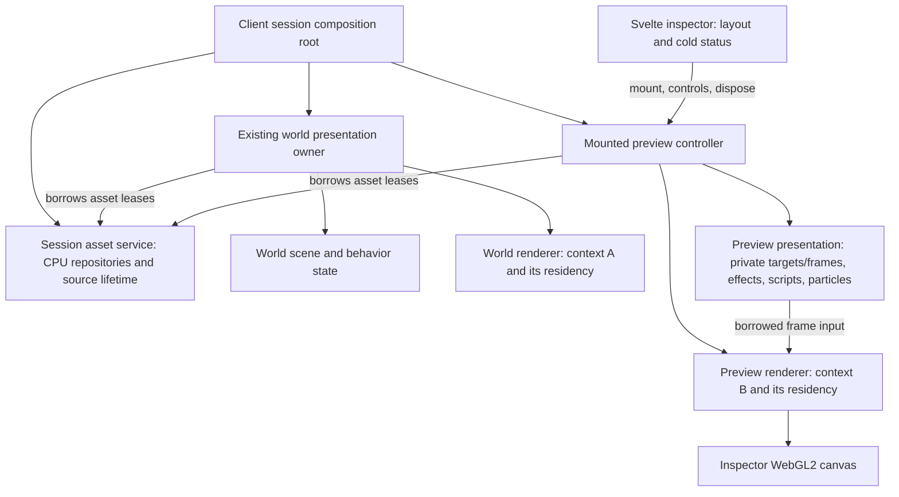

# Isolated creature preview renderer implementation plan

Status: Architecture cleanup (Phases 7–11) completed on 2026-09-18 against the delivered preview.
The user accepted the corrected particle and creature transparency before cleanup. Fresh automated
and browser evidence below verifies the refactor; interactive appearance judgment remains user-owned.
Earlier unchecked Phase 4–5 entries remain unclaimed: the original broader browser/synthetic and
interactive acceptance matrix is not established in full by this bounded architecture cleanup.

This plan supersedes the shared-context rendering and pose-only playback decisions in
[the examination plan](holtburger-3d-object-examination-plan.md), Phases 10–15. The existing
appraisal contracts, snapshot lifetime, and inspector UX remain the starting point. Unfinished
preview verification from that plan is incorporated here.

## Goal and boundaries

Render one animated creature with its authored visual effects and particles directly into a
transparent inspector canvas using a dedicated WebGL2 context, while preserving main-canvas
rendering performance and common rendering semantics.

Accepted decisions:

- One active inspection preview, with a second WebGL2 context and a 60 FPS target.
- Preserve responsive sizing, yaw-only interaction, no zoom/reset control, and name/level/type
  labels above the model in the top-left of the same component.
- Share prepared CPU asset data where existing ownership permits; own GPU residency per context.
- Reuse animation, material, visual-hook, and particle implementations. Keep preview state isolated.
- Remove the production readback path after direct-canvas integration. No selectable legacy mode.
- Protect the world renderer's optimized frame schedule and inner loops.
- No content census or context-selection experiment is required. The second context is selected.
- The user owns visual and interactive acceptance; implementation can finish its automated gates
  and hand off those remaining checks explicitly.

In scope: idle-sequence playback; animation visual hooks; setup-authored visual physics scripts;
particle dependency staging, emission, attachment, rendering and teardown; direct canvas
presentation; bounded resource ownership; framing; lifecycle/error handling; regression evidence.

Out of scope: multiple inspectors, a universal renderer/frame graph, WebGPU, moving the world
renderer into a worker, a preview worker in this slice, world simulation or network commands,
audio playback, and mirroring transient world combat/status effects into the captured preview.
These effect-scope choices are frontend presentation policy, not claims about retail inspection.

## Ground truth and current seams

Paths below are relative to the repository; browser paths start at `apps/holtburger-3d/`.

| Source                                                                                                              | What it establishes                                                                                                       |
| ------------------------------------------------------------------------------------------------------------------- | ------------------------------------------------------------------------------------------------------------------------- |
| `crates/holtburger-core/src/client/object_preview.rs`                                                               | Captured setup, appearance, scale and resolved idle sequence; no GPU or window policy                                     |
| `src/client/client-object-inspection.ts`                                                                            | One latest-request inspector and independent preview readiness                                                            |
| `src/client/ClientCreaturePreview.svelte`                                                                           | Current canvas publication, visibility, resizing and yaw interaction                                                      |
| `src/client/client-presentation-session.ts`, `ClientApp.svelte`                                                     | Current preview service is forwarded into the world runtime                                                               |
| `src/lib/game/runtime/game-presentation-runtime.ts`                                                                 | Preview staging/leases and world behavior/particle wiring; useful extraction anchors, not a second runtime to instantiate |
| `src/lib/game/runtime/object-preview-source.ts`                                                                     | Browser source contract                                                                                                   |
| `src/lib/game/animation/animation-asset-repository.ts`, `animation-playback.ts`, `prepared-dynamic-animation.ts`    | Prepared clips, hook dependencies, traversal and animation-aware fit bounds                                               |
| `src/lib/game/systems/animation-system.ts`, `physics-script-system.ts`, `effect-system.ts`                          | Existing semantic ordering and visual hook execution                                                                      |
| `src/lib/game/behavior/behavior-event-router.ts`, `physics-script-repository.ts`, `particle-emitter-repository.ts`  | Hook dispatch and prepared script/emitter closures                                                                        |
| `src/lib/game/systems/particle-system.ts`, `dynamic-entity-system.ts`                                               | Emission, persistent records, part frames, following versus detached particles                                            |
| `src/lib/game/renderer/webgl2-renderer.ts`                                                                          | Current embedded preview, object compilation/submission, optimized world scheduling                                       |
| `src/lib/game/renderer/webgl2-object-program.ts`, `object-rendering-policy.ts`, `compiled-object-draws.ts`          | Shared shader/material semantics and generation-sensitive compilation                                                     |
| `src/lib/game/renderer/webgl2-particle-pass.ts`, `particle-mesh-residency.ts`, `webgl2-particle-record-store.ts`    | Already separable particle drawing and context-local residency                                                            |
| `src/lib/game/renderer/webgl2-object-preview-readback.ts`, `object-preview-camera.ts`, `object-preview-playback.ts` | Readback and preview-specific mechanisms to replace or collapse                                                           |
| `src/harness/browser/BrowserHarnessApp.svelte`, `scripts/browser-harness.mjs`                                       | Existing reopen probe and CPU/GPU profiling infrastructure                                                                |

For gameplay/content semantics, use ACE as authoritative server evidence, ACViewer as a decoding
reference, and `acclient-eor-source/acclient.c` for client hook/particle behavior. Existing source
citations in the animation, effect, and particle systems identify relevant retail routines;
recheck them when modifying semantics. The decompile is read-only. No census is a prerequisite.
Focused local content probes are verification, not an architecture-selection exercise.

Current limitations motivating the change:

- World `drawFrame()` invokes preview rendering and readback polling.
- Preview sampling advances poses without executing visual behavior hooks.
- Preview draw inputs contain empty particle ranges.
- Completed pixels are downloaded, row-flipped, alpha-scanned and sent through `putImageData`.
- The browser probe exercises setup pose and cannot currently prove animated particle behavior.

## Architectural contracts and north stars

### Ownership by layer

| Layer                     | Owner and contract                                                                                                                                                                                                             |
| ------------------------- | ------------------------------------------------------------------------------------------------------------------------------------------------------------------------------------------------------------------------------ |
| Shared core/world/content | Preserve authoritative captured visual facts and resolved idle semantics. Add source fields only if required effects cannot be derived from already captured facts/static content. Keep content loading in its existing layer. |
| App asset preparation     | Expose leases for immutable decoded/prepared assets independently of world scene membership. GPU handles and context-specific atlas coordinates never enter these leases.                                                      |
| App preview presentation  | Own one generation, local clock, idle cursor, visual effect targets, part frames, emitters, particle records and stable fit envelope. Produce imperative draw inputs.                                                          |
| App WebGL renderer        | Own preview context, resource manager, state mirror, samplers, object submissions and particle pass. Reuse implementations through separate concrete instances.                                                                |
| Client UI                 | Own canvas mounting, cold readiness/failure state, resolution policy, yaw controls and inspector lifetime. No frame-rate Svelte publication.                                                                                   |

The preview presentation depends on asset capabilities and reusable semantics, not a live world
entity or `GamePresentationRuntime`. A captured creature remains viewable after despawn.
Shared asset preparation must have independent leases: closing either consumer cannot dispose
resources retained by the other. Do not expose the world runtime wholesale to satisfy dependencies.

Concrete ownership corrections established from current callers:

- `ObjectVisualTemplate` is a CPU artifact, but `ObjectVisualTemplateRepository` is not a pure
  CPU cache: ready entries retain atlas claims and `releaseAppearance` callbacks. Share the
  preparation result, not a world repository's ready entry. Keep separate residency owners and
  preparation-completion versus device-ready states. Preview readiness requires its own uploads.
- `ParticleMeshCache.prepare()` includes its injected GPU `install` callback and retains only
  resident IDs, not decoded batches. Reusing the world cache would incorrectly report preview
  meshes ready without installing them in its context. Use one device-install cache per context;
  share decoded mesh loads below that seam only if a bounded CPU cache is warranted.
- `#retainSetupVisual` currently owns a promise/user-set cache in the world runtime. Move that
  narrow lease mechanism to a session-owned asset service consumed by both presentations.
  Animation/script/emitter repositories may likewise be borrowed from that service. Their
  `destroySource` callbacks make destruction ownership significant: consumers release handles,
  and the session service destroys repositories/sources once after both consumers stop.
- The texture preparer is currently destroyed by the world runtime. If shared, transfer that
  destructor responsibility to the session service too. Do not hand two owners the same mutable
  source and let either independently call `destroy()`.
- Bootstrap only preview dependencies in that service; do not move terrain, portal, audio or
  all runtime dependencies into a new general-purpose service container.

### Concrete rendering and behavior seams

The world object's `#drawOpaqueObjects` and `#drawBlendedObjects` include instancing, merged
geometry, material tables, shadows and portal routing. Those loops remain world-owned. The landed
preview reuses `WebGL2DynamicAppearances`, pose pages, material policies and the extracted
`WebGL2ObjectDrawCompiler` through private instances, then submits its own small opaque/additive
range collections. This is narrower and more faithful than the proposed rigid-part schedule:
per-part translucency and texture velocity retain the same compilation semantics without putting a
preview branch or universal pass in the world hot loop. Preview geometry, textures, samplers and
compiled bindings remain context-local.

`#compileObjectDraw` formerly resolved atlas and region-detail bindings through `#world`. The
extracted compiler now accepts an explicit texture-binding resolver. The preview's narrow
residency uploads each required prepared texture independently and publishes the same pixel-unit
material rectangle contract; it does not need an atlas packer for one creature. Never borrow world
atlas placements or populate its atlas to make the preview drawable. Palettes, cutout mip behavior
and filtering remain common semantics. Region-specific static detail stays an explicit preview
policy rather than depending on whichever world region is active.

`BehaviorEventRouter` and `PhysicsScriptSystem` already accept independent `BehaviorTarget`s, while
`EffectSystem` retains its validated `SceneNodeId` API. The landed presentation does not need a
second `SceneGraph`: it owns one root target, per-part targets and a private map of complete part
frames. That smaller transform registry satisfies effects, scripts and particle attachment without
world membership or graph traversal. Synthetic node identities never leave the presentation;
`requireSceneNodeId` remains the validation boundary for the reused effect system.

The current `AnimationSystem` accepts individual tracks and an ordinary successor, not the captured
arbitrary prefix/cyclic-tail sequence. `advanceObjectPreviewPlayback` advances that sequence but
discards departed-frame events. Therefore direct reuse of either whole API is insufficient:
retain a preview sequence coordinator, reuse `PlayingClip`/`advancePlayingFrame` and pose sampling,
and extract the direction/provenance-aware departed-hook dispatcher from `AnimationSystem` for
both callers. Carry consumed time and departed events across clip boundaries explicitly; do not
recreate frame traversal, loop seam exclusions or reverse-entry rules. Keep world track scheduling
unchanged. Single-frame clips, zero rates and multi-boundary advances need explicit tests.

Prepared setup decoding already supplies `behavior.physicsScriptId` and `physicsScriptTableId`
from `defaultScriptId`/`defaultScriptTableId` in `decode-static-source-record.ts`. Use the default
script root and its `PhysicsScriptRepository.acquireClosure()` for this scope. A script table
alone does not specify a cue: do not invent a selection or snapshot live combat effects. No new
wire field is presently justified for setup defaults. Scan selected animation hooks for chained
script commands as well as `emitterInfoIds`; the latter alone does not prove the full dependency
closure is staged. Prepare all referenced visual closures before enabling their dispatch.

`ParticleSystem.collectDrawRanges()` returns reusable storage, and `takeDirtyRecordSlots()`
consumes dirty state. Borrow ranges only for the immediate preview draw; do not retain them across
another collection. Consume dirty slots only when scheduling an upload, preserving births across
skipped frames. `ParticleDrawRange` already omits world routing identity, so the preview can pass
compatible ranges directly without extending world portal-domain routing.

One active-time clock drives effects, scripts, sequence traversal, emitter commands, particle
advance and shader evaluation. Suspend that clock while hidden. Publish root/part frames before
time-zero commands can resolve attachments; preserve the existing script/animation/particle order
where shared semantics require it. Tests must state which pose a crossed-frame hook observes,
including multi-frame advances, instead of relying on rAF callback ordering.

Names such as `ObjectPreviewPresentation` and `WebGL2PreviewRenderer` describe proposed owners;
the concrete landing map below fixes their intended layers and dependency direction. Rename them
only when an existing project term is demonstrably more accurate; do not collapse their ownership
to save a file.

### Concrete file and symbol landing map

This is the default implementation shape. Deviations belong in the phase decision log with the
ownership problem they solve. In particular, do not put the preview controller back into
`GamePresentationRuntime` merely because that is where the temporary readback implementation lives.

| File                                                                                     | Intended change and layer boundary                                                                                                                                                                                                                                                                                                                      |
| ---------------------------------------------------------------------------------------- | ------------------------------------------------------------------------------------------------------------------------------------------------------------------------------------------------------------------------------------------------------------------------------------------------------------------------------------------------------- |
| `src/lib/game/runtime/presentation-asset-service.ts` (new)                               | App composition-layer owner for the narrow shared CPU facilities: setup-visual leases, `AnimationAssetRepository`, `PhysicsScriptRepository`, `ParticleEmitterRepository`, immutable object-template preparation and, if Phase 1 confirms safe sharing, `TexturePreparer`. It knows host/static sources but no canvas, scene graph, camera or UI state. |
| `src/lib/game/runtime/game-presentation-owner.ts`                                        | Construct the asset service before the world runtime, inject borrowed repositories into the runtime, publish borrowed preview resources, and destroy consumers before the asset service. Expose the resource capability through `ClientPresentationOwner`; do not expose the service container itself to Svelte.                                        |
| `src/lib/game/runtime/game-presentation-runtime.ts`                                      | Accept the shared CPU repositories it consumes and stop constructing/destroying them. Remove all `#objectPreview*` state and methods at cutover. Keep world scene, scheduling, particle cache/residency and renderer ownership here.                                                                                                                    |
| `src/lib/game/systems/object-visual-template-repository.ts`                              | Split immutable template preparation ownership from device readiness. A repository retains/releases prepared template handles, then independently owns geometry, atlas claims and appearance bindings for its context. It must not destroy a borrowed shared preparer.                                                                                  |
| `src/lib/game/preview/object-preview-assets.ts` (new)                                    | Turn `ObjectPreviewSource` plus setup facts into one rollback-safe `PreviewAssetLease`; acquire idle clips, default-script closure, animation-hook script/emitter closure and the complete emitter set. No WebGL calls or playback state.                                                                                                               |
| `src/lib/game/preview/object-preview-presentation.ts` (new)                              | Own private root/part behavior targets and complete-frame maps, active clock, idle cursor, effects, script scheduler and `ParticleSystem`. Produce a synchronous borrowed `PreviewFrame`; never schedule rAF or touch a canvas.                                                                                                                         |
| `src/lib/game/preview/object-preview-sequence.ts` (new or replacement)                   | Coordinate captured prefix/cyclic-tail playback using existing `PlayingClip` traversal and the extracted shared departed-hook dispatcher. Replace `object-preview-playback.ts` if no old consumer remains.                                                                                                                                              |
| `src/lib/game/preview/object-preview-controller.ts` (new)                                | Own one mount generation, latest viewport, rAF/cadence admission, preparation transaction, presentation, renderer and teardown. This is the only owner allowed to combine UI lifetime, active time and device readiness.                                                                                                                                |
| `src/lib/game/renderer/webgl2-preview-renderer.ts` (new)                                 | Own context B, preview-local `WebGL2ResourceManager`, standalone texture bindings, programs, state, dynamic appearance/range collections, `ParticleMeshResidency`, particle record store/pass and direct default-framebuffer draw. It receives already-resolved `PreviewFrame` data and never reads world state.                                        |
| `src/lib/game/renderer/webgl2-object-*.ts`, material/state helpers                       | Extract only concrete binding/submission helpers proven necessary by both renderers. Existing world loops remain in `webgl2-renderer.ts`; do not introduce a universal render graph or a world/preview mode branch.                                                                                                                                     |
| `src/client/client-object-preview-service.ts` (new)                                      | Own the single-active-inspector policy and pass deferred resource resolution to the mount controller. Return a mount-scoped handle synchronously, replace the prior handle deterministically, and retain pending disposal during client shutdown.                                                                                                       |
| `src/client/client-presentation-session.ts`                                              | Expose the preview service and resolve borrowed owner resources without forwarding rendering into `ClientPresentationRuntime`. Destroy the active preview before `ClientPresentationOwner` and its shared assets. Remove preview methods from `ClientPresentationRuntime`.                                                                              |
| `src/client/ClientCreaturePreview.svelte`                                                | Bind the actual WebGL canvas, open one mount handle, forward the latest viewport/yaw/visibility, and await/report `ready`. Remove `2d`, `ImageData` and `putImageData`. Component cleanup disposes its own handle, never a process-global/current preview.                                                                                              |
| `src/client/ClientApp.svelte`, `ClientWorldView.svelte`, `ClientInspectionWindow.svelte` | Pass the service unchanged. Preserve existing inspection labels/layout. Do not make these components own repositories, WebGL objects or animation clocks.                                                                                                                                                                                               |
| `src/harness/browser/BrowserHarnessApp.svelte`, `scripts/browser-harness.mjs`            | Exercise the production mount service and expose deterministic animation/particle, context-loss, stale-completion and profiling probes. Do not retain a harness-only preview architecture.                                                                                                                                                              |

Allowed dependency direction is one-way:

```text
client Svelte -> client preview service -> preview controller
                                      -> shared asset service (leases)
preview controller -> preview presentation -> reusable behavior/animation/particle systems
preview controller -> WebGL2 preview renderer -> reusable renderer/material primitives
world runtime -------------------------------> shared asset service (leases)
```

Forbidden edges are equally important: preview presentation does not import WebGL, DOM or the
world runtime; preview renderer does not import Svelte, `GamePresentationRuntime`, world scene
selection or network/session contracts; shared asset service does not import either renderer; the
world renderer does not import preview controller/presentation types. `PreviewFrame` and
`PreparedPreviewAssets` are the only preview presentation-to-renderer data shapes. Keep them in the
preview layer rather than broadening the general `Renderer` interface.

`ParticleMeshHostSource` and `ParticleMeshCache` remain separate per renderer in the first
implementation: cache readiness currently means that its injected device installation completed.
The preview may issue a duplicate host decode on first use, but it cannot mistake a world-context
hit for preview readiness. Introduce a decoded mesh repository only after measurements show that
duplicate decode materially matters. This is the deliberate narrow exception to shared CPU leases.

`TexturePreparer` contains no device handles and coalesces immutable work, so it is eligible for
session ownership. Share it only after tests prove simultaneous world/preview preparation and
shutdown ordering; otherwise construct one preparer per presentation and record that bounded
duplication. Under neither choice may `GamePresentationRuntime.destroy()` terminate a preparer
still borrowed by the preview.

### Public mount contract

Replace the current global `install` / `setViewport` / `clear` surface. A synchronous mount result
lets resize and visibility updates arrive while preparation is pending, and its identity prevents
an old component's cleanup from clearing a newer preview.

```ts
interface ClientObjectPreviewService {
  open(request: {
    readonly canvas: HTMLCanvasElement;
    readonly source: ObjectPreviewSource;
  }): ClientObjectPreviewHandle;
}

interface ClientObjectPreviewHandle {
  /** Resolves only after the first complete direct-canvas draw; rejects with a displayable cause. */
  readonly ready: Promise<void>;
  /** Last-write-wins during preparation; null suspends active time and future scheduling. */
  setViewport(viewport: PreviewViewport | null): void;
  /** Idempotently invalidates this mount and awaits its provisional/installed cleanup. */
  dispose(): Promise<void>;
}
```

`open()` synchronously invalidates the service's previous handle and returns the new handle; it
does not block the UI on old asynchronous loads. The new controller may begin CPU preparation, but
its context creation/GPU activation awaits the prior controller's device-retirement barrier. This
keeps at most one preview WebGL context live even during rapid replacement. The service tracks both
the current handle and retirement promises. Client shutdown invalidates the current handle, awaits
every retirement, then destroys the presentation owner/shared sources. A stale handle's
`setViewport` is a no-op after disposal; its `ready` promise may reject for its own caller but cannot
publish status into another component.

The Svelte component owns exactly one returned handle. Its `ResizeObserver`, pointer handlers and
visibility listener target that handle. The service owns the single-active policy, while the
controller owns the actual context and generation. This keeps Svelte out of device teardown and
keeps session code out of frame scheduling.

### Shared CPU lease shape

The service shares immutable preparation, not mutable playback or device readiness. Use existing
`PreparedAssetHandle` contracts where their key space fits. The setup/appearance composite and
object-template composite need equivalent explicitly reference-counted handles.

```ts
interface PresentationAssetService {
  acquireSetupVisual(
    setupDid: number,
    appearance: SetupVisualAppearance,
  ): Promise<PreparedAssetHandle<DecodedStaticPresentation>>;

  readonly animations: AnimationAssetRepository;
  readonly physicsScripts: PhysicsScriptRepository;
  readonly particleEmitters: ParticleEmitterRepository;
  readonly objectTemplates: ObjectVisualTemplateAssetRepository;
  readonly texturePreparer: TexturePreparer; // only when the shared-preparer gate passes

  destroy(): Promise<void>; // refuses new work, settles cleanup, destroys each source once
}
```

`ObjectVisualTemplateAssetRepository` keys by `objectVisualTemplateKey(source)` and validates the
existing source fingerprint before coalescing work. Its handle contains only
`ObjectVisualTemplate`. The world `ObjectVisualTemplateRepository` and the preview controller each
retain that handle while their own geometry/texture/appearance residency exists, then release it
after those resources retire.
This removes `InlineObjectVisualTemplatePreparer.destroy()` from device-repository ownership; the
session asset service is the sole destroyer. Never put atlas claims, resource keys, GL objects or
appearance table indices on the shared handle.

Preparation constructs one `PreviewAssetLease` transaction from smaller handles. On failure it
releases acquired handles in reverse order. A successful transaction transfers those handles to
the controller and exposes immutable assets to presentation/renderer borrowers. The lease is
released only after both borrowers dispose; callers do not individually release its internals.

### Preparation closure algorithm

Implement preparation in this order so “ready” has one unambiguous meaning:

1. Acquire the setup/appearance lease and validate its resolved setup DID. Derive the existing
   `DynamicPresentationSource`, setup pose and initial geometry bounds once.
2. Acquire the immutable object-template handle. This is CPU readiness only; no atlas or geometry
   resource is installed yet.
3. Acquire every distinct animation in the captured idle sequence. Build `PlayingClip`s with the
   captured low/high/rate values and compute the articulated geometry support cloud.
4. Reject any animation command for which `animationHookBlocksActivation()` is true. This preserves
   the existing rule that a known-missing structural/visibility effect may not silently display an
   incorrect object. Audio/gameplay-only commands remain intentionally disabled by preview policy.
5. Form script roots from the setup default `behavior.physicsScriptId` and every animation
   `call-pes` hook. Acquire `PhysicsScriptRepository.acquireClosure()` for each distinct root;
   preserve each returned closure handle even when their script maps overlap.
6. Union emitter IDs from animation `create-particle` hooks and every acquired script's
   `dependencies.emitterInfoIds`. Acquire all definitions before installing any producer.
7. Derive the unique drawable hardware-mesh IDs from prepared emitters. Retail-inert emitters add
   no mesh requirement. Particle reach does not alter the geometry-first camera support cloud.
8. Return the composite CPU lease. Context-B installation then activates visual texture/geometry
   requirements and calls its own `ParticleMeshCache.prepare(particleMeshIds)`. Only after both
   complete may presentation install producers or execute time-zero commands.

Do not read `physicsScriptTableId` without a concrete cue key. Do not recursively inspect emitter
records for scripts—they do not own script edges. `call-pes` recursion is already closed by
`acquireClosure()`. If two roots share a nested script, their closures may point at the same
repository asset; release both closure handles normally rather than manually deduplicating releases.

The stable camera fit is an articulated geometry support cloud sampled from setup and selected idle
clips at quarter-frame intervals. Root-turning assets use a rotation-invariant horizontal support.
The camera projects this immutable cloud for the current aspect/yaw and caches the result until
either changes. Particle reach is deliberately excluded: dormant or long-tailed authored emitters
otherwise shrink the creature dramatically. Exceptional live particle tails may therefore clip;
that explicit concession prioritizes a stable, close creature fit and remains a visual gate.

### Desired ownership shape

Solid arrows below express ownership or borrowed capabilities; neither renderer calls the other.
Sharing an implementation means constructing separate instances for device-dependent state.



The session owner destroys shared sources only after both consumers have disposed. The mounted
controller owns the preview canvas/context lifetime, the in-flight preparation operation and the
active presentation. Its cancellation signal cancels interest in shared loads; it must not abort
another consumer's request. Each asynchronous continuation owns its provisional leases until it
either transfers them to the current controller or releases them on stale completion/failure.

### Contract sketches and consumers

These are structural sketches, not instructions to introduce parallel versions of existing types.
Use the existing types named here wherever their contracts fit. New names identify intended seams;
do not add generic interfaces solely to reproduce this illustration.

```ts
// Cold preparation result. The controller owns the lease; presentation and renderer borrow it.
interface PreparedPreviewAssets {
  readonly visual: ObjectVisualTemplate; // Renderer uploads geometry/material texture requirements.
  readonly setupPose: readonly Mat4[]; // Presentation supplies untouched parts beneath sampled poses.
  readonly idle: PreviewIdle; // Presentation owns traversal of the captured sequence.
  readonly scripts: PreviewScriptAssets; // Script scheduler resolves staged visual commands.
  readonly emitters: ReadonlyMap<DatAssetId, PreparedParticleEmitter>; // ParticleSystem resolver.
  readonly particleMeshIds: readonly DatAssetId[]; // Preview-local cache loads/installs these IDs.
  readonly fit: ObjectPreviewFit; // Packed, stable articulated support points for analytic fitting.
}

type PreviewIdle =
  | { readonly kind: "setup-pose" }
  | {
      readonly kind: "default-idle";
      readonly clips: readonly PlayingClip[];
      readonly firstCyclicClip: number;
    };

interface PreviewScriptAssets {
  readonly defaultRoot: DatAssetId | null; // Only this root starts automatically at activation.
  readonly scripts: ReadonlyMap<DatAssetId, PreparedPhysicsScript>; // Includes hook-reachable roots.
}

interface PreviewAssetLease {
  readonly assets: PreparedPreviewAssets;
  release(): void; // Controller calls once after device/presentation consumers retire.
}

// Imperative UI input; null suspends presentation for hidden/zero-sized surfaces.
interface PreviewViewport {
  readonly extent: RenderExtent; // Renderer resolves canvas backing dimensions.
  readonly yawRadians: number; // Camera only; never changes particle simulation coordinates.
}

// Borrowed, synchronous frame input; renderer must not retain it after draw returns.
interface PreviewFrame {
  readonly clockSeconds: number; // Shared active-time epoch for materials and particle evaluation.
  readonly partToPreview: readonly Mat4[]; // Presentation has composed pose, root effects and scale.
  readonly partRenderStates: readonly PartRenderState[]; // Renderer consumes visual material effects.
  readonly particleRanges: readonly ParticleDrawRange[]; // Borrowed from this particle collection.
  readonly particleRecords: ParticleRecordFrame; // Consumed by this frame's GPU upload.
}
```

`ObjectPreviewSource` remains the cold captured input to preparation. GUID/correlation belongs at
that boundary, not in `PreviewFrame`. Camera matrices derive from the current viewport and the
prepared envelope inside the preview controller/renderer boundary; do not transport both yaw and
independently computed camera facts through separate producers. Keep FPS/filtering/resolution
configuration on the controller/device owner, rather than copying static knobs into each frame.

The asset lease sketch describes a complete preparation transaction, not one huge cache entry.
Internally it can retain the existing individual handles and release them together. Particle mesh
IDs cross this boundary, not decoded batches or device handles: the preview-local
`ParticleMeshCache` loads and installs them against context B. Preserve script-closure ownership
internally so a merged lookup cannot cause double release. Regions and atlases are absent from the
shared asset bundle.

`partToPreview` is the single final transform per authored part, in the fixed preview scene frame.
Its producer composes source scale, authored part scale, animation and visual root modifiers once.
The private attachment-frame map derives frames from those same transforms. The camera performs the
preview-to-view conversion. Avoid independently recomputing these facts in the particle resolver
and mesh renderer, or applying root scale twice.

The renderer's narrow lifecycle API should amount to asynchronous asset installation, synchronous
viewport update/draw, and disposal. Installation returns an owned device generation (or commits
one internally); it never returns world resources. A controller checks its own lifetime after each
await before activating that generation. Frame arrays may use reusable storage; readonly types do
not imply durable snapshots.

### Renderer installation and pass contract

`WebGL2PreviewRenderer.build(canvas, tuning)` requests context B with explicit alpha and
premultiplication attributes, creates its state/resource/sampler/program objects, and attaches
`webglcontextlost` before starting uploads. It must not accept a world `WebGL2Device`, resource
manager, atlas, state applicator or compiled-draw cache. Context creation failure rejects the mount
without altering the text inspection.

`install(assets)` is transactional. It stages the preview repository's template owner, installs
particle meshes and texture facts, compiles appearance bindings against context B, then atomically
publishes a device generation. A failure drops the staged owner and every resource created by that
attempt. Reinstallation/replacement does not mutate the active generation until the new one is
complete. Since the product owns one controller, this two-generation overlap is bounded to one
old plus one provisional generation inside one context.

One admitted draw performs the following concrete order:

1. Resize the canvas backing store if the resolved physical extent changed; set viewport and clear
   transparent color plus depth. No intermediate color framebuffer is part of the default path.
2. Resolve the analytic camera from stable articulated support points, current extent and yaw.
   Cache the transform until extent or yaw changes; there is no pixel-readback refinement.
3. Upload only dirty pose/material and particle-record ranges. Initial installation performs a full
   upload, making recovery after a consumed-dirty failure unnecessary within a generation.
4. Submit compiled dynamic object opaque/cutout work with depth writes, then translucent/additive
   work with the shared material ordering and depth policy.
5. Submit particle ranges through the preview instance of `WebGL2ParticlePass`, retaining depth
   testing and authored blend/orientation semantics. Its record store and mesh resolver are both
   context-B instances.
6. Flush no readback and publish no pixels. A successful return is the presentation fact that may
   resolve `ClientObjectPreviewHandle.ready` on the first frame.

The synthetic alpha fixture must lock the chosen canvas attributes and resulting RGB/alpha blend
factors into tests. The world renderer keeps its current defaults unless the extracted state API is
called with an explicit alternate alpha policy. Texture filtering uses the same policy resolver and
sampler implementation but separate sampler objects, because WebGL objects are context-local.

### Ordered retirement contract

Controller disposal and failure use the same idempotent retirement path. “Cancel” means invalidate
publication; host calls may be non-cancellable and must still settle into owner-controlled cleanup.

| Order | Required action                                                                                                                           | Why this order is fixed                                                |
| ----- | ----------------------------------------------------------------------------------------------------------------------------------------- | ---------------------------------------------------------------------- |
| 1     | Mark generation disposed, clear latest viewport and cancel queued rAF.                                                                    | No new advancement/draw/publication may start.                         |
| 2     | Detach DOM/context event listeners and reject/settle this handle's unresolved `ready`.                                                    | Prevent callbacks from re-entering teardown or a later mount.          |
| 3     | Uninstall animation/script producers, router targets and emitters; destroy preview particles and clear private frames.                    | Producers must stop before their immutable definitions disappear.      |
| 4     | Await/retire provisional GPU installation, drop template owner, particle residency, programs, buffers, textures, state and context owner. | Device work still borrows CPU assets and frame records.                |
| 5     | Release the composite `PreviewAssetLease`.                                                                                                | CPU handles outlive all presentation/device borrowers.                 |
| 6     | Resolve the controller's device-retirement barrier.                                                                                       | Only now may the service allow the next preview context to be created. |

Session shutdown first closes the preview service and awaits all controller retirements, then
destroys `GamePresentationRuntime`, then destroys the shared asset service and its sources, and
finally closes the remaining owner/transport resources according to their dependency order. If
world runtime and preview both borrow the shared texture preparer, destroy it after both; if they
have separate preparers, each consumer destroys its own. Aggregate cleanup failures with named
owners as `PresentationTeardownStack` already does rather than stopping after the first failure.

### Activation and publication flow

```mermaid
sequenceDiagram
    participant UI as Inspector/controller
    participant A as Session CPU assets
    participant P as Preview presentation
    participant R as Preview renderer/context B
    UI->>UI: Capture lifetime token and source; show loading
    UI->>A: Acquire setup, idle and visual dependency closure
    A-->>UI: Prepared lease (may share CPU data with world)
    UI->>UI: Check lifetime; release immediately if stale
    UI->>R: Install preview-local GPU resources
    R-->>UI: Device-ready generation
    UI->>UI: Check lifetime; dispose generation if stale
    UI->>P: Install private targets/frames, effects, scripts and emitters
    P->>P: Publish initial part frames before dispatch can emit
    UI->>P: Start active-time clock at zero
    UI->>R: Draw first complete frame
    R-->>UI: Successful submission; publish cold ready status
    loop While visible, drawable and cadence admits a frame
        UI->>P: Advance using active time
        P-->>UI: Borrowed transforms, effects, particle ranges/records
        UI->>R: Draw synchronously with current viewport
    end
    UI->>UI: Close/replacement invalidates token and cancels callbacks
    UI->>P: Stop producers, retire targets and particles
    UI->>R: Retire uploads and dispose device generation/context owner
    UI->>A: Release CPU lease after borrowers retire
```

Every failure branch reports cold preview failure while preserving appraisal. An upload operation
must clean up its own partial resources before rejecting. A stale completion performs cleanup
without publishing failure or readiness into a newer inspector. GPU installation may complete
while hidden, but activation/display waits for a drawable viewport. No time-zero effects are
repeated merely because the viewport becomes visible again.

### Frame flow and timing contract

```mermaid
flowchart LR
    Gate[Visibility and 60 FPS admission] --> Clock[Advance active-time clock]
    Clock --> Effects[Advance existing visual effects]
    Effects --> Scripts[Advance script clocks and dispatch due records]
    Scripts --> Particles[Advance existing particles]
    Particles --> Animation[Traverse idle clips and dispatch departed-frame hooks]
    Animation --> Pose[Sample pose and effects; publish root and part frames]
    Pose --> Records[Collect ranges and consume dirty records for upload]
    Records --> Draw[Object and particle passes; direct canvas presentation]
```



This order matches the existing runtime's effects → scripts → particles → animation → presentation
publication ordering. During advancement, attachment lookups observe the previously published
complete pose; initial installation publishes the setup/entry pose first. Animation-created
emitters resolve that published pose at creation; current following frames are available after
pose publication for collection. Keep that ordering explicit in a synthetic test. If source-level
retail evidence motivates changing it, treat that as a separate semantic decision rather than an
incidental consequence of the preview extraction.

Cadence rejection occurs before advancing this frame or taking dirty records. The next admitted
frame advances by elapsed active time, preserving crossed hooks. Hidden time is excluded by
rebasing the wall-clock anchor on resume. Existing bounded discontinuity/runaway handling remains
applicable to large foreground stalls; do not enqueue render catch-up frames. If upload/draw fails
after dirty state is consumed, transition to failure and retire that device generation; any future
reinstallation performs a complete initial record upload.

### Controller lifecycle

```mermaid
stateDiagram-v2
    [*] --> Preparing: mounted with captured source
    Preparing --> Active: prepared and uploaded; visible; first draw succeeds
    Preparing --> Suspended: prepared and uploaded; viewport unavailable
    Preparing --> Failed: preparation, upload or context failure
    Active --> Suspended: document hidden or extent unavailable
    Suspended --> Active: viewport available; start or resume active clock
    Active --> Failed: draw or context failure
    Suspended --> Failed: context failure
    Preparing --> Disposed: close, replacement or session exit
    Active --> Disposed: close, replacement or session exit
    Suspended --> Disposed: close, replacement or session exit
    Failed --> Disposed: close, replacement or session exit
    Disposed --> [*]
```



The lifecycle diagram combines asset readiness with drawing admission; visibility during
`Preparing` is remembered as the latest viewport input. `Suspended` retains a device-ready
presentation that may either be awaiting its first frame or paused after activation. Cold UI
readiness changes only after the first successful draw, so an initially hidden preview does not
pretend it has displayed a model. On resuming an already activated presentation, retain its clock,
view and particles. `Failed` releases owned work/resources and retains only diagnostic/UI state.

Replacement creates a new controller lifetime after old ownership has been invalidated and
retirement initiated. Old asynchronous preparation may still settle; it owns cleanup of those
provisional results. Never reuse its GPU handles or completion callbacks in the new lifetime.
Session shutdown additionally drains those pending cleanup operations before destroying sources.
Disposal is idempotent at the controller boundary even where individual leases reject double release.

### Minimum scenario-to-invariant map

| Scenario                            | Required implementation result                                                      |
| ----------------------------------- | ----------------------------------------------------------------------------------- |
| World already has the same creature | CPU lease may hit; context B still installs its own GPU generation                  |
| Close during CPU load               | Stale completion releases its lease; no context upload or UI publication            |
| Close during GPU upload             | Upload continuation retires provisional context-B resources; world remains drawable |
| Resize/yaw during preparation       | First draw uses latest viewport; assets are not acquired again                      |
| Hide before first draw              | Device-ready state is retained; no elapsed hidden simulation or premature ready UI  |
| Hide after activation               | Clock/particles pause coherently; resume avoids replaying time-zero commands        |
| Hook crosses a clip boundary        | Correct authored order/direction, one dispatch per permitted departure              |
| Preview draw opportunity skipped    | Dirty particle records survive until an actual upload                               |
| Creature despawns                   | Captured source and independent leases remain valid                                 |
| Preview context lost                | Preview fails/cleans up; world context and text inspector survive                   |
| Session exits with a pending load   | Both consumers retire, pending cleanup drains, then shared sources destroy once     |

### Main-canvas performance invariants

- Keep world scene selection, batching, portal routing, pose uploads, atlas policy and frame
  ordering intact. No preview mode switches, per-draw adapters, record unions or cross-context
  resource lookups are added to world hot paths.
- Extract concrete shared operations at preparation or pass boundaries. Preserve reusable scratch
  storage, compiled draw caches, incremental uploads, shader variants and state suppression.
- `WebGL2ParticlePass` already supports separate instances. Do not generalize world particle
  submission merely to host preview particles.
- Object drawing is more coupled. Prefer existing shader/material helpers and a narrow concrete
  extraction. Small preview-specific scheduling code is acceptable; duplicated material semantics
  are not. Stop and narrow the extraction if it changes the world inner loops unnecessarily.
- Closed preview adds no recurring world-frame work or active preview callback. The final world
  renderer owns no preview target, readback queue, preview state or preview draw invocation.
- Opening/resizing/closing the preview cannot invalidate world GPU residency, atlas placement,
  compiled draws or device-state caches. Additional shared CPU asset leases are permitted.
- Second-context drawing still consumes the same CPU/GPU resources. Separate requestAnimationFrame
  callbacks do not establish GPU priority. Use a bounded preview cadence with missed-frame dropping;
  measure contention rather than claiming scheduling guarantees or adding a global scheduler.
- Profiling is opt-in and uses existing harness infrastructure wherever possible.

### Visual semantics and concessions

- Reuse exact idle prefix/tail, reverse/zero-rate, partial-pose and hook traversal semantics.
  Thirty displayed frames per second must not mean skipping hooks on crossed authored frames.
- Stage animation emitters and setup-script closures, including nested visual dependencies, before
  activation. Dispatch visual effects to preview-local targets. Audio and gameplay consumers are
  explicitly disabled; unsupported visual behavior is reported rather than silently dropped.
- Emitters use the authored whole-object or part frame with coherent scale/rotation. Detached
  particles retain spawn frames; following particles use current frames. Camera yaw changes the
  view, not the simulation's coordinate system.
- Use a fixed preview-local scene origin with the project's branded coordinate contracts.
  Do not register fake world residents or route through world visibility selection.
- Camera fit uses animation-aware geometry plus a stable, capped emitter envelope. Do not zoom in
  response to individual particle births/deaths. Exceptional particle tails may clip; creature
  geometry must remain framed. Retain the user's close-fit requirement and verify it across aspect
  ratios rather than silently replacing pixel calibration with visibly loose bounds.
- Transparent composition must handle cutouts, translucent meshes and additive particles. Verify
  premultiplied-alpha behavior over both dark and light DOM backgrounds. If an authored blend mode
  cannot be represented faithfully by one transparent canvas layer, document the concrete case
  and obtain a product decision; do not silently omit or darken that effect.
- Pause when hidden or without usable extent. Resume without an unbounded catch-up burst.
- Missing idle retains the explicit setup-pose case; missing assets/context failure leaves readable
  appraisal and an honest preview failure state. Match existing restart/reopen recovery policy;
  seamless context restoration is outside this slice.

### Resolution and allocation

Keep the existing FPS, maximum width/height and resolution-scale knobs, currently 60 FPS and
768×576 with the current density policy. Those remain tuning values, not hardcoded test expectations.
The renderer receives a resolved physical extent; only frontend policy reads device pixel ratio.

Direct default-framebuffer drawing is the starting point. It needs no PBOs or dedicated offscreen
color target. Resize the canvas backing store only when its resolved extent changes, coalescing
ResizeObserver updates to the next preview frame. CSS may stretch the last frame during a drag.
Preallocating a maximum-size texture is useful only if an intermediate target has a demonstrated
consumer; it does not avoid resizing a directly presented canvas without cropping/aspect policy.
Do not render the maximum pixel count merely because the window is smaller.

## Implementation phases

### Compilable migration sequence

Each row is an intended green checkpoint, not a second implementation path:

| Checkpoint | Repository state                                                                                                                                                                      |
| ---------- | ------------------------------------------------------------------------------------------------------------------------------------------------------------------------------------- |
| 1A         | Baseline/probes recorded; current readback behavior unchanged.                                                                                                                        |
| 2A         | Shared CPU service exists and the world runtime consumes borrowed repositories; preview still uses the old route. Ownership/unit tests and closed-preview performance are green.      |
| 2B         | Immutable object-template handles feed the existing world device repository; no preview renderer yet. World rendering and teardown remain green.                                      |
| 3A         | Preview asset preparation, presentation clock/hooks/private frames/particles run under synthetic unit tests, with no production canvas owner.                                         |
| 4A         | Dedicated renderer draws deterministic synthetic assets into a harness canvas with correct alpha, filtering and particles; product inspector still uses its old route.                |
| 4B         | One atomic product cutover replaces the client service/component contract and removes preview calls/state from world runtime/renderer. There is never a shipped selectable dual mode. |
| 5A         | Production lifecycle/performance probes and local-content diagnostics pass.                                                                                                           |
| 6A         | Readback files/contracts and temporary compatibility vocabulary are deleted; full checks and user handoff remain.                                                                     |

If checkpoint 2A cannot stay green without per-frame world indirection, stop and revise the shared
seam. If 4A cannot represent an authored blend mode over transparent DOM, stop with the concrete
fixture/result before 4B. Other failures remain ordinary implementation work within the named phase.

### Phase 1 — Establish the baseline and minimum extraction boundary

Deliverables: harness measurement configuration, recorded baseline evidence in this document, and
a concrete list of shared object operations and immutable asset leases to extract.

- [x] Inspect current dirty changes and preserve unrelated work/submodule state.
- [x] Record closed/open preview baseline on hardware using the existing harness. Include outdoor
      and portal/interior world workloads, fixed camera/interest, filtering, resolution and hardware.
- [x] Measure closed, open, rotating, resizing and cold/repeated-open cases. Record CPU frame p50/p95,
      world phase GPU costs, allocations/GC evidence, draw/upload counts, open latency and frame gaps.
- [x] Use repeated paired runs (at least five per performance comparison), normalize work per frame,
      and record spread. Establish the observed noise envelope before judging regressions. SwiftShader
      may establish correctness but cannot establish hardware performance.
- [x] Trace immutable asset ownership versus world GPU atlas/geometry ownership. Identify any
      material/texture preparation that embeds device-specific facts and separate that boundary.
- [x] Trace setup-script selection and idle visual hooks using existing source references. Establish
      required snapshot facts without scanning all content or reopening the chosen context decision.

Acceptance: reproducible baseline/configuration exists, each proposed extraction has a named world
and preview consumer, and required effect facts have an identified source. This phase introduces no
production rendering behavior changes.

#### Baseline evidence recorded 2026-09-17

Hardware: AMD Radeon RX 7900 XT through ANGLE/Vulkan RADV, Chrome stable, 1280×720 CSS/device
pixels, render scale 1, anisotropic 2× filtering, AO and shadow maps enabled. The subject was WCID
11528 in a 256×192 preview at 30 FPS. `--object-preview-benchmark-pairs 5` alternated and reversed
closed/open order in one settled browser session, with 1,000 ms warmup and 3,000 ms measurement per
window. Renderer profiling was reset for each window. The harness addition is diagnostic-only and
drives the current production readback route.

| Workload / metric                           | Closed mean (five windows) | Open mean (five windows) | Open − closed | Observed window range                |
| ------------------------------------------- | -------------------------: | -----------------------: | ------------: | ------------------------------------ |
| Outdoor frame work                          |                   0.143 ms |                 0.267 ms |     +0.123 ms | closed 0.138–0.147; open 0.251–0.290 |
| Outdoor renderer CPU total                  |                   0.125 ms |                 0.247 ms |     +0.122 ms | closed 0.121–0.127; open 0.232–0.269 |
| Outdoor attributed GPU total                |                   0.144 ms |                 0.159 ms |     +0.015 ms | closed 0.135–0.148; open 0.154–0.166 |
| Outdoor worst frame work per window         |                    2.62 ms |                 13.74 ms |     +11.12 ms | closed 1.5–3.1; open 12.4–15.8       |
| Portal/interior frame work                  |                   0.486 ms |                 0.807 ms |     +0.321 ms | closed 0.475–0.500; open 0.785–0.836 |
| Portal/interior renderer CPU total          |                   0.448 ms |                 0.767 ms |     +0.318 ms | closed 0.439–0.459; open 0.747–0.795 |
| Portal/interior attributed GPU total        |                   0.425 ms |                 0.571 ms |     +0.146 ms | closed 0.422–0.433; open 0.561–0.582 |
| Portal/interior worst frame work per window |                    4.54 ms |                 17.50 ms |     +12.96 ms | closed 4.4–4.7; open 17.0–18.3       |

Outdoor command shape: default `0xda55ffff`, WCID 11528, `--gpu --profile-renderer
--object-preview-benchmark-pairs 5 --measure-ms 3000 --settle-ms 5000`. Portal/interior command
adds landblock `0x7d64ffff`, radius 1 for buildings/env-cells/explicit/generated, camera
`0x7d640113` at `24078.5,13.7,-19328.25`, pitch/yaw 0 and portal frame mode.

The current renderer invokes preview work inside `drawFrame()`. CPU profile total therefore includes
preview work, largely as unattributed/other time. Preview GPU commands do not have their own query
scope, so attributed GPU total is world-phase timing plus queue/contention effects, not a direct
measurement of preview GPU duration. Last-frame draw counters also alternate between capture and
non-capture frames and are not normalized 30 FPS totals. Preserve the paired timing baseline, but
add dedicated context-B counters/timers before using draw/upload counts for final comparison.

The production lifecycle probe on the same outdoor workload measured: cold install 0.8 ms and
first downloaded frame 7.7 ms; resize from 256×192 to 320×160 plus yaw change reached its first
downloaded frame in 35.7 ms without reinstalling assets; repeated open installed in 0.2 ms and
reached its first frame in 5.4 ms. Each close-fit settled sample intentionally waited for 30
published frames (about one second), so that duration is probe policy rather than open latency.
All three samples had transparent backgrounds, non-uniform model pixels and no GL errors.

The existing frame profiler supplies recent p95 CPU total and long-frame evidence but no allocation
timeline. Current ownership counters showed one 7,372,800-byte world flat-scene target both closed
and after preview cleanup; the preview target exists only during capture. Phase 4 adds preview-local
allocation/upload counters, and Phase 5 should sample browser heap/GC if contention remains after
readback removal rather than adding a permanent collector preemptively.

The closed-window spread is the initial noise envelope, not a permanent percentage allowance.
Phase 2 repeats the exact commands after extraction. Any consistent closed-preview shift larger
than these observed ranges requires investigation; do not average it away with the intentional
open-preview workload.

#### Phase 2A ownership-extraction gate recorded 2026-09-17

After moving setup, animation, physics-script, emitter and texture preparation under the
session-owned `PresentationAssetService`, the same five-pair commands produced:

| Workload / metric                           | Closed mean | Open mean | Open − closed | Observed window range                |
| ------------------------------------------- | ----------: | --------: | ------------: | ------------------------------------ |
| Outdoor frame work                          |    0.153 ms |  0.273 ms |     +0.120 ms | closed 0.137–0.169; open 0.250–0.311 |
| Outdoor renderer CPU total                  |    0.134 ms |  0.253 ms |     +0.120 ms | closed 0.120–0.148; open 0.231–0.289 |
| Outdoor attributed GPU total                |    0.144 ms |  0.160 ms |     +0.017 ms | closed 0.139–0.152; open 0.154–0.171 |
| Outdoor worst frame work per window         |     2.70 ms |  13.42 ms |     +10.72 ms | closed 2.1–3.2; open 11.8–15.2       |
| Portal/interior frame work                  |    0.486 ms |  0.802 ms |     +0.317 ms | closed 0.470–0.498; open 0.776–0.822 |
| Portal/interior renderer CPU total          |    0.448 ms |  0.763 ms |     +0.315 ms | closed 0.432–0.460; open 0.739–0.779 |
| Portal/interior attributed GPU total        |    0.442 ms |  0.565 ms |     +0.124 ms | closed 0.416–0.463; open 0.541–0.591 |
| Portal/interior worst frame work per window |     4.62 ms |  18.26 ms |     +13.64 ms | closed 4.4–4.9; open 16.6–19.9       |

Closed frame work and renderer CPU remain inside or immediately adjacent to the baseline ranges,
with no recurring preview work added while closed. GPU variation is not directional across both
scenes and remains subject to the query/contention caveat above. The extraction therefore passes
the gate; repeat it after the object-rendering seam is moved.

After splitting immutable object-template preparation from per-context residency and extracting
the concrete `WebGL2ObjectDrawCompiler`, the same paired gate measured 0.141 ms closed / 0.246 ms
open outdoor frame work and 0.123 ms closed / 0.227 ms open outdoor renderer CPU. Portal/interior
measured 0.491 ms closed / 0.799 ms open frame work and 0.454 ms closed / 0.759 ms open renderer
CPU. Closed attributed GPU means were 0.139 ms outdoor and 0.441 ms portal/interior. The main
renderer retained identical draw counters. These values remain within the established spread, so
the concrete compiler seam passes without adding a preview branch or per-frame adapter.

### Phase 2 — Extract concrete shared preparation and draw operations

Deliverables: minimal asset lease seams and concrete reusable object rendering operations under
`src/lib/game/`; existing world consumers remain functional.

- [x] Hoist immutable preparation only where currently trapped inside world ownership. Keep existing
      reference-counted repositories; avoid a new generic asset framework.
- [x] Move setup leases and chosen shared repository/source destructors to the client-session asset
      owner. Update world bootstrap/shutdown and preview dependency injection together; independently
      test consumer release versus final service destruction, including asynchronous installation.
- [x] Extract the required object compilation/material/submission operations mechanically, or reuse
      existing lower-level helpers if that is sufficient. Preserve per-context caches and shader policy.
- [x] Reuse `ParticleMeshResidency`, `WebGL2ParticlePass`, record storage, sampler catalog and resource
      manager as separate concrete instances; keep their world invocation contracts intact.
- [x] Keep `ObjectVisualTemplateRepository` atlas readiness and `ParticleMeshCache` GPU readiness
      context-local. A CPU preparation hit must still await the preview's GPU installation.
- [x] Add focused ownership/material tests where behavior crosses the new seam. Run existing object,
      particle, portal and texture tests plus representative browser rendering checks.
- [x] Repeat closed-preview world measurements before introducing the dedicated preview workload.
      Compare draw/upload work as well as timing. A repeatable regression outside baseline variability
      blocks this extraction; narrow or revise it and rerun the affected comparison.

Acceptance: shared semantics have one implementation, world rendering retains its scheduling and
hot-loop structure, and mechanical extraction passes correctness and measured regression gates.

### Steering checkpoint — Review the cost of sharing

- [x] Review actual source-line delta, call sites, allocations and device ownership. Remove speculative
      interfaces and per-object indirection introduced during extraction.
- [x] Dry-run the remaining flow from snapshot through asset leases, hooks, particle records, direct
      presentation and teardown. Confirm that no step requires world scene membership.
- [x] Narrow or split subsequent phases if necessary. The dedicated context remains the decision;
      performance protection takes precedence over forcing both frame loops into one abstraction.

### Phase 3 — Build isolated creature presentation with particles

Deliverables: a preview presentation owner and focused synthetic tests; source-contract extensions
only if Phase 1 proved necessary.

- [x] Prepare the captured setup/appearance, full selected idle sequence, visual script closure,
      emitter definitions and particle mesh IDs through independent CPU asset leases with failure
      rollback. Mesh/texture device readiness remains Phase 4 renderer work.
- [x] Replace pose-only preview advancement with reusable semantic traversal and preview-local hook
      dispatch. Preserve prefix/tail and direction semantics without copying a second hook interpreter.
- [x] Implement the private transform registry and sequence coordinator described above. Extract only
      the common departed-hook dispatcher; include this world call-site change in regression checks.
- [x] Own visual effects, part frames and a separate particle system/record namespace. Feed current
      part transforms to emitters and keep detached particle positions stable as the creature animates.
- [x] Build a stable articulated geometry support cloud and expose only data the camera consumes.
- [x] Guard asynchronous completion by preview/session generation. Implement close, replacement,
      hidden/resume, partial failure and source-despawn behavior with explicit lease release.
- [x] Define disposal order: invalidate generation and cancel scheduling; unregister hook producers
      and emitters; retire pending GPU installation and release installed device resources; release CPU
      leases. Session shutdown awaits consumer disposal before destroying shared repositories/transport.
      Check generation both before and after awaited uploads so late work cannot revive a closed canvas.
- [x] Test hooks crossing multiple frames, reverse playback, repeated loops, emitter stop/destroy,
      part attachment, detached/following behavior, script dependencies and stale completion disposal.

Acceptance: synthetic animated content produces the expected visual effects and particle records
without world behavior targets, audio or network actions. Every asset and emitter has bounded
ownership and teardown. Display cadence does not alter authored hook traversal.

### Phase 4 — Implement direct preview rendering and integrate the inspector

Deliverables: dedicated context renderer, production component/service integration, synthetic
browser fixture and removal of the old production route.

Execute in two compilable steps: first prepare the renderer and synthetic canvas fixture without
connecting a second product mode; then atomically change client service/component ownership and
remove the old production route. The fixture validates alpha and context separation before UI
cutover, not after the existing path has already been removed.

- [x] Create one transparent WebGL2 canvas/context for the active preview. Allocate only required
      object/particle GPU assets and programs; do not instantiate a second world runtime/renderer.
- [x] Draw object opaque/cutout/translucent passes and particle ranges with common material policy,
      texture filtering, depth and blend behavior. Keep context-specific state/residency private.
- [ ] Prove cutout/translucent/additive composition over light and dark DOM backgrounds before
      claiming particle support complete. Verify model depth occlusion and camera-facing billboards.
- [x] Audit `WebGL2DeviceStateApplicator.applyBlend`: it formerly used `blendFunc`, sharing RGB
      factors with alpha. A transparent canvas needs independently correct accumulated coverage.
      Choose explicit context alpha/premultiplication attributes and verify RGB plus alpha with a
      tiny synthetic GPU fixture. Any reusable alpha-policy extension must preserve existing world
      blending by default and avoid a new per-object preview branch.
- [x] Connect imperative camera, extent and visibility inputs to a bounded 60 FPS controller.
      Drop missed presentation opportunities instead of accumulating render callbacks.
- [x] Preserve existing labels, yaw/keyboard/pointer behavior, responsive layout and loading/failure
      states in `ClientCreaturePreview.svelte` and its inspector owners.
- [x] Change preview service ownership in `ClientApp.svelte` / presentation session wiring so the
      preview is no longer forwarded through `GamePresentationRuntime` for rendering or simulation.
- [x] Remove world preview install/draw/poll/state paths as direct production presentation lands.
      Keep portal-specific isolated drawing consumers working through their existing semantics.
- [x] Handle preview context loss and teardown independently; cancel scheduling and report the
      failure without destroying the world context or readable inspection facts.
- [x] Specify context lifetime across inspector replacement: synchronously invalidate the old
      owner, allow new CPU preparation, but await the old device-retirement barrier before creating the
      replacement context. Remove event handlers and release GPU resources explicitly. Exercise many
      consecutive mounts; do not rely solely on eventual canvas garbage collection to bound contexts.
- [ ] Test close/reopen, source replacement, resize while loading, document visibility, two-context
      resource isolation, missing assets and preview context loss in the browser harness.

Acceptance: the actual inspector displays an animated model and particles directly, without an
image-download publication path. World rendering is unchanged by preview resource lifecycle, and
closed previews have no recurring render callback or world-frame preview work.

### Phase 5 — Performance and integration gates

Deliverables: comparative evidence and complete automated acceptance; extend
`probeObjectPreviewLifecycle` to exercise the new production owner and animated synthetic effects.

- [x] Repeat Phase 1 hardware workloads and record closed/open/rotating/resizing/reopening results.
      Separate extraction regression from the additional visible particle workload and context uploads.
- [x] Closed-preview acceptance: no extra world draw/upload work, no preview callbacks/resources,
      and no repeatable world frame regression outside the recorded baseline variability.
- [x] Open-preview evidence: report effective preview FPS, world frame p95/gaps, preparation/upload
      spikes and duplicated GPU residency. Thirty FPS is a target, not proof of GPU scheduling priority.
      Investigate repeatable world regressions; do not hide them in average preview timings.
- [ ] Use deterministic synthetic idle-animation and setup-script particle fixtures for durable
      tests. Include part-following and detached particles, zero-particle setup-pose fallback,
      transparency, stale asset completion, close/reopen and pause/resume.
- [ ] Include two-context tests where a shared CPU asset is ready but preview upload is delayed or
      fails; closing either consumer must leave the other drawable. Verify dirty particle records
      survive a skipped draw and late mesh upload cannot install after disposal.
- [x] Exercise local content diagnostically, including WCID 11528 and a verified particle-bearing
      creature. Record IDs, source of effects and commands. Retained automated tests must not require
      untracked DAT assets.
- [ ] Verify both popup overlap orders, gesture ownership, viewport aspect extremes, world rendering
      during preview failure and release counts over repeated replacement cycles.

Acceptance: extraction and lifecycle invariants pass, hardware evidence supports the closed-preview
performance requirement, and any remaining open-preview cost is measured and explained. A material
unresolved regression is a blocker rather than a silently accepted tradeoff.

#### Final direct-context evidence recorded 2026-09-18

The production shape is now:

```text
ClientCreaturePreview (canvas + viewport/yaw)
  -> ClientObjectPreviewService (one active mount; replacement barrier)
    -> ObjectPreviewController (preparation + active clock + 60 FPS admission)
      -> ObjectPreviewPresentation (private targets/frames + shared behavior systems)
      -> WebGL2PreviewRenderer (context B + private GPU residency)

PresentationAssetService (session-owned immutable CPU leases)
  <- world presentation
  <- preview controller
```

The direct renderer intentionally uses no intermediate color target, PBO, fence, GPU readback,
row flip, alpha scan or 2D-canvas publication. The harness alone requests
`preserveDrawingBuffer` and reads the default framebuffer for assertions. Production draws to a
premultiplied transparent default framebuffer. `WebGL2DeviceStateApplicator` retains the world's
existing RGB/alpha behavior by default; the preview opts into context-wide coverage alpha with
`blendFuncSeparate`, avoiding a branch in object submission.

Landed deviations from the initial sketch are decisions, not implementation gaps:

- Dynamic appearance compilation/ranges replaced the proposed rigid-part schedule, preserving
  shared translucency, texture velocity and material semantics while leaving world loops intact.
- A private behavior-target/frame registry replaced the proposed private `SceneGraph`; no preview
  operation requires world membership or general graph traversal.
- Standalone preview texture residency replaced private atlas packing. Material rectangles remain
  pixel-valued, which fixed the initially blank WCID 11528 path.
- Articulated geometry support points replaced geometry-plus-emitter bounds. This fills the panel
  reliably; exceptional particle tails may clip instead of shrinking every creature.

Hardware comparison used the same AMD Radeon RX 7900 XT, Chrome/ANGLE/Vulkan, 1280×720, render
scale 1, five reversed 3-second pairs and WCID 11528 as the baseline:

| Workload / metric                | Closed mean |   Open mean | Open − closed | Observed window range                            |
| -------------------------------- | ----------: | ----------: | ------------: | ------------------------------------------------ |
| Outdoor frame work               | 0.140229 ms | 0.140705 ms |  +0.000476 ms | closed 0.139574–0.141268; open 0.136867–0.142768 |
| Outdoor renderer CPU             | 0.122688 ms | 0.123086 ms |  +0.000398 ms | paired five-window run                           |
| Outdoor attributed GPU           | 0.137499 ms | 0.138212 ms |  +0.000713 ms | paired five-window run                           |
| Outdoor worst frame work         |     2.34 ms |     2.28 ms |      −0.06 ms | five-window means                                |
| Portal/interior frame work       | 0.497237 ms | 0.491041 ms |  −0.006196 ms | closed 0.482452–0.510592; open 0.483340–0.498723 |
| Portal/interior renderer CPU     | 0.458864 ms | 0.453003 ms |  −0.005861 ms | paired five-window run                           |
| Portal/interior attributed GPU   | 0.449498 ms | 0.453348 ms |  +0.003850 ms | inside observed spread                           |
| Portal/interior worst frame work |     4.90 ms |     5.46 ms |      +0.56 ms | closed 4.6–5.2; open 4.8–6.2                     |

Main-renderer draw/upload counters were identical between open and closed windows. Effective
preview cadence was 29.6667–30 FPS outdoors and 29.6667 FPS in the portal workload. WebGL does not
provide a reliable allocation-byte query; the bounded overhead is therefore recorded structurally:
one active preview context owns one creature's geometry, required standalone textures, programs,
samplers, pose/material tables and particle meshes/records, all retired before a replacement
context activates. No maximum-size color surface is allocated.

The local-content lifecycle probe for Elaniwood Golem (WCID 11528) passed cold open, yaw, resize,
close/reopen and forced preview context loss with transparent background and no GL errors. At
256×192 its visible model height was 169 pixels initially and 166 pixels after reopen; at 320×160
it was 141 pixels. Suspending the viewport held renderer frame count at 2 and resuming advanced it
to 3. Forced `WEBGL_lose_context` reported preview context lost while the world context remained
live. Fire Elemental Flicker (WCID 5705) exercised authored effects with 97 drawn particles at
29.6667 FPS and no browser errors.

The 2026-09-18 transparency follow-up separated additive emission from surface coverage. The
preview shader encodes emitted RGB as a normalized color plus derived coverage; separate RGB and
alpha blend factors reconstruct the authored additive contribution while leaving a valid
premultiplied canvas for DOM composition. Ordinary translucent surfaces continue accumulating
source-over coverage. WCID 5705 produced 6,257 visible, partially-transparent pixels with no RGB
hidden behind zero alpha, including 97 particles. WCID 1758 proved the separate regular-surface
path: its authoritative whole-object translucency is now captured in the preview-source contract,
and all 5,728 visible pixels carried partial coverage at translucency 0.5. The preview ceiling was
raised to 60 FPS after readback removal; an RX 7900 XT paired hardware sample held exactly 60
preview FPS with 97 particles, with open world frame work (0.174873 ms) inside the closed sample
(0.176690 ms). The browser oracle rejects both empty output and RGB without alpha coverage.

Durable automated coverage owns asset rollback, shared-lease lifetime, latest viewport forwarding,
replacement activation barriers, setup-script particle creation, sequence boundaries/direction,
camera fit, alpha-state policy and disposal. Exact appearance, attachment, panel-background
composition, perceived continuity and gestures remain the user's visual/interactive gates; local
DAT-dependent browser probes are diagnostic and are not retained as unit-test dependencies.

### Phase 6 — Cleanup, final checks and handoff

- [x] Delete `webgl2-object-preview-readback.ts` and its obsolete row-copy tests, pixel-frame/bounds
      publication contracts, PBO/fence handling, CPU pixel scanning and `putImageData` preview code.
- [x] Remove pixel-calibrated camera logic and obsolete preview-only playback once replaced by the
      shared semantic path. Keep analytic camera/playback helpers that still have real consumers.
- [x] Sweep abandoned service names, metrics, comments, harness expectations and stale active plan
      instructions. Preserve applicable FPS/resolution tuning; remove only knobs with no consumer.
- [x] Review changes for ownership clarity and actual line growth. All shared fields have consumers;
      no compatibility wrappers or generic frame graph remain from intermediate phases.
- [x] Run relevant TypeScript tests, `npm run check`, lint/dead-code checks, formatting and production
      build; run relevant Rust tests and Clippy with warnings denied if shared/host contracts changed.
- [x] Run affected production browser fixtures, including portal regression when shared draw code
      changed. Record results/configuration and exact remaining limitations here.
- [x] Hand off user visual/interactive checks: particle appearance and attachment, blending over panel
      backgrounds, idle continuity, whole-model close fit, yaw, labels, resizing and perceived world
      smoothness. Do not claim those user-owned gates passed from synthetic evidence alone.

Acceptance: only the direct-context production path remains, required automated gates pass, and
the handoff accurately distinguishes implementation evidence from pending visual acceptance.

## Architecture cleanup extension — Phases 7–11

### Objective, boundaries and evidence

The evidence table below records the pre-cleanup findings; the completion record describes the
landed contracts. Removed symbol names remain here only to identify the issues this extension closed.

Preserve the accepted preview while reducing the number of owners and places that must agree
when lifecycle or rendering semantics change. Keep the second context, shared immutable assets,
private mutable presentation, captured-source lifetime, particles, 60 FPS target and existing UX.
Do not introduce a generic renderer, new worker, new preview features, or a content census.

These are implementation tasks, not another architecture-selection exercise. Inspect current
callers before editing; the baseline descriptions earlier in this document describe the original
cutover and may refer to mechanisms already removed.

| Current evidence                                                                                                                                             | Maintenance problem                                                            | Target owner/layer                                                                                    |
| ------------------------------------------------------------------------------------------------------------------------------------------------------------ | ------------------------------------------------------------------------------ | ----------------------------------------------------------------------------------------------------- |
| `src/client/client-object-preview-service.ts`: `DeferredObjectPreviewHandle`; `src/lib/game/preview/object-preview-controller.ts`: `ObjectPreviewController` | Both retain readiness settlement, disposal and latest viewport state           | One mount controller in app preview composition; client service owns active selection/retirement only |
| `src/lib/game/runtime/game-presentation-runtime.ts`: `#ownsPresentationAssets`, optional `presentationAssets` and source arguments                           | Runtime sometimes borrows assets and sometimes owns their destruction          | App composition creates assets; runtime always borrows                                                |
| `src/lib/game/renderer/dynamic-batched-ranges.ts`, `webgl2-renderer.ts`, `webgl2-preview-renderer.ts`                                                        | Eligibility predicates can disagree when part opacity changes material routing | Small shared renderer policy; concrete world/preview submission stays local                           |
| `webgl2-preview-renderer.ts`: `firstPartNdc` calculation in `draw()`                                                                                         | Temporary probe performs matrix work and allocation on every production frame  | Remove the probe or explicitly opt into diagnostic collection                                         |
| `crates/holtburger-core/src/client/dynamic_entity_view.rs` and `object_preview.rs`                                                                           | Setup, appearance, effective scale and translucency are selected independently | One shared-core visual-fact producer; separate live and captured consumers                            |

Read the corresponding service/controller, asset-service, runtime, renderer and projection tests.
Use `game-presentation-owner.ts`, `client-presentation-session.ts`, the browser harness, runtime
`build`/synthetic constructors, and their test builders as the immediate composition callers.
Use existing ACE/retail references if semantics change; this cleanup should preserve semantics.

### Desired ownership and flow

```text
Shared core: accepted entity visual facts
  ├─ live dynamic-entity projection + live placement/motion
  └─ owned preview snapshot + resolved default idle
          ↓ typed host/browser boundary
App composition: GamePresentationOwner
  ├─ owns PresentationAssetService (CPU assets and preparation)
  ├─ world runtime borrows assets → world GPU residency/context A
  └─ preview capability lends assets → mount controller
                                      ├─ asset lease
Client preview service                ├─ private presentation/clock
  └─ active handle + retirement gate ──┤
                                      └─ preview GPU residency/context B
```

Target contracts, with names illustrative rather than mandatory:

```ts
interface PreviewMountDependencies {
  // Resolves the narrow asset/mesh capabilities when composition is ready.
  readonly resolveResources: () => Promise<PreviewResources>;
  readonly activationBarrier: Promise<void>;
}
interface PreviewMount {
  readonly ready: Promise<void>; // first successful draw, settled exactly once
  setViewport(viewport: ObjectPreviewViewport | null): void;
  dispose(): Promise<void>; // same completion for every caller
}
// Runtime construction requires PresentationAssetService; it cannot create/destroy one.
```

The mount controller owns waiting for resources, pending viewport updates, asset acquisition,
device activation, readiness, frame scheduling and release. The service chooses the active mount
and passes the retirement barrier; it does not proxy another handle's state machine. Resources
may prepare before the barrier, but context B may activate only after the previous device retires.
No global container or reference to the whole world runtime crosses this seam.

```text
open → wait for resources → acquire assets → wait for prior retirement → build device
     → first draw/ready → active ↔ suspended → dispose
Any pending stage → disposal requested → settle ready if pending → drain pending work → release
Replacement → retire previous mount → new device activation
Session shutdown → stop preview admission → await preview disposal → world teardown → assets
```

Cancellation must invalidate publication immediately even when an asset load cannot be aborted.
A late acquisition still releases its lease. Disposal waits for owned work; it must not deadlock
on the presentation owner's own shutdown. Release failures remain observable and prevent an
unproven successful retirement from admitting another context. Failure after first readiness
uses the existing error-reporting path; a settled ready promise cannot report later failures.

### Phase 7 — Make asset ownership unconditional

- [x] Require `PresentationAssetService` in world runtime construction. Remove
      `#ownsPresentationAssets`, runtime-created service fallbacks, and redundant setup/animation/
      script/emitter/texture-preparation inputs now supplied through that service. Retain genuinely
      separate capabilities such as sound tables, script tables and context-local particle meshes.
- [x] Keep creation/destruction in `GamePresentationOwner`; migrate browser-harness composition,
      runtime builders and synthetic/test constructors in the same change. Test fixtures explicitly
      own and release their supplied service; do not add a production fallback for tests.
- [x] Preserve partial-construction rollback: before service ownership transfers, composition
      releases constructed sources; after transfer, only the service destroys them.
- [x] Preserve session shutdown order: preview handles finish before shared assets are destroyed;
      world residents release their leases before asset-service teardown. Exercise owner creation
      failure and session shutdown during pending startup as well as ordinary shutdown.

Acceptance: every runtime borrows assets, no conditional ownership flag remains, all composition
callers compile, and lifetime tests prove either consumer can release without invalidating the
other. Sources are destroyed once after leases drain. Expected cost: fewer runtime constructor
arguments/branches, with explicit setup in harness/test composition.

### Phase 8 — Consolidate the mount lifecycle

- [x] Move deferred resource resolution into the mount controller's initialization. Replace the
      factory/handle proxy chain with one controller returned synchronously by the client service.
      Keep a narrow composition capability where needed; remove wrappers that only forward calls.
- [x] Delete `DeferredObjectPreviewHandle` and its duplicated ready/disposed/viewport state.
      The service retains only active-mount selection, admission state and retirement completion.
- [x] Give the controller one shared initialization task and one idempotent disposal completion.
      Preserve immediate cancellation of pending readiness and latest-viewport delivery.
- [x] Trace `ClientCreaturePreview.svelte` mount/unmount, presentation startup and session shutdown
      together. Do not add Svelte effects whose dependencies include yaw or frame inputs.
- [x] Replace tests that assert the removed wrapper with behavioral tests: close before resource
      resolution, replace during acquisition, replace during device build, repeated concurrent
      disposal, resize while pending, suspension/resume, failed preparation and failed retirement.

Acceptance: one mount owns ready settlement, viewport retention and disposal; rapid A→B→C opens
cannot activate stale contexts; no canceled mount publishes readiness; all acquired leases release.
Use the existing lifecycle browser probe for real context teardown/isolation. Net lifecycle
production code should shrink; explain retained growth if concrete failure handling requires it.

### Steering checkpoint — Recheck composition before rendering changes

- [x] Trace open, close, replacement and session shutdown through actual updated callers. Confirm
      the resource resolver cannot wait on shutdown that is itself awaiting the mount.
- [x] Reassess remaining renderer/fact changes against the simplified ownership. Do not preserve
      obsolete adapters to avoid changing tests. Keep the subsequent phases independently buildable.

### Phase 9 — Centralize dynamic draw eligibility, remove diagnostic work

- [x] Enumerate current phase predicates in `DynamicBatchedRanges`, the world transparent path
      and preview `#drawObject`. Record authored ordering, effective part opacity and retail-hidden
      visibility as inputs; preserve alpha-test behavior rather than treating all partial opacity
      as equivalent. Confirm whether the world path depends on additional preparation facts.
- [x] Put shared eligibility/phase classification in a small pure renderer policy, used by those
      consumers. A narrow result such as `skip | opaque | transparent | additive` is sufficient if
      it preserves current semantics. Carry already-owned material facts; do not recompute them.
- [x] Preserve world batching, pooled storage, per-view visibility and transparent ordering.
      Preview owns its view sorting and transparent-canvas composition. Keep shader emission
      encoding shared where required, with ordinary world output unchanged. Do not extract a
      generic pass executor or allocate policy objects per range/frame.
- [x] Remove `firstPartNdc` and temporary probe-only calculations/fields from renderer and harness
      together. Retain lifecycle/error diagnostics with named consumers; any retained expensive
      capture must be explicitly enabled by the harness and absent from ordinary frame work.
- [x] Add behavioral policy cases for zero/partial/full opacity across opaque, alpha-test,
      transparent and additive materials, including retail-hidden geometry. Verify world and
      preview consume the policy rather than merely testing an unused helper.

Acceptance: one material/opacity eligibility rule serves both renderers; separate scene schedules
remain intentional. No default frame work exists solely to populate an investigative probe.
Run existing world/portal and preview browser gates, including WCID 1758 and particle-bearing
WCID 5705; preserve valid canvas alpha and filtering. Capture fresh paired hardware timing before
and after changing world routing, using the same workload/render scale and existing performance
gate methodology. Do not infer a speedup from fewer lines or reuse historical timing as new proof.

### Phase 10 — Share accepted entity visual facts

- [x] Extract a small producer in `holtburger-core` used by both `client/dynamic_entity_view.rs`
      and `client/object_preview.rs`. It reads accepted setup identity, ordered appearance,
      effective scale and validated translucency once per projection/capture operation. Keep
      authoritative property access in world; do not move preview UI or idle policy into world.
- [x] Use a concrete common facts type/helper, not a universal entity DTO. The live projection
      retains placement, attachments, physics and motion; the snapshot retains its owned appearance
      and resolved idle sequence. Neither consumer should reconstruct a live entity from the other.
- [x] Preserve caller-specific missing/invalid outcomes explicitly. Live projection currently
      returns typed errors while preview reports unavailable; the common producer must retain
      enough failure meaning for each adapter, rather than silently default invalid values.
- [x] Trace host serialization, browser schema and preview preparation to their final consumers.
      Keep wire shapes stable if sharing the producer suffices. If a composite changes the wire,
      update producer, projection fixtures, decoders and every consumer in one compiling phase.
- [x] Test both projections from the same synthetic world entity with appearance substitutions,
      effective scale and nonzero translucency. Assert corresponding visual facts agree. Mutate
      or despawn the entity after capture and prove the snapshot retains its original facts;
      test missing setup and invalid translucency through the real producers.

Acceptance: adding an ordinary common visual fact has one authoritative extraction point; actual
world and preview producers have parity coverage. The snapshot survives despawn, preview idle
remains distinct from live motion, and transient combat effects remain out of scope. Browser
fixture tests establish the Rust→host→TypeScript seam as well as local helper correctness.

### Phase 11 — Final subtraction and verification

- [x] Review the accumulated cleanup diff, including callers and new/untracked files. Remove
      obsolete factories, forwarding handles, ownership flags, diagnostics and test vocabulary.
      State any intentionally separate orchestration and why combining it would increase coupling.
- [x] Compare production line growth/removal separately from tests/harness/docs. Every surviving
      owner and abstraction needs a responsibility beyond forwarding or preserving old constructors.
- [x] Run affected TS/Rust suites, type checks, ESLint/dead-code checks, Clippy with warnings denied,
      formatting, production build and diff checks. Run browser gates where runtime/rendering
      boundaries changed. Keep local-content probes out of permanent asset-dependent unit tests.
- [x] Update this plan's status and evidence, including exact performance workload/configuration.
      Hand any remaining visual regressions to the user; prior acceptance is a baseline, not proof
      that refactored output remains accepted.

Acceptance: all five debts have concrete closure evidence; no compatibility path or new generic
framework survives merely to ease migration. Any remaining debt is explicitly bounded and is not
hidden behind the earlier checked implementation phases.

### Cleanup completion record — 2026-09-18

The final composition owns `PresentationAssetService` unconditionally. Runtime construction
requires it and cannot destroy it. Production owner, browser harness and test composition all
supply it explicitly. Runtime renderer-build failure now rolls back its unpublished runtime
before propagating the error, without destroying shared assets. Existing source cleanup before
asset-service ownership transfer remains composition's partial-startup rollback, not an alternate
runtime ownership mode.

`ObjectPreviewController` now accepts deferred `ObjectPreviewResources` directly and owns all
pending/active mount state. `StandardClientObjectPreviewService` is 65 lines and owns admission,
the current mount and the retirement barrier. The deferred handle class and controller factory
are deleted. Repeated controller disposal returns the same promise, including while preparation
is pending. `GamePresentationOwner.objectPreviewResources` is a borrowed composition capability;
Svelte still receives only the client service. The actual session shutdown path is tested with a
preview waiting on owner startup: cancellation drains it without a circular wait.

`dynamicObjectPhase` is a scalar, allocation-free renderer policy used by world opaque/additive
batch selection, world transparent selection and preview transparent selection. World portal
visibility, batching and near/far sorting remain local. Preview sorting and DOM-canvas emission
encoding remain local presentation choices; combining those orchestration paths would couple
unrelated view policies. The temporary `firstPartNdc` field and its per-frame matrix computation
are removed. Remaining opacity/range diagnostics are sampled only on explicit diagnostic calls.

`client/entity_visual_facts.rs` owns accepted setup/appearance/effective-scale/translucency
extraction. It borrows appearance; live and snapshot adapters clone into their own outputs. The
common producer preserves missing-setup versus invalid-translucency failures for each adapter.
Wire shapes remain unchanged. Producer parity tests cover ordered appearance substitutions,
authoritative script scale, nonzero translucency, subsequent mutation/despawn, missing setup and
invalid values. Existing host fixture and browser decoder tests cover the serialization seam.

Subtraction review: production loses a complete deferred state machine, its forwarding factory,
conditional runtime ownership and duplicated routing predicates. New reusable logic is a 42-line
Rust facts module and a small scalar routing function; renderer-build rollback is a concrete
failure-path addition. Test growth is deliberate lifecycle/parity coverage. The existing broader
feature diff includes untracked implementation files, so `git diff --stat` alone is not a valid
cleanup-only line count. No generic pass framework or compatibility constructor was added.

Verification:

- Full TypeScript run passes 2,524 tests. Type checking, ESLint, dead-code analysis and formatting
  pass. The production build retains its existing large-chunk advisory.
- Core/host Rust suites passed 497 + 314 tests, plus Clippy with warnings denied and Rust formatting.
  Local socket tests ran with the OS permission required by their failure-path fixtures.
- WCID 1758 and 5705 lifecycle probes passed open, resize/yaw, reopen, suspend/resume and isolated
  context loss with transparent background, no RGB-with-zero-alpha pixels and no GL errors.
  Shadow retained exact pre-cleanup pixel checksums for all three sampled poses/extents; its
  visible pixels all have partial alpha. Particle samples rendered 32 particles on initial/reopen
  frames and 64 on the later resized frame, with no unresolved batches.
- A fresh WCID 1758 lifecycle probe after the final quality pass sampled zero alpha from the actual
  default framebuffer background on every extent, retained partially transparent model pixels,
  reported no GL errors and proved preview context loss did not affect the world context.
- Portal-mode mixed static/dynamic blending probe passed its pixel assertions across blend flags
  and depths, with no browser errors. Command: `npm run harness:browser -- --brief --frame-mode
portal --fixture blended --building-radius 0 --nameplate-workload occlusion-open
--probe-dynamic-blend-flags --screenshot /tmp/holtburger-preview-cleanup-portal.png --measure-ms 0
--camera-position 41945.5,2.5,-16430 --camera-yaw 0 --camera-pitch 0`. This exercises the portal
  rendering path and blended ordering; it is not a new dungeon traversal census.

Fresh before/after routing measurements used the same command:
`npm run harness:browser -- --spawn-wcid 5705 --object-preview-benchmark-pairs 5 --gpu
--profile-renderer --measure-ms 3000 --object-preview-report-only`.
Configuration: RX 7900 XT/RADV Vulkan through ANGLE; default outdoor landblock `0xda55ffff`,
building radius 0 with default explicit/generated radii, camera height 600/pitch -45/yaw 0,
1280×720 CSS/device pixels, render scale 1, unchanged default filtering, preview 256×192,
five alternating closed/open pairs, 1,000 ms settling and 3,000 ms measurement per window.
The baseline was captured after lifecycle/ownership cleanup but before draw-policy extraction;
it isolates that renderer change, not the cost of the entire feature. An earlier attempt
invalidated by Vite hot reload during editing was discarded, not used as evidence.

| World timing (ms, mean with window min–max) | Before routing extraction    | After routing extraction     |
| ------------------------------------------- | ---------------------------- | ---------------------------- |
| Closed frame work                           | 0.177599 (0.174593–0.183026) | 0.179969 (0.176544–0.182052) |
| Open frame work                             | 0.179515 (0.173820–0.185219) | 0.177536 (0.171683–0.180120) |
| Closed renderer CPU                         | 0.147420 (0.144492–0.152251) | 0.149037 (0.146179–0.150918) |
| Open renderer CPU                           | 0.148510 (0.143911–0.153203) | 0.146960 (0.142079–0.149078) |
| Closed attributed GPU                       | 0.154880 (0.147847–0.162825) | 0.143149 (0.139461–0.149772) |
| Open attributed GPU                         | 0.152513 (0.150459–0.155593) | 0.145582 (0.140354–0.153521) |

CPU/frame-work ranges overlap; this workload shows no repeatable regression outside baseline
variation. It does not establish a speedup or a universal budget. Preview cadence was 59.33 FPS
before and 59.33–59.67 FPS after, with 96–97 particles. No worker or extra optimization is justified
by these measurements. Future dense-scene optimization still requires its own representative data.

Seam review covered source→live/captured projection→host/browser fixture→preview preparation,
composition→borrowed runtime/assets, session→service→mount replacement/disposal, and shared
eligibility→world/preview consumers. No required cleanup remains; user-owned interactive judgment
is not inferred from automated pixel evidence. No commit was requested or created.

## Risks and mitigations

| Risk                                                      | Response                                                                                                          |
| --------------------------------------------------------- | ----------------------------------------------------------------------------------------------------------------- |
| Shared abstraction slows world draws                      | Mechanical extraction gate first; retain concrete loops/caches; narrow extraction on regression                   |
| CPU preparation accidentally shares GPU atlas coordinates | Separate immutable material/texture facts from context-local bindings before installing the second context        |
| Preview hooks drift from world semantics                  | Reuse traversal/router/effect/particle implementations and test authored-frame crossings                          |
| Particle blend mode looks wrong over transparent DOM      | Early synthetic blend fixture over multiple backgrounds; report any unavoidable composition concession            |
| Particles move incorrectly during yaw or animation        | Orbit camera independently; use authored part frames and preserve detached spawn frames                           |
| Particle envelope makes the model tiny or camera unstable | Stable capped envelope, geometry-first fit and user acceptance; no live particle-pixel calibration                |
| Open-preview uploads/context work causes world hitches    | Bound active residency/cadence; measure cold uploads and steady work separately; avoid global cache invalidations |
| Context/asset leaks during rapid replacement              | Independent generation/lease ownership, browser fault injection and repeated release-count checks                 |

## Definition of done

Initial delivery (completed evidence):

- [x] One independent transparent preview canvas renders idle animation and required particles.
- [x] Shared semantics/material behavior remain common; mutable/GPU state belongs to its context.
- [x] Main-canvas extraction and closed-preview performance gates pass.
- [x] Open-preview contention and upload latency are measured on hardware; duplicated GPU residency
      is structurally bounded because WebGL exposes no reliable allocation-byte query.
- [x] Stale completion, despawn, hidden/resume, failure and teardown have automated evidence.
- [x] The old readback architecture and obsolete vocabulary are removed.
- [x] Required build/type/lint/test/browser checks pass; user visual gates are handed off explicitly.

Architecture cleanup (completed):

- [x] One mount lifecycle owns pending/active preview state and idempotent disposal.
- [x] World/preview consumers always borrow assets from an explicit composition owner.
- [x] Dynamic material eligibility is shared without replacing optimized world orchestration.
- [x] Temporary diagnostic computation is absent from ordinary production frames.
- [x] Live and captured visual facts use a common producer with end-to-end parity coverage.
- [x] Replacement, failure, shutdown, browser rendering and world performance gates pass after cleanup.

## Open questions and execution notes

The second-context decision remains settled; Phases 7–11 completed the architecture cleanup.
Automated evidence establishes the
CPU/device-readiness split, private transform registry, sequence/hook extraction, default-script
source, context isolation and hardware timing. The remaining light/dark-panel blend judgment,
particle attachment/appearance, camera-fit preference and interaction feel are deliberately
user-owned visual gates rather than code-completion blockers.

The preview worker is deferred: first measure the direct-context implementation on the main
thread. Reusing implementations is required; a worker-safe transport or a second world runtime is
not required to obtain that reuse.

The worker remains deferred because measured main-thread overhead is inside the paired-run noise
envelope. Moving this isolated renderer off-thread would add canvas transfer and asset transport
without evidence that it solves a present bottleneck.
