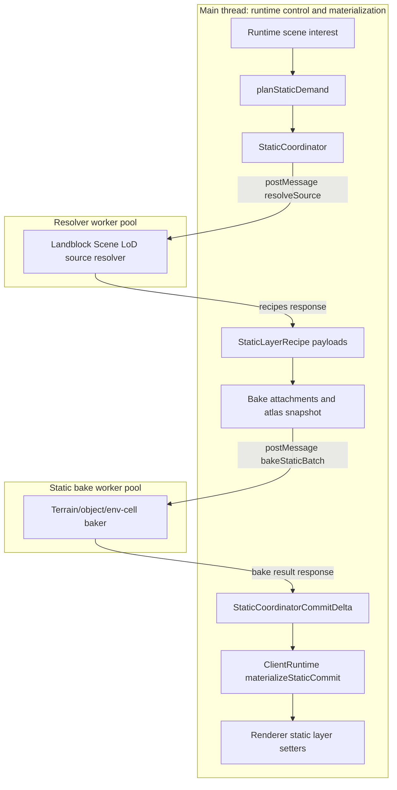
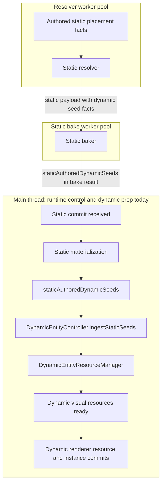
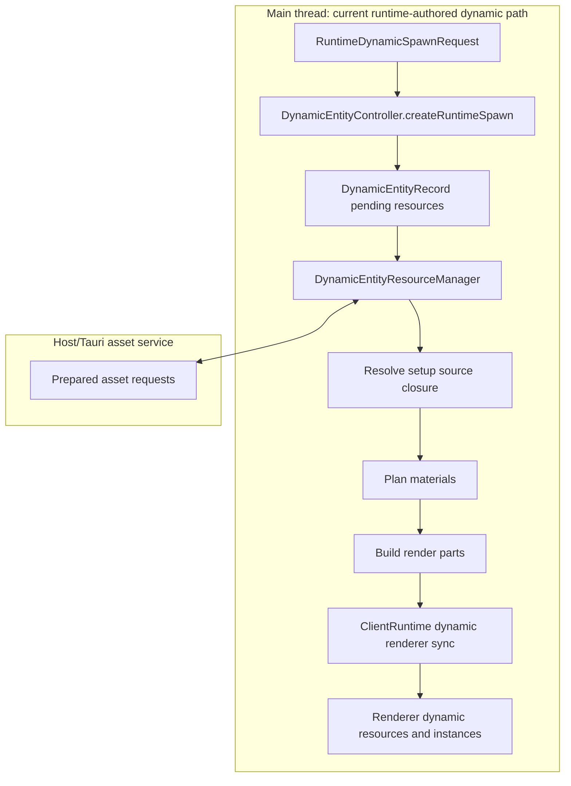
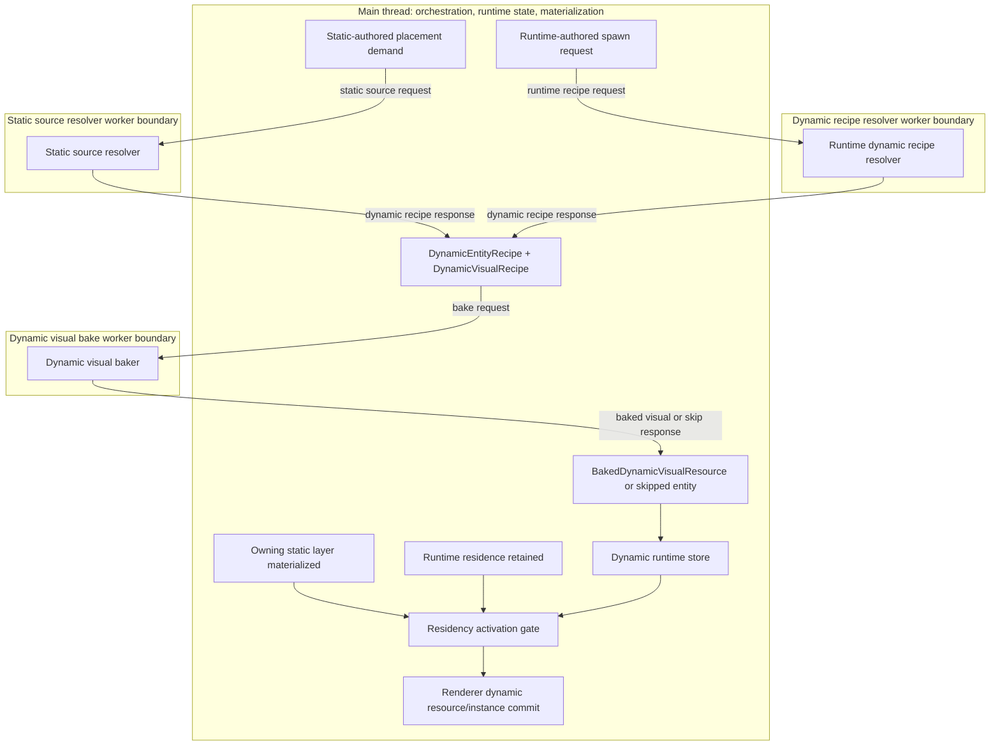
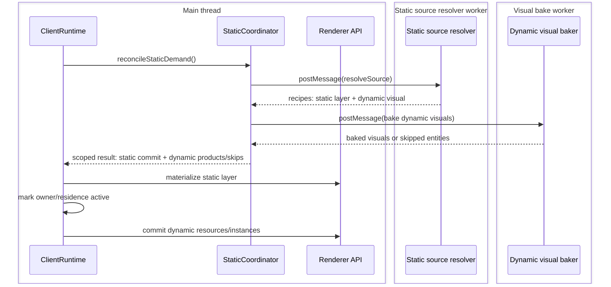
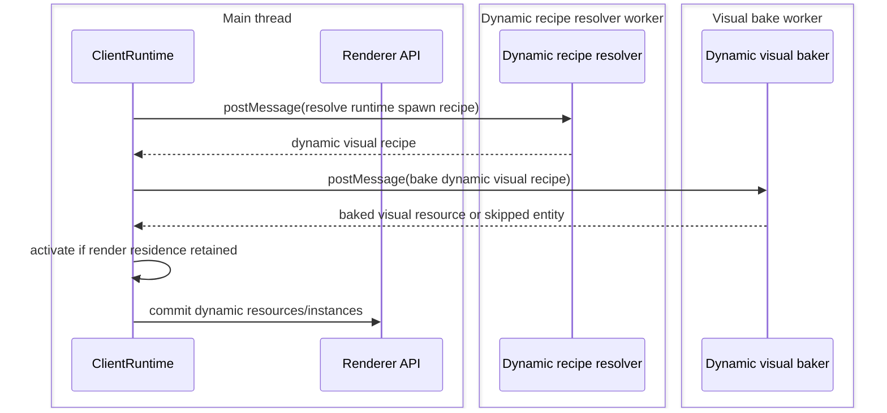

# Holtburger 3D Isomorphic Dynamic Prep Implementation Plan

Status: implementation plan draft.

## Purpose

Replace the split dynamic preparation pipeline in `apps/holtburger-3d` with an isomorphic,
worker-backed recipe and visual-bake flow for both static-authored and runtime-authored dynamic
entities.

The goal is a clean cutover, not a compatibility layer. Static-authored dynamics should be visually
prepared during the same scoped static prep closure that discovers them, while runtime-authored
dynamics should use the same recipe and bake contracts without pretending to be static work.

## Summary

The current frontend has a large preparation split:

- Static landblock content resolves and bakes through worker-backed resolver and baker paths.
- Runtime-authored dynamics and static-authored dynamics after seed ingestion prepare visual
  resources through `DynamicEntityResourceManager` on the main frontend runtime path.

This split is especially awkward for static-authored dynamics. They are discovered during static
content work, but their setup/model/material visual preparation happens only after static
materialization hands seeds to the dynamic controller. That means an entity authored by static data
waits for:

```text
static resolve -> static bake -> static materialize -> dynamic prep -> dynamic render commit
```

The target architecture should separate two gates:

```text
visual readiness != residency activation
```

Static-authored dynamic visual resources can be resolved and baked before the owning static layer is
materialized. The dynamic instance should still wait for layer ownership/residency activation before
rendering.

## North Stars

These principles are the review bar for any future plan. If a proposed implementation violates one,
the plan needs an explicit tradeoff and a better alternative should be considered first.

1. Dynamic visual preparation should be isomorphic across authorship.

   Static-authored and runtime-authored dynamic entities should converge on the same recipe shape
   before visual baking. Authorship should affect provenance, lifetime, ownership, and
   residency activation. It should not fork setup/source-closure/material/render-part preparation.

2. Static layer baking and dynamic visual baking should remain separate jobs.

   Static bakers produce static layer products: draw units, static peer records, and portal records.
   Dynamic visual bakers produce dynamic visual resources from dynamic recipes. They may share
   worker infrastructure and helper functions, but their job contracts should not be combined
   together.

3. Resolver output should be complete dependency recipes, not renderer products.

   Resolver code should discover/classify source facts and resolve dependency closure into compact,
   worker-transferable recipe facts. It should not produce render parts, draw units, texture
   placements, WebGL objects, or runtime records.

4. Baker output should be CPU-side visual facts, not runtime state.

   Dynamic visual baking should produce render parts, material entries, texture-use requirements,
   bounds, and failure/skip results. It should not decide entity lifetime, animation playback state,
   residence validity, selection policy, or renderer commit timing.

5. Runtime owns dynamic life, motion, residency, and commits.

   The runtime should own dynamic entity identity, retention, animation sampling, current pose,
   spatial/query membership, texture placement commits, and renderer resource/instance commits. It
   should consume prepared visual products rather than resolving source closure or building render
   parts on the main path.

6. Visual readiness and residency activation are separate gates.

   A dynamic visual resource can be resolved and baked before the entity is allowed to render.
   Static-authored dynamic instances still require their owning static layer/residence to be
   materialized and retained before activation.

7. Worker boundaries should be explicit contracts, not incidental call stacks.

   The pipeline should make `postMessage` boundaries clear: static source resolver workers can emit
   static-authored dynamic recipes, dynamic recipe resolver workers resolve runtime-authored dynamic
   recipes, dynamic visual bake workers bake dynamic visual resources, and the main thread
   materializes runtime/renderer state. Hidden main-thread CPU prep is a smell. The target design
   should not retain a main-thread visual-prep path once worker-backed recipe resolution and visual
   baking own the contract.

8. Shared helpers should follow real isomorphism, not fake universality.

   Setup-backed source closure, material planning, texture requirement derivation, and render-part
   extraction are good reuse candidates. Static layer retention, terrain baking, env-cell portal
   records, runtime spawn lifetime, and animation playback policy are not the same thing and should
   not be flattened into one abstraction.

9. The cutover should be clean.

   Once the isomorphic path is proven, delete the old main-thread dynamic visual prep path rather
   than preserving compatibility shims. Transitional code must have an explicit removal target. No
   vestigial recipe, seed, or resource-prep pathway should remain just because tests still pass.

10. Main-thread duplicate work should not be hidden by discarding the result.

   The redesign should move unnecessary visual-prep work off the main path, not run it and then
   throw away the product to make sequencing look clean. If the main thread performs source closure,
   material planning, or render-part extraction after worker-backed products exist, that is a bug or
   active cleanup debt.

11. Failure handling should be loud and simple.

   Resolver and baker failures should fail the affected recipe/job or skip the affected dynamic
   entity with a clear console report. Do not build durable issue ledgers for expected development
   failures. Keep persistent state to what runtime behavior needs: readiness, failure, retention,
   and renderer commit eligibility.

12. The scoped commit-pipeline closure should do the sequencing work.

   Static-authored dynamic prep should ride the same scoped async pipeline that resolves and bakes
   the owning static work. The closure should produce sibling outputs, apply one currentness check,
   and then hand static products to static materialization and dynamic products to dynamic runtime.
   Do not invent durable coordination machinery when closure scope and revision/owner checks are
   enough.

13. Ossified tests should be deleted and rewritten, not preserved.

   If existing tests primarily encode the old main-thread prep sequence, rewrite them around the new
   contracts instead of preserving brittle expectations through adapter churn. Tests should prove
   resolver recipes, baker outputs, runtime activation, and clean failure behavior. They should not
   keep legacy code alive to reduce assertion churn.

## Scope

In scope:

- Static-authored dynamic source discovery and dependency recipe creation.
- Runtime-authored dynamic recipe creation from browser/runtime spawn requests.
- Shared dynamic visual recipe resolution for both source families.
- Worker-backed runtime-authored dynamic recipe resolution.
- Worker-backed dynamic visual baking for setup-backed dynamic objects.
- Runtime materialization of already-baked dynamic visual resources.
- Sequencing between static layer materialization and dynamic residency activation.
- Critique of current `AssetService` and worker-boundary constraints.
- Clean cutover constraints and removal of obsolete dynamic prep paths.

Out of scope:

- Moving animation playback state into workers.
- Moving WebGL resource creation or renderer commits into workers.
- Building durable issue ledgers for dynamic prep failures.
- General player/creature/equipment authority design.
- Motion-table driven animation selection beyond the existing setup/default-animation path.
- Changing static terrain, portal, or env-cell rendering semantics except where needed for dynamic
  residency ownership.

## Ground Truth

Current static runtime wiring:

- `apps/holtburger-3d/src/lib/browser/create-browser-runtime.ts`
  - `createTauriStaticCoordinator`
  - `BrowserStaticResolver`
  - `BrowserStaticBaker`
- `apps/holtburger-3d/src/lib/static/coordinator/static-coordinator.ts`
  - `reconcileStaticDemand`
  - `#resolveSourceThenBake`
  - `#commit`
- `apps/holtburger-3d/src/lib/static/resolver/landblock-scene-lod-source-resolver.ts`
  - source-first fanout into terrain, outdoor static objects, and env-cell systems.
- `apps/holtburger-3d/src/lib/static/bake/static-bake.worker.ts`
  - routes terrain, static objects, and env-cell-system bake inputs.

Current static-authored dynamic facts:

- `apps/holtburger-3d/src/lib/static/objects/outdoor-static-objects-resolver.ts`
  - outdoor resolver creates `authoredDynamicSeeds`.
- `apps/holtburger-3d/src/lib/static/objects/bake/static-object-batch-baker.ts`
  - outdoor baker publishes `staticAuthoredDynamicSeeds`.
- `apps/holtburger-3d/src/lib/static/env-cells/bake/env-cell-system-baker.ts`
  - env-cell baker classifies setup/default-animation seeds as dynamic records.
- `apps/holtburger-3d/src/lib/runtime/client-runtime.ts`
  - static materialization ingests `staticAuthoredDynamicSeeds` into `DynamicEntityController`.

Current dynamic resource prep:

- `apps/holtburger-3d/src/lib/dynamic/dynamic-entity-controller.ts`
  - static seed ingestion and runtime spawn record creation.
- `apps/holtburger-3d/src/lib/dynamic/dynamic-entity-resource-manager.ts`
  - setup/animation load, source closure resolution, material planning, visual asset requests, and
    render part extraction.
- `apps/holtburger-3d/src/lib/runtime/client-runtime.ts`
  - dynamic texture-use deltas and renderer resource/instance commits.

Worker asset bridge precedent:

- `apps/holtburger-3d/src/lib/static/resolver/asset-bridge.ts`
- `apps/holtburger-3d/src/lib/static/resolver/worker-asset-reader.ts`

## Current Flow

Diagram convention:

- Main thread boxes are runtime/control/materialization work in frontend JavaScript.
- Worker boxes are `postMessage` boundaries.
- Host/Tauri boxes are async service boundaries outside the frontend worker pool.

### Static Layers



### Static-Authored Dynamics Today



Critique:

- Static-authored dynamics are not visually prepared while static work is already in flight.
- Expensive setup/object/material visual prep can run on the main frontend path.
- Outdoor and env-cell classification are not symmetrical.
- The sequence conflates "static layer is materialized" with "now we can start preparing the
  dynamic visual resource." Only residency needs to wait for the static layer.

### Runtime-Authored Dynamics Today



Critique:

- Runtime-authored dynamics do not use the worker-backed resolver/baker split.
- Static-authored and runtime-authored dynamic visuals share conceptual work, but not a shared
  pipeline contract.
- `DynamicEntityResourceManager` currently owns too much CPU-side visual derivation for a runtime
  state manager.

## Target Flow

The proposed architecture is source-isomorphic: both static-authored and runtime-authored dynamics
produce the same dynamic visual recipe shape and bake through the same worker-backed visual path.



Important split:

- Static source resolver workers create static-authored dynamic dependency recipes when static
  source resolution discovers authored dynamic placements.
- Dynamic recipe resolver workers create runtime-authored dynamic dependency recipes without routing
  runtime spawns through static demand.
- The visual baker creates renderable visual facts.
- Runtime owns entity lifetime, animation state, pose, residency, texture placement, and renderer
  commits.

## Dynamic Worker Seams

The target design has two dynamic worker seams, and they solve different problems:

```text
recipe resolution:
  source facts + prepared asset views -> DynamicEntityRecipe/DynamicVisualRecipe

visual baking:
  DynamicVisualRecipe -> BakedDynamicVisualResource | skipped entity
```

Static-authored dynamics use the static source resolver worker for recipe resolution because the
authored dynamic placement is discovered during static source fanout. Runtime-authored dynamics use
a dedicated dynamic recipe resolver worker because they do not have a static source request or
static layer owner.

Both authorship paths must converge before visual baking:

```text
static-authored dynamic
  -> static source resolver worker
  -> DynamicVisualRecipe
  -> dynamic visual bake worker
  -> DynamicVisualBakeResult

runtime-authored dynamic
  -> dynamic recipe resolver worker
  -> DynamicVisualRecipe
  -> dynamic visual bake worker
  -> DynamicVisualBakeResult
```

This preserves isomorphism at the dynamic recipe and visual-bake contracts without forcing static
layer baking, static source resolution, and runtime-authored spawns into one physical worker or one
job protocol.

## Proposed Contract Sketch

Names are intentionally draft-level. The important part is the shape and ownership split.

```ts
export type DynamicEntityRecipeSource =
	| {
			readonly kind: "static-authored";
			readonly owner: StaticLayerPeerRecordOwner;
			readonly sourceResidence: DynamicEntityResidence;
			readonly sourceSeedId: string;
	  }
	| {
			readonly kind: "runtime-authored";
			readonly runtimeEntityId: DynamicEntityId;
			readonly sourceResidence: DynamicEntityResidence;
	  };

export interface DynamicEntityRecipe {
	/** Stable entity identity before visual baking; runtime owns final lifetime. */
	readonly entityId: DynamicEntityId;
	/** Source-specific provenance and retention policy. */
	readonly source: DynamicEntityRecipeSource;
	/** Placement at source residence before animation sampling. */
	readonly baseTransform: DynamicEntityTransformState;
	/** Animation selection requested by source facts or runtime input. */
	readonly animationSelection: DynamicEntityAnimationSelection;
	/** Visual recipe consumed by the worker-backed visual baker. */
	readonly visual: DynamicVisualRecipe;
}

export interface DynamicVisualRecipe {
	/** Setup model driving part layout, default animation, and source closure. */
	readonly setupModel: StaticObjectSourceAssetFacts;
	/** Optional explicit animation payload facts, or null when animation is not required. */
	readonly animation: DynamicEntityAnimationResource | null;
	/** Resolved source closure; no lazy host asset lookup in the baker. */
	readonly sourceAssets: readonly StaticObjectSourceAssetFacts[];
	readonly materialSources: readonly StaticMaterialSourceFacts[];
	readonly paletteSources: readonly StaticObjectPaletteSourceFacts[];
	readonly textureRefs: readonly StaticObjectTextureRefFacts[];
	readonly missingRefs: readonly StaticResourceIdentity[];
	/** Source-specific material planning policy, not renderer state. */
	readonly materialPolicy: DynamicVisualMaterialPolicy;
}

export type DynamicVisualBakeProduct =
	| {
			readonly kind: "baked";
			readonly resource: BakedDynamicVisualResource;
	  }
	| {
			readonly kind: "skipped";
			readonly entityId: DynamicEntityId;
			readonly reason: DynamicVisualSkipReason;
	  };

export interface BakedDynamicVisualResource {
	readonly entityId: DynamicEntityId;
	readonly resourceId: string;
	readonly renderParts: readonly DynamicEntityRenderPart[];
	readonly textureRequirements: readonly DynamicEntityTextureRequirement[];
	readonly materialSlots: readonly DynamicEntityVisualMaterialSlot[];
}
```

Key constraint:

- `DynamicVisualRecipe` should be data-only and worker-transferable.
- It should not carry `AssetService`, leases, renderer objects, WebGL handles, or runtime mutable
  state.

## Resolver Responsibility

The resolver should prepare recipe dependencies, not renderer products.

For static-authored dynamics:

- Discover and classify dynamic authored placements.
- Resolve setup/object/material/palette/texture source closure.
- Resolve default animation identity and animation payload facts when needed.
- Produce `DynamicEntityRecipe` records alongside static layer recipes from the static source
  resolver worker path.
- Keep source evidence attached to the recipe where runtime behavior or reviewer clarity needs it.
  Missing or invalid dependencies should fail the recipe or mark the entity skipped with a console
  report, not accumulate durable issue records.

For runtime-authored dynamics:

- Convert `RuntimeDynamicSpawnRequest` into the same recipe shape.
- Reuse the same setup/source-closure resolver helpers as static-authored dynamics.
- Run through a dedicated dynamic recipe resolver worker/client so runtime spawns do not perform
  dependency closure on the main thread.
- Avoid routing runtime-authored requests through landblock static demand.

Candidate helper:

```ts
export async function resolveDynamicVisualRecipe(
	options: {
		readonly assetService: PreparedAssetReader;
		readonly source: DynamicEntityRecipeSource;
		readonly setupModelId: number;
		readonly modelData?: DynamicEntityAppearanceOverride | null;
		readonly animationSelection: DynamicEntityAnimationSelection;
		readonly materialPolicy: DynamicVisualMaterialPolicy;
	},
): Promise<DynamicEntityRecipe>;
```

Critique of this helper:

- Good: one dependency-closure implementation for static-authored and runtime-authored dynamics.
- Good: resolver workers already have an asset bridge precedent.
- Risk: the helper can become a render-product factory if it starts producing draw units or material
  table entries. Keep it recipe-only.
- Risk: runtime-authored dynamic resolution may need cancellation and stale-result rejection that
  static resolver tasks currently get from `StaticCoordinator`. That scheduler should be explicit.
  It belongs to the runtime-authored dynamic recipe request closure, not `StaticCoordinator`.

## Baker Responsibility

The visual baker should consume complete recipes and produce CPU-side visual resources:

- render parts;
- material table entries;
- texture-use requirements;
- console-reported source/material failures;
- baked bounds where derivable without current animation pose.

Candidate worker route:

```ts
export interface DynamicVisualBakeInput {
	readonly recipes: readonly DynamicEntityRecipe[];
	readonly batchId: string;
	readonly revision: number;
}

export interface DynamicVisualBakeResult {
	readonly batchId: string;
	readonly revision: number;
	readonly products: readonly DynamicVisualBakeProduct[];
	readonly failures: readonly DynamicVisualBakeFailure[];
}
```

This should be implemented as a dedicated dynamic visual worker entrypoint, client, and separately
instantiated worker pool. Start with a small pool, likely one worker:

```ts
const DEFAULT_DYNAMIC_VISUAL_BAKER_WORKER_COUNT = 1;

new Worker(new URL("../dynamic/visual-bake.worker.ts", import.meta.url), {
	type: "module",
});
```

Generic worker-pool machinery can be shared later if it stays job-agnostic, but dynamic visual bake
messages should not be routed through the static bake worker. The isomorphism target is that both
static-authored and runtime-authored dynamics use the same `DynamicVisualRecipe -> DynamicVisualBakeResult`
contract, not that dynamic visual baking shares the same physical worker instances as static layer
baking.

## Runtime Responsibility

Runtime should receive entity recipes and baked visual resources, then own runtime behavior:

- register/update dynamic records;
- retain static-authored records by static layer owner;
- activate instances only when residence is retained and materialized;
- sample animation into current part transforms;
- update spatial/query membership;
- commit dynamic texture placement through `TextureManager`;
- call renderer dynamic resource and instance commit APIs.

Runtime should not:

- resolve setup/gfx/material/palette dependency closure;
- build render parts;
- own static resolver/baker worker contracts;
- pretend a static-authored dynamic is a static draw unit.

## Sequencing Model

### Static-Authored Dynamics



The dynamic visual resource can be ready before the static layer is active. The instance should not
render until owner/residence activation succeeds.

### Runtime-Authored Dynamics



Runtime-authored dynamics use the same recipe and visual bake contracts. They do not depend on a
static layer owner unless their requested residence does.

## AssetService And Worker Boundary Critique

The current `AssetService` issue is contractual, not fundamental.

Current state:

- Resolver workers can request prepared assets through a main-thread bridge.
- Bake workers currently receive resolved payloads plus explicit attachments.
- Dynamic visual prep currently calls `AssetService` from `DynamicEntityResourceManager`.

This means there are two viable designs.

### Option A: Resolver Builds Complete Recipes

Resolver workers use the existing bridge pattern to request every prepared asset needed for the
dynamic visual recipe. Bakers remain pure and receive all facts in `DynamicVisualRecipe`.

Pros:

- Keeps dependency walking in resolver-owned code.
- Keeps baker deterministic and data-only.
- Reuses existing resolver asset-bridge precedent.
- Easier to test recipe completeness before baking.

Cons:

- Resolver must be careful to emit lean views, not raw prepared assets.
- Runtime-authored dynamics need a resolver/scheduler outside `StaticCoordinator`.

### Option B: Visual Baker Gets Asset Bridge

Dynamic visual baker requests prepared assets itself.

Pros:

- Visual baker can pull exactly what it needs if a future recipe proves too expensive or awkward to
  make complete up front.

Cons:

- Blurs resolver and baker responsibilities.
- Requires a second worker asset bridge.
- Makes baker failures include both dependency resolution failures and visual bake failures.
- Makes it harder to inspect recipe completeness before CPU-heavy bake work starts.

Recommendation: prefer Option A for the first design. Dynamic recipe/result payloads are unlikely
to dominate compared to static layer payloads and baked artifacts, so payload-size concerns should
not drive a more complicated baker-side asset-fetch path up front. The resolver should still emit lean
recipe views, not full host payloads.

## Static Layer Materialization Interaction

Static-authored dynamic output should return from the same scoped prep closure as sibling output,
not as static layer payload and not after post-materialization dynamic preparation.

The target shape is a closure-local result, not a durable static commit extension:

```ts
export interface StaticScopePrepResult {
	readonly staticBake: StaticBakeBatchResult;
	readonly dynamicVisualBake: DynamicVisualBakeResult | null;
}
```

`staticBake` proceeds through the static materialization path. `dynamicVisualBake` proceeds through
the dynamic runtime path. The relationship between them is the scoped source-prep closure and the
shared owner/revision currentness check, not static layer payload membership.

Materialization should split into:

```text
static layer materialization:
  install static draw units, portal records, spatial records

dynamic visual materialization:
  install/update dynamic visual resource state

dynamic residency activation:
  create live instances only when owner layer/residence is retained and materialized
```

## Closure-Enabled Simplifications

The scoped commit-pipeline closure should remove design machinery that would otherwise reconnect
async work after the fact.

### No Dynamic Prep Coordinator

The closure already knows:

- the requested static owner;
- the source resolution that produced dynamic recipes;
- the static bake job;
- the dynamic visual bake job;
- the revision/task identity used for stale-result rejection.

That means we should not introduce a long-lived dynamic prep coordinator unless a later requirement
proves the closure cannot express the relationship.

### No Separate Dynamic Prep Commit Registry

Dynamic visual bake results can be sibling outputs of the same closure that produced static bake
results. A registry of dynamic prep commits would mostly restate closure-local facts in durable
state.

Keep durable state to runtime behavior:

- retained static owner ids;
- dynamic entity records;
- visual readiness/skipped/failed state;
- renderer commit eligibility.

### No Cross-System Settlement Contract

Static scene-interest settlement does not need to grow a dynamic sub-protocol. The closure can
publish static and dynamic outputs back-to-back after currentness checks. Runtime can then expose
separate static and dynamic readiness gates.

If a caller needs both, it can wait on both gates. The static coordinator should not become the
global settlement authority for dynamic visuals.

### No Durable Pending Recipe Store For Static-Authored Dynamics

Static-authored dynamic recipes can live inside the scoped prep closure until they are baked or
skipped. We do not need to store dynamic recipes durably just to hand them from static source
resolution to visual baking.

Durable recipe storage is only justified if:

- recipes must be reused across multiple independent bake jobs;
- recipes must survive a closure restart;
- runtime-authored and static-authored recipes share a real cache key and measured cache benefit.

None of those should be assumed in the first design.

### No Main-Thread Visual-Prep Escape Hatch

The closure should either route dynamic visual preparation through the shared visual baker or fail
or skip. It should not keep the old `DynamicEntityResourceManager` visual prep path as an
alternate main-thread path. That would hide worker failures and preserve duplicate main-thread work.

### No Durable Issue Ledger

The closure can console-report the failing stage with enough source context:

```text
static owner -> entity id -> recipe stage | visual bake stage | activation stage
```

Runtime state only needs the final behavior-relevant outcome for each entity. Keeping historical
stage records is unnecessary unless we later need explicit profiling/tracing.

### Runtime-Authored Dynamics Can Use A Smaller Closure

Runtime-authored dynamics do not need the static side of the closure. They still benefit from the
same pattern:

```text
resolve runtime dynamic recipe
  -> bake dynamic visual recipe
  -> currentness check against runtime entity id/request revision
  -> apply dynamic result
```

This keeps runtime-authored dynamics isomorphic at the recipe and visual-bake layers without making
them pretend to be static work.

## Implementation Plan

Each phase should leave the app compiling unless the phase explicitly says it is an intermediate
mechanical move. Decisions and course corrections should be filled in during execution when code
evidence contradicts this draft. Do not keep old dynamic visual prep behavior alive just to make a
phase easier to merge.

### Dry Run Findings

This dry run was performed against the current code before implementation. These findings should be
treated as plan constraints, not optional cleanup.

- Static-authored dynamic integration belongs at `StaticCoordinator.#flushPendingBatch`, not only at
  `#resolveSourceThenBake`. Source resolution discovers dynamic recipes, but batching, attachment
  creation, static bake execution, currentness filtering, and commit publication all converge in
  `#flushPendingBatch`.
- `StaticCoordinatorCommitListener` currently emits a bare `StaticCoordinatorCommitDelta`. The plan
  must add a scoped commit event/envelope while keeping `StaticCoordinatorCommitDelta` static-only.
  Runtime should receive static commit data and dynamic visual bake results as siblings.
- Runtime renderer conversion already consumes `record.resources.visual` from
  `DynamicEntityController` snapshots. The lowest-churn cutover is to replace
  `DynamicEntityResourceManager` resource-change events with explicit controller methods that apply
  baked visual results into the same runtime visual resource state shape.
- Runtime-authored recipe resolution needs worker-backed resolver access too. Do not move source
  closure/material dependency resolution to the main thread just because runtime-authored dynamics
  are not part of static source demand.
- `DynamicRuntimeSnapshot.staticSeedCount`, `DynamicEntitySourceSummaryDto`, and scene-query/static
  materializer APIs currently expose seed terminology. Splitting placement records must include
  debug/snapshot naming cleanup, or old concepts will survive in the public inspection surface.
- `static-materializer.ts` currently forwards `staticAuthoredDynamicSeeds` from static commits into
  runtime materialization. After the split, static materialization may still forward static-owned
  placement records for scene-query bookkeeping, but dynamic activation records and baked visuals
  should flow through the scoped dynamic sibling path.

### Phase 0: Contract Inventory And Test Triage

Goal: identify exactly which current functions become recipe resolution, which become visual
baking, and which tests should be rewritten instead of dragged through the cutover.

Deliverables:

- Inventory notes added to this plan under the phase's decisions section.
- A test triage list covering:
  - `apps/holtburger-3d/src/lib/dynamic/dynamic-entity-resource-manager.test.ts`;
  - `apps/holtburger-3d/src/lib/dynamic/dynamic-entity-controller.test.ts`;
  - `apps/holtburger-3d/src/lib/runtime/client-runtime.test.ts`;
  - static resolver/baker tests that mention `staticAuthoredDynamicSeeds`.
- A move map for the current `DynamicEntityResourceManager` responsibilities:
  - setup and animation dependency resolution;
  - source closure resolution;
  - material planning;
  - texture requirement derivation;
  - render-part extraction;
  - lifecycle and lease cleanup.
- A runtime state seam map covering:
  - replacement for `DynamicEntityController.applyResourceChange`;
  - `DynamicEntityResourceState` fields that should be populated from baked visual products;
  - snapshot/debug fields that still use seed terminology.

Task checklist:

- Trace every `AssetService` request in `DynamicEntityResourceManager`.
- Identify which calls can be replaced by resolver-worker prepared asset views.
- Identify pure render-part/material helpers that can move behind a dynamic visual baker.
- Trace renderer conversion from `DynamicEntitySummaryDto.resources.visual` through dynamic
  resource, texture-use, and instance commits.
- Mark ossified tests for deletion/rewrite when they encode old sequencing rather than durable
  behavior.

Acceptance criteria:

- Every old dynamic prep responsibility has a target owner: resolver, baker, runtime, or delete.
- Test churn is explicitly classified as rewrite, preserve, or delete.
- No implementation work begins with unresolved ownership of `AssetService` access.

Decisions and course corrections:

- Completed during Phase 0.

Current `DynamicEntityResourceManager` responsibility map:

- Resolver-owned:
  - setup model asset request and setup/default animation lookup currently started by
    `createSetupAnimationResourceKeys(...)` and `#completeSetupAnimationRequest(...)`;
  - explicit animation asset request and payload validation;
  - setup appearance override host-key creation from runtime model data;
  - source closure resolution currently performed through `resolveStaticObjectSourceClosure(...)`;
  - missing reference collection and recipe dependency failure reporting.
- Baker-owned:
  - dynamic material slot requirement construction currently handled by
    `createDynamicMaterialSlotRequirements(...)`;
  - static object material planning currently delegated to `planStaticObjectMaterials(...)`;
  - texture requirement derivation currently handled by `createTextureRequirements(...)`;
  - visual host asset key derivation and prepared visual asset collation currently handled by
    `createVisualHostAssetKeys(...)` and `#requestVisualHostAssets(...)`;
  - render-part extraction currently handled by `createDynamicRenderParts(...)`.
- Runtime-owned:
  - entity identity, source provenance, retention policy, render residence, and texture batch
    ownership currently created by `DynamicEntityController`;
  - animation playback and placement updates currently owned by `DynamicAnimationPlayer` and
    `DynamicPlacementTracker`;
  - renderer visual resource, texture-use, and instance commits currently read from
    `record.resources.visual` in `client-runtime.ts`.
- Delete:
  - prepared asset leases in `DynamicEntityResourceManager`; recipe/bake products should be value
    payloads, and prepared asset lifetime should not be coupled to dynamic runtime records;
  - `DynamicEntityResourceChange` event fanout as the primary visual prep API;
  - manager-local preparation phases once explicit recipe/bake closures own currentness.

Runtime state seam map:

- Replace `DynamicEntityController.applyResourceChange(...)` with explicit result methods:
  `applyResolvedDynamicRecipe(...)`, `applyBakedDynamicVisual(...)`, and `skipDynamicVisual(...)`
  or equivalent names chosen during Phase 1.
- Preserve `DynamicEntityResourceState.visual` as the renderer-facing state during cutover so
  `createDynamicRendererVisualResource(...)`, `createDynamicTextureUseCommits(...)`,
  `createDynamicRendererInstances(...)`, and `DynamicPlacementTracker` can keep consuming the same
  ready visual shape while the prep producer changes.
- Rename public/debug seed terminology during the static-authored cutover:
  `DynamicRuntimeSnapshot.staticSeedCount`, `DynamicEntitySourceSummaryDto` static-authored seed
  fields, and tests that assert those names should move to placement/dynamic-authored terminology.

Test triage:

- Rewrite around new contracts:
  - `dynamic-entity-resource-manager.test.ts`; keep behavioral scenarios, but move coverage to
    recipe resolver, visual baker, worker transport, and controller result application tests;
  - runtime tests that assert resource readiness through the old manager event sequence;
  - static resolver/baker tests that currently expect `staticAuthoredDynamicSeeds` as visual-prep
    carriers.
- Preserve and adapt:
  - `dynamic-entity-controller.test.ts` coverage for identity stability, static owner retention,
    runtime lifetime, and render residence behavior;
  - runtime renderer commit tests that can remain focused on `record.resources.visual` readiness;
  - static coordinator currentness/eviction tests, after their commit listener expectations move to
    the scoped result envelope.
- Delete rather than port:
  - tests whose only purpose is lease accounting in `DynamicEntityResourceManager`;
  - tests that require static materialization before static-authored dynamic visual prep starts;
  - tests that prove compatibility shims or old seed wrappers still exist.

Course correction:

- Add an early resteering checkpoint after Phase 3, before worker transport, because the dry run
  found two separate dynamic worker seams. We should validate the recipe contract, visual bake
  contract, and runtime state adapter before paying the worker/protocol cost.

### Phase 1: Add Dynamic Recipe And Bake Contracts

Goal: introduce the shared contract surface without changing runtime behavior yet.

Deliverables:

- Extend or split from `apps/holtburger-3d/src/lib/dynamic/contracts.ts`:
  - `DynamicEntityRecipeSource`;
  - `DynamicEntityRecipe`;
  - `DynamicVisualRecipe`;
  - `DynamicVisualBakeInput`;
  - `DynamicVisualBakeResult`;
  - `DynamicVisualBakeProduct`;
  - `BakedDynamicVisualResource`;
  - skip/failure reason types.
- Add `apps/holtburger-3d/src/lib/dynamic/visual-recipe-resolver.ts`.
- Add `apps/holtburger-3d/src/lib/dynamic/visual-baker.ts`.
- Add explicit controller-facing result application contracts for baked visual success and skip/fail
  results.
- Add focused tests for contract construction and serialization-friendly recipe shape.

Task checklist:

- Model static-authored and runtime-authored recipe provenance as one discriminated union.
- Keep visual recipes data-only and worker-transferable.
- Keep texture placement out of `BakedDynamicVisualResource`; emit texture requirements only.
- Define dynamic-owned texture batch identity:
  - `dynamic-static-authored:{ownerId}:{entityId}`;
  - `runtime-dynamic:{entityId}`.
- Define the runtime visual state adapter shape that converts `BakedDynamicVisualResource` into the
  existing `DynamicEntityResourceState.visual` structure during cutover.
- Ensure invalid internal recipe shapes throw or fail loudly.

Acceptance criteria:

- Contracts compile without importing renderer objects, `AssetService`, leases, or WebGL state.
- Runtime-authored and static-authored recipe fixtures share the same `DynamicVisualRecipe` shape.
- Tests assert the new contract boundaries instead of mirroring old manager internals.

Decisions and course corrections:

- Completed during Phase 1.

Implemented contract surface:

- Added `DynamicEntityRecipeSource`, `DynamicEntityRecipe`, `DynamicVisualRecipe`,
  `DynamicVisualMaterialPolicy`, `DynamicVisualBakeInput`, `DynamicVisualBakeResult`,
  `DynamicVisualBakeProduct`, `BakedDynamicVisualResource`, skip/failure reason types, and
  controller-facing `DynamicVisualApplicationResult` in `dynamic/contracts.ts`.
- Exported the existing renderer-facing visual resource state types needed for the cutover:
  `DynamicEntityVisualResourceState`, `DynamicEntityVisualResourcesReadyState`,
  `DynamicEntityVisualResourcesFailedState`, `DynamicEntityMaterialSlotRequirement`, and
  `DynamicEntityResourceStatus`.
- Added dynamic-owned texture batch helpers:
  `createStaticAuthoredDynamicTextureBatchId(...)` and `createRuntimeDynamicTextureBatchId(...)`.
- Added `dynamic/visual-recipe-resolver.ts` with the resolver interface/request shape.
- Added `dynamic/visual-baker.ts` with the dynamic visual baker interface.

Verification:

- `npm run test:ts -- src/lib/dynamic/visual-contracts.test.ts`
- `npm run check`

Course correction:

- `BakedDynamicVisualResource` intentionally mirrors the current ready visual state fields
  (`sourceAssets`, `materialSources`, `paletteSources`, `textureRefs`, `renderParts`, material
  slots, and texture requirements). This keeps Phase 5 able to populate `record.resources.visual`
  without rewriting renderer conversion in the same step.

### Phase 2: Extract Shared Recipe Resolution

Goal: move dependency closure preparation into reusable resolver-owned helpers.

Deliverables:

- Implement `resolveDynamicVisualRecipe(...)` in
  `apps/holtburger-3d/src/lib/dynamic/visual-recipe-resolver.ts`.
- Add a worker-backed dynamic recipe resolver path for runtime-authored dynamics, reusing the
  resolver asset bridge pattern rather than calling `AssetService` on the main runtime path.
- Add dynamic recipe resolver worker transport for runtime-authored requests:
  - `apps/holtburger-3d/src/lib/dynamic/visual-recipe-protocol.ts`;
  - `apps/holtburger-3d/src/lib/dynamic/visual-recipe-worker-client.ts`;
  - `apps/holtburger-3d/src/lib/dynamic/visual-recipe-worker-handler.ts`;
  - `apps/holtburger-3d/src/lib/dynamic/visual-recipe.worker.ts`.
- Reuse existing static source closure helpers from:
  - `apps/holtburger-3d/src/lib/static/objects/static-object-source-closure.ts`;
  - `apps/holtburger-3d/src/lib/static/objects/static-object-source-assets.ts`.
- Add resolver tests for:
  - runtime-authored setup/default-animation source;
  - outdoor static-authored setup/default-animation source;
  - env-cell static-authored setup/default-animation source.

Task checklist:

- Replace ad hoc setup/source/material dependency walking with shared helpers.
- Use resolver-worker-compatible prepared asset reader abstractions, not `AssetService` directly in
  baker code.
- Reuse or generalize the existing resolver asset bridge view shaping from
  `static/resolver/asset-bridge.ts` and `static/resolver/worker-asset-reader.ts`.
- Keep static-authored recipe resolution reachable from static source resolver workers, while
  runtime-authored recipe resolution uses the dynamic recipe resolver worker entrypoint.
- Keep classification entity-local: setup model plus setup/default animation facts decide dynamic
  recipe eligibility.
- Preserve env-cell/outdoor context only as residence, owner, placement, and provenance.

Acceptance criteria:

- `resolveDynamicVisualRecipe(...)` can produce the same visual recipe shape for all three source
  families.
- The baker contract can consume the recipe without host asset fetches.
- Runtime-authored recipe resolution runs through a worker-backed resolver path or an equivalent
  worker-backed resolver client, not main-thread `AssetService` calls.
- Dependency failures are returned or thrown at recipe resolution, not hidden in runtime state.

Decisions and course corrections:

- Completed during Phase 2.

Implemented recipe-resolution surface:

- `resolveDynamicVisualRecipe(...)` now requests and validates setup/default or explicit animation
  assets through `PreparedAssetReader`, resolves setup-backed source closure through
  `resolveStaticObjectSourceClosure(...)`, and emits a `DynamicEntityRecipe` with the shared
  `DynamicVisualRecipe` shape.
- Runtime-authored and static-authored sources use the same resolver request shape. Authorship is
  retained only in `DynamicEntityRecipeSource`; setup model, animation, material source, palette
  source, texture ref, and missing-ref facts are not authorship-specific.
- Runtime-authored recipe resolution now has a dedicated worker transport:
  `visual-recipe-protocol.ts`, `visual-recipe-worker-client.ts`,
  `visual-recipe-worker-handler.ts`, and `visual-recipe.worker.ts`.
- The dynamic recipe worker bridge reuses resolver-light prepared asset shaping for env-cell,
  gfx-obj, and render-surface payloads. Runtime-authored recipe resolution can therefore cross the
  worker boundary without passing `AssetService` or prepared asset leases into runtime code.

Behavior notes and debt:

- `resolveStaticObjectSourceClosure(...)` currently attempts a default `setup-appearance` request
  for setup-backed objects. Existing dynamic prep treated missing setup appearance as optional, so
  `resolveDynamicVisualRecipe(...)` filters missing `setup-appearance` refs before returning the
  recipe. Phase 3 must preserve this rule when converting `missingRefs` into skip/failure results;
  optional appearance absence must not become a hard bake failure.
- The Phase 2 worker transport proves the runtime-authored recipe resolver path, but it is not yet
  wired into browser runtime creation. That cutover remains Phase 5 after the visual baker and bake
  worker contract exist.
- The recipe worker uses a dedicated worker module/protocol. This keeps the runtime-authored
  resolver boundary explicit while still reusing static resolver asset-view helpers. Do not fold
  dynamic recipe requests into static demand just to reuse a pool.

Verification:

- `npm run test:ts -- src/lib/dynamic/visual-recipe-resolver.test.ts src/lib/dynamic/visual-recipe-worker-client.test.ts`
- `npm run check`

### Phase 3: Build The Dynamic Visual Baker

Goal: move CPU-side dynamic visual derivation out of `DynamicEntityResourceManager`.

Deliverables:

- Implement the pure dynamic visual bake path in
  `apps/holtburger-3d/src/lib/dynamic/visual-baker.ts`.
- Move or share material planning and render-part extraction currently embedded in
  `DynamicEntityResourceManager`.
- Add tests around `DynamicVisualBakeInput -> DynamicVisualBakeResult`.

Task checklist:

- Convert recipes into `DynamicEntityRenderPart` values.
- Emit dynamic material slots and texture requirements.
- Preserve bounds and renderability facts needed by runtime/renderer conversion.
- Return entity-local skipped products for unsupported or missing visual facts.
- Throw/fail loudly for impossible internal recipe states.

Acceptance criteria:

- The dynamic visual baker has no `AssetService` access.
- The dynamic visual baker does not import runtime lifecycle or renderer commit APIs.
- Runtime-authored fixture bake output can be converted to renderer visual resources without using
  the old main-thread manager path.

Decisions and course corrections:

- Completed during Phase 3.

Implemented visual bake surface:

- `LocalDynamicVisualBaker` and `bakeDynamicVisuals(...)` now convert dynamic recipes into
  `BakedDynamicVisualResource` products with dynamic material slots, texture requirements, and
  `DynamicEntityRenderPart` geometry.
- The baker reuses the static object material planner and static material table adapter, but it
  owns dynamic-local visual identities, dynamic texture-use ids, and dynamic render-part slicing.
- Missing resolver dependencies become entity-local `missing-dependencies` skipped products.
  Unsupported material plans become entity-local `unsupported-materials` skipped products.
  Impossible internal bake states, such as missing geometry attachments, are reported as loud bake
  failures.

Course correction:

- `DynamicVisualBakeInput` now carries `sourceGeometry` attachments alongside recipes. Source
  recipes intentionally contain compact source facts, not full `gfx-obj` vertex buffers. The worker
  boundary must therefore prepare and transfer `StaticObjectSourceGeometryAttachment` values before
  baking. This keeps the baker free of `AssetService` access without bloating every recipe with raw
  geometry.

Debt:

- Phase 3 duplicates some pure render-part/material helper logic that still exists in
  `DynamicEntityResourceManager`. That is acceptable only until the runtime cutover deletes the old
  manager path; do not let the duplicated implementation become a long-term compatibility layer.

Verification:

- `npm run test:ts -- src/lib/dynamic/visual-contracts.test.ts src/lib/dynamic/visual-baker.test.ts`
- `npm run check`
- `npm run lint:ts`

### Resteer 0: Contract Boundary Review

Goal: validate the recipe, bake, and runtime state seams before adding worker transport.

Review checklist:

- Confirm `DynamicVisualRecipe` is complete enough that the baker does not need `AssetService`.
- Confirm runtime-authored and static-authored fixtures use the same visual recipe shape without
  authorship-specific bake branches.
- Confirm `BakedDynamicVisualResource` can populate `DynamicEntityResourceState.visual` without
  changing renderer resource/instance conversion in the same phase.
- Confirm recipe-resolution failures and bake skips have clear console-reportable source context
  without durable issue records.
- Revisit Phase 0 test triage and delete/rewrite any tests that would force old manager events or
  seed wrappers back into the design.

Acceptance criteria:

- Phase 4 worker protocol work begins only after the contract seams are proven by focused tests.
- The plan is updated with any naming or ownership corrections before Phase 4 starts.

Review outcome:

- Completed after Phase 3.
- `DynamicVisualRecipe` remains source/authorship-isomorphic. The baker consumes recipe facts and
  geometry attachments without branching on `runtime-authored` versus `static-authored`.
- `DynamicVisualBakeInput` is the corrected worker-boundary contract: recipes carry compact closure
  facts, while `sourceGeometry` carries the typed vertex/UV buffers required for render-part
  extraction. This is cleaner than stuffing raw geometry into every recipe and still keeps the
  baker free of `AssetService`.
- `BakedDynamicVisualResource` still mirrors the renderer-facing ready visual state closely enough
  for Phase 5 to populate `DynamicEntityResourceState.visual` without changing renderer resource or
  instance conversion in the same phase.
- Failure handling remains simple: resolver failures throw/reject, missing recipe dependencies
  become skipped products, unsupported materials become skipped products, and impossible bake states
  become job failures. No durable issue ledger was introduced.
- Phase 0 test triage still stands. Tests that encode old `DynamicEntityResourceManager` phase
  events should be rewritten or deleted during runtime cutover instead of adapted around the new
  contracts.

Course corrections before Phase 4:

- Dynamic visual bake worker transport must move `sourceGeometry` attachments across the worker
  boundary with the bake input.
- Phase 4 should add a dynamic visual bake attachment collection path equivalent in spirit to
  `StaticObjectBakeAttachmentProvider`, but owned by the dynamic bake worker/client boundary.
- Do not make the dynamic bake worker fetch assets directly just to hide attachment preparation.

### Phase 4: Add Worker Transport For Dynamic Visual Baking

Goal: make dynamic visual baking worker-backed through a dedicated dynamic job contract.

Deliverables:

- Add dedicated dynamic visual bake worker transport:
  - `apps/holtburger-3d/src/lib/dynamic/visual-bake-protocol.ts`;
  - `apps/holtburger-3d/src/lib/dynamic/visual-bake-worker-client.ts`;
  - `apps/holtburger-3d/src/lib/dynamic/visual-bake-worker-handler.ts`;
  - `apps/holtburger-3d/src/lib/dynamic/visual-bake.worker.ts`.
- Add a browser-runtime factory for a separate dynamic visual bake worker pool. Actual runtime
  instantiation happens in Phase 5 when runtime-authored cutover has a consumer.
- Add protocol types for dynamic visual bake requests/responses.
- Add worker/fake-worker tests mirroring the current static worker test style where useful.

Task checklist:

- Keep `DynamicVisualBakeInput` separate from `StaticBakeBatchInput`.
- Reuse generic worker transport helpers only where they do not blur job ownership.
- Do not route dynamic visual bake messages through `static/bake/static-bake.worker.ts`.
- Include `sourceGeometry` attachments in the dynamic visual bake request; prepare them before the
  bake worker boundary.
- Transfer typed arrays where the bake result carries large geometry data.
- Console-report worker job failures and skip/fail the affected entity or job.

Acceptance criteria:

- Dynamic visual bake can run across a `postMessage` boundary.
- Dynamic visual bake uses a separate physical worker instance or pool from static layer baking.
- Static layer bake tests do not need dynamic recipe payloads inside `StaticBakeBatchInput`.
- Static bake worker protocol remains static-owned; any shared worker-pool utility is generic and
  job-agnostic.
- There is no main-thread visual bake alternate path after worker transport exists.

Decisions and course corrections:

- Completed during Phase 4.

Implemented worker transport:

- Added dedicated dynamic visual bake worker protocol, client, handler, and worker entrypoint:
  `visual-bake-protocol.ts`, `visual-bake-worker-client.ts`,
  `visual-bake-worker-handler.ts`, and `visual-bake.worker.ts`.
- Added `WorkerPoolDynamicVisualBaker` so dynamic visual bake jobs can use a separate worker pool
  from static layer baking.
- Added `createWorkerDynamicVisualBaker(...)` in browser runtime wiring. The factory creates
  dedicated `visual-bake.worker.ts` instances and terminates them through the dynamic worker client.
- Added protocol/fake-worker tests for request/response, handler failure responses, pool
  round-robin behavior, and browser factory worker disposal.

Course correction:

- The original Phase 4 wording said to instantiate the separate dynamic visual bake worker pool from
  browser runtime. That would create unused workers until Phase 5 wires runtime-authored dynamic
  cutover. Phase 4 now adds the factory and proves it constructs a separate physical worker path;
  Phase 5 will instantiate it when the runtime closure consumes it.

Verification:

- `npm run test:ts -- src/lib/dynamic/visual-bake-worker-client.test.ts src/lib/browser/create-browser-runtime.test.ts`
- `npm run check`
- `npm run lint:ts`

### Phase 5: Cut Over Runtime-Authored Dynamics First

Goal: prove the isomorphic core on the smaller runtime-authored closure before touching static
residency.

Deliverables:

- Update `apps/holtburger-3d/src/lib/runtime/client-runtime.ts` runtime spawn flow.
- Update `apps/holtburger-3d/src/lib/dynamic/dynamic-entity-controller.ts` to accept baked visual
  readiness instead of asking `DynamicEntityResourceManager` to prepare visuals.
- Replace `DynamicEntityController.applyResourceChange(...)` for the new path with explicit methods
  such as `applyResolvedSetupAnimation(...)`, `applyBakedDynamicVisual(...)`, and
  `skipDynamicVisual(...)`.
- Rewrite runtime-authored dynamic tests around:
  - recipe resolution;
  - worker-backed visual bake;
  - currentness rejection;
  - renderer resource and instance commit.

Task checklist:

- Implement runtime-authored closure:
  `resolve dynamic recipe -> bake dynamic visual recipe -> currentness check -> apply dynamic result`.
- Keep runtime lifetime and residence validity outside static owner retention.
- Remove or bypass old runtime-authored visual prep in `DynamicEntityResourceManager`.
- Keep `record.resources.visual` as the renderer-facing source of truth during the cutover so
  `createDynamicRendererVisualResource`, `createDynamicTextureUseCommits`, and
  `createDynamicRendererInstances` do not all need to move in the same phase.
- Preserve animation sampling and placement tracking as runtime responsibilities.

Acceptance criteria:

- Runtime-authored dynamics render using baked dynamic visual products.
- Runtime-authored dynamics do not route through `StaticDemand` or static owner concepts.
- No old main-thread source closure/material/render-part prep runs and discards its result.

Decisions and course corrections:

- Completed during Phase 5.

Implemented runtime-authored cutover:

- `ClientRuntime.createRuntimeSpawn(...)` now starts a scoped runtime-authored dynamic visual prep
  closure:
  `resolve dynamic recipe -> apply resolved setup/animation -> collect source geometry -> bake
  dynamic visual -> currentness check -> apply baked or skipped visual result`.
- Browser runtime now instantiates worker-backed dynamic visual recipe resolution and dynamic visual
  baking for host-backed runtime mode:
  `createWorkerDynamicVisualRecipeResolver(...)` plus `createWorkerDynamicVisualBaker(...)`.
- `DynamicEntityController` no longer starts `DynamicEntityResourceManager` visual prep for
  runtime-authored spawns. Runtime-authored records accept explicit recipe and bake results through
  `applyResolvedDynamicRecipe(...)`, `applyBakedDynamicVisual(...)`, and
  `skipDynamicVisual(...)`.
- `DynamicEntityResourceState.visual` remains the renderer-facing ready state, so renderer visual
  resource conversion, dynamic texture-use commits, and dynamic instance commits did not need to
  change in this phase.
- Added `createDynamicVisualBakeSourceGeometry(...)` to collect the `sourceGeometry` attachments
  required by the worker-backed visual baker. This keeps the baker asset-fetch-free while avoiding
  raw geometry inside recipe records.

Course corrections:

- `createClientRuntime(...)` keeps a direct in-process resolver/baker default for tests and
  non-browser construction. Browser runtime passes worker-backed implementations. The direct default
  is not the target browser path and should not be used to justify main-thread runtime visual prep.
- Static-authored dynamics still use `DynamicEntityResourceManager` until Phases 6-8 move their
  recipe/bake products into the static prep closure.

Verification:

- `npm run test:ts -- src/lib/runtime/client-runtime.test.ts src/lib/browser/create-browser-runtime.test.ts src/lib/dynamic/dynamic-entity-controller.test.ts`
- `npm run check`
- `npm run lint:ts`

### Resteer 1: Runtime Cutover Review

Goal: reassess before static-authored dynamics make the closure more complex.

Review checklist:

- Confirm the recipe contract remained source-isomorphic and did not absorb runtime state.
- Confirm the baker contract remained asset-fetch-free.
- Confirm worker transport did not create a hidden main-thread alternate path.
- Revisit the test triage list and delete/rewrite newly ossified tests.
- Confirm the coordinated static-authored closure cutover is still viable after the runtime-authored
  path proves the recipe and baker contracts.

Acceptance criteria:

- The plan is updated with concrete course corrections before Phase 6 starts.

Review outcome:

- Completed after Phase 5.
- Runtime-authored dynamic prep now uses the same recipe and bake contracts as static-authored
  dynamics will use later. Runtime-specific behavior stayed in runtime closure/currentness,
  residence, lifetime, and renderer commit timing.
- Browser runtime uses worker-backed dynamic visual recipe resolution and dynamic visual baking.
  `createClientRuntime(...)` keeps direct in-process defaults for tests and non-browser
  construction, but the browser path no longer relies on `DynamicEntityResourceManager` for
  runtime-authored visual prep.
- The dynamic visual baker remains asset-fetch-free. `createDynamicVisualBakeSourceGeometry(...)`
  performs attachment collection before the bake worker boundary, matching the static bake
  attachment pattern.
- No durable diagnostics ledger was added. Runtime closure failures are reported to the console and
  converted to skipped/failed visual state on the affected runtime-authored entity.
- Existing runtime-authored tests remain behavior-oriented enough to preserve. The new stale-result
  test covers currentness rejection without encoding old manager events.

Course corrections before Phase 6:

- Static-authored dynamic recipes should reuse the explicit controller result application methods
  added in Phase 5 rather than introducing another resource-change event path.
- Phase 6 should produce static-authored recipe sibling outputs and placement/activation records.
  Do not route static-authored visuals back through `DynamicEntityResourceManager`.
- The direct resolver/baker defaults in `createClientRuntime(...)` should be revisited during final
  cleanup. They are useful for tests, but browser runtime must remain worker-backed.

### Phase 6: Emit Static-Authored Dynamic Recipes During Static Source Resolution

Goal: discover and resolve static-authored dynamic visual recipes before static materialization.

Deliverables:

- Extend static source resolution contracts so dynamic recipes are sibling source outputs, not static
  layer payload members.
- Update:
  - `apps/holtburger-3d/src/lib/static/objects/outdoor-static-objects-resolver.ts`;
  - `apps/holtburger-3d/src/lib/static/env-cells/env-cell-system-resolver.ts`;
  - `apps/holtburger-3d/src/lib/static/resolver/landblock-scene-lod-source-resolver.ts`;
  - static resolver worker protocol/client tests.
- Replace `authoredDynamicSeeds`/`staticAuthoredDynamicSeeds` as visual-prep carriers with split
  placement records:
  - `StaticAuthoredDynamicPlacementRecord` for outdoor/env-cell authored objects that become dynamic
    runtime records;
  - `EnvCellStaticObjectPlacementRecord` for env-cell authored static object bookkeeping that should
    not flow through dynamic runtime activation.

Task checklist:

- Use shared dynamic recipe resolver helpers from Phase 2.
- Keep static layer recipes static-only.
- Keep env-cell and outdoor classification entity-local once source facts are available.
- Preserve owner/residence/provenance for later activation.
- Avoid one broad replacement union that mixes static object placement records with dynamic runtime
  placement records.
- Rename debug/snapshot fields such as `staticSeedCount` so the public runtime inspection surface no
  longer implies seed-based visual prep.

Acceptance criteria:

- Static source resolution can return dynamic visual recipes alongside static layer recipes.
- Static bakers no longer need to classify or emit dynamic visual prep seeds.
- Outdoor and env-cell static-authored dynamics use the same recipe construction path.
- Static scene-query/static materializer records use placement terminology when they are not visual
  prep inputs.
- Runtime summaries and diagnostics no longer expose seed terminology for dynamic activation.

Decisions and course corrections:

- Completed during Phase 6.
- Static source resolution now returns `dynamicRecipes` beside static layer `recipes`.
- Static-authored dynamic recipe construction uses a shared helper in
  `apps/holtburger-3d/src/lib/dynamic/static-authored-visual-recipe.ts`, so outdoor and env-cell
  placements produce the same dynamic resolver payload shape before visual bake.
- Env-cell setup/default-animation classification moved out of
  `apps/holtburger-3d/src/lib/static/env-cells/bake/env-cell-system-baker.ts` and into
  `apps/holtburger-3d/src/lib/static/env-cells/env-cell-system-resolver.ts`. The baker now treats
  `staticObjectSeeds` as static placement bookkeeping only.
- Outdoor source resolution mirrors `authoredDynamicPlacements` into the old `authoredDynamicSeeds`
  field until static-authored activation is cut over. This is temporary compatibility debt, not a
  durable dual path.
- Deleted runtime-authored `DynamicEntityResourceManager` tests that asserted the pre-Phase-5
  main-thread runtime prep path. Runtime-authored visual prep is now covered by the recipe/bake
  closure tests and `ClientRuntime` cutover tests.
- `DynamicEntityTransformState` still depends on `StaticAuthoredDynamicSeedFacts`. This is now
  misleading because recipe construction is placement-backed; clean it up when static-authored
  activation stops consuming seed records.

Debt carried forward:

- The coordinator currently ignores `StaticLandblockSceneLodResolution.dynamicRecipes`; Phase 7 must
  carry those recipes through the static prep closure and bake their visuals before materialization.
- Runtime/static materialization still consumes `staticAuthoredDynamicSeeds`; Phase 8 must replace
  that activation input with recipe-backed baked dynamic visual products.
- `authoredDynamicSeeds` and `staticAuthoredDynamicSeeds` remain as temporary downstream activation
  carriers. Phase 9 must delete them rather than keeping aliases around.
- Runtime/scene-query inspection names that expose seed terminology are still downstream of the
  activation cutover and must be renamed once the old activation input is gone.

### Phase 7: Integrate Dynamic Visual Bake Into The Static Prep Closure

Goal: make static-authored dynamic visual bake a scoped sibling job of static layer bake.

Deliverables:

- Update `apps/holtburger-3d/src/lib/static/coordinator/static-coordinator.ts`.
- Replace or add to the commit-listener shape with a scoped prep result envelope:

```ts
export interface StaticScopePrepCommit {
	readonly staticCommit: StaticCoordinatorCommitDelta;
	readonly dynamicVisualBake: DynamicVisualBakeResult | null;
}
```

- Update `apps/holtburger-3d/src/lib/runtime/client-runtime.ts` to apply static and dynamic sibling
  outputs through separate runtime paths.
- Keep `StaticCoordinatorCommitDelta` as the static-only payload consumed by
  `static-materializer.ts`.
- Update static coordinator tests around currentness, eviction, and failure behavior.

Task checklist:

- Schedule static bake and dynamic visual bake from the same pending batch closure.
- Await sibling outputs before publishing the scoped result.
- Apply one owner/revision currentness check to both sibling outputs.
- Filter dynamic visual bake results by retained/current owners in the same stale-result rejection
  window as static bake results.
- Keep `StaticCoordinatorCommitDelta` static-only.
- Do not introduce a durable `DynamicVisualPrepCommit` registry.

Acceptance criteria:

- Static-authored dynamic visual products can be ready before static layer materialization.
- Static layer materialization still owns only static draw units, portal records, and static spatial
  records.
- Static coordinator listeners receive the scoped envelope where dynamic visual bake output is
  needed, while static materialization still receives `StaticCoordinatorCommitDelta`.
- Dynamic residency activation waits for owner/residence materialization even if visual bake already
  finished.

Decisions and course corrections:

- Completed during Phase 7.
- `StaticCoordinator` now carries static-authored dynamic recipes on the same pending batch items as
  their owning static layer payloads.
- Static flush now schedules dynamic visual geometry collection and dynamic visual bake from the
  same filtered pending-item closure as static bake. The coordinator awaits both sibling outputs
  before publishing the commit envelope.
- Commit listeners now receive `StaticScopePrepCommit`, while `StaticCoordinatorCommitDelta` remains
  the static-only materialization payload under `staticCommit`.
- Browser/Tauri runtime creation injects the worker-backed dynamic visual baker and the host-backed
  asset reader into `StaticCoordinator`, so static-authored dynamic visual bake does not fall back to
  main-thread visual bake in browser mode.
- Runtime materialization now queues the scoped commit envelope and unwraps `staticCommit` for static
  materialization. Dynamic activation still intentionally waits for Phase 8, where residency and
  baked visual products are applied together.

Debt carried forward:

- `StaticScopePrepCommit.dynamicVisualBake` is produced and carried through the runtime queue, but it
  is not yet consumed for static-authored activation. Phase 8 must consume it within the same
  materialization closure instead of adding a durable dynamic bake registry.
- Static coordinator timing diagnostics still report only static attachment/bake timing. If dynamic
  bake timing becomes necessary, keep it console/report oriented and avoid durable issue records.

### Phase 8: Cut Over Static-Authored Dynamic Activation

Goal: make static-authored dynamics consume baked visual products and activate only when residence
allows.

Deliverables:

- Update `DynamicEntityController` and `DynamicEntityStore` to ingest static-authored activation
  records plus baked visual readiness.
- Update `ClientRuntime.#materializeStaticCommit` flow so static materialization no longer starts
  dynamic visual prep.
- Update scene query/static materializer contracts to consume the split placement records from
  Phase 6.
- Rewrite runtime/static-authored tests around visual readiness versus residency activation.

Task checklist:

- Apply dynamic visual results to runtime dynamic resource state.
- Activate static-authored dynamic instances only after owner layer/residence is retained and
  materialized.
- Keep static scene-query placement publication separate from dynamic activation result application.
- Evict static-authored dynamic records when their static owner is no longer retained.
- Keep runtime-authored dynamics on explicit runtime lifetime.

Acceptance criteria:

- Static-authored dynamics do not wait until after static materialization to start visual prep.
- Static materialization no longer calls into legacy dynamic visual preparation.
- `static-materializer.ts` does not forward dynamic activation records as static materialization
  products.
- Static owner eviction removes static-authored dynamic runtime records and renderer resources.

Decisions and course corrections:

- Completed during Phase 8.
- `StaticScopePrepCommit` now carries the resolved dynamic recipes as well as the dynamic visual bake
  result. Runtime applies both inside the static materialization closure, so static-authored records
  receive setup-animation readiness and baked visual readiness without a dynamic bake registry.
- `DynamicEntityController` now applies resolved recipes and baked/skipped visual products to
  static-authored records as well as runtime-authored records. Static-authored seed ingestion no
  longer calls the legacy `DynamicEntityResourceManager` path.
- `static-materializer.ts` no longer forwards `staticAuthoredDynamicSeeds` as a materialization
  result. Runtime still reads the temporary activation records from the static commit until Phase 9
  removes the seed carrier.
- Env-cell layer publication now consumes env-cell static placement records from the static commit
  rather than from static materialization output.
- Runtime tests were rewritten so static-authored dynamic readiness comes from source-side recipes
  and sibling dynamic bake results. The remaining `dynamic-entity-resource-manager.test.ts` file was
  deleted because it only asserted the retired main-thread prep path.

Debt carried forward:

- `DynamicEntityResourceManager` remains in the production type surface but is no longer used for
  static-authored or runtime-authored visual prep. Phase 9 should delete it and any constructor
  plumbing that only exists for that legacy path.
- `staticAuthoredDynamicSeeds` and `authoredDynamicSeeds` remain as temporary activation/placement
  carriers. Phase 9 should replace them with placement terminology and delete the seed aliases.
- Dynamic runtime diagnostics still expose `staticSeedCount`; Phase 9/10 should rename that public
  inspection field once seed terminology is removed from activation.

### Resteer 2: Static Cutover Review

Goal: catch architecture drift before deleting old code.

Review checklist:

- Confirm no static bake payload carries dynamic visual bake products.
- Confirm no dynamic visual path requires `AssetService` on the main runtime path.
- Confirm scene-interest settlement is still static-only unless an explicit dynamic gate is used.
- Confirm console reports are enough for failures and no durable issue ledger was added.
- Re-run test triage and mark obsolete tests for deletion.

Acceptance criteria:

- The plan is updated with any required cleanup before Phase 9 starts.

Review outcome:

- Completed after Phase 8.
- Static bake payloads still do not carry dynamic visual bake products. `StaticBakeBatchInput`
  remains static-owned, while static-authored dynamic recipes and visual bake results ride through
  the coordinator envelope as sibling closure outputs.
- Dynamic visual baking still does not fetch assets inside the baker. Geometry attachment
  collection uses `createDynamicVisualBakeSourceGeometry(...)` before the dynamic bake boundary.
- Browser runtime uses a dedicated dynamic visual bake worker pool. The direct/local baker remains a
  test and non-browser construction convenience, not a browser fallback path.
- No durable issue ledger was added. Failures remain console-reportable and translate into skipped
  or failed visual results.
- Scene-interest settlement remains static-centered. Static-authored dynamic readiness is applied
  during static materialization, but dynamic renderer synchronization still happens through the
  runtime dynamic resource flow.

Cleanup targets before Phase 9:

- Delete `DynamicEntityResourceManager` and remove its constructor plumbing from `ClientRuntime` and
  `DynamicEntityController`.
- Delete `DynamicEntityResourceChange`, `applyResourceChange(...)`, and the resource-manager
  listener path now that recipe and bake products are applied explicitly.
- Rename temporary seed carriers to placement/activation records where they still describe dynamic
  runtime activation or env-cell static placement publication.
- Rename public/debug summary fields such as `staticSeedCount` once the underlying record names are
  corrected.
- Keep texture placement and renderer resource sync in runtime; Phase 9 should delete visual prep
  vestiges without moving unrelated runtime rendering responsibilities.

### Phase 9: Delete Legacy Main-Thread Dynamic Visual Prep

Goal: remove vestigial code after both authorship paths use the isomorphic pipeline.

Deliverables:

- Delete `DynamicEntityResourceManager`. Any remaining runtime-only helper should move into a
  better-named controller/store/visual-state module instead of preserving the manager shell.
- Remove obsolete resource-change events and tests tied to the old prep sequence.
- Remove seed naming that no longer represents actual seed-only data.
- Delete tests that only assert old sequencing; rewrite coverage around new contracts.

Task checklist:

- Remove main-thread setup/source/material/render-part visual prep.
- Remove compatibility shims and unused helper types.
- Remove diagnostics/reporting structures that only existed to explain old prep stages.
- Keep animation sampling, placement tracking, texture placement, and renderer commits in runtime.

Acceptance criteria:

- Searching for old visual prep entry points shows no live main-thread alternate path.
- `DynamicEntityResourceManager` is gone.
- Any remaining runtime-only visual readiness helper has a name that describes runtime state, not
  resource preparation.
- Tests cover the new resolver/baker/runtime boundaries without preserving legacy setup.

Decisions and course corrections:

- Completed during Phase 9.
- Deleted `DynamicEntityResourceManager` and removed the resource-manager constructor/listener path
  from `ClientRuntime` and `DynamicEntityController`.
- Deleted `DynamicEntityResourceChange`, `applyResourceChange(...)`, and the old main-thread
  setup/source/material/render-part visual prep path. Dynamic resource readiness is now applied
  through explicit resolved-recipe and baked/skipped-visual results.
- Moved static-authored dynamic activation to source-resolved
  `StaticAuthoredDynamicPlacementRecord`s carried on `StaticScopePrepCommit.dynamicPlacements`.
  Static bake results no longer emit outdoor dynamic activation records.
- Renamed env-cell static-object publication records to
  `EnvCellStaticObjectPlacementRecord` and renamed static bake/commit fields to
  `envCellStaticObjectPlacementRecords`.
- Removed the duplicate dynamic snapshot `staticSeedCount`; `staticAuthoredCount` is now the runtime
  summary count for static-authored dynamic records.
- Rewrote tests around placement records and the source-resolution activation carrier. The old
  static object baker test that expected outdoor dynamic activation records from static bake was
  rewritten to assert the new source-owned activation split.

Debt carried forward:

- Static object bake diagnostics still report authored dynamic placement counts from the static bake
  path. This is now descriptive diagnostics only, not an activation carrier. Phase 10 should decide
  whether that diagnostic is still useful enough to keep.
- Some host-facing concepts still use "seed" where the upstream protocol/source DTO uses that term
  directly. These were left alone unless they described frontend dynamic activation or static scene
  placement records.

Verification:

- `npm run check`
- `npm run test:ts`
- `npm run lint:ts`
- `rg` searches for `DynamicEntityResourceManager`, `DynamicEntityResourceChange`,
  `applyResourceChange`, `staticAuthoredDynamicSeeds`, `authoredDynamicSeeds`,
  `StaticAuthoredDynamicSeedRecord`, `staticObjectSeeds`, and `staticSeedCount` returned no live
  frontend matches.

### Phase 10: Cleanup, Validation, And Documentation

Goal: finish the cutover with a clean codebase and reviewable proof.

Deliverables:

- Update local architecture docs if dynamic/static ownership changed in a way maintainers need to
  know.
- Update this plan with completed decisions, concessions, and final cleanup notes.
- Run the relevant frontend test/lint/build commands.

Task checklist:

- Run focused tests during the phase, then the broader app checks.
- Verify no old static-authored dynamic visual prep names remain unless they describe true source
  data.
- Verify worker boundary diagrams still match the implemented flow.
- Verify console failure behavior for missing assets, skipped visuals, stale worker results, and
  invalid internal recipes.

Acceptance criteria:

- Typecheck, lint, and relevant test suites pass.
- Runtime-authored and static-authored dynamics both use the same recipe and visual-bake contracts.
- No vestigial main-thread prep code, no durable issue ledger, and no fake static/dynamic contract
  mashup remain.

Decisions and course corrections:

- Pending.

## Test Strategy

Tests should be rebuilt around durable behavior and contract boundaries:

- Resolver tests prove complete `DynamicVisualRecipe` construction for runtime-authored,
  outdoor static-authored, and env-cell static-authored inputs.
- Baker tests prove `DynamicVisualBakeInput -> DynamicVisualBakeResult` without asset fetches.
- Worker tests prove dynamic visual bake requests cross a `postMessage` boundary.
- Runtime tests prove visual readiness and residency activation are separate gates.
- Static coordinator tests prove static bake and dynamic visual bake are sibling scoped jobs with
  shared currentness checks.

Ossified tests should be deleted and rewritten when updating them would preserve old concepts:

- tests asserting `DynamicEntityResourceManager` phase changes for source closure/material prep;
- tests requiring static materialization before static-authored dynamic visual prep begins;
- tests treating `staticAuthoredDynamicSeeds` as the visual-prep carrier after recipes exist;
- tests that only prove a legacy compatibility shim still calls the old path.

Do not add tests that merely assert removed behavior stays removed. Cover the new behavior directly.

## Risks And Mitigations

Risk: the resolver becomes a renderer-product factory.

Mitigation: resolver emits dependency recipes and source evidence only. Draw units, render parts,
texture requirements, and material table entries belong to the visual baker. Dependency failures are
reported to the console and fail or skip the affected recipe.

Risk: the dynamic visual recipe becomes too large to transfer efficiently.

Mitigation: emit lean prepared-asset views. Measure clone/transfer cost before adding lazy worker
asset fetches to the baker. Do not complicate the first design based on payload-size concerns alone.

Risk: runtime-authored dynamics get forced through static landblock concepts.

Mitigation: runtime-authored requests use the same dynamic recipe resolver helper, not
`StaticDemand` or static layer owners.

Risk: scoped static prep grows a shadow dynamic coordinator.

Mitigation: static-authored dynamic visual bake results stay closure-scoped sibling outputs. Durable
state remains runtime behavior state: entity records, readiness, retention, and renderer
eligibility.

Risk: static-authored dynamic activation races static layer materialization.

Mitigation: runtime tracks visual readiness and residency activation separately. Instance commits
require both.

Risk: static owner lifetime leaks into dynamic visual resource lifetime too broadly.

Mitigation: static owner retention removes static-authored dynamic records. Runtime-authored records
use explicit runtime lifetime. Shared visual bake contracts do not imply shared lifetime policy.

Risk: texture placement becomes split-brained.

Mitigation: visual baker emits texture-use requirements only. `TextureManager` remains the owner of
placement and renderer texture updates.

Risk: env-cell and outdoor classification stay asymmetric.

Mitigation: move classification evidence and recipe construction into shared helpers where source
facts are isomorphic, while preserving domain-specific evidence checks where they differ.

Risk: tests preserve legacy architecture by accident.

Mitigation: delete and rewrite ossified tests when reworking them requires compatibility shims or
old sequencing. New tests should target contracts and behavior, not historical call order.

## Resolved Plan Decisions

- Use a dedicated dynamic visual recipe resolver worker entrypoint for runtime-authored dynamic
  recipe requests. Static-authored dynamic recipes can still be emitted by static source resolver
  workers because they are discovered inside static source resolution. Both paths must call shared
  dynamic recipe construction helpers so authorship does not fork dependency closure semantics.
- Use a dedicated dynamic visual bake worker entrypoint, protocol, and separately instantiated
  worker pool. Start with one dynamic visual bake worker. Sharing generic worker-pool helpers is
  acceptable, but dynamic visual bake should not become a route inside the static bake worker. The
  current static bake worker is a static-domain router, and adding dynamic visual jobs there would
  blur ownership for little benefit.
- Do not replace `StaticAuthoredDynamicSeedRecord` with a single renamed union. Split the concept:
  `StaticAuthoredDynamicPlacementRecord` is the dynamic runtime activation source, while
  `EnvCellStaticObjectPlacementRecord` covers env-cell static object bookkeeping that should remain
  static-owned. This avoids preserving today's misleading union where dynamic and static placement
  records share a "dynamic seed" wrapper.
- Delete `DynamicEntityResourceManager` after cutover. Its current value is visual prep orchestration:
  setup/animation asset requests, source closure, material planning, texture requirement derivation,
  render-part extraction, leases, and phase events. Those responsibilities move to resolver, baker,
  runtime texture placement, or disappear. If a small runtime-only helper remains, it should get a
  new name and live near `DynamicEntityController`/`DynamicEntityStore`.
- Cut over static-authored dynamics as one coordinated static closure change after the
  runtime-authored path proves the isomorphic core. Splitting outdoor and env-cell into separate
  migration modes would preserve the exact asymmetry this plan is trying to delete.

## Definition Of Done

- Static-authored and runtime-authored dynamics share one dynamic recipe shape and one dynamic
  visual bake contract.
- Dynamic visual baking is worker-backed and does not fetch assets from the baker.
- Static layer bake jobs and dynamic visual bake jobs are separate job contracts.
- Static-authored dynamic visual products are prepared in the scoped static prep closure, before
  static materialization is required for residency activation.
- Runtime-authored dynamics use the smaller dynamic closure without static owner concepts.
- `StaticCoordinatorCommitDelta` remains static-only; any scoped result envelope keeps dynamic bake
  output as a sibling, not a static payload member.
- Old main-thread setup/source/material/render-part visual prep is deleted or renamed away from
  dynamic visual prep ownership.
- `DynamicEntityResourceManager` is deleted, not retained as a compatibility shell.
- Tests are rewritten around resolver, baker, worker, runtime, and activation boundaries; ossified
  legacy tests are removed.
- Failure handling is loud and simple: fail affected jobs or skip affected entities with console
  reports, without durable issue ledgers.
- Frontend typecheck, lint, and relevant test suites pass.
