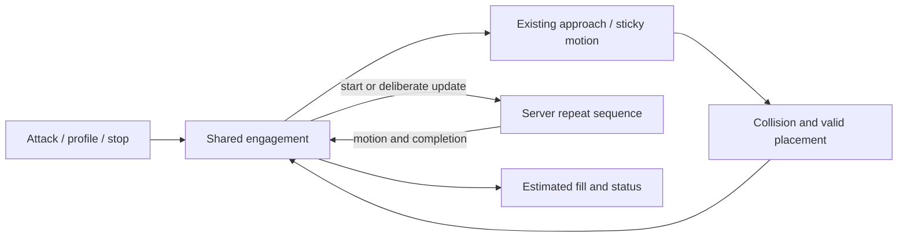

# Melee and missile combat with server-owned repetition

Status: implemented and accepted. The original melee/missile vertical slice passed automated validation on 2026-09-18; mobile missile locomotion and animation composition passed automated validation and user visual acceptance on 2026-09-19.

## Execution findings

- Core now owns desired engagement, one initial request, server-repeat observation, coalesced profile updates and explicit retirement. Initial readiness gates only unsent requests; an accepted sequence remains server-owned until terminal feedback. Frontends cannot generate cadence traffic.
- Initial world activation enables `AutoRepeatAttacks` once, after LoginComplete and before InWorld publication. The locally mirrored option prevents teleport/reveal retries from rewriting it.
- Melee approach is a client-directed physical drive bounded by the existing run-speed model. Static collision and EnvCell resolution remain in the movement system. Attack admission uses committed cylinder distance plus a covered, unobstructed static path. Missile never drives translation.
- Close-range swing movement remains the existing server-command sticky path, so authored action playback and collision resolution retain their current owners.
- h3d has a typed combat host/session contract, strict status decoding, settings schema v3 migration, and a dedicated `ClientCombatBar` with independent placement at the spell bar default.
- TUI attack intent, profile changes, cancellation, status display and scripting now consume the shared owner. The duplicate heartbeat/rearm/watchdog controller and its tests were deleted. `last_attack_time` is now `None` because a client request timestamp would misrepresent server repeats.
- Automated evidence: 2,594 h3d TypeScript tests, 315 h3d-host tests, 864 world tests and 312 TUI tests pass. Rust clippy passes for all affected packages with warnings denied; Svelte/TypeScript, ESLint, knip, formatting and the browser harness pass. The core suite passes 499 tests; three unrelated socket fixtures cannot open local sockets in the sandbox and fail with `Operation not permitted`.
- The browser HUD harness now drives the production combat bar through melee Attack→Stop, missile Accuracy mode, refill progress and stance hiding. It captures dedicated melee/missile screenshots without clipping or console errors. This does not substitute for live melee/missile behavior or final visual acceptance.
- Initial live acceptance found that melee pursuit incorrectly waited for confirmed combat stance, an elapsed charge could remain labeled `Charging` while another readiness gate was closed, and manual release could race ACE's delayed cancellation acknowledgement. Pursuit now starts during initial stance setup, an elapsed charge moves to `Waiting for readiness`, and retirement carries the observed interruption through the terminal acknowledgement. Attack admission remains gated on confirmed stance, physical range and a clear static path.
- The first instrumented outdoor run exposed a range-boundary error: core used ACE's `StickyDistance` of 4.0 as attack admission, so a visibly distant target was handed to ACE and the avatar waited for server sticky motion. Core now pursues to ACE's direct `MeleeDistance` of 0.6 before issuing the attack; the 4.0 server threshold is not the client's arrival distance.
- A second outdoor run exposed a movement ownership contract gap: releasing the final h3d movement key sent a passive idle synchronization, leaving `ActiveMovement::Manual` latched until an unrelated server gesture displaced it. The frontend/host/core contract now carries a scoped manual-release intent, so key release cannot stop a replacement movement owner; combat no longer treats release as a resume trigger.
- Live indoor acceptance confirmed the intended direct-pursuit policy: steering always points at the target's current pose, static collision remains authoritative, and no route planner solves corners. Engagement remains bound to the target sampled by the explicit Attack action even if frontend selection changes; the combat HUD now names that active target. Melee pursuit cancels when current physical separation reaches the validated runtime chase leash, which defaults to ACE's 96-meter creature bound and can be overridden for h3d with `--melee-max-chase-distance`.
- Retail observation then exposed oscillation between running and swinging at close range. The cause was local reuse of the initial 0.6-meter admission gate after ACE had already accepted the attack. ACE broadcasts each swing with `StickToObject` and sends `AttackDone(ActionCancelled)` only when the complete repeat sequence ends (`Player_Melee.cs:215-230, 413-428`). Core now releases its approach drive while any sent sequence remains live, allowing the existing server-command sticky solver to own target-relative motion. The 96-meter leash and explicit movement cancellation remain client-owned terminal bounds.
- Retail evidence changed the interruption policy: accepted jump charge (`acclient.c:390479-390512`) and new manual movement/control takeover (`acclient.c:416822-416883`) cancel automatic attack rather than preserving desire. Shared combat now clears engagement on manual acquisition, accepted ordinary or precise jump, and external server-directed locomotion. Passive held-state synchronization and release do not cancel; object movement/facing for the sent attack target remains combat-owned so ACE cannot cancel its own sequence.
- Follow-up evidence separates missile policy from melee. ACE's missile repeat loop does not test ordinary movement after accepting an attack (`Player_Missile.cs:280-304`), while retail requires the missile-ready forward command and cancels automatic attack after leaving that state (`acclient.c:390981-391000,391436-391464`). Mobile missile combat is therefore feasible against ACE but is a deliberate retail divergence. The existing h3d animation pipeline already composes locomotion legs/pelvis with gesture chest/arms/head; the missing work is exact missile gesture classification and combat/movement arbitration, not a second animation blender.
- Mobile missile implementation keeps sent sequences through manual movement and accepted jumps, defers initial and airborne control-update requests until grounded, and retires missile combat for any server movement directive that survives matching-turn suppression. World classifies only Reload `0x40000016` and AimLevel/AimHigh/AimLow `0x4000001e..0x4000002a`; local and remote tests prove their clocks, hooks, Ready returns and `Gesture` projection survive grounded/airborne/sliding locomotion. A local-content census found all 14 commands plus Ready across BowCombat, CrossbowCombat and AtlatlCombat in all nine humanoid motion tables, with zero missing among 378 combinations. The existing h3d compositor passed its 58 focused animation/entity tests unchanged.

## Goal and agreed scope

Add targeted melee and missile combat to h3d, a power/accuracy HUD, and aggressive, physically valid sticky melee. Share engagement/server-repeat control with the TUI and remove its periodic attack reissues.

- Enable ACE's persisted `AutoRepeatAttacks` option on world entry before allowing attacks. Leave it enabled; no restore-on-disconnect mechanism.
- Send one initial attack and let ACE own repeated swings/shots. Further requests are deliberate parameter updates or justified restarts after termination, never cadence/heartbeat traffic.
- Preserve intended melee engagement through recoverable server cancellations; explicit manual movement and accepted jumps clear it. Move the actual player body through existing movement and sticky solvers.
- Solid static geometry and valid EnvCell membership are mandatory. Dynamic pass-through is acceptable, but reuse current collision behavior first. Add a narrow exception only if pursuit testing demonstrates a need.
- Initiate/restart melee only within physical reach and a clear static path. Once a sequence is sent, ACE owns repetition and the existing physical solver blocks sticky movement at static geometry; core does not cancel an accepted sequence merely because initial admission becomes false.
- Accept that an already committed/server-scheduled swing can occur after the target escapes. Do not hide authoritative animation to claim a stronger range guarantee.
- Missile never chases. Once ACE has accepted a missile sequence, accepted manual locomotion and jumps preserve it while movement owns displacement and server aim/reload motions own the upper-body gesture. An initial unsent missile request waits for grounded readiness because ACE rejects requests made while jumping. Unrelated authoritative server locomotion may still retire the engagement.
- Show a combat HUD only in melee/missile runtime stance, at the spell bar's default location, with Power/Accuracy slider, fill, height and Attack/Stop.
- Preserve normal dual-wield alternation and attack sequencing by retaining ACE's repeat loop.

Out of scope: general pathfinding, automatic next-target acquisition, client-scheduled repeat swings, new damage/projectile simulation, speculative timeout/reconciliation infrastructure, platform-specific collision policy, unrelated TUI approach/follow cleanup, mobile melee, target-relative torso yaw/IK, locomotion-facing decoupling, and a new animation blender. Do not change ACE behavior or the retail decompile.

## Ground truth and integration neighborhood

Repository-relative references below are implementation evidence, not instructions to copy retail architecture.

| Source | What it establishes |
| --- | --- |
| `ACE/Source/ACE.Server/WorldObjects/Player_Melee.cs:49,138,169,215,240,255,360,395` | Request admission, fresh-engagement sequence resets, reach, completion/cancellation, repeats and sticky swing motion. |
| `ACE/Source/ACE.Server/WorldObjects/Player_Missile.cs:40,64-68,143,172-180,195-200,227,245,263-304,346` | Initial jumping rejection, range/trajectory admission, facing, aim/reload motion, repetition without an ordinary-movement guard, ammunition and termination. |
| `ACE/Source/ACE.Entity/Enum/MotionCommand.cs:29,37-49` | Exact missile motion commands: Reload `0x40000016`, AimLevel `0x4000001e`, and AimHigh/AimLow variants through `0x4000002a`. |
| `ACE/Source/ACE.Server/WorldObjects/WorldObject_Networking.cs:1156-1187` | Missile aim/reload are persisted server motions; projectile and ammunition updates remain separate authoritative events. |
| `ACE/Source/ACE.Server/Entity/AttackQueue.cs` | Power/accuracy requests queue; they do not replace a live attack target. |
| `ACE/Source/ACE.Server/Entity/DamageEvent.cs:181` | Damage reads current attack height; mid-swing updates can affect an existing attack. |
| `ACE/Source/ACE.Server/Network/GameAction/Actions/GameActionSetSingleCharacterOption.cs`, `WorldObjects/Player_Character.cs:46` | Existing option command, persistence, no dedicated acknowledgement. |
| `ACE/Source/ACE.Server/Network/NetworkSession.cs:530`, `Network/Managers/InboundMessageManager.cs:88` | Ordered fragment delivery and handler queuing. Send option before attack; no invented acknowledgement delay. |
| `acclient-eor-source/acclient.c:390379,391421,391593` | Refill timing, automatic versus request-producing fill, changed-power submission at completion. |
| `acclient-eor-source/acclient.c:390479-390512,390906-391001,391436-391464` | Retail jump cancellation, missile-ready stance/forward-command requirement and automatic-attack cancellation after readiness is lost. |
| `acclient-eor-source/acclient.c:331646` | MoveTo executes movement/turn nodes, then hands off to sticky targeting when requested. |
| `acclient-eor-source/acclient.c:371427` | Sticky horizontal correction, radii plus 0.3 m clearance, five-times-run-speed cap and facing. |
| `acclient-eor-source/acclient.c:308262,310862,310896` | Sticky modifies proposed movement; ordinary physics resolves collision/cell transition before committing position. |
| `apps/holtburger-cli/src/bin/tui.rs:540` | Current TUI already installs the shared content collision service; it is not a pose-only frontend. |
| `apps/holtburger-cli/src/navigation.rs:61,520,827` | Pursuit emits speed-bounded drive intent. Separate approach/follow arrival handling copies target height/cell and must not be reused for combat placement. |
| `crates/holtburger-core/src/client/{combat_runtime.rs,commands.rs,messages.rs,runtime.rs,types.rs}` | Existing wire execution, option command, feedback, tick and public contracts. |
| `crates/holtburger-core/src/client/{simulation.rs,movement/system.rs,movement/position_publication.rs}` | Local-player sticky integration, motion arbitration and accepted-position publication. |
| `crates/holtburger-world/src/{state/motion_resolution.rs,motion/directed.rs,motion/registry.rs,motion/registry/sticky.rs}` | Existing approach/motion machinery, sticky preparation, speed and server-command lifetime. |
| `crates/holtburger-world/src/motion/{state.rs,registry.rs,registry/remote.rs}` | Narrow spell/reach gesture classification and local/remote gesture clocks that can be extended for exact missile aim/reload commands. |
| `crates/holtburger-world/src/spatial/{body_movement.rs,mobile_contact.rs,scene/contact_collection.rs}` | Collision-resolved sticky travel; directional contact; remote stalled recovery already excludes LocalPlayer. |
| `crates/holtburger-world/src/state/world_container.rs:122` | ACE-compatible cylinder-distance primitive to extract, not copy. Container use radius is not melee reach. |
| `crates/holtburger-world/src/spatial/collision/{static_surface_ray.rs,surface_ray_path.rs}` | Existing coverage/topology-aware obstruction infrastructure. |
| `apps/holtburger-cli/src/pages/game/{combat.rs,domains/combat.rs,domains/navigation.rs,data.rs}` | Engagement/recovery precedent, heartbeat to remove and existing control defaults. |
| `apps/holtburger-3d/host/src/{client_runtime.rs,client_projection.rs,protocol.rs}` | Typed adapter; current chat projection discards attack lifecycle edges. |
| `apps/holtburger-3d/src/client/{ClientApp.svelte,ClientWorldView.svelte,ClientSpellBar.svelte,client-lifecycle-session.ts,client-host-contract.ts}` | Composition, stance visibility and session/transport patterns. |
| `apps/holtburger-3d/src/client/{client-ui-contract.ts,client-ui-defaults.ts,client-hud-layout.ts,client-settings-contract.ts,client-input-arbiter.ts}` | Placement, settings and input patterns. |
| `apps/holtburger-3d/src/lib/game/animation/{humanoid-gesture-pose.ts,humanoid-body-layout.ts}`, `systems/animation-system.ts`, `runtime/game-presentation-runtime.ts` | Existing generic composition takes legs/pelvis from locomotion and upper body from a classified gesture, then derives attachment frames from the composed pose. |
| `docs/animation_composition.md` | Current composition contract, supported humanoid layouts and spell-turn suppression precedent. |

### Findings that constrain implementation

- `AttackDone(None)` starts a repeat refill; it does not request another attack. Initial requests do not necessarily get `AttackCommenced`; mark them pending when sent.
- `AttackDone(ActionCancelled)` is terminal feedback, not proof of user cancellation. Retain desired engagement separately and consult actual error/target/mode state before restarting.
- Cancel during a committed attack finishes that attack. Cancel while already idle need not emit feedback. Delayed callbacks can emit old terminal events. Test simple cancel-then-restart; do not assume exactly one acknowledgement or invent wire correlation IDs.
- Retail's full refill takes one second, or 0.8 seconds in dual-wield stance. Attack/reload duration is separate. HUD fill is estimated presentation, not a scheduler.
- ACE selects the upcoming cycle before a completion-edge update can reach it. Slider changes may take an extra cycle. Accept the delay rather than model the whole server queue.
- Coalesce height with power/accuracy at completion rather than sending on every edit. This reduces poorly timed updates but cannot guarantee between-swing delivery: zero/short refill and network delay can let ACE begin another swing first. Accept server-owned timing; do not add a height synchronization protocol or claim exact retail height-button behavior.
- Fresh melee sequences reset dual-wield alternation. Server repeats preserve sequencing and avoid a round trip per swing.
- Both production clients already configure collision. Remove the earlier assumed permissive TUI spatial contract; do not add a frontend capability split for this feature.
- ACE continues an accepted missile repeat through ordinary player movement; range remains server-checked for every shot. It rejects only an initial request made while jumping. Preserve that distinction rather than treating all missile movement as one state.
- Retail cancels automatic missile attack when movement leaves its narrow ready pose. Preserving a missile sequence during locomotion is a deliberate gameplay and presentation divergence, not undocumented retail parity.
- Recognize only Reload and the contiguous AimLevel/AimHigh/AimLow command family as layerable missile gestures. Do not classify arbitrary substate commands by numeric category or broaden the existing gesture contract accidentally.
- Server projectile creation and ammunition placement remain authoritative. Gesture composition must not synthesize ballistics, release hooks or local ammunition timing.

## Physical approach versus close-range stick

There are two behaviors, both in shared runtime/physics:

1. **Approach:** issue ordinary turn/run movement toward the target through the existing movement owner. Running animation, speed, support and cell transitions come from the existing motion/physical pipeline.
2. **Close-range stick:** reuse the sticky solver to maintain spacing and facing, including during attack animation. Retail replaces proposed animation displacement with a bounded correction, then collision-resolves it. Our `StickyBodyTarget`/physical collection already supports that composition for the local player.

The correction may numerically resemble moving toward a point, but it is a **physical movement proposal**, not a rendered-position lerp or unconditional position write. Collision/support choose the accepted position and cell; only that result is published to ACE and used for reach.

Retail's chain is: `MoveToManager` runs movement/turn nodes → hands off to `StickTo`; `StickyManager::adjust_offset` computes the bounded correction → `UpdatePositionInternal` proposes a frame → `CPhysicsObj::transition` finds valid placement → commit. This provides the behavioral model without rebuilding retail's architecture.

Reuse ordinary approach locomotion outside contact range. Do not turn the five-times-run sticky correction cap into arbitrary long-distance travel. During a swing, preserve the authored clip/hooks while sticky movement owns displacement; never add the discarded root displacement a second time or restart animation on target updates.

Keep desired engagement alive across existing sticky leases and action completion. Accepted sequences rely on ACE motion updates and the existing physical solver; do not make mob leases permanent or impersonate received commands.

Release the approach drive exactly once at the sticky handoff. Existing client-directed Acquire clears sticky admission, while a retained client-directed drive continues supplying locomotion/actuation. Do not Acquire every tick or leave a run drive active alongside sticky displacement. Use existing update/release semantics, preserve received swing actions, and return to ordinary approach only after ACE retires the sequence with terminal cancellation feedback. Verify both handoffs against committed range and existing retail distance rules; do not introduce tunable pursuit modes.

TUI currently emits speed-bounded drive intent, not simply a visual lerp. Its separate arrival helper copies target Z/cell without proving placement. Do not reuse that helper. Repairing unrelated approach/follow UX stays outside this feature.

No pathfinding: a wall may block pursuit. Preserve engagement and resume when direct movement becomes possible. Readiness uses committed bodies, not the sticky reference beyond a wall. Missing collision coverage waits; it never means clear space.

## Ownership, contracts and defaults

| Layer | Responsibility |
| --- | --- |
| Core | Desired engagement; start/update/stop; server-repeat lifecycle; mode-specific readiness and movement-interruption policy. |
| World | Committed body geometry, reach/obstruction, existing motion/collision resolution and exact server-motion gesture classification. |
| h3d host | Narrow typed intent/status projection, initial snapshot and teardown. |
| Frontends | Target/input policy, control preferences, HUD layout/presentation and generic pose composition. No attack timers or combat-specific ballistics. |

Use one focused engagement reducer plus existing wire execution. Intents are begin(target, discriminated melee/missile profile), update profile, and stop. Profile carries height and power or accuracy. Expose only desired target/profile, control status and estimated refill. TUI script engagement/target queries consume this shared snapshot too; they must not retain a second owner. Shape state around implemented transitions; no speculative metrics, generic policy registries or model of ACE's entire queue.

World derives physical facts once; core decides admission once; consumers read status. Preserve damage/error chat separately.

Tick order: ingest intent/feedback → choose movement → physical solve → publish accepted position → admit initial/restarted attack → publish status. A full HUD bar never sends a request. Profile updates do not force position publication.

Choose/enqueue combat movement before `MovementSystem::tick` in `client/runtime.rs`, not merely before the later simulation call. Post-solve attack admission rechecks current busy/equipment/stance state: moving sends out of command dispatch must not bypass its existing inventory-operation exclusions. Stop remains immediately admissible. Core owns the initial charge deadline; only repeated fills are display-only.

Establish auto-repeat on successful initial activation after LoginComplete and before active snapshot/attack admission, sharing preparation with supported alternate entry paths. Do not resend on every teleport/reveal retry. Beginning from peace may request the equipment-derived stance and wait for confirmation; distinguish that initial wait from departure from an established combat stance.

| Event | Minimal behavior |
| --- | --- |
| World entry | Enable auto-repeat before attacks through existing ordered command delivery. |
| Begin | Capture target/profile, initial charge, approach in melee, send once when ready. Missile never requests chase translation; an initial missile request waits until grounded. |
| Manual movement | Retire melee engagement on accepted takeover. Preserve an accepted missile sequence and layer its aim/reload gesture over locomotion; do not let same-target server facing steal manual displacement. |
| Jump | Retire melee engagement on an accepted jump. Preserve an accepted missile sequence through jump/landing; do not send a new missile request while airborne. |
| Repeat completion | Update fill; no request if controls unchanged. |
| Slider/height edit | Keep latest preference; submit one coalesced update at completion; accept delayed application. |
| Recoverable termination | Restart once readiness permits while engagement remains desired; no unconditional cancellation rearm. |
| Stop | Clear desire first, then cancel; late feedback cannot rearm. |
| Explicit retarget | While a sequence is active/pending, retain the latest replacement, send one cancel and wait for terminal feedback. ACE otherwise updates controls and ignores the new target. If already terminal/idle, do not wait for a cancel acknowledgement that ACE need not send. Test delayed/duplicate terminal feedback before adding further handling. |
| Static obstruction | Blocks initial/restart admission and physical travel. Accepted sequences remain server-owned until terminal feedback; no per-tick cancel/attack spam. |
| Death, missing target, teleport, session replacement, leaving engagement stance | Clear engagement; no automatic next target. |
| Missing feedback | Honest waiting state; no heartbeat or invented successful cancellation. Stop revokes desire, but uncertain server retirement may still prevent safe restart. Report that limitation; add automated recovery only for a reproduced problem. |

Reuse existing manual movement/jump arbitration, with combat mode deciding whether takeover is terminal. Accepted manual movement or jump clears melee desire. It preserves a sent missile sequence, while an unsent missile request remains desired and waits for grounded readiness. Passive synchronization and release cannot restart a retired sequence. Selecting an unrelated inspection object does not silently retarget; only explicit attack intent replaces the active target.

## Mobile missile locomotion and presentation

Implement mobile missile combat by extending three existing owners rather than introducing a parallel controller:

1. **Core combat policy:** make movement interruption depend on the active combat profile. Preserve sent missile desire/sequence through accepted manual locomotion and jumps. Keep melee cancellation unchanged. Continue to cancel for death, missing target, teleport, stance/equipment loss, explicit Stop and unrelated authoritative server locomotion.
2. **World motion classification:** add typed missile aim and reload gestures for the exact ACE command values. Preserve their clocks and hooks while manual locomotion, airborne motion or sliding supplies displacement. Apply the same classification to local and remote actors so the animation contract remains coherent.
3. **h3d presentation:** reuse the generic humanoid gesture composer. Compatible bodies take legs/pelvis from locomotion and chest/arms/hands/head plus upper-body extras from the missile gesture. Unsupported body topologies retain the existing full-body fallback.

During a live sent missile sequence, acknowledge but do not install a matching local, non-autonomous `TurnToObject` directive for the active target, following the spell-casting precedent. Otherwise ACE's per-shot facing can replace player locomotion even though its attack loop permits movement. Keep nonmatching targets, autonomous directives and unrelated server locomotion authoritative.

Missile aim clips encode vertical pitch, while horizontal aim normally comes from whole-body rotation. Suppressing same-target turns can therefore make an off-axis shot look sideways while the player steers elsewhere. Start with the existing spell-equivalent composition and measure this in live acceptance. Target-relative torso yaw, IK and movement-facing decoupling remain a follow-up only if the visible error is unacceptable.

Add a `RETAIL DIVERGENCE:` marker at the mode-specific interruption/readiness policy, citing `acclient.c:390981-391000,391436-391464` and the jump behavior at `390479-390512`. State that restoring retail behavior would make manual locomotion or jumping cancel automatic missile fire. The implemented control-flow census is drive-intent acquisition, the melee active-manual guard, ordinary jump acceptance, precise jump commitment and `SelfServerControlledMotion`. The animation census covers all 14 exact missile commands in three missile stances across nine humanoid motion tables, 22 supported humanoid layout entries and four Olthoi entries on the existing unsupported-topology fallback.

## HUD

- One component switches Power/Accuracy, with low/middle/high height, Attack/Stop, fill and concise waiting feedback.
- Default to the spell bar anchor/offset; independent saved placement. Reuse HUD wrapper, theme, fitting and layout editing.
- Runtime visibility requires active world and confirmed melee/missile stance. Preserve magic spell-bar behavior. Layout preview is inert.
- Use existing TUI medium-profile/middle-height defaults. Persist local control preferences in existing character settings, never live target/engagement.
- Use simple event-aligned refill estimates. Reuse timing projection conventions or elapsed/remaining durations across the host boundary; Rust Instant is not a browser clock. Accept delivery drift without a new clock reconciliation subsystem.
- Keep simulation-rate data out of Svelte. An imperative session/display owner supplies bounded HUD updates and survives conditional mounting.
- Extend existing input ownership; editors/modals/focused action bars retain priority. No global listener in the component. Stance hiding, blur and pointer cancellation retire gestures safely.

In layout mode, use one simple spell/combat preview choice so both default-overlapping bars can be selected and moved. Do not mount two indistinguishable interactive previews atop each other.

## Phases

### Phase 1 — Shared repeat owner

Deliverables: focused core engagement module and command/event/snapshot/runtime integration. Exercise melee lifecycle with fixtures; full physical melee and TUI cutover land together in Phase 3. Keep the current TUI owner until that cutover, avoiding a temporary navigation bridge.

- [x] Establish auto-repeat at initial activation through existing ordered delivery, before active publication/attack admission. Cover alternate entry, reconnect and teleport without redundant writes. Surface failures; local update is not a server acknowledgement.
- [x] Add begin/profile/stop and minimal status.
- [x] Implement one initial request, repeat observation, coalesced profile updates, explicit stop and readiness-based restart.
- [ ] Test pending replacement versus active/idle cancellation during swing/refill, zero-power repeats and delayed feedback. Use a focused non-interactive live trace for actual races; add further handling only when demonstrated.
- [ ] Preserve busy/equipment exclusions at post-solve dispatch; attack completion is not UseDone. Test begin-from-peace, equipment changes during charge and Stop while busy.
- [x] Inventory targeted-attack callers, including scripts/harnesses; route new h3d intents through the shared owner. Remove the old TUI path at Phase 3 cutover; never activate both owners for one session.
- [x] Add desired engagement/status to application snapshots and updates for frontend/script consumers; do not infer desire from raw completion events.
- [x] Test persistent rejection and late feedback: no tight retry loop, no stale rearm after Stop.

Acceptance: controller fixtures prove one start and zero per-cycle requests, bounded updates, recoverable restart, persistent Stop and sequence continuity. Production melee/dual-wield proof follows physical integration in Phase 3.

### Phase 2 — Missile and h3d HUD vertical slice

Deliverables: host/session contracts, `ClientCombatBar.svelte`, app/world-view composition, layout/settings/input, browser probe.

- [x] Extend host client commands/projection, `CLIENT_COMMAND_NAMES`, browser `src/lib/host/host-transport.ts` allowlist, and lifecycle-session command types. Hydrate/reset combat status in snapshots and events. Verify the real transport path, not only direct component calls.
- [x] Add surface/defaults, independent placement and preferences through existing settings. Add a versioned disk migration: current strict v1/v2 documents share character schema definitions, so preserve historical shapes before extending them. Update the Electron store's emitted version and defaults; test v1/v2 upgrades preserving existing layout, bindings and unrelated preferences.
- [x] Render Accuracy/height/Attack/Stop and estimated fill. Full display never triggers a browser attack request.
- [x] Reuse input/gesture ownership and stance/layout visibility.
- [x] Handle facing, equipment/ammunition and server range errors without chasing or retry spam. Do not duplicate ballistics or add a straight-ray shot gate.
- [ ] Exercise firing/reload, controls, final ammunition, cancellation, stance changes and teardown with existing harness/probes.

Acceptance: server-repeated missile combat works without translation; settings/input/visibility work; user accepts HUD appearance.

### Steering check — Expand only for demonstrated failures

- [ ] Review packet counts and actual cancel/retarget traces; avoid generic correlation/timeout machinery.
- [ ] Remove unused state/helpers and compare shared additions against TUI deletions.
- [ ] Walk melee approach → accepted pose → attack → sticky swing → refill → obstruction through current code. Resolve one displacement owner and animation handoff before adding code.

### Phase 3 — Shared physical melee

Deliverables: world reach helper, core approach/sticky integration, melee HUD mode and focused physical tests.

- [x] Extract existing cylinder-distance math; use committed scaled bodies and proven melee threshold, not target use radius. Phase 3 activates production melee only after this readiness path exists.
- [x] Add only the static obstruction/topology check needed to reject blocked/unconnected targets. Unknown coverage cannot authorize attacks.
- [x] Approach through existing turn/run movement and collision, with real locomotion animation and accepted-position publication. No target Z/cell copying or direct arrival-pose assignment.
- [x] Reuse close-range sticky displacement/facing during attacks while engagement persists. Preserve server lifetimes and one hook/root-motion owner.
- [x] Retain manual/jump/grounded arbitration; distinguish approach speed from sticky correction speed.
- [x] Reuse collision policy first. Dynamic collision policy remains unchanged pending live evidence.
- [x] Gate starts/restarts by physical reach and publish the position they rely on. After admission, retain server sequence ownership while static collision blocks physical travel; accept already committed swings.
- [x] Cut the TUI over to shared engagement and pursuit together. Migrate controls, scripted combat views and cancellation consumers; remove its heartbeat and duplicate rearm/watchdog state. Never leave both drivers active.
- [x] Audit scripting's `last_attack_time`; return no timestamp rather than mislabeling client requests as server swings.
- [x] Add Power and dual-wield estimated refill to the same HUD.

Acceptance: approach looks like movement; swings preserve authored animation; fleeing/reversing targets retain aggressive stickiness; walls hold; valid EnvCell transitions work; different floors cannot qualify by XY alone; manual control and Stop work. Existing exclusion of LocalPlayer from remote relocation recovery remains intact.

### Phase 4 — Verification, cleanup and user acceptance

- [ ] Count requests over unchanged cycles, one control update and one recoverable restart: no cadence traffic.
- [ ] Check cancel/retarget in approach/swing/refill/reload, death, teleport, stance/equipment change and ammunition exhaustion.
- [ ] Check moving target, wall, doorway/cell boundary, separate floor, dynamic crowd, manual/jump override and missing geometry.
- [ ] Check approach/swing transitions and hooks visually using non-interactive browser/live-client evidence. User owns visual and combat-feel acceptance.
- [x] Delete obsolete TUI attack controllers/tests/vocabulary; do not preserve wrappers around dead state.
- [x] Review boundaries, complexity and source-line impact. The final diff is approximately line-neutral including the plan and browser probe; shared combat replaces the larger TUI controller and obsolete navigator.
- [x] Update the original implementation record. Its shipped behavior required no new retail quirk/divergence marker; the planned mobile missile policy in Phase 5 does.
- [x] Run affected tests/lint/type/format checks. Permanent tests do not require untracked runtime assets.

Validation: use focused existing package scripts first. Rust packages: `holtburger-core`, `holtburger-world`, `holtburger-cli`, `holtburger-3d-host`; run affected `cargo test`, `cargo clippy ... --all-targets -- -D warnings`, and `cargo fmt --all -- --check`. h3d: `npm run test:ts -- <affected tests>`, `npm run check`, `npm run lint:ts`, `npm run lint:dead`, `npm run format:check`, and existing browser/client probes. Confirm supported arguments. Never run the interactive TUI for diagnostics. Report exact missing live prerequisites rather than substituting synthetic evidence silently. Do not stage or commit without a separate request.

### Phase 5 — Mobile missile policy and gesture composition

Deliverables: mode-specific combat interruption, exact missile gesture classification, same-target facing suppression and reuse of h3d's existing locomotion/gesture composer. No ACE or retail-decompile changes.

- [x] Replace blanket combat interruption on manual movement and accepted jumps with a profile-aware decision. Preserve sent missile sequences and desired target/profile; keep current melee retirement behavior.
- [x] Gate an unsent missile request and any airborne control-update request on grounded readiness. Preserve an accepted sequence through jump and landing unless authoritative terminal feedback or another existing terminal condition ends it.
- [x] Classify Reload `0x40000016` and AimLevel/AimHigh/AimLow `0x4000001e..0x4000002a` as typed missile gestures. Extend the local and remote gesture-retention paths without treating unrelated substates as composable.
- [x] Preserve gesture time, action hooks and server Ready completion while locomotion/airborne/sliding motion owns displacement. Keep unsupported body topology on the current full-body fallback.
- [x] Suppress installation of a matching local, non-autonomous `TurnToObject` only while a sent missile sequence against that target is live; acknowledge it through the existing command path. Preserve other server directives.
- [x] Reuse the existing h3d gesture composer and attachment-frame output. Its existing generic gesture-composition tests cover the newly classified activity without missile-specific renderer code.
- [x] Preserve authoritative projectile creation, range failure, ammunition placement and final-ammunition termination. Do not infer a release event from animation time.
- [x] Add the required `RETAIL DIVERGENCE:` comment with retail citation, behavioral consequence and repository census.
- [x] Add focused core/world tests for melee-versus-missile interruption, grounded request gating, live jump continuation, exact command boundaries and same-target turn suppression; retain the existing generic renderer pose-composition tests.

Acceptance: walking, reversing, strafing, turning and jumping do not terminate a server-accepted missile sequence; melee still cancels on accepted manual movement/jump; no client cadence requests, chase translation, synthetic projectile timing or broad gesture classification are introduced.

### Phase 6 — Mobile missile live acceptance and cleanup

- [x] Exercise live missile locomotion through movement and jump/land; retain existing final-ammunition, range-failure and explicit-Stop handling. The content census covers all bow, crossbow and atlatl command cycles across every humanoid motion table.
- [x] Confirm gesture clocks do not restart on locomotion changes, hooks fire once, attachments follow the composed pose and unsupported body topologies retain a coherent full-body fallback through focused world/renderer tests and live visual acceptance.
- [x] Inspect off-axis shots while steering. The user accepted the spell-equivalent result without a target-relative torso-yaw follow-up.
- [x] Preserve deterministic retirement for target death/disappearance, teleport, stance/equipment loss and unrelated server-directed movement through the existing shared engagement lifecycle and focused directive tests.
- [x] Remove superseded blanket-policy vocabulary/helpers, update `docs/animation_composition.md`, and run the affected Rust and h3d validation listed above.

Acceptance: the user accepts mobile missile feel and animation blending in a live session, all automated checks pass, and the documented retail divergence matches the implemented policy.

## Risks and proportional responses

| Risk | First response |
| --- | --- |
| Duplicate repeats or queue growth | One owner, completion-edge coalescing and request-count checks. |
| Late cancellation during retarget | One pending replacement while retiring; test delayed feedback and fix reproduced races without fabricated wire IDs. |
| Persistent rejection/silence | Honest waiting/stopped state; no heartbeat; do not claim a safe restart while server retirement is unknown. |
| Invalid pursuit placement | Physical movement only; use committed pose/cell for readiness/publication. |
| Sliding/duplicate root travel | Distinguish approach locomotion from close-range correction; one authored hook owner. |
| Dynamic bypass removes support/static blocking | Add no exception until needed; test the exact affected contact and static barrier. |
| HUD differs from server's queued cycle | Accept estimated fill and update delay; no exact queue model. |
| Gesture classification captures unrelated motions | Match the enumerated Reload/Aim command values and test both range boundaries plus unrelated substates. |
| Same-target facing steals player control | Suppress only the matching local non-autonomous turn during a sent missile sequence; leave other directives authoritative. |
| Steering makes an off-axis shot look sideways | Evaluate live with the spell-equivalent composition; defer torso yaw/IK until the visual error is demonstrated. |
| Initial airborne attack enters retry churn | Keep desire pending behind an explicit grounded readiness gate; send once after landing. |
| Composition invents projectile or ammunition timing | Keep those events server-owned and retain animation hooks only as presentation events. |

## Definition of done

- [x] Both clients enable server repetition and share one engagement owner.
- [x] No unchanged-cycle attack requests; Stop stays stopped.
- [x] Missile never chases; melee physically approaches/sticks through existing motion/collision.
- [x] Static walls remain collision-owned, cells remain physics-owned, starts/restarts require accepted physical reach.
- [x] Dual wield and authored attack/reload motion remain server-driven.
- [x] HUD mode, placement, preferences and input work; user accepts visuals/sticky feel.
- [x] Focused checks/runtime evidence pass; obsolete state is removed.
- [x] Accepted missile sequences survive manual locomotion and jump/landing without chase or cadence traffic; melee interruption remains unchanged.
- [x] Exact missile aim/reload gestures feed the existing supported-humanoid composition contract, retain server timing/hooks and preserve the full-body fallback elsewhere.
- [x] Same-target missile facing cannot steal manual locomotion; all other terminal conditions and authoritative directives remain effective.
- [x] The mobile missile retail divergence is marked with its evidence, consequence and census, and the user accepts off-axis presentation.

## Remaining small decisions

Shortcuts and explicit retarget UX can be refined separately. Live acceptance approved the current approach/sticky handoff, movement cancellation, and spell-equivalent missile gesture composition; no torso-yaw follow-up is required for this slice.

The implementation, automated validation and user acceptance are complete.

## Final code-quality review

Reviewed core engagement/movement ownership, world physical reach and gesture classification, host command/event projections, browser lifecycle/HUD/settings consumers, and the TUI command/status cutover. Removed the unreachable TUI sticky navigator, its obsolete tests and no-op tick hook. Removed local mutation of core-owned combat status on TUI selection changes; cancellation still sends the shared Stop command and status follows core publication. Corrected superseded obstruction/continuation claims above to describe the accepted server-owned sequence policy.

Accepted limitations: refill is a presentation estimate; server feedback has no request correlation ID; missing terminal feedback can leave retirement waiting. Prior live acceptance is retained. This review does not claim a new live audit of every cancellation/retarget phase or every weapon layout. Historical unchecked verification items above remain unclaimed.

Review validation: 513 core tests pass with local UDP socket permission, 308 TUI library tests pass after removing four obsolete navigator tests, and 120 focused frontend tests pass. Svelte/TypeScript checks, ESLint, knip, and clippy for core/world/TUI/h3d-host pass with warnings denied.
