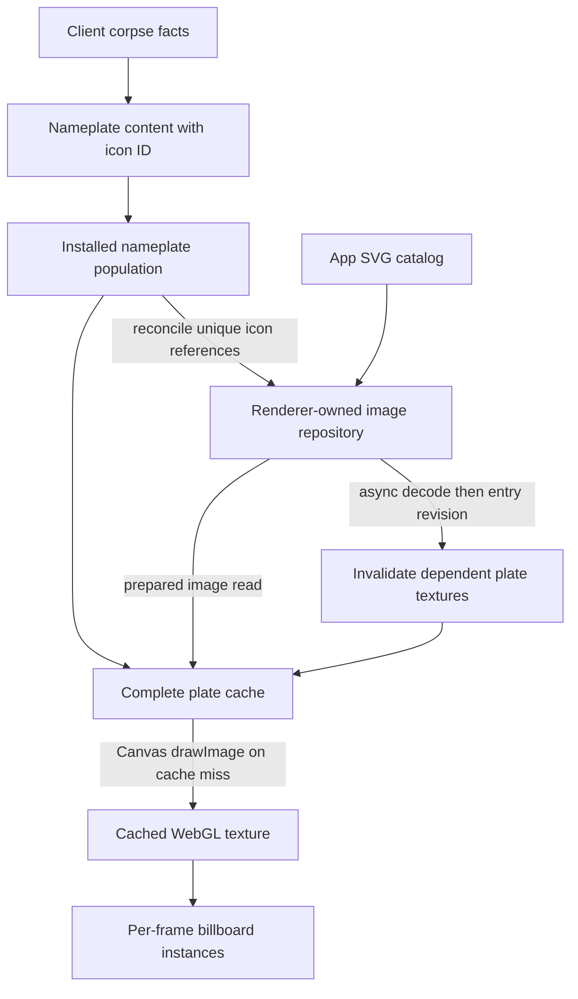

# Nameplate SVG Indicators

Status: Implemented on 2026-09-20. Automated and browser acceptance pass; final icon artwork is awaiting user visual acceptance.

## Context and boundaries

Render arbitrary app-provided SVG artwork in the existing nameplate indicator row, with an opened-corpse icon as the first consumer.

Before this implementation, the working tree already contained corpse history, selection hotkeys, and multiline nameplates. Its indicator contract was `readonly string[]`, and opened corpses supplied a checkmark. This implementation replaced that representation while preserving the pre-existing work and dirty reference submodules.

In scope:

- Typed SVG indicators, a small catalog of SVG sources, asynchronous browser image preparation, and explicit resource lifetime.
- Ordered indicators below the name and optional level; empty rows consume no height.
- Cached complete nameplate textures, including correct refresh after icon preparation.
- A bundled opened-container SVG whose meaning is “previously opened,” not “empty” or “fully looted.”
- Focused lifecycle tests and real-browser evidence for SVG composition, readiness, and texture reuse.

Out of scope: workers, icon animation, remote/user-uploaded SVG ingestion, a general SVG sanitizer, DAT inventory-icon integration, a glyph atlas, nameplate placement changes, and changes to corpse history or traversal policy. “Arbitrary SVG” means complete, self-contained SVG image assets rather than a hard-coded set of path commands. External resources, scripts, and document CSS inheritance are outside the asset contract.

## Ground truth and existing patterns

All paths below are relative to `apps/holtburger-3d/` unless otherwise indicated.

| Source                                                                               | Relevant ownership or behavior                                                                                                                                                                                                                                                 |
| ------------------------------------------------------------------------------------ | ------------------------------------------------------------------------------------------------------------------------------------------------------------------------------------------------------------------------------------------------------------------------------ |
| `src/lib/game/systems/dynamic-presentation-source.ts`                                | Renderer-neutral `NameplateContent`: name, optional level, and ordered indicator values.                                                                                                                                                                                       |
| `src/client/client-presentation-session.ts`                                          | Joins corpse facts to frontend presentation and supplies the opened-container icon identity.                                                                                                                                                                                   |
| `src/lib/game/runtime/dynamic-entity-presentation.ts`                                | Adapts authority display facts to undecorated nameplate content.                                                                                                                                                                                                               |
| `src/lib/game/runtime/game-presentation-runtime.ts`                                  | Retains nameplate overrides through asynchronous entity realization and ordinary updates.                                                                                                                                                                                      |
| `src/lib/game/systems/dynamic-entity-system.ts`                                      | Owns content equality and nameplate population revision.                                                                                                                                                                                                                       |
| `src/lib/game/renderer/webgl2-nameplate-texture-cache.ts`                            | Synchronous Canvas rasterization on cache misses, value-keyed GPU texture sharing, residency reconciliation, destruction.                                                                                                                                                      |
| `src/lib/game/renderer/webgl2-renderer.ts`                                           | Population reconciliation is gated by entity revision, appearance, density, and viewer identity. Flat and portal draws synchronously acquire cached plates.                                                                                                                    |
| `src/lib/game/renderer/nameplate-policy.ts`, `src/lib/frontend-tuning.ts`            | Layout and appearance policy; raster density comes from renderer settings.                                                                                                                                                                                                     |
| `src/app/ui-icon-repository.ts`                                                      | Existing browser `Image.decode()` and object-URL lifecycle; entry identity rejects stale completions and failures are reported. This repository handles host-prepared inventory images, so reuse its proven lifecycle pattern without coupling nameplates to inventory policy. |
| `src/harness/browser/synthetic-nameplate-workload.ts`, `scripts/browser-harness.mjs` | Production browser/rendering harness to extend with SVG cases.                                                                                                                                                                                                                 |
| `docs/plans/holtburger-3d-entity-nameplates-plan.md` (repo root)                     | Original design explicitly reserves extension through Canvas composition.                                                                                                                                                                                                      |

Browser behavior must be proven in the supported Chromium/Electron path during implementation. Use SVG-backed `HTMLImageElement` decoding as the initial implementation candidate. Do not assume that `createImageBitmap(svgBlob)` provides equivalent SVG support or resolution behavior without testing it.

## North stars and constraints

1. Game facts stay authoritative; SVG identity, color, and artwork are frontend presentation concerns.
2. Decode once per retained source. Movement and animation must not cause decoding or Canvas rerasterization.
3. Keep frame acquisition synchronous. Schedule asynchronous image preparation outside the draw path; never await image decoding in a frame.
4. Readiness belongs to the icon owner. Entity facts must not fabricate updates merely to refresh pixels.
5. Preserve value sharing across entities and invalidate only plate textures that depend on changed icons.
6. Resource ownership must survive removal, reappearance, and teardown during decoding.
7. Prefer a small concrete SVG path through existing layers. Additional content kinds need actual consumers.

Concessions: names and levels remain visible while icons load. Reserve icon slots so readiness does not move the text. A failed icon keeps its slot empty and reports a contextual diagnostic once per preparation attempt. No automatic retry loop; a new owner or explicit re-registration can retry. Artwork is static and explicitly colored; arbitrary SVG recoloring is not promised.

## Contracts, ownership, and flow

Use a branded `NameplateIconId`, constructed by catalog registration, and an ordered indicator contract such as `{ kind: "icon", iconId: NameplateIconId }`. Remove the glyph-string representation in the same cutover. A text variant can be added when a real producer needs one; existing name and level rows remain text.

Each registered source contains self-contained SVG markup and a diagnostic label. The catalog is immutable for a renderer lifetime: one ID identifies one source. Conflicting registrations fail explicitly. Markup, image objects, promises, and object URLs never enter entity facts or the host wire contract. Do not add accessibility metadata without a named accessibility consumer; Canvas artwork alone does not expose it.

Suggested implementation files:

- `src/lib/game/renderer/nameplate-icon-source.ts`: source/ID contracts and catalog lookup.
- `src/lib/game/renderer/nameplate-icon-repository.ts`: prepared-image owner with injected decoding/reporting services and entry states.
- `src/lib/game/renderer/nameplate-icons/opened-container.svg`: initial authored asset, imported as source through the app build.

These are app-local presentation facilities. Keep the catalog separate from retained browser resources. The renderer owns the repository alongside its nameplate texture cache and disposes both. Pass the prepared-image read interface into the compositor; the compositor does not fetch or decode.

Repository entries have a discriminated state: `loading`, `ready` with decoded image, or `failed` with error detail. Start preparation on population reconciliation, scheduled outside synchronous draw work. Deduplicate concurrent requests. Late completions are accepted only while the exact entry is still retained and the owner remains alive.

Retain sources used by the installed population, matching existing plate residency policy. On final release, revoke owned object URLs and release decoded-image references. If decoding completes after release or destruction, discard it and release any newly produced resources. Document whether URLs live until decoded-image retirement; use one consistent ownership rule and verify it in the browser. GPU resources remain exclusively owned by the plate cache.

The existing renderer reconciliation guard will otherwise miss image readiness. Add a cheap completion revision/notification path independent of world revision. At a frame boundary, drain changed icon IDs and invalidate their dependent cached textures. Maintain dependencies during cold population reconciliation; do not enumerate all entities or serialize SVG on every frame. Offscreen plates rebuild lazily when acquired. If several icons settle before a frame, coalesce their invalidations. A disposed renderer cannot publish readiness or allocate textures.

Complete visual keys include ordered indicator IDs alongside current name, level, category, style, and density. Content equality compares indicator values and order. Readiness invalidation must also defeat any memoized cache-key/binding assumptions; either explicitly delete affected texture entries or include dependency versions consistently. Prefer explicit entry invalidation with stable source IDs, and keep one mechanism for it.

Layout uses a tuning-owned square icon slot size and gap, centers the whole indicator row, and preserves each SVG's aspect ratio within its slot. Support self-contained SVGs with an explicit viewBox and usable intrinsic dimensions. Measure the complete plate from the maximum row width. Scale Canvas backing dimensions using the existing renderer density, not a new `window.devicePixelRatio` policy. A density change rerasterizes plates at the new resolution; verify decoded SVG-backed images retain suitable quality at that size.

## Phase 1: SVG preparation and resource ownership

Deliverables:

- Implement the source catalog and repository described above with injectable browser decode/report services.
- Register the initial opened-container artwork; keep its exact visual design provisional until user acceptance.
- Add focused tests for shared preparation, failed decoding, release during decoding, re-acquisition after release, and destruction before completion.
- Exercise an actual SVG decode and Canvas draw in the browser early, including non-square artwork and a fixture using multiple shapes/transforms or gradients.

Acceptance criteria: equal retained IDs decode once; unknown IDs fail with context; late completions cannot revive released entries; every owned URL is released; full SVG fixtures draw successfully using the selected API.

Checklist:

- [x] Source identity and conflict policy implemented.
- [x] Browser decoding verified with complete SVG fixtures.
- [x] Lifecycle and failure tests pass.

Decisions/course corrections: Chromium successfully decodes the bundled 64-by-48 SVG through `HTMLImageElement.decode()` from an SVG Blob URL and draws it through Canvas 2D. The repository retains that URL until the prepared image leaves the installed nameplate population or the renderer is destroyed; failure before publication revokes it immediately. The asset exercises a non-square viewBox, multiple shapes, a transform, and gradients.

## Phase 2: Indicator cutover and readiness integration

Deliverables:

- Replace glyph arrays with typed icon indicators across content, adaptation, overrides, equality, and corpse projection.
- Extend renderer construction/destruction and population reconciliation to own icon preparation.
- Implement dependent texture invalidation for image completion, including the existing reconciliation guard and memoized visual keys.
- Replace indicator typography with icon slot/gap tuning; draw prepared images into the existing final row.
- Keep a usable nameplate while icons prepare, and report failures without turning them into per-frame retries.

Acceptance criteria: a successfully opened corpse displays the SVG below its unchanged name; late readiness updates a plate without a world publication; two identical plates share one texture; ordered icon changes replace pixels; movement alone produces zero new decodes/rasterizations after warmup; clearing history removes the icon; asynchronous entity realization does not lose decoration.

Checklist:

- [x] Glyph contract and checkmark producer replaced together.
- [x] Layout, equality, cache keys, and readiness invalidation updated.
- [x] Flat and portal consumers retain synchronous texture acquisition.
- [x] Integration tests cover late readiness, removal, and multiple icons.

Decisions/course corrections: population reconciliation now collects unique icon IDs only when the installed nameplate population changes. Repository settlements publish changed IDs independently; the renderer drains those IDs at a frame boundary and invalidates only complete textures that record the dependency. No general asset framework or asynchronous draw API was needed.

## Phase 3: Cleanup and acceptance

Deliverables:

- Remove superseded glyph-specific fields, fonts, comments, tests, and helpers. Search for checkmark suffixes and string-array indicator assumptions.
- Extend the canonical browser harness with opened-corpse and generic SVG indicator fixtures. Include delayed readiness and removal-before-readiness probes using controlled preparation.
- Verify one-, two-, and three-row plates, multiple icons, non-square artwork, and two render densities. Include a portal rendering case because it shares textures but has separate submission routing.
- Capture a readable screenshot of the actual SVG row for user visual acceptance. Do not treat the existing repeated-100 workload alone as proof of SVG rendering: its ordinary name/level plates do not exercise the new icon path.
- Run `npm run check`, `npm run lint:ts`, `npm run lint:dead`, relevant `npm run test:ts -- ...` cases, and `git diff --check`. Broaden tests if integration changes warrant it. Rust is outside this implementation unless inspection proves a necessary boundary change.

Acceptance criteria: browser probes pass without unexpected console errors; repeated settled frames reuse existing raster/texture resources; teardown produces no late publication; screenshots demonstrate the intended row; static checks pass.

Checklist:

- [x] Obsolete glyph mechanisms removed.
- [x] Browser evidence recorded with exact command, render density, and fixture.
- [ ] User visual acceptance recorded or clearly pending.
- [x] Relevant checks pass and remaining limitations documented.

Decisions/course corrections: deterministic delayed-completion, removal-before-completion, failure, reacquisition, and teardown races are tested at the repository boundary with injected preparation. The browser harness independently proves the production SVG decoder, placeholder-to-ready texture replacement, settled reuse, two- and three-row layouts, repeated icons, render scales 1 and 2, and portal-mode submission. This splits deterministic race proof from browser API proof without exposing test-only preparation controls through production renderer construction.

### Acceptance evidence

- Full Vitest run: 326 files and 2,617 tests passed.
- Chromium/SwiftShader, scale 1, two-row opened-corpse fixture and screenshot:
  `npm run harness:browser -- --brief --nameplate-workload svg-icon --measure-ms 0 --camera-pitch 0 --screenshot /tmp/holtburger-svg-nameplate-current.png`
  The final diagnostics reported one ready preparation, zero loading/failed icons, two rasterizations (placeholder and ready), one released placeholder texture, one live texture, and no page-console messages.
- Chromium/SwiftShader, scale 2:
  `npm run harness:browser -- --brief --nameplate-workload svg-icon --render-scale 2 --measure-ms 0 --camera-pitch 0`
- Chromium/SwiftShader, three-row and repeated-icon fixtures:
  `npm run harness:browser -- --brief --nameplate-workload svg-icon-level --measure-ms 0 --camera-pitch 0`
  and
  `npm run harness:browser -- --brief --nameplate-workload svg-icons --measure-ms 0 --camera-pitch 0`
- Chromium/SwiftShader, portal submission:
  `npm run harness:browser -- --brief --landblock 0x7d64ffff --building-radius 1 --env-cell-radius 1 --explicit-object-radius 1 --generated-object-radius 1 --env-cell-camera 0x7d640113 --env-cell-position 24078.5,13.7,-19328.25 --camera-yaw 0 --camera-pitch 0 --frame-mode portal --nameplate-workload svg-icon --measure-ms 0`
- Initial 36 px screenshot, superseded after user review: `/tmp/holtburger-svg-nameplate-current.png`.
- Static gates: `npm run check`, `npm run lint:ts`, `npm run lint:dead`, and `git diff --check` passed. Rust checks were not run because this implementation changes no Rust boundary.

Visual follow-up: the initial 36 px icon slot was rejected as too small. The slot is now 64 px, producing a 64-by-48 rendering of the 4:3 opened-container asset so its visible height matches the name line. The replacement Chromium capture is `/tmp/holtburger-svg-nameplate-64px.png`; final approval remains pending.

## Risks and mitigations

Review before commit: traced corpse-status projection, retained runtime overrides, entity value equality, renderer population reconciliation, asynchronous image completion/removal/destruction, and complete-texture composition and retirement. Fixed cache identity to serialize explicit indicator values: object property insertion order must not defeat texture sharing. The regression test also distinguishes reversed icon order. Restored tuning-derived outline expectations in the compositor test. No remaining blocking code-quality findings in this diff; shared corpse detection and traversal were outside this review. Browser lifecycle races remain unit-tested as described above, and the 64 px artwork remains the latest captured visual.

| Risk                                                              | Response                                                                                                      |
| ----------------------------------------------------------------- | ------------------------------------------------------------------------------------------------------------- |
| Nameplate remains cached without the newly ready icon             | Independent readiness notification and a test with no entity updates.                                         |
| Late completion leaks resources or revives removed content        | Exact entry identity, explicit owner destruction, controlled-promise tests.                                   |
| One icon refresh forces every plate to rerasterize                | Track icon dependencies by complete plate key; test an unrelated plate remains cached.                        |
| SVG loses styles or external dependencies when loaded as an image | Self-contained assets with explicit color/dimensions; test full SVG features in Chromium.                     |
| Artwork looks soft at higher density                              | Browser capture at multiple renderer densities before committing to a fixed-resolution bitmap representation. |
| Open-container artwork implies fully looted                       | User visual gate; keep underlying semantic label and behavior “opened.”                                       |

## Definition of done

- [x] Arbitrary self-contained SVG assets can be registered and displayed as ordered nameplate indicators.
- [x] Opened corpse is the first production consumer, with unchanged corpse detection/history and cycling semantics.
- [x] Cached complete plates survive movement without redraw and refresh correctly on relevant content/readiness/style changes.
- [x] Image and texture lifetime are explicit and tested through removal and teardown.
- [x] No per-frame SVG decoding, worker infrastructure, or presentation metadata in shared game facts.
- [ ] Runtime evidence and user visual acceptance are recorded; unfinished acceptance is reported honestly.

## Open questions

No product decision blocks implementation. The exact opened-container artwork remains a visual acceptance choice. Runtime SVG registration from external sources and text indicators remain future requirements, not unresolved obligations of this plan.
