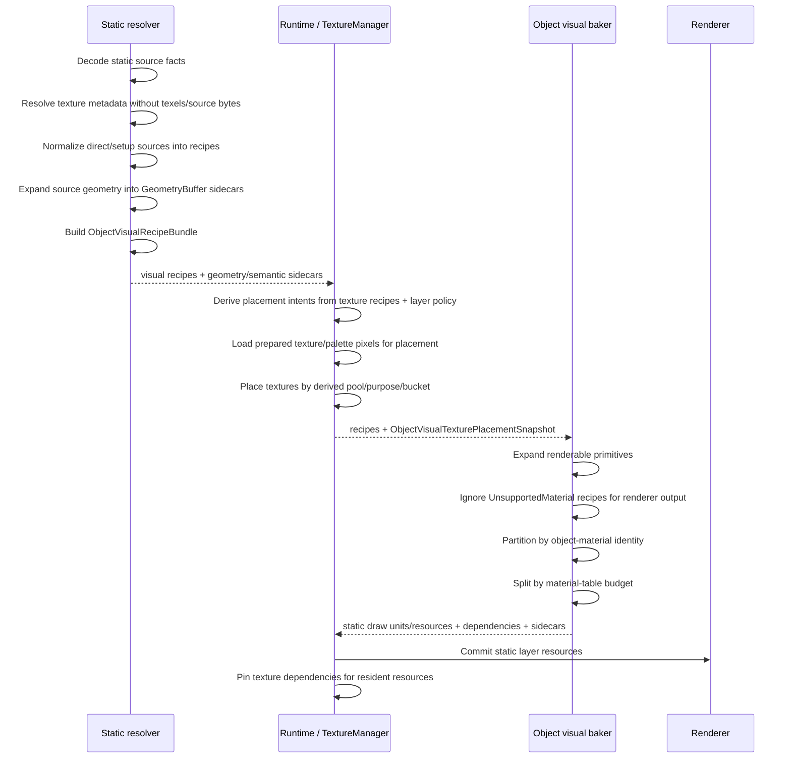
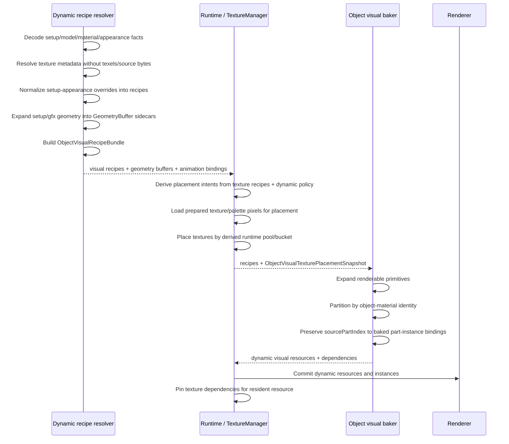
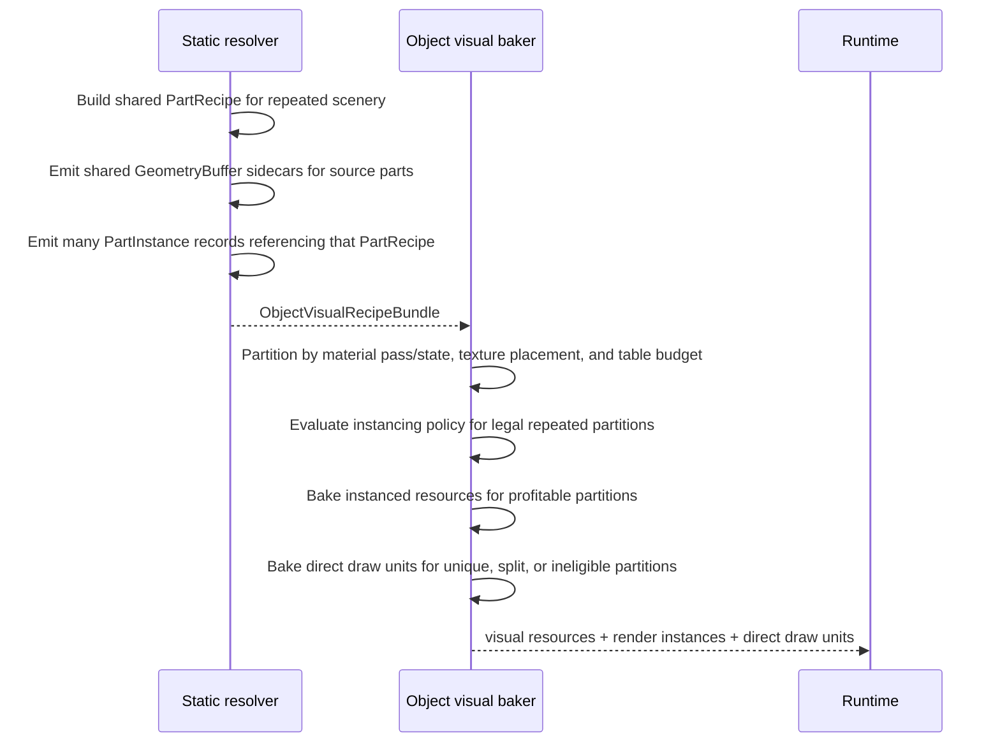

# Holtburger 3D Object Visual Recipe Bundle Implementation Plan

Status: implementation in progress. Phases 0-9L are complete. This document defines the target
model, north stars, risk surface, and phased cutover plan for replacing static-vs-dynamic object
visual worker bifurcation with a shared object-like visual recipe graph.

## Purpose

Define a normalized object visual recipe model that can describe static object layers,
generated-scenery instancing, structured-interior embedded geometry, static-authored dynamics, and
runtime-authored dynamics before texture placement and renderer-legal draw-unit baking.

The core thesis: object-like visual source work should produce recipes and part instances. Runtime
lifetime, residency, pinning, and eviction should not force separate material planning or baker
pipelines inside resolver/baker workers.

## Ground Truth And Current State

Current files that establish the problem shape:

- `apps/holtburger-3d/src/lib/static/objects/bake/static-object-batch-partitioner.ts`
  - Static object baking currently consumes `StaticObjectBatchPayload`, builds material plans,
    constructs triangle candidates, groups by object-material partition key, and emits static
    partitions.
- `apps/holtburger-3d/src/lib/dynamic/visual-baker.ts`
  - Dynamic visual baking now uses the shared object-material partition helper, but still performs
    dynamic-specific material planning and texture requirement discovery around entity recipes.
- `apps/holtburger-3d/src/lib/visual/object-material-draw-unit-partition.ts`
  - Shared renderer-legality partition vocabulary for object-like materials.
- `apps/holtburger-3d/src/lib/static/objects/bake/static-object-batch-baker.ts`
  - Generated-scenery instancing currently runs after static object partitioning and reconstructs
    reusable visual-resource identity from baked partitions and source triangle coverage.
- `apps/holtburger-3d/src/lib/static/env-cells/bake/env-cell-system-baker.ts`
  - Structured interiors already behave like object-material geometry, but their geometry source is
    embedded cell-structure geometry rather than `gfx_obj` geometry.
- `apps/holtburger-3d/src/lib/textures/placement.ts`
  - Shared texture placement intent, placement snapshot, and dependency vocabulary.

Reference sources:

- Current `apps/holtburger-3d` resolver, baker, texture, renderer, and runtime paths are the ground
  truth for the architectural cutover.
- ACE, ACViewer, and the retail client decompile should be consulted if implementation exposes new
  uncertainty about AC source semantics, file formats, setup/appearance interpretation, or material
  behavior.

Current good shape:

- Static objects, structured interiors, and dynamic visuals now share object-material render
  partition rules.
- Texture placement already uses shared placement/pinning concepts.
- Renderer material legality is no longer fundamentally static-vs-dynamic.

Current remaining smell:

- Static objects and dynamic visuals still enter worker material planning through different payload
  shapes.
- Dynamic visuals still run material planning once for texture-placement discovery and again for
  final baking.
- Generated-scenery instancing is inferred after static draw-unit construction instead of falling out
  naturally from repeated part instances.

## Scope

In scope:

- Object-like drawable source domains:
  - outdoor explicit static objects;
  - outdoor generated scenery;
  - env-cell static objects;
  - structured interiors with embedded geometry;
  - static-authored dynamics;
  - runtime-authored dynamics.
- Recipe graph concepts for textures, materials, geometry, parts, and part instances.
- Residency as a first-class part-instance fact.
- Resolver normalization of `setup-model` and `setup-appearance` indirection into the shared recipe
  records, geometry buffers, and part instances.
- Unsupported materials as known, ignorable material-family facts that do not become renderer facts.
- How generated-scenery instancing becomes recipe reuse rather than a post-draw-unit cutover.

Out of scope:

- Terrain inner recipe model. Terrain can share placement/runtime machinery, but not object
  `PartRecipe` semantics.
- Portal graph, visibility, spatial, and interior sidecar records as drawable recipes.
- Material diagnostics and coverage reporting. Those should stay out of the recipe model until a
  concrete user-facing need proves they belong there.
- Renderer shader redesign beyond the existing object-material partition constraints.

## North Stars

These principles should steer design decisions when the model hits ambiguous implementation details:

1. Resolver outputs should be isomorphic across object-like domains.

   Static layer objects, structured interiors, static-authored dynamics, and runtime-authored
   dynamics should normalize into the same basic product: texture recipes, material recipes,
   geometry recipes, geometry buffer refs, part recipes, and part instances. Source lifetime should
   not create separate resolver or baker families.

2. Runtime lifetime should stay out of visual recipe semantics.

   Static layer residency, dynamic entity retention, texture pinning, dependency release, and
   eviction policy are runtime concerns. Resolvers and bakers should scope work by residency and
   ownership inputs, but they should not fork core material, geometry, or partition logic because a
   product will be installed with a different lifetime.

3. Source indirection should collapse before baking.

   `setup-model`, `setup-appearance`, `ObjDesc`-style overrides, and authored source variants are
   resolver inputs. The baker should receive effective visual facts and provenance, not source
   indirection that forces it to rediscover static-vs-dynamic behavior.

4. Geometry should have one transform rule.

   Geometry buffers should remain source-local and `PartInstance.transform` should be the only path
   from buffer-local positions to render-local positions. Avoid pre-baked landblock/env-cell geometry
   inside this object visual graph unless a future source proves that such geometry is already
   authored that way.

5. Heavy payloads should be explicit sidecars, not hidden resolver graph weight.

   The recipe graph should reference heavy geometry buffers by id. Full typed-array payloads may
   travel through worker transfer, attachment, or cache channels, but recipe-to-buffer ownership must
   remain explicit and deterministic.

6. Hot-path identity should be numeric; semantic identity should remain inspectable.

   Bundle-local ids should drive recipe, part, material, geometry, and placement lookups during
   baking. Stable semantic keys should be retained in key tables for deterministic construction,
   debugging, and cache boundaries, not used as routine partition comparison payloads.

7. Texture recipes describe source need, not placement ownership.

   Resolvers may use texture and palette metadata to author recipes, but they should not load texels
   or choose atlas pools, placement buckets, runtime owners, pinning policy, or release policy.
   Placement planning belongs at the runtime/coordinator boundary.

8. Renderer legality remains a baker concern.

   The shared recipe graph should represent source intent and instance candidacy. The baker still
   owns material-family partitioning, render-pass splits, texture-placement compatibility,
   material-table limits, sorting constraints, and direct-vs-instanced renderer output.

9. Unsupported and missing inputs should be explicit but lightweight.

   Unsupported materials should map to non-renderable `UnsupportedMaterial` recipes that placement
   and renderer output ignore. Missing dependencies should produce skip-and-log readiness state, not
   partial bundles or a diagnostics subsystem.

10. The model should reduce code paths, not move the bifurcation.

A design that merely wraps old static and dynamic pipelines behind a shared facade does not meet
the goal. Shared types should pull shared resolver/baker logic into one object visual path, with
only thin domain adapters for source loading, residency, ownership, and runtime policy.

11. Prefer hard cutover over long-lived compatibility scaffolding.

The target architecture is one object visual recipe path, not a permanent bridge between legacy
static and dynamic worker shapes. Temporary adapters are acceptable only as migration tools with
explicit deletion criteria. They should not become supported architecture, and they should not
preserve legacy material planning, geometry extraction, or generated-scenery inference paths after
the recipe model can replace them.

## Target Concept

Object-like resolvers should produce a visual recipe bundle:

```ts
interface ObjectVisualRecipeBundle {
  readonly textureRecipes: ReadonlyMap<TextureRecipeId, TextureRecipe>;
  readonly materialRecipes: ReadonlyMap<MaterialRecipeId, MaterialRecipe>;
  readonly geometryRecipes: ReadonlyMap<GeometryRecipeId, GeometryRecipe>;
  readonly geometryBufferRefs: ReadonlyMap<GeometryBufferId, GeometryBufferRef>;
  readonly partRecipes: ReadonlyMap<PartRecipeId, PartRecipe>;
  readonly partInstances: readonly PartInstance[];
  readonly recipeKeys: ObjectVisualRecipeKeyTables;
}
```

The bundle describes visual source intent plus references to the geometry payloads needed to bake
that intent. Full `GeometryBuffer` payloads are same-contract sidecars keyed by
`GeometryBufferId`, not independent semantic sidecars and not necessarily inline resolver JSON. This
keeps heavy typed arrays out of the resolver-ready graph while still giving bakers a single
recipe-to-buffer contract.

Resolver output should be wrapped so missing dependencies are explicit operational state, not an
empty successful bundle:

```ts
type ObjectVisualBundleResolution =
  | {
      readonly kind: "ready";
      readonly bundle: ObjectVisualRecipeBundle;
      readonly geometryBuffers: ReadonlyMap<GeometryBufferId, GeometryBuffer>;
    }
  | {
      readonly kind: "missing-dependencies";
      readonly missingRefs: readonly StaticResourceIdentity[];
    };
```

When dependencies are missing, runtime should complain once in the console for the affected
layer/entity/source and skip baking that product. This is not a material diagnostics system or issue
diary.

The ready bundle plus its geometry sidecars is not renderer-legal output. Renderer legality remains
a baker responsibility:

```text
ObjectVisualRecipeBundle
  + ObjectVisualTexturePlacementSnapshot
  -> renderable primitives
  -> object-material partition keys
  -> material-table budget splits
  -> renderer resources, draw units, or render parts
```

## Recipe Identity Sketch

These shapes are illustrative. They are intentionally not final TypeScript contracts.

```ts
type TextureRecipeId = number;
type MaterialRecipeId = number;
type GeometryRecipeId = number;
type GeometryBufferId = number;
type PartRecipeId = number;
type PartMaterialBindingId = number;
type PartInstanceId = number;
type TexturePlacementItemId = number;

interface ObjectVisualRecipeKeyTables {
  readonly textureRecipeKeys: readonly TextureRecipeKey[];
  readonly materialRecipeKeys: readonly MaterialRecipeKey[];
  readonly geometryRecipeKeys: readonly GeometryRecipeKey[];
  readonly geometryBufferKeys: readonly GeometryBufferKey[];
  readonly partRecipeKeys: readonly PartRecipeKey[];
  readonly partInstanceKeys: readonly PartInstanceKey[];
  readonly texturePlacementItemKeys: readonly TexturePlacementItemKey[];
}

interface TextureRecipe {
  readonly textureRecipeId: TextureRecipeId;
  readonly placementItemId: TexturePlacementItemId;
  readonly usage:
    | "object-base-color"
    | "object-detail"
    | "object-index"
    | "object-palette";
  readonly source: MaterialTextureDataUseIdentity;
  readonly samplingPolicy?: StaticBakeTextureSamplingPolicy;
  readonly affinityHint?: string;
}

type MaterialRecipe =
  | DirectColorMaterialRecipe
  | TextureRgbaMaterialRecipe
  | IndexedColorMaterialRecipe
  | UnsupportedMaterialRecipe;

interface MaterialRecipeBase {
  readonly materialRecipeId: MaterialRecipeId;
  readonly materialSourceIds: readonly string[];
  readonly pass: "opaque" | "alpha-test" | "transparent" | "additive";
  readonly alphaMode: string;
  readonly blendMode: string;
}

interface DirectColorMaterialRecipe extends MaterialRecipeBase {
  readonly family: "direct-color";
  readonly diffuseColor: readonly [number, number, number, number];
  readonly emissiveColor: readonly [number, number, number];
}

interface TextureRgbaMaterialRecipe extends MaterialRecipeBase {
  readonly family: "texture-rgba";
  readonly baseColorTextureRecipeId: TextureRecipeId;
  readonly detailTextureRecipeId: TextureRecipeId | null;
  readonly diffuseColor: readonly [number, number, number, number];
  readonly emissiveColor: readonly [number, number, number];
  readonly textureWrapMode: "clamp" | "repeat";
}

interface IndexedColorMaterialRecipe extends MaterialRecipeBase {
  readonly family: "indexed-color";
  readonly indexTextureRecipeId: TextureRecipeId;
  readonly paletteTextureRecipeId: TextureRecipeId;
  readonly detailTextureRecipeId: TextureRecipeId | null;
  readonly paletteFirstIndex: number;
  readonly indexedTextureFormat: "p8" | "index16";
  readonly diffuseColor: readonly [number, number, number, number];
  readonly emissiveColor: readonly [number, number, number];
  readonly textureWrapMode: "clamp" | "repeat";
}

interface UnsupportedMaterialRecipe extends MaterialRecipeBase {
  readonly family: "unsupported";
}
```

Unsupported material recipes are first-class source facts, but never renderer facts:

```text
UnsupportedMaterialRecipe
  -> no texture placement intents
  -> no object-material partition key
  -> no renderer material table entry
  -> retained only so source material references have an explicit non-renderable target
```

Texture recipes describe source visual needs. They should not decide atlas placement pool, owner
bucket, lifetime policy, or pin/release behavior. An `ObjectVisualTexturePlacementPlanner` should
derive `TexturePlacementIntent` values at the runtime/coordinator boundary from:

- `TextureRecipe.usage`;
- `TextureRecipe.source`;
- `TextureRecipe.samplingPolicy`;
- optional `TextureRecipe.affinityHint`;
- `PartInstance.residency`;
- static layer or dynamic entity ownership context.

Illustrative planner boundary:

```ts
interface ObjectVisualTexturePlacementPolicy {
  readonly sourceKind:
    | "static-layer"
    | "static-authored-dynamic"
    | "runtime-authored-dynamic";
  readonly ownerId: string;
}

function createObjectVisualTexturePlacementIntents(input: {
  readonly bundle: ObjectVisualRecipeBundle;
  readonly policy: ObjectVisualTexturePlacementPolicy;
}): readonly ObjectVisualTexturePlacementIntent[] {
  // Derives pool and placement bucket from policy + residency.
  // Resolver-authored TextureRecipe remains source intent only.
  throw new Error("scoping sketch");
}

interface ObjectVisualTexturePlacementIntent {
  readonly itemId: TexturePlacementItemId;
  readonly source: TexturePlacementSource;
  readonly purpose: TextureUsagePurpose;
  readonly placementBucketKey: TexturePlacementBucketKey;
  readonly pool: TexturePlacementPool;
  readonly affinityKey: string | null;
}

interface ObjectVisualTexturePlacementSnapshot {
  readonly placementsByItemId: ReadonlyMap<
    TexturePlacementItemId,
    TexturePlacement
  >;
}
```

Placement identity should follow the same strategy as recipe identity: dense numeric ids inside the
object visual bundle and baker, stable semantic keys in `recipeKeys`, and string handles only at
runtime registry boundaries. The current string-shaped `TexturePlacementIntent.itemId` and
`TexturePlacementSnapshot.placementsByItemId` contracts should not be treated as the final object
visual shape. Object visual placement should converge on `TexturePlacementItemId` for bake-time
lookup, while renderer resource ids, texture page ids, and global ownership handles may remain
strings.

## Texture Asset Boundary

Resolvers may load texture dependency metadata, but they should not load texture pixel payloads.
The target asset boundary is:

```text
resolver-safe metadata routes
  surface-texture/{id}
  render-surface-metadata/{id}
  palette-metadata/{id}

runtime texture placement routes
  prepared-texture/{id}?...
  palette/{id} when palette pixels are needed for packing
```

`render-surface-metadata` should expose dimensions, source format, source byte length, default
palette id, dependencies, and provenance. `palette-metadata` should expose palette dimensions,
color-count/range facts, and provenance needed for indexed material planning. Neither metadata route
should include texels or source bytes. Resolver-authored `TextureRecipe` records should reference
these metadata facts through stable source identities and usage policy only. Texture placement is the
first stage that should request pixel-bearing `prepared-texture` or `palette` assets.

Current code does not cleanly satisfy this boundary: `render-surface/{id}` and `palette/{id}` are
binary routes, and resolver-facing code can end up fetching pixel-capable payloads only to use
metadata. The new model should replace resolver use with metadata-only routes instead of fetching
texels and dropping them at the resolver boundary.

## Source Indirection Normalization

Resolvers should normalize source indirection before the baker sees the bundle:

```text
setup-model / setup-appearance / ObjDesc-style overrides
  -> effective source parts
  -> TextureRecipe records
  -> MaterialRecipe records
  -> GeometryRecipe records
  -> GeometryBuffer sidecars
  -> PartRecipe records
  -> PartInstance records
```

This applies to static and dynamic inputs:

- Static object-like domains flatten `setup-model` part selection into the same recipe records used
  by direct `gfx_obj` objects.
- Runtime-authored dynamics flatten `setup-appearance` and appearance override facts before baking,
  including part swaps, texture changes, palette/sub-palette selection, and material slot resolution.
- Static-authored dynamics use the same normalized visual shape; runtime only changes ownership,
  residency, animation, and lifetime policy.

The original source identities should remain available as provenance or source mapping facts, but
they should not create separate baker paths. `setup-appearance` is an appearance override input, not a
geometry provenance class.

## Geometry Recipe Sketch

Geometry recipes should separate source provenance from geometry payloads. Both `gfx_obj` parts and
cell structures should reference geometry buffers so the baker does not need to reopen or
reinterpret source assets:

```ts
interface GeometryRecipe {
  readonly geometryRecipeId: GeometryRecipeId;
  readonly provenance: GeometryProvenance;
  readonly bufferId: GeometryBufferId;
}

type GeometryProvenance =
  | {
      readonly kind: "gfx-obj";
      readonly sourceAssetKind: "gfx-obj" | "setup-model";
      readonly sourceDid: number;
      readonly gfxObjDid: number;
      readonly partIndex: number;
    }
  | {
      readonly kind: "cell-structure";
      readonly envCellId: number;
      readonly structureId: string;
    };
```

Geometry buffers are visual payload sidecars attached to the bundle. They are not independent
semantic sidecars like portals, visibility records, or env-cell adjacency. They exist so resolvers can
expand source assets once and bakers can consume a single triangle-buffer shape:

```ts
interface GeometryBufferRef {
  readonly bufferId: GeometryBufferId;
  readonly key: GeometryBufferKey;
  readonly coordinateSpace: "source-local";
}

interface GeometryBuffer {
  readonly bufferId: GeometryBufferId;
  readonly coordinateSpace: "source-local";
  readonly positions: Float32Array;
  readonly normals: Float32Array;
  readonly texCoords: Float32Array;
  readonly triangles: readonly GeometryTriangle[];
}

interface GeometryTriangle {
  readonly firstVertex: number;
  readonly surfaceId: number | null;
  readonly materialVariantSignature: string | null;
  readonly sourceTriangleId: string;
}
```

The coordinate-space invariant should be universal:

```text
renderLocalPosition = PartInstance.transform * GeometryBuffer.sourceLocalPosition
```

`GeometryBuffer` payloads stay in their natural source-local coordinates. For a `gfx_obj` part, that
means part/source-local geometry. For a cell structure, that means cell-structure-local geometry. The
`PartInstance.transform` carries the transform from that buffer-local space into the owning
render-local space, including env-cell placement for structured interiors. Bakers should not branch
on static/dynamic/interior lifetime to decide whether a transform has already been applied.

There is intentionally no `runtime-authored` geometry provenance in this model. Runtime-authored
dynamics are runtime-authored entity instances that currently resolve through setup models and
`gfx_obj` parts. If the project later supports actual runtime mesh authoring, that should be added as
a proven new provenance kind rather than reserved speculatively now.

## Part Recipe And Instance Sketch

`PartRecipe` should not assume a single material. AC object parts and structured interiors need
surface or primitive-level material bindings.

```ts
interface PartRecipe {
  readonly partRecipeId: PartRecipeId;
  readonly geometryRecipeId: GeometryRecipeId;
  readonly materialBindings: readonly PrimitiveMaterialBinding[];
}

interface PrimitiveMaterialBinding {
  readonly bindingId: PartMaterialBindingId;
  readonly selector: PrimitiveSelector;
  readonly materialRecipeId: MaterialRecipeId;
  readonly sourceSlot: PartMaterialSourceSlot | null;
  readonly materialVariantSignature: string | null;
}

interface PartMaterialSourceSlot {
  readonly slotIndex: number;
  readonly geometrySurfaceId: number;
  readonly materialSurfaceId: number;
}

type PrimitiveSelector =
  | {
      readonly kind: "surface";
      readonly surfaceId: number;
    }
  | {
      readonly kind: "triangle-range";
      readonly firstTriangle: number;
      readonly triangleCount: number;
    }
  | {
      readonly kind: "triangle-list";
      readonly sourceTriangleIds: readonly string[];
    };
```

Most current object-like domains can start with surface bindings. Triangle range/list selectors are
escape hatches for geometry buffers or material variant cases that cannot be expressed cleanly by
surface id alone. `sourceSlot` keeps authored material-slot identity separate from primitive
selection, matching the current distinction between geometry surface ids, material surface ids, slot
indices, and material variants.

Part instances carry residency and instance facts:

```ts
interface PartInstance {
  readonly partInstanceId: PartInstanceId;
  readonly partRecipeId: PartRecipeId;
  readonly transform: PlacementTransformDto;
  readonly residency: VisualResidency;
  readonly source: PartInstanceSource;
  readonly sortAnchor?: StaticBounds | Vec3Dto;
}

type VisualResidency =
  | {
      readonly kind: "outdoor-landblock";
      readonly landblockId: number;
    }
  | {
      readonly kind: "env-cell";
      readonly landblockId: number;
      readonly envCellId: number;
      readonly memberId: string;
    }
  | {
      readonly kind: "runtime-entity";
      readonly entityId: string;
      readonly currentResidence:
        | { readonly kind: "outdoor-landblock"; readonly landblockId: number }
        | {
            readonly kind: "env-cell";
            readonly landblockId: number;
            readonly envCellId: number;
          }
        | { readonly kind: "no-residence" };
    };

type PartInstanceSource =
  | {
      readonly kind: "static-object";
      readonly objectInstanceId: string;
      readonly objectKind: "explicit-object" | "generated-scenery";
    }
  | {
      readonly kind: "structured-interior";
      readonly envCellId: number;
      readonly cellStructureId: number;
    }
  | {
      readonly kind: "dynamic";
      readonly entityId: string;
      readonly sourcePartIndex: number;
    };
```

Residency belongs on part instances. Portal, spatial, visibility, and source-mapping sidecars can
refer to the same residency identifiers without becoming drawable recipes.

## Layer Output Sketch

Static object-like layer source output can wrap the visual bundle with sidecars:

```ts
interface ObjectLikeStaticLayerSource {
  readonly domain:
    | "outdoor-explicit-objects"
    | "outdoor-generated-scenery"
    | "env-cell-system";
  readonly visual: ObjectVisualBundleResolution;
  readonly sidecars: ObjectLikeLayerSidecars;
}

interface ObjectLikeLayerSidecars {
  readonly sourceMappings: readonly StaticSourceMappingRecord[];
  readonly spatialRecords: readonly StaticSpatialRecord[];
  readonly visibilityRecords: readonly StaticVisibilityRecord[];
  readonly portalApertureResources: readonly StaticPortalApertureResource[];
  readonly portalGraphs: readonly StaticPortalGraphRecord[];
  readonly portalInteriorRecords: readonly StaticPortalInteriorRecord[];
}
```

Dynamic source output can use the same visual bundle:

```ts
interface DynamicObjectVisualSource {
  readonly entityId: string;
  readonly visual: ObjectVisualBundleResolution;
  readonly animationBindings: readonly DynamicAnimationPartBinding[];
}

interface DynamicAnimationPartBinding {
  readonly sourcePartIndex: number;
  readonly renderPartIds: readonly string[];
}
```

Dynamic animation bindings preserve source/setup part identity across baking, but they should not
assume one source part becomes exactly one render part. Material partitioning, texture placement, or
budget splits may turn one animated source part into multiple baked renderer parts. Runtime
animation sampling should still produce transforms by `sourcePartIndex`; commit/install code expands
that sampled transform to each `renderPartId` bound to the source part.

Runtime lifetime stays outside the visual recipe graph:

```text
recipe bundle source
  -> texture placement
  -> bake renderer resources
  -> runtime pins dependencies
  -> runtime installs static layer or dynamic resource
  -> runtime evicts and releases dependencies
```

## Sequence Diagrams

### Static Object-Like Layer



### Runtime-Authored Dynamic



### Generated Scenery Under Recipe-First Model



This removes the current backwards flow:

```text
draw units first -> inspect source coverage -> infer reusable resources -> cut over partitions
```

Generated scenery becomes repeated `PartInstance` data referencing shared recipes before renderer
resource emission. That makes instance candidacy explicit early, but renderer instancing is still a
post-partition output decision. One repeated `PartRecipe` can still become several renderer
resources if material family, render pass, texture page placement, material-table limits, or sorting
policy require splits. The baker should ask which repeated partitions are legal and profitable to
instance, not infer repeated source objects backward from already-baked draw units.

## Domain Fit Matrix

| Domain                          | Fits `ObjectVisualRecipeBundle`? | Notes                                                                                                                                            |
| ------------------------------- | -------------------------------- | ------------------------------------------------------------------------------------------------------------------------------------------------ |
| Outdoor explicit static objects | Yes                              | `gfx_obj` provenance plus geometry buffer refs/sidecars and outdoor landblock residency.                                                         |
| Outdoor generated scenery       | Yes                              | Repeated `PartInstance`s should replace post-partition candidate/cutover inference.                                                              |
| Env-cell static objects         | Yes                              | Same object recipe shape with env-cell residency.                                                                                                |
| Structured interiors            | Yes                              | Cell-structure provenance plus geometry buffer refs/sidecars and env-cell residency. Portal records remain sidecars.                             |
| Static-authored dynamics        | Yes                              | Same normalized visual recipes; runtime commits them as dynamic entities.                                                                        |
| Runtime-authored dynamics       | Yes                              | Normalize setup-appearance overrides into the same setup/`gfx_obj` visual recipes, with runtime-authored instance policy and animation bindings. |
| Terrain                         | No, not internally               | Terrain should keep terrain-layer recipes but share placement/runtime dependency machinery.                                                      |

## Phased Implementation

The phases below are ordered for a decisive cutover while keeping each milestone reviewable. Where
temporary adapters are needed, the phase names the deletion target so compatibility scaffolding does
not become supported architecture.

### Phase 0: Ground Truth Audit And Baseline

Goal: prove the current behavior and data dependencies before changing contracts.

Deliverables:

- Update this plan with any newly discovered source facts from ACE, ACViewer, or current
  `apps/holtburger-3d` paths.
- Baseline the current static object, env-cell, dynamic visual, texture placement, and generated
  scenery tests that will guard the cutover.
- Identify any runtime asset requirements that are not represented by checked-in fixtures.

Task checklist:

- Trace `setup-model`, `setup-appearance`, material, texture, `gfx_obj`, cell-structure, and
  generated scenery paths through current resolver and baker code.
- Record the current missing dependency behavior for static layers and dynamics.
- Record current generated-scenery instancing entry points, thresholds, and renderer output shapes.
- Confirm whether palette metadata needed by material planning can be served without palette texels.

Acceptance criteria:

- The plan lists all code paths that must be replaced or deleted.
- Existing relevant tests are known and runnable locally.
- Any behavior that cannot be proven from code or references is recorded before implementation
  proceeds.

Phase 0 completion notes:

- Static outdoor source resolution currently enters through
  `static/objects/outdoor-static-objects-resolver.ts`, loads landblock outdoor layer and region
  render profile payloads, resolves selected `gfx_obj`/`setup-model` source closure records, and
  emits `OutdoorStaticObjectsScopePayload` with source assets, material sources, palette sources,
  texture refs, material slots, object instances, missing refs, spatial facts, and authored dynamic
  placements.
- Dynamic visual source resolution enters through `dynamic/visual-recipe-resolver.ts`. It loads the
  `setup-model`, resolves animation, optionally creates a `setup-appearance` override key from
  runtime appearance data, and then reuses `resolveStaticObjectSourceClosure`. The good seam already
  exists, but the output remains `DynamicEntityRecipe` rather than the shared object visual bundle.
- `static/objects/static-object-source-closure.ts` is the current normalization choke point for
  direct `gfx_obj` sources and `setup-model`/`setup-appearance` sources. It creates part facts from
  direct gfx geometry or setup parts, applies palette/sub-palette overrides, follows material and
  surface texture refs, and records missing static resource identities.
- Current render-surface resolver views remove `sourceBytes`, but palette payloads still expose
  `colorsArgb`. The later metadata-route phase must split palette metadata from palette texels rather
  than only fixing render-surface routes.
- Static object baking enters through `static/objects/bake/static-object-batch-baker.ts` and
  `static/objects/bake/static-object-batch-partitioner.ts`. It consumes `StaticObjectBatchPayload`,
  runs `planObjectVisualMaterials`, creates triangle candidates, partitions by object-material render
  legality, and emits draw units, material coverage, texture uses/dependencies, source mappings,
  spatial records, generated-scenery render instances, and generated-scenery visual resources.
- Dynamic visual baking enters through `dynamic/visual-baker.ts`. It skips recipes with missing
  dependencies, calls `planObjectVisualMaterials` once for texture-planning discovery and again for
  final baking, then emits dynamic render parts, texture requirements, texture dependencies, material
  slots, source assets, palette sources, and texture refs.
- Env-cell system baking enters through `static/env-cells/bake/env-cell-system-baker.ts`. It bakes
  structured interior embedded geometry locally, then calls `bakeStaticObjectBatch(input)` for
  env-cell static object placements. This is a real shared target, but today it still combines two
  static-oriented bake products instead of one object visual install publication.
- Generated-scenery instancing currently lives inside `static-object-batch-baker.ts` after static
  partitioning. It uses baked partition triangles and source-local triangle keys to decide whether
  repeated generated objects become `StaticObjectRenderInstance`/`StaticObjectVisualResource` output.
  Transparent/additive generated partitions are retained unless policy allows safe instancing.
- Runtime install currently reconstructs static layer payloads from installed draw units and separate
  `staticObjectRenderInstances`/`staticObjectVisualResources` in `runtime/client-runtime.ts`. This is
  the installer-shell risk called out later in the plan.
- Targeted Phase 0 baseline command:
  `npm --prefix apps/holtburger-3d run test:ts -- src/lib/static/objects/outdoor-static-objects-resolver.test.ts src/lib/static/objects/bake/static-object-batch-partitioner.test.ts src/lib/static/objects/bake/static-object-material-planner.test.ts src/lib/static/env-cells/bake/env-cell-system-baker.test.ts src/lib/dynamic/visual-recipe-resolver.test.ts src/lib/dynamic/visual-baker.test.ts src/lib/dynamic/dynamic-entity-controller.test.ts src/lib/textures/placement.test.ts src/lib/textures/texture-manager.test.ts src/lib/runtime/static-commit-installer.test.ts src/lib/runtime/env-cell-system-layer-publication.test.ts`
  passed locally with 11 test files and 174 tests.
- Runtime asset-backed scenarios are not fully represented by checked-in fixtures. Later validation
  should keep relying on focused unit fixtures for contract proof, then use renderer diagnostics or
  the programmatic browser harness for representative scene confidence.

### Phase 1: Shared Object Visual Contract

Goal: introduce the shared recipe graph and resolution wrapper without yet cutting over producers.

Deliverables:

- Add object visual recipe contracts for `ObjectVisualRecipeBundle`,
  `ObjectVisualBundleResolution`, recipe ids, recipe key tables, texture/material/geometry/part
  recipes, part instances, residency, sidecars, and animation bindings.
- Add geometry sidecar/ref contracts with `GeometryBufferId`, `GeometryBufferRef`, and
  source-local `GeometryBuffer` payloads.
- Add focused contract tests for id stability, key-table ordering, unsupported material recipes, and
  missing dependency resolution shape.

Task checklist:

- Place shared object visual contracts in the smallest existing `apps/holtburger-3d` module that can
  be consumed by static and dynamic workers without dragging in runtime policy.
- Define bundle-local numeric ids and key-table construction helpers.
- Define `UnsupportedMaterialRecipe` as a non-renderable family.
- Define `ObjectVisualBundleResolution` so missing dependencies cannot masquerade as an empty ready
  bundle.

Acceptance criteria:

- Static and dynamic code can import the shared contracts without dependency cycles.
- Contract tests prove deterministic dense id/key-table behavior.
- No existing static or dynamic renderer behavior changes in this phase.

Phase 1 completion notes:

- Added shared contracts in `apps/holtburger-3d/src/lib/visual/object-visual-recipe-bundle.ts`.
  The module is intentionally under `visual`, not `static` or `dynamic`, so both worker families can
  import the target contract without making one domain the owner of the other.
- Added branded numeric ids for texture, material, geometry, geometry buffer, and part recipes, plus
  branded semantic keys retained in `ObjectVisualRecipeKeyTables`.
- Added `createObjectVisualRecipeKeyRegistry` to build deterministic dense id maps from sorted,
  deduplicated semantic key tables. The helper preserves branded key types so hot-path references can
  stay numeric while semantic keys remain inspectable.
- Added `ObjectVisualBundleResolution` with explicit `ready` and `missing-dependencies` variants.
  `createObjectVisualMissingDependenciesResolution` rejects empty missing-dependency lists so missing
  state cannot masquerade as an empty ready bundle.
- Added `UnsupportedMaterialRecipe` as a first-class non-renderable material family and
  `isRenderableObjectVisualMaterialRecipe` for baker-side filtering.
- Added source-local geometry sidecar contracts: `ObjectVisualGeometryBufferRef` for lightweight
  graph references and `ObjectVisualGeometryBuffer` for transferable typed-array payloads.
- Added `DynamicAnimationPartBinding` with `sourcePartIndex -> renderPartIds[]` to preserve the
  animation split-binding requirement without baking setup indirection into material planning.
- Added focused tests in `apps/holtburger-3d/src/lib/visual/object-visual-recipe-bundle.test.ts`.
  They cover deterministic id/key-table construction, missing-dependency readiness shape,
  unsupported material renderability, and embedded geometry sidecar references.
- Verification:
  `npm --prefix apps/holtburger-3d run test:ts -- src/lib/visual/object-visual-recipe-bundle.test.ts`
  passed with 1 test file and 4 tests;
  `npm --prefix apps/holtburger-3d run check` passed; and
  `npm --prefix apps/holtburger-3d run lint:ts -- src/lib/visual/object-visual-recipe-bundle.ts src/lib/visual/object-visual-recipe-bundle.test.ts`
  passed.

Deletion criteria:

- None. This phase adds the new contract foundation only.

### Phase 2: Resolver-Safe Texture Metadata Routes

Goal: separate resolver metadata needs from pixel-bearing texture/palette payloads across host,
preparation, and resolver views.

Deliverables:

- Add resolver-safe `render-surface-metadata/{id}` and `palette-metadata/{id}` asset routes or
  equivalent prepared metadata records.
- Add host DTO schemas, prepared asset payload parsing, route validation, and tests for those
  metadata routes.
- Update Tauri/binary lookup routing so metadata routes do not use pixel-bearing binary payload
  handling.
- Update resolver asset views so resolver-facing material planning sees metadata-only payloads
  rather than fetched texels with bytes stripped afterward.

Task checklist:

- Add metadata payload shapes for render-surface facts needed by material planning: dimensions,
  format, source byte length, default palette id, dependencies, and provenance.
- Add metadata payload shapes for palette facts needed by indexed material planning: dimensions,
  color-count/range facts, and provenance.
- Replace resolver-side uses that fetch `render-surface/{id}` or `palette/{id}` only for metadata.
- Keep `prepared-texture/{id}` and pixel-bearing `palette/{id}` loading in texture placement/packing.
- Add tests proving resolver metadata routes do not expose texels/source bytes.

Acceptance criteria:

- Resolvers can author texture and material recipes from metadata-only assets.
- Texture placement remains the first stage that loads prepared texture or palette pixels.
- Resolver-safe payload tests prove metadata routes do not contain texels/source bytes.

Phase 2 completion notes:

- Added strict `render-surface-metadata` and `palette-metadata` host DTO schemas in
  `apps/holtburger-3d/src/lib/host/contracts.ts`. The metadata schemas reject texel-bearing
  `sourceBytes` and `colorsArgb` instead of silently stripping unknown fields.
- Added typed `render-surface-metadata/{id}` and `palette-metadata/{id}` browser asset keys and
  prepared payload parsing in `assets/contracts.ts`, `assets/keys.ts`, and
  `assets/preparation/route-payloads.ts`.
- Added Tauri metadata route parsing and direct JSON lookup support in `src-tauri` for render
  surfaces and palettes. These routes load the same content assets but serialize metadata-only JSON,
  while existing `render-surface/{id}` and `palette/{id}` routes remain binary-only for pixel-bearing
  payloads.
- Updated `static/objects/static-object-source-closure.ts` so resolver-side material planning loads
  `render-surface-metadata` and `palette-metadata` for dimensions, format, default palette, and
  color-count facts. Pixel-bearing `palette` and `prepared-texture` payloads remain reserved for
  texture source preparation/packing.
- Kept the existing resolver bridge render-surface byte-stripping view as defensive compatibility for
  any remaining direct `render-surface` worker request. The production resolver material-planning path
  no longer relies on fetching that pixel-bearing route and stripping bytes afterward.
- Added frontend parser and resolver tests proving metadata routes are typed, strict, and used by
  static source resolution. Added Tauri service tests proving metadata routes are direct JSON and do
  not expose source bytes or palette colors.
- Verification:
  `npm --prefix apps/holtburger-3d run test:ts -- src/lib/assets/preparation.test.ts src/lib/static/objects/outdoor-static-objects-resolver.test.ts src/lib/dynamic/visual-recipe-resolver.test.ts src/lib/static/resolver/asset-bridge.test.ts src/lib/dynamic/visual-recipe-worker-client.test.ts`
  passed with 5 test files and 36 tests;
  `npm --prefix apps/holtburger-3d run check` passed;
  `npm --prefix apps/holtburger-3d run lint:ts -- src/lib/assets/preparation.test.ts src/lib/assets/preparation/route-payloads.ts src/lib/assets/contracts.ts src/lib/assets/keys.ts src/lib/host/contracts.ts src/lib/static/objects/static-object-source-closure.ts src/lib/static/objects/outdoor-static-objects-resolver.test.ts`
  passed;
  `npm --prefix apps/holtburger-3d run check:rust` passed; and
  `cargo test --manifest-path apps/holtburger-3d/src-tauri/Cargo.toml adapter::service:: -- --nocapture`
  passed with 18 tests.

Deletion criteria:

- Remove resolver code that fetches pixel-bearing render-surface or palette assets only to strip or
  ignore payload bytes.

### Phase 3: Numeric Texture Placement Cutover

Goal: make object visual placement numeric end-to-end in bake-time paths, without a long-lived
string adapter layer.

Deliverables:

- Add object visual placement intent/snapshot contracts using `TexturePlacementItemId` for
  bake-time lookup.
- Update texture placement, texture manager, renderer binding preparation, and object visual bake
  inputs so object visual placement items are numeric internally.
- Keep string handles only for runtime registry/resource/page/owner identities where global names are
  required.

Task checklist:

- Replace object visual `TexturePlacementIntent.itemId` and
  `TexturePlacementSnapshot.placementsByItemId` usage with numeric placement item ids.
- Update texture manager packing output to preserve numeric placement item ids for object visual
  consumers.
- Update renderer texture binding creation so material table/binding lookup can bridge from numeric
  object visual placement ids to renderer texture refs without reintroducing hot-path string
  placement ids.
- Keep terrain placement on its existing shape unless and until terrain is deliberately generalized.
- Add tests proving object visual placement lookup uses numeric item ids through manager, baker, and
  renderer binding preparation.

Acceptance criteria:

- No object visual bake path depends on string placement item ids in hot-path maps.
- Texture manager and renderer binding code support numeric object visual placement items without a
  compatibility adapter that preserves the old object visual string path.
- Runtime/global texture refs, renderer resource ids, and ownership handles may remain strings.

Deletion criteria:

- Delete object visual string placement item id helpers and tests once all object visual placement
  callers use numeric ids.

Phase 3 completion notes:

- Added numeric object-visual placement contracts with `TexturePlacementItemId`,
  `ObjectVisualTexturePlacementIntent`, and `ObjectVisualTexturePlacementSnapshot`.
- Split bake lookup identity from runtime dependency identity: object visual bakers now look up
  placement by numeric `placementItemId`, while `textureUseId` remains the string handle for
  renderer binding keys and texture dependency pin/release accounting.
- Added `TextureManager.placeObjectVisualTextureIntents`, which rebases object-visual placement
  intents to dense numeric ids for each placement operation and returns an
  `itemIdsByTextureUseId` bridge table for baker boundary resolution.
- Split static source-ready placement work into `objectVisualPlacementIntents` and
  `terrainPlacementIntents`. Runtime placement now calls the object-visual numeric path for static
  objects, structured interiors, and dynamic visuals, while terrain remains on the existing string
  snapshot shape.
- Cut over static object partitions, structured interiors, dynamic visual baking, and the shared
  object-material partition helper to numeric object-visual placement ids.
- Kept terrain deliberately string-shaped and added a terrain snapshot guard so object-visual
  snapshots cannot be accidentally consumed by terrain baking.
- Verification:
  `npm --prefix apps/holtburger-3d run check`
  `npm --prefix apps/holtburger-3d run test:ts -- src/lib/textures/placement.test.ts src/lib/textures/texture-manager.test.ts src/lib/visual/object-material-draw-unit-partition.test.ts src/lib/static/objects/bake/static-object-batch-partitioner.test.ts src/lib/static/env-cells/bake/env-cell-system-baker.test.ts src/lib/dynamic/visual-baker.test.ts`
- Debt carried forward: Phase 6 should move object-visual placement id allocation out of the current
  domain-specific planning helpers and into the shared recipe/placement planner so ids come from one
  bundle-local key table instead of being rebased at the texture manager boundary.

### Phase 4: Neutral Object Visual Material Planner

Goal: replace static/dynamic-specific material planning with one object visual material recipe path.

Deliverables:

- Promote static object material planning into a neutral object visual material planner.
- Establish the shared material-plan vocabulary that will back `TextureRecipe` and `MaterialRecipe`
  records after bundle-local ids and key tables exist.
- Preserve existing object-material renderer legality facts while removing duplicated dynamic
  material planning.

Task checklist:

- Extract source-agnostic material family selection, render-state derivation, texture recipe
  creation, and material binding construction.
- Normalize direct-color, texture-rgba, indexed-color, and unsupported material cases into shared
  recipes.
- Make unsupported materials explicit non-renderable recipe targets that produce no placement
  intents and no renderer material entries.
- Add static and dynamic tests that assert equivalent material recipe output for equivalent source
  facts.

Acceptance criteria:

- Static object-like sources and dynamic sources call the same planner for object visual material
  recipes.
- Dynamic baking no longer performs material planning once for placement discovery and again for
  final bake.
- Unsupported material cases skip renderer output without material diagnostics.

Deletion criteria:

- Delete or collapse legacy static-only and dynamic-only material planner entry points once all
  callers use the neutral planner.

Phase 4 completion notes:

- Moved the object material planner to `src/lib/visual/object-visual-material-planner.ts` and
  renamed the public API around object-visual material planning instead of static-object planning.
- Cut static object, structured interior, static-authored dynamic, and runtime-authored dynamic
  callers over to the same planner entry point.
- Removed dynamic double-planning: dynamic texture placement planning now carries the pre-bake
  material plan into the dynamic baker, and the baker fails loudly if a non-missing recipe arrives
  without that pre-bake plan.
- Kept unsupported materials as explicit non-renderable plans that produce no texture placement
  intents and no renderer material entries.
- Corrected a Phase 3 integration gap: static source-ready work can contain both terrain and
  object-visual products, so it now carries separate terrain and object-visual placement snapshots
  instead of one overloaded snapshot.
- Corrected runtime test fixtures to provide `render-surface-metadata` and `palette-metadata`
  payloads for resolver-safe material planning. Full `render-surface` and `palette` payloads remain
  pixel-bearing routes for texture placement and packing.
- Steering note: this phase does not yet emit final `TextureRecipe` and `MaterialRecipe` maps.
  Concrete recipe records need bundle-local ids and key tables, so final map emission belongs with
  the shared bundle/baker foundation after the neutral planner vocabulary is stable.
- Verification:
  `npm --prefix apps/holtburger-3d run check`
  `npm --prefix apps/holtburger-3d run test:ts -- src/lib/visual/object-visual-material-planner.test.ts src/lib/static/objects/bake/static-object-batch-partitioner.test.ts src/lib/static/env-cells/bake/env-cell-system-baker.test.ts src/lib/dynamic/visual-baker.test.ts src/lib/dynamic/visual-contracts.test.ts src/lib/dynamic/visual-bake-worker-client.test.ts src/lib/static/coordinator/static-coordinator.test.ts src/lib/runtime/client-runtime.test.ts`
- Debt carried forward: Phase 7 should decide whether final material and texture recipe ids are
  introduced with the shared bundle contract or inside Phase 8A's unified baker foundation. Do not
  add a compatibility adapter that preserves the old static/dynamic planner split.

### Phase 5: Geometry Sidecars And Transform Invariant

Goal: make all object-like geometry arrive as source-local buffers referenced by recipes.

Deliverables:

- Build geometry buffer refs and sidecars for `gfx_obj` parts and cell-structure geometry.
- Enforce the universal transform rule:
  `renderLocalPosition = PartInstance.transform * GeometryBuffer.sourceLocalPosition`.
- Add regression tests for env-cell structured interiors, explicit static objects, and dynamics to
  prevent double-transform and pre-baked coordinate drift.

Task checklist:

- Adapt current static object geometry attachment loading into `GeometryBuffer` sidecar production.
- Adapt current env-cell cell-structure geometry attachment loading into source-local
  `GeometryBuffer` sidecars.
- Preserve source provenance on `GeometryRecipe`, not on separate baker branches.
- Verify normals/UVs/material surface ids/triangle ids required by object-material partitioning are
  present in the sidecar shape.

Acceptance criteria:

- Static object, structured interior, and dynamic bake inputs consume the same geometry buffer
  sidecar shape.
- Tests prove env-cell placement is applied exactly once through `PartInstance.transform`.
- Bakers no longer reopen source geometry assets after receiving ready bundle plus sidecars.

Deletion criteria:

- Remove geometry extraction branches that exist only because static objects, structured interiors,
  or dynamics carry different geometry payload shapes.

Phase 5 completion notes:

- Expanded `ObjectVisualGeometryBuffer` into the shared source-local geometry sidecar contract used
  by object-like geometry: buffer id, coordinate-space tag, bounds, normals, positions, texcoords,
  vertex/triangle counts, and triangle metadata.
- Changed static `gfx_obj` geometry attachments and env-cell cell-structure attachments to wrap
  their heavy payload as `ObjectVisualGeometryBuffer`. Domain-specific attachment wrappers now carry
  lookup/provenance facts while bakers consume the same `buffer` shape.
- Allocated dense object-visual geometry buffer ids from deterministic sorted attachment identity
  order in static object, dynamic visual, and env-cell geometry attachment providers.
- Cut static object baking, dynamic visual baking, and structured-interior baking over to
  `attachment.buffer.*` for source-local geometry payloads.
- Preserved the transform invariant in current output paths:
  static instanced visual resources copy source-local buffer positions unchanged, while direct
  static/env-cell draw-unit paths apply their object or env-cell placement exactly once when writing
  renderer-local geometry.
- Steering note: geometry sidecars are now shared at the attachment/baker boundary, but final
  `GeometryRecipe`/`PartRecipe` bundle construction still belongs to the upcoming bundle and unified
  baker phases. The attachment providers remain the asset-loading boundary before bake; the bakers
  no longer reopen geometry assets once sidecars are supplied.
- Verification:
  `npm --prefix apps/holtburger-3d run check`
  `npm --prefix apps/holtburger-3d run test:ts -- src/lib/visual/object-visual-recipe-bundle.test.ts src/lib/static/objects/bake/static-object-bake-attachments.test.ts src/lib/static/env-cells/bake/env-cell-system-geometry-attachments.test.ts src/lib/static/objects/bake/static-object-batch-partitioner.test.ts src/lib/static/env-cells/bake/env-cell-system-baker.test.ts src/lib/dynamic/visual-bake-attachments.test.ts src/lib/dynamic/visual-baker.test.ts src/lib/static/coordinator/static-coordinator.test.ts src/lib/runtime/client-runtime.test.ts`
- Debt carried forward: Phase 7 should verify whether `GeometryRecipe` records should be introduced
  before or inside the Phase 8A unified baker. Avoid a compatibility adapter that accepts the old
  top-level `positions`/`texCoords` attachment shape.

### Phase 6: Shared Object Visual Placement Planner

Goal: derive texture placement intents from texture recipes plus runtime/coordinator policy.

Deliverables:

- Add `ObjectVisualTexturePlacementPlanner` shared by static and dynamic coordinators.
- Accept policy inputs for static layer ownership, static-authored dynamics, runtime-authored
  dynamics, residency, pool choice, and bucket choice.
- Emit object visual placement intents keyed by numeric `TexturePlacementItemId`.

Task checklist:

- Move placement pool/bucket decisions out of resolver-authored texture recipes.
- Preserve current texture pinning/dependency behavior at runtime install and eviction boundaries.
- Add tests for static layer placement, structured interiors, generated scenery, and dynamic
  placement using the same planner with different policy inputs.

Acceptance criteria:

- Static and dynamic coordinators call the same object visual placement planner.
- Resolver-authored `TextureRecipe` records contain source need only, not runtime placement
  ownership.
- Texture dependencies remain accurate for static layer and dynamic resource eviction.

Deletion criteria:

- Remove static-object-only, structured-interior-only, and dynamic-only placement planner variants
  after policy-based planner coverage is complete.

Phase 6 completion notes:

- Added `src/lib/visual/object-visual-texture-placement-planner.ts` as the shared object visual
  placement planner. It consumes source texture binding requirements plus static/dynamic placement
  policy and emits numeric-id `ObjectVisualTexturePlacementIntent` records.
- Moved object-visual placement item id allocation and texture-use de-duplication into the shared
  planner. Static object, structured-interior, and dynamic planning no longer allocate ids
  independently.
- Cut static object placement and structured-interior placement planners over to requirement
  collection plus shared planner policy. They still own domain-specific material/source extraction
  until final `TextureRecipe` records exist.
- Cut runtime/static-authored dynamic texture planning over to the shared planner. Dynamic planning
  now discovers pending texture source requirements, lets the shared planner allocate placement ids,
  and stamps those ids back onto bake texture requirements so placement snapshots and bake-time
  lookups stay aligned.
- Low-level static/dynamic placement-intent constructors and `createTexturePlacementItemId` are now
  called only from the shared object visual planner for object-like domains.
- Steering note: this phase cannot fully prove resolver-authored `TextureRecipe` records are
  placement-policy-free because final recipe emission is still deferred. It does move pool, bucket,
  affinity, de-dupe, and item-id policy out of resolver/source facts and into a shared
  runtime/coordinator-boundary planner.
- Verification:
  `npm --prefix apps/holtburger-3d run check`
  `npm --prefix apps/holtburger-3d run test:ts -- src/lib/visual/object-visual-texture-placement-planner.test.ts src/lib/textures/placement.test.ts src/lib/textures/texture-manager.test.ts src/lib/static/objects/bake/static-object-batch-partitioner.test.ts src/lib/static/env-cells/bake/env-cell-system-baker.test.ts src/lib/dynamic/visual-baker.test.ts src/lib/dynamic/visual-contracts.test.ts src/lib/static/coordinator/static-coordinator.test.ts src/lib/runtime/client-runtime.test.ts`
- Debt carried forward: Phase 7 should decide whether the remaining static-object,
  structured-interior, and dynamic placement planner entry points should be collapsed further before
  resolver bundle cutover, or retained briefly as requirement collectors with explicit deletion
  criteria.

### Phase 7: Resteer Shared Model Foundation

Goal: reassess the shared contracts, metadata boundary, material planner, and geometry sidecar model
before cutting over domain resolvers.

Deliverables:

- A short update to this plan documenting what changed in Phases 1-6, what was deleted, what
  temporary adapters exist, and whether the remaining phases should be reordered or split.
- A decision on whether the current object visual contract is strong enough for both static and
  dynamic resolver cutover.
- A list of cleanup targets discovered while establishing the shared foundation.

Task checklist:

- Confirm the shared contracts are not leaking runtime lifetime policy into resolver or baker types.
- Confirm metadata-only texture routes can support material planning without texel-bearing payloads.
- Confirm the neutral material planner handles static and dynamic source facts without domain-only
  branches.
- Confirm geometry sidecars and `PartInstance.transform` satisfy the source-local transform
  invariant across representative object-like domains.
- Confirm object visual placement uses numeric placement item ids through texture placement and
  renderer binding preparation.
- Reassess whether any upcoming phase should be subdivided before resolver cutover begins.

Acceptance criteria:

- The plan records whether to proceed, reorder, or split later phases.
- Any temporary adapter introduced so far has an explicit deletion criterion.
- No static or dynamic resolver cutover begins while the shared model still has unresolved contract
  gaps.

Phase 7 completion notes:

- Proceed with the shared model. Phases 1-6 established the minimum shared foundation needed before
  resolver cutover: numeric recipe ids/key tables, metadata-only texture routes, neutral material
  planning, source-local geometry sidecars, and shared object-visual placement planning.
- The current object visual contract is strong enough to begin a unified baker foundation, but not
  yet strong enough to cut over static or dynamic resolvers. Final `TextureRecipe`, `MaterialRecipe`,
  `GeometryRecipe`, `PartRecipe`, and `PartInstance` emission still needs the shared baker/bundle
  work.
- Phase 8 was too broad. It mixed recipe expansion, renderer-legal partitioning, install
  publication, runtime shell restructuring, and dynamic animation binding. Split it into Phase 8A
  for the baker core and Phase 8B for install publication/runtime shell structure.
- Temporary seams retained after Phase 7:
  - static object, structured-interior, and dynamic placement entry points remain as requirement
    collectors until final `TextureRecipe` records exist;
  - attachment providers still load geometry sidecars before bake, while bakers consume shared
    `ObjectVisualGeometryBuffer` payloads;
  - dynamic texture planning still lives beside the dynamic baker until recipe bundle emission can
    own texture requirements directly;
  - static commit install still exposes legacy `installedDrawUnits`, `staticObjectVisualResources`,
    and `staticObjectRenderInstances`.
- Deletion criteria for those seams:
  - remove requirement collector entry points when resolvers emit `TextureRecipe` records and shared
    placement policy derives directly from bundles;
  - remove old top-level attachment shapes permanently; no compatibility adapter should accept
    `positions`/`texCoords` outside `ObjectVisualGeometryBuffer`;
  - remove dynamic-only texture planning when dynamic resolvers emit the same bundle texture records
    as static object-like domains;
  - remove install reconstruction from legacy static draw-unit categories after
    `ObjectVisualInstallSet` becomes the runtime publication shape.
- Verification:
  `npm --prefix apps/holtburger-3d run check`

### Phase 8A: Unified Object Visual Baker Core Foundation

Status: complete.

Goal: build the shared recipe-first baker core before domain resolvers cut over to the new final
output shape.

Deliverables:

- Add a unified object visual baker that consumes ready bundle, geometry sidecars, and texture
  binding data derived from object visual placement/packing.
- Preserve renderer material legality, material-table splitting, transparent/additive sorting
  anchors, and texture dependency output.
- Add dynamic animation output bindings from source `sourcePartIndex` to one or more baked
  `renderPartId`s.

Task checklist:

- Expand recipes and part instances into renderable primitive candidates.
- Partition by material family, pass, render state, texture placement compatibility, and
  material-table budget.
- Route unsupported material bindings to no renderer output.
- Emit `DynamicAnimationPartBinding` records from `sourcePartIndex` to every bound `renderPartId`.
- Add fixture-driven parity tests for representative static, structured interior, and dynamic bundle
  inputs before resolver cutovers delete old payload shapes.

Acceptance criteria:

- Static object-like layers and dynamic visuals can be produced by the same baker core from shared
  object visual bundle inputs.
- Dynamic renderer/resource commits preserve animation for split render parts through explicit
  source-part-to-render-part bindings.
- Existing renderer-facing behavior remains equivalent for covered fixtures.

Deletion criteria:

- None yet. Legacy paths may remain only as side-by-side parity references until resolver cutover and
  hard cutover remove their producers and callers.

Implementation notes after Phase 8A:

- Added `apps/holtburger-3d/src/lib/visual/object-visual-baker.ts` as the first recipe-first baker
  core. It expands bundle part instances into renderable primitives, groups compatible primitives
  into renderer payloads, splits by material-table budget, skips `unsupported` materials with a
  console complaint, emits texture dependencies from explicit texture bindings, and emits
  `DynamicAnimationPartBinding` records from `sourcePartIndex` to every split `renderPartId`.
- `sourcePartIndex` is part of the partition key. Dynamic source parts must not share a render part,
  because a single render part cannot follow two animation transforms. Static-like instances use
  `null` and can still batch normally.
- `gfx-obj` geometry recipes now carry a `bufferId`, matching the decision that resolvers flatten
  gfx-obj geometry into sidecar vertex/triangle buffers instead of making runtime re-inspect source
  assets.
- `VisualGeometryPayload` support types are exported so the shared baker can produce the same
  renderer-facing payload shape currently produced by static and dynamic bakers.
- Fixture coverage currently proves direct-color static-like batching, gfx-obj sidecar resolution,
  unsupported material skipping, and dynamic animation binding across material-table splits. This is
  not yet a production resolver cutover.
- Texture material families are wired through explicit `textureBindings`; final resolver emission of
  complete `TextureRecipe`/`MaterialRecipe` records and placement-derived binding publication remains
  scheduled for the resolver/install cutover phases.
- Verification:
  `npm --prefix apps/holtburger-3d run test:ts -- object-visual-baker object-visual-recipe-bundle visual-geometry`
  and `npm --prefix apps/holtburger-3d run check`.

### Phase 8B: Object Visual Install Publication Foundation

Status: complete.

Goal: publish unified baker output through shared install data before resolver cutover.

Deliverables:

- Produce a shared `ObjectVisualInstallSet` shape for direct draw units, visual resources, render
  instances, animation part bindings, and texture dependencies.
- Produce static layer install publications that wrap `ObjectVisualInstallSet` with domain,
  landblock/residency, and non-visual sidecars.
- Restructure install shells so they route publications and runtime policy but do not reconstruct
  visual payloads from legacy static draw-unit categories.

Task checklist:

- Replace runtime/install reconstruction of visual payloads from old static draw-unit buckets with a
  shared object visual install publication.
- Keep domain-specific shells only for renderer setter routing, scene-query sidecars, residency,
  ownership, dependency pin/release, and runtime install policy.
- Ensure install shells do not own visual payload construction, material planning, geometry
  expansion, placement lookup, generated-scenery instancing, or animation split mapping.
- Preserve static sidecars for portals, visibility, spatial records, and source mappings outside the
  visual install set.
- Add publication tests that cover direct draw units, visual resources, render instances, dynamic
  animation bindings, and texture dependency pin/release identity.

Acceptance criteria:

- Runtime install code can publish object visual layers from shared `ObjectVisualInstallSet` data
  without reconstructing visual payloads from legacy static draw-unit categories.
- Domain-specific install shells contain no visual payload construction, material planning, geometry
  expansion, placement lookup, generated-scenery instancing logic, or animation split mapping.
- Existing renderer-facing behavior remains equivalent for covered fixtures.

Deletion criteria:

- Remove install-shell wrapper logic that exists only to reconstruct visual payloads from
  `installedDrawUnits`, `staticObjectRenderInstances`, or `staticObjectVisualResources`.

Implementation notes after Phase 8B:

- Added `apps/holtburger-3d/src/lib/visual/object-visual-install-set.ts` with
  `ObjectVisualInstallSet` for object-like direct draw units, visual resources, render instances,
  dynamic animation part bindings, and texture dependencies.
- Static commit installation now produces `objectVisualInstallSet`. Terrain remains outside the set;
  object-like direct draw units include static object geometry and structured interior geometry.
- Runtime outdoor and env-cell publication now read object-like draw units, visual resources, and
  render instances from `objectVisualInstallSet` instead of re-querying the old installed draw-unit
  and static object visual sibling arrays. Portal, visibility, spatial, and source-mapping sidecars
  remain outside the set.
- Static object visual resource texture bindings are now validated during commit installation, fixing
  a pre-existing gap where textured visual resources could publish without committed texture
  bindings even though direct draw units were checked.
- Dynamic animation bindings are first-class install-set data, but static commit publication still
  emits an empty binding list until dynamic/object-visual producers cut over to shared install set
  production.
- Debt retained intentionally: `StaticCommitInstallResult` still exposes `installedDrawUnits`,
  `staticObjectVisualResources`, and `staticObjectRenderInstances` for callers and tests that have
  not yet moved. The runtime object-like publication path no longer depends on those buckets, so the
  later hard cutover can delete them after producers emit object visual install sets directly.
- Verification:
  `npm --prefix apps/holtburger-3d run test:ts -- static-commit-installer object-visual-install-set env-cell-system-layer-publication client-runtime`
  and `npm --prefix apps/holtburger-3d run check`.

### Phase 9: Resteer Static Object-Like Cutover

Status: complete.

Goal: correct the static cutover schedule after Phase 8A/8B exposed missing static publication
metadata in the recipe-first path.

Finding:

- The current shared baker emits generic `ObjectVisualBakedRenderPart` records. That is enough to
  prove recipe expansion, material-table splitting, texture dependency emission, and dynamic
  animation binding, but it is not enough to cut over static production.
- Static publication parity requires facts that are not currently represented in the object visual
  recipe graph or baker output:
  - direct static draw-unit identity, ownership, sort metadata, source mapping coverage, and spatial
    records;
  - static object visual resource keys, render instance bounds/sort/source/generated facts, and
    generated-scenery reuse identity;
  - structured-interior env-cell/member/environment/cell-structure/local-placement fields;
  - non-visual sidecar ownership links for portals, visibility, spatial records, and source mappings.
- Cutting static resolvers over now would force runtime or install code to reconstruct static
  publications from generic render parts and legacy static payloads. That would recreate the
  backwards draw-unit-first dance under a new name, so it is rejected.

Course correction:

- Insert Phase 9A for static publication metadata contracts before resolver cutover.
- Insert Phase 9B for unified baker static publication output before resolver cutover.
- Move the actual static resolver cutover to Phase 9M, after the shared recipe path can produce
  static-shaped install publications without legacy lookup.
- Keep Phase 10 as the dynamic cutover, but let it reuse the richer publication machinery introduced
  for static instead of inventing a dynamic-only install path.

Verification:

- Plan-only steering based on current code inspection of:
  - `apps/holtburger-3d/src/lib/visual/object-visual-baker.ts`;
  - `apps/holtburger-3d/src/lib/visual/object-visual-install-set.ts`;
  - `apps/holtburger-3d/src/lib/static/objects/outdoor-static-objects-resolver.ts`;
  - `apps/holtburger-3d/src/lib/static/objects/bake/static-object-batch-baker.ts`;
  - `apps/holtburger-3d/src/lib/static/env-cells/bake/env-cell-system-baker.ts`;
  - `apps/holtburger-3d/src/lib/runtime/client-runtime.ts`;
  - `apps/holtburger-3d/src/lib/runtime/env-cell-system-layer-publication.ts`.

### Phase 9A: Static Publication Metadata Contracts

Status: complete.

Goal: make the object visual recipe graph carry the static publication facts needed by the unified
baker without reaching back into legacy static payloads.

Deliverables:

- Add explicit static publication metadata sidecars or records for:
  - direct static object draw-unit ownership, sort policy, source mapping coverage, and spatial
    record ownership;
  - generated-scenery resource/instance identity, reuse eligibility inputs, source/generated facts,
    bounds, and sort centers;
  - structured-interior env-cell/member/environment/cell-structure/local-placement facts;
  - residency ownership links for non-visual sidecars.
- Tie the metadata to `PartInstance` or stable recipe/instance ids using dense numeric ids or
  branded ids, not repeated expensive string comparisons in hot paths.
- Keep portal, visibility, spatial, and source-mapping sidecars independent. The new metadata should
  identify ownership/residency; it should not embed portal or visibility payloads inside visual
  recipes.
- Add contract tests for outdoor explicit objects, generated scenery, env-cell static objects, and
  structured interiors proving the metadata can describe current static publications losslessly.

Acceptance criteria:

- The shared object visual model can describe all static object-like publication facts needed to
  emit current static renderer payloads without consulting `StaticObjectBatchPayload`,
  `EnvCellSystemStaticScopePayload`, or legacy draw-unit buckets after recipe expansion.
- Static publication metadata uses numeric/branded identity where relationships are traversed during
  bake/install work.
- The metadata still treats portal, visibility, spatial, and source-mapping records as sidecars.

Deletion criteria:

- None yet. This phase creates the replacement facts before producers/consumers cut over.

Implementation notes after Phase 9A:

- Added `apps/holtburger-3d/src/lib/visual/object-visual-static-publication.ts` with validated
  static publication metadata contracts.
- Static metadata is keyed by branded dense `ObjectVisualPartInstanceIndex` and
  `ObjectVisualStaticResourceGroupId` values. This keeps later baker/install traversal off
  repeated string joins while still retaining string seeds for diagnostics and final renderer ids.
- Covered metadata families:
  - direct static object draw-unit facts for outdoor and env-cell static objects;
  - generated-scenery/static resource group facts plus render-instance facts;
  - structured-interior env-cell/member/environment/cell-structure/local-placement facts;
  - sidecar residency links for portal, visibility, spatial, and source-mapping records.
- Sidecar payloads are intentionally not embedded in visual recipes. The metadata records ownership
  and residency links only, so portal/visibility/spatial/source-mapping records can remain
  independent sidecars.
- Validation fails loudly for out-of-range part-instance indices, empty direct draw-unit part sets,
  invalid ids, and render instances that reference missing static resource groups.
- Verification:
  `npm --prefix apps/holtburger-3d run test:ts -- object-visual-static-publication` and
  `npm --prefix apps/holtburger-3d run check`.

### Phase 9B: Unified Static Publication Baker Output

Status: complete.

Goal: teach the unified object visual baker to emit static-shaped install publications directly from
recipe bundles plus static publication metadata.

Deliverables:

- Extend the unified baker/install bridge to produce `ObjectVisualInstallSet` data containing:
  - object-like direct draw units for non-instanced static object and structured-interior slices;
  - static object visual resources and render instances for generated-scenery or reusable static
    outputs;
  - texture dependencies keyed by renderer resource identity.
- Preserve renderer material legality, material-table budget splitting, transparent/additive sort
  anchors, static ownership, and spatial/source-mapping coverage.
- Keep generated-scenery instancing policy recipe-first: evaluate reuse from `PartInstance`/metadata
  groups after partitioning, not by reverse-engineering already-baked draw units.
- Add parity tests that compare the new static publication baker output against representative
  current static object, generated scenery, env-cell static object, and structured-interior fixtures.

Acceptance criteria:

- The shared baker can produce static object-like `ObjectVisualInstallSet` publications without
  calling legacy static object or structured-interior baker functions.
- Covered fixtures produce renderer-facing output equivalent to the legacy static paths.
- Runtime install/publication code receives ready install-set data and does not reconstruct visual
  payloads from legacy static arrays.

Deletion criteria:

- Mark legacy helper functions that exist only to build static visual payloads from
  `StaticObjectBatchPayload` or `EnvCellSystemStaticScopePayload` for hard-cutover deletion once
  producers are fully migrated.

Implementation notes after Phase 9B:

- Added `apps/holtburger-3d/src/lib/visual/object-visual-static-publication-baker.ts` as the bridge
  from shared `ObjectVisualBakeResult` plus static publication metadata to `ObjectVisualInstallSet`.
- `ObjectVisualBakedRenderPart` now carries dense `partInstanceIndices`, and `bakeObjectVisuals`
  accepts `partitionKeyByPartInstanceIndex` so static publication metadata can force partition
  separation without string-key joins.
- The bridge emits:
  - `StaticObjectGeometryStaticDrawUnit` records for direct static object publications;
  - `StructuredInteriorGeometryStaticDrawUnit` records for structured interiors;
  - `StaticObjectVisualResource` and `StaticObjectRenderInstance` records for reusable static object
    resource groups;
  - texture dependencies and dynamic animation bindings through the shared install-set shape.
- The bridge fails loudly if a baked render part mixes part-instance indices from multiple static
  publication metadata groups. This prevents accidental cross-publication batching.
- Phase 9B also extended structured-interior metadata with material plan, source triangle ids, and
  surface ids, and static resource-group metadata with source geometry identity. These facts cannot
  be derived honestly from generic render parts.
- Spicy debt: current generic baked render parts contain transformed geometry. That is correct for
  direct draw units, but reusable static visual resources ultimately need source-local geometry plus
  render-instance transforms. Resolver cutover must ensure instanced resource groups are baked in
  source-local space before Phase 9M treats generated-scenery/resource publication as production
  parity. Do not paper over this with runtime reconstruction from legacy payloads.
- Verification:
  `npm --prefix apps/holtburger-3d run test:ts -- object-visual-baker object-visual-static-publication object-visual-static-publication-baker`
  and `npm --prefix apps/holtburger-3d run check`.

### Phase 9C: Static Object Visual Install-Set Transport Cutover

Status: complete.

Goal: make static bake results and coordinator commits carry producer-authored object visual install
sets before resolver output shapes are cut over.

Deliverables:

- Add `ObjectVisualInstallSet` to `StaticBakeBatchResult` and `StaticCoordinatorCommitDelta`.
- Route static coordinator commits and runtime install through the producer-authored install set
  rather than deriving it inside the runtime install shell.
- Populate terrain results with an empty object visual install set.
- Populate static object and env-cell results with object-like direct draw units, static object
  visual resources, render instances, and texture dependencies in `ObjectVisualInstallSet`.
- Keep legacy `drawUnits`, `staticObjectVisualResources`, and `staticObjectRenderInstances` fields
  present until resolver and baker producers stop emitting them.

Acceptance criteria:

- Runtime static commit installation consumes `commit.objectVisualInstallSet` directly.
- Static object-like runtime publication still reads object-like drawable products from
  `ObjectVisualInstallSet`.
- Terrain remains outside the object visual install set.
- Existing static coordinator and runtime tests pass with explicit install-set expectations.

Deletion criteria:

- Delete producer-side legacy-to-install-set publication once Phase 9M emits install sets from
  recipe-first static producers directly.

Implementation notes after Phase 9C:

- Added `apps/holtburger-3d/src/lib/static/bake/object-visual-install-set-publication.ts` as a
  transitional producer-side publication helper.
- `StaticBakeBatchResult` and `StaticCoordinatorCommitDelta` now carry `objectVisualInstallSet`.
- `installStaticCommit` no longer reconstructs object visual install sets from legacy commit
  buckets. It validates and forwards the producer-authored set.
- Terrain baker and eviction commits publish empty install sets; static object and env-cell bakers
  publish object-like install sets from their current outputs.
- Debt retained intentionally: current static object/env-cell producers still derive install sets
  from legacy draw-unit/resource arrays. That is now producer-side transitional debt, not runtime
  install-shell reconstruction.
- Verification:
  `npm --prefix apps/holtburger-3d run test:ts -- static-commit-installer static-coordinator terrain-geometry-baker env-cell-system-baker static-object-batch`
  and `npm --prefix apps/holtburger-3d run check`.

### Phase 9D: Resteer Static Resolver Cutover Prerequisites

Status: complete.

Goal: verify whether the current shared recipe and baker contracts can honestly support the static
object-like resolver cutover before touching production resolvers.

Deliverables:

- Audit the current recipe contract, material planning contract, generic baker geometry transform
  rule, static object resolver output, env-cell resolver output, and static install-set bridge.
- Decide whether Phase 9D can proceed as a direct cutover or needs prerequisite contract work.
- Update the plan with any prerequisite phases needed to avoid legacy payload reconstruction,
  material-plan smuggling, or transformed-geometry resource publication.

Acceptance criteria:

- The plan explicitly identifies any contract gaps that would make the static resolver cutover
  dishonest.
- The actual static resolver cutover is rescheduled only if there is a specific prerequisite with a
  deletion path.
- No runtime adapter or compatibility branch is introduced to paper over the gap.

Implementation notes after Phase 9D:

- The current `ObjectVisualMaterialRecipe` shape is too thin to replace static material plans as the
  final resolver product. Static partitioning and material-table creation still require alpha policy,
  blend factors, texture role schema/layout facts, texture wrap mode, diffuse color, emissive color,
  indexed clip thresholds, palette windows, detail tiling/fade facts, and renderer table ids. Cutting
  over now would either duplicate planning downstream or sneak `ObjectVisualMaterialPlan` through the
  recipe path under a new name.
- The unified baker currently applies each `PartInstance.transform` into baked vertex buffers for
  every render part. That is correct for direct draw-unit output, but reusable static resources need
  source-local geometry paired with render-instance transforms. Generated scenery parity cannot rely
  on transformed generic render parts.
- Static object and env-cell resolvers still emit `OutdoorStaticObjectsScopePayload` and
  `EnvCellSystemStaticScopePayload` as their final ready products. The producer-authored install set
  now keeps runtime install shells thin, but static producers are still translating legacy outputs.
- Course correction: split the static resolver cutover into Phase 9E material recipe expansion,
  Phase 9F source-local static publication baking, and Phase 9M actual resolver cutover. This keeps
  the cutover hard without pretending the current contract is ready.
- Verification:
  plan-only steering based on current code inspection of
  `apps/holtburger-3d/src/lib/visual/object-visual-recipe-bundle.ts`,
  `apps/holtburger-3d/src/lib/visual/object-visual-material-planner.ts`,
  `apps/holtburger-3d/src/lib/visual/object-visual-baker.ts`,
  `apps/holtburger-3d/src/lib/static/objects/outdoor-static-objects-resolver.ts`, and static/env-cell
  baker call sites.

### Phase 9E: Recipe-Grade Material Planning Contract

Status: complete.

Goal: make material recipes carry the renderable material facts currently trapped in static material
plans, without adding material diagnostics to the recipe model.

Deliverables:

- Expand `ObjectVisualMaterialRecipe` into the authoritative renderable material contract for
  object-like domains.
- Represent alpha policy, blend facts, texture role layout/schema, texture wrap mode, direct color,
  emissive color, indexed clip thresholds, palette window facts, detail tiling/fade facts, and
  material-family-specific texture recipe ids in recipe records.
- Keep unsupported materials as an `unsupported` family that logs and skips in the baker.
- Move string-heavy signatures into recipe key construction/debug tables; keep bake-time joins on
  branded numeric recipe ids and dense indices.
- Update the unified baker to build material table entries from material recipes directly.

Task checklist:

- Compare `ObjectVisualMaterialPlan` and `ObjectVisualMaterialRecipe` field-by-field and decide
  which render facts belong in the recipe contract.
- Replace generic pass-only `createMaterialTableEntry` behavior with recipe-owned render state and
  material table facts.
- Ensure texture recipe references cover every texture role without loading texels in resolvers.
- Add tests covering direct-color, indexed-color, rgba/detail, unsupported, alpha-test,
  transparent/additive, wrap mode, palette window, and detail overlay cases.
- Confirm material diagnostics and coverage summaries remain outside the recipe model.

Acceptance criteria:

- A ready object visual bundle can produce renderer-legal material table entries without consulting
  `ObjectVisualMaterialPlan`, `StaticObjectBatchPayload`, or env-cell scope material fields.
- Unsupported material recipes warn in the console and skip without producing partial render parts.
- Hot baker/partition paths do not depend on repeated expensive string comparisons.

Deletion criteria:

- Delete or narrow static-only material adapter paths once no production caller needs
  `ObjectVisualMaterialPlan` after resolver normalization.

Implementation notes after Phase 9E:

- `ObjectVisualMaterialRecipeBase` now carries renderer-grade material table facts: alpha test,
  indexed clip threshold, material color, emissive color, palette first index, primary texture wrap
  mode, detail tiling, render state, and texture role layout/schema keys.
- Direct-color recipes now use the shared `materialColor` field instead of a separate diffuse-color
  field. This avoids two interdependent color fields in the recipe contract.
- Indexed-color recipes now carry their indexed texture format explicitly. The baker no longer
  hardcodes `p8`.
- `bakeObjectVisuals` now builds material table entries from material recipe facts directly instead
  of deriving render state, alpha defaults, wrap mode, palette window, detail tiling, or emissive
  color from `pass` and hardcoded fallbacks.
- The generic baker partition key now includes material texture role layout/schema keys from the
  recipe, so renderer-incompatible material layouts cannot batch only because their family, pass,
  state, and concrete texture ids match.
- Material diagnostics and coverage summaries remain outside the recipe model. Unsupported material
  recipes still warn and skip.
- Debt retained intentionally: `ObjectVisualMaterialPlan` still exists as the current static material
  classification product. Phase 9M must make static resolvers emit the richer material recipes
  directly, then delete or narrow static-only material adapter paths.
- Verification:
  `npm --prefix apps/holtburger-3d run test:ts -- object-visual-baker object-visual-recipe-bundle`.

### Phase 9F: Source-Local Static Publication Baking

Status: complete.

Goal: make the unified baker able to emit reusable static resources from source-local geometry while
still emitting direct draw units from transformed geometry where appropriate.

Deliverables:

- Add an explicit publication mode or output split that distinguishes direct transformed render
  parts from source-local reusable resource geometry.
- Preserve one transform rule in the recipe graph: geometry buffers remain source-local and
  `PartInstance.transform` is the source-local to render-local transform.
- For reusable static groups, emit source-local resource geometry and separate render instances with
  transforms, bounds, sort anchors, source facts, and residency metadata.
- For direct groups, continue emitting transformed draw-unit geometry.

Task checklist:

- Refactor the generic baker so transform application is an output/publication decision, not an
  unavoidable primitive bake side effect.
- Ensure generated scenery resource groups and env-cell reusable outputs cannot accidentally publish
  transformed geometry as source-local resources.
- Keep direct static object and structured-interior draw units renderer-equivalent to current output.
- Add tests for direct-only, reusable-only, mixed direct/reusable, and partition-split resource
  groups.

Acceptance criteria:

- Reusable static visual resources contain source-local geometry and render instances carry the
  transforms needed to place them.
- Direct draw units still contain render-local transformed geometry.
- The static publication baker no longer needs legacy payload lookup to repair geometry space.

Deletion criteria:

- Delete any helper that reconstructs generated-scenery source-local resources from already-baked
  draw units once Phase 9M uses this path.

Implementation notes after Phase 9F:

- `ObjectVisualBakedRenderPart` now carries `sourceLocalPayload` alongside its transformed
  renderer payload. The transformed fields remain the direct draw-unit output; the source-local
  payload is reserved for reusable visual resources.
- The generic baker writes transformed positions and source-local positions during the same
  partition pass. Material tables, texture ids, indices, texture coordinates, and material-slot
  indices remain shared between the two geometry spaces.
- `createObjectVisualStaticInstallSet` now publishes `StaticObjectVisualResource` geometry from
  `renderPart.sourceLocalPayload` while static object and structured-interior direct draw units keep
  using the transformed render part.
- This preserves the recipe transform rule: geometry buffers are source-local and
  `PartInstance.transform` remains the source-local to render-local transform. Transform application
  is now a publication decision, not an unavoidable loss of source-local geometry.
- Debt retained intentionally: Phase 9M still has to make static resolvers produce recipe-first
  bundles and metadata directly. Until then, current static producers still feed the bridge from
  legacy outputs.
- Verification:
  `npm --prefix apps/holtburger-3d run test:ts -- object-visual-baker object-visual-static-publication-baker`
  and `npm --prefix apps/holtburger-3d run check`.

### Phase 9G: Resteer Static Visual Scope Shape

Status: complete.

Goal: verify that the static resolver cutover target preserves non-visual sidecars instead of
replacing broad static scope payloads with a naked visual resolution.

Deliverables:

- Audit outdoor static object and env-cell resolver outputs, static bake result contracts, and the
  transitional install-set publication bridge.
- Decide whether `ObjectVisualBundleResolution` can be the final static resolver output by itself.
- Update the plan with a sidecar-aware resolver output shape if visual-only resolution is too narrow.

Acceptance criteria:

- The plan states whether static object-like resolver output should be a naked
  `ObjectVisualBundleResolution` or a sidecar wrapper containing one.
- Any remaining static sidecars needed by coordinator/runtime publication are named explicitly.
- The actual static resolver cutover is rescheduled behind concrete contract/producer work if needed.

Implementation notes after Phase 9G:

- A naked `ObjectVisualBundleResolution` is too narrow for static resolver output. Outdoor static
  objects also carry authored dynamic placements, building transition apertures, source spatial/BVH
  facts, material/source facts needed by current bake attachments, source mapping inputs, and missing
  dependency records. Env-cell scopes also carry portal links, portal connectivity, aperture
  resources, accepted env-cell ids, visibility diagnostics, residency spatial records, cell BSP data,
  static object placements, and structured-interior geometry facts.
- The north star still holds: drawable object-like work should normalize to visual recipes and part
  instances. The resolver's final static scope product must be a sidecar-aware wrapper around visual
  resolution plus non-visual sidecars, not the visual bundle alone.
- Current static producers still translate `OutdoorStaticObjectsScopePayload` and
  `EnvCellSystemStaticScopePayload` through legacy static object and env-cell bakers, then build
  `ObjectVisualInstallSet` with `createStaticBakeObjectVisualInstallSet`. That bridge should remain
  producer-side transitional debt until the recipe-first producer path exists.
- Course correction: insert Phase 9H for the sidecar-aware static visual scope contract and Phase 9I
  for recipe expansion producers. Move the actual static object-like resolver/producer cutover to
  Phase 9M.
- Verification:
  plan-only steering based on inspection of
  `apps/holtburger-3d/src/lib/static/contracts.ts`,
  `apps/holtburger-3d/src/lib/static/objects/outdoor-static-objects-resolver.ts`,
  `apps/holtburger-3d/src/lib/static/env-cells/env-cell-system-resolver.ts`,
  `apps/holtburger-3d/src/lib/static/objects/bake/static-object-batch-baker.ts`,
  `apps/holtburger-3d/src/lib/static/env-cells/bake/env-cell-system-baker.ts`, and
  `apps/holtburger-3d/src/lib/static/bake/object-visual-install-set-publication.ts`.

### Phase 9H: Static Visual Scope Sidecar Contract

Status: complete.

Goal: define the static resolver product shape that contains object visual bundle resolution plus
the sidecars required by static coordinator, bake attachments, and runtime publication.

Deliverables:

- Add a sidecar-aware static object visual scope contract for outdoor object-like domains and
  env-cell systems.
- Include `ObjectVisualBundleResolution`, geometry buffers, static publication metadata, and
  residency information for drawable object-like work.
- Preserve portal, visibility, spatial, source mapping, env-cell residency, authored dynamic
  placement, and building-transition sidecars outside drawable recipes.
- Keep terrain outside this object visual scope contract.
- Add contract tests proving outdoor explicit objects, generated scenery, env-cell static objects,
  and structured interiors can keep current sidecars while exposing visual resolution through the
  shared recipe graph.

Acceptance criteria:

- Static resolver output has a clear wrapper shape for visual resolution plus sidecars.
- Non-visual sidecars are not embedded in `PartRecipe`, `PartInstance`, material recipes, geometry
  recipes, or texture recipes.
- Missing drawable dependencies can produce `missing-dependencies` visual resolution while sidecars
  remain available only when their own dependencies are valid.

Deletion criteria:

- None yet. This phase creates the contract that the later producer cutover will target.

Implementation notes after Phase 9H:

- Added `apps/holtburger-3d/src/lib/visual/object-visual-static-scope.ts` with a sidecar-aware
  static visual scope contract for outdoor object-like layers and env-cell systems.
- The new wrapper contains `ObjectVisualBundleResolution`, source-local geometry buffers, and static
  publication metadata for drawable object-like work. Terrain remains outside this contract.
- Outdoor sidecars explicitly retain authored dynamic placements, building-transition apertures,
  source spatial/BVH facts, region render profile facts, source/material/texture facts, and missing
  refs outside drawable recipes.
- Env-cell sidecars explicitly retain env-cell records, portal links/connectivity/aperture resources,
  accepted env-cell ids, visibility diagnostics, residency spatial records, source/material/texture
  facts, and missing refs outside drawable recipes.
- Validation enforces that ready visual scopes have publication metadata and all referenced
  source-local geometry buffers, while missing-dependencies scopes cannot carry partial geometry
  buffers or publication metadata.
- Validation also rejects static visual part instances with the wrong residency family: outdoor
  scopes require outdoor-landblock residency for the same landblock, and env-cell scopes require
  env-cell residency for the same landblock.
- Spicy debt: the sidecar wrapper intentionally retains some current source/material facts as
  sidecars so Phase 9I has a truthful producer input surface. Those facts should narrow or disappear
  once recipe expansion producers no longer need legacy static payload shape.
- Verification:
  `npm --prefix apps/holtburger-3d run test:ts -- object-visual-static-scope` and
  `npm --prefix apps/holtburger-3d run check`.

### Phase 9I: Resteer Static Recipe Expansion Producers

Status: complete.

Goal: dry-run the static recipe expansion producer scope against current geometry attachment,
material planning, and publication metadata seams before implementation.

Deliverables:

- Audit static object batch payloads, static object geometry attachments, env-cell cell-structure
  attachments, material planning output, and static publication metadata requirements.
- Decide whether recipe expansion producers can land as one coherent phase or need smaller
  implementation cuts.
- Update the plan with implementation phases that preserve the hard cutover target without creating
  a mega-commit or compatibility adapter.

Acceptance criteria:

- The plan states why the previous producer phase was too broad or confirms it can proceed.
- Follow-up producer phases have clear ownership: recipe graph construction, publication metadata,
  structured interiors, and production cutover.
- Deletion criteria still target the legacy draw-unit/resource producer path.

Implementation notes after Phase 9I:

- The previous Phase 9I combined too many independent seams: static object geometry buffer expansion
  from `StaticObjectSourceGeometryAttachment`, material-plan-to-recipe mapping, static publication
  metadata synthesis, generated-scenery resource grouping, and structured-interior embedded geometry
  expansion from `EnvCellCellStructureGeometryAttachment`.
- Static object transforms can reuse the legacy proven matrix rule:
  object local placement, then part default placements, then object/source part scale. That rule
  should move into the recipe producer so `PartInstance.transform` remains the only geometry
  transform input to the baker.
- Material mapping can be implemented independently because Phase 9E made material recipes carry
  renderer-grade table facts. The producer should map `ObjectVisualMaterialPlan` into
  `ObjectVisualMaterialRecipe` plus metadata-only texture recipes without loading texels.
- Static publication metadata synthesis should be its own phase because direct draw units,
  generated-scenery resource groups, env-cell static object records, and source/spatial mapping
  ownership have different grouping rules.
- Structured interiors should be a separate phase because they use embedded cell-structure geometry
  attachments and env-cell residency, not static object source geometry attachments.
- Course correction: split implementation into Phase 9J static object bundle expansion, Phase 9K
  static publication metadata producer, Phase 9L structured-interior bundle expansion, and Phase 9M
  production static object-like resolver/producer cutover.
- Verification:
  plan-only steering based on inspection of
  `apps/holtburger-3d/src/lib/static/objects/bake/static-object-batch-partitioner.ts`,
  `apps/holtburger-3d/src/lib/static/objects/bake/static-object-batch-baker.ts`,
  `apps/holtburger-3d/src/lib/static/env-cells/bake/env-cell-system-baker.ts`,
  `apps/holtburger-3d/src/lib/static/contracts.ts`, and
  `apps/holtburger-3d/src/lib/visual/object-visual-static-publication.ts`.

### Phase 9J: Static Object Bundle Expansion Producer

Status: complete.

Goal: add producer functions that expand current static source facts into object visual recipes,
geometry buffers, part recipes, part instances, and texture bindings without invoking legacy static
draw-unit bakers.

Deliverables:

- Expand direct `gfx_obj` and setup-model source facts into source-local geometry buffer sidecars,
  geometry recipes, material recipes, part recipes, and part instances.
- Map material plans into the recipe-grade material contract from Phase 9E.
- Keep dense numeric/branded ids in producer traversal and reserve semantic string keys for registry
  construction/debug tables.

Acceptance criteria:

- Producer tests can build ready object visual bundle scopes for outdoor explicit objects, generated
  scenery, and env-cell static objects from representative current source facts.
- Produced bundles bake through `bakeObjectVisuals` without consulting legacy static draw-unit or
  visual-resource arrays.
- Unsupported materials map to the `unsupported` family and skip with console warnings.
- Missing drawable dependencies produce `missing-dependencies` visual resolution without partial
  renderer resources.

Deletion criteria:

- None yet. Static publication metadata and production routing land in later phases.

Implementation notes after Phase 9J:

- Added
  `apps/holtburger-3d/src/lib/static/objects/bake/static-object-visual-bundle-producer.ts` as the
  recipe-first static object bundle expansion producer.
- The producer consumes `StaticObjectBatchPayload` plus `StaticObjectSourceGeometryAttachment`
  buffers and emits `ObjectVisualBundleResolution` plus source-local geometry buffers. It does not
  invoke the legacy static draw-unit/resource baker.
- Direct `gfx_obj` and setup-model source facts now expand into geometry recipes, material recipes,
  part recipes, and part instances. Static object transforms reuse the proven legacy matrix order:
  object local placement, part default placements, then combined object/source part scale.
- Material mapping uses the shared object visual material planner and maps material plans into the
  Phase 9E recipe-grade material contract. Material recipe keys include texture wrap mode so
  `sampler=repeat` variants do not collapse into clamp recipes.
- Missing static object geometry attachments return a `missing-dependencies` visual resolution with
  no partial geometry buffers.
- Unsupported materials map to the `unsupported` recipe family; the shared baker warns and skips
  them.
- Env-cell static object payloads emit env-cell `PartInstance.residency`; outdoor payloads emit
  outdoor-landblock residency.
- Spicy debt: the producer currently carries a focused `MaterialSlotIndex` and key helpers parallel
  to the legacy partitioner. Phase 9M cleanup should extract or delete the duplicated legacy helpers
  once production no longer needs the old partition path.
- Verification:
  `npm --prefix apps/holtburger-3d run test:ts -- static-object-visual-bundle-producer` and
  `npm --prefix apps/holtburger-3d run check`.

### Phase 9K: Static Publication Metadata Producer

Status: complete.

Goal: synthesize static publication metadata from recipe-expanded static object bundles without
reconstructing identity from baked draw units.

Deliverables:

- Build direct static object draw-unit metadata for outdoor explicit objects, outdoor buildings, and
  env-cell static object placements.
- Build generated-scenery/static resource group metadata and render-instance metadata from repeated
  `PartInstance`/`PartRecipe` candidates plus current source/generated facts.
- Preserve source mapping coverage, spatial ownership, sort anchors, transparency policy, and
  resource identity without consulting legacy draw-unit/resource arrays.
- Keep portal, visibility, env-cell residency, authored dynamic placement, and building-transition
  sidecars outside publication metadata except for ownership/residency links.

Acceptance criteria:

- Recipe-expanded static object bundles can bake through `bakeObjectVisuals` and
  `createObjectVisualStaticInstallSet` to produce direct draw units and reusable resources.
- Generated-scenery resource grouping is driven by recipe/part-instance metadata, not backward
  inference from baked draw units.
- Tests cover direct-only, reusable-only, mixed direct/reusable, and partition-split static object
  publications.

Deletion criteria:

- Mark legacy generated-scenery source-local reconstruction and post-draw-unit resource inference
  helpers for removal once Phase 9M cuts production over.

Implementation notes after Phase 9K:

- Added
  `apps/holtburger-3d/src/lib/static/objects/bake/static-object-publication-metadata-producer.ts`
  to synthesize `ObjectVisualStaticPublicationMetadata` from `StaticObjectBatchPayload`.
- The producer creates dense `ObjectVisualPartInstanceIndex` values in the same object/part order
  used by the Phase 9J bundle producer, plus dense generated resource group ids keyed by source
  geometry.
- Non-generated outdoor and env-cell static objects produce direct static object draw-unit metadata
  with ownership, sort metadata, source mapping coverage, and env-cell spatial records where
  available.
- Generated scenery produces static resource group metadata and render-instance metadata from source
  geometry and object generated facts instead of inferring resources from baked draw units.
- Metadata composes with `bakeObjectVisuals` and `createObjectVisualStaticInstallSet` for direct and
  generated outputs.
- Spicy debt: generated-scenery reuse policy is intentionally conservative here: resource groups use
  source-geometry grouping, minimum instance count `2`, and transparent reuse disabled. The later
  generated-scenery instancing assessment should decide whether to restore or replace the legacy
  profitability and transparency heuristics.
- Verification:
  `npm --prefix apps/holtburger-3d run test:ts -- static-object-publication-metadata-producer` and
  `npm --prefix apps/holtburger-3d run check`.

### Phase 9L: Structured-Interior Bundle Expansion Producer

Status: complete.

Goal: expand env-cell cell-structure geometry into embedded object visual recipe bundles and static
publication metadata.

Deliverables:

- Expand `EnvCellCellStructureGeometryAttachment` buffers into embedded-geometry recipes and
  geometry buffer sidecars.
- Emit structured-interior `PartInstance` records with env-cell residency and local placement
  transforms.
- Map structured-interior material plans into recipe-grade material recipes and metadata-only texture
  recipes.
- Build structured-interior direct draw-unit publication metadata without using the legacy
  env-cell-system draw-unit baker path.

Acceptance criteria:

- Structured-interior producer tests build ready object visual scopes from representative env-cell
  source facts and cell-structure geometry attachments.
- Produced structured-interior bundles bake through `bakeObjectVisuals` and
  `createObjectVisualStaticInstallSet` without consulting legacy structured-interior draw-unit
  arrays.
- Portal, visibility, accepted env-cell, cell BSP, and residency sidecars remain outside visual
  recipes.

Deletion criteria:

- Mark legacy structured-interior draw-unit construction helpers for removal once Phase 9M cuts
  production over.

Implementation notes after Phase 9L:

- Added
  `apps/holtburger-3d/src/lib/static/env-cells/bake/structured-interior-visual-bundle-producer.ts`
  as the recipe-first structured-interior bundle expansion producer.
- The producer consumes a single `LandblockEnvCellStaticFacts` plus
  `EnvCellCellStructureGeometryAttachment` sidecars and emits an embedded-geometry visual
  resolution, source-local geometry buffers, and structured-interior publication metadata.
- Structured-interior part instances now carry env-cell residency and use the env-cell local
  placement as the only transform from source-local cell-structure geometry into render-local
  space.
- Empty cell-structure render geometry resolves to a ready empty bundle; missing geometry
  attachments resolve to `missing-dependencies` without partial publication metadata.
- Added focused producer tests covering ready expansion through `bakeObjectVisuals` and
  `createObjectVisualStaticInstallSet`, missing geometry sidecars, and empty render geometry.
- Spicy debt: shared object visual render parts currently expose recipe-local material ids in
  renderer material-table entries. Structured-interior source material identity remains preserved in
  `materialPlan`, but Phase 9M should decide whether publication payloads need AC material ids
  restored separately from recipe ids.
- Spicy debt: structured-interior material-recipe and texture-recipe construction duplicates a
  narrow slice of the Phase 9J static object producer. Phase 9M cleanup should extract the shared
  recipe material mapper or delete the duplicated legacy helpers once production routing is on the
  recipe path.
- Verification:
  `npm --prefix apps/holtburger-3d run test:ts -- structured-interior-visual-bundle-producer` and
  `npm --prefix apps/holtburger-3d run check`.

### Phase 9M: Static Object-Like Resolver Cutover

Goal: make static object-like layers produce sidecar-aware object visual scopes and feed the unified
baker/install publication path.

Deliverables:

- Cut over outdoor explicit static objects, outdoor generated scenery, env-cell static objects, and
  structured interiors to emit the sidecar-aware static object visual scope from Phase 9H.
- Preserve non-visual sidecars for portal, visibility, spatial, source mapping, authored dynamic
  placement, env-cell residency, and building-transition records.
- Ensure `PartInstance.residency` carries outdoor landblock or env-cell residency.
- Route recipe-expanded static visual scopes through `bakeObjectVisuals` and
  `createObjectVisualStaticInstallSet`.
- Delete the transitional producer-side legacy-to-install-set bridge when no production producer
  emits visual payloads from legacy draw-unit/resource arrays.

Task checklist:

- Normalize direct `gfx_obj` sources and setup-model sources into shared recipe records.
- Emit `PartRecipe` records for reusable geometry/material combinations.
- Emit `PartInstance` records for explicit objects, generated scenery, env-cell objects, and
  structured interiors.
- Route static object-like bundle outputs through the unified baker and shared install publication.
- Map missing static dependencies to `missing-dependencies` resolution and console skip behavior.

Acceptance criteria:

- Static object-like resolvers no longer emit legacy static-object-only visual payloads as their
  final ready shape.
- Portal, visibility, spatial, and source mapping sidecars remain available and independent of
  drawable recipes.
- Static layer tests cover ready bundles, missing dependencies, residency, sidecar preservation, and
  unified baker/install publication output.

Deletion criteria:

- Delete legacy static source payload fields once no static coordinator or baker consumes them.
- Delete `createStaticBakeObjectVisualInstallSet` once static object/env-cell producers publish
  install sets from recipe-first output directly.

Course correction during Phase 9M:

- While preparing production routing, the recipe-first texture path exposed a lossiness bug:
  `ObjectVisualTextureRecipe` described render-surface/palette source summaries but did not preserve
  the original `MaterialTextureDataUseIdentity`. That was insufficient for indexed textures and
  palette replacements because placement binding needs exact usage, palette window, and sub-palette
  metadata.
- Steering decision: texture recipes now carry the original material texture data-use metadata as
  the lossless placement/binding source. The human-readable source summary remains useful for
  inspection, but production binding should use `dataUse`.
- Follow-up steering decision: texture recipe identity also includes sampling wrap mode. The same
  render surface can legally appear as both clamp and repeat in different material variants, so
  recipe ids must not collapse those bindings before placement.
- Static object batch routing now builds `objectVisualInstallSet` from recipe-first bundle expansion,
  static publication metadata, `bakeObjectVisuals`, and `createObjectVisualStaticInstallSet`.
  Legacy `drawUnits`, `staticObjectRenderInstances`, `staticObjectVisualResources`, and
  `textureDependencies` remain populated from the old path in this slice so coordinator resource
  tracking and existing diagnostics stay stable while the runtime-facing install set moves first.
- Env-cell structured-interior routing now also contributes recipe-first direct draw units to
  `objectVisualInstallSet` from `createStructuredInteriorVisualBundleExpansion`, while legacy
  structured-interior `drawUnits` remain populated for current sidecar/resource bookkeeping.
- Coordinator resource ownership, current-task filtering, commit texture dependencies, and commit
  install mirroring now source object-visual direct draw units, render instances, and visual
  resources from `objectVisualInstallSet`.
- Deleted the legacy `createStaticBakeObjectVisualInstallSet` bridge once static object and
  env-cell producers published recipe-first install sets directly.
- Follow-up coordinator cutover: current-task filtering now derives retained object-visual resource
  ids from the retained `objectVisualInstallSet`, not from legacy
  `staticObjectRenderInstances`. Commit texture-use retention therefore follows the recipe-first
  install publication even when producer-side legacy render-instance/resource arrays are empty.
- Spicy debt: static bake worker result arrays still carry legacy object `drawUnits`,
  `staticObjectRenderInstances`, and `staticObjectVisualResources` for diagnostics/tests. They are
  no longer the coordinator/runtime source of truth for object visual publication, but the hard
  cutover still needs to delete or narrow those result fields.
- Resolved debt: the fan-triangle recipe publication mismatch was an invalid test-side vertex soup:
  the fixture expanded positions for two triangles but left UVs sized for one triangle. The fixture
  now keeps positions, normals, and texcoords in lockstep, and the fan-triangle test asserts the
  recipe-first `objectVisualInstallSet` direct draw unit matches the legacy fan geometry.
- Static object recipe publication now only logs and skips explicit missing geometry dependencies or
  scopes that resolve zero visual part instances, such as unclassified env-cell static placements.
  Generic object-visual baking/publication failures are allowed to fail loudly instead of producing
  an empty install set that would hide hard-cutover bugs.
- Resolved debt: structured-interior recipe expansion now omits static publication metadata when no
  material bindings point at renderable material recipes, such as all-materials-missing cases. The
  bundle can still carry unsupported material recipes for inspection, but install publication skips
  before asking for direct draw units with no render parts, and generic publication failures now fail
  loudly instead of flowing through a broad catch.
- Coverage gap: the new coordinator regression covers install-set-owned object texture uses when
  legacy producer arrays are empty. It does not yet exercise a mixed stale/current object-visual
  bake result because current generated-scenery demand does not naturally batch multiple landblocks
  the same way terrain does; if that path grows more complex, add direct stale-batch coverage instead
  of exporting coordinator internals just for tests.
- Resteering note: an attempted cutover of
  `StaticBakeBatchResult.staticObjectRenderInstances/staticObjectVisualResources` to mirror
  `objectVisualInstallSet` exposed generated-scenery parity gaps. Recipe-first generated scenery
  currently does not preserve the legacy reusable-resource identity policy: legacy resources key by
  geometry plus material entries/render state/texture use ids, while the recipe metadata groups only
  by source/part before generic render partitioning. The same attempt also showed generated render
  instance metadata hardcodes `depth-writing`, losing the legacy transparent/additive
  `direct-sorted-transparent` sort metadata. Do not delete the legacy generated-scenery arrays until
  Phase 9M teaches `createStaticObjectPublicationMetadata` to derive generated resource grouping and
  instance transparency from the same material/render facts that feed recipe publication.
- Resolution: generic object-visual publication now groups instanced render parts by static resource
  group instead of per instance, and `ObjectVisualBakedRenderPart.sourceLocalPayload` deduplicates
  repeated source-local primitives while retaining all transformed primitives for direct draw units.
  Instanced render-instance transparency is derived from each published render part, so transparent
  and additive generated scenery regain `direct-sorted-transparent` sort metadata. With those fixes,
  `StaticBakeBatchResult.staticObjectRenderInstances/staticObjectVisualResources` can mirror
  `objectVisualInstallSet` for static object batches.
- Static object batch item results no longer export legacy
  `staticObjectRenderInstances/staticObjectVisualResources`; the batch result mirrors those fields
  from `objectVisualInstallSet`. The legacy generated-scenery instancing calculation remains only as
  diagnostic/coverage input until Phase 9M removes the old draw-unit/resource producer branch.
- Resteering note: `StaticCoordinatorCommitDelta.addedDrawUnits` still carries legacy static-object
  and structured-interior draw units. Runtime layer publication no longer uses those for object
  visuals, but static object `textureUses` are still produced by legacy draw-unit/resource ownership
  helpers. Before removing object draw units from commits, Phase 9M must make static object-like
  texture-use publication derive owners from `objectVisualInstallSet` direct draw units and visual
  resources; otherwise texture placement release/ownership bookkeeping can drift.
- Static object texture uses now come from recipe-first object visual install publication, with
  owners derived from published direct draw units and visual resources. The cutover also fixed
  role-specific detail texture wrapping so detail-overlay texture recipes can publish repeat sampling
  independently of the base material sampler.
- Structured-interior texture uses now also come from recipe-first object visual install
  publication, with owners derived from the published direct draw units. This removes the last known
  texture-use blocker to narrowing `StaticCoordinatorCommitDelta.addedDrawUnits` away from legacy
  object draw units. The legacy draw units still exist inside bake results during the transition, so
  the next hard-cutover slice should remove them from coordinator commits before deleting the old
  producers.
- `StaticCoordinatorCommitDelta.addedDrawUnits` now filters out legacy static-object and
  structured-interior draw units. Object visual drawable output reaches runtime installation only
  through `objectVisualInstallSet`, while terrain and other non-object draw-unit products remain on
  `addedDrawUnits`. Bake results still carry legacy object draw units as producer-local transition
  data, so Phase 9M can now focus on deleting the old producer branches rather than defending commit
  ownership.
- Deleted the static-object baker's old generated-scenery post-draw-unit instancing inference. Static
  object diagnostics now derive instanced resource/instance counts from the recipe-first
  `objectVisualInstallSet`, and runtime-facing generated-scenery resources/render instances are no
  longer produced by a second draw-unit-first path. Producer-local legacy static-object draw units
  still exist for flattened diagnostics and spatial/source sidecar construction; deleting or
  replacing that final sidecar dependency remains hard-cutover debt.

### Phase 10: Dynamic Resolver Cutover

Goal: make static-authored and runtime-authored dynamics produce the same visual bundle shape and
feed the unified baker/install publication path.

Deliverables:

- Normalize setup-appearance overrides, part swaps, texture changes, palette/sub-palette selection,
  and material slot resolution into object visual recipes.
- Emit dynamic `PartInstance` records with runtime-entity residency.
- Preserve source/setup part identity needed by animation so the baker can emit
  `DynamicAnimationPartBinding` records from `sourcePartIndex` to baked `renderPartId`s.

Task checklist:

- Cut over dynamic visual recipe resolution to the shared source/material/geometry recipe path.
- Preserve source/setup part identity needed by animation without letting setup indirection cross
  into the baker.
- Route dynamic bundle outputs through the unified baker and dynamic resource/install publication.
- Map missing dynamic dependencies to skip-and-log readiness state.
- Add tests for one source part mapping to multiple baked render parts after partitioning.

Acceptance criteria:

- Static-authored and runtime-authored dynamics use the same object visual recipe graph as static
  object-like layers.
- Dynamic animation still binds source part transforms to all affected baked render parts.
- Dynamic visual bake input no longer needs dynamic-only material or geometry recipe shapes.
- Dynamic visual outputs are produced by the unified baker and publication path.

Deletion criteria:

- Delete legacy dynamic visual recipe/material/geometry payload shapes once all dynamic callers use
  `ObjectVisualBundleResolution`.

Course correction during Phase 10:

- Investigation showed static-authored and runtime-authored dynamics already share one
  dynamic-specific resolver/baker path, and dynamic texture placement already reuses
  `planObjectVisualMaterials(...)` plus the object-visual texture placement planner. The remaining
  bifurcation is the dynamic-only recipe and bake shape: `DynamicEntityRecipe.visual` carries
  source/material arrays, `DynamicVisualTexturePlanning` carries dynamic texture requirements, and
  `bakeDynamicVisuals(...)` manually extracts render parts instead of consuming
  `ObjectVisualBundleResolution`.
- First implementation slice: add an isolated dynamic object-visual scope/bundle producer that
  projects setup-backed dynamic visual facts into the shared object visual recipe bundle shape. This
  can initially adapt dynamic setup-model/setup-appearance output into the same source/material/
  geometry concepts used by static object bundle production, but the adapter must be named as a
  temporary normalization shell and kept out of runtime lifetime/residency policy. The output should
  carry `runtime-entity` residency for runtime-authored dynamics and static-authored dynamic
  residency for static placements, plus `sourcePartIndex` for animation binding.
- Second implementation slice: make dynamic texture planning consume the object visual bundle
  recipes rather than recomputing dynamic material slots directly from source assets. This keeps
  texture placement ids and material recipe ids aligned before the baker changes.
- Third implementation slice: route dynamic baking through `bakeObjectVisuals(...)`, then translate
  the shared baked render parts into the existing `BakedDynamicVisualResource` wrapper only as a
  runtime compatibility shell. Delete the dynamic render-part extraction code once renderer/runtime
  installation no longer needs the wrapper.
- Spicy debt: the static object bundle producer currently contains useful recipe construction logic
  behind static batch payload shapes. Reusing it for dynamics through a small adapter is acceptable
  as an intermediate cut, but the hard cutover should pull the common setup/gfx source-to-recipe
  primitives into a neutral object-visual module instead of preserving a static-shaped producer API.
- Added `createDynamicObjectVisualBundleExpansion(...)`, which projects dynamic setup-backed source
  facts and bake geometry attachments into a shared object visual bundle expansion. Runtime-authored
  dynamic part instances now carry `runtime-entity` residency and `sourcePartIndex` in that bundle,
  and `BakedDynamicVisualResource` carries the expansion as additive cutover data. The renderer-facing
  dynamic resource still uses the legacy `renderParts` wrapper in this slice; the next Phase 10 slice
  should make texture planning consume the bundle recipes before replacing dynamic render-part
  extraction with `bakeObjectVisuals(...)`.
- Dynamic texture planning now consumes the shared object visual recipe plan. The static object
  bundle producer exposes `createStaticObjectVisualRecipePlan(...)`, and dynamic planning reaches it
  through `createDynamicObjectVisualRecipePlan(...)` so placement requirements are enumerated from
  `ObjectVisualTextureRecipe` records instead of re-walking dynamic-only material slots. The output
  remains `DynamicVisualTexturePlanning` for compatibility with the existing dynamic bake/install
  shell; this is now a compatibility wrapper around recipe-first texture discovery, not the source
  of texture recipe truth.

### Phase 11: Recipe-First Generated Scenery Instancing

Goal: replace post-draw-unit generated-scenery inference with part-instance-driven reuse before the
old static object baker path is removed.

Deliverables:

- Use repeated `PartInstance` records referencing shared `PartRecipe` records as instancing
  candidates in the unified baker path.
- Evaluate instancing after renderer-legal partitioning, texture placement, material-table splits,
  sorting constraints, and reuse thresholds.
- Emit instanced resources only for legal and profitable partitions; emit direct draw units for the
  rest.

Task checklist:

- Port current generated-scenery thresholds and eligibility checks into an explicit policy object.
- Remove source triangle coverage reconstruction from already-baked draw units in the new path.
- Add tests for fully instanced, partially split, below-threshold, and ineligible transparent/additive
  generated scenery.
- Verify dependencies and resource ownership for instanced and direct outputs.

Acceptance criteria:

- Generated-scenery instancing no longer depends on reverse-engineering source identity from baked
  draw units in the unified baker path.
- Instanced and direct outputs remain renderer-legal and dependency-correct.
- The generated-scenery path uses the same object visual baker core as other object-like domains.

Deletion criteria:

- Mark post-partition candidate/cutover inference code for deletion in the hard cutover phase.

### Phase 12: Hard Cutover And Legacy Baker Removal

Goal: lock production static/dynamic object visual bake paths onto the unified recipe-first baker and
remove old duplicated worker logic.

Deliverables:

- Confirm production static object-like layers and dynamic visuals are routed through the unified
  baker core.
- Route static object-like layer installation through shared object visual install publications
  instead of rebuilding domain payloads from `installedDrawUnits`, `staticObjectVisualResources`, and
  `staticObjectRenderInstances`.
- Route env-cell system publication through the same shared object visual install publication shape
  for drawable static objects and structured interiors, while keeping portal, visibility, placement,
  and scene-query records as sidecars.
- Delete replaced legacy worker payloads, planner wrappers, duplicated baker branches, and tests that
  only verify obsolete static/dynamic bifurcation.
- Delete generated-scenery post-draw-unit candidate/cutover inference code.

Task checklist:

- Switch any remaining production caller from legacy static/dynamic baker entry points to the
  unified object visual baker.
- Replace runtime commit/install code that splits installed visuals by old domain buckets with
  publication of shared object visual install sets plus sidecars.
- Replace env-cell publication code that derives drawable layer facts from installed draw-unit lists
  with publication from shared object visual install sets plus env-cell sidecars.
- Keep renderer setter routing domain-specific only where renderer scene ownership still requires it.
- Remove compatibility routing once parity tests pass.
- Delete old static/dynamic object material/geometry bake paths that are no longer used.
- Delete hollow tests that only protect removed worker shapes.

Acceptance criteria:

- Static object-like layers and dynamic visuals use the same baker core in production.
- Static object-like runtime install uses the shared object visual install publication shape in
  production.
- Env-cell system runtime publication uses shared object visual install sets for drawable output and
  sidecars for portal, visibility, spatial, and scene-query records.
- Old static and dynamic object material/geometry bake paths are not used by production callers.
- No generated-scenery production path infers reusable resources backward from baked draw units.
- Runtime/domain shells do not reconstruct visual payloads from legacy installed draw-unit/resource
  buckets.

Deletion criteria:

- Complete in this phase. Any remaining compatibility path must be treated as a blocker or recorded
  with a specific follow-up deletion condition.

### Phase 13: Resteer Hard Cutover

Goal: assess whether the unified baker cutover actually eliminated the old static/dynamic
bifurcation before cleanup continues.

Deliverables:

- A plan update documenting which legacy static/dynamic baker paths are deleted, which adapters
  remain, and why any remaining adapter is temporary.
- A decision on whether cleanup can proceed or whether additional baker/runtime install cleanup must
  happen first.
- A list of any tests that became hollow because they only protected removed worker shapes.

Task checklist:

- Search production callers for legacy static-only and dynamic-only material, geometry, placement,
  and baker entry points.
- Search runtime install/publication code for visual payload reconstruction from legacy draw-unit or
  resource buckets.
- Search env-cell publication code for drawable layer reconstruction from installed draw-unit lists.
- Verify domain install shells are limited to renderer setter routing, sidecars, residency,
  ownership, dependency pin/release, and runtime policy.
- Confirm renderer-facing parity tests still pass for representative static, structured interior,
  and dynamic visuals.
- Record any remaining bifurcation and decide whether it blocks proceeding.

Acceptance criteria:

- The plan states whether the hard cutover north star has been met for the shared baker.
- Any remaining compatibility path has a deletion criterion or is explicitly treated as a blocker.
- Runtime/domain install shells are thin routing/sidecar/policy shells, not hidden old visual
  pipelines or payload constructors.

### Phase 14: Resteer And Generated Scenery Instancing Assessment

Goal: assess the state of the generated scenery instancing pipeline after the recipe-first cutover.

Deliverables:

- A short update to this plan documenting what changed, what was deleted, what remains awkward, and
  whether the generated scenery instancing policy should be simplified further.
- Measurements or targeted diagnostics for generated scenery bake cost, resource count, instance
  count, and texture dependency behavior on representative landblocks.
- A decision on whether any additional generated scenery cleanup belongs in this effort or should be
  split into a separate plan.

Task checklist:

- Compare generated scenery output before and after the recipe-first cutover for representative
  scenes.
- Inspect whether material partitioning or texture placement creates surprising instance splits.
- Verify the policy object is source-agnostic and not carrying legacy static-object assumptions.
- Record any cleanup target that blocks the hard cutover north star.

Acceptance criteria:

- The team can explain where generated scenery instancing now lives and why.
- Any remaining generated-scenery-specific complexity is either justified by renderer constraints or
  scheduled for cleanup.
- No old draw-unit-first inference path remains in production code.

### Phase 15: Cleanup And Legacy Removal

Goal: remove scaffolding, hollow tests, obsolete names, and duplicate contracts after cutover.

Deliverables:

- Delete temporary adapters whose deletion criteria have been satisfied.
- Rename files/symbols that still imply static-only or dynamic-only ownership for shared object
  visual concepts.
- Replace or delete tests that only preserve legacy worker shapes.
- Update docs that would mislead future work toward the old bifurcation.

Task checklist:

- Search for legacy static/dynamic material planner names, old geometry attachment shapes, string
  placement item ids in object visual hot paths, and generated scenery post-draw-unit inference.
- Delete compatibility tests that assert removed behavior.
- Keep tests that prove current behavior, renderer legality, missing dependency skip behavior,
  transform invariants, and dependency release.
- Run formatting, lint, typecheck, and the relevant test suites.

Acceptance criteria:

- No production caller uses old static/dynamic object visual planner or baker paths.
- No object visual bake hot path depends on string placement item ids or semantic string recipe keys.
- Documentation and names describe the new object visual recipe model.

### Phase 16: Final Validation

Goal: prove the cutover is complete enough to trust and maintain.

Deliverables:

- Final validation notes in this plan covering test suites, manual/diagnostic scenes, known residual
  risk, and any deliberately deferred work.
- A concise list of deleted legacy paths and remaining object visual entry points.

Task checklist:

- Run the relevant unit and integration tests for static objects, env cells, terrain adjacency where
  texture placement is shared, dynamics, texture placement, renderer payloads, and runtime install/
  eviction behavior.
- Use targeted harnesses or renderer diagnostics for representative outdoor landblocks, generated
  scenery, structured interiors, and dynamic entities.
- Reach for the programmatic browser harness when the cutover needs end-to-end renderer/runtime
  confidence, especially for scene installation, visual presence, texture binding, or animation
  smoke checks that unit fixtures cannot prove.
- Confirm missing dependencies skip with console complaints and do not produce partial renderer
  resources.
- Confirm dependency pin/release behavior for static and dynamic resources.

Acceptance criteria:

- The implementation satisfies the Definition of Done below.
- Any remaining risk is documented and not caused by retained legacy bifurcation.

## Decisions And Course Corrections

- Phase 0 confirmed the phase order still holds. No implementation phase should begin by introducing
  a compatibility facade around the old static/dynamic payloads; Phase 1 should introduce shared
  contracts and tests first.
- Phase 0 confirmed `resolveStaticObjectSourceClosure` is the right source-normalization seam to
  study for both static and dynamic cutover, but not the final contract boundary. Its current output
  is still static-shaped and should be normalized into object visual recipe records rather than
  promoted unchanged.
- Phase 0 confirmed palette handling is a metadata-route issue, not only a render-surface issue.
  `render-surface` resolver views already strip `sourceBytes`, while `palette` payloads still carry
  `colorsArgb`; Phase 2 must add or route through palette metadata that does not prepare palette
  texels.
- Phase 0 confirmed generated-scenery instancing should not be preserved as post-draw-unit inference.
  The current source-local triangle-key logic is useful ground truth for parity, but the target
  policy should run from repeated `PartInstance`/`PartRecipe` candidates after renderer-legal
  partitioning.
- Phase 0 confirmed runtime install reconstruction is a first-class cutover target. The later shared
  install publication must replace visual payload reconstruction from `installedDrawUnits`,
  `staticObjectRenderInstances`, and `staticObjectVisualResources`, not merely rename those buckets.
- Phase 1 placed the shared object visual recipe contracts in `src/lib/visual`. This keeps the
  contract adjacent to existing object-material partition vocabulary while avoiding static-owned or
  dynamic-owned type gravity. The contract module must remain policy-free; runtime ownership,
  pin/release, and install semantics belong in later coordinator/runtime publication layers.
- Phase 1 kept semantic recipe keys as branded strings only in construction/debug key tables and made
  recipe graph references branded numeric ids. Later phases should not introduce string-keyed
  bake-time maps as a shortcut.
- Phase 2 made metadata routes strict. This is intentional: accepting `sourceBytes` or `colorsArgb`
  on a metadata route and silently dropping them would recreate the old hidden-texel boundary bug.
- Phase 2 left the existing resolver bridge render-surface byte-stripping view in place as defensive
  compatibility, but resolver material planning now requests `render-surface-metadata` and
  `palette-metadata`. Later cleanup should delete the bridge stripping path once searches prove no
  resolver worker can request pixel-bearing render-surface payloads for metadata.
- Phase 2 confirmed palette metadata only needs identity and color count for current resolver
  material planning. Palette color data remains a texture preparation concern.
- Phase 3 confirmed object-visual bake lookup can be numeric without converting runtime texture
  dependency handles to numbers. `textureUseId` is still the correct string identity for renderer
  binding keys and pin/release accounting; `placementItemId` is the numeric bake-time lookup id.
- Phase 3 used manager-side rebasing to make placement ids dense across combined static object,
  structured-interior, and dynamic placement work. This is a migration bridge, not the final recipe
  identity source; Phase 6 should replace it with shared object-visual placement planning from the
  bundle key tables.
- Phase 4 moved material planning to a neutral object-visual planner and made dynamic baking reuse
  the material plan produced for texture placement. This is the correct cutover seam, but not the
  final `TextureRecipe`/`MaterialRecipe` map emission point; final recipe records need bundle-local
  ids and key tables from the shared bundle foundation.
- Phase 4 found that static source-ready work can legitimately contain terrain and object-visual
  products in one batch. Terrain and object visuals now carry separate placement snapshots, keeping
  terrain on its existing string snapshot while object visuals use numeric placement ids.
- Phase 4 confirmed runtime fixtures and resolver-safe closure code must request metadata routes
  (`render-surface-metadata`, `palette-metadata`) rather than pixel-bearing texture routes during
  material planning.
- Phase 5 made object-like geometry sidecars shared at the attachment/baker boundary before final
  bundle cutover. Static `gfx_obj` geometry and env-cell cell-structure geometry now expose the same
  source-local `ObjectVisualGeometryBuffer` payload shape, while their wrappers keep the provenance
  needed for lookup and stale-attachment validation.
- Phase 5 kept asset loading outside bakers. Attachment providers and runtime prep may still request
  geometry assets before bake, but static, dynamic, and structured-interior bakers consume supplied
  sidecars rather than reopening source assets.
- Phase 6 centralized object-visual placement item id allocation, de-duplication, and static/dynamic
  placement-intent construction in `ObjectVisualTexturePlacementPlanner`. Existing domain entry
  points now collect source requirements and policy rather than owning placement ids.
- Phase 6 kept the source-requirement collectors in place because final `TextureRecipe` records do
  not exist yet. These collectors are transitional seams with Phase 7 deletion/collapse review, not
  permanent architecture.
- Phase 7 confirmed the shared foundation can proceed to unified baker work, but resolver cutover
  should still wait until final recipe bundle emission exists. It split the old Phase 8 into Phase
  8A for baker-core parity and Phase 8B for install publication/runtime shell structure so runtime
  install restructuring does not block proving the recipe-first baker.

## Risks And Mitigations

1. Material binding granularity.

   A single `materialRecipeId` per `PartRecipe` is insufficient. The model needs surface/primitive
   bindings to preserve geometry-surface ids, material surface ids, and material variant signatures.
   Mitigation: keep `PartRecipe.materialBindings` as the required model shape from Phase 1 and add
   tests that cover multi-surface and variant material bindings before baker cutover.

2. Unsupported materials.

   Unsupported material recipes should stay in the graph only as explicit non-renderable targets for
   source material references. Placement and renderer baking must ignore them. This avoids pushing
   `unsupported` into object-material partition identity.
   Mitigation: test that unsupported recipes produce no placement intents, no renderer material table
   entries, and no partial renderer resources.

3. Recipe identity representation.

   Stable semantic recipe ids should not become expensive string-heavy comparisons in hot bake or
   render paths. The model uses dense bundle-local numeric ids for recipe and placement references,
   with stable semantic keys retained in key tables for deterministic construction, debugging, and
   cache boundaries.
   Mitigation: make numeric ids the only graph reference type in shared contracts, and add tests that
   semantic keys are retained in key tables rather than hot-path maps.

4. Transparent and additive sorting.

   Recipe identity cannot erase sort policy. The baker still needs enough per-instance bounds,
   object-part identity, or sort anchors to preserve transparent/additive behavior.
   Mitigation: preserve sort anchors on `PartInstance` and require parity tests for transparent and
   additive object visual output before deleting legacy baker paths.

5. Generated-scenery reuse thresholds.

   Recipe reuse should not force every repeated part into an instanced resource. Repeated
   `PartInstance` records establish candidacy before renderer output, but material partitioning,
   texture placement, material-table limits, sorting policy, and reuse thresholds still decide
   whether a partition becomes instanced or direct.
   Mitigation: keep generated scenery instancing as a policy decision after renderer-legal
   partitioning and add Phase 14 to reassess the policy after cutover.

6. Geometry buffer sidecar transport.

   Geometry buffers are heavy visual payload sidecars keyed by `GeometryBufferId`. They need stable
   ids inside the recipe bundle and should not be duplicated per part recipe. The runtime may cache,
   transfer, or attach them separately from resolver JSON, but the bundle contract should still make
   recipe-to-buffer references explicit.
   Mitigation: separate `GeometryBufferRef` from full `GeometryBuffer` payloads in the shared
   contract and test that bakers require all referenced sidecars.

7. Texture metadata versus texel payload routes.

   The resolver needs enough texture metadata to author `TextureRecipe` and `MaterialRecipe` records,
   but it should not trigger render-surface or palette pixel loading. The current binary
   `render-surface/{id}` and `palette/{id}` resolver usage should be split or replaced by
   metadata-only routes. Pixel-bearing `prepared-texture/{id}` and palette payloads belong to
   texture placement/packing.
   Mitigation: introduce metadata-only routes before resolver cutover and test that resolver-safe
   payloads do not contain texels or source bytes.

8. Dynamic animation binding.

   `sourcePartIndex` remains required for dynamic animation. It belongs on dynamic source/instance
   metadata, not in material planning. One source part may map to multiple baked renderer parts after
   partitioning or renderer-resource splits.
   Mitigation: model animation bindings as `sourcePartIndex -> renderPartId[]` and add tests for
   split animated source parts.

9. Source indirection flattening.

   The resolver must flatten `setup-model` and `setup-appearance` inputs into effective visual
   recipes before baking, while preserving enough provenance/source mapping for picking and debug
   inspection. Letting setup indirection cross the baker boundary would preserve today's split
   static/dynamic material and geometry paths.
   Mitigation: make setup/source normalization part of resolver acceptance criteria and reject baker
   inputs that require setup-specific interpretation.

10. Sidecar boundaries.

Portal graphs, visibility records, spatial records, and source mappings can reference residency,
part instances, or source ids, but they should not become texture/material/geometry recipes.
Mitigation: keep non-visual sidecars in layer wrappers and test that drawable recipe processing
does not depend on portal or visibility records.

11. Missing dependency handling.

Missing dependencies should produce a `missing-dependencies` resolution, not an empty bundle.
Runtime should log a concise console complaint for the affected source and skip baking. This is
operational readiness state, not material diagnostics.
Mitigation: use a discriminated resolution wrapper and test that missing dependencies do not enter
placement or baker stages.

12. Coordinate-space discipline.

Geometry buffers should stay source-local and `PartInstance.transform` should always transform
buffer-local positions into render-local positions. Allowing some buffers to arrive pre-baked into
landblock or env-cell space would reintroduce special-case baker paths and double-transform risk.
Mitigation: add transform-invariant tests for explicit objects, structured interiors, and dynamics
before deleting legacy coordinate-space branches.

13. Runtime install payload reconstruction.

Runtime install code can preserve old architecture by rebuilding domain visual payloads from
legacy draw-unit/resource buckets after the unified baker runs. That would hide bifurcation behind
the installer instead of deleting it.
Mitigation: introduce a shared object visual install publication shape and require domain shells
to route/publish that shape rather than reconstruct visual payloads from legacy buckets.

## Definition Of Done

The effort is complete when all of the following are true:

- Static object-like layers and dynamic visuals use `ObjectVisualBundleResolution` as their shared
  ready/missing visual source contract.
- Static explicit objects, generated scenery, env-cell static objects, structured interiors,
  static-authored dynamics, and runtime-authored dynamics all normalize into the same object visual
  recipe graph.
- Texture and material recipes are authored from resolver-safe metadata routes; resolvers do not
  load render-surface source bytes, prepared texture pixels, or palette pixels for object visual
  material planning.
- Object visual bake-time recipe, part, geometry, material, and placement lookups use dense numeric
  ids with stable semantic keys retained only in key tables or cache/debug boundaries.
- Geometry buffers are source-local sidecars, and all object-like domains use
  `PartInstance.transform` as the transform into render-local space.
- Unsupported materials are explicit non-renderable recipes and do not enter placement or renderer
  material-table output.
- Missing dependencies produce skip-and-log readiness state and do not produce partial renderer
  resources.
- Static and dynamic object visual outputs are produced by one shared baker core, with only thin
  domain wrappers for install semantics, residency, ownership, and runtime policy.
- Static object-like and env-cell drawable runtime install/publication use a shared object visual
  install publication shape; domain shells do not reconstruct visual payloads from legacy draw-unit/
  resource buckets.
- Generated scenery instancing starts from repeated `PartInstance`/`PartRecipe` data and no
  production path infers reusable resources backward from baked draw units.
- Temporary adapters introduced during migration have been deleted from production paths; any
  deliberately deferred adapter is carved out as follow-up work with an explicit deletion condition.
- Legacy static/dynamic material planners, duplicated geometry extraction paths, string-keyed object
  visual placement hot paths, and generated scenery post-draw-unit inference paths have been removed
  from production code.
- Relevant formatting, linting, typechecking, and unit/integration tests pass.
- Representative outdoor, env-cell, generated-scenery, and dynamic visual scenarios have been
  checked with targeted tests or diagnostics.

## Open Questions

None at this planning level.

## Working Conclusions

- The proposed model is not naive, but the recipe graph must be richer than
  `PartRecipe -> MaterialRecipe`.
- The most important shape correction is `PartRecipe.materialBindings`.
- `PartRecipe.materialBindings` need explicit material-slot identity in addition to primitive
  selectors.
- Geometry recipes should point at shared `GeometryBuffer` sidecars for both `gfx_obj` and
  cell-structure geometry.
- `ObjectVisualRecipeBundle` should carry `GeometryBufferRef` records while full `GeometryBuffer`
  payloads travel as keyed sidecars/attachments.
- Geometry provenance should describe source assets or structures, not runtime/static lifetime.
- `setup-model` and `setup-appearance` are resolver inputs that normalize into effective recipes;
  they are not baker-visible pipeline families.
- Texture recipes should be authored from metadata-only texture dependencies. Resolver paths should
  not request render-surface `sourceBytes`, prepared-texture pixels, or palette pixels.
- Resolver-safe texture metadata should include both `render-surface-metadata/{id}` and
  `palette-metadata/{id}` routes.
- `TextureRecipe` and `MaterialRecipe` records should be emitted together by a resolver-worker
  object visual material-planning subpass after source/setup/appearance normalization.
- Recipe ids should be dense bundle-local numeric ids. Stable semantic keys should be interned and
  retained for deterministic construction, debugging, and cache boundaries, not used as hot-path
  comparison payloads.
- Object visual texture placement should follow the same strategy: numeric placement item ids inside
  the bundle/baker, stable keys in `recipeKeys`, and string handles only at runtime registry
  boundaries.
- Residency belongs on `PartInstance`.
- `PartInstance.source` should carry compact instance/source provenance for picking and debug
  correlation, but should not duplicate triangle-level coverage for hypothetical diagnostics.
- `ObjectVisualTexturePlacementPlanner` should live in shared visual planning code and be called by
  static and dynamic coordinators with different ownership/residency policy inputs.
- Generated-scenery instancing should be controlled by an explicit reusable policy object, while the
  baker remains responsible for executing direct-vs-instanced renderer output decisions after
  renderer-legal partitioning.
- `planObjectVisualMaterials(...)` should be promoted into a neutral object visual material planner;
  wrappers may exist during migration but should not be the final architecture.
- All geometry buffers should remain in source-local space, with the baker applying
  `PartInstance.transform` consistently across object-like domains.
- Non-visual env-cell records should remain sidecars.
- Generated-scenery instancing is the strongest argument for recipe-first modeling because repeated
  part instances can be represented before draw-unit emission.
- Terrain should not be forced into this object visual graph.
