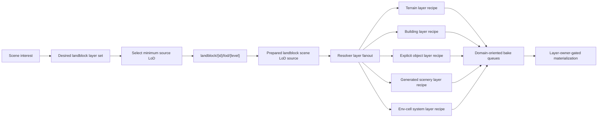
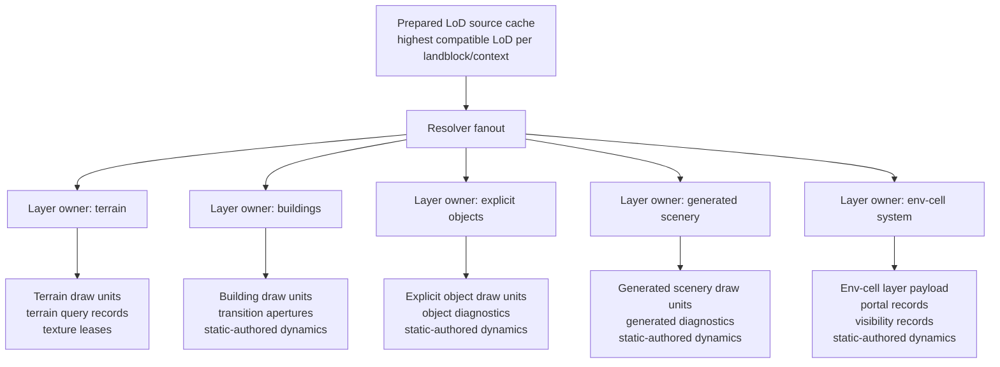
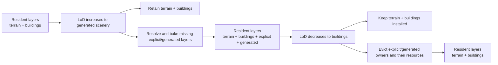

# Holtburger 3D Landblock Scene LoD Implementation Plan

## Purpose

Replace broad per-layer landblock static asset requests with a source-first landblock scene LoD asset pipeline that supports layer-granular ownership, stable scene retention, and low-churn LoD changes.

Status: draft implementation plan, converted from the validated requirements/specification on 2026-06-29. The phase order is intended to keep the project buildable while cutting over decisively; if implementation evidence invalidates a phase boundary, update this document before continuing.

## Context And Boundaries

The current 3D frontend schedules `outdoor-terrain`, `outdoor-buildings`, and `outdoor-detail` independently. Each resolver asks the host for the same `landblock-outdoor` payload, then slices it locally. Host asset caching avoids some duplicate host reads, but the frontend still performs duplicate resolver work, source-closure work, and materialization over payloads that may contain data outside the active LoD interest. The current `outdoor-detail` layer also collapses explicit outdoor objects and generated scenery into one renderer domain, which is too coarse for LoD ownership.

The target shape is source-first asset preparation with layer-granular scene ownership:

```text
Scene interest
  -> desired landblock layer set
  -> one landblock scene source request at the minimum sufficient LoD
  -> resolver emits one or more layer payloads
  -> coordinator installs, retains, or evicts layers independently
```

The landblock source product is a resolver and cache unit. It is not the scene cleanup unit. Scene cleanup must operate at landblock-layer granularity so LoD changes can add or remove detail without recreating retained lower layers.

The target shape is a clean cutover to landblock scene LoD host assets, not a compatibility shim around the current broad route. The existing `landblock/{id}/outdoor`, `landblock/{id}/env-cells`, and stale `landblock/{id}/topology` routes and frontend dependents should be purged after cutover.

## Target Architecture Illustrations

The route is source-first, but resolver output and runtime ownership remain layer-first. One source request should do the shared source work once, then fan out only the layer payloads currently demanded by scene interest.



The prepared source cache is a CPU reuse mechanism. It must not become the owner of scene resources. Layer owner records are the lifecycle authority for renderer resources, static-scene-query records, texture leases, and static-authored dynamic seeds.



LoD changes should mutate only the layers whose desired state changed. Lower layers retained across an LoD increase or decrease must not be re-fetched, re-baked, or re-materialized.



## Proposed Route Family

Use:

```text
landblock/{id}/lod/{level}
```

The route payload must be named independently from the existing full outdoor/env-cell payloads, for example `landblock-scene-lod`, so callers cannot accidentally treat it as the full current `landblock-outdoor` or `landblock-env-cells` bundle.

Required levels:

| Level | Emitted render content | Internal source context allowed |
| --- | --- | --- |
| `0` | Terrain mesh and terrain spatial facts only. | Cell landblock terrain and region metadata. |
| `1` | Level 0 plus building static members and building transition apertures. | LandblockInfo building facts and building source data. |
| `2` | Level 1 plus explicit outdoor object layer. | LandblockInfo explicit object facts. |
| `3` | Level 2 plus generated outdoor scenery layer after terrain, road, slope, object bounds, building occupancy, and object spacing filters. | Full outdoor scene inputs: terrain, LandblockInfo buildings/objects, region scene tables, scene files, and renderable source bounds. |
| `4` | In outdoor context, level 3 plus self-contained landblock env-cell system layer. | Env-cell structures, portals, visibility, static seeds, env-cell source geometry, and any source facts needed to make the emitted env-cell layer independent of separately materialized frontend building layers. |

In dungeon/interior contexts, levels below the env-cell LoD may emit no outdoor layers. An interior request can use LoD `4` to obtain env-cell output without implying terrain, building, explicit-object, or generated-scenery renderer layers are retained.

The exact type names can change during implementation, but the level semantics are requirements unless new evidence leads to an explicit spec update. The final contract must be explicit and tested.

## In Scope

- Adding typed host/content support for `landblock/{id}/lod/{level}`.
- Preserving generated scenery correctness by using shared outdoor scene assembly inputs even when a lower-detail payload omits some emitted object families.
- Replacing layer-first outdoor/env-cell resolver work with source-first landblock scene resolver work.
- Letting one landblock scene resolver result emit the requested terrain/building/explicit-object/generated-scenery/env-cell layer payloads from one selected landblock scene LoD source asset.
- Splitting current `outdoor-detail` rendering into LoD-aligned explicit-object and generated-scenery layers.
- Exposing LoD `2` explicit outdoor object interest as a separate scene-interest axis from LoD `3` generated outdoor scenery.
- Owning and evicting static scene output at landblock-layer granularity.
- Leasing or owning static-authored dynamic seeds by the landblock layer that emitted them.
- Adding a host-side prepared landblock scene LoD cache that retains the highest prepared LoD for recently requested landblocks.
- Updating payload schemas, binary serialization, asset key parsing, resolver tests, and integration tests.
- Removing frontend reliance on the broad `landblock-outdoor` payload for normal outdoor terrain/building/object/scenery layers.
- Removing frontend reliance on `landblock-env-cells` as a separate landblock source route.
- Removing the old `landblock/{id}/outdoor` and `landblock/{id}/env-cells` routes and dead dependents once normal frontend rendering uses landblock scene LoD routes.
- Removing the old `landblock/{id}/topology` route and its helper/test surfaces after LoD `4` owns the env-cell/topology facts needed by the frontend.

## Out Of Scope

- Changing generated scenery placement rules beyond preserving the current semantics.
- Adding screen-space or frustum-driven LoD.
- Optimizing texture atlas packing or WebGL draw submission beyond what is needed for route cutover and reduced LoD churn.
- Adding durable issue records, persisted migration diagnostics, or long-lived audit logs for this cutover.
- Preserving backwards compatibility for frontend static rendering if the new route proves cleaner.

## Ground Truth

Primary content and host paths:

- `crates/holtburger-core/src/content_assets.rs`
  - `ContentAssetRequest`
  - `ContentAsset`
  - `ContentAssetService::load`
- `crates/holtburger-content/src/landblock_scene_assets.rs`
  - `LandblockOutdoorAsset`
  - `LandblockOutdoorAssetAssembler`
  - `LandblockEnvCellsAsset`
  - `LandblockEnvCellsAssetAssembler`
  - `LandblockOutdoorStaticMember`
  - terrain mesh, outdoor static member, transition aperture, and BVH builders
- `crates/holtburger-content/src/static_outdoor_scene.rs`
  - `StaticOutdoorSceneAssembler`
  - `derive_explicit_objects`
  - `derive_buildings`
  - `derive_generated_scenery`
- `apps/holtburger-3d/src-tauri/src/adapter/ids.rs`
  - host route parsing to `ContentAssetRequest`
- `apps/holtburger-3d/src-tauri/src/adapter/binary.rs`
  - binary host response routing
- `apps/holtburger-3d/src-tauri/src/adapter/json.rs`
  - landblock payload serialization
- `apps/holtburger-3d/src/lib/host/contracts.ts`
  - Zod host payload contracts
- `apps/holtburger-3d/src/lib/assets/contracts.ts`
  - `HostAssetKeyKind`
- `apps/holtburger-3d/src/lib/assets/keys.ts`
  - host asset key formatting/parsing
- `apps/holtburger-3d/src/lib/assets/preparation/route-payloads.ts`
  - route-to-schema preparation

Frontend static paths:

- `apps/holtburger-3d/src/lib/static/demand-planner.ts`
- `apps/holtburger-3d/src/lib/static/coordinator/static-coordinator.ts`
- `apps/holtburger-3d/src/lib/static/resolver/static-resolver.worker.ts`
- `apps/holtburger-3d/src/lib/static/terrain/terrain-resolver.ts`
- `apps/holtburger-3d/src/lib/static/objects/outdoor-static-objects-resolver.ts`
- `apps/holtburger-3d/src/lib/static/objects/static-object-source-closure.ts`
- `apps/holtburger-3d/src/lib/static/bake/static-bake.worker.ts`
- `apps/holtburger-3d/src/lib/runtime/client-runtime.ts`
- `apps/holtburger-3d/src/lib/runtime/env-cell-system-layer-assembly.ts`
- `apps/holtburger-3d/src/lib/runtime/static-scene-query.ts`
- `apps/holtburger-3d/src/lib/runtime/scene-query/env-cell-committed-records.ts`
- `apps/holtburger-3d/src/lib/dynamic/contracts.ts`
- `apps/holtburger-3d/src/lib/dynamic/dynamic-entity-controller.ts`
- `apps/holtburger-3d/src/lib/dynamic/dynamic-entity-store.ts`
- `apps/holtburger-3d/src/lib/renderer/types.ts`

Validated current facts:

- Validation refreshed on 2026-06-29 against the current repository state. The target architecture remains valid, but several current-state facts are now more nuanced than the original draft.
- No `landblock/{id}/lod/{level}` route, `LandblockSceneLod` content request, or `landblock-scene-lod` frontend contract exists yet.
- `landblock/{id}/outdoor` currently contains terrain, statics, building transition apertures, and outdoor BVH.
- Generated scenery depends on raw terrain data and `LandblockInfo` building/object positions for occupancy and overlap filtering.
- Generated scenery does not need already-baked frontend terrain or building geometry, but it must be assembled with equivalent source context to preserve placement.
- The current `HostAssetKey` parser still does not model `landblock/{id}/topology` as a typed host asset key. However, `apps/holtburger-3d/src/lib/landblocks.ts` now has topology format/parse helpers and `apps/holtburger-3d/src/lib/host/tauri.ts` recognizes topology routes for binary lookup ordering. Cleanup should remove both the generic route machinery and those helper/test surfaces once LoD `4` replaces the route.
- The current 3D static render path does not consume `landblock/{id}/topology`; `landblock/{id}/env-cells` carries the richer env-cell data needed by the frontend renderer.
- `apps/holtburger-3d/src/lib/assets/preparation/route-payloads.ts` still does not prepare a typed topology payload for the normal frontend prepared-asset path.
- A 2026-06-29 production-code audit found no normal frontend static-rendering consumer of `landblock/{id}/topology`; surviving topology references are the content/host route implementation, generic binary route detection, route helpers, tests, and historical plan docs. LoD `4` should replace the route rather than preserve it.
- The current static worker API is single-job-shaped: `StaticResolverWorkerClient.resolve(job)` posts one `StaticResolverJob`, and the worker handler resolves exactly that job.
- `StaticCoordinator.reconcileStaticDemand` and `planStaticDemand` are the earliest existing frontend seams that see the full per-revision outdoor work set.
- `StaticDomain` and `ManualStaticDomain` currently model one `outdoor-detail` domain/radius.
- Current renderer layers, material planning, texture residency, diagnostics, and selection paths branch by static domain. That supports giving LoD `2` explicit objects and LoD `3` generated scenery separate domains/layers instead of sharing a renamed `outdoor-detail` bucket.
- Resource eviction is currently keyed by layer desired keys such as `landblock:da55ffff:outdoor-detail`.
- Bake batching is domain-oriented; source-first resolver fanout must still feed domain-oriented bake inputs unless that pipeline is intentionally redesigned.
- `StaticSceneQuery.retainLayerOwners` and `DynamicEntityController.retainLayerOwners` now consume layer owner keys directly.
- Env-cell system layer clearing is resource-driven and explicit. Clearing the renderer env-cell layer also calls `StaticSceneQuery.clearEnvCellSystemLayer(landblockId)`.
- The env-cell geometry attachment provider currently requests the full `landblock-env-cells` host asset directly to build cell-structure geometry attachments.
- `EnvCellSystemLayerAssemblyStore` currently merges env-cell materialized output with building transition facts from the `outdoor-buildings` path before publishing the renderer env-cell system layer. The LoD `4` route should make that runtime cross-layer merge unnecessary.
- Runtime-authored dynamics have explicit runtime lifetime, are not pruned by `retainLayerOwners`, and can now hold an explicit no-residence/unrendered render state.
- Static-authored dynamics are retained by layer owner ids; dynamic diagnostics and retention policy names now use `layerOwnerId` / `static-layer-owner`.
- Scene-interest readiness now tracks demanded layer owner states instead of active work ids/revisions.
- `ContentDecodeCache` is an LRU for decoded source records. It is not the prepared landblock scene LoD cache required by this spec.
- `StaticOutdoorSceneAssembler::assemble_from_loaded` currently derives explicit objects, buildings, and generated scenery together. Terrain-only or building-only LoD assembly therefore needs new gating in the shared source assembly path, not just projection from the existing full outdoor asset.

## Phased Implementation

Each phase should leave the repo in a buildable state. If a phase discovers that the current code shape makes a later phase cheaper or riskier than expected, update the affected future phase before implementing around the surprise.

Dry-run findings from 2026-06-29:

- The new route can be added without immediate renderer cutover, but any temporary old-route bridge must be isolated and deleted in Phase 7F as soon as source-first coordinator execution and browser worker wiring are ready for cutover.
- `ContentAssetService` owns the right lifetime for the prepared LoD source cache. `ContentDecodeCache` is source-record cache only and must not grow prepared scene semantics.
- The frontend currently has one browser interest/visibility axis for `detail`; explicit outdoor objects and generated scenery need separate interest, visibility, diagnostics, and retained-layer identities.
- The worker resolver protocol currently returns one `StaticScopePayload` for one `StaticResolverJob`; source-first fanout needs a protocol shape that can return multiple layer recipes from one source request.
- The old env-cell attachment/provider and env-cell system assembly store are normal-path dependencies today; deleting old routes before replacing those paths would break env-cell materialization.
- Final cleanup must audit executable code and tests, not just route strings, because old DTO schemas, host asset keys, lifecycle keys, renderer diagnostics, and fixtures can keep the removed model alive.

### Phase 0: Contract Worksheet And Naming Lock

Status: completed on 2026-06-29.

Goal: settle the names and type boundaries before code starts spreading temporary shapes.

Final contract names:

- Rust source level type: `LandblockSceneLodLevel`.
- Rust request type: `LandblockSceneLodRequest`.
- Rust asset type: `LandblockSceneLodAsset`.
- Rust layer enum/type family: `LandblockSceneLodLayer`, with layer variants `Terrain`, `OutdoorBuildings`, `OutdoorExplicitObjects`, `OutdoorGeneratedScenery`, and `EnvCellSystem`.
- TypeScript source level type: `LandblockSceneLodLevelDto`.
- TypeScript payload type: `LandblockSceneLodPayloadDto`.
- TypeScript source descriptor type: `LandblockSceneLodSourceDto`.
- TypeScript layer union type: `LandblockSceneLodLayerDto`.
- Static domain/layer name for LoD `2` explicit outdoor objects: `outdoor-explicit-objects`.
- Static domain/layer name for LoD `3` generated scenery: `outdoor-generated-scenery`.
- Payload `kind`: `landblock-scene-lod`.
- Payload layer discriminants: `terrain`, `outdoor-buildings`, `outdoor-explicit-objects`, `outdoor-generated-scenery`, and `env-cell-system`.
- Route shape: `landblock/{normalizedLandblockId}/lod/{level}` where `level` is `0`, `1`, `2`, `3`, or `4`.

Deliverables:

- Add Rust and TypeScript TODO-level contract notes or test fixtures that pin the chosen names for LoD levels, layer names, domain names, and payload layer discriminants.
- Decide final names for the new explicit-object and generated-scenery static domains/layers.
- Decide final names for Rust request/asset types, expected to be close to `LandblockSceneLodLevel`, `LandblockSceneLodRequest`, and `LandblockSceneLodAsset`.
- Add a short progress entry under this phase when the naming cut is complete.

Acceptance criteria:

- The plan contains the final domain/layer/type names before Phase 1 starts.
- No implementation code depends on placeholder names that are expected to be renamed later.

Task checklist:

- [x] Choose final LoD level type names in Rust and TypeScript.
- [x] Choose final static domains for LoD `2` explicit objects and LoD `3` generated scenery.
- [x] Choose final layer DTO discriminants for `landblock-scene-lod`.
- [x] Record any naming concessions in this phase.

Decisions and course corrections:

- Chose explicit names over shorter aliases: `outdoor-explicit-objects` and `outdoor-generated-scenery` are longer than `outdoor-objects` / `outdoor-scenery`, but they preserve the LoD split in diagnostics, tests, and future zero-reference audits.
- Phase 1 should use these exact names unless implementation evidence forces a plan update before code changes.

### Phase 1: Rust Route And Payload Skeleton

Status: completed on 2026-06-29.

Goal: introduce the new route family end to end without moving frontend rendering to it yet.

Deliverables:

- `crates/holtburger-core/src/content_assets.rs`
  - Add a typed `ContentAssetRequest` variant for `landblock/{id}/lod/{level}`.
  - Add a typed `ContentAsset` variant for the scene LoD asset.
  - Define the prepared LoD source cache ownership boundary at `ContentAssetService`; instantiate the field only when the skeleton route or Phase 2 implementation exercises it.
- `crates/holtburger-content/src/landblock_scene_assets.rs`
  - Add the scene LoD asset/request structs and a skeleton assembler path.
  - Add level validation and normalized landblock id handling.
- `apps/holtburger-3d/src-tauri/src/adapter/ids.rs`
  - Parse `landblock/{id}/lod/{level}` and reject malformed ids/unsupported levels.
- `apps/holtburger-3d/src-tauri/src/adapter/json.rs`
  - Add JSON serialization for the skeleton payload shape.
- `apps/holtburger-3d/src-tauri/src/adapter/binary.rs`
  - Route binary host responses for the new request variant.

Acceptance criteria:

- Rust tests prove route parsing accepts levels `0` through `4` and rejects invalid levels.
- The new request can return a structurally valid empty/skeleton `landblock-scene-lod` payload.
- Existing `landblock-outdoor`, `landblock-env-cells`, and topology behavior remains unchanged during this phase.

Task checklist:

- [x] Add Rust LoD level type with comments pinning emitted families.
- [x] Record or implement the typed prepared LoD cache owner at `ContentAssetService`; do not add unused fields and do not hide prepared scene state in `ContentDecodeCache`.
- [x] Add `ContentAssetRequest` and `ContentAsset` variants.
- [x] Add Tauri route parsing and binary response routing.
- [x] Add skeleton JSON serializer.
- [x] Add focused route/parser tests.

Decisions and course corrections:

- Added `LandblockSceneLodLevel`, `LandblockSceneLodContext`, `LandblockSceneLodRequest`, `LandblockSceneLodAsset`, `LandblockSceneLodLayer`, and `LandblockSceneLodAssetAssembler` in `holtburger-content`.
- Added route-facing `ContentAssetRequest::LandblockSceneLod` and `ContentAsset::LandblockSceneLod` in `holtburger-core`.
- The skeleton assembler currently returns normalized landblock id, requested level/context, empty `layers`, and default diagnostics. Real source family assembly remains Phase 2 work.
- Prepared LoD cache ownership is pinned to `ContentAssetService`, but no unused cache field was added in Phase 1.
- Validation run: `cargo test -p holtburger-core content_asset_service_loads_landblock_scene_lod_skeleton`; `cargo test -p holtburger-3d landblock_scene_lod`; `cargo test -p holtburger-3d direct_json_lookup_rejects_binary_routed_assets`.

### Phase 2A: Source Assembly Gates

Status: completed on 2026-06-29.

Goal: make source-family derivation explicit so lower LoD requests do not secretly execute full outdoor assembly work.

Deliverables:

- Split or parameterize `StaticOutdoorSceneAssembler` so terrain, outdoor buildings, explicit outdoor objects, generated scenery, source bounds, and env-cell inputs are independent source-family gates.
- Wire `LandblockSceneLodAssetAssembler` through the gated source path instead of calling the full `landblock-outdoor` or `landblock-env-cells` assemblers and filtering afterward.
- Keep the skeleton `LandblockSceneLodLayer` payload shape stable while the phase proves source gating.

Acceptance criteria:

- Level `0` does not derive outdoor static source bounds.
- Level `1` derives building facts without explicit/generated object bounds.
- Level `2` derives explicit object facts without generated scenery derivation.
- Tests fail if a lower level accidentally calls a higher source-family derivation path.

Task checklist:

- [x] Split or parameterize `StaticOutdoorSceneAssembler` source-family derivation.
- [x] Add focused content tests for level-specific gating.
- [x] Confirm no `landblock-scene-lod` implementation path calls the old full route assemblers and filters afterward.

Decisions and course corrections:

- Broke the original Phase 2 into 2A-2D on 2026-06-29. The previous scope mixed source gates, payload parity, env-cell preservation, and cache behavior into one oversized commit.
- Cache key dimensions remain intentionally narrow: normalized landblock id, source LoD, and scene context only if context changes emitted source semantics. Requested output layers are not cache identity.
- Added `StaticOutdoorSceneSourceFamilies` so explicit objects, outdoor buildings, and generated scenery are requested as explicit source-family gates.
- Kept the full `landblock-outdoor` route on `StaticOutdoorSceneSourceFamilies::ALL` to preserve current behavior while the new LoD route opts into only the families implied by the requested source LoD.
- Wired `LandblockSceneLodAssetAssembler` through the gated static outdoor source path for LoD `1` through `4`; LoD `0` does not touch static outdoor source-family assembly.
- Real `landblock-scene-lod` layer payloads remain Phase 2B/2C work. Phase 2A intentionally proves source gating without pretending the skeleton payload is complete.
- Validation run: `cargo test -p holtburger-content source_family_gates_skip_static_families_below_requested_lod`; `cargo test -p holtburger-content scene_lod_static_source_families_follow_level_contract`; `cargo test -p holtburger-core content_asset_service_loads_landblock_scene_lod_skeleton`.

### Phase 2B: Outdoor Layer Projections

Status: completed on 2026-06-29.

Goal: emit real terrain, building, explicit-object, and generated-scenery LoD layers from the gated source path.

Deliverables:

- Populate `LandblockSceneLodLayer::Terrain`, `OutdoorBuildings`, `OutdoorExplicitObjects`, and `OutdoorGeneratedScenery` with enough typed data for the frontend host contract and later resolver fanout.
- Preserve current terrain/building/static object facts where the old route is still the parity reference.
- Keep explicit-object and generated-scenery domains separate in emitted layer records.

Acceptance criteria:

- Level `0` emits only terrain layer output.
- Level `1` emits terrain plus outdoor building layer output.
- Level `2` emits terrain, buildings, and explicit outdoor object output.
- Level `3` emits terrain, buildings, explicit outdoor objects, and generated scenery.
- Level `3` preserves current generated scenery identities/placements relative to `landblock-outdoor`.

Task checklist:

- [x] Replace skeleton outdoor layer variants with typed layer payload structs.
- [x] Add terrain/building/explicit-object/generated-scenery projection tests.
- [x] Add generated scenery parity tests against the current full route.
- [x] Confirm emitted layer discriminants still match Phase 0 names.

Decisions and course corrections:

- Added typed `LandblockSceneLodLayer` payloads for terrain, outdoor buildings, explicit outdoor objects, and generated outdoor scenery.
- `LandblockSceneLodAssetAssembler` now builds one gated outdoor source, prepares static meshes once, and partitions prepared members into layer records by `PreparedStaticInstanceKind`.
- Kept generated scenery parity structural instead of fixture-backed: the LoD route uses the same `StaticOutdoorSceneAssembler`, prepared static instance builder, static member builder, and generated fact structs as `landblock-outdoor`. There is no checked-in HBA/DAT fixture suitable for a required live route-vs-route generated scenery parity test.
- Recorded verification debt: if checked-in content fixtures are added later, add a live parity test comparing LoD `3` generated member identities/placements against `landblock-outdoor` for the same landblock.
- Added shaped JSON layer serialization while preserving Phase 0 discriminants: `terrain`, `outdoor-buildings`, `outdoor-explicit-objects`, and `outdoor-generated-scenery`.
- Validation run: `cargo test -p holtburger-content scene_lod_outdoor_layers_partition_static_families_by_level`; `cargo test -p holtburger-content scene_lod_static_source_families_follow_level_contract`; `cargo test -p holtburger-core content_asset_service_loads_landblock_scene_lod_layers`; `cargo test -p holtburger-3d serialize_landblock_scene_lod_payload_emits_layer_payloads`; `cargo test -p holtburger-3d serialize_landblock_scene_lod_payload_emits_skeleton_contract`.

### Phase 2C: LoD 4 Env-Cell Source Projection

Status: completed on 2026-06-29.

Goal: make LoD `4` carry env-cell source facts in the new payload without yet deleting the old env-cell route or runtime assembly store.

Deliverables:

- Populate `LandblockSceneLodLayer::EnvCellSystem` from the gated LoD `4` source path.
- Preserve env-cell structure, portals, visibility, static seeds, geometry facts, diagnostics, and source provenance needed by the later self-contained env-cell cutover.
- Identify any facts still only available through the old `landblock-env-cells` route and record them as Phase 10 blockers or pull them forward immediately if they block LoD `4` projection.

Acceptance criteria:

- Level `4` emits level `3` output plus env-cell system source output.
- Env-cell projection tests cover structure, portals, visibility, static seeds, geometry facts, and diagnostics.
- No lower LoD level derives env-cell system output.

Task checklist:

- [x] Add env-cell system layer payload structs.
- [x] Add LoD `4` env-cell preservation tests.
- [x] Record any remaining env-cell cutover debt under Phase 10 or move it earlier if it blocks the new route.

Decisions and course corrections:

- Added `LandblockSceneLodEnvCellSystemLayer` and changed `LandblockSceneLodLayer::EnvCellSystem` from a marker to a typed payload containing env cells, landblock env-cell BVH items, BVH, and diagnostics.
- LoD `4` now emits LoD `3` outdoor output plus an env-cell system layer. Lower LoD levels do not emit or derive env-cell system output.
- Reused `LandblockEnvCellsAssetAssembler` internally for Phase 2C to preserve current env-cell structure, portals, visibility, static seeds, geometry facts, and diagnostics without keeping the old host route as a normal-path dependency.
- Added JSON serialization for `env-cell-system` layer records with env cells, portal links, landblock env-cell BVH, render geometry, and diagnostics.
- Recorded cutover debt for Phase 10: LoD `4` still wraps the existing env-cell bundle assembler internally. Later cutover must remove runtime dependence on direct `landblock-env-cells` host lookups and delete old env-cell assembly store paths after source-first scheduling is in place.
- Validation run: `cargo test -p holtburger-content scene_lod_level_4_includes_env_cell_system_layer`; `cargo test -p holtburger-content scene_lod_lower_levels_do_not_include_env_cell_system_layer`; `cargo test -p holtburger-3d serialize_landblock_scene_lod_payload_emits_env_cell_system_layer`.

### Phase 2D: Prepared LoD Cache Projection

Status: completed on 2026-06-29.

Goal: add the prepared scene LoD cache after source semantics are stable, with no extra key dimensions for requested output layers.

Deliverables:

- Add a prepared LoD cache owned by `ContentAssetService` with 256 normalized landblock slots.
- Store the highest prepared LoD per normalized landblock and compatible scene context only when context changes emitted source semantics.
- Ensure lower/equal LoD requests project from cached higher-LoD state.
- Ensure identical concurrent requests dedupe through the existing `ContentAssetRuntime` in-flight request behavior while compatible lower/equal follow-up requests reuse the prepared LoD cache.

Acceptance criteria:

- Cache tests prove lower/equal requests project from cached higher state.
- Cache tests prove higher requests replace lower cached state, after which lower/equal requests project from the higher cached state.
- Concurrency/reuse tests prove identical in-flight requests dedupe and compatible lower/equal follow-up requests do not duplicate source preparation.
- Requested output layers are excluded from cache identity.

Task checklist:

- [x] Add the `ContentAssetService` prepared LoD cache and cache reuse tests.
- [x] Add a concurrency/reuse test proving in-flight and prepared-cache behavior do not duplicate source preparation for identical requests and compatible lower/equal follow-up requests.
- [x] Confirm the cache key excludes requested output layers.
- [x] Record any cache eviction or invalidation debt discovered during implementation.

Decisions and course corrections:

- Added a 256-entry prepared LoD cache owned by `ContentAssetService`.
- Cache identity is only normalized landblock id plus `LandblockSceneLodContext`. Requested output layers are not part of the key.
- Cached assets retain the highest prepared LoD for a key. Lower/equal requests project from the cached higher asset instead of re-reading source records.
- Higher requests replace lower cached state. They do not yet incrementally extend lower prepared state without recomputing lower source families.
- Split the original "higher extends lower cached state" requirement into Phase 2E because it requires assembler-level partial preparation, not just service-level projection. Keeping it inside Phase 2D would either overfit the cache or create fake coverage.
- Validation run: `cargo test -p holtburger-core landblock_scene_lod_cache_projects_lower_requests_from_cached_higher_lod`; `cargo test -p holtburger-core landblock_scene_lod_cache_replaces_lower_cached_lod_with_higher_lod`; `cargo test -p holtburger-core content_asset_runtime_dedupes_identical_landblock_scene_lod_requests`.

### Phase 2E: Incremental Higher-LoD Extension

Status: completed on 2026-06-29.

Goal: teach higher LoD preparation to reuse already prepared lower source-family state instead of recomputing lower families.

Deliverables:

- Reuse cached prepared lower layer state while preparing only missing terrain, building, explicit-object, generated-scenery, and env-cell-system families.
- Change higher-LoD assembly to extend missing source-family state from the cached lower preparation where possible.
- Keep final public `LandblockSceneLodAsset` projection unchanged.

Acceptance criteria:

- Cache tests prove a higher request after a lower cached request does not recompute lower source families.
- The cache key remains normalized landblock id plus context only.
- Final projected layer payloads remain identical to Phase 2B/2C output for the same requested LoD.

Task checklist:

- [x] Reuse cached typed lower layer payloads as prepared lower source state.
- [x] Teach the assembler/cache handoff to extend missing source families.
- [x] Add read-count or instrumentation tests proving higher-after-lower avoids lower-family recomputation.
- [x] Confirm no requested output-layer dimension enters cache identity.

Decisions and course corrections:

- Added `LandblockSceneLodAssetAssembler::assemble_landblock_extending_cached_asset` so `ContentAssetService` can pass a cached lower LoD asset when a higher LoD is requested.
- Higher LoD extension reuses cached lower layer payloads and only asks the content assembler for missing source families. For example, Level `1` cached building output is retained when Level `3` later prepares explicit/generated output.
- Chose not to add a separate internal source-state struct in this phase. The typed layer payloads are already the prepared reusable lower state for current terrain/building/explicit/generated/env-cell output, and a separate wrapper would add ceremony without improving cache correctness yet.
- Cache identity remains normalized landblock id plus context only. Requested output layers still do not enter the key.
- Validation run: `cargo test -p holtburger-core higher_landblock_scene_lod_extends_cached_lower_layers`; `cargo test -p holtburger-core landblock_scene_lod_cache_projects_lower_requests_from_cached_higher_lod`; `cargo test -p holtburger-core landblock_scene_lod_cache_replaces_lower_cached_lod_with_higher_lod`; `cargo test -p holtburger-content scene_lod_outdoor_layers_partition_static_families_by_level`; `cargo test -p holtburger-content scene_lod_static_source_families_follow_level_contract`.

### Phase 3: Frontend Host Contract And Asset Key Support

Status: completed on 2026-06-29.

Goal: make the browser app understand `landblock-scene-lod` as a first-class prepared asset while keeping existing render scheduling intact.

Deliverables:

- `apps/holtburger-3d/src/lib/host/contracts.ts`
  - Add Zod contracts for structural `landblock-scene-lod` payloads.
  - Represent emitted layers with discriminated layer records, not `includes` booleans.
- `apps/holtburger-3d/src/lib/assets/contracts.ts`
  - Add the new host asset key kind.
- `apps/holtburger-3d/src/lib/assets/keys.ts`
  - Add format/parse round-trip support for `landblock/{id}/lod/{level}`.
- `apps/holtburger-3d/src/lib/assets/preparation/route-payloads.ts`
  - Add route-to-schema preparation for `landblock-scene-lod`.
- `apps/holtburger-3d/src/lib/host/tauri.ts`
  - Recognize the new route for binary lookup if the payload needs binary envelope support.
- Mark old `landblock-outdoor` and `landblock-env-cells` frontend DTO schemas, host asset keys, route payload parsers, and binary lookup branches as temporary compatibility surfaces scheduled for Phase 11 deletion.

Acceptance criteria:

- TypeScript tests prove route/key round-tripping for all supported levels.
- Payload parsing rejects duplicate layer records, impossible layers for declared source LoD/context, malformed layers, and wrong `kind`.
- Existing frontend render paths still use old routes until source-first scheduling lands.
- No new code path treats `landblock-scene-lod` as a union fallback for old `landblock-outdoor` or `landblock-env-cells` DTOs.

Task checklist:

- [x] Add TS source LoD and layer DTO types.
- [x] Add Zod contracts for all layer records.
- [x] Add host asset key formatting/parsing tests.
- [x] Add route payload preparation tests.
- [x] Confirm topology remains untyped and scheduled for deletion, not revived as a first-class frontend asset.

Decisions and course corrections:

- Added `landblock-scene-lod` as a typed `HostAssetKeyKind` with a dedicated `createLandblockSceneLodHostAssetKey(landblockId, level)` helper. The key id is normalized as `hex32:level`; the host route remains `landblock/{id}/lod/{level}`.
- Added `LandblockSceneLodLevelDto`, `LandblockSceneLodSourceDto`, `LandblockSceneLodLayerDto`, and `LandblockSceneLodPayloadDto` Zod contracts.
- Layer parsing rejects duplicate layer records, layers above the declared source LoD, and outdoor layer records on interior source context. The contract uses discriminated layer records and does not add `includes` ceremony.
- Added `landblock-scene-lod` route preparation as a first-class payload kind. It is not a fallback or union alias for `landblock-outdoor` or `landblock-env-cells`.
- Added frontend binary lookup routing for `landblock/{id}/lod/{level}`.
- Left `landblock-outdoor`, `landblock-env-cells`, and topology frontend surfaces in place as temporary compatibility paths for later source-first scheduling and Phase 11 deletion. Topology was not promoted into a new first-class frontend asset.
- Validation run: `npm run test:ts -- src/lib/assets/keys.test.ts src/lib/assets/preparation.test.ts src/lib/host/tauri.test.ts`; `npm run check`.

### Phase 4: Resteering Checkpoint - Contract And Source Shape

Status: completed on 2026-06-29.

Goal: pause after the host/content/frontend contract exists and verify the remaining frontend cutover still matches reality.

Review checklist:

- [x] Confirm the LoD route does not hide full-route CPU work behind a smaller payload.
- [x] Confirm the prepared LoD cache key stayed minimal.
- [x] Confirm `landblock-scene-lod` layer records are enough for all planned frontend recipes.
- [x] Reassess whether env-cell LoD `4` is self-contained enough to remove `EnvCellSystemLayerAssemblyStore`.
- [x] Update Phase 5 through Phase 10 if new evidence changes the cutover path.

Acceptance criteria:

- The plan is updated with any course corrections before frontend lifecycle work begins.

Decisions and course corrections:

- LoD source assembly is no longer just a smaller payload over full-route work. Static families are gated, lower cached layers are reused during higher-LoD extension, and LoD `0` avoids static outdoor source-family assembly.
- The prepared LoD cache key stayed minimal: normalized landblock id plus scene context. Requested output layers remain excluded from cache identity.
- The `landblock-scene-lod` layer records are sufficient for planned frontend recipe fanout: terrain carries terrain mesh, outdoor layers carry static members/BVH/transition apertures where applicable, and LoD `4` carries env cells, portal links, render geometry, landblock env-cell BVH, and diagnostics.
- LoD `4` is fact-complete enough to support removing `EnvCellSystemLayerAssemblyStore` later, but the implementation still wraps `LandblockEnvCellsAssetAssembler` internally. Phase 10 remains necessary to remove direct `landblock-env-cells` host lookups and old runtime merge/store paths.
- Phase 5 through Phase 10 ordering still stands. No new compatibility escape hatch was added; old broad routes remain compatibility surfaces only until source-first scheduling and cleanup phases delete them.

### Phase 5A: Static Domain Contract Split

Status: complete.

Goal: split public static domain and renderer layer names before browser-control and resolver behavior changes.

Deliverables:

- Replace `outdoor-detail` with separate explicit-object and generated-scenery domains/layers across static contracts, renderer layer contracts, texture residency, diagnostics, and selection.
- Update material planning and texture residency domain types so explicit objects and generated scenery are public separate domains.
- Keep old `outdoor-detail` references only where they are historical prose or explicitly scheduled compatibility debt.

Acceptance criteria:

- Static domain contracts expose `outdoor-explicit-objects` and `outdoor-generated-scenery`.
- Renderer layer key/domain types can represent explicit-object and generated-scenery layers independently.
- Material planning and texture residency types no longer require `outdoor-detail` for new outdoor object behavior.
- No resolver scheduling, layer-owner lifecycle, or source-first fanout behavior is introduced in this phase.

Task checklist:

- [x] Update `StaticDomain`, renderer layer kinds, texture domains, and material planning domains.
- [x] Update diagnostics and selection key domain types.
- [x] Update contract-focused tests that assert public domain names.
- [x] Record any surviving `outdoor-detail` references as Phase 11 deletion targets unless they are historical prose.

Decisions and course corrections:

- Split the original Phase 5 into 5A-5C on 2026-06-29 after discovery showed the phase combined public type contracts, browser controls, and resolver/baker behavior.
- Added `OutdoorStaticObjectLayerDomain` for `outdoor-explicit-objects` and `outdoor-generated-scenery`, plus `OutdoorStaticObjectDomain` for static-object materialization contracts while the old combined detail resolver remains executable.
- Added explicit-object and generated-scenery renderer layer payload contracts and mapped the new static domains to independent landblock layer kinds.
- Updated material coverage, compatibility partitioning, static-object bake diagnostics, selection-facing payload domain types, and dynamic static-authored material-domain projection so they can preserve split object domains instead of collapsing them back to `outdoor-detail`.
- Left demand scheduling, browser visibility, resolver fanout, baker behavior, and renderer upload methods on the old `outdoor-detail` path for Phase 5B/5C. This is compatibility debt, not an escape hatch.
- Validation: `npm run check`; `npm run test:ts -- src/lib/renderer/static-layer-contracts.test.ts src/lib/static/objects/bake/static-object-material-planner.test.ts src/lib/static/objects/bake/static-object-compatibility-partitioner.test.ts src/lib/dynamic/dynamic-entity-controller.test.ts`.

### Phase 5B: Browser Interest And Visibility Axis Split

Status: complete.

Goal: replace browser `detail` control state with separate explicit-object and generated-scenery axes.

Deliverables:

- Replace browser `detail` interest state with explicit-object and generated-scenery interest/radius state.
- Replace renderer `outdoorDetail` visibility with explicit-object and generated-scenery visibility controls.
- Update `BrowserDisplay`, follow/manual controls, and interest normalization tests.

Acceptance criteria:

- Browser interest can request explicit objects independently from generated scenery.
- Renderer visibility can show/hide explicit objects independently from generated scenery.
- Existing terrain/building/env-cell controls remain unchanged.
- No layer-owner lifecycle behavior is introduced in this phase.

Task checklist:

- [x] Update `BrowserDisplay`, `OutdoorSceneInterest`, and renderer visibility contracts to split explicit-object and generated-scenery controls/state.
- [x] Update manual/follow-mode domain controls.
- [x] Update browser interest and renderer visibility tests.

Decisions and course corrections:

- Replaced browser `detailRadius`/`detailLandblockIds` with explicit-object and generated-scenery radii/landblock sets.
- Replaced manual `detail` domain control with `explicit-objects` and `generated-scenery`.
- Replaced renderer `outdoorDetail` visibility with `outdoorExplicitObjects` and `outdoorGeneratedScenery`, and updated WebGL2 visibility checks for split object domains.
- Kept the temporary old-detail bridge in runtime demand by passing `lod.detail = max(explicitObjectRadius, generatedSceneryRadius)` until Phase 5C splits resolver and baker work. Legacy `outdoor-detail` resources remain visible when either split object visibility axis is enabled.
- Validation: `npm run check`; `npm run test:ts -- src/lib/browser/outdoor-scene-interest.test.ts src/lib/renderer/static-layer-contracts.test.ts src/lib/runtime/client-runtime.test.ts src/lib/renderer/webgl2/webgl2-renderer.test.ts`.

### Phase 5C: Resolver, Baker, Diagnostics, And Selection Domain Split

Status: complete.

Goal: make resolver, baker, diagnostics, and selection behavior use the split explicit-object/generated-scenery public domains while still temporarily sourcing from old broad routes.

Deliverables:

- Update resolver, baker, material planning, texture residency, diagnostics, and selection tests so explicit objects and generated scenery are public separate domains even if they still share old `landblock-outdoor` source loading temporarily.
- Keep existing old-route source loading on the normal path only as the source provider for the newly split domains; do not introduce layer-owner adapters in this phase.

Acceptance criteria:

- LoD `2` explicit-object and LoD `3` generated-scenery work have separate retained scopes, renderer layer identities, domain names, diagnostics, and selection.
- Existing object baking can still share implementation where useful, but public domain/layer identity is distinct.
- Tests and fixtures no longer use `outdoor-detail` as the public domain for new behavior.
- No layer-owner lifecycle behavior is introduced in this phase.

Task checklist:

- [x] Split `outdoor-detail` resolver, baker, renderer, diagnostics, selection, and fixture tests into explicit-object/generated-scenery cases.
- [x] Keep old route source loading working only as temporary source plumbing for the split domains.
- [x] Record any surviving `outdoor-detail` references as Phase 11 deletion targets unless they are historical prose.

Decisions and course corrections:

- Normal outdoor demand now schedules `outdoor-explicit-objects` and `outdoor-generated-scenery`; it no longer schedules `outdoor-detail` for browser object detail work.
- The outdoor static object resolver filters explicit objects and generated scenery into separate payload domains while still reading the old `landblock-outdoor` source payload.
- Static resolver/worker routing, browser runtime routing, bake attachment loading, and static object compatibility baking now accept split object domains.
- Runtime materialization now projects split explicit-object and generated-scenery renderer layer payloads. Generated-scenery retains instanced visual-resource support.
- WebGL2 exposes split object layer setters that share the existing static-object upload implementation.
- Generated object inventory and representative resolver/partition/runtime tests now use `outdoor-generated-scenery` instead of `outdoor-detail` for new behavior.
- Surviving executable `outdoor-detail` references are compatibility surfaces for old detail payloads, WebGL2 old-detail diagnostics/counters, and old route/source tests. Phase 11 must delete or rename them after layer ownership and old-route removal make the compatibility path unreachable.
- Validation: `npm run check`; `npm run test:ts -- src/lib/static/demand-planner.test.ts src/lib/static/objects/outdoor-static-objects-resolver.test.ts src/lib/static/objects/static-object-instance-inventory.test.ts src/lib/static/objects/bake/static-object-compatibility-partitioner.test.ts src/lib/runtime/client-runtime.test.ts src/lib/browser/create-browser-runtime.test.ts src/lib/renderer/webgl2/webgl2-renderer.test.ts`.

### Phase 6A: Layer Owner Contract And Reconciliation Model

Status: complete.

Goal: introduce typed landblock-layer owner identity and pure reconciliation semantics before changing coordinator lifecycle behavior.

Deliverables:

- Add `LayerOwnerKey` and `LayerOwnerState` types for terrain, buildings, explicit objects, generated scenery, and env-cell systems.
- Add pure owner reconciliation helpers that classify retained, added, evicted, and unchanged layer owners.
- Keep work ids out of owner identity; owner keys must be stable across work revisions.

Acceptance criteria:

- LoD `2` explicit-object and LoD `3` generated-scenery work have separate retained scopes and resource ownership.
- Tests prove LoD increase/decrease decisions can be represented as layer owner changes.
- Reconciliation tests cover retain/add/evict/unchanged without requiring resolver, baker, or WebGL behavior.
- No coordinator lifecycle behavior changes in this phase.

Task checklist:

- [x] Add `LayerOwnerKey` and `LayerOwnerState` types.
- [x] Add owner-state reconciliation tests for retain/add/evict/unchanged cases.
- [x] Wire split explicit-object and generated-scenery domains into owner-key mapping.
- [x] Keep work ids transient; do not make them durable owner identity.

Decisions and course corrections:

- Split original Phase 6 on 2026-06-29 because it combined owner contract design, coordinator state mutation, and temporary adapter policy.
- Added pure layer-owner mapping and reconciliation helpers without touching coordinator lifecycle behavior.
- Mapped split explicit-object and generated-scenery static domains to distinct layer owner kinds; legacy `outdoor-detail` currently maps to generated-scenery only as compatibility debt for later deletion.
- Validation: `npm run check`; `npm run test:ts -- src/lib/static/layer-owners.test.ts`.

### Phase 6B: Coordinator Owner State Index

Status: complete.

Goal: make layer owners visible to the static coordinator without replacing source-first routing yet.

Deliverables:

- Introduce owner records as coordinator-visible lifecycle state for desired, resolving, baking, materialized, empty, and failed layers.
- Index current work and committed resources by layer owner key in addition to the existing work-id/resource paths.
- Keep old route resolver jobs as the temporary source of data, but make their produced records target layer owners.

Acceptance criteria:

- Coordinator snapshots can report owner states for split explicit-object and generated-scenery owners separately.
- Existing work ids remain transient execution ids and are not used as durable owner identity.
- Tests cover owner state transitions through resolving, baking, materialized, empty, failed, and evicted states.

Task checklist:

- [x] Add owner state index to static coordinator snapshots/deltas.
- [x] Record owner keys on work or work-adjacent metadata without changing route source behavior.
- [x] Update coordinator tests for owner lifecycle transitions.

Decisions and course corrections:

- Added `ownerStates` to `StaticCoordinatorSnapshot`; owner state projection is derived from existing active work and resident resources without changing resolver or baker execution.
- Owner lifecycles map active work to `desired`, `resolving`, `baking`, `materialized`, `empty`, and `failed`. Eviction is represented by removing the owner from the snapshot after demand reconciliation evicts its resources.
- Existing work ids remain execution-local. Owner keys are derived from landblock layer identity and do not include work ids or revisions.
- Validation: `npm run check`; `npm run test:ts -- src/lib/static/layer-owners.test.ts src/lib/static/coordinator/static-coordinator.test.ts`.

### Phase 6C: Temporary Old-Route Owner Adapter

Status: completed on 2026-06-29.

Goal: isolate old-route loading behind an adapter that targets layer owners and is explicitly deleted by Phase 7F.

Deliverables:

- Keep existing old-route resolvers only through an isolated temporary adapter.
- Make adapter output target layer owner keys rather than treating route/domain jobs as durable ownership.
- Add the adapter to the Phase 7F deletion checklist.

Acceptance criteria:

- Temporary old-route adapter tests cover only owner translation and are deleted or rewritten in Phase 7F; they must not bless old route behavior as a stable path.
- No browser/domain split work remains in this phase beyond wiring split domains into owner records.

Task checklist:

- [x] Isolate old route loading behind a temporary adapter and add it to the Phase 7F deletion checklist.
- [x] Add adapter tests that verify owner translation only.
- [x] Confirm normal path still compiles and behaves before Phase 7E bypasses the temporary adapter with source fanout.

Decisions and course corrections:

- Added `TemporaryLayerOwnerTargetingResolverAdapter` as the only normal-path old-route bridge. It translates existing `StaticResolverJob` values into target layer owner keys before delegating to the current resolver.
- Wired `BrowserStaticResolver` through the temporary adapter without changing old-route payload behavior. This keeps Phase 6C focused on ownership targeting; Phase 7F must delete the adapter when source-first fanout becomes the normal browser path.
- Adapter tests intentionally verify owner-key translation and delegation only. They do not assert old `landblock-outdoor` or `landblock-env-cells` route behavior as a stable contract.
- Validation: `npm run test:ts -- src/lib/static/layer-owner-source-adapter.test.ts src/lib/browser/create-browser-runtime.test.ts`; `npm run check`.

### Phase 7A: Source-First Demand Planning

Status: completed on 2026-06-29.

Goal: compute landblock source requests and layer-owner targets before changing worker or browser runtime execution.

Deliverables:

- Change scene-interest planning so it computes desired layer owners per landblock and selects one minimum source LoD.
- Add source-first request and requested-layer contract types that carry normalized landblock id, selected source LoD, scene context, requested output layers, and target owner keys.
- Keep the existing old-route adapter as the execution path during this phase; this phase only makes source intent explicit and testable.

Acceptance criteria:

- Terrain-only interest requests LoD `0`.
- Terrain/buildings/explicit-object/generated-scenery/env-cell interest requests LoD `4` once for that landblock.
- Planner output contains one source request per landblock/context, with all requested layer owner keys attached.
- No normal browser execution changes from old-route loading in this phase.

Task checklist:

- [x] Update `planStaticDemand` or replace it with source-first planning.
- [x] Add source-first request and requested-layer types.
- [x] Add source-first planner tests for minimum LoD selection and layer owner targets.
- [x] Keep the Phase 6C temporary adapter wired as the production bridge until Phase 7E.

Decisions and course corrections:

- Added `StaticLandblockSceneLodSourceRequest` and `StaticLandblockSceneLodLayerRequest` to `StaticDemandPlan`. These requests carry normalized landblock id, scene context, minimum source LoD, requested layer kinds, and target owner keys.
- Kept `ScheduledStaticWork` as the current execution bridge. Phase 7A exposes source-first intent but does not route browser runtime or workers through the new requests yet.
- Planner grouping now collapses all requested layers for a landblock/context into one source request and selects the maximum required layer LoD as the minimum sufficient source LoD.
- Course correction during Phase 7B: interior-cell demand currently produces an `outdoor` LoD `4` source request for the same normalized landblock because it still asks for both env-cell system output and outdoor-building transition facts. The host `interior` LoD contract forbids outdoor layers, so Phase 10 must remove the building-layer dependency before interior-context source requests can become normal.
- Validation: `npm run test:ts -- src/lib/static/demand-planner.test.ts`; `npm run check`.

### Phase 7B: Resolver Protocol And Layer Recipe Fanout

Status: completed on 2026-06-29.

Goal: make resolver workers capable of resolving one landblock scene LoD source into multiple layer recipes.

Deliverables:

- Update the static resolver protocol, client, fake resolver, and worker handler for source-first multi-recipe output.
- Add a landblock scene LoD source resolver that loads `landblock/{id}/lod/{sourceLod}` and emits requested layer recipes tagged with target owner keys.
- Delete or rewrite normal-path usage of `TerrainStaticScopeResolver`, `OutdoorStaticObjectsResolver`, and `LandblockEnvCellsResolver` inside source fanout so they consume scene LoD layer data or disappear.
- Preserve emitted domain/layer tags so existing bake queues can remain domain-oriented in Phase 7C.

Acceptance criteria:

- Resolver fanout can emit multiple layer recipes from one source result.
- Worker/fake resolver tests assert source-first multi-recipe output rather than one old route per static domain.
- Worker tests prove one host route load per source request.
- Resolver output contains target layer owner keys for every emitted recipe.

Task checklist:

- [x] Update static resolver protocol/client/worker handler for multi-recipe output.
- [x] Add source-first resolver tests for multi-layer fanout.
- [x] Add worker tests proving one host route load per source request.
- [x] Replace old domain resolvers in the source fanout path, or delete them if no longer needed.

Decisions and course corrections:

- Added source-first resolver contracts: `StaticLandblockSceneLodSourceResolver`, `StaticLandblockSceneLodResolution`, and owner-tagged `StaticLayerRecipe`.
- Extended the worker protocol/client/handler with `resolve-landblock-scene-lod-source` and `landblock-scene-lod-source-resolved` messages while keeping existing static-scope messages for the temporary Phase 6C/7D bridge.
- Added `LandblockSceneLodSourceResolver`. It loads one `landblock-scene-lod` prepared asset for the source request, projects requested LoD layers into resolver-compatible in-memory payloads, and emits existing domain payloads tagged with target layer owner keys.
- The source fanout path reuses existing terrain/object/env-cell resolver logic through projected LoD-layer asset readers. This is a deliberate rewrite of the source input, not an old-route host fallback: tests assert the fanout does not request `landblock-outdoor` or `landblock-env-cells` prepared assets.
- Pulled a stale route-contract fix into this phase: `landblock-scene-lod` payloads now include `regionId` and `regionNumber`, matching old outdoor/env-cell payloads. Without this, source fanout would have to query broad old routes or guess terrain/material profile dependencies.
- Validation: `npm run test:ts -- src/lib/static/demand-planner.test.ts src/lib/static/resolver/landblock-scene-lod-source-resolver.test.ts src/lib/static/resolver/worker-client.test.ts src/lib/assets/preparation.test.ts`; `npm run check`; `npm run check:rust`; `cargo test -p holtburger-core content_assets`; `cargo test --manifest-path apps/holtburger-3d/src-tauri/Cargo.toml adapter::json`.

### Phase 7C: Owner-Gated Bake Integration

Status: completed on 2026-06-29.

Goal: route source-first layer recipes into existing bake queues without letting transient work ids become durable ownership.

Deliverables:

- Route layer recipes into existing domain-oriented bake queues while preserving owner keys.
- Add owner-demand gates before bake enqueue so unwanted recipes are dropped if their target owner is no longer demanded.
- Ensure bake inputs carry target layer owner keys alongside any transient work diagnostics still needed by the current coordinator.
- Keep browser runtime on the temporary adapter until bake integration is verified.

Acceptance criteria:

- Runtime drops unwanted recipes before bake enqueue if the target owner is no longer demanded.
- Bake batching remains domain/layer-oriented for terrain, buildings, explicit objects, generated scenery, and env-cell system output.
- Bake item tests verify owner keys survive from resolver recipe to bake input.
- No old-route deletion happens in this phase; deletion is reserved for Phase 7F.

Task checklist:

- [x] Preserve bake batching by emitted domain/layer.
- [x] Stamp bake inputs with target owner keys.
- [x] Add owner-gated stale recipe drop tests.
- [x] Confirm source-first resolver output can feed current bake workers without broad route payload fallbacks.

Decisions and course corrections:

- Added required `targetOwnerKey` ownership to `StaticBakeBatchItem`. Existing old-route execution derives it from the scheduled work domain/scope; source-first recipes already carry the same owner key directly.
- `StaticCoordinator` now stamps bake items with layer owner keys and filters pending batch items by current owner demand before bake. Work ids remain transient execution diagnostics during this phase.
- Existing batch keys remain domain/revision-oriented, so terrain, buildings, explicit objects, generated scenery, and env-cell system payloads continue to feed the current domain-specific bake workers.
- Added tests proving coordinator bake inputs carry owner keys and source-first resolver recipes can be passed to existing terrain/object/env-cell bakers without requesting broad old route payloads.
- Validation: `npm run test:ts -- src/lib/static/resolver/landblock-scene-lod-source-resolver.test.ts src/lib/static/coordinator/static-coordinator.test.ts`; `npm run check`.

### Phase 7D: Coordinator Source-First Execution

Status: completed on 2026-06-29.

Goal: make `StaticCoordinator` execute Phase 7A source requests through the Phase 7B source resolver and Phase 7C owner-keyed bake batches.

Deliverables:

- Route new demanded work through `StaticDemandPlan.sourceRequests` instead of one resolver call per `ScheduledStaticWork`.
- Map returned source recipes back to active demanded work by owner/layer identity before bake enqueue.
- Preserve existing batch/materialization behavior while carrying recipe-owned target owner keys.
- Add the minimum browser resolver source delegate required for `StaticCoordinator` to compile against the source resolver contract; keep adapter deletion and browser route assertions in later phases.

Acceptance criteria:

- New coordinator work invokes `resolveSource` with landblock scene LoD source requests.
- Coordinator tests prove source recipes enqueue domain-oriented bake items with the recipe `targetOwnerKey`.
- Late or no-longer-demanded recipes are dropped before bake enqueue.
- No temporary adapter deletion or browser old-route audit happens in this phase.

Task checklist:

- [x] Replace coordinator per-work resolver dispatch with source-request dispatch.
- [x] Add/adjust fake resolver support for source requests without blessing old broad-route behavior.
- [x] Add coordinator tests for grouped source dispatch, owner-keyed bake inputs, and stale recipe drops.
- [x] Verify existing materialization and diagnostics remain buildable after the execution change.

Decisions and course corrections:

- `StaticCoordinator` now dispatches new demanded work through `StaticDemandPlan.sourceRequests` and calls `resolveSource` instead of resolving each `ScheduledStaticWork` directly.
- Source resolutions are mapped back to active work by layer/domain identity, then enqueued into the existing domain-oriented bake queues with the recipe's `targetOwnerKey`.
- Late or no-longer-demanded recipes are dropped before bake enqueue and counted as stale resolver results.
- `DeferredStaticResolver` and `ImmediateStaticResolver` now implement source resolution. `DeferredStaticResolver` exposes source request handles for source-first tests while retaining per-layer test handles so existing coordinator behavior tests do not become protocol-noise tests.
- Course correction: making the coordinator require `StaticLandblockSceneLodSourceResolver` forced a minimal browser construction bridge in this phase. `BrowserStaticResolver.resolveSource` delegates to the worker source resolver, while the Phase 6C temporary adapter remains only on the old direct `resolve(job)` path for Phase 7F deletion.
- Validation: `npm run test:ts -- src/lib/static/coordinator/static-coordinator.test.ts`; `npm run test:ts -- src/lib/static/coordinator/static-coordinator.test.ts src/lib/static/resolver/worker-client.test.ts src/lib/static/resolver/landblock-scene-lod-source-resolver.test.ts src/lib/browser/create-browser-runtime.test.ts`; `npm run check`.

### Phase 7E: Browser Worker Source-First Wiring

Status: completed on 2026-06-29.

Goal: route normal browser static resolution through worker `landblock-scene-lod` source requests.

Deliverables:

- Verify the browser worker static resolver path uses `resolveSource` for normal static demand.
- Add browser/runtime assertions around the `BrowserStaticResolver` source delegate introduced in Phase 7D.
- Ensure each source request results in one worker `resolve-landblock-scene-lod-source` request for `landblock/{id}/lod/{sourceLod}`.
- Keep the temporary old-route adapter present but bypassed by normal browser source execution so Phase 7F can delete it cleanly.

Acceptance criteria:

- Browser/runtime tests assert source-first worker messages for normal static demand.
- Tests assert normal browser static resolution does not post old `landblock-outdoor` or `landblock-env-cells` broad-route requests.
- Direct per-domain resolver calls are not used by normal browser coordinator execution.
- No compatibility switch or fallback route is introduced.

Task checklist:

- [x] Update browser resolver types and runtime construction for `StaticLandblockSceneLodSourceResolver`.
- [x] Update worker-client/browser-runtime tests to observe source-first route usage.
- [x] Add no-old-route assertions for normal browser static resolution.
- [x] Confirm fake worker behavior still supports focused coordinator/runtime tests.

Decisions and course corrections:

- Browser worker-pool tests now assert normal source resolution posts `resolve-landblock-scene-lod-source` and does not post old direct `resolve-static-scope` jobs.
- Existing source resolver tests remain the host-route guard: source fanout must not request prepared `landblock-outdoor` or `landblock-env-cells` assets while resolving LoD source recipes.
- The worker-client protocol tests continue to cover source-first request/response transport and multi-recipe resolution.
- The temporary adapter still exists only for the old direct resolver surface and is now a Phase 7F deletion target, not part of normal source-first coordinator execution.
- Validation: `npm run test:ts -- src/lib/browser/create-browser-runtime.test.ts src/lib/static/resolver/worker-client.test.ts src/lib/static/coordinator/static-coordinator.test.ts`; `npm run check`.

### Phase 7F: Temporary Adapter Deletion And Route Audit

Status: completed on 2026-06-29.

Goal: delete the Phase 6C temporary bridge and prove no normal browser escape hatch to old broad routes remains.

Deliverables:

- Delete `TemporaryLayerOwnerTargetingResolverAdapter` from production code.
- Delete or rewrite its focused adapter tests so they do not preserve old-route behavior.
- Remove normal-path old broad route requests from browser static resolution.
- Run and record a focused route audit for `landblock-outdoor` and `landblock-env-cells` production browser usage.

Acceptance criteria:

- The `TemporaryLayerOwnerTargetingResolverAdapter` symbol and its test file are gone, not merely unused.
- Normal browser static resolution no longer requests `landblock-outdoor` or `landblock-env-cells`.
- Browser/runtime tests still assert source-first route usage and absence of old broad route requests after adapter deletion.
- No compatibility switch, fallback route, or escape hatch remains for normal browser static rendering.

Task checklist:

- [x] Delete `TemporaryLayerOwnerTargetingResolverAdapter` and its focused adapter tests.
- [x] Remove all normal-path imports and construction of the temporary adapter.
- [x] Run focused browser/runtime and coordinator tests after deletion.
- [x] Run route audits for old broad-route strings in production browser static paths.
- [x] Record any remaining compatibility-only old-route surfaces as Phase 11 deletion targets.

Decisions and course corrections:

- Deleted `TemporaryLayerOwnerTargetingResolverAdapter` and its focused tests. The browser resolver no longer delegates direct static-scope jobs to old per-domain source resolvers.
- `BrowserStaticResolver.resolve(job)` now fails loudly and tells callers to use `resolveSource`; normal coordinator execution uses source requests, so this is a guardrail rather than a fallback.
- Pulled `LandblockEnvCellGeometryAttachmentProvider` cleanup forward from Phase 10 because the route audit found it still directly requested `landblock-env-cells` in a normal bake path. The provider now builds geometry attachments from the resolved env-cell source payload and fails if the payload is resolver-light.
- Route audit result: no `TemporaryLayerOwnerTargetingResolverAdapter`, `layer-owner-source-adapter`, or `shouldUseBrowserSourceResolver` references remain under `apps/holtburger-3d/src`; no `createHostAssetKey("landblock-outdoor")` or `createHostAssetKey("landblock-env-cells")` calls remain in browser runtime, `StaticCoordinator`, the source-first resolver, or env-cell geometry attachment provider production paths.
- Remaining old broad-route compatibility surfaces are the old standalone resolver classes, route schemas/parsers/tests, and protocol support for direct `resolve-static-scope`; these are Phase 11 deletion targets after lifecycle and env-cell assembly store cutover.
- Validation: `npm run test:ts -- src/lib/browser/create-browser-runtime.test.ts src/lib/static/coordinator/static-coordinator.test.ts src/lib/static/resolver/landblock-scene-lod-source-resolver.test.ts src/lib/static/env-cells/bake/landblock-env-cell-geometry-attachments.test.ts`; `npm run check`.

### Phase 8A: Coordinator Owner-Attached Residency

Status: completed on 2026-06-29.

Goal: make `StaticCoordinator` attach resident resources and diagnostics to layer owners instead of desired work keys.

Deliverables:

- Replace `#residentResourcesByDesiredKey` with owner-keyed residency.
- Replace material coverage and static object bake diagnostic pruning by desired key with owner-key retention.
- Add final owner-demand gates before materialization so stale bake results cannot create resources after owner eviction.
- Keep `workId` as transient timing/diagnostic metadata only.

Acceptance criteria:

- LoD decrease evicts upper layers without re-fetching, re-baking, or recreating retained lower layers.
- Late resolver and bake outputs are dropped before resource creation when their target owner is gone or no longer demanded.
- `StaticCoordinator` no longer groups resident resources by desired work key.
- Durable peer-record work ownership remains explicitly reserved for Phase 8B.

Task checklist:

- [x] Update `StaticCoordinator` resource residency to owner-attached resources.
- [x] Replace material coverage and diagnostics pruning by desired key.
- [x] Add owner-gated stale bake materialization tests.
- [x] Preserve existing active-work diagnostics while removing durable desired-key residency.

Decisions and course corrections:

- Replaced resident resource grouping with owner-id grouping. `desiredKey` remains only as an active-work lookup bridge until later Phase 8 cleanup.
- Owner states now read materialization from owner-keyed resident resources instead of desired-key buckets.
- Material coverage and static object bake diagnostics are pruned by layer owner. Domain-level coverage with `landblockId: null` is retained only while that domain has at least one demanded owner.
- Added a regression test proving material coverage for an evicted terrain owner is pruned while retained owner coverage survives.
- Added a final post-bake owner-demand gate before commit. Peer-record filtering still uses work owners because `StaticPeerRecordOwner` is not layer-owned until Phase 8B.
- Audit result: no `residentResourcesByDesiredKey`, `collectCommittedResourceKeysByDesiredKey`, `pruneMaterialCoverageByDesiredKeys`, or `pruneStaticObjectBakeDiagnosticsByDesiredKeys` references remain.
- Validation: `npm run test:ts -- src/lib/static/coordinator/static-coordinator.test.ts`; `npm run check`.

### Phase 8B1: Peer Owner Contract Shape

Status: completed on 2026-06-29.

Goal: add the durable layer-owned peer record contract without changing every producer and consumer in the same step.

Deliverables:

- Add a layer-owner variant to `StaticPeerRecordOwner`.
- Add a helper that derives the layer peer owner from scheduled work using the same owner key rules as coordinator residency.
- Update existing peer-record filtering to classify the new layer owner variant without changing emitted record ownership yet.
- Keep `StaticWorkPeerRecordOwner` only as an explicitly temporary compatibility type until producer/consumer cutover finishes.

Acceptance criteria:

- The peer-owner contract can represent layer ownership directly.
- Existing peer-record stale-output filtering understands layer owner ids once later phases begin emitting them.
- No producer emits layer-owned durable records until Phase 8B2.

Task checklist:

- [x] Add typed layer owner peer-record owner shape.
- [x] Add scheduled-work-to-layer-peer-owner helper.
- [x] Update existing peer-record stale-output filtering to handle layer owners.
- [x] Run typecheck.

Decisions and course corrections:

- Added `StaticLayerPeerRecordOwner` and included it in `StaticPeerRecordOwner`.
- Added `createLayerPeerRecordOwnerForStaticWork` so baker cutover can reuse the same owner-key derivation as coordinator residency.
- Adding the union exposed an existing exhaustiveness assumption in `StaticCoordinator` stale-output filtering. The filter now accepts draw-unit owners, layer owners, and temporary work owners; no baker emits layer owners until Phase 8B2.
- Moved durable record field narrowing from this contract-only phase into Phase 8B2 because narrowing without producer migration would make the repository unbuildable between phase commits.
- Validation: `npm run check`.

### Phase 8B2: Baker Peer-Owner Emission

Status: completed on 2026-06-29.

Goal: cut static producers over so durable records emitted by terrain/object/env-cell bakers are owned by layers, not work items.

Deliverables:

- Update terrain/object/env-cell bakers and portal-graph helpers to emit layer-owned durable records.
- Narrow durable peer-record interfaces that are known to outlive a transient work item to the layer owner shape.
- Update tests that construct durable peer records through baker fixtures.
- Keep work ids only as transient diagnostic/timing metadata where useful.

Acceptance criteria:

- Durable spatial, visibility, portal, source-mapping, and static-authored dynamic seed records emitted by bakers have layer-owner ownership.
- Baker tests assert the layer-owner shape instead of preserving work-owner records as stable output.
- Existing stale-output filtering still rejects records for no-longer-demanded owners.

Task checklist:

- [x] Replace baker-local work peer owner constructors.
- [x] Update durable peer-record owner field types.
- [x] Update portal graph and env-cell source-mapping owner arguments.
- [x] Update baker-focused tests and fixtures.
- [x] Run focused static baker tests.

Decisions and course corrections:

- Narrowed durable peer record owner fields for env-cell spatial, visibility, portal, source-mapping, and static-authored dynamic seed records to `StaticLayerPeerRecordOwner`.
- Updated env-cell and static-object compatibility bakers to derive durable owners through `createLayerPeerRecordOwnerForStaticWork`.
- Updated portal-graph helpers to accept layer-owned records so building transition and env-cell portal graphs no longer carry work ownership.
- Removed the obsolete env-cell baker `describeStaticScopeKey` helper after owner construction moved to `layer-owners.ts`.
- Updated env-cell baker tests to assert the layer owner shape (`env-cell-system:0xda55ffff`) instead of work ids.
- Validation: `npm run test:ts -- src/lib/static/env-cells/bake/landblock-env-cells-baker.test.ts src/lib/static/objects/bake/static-object-compatibility-baker.test.ts src/lib/static/portal-graphs.test.ts src/lib/static/coordinator/static-coordinator.test.ts`; `npm run check`.

### Phase 8B3: Runtime Peer-Owner Readers

Status: completed on 2026-06-29.

Goal: update runtime consumers so layer-owned durable records are the normal path while old work owners are not kept as an executable escape hatch.

Deliverables:

- Update committed record stores, materialization filters, texture-batch lookup keys, and static-authored dynamic seed creation to read layer owners.
- Update test fakes and runtime fixtures that still assume per-work source-scope identity.
- Keep any temporary work-owner read branch explicit and scheduled for the Phase 8B4/8E audit.

Acceptance criteria:

- Runtime materialization and static-authored dynamic seed paths consume layer-owned records.
- Source-scope and texture-batch lookup identity comes from the layer owner id.
- Runtime tests do not depend on work-owner records as durable output.

Task checklist:

- [x] Update scene-query committed-record owner keying.
- [x] Update runtime materialization filters and texture lookup helpers.
- [x] Update dynamic entity controller static-authored provenance and retention inputs.
- [x] Update resolver/test fakes that still model source-first requests as independent layer jobs.
- [x] Run focused runtime and dynamic tests.

Decisions and course corrections:

- Updated env-cell committed record owner keys to prefer `layer-owner.ownerId`; the old work-owner reader remains as explicit compatibility until the Phase 8B4 audit removes or documents every survivor.
- Updated runtime materialization filters to select durable spatial/source records by layer-owner domain and landblock id.
- Updated static-authored dynamic source identity and texture-batch lookup to use layer owner ids. `DynamicEntityController.retainStaticScopes` still accepts the old scope-shaped API until Phase 8C, but it now translates those scopes to layer owner ids so static-authored dynamics are not immediately pruned after the peer-owner cutover.
- Updated runtime and dynamic tests to create layer-owned durable seed/portal records. Work ids may still appear as transient bake-completion handles in tests, but no updated static-authored dynamic fixture uses work ownership as the durable record contract.
- Updated `DeferredStaticResolver` so completing a synthetic source-layer request resolves the owning source request with all requested layer recipes. Later synthetic completions for the same resolved source are no-ops, matching source-first ownership instead of preserving per-layer resolver ownership.
- Audit note for Phase 8B4: `StaticWorkPeerRecordOwner` still appears in static-scene-query/static-materializer/resource-manager tests and in committed-record compatibility readers. Those are now explicit audit targets rather than hidden normal-path dependencies.
- Validation: `npm run test:ts -- src/lib/runtime/static-scene-query.test.ts src/lib/runtime/static-materializer.test.ts src/lib/runtime/client-runtime.test.ts src/lib/runtime/env-cell-system-layer-assembly.test.ts src/lib/dynamic/dynamic-entity-controller.test.ts`; `npm run check`.

### Phase 8B4: Peer-Owner Cutover Audit

Status: completed on 2026-06-29.

Goal: prove the peer-record ownership migration is complete before broader retention APIs move off retained scopes.

Deliverables:

- Audit `StaticWorkPeerRecordOwner`, `kind: "work"`, `workId`, and `sourceScopeKey` references in static, runtime, and dynamic paths.
- Remove survivors that are vestigial rather than diagnostic or temporary compatibility.
- Document remaining temporary compatibility branches with the phase that deletes them.

Acceptance criteria:

- No durable peer-record producer emits work-owned records.
- No test fixture preserves work ownership as the stable durable contract.
- Remaining work-owner compatibility is explicitly named, isolated, and scheduled for deletion.

Task checklist:

- [x] Run peer-owner zero-reference audit.
- [x] Remove or document every survivor.
- [x] Run Phase 8B validation suite.

Decisions and course corrections:

- Removed `StaticWorkPeerRecordOwner` from the static peer-record contract entirely. `StaticPeerRecordOwner` is now only draw-unit or layer-owner.
- Removed production work-owner compatibility from `StaticCoordinator` stale peer-record filtering and `EnvCellCommittedRecordStore` committed-record owner keying. Unknown peer owners now fail instead of silently preserving old durable ownership.
- Converted static-scene-query, static-materializer, portal-graph, env-cell assembly, dynamic resource-manager, and coordinator fixtures to layer-owned peer records.
- Removed the dead dynamic `createStaticScopeOwnerKey` helper that preserved old `domain:scopeKey` identity construction.
- Source-fanout-aware fake resolver behavior required coordinator tests to stop assuming a synthetic layer completion produces only one bake input; assertions now select the relevant domain batch while allowing source fanout to enqueue sibling layer work.
- Audit result: `rg -n "StaticWorkPeerRecordOwner|kind: \"work\"|kind: 'work'|kind: \"work\" as const|createWorkPeerRecordOwner|createWorkOwner|createEnvCellWorkOwner|createOutdoorWorkOwner|owner\\.workId|owner\\.scope" apps/holtburger-3d/src/lib/static apps/holtburger-3d/src/lib/runtime apps/holtburger-3d/src/lib/dynamic` returns no matches.
- Remaining `workId` and `scopeKey` references are not durable peer-record ownership: they are active-work scheduling/diagnostic handles, bake completion handles, terrain/draw-unit resource ids, or historical plan prose. Broader cleanup remains Phase 8C/8D/8E work.
- Validation: `npm run test:ts -- src/lib/static/coordinator/static-coordinator.test.ts src/lib/static/portal-graphs.test.ts src/lib/runtime/static-scene-query.test.ts src/lib/runtime/static-materializer.test.ts src/lib/runtime/env-cell-system-layer-assembly.test.ts src/lib/dynamic/dynamic-entity-resource-manager.test.ts src/lib/dynamic/dynamic-entity-controller.test.ts src/lib/runtime/client-runtime.test.ts`; `npm run check`.

### Phase 8C: Scene Query And Static Dynamic Retention

Status: completed on 2026-06-29.

Goal: make scene-query retention and static-authored dynamic retention consume layer owners instead of retained scope/work keys.

Deliverables:

- Replace `StaticSceneQuery.retainScopes` with owner-key retention APIs.
- Replace `EnvCellCommittedRecordStore.retainScopes` with owner-key retention.
- Update `DynamicEntityController.retainStaticScopes` to retain static-authored dynamic seeds by layer owner.
- Remove `sourceScopeKey` retention as durable ownership.

Acceptance criteria:

- Static-authored dynamic seeds are pruned with their owning layer.
- Static scene query records are retained by owner keys, not scope strings.
- No retained-scope plumbing remains in runtime reconciliation except temporary diagnostics explicitly documented.

Task checklist:

- [x] Update `StaticRetentionReconciliation` to carry retained layer owners.
- [x] Update `ClientRuntime` retention calls.
- [x] Update `StaticSceneQuery` and `EnvCellCommittedRecordStore` retention APIs.
- [x] Update `DynamicEntityController` static seed retention and tests.

Decisions and course corrections:

- Replaced `StaticDemandPlan.retainedScopes` and `StaticRetentionReconciliation.retainedScopes` with `retainedLayerOwners`.
- Updated `planStaticDemand` to derive retained `LayerOwnerKey` values directly from scheduled work; source fanout target owner keys now use the same helper.
- Replaced `StaticSceneQuery.retainScopes` with `retainLayerOwners` and updated outdoor/terrain/env-cell pruning to consume `LayerOwnerKey` values.
- Replaced `EnvCellCommittedRecordStore.retainScopes` with `retainLayerOwners`; committed env-cell records now prune by stored layer owner ids rather than reconstructing scope/domain strings from records.
- Replaced `DynamicEntityController.retainStaticScopes` with `retainLayerOwners`; static-authored dynamic retention now consumes owner ids directly.
- Removed `retainScopes`, `retainStaticScopes`, and `retainedScopes` references from static/runtime/dynamic implementation and focused tests. `StaticScopeOwnerKey` remains only as a helper input shape for deriving layer owner keys, not as retention state.
- Naming debt resolved in Phase 8D5: dynamic presentation/provenance/retention fields now use `layerOwnerId` and `static-layer-owner`.
- Validation: `npm run test:ts -- src/lib/static/demand-planner.test.ts src/lib/static/coordinator/static-coordinator.test.ts src/lib/runtime/static-scene-query.test.ts src/lib/runtime/client-runtime.test.ts src/lib/dynamic/dynamic-entity-controller.test.ts src/lib/dynamic/dynamic-entity-resource-manager.test.ts`; `npm run check`.

### Phase 8D1: Owner-State Scene Interest Readiness

Status: completed on 2026-06-29.

Goal: derive scene-interest readiness from demanded layer owner states instead of active work ids/revisions.

Deliverables:

- Replace scene-interest settled accounting based on active work ids/revisions with demanded owner-state checks.
- Track the retained layer owners for the active scene interest revision.
- Update runtime settled-event tests for owner-state readiness and failed owner states.

Acceptance criteria:

- `scene-interest-settled` readiness is derived from owner states, not active work ids/revisions.
- Failed owner states still produce failed settled events.
- No scene-interest settled path depends on `#activeSceneWorkIds` or `#activeSceneWorkRevisions`.

Task checklist:

- [x] Replace `#activeSceneWorkIds` / `#activeSceneWorkRevisions` readiness with owner-state tracking.
- [x] Update scene-interest settled tests.
- [x] Run focused runtime settled-event tests.

Decisions and course corrections:

- Replaced runtime scene-interest readiness state with `#activeSceneOwnerIds`, derived from `StaticRetentionReconciliation.retainedLayerOwners`.
- `#maybeEmitSceneInterestSettled` now matches active owner ids against `StaticCoordinatorSnapshot.ownerStates` and waits until every demanded owner is `materialized`, `empty`, or `failed`.
- Failed settled events now come from failed owner lifecycles or failed materialization revisions attached to active owner-state revisions, not active work ids.
- Added a runtime event regression test proving a failed demanded owner emits `scene-interest-settled` with `result: "failed"`.
- Audit result: `#activeSceneWorkIds` and `#activeSceneWorkRevisions` no longer exist.
- Validation: `npm run test:ts -- src/lib/runtime/client-runtime.test.ts src/lib/static/coordinator/static-coordinator.test.ts`; `npm run check`.

### Phase 8D2: Dynamic Residence Contract Split

Status: completed on 2026-06-29.

Goal: make dynamic render residence explicitly nullable without weakening source identity or runtime lifetime.

Deliverables:

- Split the current residence model so `sourceResidence` remains the source/authoring home while the current render residence can be `no-residence`.
- Add a named renderability reason for dynamics that are otherwise resource-ready but cannot render because they have no current residence.
- Update dynamic record summaries and type-level docs so diagnostics can expose no-residence without overloading outdoor/env-cell residence.
- Update low-level contract/controller tests for the new state shape without changing eviction behavior yet.

Acceptance criteria:

- A dynamic record can represent source residence and current no-residence at the same time.
- Runtime-authored dynamic identity and resource ownership remain independent from static layer ownership.
- Existing outdoor/env-cell dynamic behavior remains unchanged when a render residence is present.

Task checklist:

- [x] Add explicit no-residence current render residence type and docs.
- [x] Add `no-render-residence` renderability reason or equivalent named reason.
- [x] Update dynamic summaries/store serialization for no-residence.
- [x] Update focused dynamic contract/controller tests.

Decisions and course corrections:

- Added `DynamicEntityRenderResidence` as the current render-residence union and kept `DynamicEntityResidence` as the concrete outdoor/env-cell source residence.
- `DynamicEntityRecord.effectiveResidence` and `DynamicEntitySummaryDto.effectiveResidence` now accept `no-residence` with a named reason. `sourceResidence` remains concrete.
- Renamed `DynamicVisualSource.effectiveResidence` to `sourceResidence` so dynamic resource/material planning remains anchored to source facts, not current render residence.
- Added `no-render-residence` to dynamic renderability reasons. Runtime spawns can now be created with a concrete source residence and an explicit no-residence current render state.
- Course correction: because the contract now admits `no-residence`, `DynamicPlacementTracker` and renderer instance creation received minimal guards to clear indexes and skip instance creation for that state. Phase 8D3 should deepen this coverage rather than reintroduce the behavior.
- Added a focused controller regression proving runtime identity survives static retention while the record has concrete source residence and no current render residence.
- Validation: `npm run test:ts -- src/lib/dynamic/dynamic-entity-controller.test.ts src/lib/dynamic/dynamic-placement-tracker.test.ts src/lib/dynamic/dynamic-entity-resource-manager.test.ts src/lib/runtime/client-runtime.test.ts`; `npm run check`.

### Phase 8D3: No-Residence Placement And Renderer Filtering

Status: completed on 2026-06-29.

Goal: make no-residence dynamics non-indexed and non-instanced while keeping their runtime-owned visual resources alive.

Deliverables:

- Teach `DynamicPlacementTracker` to clear bounds and outdoor/env-cell index membership for no-residence records.
- Teach runtime dynamic renderer instance submission to skip no-residence records even when their resources are ready.
- Preserve dynamic visual resource commits for runtime-owned no-residence records unless resource policy proves they should be released.
- Add focused placement and renderer-sync tests proving no-residence records do not leak into outdoor/env-cell indexes or renderer instances.

Acceptance criteria:

- No-residence runtime dynamics are not indexed as outdoor landblock occupants.
- No-residence runtime dynamics are not indexed as env-cell occupants.
- No-residence runtime dynamics do not produce `DynamicRendererInstance` commits.
- Runtime-owned resources are not released merely because render residence is absent.

Task checklist:

- [x] Update placement tracker no-residence handling.
- [x] Update dynamic renderer instance eligibility/filtering.
- [x] Add placement tracker tests for no-residence outdoor/env-cell clearing.
- [x] Add runtime renderer commit tests for no-residence records.

Decisions and course corrections:

- `DynamicPlacementTracker` now treats `effectiveResidence.kind === "no-residence"` as unplaced: it clears current bounds, outdoor indexes, and env-cell index membership.
- Fixed `clearDynamicBounds` to preserve the current render residence instead of resetting `effectiveResidence` back to `sourceResidence`; the previous behavior erased no-residence during placement updates.
- Dynamic renderer visual resources now commit when visual resources are ready, independent from instance renderability. This preserves runtime-owned visual resources for no-residence records.
- Dynamic renderer instances still require ready visual resources, render eligibility, and a concrete render residence, so no-residence records submit no `DynamicRendererInstance` rows.
- Added placement tracker regressions for outdoor and env-cell no-residence clearing.
- Added a runtime renderer regression proving a no-residence runtime spawn keeps one dynamic visual resource, remains non-renderable for `no-render-residence`, and submits zero dynamic instances on frame ticks.
- Validation: `npm run test:ts -- src/lib/dynamic/dynamic-placement-tracker.test.ts src/lib/runtime/client-runtime.test.ts src/lib/dynamic/dynamic-entity-controller.test.ts src/lib/dynamic/dynamic-entity-resource-manager.test.ts`; `npm run check`.

### Phase 8D4: Runtime Dynamic Residence Eviction And Rehome

Status: completed on 2026-06-29.

Goal: move runtime-authored dynamics to no-residence when their static render residence is evicted, and allow them to become resident again without changing identity.

Deliverables:

- Add controller/runtime APIs for clearing current render residence on runtime-authored dynamics without deleting the record or releasing runtime-owned state.
- Wire static retention/eviction reconciliation to clear affected runtime-authored dynamic render residence.
- Add explicit rehome/update behavior that restores a compatible outdoor/env-cell render residence while preserving the runtime entity id.
- Add tests covering eviction, survival, and rehome.

Acceptance criteria:

- Static layer eviction clears only current render residence for affected runtime-authored dynamics.
- Runtime-authored entity id, source facts, animation state, and runtime-owned resources survive residence eviction.
- Restoring a compatible residence can make the same runtime entity renderable again without recreating the entity id.

Task checklist:

- [x] Add controller/runtime residence-clear API for runtime-authored dynamics.
- [x] Connect static retention/eviction to runtime dynamic residence clearing.
- [x] Add residence rehome/update path that preserves entity identity.
- [x] Add focused controller/runtime tests for eviction and rehome.

Decisions and course corrections:

- Added `DynamicEntityController.updateRuntimeSpawnRenderResidence` and `ClientRuntime.updateRuntimeSpawnRenderResidence` for explicit rehome without recreating the runtime entity id.
- Added `DynamicEntityController.clearEvictedRuntimeRenderResidences(retainedLayerOwners)` and wired it into scene-interest static retention reconciliation after static-authored dynamic seed pruning.
- Retention mapping decision: concrete env-cell render residence is retained by a matching `env-cell-system` layer owner for the landblock; concrete outdoor render residence is retained by any matching non-env-cell layer owner for the landblock.
- Residence eviction updates only `effectiveResidence`, renderability, and placement indexes. It does not delete runtime records, release runtime-owned visual resources, or recreate source facts.
- Rehome updates the current render residence in place and recomputes renderability from existing resources, so ready runtime-owned resources can render again under the same entity id.
- Added controller coverage for clear/rehome identity preservation.
- Added runtime coverage proving scene-interest `none` evicts a ready runtime spawn to no-residence while preserving resources, and explicit rehome restores renderer instances for the same entity id.
- Validation: `npm run test:ts -- src/lib/dynamic/dynamic-entity-controller.test.ts src/lib/runtime/client-runtime.test.ts src/lib/dynamic/dynamic-placement-tracker.test.ts src/lib/dynamic/dynamic-entity-resource-manager.test.ts`; `npm run check`.

### Phase 8D5: No-Residence Diagnostics And Validation

Status: completed on 2026-06-29.

Goal: make no-residence runtime dynamics visible and prove the split with focused validation before the Phase 8E audit.

Deliverables:

- Update dynamic diagnostics/snapshots to expose no-residence runtime-authored records and the reason they are unrendered.
- Remove or rename any diagnostic field that still implies runtime-authored dynamic lifetime is static-scope owned.
- Run focused dynamic/runtime/renderer validation.
- Record discovered cleanup targets before Phase 8E.

Acceptance criteria:

- Runtime diagnostics show no-residence runtime-authored dynamics without classifying them as deleted, static-owned, or resource-failed.
- No-residence appears as an explicit state/reason in snapshots.
- Focused dynamic, runtime, and renderer tests pass.

Task checklist:

- [x] Update dynamic runtime diagnostics and snapshots.
- [x] Rename misleading diagnostics if discovered during implementation.
- [x] Run focused dynamic/runtime/renderer test suite.
- [x] Record remaining vestigial cleanup targets for Phase 8E.

Decisions and course corrections:

- Runtime dynamic diagnostics already exposed no-residence through `effectiveResidence` and `renderability.reasons`; Phase 8D2-8D4 tests now assert `no-residence` plus `no-render-residence` on ready runtime records.
- Renamed dynamic static-authored diagnostic/retention fields from `sourceScopeKey` / `static-source-scope` to `layerOwnerId` / `static-layer-owner`.
- Renamed the runtime dynamic texture-batch lookup cache from static source-scope terminology to static layer-owner terminology.
- Audit result: `rg -n "sourceScopeKey|static-source-scope|createSourceScopeKey|textureBatchIdsByStaticSourceScope|retainStaticSourceScopeKeys|StaticSourceScope" apps/holtburger-3d/src/lib/dynamic apps/holtburger-3d/src/lib/runtime/client-runtime.ts apps/holtburger-3d/src/lib/runtime/client-runtime.test.ts` returns no matches.
- Remaining cleanup target for Phase 8E: `desiredKey` still exists as an active-work scheduling bridge in `StaticCoordinator`; audit and either remove it or classify it as transient non-owner state.
- Validation: `npm run test:ts -- src/lib/dynamic/dynamic-entity-controller.test.ts src/lib/runtime/client-runtime.test.ts src/lib/dynamic/dynamic-placement-tracker.test.ts src/lib/dynamic/dynamic-entity-resource-manager.test.ts`; `npm run check`.

### Phase 8E: Layer Ownership Cutover Audit

Status: completed on 2026-06-29.

Goal: prove Phase 8 removed parallel lifecycle truth before the Phase 9 resteering checkpoint.

Deliverables:

- Run zero-reference audits for desired-key residency, retained scopes, durable work peer owners, and scene-interest work-id readiness.
- Update Phase 9/10/11 deletion targets with any remaining vestiges.
- Run focused runtime, static coordinator, scene query, and dynamic controller tests.

Acceptance criteria:

- No durable owner path depends on desired keys, retained scope strings, or work ids.
- Remaining work-id usage is explicitly transient diagnostic/timing behavior.
- Phase 9 starts with an evidence-backed audit list instead of fresh spelunking.

Task checklist:

- [x] Audit `desiredKey`, `retainedScopes`, `StaticWorkPeerRecordOwner`, `sourceScopeKey`, `activeSceneWorkIds`, and `activeSceneWorkRevisions`.
- [x] Remove or document every survivor.
- [x] Run Phase 8 validation suite.

Decisions and course corrections:

- Zero-reference audit result: `retainedScopes`, `retainScopes`, `retainStaticScopes`, `StaticWorkPeerRecordOwner`, durable `kind: "work"` owners, `sourceScopeKey`, `activeSceneWorkIds`, and `activeSceneWorkRevisions` have no production references under `apps/holtburger-3d/src/lib/static`, `apps/holtburger-3d/src/lib/runtime`, or `apps/holtburger-3d/src/lib/dynamic`.
- `desiredKey` remains only inside `StaticCoordinator` as an active-work deduplication/cancellation key and mixed bake-result partition key. Resident resource eviction, material coverage pruning, static-object bake diagnostic pruning, layer owner lifecycle, and static-authored dynamic retention are owner-id/layer-owner based.
- Remaining `workId` references are transient scheduling, diagnostics, timing, bake completion, texture/draw-unit ids, tests, or worker batch handles. No durable peer-record owner path uses work ownership.
- Phase 9 review target added: verify `StaticCoordinator` `desiredKey` remains transient batch/work bookkeeping or remove/rename it if it starts acting like lifecycle ownership.
- Validation: `npm run test:ts -- src/lib/static/demand-planner.test.ts src/lib/static/coordinator/static-coordinator.test.ts src/lib/runtime/static-scene-query.test.ts src/lib/runtime/client-runtime.test.ts src/lib/dynamic/dynamic-entity-controller.test.ts src/lib/dynamic/dynamic-entity-resource-manager.test.ts src/lib/dynamic/dynamic-placement-tracker.test.ts`; `npm run check`.

### Phase 9: Resteering Checkpoint - Lifecycle Cutover

Status: completed on 2026-06-29.

Goal: validate the ownership cutover before deleting old routes and env-cell assembly scaffolding.

Review checklist:

- [x] Confirm no parallel lifecycle truth remains in retained scopes, desired keys, durable work owners, or scene-interest readiness tracking.
- [x] Confirm lower retained layers survive LoD churn without re-materialization.
- [x] Confirm dynamic seed ownership and runtime dynamic no-residence behavior are covered.
- [x] Confirm `StaticCoordinator` `desiredKey` is still only transient active-work/bake-result bookkeeping; remove or rename it if it has become lifecycle ownership.
- [x] Confirm Phase 7F removed old-route resolvers from the normal browser static path; Phase 11 should be deleting compatibility surfaces, not changing behavior.
- [x] Run a vestigial-code audit for old routes, old payload kinds, old host asset keys, old renderer layer names, old lifecycle ownership, and stale tests before route deletion.
- [x] Identify any executable code path, schema, parser, resolver, baker, lifecycle store, diagnostic surface, or test fixture that could keep the old model alive.
- [x] Update Phase 10 and Phase 11 with discovered deletion targets.

Acceptance criteria:

- The plan has an updated deletion target list before old route deletion begins.
- Every discovered vestigial code path is either deleted in Phase 10/11 or explicitly moved earlier because it blocks a clean cutover.

Decisions and course corrections:

- Phase 8E proved retained scopes, durable work owners, source-scope dynamic retention, and scene-interest work-id readiness are gone from production dynamic/runtime/static paths.
- `StaticCoordinator.desiredKey` remains transient active-work/bake-result bookkeeping only. It is not resident resource ownership, layer lifecycle ownership, dynamic retention, or scene-interest readiness state.
- Normal browser source resolution remains on `landblock-scene-lod` source requests; old direct `landblock-outdoor` / `landblock-env-cells` prepared asset requests survive in old resolver classes, tests, route-preparation contracts, and compatibility helpers scheduled for Phase 11 deletion.
- Phases 10A through 10D should make LoD `4` env-cell output self-contained, then delete `EnvCellSystemLayerAssemblyStore` and the runtime cross-layer merge for env-cell system publication. The old env-cell geometry attachment provider no longer performs direct host requests but remains named around the old env-cell payload and should be re-evaluated during Phase 10D/11 cleanup.
- Phase 11 deletion targets remain broad and executable: old route DTO schemas and preparation branches, old host asset key variants/parsers/formatters/tests, topology content route and helpers, old terrain/object/env-cell direct resolvers and tests, executable `outdoor-detail` static/renderer/runtime compatibility, and obsolete route fixtures.
- Validation: `npm run test:ts -- src/lib/static/demand-planner.test.ts src/lib/static/coordinator/static-coordinator.test.ts src/lib/runtime/static-scene-query.test.ts src/lib/runtime/client-runtime.test.ts src/lib/dynamic/dynamic-entity-controller.test.ts src/lib/dynamic/dynamic-entity-resource-manager.test.ts src/lib/dynamic/dynamic-placement-tracker.test.ts`; `npm run check`.

### Phase 10A: LoD 4 Env-Cell Source Completeness

Status: completed on 2026-06-29.

Goal: make the LoD `4` env-cell system layer source payload self-contained before changing runtime publication.

Deliverables:

- Make LoD `4` source output include the env-cell geometry attachment facts and building transition facts needed by env-cell system publication.
- Keep the Phase 7F payload-local env-cell geometry attachment path intact; do not reintroduce direct `landblock-env-cells` host requests.
- Update Rust host/content DTO serialization and TypeScript host contracts for the added LoD `4` env-cell-system layer facts.
- Update resolver projection so `env-cell-system` layer jobs receive those facts from `landblock-scene-lod`, not from a separate route.

Acceptance criteria:

- Outdoor LoD `4` contains level `3` output plus env-cell system output.
- Interior LoD `4` can emit env-cell output with lower outdoor layers absent or empty.
- The env-cell-system resolver payload contains the facts needed to build portal aperture resources without reading an `outdoor-buildings` materialized layer.
- Env-cell bake/materialization still does not request `landblock-env-cells`.

Task checklist:

- [x] Audit the current LoD `4` Rust and TypeScript env-cell-system layer DTOs for missing publication facts.
- [x] Move remaining env-cell geometry attachment and building transition facts into LoD `4` source/layer data.
- [x] Replace resolver projections that still depend on old env-cell route-shaped payload assumptions.
- [x] Add or update tests for outdoor and interior LoD `4` source completeness.

Decisions and course corrections:

- Added `buildingTransitionApertures` to the LoD `4` `env-cell-system` source layer instead of requiring runtime consumers to read sibling `outdoor-buildings` materialized output.
- The Rust LoD assembler now appends `env-cell-system` for any Level `4` context. Outdoor Level `4` collects building transition apertures from already-emitted or cached `outdoor-buildings` layers; interior Level `4` emits env-cell output with an empty transition-aperture list and no outdoor renderer layers.
- The TypeScript source resolver now projects LoD env-cell-system output into a resolver-local env-cell payload view carrying `buildingTransitionApertures`. The old direct `landblock-env-cells` route view still supplies an empty list as a temporary compatibility surface scheduled for Phase 11 deletion.
- Phase 10A did not move portal aperture resource baking. That remains Phase 10B work, now with the needed source facts available on `LandblockEnvCellsStaticScopePayload`.
- Validation: `npm run test:ts -- src/lib/static/resolver/landblock-scene-lod-source-resolver.test.ts`; `npm run check`; `cargo test -p holtburger-content scene_lod`; `cargo test -p holtburger-3d serialize_landblock_scene_lod_payload_emits_env_cell_system_layer`.

### Phase 10B: Self-Contained Env-Cell Layer Bake

Status: completed on 2026-06-29.

Goal: make env-cell-system materialization emit all renderer/query resources from one env-cell-system layer recipe.

Deliverables:

- Teach env-cell-system baking to emit env-cell portal resources, building transition portal resources, static portal graphs, static-authored dynamic seeds, and geometry attachments from its own layer payload.
- Ensure emitted resource owners use the env-cell-system layer owner, not `outdoor-buildings`.
- Keep source-local geometry attachment behavior from Phase 7F and Phase 10A.

Acceptance criteria:

- A single env-cell-system materialized commit contains the env-cell facts and building transition facts required for env-cell system publication.
- Building transition aperture resources needed by env-cell publication are produced by the env-cell-system bake path.
- No bake path performs direct `landblock-env-cells` host requests.
- Tests prove env-cell-system baking does not require an `outdoor-buildings` materialized commit.

Task checklist:

- [x] Extend env-cell-system bake inputs to carry LoD `4` transition and attachment facts.
- [x] Emit building transition portal aperture resources and static portal graphs from the env-cell-system bake path.
- [x] Verify resource ownership and diagnostics point at the env-cell-system layer owner.
- [x] Add focused bake/materialization tests for self-contained env-cell-system commits.

Decisions and course corrections:

- Reused the existing building-transition portal aperture derivation and static portal graph builder for env-cell-system scopes instead of adding a second aperture format.
- `sourceDomain` on building transition aperture resources remains `outdoor-buildings` because it describes the source aperture vocabulary. The owning peer record for graphs emitted by env-cell-system bake is the env-cell-system layer owner.
- `LandblockEnvCellsBaker` now merges portal aperture resources and static portal graphs emitted by its static-object compatibility pass, so a single env-cell-system materialized commit carries both env-cell portal resources and building transition portal resources.
- Validation: `npm run test:ts -- src/lib/static/env-cells/bake/landblock-env-cells-baker.test.ts`; `npm run check`.

### Phase 10C: Runtime Env-Cell Publication Cutover

Status: completed on 2026-06-29.

Goal: remove runtime dependence on separately materialized building layers for env-cell system publication.

Deliverables:

- Replace `EnvCellSystemLayerAssemblyStore` with stateless publication from the env-cell-system materialized commit.
- Remove runtime source-payload ingestion paths that only exist to feed cross-layer env-cell assembly.
- Ensure env-cell system layers publish, update, and clear using env-cell-system layer owner/resource membership only.

Acceptance criteria:

- Env-cell system publication does not wait on separately materialized `outdoor-buildings`.
- No runtime cross-layer merge store remains for env-cell system publication.
- Runtime publication works for outdoor LoD `4` and interior LoD `4`.
- Runtime clearing remains explicit and resource-driven.

Task checklist:

- [x] Replace runtime cross-layer merge with direct env-cell-system layer publication.
- [x] Delete `EnvCellSystemLayerAssemblyStore`.
- [x] Remove source-payload subscription hooks whose only purpose was env-cell assembly.
- [x] Add runtime tests proving building-layer materialization is not required for env-cell publication.
- [x] Add runtime tests for interior LoD `4` env-cell publication with lower outdoor layers absent or empty.

Decisions and course corrections:

- Replaced the stateful assembly store with `createEnvCellSystemLayerPublications(delta, materialized)`, which publishes directly from env-cell-owned materialized records.
- Runtime source-payload subscriptions no longer feed env-cell publication. They only update `StaticSceneQuery` source facts and diagnostics.
- Building transition aperture resources are included in env-cell publication when they are present in the env-cell materialized commit. Outdoor-building-only materialization does not publish env-cell system layers.
- Deleted executable `EnvCellSystemLayerAssemblyStore` references and renamed the helper/test surface to env-cell system layer publication.
- Runtime projection fixtures now put transition portal resources and graphs on `landblock-env-cells` bake completions instead of `outdoor-buildings` completions.
- Validation: `npm run test:ts -- src/lib/runtime/env-cell-system-layer-publication.test.ts src/lib/runtime/client-runtime.test.ts`; `npm run check`; zero-reference search for `EnvCellSystemLayerAssembly`, `env-cell-system-layer-assembly`, and `envCellSystemLayerAssembly`.

### Phase 10D: Env-Cell Cutover Resteer And Validation

Status: pending.

Goal: audit the completed env-cell cutover before broad old-route deletion begins.

Deliverables:

- Re-run old env-cell route, assembly-store, and building-layer dependency searches.
- Record any surviving compatibility-only env-cell surfaces as Phase 11 deletion targets or delete them immediately if they are now dead.
- Validate TypeScript and Rust areas touched by Phases 10A through 10C.

Acceptance criteria:

- No normal runtime env-cell publication path depends on `landblock-env-cells`, `outdoor-buildings` materialization, or `EnvCellSystemLayerAssemblyStore`.
- Remaining old env-cell route references are compatibility/deletion targets for Phase 11, not normal-path dependencies.
- Validation commands for touched TypeScript and Rust areas pass.

Task checklist:

- [ ] Search for direct `landblock-env-cells` requests in static bake, resolver, runtime, and attachment paths.
- [ ] Search for `EnvCellSystemLayerAssemblyStore` and remove any surviving production/test references.
- [ ] Search for env-cell publication dependencies on `outdoor-buildings` materialized commits.
- [ ] Update Phase 11 deletion targets with any remaining old-route env-cell surfaces.
- [ ] Run required validation commands and record them here.

Decisions and course corrections:

- Pending implementation.

### Phase 11: Old Route And Compatibility Cleanup

Status: pending.

Goal: remove old broad routes, helper surfaces, and compatibility ballast after normal rendering uses `landblock-scene-lod`.

Deliverables:

- Remove normal frontend reliance on `landblock-outdoor`.
- Remove normal frontend reliance on `landblock-env-cells`.
- Remove `landblock/{id}/topology` route support, helpers, serializers, and tests.
- Remove `landblock/{id}/outdoor` and `landblock/{id}/env-cells` route support, helpers, serializers, and tests.
- Remove old route-facing `ContentAssetRequest` and `ContentAsset` variants for `LandblockOutdoor`, `LandblockTopology`, and `LandblockEnvCells`.
- Remove TypeScript host asset key variants, formatters, parsers, schemas, route payload preparation, and binary lookup detection for old landblock outdoor/env-cell/topology assets.
- Remove frontend resolvers, bakers, attachment providers, and asset views that consume `LandblockOutdoorPayloadDto` or `LandblockEnvCellsPayloadDto` as route payloads.
- Remove `outdoor-detail` as a renderer/static domain and replace it with the split explicit-object and generated-scenery domains everywhere.
- Remove Phase 5A compatibility surfaces that still accept or emit executable `outdoor-detail` domains, including demand scheduling, resolver/baker branching, renderer `OutdoorDetailsLayerPayload`/`setOutdoorDetailsLayer`, generated-instance inventory naming, runtime tests, diagnostics counters, and WebGL2 resource paths after Phase 5B/5C and layer-owner cutover replace them.
- Remove retained-scope, desired-key, durable work-owner, active-work-id, and source-scope lifecycle paths after layer owners become authoritative.
- Remove route-specific diagnostics, snapshots, UI counters, and test helpers that mention the old route/domain names unless they describe an intentionally retained internal source fact.
- Delete obsolete resolver fixture fields, compatibility helpers, and hollow tests.
- Remove temporary route/source counters or promote them to existing-style diagnostics only if useful.

Acceptance criteria:

- Static frontend rendering does not request old broad routes.
- Topology route parsing/serialization is gone from production code.
- Old outdoor/env-cell route parsing/serialization is gone from production code.
- The old route-facing host payload schemas are gone from frontend contracts.
- No executable code path can request or prepare `landblock/{id}/outdoor`, `landblock/{id}/env-cells`, or `landblock/{id}/topology`.
- No test remains solely to preserve old route behavior, old payload kinds, old host asset key kinds, or the unsplit `outdoor-detail` domain.
- No compatibility tests exist solely to prove removed behavior still exists.
- TypeScript tests, lint, Rust tests, and clippy pass for touched areas.

Task checklist:

- [ ] Audit production route references after Phase 10D.
- [ ] Delete topology route implementation and frontend helpers/tests.
- [ ] Delete old outdoor/env-cell route implementations and frontend helpers/tests.
- [ ] Delete old `ContentAssetRequest` and `ContentAsset` variants or rename surviving internal source structs so they are not route-facing compatibility surfaces.
- [ ] Delete old frontend host asset key kinds, DTO schemas, route payload preparation, and binary lookup branches.
- [ ] Delete old env-cell resolver/attachment/store paths that request or merge `landblock-env-cells`.
- [ ] Delete old `outdoor-detail` layer/domain naming and diagnostics after explicit/generated layers replace it.
- [ ] Delete retained-scope, desired-key, active-work-id, and source-scope ownership paths after layer owners replace them.
- [ ] Run zero-reference searches for old route and lifecycle names; classify any surviving source vocabulary in this plan.
- [ ] Delete obsolete fixtures and compatibility helpers.
- [ ] Run required validation commands.

Decisions and course corrections:

- Pending implementation.

### Phase 12: Final Verification And Documentation Cleanup

Status: pending.

Goal: prove the full cutover and leave the implementation plan accurate for posterity.

Deliverables:

- Run the full relevant Rust and TypeScript validation suite for touched areas.
- Run and record zero-reference audits for old route-facing names, old lifecycle abstractions, and old unsplit renderer/domain names.
- Update this plan with completed phase notes, course corrections, and any deferred debt.
- Update architecture docs only where the implementation changes durable boundaries.

Acceptance criteria:

- Definition of Done is satisfied.
- No old broad route remains.
- No old host asset key, payload schema, resolver, attachment provider, scheduler branch, lifecycle owner, diagnostic counter, or test fixture keeps the removed route/domain model executable.
- Any surviving mention of old terminology is documented as non-executable historical prose or internal source vocabulary, not a compatibility path.
- No old-ownership cleanup target remains without an explicit follow-up owner.
- The plan accurately records final behavior and any concessions.

Task checklist:

- [ ] Run Rust tests for `holtburger-content`, `holtburger-core`, and Tauri adapter changes.
- [ ] Run app TypeScript tests and lint for `apps/holtburger-3d`.
- [ ] Run clippy for touched Rust crates.
- [ ] Run zero-reference audits for `landblock/{id}/outdoor`, `landblock/{id}/env-cells`, `landblock/{id}/topology`, `landblock-outdoor`, `landblock-env-cells`, route-facing `LandblockOutdoor`, route-facing `LandblockEnvCells`, route-facing `LandblockTopology`, `outdoor-detail`, `EnvCellSystemLayerAssemblyStore`, `LandblockEnvCellGeometryAttachmentProvider`, retained scopes, desired keys, active work ids, and source scope keys.
- [ ] Update completed status/progress notes.
- [ ] Record any remaining cleanup in a dedicated follow-up plan only if it is intentionally deferred.

Decisions and course corrections:

- Pending implementation.

## Source Assembly Requirements

Content-side route implementation must keep one shared landblock-scene understanding path, but it must not blindly build the full current outdoor/env-cell payloads and filter the result afterward:

```text
CellLandblock + LandblockInfo + RegionDesc + Scene files + source bounds
  -> StaticOutdoorScene / prepared outdoor components
  -> landblock scene LoD payload projection
```

The LoD route must share the same derivation rules while gating expensive family work before it happens:

- Terrain-only work must not derive outdoor static source bounds.
- Building-only work must not derive explicit/generated static bounds.
- Explicit-object-only work must not derive generated scenery.
- Level `3` may use full generated-source context because generated scenery correctness requires terrain, building/object occupancy, scene tables, and source bounds.
- Level `4` must preserve env-cell structures, portals, visibility, static seeds, and env-cell source geometry semantics.
- Level `4` must emit env-cell records that are self-contained from the frontend/runtime layer perspective. The Rust/content assembler may use building facts, transition aperture facts, or other source inputs internally, but the frontend must not need a materialized building layer to assemble or publish the env-cell layer.

The implementation should prefer a composable assembly pipeline:

```text
load common landblock context
  -> optionally derive terrain mesh
  -> optionally derive building members and transition apertures
  -> optionally derive explicit object members
  -> optionally derive generated scenery members
  -> optionally derive env-cell system members
  -> build only the BVH/spatial records needed by emitted families
```

Do not implement landblock scene LoD by calling today's full `LandblockOutdoorAssetAssembler` plus `LandblockEnvCellsAssetAssembler` and deleting higher-level fields from the serialized payload. That would preserve the CPU problem under a smaller JSON shape.

## Prepared Asset Cache Requirements

The host asset pipeline must maintain a large LRU cache for prepared landblock scene LoD assets.

Requirements:

- The cache capacity must be 256 normalized landblock slots unless measurement proves another value is better.
- Each cached landblock slot must store the highest prepared LoD for each compatible scene context variant needed by that landblock.
- Higher-LoD preparation must build on lower-LoD preparation already present in the cache.
- A request for a lower or equal LoD must project from the cached highest prepared asset without rebuilding the landblock.
- A request for a higher LoD must extend the cached prepared asset with only the missing higher layers where possible.
- Cache keys must include the normalized landblock id and the scene context only when that context changes source semantics. Do not add profile dimensions speculatively; introduce a new key dimension only when a concrete typed option changes emitted source facts.
- The cache must not become an implicit correctness fallback. If a cached prepared asset is incompatible with the requested context or contract, fail loudly or rebuild through an explicit typed path.

The prepared asset cache is a CPU/work reuse mechanism. It is not the frontend scene ownership model.

## Frontend Planning Requirements

The frontend must stop treating landblock source resolution as one resolver job per renderer layer. Scene interest should produce a desired layer set for each landblock, then request one source asset at the minimum sufficient LoD.

Minimum source LoD by requested output:

| Requested output layer | Minimum source LoD |
| --- | --- |
| `outdoor-terrain` | `0` |
| `outdoor-buildings` | `1` |
| explicit outdoor object layer | `2` |
| generated outdoor scenery layer | `3` |
| landblock env-cell system layer | `4` |

If terrain, buildings, generated scenery, and env-cells are all needed for a landblock, the planned source work should request LoD `4` once and emit the full requested layer set. If only terrain is needed, it should request LoD `0` and emit only terrain. In dungeon/interior context, the source work can request LoD `4` and emit env-cell outputs while lower outdoor outputs are empty.

The implementation must avoid implicit fallback behavior. Unsupported or mismatched levels must fail loudly.

The current `outdoor-detail` renderer/domain concept must be split. LoD `2` explicit outdoor objects and LoD `3` generated outdoor scenery are separate retained layers with separate domain/layer names. They must not share one lifecycle owner.

## Layer Ownership And Eviction Requirements

Scene ownership must be landblock-layer granular.

The source product is allowed to be cumulative. The scene is not. Emitted layers must have independent ownership and eviction records even when they came from one source request.

Required layer ownership model:

- Terrain emitted from LoD `0` is owned by the landblock terrain layer.
- Building statics and building transition apertures emitted from LoD `1` are owned by the landblock building layer.
- Explicit outdoor objects emitted from LoD `2` are owned by the explicit outdoor object layer.
- Generated scenery emitted from LoD `3` is owned by the generated outdoor scenery layer.
- Env-cell systems emitted from LoD `4` are owned by the landblock env-cell layer.
- Static-authored dynamic seeds must be leased or owned by the exact layer that emitted them.

Each landblock layer owner record must exist before resolver or bake work starts. It is the dedupe key for in-flight work and the authority for whether late resolver or bake results may commit. A layer owner record should have an explicit state, for example:

```ts
type LayerOwnerState =
  | "desired"
  | "resolving"
  | "baking"
  | "materialized"
  | "empty"
  | "failed";
```

The exact type name can change, but the state machine requirement is firm. Resolver recipes and bake outputs must carry the target layer owner key. Runtime must gate every commit on current owner demand before creating resources: if the owner no longer exists or no longer demands that layer, the output is dropped before materialization.

Layer owner records should also be the primary in-flight dedupe mechanism. The runtime should not maintain separate durable work ownership just to answer whether a landblock layer is already requested, resolving, baking, materialized, empty, or failed. Transient job ids can exist for diagnostics and async correlation, but they must not become lifecycle ownership.

Scene-interest readiness should be derived from the demanded layer owner records. The runtime may still emit a `scene-interest-settled` style event for UI and caller ergonomics, but readiness must not require a parallel work-id/revision tracking component. A scene interest is ready when every demanded layer owner is materialized, failed, or empty, and no demanded owner is resolving, baking, or waiting on materialization.

Separate owner generations are not required by default. Late resolver or bake output should be judged by the current layer owner key and final owner-demand gate. Add generations only if implementation evidence proves that owner key plus demanded state cannot distinguish a stale output from a still-valid idempotent output.

Eviction requirements:

- When a landblock leaves scene interest, all retained layers for that landblock must be evicted.
- When LoD increases for an already resident landblock, retained lower layers must stay installed and only missing higher layers should be resolved, baked, and committed.
- When LoD decreases for an already resident landblock, layers above the desired LoD must be evicted without re-fetching, rebuilding, or recreating the lower retained layers.
- When scene context changes in a way that invalidates lower layers, the invalidation must be explicit and tested. It must not be hidden behind a generic product replacement path.
- Evicting a layer owner must release all static resources, static-scene-query records, material coverage, diagnostics, texture leases, static-authored dynamic seeds, and renderer layer payloads owned or leased by that layer.
- Runtime-owned dynamics are not owned by static layers. If a runtime-owned dynamic's render residence was inside an evicted static layer, eviction must clear only that residence and move the dynamic to an explicit no-residence/unrendered state. It must not delete the dynamic or release runtime-owned state.

This replaces the earlier product-bundle cleanup idea. Full product replacement on every LoD change is not acceptable because it creates unnecessary scene and asset churn.

## Static-Authored Dynamic Requirements

Everything static-seeded, including static-authored dynamics, must have a layer owner or layer lease.

Requirements:

- Seeded dynamic records must carry enough metadata to identify the owning normalized landblock, emitted layer, source LoD, and source identity.
- Dynamic seeds emitted by higher LoD layers must be removed when those layers leave interest.
- A LoD decrease must not leave dynamic seeds from evicted upper layers alive.
- A LoD increase must not duplicate dynamic seeds already owned by retained lower layers.
- Ownership must be structural, not inferred from naming conventions or renderer-only resource IDs.

## Runtime-Authored Dynamic Requirements

Runtime-authored/runtime-owned dynamics must have explicit runtime lifetime independent from static layer ownership.

The model must separate lifetime ownership from render residence:

- Runtime-authored dynamics are owned by runtime systems, not by static landblock layers.
- A runtime-authored dynamic may have a current render residence in a static layer, env-cell, outdoor landblock, or no residence.
- Static layer eviction must clear residence for runtime-authored dynamics currently resident in that layer, move them to an explicit no-residence/unrendered bucket, and leave runtime identity, simulation state, animation state, and runtime-owned resources alive.
- Runtime-authored dynamics in no-residence state must stop rendering until they are rehomed by explicit frontend/runtime action or by compatible layer materialization.
- Rehoming must be explicit enough to avoid accidental resurrection into an unrelated layer after LoD or scene-interest churn.
- Diagnostics and snapshots must expose no-residence runtime dynamics and the reason they are unrendered.

## Resolver And Bake Requirements

The resolver may emit multiple layer payloads for one source request, but bake and renderer materialization can remain layer/domain-oriented.

Requirements:

- Source-first resolver input must include normalized landblock id, selected source LoD, scene context, requested output layer set, and target layer owner keys for every requested layer.
- The resolver must load `landblock/{id}/lod/{sourceLod}` exactly once per source request.
- Resolver output must preserve layer/domain metadata for each emitted payload.
- Resolver output should be a set of layer recipes, one per emitted LoD-aligned layer, each tagged with the target layer owner key.
- Runtime must check that each recipe's layer owner still exists and still demands that layer before enqueueing bake work. Unwanted recipes should be dropped with batched/throttled diagnostics.
- Bake items must be layer-owned. If a transient work/job type remains, it must wrap a layer owner key rather than acting as durable ownership.
- Bakers must stamp output records, static-authored dynamic seeds, resource leases, diagnostics, and material coverage with layer owner references, not durable work owners. Draw-unit ownership may remain where it identifies renderer-local geometry, but layer ownership must be recoverable without translating through work ids.
- Source results and emitted-layer bake results must pass the same final owner-demand gate before creating renderer resources, texture leases, static-scene-query records, or dynamic seeds. If the owner no longer demands the layer, drop the output. If the owner is already materialized with equivalent output, treat the late output as a no-op/drop rather than double-committing resources or leases.
- Runtime commit should attach created resources and shared-resource leases directly to the layer owner record. Eviction should release from that owner record rather than reconstructing ownership from desired-key maps, retained-scope strings, or resource-to-layer reverse lookups.
- Existing texture residency, draw-unit ownership, portal resources, diagnostics, and static selection must remain understandable by emitted renderer domain.
- Env-cell bake attachment data must be available from LoD `4` source data before the old `landblock-env-cells` route is removed.
- LoD `4` bake and materialization must not depend on a separately materialized frontend building layer. If env-cell output needs building transition information, that information must be included in the LoD `4` source data or derived inside the Rust/content assembly path.

## Abstraction Collapse And Tightening Targets

The layer owner record should replace or tighten today's overlapping ownership abstractions. The goal is not to rename the current system; it is to remove redundant lifecycle concepts and make ownership structural.

Targets:

- Replace `StaticScopeOwnerKey` retained-scope plumbing with retained `LayerOwnerKey` records derived from scene interest.
- Replace string desired keys such as `landblock:da55ffff:outdoor-detail` with typed layer owner keys.
- Replace `StaticCoordinator` resident resource grouping by desired key with resources and leases attached to layer owner records.
- Replace durable `StaticWorkPeerRecordOwner` usage for static-scene-query records and static-authored dynamic seeds with layer owner references. Work IDs may remain transient stale-work diagnostics, but should not be durable ownership.
- Replace `StaticBakeBatchItem` ownership semantics so bake inputs carry layer owner keys directly instead of deriving ownership from `ScheduledStaticWork`.
- Replace stale bake filtering by current `workId` with final owner-demand gates before enqueue and commit.
- Replace scene-interest settled readiness accounting based on active work IDs, work revisions, and pending materialization revisions with readiness derived from demanded `LayerOwnerState` values.
- Replace dynamic `sourceScopeKey` strings such as `outdoor-buildings:landblock:da55ffff` with static layer owner keys for static-authored dynamic retention.
- Separate dynamic lifetime ownership from render residence. Static layer owners should prune static-authored dynamic seeds; runtime-authored dynamics should use explicit runtime lifetime and clear only residence on layer eviction.
- Replace any retention path that treats runtime-authored dynamics as static-scope-owned. Static scope/layer retention may affect render residence, but not runtime dynamic lifetime.
- Replace runtime resource-to-layer reverse lookup as the primary lifetime authority with direct layer owner resource/lease lists. Reverse indexes may remain as acceleration structures, but not as ownership truth.
- Delete `EnvCellSystemLayerAssemblyStore` by making LoD `4` emit a self-contained env-cell layer recipe.
- Collapse the current single `outdoor-detail` domain into separate explicit-object and generated-scenery domains/layers aligned with LoD `2` and LoD `3`.
- Keep texture and prepared-asset lease counting, but make layer owners the lease holders for static output instead of draw-unit/work strings wherever possible.
- Keep renderer layer payloads and resource IDs as renderer implementation details, but make them subordinate to layer owner records.

## Payload Contract Requirements

The frontend must not treat `landblock-scene-lod` as full `landblock-outdoor` or `landblock-env-cells`.

The contract must encode which families were emitted, but it should avoid parallel `includes` booleans. Layer presence should be structural: if a layer record exists, that layer was emitted; if it is absent, that layer was not emitted. Empty-but-emitted layers should be represented by a present layer record with empty arrays.

```ts
interface LandblockSceneLodPayloadDto {
  readonly kind: "landblock-scene-lod";
  readonly landblockId: number;
  readonly source: LandblockSceneLodSourceDto;
  readonly layers: readonly LandblockSceneLodLayerDto[];
}

interface LandblockSceneLodSourceDto {
  readonly context: "outdoor" | "interior";
  readonly level: 0 | 1 | 2 | 3 | 4;
}

type LandblockSceneLodLayerDto =
  | LandblockTerrainLayerDto
  | LandblockBuildingLayerDto
  | LandblockExplicitOutdoorObjectLayerDto
  | LandblockGeneratedSceneryLayerDto
  | LandblockEnvCellSystemLayerDto;
```

The final shape should prefer composite/discriminated types over loose fields when data is interdependent. A derived diagnostic summary is acceptable, but it must not become a second source of truth for emitted layers.

Validation requirements:

- Route parsing must accept valid normalized landblock ids and supported levels.
- Route parsing must reject invalid levels and malformed ids.
- TypeScript payload parsing must reject mismatched `kind`, missing source level/context data, duplicate layer records, layers that are impossible for the declared source level/context, and malformed layer bodies.
- `formatHostAssetId` and `parseHostAssetId` must round-trip `landblock/{id}/lod/{level}` without using raw keys.
- Browser binary lookup routing, Tauri route parsing, content request enums, binary serialization, JSON serialization, route-to-schema preparation, and tests must all recognize the new route family.

## Cleanup Requirements

After the source-first LoD route is the normal frontend path:

- Normal frontend static rendering must no longer request full `landblock-outdoor` for landblock scene work.
- Normal frontend static rendering must no longer request separate `landblock-env-cells` for landblock scene work.
- The env-cell geometry attachment provider must no longer directly request `landblock-env-cells`.
- The old `landblock/{id}/outdoor` and `landblock/{id}/env-cells` routes must be removed.
- The old `landblock/{id}/topology` route must be removed after LoD `4` owns the env-cell/topology facts needed by frontend rendering.
- Route-facing request variants, response variants, host asset key kinds, DTO schemas, route payload preparation, binary lookup branches, route helpers, and serializers for the old routes must be removed.
- The unsplit `outdoor-detail` renderer/static domain must be removed after explicit-object and generated-scenery domains replace it.
- Retained-scope, desired-key, durable work-owner, active-work-id, and source-scope lifecycle paths must be removed or demoted to transient diagnostics after layer owners become authoritative.
- `EnvCellSystemLayerAssemblyStore` and direct `LandblockEnvCellGeometryAttachmentProvider` host lookups must be removed after LoD `4` carries the required env-cell facts.
- Obsolete resolver fixture fields and compatibility helpers must be deleted rather than retained as dead compatibility ballast.
- Tests must be rewritten around the new LoD route and layer-owner model or deleted; compatibility tests that keep old route/domain behavior executable are not allowed.

## Verification Requirements

Tests and diagnostics must prove:

- Level `0` contains terrain and excludes statics, transition apertures, and env-cells.
- Level `0` does not load GfxObj/SetupModel source bounds for outdoor statics.
- Level `1` contains terrain plus building statics and transition apertures, excluding explicit objects and generated scenery.
- Level `1` does not load source bounds for explicit objects or generated scenery.
- Level `2` contains level `1` plus explicit outdoor objects.
- Level `2` does not run generated scenery derivation.
- Level `3` matches the current `landblock-outdoor` emitted outdoor static families for terrain/buildings/explicit/generated coverage.
- Level `4` includes level `3` plus current `landblock-env-cells` emitted families in outdoor context.
- Level `4` env-cell output is self-contained from the frontend/runtime layer perspective and does not require runtime merge with a materialized building layer.
- Level `4` can emit env-cell output with empty lower outdoor outputs in interior context.
- Generated scenery identities and placements remain stable relative to today's route.
- One source request can emit multiple layer payloads.
- Resolver recipes and bake outputs carry layer owner keys rather than durable work ownership.
- Runtime drops resolver and bake output before resource creation when the target owner no longer exists or no longer demands that layer.
- Zero-reference audits prove removed route-facing strings, host asset key kinds, DTO schemas, old resolver/attachment/store paths, unsplit `outdoor-detail` domain names, and old lifecycle ownership paths are absent from executable code and tests.
- Scene-interest readiness/settled events are derived from demanded layer owner states rather than separate work-id/revision accounting.
- LoD increase retains lower resident layers and adds only newly desired layers.
- LoD decrease evicts upper layers without re-fetching, rebuilding, or recreating lower resident layers.
- Static-authored dynamic seeds are pruned when their owning layer is evicted.
- Static layer eviction moves runtime-authored dynamics resident in that layer to no-residence/unrendered without deleting runtime identity, simulation state, animation state, or runtime-owned resources.
- No-residence runtime-authored dynamics are diagnosable and can be rehomed later without being accidentally recreated from static output.
- Product/source cache reuse avoids rebuilding lower LoD preparation when extending to higher LoD.
- Material coverage, static-object diagnostics, static-scene-query records, static-authored dynamic seeds, and env-cell system layers are pruned correctly when their owning layer is evicted.
- Current ownership abstractions are collapsed or tightened so retained scopes, resident resource groups, durable work owners, stale-work filters, scene-interest readiness tracking, dynamic static-source scope strings, and renderer reverse indexes do not remain parallel sources of lifecycle truth.
- Clippy, Rust tests, TypeScript tests, and lint pass for touched areas.

Temporary route/source counters or console warnings may be used while measuring the cutover, but they must be removed or promoted only if they are useful existing-style runtime diagnostics.

## Risks And Mitigations

### Risk: Numeric LoD Becomes Ambiguous

Mitigation: define `LandblockSceneLodLevel` in Rust and TypeScript with comments and tests that pin emitted families, including env-cells as LoD `4`. Avoid relying on caller folklore.

### Risk: Generated Scenery Diverges From Current Placement

Mitigation: keep generated derivation inside shared `StaticOutdoorSceneAssembler` logic. Add tests proving level `3` generated identities and placements match the current full route for representative synthetic coverage.

### Risk: Source Products Blur Layer Diagnostics

Mitigation: keep emitted layer payloads and resources domain-tagged for renderer residency, diagnostics, and selection. Source products are resolver/cache units; layer owners are scene lifecycle units.

### Risk: Split Detail Layers Keep Sharing Hidden Ownership

Mitigation: LoD `2` explicit outdoor objects and LoD `3` generated outdoor scenery must have separate retained layer owners and separate domain/layer names. Shared material or geometry resources are allowed only through explicit leases held by those owners.

### Risk: Self-Contained LoD 4 Moves Too Much Frontend Policy Into Content

Mitigation: content may assemble source facts needed for a complete env-cell layer, including transition information, but browser-specific interest, visibility policy, and layer retention remain in `apps/holtburger-3d`.

### Risk: LoD Decrease Causes Scene Churn

Mitigation: model desired scene state as retained landblock layers. A LoD decrease must evict only layers above the desired level and must not reinstall retained lower layers.

### Risk: Static-Authored Dynamics Outlive Their Source Layer

Mitigation: make dynamic seed ownership explicit and layer-granular. Prune dynamic seeds through the same retained-layer reconciliation path as static scene resources.

### Risk: Runtime-Owned Dynamics Are Accidentally Treated As Static-Owned

Mitigation: separate dynamic lifetime ownership from render residence in the contract and implementation. Static layer eviction may clear render residence for runtime-owned dynamics, but only runtime lifetime policy may delete them or release their runtime-owned state. Add focused coverage for no-residence transitions and rehoming.

### Risk: Prepared Cache Becomes A Hidden Fallback

Mitigation: cache compatibility must be typed and explicit. Incompatible cached entries must not be silently projected into mismatched contexts.

### Risk: LoD 4 Leaves Hidden `landblock-env-cells` Host Dependencies

Mitigation: audit resolver and bake attachment providers that request `landblock-env-cells` directly. Replace those lookups with LoD `4` source data before deleting the old route.

### Risk: Source LoD Selection Reintroduces Coarse Work

Mitigation: select the source LoD from requested scene interest, not from a global landblock maximum. Terrain-only outdoor interest must still request level `0`; level `4` is only valid when env-cells are actually requested or when interior context requires them.

### Risk: Route Proliferation Leaks Frontend Policy Into Content

Mitigation: model route levels as landblock scene source levels, not browser UI toggles. Browser-specific interest policy remains in `apps/holtburger-3d`; content only defines what each source level contains.

### Risk: Existing Tests Depend On Full `landblock-outdoor` Fixtures

Mitigation: update tests to use the minimal landblock scene LoD route for the behavior under test. Delete hollow compatibility tests rather than preserving old fixtures for nostalgia.

### Risk: Vestigial Code Survives As Non-Route Helpers

Mitigation: Phase 9 must identify old executable surfaces before deletion starts, Phase 11 must delete route-facing helpers and stale lifecycle paths, and Phase 12 must run zero-reference audits. Any surviving old terminology must be classified as non-executable historical prose or internal source vocabulary in this plan.

## Definition Of Done

- `landblock/{id}/lod/{level}` is implemented and typed end to end.
- Landblock source resolution is source-first and selects the minimum sufficient LoD from scene interest.
- The host prepared asset pipeline caches prepared LoD state for up to 256 recently used normalized landblock slots and extends cached lower LoDs when higher LoDs are requested.
- Scene ownership and eviction are landblock-layer granular.
- LoD increases retain lower resident layers and add higher layers.
- LoD decreases evict higher layers without rebuilding or recreating lower resident layers.
- Static-authored dynamic seeds are leased or owned by the layer that emitted them and are evicted with that layer.
- Runtime-authored dynamics have explicit runtime lifetime separate from static layer ownership.
- Static layer eviction clears runtime-authored dynamic residence without deleting runtime identity, state, animation, or runtime-owned resources, and no-residence dynamics are visible in diagnostics.
- Env-cells are modeled as the highest landblock scene LoD.
- Normal frontend rendering no longer schedules independent layer-first terrain/building/explicit-object/generated-scenery/env-cell resolver jobs for the same landblock source.
- Explicit outdoor objects and generated outdoor scenery are separate scene-interest axes, separate retained layers, and separate domain/layer names.
- Generated scenery in level `3` preserves current terrain, road, slope, occupancy, overlap, bounds, and identity semantics.
- Env-cell output in level `4` preserves current env-cell structure, visibility, portal, static seed, and geometry semantics while being self-contained from the frontend/runtime layer perspective.
- Normal frontend static rendering no longer depends on full `landblock-outdoor` or separate `landblock-env-cells`.
- `EnvCellSystemLayerAssemblyStore` is deleted because LoD `4` no longer needs runtime assembly with a materialized building layer.
- Scene-interest readiness is derived from demanded layer owner states instead of active work IDs, work revisions, and pending materialization revision sets.
- Current retained-scope, desired-key, durable work-owner, dynamic source-scope, readiness-tracking, and resource-to-layer lifetime abstractions are replaced or demoted under layer owner records.
- Old broad routes and stale helpers, including `landblock/{id}/outdoor`, `landblock/{id}/env-cells`, and `landblock/{id}/topology`, are deleted after the LoD route owns the required facts.
- Old route-facing asset variants, host asset key kinds, DTO schemas, resolver/baker/attachment paths, binary lookup branches, diagnostics, stale tests, and unsplit `outdoor-detail` public domain/layer names are deleted.
- Zero-reference audits prove removed route/domain/lifecycle names do not survive in executable code or tests except where explicitly documented as internal source vocabulary.
- Tests prove route parsing, payload validation, source LoD selection, multi-output resolver fanout, layer-owned eviction, prepared-cache reuse, generated scenery preservation, and env-cell preservation.

## Resolved Decisions

- The prepared LoD source cache key starts with normalized landblock id. Scene context may be part of the key only if it changes emitted source semantics. LoD is cached slot state, not a separate identity dimension for every request; requested output layers are projection/fanout inputs, not cache key dimensions.
- `landblock/{id}/topology` is a removal target, not an open compatibility question. Current production code has route machinery and helpers but no normal frontend static-rendering consumer.
- LoD `2` explicit outdoor objects and LoD `3` generated scenery must map to separate domains/layers. The shared implementation details can stay shared behind those contracts, but domain/layer identity must be distinct.

## Open Questions

- None currently.
