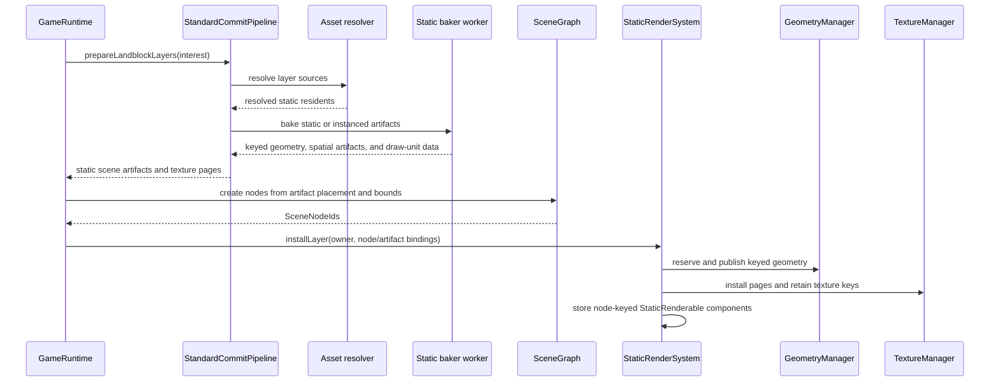
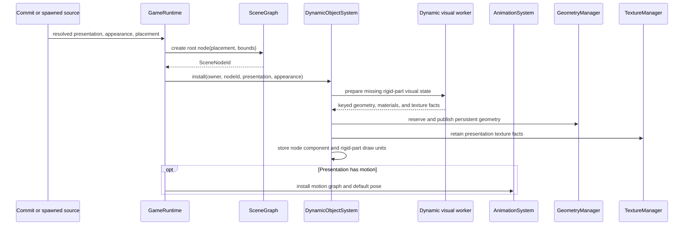
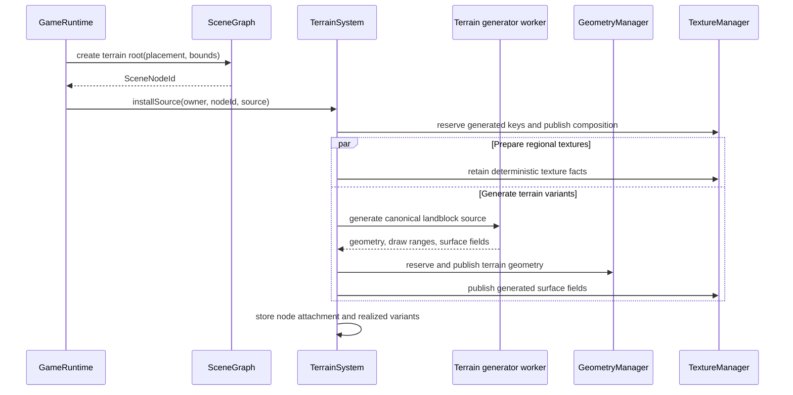
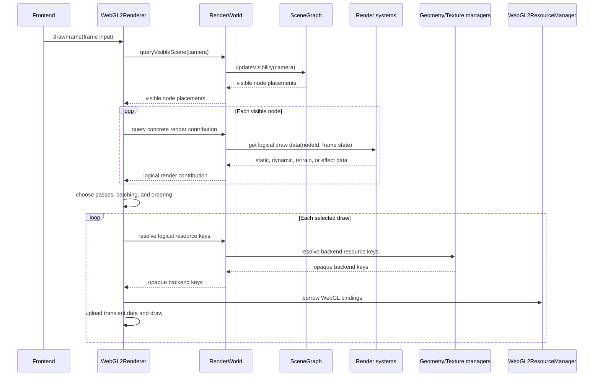
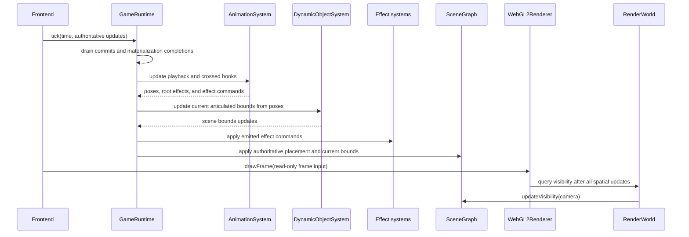
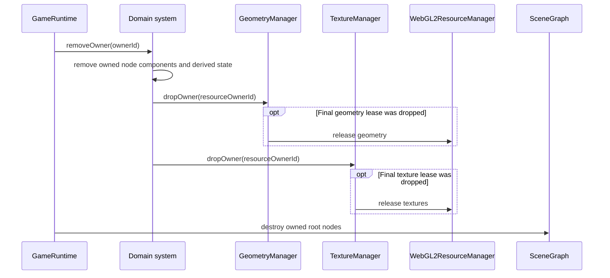

# Holtburger 3D Render Systems ECS Pivot Scoping

Status: Draft architecture scope. This describes the direction future stubs should telegraph; it
is not a commitment to an ECS framework or a complete renderer implementation.

## Goal And Boundaries

Pivot from presentation-oriented services toward an ECS-shaped runtime: typed systems own
orthogonal components keyed by `SceneNodeId`, materialize domain artifacts through shared resource
managers, and expose logical render inputs to the renderer.

In scope:

- Define the roles of `SceneGraph`, render systems, resource managers, and renderer.
- Scope static, dynamic, terrain, and later effect systems.
- Establish artifact installation, node attachment, drawing, and removal flows.
- Identify a small stub cutover that makes the direction visible in source.

Out of scope:

- An ECS library, archetypes, generic queries, or a scheduler.
- Replacing `SceneGraph` hierarchy, placement, residency, or spatial indexing.
- Complete static, dynamic, terrain, particle, lighting, or animation rendering.
- A generic `System` interface or a universal draw-unit type.

## Current Precedent

- `scene/scene-graph.ts` owns node hierarchy, landblock/env-cell residency, flattened placement,
  bounds, and spatial-query membership.
- `commit/types.ts` distinguishes baked static, instanced static, dynamic resident, and terrain
  artifacts.
- `terrain/terrain-service.ts` already behaves like a system: it installs domain sources, generates
  and publishes resources, retains realized variants, and selects `TerrainDrawUnit`s.
- `GeometryManager` and `TextureManager` own logical-key-to-backend-resource mappings and shared
  leases.
- `WebGL2ResourceManager` owns WebGL allocations. `WebGL2Renderer` owns frame collection, pass
  policy, binding, and drawing.

Investigation evidence used to steer the open questions:

- Legacy `apps/holtburger-3d-legacy/src/lib/static/contracts.ts` attached bounds and env-cell
  membership to baked draw resources. The new static commit shapes omit equivalent spatial
  publication data.
- `ACE/Source/ACE.DatLoader/FileTypes/Animation.cs` and
  `ACE/Source/ACE.DatLoader/Entity/AnimationFrame.cs` encode one frame per setup part, while
  `CreateParticleHook` and other hooks address a `PartIndex`.
- Current `ResolvedObjectPresentation` mirrors that model with rigid parts, parent indices, placement
  poses, and demand-loaded motion clips. `ObjectGeometryData` contains no bone indices or weights.
- `ACViewer/ACViewer/Physics/PartArray.cs` combines the object frame with each current part frame and
  updates one transform per rigid part through an instance buffer. Legacy's dynamic animation
  player likewise interpolated `partFrames[].localPlacements` rather than deforming vertices.
- Legacy dynamic visual preparation resolved assets and performed material/geometry baking in a
  worker, then published device state on the main thread. The new `AssetBridge` currently lacks the
  demand-loaded animation and dynamic-presentation routes needed for that boundary.
- Legacy WebGL2 rendering uploaded static instance transforms through a renderer-owned dynamic
  buffer each draw, while ACViewer retained an instance buffer. Both prove that instance data is a
  distinct vertex stream from source mesh geometry.

## Direction

### ECS-Shaped, Not Framework-Owned

Use typed sparse component stores keyed by `SceneNodeId`. A scene node can participate in several
systems at once, so do not put arbitrary payloads in `SceneGraph` or collapse presentation into one
exclusive `Renderable` union.

Existing identities remain authoritative:

- `SceneNodeId` identifies the scene citizen.
- `GeometryKey` and `TextureKey` identify persistent logical resources.
- `ResolvedPresentationId` identifies reusable resolved object presentation.
- Runtime owner IDs group installation and removal; they are not render-asset identities.

Do not add `StaticRenderAssetKey`. Static components can directly retain logical draw units, which
already reference the geometry and texture identities that need deduplication.

### System Responsibilities

Each render system owns:

- its node-keyed components;
- conversion from domain artifacts into persistent logical render state;
- domain-specific draw units or frame data;
- resource publication through `GeometryManager` and `TextureManager`;
- leases and owner-scoped removal for its derived assets.

Systems do not own WebGL objects. Dropping a system record drops logical-resource leases; resource
managers determine whether a shared resource is now unowned, and the backend manager performs the
physical destruction.

`GameRuntime` owns system construction and teardown and bridges authoritative lifecycle events such
as layer interest, eviction, spawn, and despawn. It should not unpack domain-specific geometry,
texture, or draw-unit internals.

## Initial Systems

### StaticRenderSystem

Consumes pipeline-produced baked and instanced artifacts after their scene nodes exist. It owns
static components, static geometry publication, static atlas installation, logical draw units, and
owner-to-node removal bookkeeping.

```ts
/** Persistent static presentation attached to one spatial scene node. */
interface StaticRenderable {
  readonly drawUnits: readonly StaticDrawUnit[];
}

type StaticDrawUnit = BakedStaticDrawUnit | InstancedStaticDrawUnit;

/** Spatial publication emitted before SceneGraph assigns the node identity. */
interface StaticSceneArtifact {
  readonly placement: ScenePlacement;
  readonly localBounds: AABB3 | null;
  readonly renderable: StaticRenderableArtifact;
}

/** Runtime-created node paired with the render artifact installed against it. */
interface StaticNodeArtifactBinding {
  readonly nodeId: SceneNodeId;
  readonly renderable: StaticRenderableArtifact;
}

class StaticRenderSystem {
  readonly #renderables = new Map<SceneNodeId, StaticRenderable>();

  installLayer(
    ownerId: OwnerId,
    bindings: readonly StaticNodeArtifactBinding[],
  ): void;

  removeOwner(ownerId: OwnerId): void;
  getRenderable(nodeId: SceneNodeId): StaticRenderable | null;
}
```

The static baker assigns deterministic `StaticGeometryKey`s and bounded render partitions to data
crossing the worker boundary. `StandardCommitPipeline` combines those products with resolved
placement facts into explicit `StaticSceneArtifact`s so runtime does not infer spatial grouping from
the layer kind. Outdoor batches use landblock-resident roots; env-cell artifacts use roots with that
cell's residency; generated scenery uses instanced draw units. The final batch granularity must
balance spatial culling against batching, but every emitted node has explicit bounds and draw data.

### DynamicObjectSystem

Consumes resolved presentation and entity-specific appearance for both static-authored and spawned
dynamics. It owns node components, reusable presentation resources, rigid-part draw units, and
appearance-specific material state.

`AnimationSystem` is separate from the outset because motion clips produce rigid-part poses, root
motion, and authored hooks consumed by rendering, particles, audio, scripts, and lighting. Initial
dynamic materialization may install a default pose before animation loading is implemented, but
`DynamicObjectSystem` must not become the long-term playback owner.

The initial dynamic draw shape is articulated rigid geometry, not weighted skinning:

```ts
/** Persistent material and geometry selection for one rigid setup part. */
interface RigidPartDrawUnit {
  readonly partIndex: number;
  readonly geometry: ObjectGeometryKey;
  readonly material: ObjectMaterialBinding;
}

/** Current object-local transforms sampled for every rigid setup part. */
interface ArticulatedPose {
  readonly partToObjectTransforms: readonly Mat4[];
}
```

Effects remain orthogonal components or commands, not fields added to every dynamic draw unit.
Setup parts remain internal rigid parts initially; the dynamic system resolves setup parent and
animation placement rules before publication, while whole scene citizens may still be parented
through `SceneGraph`. Part-targeted hooks require a system query that resolves
`(SceneNodeId, partIndex, offset)` to a current landblock-local attachment transform.

CPU-heavy dynamic geometry/material preparation belongs in a runtime-owned worker controlled by
`DynamicObjectSystem`. Scene-node attachment, component state, resource leases, and device
publication remain on the main thread.

### TerrainSystem

Rename or reshape `TerrainService` once system vocabulary is adopted. It keeps its current domain:
installed landblock sources, generation jobs, generated resource publication, realized variants,
node attachment, and anchor-dependent `TerrainDrawUnit` selection.

Terrain remains specialized, but follows the same renderer-facing rule as other systems: a visible
node resolves to logical draw data.

### Later Systems

`ParticleEffectSystem`, lighting, decals, and environment effects should appear only with proven
source and update contracts. A particle system owns emitters, simulation, and reusable assets; the
renderer owns transient GPU streams used to upload the current frame's particles. Dynamic bone
matrices are not part of the proven AC model; rigid-part transforms are the initial dynamic frame
payload.

Immutable static instance transforms should eventually be a persistent logical device resource
separate from source mesh geometry. Do not reupload them as a transient frame stream or fold them
into `ObjectGeometryData`. The exact `InstanceBufferKey` and manager API should wait for the real
instanced binding contract.

## Ownership

| Concern                                                   | Owner                    |
| --------------------------------------------------------- | ------------------------ |
| Hierarchy, placement, residency, spatial membership       | `SceneGraph`             |
| Resolver and static baker CPU products                    | `StandardCommitPipeline` |
| Node components, logical draw units, derived asset leases | Domain system            |
| Logical geometry to backend binding                       | `GeometryManager`        |
| Logical texture preparation and backend binding           | `TextureManager`         |
| WebGL buffers, textures, and vertex arrays                | `WebGL2ResourceManager`  |
| Programs, pass order, binding, drawing, transient streams | `WebGL2Renderer`         |
| Interest, spawn/despawn, systems, ordered teardown        | `GameRuntime`            |
| Runtime/device/pipeline composition and frame loop        | Frontend                 |

## Core Flows

Static installation:



Dynamic installation:



Terrain installation:



Drawing:



`RenderWorld` remains a black-box facade, not an ECS world API. Initial methods should remain
concrete, such as `getStaticRenderable(nodeId)`, `getDynamicRenderable(nodeId)`,
`getArticulatedPose(nodeId)`, and `getTerrainDrawUnit(nodeId, anchorLandblockId)`. Animation and
placement updates occur before visibility; renderer queries are read-only. Do not introduce generic
component queries until real callers prove they reduce complexity.

Frame update ordering is explicit rather than scheduler-driven:



The renderer never advances animation or repairs placement while constructing a frame. This keeps
the spatial index and every rendered placement on the same completed runtime tick.

Owner-scoped removal converges across systems:



Backend release calls only occur for keys whose final manager lease was dropped. Pending worker
completions must verify that their installation still exists before publishing resources.

## Suggested Stub Cutover

1. Add concrete static, dynamic, animation, and terrain component shapes keyed by `SceneNodeId`;
   rename `TerrainService` to `TerrainSystem`.
2. Replace layer-shaped static commits with bounded `StaticSceneArtifact`s, deterministic geometry
   keys, and explicit node/artifact installation. Move static texture and geometry publication out
   of `GameRuntime`.
3. Add `DynamicObjectSystem`, its runtime-owned preparation worker boundary, reusable object
   geometry identity, and the rigid-part draw shape. Route static-authored and spawned dynamics
   through the same path.
4. Add `AnimationSystem` shape, explicit runtime update order, current articulated bounds, and
   part-attachment transform queries. Keep animation evaluation out of rendering.
5. Make terrain lookup node-based and expose each implemented system through flat `RenderWorld`
   methods. Normalize missing-resource handling and delete superseded runtime presentation maps and
   bridging helpers.

Each step should leave type checking, formatting, linting, and focused tests passing. The cutover is
complete when every implemented render contribution follows:

```text
visible node -> typed component -> logical draw data -> backend resource resolution -> draw
```

## Guardrails

- Do not add a full ECS framework before measured query or scheduling needs justify it.
- Keep components outside `SceneGraph`.
- Add identities only for independently reusable data crossing a real boundary.
- Keep shared resource mechanics in managers and frame policy in the renderer.
- Runtime initiates removal; systems remove components and leases; managers release unowned
  resources; the backend destroys allocations.
- Keep persistent assets separate from transient frame streams.

## Resolved Questions

| Question                     | Direction                                                                                                                                                                                                                                                     |
| ---------------------------- | ------------------------------------------------------------------------------------------------------------------------------------------------------------------------------------------------------------------------------------------------------------- |
| Static node/artifact binding | `StandardCommitPipeline` combines resolved placements with bounded baker partitions into `StaticSceneArtifact`s; runtime creates nodes and passes assigned IDs plus render artifacts to `StaticRenderSystem`. Layer kind is not a spatial-publication API.    |
| Animation ownership          | `AnimationSystem` is separate from initial dynamic visual materialization. Default rigid poses may render before playback exists.                                                                                                                             |
| Dynamic worker boundary      | A `DynamicObjectSystem`-owned worker resolves CPU-heavy geometry/material products. Main thread owns components, leases, node attachment, and device publication.                                                                                             |
| Static instance data         | It is persistent logical device data distinct from source geometry and transient frame streams. Its final key/manager waits for the real binding contract.                                                                                                    |
| Dynamic draw shape           | AC objects initially use rigid-part draw units plus an articulated pose. There is no evidence for weighted skinning in the current model. Effects stay orthogonal.                                                                                            |
| Env-cell product ownership   | `SceneGraph` owns cell residency and portal traversal topology; `StaticRenderSystem` owns cell/interior presentation; a portal-render system owns device-backed aperture geometry and mask submissions. One env-cell commit may install all three atomically. |

## Identified Gaps

- **Static spatial publication:** `BakedStaticDrawUnitsData` and `StaticDrawUnitData` lack placement
  and bounds. The runtime therefore cannot create spatial nodes at a useful culling granularity.
- **Static artifact partitioning:** the baker must deliberately group draw units under bounded scene
  artifacts. One artificial layer root is too coarse; one node per triangle/material partition would
  be equally cooked.
- **Dynamic visibility:** runtime currently creates dynamic roots with null bounds and discards the
  resolved bounds. Dynamic bounds must be installed and refreshed after articulated pose changes.
- **Dynamic geometry identity:** `GeometryKey` only admits terrain and static geometry. Reusable
  resolved object parts and portal apertures need honest logical geometry identities.
- **Dynamic asset loading:** `AssetBridge` only exposes landblock-layer resolution and texture
  preparation. Demand-loaded animation clips and dynamic visual preparation need typed host routes.
- **Object texture materialization:** static commits can deliver atlas pages, but runtime dynamics
  have no defined page-packing or standalone-texture policy. This must be decided before dynamic
  materialization can publish complete draw units.
- **Object material contract:** current static draw metadata does not yet express the pass, blend,
  depth-write, culling/sidedness, transparency sorting, palette layout, and effect state required by
  the known object renderer path.
- **Resource readiness:** asynchronous texture preparation can fail after a component is installed,
  while renderer resolution currently throws for missing resources. Systems need one consistent
  contract: publish only ready contributions, log and discard terminal failures, and do not retry.
- **Stale completions:** every asynchronous system installation needs identity-based cancellation so
  evicted nodes cannot receive late worker results. A source revision counter is not required.
- **Node destruction:** external component stores need one explicit cleanup notification for every
  node ID returned by root destruction, including descendants, or stale ECS components will remain.
- **Setup-part attachment:** rigid setup parts stay internal initially, but particle, script, light,
  and material hooks can target part indices. Systems need a current attachment-transform query.
- **Update ordering:** animation, hooks, current bounds, authoritative placement, and effect commands
  must settle before visibility. `RenderWorld` queries must remain read-only.
- **Env-cell publication split:** the env-cell commit must expose separate topology, static
  presentation, and aperture-render products so runtime can install them atomically into
  `SceneGraph`, `StaticRenderSystem`, and the portal-render path.
- **Transient resource boundary:** renderer resource APIs currently cover immutable geometry and
  textures but not persistent instance streams or transient particle/rigid-part transform streams.

## Remaining Questions

- What bounded batching granularity gives outdoor statics useful culling without undoing static
  bake wins? This should be decided with representative baked scenes, not a universal node rule.
- Should dynamic object textures use runtime-packed atlas pages, standalone textures, or a
  threshold policy? The answer determines whether `DynamicObjectSystem` needs its own packer worker
  or a shared texture-packing system.
- Should a setup part ever be promoted to a child `SceneNode`, or should part-index attachment
  queries remain the only bridge until a part needs independent spatial participation?
- What backend abstraction should represent persistent immutable instance streams without coupling
  `GeometryManager` to one vertex-array layout?
