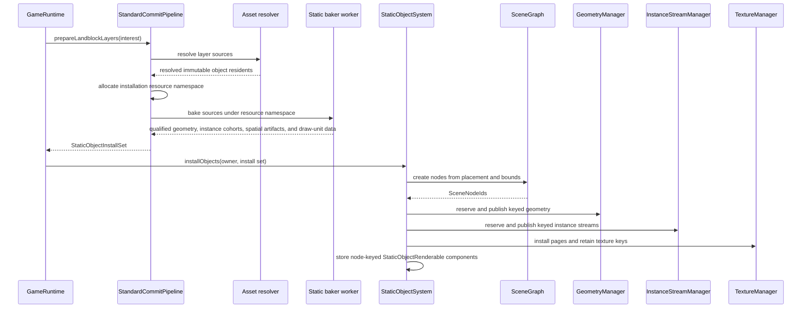
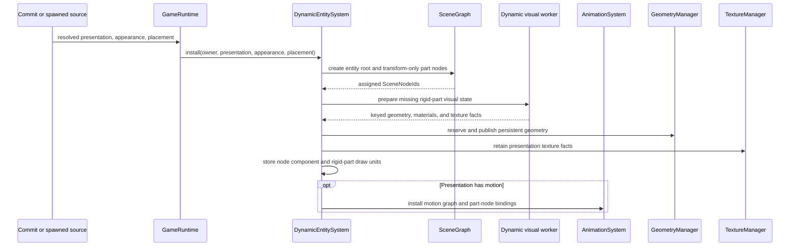
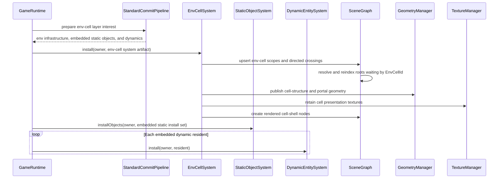
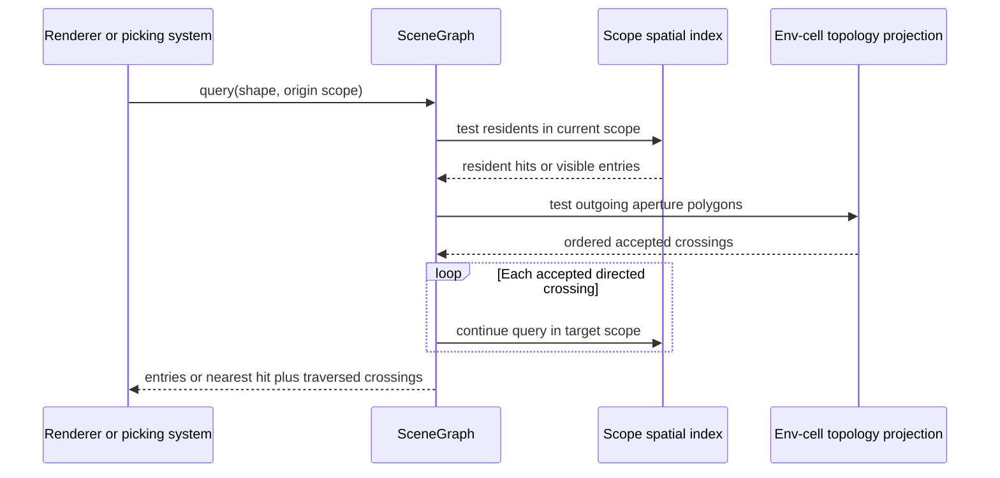
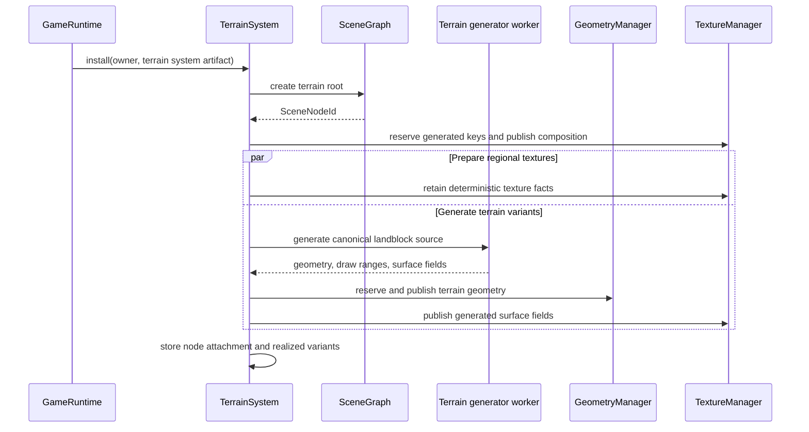
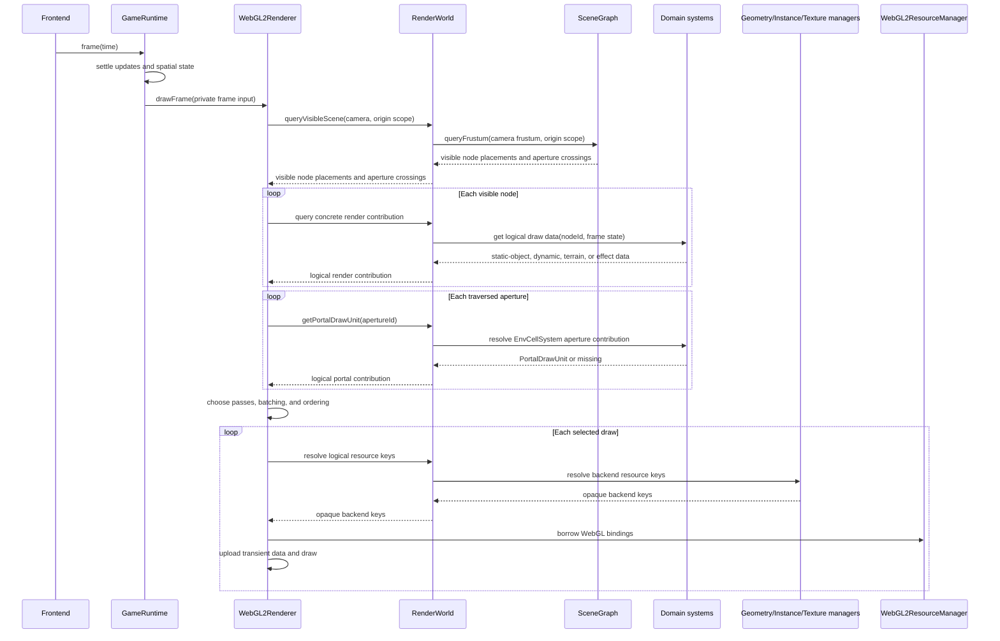
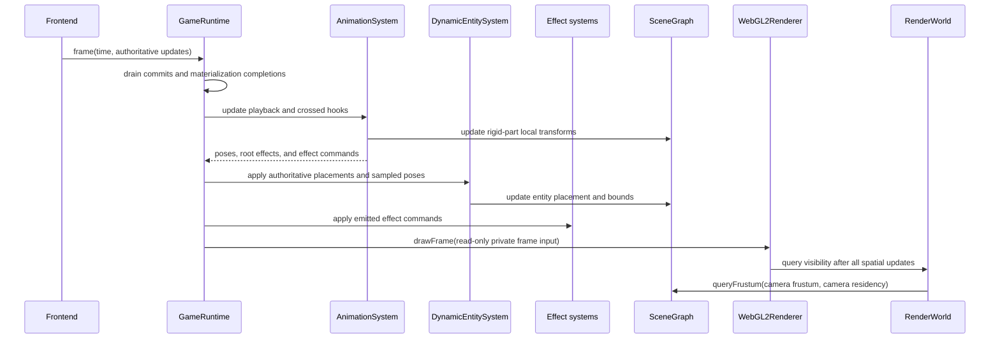
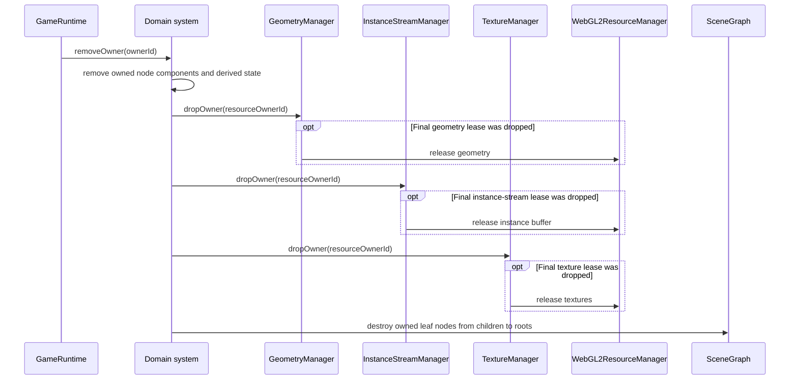

# Holtburger 3D Scene Systems ECS Pivot Scoping

Status: Draft architecture scope. This describes the direction future stubs should telegraph; it
is not a commitment to an ECS framework or a complete renderer implementation.

## Goal And Boundaries

Pivot from presentation-oriented services toward an ECS-shaped runtime: typed resident-producing
domain systems own scene-node lifetimes, systems retain orthogonal components keyed by
`SceneNodeId`, shared managers materialize logical resources, and systems expose logical render
inputs to the renderer.

In scope:

- Define the roles of `SceneGraph`, domain systems, resource managers, runtime, and renderer.
- Scope static-object, dynamic, env-cell, terrain, and later effect systems.
- Establish artifact installation, node attachment, drawing, and removal flows.
- Identify a small stub cutover that makes the direction visible in source.

Out of scope:

- An ECS library, archetypes, generic queries, or a scheduler.
- Replacing `SceneGraph` hierarchy, placement, residency, or spatial indexing.
- Complete static-object, dynamic, terrain, particle, lighting, or animation rendering.
- A generic `System` interface or a universal draw-unit type.

## Current Precedent

- `scene/scene-graph.ts` owns node hierarchy, landblock/env-cell residency, flattened placement,
  bounds, and spatial-query membership.
- `commit/types.ts` distinguishes baked static, instanced static, dynamic resident, and terrain
  artifacts.
- `terrain/terrain-service.ts` already behaves like a system: it installs domain sources, generates
  and publishes resources, retains realized variants, and selects `TerrainDrawUnit`s.
- `GeometryManager` and `TextureManager` own logical-key-to-backend-resource mappings and shared
  leases.
- `WebGL2ResourceManager` owns WebGL allocations. `WebGL2Renderer` owns frame collection, pass
  policy, binding, and drawing.

Investigation evidence used to steer the open questions:

- Legacy `apps/holtburger-3d-legacy/src/lib/static/contracts.ts` attached bounds and env-cell
  membership to baked draw resources. The new static commit shapes omit equivalent spatial
  publication data.
- `ACE/Source/ACE.DatLoader/FileTypes/Animation.cs` and
  `ACE/Source/ACE.DatLoader/Entity/AnimationFrame.cs` encode one frame per setup part, while
  `CreateParticleHook` and other hooks address a `PartIndex`.
- Current `ResolvedObjectPresentation` mirrors that model with rigid parts, parent indices, placement
  poses, and demand-loaded motion clips. `ObjectGeometryData` contains no bone indices or weights.
- `ACViewer/ACViewer/Physics/PartArray.cs` combines the object frame with each current part frame and
  updates one transform per rigid part through an instance buffer. Legacy's dynamic animation
  player likewise interpolated `partFrames[].localPlacements` rather than deforming vertices.
- Legacy dynamic visual preparation resolved assets and performed material/geometry baking in a
  worker, then published device state on the main thread. The new `AssetBridge` currently lacks the
  demand-loaded animation and dynamic-presentation routes needed for that boundary.
- Legacy WebGL2 rendering uploaded static instance transforms through a renderer-owned dynamic
  buffer each draw, while ACViewer retained an instance buffer. Both prove that instance data is a
  distinct vertex stream from source mesh geometry.
- ACE env cells contain directed portal edges, visible-cell/PVS records, cell placement, structure
  presentation, and resident statics. Portal topology connects visibility domains; it is not a
  scene-parent hierarchy, and known visible-cell relationships are not necessarily symmetric.
- Legacy scene picking accepts an explicit outdoor or env-cell context and queries only that scope
  or an accepted env-cell set. Its renderer separately plans aperture projections and transition
  masks. The new runtime can unify those concepts through scope-aware scene queries without
  inheriting legacy's projection caches, overlap diagnostics, or retail-style portal complexity.
- ACE DAT surfaces preserve raw surface flags, a solid-color or texture/palette source,
  translucency, luminosity, and diffuse scale. Polygon records separately preserve sidedness,
  positive/negative surface assignment, and stippling. Legacy's pass names, blend derivation, clip
  thresholds, and unsupported/deferred classifications are renderer policy, not canonical AC
  material semantics.
- The current Explorer directly calls `WebGL2Renderer.drawFrame` with a runtime-created frame input.
  That bypasses the common runtime API required by both Explorer and Client frontends.
- Current DAT-backed two-dimensional textures have distinct atlas-entry and standalone identities.
  That prevents one logical texture from transparently preferring a packed binding over a
  degenerate one-entry page.

## Direction

### ECS-Shaped, Not Framework-Owned

Use typed sparse resident-component stores keyed by `SceneNodeId`. A scene node has one domain
system responsible for its lifetime but may participate in several systems; for example,
`DynamicEntitySystem` owns rigid-part nodes while `AnimationSystem` updates their SceneGraph local
transforms. Do not put arbitrary payloads in `SceneGraph` or collapse presentation into one exclusive
`Renderable` union. Non-resident topology contributions remain keyed by their own domain identities,
such as `PortalApertureId`.

Existing identities remain authoritative:

- `SceneNodeId` identifies the scene citizen.
- `GeometryKey`, `StaticInstanceStreamKey`, and `TextureKey` identify persistent logical resources.
- `ResolvedPresentationId` identifies reusable resolved object presentation.
- Runtime owner IDs group installation and removal; they are not render-asset identities.
- A `StaticInstallResourceNamespace` prevents collisions among install-scoped resources; it does not
  claim semantic equality or cross-install deduplication.

Do not add `StaticRenderAssetKey`. Static-object components can directly retain logical draw units,
which already reference the geometry and texture identities that need deduplication.

### System Responsibilities

Each resident-producing domain system owns:

- the scene nodes representing its installed residents;
- its node-keyed components;
- conversion from domain artifacts into persistent logical render state;
- domain-specific draw units or frame data;
- resource publication through the appropriate geometry, static-instance, and texture managers;
- leases and owner-scoped removal for its derived assets.

Systems do not own WebGL objects. Dropping a system record drops logical-resource leases; resource
managers determine whether a shared resource is now unowned, and the backend manager performs the
physical destruction.

`GameRuntime` owns system construction, renderer construction, frame sequencing, and teardown. It
routes authoritative lifecycle events such as layer interest, eviction, spawn, and despawn to the
appropriate system. It should not create domain nodes or unpack domain-specific geometry, texture,
or draw-unit internals.

### Coordinate And Bounds Contract

Every scene transform tree resolves directly into one landblock coordinate frame. A root
`ScenePlacement.localTransform` maps from that root's local space to landblock-local space. A child
`SceneNode.localTransform` maps from child-local space to its parent. Flattening the parent chain
therefore always produces `ResolvedScenePlacement.localToLandblock`; there is no intermediate
env-cell transform frame.

Env-cell residency is a visibility and spatial-query scope orthogonal to transform parenting. An
env-cell ID selects the scope index containing a root and its descendants, but contributes no
matrix. Roots in the same env cell may have unrelated landblock-local placements, and neither must
be parented to a node representing the cell.

Coordinate-bearing data follows these rules:

| Data                                                     | Coordinate space                                      |
| -------------------------------------------------------- | ----------------------------------------------------- |
| Reusable object or cell-structure geometry and bounds    | That source geometry's local space                    |
| Root `localTransform`                                    | Root local to containing landblock                    |
| Child `localTransform`                                   | Child local to parent                                 |
| Scene-node `localBounds`                                 | The bounded node's own local space                    |
| Derived spatial-index `landblockBounds`                  | Containing landblock                                  |
| Env-cell coarse `landblockBounds`                        | Containing landblock                                  |
| Portal aperture vertices and `landblockBounds`           | Containing landblock                                  |
| Terrain geometry, variant bounds, and identity placement | Containing landblock                                  |

Spatial queries transform world- or anchor-relative query geometry into each relevant landblock
frame before testing indexes. Portal traversal changes the active `SceneScope`, not the query's
coordinate frame. Renderer submissions likewise retain landblock-local transforms and apply the
anchor-landblock offset in the shader.

Plain `bounds` fields are not sufficient at boundaries where more than one coordinate space is
possible. Use `localBounds`, `structureLocalBounds`, or `landblockBounds` according to the table
above. A pretransformed landblock bound must never be supplied as `SceneNode.localBounds` together
with a nonidentity root transform, because SceneGraph would transform it a second time.

## Initial Systems

### StaticObjectSystem

Consumes pipeline-produced baked and instanced artifacts for immutable object residents, regardless
of whether they reside outdoors or in an env cell. It owns their scene nodes, object components,
picking and interaction metadata, geometry publication, texture installation, logical draw units,
and owner-scoped removal bookkeeping. Cell structures, portal apertures, and terrain are not static
objects merely because their geometry is immutable.

```ts
/** Persistent immutable-object presentation attached to one spatial scene node. */
interface StaticObjectRenderable {
  readonly drawUnits: readonly StaticObjectDrawUnit[];
}

type StaticObjectDrawUnit = BakedStaticDrawUnit | InstancedStaticDrawUnit;

/** One immutable object publication emitted before SceneGraph assigns its node identity. */
interface StaticObjectArtifact {
  readonly placement: ScenePlacement;
  /** Bounds in the object root's local coordinate space. */
  readonly localBounds: AABB3;
  readonly renderable: StaticObjectRenderableArtifact;
}

/** Complete static-object publication installed under one runtime owner. */
interface StaticObjectInstallSet {
  /** Collision-free namespace allocated for this installation before worker dispatch. */
  readonly resourceNamespace: StaticInstallResourceNamespace;
  /** Bounded residents whose scene nodes are assigned during installation. */
  readonly objects: readonly StaticObjectArtifact[];
  /** Keyed reusable or installation-specific geometry referenced by resident draw units. */
  readonly geometry: readonly GeometrySource[];
  /** Keyed immutable instance cohorts referenced by instanced draw units. */
  readonly instanceStreams: readonly StaticInstanceStreamSource[];
  /** Prepared pages and logical texture placements referenced by material bindings. */
  readonly texturePages: readonly TexturePageCommit[];
}

class StaticObjectSystem {
  readonly #renderables = new Map<SceneNodeId, StaticObjectRenderable>();

  installObjects(ownerId: OwnerId, installSet: StaticObjectInstallSet): void;

  removeOwner(ownerId: OwnerId): void;
  getRenderable(nodeId: SceneNodeId): StaticObjectRenderable | null;
}
```

Before worker dispatch, `StandardCommitPipeline` allocates a collision-free resource namespace for
the pending installation and includes it in the bake request. The static baker assigns internally
consistent local geometry, instance-cohort, and render-partition IDs beneath that namespace. These
install-scoped IDs need not reproduce across another bake. Geometry proven reusable from its DAT
source instead receives a globally semantic source-geometry key so `GeometryManager` can share it
across installations.

`StandardCommitPipeline` combines those products with resolved placement facts into explicit
`StaticObjectArtifact`s. `StaticObjectSystem` creates the corresponding nodes and publishes the
install set's geometry, instance streams, textures, and draw units, so runtime does not infer
spatial or resource grouping from the source layer kind. Outdoor object batching stops at the
resident landblock; no smaller outdoor partition is required initially. Embedded static objects
use roots with their env-cell residency, and generated scenery uses instanced draw units. Every
emitted node still has explicit bounds and draw data.

### DynamicEntitySystem

Consumes resolved presentation and entity-specific appearance for both static-authored and spawned
dynamics. It owns node components, reusable presentation resources, rigid-part draw units, and
appearance-specific material state.

`AnimationSystem` is separate from the outset because motion clips produce rigid-part poses, root
motion, and authored hooks consumed by rendering, particles, audio, scripts, and lighting. Initial
dynamic materialization may install a default pose before animation loading is implemented, but
`DynamicEntitySystem` must not become the long-term playback owner.

The initial dynamic draw shape is articulated rigid geometry, not weighted skinning:

```ts
/** Persistent material and geometry selection for one rigid setup part. */
interface RigidPartDrawUnit {
  readonly partIndex: number;
  readonly geometry: ObjectGeometryKey;
  readonly material: ObjectMaterialBinding;
}

/** Current object-local transforms sampled for every rigid setup part. */
interface ArticulatedPose {
  readonly partToObjectTransforms: readonly Mat4[];
}
```

Effects remain orthogonal components or commands, not fields added to every dynamic draw unit.
Each setup part receives a transform-only child `SceneNode` with `localBounds: null`.
`AnimationSystem` updates those child transforms, while `DynamicEntitySystem` retains the mapping
from authored `partIndex` to assigned node ID. Particles, lights, equipment, and spawned entities can
parent directly to a part node and inherit its animated transform and root residency. Hook offsets
are explicit `attachmentLocalTransform` values applied beneath the selected part; no parallel
part-attachment transform API is needed.

CPU-heavy dynamic geometry/material preparation belongs in a runtime-owned worker controlled by
`DynamicEntitySystem`. Scene-node attachment, component state, resource leases, and device
publication remain on the main thread.

### EnvCellSystem

Owns canonical env-cell definitions, directed portal/PVS topology, cell-structure presentation,
portal draw units, scene nodes for rendered cell shells, and the resources derived from those
artifacts. Portal apertures belong to topology crossings rather than being scene residents, so they
do not receive artificial scene nodes. `StaticObjectSystem` and `DynamicEntitySystem` own objects
residing in an env cell. Portal topology is independent from `SceneGraph` parent relationships;
`SceneGraph` stores the query-oriented projection used for visibility, picking, and other spatial
selection.

An env-cell scope is not a virtual scene root and does not establish an env-cell-local coordinate
space. The source env-cell placement only binds reusable cell-structure geometry into its landblock;
it is a `structureToLandblock` transform, not a base transform inherited by residents. A rendered
cell shell is an ordinary root node with env-cell residency. Embedded static and dynamic objects are
independent roots with their own object-to-landblock placements and the same residency. They are not
children of the shell. Topology may consequently exist without a shell node, and a shell node has
no authority over the scope or other residents.

Root residency defines its scene-query scope; it does not require another independent node field:

```ts
type SceneScope =
  | {
      /** Landblock coordinate space containing this outdoor root. */
      readonly landblockId: LandblockId;
      readonly kind: "outdoor";
    }
  | {
      /** Environment cell whose visibility domain contains this root. */
      readonly envCellId: EnvCellId;
      /** Landblock coordinate space containing the environment cell. */
      readonly landblockId: LandblockId;
      readonly kind: "env-cell";
    };

interface SceneEnvCellScopeInput {
  readonly scope: Extract<SceneScope, { kind: "env-cell" }>;
  /** Conservative cell extent already expressed in the containing landblock frame. */
  readonly landblockBounds: AABB3 | null;
  /** Source-provided coarse visibility set used to prune portal traversal. */
  readonly potentiallyVisibleEnvCellIds: ReadonlySet<EnvCellId>;
}

/** Stable identity for one directed crossing in the scene-query projection. */
type PortalCrossingId = `portal-crossing:${string}`;

interface ScenePortalCrossingInput {
  readonly id: PortalCrossingId;
  readonly source: SceneScope;
  readonly target: SceneScope;
  /** Query geometry already expressed in the containing landblock coordinate frame. */
  readonly aperture: {
    readonly id: PortalApertureId;
    /** Conservative aperture bounds in the containing landblock frame. */
    readonly landblockBounds: AABB3;
    readonly vertices: Float32Array;
    readonly indices: Uint32Array;
    readonly visibleSide: "positive" | "negative" | "both";
  };
}

class SceneGraph {
  upsertEnvCellScope(input: SceneEnvCellScopeInput): void;
  removeEnvCellScope(scope: Extract<SceneScope, { kind: "env-cell" }>): void;

  upsertPortalCrossing(input: ScenePortalCrossingInput): void;
  removePortalCrossing(crossingId: PortalCrossingId): void;
}
```

There is no second generic portal graph inside `EnvCellSystem`. It compiles resolved host topology
into these concrete scopes and crossings, retains the published IDs for removal, and separately maps
cell-shell node IDs and aperture IDs to renderer-facing draw units. `SceneGraph` receives no owner
IDs or source provenance. Scope removal fails while a crossing still references that scope;
`EnvCellSystem` therefore removes crossings, cell-shell nodes, and then scopes.

The system installation boundary is one composite domain artifact rather than an untyped collection
of "cell records":

```ts
/** Bounded cell-shell presentation published as a scene resident. */
interface EnvCellShellArtifact {
  /** Env-cell-resident root placement whose localTransform maps structure to landblock. */
  readonly placement: ScenePlacement;
  /** Bounds in the reusable cell structure's local geometry frame. */
  readonly structureLocalBounds: AABB3;
  readonly renderable: EnvCellRenderableArtifact;
}

/** Complete env-cell contribution produced for one committed owner. */
interface EnvCellSystemArtifact {
  readonly cellShells: readonly EnvCellShellArtifact[];
  readonly portalDrawUnits: ReadonlyMap<PortalApertureId, PortalDrawUnit>;
  readonly scopes: readonly SceneEnvCellScopeInput[];
  readonly crossings: readonly ScenePortalCrossingInput[];
}

class EnvCellSystem {
  install(ownerId: OwnerId, artifact: EnvCellSystemArtifact): void;
  removeOwner(ownerId: OwnerId): void;

  getCellRenderable(nodeId: SceneNodeId): EnvCellRenderable | null;
  getPortalDrawUnit(apertureId: PortalApertureId): PortalDrawUnit | null;
}
```

`install` publishes scopes before crossings, materializes cell and portal resources, and creates the
cell-shell nodes. It records exactly the resulting node, scope, crossing, geometry, and texture keys
needed for `removeOwner`. Embedded objects are absent from this artifact because the commit pipeline
routes them to `StaticObjectSystem` or `DynamicEntitySystem`. While creating a shell node, the
system passes `structureLocalBounds` as `SceneNode.localBounds` and the placement's
`localTransform` (the structure-to-landblock matrix) as the root transform.

Children inherit their root's scope. SceneGraph partitions spatial membership by that derived scope
and requires an origin scope for ray, frustum, and visibility queries. Outdoor landblocks remain one
flat visibility domain: their nodes retain landblock-local coordinate spaces and per-landblock
indexes, but queries cross relevant outdoor landblocks without portal edges. Directed aperture
edges connect env cells to each other and building-transition apertures connect outdoor and env-cell
scopes.

The existing Rust content pipeline already provides the required source data. Its
`PreparedPortalConnectivityGraph` contains directed env-cell and outdoor crossings, while
`PreparedPortalApertureResource` contains triangulated landblock-local aperture ranges for both
env-cell portals and outdoor building transitions. The new host adapter should flatten those ranges
into individually keyed apertures and link them to directed crossings; it should not rebuild portal
topology in TypeScript.

The new Tauri host currently registers only `host_status`; `TauriAssetBridge` invokes an unregistered
`resolve_landblock_layer` command. These portal DTOs therefore describe the intended boundary but
are not produced yet. The missing host command should adapt the existing content products rather
than introduce another portal resolver.

Runtime query topology has only outdoor and env-cell residences because those are the two spatial
scopes. The legacy prepared graph's `LandblockBuilding` node is an intermediate source/provenance
concept, not a third query scope. The host adapter should project its explicit `scene_crossing`
records into outdoor/env-cell edges. Accordingly, the current TypeScript
`HostPortalGraphResidenceDto` `building` variant should be removed during the env-cell cutover;
building identity can remain in a separate metadata projection if it becomes useful.

A scoped query first tests resident nodes and outgoing aperture polygons in its origin scope. A ray
continues into a target scope only when its aperture crossing precedes the nearest resident hit. A
frustum traverses visible intersecting apertures and may remain conservative after a crossing. Both
guard against directed cycles. The renderer consumes traversed aperture chains to perform the
simpler mask-based composition established by legacy rather than reproducing retail's exact portal
renderer.

A root may reference an env cell whose topology has not materialized yet. This is unresolved
residency, not a malformed node:

- the root and its transform descendants remain structurally valid;
- bounded descendants are omitted from spatial queries while residency is unresolved;
- unresolved roots are indexed by `EnvCellId` rather than found through global sweeps;
- publishing or removing cell topology reindexes only roots waiting on or occupying that cell.

Outdoor roots with no env-cell assignment remain valid from their landblock residency alone.
Cell topology may exist without resident scene nodes or render resources, and scene residents may
arrive before topology. `EnvCellSystem` owns that lifecycle ordering; `SceneGraph` owns the resulting
query membership.

The current stubs do not yet satisfy this contract. `ResolvedEnvCellPresentation` retains a cell
placement, `EnvCellInfo` drops it, and `GameRuntime.createEnvCellPlacement` creates an identity root
using an ambiguously named `bounds` value. The Rust content product already distinguishes the cell's
landblock-wide coarse bounds from source-local cell-structure geometry. The env-cell cutover must
rename those host and resolved fields, feed coarse `landblockBounds` into the scope, build shell
nodes from structure-local bounds plus `structureToLandblock`, and delete the placeholder identity
env-cell roots. Object-resident bounds require the same audit: source-local bounds may become node
`localBounds`; already transformed instance bounds must remain explicitly landblock-local and cannot
be installed as node-local bounds.

### TerrainSystem

Rename or reshape `TerrainService` once system vocabulary is adopted. It keeps its current domain:
installed landblock sources, generation jobs, generated resource publication, realized variants,
node attachment, and anchor-dependent `TerrainDrawUnit` selection.

Its node-keyed component is only the spatial attachment to an installed landblock:

```ts
/** Stable scene attachment for one TerrainSystem installation. */
interface TerrainNodeAttachment {
  readonly landblockId: LandblockId;
}

/** Complete source and spatial publication for one interested terrain layer. */
interface TerrainSystemArtifact {
  readonly placement: ScenePlacement;
  /** Landblock-local bounds paired with the terrain root's identity transform. */
  readonly localBounds: AABB3;
  readonly source: TerrainSourceInstallation;
}

class TerrainSystem {
  install(ownerId: OwnerId, artifact: TerrainSystemArtifact): void;
  removeOwner(ownerId: OwnerId): void;

  getDrawUnit(
    nodeId: SceneNodeId,
    anchorLandblockId: LandblockId,
  ): TerrainDrawUnit | null;
}
```

Generation state, realized variants, resource leases, failure state, and draw-unit selection remain
private `TerrainSystem` behavior rather than fields flattened into that component. Terrain remains
specialized, but follows the same renderer-facing rule as other systems: a visible node resolves to
logical draw data.

### DAT-Backed Two-Dimensional Textures

Packed and freshly materialized DAT textures share one logical `AssetTextureKey` derived from their
purpose and source `DatAssetId`. Packing is a replaceable physical binding, not part of logical
identity. Every binding is page-shaped: a regular packed texture references a page subregion, while
a fresh dynamic texture is prepared as a degenerate one-entry page occupying the complete region.

`TextureManager` always prefers a packed binding:

- a dynamic request reuses an existing packed binding before requesting preparation;
- a one-entry preparation completion is discarded before device allocation if a packed binding
  arrived while the worker was running;
- a packed page installed after a one-entry page atomically replaces the logical binding and
  releases the degenerate page when it becomes unreferenced;
- repacking changes the binding for the same logical key rather than creating another texture
  identity.

`TexturePurpose` determines pixel format, mip policy, and one canonical use-neutral physical
preparation capable of every sampler policy admitted for that purpose. Sampler filtering and wrap
remain draw-time policy: polygon-side stippling can change wrapping for the same source texture, so
neither belongs in `AssetTextureKey`. Purpose and source asset ID therefore completely identify a
DAT-backed two-dimensional texture. `TextureManager` must reject a packed binding whose preparation
does not satisfy that purpose rather than retaining multiple logical keys for different gutters.
Texture arrays and generated textures remain distinct logical key variants because their
shader-facing structure is not a two-dimensional atlas placement.

### Object Material Facts

Resolved and baked contracts preserve source semantics without promoting one renderer's pass model
into the domain. The minimum lossless material source includes raw or typed DAT surface flags, its
solid-color or texture/palette source, translucency, luminosity, and diffuse scale. Appearance
substitutions and animated part/object overrides remain separate per-resident state applied to that
reusable source.

Polygon sidedness, positive/negative surface assignment, stippling, and related geometry facts do
not belong in the material record. Geometry preparation must preserve or deliberately resolve those
facts before producing draw units.

The renderer may compile resolved material and polygon facts into internal shader families, passes,
blend/depth state, sorting policy, clip thresholds, texture roles, and uniforms. Those derived
choices remain private code-driven renderer policy until evidence proves a stable cross-system
semantic. In particular, legacy's `opaque`, `alpha-test`, `transparent`, and `additive` buckets are
useful implementation precedent, not canonical architecture.

Retail's fixed-function path establishes the initial compiler behavior:

- `Base1Image` and `Base1ClipMap` select a texture/palette source; otherwise the surface supplies a
  solid color.
- `Alpha`, `InvAlpha`, and `Additive` select blend functions. `Translucent` selects source-alpha
  blending and derives alpha from `1 - translucency`; loading also adds the `Translucent` bit when
  the scalar is nontrivial.
- `Base1ClipMap` enables alpha testing with `GREATER_EQUAL`. Retail uses an alpha reference of
  `100` for paletted textures and `200` for non-paletted/DDS textures, both on the 0-255 scale.
  During paletted clipmap expansion, retail first makes indices below `8` fully transparent. A
  renderer retaining index data must preserve that index-domain rule before palette filtering;
  `8`, `100 / 255`, and `200 / 255` are therefore evidence-backed policy constants at different
  stages.
- The luminosity and diffuse scalars feed lighting/material state directly in the observed path;
  their similarly named flag bits are not consulted there. Preserve both raw flags and scalars, but
  do not gate a scalar on its flag without further evidence.
- Detail texturing uses separately selected landscape, building, environment, and object detail
  surfaces. Retail binds the selected detail texture as another wrapped texture stage and either
  composites it in one pass or redraws the geometry. An ordinary object's `Detail` flag is not a
  sufficient detail-texturing contract.
- The Gouraud bit is forced into retail's current surface type by the D3D path. Stippling is selected
  per polygon side and also changes base-texture addressing from clamp to wrap. Neither should be
  modeled as a material choice derived only from the corresponding source-surface bit.
- No rendering branch for the source `Perspective` bit was found in the fixed-function D3D path;
  perspective-correct interpolation is supplied by the device pipeline. Keep the raw bit losslessly,
  but do not expose a speculative renderer mode for it.

These findings reinforce the split above: surface records carry reusable source facts, geometry
carries side-specific stippling and surface assignment, and the renderer privately compiles both
into concrete state. The current new `HostMaterialDto` is not yet lossless because it omits surface
flags and the three material scalars; the host-contract cutover must add them before real object or
cell materialization.

### Later Systems

`ParticleEffectSystem`, lighting, decals, and environment effects should appear only with proven
source and update contracts. A particle system owns emitters, simulation, and reusable assets; the
renderer owns transient GPU streams used to upload the current frame's particles. Dynamic bone
matrices are not part of the proven AC model; rigid-part transforms are the initial dynamic frame
payload.

### Persistent Static Instance Streams

Immutable static instances are a persistent logical device resource separate from reusable source
mesh geometry. The initial semantic layout is deliberately narrow:

```ts
/** Opaque namespace shared by every resource and draw-unit reference in one install set. */
type StaticInstallResourceNamespace = `static-install:${string}`;

/** Globally semantic geometry identity derived from reusable source and partition facts. */
type ReusableStaticGeometryKey =
  `static-source-geometry:${ResolvedGeometryId}/${string}`;

/** Geometry identity meaningful only within one qualified static installation. */
type InstallStaticGeometryKey =
  `static-install-geometry:${StaticInstallResourceNamespace}/${string}`;

/** Logical identity for either reusable or installation-specific static geometry. */
type StaticGeometryKey = ReusableStaticGeometryKey | InstallStaticGeometryKey;

/** Immutable cohort identity qualified by the installation that produced it. */
type StaticInstanceStreamKey =
  `static-instance-stream:${StaticInstallResourceNamespace}/${string}`;

/** Opaque backend identity for one uploaded immutable instance buffer. */
type InstanceStreamResourceKey = `instance-stream-resource:${number}`;

/** Per-instance values consumed by the initial static-object instancing program. */
interface StaticInstanceData {
  /** Source-geometry transform flattened into the owning landblock's coordinate space. */
  readonly sourceToLandblock: Mat4;
  /** Per-instance color modulation after source appearance overrides are resolved. */
  readonly color: ColorF;
}

/** Complete immutable payload for one static instance cohort. */
interface StaticInstanceStreamData {
  /** Instances drawn together by every draw unit that references this stream. */
  readonly instances: readonly StaticInstanceData[];
}

/** Keyed stream publication crossing the static-baker worker boundary. */
interface StaticInstanceStreamSource {
  /** Install-scoped identity shared by the source and every referencing draw unit. */
  readonly key: StaticInstanceStreamKey;
  /** Complete semantic data required to create the immutable device stream. */
  readonly data: StaticInstanceStreamData;
}

/** Instanced draw range over reusable source geometry and one immutable instance cohort. */
interface InstancedStaticDrawUnit {
  /** Reusable source-local object geometry. */
  readonly geometry: StaticGeometryKey;
  /** Persistent instance transforms and colors applied to that geometry. */
  readonly instances: StaticInstanceStreamKey;
  /** First geometry index selected by this material draw unit. */
  readonly indexStart: number;
  /** Number of geometry indices selected by this material draw unit. */
  readonly indexCount: number;
  /** Lossless material facts compiled into renderer-owned draw policy. */
  readonly material: ObjectMaterialBinding;
}

class InstanceStreamManager<TOwnerId extends string> {
  /** Retain logical keys before their worker-produced payloads are published. */
  reserveKeys(ownerId: TOwnerId, keys: readonly StaticInstanceStreamKey[]): void;

  /** Materialize a retained immutable key; repeated publication is an idempotent no-op. */
  publish(source: StaticInstanceStreamSource): void;

  /** Resolve one materialized logical key to its opaque backend allocation. */
  getResource(key: StaticInstanceStreamKey): InstanceStreamResourceKey;

  /** Drop one owner's leases and release streams that have no remaining owner. */
  dropOwner(ownerId: TOwnerId): void;

  /** Release every stream retained by runtime owners. */
  destroy(): void;
}
```

`publish` is not an upsert. A stream key denotes immutable content for one installation: repeating
that installation's publication is a no-op, while another bake receives another resource namespace
and therefore different stream keys. Publishing different content under an already materialized
key is a producer error, not replacement. A completion for a key that no owner retains is discarded
before device allocation, matching `GeometryManager`'s late-publication policy.

The namespace supplies collision freedom, not content addressing. It may be a pipeline-local
monotonic installation ID passed into the worker request; it does not need randomness, shared worker
state, or a hash of transferred buffers. The baker may derive local suffixes from semantic part and
cohort identities or from canonical local ordering. Only references within the same result depend
on those suffixes. Globally reusable geometry is the exception: its key must be reproducible from
the immutable source identity and every bake partition fact that changes its bytes.

An instance-stream key remains reachable after installation because stored draw units use it to
resolve the backend buffer. That persistence does not make the stream shareable outside its install
set. `InstanceStreamManager` uses the qualified key for lookup and lease accounting, while the
namespace prevents unrelated sets from being accidentally deduplicated.

One stream represents one baked instance cohort, not one material patch. Multiple material draw
units may reference the same geometry and stream with different index ranges. If a material patch
requires different per-instance values, the baker must place it in a different cohort and assign a
different stream key. This replaces the current `StaticInstancePatchData.instanceData` shape, which
otherwise encourages repeating identical transforms for every material patch.

`RendererResourceManager.createStaticInstanceStream(data)` accepts the semantic
`StaticInstanceStreamData` and returns an `InstanceStreamResourceKey`. Its WebGL2 implementation
chooses interleaving, scalar representation, usage flags, and physical buffer layout. Those details
do not leak into the logical manager or static draw units.

At draw time, the renderer resolves both logical keys, then combines the geometry binding, instance
buffer, and selected program layout. WebGL vertex arrays capture attribute sources and divisors, so
any derived instanced vertex-array cache belongs to `WebGL2Renderer`, not either logical manager.
Cache entries are keyed by program layout, `GeometryResourceKey`, and `InstanceStreamResourceKey`;
the renderer prunes entries whose backing keys are no longer live in `WebGL2ResourceManager` before
drawing a frame. The initial stub may perform the same binding without caching, but the ownership
and invalidation boundary must already follow this shape.

Do not reupload immutable static transforms through a transient frame stream, fold them into
`ObjectGeometryData`, or generalize this manager into arbitrary vertex streams before another
persistent semantic stream layout is proven. Animated rigid-part transforms and particles remain
frame-varying renderer inputs rather than `InstanceStreamManager` content.

## Ownership

| Concern                                                       | Owner                    |
| ------------------------------------------------------------- | ------------------------ |
| Hierarchy, placement, resolved residency, spatial membership  | `SceneGraph`             |
| Immutable object residents and object draw units              | `StaticObjectSystem`     |
| Env-cell topology, cell shells, and portal draw units         | `EnvCellSystem`          |
| Resolver and static baker CPU products                        | `StandardCommitPipeline` |
| Domain nodes, components, logical draw units, derived leases  | Domain system            |
| Logical geometry to backend binding                           | `GeometryManager`        |
| Persistent immutable instance streams                         | `InstanceStreamManager`  |
| Logical texture preparation and preferred backend binding     | `TextureManager`         |
| WebGL geometry, instance buffers, and textures                | `WebGL2ResourceManager`  |
| Programs, pass order, derived vertex arrays, drawing, streams | `WebGL2Renderer`         |
| Interest, spawn/despawn, systems, renderer, ordered teardown  | `GameRuntime`            |
| Canvas/device composition, controls, and frame scheduling     | Frontend                 |

## Core Flows

Static-object installation:



Dynamic installation:



Env-cell installation and out-of-order residency resolution:



Scope-aware spatial query:



Terrain installation:



Drawing:



`RenderWorld` remains a private black-box renderer facade, not an ECS world API. Initial methods
should remain concrete, such as `getStaticObjectRenderable(nodeId)`, `getDynamicRenderable(nodeId)`,
`getArticulatedPose(nodeId)`, `getPortalDrawUnit(apertureId)`, and
`getTerrainDrawUnit(nodeId, anchorLandblockId)`. Animation and placement updates occur before
visibility; renderer queries are read-only. Do not introduce generic component queries until real
callers prove they reduce complexity. Frontends never receive `RenderWorld`, construct frame inputs,
or invoke the renderer directly.

Frame update ordering is explicit rather than scheduler-driven:



The renderer never advances animation or repairs placement while constructing a frame. This keeps
the spatial index and every rendered placement on the same completed runtime tick.

Owner-scoped removal converges across systems:



Backend release calls only occur for keys whose final manager lease was dropped. Pending worker
completions must verify that their installation still exists before publishing resources.

When several systems retain components for the same node, `GameRuntime` removes dependent
components before invoking the resident-producing system that owns the node lifetime. For example,
it removes animation state and external part attachments before `DynamicEntitySystem` removes an
entity tree. This is explicit ordered teardown, not a generic SceneGraph deletion notification.

`SceneGraph.destroyNode` accepts parented leaves and removes them from their parent's child set. It
throws when the target still has children. Resident-producing domain systems therefore remove owned
trees from leaves to roots and must explicitly remove or reparent cross-system attachments before
destroying their parent. Reparenting that preserves the flattened transform should be added only
when a proven effect or entity must outlive its attachment source; SceneGraph never stores dangling
parent IDs or zombie transform shells.

## Suggested Stub Cutover

This is an architecture-shaping sequence, not an executable dependency order for a functional
client. Each step should add the minimum compilable shapes and call sites needed to make one domain
boundary concrete enough to evaluate. Later steps may refine earlier placeholder contracts when the
new system shape supplies better evidence; they should cleanly replace those placeholders rather
than preserve compatibility or parallel abstractions.

Domain systems are sketched before every supporting resource mechanic is implemented deliberately.
Their required resource contracts are nevertheless specified before the cutover depends on them;
the persistent static-instance section above defines the key, payload, manager, backend, and renderer
binding boundaries used by the static-object shapes. No intermediate step is expected to load and
render a complete scene.

1. Add concrete static-object, dynamic, env-cell, and animation component shapes keyed by
   `SceneNodeId`; rename `TerrainService` to `TerrainSystem` and add only its node-to-landblock
   attachment component. Keep terrain generation, realization, and anchor-dependent selection as
   private system behavior.
2. Replace layer-shaped static commits with bounded `StaticObjectArtifact`s, an explicit
   pipeline-assigned installation resource namespace, globally semantic keys only for reusable
   source geometry, and system-owned node installation. Add `StaticObjectSystem` for immutable
   object residents and move their node, texture, geometry, picking, and metadata publication out
   of `GameRuntime`.
3. Add `DynamicEntitySystem`, its runtime-owned preparation worker boundary, reusable object
   geometry identity, transform-only part nodes, and rigid-part draw shape. Route static-authored and
   spawned dynamics through the same path.
4. Implement the host env-cell projection over existing prepared content, then add `EnvCellSystem`,
   concrete SceneGraph scope/crossing publication, unresolved-residency reconciliation, and
   cell-structure/portal draw units. Normalize source-local versus landblock-local bounds, preserve
   cell-structure-to-landblock placement only on real shell nodes, and delete the placeholder
   identity env-cell roots. Remove the building query-residence variant, partition SceneGraph
   indexes by residency-derived scope, and add origin-scoped ray/frustum traversal across aperture
   edges. Route embedded immutable and dynamic objects to their object systems as independent roots.
5. Add `AnimationSystem` shape and explicit runtime update order. Update part-node transforms before
   spatial queries and keep animation evaluation out of rendering.
6. Unify packed and degenerate DAT two-dimensional textures behind `AssetTextureKey`, then make
   `TextureManager` own binding preference, replacement, and late-completion disposal.
7. Preserve DAT surface facts, per-resident material overrides, and polygon-owned sidedness through
   host, resolution, and baker contracts. Keep derived pass and device-state policy in the renderer.
8. Replace subtree destruction with leaf-only `SceneGraph.destroyNode` and explicit bottom-up system
   teardown. Add transform-preserving reparenting only when a real attachment must outlive its
   source.
9. Replace patch-owned `instanceData` with immutable instance cohorts qualified by their install-set
   resource namespace. Add the narrow `InstanceStreamManager`, `InstanceStreamResourceKey`, and
   semantic backend upload contract; make `StaticObjectSystem` reserve, publish, resolve, and release
   stream keys beside geometry and texture keys. Make instanced static draw units reference geometry
   and stream keys independently, and put derived instanced vertex-array binding and stale-entry
   pruning in the renderer.
10. Make terrain lookup node-based, construct the renderer inside `GameRuntime`, and expose a common
    `frame(time)` API. Delete the runtime's public `RenderWorld` exposure, frontend-created frame
    inputs, superseded runtime presentation maps, and bridging helpers; retain `RenderWorld` only as
    the renderer's private facade.

Each step should leave type checking, formatting, linting, and relevant focused tests passing even
though the resulting app may remain intentionally incomplete. The architectural cutover is complete
when every stubbed or implemented render contribution follows:

```text
visible node -> typed component -> logical draw data -> backend resource resolution -> draw
```

Portal presentation follows its topology identity rather than inventing a scene node:

```text
traversed aperture -> PortalApertureId -> PortalDrawUnit -> backend resource resolution -> draw
```

The cutover must preserve terrain's already-established fast-follow boundary:

```text
source-only terrain commit
    -> TerrainSystem installation and stable scene node
    -> complete variant and generated-texture realization
    -> visible node + anchor selects TerrainDrawUnit
    -> renderer resolves TerrainProgramInput
    -> terrain-program submission
```

Filling in host resolution, worker generation, and the terrain GLSL program may remain afterward.
No additional terrain owner, draw-unit shape, resource identity, or runtime bridge should be needed.

## Guardrails

- Do not add a full ECS framework before measured query or scheduling needs justify it.
- Keep components outside `SceneGraph`.
- Add identities only for independently reusable data crossing a real boundary.
- Keep shared resource mechanics in managers and frame policy in the renderer.
- Runtime routes removal; systems remove components, nodes, and leases; managers release unowned
  resources; the backend destroys allocations.
- Resident-producing domain systems create and remove their own scene nodes from leaves to roots.
- Reject destruction while a node still has children; never admit dangling parent IDs or implicit
  zombie-node state.
- Treat resolved material facts as canonical input and renderer passes as private implementation
  policy.
- Keep persistent assets separate from transient frame streams.
