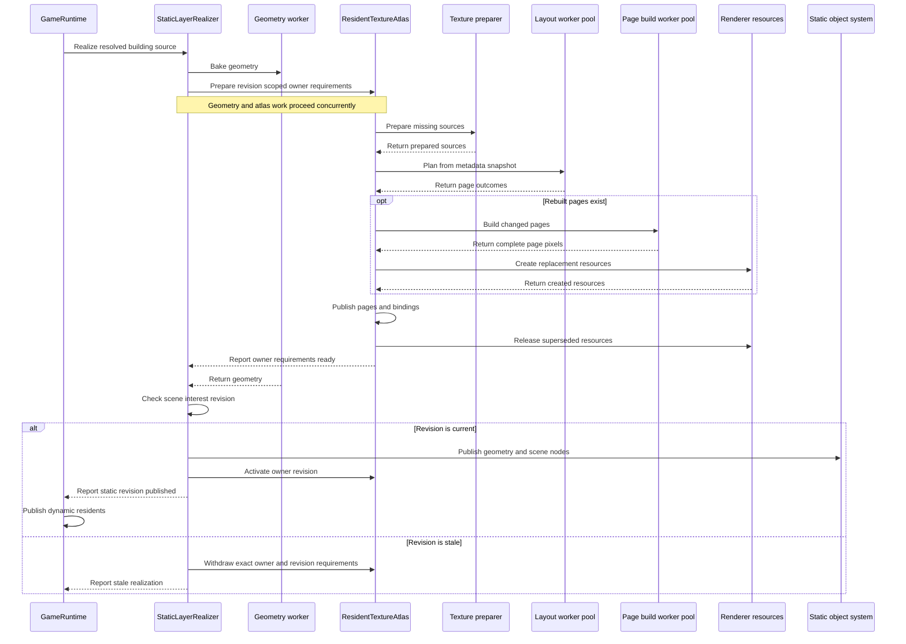

# Holtburger 3D Runtime Texture Atlas Residency Plan

Date: 2026-07-25
Status: Complete (2026-07-25).

## Context and Boundaries

### Goal

Replace landblock-local candidate-page packing with a runtime-owned, fixed-size texture atlas that
retains decoded logical sources, reuses resident bindings and free page space, and performs bounded
transactional compaction during ordinary scene commits.

### Current State

The building pipeline currently collects every logical texture used by one landblock, decodes every
dependency, and packs the complete set into independently allocated 2048 x 2048 pages. The packer is
a deterministic row shelf. It partitions pages by `TexturePurpose`, but it neither inserts into
free regions of existing pages nor chooses a compact placement within a page.

`TextureManager` receives those complete candidate pages after all preparation, packing, transfer,
and upload work has occurred. It uses logical `AssetTextureKey` identity to choose a canonical
binding among overlapping candidates, but this arbitration happens too late to avoid duplicate
decoding, packing, transfer, or temporary device allocation. Unique textures remain stranded in
the independently packed page that first wins them.

Owner eviction already releases individual logical texture bindings, and an atlas page is released
when its final canonical binding disappears. The vacated rectangle of a partially live page is not
tracked as reusable space, however, and the surviving entries cannot be consolidated into fewer
pages.

The renderer is already correctly indirect: static geometry retains source-local UVs and logical
texture keys, and each draw resolves the current page resource and placement through
`TextureManager`. A runtime transaction may therefore change a texture's physical page and
placement between frames without rebuilding geometry.

### Confirmed Decisions

- Every runtime atlas page has a fixed width and height of 2048 pixels.
- `TexturePurpose` is the complete atlas compatibility bucket. It already determines pixel format,
  mip policy, and canonical physical preparation. Filtering and draw-time wrap policy do not create
  additional buckets.
- Decoded, prepared source pixels remain in CPU memory while their logical texture has an owner or
  participates in an in-flight atlas transaction.
- Runtime compaction never reads pixels back from the graphics device. Every rebuilt page is
  materialized from retained logical sources.
- Every atlas mutation evaluates free-space reuse and bounded compaction. Rebuilding pages remains
  conditional on a deterministic benefit and work budget.
- Metadata placement planning and pixel page materialization are separate stages. The planner
  identifies kept, metadata-only, rebuilt, and dropped pages in a closed metadata-worker job; only
  rebuilt pages enter bounded-concurrency pixel worker jobs.
- Page placement is replaceable physical state. Geometry, materials, and `AssetTextureKey` identity
  remain stable across insertion, release, and compaction.
- Atlas planning and page materialization stay behind closed worker jobs. The main thread owns
  currentness decisions, compact mutation snapshots, device publication, and atomic binding-map
  mutation.

### Deliberate Supersession

This plan supersedes North Star 13 in
`docs/plans/holtburger-3d-buildings-layer-e2e-plan.md`, which required independently prepared
landblocks and prohibited a pre-pack residency snapshot. That rule was appropriate for landing the
first visible building slice without serializing workers, but it deliberately accepted duplicate
candidate work and stranded page capacity.

This plan preserves the useful part of that decision: landblock source and geometry preparation
remain independent, and workers still receive closed jobs. It replaces page arbitration with
runtime-owned logical claims, per-purpose placement transactions, and stale-safe page reservations.
The completed plan remains historical evidence and must not be rewritten to imply that the initial
architecture already provided global residency.

### In Scope

- DAT-backed two-dimensional object textures represented by `AssetTextureKey`.
- The building static-object path as the first producer of runtime atlas requirements.
- Purpose-scoped fixed-page placement and deterministic free-rectangle packing.
- Multi-owner logical texture claims independent of page publication.
- In-flight source preparation coalescing and resident CPU source retention.
- Skipping preparation and packing for already resident logical textures.
- Reusing free regions of compatible resident pages.
- Marking released regions reusable without requiring immediate page movement.
- Bounded compaction evaluated during normal retain/release commit flow.
- Transactional page building, committed-binding replacement, publication, and rollback.
- Stale completion rejection when scene interest changes during asynchronous realization.
- Failure-atomic replacement of one static-object owner so atlas activation follows a successful
  scene cutover.
- Page, source-memory, allocation, reuse, compaction, transfer, and release diagnostics.
- Explorer texture-page diagnostics updated to describe the replacement model honestly.
- Deletion of the landblock-local shelf packer and candidate-page arbitration after cutover.

### Out of Scope

- Variable atlas page dimensions.
- Mixing different `TexturePurpose` values on one page, even when their current formats match.
- Texture arrays, generated terrain textures, or standalone regional detail textures.
- Changing logical material identity, source-local UVs, or baked geometry.
- Reading atlas contents from WebGL to support rebuilding.
- Retaining complete CPU copies of materialized atlas pages after upload.
- Partial `texSubImage2D` page patching in the first implementation. Complete replacement pages are
  built off-thread and published atomically.
- Adaptive or unbounded worker pools. Phase 3 selects explicit bounded planner and page-build pool
  sizes from measured queueing, transfer cost, and browser responsiveness.
- A permanent unbounded cache for unowned texture sources.
- A general cross-system transaction framework. Only the static-owner replacement seam required for
  correct atlas activation is made failure-atomic.
- Porting the legacy open-world streaming scheduler, claim registry, or texture residency system
  wholesale.
- Permanent automated tests that require local DAT or HBA archives.
- Running the interactive TUI client for diagnostics.

## Ground Truth and Existing Precedent

### Current Application Contracts

- `apps/holtburger-3d/src/lib/game/textures/types.ts`
  - `AssetTextureKey`
  - `TexturePurpose`
  - `TexturePurposePolicy`
  - `texturePurposePolicy`
  - `TexturePreparation`
- `apps/holtburger-3d/src/lib/game/textures/texture-manager.ts`
  - logical leases, canonical atlas bindings, page resources, and draw-time binding lookup
  - candidate-page arbitration and release behavior to replace
- `apps/holtburger-3d/src/lib/game/textures/texture-preparer.ts`
  - logical texture preparation port and current in-flight request coalescing
- `apps/holtburger-3d/src/lib/game/ownership.ts`
  - owner-to-logical-resource lease accounting
- `apps/holtburger-3d/src/lib/game/commit/building-texture-inputs.ts`
  - authoritative collection and validation of logical building texture dependencies
- `apps/holtburger-3d/src/lib/game/commit/building-texture-worker.ts`
  - canonical purpose-specific gutter preparation and current shelf packer
- `apps/holtburger-3d/src/lib/game/commit/building-geometry-worker-client.ts`
  - geometry-only closed worker transport and transferable ownership
- `apps/holtburger-3d/src/lib/game/commit/pipeline.ts`
  - current building source load, texture preparation, geometry bake, page pack, and artifact assembly
- `apps/holtburger-3d/src/lib/game/commit/types.ts`
  - current `CommitBundle` handoff consumed by scene-interest coordination and `GameRuntime`
- `apps/holtburger-3d/src/lib/game/commit/artifacts.ts`
  - static-object texture page and logical material contracts
- `apps/holtburger-3d/src/lib/game/commit/building-artifact.ts`
  - current same-artifact texture coverage assertion
- `apps/holtburger-3d/src/lib/game/systems/static-object-system.ts`
  - owner-scoped geometry, texture, instance, and scene installation
- `apps/holtburger-3d/src/lib/game/runtime/scene-interest-commit-coordinator.ts`
  - dispatch currentness and stale source/worker rejection
- `apps/holtburger-3d/src/lib/game/runtime/game-runtime.ts`
  - commit draining, layer publication, eviction, diagnostics, and frame sequencing
- `apps/holtburger-3d/src/lib/game/renderer/render-world.ts`
  - renderer-facing logical texture resolution membrane
- `apps/holtburger-3d/src/lib/game/renderer/webgl2-renderer.ts`
  - per-draw atlas binding and placement resolution
- `apps/holtburger-3d/src/lib/game/renderer/resource-manager.ts`
  - renderer-neutral texture resource creation, replacement, and release
- `apps/holtburger-3d/src/lib/game/renderer/webgl2-resource-manager.ts`
  - atomic single-resource replacement precedent
- `apps/holtburger-3d/src/explorer/ExplorerTexturesPanel.svelte`
- `apps/holtburger-3d/src/explorer/ExplorerTexturePageModal.svelte`
  - existing page-level runtime inspection surfaces

### Architectural Direction

- `docs/plans/holtburger-3d-render-systems-ecs-pivot-scoping.md`
  - `TexturePurpose` alone defines canonical physical compatibility.
  - `AssetTextureKey` excludes physical placement and permits repacking.
  - freshly prepared and packed resources share logical identity.
- `docs/plans/holtburger-3d-buildings-layer-e2e-plan.md`
  - source-local UVs and logical material bindings remain independent of packing.
  - closed workers and explicit stale completion behavior remain required.
  - North Star 13 is deliberately superseded as described above.
- `apps/holtburger-3d/ARCHITECTURE_AUDIT.md`
  - atlas replacement is a high-risk mutable-state hotspot.
  - `TextureManager` is already an oversized hub; new residency policy must be extracted into a
    focused component rather than extending its candidate-arbitration method.

### Legacy Algorithms to Mine, Not Port Wholesale

- `apps/holtburger-3d-legacy/src/lib/textures/packing/atlas-layout.ts`
  - deterministic largest-first ordering
  - best-short-side-fit placement
  - free-rectangle splitting and containment pruning
  - reconstruction of free space from locked placements
  - insertion into existing pages
- `apps/holtburger-3d-legacy/src/lib/textures/packing/packer.ts`
  - page materialization and gutter blitting
- `apps/holtburger-3d-legacy/src/lib/systems/open-world-streaming/texture-residency/`
  - separation of claims, placement, page build, and publication as conceptual precedent only

The new implementation must remove variable page-size search, page runway, cross-domain bucket
vocabulary, and legacy scheduler concepts. Fixed pages and `TexturePurpose` provide a smaller
problem.

## North Stars

1. **Logical ownership precedes physical placement.** An owner claims `AssetTextureKey` values.
   Pages are a replaceable consequence of all current claims, never the source of those claims.
2. **Purpose is the bucket.** Do not add parallel format, mip, gutter, wrap, domain, or owner bucket
   keys that merely restate `TexturePurpose`.
3. **Resident means preparation is reusable.** A retained logical texture is never decoded or
   prepared again. Its pixels are copied again only when insertion or compaction rebuilds its
   physical page; untouched pages perform no pixel work.
4. **Source pixels are authoritative runtime backing.** Retain one validated prepared source per
   resident logical key. Rebuild from that source; never scrape physical pages.
5. **Fixed pages simplify policy.** Every page within a purpose has identical dimensions and byte
   cost. Placement policy optimizes page count, moved bytes, and useful free geometry.
6. **Evaluate compaction routinely; execute it selectively.** Every retain/release mutation may
   propose a bounded repack. Apply it only when it avoids or eliminates a page within the configured
   rebuild budget.
7. **A hole and fragmentation are different facts.** A released rectangle is immediately reusable.
   Repacking is required only to move survivors and consolidate nonempty pages.
8. **Page-count benefit outranks pretty occupancy.** Do not move live textures merely to improve an
   Explorer percentage. Prefer fewer pages, then fewer moved source bytes, then larger useful free
   rectangles.
9. **Publication is transactional.** Build and upload every replacement page before changing a
   committed binding. On failure or stale completion, retain the previous complete state.
10. **Stale work cannot release newer ownership.** Building atlas realization carries the existing
    `SceneInterestRevision` that authorized its source dispatch. Cleanup may withdraw only the
    exact `(owner, revision)` claim it created.
11. **Workers receive closed jobs.** A page build includes its complete layout and source payloads.
    It never pauses to query main-thread residency or request another asset.
12. **The main loop stays narrow.** Placement planning operates on metadata. Pixel clearing,
    guttering, and blitting happen in a worker. WebGL creation and map publication remain on the
    main thread.
13. **Binding readiness is explicit.** Static scene publication must not expose a draw unit whose
    required logical texture lacks a committed binding.
14. **Diagnostics describe actual policy.** Report resident sources, avoided preparations,
    insertions, holes, compaction attempts, accepted repacks, moved bytes, and pages eliminated.
    Retire candidate-versus-canonical arbitration terminology when candidate pages no longer exist.
15. **The cutover includes subtraction.** Delete the shelf packer, per-install page IDs,
    same-artifact page coverage check, and candidate scoring once the resident atlas owns those
    responsibilities.
16. **Execution boundaries are not automatically components.** Add only two stateful domain
    components: `ResidentTextureAtlas` for atlas authority and `StaticLayerRealizer` for building
    realization sequencing. Claims, source retention, transactional publication, planning, and page
    building remain internal state or pure implementation boundaries rather than freestanding
    services.
17. **Static replacement precedes atlas activation.** Stage one revision's geometry, instances, and
    nodes before removing the prior static owner record. On failure, remove staged work and retain
    the prior scene and atlas revision. Activate the prepared atlas revision only after the static
    replacement succeeds.

## Target Model

### Component Shape

The target adds exactly two stateful domain components:

- `ResidentTextureAtlas`, composed beside the existing `TextureManager`, owns all packed-atlas
  authority. `TextureManager` remains the broader texture facade and delegates atlas binding lookup
  and page diagnostics/inspection lookup to this component.
- `StaticLayerRealizer`, owned by `GameRuntime`, sequences geometry, atlas readiness, currentness,
  and static publication. It does not own pixels, placements, renderer resources, or scene-interest
  policy.

The following are implementation boundaries, not additional systems:

- owner/revision claim indexes and the resident prepared-source map are private
  `ResidentTextureAtlas` state;
- transaction staging, rollback, and atomic map publication are focused internal functions of
  `ResidentTextureAtlas`;
- fixed-page placement and page materialization are pure functions invoked through worker clients;
- layout and page-build concurrency use the same reusable bounded closed-worker-pool primitive with
  different job contracts; and
- `TexturePreparer`, `RendererResourceManager`, the geometry worker, `StaticObjectSystem`, and
  `SceneInterestCommitCoordinator` remain existing dependencies with narrow responsibilities.

`TexturePreparer` prepares missing sources and coalesces concurrent requests by logical key.
`ResidentTextureAtlas` alone retains prepared sources after preparation because it also owns the
claims that determine their lifetime. No separate claim registry, resident source cache, compaction
manager, or transactional publisher object is introduced.

The same `ResidentTextureAtlas` instance is injected into `StaticLayerRealizer` for mutation and
into `TextureManager` for packed-atlas binding, diagnostics, and inspection lookup; these are not two
atlas owners.
`GameRuntime` owns the shared `TexturePreparer` lifecycle because both `TextureManager` and
`ResidentTextureAtlas` consume it. Neither child destroys that shared dependency.
`ResidentTextureAtlas` owns and destroys only its layout/page-build pools, claims, retained sources,
and page state; `StaticLayerRealizer` owns and destroys only its geometry worker and pending
realizations.

```text
GameRuntime
|-- SceneInterestCommitCoordinator
|-- TexturePreparer
|-- ResidentTextureAtlas
|   |-- layout worker pool
|   `-- page-build worker pool
|-- TextureManager -------- delegates packed-atlas lookup to ResidentTextureAtlas
|-- StaticObjectSystem
`-- StaticLayerRealizer
    |-- geometry worker
    `-- uses currentness, ResidentTextureAtlas, and StaticObjectSystem ports
```

### Logical State

For each `AssetTextureKey`, `ResidentTextureAtlas` owns:

- immutable `TexturePurpose` and source identity;
- validated decoded width, height, format, and pixels;
- the owners currently claiming it;
- pending preparation, revision-scoped claim, or mutation reservation state, if any; and
- zero or one committed physical binding.

Source pixels remain resident while any owner or in-flight revision-scoped claim needs them. Final
claim release removes the logical entry after any selected atlas mutation publishes.

### Physical State

For each `TexturePurpose`, `ResidentTextureAtlas` owns:

- fixed 2048 x 2048 page records;
- immutable page-generation identifiers;
- committed entry placements and reconstructable free rectangles;
- opaque renderer resource keys; and
- one serialized placement/publication lane for that purpose.

One committed placement stores the content bounds used for atlas sampling. The planner derives its
allocation bounds by expanding those content bounds by the purpose's canonical gutter. Free-space
reconstruction and overlap validation use allocation bounds; renderer binding and texture-page
inspection use content bounds. Diagnostics report content occupancy and allocated occupancy
separately so gutter cost is neither hidden nor mistaken for reusable space.

Planner metadata, worker page pixels, and diagnostic bounds use a top-left pixel origin. Graphics
readback must be normalized to that convention at the renderer-resource inspection boundary before
Explorer overlays bounds; atlas policy does not carry parallel flipped coordinates.

Different purposes may prepare and mutate independently. Mutations within one purpose serialize
because they consume and replace the same placement snapshot. That ordering does not serialize
pixel jobs: after a plan is accepted, replacement pages are independently materialized through a
bounded page-build worker pool before their one atomic publication.

Atomic page/binding publication is scoped to one purpose mutation. One owner requirement operation
may await several independent purpose mutations and reports ready only when all succeed. If one
purpose fails after another publishes, the scene remains unpublished; exact provisional withdrawal
then reclaims the successfully prepared requirements through ordinary mutations. Cross-purpose
device publication does not require a global atlas lock.

### Execution Ownership

`StaticLayerRealizer` executes on the browser main thread, but it is an authority and sequencing
component, not a geometry or pixel processor. Its main-thread work is:

- collect or validate logical requirement metadata;
- launch geometry preparation and atlas preparation concurrently;
- recheck `SceneInterestRevision` currentness;
- publish complete static scene state; and
- activate or withdraw the exact revision-scoped atlas requirements.

`ResidentTextureAtlas` owns the remaining main-thread atlas work:

- capture compact purpose-scoped placement snapshots;
- dispatch metadata planning and changed-page build jobs;
- create or release opaque renderer resources; and
- atomically publish page layouts and logical bindings.

Geometry transforms remain in the existing geometry worker. Texture decoding remains behind the
existing `TexturePreparer`; retained prepared sources live in `ResidentTextureAtlas`. The pure
metadata planner runs through a bounded worker pool and receives no pixel payloads. The pure page
builder runs through a separately bounded pool because its pixel payload and workload differ. Both
use one reusable closed-worker-pool adapter rather than domain-specific manager classes. One
purpose's placement/publication lane awaits its planner result so it cannot plan from a stale
snapshot; independent purpose lanes and independent replacement pages may use workers concurrently.
Phase 3 selects both pool bounds from measurements taken with the end-to-end fixture. Phase 7 may
tune them from browser-harness evidence. Diagnostics expose queue delay, worker duration, and
transfer bytes throughout.

### Commit Transaction



### Requirement Lifecycle

`ResidentTextureAtlas.prepareOwnerRequirements(owner, revision, facts)` synchronously adds one
provisional revision-scoped claim and returns one composite handle:

```ts
interface AtlasRequirementHandle<TOwner extends string> {
  readonly owner: TOwner;
  readonly revision: SceneInterestRevision;
  readonly completion: Promise<"ready" | "withdrawn">;
}
```

The handle keeps exact cleanup identity and readiness together without exposing a mutation
reservation. Its completion reports `ready` only after every required logical binding is committed
and reports `withdrawn` when exact cleanup wins the race; preparation failures reject. Every pending
handle therefore settles. Preparation does not replace or release an older published revision for
that owner while the old scene may still draw.

After the currentness check and successful static scene replacement,
`activateOwnerRevision(handle)` records the new published revision and withdraws the previous
published revision, if any. Once the handle completes as `ready`, activation is a nonthrowing
claim-state transition. Withdrawal always has a stable release plan; after Phase 6, failure of an
optional compaction attempt records the failure and commits that stable plan instead of retaining a
dead claim or invalidating the newly published scene. Internal ownership or resource invariants
still fail loudly. If currentness fails or static publication throws,
`withdrawOwnerRevision(handle)` removes only the provisional revision. Scene-interest eviction
carries the evicted dispatch revision to `StaticLayerRealizer`, which removes the static scene state
and calls
`evictOwnerRequirements(owner, evictedRevision)`. That authoritative main-thread operation
synchronously snapshots and withdraws both the owner's currently published revision, when present,
and the exact evicted provisional revision. It does not touch other owners or claims created by a
later dispatch.

These operations reuse `SceneInterestRevision`; they do not create a second generation type.
Multiple revisions for one owner may overlap only while replacement is in flight, and multiple
different owners may claim the same logical texture indefinitely. Any withdrawal becomes an
ordinary atlas mutation and cannot drop a newer revision or another owner's claim.

Repeating `prepareOwnerRequirements` for the same `(owner, revision)` and identical fact set returns
the same handle; a different fact set for that identity is an invariant error. Exact handle
withdrawal is idempotent because eviction and stale completion may race to withdraw the same
provisional revision. Repeating activation of the already active handle is a no-op; activating a
not-ready, withdrawn, or superseded handle fails loudly.

Only the authoritative scene-interest eviction path may call `evictOwnerRequirements`. Stale
completion and failure cleanup must use exact revision withdrawal, so delayed work can never erase a
later dispatch for the same owner.

`StaticObjectSystem.replaceObjects` provides the failure-atomic publication seam required by this
ordering. It stages geometry, instance streams, renderables, and nodes under a resource owner derived
from the existing `(owner, SceneInterestRevision)`, then swaps the stable scene-owner record and
releases the prior revision. A staging failure rolls back the new resources and nodes without
removing the prior owner record. This reuses the scene-interest revision and does not introduce
another generation concept or component.

Duplicate page arbitration does not survive this cutover. Concurrent claims for one logical key
coalesce preparation, and purpose-scoped mutation serialization makes every later transaction plan
against the latest committed/reserved snapshot. A redundant requirement records its independent
owner/revision claim but performs no preparation, layout, pixel, or upload work. A page build that no
longer matches its revision or mutation reservation is rejected rather than compared with another
physical candidate.

The planner classifies page outcomes:

- **kept:** live set and placements are unchanged; retain the page ID and resource with no pixel
  work;
- **metadata-only:** a release creates free space but no live placement moves; update logical layout
  metadata without rebuilding pixels;
- **rebuilt:** insertion or compaction requires new pixels or moved placements; materialize and
  publish a replacement generation; and
- **dropped:** no live placement remains or compaction eliminates the page; release its resource
  after publication.

Metadata-only release may leave unreachable old texels in a free rectangle until that page is next
rebuilt. No logical binding can sample them, and a later insertion overwrites its allocated region.
Explorer occupancy and bounds derive from live placements, not incidental bytes remaining in free
space.

A rebuilt page is materialized completely from retained sources, so unchanged textures on that
changed page are blitted again. This is not duplicate preparation: untouched pages perform no work,
and no logical source is decoded again during its resident lifetime.

### Placement and Compaction Policy

The pure planner evaluates a purpose-scoped mutation in this order:

1. Remove released keys from the virtual snapshot and reconstruct free rectangles.
2. Preserve every unaffected placement.
3. Insert new keys into existing free rectangles with deterministic best-short-side fit,
   preferring the page that leaves the least unusable area.
4. If insertion would allocate a page, or release created fragmented low-occupancy pages, select a
   bounded compatible cohort for a compaction attempt.
5. Repack the cohort plus unplaced incoming keys largest-first.
6. Accept the compaction only when it:
   - avoids allocating a page that the stable insertion attempt required; or
   - reduces the number of existing pages by at least one.
7. Break equivalent plans by fewer moved source bytes, then larger maximum free rectangle, then
   stable page/key ordering.
8. If no beneficial attempt fits within the work budget, retain the stable insertion result.

The planner preserves the validated stable insertion/release result alongside any accepted
compaction alternative. If materializing the optional alternative fails, atlas residency may execute
the stable result instead. A stable insertion can still fail if its required page cannot be built or
uploaded; that failure rejects and rolls back the provisional requirement operation. A stable
release requires no replacement pixels, so ownership withdrawal is not blocked by failed optional
compaction.

The compaction cohort starts with pages directly affected by release or failed insertion, then adds
the sparsest compatible pages in deterministic order until the measured rebuild budget is reached.
Phase 6 selects and records the initial budget using the Phase 0 baseline and Phase 3 worker
measurements. The budget is an explicit policy constant and diagnostic value, not an implicit
timeout.

This means compaction is considered on every relevant commit while page movement remains bounded
and justified by a concrete page-count result.

### Page Identity

Page IDs identify one immutable published physical generation, not a landblock or source job.
Create concise runtime-owned IDs such as:

```text
page:object-direct-color:42
```

A rebuilt page receives a new ID. The atomic transaction redirects logical bindings to the new
generation and then releases superseded pages. IDs are not recycled during one runtime session;
device memory and page slots are.

## Phased Implementation

### Phase 0: Baseline, Policy Census, and Contract Dry Run

Status: Complete (2026-07-25).

#### Deliverables

- Record a checked-in baseline table in this plan covering:
  - active pages and bytes by purpose;
  - logical keys and decoded source bytes represented by current building jobs (the current runtime
    does not retain those sources);
  - occupancy and free-rectangle fragmentation;
  - duplicate texture dependencies across a radius-1 building load;
  - main-thread logical requirement collection time;
  - building texture preparation and packing worker timings; and
  - pages released across an unload/reload traversal.
- Add temporary or durable diagnostics needed to collect those facts without retaining page pixels.
- Confirm the maximum prepared object texture dimensions and guttered dimensions fit 2048 pages.
- Dry-run the target transaction against:
  - two concurrent landblocks sharing texture keys;
  - eviction while source preparation is pending;
  - eviction after page build but before publication;
  - replacement of the same owner under a newer scene-interest revision; and
  - shutdown with in-flight page builds.

#### Acceptance Criteria

- The baseline demonstrates current duplicate preparation/packing and stranded page capacity with
  concrete counts.
- Every async scenario has one named currentness owner and cleanup path.
- No implementation phase depends on reading page pixels from WebGL.
- No purpose-padded source dimension exceeds the fixed page contract.

#### Evidence

The following commands ran against the local `dats/assets.hba` archive and the noninteractive,
headless Explorer terrain harness. They do not run the interactive TUI.

```sh
cargo run -p holtburger-debug-harness --bin inspect_building_layer_evidence -- \
  --scan-setup-samples --sample-limit 1 0xda55ffff

cd apps/holtburger-3d
npm run harness:terrain -- --landblock 0xda55ffff --building-radius 1 --lifecycle \
  --settle-ms 10000
```

The archive-wide Level-1 building census covers 6,979 building placements across 5,346
landblock-info records. Its selected building closure has 398 GfxObjs, 441 used materials, 416
selected render surfaces, and 31 palettes. The largest canonical entries are:

| Purpose             | Largest source |      Padded allocation | Fixed-page result |
| ------------------- | -------------: | ---------------------: | ----------------- |
| `ObjectDirectColor` |      512 x 512 | 520 x 520 (4px gutter) | fits 2048 x 2048  |
| `ObjectIndex16`     |      256 x 256 |              256 x 256 | fits 2048 x 2048  |
| `ObjectPalette`     |   2048 entries |                46 x 46 | fits 2048 x 2048  |

This passes the fixed-page hard gate for the complete currently selected building closure. The
direct-color lower bound is six 2048 x 2048 pages by total padded area, not an oversized-source
exception. The `ObjectPalette` contract stores the complete 2,048-entry authored palette in the
smallest square payload (46 x 46); its unused texels are transparent and it remains purpose-isolated.

The fresh `0xda55ffff`, building-radius-1 harness snapshot requested nine landblocks; six had an
installed building artifact. It reached the following retained state before the deliberate
unload/reload traversal:

| Metric                         |                         Observation |
| ------------------------------ | ----------------------------------: |
| Active pages / device bytes    |                          7 / 96 MiB |
| Canonical bindings             |                                  54 |
| Published candidate pages      |                                  12 |
| Canonical replacements         |                                  26 |
| Released candidate pages       |                                   5 |
| Installed static-object owners |                                   6 |
| Building texture worker time   | 4.3ms to 39.1ms per installed layer |
| Building geometry worker time  | 1.0ms to 20.9ms per installed layer |

The retained pages demonstrate stranded capacity rather than a capacity limit: the three
direct-color pages are 11.33%, 2.45%, and 2.44% canonically occupied; the two index-16 pages are
0.39% and 1.56% occupied; and the two palette pages are 0.05% and 0.20% occupied. Current
diagnostics cannot report free rectangles because the shelf packer has no free-rectangle model;
these occupancy figures are the honest fragmentation proxy. It also does not retain decoded
source pixels after packing, so it cannot report resident source bytes. The new atlas must add
both measurements rather than infer them from device pages.

After the harness cleared and reloaded the same building neighborhood, it returned to the same
seven-page, 54-binding steady state, but cumulative counters became 24 published candidates, 46
canonical replacements, and 17 released pages. In other words, one unchanged traversal created
12 more candidate pages, performed 20 more replacement decisions, and released 12 more pages.
This is direct runtime evidence that layer-local jobs prepare and pack overlapping data before
`TextureManager` arbitrates it. The current pipeline collects dependencies and starts pixel
preparation independently for each building layer, then assigns each pack job a unique
`static-install:buildings:<landblock>:<counter>` namespace; candidate arbitration occurs only
after the complete page upload.

The existing currentness proof is narrower but real: `SceneInterestCommitCoordinator` owns the
per-layer `SceneInterestRevision` dispatch token, drops stale pipeline completions before runtime
publication, and `ClosedWorkerClient.destroy()` rejects unsettled worker callers. The current
destructive `StaticObjectSystem.installObjects`, unrevisioned coordinator eviction callback, and
`TextureManager.dropOwner()` cannot truthfully dry-run the proposed provisional/published atlas
lifecycle. Adding pretend fixtures for an API that does not yet exist would be theatre. The exact
transaction scenarios therefore move to the first phases that introduce their contracts: claim
and withdrawal cases in Phase 2, page-build publication races in Phase 3, and same-owner scene
replacement in Phase 4. That preserves the requirement while making the fixtures executable
against real seams.

#### Task Checklist

- [x] Capture the current Explorer atlas snapshot for a representative radius-1 load.
- [x] Census all selected Level-1 building sources for fixed-page dimensions and gutter fit.
- [x] Establish the current stale-completion and worker-destroy ownership boundary by source and
      existing non-asset tests.
- [x] Move target-lifecycle fixtures to Phases 2 through 4, where their contracts become real and
      executable rather than mock-only.
- [x] Update the supersession and concessions log for the fixture-phase correction.

#### Decisions and Course Corrections

- The full selected building closure passes the fixed 2048px page gate; no variable-page fallback
  is required.
- The current Explorer run confirms duplicated candidate work and sparse retained pages, but it
  cannot measure free rectangles or source RAM because neither exists in the current model. Those
  diagnostics remain Phase 2/3 deliverables rather than invented Phase 0 counters.
- The proposed transaction has no executable production seam yet. Lifecycle fixtures move to the
  phase which creates each seam; this is a sequencing correction, not a relaxation of acceptance
  coverage.

### Phase 1: Fixed-Page Stable Layout Core

Status: Complete (2026-07-25).

#### Deliverables

- Add a focused pure layout module under `apps/holtburger-3d/src/lib/game/textures/atlas/`.
- Add a closed metadata layout-worker protocol around that pure module. Generalize the existing
  closed-worker client into the reusable bounded pool primitive used by both future worker job
  types. The layout worker input contains placement metadata only; no decoded pixel buffers cross
  this boundary. Phase 1 uses an injected test bound; Phase 3 selects the initial production bound.
- Define commented, immutable contracts for:
  - logical entry dimensions and purpose;
  - committed page layouts;
  - content placement bounds and purpose-derived allocation bounds;
  - reconstructed free rectangles;
  - insertion results;
  - complete atlas mutation plans.
- Derive format, gutter, wrap, and padded dimensions from `TexturePurpose`; do not repeat canonical
  preparation as independently editable placement or job fields.
- Port only the proven legacy free-rectangle primitives:
  - largest-first deterministic entry ordering;
  - best-short-side-fit selection;
  - intersecting free-rectangle splitting;
  - contained-free-rectangle pruning; and
  - free-space reconstruction from locked placements.
- Fix page dimensions at `STATIC_OBJECT_TEXTURE_PAGE_SIZE`.
- Make `TexturePurpose` the only bucket key.
- Define the exhaustive packed-object purpose subset
  (`ObjectDirectColor`, `ObjectIndex8`, `ObjectIndex16`, and `ObjectPalette`) so unsupported terrain,
  array, generated, and regional-detail purposes fail at the residency boundary. This is a
  type-safe capability restriction, not a second compatibility key.
- Implement stable insertion, logical release, hole reuse, empty-page deletion, and new-page
  allocation without pixel data or runtime mutation.
- Deliberately exclude live-placement movement and compaction scoring until Phase 6.

#### Acceptance Criteria

- Identical inputs always produce byte-for-byte equivalent plan snapshots.
- Layout-worker requests and results preserve an opaque correlation token; Phase 3 gives that token
  reservation semantics when `ResidentTextureAtlas` exists.
- Different purposes can never appear on one page.
- No placement or worker contract can disagree with preparation derived from its `TexturePurpose`.
- Existing live placements remain unchanged.
- Released rectangles are immediately reusable.
- Content bounds and padded allocation bounds use one top-left pixel coordinate convention and never
  overlap. Reconstructed free rectangles remain within the fixed page and never intersect a live
  allocation; their candidate rectangles may overlap each other, as required by the canonical
  MaxRects split-and-prune representation.
- A page with no live placements is dropped from the planned state.
- Oversized sources fail loudly with the logical key, padded dimensions, purpose, and page size.
- Tests cover adversarial rows where the current shelf algorithm wastes space but best-fit does not.

#### Task Checklist

- [x] Implement fixed-page placement contracts and validation.
- [x] Implement free-space reconstruction and stable insertion.
- [x] Define the metadata-only layout worker protocol and reusable bounded pool adapter.
- [x] Port/rewrite focused legacy algorithm tests against the smaller contracts.
- [x] Add property-style invariants for bounds, overlap, uniqueness, and determinism without adding
      a new dependency unless the existing test stack cannot express them cleanly.

#### Decisions and Course Corrections

- The fixed page constant and purpose-derived packed-object preparation now live in
  `textures/types.ts`, which prevents the incoming resident planner and outgoing shelf worker from
  carrying independently editable gutter rules. The shelf worker remains active until Phase 5.
- The planner retains content bounds only and derives padded allocation bounds from purpose. This
  keeps physical gutter policy canonical while making diagnostics able to report content and
  allocation occupancy separately in Phase 7.
- The legacy MaxRects free-rectangle representation deliberately retains overlapping candidate free
  rectangles after split-and-prune. Live allocation rectangles remain non-overlapping, and every
  free rectangle is validated against them. The acceptance criterion now says this precisely;
  requiring mutually disjoint candidate rectangles would be a different, less capable algorithm.
- `BoundedClosedWorkerPool` replaces the commit-local client location. It schedules independent
  closed jobs with injected worker count, queues work without callbacks, replaces a failed worker,
  and remains reusable by the future page-build pool. Phase 1 does not select a production pool
  size; Phase 3 owns that measured decision.
- The pure planner exposes a page-size override only for focused tiny-page tests. Production worker
  jobs use the fixed 2048px `STATIC_OBJECT_TEXTURE_PAGE_SIZE` and cannot carry a page-size field.
- Verification: 178 TypeScript tests, `npm run check`, focused ESLint, and focused Prettier all pass.

### Phase 2: `ResidentTextureAtlas` Claim and Source Model

Status: Complete (2026-07-25).

#### Deliverables

- Add `ResidentTextureAtlas` as the sole new stateful atlas domain component rather than enlarging
  `TextureManager.upsertAtlasPage`.
- Keep `TextureManager` as the broader texture facade and establish delegation seams for packed
  atlas binding lookup and diagnostics without switching the active candidate path.
- Carry the existing `SceneInterestRevision` through building retain, replacement, stale rejection,
  and exact cleanup. Do not introduce a parallel building generation type.
- Keep the following indexes as private `ResidentTextureAtlas` state rather than extracting claim or
  cache services:
  - `(owner, SceneInterestRevision) -> AssetTextureKey set`;
  - `owner -> published SceneInterestRevision`, when one is active;
  - `AssetTextureKey -> owner/revision claims`;
  - `AssetTextureKey -> retained prepared source`;
  - `AssetTextureKey -> current binding`, when published.
- Keep `TexturePreparer` responsible only for preparation, strict fact/source validation, and
  existing in-flight coalescing by `AssetTextureKey`.
- Make `ResidentTextureAtlas` retain the prepared result and release it after the final owner and
  pending revision-scoped requirement withdraw.
- Define the composite `AtlasRequirementHandle` plus prepare, activate, and exact-withdraw semantics
  so an in-flight replacement cannot release the still-visible revision or another owner's claim.
- Define authoritative `evictOwnerRequirements` separately from stale exact-revision withdrawal.
- Define the replacement static-object logical texture-requirement contract beside the active
  physical-page artifact. Do not migrate the active producer or consumer until the Phase 5 clean
  cutover.

#### Acceptance Criteria

- A second owner claiming a resident key causes no host pixel request.
- Concurrent claims for one missing key share one preparation operation.
- Releasing one of multiple owners retains the source and binding.
- Final release makes the logical source eligible for removal without affecting a newer owner
  revision in the isolated residency model.
- A stale revision cannot release claims belonging to a newer revision.
- Preparing a replacement revision retains the previously published revision until explicit
  activation after scene replacement.
- Activating a revision withdraws only the previous published revision for the same owner.
- Preparation failure or withdrawal while preparation is pending removes only that provisional
  revision; a late prepared result is retained only if another live claim needs it.
- Every requirement handle settles as ready, withdrawn, or failed during replacement, eviction, and
  destroy.
- Same-revision preparation returns the same handle only for an identical fact set; conflicting
  facts fail loudly.
- Eviction and stale completion may both request exact withdrawal without double-releasing logical
  or physical resources.
- Authoritative eviction removes the evicted provisional revision and any older published revision
  for that owner while preserving every other owner's claims.
- No page layout or renderer resource is required to unit-test claim/source lifetime.
- `TexturePreparer` contains no gameplay claim or post-preparation residency state.
- No separate claim registry or resident source-cache object exists.

#### Task Checklist

- [x] Introduce revision-scoped owner-claim and logical requirement contracts.
- [x] Implement and test provisional preparation, activation, and exact withdrawal transitions.
- [x] Add `ResidentTextureAtlas` with private claim and resident-source indexes.
- [x] Add the `TextureManager` delegation seam without switching the active path.
- [x] Define and test the replacement logical requirement contract without switching active
      building artifacts.
- [x] Update dependency collection to produce complete `AssetTextureFact` values.
- [x] Add concurrent preparation, replacement, stale cleanup, and final release tests.

#### Decisions and Course Corrections

- **Resolved source-contract correction:** the host currently uses `paletteDomain` only to truncate
  an authored palette to 256 entries for index8 use. Canonical `ObjectPalette` preparation instead
  retains the complete authored palette; index8 reads remain within the first 256 entries, while
  index16 receives the same complete source. This removes an unnecessary decoder-policy dimension
  and makes `TexturePurpose.ObjectPalette` a complete physical bucket as the target model requires.
  The app-local payload is square rather than row-shaped, matching legacy two-dimensional lookup
  addressing without making palette cardinality depend on atlas-page width.
- `renderSurfaceId` pins the first available RenderSurface selected during building-source assembly,
  but the host's omitted-ID path performs the same ordered first-available selection. Object
  preparation now uses that canonical host policy directly; the resolved ID remains source evidence,
  not an atlas identity or preparation parameter.
- `AssetTextureFact.sourceAssetId` remains the actual DAT texture or palette identity and is checked
  against `AssetTextureKey`. The host address (`surface-texture/<id>` or `palette/<id>`) is derived
  internally from the fact and purpose, so it is not threaded as separate provenance.
- This correction restores the planned invariant: `AssetTextureKey` plus `TexturePurpose` determine
  canonical prepared pixels. Conflicting facts for one key still fail loudly.
- **Validation:** `npm run check`, the full TypeScript suite (186 tests), ESLint, Rust unit tests,
  and strict Rust Clippy all pass. The exact lifecycle tests cover coalesced preparation, shared
  retention, pending withdrawal, failure, stale cleanup, activation, idempotent eviction, and
  destroy settlement. The host test proves palettes retain more than 256 authored entries.
- **Deferred Phase 3 integration:** the Phase 1 layout-worker entry and pool are deliberately not
  instantiated until a physical-page transaction exists. Knip therefore reports those two unused
  Phase 1 artifacts; this is tracked debt, not a suppressed diagnostic, and Phase 3 must consume or
  remove them before the final lint gate.

### Phase 3: Page Build and `ResidentTextureAtlas` Fixture

Status: Complete (2026-07-25).

#### Deliverables

- Add purpose-agnostic fixed-page build jobs beside the active building shelf pack job. The new jobs
  execute through a bounded page-build worker pool and become the replacement path only in Phase 5.
- A closed page-build job carries:
  - target page generation and purpose;
  - complete placements;
  - every required retained source payload;
  - fixed page size.
- Materialize cleared fixed-size page pixels and gutters in the worker.
- Dispatch one independent job per rebuilt page and await the complete transaction set before GPU
  publication. Kept, metadata-only, and dropped pages never enter the pool.
- Back both layout and page-build clients with one reusable bounded closed-worker-pool primitive;
  keep their job types and pool bounds separate.
- Preserve retained CPU sources when dispatching:
  - copy only source buffers needed by selected replacement pages before transfer; and
  - record copied source bytes in diagnostics.
- Implement renderer-neutral transactional publication as focused private functions inside
  `ResidentTextureAtlas`, not as another stateful publisher component:
  - create every new texture resource first;
  - release all newly created resources if any creation fails;
  - mutate page and logical-binding maps only after all resources exist; and
  - release superseded resources only after the new state is complete.
- Generate concise runtime page IDs independent of landblock/source namespaces.
- Compose the Phase 1 layout core, Phase 2 claim/source model, pure page builder, and internal
  publication functions into an end-to-end `ResidentTextureAtlas` fixture behind fake preparer and
  renderer ports.
- Exercise claim, prepare, plan, build, publish, replacement, release, rollback, and shutdown without
  routing production building commits through the fixture.
- Select explicit initial layout-planner and page-build pool bounds from measured fixture queue
  delay, job duration, transfer bytes, and peak copied-source bytes.

#### Acceptance Criteria

- Worker output is a complete 2048 x 2048 page with correct purpose format and gutters.
- Multiple rebuilt pages in one transaction can materialize concurrently up to the configured pool
  bound; their publication remains one atomic operation.
- Page building never detaches or mutates the retained authoritative source buffers.
- A multi-page upload failure leaves old resources and bindings unchanged and releases partial new
  resources.
- Successful publication changes every binding affected by one purpose mutation together.
- Renderer draw-time lookup observes either the old complete state or the new complete state.
- A stale layout-worker result is rejected by its purpose-lane reservation without mutating atlas
  state.
- Activating a ready revision uses the stable release plan and cannot strand the newly published
  scene behind optional reclamation work.
- Kept and metadata-only pages produce no page-build worker job or replacement upload.
- Fixture inspection proves replacement pixels and live bounds use the same coordinate convention.
- The fixture proves a complete resident atlas lifecycle with no production cutover or dual-mode
  runtime path.
- Transactional publication, claims, retained sources, and mutation lanes do not escape
  `ResidentTextureAtlas` as independently stateful collaborators.

#### Task Checklist

- [x] Define page-build worker protocol and transfer accounting.
- [x] Define planner and page-build pool composition, queue diagnostics, and shutdown.
- [x] Reuse the proven gutter blit in the new pure page builder without carrying shelf cursor state.
- [x] Implement transaction staging, resource rollback, and atomic map publication.
- [x] Add worker and fake-resource failure tests.
- [x] Use runtime-owned page IDs throughout the fixture.
- [x] Compose and test the end-to-end `ResidentTextureAtlas` fixture.
- [x] Verify no claim, source-cache, planner, builder, or publisher manager was introduced.
- [x] Record the initial bounded worker-pool settings and supporting measurements.

#### Resteering Gate

Before Phase 4:

- Verify claims, retained sources, mutation lanes, and publication remain cohesive
  `ResidentTextureAtlas` internals while pure planner and builder functions remain stateless.
- Verify no retained source buffer is accidentally transferred or duplicated beyond the measured
  closed-job copy.
- Dry-run Phases 4 through 8 against the fixture contracts.
- Stop if production integration would require a second binding model, a second currentness
  generation, or renderer fallback behavior.

#### Decisions and Course Corrections

- The physical fixture injects narrow layout, page-build, and renderer ports so its lifecycle can
  be exercised without switching the active candidate-page route. These are execution boundaries,
  not new domain managers; page, binding, mutation-lane, rollback, and source state remain private
  to `ResidentTextureAtlas`.
- The production page size remains 2048. The fixture admits an explicitly documented small-page
  override solely to make multi-page and rollback tests cheap; a page-builder test materializes a
  complete production-size page to guard the real invariant.
- **Initial pool settings:** one layout worker per purpose lane and two page-build workers provide
  deterministic metadata ordering while permitting two independent replacement pages to build in
  parallel. `ClosedWorkerPoolDiagnostics` records queue delay, execution duration, active/queued
  counts, transferred bytes, and peak queue depth; the fixture's copied-source-byte counter records
  the atlas-side source-copy cost. Phase 5 must retain these settings initially and use live
  diagnostics before tuning them.
- **Validation:** the complete TypeScript suite passes (193 tests). Focused fixture coverage proves
  a complete 2048² page, gutter coordinates, immutable retained sources, final release, multi-page
  upload rollback, stale layout rejection, and bounded-pool transfer accounting.

### Phase 4: `StaticLayerRealizer`

Status: Complete (2026-07-25).

#### Deliverables

- Add `StaticLayerRealizer` as the sole new stateful orchestration domain component. Inject narrow
  geometry, `ResidentTextureAtlas`, static-publication, and currentness ports rather than introducing
  manager wrappers around them.
- Model its input as resolved, classified building source plus the existing
  `SceneInterestRevision`.
- Collect logical requirements and launch geometry baking and atlas requirement preparation
  concurrently.
- Add explicit pending realization state keyed by layer and `SceneInterestRevision` and carrying its
  `AtlasRequirementHandle`; atlas mutation reservations remain private to `ResidentTextureAtlas`.
- Recheck currentness after atlas readiness and before geometry/node publication.
- Activate the exact revision only after successful static publication; otherwise withdraw only that
  provisional owner/revision requirement set.
- Accept the evicted `SceneInterestRevision` from `SceneInterestCommitCoordinator` so eviction can
  remove static state, the evicted provisional requirements, and any older published revision for
  that owner.
- Return a typed published-or-stale result to `GameRuntime`; `StaticLayerRealizer` does not own or
  publish dynamic residents.
- Require the injected static-publication port to replace one owner atomically or leave its previous
  revision unchanged.
- Model shutdown and replacement while geometry, preparation, planning, page building, or
  publication is pending.
- Test `StaticLayerRealizer` against the Phase 3 fixture and fake static-publication port.
- Do not switch the production `StandardCommitPipeline`, artifact, or static install route in this
  phase.

#### Acceptance Criteria

- `StaticLayerRealizer` tests prove geometry and missing texture preparation overlap rather than
  forming a serialized sum.
- A stale realization publishes neither nodes nor geometry and cannot remove a newer revision claim.
- Static publication cannot occur until the exact atlas claim is ready and current.
- A replacement keeps the previous published revision claimed until the new static scene publishes.
- Static publication failure withdraws the provisional revision and preserves the previous
  published scene and atlas revision.
- Eviction uses the dedicated authoritative owner-eviction operation; stale and failure cleanup
  remain exact-revision operations.
- Replacement and shutdown settle all realizer-owned work and exact atlas requirements.
- The active production building route remains unchanged.
- `StaticLayerRealizer` contains sequencing state only and does not duplicate atlas, source,
  renderer-resource, scene-interest, or static-owner state.
- Dynamic publication remains absent from the realizer and its test ports.

#### Task Checklist

- [x] Define the pending realization/currentness contract.
- [x] Implement `StaticLayerRealizer` against injected ports.
- [x] Prove concurrent geometry and atlas preparation under controlled scheduling.
- [x] Add stale completion, replacement, failure, and shutdown tests.
- [x] Route exact revision identity through the scene-interest eviction callback contract.
- [x] Define the typed realization completion consumed by `GameRuntime`.
- [x] Prove static-publication rollback ordering through the injected fake port.
- [x] Document the exact production ownership moves required by Phase 5.

#### Decisions and Course Corrections

- `StaticLayerRealizer` is deliberately a sequencing component only. It accepts resolved source,
  revision, owner, and logical requirements; it never sees dynamic residents, scene nodes, device
  resources, atlas pages, or scene-interest maps.
- The Phase 5 ownership move is now explicit: `GameRuntime` supplies the coordinator's exact
  revision/currentness callback and routes only resolved static building source to the realizer;
  the static-object system supplies failure-atomic replacement, while the resident atlas supplies
  the same owner/revision lifecycle it already owns. Dynamic publication remains downstream of a
  successful published result.
- **Validation:** controlled tests prove overlap, publication-before-activation, stale cleanup,
  publication failure cleanup, shutdown suppression, and dedicated exact-revision eviction. The
  production `StandardCommitPipeline` and static install route remain unchanged.

### Phase 5: Clean Production Atlas Cutover

Status: Complete (2026-07-25).

#### Deliverables

- Split the building source pipeline so it returns resolved, classified building source rather than
  realizing geometry and texture pages inside `StandardCommitPipeline`.
- Replace the building branch of the `CommitBundle` handoff with a resolved-source bundle carrying
  the classified building source and dynamic residents. Keep terrain and environment handoffs
  unchanged.
- Have `GameRuntime` route that source bundle and its existing dispatch revision into
  `StaticLayerRealizer`; collect logical texture facts synchronously before transferring geometry
  buffers.
- Split the paired `BuildingWorkers` facade: move geometry-worker ownership and shutdown into the
  tested `StaticLayerRealizer`; `ResidentTextureAtlas` owns separately bounded layout and page-build
  pool instances backed by the shared adapter primitive.
- Route production logical requirements through `ResidentTextureAtlas`.
- Switch `TextureManager` packed-atlas binding lookup and page diagnostics to the injected
  `ResidentTextureAtlas`, including page-resource inspection lookup, in the same cutover; standalone
  textures, generated textures, and arrays remain on their existing paths.
- Cut `StaticObjectLayerArtifact` over from physical `texturePages` to logical texture requirements,
  and replace same-artifact physical coverage with logical requirement coverage.
- Replace `StaticObjectSystem.installObjects` page installation with revision-scoped atlas
  readiness.
- Remove the `TextureManager` dependency and packed-page installation/release behavior from
  `StaticObjectSystem`.
- Replace destructive-first `StaticObjectSystem.installObjects` behavior with failure-atomic
  `replaceObjects` staging. Use revision-scoped geometry and instance resource ownership derived from
  the existing `SceneInterestRevision`; roll back staged nodes/resources before surfacing failure.
- Derive the building geometry/instance resource namespace from the stable layer owner and existing
  `SceneInterestRevision`; remove `StandardCommitPipeline`'s independent static namespace counter.
- Remove packed-atlas ownership from `TextureManager`'s generic owner leases. Owner-wide
  `TextureManager.dropOwner` continues to govern its non-atlas resources; building atlas eviction
  flows through `StaticLayerRealizer` and the dedicated atlas owner-eviction operation.
- Keep dynamic residents in the pending `GameRuntime` source bundle and publish them through the
  existing owner-scoped path only after `StaticLayerRealizer` reports successful current static
  publication. Stale or failed static realization publishes no dynamic residents.
- Route asynchronous realization failure back through the existing scene-availability failure
  reporting with the same layer and revision; stale failures remain silent.
- Rehome building worker and lifecycle diagnostics from `StandardCommitPipeline` to the realizer and
  atlas results that now produce them.
- Move shared `TexturePreparer` shutdown ownership to `GameRuntime`. Stop scene dispatch and
  realization, settle atlas handles and worker pools, release texture consumers, then destroy the
  preparer exactly once.
- Publish geometry and scene nodes only after all required logical bindings are ready.
- Apply Phase 1 stable insertion and release:
  - place missing sources into free rectangles before allocating a page;
  - remove a final released claim's live placement;
  - expose its rectangle to later insertion; and
  - drop a page when its final live placement disappears.
- Cut over in one phase. Delete candidate arbitration from the active route rather than retaining a
  dual resident/candidate mode.
- Defer movement of still-live entries and multi-page compaction to Phase 6.

#### Acceptance Criteria

- Two landblock commits sharing texture keys decode and publish each shared key once.
- The second commit acquires an independent claim on the existing binding.
- A resident-only commit performs no texture preparation, layout rebuild, pixel build, candidate
  upload, or duplicate-page arbitration.
- Evicting either landblock preserves textures still claimed by the other.
- Missing new textures insert into existing compatible pages before allocating pages.
- A released rectangle accepts a later compatible source without allocating another page.
- A stale realization publishes neither nodes nor geometry and cannot remove a newer revision claim.
- Production replacement retains the previous atlas revision until the new static scene publishes.
- Production eviction withdraws both the supplied dispatch revision and any older published revision
  for that owner, without affecting other owners or later dispatches.
- Dynamic residents retain their existing owner-scoped lifecycle and are not published ahead of the
  corresponding static realization.
- A current realization failure reports once, publishes no static or dynamic scene state, and
  withdraws its provisional atlas requirements.
- Failed replacement preserves the previous static owner record and its atlas revision.
- Rendering never reaches `getAtlasBinding` for an unready required key.
- `StaticObjectSystem` owns no texture page or atlas claim lifecycle.
- Owner-wide `TextureManager.dropOwner` cannot withdraw revision-scoped atlas requirements.
- Runtime shutdown settles every requirement handle, terminates each worker pool, and destroys the
  shared `TexturePreparer` exactly once.

#### Task Checklist

- [x] Split resolved building source preparation from runtime-owned realization.
- [x] Rewire production realization through `StaticLayerRealizer` and `ResidentTextureAtlas`.
- [x] Update static installation and eviction sequencing.
- [x] Implement and failure-test transactional `StaticObjectSystem.replaceObjects`.
- [x] Cut packed-atlas lookup and diagnostics over to the injected `ResidentTextureAtlas`.
- [x] Replace the building `CommitBundle` branch and remove building realization dependencies from
      `StandardCommitPipeline`.
- [x] Rewire preparer and worker shutdown ownership under `GameRuntime`.
- [x] Remove physical-page fields from active building commit contracts.
- [x] Connect stable insertion, logical release, hole reuse, and empty-page deletion.
- [x] Cover overlapping claims, stale completion, replacement, and shutdown across the resident
      atlas, realizer, runtime, and failure-atomic publication fixtures.

#### Resteering Gate

Before Phase 6:

- Measure main-thread logical requirement collection, mutation snapshot, resource creation, and map
  publication separately from worker queue delay.
- Verify source RAM matches currently claimed logical textures plus bounded in-flight work.
- Verify no source decode, layout job, or page build occurs for an unchanged resident-only commit.
- Verify only authoritative scene-interest eviction reaches owner-scoped atlas eviction; stale
  cleanup remains exact-revision withdrawal.
- Dry-run Phases 6 through 8 against the production contracts.
- Stop if correct stale rollback requires broad revision folklore or if binding readiness leaks into
  renderer hot-path fallback logic.

#### Decisions and Course Corrections

- `StandardCommitPipeline` is now source-only for buildings. It no longer owns a texture pixel
  source, worker pair, resource namespace counter, or page payload; `GameRuntime` collects facts
  before transferring source geometry and owns the realization lifecycle.
- `TextureManager` has no candidate page map, page installation API, arbitration score, or atlas
  owner lease. It delegates resident page bindings and Explorer inspection facts directly to the
  one `ResidentTextureAtlas` instance; standalone textures and arrays remain generic-manager work.
- `StaticObjectSystem` stages a revision-qualified geometry/instance owner and all nodes before
  retiring the old record. Its focused failure test proves a failed node stage releases only the
  staged resources and preserves the prior visible node.
- Production worker pools use one metadata planner and two page builders. Non-browser unit tests
  deliberately use the existing inline runtime adapters because the Vitest environment has no Web
  Worker global; this is a test-host boundary, not a second production atlas mode.
- The synthetic blended-render harness retains an explicitly cast fixture artifact so it can test
  renderer pass ordering without pretending to be the production building source pipeline. It is
  the only remaining non-production bypass and owns no atlas lifecycle.
- Validation: `npm run check`, `npm run test:ts` (183 tests), `npm run lint:ts`, and `npm run lint`
  pass. Knip still emits its pre-existing `zod` configuration hint but reports no unused code.

### Phase 6: Routine Bounded Compaction

Status: Complete (2026-07-25).

#### Deliverables

- Extend the stable planner to identify deterministic compaction candidates and score bounded
  compatible cohorts during every relevant retain/release mutation.
- Return the validated stable result together with any selected compaction alternative so
  publication has an explicit non-optimizing fallback.
- Select and record the initial rebuild budget using the Phase 0 baseline and Phase 3 worker
  measurements.
- Rebuild selected pages only when the accepted plan avoids allocating a page or eliminates an
  existing page.
- Break equivalent plans by fewer moved source bytes, larger useful free rectangles, then stable
  page/key ordering.
- Serialize mutations per `TexturePurpose`; permit independent purposes and independent rebuilt
  pages to progress concurrently.
- Treat page elimination and owner release as ordinary transaction outputs.
- If optional compaction build or upload fails during withdrawal, record the failed attempt and
  commit the already validated stable release plan.

#### Acceptance Criteria

- Repeated load/unload traversal reaches a bounded steady-state page count for a stable working set.
- Reusable holes continue to accept compatible arrivals without forcing compaction.
- Fragmented live pages consolidate when doing so frees a page within budget.
- No-benefit mutations preserve existing placements and upload no replacement page.
- Failed optional compaction does not retain a dead owner claim or block stable release.
- Failed insertion compaction may use the stable new-page plan; failure of that required plan rejects
  the provisional requirement operation without changing committed bindings.
- Compaction never crosses purpose boundaries.
- Final release of a purpose's last entries drops all pages and retained sources for that purpose.

#### Task Checklist

- [x] Implement bounded cohort selection and deterministic plan scoring.
- [x] Connect bounded compaction evaluation to ordinary retain/release flow.
- [x] Preserve deterministic per-purpose mutation lanes, revision checks, and reservation checks.
- [x] Add overlapping-owner and fragmented-page churn fixtures.
- [x] Add failed-compaction fallback coverage for insertion.
- [x] Add page-count-win and no-unnecessary-layout assertions.

#### Decisions and Course Corrections

- The initial compaction budget is two complete replacement pages. It matches the retained two-page
  builder-pool bound from Phase 3: compaction can consume the available build parallelism without
  introducing a third workload class or an unbounded frame-adjacent queue.
- The sole initial deterministic cohort is the complete purpose lane. The atlas asks the same closed
  layout worker for a stable plan and a fresh all-live compact alternative. It accepts the latter
  only when it has fewer pages and no more than two pages to rebuild; equal-count plans retain their
  stable placements and incur no pixel work.
- The compact alternative receives newly reserved page generations after any stable-plan allocation.
  This makes all physical replacement identifiers immutable even when an optional compact build
  fails and the stable fallback publishes instead.
- A second owner claim on an already resident key no longer marks the purpose dirty. That is the
  actual resident-only fast path: no layout job, page build, upload, or binding replacement occurs.
- Validation: resident-atlas fixtures cover shared-owner no-op claims, a fragmented two-page to
  one-page compaction, and compact-page failure falling back to stable insertion. The noninteractive
  radius-1 Explorer harness completed without browser errors: 54 resident bindings occupied three
  pages and 2,925,568 retained source bytes; full eviction returned all atlas, source, geometry, and
  static-node counts to zero. The subsequent reload correctly used new page generations after all
  claims had been withdrawn.

### Phase 7: Diagnostics, Explorer, and Lifecycle Audit

Status: Complete (2026-07-25).

#### Deliverables

- Replace candidate-arbitration diagnostics with direct residency diagnostics:
  - resident logical source count and bytes;
  - provisional and published revision-claim counts;
  - pending source preparations;
  - avoided resident preparations;
  - active pages and device bytes by purpose;
  - live content, allocated, free, and largest-free-rectangle area;
  - insertion reuse count;
  - compaction attempts and accepted plans;
  - failed compaction materializations and stable-plan fallbacks;
  - pages avoided and eliminated;
  - source bytes copied to page workers;
  - page bytes uploaded and released; and
  - stale or failed transactions.
- Update Explorer page entries and modal to show only committed live placements.
- Show content occupancy, allocated occupancy, fragmentation, and largest-free-region metrics with
  explicit labels.
- Ensure page inspection remains safe when a page generation is replaced while the modal is open.
- Remove `publishedAtlasCandidates`, `canonicalAtlasReplacements`, candidate occupancy, and
  candidate placement styling after all consumers migrate.
- Exercise representative radius changes, traversal, unload/reload, and shutdown in the Explorer or
  a noninteractive browser harness.
- Compare final metrics with the Phase 0 baseline.
- Audit:
  - host preparation calls;
  - worker source-copy bytes;
  - page-build count and duration;
  - active and peak page bytes;
  - retained source bytes;
  - logical requirement collection and metadata layout-planning time;
  - main-thread transaction time;
  - stale work cleanup; and
  - preparer and worker-pool shutdown counts; and
  - resource counts after shutdown.
- Record measured concessions and tune explicit compaction and worker-pool bounds only from observed
  results.

#### Acceptance Criteria

- Diagnostics distinguish hole reuse, no-op retain, page allocation, compaction, and release.
- Explorer never presents candidate entries because that concept no longer exists.
- A replaced page closes or reports its generation as unavailable without inspecting a different
  page under a recycled ID.
- Source RAM and device-page byte totals agree with internal records.
- Shared textures are not decoded or prepared again while resident. Page pixels are rebuilt only
  when insertion or compaction changes that physical page.
- Page count does not grow monotonically across repeated traversal of a stable region.
- Compaction demonstrably eliminates or avoids pages; it does not merely improve visual occupancy.
- Main-thread atlas work remains metadata-scale.
- All renderer resources and resident source bytes return to baseline after complete eviction and
  destroy.
- No permanent test depends on local game archives.

#### Task Checklist

- [x] Define replacement-native diagnostic DTOs.
- [x] Migrate `GameRuntime` and Explorer directly to those DTOs.
- [x] Update sorting/filtering labels where candidate terminology is removed.
- [x] Add diagnostic accounting tests around each transaction result.
- [x] Run the standard unit/type/lint/build suite.
- [x] Run a noninteractive browser or Explorer harness where available.
- [x] Capture before/after residency metrics in this plan.
- [x] Record any remaining budget or worker-copy debt.

#### Resteering Gate

Before cleanup:

- Reassess whether full-page rebuilds remain adequate.
- Consider partial page upload only if measured worker copy/upload cost is now the dominant issue.
- Do not add partial upload merely because it is theoretically cheaper.
- Confirm every compatibility field and old candidate test has a deletion target.

#### Decisions and Course Corrections

- `TextureManagerDiagnostics` is now a thin replacement-native facade over the authoritative
  resident atlas. It reports active and peak device bytes, source bytes, avoided preparations,
  hole insertion reuse, compaction results, physical upload/release traffic, stale/failed plans,
  and separate synchronous publication versus closed-worker timing. It carries no candidate,
  canonical-replacement, or compatibility state.
- Per-page diagnostics distinguish live content occupancy, gutter-inclusive allocated occupancy,
  and the largest immediately reusable free rectangle. The Explorer shows those facts explicitly;
  an inspector closes and reports an unavailable immutable page generation rather than inspecting a
  replacement through a recycled identifier.
- The resident-atlas fixture now accounts for actual device creates and confirmed releases, not
  merely the current page map. It also proves a post-release requirement receives a distinct page
  generation, records stale layout discard, transaction failure rollback, shared-source preparation
  avoidance, and compaction fallback.
- The radius-1 noninteractive harness (`0xda55ffff`, 10s settle, lifecycle) reduced the Phase 0
  retained state from **7 pages / 96 MiB** to **3 pages / 40 MiB** for the same 54 logical bindings.
  It retained 2,925,568 source bytes (54 sources), copied 4,777,984 bytes to five page-build jobs,
  and uploaded five complete pages (72 MiB) while releasing two superseded pages (32 MiB). The
  active direct-color, index-16, and palette pages respectively reported 16.22% / 18.29%, 1.95% /
  1.95%, and 0.24% / 0.24% live/allocated occupancy; their largest reusable rectangles were
  77.68%, 93.75%, and 99.76% of a page.
- The same run recorded 14.5ms across nine synchronous requirement-collection calls, 25 layout
  jobs in 43.7ms with 1.5ms total queue delay, and five page-build jobs in 82.6ms with no queue
  delay. Main-thread page publication totalled 180.5ms, with a 99.3ms largest startup publication.
  Complete eviction returned active pages, active bytes, resident sources, geometry resources, and
  static nodes to zero; reload returned to the same three-page / 54-binding steady state. The run
  had no failed atlas transaction or compaction fallback; it discarded four stale layout results
  safely during concurrent scene activity.
- This evidence does not justify changing the one-layout/two-page-builder bounds or introducing
  partial page upload: neither worker pool queued materially, source-copy volume stayed below the
  active 40 MiB device allocation, and the observed work is startup/reload-bound rather than a
  demonstrated frame-time bottleneck. Keep the measured counters visible and revisit only if a
  broader traversal shows publication cost dominating.

### Phase 8: Cleanup and Architecture Closeout

Status: Complete (2026-07-25).

#### Deliverables

- Delete:
  - `packBuildingTextures` shelf placement;
  - the paired `BuildingWorkers` facade after geometry and atlas worker ownership separate;
  - building-specific texture page worker contracts superseded by the atlas page builder;
  - landblock-local page ID construction;
  - the pipeline-owned static namespace counter superseded by revision-scoped realization identity;
  - candidate-page maps and scoring;
  - same-artifact physical coverage validation;
  - obsolete arbitration tests and diagnostics; and
  - dead imports, types, comments, and plan language implying independent packing remains current.
- Keep purpose preparation and gutter blitting only in their new canonical homes.
- Remove redundant per-placement `TexturePreparation` data when no draw-time consumer requires it;
  page building derives canonical preparation from `TexturePurpose`.
- Reassess `TextureManager` file size and ensure atlas policy resides in a focused component.
- Update `apps/holtburger-3d/ARCHITECTURE_AUDIT.md`.
- Update this plan status, progress, decisions, concessions, and debt.

#### Acceptance Criteria

- One runtime atlas residency path exists.
- No candidate-page compatibility mode or vestigial shelf abstraction remains.
- Exactly two new stateful domain components remain: `ResidentTextureAtlas` and
  `StaticLayerRealizer`.
- Source ownership, placement planning, pixel building, device publication, and renderer lookup have
  distinct testable boundaries.
- Architecture docs describe the resident fixed-page model and its async currentness contract.
- The complete validation matrix passes without new warnings.

#### Task Checklist

- [x] Remove superseded runtime and test code.
- [x] Run dead-code analysis and formatter checks.
- [x] Update architecture documentation.
- [x] Perform a final diff and lifecycle audit.
- [x] Mark the plan complete only after all debt is resolved or explicitly accepted.

#### Decisions and Course Corrections

- The production route has one packed-atlas authority: `ResidentTextureAtlas`. Targeted source
  searches confirm no active shelf packer, candidate-page map, arbitration counter, landblock-local
  page namespace, `upsertAtlasPage`, or paired `BuildingWorkers` facade remains. The former
  `building-workers.ts` module is now honestly named `building-geometry-worker-client.ts`; its
  focused `BuildingGeometryWorker` owns no texture work.
- `TextureManager` is now a 560-line generic texture facade; the 1,068-line resident component
  contains the cohesive packed-atlas state it alone owns (claims, retained sources, per-purpose
  lanes, physical publication, and diagnostics). This is a large but intentionally unsplit mutable
  authority, not a reason to introduce claim, source-cache, or publisher manager classes.
- `ARCHITECTURE_AUDIT.md` now names the resident atlas and static realizer as load-bearing bones,
  records their exact authority split, removes the obsolete `TextureManager.upsertAtlasPage`
  hotspot, and refreshes current structural sizes. The stale Knip `zod` ignore was removed after
  confirming concrete source imports; dead-code analysis is warning-free.
- The repository-wide Prettier check still reports 18 unrelated pre-existing files. Every file
  touched by this atlas plan is formatted; broad baseline normalization is intentionally left to a
  dedicated mechanical change rather than folded into this architectural cutover.
- No new stateful domain component was added during cleanup. The only accepted implementation debt
  remains the measured first-version full-page upload/source-copy cost recorded in Phase 7, with an
  explicit wider-traversal trigger before reconsidering partial uploads or a worker-side mirror.

## Validation Matrix

Run the smallest relevant checks during each phase and the full matrix at steering and closeout
gates:

```bash
cd apps/holtburger-3d
npm run test:ts
npm run check
npm run lint:ts
npm run lint:dead
npm run build
npm run check:terrain-shader
```

When Rust/Tauri contracts are unchanged, Rust checks are not required for every TypeScript-only
phase. Run them at final closeout or whenever a Rust boundary changes:

```bash
cd apps/holtburger-3d
npm run check:rust
npm run lint:rust
```

Do not run the interactive TUI client. Runtime-asset observations belong in temporary diagnostics,
the Explorer, or a noninteractive harness and must not become permanent archive-dependent tests.

## Risks and Mitigations

### Stale Atlas Publication Removes a Newer Revision

**Risk:** An older asynchronous realization finishes after the same landblock has been evicted and
requested again. Owner-wide rollback could remove the newer claim.

**Mitigation:** Every prepared requirement set carries the existing `SceneInterestRevision`, and
atlas page builds carry a private purpose-lane mutation reservation. Activation and rollback mutate
only that `(owner, revision)` claim and matching reservation. The scene-interest eviction callback
also carries the exact evicted dispatch revision into the dedicated authoritative owner-eviction
operation, which may additionally remove the older published revision. Stale completions cannot call
that broader operation. Tests must force both completion orders. Idempotence of repeated input is not
treated as protection against out-of-order async completion.

### Atomicity Across Multiple Replacement Pages

**Risk:** Uploading page replacements one at a time could expose mixed old/new bindings or leave a
partial state after allocation failure.

**Mitigation:** Create all new resources before mutating page/binding maps. Roll back the new
resources on any failure. Publish maps synchronously, then release old resources.

### CPU Source Retention Becomes an Unbounded Cache

**Risk:** Prepared sources survive after gameplay no longer claims them.

**Mitigation:** Source lifetime follows exact logical claims plus in-flight revision-scoped claims. Final
release removes the source. Track source bytes directly and test complete eviction/destroy.

### Worker Transfer Detaches Authoritative Sources

**Risk:** Transferring retained `ArrayBuffer` instances would destroy the CPU backing needed for
future repacks.

**Mitigation:** Copy only the selected page build's source payloads before transfer. Measure copied
bytes. A persistent worker-side mirror is deferred unless measurements justify its complexity.

### Shared Texture Preparer Has Competing Lifecycle Owners

**Risk:** After atlas extraction, both `TextureManager` and `ResidentTextureAtlas` consume the same
preparer. Child-owned shutdown could terminate it while another consumer is active or destroy it
twice.

**Mitigation:** `GameRuntime` owns the preparer lifecycle. Shutdown first stops dispatch and
realization, settles atlas work and texture consumers, then destroys the preparer exactly once.
Focused tests assert ordering and destroy counts.

### Metadata-Only Release Leaves Old Free-Region Pixels

**Risk:** Avoiding a page rebuild on release leaves bytes from the former entry in an unallocated
rectangle, which can make raw page readback look occupied.

**Mitigation:** Bindings and occupancy derive exclusively from live placement metadata, so those
bytes are unreachable to rendering. Explorer draws live bounds and may mask free rectangles if the
raw preview is misleading. New insertion overwrites its allocated region; compaction rebuilds the
complete selected page.

### Routine Compaction Causes Upload Churn

**Risk:** Evaluating compaction on every mutation could rebuild pages merely to improve occupancy.

**Mitigation:** Planning is metadata-only. Publication requires a concrete page-count benefit and
must fit the explicit rebuild budget. Equivalent page counts prefer fewer moved bytes and stable
placements. Withdrawal retains its validated stable release plan; optional compaction failure
commits that plan and records the rejected optimization.

### Stable Insertion Accumulates Fragmentation

**Risk:** Hole reuse alone can leave many nonempty pages that never become empty.

**Mitigation:** Releases and failed insertions seed deterministic compaction cohorts. The planner
may add sparse compatible pages within budget and accepts a repack when it eliminates a page.

### Atlas Work Serializes or Saturates the Worker Budget

**Risk:** One global lane or an over-eager worker pool could respectively serialize all texture work
or starve geometry/source preparation.

**Mitigation:** Serialize only conflicting placement/publication decisions within one
`TexturePurpose`. Metadata layout jobs and rebuilt page jobs use separately bounded worker pools;
source preparation and geometry baking remain concurrent. Phase 3 selects the initial bounds from
the end-to-end fixture, and Phase 7 tunes them only from browser-harness evidence. Diagnostics record
queue delay, job duration, and transfer bytes before any pool expansion.

### Execution Boundaries Proliferate into Managers

**Risk:** Treating every participant lane as a component would split cohesive atlas state across a
claim registry, source cache, planner service, page-builder service, and publisher. That shape would
increase lifecycle coordination while obscuring the one authority allowed to mutate bindings.

**Mitigation:** Keep claims, retained sources, per-purpose lanes, and publication inside
`ResidentTextureAtlas`. Keep `StaticLayerRealizer` limited to sequencing. Planner and page builder
remain pure worker functions behind shared pool infrastructure. The Phase 3 and Phase 8 gates reject
additional stateful domain components unless measured evidence and an explicit plan correction
justify them.

### Scene Publishes Before Required Bindings

**Risk:** The renderer currently fails loudly when a required binding is absent.

**Mitigation:** Static realization publishes geometry and nodes only after its exact owner/revision
requirements are ready and current. It activates the new revision only after successful scene
replacement, then retires the previous revision. Do not add renderer fallback textures or silent
draw skipping to hide ordering bugs.

### Static Replacement Fails After Removing the Previous Scene

**Risk:** Current `StaticObjectSystem.installObjects` removes the existing owner before all new
geometry, instance, and node publication succeeds. With revision-scoped atlas claims, a mid-install
failure could leave partial nodes while neither the old nor new claim has an honest lifecycle.

**Mitigation:** Phase 5 replaces destructive-first installation with failure-atomic
`replaceObjects`. Stage new revision-scoped resources and nodes, roll them back on failure, and swap
the stable owner record only after staging succeeds. Activate the new atlas revision after that swap;
otherwise withdraw the provisional revision and retain the previous scene and claim.

### Purpose Policy Drifts from Physical Preparation

**Risk:** A future purpose change could alter format, mip, or gutter behavior without invalidating
page compatibility.

**Mitigation:** Page validation derives preparation from `TexturePurpose`, checks every source and
placement, and has exhaustive tests. Do not persist a second independently editable bucket key.

## Definition of Done

- [x] Current logical textures are decoded once per resident lifetime.
- [x] Later owners reuse existing bindings and acquire independent claims.
- [x] Fixed 2048 x 2048 pages are partitioned only by `TexturePurpose`.
- [x] Free rectangles are tracked and reused after logical release.
- [x] Bounded regular compaction can avoid or eliminate pages.
- [x] Prepared logical sources remain in RAM only while claimed or in flight.
- [x] Page rebuilding never reads from WebGL or detaches retained source buffers.
- [x] Multi-page publication and rollback are transactional.
- [x] Stale scene-interest revisions cannot publish scene resources or release newer claims.
- [x] Kept and metadata-only pages perform no pixel build or replacement upload.
- [x] Geometry and missing texture preparation remain concurrent.
- [x] Failed static replacement preserves the prior scene and atlas revision.
- [x] Explorer diagnostics describe resident pages, sources, free space, and compaction honestly.
- [x] Repeated gameplay traversal reaches a bounded page-count steady state.
- [x] Complete eviction and destroy release source RAM and renderer resources.
- [x] Shared preparer and worker shutdown follows one tested, exact-once ownership order.
- [x] The shelf packer and candidate arbitration model are deleted.
- [x] `ResidentTextureAtlas` and `StaticLayerRealizer` are the only new stateful domain components.
- [x] Type checks, tests, lint, dead-code analysis, builds, shader validation, and applicable Rust
      checks pass.
- [x] The plan records final progress, decisions, concessions, and remaining accepted debt.

## Open Questions

No user decision is currently required.

Phase 6 must resolve the initial rebuild budget from the Phase 0 baseline and Phase 3 worker
measurements. Phase 7 may recommend partial page uploads or a worker-side source mirror only if
full-page rebuild or source-copy cost is proven to dominate. Either would be a new scoped decision,
not an implicit extension of this plan.

## Progress Log

- 2026-07-25: Plan drafted after inspecting the current building pipeline, texture manager,
  renderer binding lookup, ownership registry, Explorer diagnostics, completed scoping/building
  plans, architecture audit, and legacy fixed/free-rectangle algorithms.
- 2026-07-25: Phase pacing revised after a tech-lead review. Stable layout, the end-to-end atlas
  fixture, runtime coordination, production cutover, and compaction now land as separate proof
  points. The transaction diagram was simplified to portable sequence-diagram syntax after the
  original nested parallel form failed to render.
- 2026-07-25: Target component topology flattened after review. The plan now distinguishes stateful
  domain authority, existing ports, shared worker infrastructure, and pure worker functions.
- 2026-07-25: Completed a full coherence and dry-run pass across ownership, revision replacement,
  eviction, worker staging, static publication, coordinate conventions, phase dependencies, and
  diagnostics.
- 2026-07-25: Phase 0 evidence gathering passed the fixed-page hard gate. The archive-wide
  Level-1 building closure tops out at a 520 x 520 guttered direct-color allocation; the fresh
  `0xda55ffff` radius-1 Explorer traversal demonstrated both sparse retained pages and repeated
  candidate publication on an unchanged reload.
- 2026-07-25: Phase 7 replaced candidate diagnostics with direct resident facts and recorded the
  first end-to-end comparison: the representative radius-1 traversal fell from 7 pages / 96 MiB to
  3 pages / 40 MiB at the same 54 logical bindings, with zero resources after full eviction.
- 2026-07-25: Phase 8 deleted the stale Knip dependency ignore, refreshed the architecture audit to
  the resident-atlas/realizer boundary, confirmed the old arbitration route has no source residue,
  and completed the final validation matrix.
- 2026-07-25: Post-closeout vestige cleanup renamed the geometry-only worker client and removed
  stale candidate/shelf fixture and diagnostic language without changing atlas policy.

## Decisions and Course Corrections Log

- 2026-07-25: Fixed 2048 x 2048 pages are retained as a simplifying constraint.
- 2026-07-25: `TexturePurpose` remains the sole compatibility bucket, consistent with the render
  systems scoping decision.
- 2026-07-25: Decoded logical source pixels remain resident with gameplay claims; complete packed
  page pixels do not.
- 2026-07-25: Compaction is evaluated during ordinary atlas mutations but materialized only for a
  bounded page-count benefit.
- 2026-07-25: The initial buildings-plan independent-packing rule is explicitly superseded rather
  than preserved through compatibility code.
- 2026-07-25: Existing `SceneInterestRevision` currentness is carried through building atlas
  realization; no parallel owner-generation concept is introduced.
- 2026-07-25: Metadata placement planning and changed-page pixel materialization are separate
  worker stages. A bounded layout-worker pool receives metadata snapshots; a separate bounded
  page-build pool receives pixels only for rebuilt pages.
- 2026-07-25: Worker-pool bounds are selected only after the Phase 3 end-to-end fixture can measure
  the real job shapes. Compaction policy and its budget move to Phase 6, after stable production
  residency is proven.
- 2026-07-25: Phase 4 proves `StaticLayerRealizer` behind injected ports; the production building
  route moves in the clean Phase 5 cutover. This keeps architectural proof separate from irreversible
  contract deletion.
- 2026-07-25: Transaction documentation retains a sequence diagram because participant lanes make
  authority and ownership materially clearer than a flowchart. Concurrency is expressed by dispatch
  order and an explicit note rather than nested Mermaid parallel blocks.
- 2026-07-25: Only `ResidentTextureAtlas` and `StaticLayerRealizer` are new stateful domain
  components. Claim indexes, retained source storage, mutation lanes, and publication remain atlas
  internals; planner and page builder remain pure functions behind shared bounded-pool
  infrastructure.
- 2026-07-25: `TexturePreparer` retains preparation and in-flight coalescing responsibility but does
  not own the resident source lifetime. `ResidentTextureAtlas` retains prepared sources because it
  owns the gameplay claims that determine release.
- 2026-07-25: Atlas requirements use an explicit provisional, published, activation, exact
  withdrawal, and authoritative owner-eviction lifecycle. The existing `SceneInterestRevision`
  remains the only generation identity.
- 2026-07-25: Static owner replacement becomes failure-atomic before atlas activation. This is a
  narrow correction to the existing destructive-first install seam, not a general transaction
  framework or new component.
- 2026-07-25: Purpose-derived preparation is not repeated in placement or worker contracts. Content
  bounds, padded allocation bounds, free-space geometry, and readback orientation now have explicit
  coordinate semantics.
- 2026-07-25: A changed page rebuilds all of its resident pixels from retained sources; only
  untouched pages skip pixel work. “Resident” guarantees preparation reuse, not immunity from
  necessary page materialization.
- 2026-07-25: Optional compaction preserves the validated stable plan as an explicit fallback so an
  optimization failure cannot block ownership withdrawal.
- 2026-07-25: `GameRuntime` owns the shared `TexturePreparer` lifecycle after atlas extraction;
  child consumers no longer destroy it implicitly.
- 2026-07-25: Target transaction dry-runs are deferred from Phase 0 to the phases that introduce
  the concrete claim, publication, and static-replacement contracts. Phase 0 proved the existing
  stale pipeline and worker-destroy boundaries instead of creating mock-only tests for a future
  API.
- 2026-07-25: Explorer page inspection treats immutable page IDs as generations. A generation that
  disappears from the runtime snapshot closes its readback modal rather than being silently rebound.
- 2026-07-25: Retain the one-layout/two-page-builder pool configuration and complete-page uploads.
  The representative lifecycle run had negligible worker queueing; partial uploads and worker-side
  source mirrors remain unjustified complexity until a measured wider traversal says otherwise.

## Concessions

- Complete replacement pages are rebuilt and uploaded in the first implementation. Partial page
  upload is deferred until measurement proves it necessary.
- Retained source buffers are copied for closed worker transfer. This spends bounded memory
  bandwidth to keep source ownership simple and authoritative.
- Compaction planning uses an explicit initial work budget that must be selected empirically in
  Phase 6 from earlier baseline and worker measurements; no claim is made that one static threshold
  is universally optimal.
- A failed optional compaction may spend bounded worker/upload staging effort before the stable plan
  runs. This exceptional-path cost is accepted so optimization failure cannot block required
  insertion or release semantics.
- Phase 0 uses canonical occupancy as the fragmentation baseline because the shelf packer has no
  free-rectangle state. Phase 2/3 must replace this proxy with explicit free-area, largest-free-
  rectangle, source-RAM, and reuse counters.
- Complete-page publication can still transiently upload more bytes than the final active device
  footprint during a reload (72 MiB uploaded versus 40 MiB active in the representative first
  traversal). This is accepted first-implementation churn, measured in the Explorer, and not yet a
  reason to add partial upload or a worker-side pixel mirror.

## Debt Register

- Phase 0 found no implementation debt. The current Explorer diagnostics lack free-rectangle and
  retained-source-RAM counters by design of the candidate-page model; Phases 2/3 own their
  replacement rather than adding misleading compatibility counters.
- No open Phase 7 implementation debt. Future wider-area profiling, not the current radius-1
  fixture, is the trigger for reconsidering partial page uploads, adaptive worker pools, or a
  worker-side source mirror.
- Repository formatting remains a separate accepted baseline debt: `npm run format:check` reports
  18 unrelated pre-existing files after all files changed by this plan were formatted.
