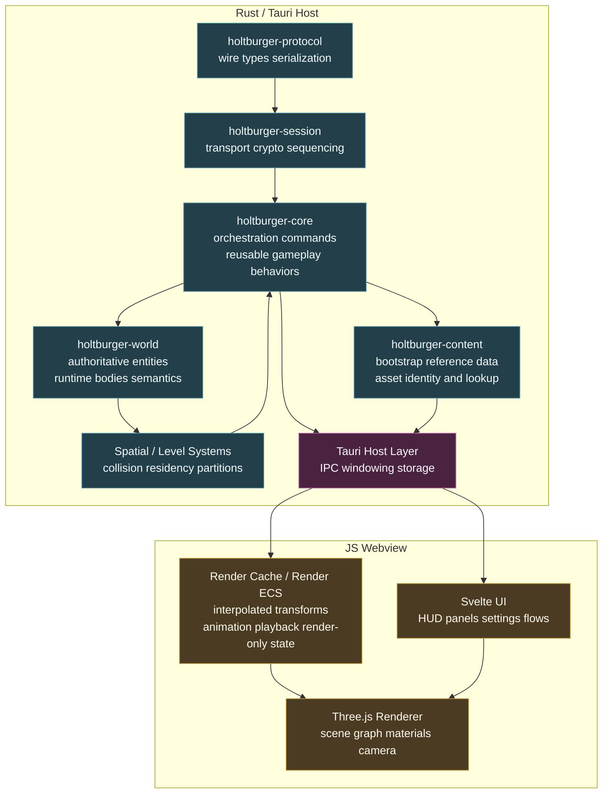
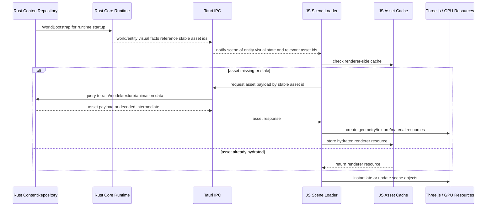
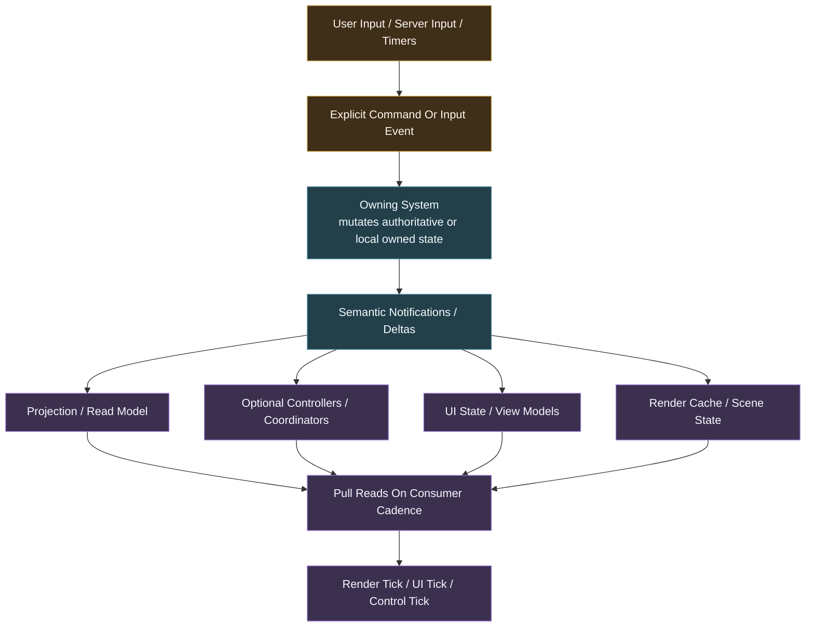

# Holtburger 3D Client Scoping Plan

## Context And Boundaries

### Goal
Define the initial architectural scope for `holtburger-3d` so the first implementation can start without smuggling renderer-specific authority into shared crates or forcing Rust to own presentation details that belong in the frontend.

### In Scope
- Define the recommended ownership split between Rust and the Tauri web frontend.
- Identify the minimum shared contracts `holtburger-3d` needs from `holtburger-core`, `holtburger-world`, and `holtburger-content`.
- Define the render/runtime data-flow shape for authoritative 30 Hz simulation plus higher-frequency visual interpolation.
- Identify the main technical risks and the seams that must stay explicit.

### Out Of Scope
- Building the actual `holtburger-3d` workspace crate or app shell in this pass.
- Finalizing the exact render engine architecture beyond the initial Three.js-based direction.
- Designing the final animation graph, skeletal runtime, or material pipeline.
- Solving the complete long-term asset streaming and cache eviction story.
- Reworking unrelated TUI architecture unless a shared seam must move first.

## Ground Truth And Existing Architectural Hints

The repo already contains important constraints for a future 3D client, but they are spread across several docs rather than captured in one dedicated scope document.

### Existing Sources
- [ARCHITECTURE.md](/home/cluracan/code/holtburger/ARCHITECTURE.md)
- [README.md](/home/cluracan/code/holtburger/README.md)
- [apps/holtburger-cli/ARCHITECTURE.md](/home/cluracan/code/holtburger/apps/holtburger-cli/ARCHITECTURE.md)
- [crates/holtburger-core/ARCHITECTURE.md](/home/cluracan/code/holtburger/crates/holtburger-core/ARCHITECTURE.md)
- [docs/reference_data_and_asset_delivery.md](/home/cluracan/code/holtburger/docs/reference_data_and_asset_delivery.md)
- [docs/plans/CLI_REORG_PLAN.md](/home/cluracan/code/holtburger/docs/plans/CLI_REORG_PLAN.md)
- [docs/plans/content-pipeline-runtime-snapshot-plan.md](/home/cluracan/code/holtburger/docs/plans/content-pipeline-runtime-snapshot-plan.md)
- [docs/plans/projection-lifecycle-hardening-plan.md](/home/cluracan/code/holtburger/docs/plans/projection-lifecycle-hardening-plan.md)
- [docs/plans/thin-client-spatial-assist-seam-working-doc.md](/home/cluracan/code/holtburger/docs/plans/thin-client-spatial-assist-seam-working-doc.md)
- [docs/plans/micro-hba-and-world-collision-plan.md](/home/cluracan/code/holtburger/docs/plans/micro-hba-and-world-collision-plan.md)

### What Those Docs Already Establish
- The TUI is a proving ground, not the target architecture.
- `holtburger-world` should remain the authority for hydrated entity state and canonical runtime body state.
- `holtburger-core` should remain the orchestrator for protocol handling, movement execution, and reusable gameplay behaviors.
- Frontends may keep mirrored read caches and local projection state, but they must not become a second advancing authority.
- Static reference data and heavy asset delivery are distinct concerns and should not be modeled as one big `ClientViewEvent` bootstrap.
- A future 3D client is expected to need an honest spatial/physics seam, not TUI-shaped hacks baked into shared runtime code.

### TUI Lessons Worth Carrying Forward
- The TUI architecture eventually converged on explicit reducer entrypoints and event-driven boundaries because direct mutator paths and ad hoc coordination made behavior harder to reason about.
- The CLI reorg work explicitly calls out the cognitive load of tracing one user action through too many imperative proxy layers.
- The projection hardening work explicitly calls out bugs caused by mixing authoritative ingest with partial derivation and by relying on event-order side effects.

The 3D client should treat those as architectural lessons, not just cleanup notes for the TUI.

### Gap This Plan Fills
There is currently no dedicated document that answers the practical question: "what should `holtburger-3d` own versus what should Rust continue to own?"

## Recommendation Summary

The proposed split is broadly sound.

Recommended high-level direction:

- Rust owns protocol/session, authoritative world state, reusable gameplay logic, client-side authoritative local simulation, content bootstrap, asset addressing, collision, and level/runtime spatial systems.
- Tauri Rust owns the host process, windowing shell, IPC surface, local storage integration, and any native-side asset/file access that should not be reimplemented in JavaScript.
- JavaScript owns rendering, presentation-time interpolation, camera behavior, input-to-intent translation, UI, render-only scene state, and raw asset interpretation for rendering.

The central architectural theme should be eventual consistency.

That means:

- systems communicate through abstract events, notifications, queries, and explicit commands rather than reaching into one another's mutable internals
- most consumers react to state changes on their own cadence instead of demanding same-stack immediate mutation everywhere
- derivation should be single-sourced inside the owning system instead of partially recomputed by whichever event handler happened to fire
- "fast enough and coherent" is the default target, not "synchronously updated in every layer before returning"

That fits games well. Most user-visible behavior does not need to resolve instantly in the same call stack. It needs to become coherent quickly, predictably, and through well-owned boundaries.

The main correction is terminology and discipline around the proposed JavaScript "shadowed ECS":

- good: a render-scene cache or render ECS that mirrors authoritative state and derives interpolated poses, animation selections, visibility groups, and UI-friendly view models
- bad: a second gameplay ECS that independently advances authoritative transforms, collision, combat semantics, or interaction truth

So yes, this design passes the vibe check, but only if the JavaScript side is treated as presentation authority rather than gameplay authority.

## Eventual Consistency As A Design Principle

`holtburger-3d` should bias toward notification-driven eventual consistency on both the Rust and JS sides.

Concretely:

- authoritative systems ingest inputs, update owned state, and emit semantic notifications
- dependent systems observe those notifications and reconcile their own local models
- render and UI systems consume snapshots and deltas, then derive presentation state on their own cadence
- cross-system coordination should prefer explicit messages such as "target changed", "runtime body updated", or "inventory projection invalidated" over direct imperative calls such as "also update these three other subsystems right now"

This does not mean everything becomes a giant event soup.

It means each subsystem should have:

- one owned state model
- a small input vocabulary
- a small output vocabulary
- a clear rule for what is authoritative, what is mirrored, and what is derived

The design smell to avoid is imperative abstraction leakage, where one subsystem knows too much about how another must update itself internally.

## Major Subsystems

This does not need to be exhaustive yet. The important thing is to identify the major subsystems early enough that they set precedent for the rest of the client.

Each major subsystem should be able to answer a few simple questions:

- what state does it own?
- what inputs does it accept?
- what outputs or notifications does it emit?
- what other subsystems is it allowed to query directly?
- what state is authoritative, mirrored, or purely derived?

If a subsystem cannot answer those questions cleanly, it is usually a sign that the boundary is still too muddy.

### Existing Rust Foundations

A lot of the Rust-side "subsystems" are already intentionally defined by the workspace crate boundaries and should not be reinvented in this doc.

Those existing foundations are already doing real architectural work:

- `holtburger-session` for transport and crypto
- `holtburger-protocol` for wire types and serialization
- `holtburger-world` for authoritative world state
- `holtburger-core` for orchestration, movement execution, and reusable client behavior
- `holtburger-content` for bootstrap and asset identity or lookup

So the more useful question for `holtburger-3d` is not "what are all the Rust subsystems?" but rather "what new seams or boundary-owning systems does the 3D client introduce on top of the existing crates?"

### Rust-Side 3D-Specific Seams

#### 1. Spatial And Level Runtime
- Owns: landblock or cell residency, collision or query structures, level streaming authority, spatial query answers that must remain engine-owned
- Inputs: authoritative world changes, regular camera-position hints from the frontend, movement or collision queries, scene residency updates
- Outputs: residency notifications, spatial query responses, collision or constraint results, level-availability state
- Direct queries allowed: content repository and world authority
- Should not own: render culling policy or purely visual scene layout

This is one of the first genuinely 3D-specific Rust seams, and it sets the precedent that honest spatial answers come from one place. Camera position should normally flow from JS to Rust because AC's visibility behavior and camera collision can depend on it, but that still does not make Rust the owner of rendering policy.

#### 2. Runtime Projection And Semantic Event Surface
- Owns: authoritative snapshots, deltas, semantic notifications, runtime-body read models derived from world-owned authority
- Inputs: `WorldEvent`s, protocol-side outcomes, simulation outputs, lifecycle events
- Outputs: runtime-channel notifications for frontend consumers
- Direct queries allowed: world authority and content or reference surfaces as needed for semantic projection
- Should not own: frontend cache policy, renderer interpolation, UI orchestration, or renderer-specific interpretation of authoritative state

This seam matters because the 3D client should consume a coherent authoritative surface instead of reaching directly into world internals just because rendering got richer. Rust should publish what is true about the world; JS should decide how to render it.

#### 3. Host Boundary And IPC Layer
- Owns: Tauri commands, event dispatch, serialization across the Rust or JS boundary, persistence hooks, shell integration
- Inputs: JS commands, JS asset requests, JS authority-sensitive queries, runtime notifications from Rust systems
- Outputs: JS-facing notifications, query responses, asset responses, host capability events
- Direct queries allowed: runtime and content systems through explicit typed interfaces
- Should not own: gameplay logic, renderer resource state, UI policy

This is a real subsystem in `holtburger-3d`, not just glue. It sets the precedent for typed, narrow, event-oriented boundary contracts.

#### 4. Locomotion And Simulation Adoption Seam
- Owns: the 3D client's usage contract for existing movement, prediction, reconciliation, and local-simulation systems that already live primarily in `holtburger-core` and `holtburger-world`
- Inputs: frontend locomotion intent, world state queries, authoritative corrections from the server, spatial-query answers
- Outputs: movement commands, movement-related notifications, local-player control intents, and any 3D-client-specific adapter state needed to drive the existing runtime cleanly
- Direct queries allowed: world authority, spatial or collision systems, and the existing core movement surfaces
- Should not own: a second simulation stack, duplicate reconciliation logic, or frontend movement UX policy beyond the explicit intent-adapter seam

This is not meant to imply that `holtburger-3d` invents a brand new movement subsystem. A lot of the real machinery already belongs to `holtburger-core` and `holtburger-world`. The important design question here is the 3D client's adoption seam: how frontend locomotion intent, richer camera-relative controls, and local interaction patterns cross into the existing primitive movement and simulation surfaces without creating a parallel movement architecture in the frontend.

#### 5. Content And Asset Service
- Owns: archive mounting, namespace lookup, bootstrap assembly, stable asset identity, typed content queries
- Inputs: startup config, asset queries, bootstrap requests, optional invalidation or patch signals later
- Outputs: `WorldBootstrap`, reference-data responses, asset payloads or decoded intermediates, content lookup errors
- Direct queries allowed: DAT or HBA sources only
- Should not own: renderer-specific caches, Three.js resource lifetimes, scene-instantiation policy

This is an existing crate boundary, but for `holtburger-3d` it becomes a major consumer-facing seam because asset identity, bootstrap, and asset queries all cross into the frontend architecture.

### JavaScript-Side Major Subsystems

#### 1. UI Shell
- Owns: Svelte app state, top-level page or route state, HUDs, menus, modal flows, settings surfaces, user-facing workflow state
- Inputs: runtime notifications, user input, query responses, asset-status notifications as needed
- Outputs: commands, settings updates, UI-local notifications
- Direct queries allowed: runtime channel and narrow authority-sensitive queries
- Should not own: gameplay truth or renderer internals beyond presentation needs

This subsystem sets the precedent that UI state is frontend-owned but not gameplay-authoritative.

That includes a page model similar to the TUI, but it does not have to start with the TUI's user flow. A 3D client can expose explicit frontend modes such as browser mode and client mode, with each mode hosting its own page stack or route set. Browser mode can focus on free world navigation from an initial coordinate, while client mode can eventually host login, character selection, reconnect, and in-world gameplay. The important boundary rule is that these modes and pages are app-shell navigation state, not authoritative gameplay state. Rust can publish authoritative session and client lifecycle facts such as "disconnected", "account authenticated", "character roster ready", "entering world", or "in world"; the frontend shell can map those facts, together with frontend-local workflow state, into the currently active mode, page, or route.

This is compatible with the eventual-consistency model as long as page or mode transitions are driven by semantic notifications and frontend policy instead of imperative cross-boundary view control. Rust should not tell Svelte which page component to mount. Rust should expose typed lifecycle and session state; the frontend should decide which mode and page the user is currently in.

#### 2. Frontend Game State / View Model Store
- Owns: frontend-owned mirrored game state needed by UI and interaction flows, such as combat status, target state, fellowship summaries, inventory view models, interaction affordances, busy state, modal-driving game context, and other semantics the UI needs to render coherently
- Inputs: runtime-channel semantic notifications, authority-sensitive query responses, local UI actions that affect presentation-only mode, and bounded local timers where the frontend is allowed to derive display state
- Outputs: stable UI-facing view models, invalidation notifications for UI components, and read models consumed by both the UI shell and interaction mapping
- Direct queries allowed: runtime-channel caches, narrow authoritative query endpoints, and frontend-local presentation state
- Should not own: authoritative gameplay truth, raw protocol handling, renderer resource state, or a second simulation model

This is the missing JS-side home for questions like "should the combat HUD be visible right now?" The answer should generally live in a frontend game-state or view-model store that subscribes to semantic runtime notifications and maintains UI-facing projected state. In other words: Rust says what happened in gameplay terms; the frontend store keeps the mirrored state that lets Svelte render the right interface.

Examples of state that plausibly lives here:

- current combat mode and combat engagement status
- selected or hovered target summaries
- current interaction mode or pending action context
- inventory, vendor, or trade presentation state
- fellowship or chat summaries used by HUD elements
- error, busy, or confirmation state that is derived from runtime notifications but owned by the frontend UX

#### 3. Render Scene Runtime
- Owns: Three.js scene graph, cameras, lights, visible scene object lifetime, renderer frame loop
- Inputs: render cache state, asset hydration results, viewport changes, UI or input hints that affect presentation
- Outputs: frame rendering, presentational picks, render metrics, optional render-driven requests
- Direct queries allowed: render cache and renderer-owned resource registries
- Should not own: authoritative entity truth or asset identity policy

This subsystem sets the precedent that the renderer is a consumer of prepared data, not the source of game truth.

#### 4. Render Cache Or Render ECS
- Owns: mirrored runtime entity state needed for presentation, interpolated transforms, animation playback state, visibility buckets, selection or hover presentation
- Inputs: runtime-channel deltas, local presentation timers, asset availability changes
- Outputs: render-ready read models, cache invalidation notifications, derived presentational state
- Direct queries allowed: runtime snapshots and asset availability state
- Should not own: combat semantics, collision truth, inventory authority, or direct server protocol concerns

This subsystem sets the precedent that mirrored state is read-optimized and disposable, not authoritative.

#### 5. Asset Worker
- Owns: asset fetch scheduling, worker-side decode or transform steps, intermediate caches, queue prioritization
- Inputs: asset requests from scene or cache systems, asset responses from Rust, cache budget signals
- Outputs: prepared asset data, hydration-ready intermediates, asset-status notifications
- Direct queries allowed: dedicated asset channel only
- Should not own: live Three.js scene objects unless the entire renderer moves into a worker

This subsystem sets the precedent that asset preparation is separate from renderer ownership.

#### 6. Input And Interaction Mapping
- Owns: browser input capture, gesture interpretation, camera-relative input translation, intent compilation, local hover or preselection behavior
- Inputs: DOM events, renderer hit-test hints, runtime notifications that affect allowed actions
- Outputs: explicit commands, authority-sensitive queries, UI-local notifications
- Direct queries allowed: runtime channel and authoritative query endpoints
- Should not own: simulation or gameplay side effects directly

This subsystem sets the precedent that input becomes explicit intent before it crosses the boundary.

### Where New Precedent Actually Matters

The strongest precedent-setting areas for `holtburger-3d` are probably these:

- the Rust or JS host boundary and its channel split
- the runtime projection surface consumed by the frontend
- the JS render cache versus renderer split
- the asset worker versus renderer ownership split
- the input or interaction mapping seam for commands and authority-sensitive queries

Those are the places where the 3D client is most likely to accidentally create abstraction leakage if we are not explicit.

## Subsystem Pattern To Repeat

When we introduce new systems later, they should generally follow the same declaration pattern.

Recommended template:

```text
Subsystem: <name>
Owns:
Inputs:
Outputs:
Direct queries allowed:
Authoritative vs mirrored vs derived:
Must not own:
```

That may look a little bureaucratic, but it is cheap insurance against the exact problems the TUI taught us: hidden mutator paths, mixed ownership, and event-order-dependent spaghetti.

## Illustrative Precedence

If we get the major subsystems above right, they establish a few healthy precedents for the rest of the client:

- systems own state instead of sharing mutable grab-bags
- commands and notifications are typed around domain meaning rather than generic effect enums
- projection, cache, and UI layers are allowed to be eventually consistent without becoming second authorities
- the host boundary is explicit and testable rather than a magical reach-through layer
- asset lookup, asset preparation, and renderer ownership are split cleanly enough that we can evolve performance strategy later without rewriting the entire client

## Architecture Diagrams

### 1. Ownership And Responsibility Map



### 2. Authoritative Runtime And Render Loop

```mermaid
sequenceDiagram
  participant Srv as Server
  participant Sess as Session
  participant Core as Core Runtime
  participant World as World State
  participant Host as Tauri IPC
  participant Cache as JS Render Cache
  participant Render as Three.js Frame Loop

  rect rgb(31, 49, 58)
    Srv->>Sess: encrypted packets
    Sess->>Core: decoded payload bytes
    Core->>World: authoritative mutations\nmovement execution\nserver reconciliation
    World-->>Core: world events\nruntime-body snapshots/deltas
    Core-->>Host: batched semantic deltas\nbatched runtime-body deltas
  end

  rect rgb(61, 49, 28)
    Host-->>Cache: apply latest authoritative samples
    loop browser frames
      Render->>Cache: read latest two samples
      Cache-->>Render: interpolated transforms\nrender-only animation state
      Render->>Render: draw scene + UI overlays
    end
  end

  Note over Cache,Render: JS may smooth and interpolate for presentation only.
  Note over World,Core: Rust remains authority for gameplay and solved simulation.
```



### 3. Asset And Scene Data Flow



This flow is demand-driven. Rust should not precociously push heavy assets into the JS runtime just because they exist or because an entity update referenced them.

The default rule should be:

- push semantic state
- pull heavy assets

Instead:

1. Rust publishes semantic world/entity visual facts that reference stable asset IDs.
2. JS decides which referenced assets are needed for the current scene, camera, cache state, and quality policy.
3. JS requests missing asset payloads from Rust by ID.
4. Rust answers the request from `ContentRepository`.
5. JS hydrates the response into renderer-native GPU resources.

There may eventually be narrow preload or prefetch paths, but those should be explicit optimizations layered on top of this model, not the baseline architecture.

This same architecture should support both major loading modes the client needs:

- bootstrap burst loading: entering the world, teleporting, or any other hard scene transition where JS rapidly requests a large set of assets for the new authoritative area or scene state
- steady-state streaming: incremental asset fetches while moving through the world or when new entity types, visual states, or nearby content become relevant

Those are not two different systems. They are two request policies over the same asset channel.

Recommended framing:

- the semantic runtime channel tells JS what world state, residency, and visual facts changed
- the asset channel lets JS choose whether to respond with a bulk fetch wave or a small incremental fetch
- the worker and cache layers absorb most of the difference between those two modes

That is a strong fit for AC. A teleport or login can trigger a bursty catch-up wave without changing the architecture, while normal traversal can remain demand-driven and incremental.

In this split, JavaScript should own the final render-side asset hydration step: turning decoded or queryable asset payloads into Three.js objects, GPU buffers, textures, materials, and scene-ready resources.

A good refinement of this design is to let the asset channel feed a dedicated JS asset worker.

Recommended split inside the JS side:

- asset worker: request asset payloads from Rust, decode or transform data, transcode textures, build CPU-side intermediate structures, manage asset-fetch concurrency, and maintain a worker-side content cache
- main thread or render thread: create final Three.js resources, perform GPU upload, instantiate scene objects, and coordinate with the visible renderer loop

That worker layer is also the natural place to implement different loading policies:

- high-priority burst queues for login, teleport, and hard scene transitions
- normal streaming queues for traversal and newly relevant spawns
- prefetch queues for likely-near-future assets when the cache budget allows

That usually gives the best tradeoff:

- expensive CPU-side asset preparation does not stall the main UI or render loop
- the final renderer-facing step still happens where the graphics context and scene ownership naturally live

So yes, feeding the asset channel into a worker is a good design.

The main caveat is terminology: if by "asset hydration" we mean all CPU-side preparation before GPU upload, that can absolutely live in a worker. If we mean the literal creation of live GPU-backed renderer resources, that often still belongs on the main thread unless we deliberately move the whole renderer into a worker.

It is therefore important not to overstate what a plain asset worker can do.

### Worker-Owned Asset Preparation vs Worker-Owned Renderer Resources

A normal web worker can absolutely:

- request asset payloads from Rust
- parse, decode, transform, or transcode them
- build CPU-side intermediate data structures
- maintain worker-local caches of decoded asset data

A normal web worker should usually not be treated as the owner of live Three.js renderer resources in the ordinary main-thread-renderer architecture.

Why:

- Three.js objects that are bound to a live renderer and graphics context naturally belong with that renderer
- GPU resource creation is tightly coupled to the owning WebGL or WebGPU context
- scene mutation and renderer resource lifetime become awkward if the asset worker "owns" objects that the main-thread renderer must actually consume and destroy

So in the default design, the worker prepares data and the renderer owns live Three.js resources.

There is one important exception: if we intentionally run the renderer itself inside a worker using `OffscreenCanvas`, then that worker can own Three.js resources because it also owns the rendering context and scene loop.

That is a valid architecture, but it is a different architecture.

The distinction is:

- asset worker architecture: worker prepares data, renderer thread owns live Three.js objects
- render worker architecture: worker owns renderer, scene, and live Three.js resources

That leads to two reasonable frontend designs:

- default recommendation: worker for asset IO, decode, transform, and pre-hydration; main thread for final Three.js resource creation and scene attachment
- more aggressive option: a render worker owning an `OffscreenCanvas`, where both scene management and GPU resource creation move off the UI thread

The second option can be great, but it is a higher-complexity choice and depends on the webview's support and ergonomics. It is probably not the first architecture to lock in unless profiling proves the main-thread renderer model is insufficient.

Rust should still own:

- asset identity
- archive mounting and lookup
- bootstrap-time content policy
- any decode or preprocessing work we choose to centralize for correctness or performance
- lightweight metadata and semantic notifications that tell JS what kinds of assets might be relevant

JavaScript should own:

- creation of renderer-native resources
- GPU upload timing
- residency and eviction in the webview render runtime
- deciding which referenced assets are actually worth hydrating for the current frame, scene, and cache state
- scene-instantiation details specific to Three.js

Recommended internal split on the JS side:

- worker-owned CPU asset preparation
- renderer-owned final GPU resource creation

That keeps shared crates renderer-agnostic while letting the frontend control the last mile into GPU state.

### 4. Notification-Driven Consistency Model



## Proposed Ownership Split

### 1. Rust-Owned Systems

These systems should stay in Rust because they either define authority, require tight coupling to the existing stack, or need to remain reusable across multiple frontends.

- `holtburger-session`: transport, sequencing, crypto, fragmentation, reconnect semantics
- `holtburger-protocol`: deterministic message encoding and decoding
- `holtburger-world`: authoritative entity graph, retention, gameplay semantics, canonical runtime body state
- `holtburger-core`: orchestration, command execution, reusable controllers, protocol-to-world handling, runtime event projection
- content pipeline: HBA mounting, bootstrap assembly, reference-data access, asset identity and lookup
- authoritative local simulation: player motion integration, contact state, collision response, server reconciliation, forced movement handling
- level systems: landblock or cell residency, spatial partitions, collision geometry ownership, future visibility or streaming source-of-truth
- Tauri host concerns: shell lifecycle, native menus, file dialogs, settings persistence, installer-facing integration

Why this belongs in Rust:

- It preserves one authoritative simulation and one authoritative interpretation of gameplay semantics.
- It keeps the 3D client on the same foundation as the TUI, harnesses, and tools.
- It avoids duplicating protocol and world logic in a slower-moving JS mirror that will inevitably drift.

### 2. JavaScript-Owned Systems

These systems are frontend-shaped and should stay in the webview layer.

- Three.js world rendering
- scene graph assembly from frontend-facing runtime snapshots and content queries
- presentation-time interpolation and extrapolation between authoritative simulation ticks
- animation playback selection and blend policy at the render layer, so long as gameplay semantics remain Rust-owned
- camera control, picking presentation, local highlight state, and diegetic UX behavior
- Svelte UI, HUDs, panels, inventory presentation, modal flows, settings UX, macro or script panels
- input mapping from browser or window events into frontend intents that are then sent to Rust as explicit commands
- render-only ECS or scene cache for meshes, materials, interpolated transforms, animation state, billboard state, and visibility buckets

Why this belongs in JavaScript:

- Render and UI iteration will be much faster there.
- The expected on-screen entity counts for AC are modest, so modern JS rendering is plausibly sufficient for the first serious client.
- Presentation systems naturally want `requestAnimationFrame` cadence, DOM integration, and GPU-adjacent scene management that do not map cleanly onto the Rust engine crates.

### 3. Shared Boundary Rules

The Rust/JS seam should be explicit about what may and may not cross it.

Rust should publish:

- authoritative world snapshots and deltas
- canonical runtime-body snapshots and deltas for entities the frontend is rendering
- semantic gameplay events
- command/query surfaces for interaction, movement, targeting, and reference-data lookup
- stable asset identifiers and lookup handles rather than raw renderer-owned objects

JavaScript should publish back to Rust:

- input intents
- frontend-only settings changes
- optional viewport or streaming hints such as current camera region, interest radius, or visible landblocks
- render-driven queries such as picking requests, if the engine needs them resolved authoritatively

JavaScript should not publish back to Rust as authoritative facts:

- solved collision
- final combat-state interpretations
- authoritative transforms for replicated entities
- authoritative grounded or contact state for general gameplay semantics

The narrow exception is local-player prediction hints where Rust explicitly defines a seam for them. Even then, Rust remains the owner of the final solved result.

One more rule matters here: boundary traffic should prefer semantic notifications over imperative cross-layer calls. If the JS side needs to know that targeting, motion, or interaction state changed, Rust should publish a clear event or delta. The JS side should then reconcile its own cache and UI state instead of expecting Rust to choreograph frontend internals.

The boundary is therefore bidirectional, but asymmetric:

- Rust to JS is mostly notifications, snapshots, deltas, and query responses.
- JS to Rust is mostly commands, intent messages, hints, and authority-sensitive queries.

That asymmetry is important. The frontend may ask questions of Rust, but it should not drive Rust by reaching into engine-owned state.

It also suggests at least two logical channels across the boundary:

- a runtime channel for semantic notifications, commands, snapshots, deltas, and authority-sensitive query responses
- an asset channel for demand-driven asset requests, payload responses, cache invalidation, and optional prefetch hints

These do not necessarily need separate low-level transports on day one. A single Tauri IPC mechanism can still carry both. But architecturally they should be treated as separate channels with different traffic shape, batching, backpressure, and observability.

## Runtime Model

### 1. Two Clocks

The first `holtburger-3d` implementation should assume two cadences:

- authoritative Rust simulation at 30 Hz
- JavaScript rendering at browser cadence, typically 60 to 144 Hz

That is a good fit for AC. The simulation does not need to run at render frequency, and the renderer should not block on simulation ticks.

Recommended model:

1. Rust advances authoritative world and local simulation on its fixed cadence.
2. Rust emits compact snapshots and deltas tagged with simulation time.
3. JavaScript stores the latest authoritative samples in a render cache.
4. JavaScript interpolates visible entities between the last two authoritative samples.
5. When interpolation is impossible, JavaScript falls back to hold-last-sample or tightly bounded extrapolation for presentation only.

This preserves responsiveness without turning the frontend into a hidden simulation owner.

It also aligns with the broader eventual-consistency theme: simulation, projection, UI, and rendering do not all need to settle in one synchronous stack frame. They need explicit inputs, explicit outputs, and bounded convergence.

Some interactions will still require request-response messaging across the boundary. That is fine. Eventual consistency is not a ban on queries. It is a warning against turning every subsystem boundary into direct imperative orchestration.

### 2. Render Cache, Not Mirror Authority

The JavaScript "shadow ECS" should be deliberately scoped as a render cache.

That cache may own:

- interpolated transforms
- animation playback time
- material state
- local culling membership
- nameplate and UI attachment state
- selection and hover state
- client-only ephemeral VFX state

That cache should not own:

- collision truth
- authoritative locomotion advancement
- combat-target validity
- inventory or trade authority
- death or action semantics derived independently from raw packets

If a system needs to answer a gameplay question that must stay consistent across TUI, tools, and 3D, the answer belongs in Rust.

This is also where eventual consistency must stay disciplined. The JS cache can be stale for a frame or two; it cannot become independently authoritative.

### 3. Level And Asset Flow

The current architecture already points toward a split where `holtburger-content` owns content discovery and typed lookup while frontends consume query surfaces.

The first 3D-client scope should assume:

- Rust owns archive mounting and asset identity.
- Rust exposes queryable raw or lightly decoded payload access for terrain, models, textures, animations, and other concrete render asset inputs.
- JavaScript requests the assets it needs for the current scene and interprets those payloads into Three.js resources.
- caching, GPU upload, and scene residency policy initially live in JavaScript, with room to move selected decode work to Rust later if profiling justifies it.

Important non-goal for the first cut:

- do not force the entire render asset runtime through `ClientViewEvent`

Heavy assets are demand-driven, not broadcast-driven.

That is a good reason to keep the asset path logically separate from the general semantic runtime bus. Asset traffic is larger, burstier, more cache-oriented, and more request-response shaped than gameplay or projection deltas.

"Demand-driven" here should not be read too narrowly as "one asset at a time." A bulk scene load is still demand-driven if JS is issuing the requests because the scene state, residency rules, or transition policy says those assets are now needed.

## Suggested Initial Architecture

### 1. Process Layout

Recommended first implementation:

- one Tauri app named `holtburger-3d`
- Rust side embeds or links the existing engine crates
- Svelte UI and Three.js renderer run in the Tauri webview
- the frontend subscribes to batched runtime deltas plus explicit content-query APIs

Conceptually:

```text
Rust engine/runtime
  -> session/protocol/world/core/content
  -> authoritative 30 Hz simulation
  -> event + query surface

Tauri boundary
  -> typed IPC commands
  -> batched delta delivery
  -> async content requests

JS frontend
  -> Svelte app shell
  -> Three.js scene runtime
  -> render cache / presentation ECS
  -> camera/input/UI
```

Messaging shape at a high level:

- Rust publishes subscribed world, runtime-body, and semantic deltas.
- JS sends explicit commands such as movement intent, interaction intent, regular camera-position hints, and selection requests.
- JS may also issue authority-sensitive queries that need Rust-owned answers.

Recommended channel split at the architecture level:

- runtime channel: semantic notifications, commands, world deltas, runtime-body deltas, control/query responses, and camera-position hints from JS
- asset channel: asset fetch requests, asset payload responses, decode-status responses, optional prefetch or invalidation notices

Even if both channels are multiplexed through the same IPC implementation at first, the code should avoid collapsing them into one generic "message bus" type.

### 2. Minimal Frontend Contracts

`holtburger-3d` should not wait for a perfect long-term API before starting. It needs a minimal contract that is honest about ownership.

### Contract A: Runtime Entity Feed
- spawn, despawn, authoritative transform snapshots, velocity or motion updates, stable visual asset references, basic interaction flags, and other authoritative game-state facts that let the frontend derive presentation and choose concrete asset requests

### Contract B: Local Player Feed
- authoritative local-player transform, movement mode, action or combat state, forced movement, corrected position, interaction affordances

### Contract C: Static Reference Data Queries
- spell metadata, item or weenie metadata, icon lookup, names, presentation descriptions

### Contract D: Heavy Asset Queries
- raw or lightly decoded models, textures, animation clips, terrain or level chunks, and other concrete render asset payloads chosen by the frontend from authoritative runtime facts

This contract should ride a dedicated logical asset channel, not the same semantics-first path used for world and runtime deltas.

It should support both:

- bulk requests or batched fetch waves for scene bootstrap and teleport catch-up
- incremental requests for ordinary streaming

### Contract E: Input Commands
- movement intent, use, attack, interact, target selection, character actions, settings or UI-driven commands

### Contract F: Authority-Sensitive Queries
- ray-pick resolution against engine-owned spatial state

If those six contracts exist cleanly, the 3D client can start before the full render stack is finalized.

That is really six contracts now, and this new one matters. A 3D frontend will inevitably need some bidirectional request-response seams, but the first cut should keep them very small.

The key rule is that these should be named queries, not arbitrary reach-through into Rust internals.

Examples:

- JS performs screen-space ray construction and asks Rust to resolve the authoritative hit against engine-owned spatial data.
- Rust answers with a typed result or rejection, and JS updates its local presentation state.

That is a healthy boundary.

## Architecture Constraints

These are the constraints worth preserving before we talk about implementation order.

- The frontend can own interpolation, but not solved gameplay truth.
- The renderer can own asset residency and GPU upload policy, but not asset identity or bootstrap policy.
- Rust should publish authoritative world and motion state, not renderer-specific interpretation of that state.
- The Tauri boundary should carry batched deltas and query responses, not thousands of tiny per-entity IPC calls.
- If a gameplay answer must stay consistent across TUI, tools, and 3D, it belongs on the Rust side.
- Systems should expose small event or notification vocabularies instead of broad imperative mutator surfaces.
- Event ingestion and state derivation should be separated where possible so event-order side effects do not become hidden architecture.
- Read models, projections, UI state, and render state are allowed to converge eventually; they do not need same-stack synchronous mutation.
- Prefer no same-turn reads unless a future concrete problem proves they are necessary.
- GPU resource hydration should stay frontend-owned, and the first heavy-asset decode path should default to JS unless profiling proves a specific decode path belongs in Rust.
- Bidirectional messaging should exist by design, but query and command vocabularies must stay typed and narrow.

## Risks And Mitigations

### Risk: The JS Side Becomes A Second Game Client

If the frontend starts solving gameplay semantics on its own, the codebase will drift into two clients that happen to share a transport layer.

Mitigation:
- Keep the JS state model presentation-only.
- Add missing Rust-owned semantics instead of re-deriving them in the frontend.

### Risk: Tauri IPC Becomes The Bottleneck

Per-entity chatty events can drown the boundary if every small update becomes a separate IPC call.

Mitigation:
- batch deltas
- prefer compact typed payloads over ad hoc command spam
- profile early once a walkaround scene exists

### Risk: Asset Delivery Gets Confused With View Projection

Trying to ship models, textures, and terrain through the same path as semantic world events will produce a bad API and a slow renderer.

Mitigation:
- keep semantic events and asset queries as separate contracts from day one

### Risk: Shared Crates Become Renderer-Shaped

If Rust abstractions are designed around Three.js or Svelte terminology, the shared stack will get harder to reuse.

Mitigation:
- shared crates publish engine or domain concepts
- `holtburger-3d` owns renderer-specific adapters

## Current Recommendations

- Let JS handle raw or lightly decoded asset payloads by default. The client data formats are generally simple enough that the first heavy-asset decode path should live primarily in JS.
- Do not let Rust decide what is render-facing. Rust should publish authoritative world state, motion state, semantic notifications, stable asset identity, and raw asset data; JS should decide how to turn that into rendering.
- Keep residency fundamentally Rust-authoritative, but send regular camera-position hints from JS to Rust so visibility, PVS-shaped level behavior, and camera collision can use the real camera position when needed.
- Let JS infer as much animation behavior as it can from authoritative poses, motion commands, and semantic state rather than introducing a large shared animation contract early.
- Start with exactly two logical channels across the boundary: an asset channel and a runtime channel. If later evidence justifies a split inside the runtime channel, we can add it then.
- Prefer no same-turn reads if we can help it. The architecture should default to eventual consistency rather than relying on immediate cross-boundary reads.
- Use one global freshness budget at first rather than many per-subsystem budgets. If real problems show up later, we can specialize.
- Keep the first-cut authority-sensitive query list very small. Ray-pick resolution is the clearest initial candidate.

## Phased Implementation Plan

### Implementation Goal

Produce a runnable `holtburger-3d` app that establishes the architecture, ownership model, and cross-boundary patterns described in this document without trying to ship a feature-complete client.

The first implementation should prove that:

- the Rust crates can feed a 3D-oriented frontend without becoming renderer-shaped
- the Tauri boundary can carry the initial runtime and asset contracts cleanly
- the frontend can own pages, view models, render-side caches, and asset hydration without becoming a second gameplay authority
- a browser-mode-first flow can exercise the world display, asset pipeline, and spatial seams before the full client flow exists
- browser mode and client mode can share the same world display foundation instead of forking the renderer architecture early
- the project has a concrete app location and build shape that can absorb future iteration

### Foundation Scope

#### In Scope For The First Runnable App

- a new `holtburger-3d` app shell in the workspace
- a Rust Tauri host that can start, expose typed commands or events, and bridge to existing Holtburger crates
- a Svelte frontend written in TypeScript that can boot, own top-level mode state plus nested page or route state, and render placeholder application surfaces
- a browser mode that can load an initial coordinate and freely navigate landblocks or dungeons
- a shared `WorldDisplay` foundation that both browser mode and future client mode can consume
- an initial runtime channel carrying typed lifecycle state plus a small authoritative runtime feed
- an initial asset channel carrying demand-driven asset lookup requests and responses
- a world-facing shell surface that proves the in-world app shape even if the world is only represented by placeholders, debug panels, or a minimal camera or canvas surface
- enough end-to-end flow to reveal awkward seams in `holtburger-core`, `holtburger-world`, `holtburger-content`, and the host boundary

#### Out Of Scope For The First Runnable App

- a functional login experience
- a functional gameplay loop backed by live session wiring
- full world rendering, terrain streaming, or realistic scene composition
- polished UI, production HUD design, or final UX flows
- a full animation graph, final camera model, or final input system
- a complete asset cache, eviction, or streaming solution
- parity with the TUI feature surface

### Recommended Project Layout

The JS app should live with the app that owns it rather than in a separate top-level frontend folder.

Recommended layout:

```text
apps/
  holtburger-3d/
    package.json
    tsconfig.json
    vite.config.ts
    svelte.config.js
    src/
      app/
      pages/
      lib/
      workers/
    src-tauri/
      Cargo.toml
      src/
```

Notes:

- `apps/holtburger-3d/src-tauri` should be the Rust workspace member added to the root [Cargo.toml](/home/cluracan/code/holtburger/Cargo.toml).
- `apps/holtburger-3d/src` should own the Svelte-plus-TypeScript app shell, top-level mode model, nested page or route model, shared `WorldDisplay` foundation, frontend game-state store, render runtime, and workers.
- Keeping the TS app colocated with the Tauri host avoids inventing a second project root and keeps ownership obvious: one app, one shell, one frontend, one native host.
- This is also idiomatic for Tauri: the native host commonly lives under the app's frontend workspace root rather than pretending to be a separate product.

### Recommended Early Product Shape

The app should expose two top-level modes:

- browser mode: a world browser that loads a starting coordinate or location input and allows free navigation through landblocks or dungeons
- client mode: the eventual game-client flow that will later own login, character selection, live session state, and authoritative gameplay interaction

Within that structure, modes are the top-level app state and pages or routes are nested frontend navigation inside a given mode. That keeps the document's terminology consistent: browser mode and client mode are not pages themselves, even if each mode may host one or more pages.

These modes should share a common `WorldDisplay` foundation.

`WorldDisplay` should be the frontend composition boundary that owns or coordinates:

- the render cache or render ECS shell
- the scene or canvas host
- the asset worker relationship
- camera state and camera-position hints
- world-facing debug overlays and world inspection affordances
- mode-specific adapters for browser-driven versus client-driven state sources

The important design rule is that `WorldDisplay` should be shared infrastructure, not a gameplay page. Browser mode should be the first consumer because it stresses the render and asset pipeline directly. Client mode can come later as a second consumer that layers session and gameplay semantics on top of the same display foundation.

### Reference Sources Before Implementation

Before starting execution, the implementation should keep validating itself against these sources:

- shared crate boundaries in [ARCHITECTURE.md](/home/cluracan/code/holtburger/ARCHITECTURE.md)
- TUI shell and page precedent in [apps/holtburger-cli/ARCHITECTURE.md](/home/cluracan/code/holtburger/apps/holtburger-cli/ARCHITECTURE.md)
- content and asset delivery constraints in [docs/reference_data_and_asset_delivery.md](/home/cluracan/code/holtburger/docs/reference_data_and_asset_delivery.md)
- runtime snapshot and projection guidance in [docs/plans/content-pipeline-runtime-snapshot-plan.md](/home/cluracan/code/holtburger/docs/plans/content-pipeline-runtime-snapshot-plan.md)
- projection lifecycle lessons in [docs/plans/projection-lifecycle-hardening-plan.md](/home/cluracan/code/holtburger/docs/plans/projection-lifecycle-hardening-plan.md)
- spatial and collision seam guidance in [docs/plans/thin-client-spatial-assist-seam-working-doc.md](/home/cluracan/code/holtburger/docs/plans/thin-client-spatial-assist-seam-working-doc.md) and [docs/plans/micro-hba-and-world-collision-plan.md](/home/cluracan/code/holtburger/docs/plans/micro-hba-and-world-collision-plan.md)

### Existing Patterns To Reuse

- app shell plus page navigation precedent from the CLI app
- reducer entrypoint discipline from the TUI game page
- authoritative Rust state plus mirrored frontend read model separation already established in the TUI and plan docs
- demand-driven content or asset lookup patterns rather than giant one-shot bootstrap payloads

### Phase Gate Rule

These phases should not be treated as a continuous conveyor belt.

Each phase is expected to produce new information about awkward seams, missing abstractions, and bad assumptions. After each phase, we should stop and explicitly assess what we learned before committing to the next phase.

Each phase gate should answer:

- what worked well enough to keep
- what turned out to be awkward or over-designed
- which assumptions about shared crates, the Tauri boundary, or frontend ownership were wrong
- whether the next phase still has the right scope or should be split, reduced, reordered, or rewritten

The plan is intentionally allowed to change at those gates. That is a feature, not a failure.

### Phase 0: App Skeleton And Contract Worksheet

Purpose: create the app’s physical home in the repo and freeze the smallest contract list needed to start coding without prematurely designing the whole client.

Status: completed on 2026-04-25.

Deliverables:

- create `apps/holtburger-3d/` as the app root
- add `apps/holtburger-3d/src-tauri` as a Rust workspace member in the root [Cargo.toml](/home/cluracan/code/holtburger/Cargo.toml)
- scaffold the Svelte-plus-TypeScript app and Tauri host without implementing real gameplay behavior yet
- create the initial contract worksheet, either in this document or in a short sibling contract doc, naming the exact initial payloads for:
  - browser-mode location or coordinate inputs
  - lifecycle and mode-driving state, plus any nested page-driving state that must exist on day one
  - runtime entity or body snapshots and deltas
  - authoritative state feeds used by frontend view models
  - asset lookup requests and responses
  - camera-position hints
  - the first authority-sensitive query shape for ray picks
  - the `WorldDisplay` boundary between shared world presentation infrastructure and mode-specific state sources

Completed artifact:

- [docs/plans/holtburger-3d-phase-0-contract-worksheet.md](/home/cluracan/code/holtburger/docs/plans/holtburger-3d-phase-0-contract-worksheet.md)

Acceptance Criteria:

- the repo has a stable location for the new app
- the Rust workspace recognizes the host crate
- the frontend build and native host build both start from inside the new app root
- the initial contract worksheet is explicit enough that implementation can reference named payloads instead of hand-wavy concepts

Phase Gate Review Before Phase 1:

- confirm the app layout still feels right once the real toolchains are wired up
- confirm the initial contract worksheet is small enough to start implementation rather than pretending to solve the whole client
- decide whether any contract areas should be deferred, split, or reworded before Rust adapter work begins

Resolved gate review:

- The colocated `apps/holtburger-3d` layout held up in practice. Keeping the Svelte app and `src-tauri` host under one app root, with an app-local Tauri CLI, left the ownership model explicit and avoided creating a second project root.
- The worksheet stayed small enough to start implementation. It names the minimum contract vocabulary without trying to lock in animation semantics, final asset payload typing, or mature routing details.
- The following areas are explicitly deferred before Phase 1: named location pickers, detailed asset payload typing, camera-hint throttling policy, and nested page selection driven from Rust. Phase 1 should treat those as app-local concerns unless a reusable shared-crate seam becomes obvious.

### Phase 1: Bottom-Up Rust Adapter And Host Boundary

Purpose: start from the existing Holtburger crates and build the thinnest 3D-oriented host seam that exposes typed lifecycle, runtime, and asset services without forcing renderer terminology into shared crates.

Deliverables:

- implement the first `src-tauri` host modules for:
  - app lifecycle and window startup
  - typed serialization DTOs for runtime and asset channels
  - command handlers or event emitters for the narrow initial surface
- add the minimal Rust-side adapter layer that translates shared-crate output into frontend-facing contracts
- identify any missing shared-crate surfaces required for:
  - authoritative runtime snapshots or deltas
  - stable asset identity and lookup
  - session or client lifecycle state suitable for mode routing and nested page selection
  - camera-position hint ingestion
- make those missing seams explicit and fix them in the shared crates only where the boundary truly belongs there

Acceptance Criteria:

- the host can start and expose a typed boundary without depending on renderer internals
- runtime and asset contracts compile as stable Rust types
- any required shared-crate changes are justified by reusable semantics, not by Svelte or Three.js terminology
- the boundary can emit a stub lifecycle feed and answer at least one stub asset query end to end

Phase Gate Review Before Phase 2:

- review whether the Rust adapter layer is staying app-local enough or whether shared crates are being bent too early
- review whether the current contract shapes are too broad, too chatty, or too renderer-shaped
- decide whether the next step should stay focused on runtime feeds or whether a smaller intermediate phase is needed first

Resolved gate review:

- The adapter layer stayed app-local in `apps/holtburger-3d/src-tauri`. No shared-crate seam moved in Phase 1 because the lifecycle, runtime, and asset proofs did not yet establish a reusable lower-level contract that belongs outside the app.
- The current DTO shapes are narrow enough for Phase 1. They carry lifecycle state, a stub runtime batch, a stub view-model feed, and a stub asset lookup response without introducing renderer terms, scene graph ownership, or frontend-specific route control.
- The next step should stay focused on a real runtime feed in Phase 2. There is not enough pressure yet to split Phase 2 further, but the first real runtime payloads should be the point where residency or landcell data and real asset identity needs are reassessed.

### Phase 2: Bottom-Up Runtime Feed And Debug-First Game Data

Purpose: prove that the frontend can subscribe to authoritative runtime or world-state feeds and derive presentation-facing models before there is a serious renderer.

Status: completed on 2026-04-26.

Deliverables:

- wire the runtime channel to produce a small but real stream of authoritative data from Rust
- prefer debug-first payloads such as:
  - client lifecycle and connection status
  - current character or session identity if available
  - a small runtime body or entity list
  - landblock, dungeon, or spatial residency information suitable for browser mode
  - selected semantic state feeds needed by future UI
- implement batching and subscription shape for runtime updates rather than ad hoc per-entity IPC calls
- keep the initial asset channel demand-driven, even if the first payloads are placeholder or diagnostic data

Acceptance Criteria:

- the host can push typed runtime updates into the frontend without chatty per-entity IPC
- the boundary supports both runtime notifications and asset queries as distinct logical channels
- the frontend can receive and inspect these payloads without relying on same-turn reads
- the resulting shape is useful enough to expose awkward fits in shared-crate state surfaces

Phase Gate Review Before Phase 3:

- assess whether the runtime feed is actually sufficient for browser mode and future client mode, or whether important state is still missing
- assess whether the runtime and asset channels are clean enough to support frontend work without immediate rewrites
- decide whether frontend work should proceed as planned or whether additional Rust seam cleanup is required first

Resolved gate review:

- Phase 2 was sufficient to prove the runtime channel shape without moving shared-crate seams. The app-local host now builds a small authoritative `WorldState`, emits typed runtime notifications on a single runtime event with semantic topics, and surfaces real runtime-body plus residency facts to the frontend.
- The runtime and asset channels are still cleanly separated in code shape. Runtime traffic now streams authoritative batches and view-model state; asset lookup remains demand-driven and diagnostic until real content delivery pressure exists.
- The current runtime payload is good enough for browser-mode inspection but not yet for browser-mode control. Landblock, derived outdoor cell, indoor-vs-outdoor, and location strings are now present, but browser-mode location input and a dedicated frontend view-model store are still missing.
- No additional Rust seam cleanup is required before moving on. The missing work is now predominantly frontend-owned, so the next phase should narrow to the missing frontend store plus browser-flow wiring instead of broadly redoing the app shell.

### Phase 3: Top-Down Frontend Game-State Store And Browser Flow

Purpose: finish the missing frontend-owned state boundaries on top of the already-running shell, then wire browser-mode-first navigation and inspection against the live Phase 2 runtime feed without waiting for polished gameplay UI.

Status: completed on 2026-04-26.

Deliverables:

- keep the existing Svelte app shell and explicit top-level modes, then move host-boundary-derived mirrored state out of `App.svelte` into a dedicated frontend game-state or view-model store
- map typed lifecycle facts plus browser-mode inputs into frontend-owned mode and page transitions
- add the first browser-mode location input or selection flow on top of the live runtime residency data
- make browser mode consume the new frontend store rather than reading raw host-boundary payloads directly in the root component
- introduce the first TypeScript-side tests around behaviors and interfaces that are already stable enough to defend:
  - browser-preview fallback shape in `src/lib/host/tauri.ts`
  - runtime-notification merge behavior once the new frontend store owns that reconciliation logic
  - contract typing expectations for `LifecycleStateDto`, `RuntimeBatchDto`, `RuntimeResidencyDto`, and `RuntimeNotificationEnvelopeDto`
  - mode-routing decisions derived from lifecycle facts plus browser-mode inputs
  - browser-mode location-input parsing, validation, and store updates
- keep placeholder UI surfaces acceptable and intentionally plain instead of trying to look production-ready

Acceptance Criteria:

- the existing app shell remains intact while host-boundary-derived state moves behind an explicit frontend store boundary
- mode and page transitions are driven by typed lifecycle state, browser inputs, and frontend policy, not imperative host-side page control
- browser mode has a first-class location-input or location-selection flow that consumes the Phase 2 runtime residency data
- browser mode and client mode remain clearly separated at the frontend-policy level even though they share the same runtime and world-display foundations
- the first TypeScript tests target store and bridge behavior, contract-shape guarantees, and mode or location-input policy without pretending the render runtime or broader UI composition is stable yet

Phase Gate Review Before Phase 4:

- assess whether the shell, mode model, and view-model store boundaries feel stable enough to host shared world display infrastructure
- review whether browser mode is staying clearly separate from client-mode semantics instead of quietly absorbing gameplay policy
- decide whether `WorldDisplay` should be introduced as planned or whether its boundary still needs a narrower contract pass first

Resolved gate review:

- The shell, mode model, and host-boundary-derived mirrored state now live behind an explicit frontend store boundary. `App.svelte` no longer owns runtime notification merge logic, which is the right precondition for introducing `WorldDisplay` as a real consumer in the next phase.
- Browser mode stayed frontend-owned. The first location flow uses AC-style coordinate input plus a "use current residency" shortcut derived from runtime data, but no host-side page control or gameplay authority leaked across the boundary.
- Phase 4 should narrow slightly. It no longer needs to introduce the first location-input flow because Phase 3 delivered that. The next step is to make `WorldDisplay` consume the new store boundary and selected browser destination, then add camera hints and the first authority-sensitive query without pretending that free-navigation UX is already mature.

Phase 3 TypeScript Test Agenda:

- Set up an app-local TypeScript test runner only after the Phase 3 store boundary exists, so tests lock onto the durable boundary rather than the temporary root-component merge code.
- Start with bridge and store tests, not renderer tests. The stable behaviors today are the browser-preview fallback path, typed snapshot loading, runtime-notification merge semantics, and lifecycle-to-mode policy.
- Add pure policy tests for browser-mode location input before adding component-heavy tests. Coordinate parsing, validation, and destination-selection rules should be defendable without mounting the whole shell.
- Treat `src/lib/host/contracts.ts` as a stable interface surface and add tests that fail loudly if required runtime fields such as residency, location labels, or selected-entity view-model data stop being propagated.
- Defer `WorldDisplay`, worker, and richer page-composition tests until those boundaries exist as standalone units instead of incidental shell markup.

### Phase 4: Top-Down WorldDisplay Foundation And Browser Mode World Shell

Purpose: establish the shared `WorldDisplay` foundation as a real architectural host for both browser mode and future client mode while deliberately stopping short of a fully runnable end-to-end vertical slice.

Status: completed on 2026-04-26.

Deliverables:

- implement `WorldDisplay` as the composition point for:
  - frontend game-state store
  - render cache or render ECS shell
  - input mapping shell
  - asset worker plumbing
  - a minimal scene or canvas host
- implement browser mode as the first consumer of `WorldDisplay`, including selected-destination handoff from the Phase 3 store and a world-facing debug shell
- render simple placeholders, diagnostics, or test geometry only if needed to prove ownership boundaries
- wire camera-position hints from the frontend to Rust on a throttled path
- wire the first authority-sensitive query for ray-pick resolution, even if it only targets placeholder objects or debug entities

Acceptance Criteria:

- `WorldDisplay` exists as a stable shared shell with the right subsystems in the right place
- browser mode can hand off its selected destination into a world-facing debug shell without pushing location policy back into Rust
- camera hints travel from frontend to Rust through a typed runtime path
- the first authority-sensitive query round-trip works end to end
- the renderer or canvas surface remains a consumer of mirrored state rather than a source of authority

Phase Gate Review Before Phase 5:

- assess whether `WorldDisplay` is genuinely shared infrastructure or whether browser-mode assumptions have leaked into it
- assess whether the camera-hint and authority-sensitive query seams are appropriately narrow
- decide whether asset-worker validation can proceed on the current surface or whether `WorldDisplay` and asset ownership need another design pass first

Resolved gate review:

- `WorldDisplay` now exists as a real shared shell instead of a string-only placeholder. It consumes the frontend store boundary, stages asset-worker ingress explicitly, renders mirrored runtime entities in a world-facing debug viewport, and owns the first app-local input mapping path for throttled camera hints plus debug picks.
- Browser mode is still frontend-owned. The selected destination is handed into `WorldDisplay` as policy data from the frontend store, while Rust only accepts typed camera hints and resolves a narrow authority-sensitive query against authoritative debug runtime entities.
- Phase 5 should narrow slightly. Camera hints and the first authority-sensitive query are already in place, so the next risk to validate is the asset-worker ownership model and whether real asset preparation can stay separate from the runtime channel.

### Phase 5: Asset Channel And Worker Pattern Validation

Purpose: prove the asset-side ownership model early enough that it does not get muddled with runtime events later.

Status: completed on 2026-04-26.

Deliverables:

- implement the dedicated logical asset channel across the boundary
- add a frontend worker that receives raw or lightly decoded asset payloads and performs CPU-side preparation
- keep final GPU upload or live Three.js resource creation on the main render side
- demonstrate at least one demand-driven asset lookup path from frontend request to Rust response to worker processing to frontend availability notification
- keep the asset-path shape compatible with more than one scene-membership model: outdoor landblock residency first, with room for future indoor env-cell or visible-cell-driven residency instead of assuming one flat scene bucket

Acceptance Criteria:

- runtime and asset traffic are clearly separate in code shape and observability even if both use one Tauri IPC transport initially
- the worker handles asset preparation without becoming a second renderer
- a concrete asset path proves the demand-driven contract shape
- no giant bootstrap payload is required to bring the app up
- the asset path does not bake in assumptions that would block a later split between outdoor landblock residency and indoor visible-cell residency

Phase Gate Review Before Phase 6:

- assess whether the asset path actually supports the browser-mode vertical slice or whether it still relies on too much scaffolding
- review whether runtime and asset ownership are staying legible in code, not just in the plan
- assess whether the current local scene shell is still implicitly outdoor-only, or whether it already leaves enough room for indoor env-cell and visible-cell semantics
- decide whether the vertical-slice phase should focus purely on browser mode or include a very small client-mode probe as well

Resolved scope adjustment after Phase 4:

- Keep Phase 5 focused on real worker and asset ownership validation. The world shell, camera-hint path, and first authority-sensitive query are already established, so the next architecture risk is whether asset preparation lands without collapsing back into the runtime channel.
- Keep the current camera-hint seam provisional. Future camera collision, sensors, and similar spatial helpers should prefer expanding shared `SpatialBody` semantics rather than introducing a parallel probe abstraction, but that shared-crate work should wait until a real constraint or solve use case forces the right shape.

Resolved gate review:

- Phase 5 proved the dedicated asset path without widening shared crates. The host snapshot no longer carries asset payloads; runtime state stays on the runtime channel while asset lookup uses its own typed command and overview metadata.
- The frontend worker now owns CPU-side preparation of a small visual-asset stub payload keyed from real runtime `gfx/*` identifiers. That is enough to prove demand-driven request, Rust response, worker processing, and frontend availability notification without pretending we already have real mesh or terrain decode or that Rust is choosing full renderer bundles.
- Phase 6 should narrow slightly. Asset ownership is now legible enough, so the next pressure test is the runnable browser slice itself: boot the app, exercise both bootstrap and streaming asset requests in situ, and log the awkward seams that still block honest world-shell growth.

### Phase 6: Runnable Browser Vertical Slice And Gap-Hunting Pass

Purpose: finish with a runnable browser-mode foundation app, then use the app from the top down to expose awkward boundaries that still need to move in Rust or shared crates before client mode wiring expands.

Status: completed on 2026-04-26.

Deliverables:

- run the app as a cohesive vertical slice: host boots, frontend boots, modes exist, browser mode enters a world-facing shell, runtime or world-state feed arrives, asset path works, basic input or query path works
- exercise the Phase 5 asset path in place, including the first bootstrap lookup plus at least one streaming refresh, so the runnable slice proves the worker and channel split under actual app flow instead of only under unit tests
- document every awkward fit discovered while integrating from the app shell downward into Rust and shared crates
- move only the seams that truly belong below the app boundary; keep presentation-shaped policy in `holtburger-3d`
- leave behind a small backlog of next-step architecture tasks for client mode rather than continuing into feature creep
- explicitly record whether the first runnable browser slice is outdoor-residency-only, and log the missing indoor env-cell / visible-cell scene-membership work instead of leaving that gap implicit

Acceptance Criteria:

- a developer can run the new app locally and reach a coherent browser-mode world shell
- the app demonstrates the intended boundary patterns even if it is visually primitive
- at least one full round-trip exists for each of these categories:
  - lifecycle or browser input to mode routing
  - runtime feed to frontend store
  - asset query to worker-prepared result
  - frontend hint or query back into Rust
- the remaining gaps are documented as specific follow-up work rather than hidden in ad hoc code
- the resulting browser slice makes its current scene-membership assumptions explicit, especially whether it only supports outdoor landblock-style residency or also begins to account for indoor visible-cell semantics

Post-Phase Assessment:

- write down the concrete boundary decisions that survived first contact with implementation
- list the seams that still need to move before client mode expands
- rewrite the next-step plan based on what the runnable browser slice actually taught us

Resolved gate review:

- Phase 6 produced a runnable browser vertical slice with a real app shell, browser-mode world shell, runtime-to-store flow, worker-backed asset preparation, and authority-sensitive input plumbing. The browser preview now also emits synthetic runtime notifications so the vertical slice can exercise bootstrap plus streaming asset refreshes without waiting on a native boot for every frontend iteration.
- The slice stayed app-local. No shared-crate seams moved in Phase 6, which is still the right call because the newly exposed pressure points are frontend scene ownership, asset-cache policy, and real asset decode rather than missing reusable Rust abstractions.
- The current slice is still visually primitive and semantically partial. It remains outdoor-residency-anchored with indoor asset identifiers flowing through the same channel, but it does not yet own a real local scene-membership model for env cells or visible-cell expansion.
- The next schedule should shift toward the world-shell blockers the runnable slice exposed. Prioritize local scene residency and visible-cell semantics first, then landblock geometry decode and first terrain rendering, and leave shared `SpatialBody` expansion for the first concrete non-world constraint use case rather than treating it as the immediate next phase.

### Roadmap Adjustment: Incremental Evolution Into A Proper World Browser

The current app should now stop behaving like a host-boundary dashboard that happens to contain a world shell.

The near-term product direction should be:

- keep the current diagnostics and boundary inspection surfaces available, but demote them to support tooling rather than the center of the app experience
- make `WorldDisplay` evolve from a debug marker viewport into the primary browser-mode surface
- target a visibly primitive but recognizably world-browser-shaped milestone as soon as possible, even before indoor scene semantics, richer object rendering, or mature asset cache policy land

Recommended incremental path from here:

1. define the first honest outdoor local scene-context model, so browser mode can answer "which landblock or chunk should exist in the scene right now?" instead of only showing runtime markers
2. identify the real outdoor terrain or landblock geometry source, payload shape, and decode seam before promising visible terrain
3. pause for a dedicated AC scene research and fit audit so outdoor and indoor scene assumptions are grounded before more rendering code lands
4. use the corrected outdoor-first scene context plus the validated decode seam to drive the first barebones terrain payload request and render one real landblock or terrain mesh in `WorldDisplay`
5. keep entity markers, boundary telemetry, and debug overlays as optional companions to the terrain slice instead of the main visual product
6. expand from that outdoor terrain slice into explicit indoor env-cell / visible-cell semantics rather than pretending one flat scene model will scale to both cases

This still means the plan should optimize for visible world progress, not more dashboard depth. But the immediate next step is to earn that progress with better AC-specific research rather than by hardening generic terrain assumptions into code.

### Mapped Next Phases After Phase 6

The appended follow-up work should now be treated as an explicit execution roadmap rather than a loose backlog.

#### Phase 7: Outdoor Scene Context And Terrain Ground Truth

Adapts and narrows the existing local scene residency follow-up into the first immediate milestone, while explicitly stopping before promising terrain rendering.

Status: completed on 2026-04-26.

Purpose:

- make browser mode answer the outdoor-first question "which landblock or terrain chunk should exist in the local scene right now?"
- identify the authoritative source and minimum decode seam for outdoor terrain or landblock geometry
- leave the app with an honest outdoor scene context plus a proven terrain-facing decode plan, even if no terrain is rendered yet

Primary deliverables:

- the first app-local outdoor scene-context model for `WorldDisplay`
- ground-truth references and an explicit app-local contract for the first terrain or landblock geometry payload
- a clear decision about where the first decode step belongs: Rust, JavaScript, or a split path

Acceptance criteria:

- the app can explain which outdoor chunk or landblock should be locally present and why
- the first terrain or landblock geometry source is identified against ACE and ACViewer ground truth rather than guessed from placeholder code
- the next phase can implement first terrain rendering without first reopening the source-data and decode-location question

Resolved gate review:

- Phase 7 delivered the first honest app-local outdoor scene context in `WorldDisplay`. The browser shell now normalizes authoritative outdoor residency to a landblock-centered `0xFFFF` chunk ID, then lets the frontend apply a provisional radius-1 outdoor landblock neighborhood policy for early rendering coverage. That matches ACViewer's first outdoor world-load assumption closely enough for browser-mode exploration without implying that simulation owns render-load selection or that one flat debug scene is correct.
- The first terrain source and geometry anchors are now explicit enough to start real research, not explicit enough to count as settled architecture. ACE `CellLandblock` is the current strongest terrain data anchor, while ACViewer `WorldViewer.LoadLandblock`, `R_Landblock`, and `TerrainBatchDraw.AddTerrain` are useful implementation references that still need corroboration against retail AC behavior and any stronger repo-local evidence before we treat them as canonical.
- The current decode-location idea is only a working hypothesis now: the app-local Rust host adapter may be the right first place to decode `CellLandblock` terrain data into a terrain asset payload for `holtburger-3d`, but the next phase must validate that assumption against how AC actually defines outdoor and indoor scene composition before we lock in DTOs or subsystem seams.
- Phase 7 also resolves the transport question: terrain is a renderable asset family derived from DAT content, so it belongs on the dedicated asset channel. The runtime channel should only publish the visual facts and scene relevance that let the frontend decide which concrete terrain, model, texture, and animation assets to request.
- No shared-crate seam should move yet. Phase 7 pressure is still app-local and frontend-facing, but the next missing work is not immediate terrain payload wiring. The next missing work is a dedicated research and fit pass that proves which AC scene concepts are actually natural before we widen asset DTOs or render-side assumptions.
- Phase 8 should now be a research and ideation phase focused on AC scene composition, cell visibility, and natural asset or scene contracts. Do not fold first terrain rendering, broader terrain coverage, or generalized streaming policy into that next step.

#### Phase 8: AC Scene Ground-Truth Research And Fit Audit

Inserts a deliberate research gate before more terrain or indoor implementation so the next DTOs and subsystem seams are shaped around AC rather than around generic world-rendering instincts.

Status: completed on 2026-04-26.

Purpose:

- identify how AC outdoor and indoor scene composition actually works, including what is authoritative, what is derived, and what is merely an ACViewer implementation choice
- build an explicit inventory of what we still do not know about landblocks, env cells, visible cells, PVS-shaped behavior, portal adjacency, terrain composition, object placement, and scene-relevance rules
- audit the current and planned `holtburger-3d` scene models, asset DTOs, and subsystem seams against that ground truth so we can keep natural AC-shaped contracts and discard generic assumptions

Primary deliverables:

- a source-backed research write-up inside this plan that distinguishes stronger anchors, weaker hypotheses, and still-open questions for outdoor and indoor rendering
- a confidence-ranked ground-truth matrix covering ACE, project docs, observed retail-client behavior when known, and ACViewer references used only with explicit justification
- a fit audit of the current app-local scene-context model, terrain asset-request assumptions, and planned indoor visible-cell expansion model
- an updated recommendation for which data types and system seams should stay, which should be renamed or reframed, and which should not be implemented yet because the AC-specific truth is still unclear

Acceptance criteria:

- the plan can explain how outdoor and indoor scene composition appear to work in AC without pretending ACViewer is canonical by default
- the document explicitly lists what evidence supports each major claim and what remains unresolved
- any current or planned DTO or subsystem that looks too generic or too renderer-shaped is called out explicitly with a proposed correction or a research follow-up
- the next implementation phase can request and render first terrain geometry without simultaneously reopening basic questions about landblocks, visible cells, or asset-family ownership

Research rules for this phase:

- treat ACE and repo-local docs as stronger behavioral anchors than ACViewer rendering structure unless proven otherwise
- use ACViewer for inspiration and comparative reading, not as automatic canonical truth
- when retail AC behavior is known or can be inferred from stronger evidence, record that separately from ACViewer behavior
- prefer documenting uncertainty over silently hardening a guess into a contract

Phase gate review before more rendering work:

- decide whether the current radius-1 outdoor landblock neighborhood policy is a useful early frontend rendering default or whether horizon-aware camera policy should replace it sooner
- decide whether visible-cell or PVS-shaped behavior belongs in frontend-local scene ownership, host-assisted scene relevance, or some staged hybrid
- decide whether the first terrain asset payload should stay Rust-decoded, become JS-decoded, or remain unresolved pending one narrower spike
- decide which existing phase assumptions are now solid enough to implement and which must be rewritten before Phase 9 starts

Research findings:

Strong anchors:

- Outdoor scene composition is landblock-shaped, not generic chunk-shaped. ACE `CellLandblock` stores one `xxyyFFFF` outdoor terrain payload as a 9x9 terrain-type grid plus a 9x9 height grid, and `LandblockInfo` stores the companion `xxyyFFFE` building, object, and interior-cell metadata. Relevant anchors: [ACE/Source/ACE.DatLoader/FileTypes/CellLandblock.cs](/home/cluracan/code/holtburger/ACE/Source/ACE.DatLoader/FileTypes/CellLandblock.cs), [ACE/Source/ACE.DatLoader/FileTypes/LandblockInfo.cs](/home/cluracan/code/holtburger/ACE/Source/ACE.DatLoader/FileTypes/LandblockInfo.cs), and [ACViewer/docs/index.html](/home/cluracan/code/holtburger/ACViewer/docs/index.html).
- Terrain is not just an arbitrary mesh blob. The source shape is AC-specific terrain data from `client_cell_1.dat`, and ACViewer's terrain batching shows that render geometry is derived from landblock polygons plus terrain, road, and alpha overlay surface data rather than from a pre-authored scene mesh. Relevant anchors: [ACViewer/ACViewer/Render/TerrainBatchDraw.cs](/home/cluracan/code/holtburger/ACViewer/ACViewer/Render/TerrainBatchDraw.cs) and [ACViewer/ACViewer/Render/R_Landblock.cs](/home/cluracan/code/holtburger/ACViewer/ACViewer/Render/R_Landblock.cs).
- Indoor scene composition is env-cell-shaped, not landblock-shaped. ACE `EnvCell` carries per-cell surfaces, one `EnvironmentId`, one `CellStructure`, `CellPortals`, `VisibleCells`, static objects, and the `SeenOutside` flag. The geometry source is the `0x0D......` environment asset referenced by the env cell, while the env cell itself supplies the texture or surface bindings. Relevant anchors: [ACE/Source/ACE.DatLoader/FileTypes/EnvCell.cs](/home/cluracan/code/holtburger/ACE/Source/ACE.DatLoader/FileTypes/EnvCell.cs), [ACViewer/ACViewer/Render/R_EnvCell.cs](/home/cluracan/code/holtburger/ACViewer/ACViewer/Render/R_EnvCell.cs), and [ACViewer/docs/index.html](/home/cluracan/code/holtburger/ACViewer/docs/index.html).
- The indoor level format has a real second layer below `EnvCell`, and that layer matters architecturally. `Environment` is a portal-DAT prefab container of `CellStruct`s, and each `CellStruct` contains render polygons, portal indices, cell BSP, physics polygons, physics BSP, and an optional drawing BSP. That means indoor level data is not just "an env cell with textures"; it is env-cell metadata plus a reusable geometry or collision structure with multiple spatial trees. Relevant anchors: [ACE/Source/ACE.DatLoader/FileTypes/Environment.cs](/home/cluracan/code/holtburger/ACE/Source/ACE.DatLoader/FileTypes/Environment.cs), [ACE/Source/ACE.DatLoader/Entity/CellStruct.cs](/home/cluracan/code/holtburger/ACE/Source/ACE.DatLoader/Entity/CellStruct.cs), [ACE/Source/ACE.DatLoader/Entity/CellPortal.cs](/home/cluracan/code/holtburger/ACE/Source/ACE.DatLoader/Entity/BSPPortal.cs), and [ACViewer/docs/index.html](/home/cluracan/code/holtburger/ACViewer/docs/index.html).
- ACE server physics treats `VisibleCells` as a real indoor visibility or PVS-style input, not just debug metadata. `ObjectMaint` uses current cell plus `VisibleCells` for indoor visibility and adds outdoor landblock objects when `SeenOutside` is set. `PhysicsObj.handle_visible_cells()` uses that visibility set to maintain create or destroy state. Relevant anchors: [ACE/Source/ACE.Server/Physics/Common/ObjectMaint.cs](/home/cluracan/code/holtburger/ACE/Source/ACE.Server/Physics/Common/ObjectMaint.cs), [ACE/Source/ACE.Server/Physics/Common/EnvCell.cs](/home/cluracan/code/holtburger/ACE/Source/ACE.Server/Physics/Common/EnvCell.cs), and [ACE/Source/ACE.Server/Physics/PhysicsObj.cs](/home/cluracan/code/holtburger/ACE/Source/ACE.Server/Physics/PhysicsObj.cs).
- Indoor visibility is not safely assumed to be symmetric. ACE's own player command comments call out a case where one room contains another in its `VisibleCells` list while the inverse is missing. That is strong evidence against replacing AC's visible-cell data with naive graph symmetry or portal-derived adjacency. Relevant anchor: [ACE/Source/ACE.Server/Command/Handlers/PlayerCommands.cs](/home/cluracan/code/holtburger/ACE/Source/ACE.Server/Command/Handlers/PlayerCommands.cs).
- `Scene` records are part of outdoor level data, not a separate unrelated curiosity. ACViewer docs and ACE-side scenery generation show that pseudo-random outdoor scenery is selected by combining terrain-type scene tables from region data with `0x12` `Scene` records that hold object descriptions. That means outdoor world composition is also two-layered: terrain grids plus scene-table-driven scenery selection. Relevant anchors: [ACViewer/docs/index.html](/home/cluracan/code/holtburger/ACViewer/docs/index.html), [ACE/Source/ACE.DatLoader/FileTypes/Scene.cs](/home/cluracan/code/holtburger/ACE/Source/ACE.DatLoader/FileTypes/Scene.cs), [ACE/Source/ACE.DatLoader/Entity/SceneType.cs](/home/cluracan/code/holtburger/ACE/Source/ACE.DatLoader/Entity/SceneType.cs), and [ACViewer/ACE/Source/ACE.Server/Entity/Scenery.cs](/home/cluracan/code/holtburger/ACViewer/ACE/Source/ACE.Server/Entity/Scenery.cs).

Weaker or inferential anchors:

- ACViewer `WorldViewer.LoadLandblock()` loads a radius-1 outdoor neighborhood by default and eagerly builds every env cell in the selected landblock. That is a useful browser or inspection policy, but it is not strong evidence for retail runtime visibility, streaming behavior, or long-term render-load ownership. Relevant anchors: [ACViewer/ACViewer/WorldViewer.cs](/home/cluracan/code/holtburger/ACViewer/ACViewer/WorldViewer.cs) and [ACViewer/ACViewer/Render/Buffer.cs](/home/cluracan/code/holtburger/ACViewer/ACViewer/Render/Buffer.cs).
- `CBldPortal` and `CellPortals` prove that AC stores portal or passage data, but the current evidence does not prove that indoor visible sets can or should be derived from portals alone. The portal data is real; the replacement of `VisibleCells` with a portal walk is not yet justified. Relevant anchors: [ACE/Source/ACE.DatLoader/Entity/CBldPortal.cs](/home/cluracan/code/holtburger/ACE/Source/ACE.DatLoader/Entity/CBldPortal.cs) and [ACE/Source/ACE.DatLoader/FileTypes/EnvCell.cs](/home/cluracan/code/holtburger/ACE/Source/ACE.DatLoader/FileTypes/EnvCell.cs).
- The exact frontend-facing role of indoor BSP data is still unresolved. The sources prove `CellStruct` contains cell, physics, and optional drawing BSP trees, but they do not yet tell us which parts Phase 11 should expose directly, flatten into a host-built intermediate, or ignore for the first indoor render pass.
- The current Rust-host-first terrain decode idea remains plausible but unproven. The sources prove the data families and render ingredients, but they do not by themselves force the first decode layer to be Rust rather than JavaScript.

Fit audit of current and planned models:

- The current outdoor landblock-centered scene-context model is a natural first fit for AC outdoor browsing. Keeping the local outdoor scene contract in landblock terms is better than talking about generic terrain chunks.
- The current plan was still too generic about indoor rendering. Indoor work should be described in terms of env cells, visible cells, `SeenOutside`, environment references, cell structures, and BSP-bearing level structures, not generic scene chunks or a flat shared residency label.
- The world model should stay broadly isomorphic across outdoor and indoor scenes, but that does not mean both sides collapse into one generic asset shape. The natural shared abstraction is a scene composed from authoritative residency plus referenced level assets, where outdoors resolves through landblock terrain plus scene-table-driven scenery and indoors resolves through env-cell metadata plus environment or cell-structure geometry.
- The asset split is still directionally correct, but the asset taxonomy should become more AC-shaped. Outdoor requests should distinguish landblock terrain from scene-table or scenery-derived object references. Indoor structural requests should be env-cell-scoped requests that resolve `EnvironmentId`, `CellStructure`, surfaces, and any later BSP-derived helpers rather than one vague appearance bundle.
- The runtime channel should not push renderer-shaped bundles. It should publish authoritative residency, current cell context, indoor-versus-outdoor facts, `SeenOutside`-style relevance hints when available, and stable asset references that let the frontend choose concrete terrain, environment, model, texture, and animation asset requests.
- The current Phase 11 indoor plan should not assume frontend-only derivation of indoor visibility from topology. The safest next design target is a staged hybrid: keep render-scene ownership in the frontend, but allow the host to publish authoritative indoor visible-cell relevance once the app moves beyond preview data.

Resolved Phase 8 decisions:

- Keep the outdoor scene contract landblock-first. Do not rename it to a generic chunk system in later phases.
- Treat `VisibleCells` as the current canonical indoor visibility data source. Do not derive indoor visibility from portal topology or symmetric adjacency unless stronger evidence appears.
- Treat `Environment` plus `CellStruct` as first-class indoor level assets, not as opaque details hidden behind env-cell DTOs. Future indoor planning should assume env-cell metadata and environment geometry are separate but linked concerns.
- Treat `Scene` records as part of outdoor level composition. Outdoor planning should leave room for scene-table-driven pseudo-random scenery instead of assuming all outdoor content is either terrain or explicitly placed statics.
- Treat ACViewer's loading policy as a viewer convenience, not retail runtime truth. Use it for decode inspiration and inspection ergonomics, not as the default source of scene-membership policy.
- Keep the terrain asset family on the asset channel, but delay hardening the exact terrain decode layer until Phase 9's narrower payload spike. The research phase did not produce enough evidence to make Rust-host decode canonical.
- Reframe future indoor DTOs away from generic scene buckets or appearance bundles. Favor AC-shaped terms such as landblock terrain, env cell, visible-cell set, environment reference, cell structure, and surface bindings.

Remaining unknowns after Phase 8:

- How much of retail indoor relevance is represented directly by `VisibleCells` versus additional runtime behavior not surfaced clearly in ACE or ACViewer.
- Which parts of indoor level format need to cross the host boundary explicitly for the first indoor-capable world model: environment references only, cell-structure identifiers, decoded polygon buffers, BSP-derived helpers, or some staged subset.
- How much of outdoor pseudo-random scenery selection should become an explicit asset or content-query concern before the world model is considered structurally honest for outdoor scenes.
- Whether the first terrain payload should expose raw height and terrain grids, a lightly decoded structural intermediate, or a host-produced mesh-oriented intermediate.
- How much host assistance Phase 11 should provide for indoor visible-cell relevance once the app uses live runtime state rather than the current preview path.

Resolved gate review:

- The Phase 7 radius-1 outdoor landblock neighborhood policy is a defensible AC-shaped browser starting point, but it should remain explicitly a frontend rendering policy rather than a simulation rule or a claim about retail streaming radius.
- Visible-cell or PVS-shaped indoor relevance should not be modeled as frontend-only guesswork. The updated plan should assume a staged hybrid where frontend owns scene assembly and render policy while host or authoritative runtime surfaces may publish indoor visible-cell relevance.
- The first terrain asset payload stays on the asset channel, but decode-layer ownership remains intentionally open for one narrower Phase 9 spike rather than being frozen by Phase 8 research.
- Phase 9 can now proceed with a narrower target: one outdoor landblock terrain asset path. Phase 11 should be rewritten around env-cell, visible-cell, and `SeenOutside` semantics instead of generic indoor scene expansion.

#### Phase 9: First Terrain Payload And Barebones World Browser Render

Turns the Phase 7 scene-context work plus the Phase 8 research findings into the first visibly terrain-backed browser milestone.

Status: completed on 2026-04-26.

This phase must be treated as an outdoor rendering spike, not as permission to freeze the general scene model around outdoor-only assumptions.

Purpose:

- request, decode, and render one real outdoor terrain or landblock geometry slice in `WorldDisplay` over the dedicated asset channel
- make the browser read as a primitive world viewer instead of a marker-only viewport while keeping diagnostics available
- prove one outdoor asset path without accidentally hardening shared scene DTOs that cannot also host indoor env-cell and environment-backed scenes

Primary deliverables:

- one terrain or landblock geometry asset payload traced from source data through the asset channel into the frontend render path
- an explicit Phase 9 request shape where the frontend chooses a terrain asset request from runtime visual facts, camera needs, and local scene context rather than Rust pushing a renderer-shaped bundle
- a barebones world-browser milestone where terrain is visible even if objects, materials, and indoor semantics are still primitive
- debug markers and boundary telemetry retained as optional overlays rather than the main visual product
- an explicit app-local scene-model guardrail stating which Phase 9 data types are outdoor-specialized and which scene concepts must remain indoor-capable from the start

Acceptance criteria:

- browser mode renders at least one real terrain or landblock geometry slice
- the terrain slice is driven by explicit local outdoor scene context rather than an ad hoc hardcoded mesh
- the terrain slice travels on the asset channel as a concrete terrain asset family, not as runtime-channel data and not as a Rust-chosen renderer bundle
- the frontend is the layer that chooses the terrain asset request and render-coverage set from runtime visual facts, camera policy, and local scene context
- `WorldDisplay` reads as a primitive world surface first and a diagnostics surface second
- no newly introduced scene DTO or shared semantic label implies that outdoor landblocks are the universal scene unit for both outdoor and indoor representation

Phase 9 design guardrails:

- keep outdoor payloads explicitly landblock-specific when they are landblock-specific; do not rename them into fake-generic chunk or scene-node abstractions
- keep any reusable scene model one level above concrete asset families: authoritative residency plus referenced level assets, not pre-bundled renderer payloads
- if a type cannot plausibly represent indoor env-cell residency plus environment or cell-structure-backed geometry later, do not let Phase 9 promote it into the long-term shared model

Resolved gate review:

- Phase 9 proved the first honest outdoor terrain asset path without widening shared crates. `WorldDisplay` now derives a landblock-shaped `terrain/xxyyffff` request from the app-local outdoor scene context, the asset channel carries that request independently of the runtime channel, the worker prepares a terrain mesh intermediate, and the frontend renders a primitive terrain surface while keeping final view coverage and rendering policy in JavaScript.
- The Phase 8 ownership split held up under implementation. Rust publishes an app-local `CellLandblock`-shaped terrain payload and never chooses a renderer bundle, while the frontend remains the layer that decides when the current focus landblock needs terrain and how that prepared payload is turned into a visible world surface.
- The current visual result is not yet renderer progress in the sense the project actually needs. Phase 9 ended up proving the asset-request, decode, and mesh-preparation seams, but the visible terrain surface is still an SVG-based debug projection rather than a Three.js scene. That means the code currently demonstrates one real outdoor terrain data path, not the first real 3D renderer milestone.
- The strongest newly exposed gap is therefore more fundamental than outdoor coverage alone: `WorldDisplay` still lacks a real 3D scene host. Neighboring landblocks remain policy-only, the asset state still remembers one prepared record instead of a terrain-capable scene cache, browser preview still uses generated placeholder terrain outside Tauri, and the viewport itself is still a debug visualization rather than the renderer the plan was supposed to be driving toward.
- Phase 10 should be rewritten around that correction. The next step must start by replacing the SVG viewport with a real Three.js render host that consumes the existing terrain mesh intermediate, then broaden into neighboring outdoor coverage and live-host parity once the real renderer loop exists. Do not fold indoor env-cell work into that next step yet.
- Recommended course correction: explicitly demote the current Phase 9 viewport to temporary diagnostic scaffolding, make a real Three.js scene host the first acceptance criterion of the next phase, and only count subsequent terrain coverage work as renderer progress once geometry is being drawn through that scene runtime.

#### Phase 10: Terrain Coverage And Browser-Facing World Shell Consolidation

Replaces the Phase 9 SVG terrain viewport with a real Three.js scene host, then extends the first terrain slice into something that behaves more like a primitive world browser and less like a diagnostics viewport.

Status: completed on 2026-04-26.

Purpose:

- replace the Phase 9 debug SVG projection with a real Three.js render host inside `WorldDisplay`
- prove that the existing terrain mesh intermediate can be uploaded into renderer-native geometry buffers and viewed through a real camera or scene loop
- broaden from one proof landblock to a small outdoor browsing loop with neighboring landblock coverage, a terrain-capable asset cache, and clearer scene ownership
- consolidate the app so browser mode leads with the world surface while diagnostics move into supporting panels or overlays
- harden only the outdoor-specific pieces that are actually outdoor-specific, while keeping the core scene-model seams compatible with later indoor env-cell composition and transitions
- verify that live Tauri runs are exercising repo-local `CellLandblock` payloads rather than only the browser-preview generated placeholder fallback

Primary deliverables:

- a real Three.js scene host owned by `WorldDisplay`, including camera setup, renderer loop, and terrain-geometry upload from the prepared terrain mesh intermediate
- explicit retirement or demotion of the SVG terrain viewport to debug-only scaffolding instead of the primary world surface
- modest expansion beyond the first focus landblock, enough to make outdoor movement and neighboring terrain refresh legible
- a small terrain-capable asset cache keyed by outdoor landblock asset IDs instead of one live prepared-asset record
- a clearer separation between primary world-view UI and secondary diagnostics
- initial terrain-refresh policy that remains simple but is no longer purely single-slice
- explicit live-host verification notes describing what the Tauri path loaded from repo-local content and what still differs from browser preview
- a first explicit statement of how outdoor scene residency, indoor scene residency, and scene transitions will map onto one higher-level app scene model without collapsing them into one fake-generic asset type

Acceptance criteria:

- `WorldDisplay` owns a real Three.js scene host rather than an SVG or DOM-based terrain projection
- the first focus landblock terrain mesh is rendered through the actual scene runtime with a real camera and renderer loop
- the app reads as a primitive outdoor world browser first and a diagnostics surface second
- moving through the outdoor scene can trigger at least one additional neighboring terrain refresh beyond the initial focus landblock slice
- live Tauri runs are observed loading real repo-local outdoor terrain payloads through the asset channel
- `WorldDisplay` remains the primary browser-mode surface
- the plan and touched code can explain which seams are intentionally outdoor-only and which seams are being preserved as future indoor-capable scene abstractions

Resolved gate review:

- Phase 10 completed the first real renderer milestone. `WorldDisplay` now owns a live Three.js scene host, uploads the worker-prepared terrain mesh intermediate into renderer-native geometry buffers, and renders outdoor terrain through a real camera and render loop instead of an SVG projection.
- The outdoor browser shell now behaves like a primitive world browser rather than a single-slice proof. The frontend keeps a terrain cache keyed by `terrain/*` landblock asset IDs and fills the radius-1 neighborhood over time, which is enough to render nine cached outdoor landblocks in browser preview without pushing coverage policy back into Rust.
- The strongest remaining gap is now live-host parity, not renderer absence. Browser preview proves the Three.js scene, request policy, and cache shape with generated placeholder terrain, but a real Tauri run still needs to be observed loading the same render path from repo-local `CellLandblock` payloads in `dats/assets.hba`.
- Indoor work must still remain a separate seam. Phase 10 kept the scene model landblock-first only where the data is honestly outdoor-only; Phase 11 should continue to focus on env-cell, visible-cell, `SeenOutside`, environment, and cell-structure semantics rather than widening the outdoor cache model into a fake-universal scene type.
- Recommended course correction: insert a short live-host parity, fail-fast host cleanup, and indoor-contract-groundwork phase before the indoor expansion phase. That keeps the new Three.js renderer honest, removes preview-only scaffolding from the app path, and prevents Phase 11 from promising indoor scene ownership before the runtime and asset contracts exist.

#### Phase 10.5: Live-Host Parity, Fail-Fast Boundary Cleanup, And Indoor Contract Groundwork

Status: completed on 2026-04-27.

Bridges the gap between the outdoor renderer milestone and any honest indoor scene phase.

Purpose:

- verify that the current Three.js terrain path is actually exercised through the live Tauri host with repo-local `CellLandblock` payloads rather than only through preview-time scaffolding
- remove the remaining browser-preview and fallback assumptions from the TypeScript app so plain browser runs fail early and visibly instead of synthesizing host behavior
- establish the minimum indoor-capable runtime and asset contract vocabulary that a later indoor scene phase will need, without pretending indoor rendering is ready yet

Primary deliverables:

- explicit live-host verification notes showing which terrain landblocks were loaded from repo-local content, how provenance was observed in the UI, and which gaps still differ from the old preview path
- host-boundary cleanup that removes app-local preview fallback behavior from the TypeScript bridge and leaves non-Tauri runs as an honest startup failure
- the first app-local indoor contract worksheet in code and docs, naming the minimum next-step fields required for indoor work such as current env-cell identity, visible-cell membership, `SeenOutside`-style relevance hints, and environment or cell-structure references
- a rewritten asset taxonomy for indoor groundwork, distinguishing outdoor `terrain/*` payloads from future indoor env-cell, environment, and cell-structure asset families instead of hiding them behind one vague asset bucket
- a clear decision about which parts of indoor groundwork belong in the next runtime DTO expansion versus which parts should stay deferred until the first indoor asset spike

Acceptance criteria:

- a live Tauri run is observed using the same world-view path as the browser shell, with terrain provenance explicitly identifying repo-local `CellLandblock` payloads
- the TypeScript app no longer depends on preview fallback snapshots, synthetic runtime notifications, or generated placeholder terrain in its normal startup path
- the plan and code can name the missing indoor runtime and asset fields explicitly instead of representing indoor state as only `indoors: true`
- the next indoor phase can start from a concrete contract backlog rather than from a generic "indoor gap" placeholder

Completed artifact:

- [docs/plans/holtburger-3d-phase-10-5-indoor-contract-worksheet.md](/home/cluracan/code/holtburger/docs/plans/holtburger-3d-phase-10-5-indoor-contract-worksheet.md)

Resolved gate review:

- The live-host parity gap is now narrow enough to proceed. The app no longer synthesizes preview host snapshots or placeholder terrain in its normal startup path; non-Tauri runs fail fast and the live world-view path is the only supported route.
- Phase 10.5 named the missing indoor runtime facts explicitly instead of pretending `indoors: true` was a sufficient scene contract. The host boundary overview and the new worksheet now freeze the first backlog as env-cell identity, visible-cell membership, `SeenOutside`, environment id, and cell-structure id.
- The asset taxonomy is now explicit enough for Phase 11. Outdoor terrain remains `terrain/*`, while the first indoor families are named as `indoor-env-cell/*`, `environment/*`, and `cell-structure/*` instead of one vague indoor bundle.
- The remaining unresolved choice is payload shape, not vocabulary. Phase 11 can now decide whether those indoor asset families cross the boundary as references only or as lightly decoded structural intermediates without reopening the naming or ownership split.

#### Phase 11: Indoor Runtime Contracts, Asset Taxonomy, And Scene-Context Adoption

Status: completed 2026-04-28.

Prep artifact:

- [docs/plans/holtburger-3d-phase-11-prep-checklist.md](/home/cluracan/code/holtburger/docs/plans/holtburger-3d-phase-11-prep-checklist.md)

Rewrites the old indoor-expansion phase around the code we actually have today: outdoor rendering exists, but indoor runtime and asset seams do not.

Purpose:

- replace the current boolean-only indoor signal with the first honest indoor-capable runtime DTO surface built around env cells, visible cells, `SeenOutside`, environment references, and cell-structure references
- make indoor level assets first-class on the asset channel before asking `WorldDisplay` to render or retain them
- replace the current `indoor-gap` placeholder with a real frontend-owned indoor scene-context model that can explain why an indoor scene element is present, even if first-pass indoor rendering stays primitive

Primary deliverables:

- runtime DTO expansion for the first indoor-capable host facts, including at least the current env-cell anchor plus whichever visible-cell, `SeenOutside`, environment, and cell-structure identifiers Phase 10.5 proved are necessary
- the first indoor asset families on the asset channel, with explicit naming for env-cell metadata and indoor structural assets rather than reusing outdoor terrain or generic appearance-bundle language
- a frontend indoor scene-context model that consumes those host facts and makes indoor scene-membership decisions explicit in app code and telemetry
- a follow-up-ready split between outdoor terrain coverage, outdoor scene-driven scenery, indoor structural assets, and any later indoor render-geometry decode intermediates

Delivered in this phase:

- `RuntimeResidencyDto` now carries the first explicit indoor facts the app actually needs: `focusEnvCellId`, `visibleCellIds`, `seenOutside`, `environmentId`, and `cellStructureId` on both the Rust and TypeScript sides.
- the asset channel now treats `indoor-env-cell/*`, `environment/*`, and `cell-structure/*` as first-class families, and the frontend request policy switches from outdoor-only terrain coverage to scene-aware indoor versus outdoor coverage.
- `WorldDisplay` no longer falls back to an `indoor-gap` placeholder. The frontend scene model now exposes an explicit indoor visible-cell scene context anchored to the authoritative env-cell set.
- the Tauri host now answers real `indoor-env-cell/*` requests from repo-local HBA data, while `environment/*` and `cell-structure/*` remain honest reference-first summaries until deeper DAT parsers land.
- while wiring the new indoor payload path, Phase 11 also exposed and fixed an `EnvCell` flag-parity bug in `holtburger-dat` so `SeenOutside`, static objects, and restriction-object decoding match ACE ground truth.

Acceptance criteria:

- the runtime boundary carries more than `indoors: true`; it carries enough AC-shaped indoor facts that the frontend can reason about indoor scene membership honestly
- outdoor and indoor local scene membership are distinct concepts in code, docs, and telemetry rather than one overloaded label plus an indoor TODO branch
- `WorldDisplay` can replace the current `indoor-gap` placeholder with a real indoor scene context, even if first-pass indoor rendering remains diagnostic or incomplete
- the indoor asset path names the actual AC-shaped level assets involved and does not smuggle indoor structure behind vague payload names or outdoor-specialized abstractions
- the outdoor terrain viewer path remains coherent after the indoor-capable runtime and asset contracts are introduced

Phase 11 guardrails:

- do not promise full indoor rendering, portal traversal, or BSP-driven picking unless the runtime and asset seams for them are actually landed
- do not derive indoor visibility purely from frontend-local topology guesses while authoritative `VisibleCells` behavior remains the stronger anchor
- do not widen outdoor landblock DTOs into fake-universal scene units just to make the TypeScript types look tidier

Phase 11 course correction:

- keep `indoor-env-cell/*` repo-backed and real in this phase, because `holtburger-dat` can already decode `EnvCell` metadata usefully.
- keep `environment/*` and `cell-structure/*` metadata-first and reference-first for now, because this repo still lacks shared parsers that can expose those structures honestly without guessing.
- treat deeper indoor geometry, BSP exposure, and portal-driven render membership as a follow-up phase rather than inflating Phase 11 beyond the contract and scene-membership seam it needed to land.

#### Phase 12: Outdoor Scenery And The `gfx-obj` / `setup-model` Asset Family Seam

Status: planned.

Replaces the old "Phase 12 = SpatialBody expansion" stub. Phase 11's gate review and the post-Phase 11 readiness check both concluded that browser mode lacks any honest driver for shared non-world body semantics: the world is currently terrain-only, the camera is a free fly-cam by design, and ray pick is a stubbed entity-distance heuristic that never touches `SpatialScene`. Forcing a shared-crate constraint expansion now would design role / membership / mask vocabulary against imagined demand.

The actual highest-leverage next step is to grow renderable variety so that future physics work has surfaces to interact with. This phase introduces the foundational `gfx-obj/*` and `setup-model/*` asset families, surfaces outdoor static scenery placements on the runtime channel, and renders the first non-terrain visible elements in browser mode. Materials and textures are intentionally deferred; first-pass scenery uses per-object debug coloring so the renderer pipeline does not need surface decoding to make progress.

Crucially, every new boundary type introduced here must preserve AC's native drawing-versus-physics geometry split from day one, even though no physics consumer exists yet. This "physics witness" discipline is what keeps Phase 14 from becoming a retrofit.

Ground-truth anchors for this phase:

- [ACE/Source/ACE.Server/Physics/Common/Landblock.cs](/home/cluracan/code/holtburger/ACE/Source/ACE.Server/Physics/Common/Landblock.cs) — `init_static_objs()` shows how `LandblockInfo.Objects` and `Buildings` are consumed
- [ACE/Source/ACE.Server/Physics/PhysicsObj.cs](/home/cluracan/code/holtburger/ACE/Source/ACE.Server/Physics/PhysicsObj.cs) — `makeObject` / `InitPartArrayObject` show DID dispatch
- [ACE/Source/ACE.Server/Physics/Common/MasterDBMap.cs](/home/cluracan/code/holtburger/ACE/Source/ACE.Server/Physics/Common/MasterDBMap.cs) — `DivineType` proves dispatch is purely on the high byte of the DID
- [ACE/Source/ACE.Server/Physics/PartArray.cs](/home/cluracan/code/holtburger/ACE/Source/ACE.Server/Physics/PartArray.cs) — `CreateMesh` / `CreateSetup` / `SetMeshID` / `SetSetupID` show the mesh-vs-setup leaf paths
- [crates/holtburger-dat/src/landblock.rs](/home/cluracan/code/holtburger/crates/holtburger-dat/src/landblock.rs) — `LandblockInfo`, `Stab`, `BuildInfo` are already decoded
- [crates/holtburger-dat/src/file_type/setup_model.rs](/home/cluracan/code/holtburger/crates/holtburger-dat/src/file_type/setup_model.rs) — `SetupModel` and `CylSphere` already decoded
- [crates/holtburger-dat/src/file_type/gfx_obj.rs](/home/cluracan/code/holtburger/crates/holtburger-dat/src/file_type/gfx_obj.rs) — `GfxObj` already decoded with both drawing and physics BSP trees

Verified ID resolution chain (matches ACE 1:1):

- `LandblockInfo.Objects[i] = Stab { id, frame }` and `LandblockInfo.Buildings[i].BuildInfo { model_id, frame, ... }` carry polymorphic DIDs
- the high byte of the DID dispatches the load:
  - `0x01XXXXXX` → `GfxObj` DID; ACE can normalize it into a synthetic single-part setup via `Setup.MakeSimpleSetup` at the physics/render composition layer
  - `0x02XXXXXX` → `SetupModel` DID; resolved via `Setup.Get`, exposing N parts where each part references a `GfxObj`
  - other prefixes → animation-coerced setup (`did | 0x02000000`); not required for first-pass static scenery
- a `SetupModel` carries per-part placement frames, scales, parent links, and `CylSphere` collision proxies
- a `GfxObj` carries the actual `CVertexArray`, drawing polygons + drawing BSP, physics polygons + physics BSP, surface ids, and a sort center
- Holtburger should keep that normalization out of the asset cache: `gfx-obj/*` remains a real leaf asset, `setup-model/*` remains a real composite asset, and direct `gfx-obj/*` inputs may become one-part setup-like renderables only as ephemeral composition/view-model data.

Phase 12.0 prerequisite — asset-shape cleanup (do this before any new resolution code lands):

The current 3D adapter calls `holtburger_dat::HbaReader::open` directly ([apps/holtburger-3d/src-tauri/src/adapter.rs:558,597,655](/home/cluracan/code/holtburger/apps/holtburger-3d/src-tauri/src/adapter.rs)) and reimplements asset-source policy locally. Worse, the prepared-asset shape on the frontend ([apps/holtburger-3d/src/lib/assets/types.ts:41-57](/home/cluracan/code/holtburger/apps/holtburger-3d/src/lib/assets/types.ts)) carries flat sibling fields per asset kind (`terrainMesh: PreparedTerrainMesh | null`, `paletteKey`, `debugPrimitive`) that will not generalize to scenery, indoor cell geometry, textures, animations, manifests, etc. And the worker protocol ([apps/holtburger-3d/src/workers/asset-worker.ts:28-48](/home/cluracan/code/holtburger/apps/holtburger-3d/src/workers/asset-worker.ts)) is strictly one-shot: it receives a fully resolved `AssetLookupResponseDto` and posts back `asset-ready` or `asset-error`, with no facility to request follow-up assets.

These three are the wrong abstractions to lock in before introducing `gfx-obj/*` and `setup-model/*` (which require dynamic DID lookup, polymorphic payload shapes, and inherently dependency-laden resolution).

The canonical asset-substrate pattern is set by the TUI client ([apps/holtburger-cli/src/bin/tui.rs:548-556](/home/cluracan/code/holtburger/apps/holtburger-cli/src/bin/tui.rs), [apps/holtburger-cli/src/state.rs:61](/home/cluracan/code/holtburger/apps/holtburger-cli/src/state.rs)): the app constructs and owns `Arc<ContentRepository>` and queries it directly for runtime lookups. Core consumes a `&ContentRepository` only at startup via `ClientRuntimeBuilder::load_assets`. There is intentionally no asset message channel in core — `ClientCommand` and `ClientViewEvent` carry zero asset variants — so direct `ContentRepository` ownership *is* the golden path, not a workaround. However, `ContentRepository`'s current public API ([crates/holtburger-content/src/repository.rs:82](/home/cluracan/code/holtburger/crates/holtburger-content/src/repository.rs)) only exposes `read_asset<T: StaticResourceKey>`, which is enough for named bootstrap assets but not for the dynamic-key lookups (`gfx-obj/0x01XXXXXX`, `setup-model/0x02XXXXXX`, `cell-structure/<env-cell-id>`) that Phase 12 and Phase 13 will require. That gap must be closed in this prerequisite, not retrofitted later.

Phase 12.0 splits into three reviewable sub-phases that ship in order. 12.0a unblocks 12.0b; 12.0b unblocks 12.0c; only after 12.0c lands may the rest of Phase 12 begin.

A discipline that applies across all three sub-phases: **authoritative collision and physics interpretation stays Rust-side.** TypeScript prepared-payload shapes may carry capability flags, source refs, opaque physics-witness metadata (counts, byte spans, dat-side identifiers), and debug-only witnesses for tooling. They must not carry interpretable triangle-mesh / BSP traversal logic or anything a renderer would mistake for an authoritative collision query. Phase 14 brings authoritative collision into the spatial substrate Rust-side. Each sub-phase's acceptance includes verifying nothing it ships violates this rule.

##### Phase 12.0a — `ContentRepository` dynamic-key lookup and adapter migration

Scope: Rust-only. Adds the missing public primitive on the asset substrate and uses it to retire raw `HbaReader::open` from the 3D adapter. Touches no TypeScript and changes no boundary DTOs.

Status: completed on 2026-05-12.

Deliverables:

- public dynamic-key lookup on `ContentRepository` that takes an arbitrary `ResourceKey<'_>` (or moral equivalent) and returns the underlying bytes plus enough provenance metadata for the adapter's existing source-description plumbing
- explicit error contract for "key not present in any mount" and "key present but malformed," wired through the existing `Result` plumbing without inventing a new error taxonomy
- `read_asset<T: StaticResourceKey>` reimplemented on top of the new primitive so we do not maintain two parallel resolvers
- replace every raw `HbaReader::open` call site in `apps/holtburger-3d/src-tauri/src/adapter.rs` with a single `Arc<ContentRepository>` constructed via `ContentRepository::from_hba_path` or `from_hba_dir` at adapter startup
- route every existing asset-family resolution path (terrain, env-cell metadata, environment / cell-structure stubs) through the new dynamic-key API; behavior is preserved exactly, no DTO changes

Acceptance:

- `ContentRepository` exposes a documented public dynamic-key lookup; unit tests cover hit, miss, and malformed-bytes cases against the repo-local fixture HBA
- existing `read_asset<T>`-based call sites (TUI, character-gen, soul-emote catalog) continue to pass their tests unchanged because the shim is preserved
- no `HbaReader::open` call remains in `apps/holtburger-3d/src-tauri/src/adapter.rs`
- the adapter holds a single `Arc<ContentRepository>` and all asset-family resolution paths consume it
- the asset-source description surfaced to the frontend (currently `"repo-local-hba"`) accurately reflects the underlying repository configuration so future layered mounts surface honestly without DTO changes
- no TypeScript file changes; no boundary DTO changes

Delivered in this phase:

- `ContentRepository` now exposes `read_resource(ResourceKey<'_>, asset_name)` as the public dynamic-key lookup primitive. It returns raw bytes plus namespace, file id, optional file metadata, and the repository source description.
- `read_asset<T: StaticResourceKey>` now uses the dynamic lookup path before typed parsing, so static and runtime-discovered assets no longer maintain separate resolver logic.
- `apps/holtburger-3d/src-tauri` now constructs one `Arc<ContentRepository>` at adapter startup and routes terrain payloads, indoor env-cell metadata, indoor env-cell payloads, and raw environment-reference checks through it.
- All direct `HbaReader::open` calls were removed from the 3D adapter. `environment/*` remains reference-first but verifies the raw environment asset through the repository when possible. `cell-structure/*` remains a true stub because cell structures are not standalone HBA resources and Phase 13 owns the parser/model work.
- No TypeScript files or boundary DTOs changed.

Course corrections and notes:

- The source-description plumbing is now repository-owned, but the existing frontend-facing provenance enum still uses `"repo-local-hba"` as the stable source label. The detailed provenance string now comes from the repository's configured HBA path, which is enough for the current single-mount setup and leaves room for layered mounts later without DTO churn.
- The adapter now fails at startup if the repo-local content repository cannot be opened. That is consistent with the post-10.5 fail-fast host direction and better than silently synthesizing a supported Tauri run.
- The npm `check:rust` / `lint:rust` wrappers failed under this sandbox with a Cargo `.cargo-lock` read-only error when invoked via `--manifest-path`. Running the equivalent workspace-root Cargo commands succeeded, so this looks like a harness/path issue rather than a code issue.

Phase gate before 12.0b:

- Phase 12.0b still makes sense as the next step. The Rust asset substrate is stable enough now, and the remaining blocker is genuinely TypeScript-shaped: `PreparedAssetRecord` still uses flat sibling fields that will not scale to `gfx-obj/*`, `setup-model/*`, or later cell-structure geometry.
- Do not begin `gfx-obj/*` / `setup-model/*` family work yet. The prepared-payload taxonomy and dependency-orchestration decision are still required guardrails.

##### Phase 12.0b — Discriminated `PreparedAssetPayload` taxonomy

Scope: TypeScript-only. Refactors the prepared-asset shape into a real discriminated union without yet adding any new asset families. Depends on 12.0a only insofar as the adapter is now stable on `ContentRepository`; otherwise self-contained.

Status: completed on 2026-05-12.

Deliverables:

- refactor `PreparedAssetRecord` so payload shape is a discriminated union organized by *asset domain*, not by *visual role*; the current flat sibling fields (`terrainMesh`, `paletteKey`, `debugPrimitive`) get folded into per-variant payload bodies
- top-level domains, at minimum, cover what is needed by Phase 12 and 13 plus reasonable headroom: geometry (terrain, gfx-obj-derived, cell-structure-derived), composite (setup-model, environment), surface / texture / palette, manifest (e.g., appearance), and metadata (env-cell, landblock-info)
- composition rule: variants that depend on other assets reference them by id, not inline; e.g., the future setup-model variant references gfx-obj geometry variants by id so the same gfx-obj feeds both standalone and setup-derived consumers without duplication
- update all existing prepared-asset call sites (`frontend-state.ts`, `WorldDisplay.svelte`, `model.ts`) to switch on the new discriminator rather than null-checking shared sibling fields
- migrate the corresponding tests in `apps/holtburger-3d/src/app/frontend-state.test.ts` and `apps/holtburger-3d/src/lib/world-display/model.test.ts` to the new shape

Acceptance:

- `PreparedAssetRecord` is gone or relegated to a thin compatibility wrapper; its replacement is a discriminated `PreparedAssetPayload` with explicit per-variant payload bodies and zero sibling-field padding for non-applicable kinds
- existing asset-channel behavior (terrain, indoor env-cell metadata, environment / cell-structure stubs) is functionally unchanged; the refactor reshapes types, not behavior
- TypeScript and Svelte tests pass against the new shape; no new asset families are introduced in this sub-phase
- nothing in the new payload shape leaks authoritative collision interpretation into TypeScript

Delivered in this phase:

- `PreparedAssetRecord` is now a thin envelope containing request, response, `preparedAt`, and a discriminated `payload`.
- Existing flat sibling fields (`assetKind`, `residencyKind`, `debugPrimitive`, `paletteKey`, `provenance`, `terrainMesh`) moved into explicit payload variants.
- Current variants cover the asset families that already exist: `terrain-landblock`, `indoor-env-cell`, `environment`, `cell-structure`, `visual-asset-stub`, and `unknown`.
- Terrain consumers now narrow through `isPreparedTerrainLandblock(...)` and read the mesh from `asset.payload.terrainMesh`.
- The worker preserves existing behavior while carrying richer per-variant metadata for env-cell, environment, and cell-structure payloads.
- A follow-up cleanup moved debug-only presentation metadata into `debugPresentation` on the current debug-capable variants instead of requiring it on the shared payload base.
- No Rust files, host DTOs, or new asset families were introduced in this sub-phase.

Course corrections and notes:

- The plan's broad domain vocabulary (geometry, composite, surface, manifest, metadata) was intentionally not encoded as a second discriminator yet. The concrete `payload.kind` variants are enough for current behavior, and 12.0c can decide dependency orchestration without committing to a generic domain layer too early.
- `appearance-manifest` remains represented as an `unknown` prepared payload with `rawKind: "appearance-manifest"` because this phase was a taxonomy refactor, not a new manifest-family implementation.
- `debugPrimitive` and `paletteKey` were replaced in prepared payloads by `debugPresentation: { primitive, paletteKey }`. That keeps current debug rendering behavior available without making future textures, animations, fonts, or other non-debug asset payloads carry fake display fields.
- `npm run format:check` still reports pre-existing formatting drift across unrelated app files. The files changed in this phase were formatted directly with Prettier and pass a targeted Prettier check.

Phase gate before 12.0c:

- Phase 12.0c still makes sense as the next step. The prepared payload shape can now express dependency-aware assets cleanly, but the code still needs an explicit orchestration choice before `setup-model/*` or `gfx-obj/*` work starts.
- The next step does not need a major plan adjustment. The main refinement is to keep 12.0c focused on choosing dependency orchestration rather than broadening the payload taxonomy again.

##### Phase 12.0c — Dependency-orchestration protocol decision and any required protocol changes

Scope: Plan-time decision plus whichever code changes the chosen option requires. Depends on 12.0b so the chosen orchestration model can be expressed cleanly in the new payload taxonomy.

Status: completed on 2026-05-12.

Decision: **Main-thread orchestration** is the selected model.

Reasoning:

- It preserves the existing frontend-reconciled asset model: Rust publishes world/runtime facts, while the frontend decides which asset ids are needed and when to request them.
- It keeps the worker protocol one-shot. The worker prepares exactly the response it receives and returns payload data from which the frontend can derive dependency ids; it does not call back into the host or own request scheduling.
- It preserves per-asset cache reuse. Future `setup-model/*` payloads can name required `gfx-obj/*` ids, and the main thread can request only missing leaves while reusing cached geometry across multiple setup models.
- It avoids making the host aggregate renderer-shaped bundles too early. The host remains responsible for lookup and decode surfaces, not scene-level dependency bundle policy.
- The trade-off is explicit partial state in frontend asset orchestration. The frontend now has to model `ready`, `awaiting-dependency`, and `partial-ready` dependency states, but that cost is local to the render/cache side where the policy already lives.

Rejected options:

- **Host aggregate**: the host-side adapter eagerly resolves `setup-model` → per-part `gfx-obj` dependencies and returns one composite payload. Pros: workers stay one-shot. Cons: payload size grows; dependency caching becomes a host concern; partial reuse of shared `gfx-obj`s across multiple `setup-model`s is harder.
- **Worker request-back**: extend the worker protocol with a third inbound message kind (`asset-fragment-ready` or similar) and a new outbound message kind (`worker-fetch-request`) proxied by the main thread. Pros: dependency walks live with the decoder. Cons: protocol complexity; back-pressure / cancellation semantics require explicit design.

Deliverables:

- the chosen option is recorded in this plan section with its trade-offs and the reasoning for the choice
- if the choice is "host aggregate": adapter-side aggregate-payload contracts are added to support the future setup-model resolution path; no worker changes; no new asset families introduced yet
- if the choice is "main-thread orchestration": scene-context state model gains explicit partial-ready / awaiting-dependency states; asset-channel API gains a way to express "this prepared asset depends on these other asset ids before it can be applied"; no worker protocol changes
- if the choice is "worker request-back": worker protocol grows the new inbound + outbound message kinds with documented back-pressure and cancellation semantics; main-thread proxy implementation lands; tests cover request fan-out and error propagation
- regardless of choice, document how the existing one-shot terrain path remains valid under the new model so 12.0c is not a regression for already-shipped behavior

Acceptance:

- the orchestration choice is recorded in the plan and the corresponding scoped code changes have shipped
- no new asset families (`gfx-obj/*`, `setup-model/*`, `cell-structure/*`, `environment/*` real payloads) are introduced in this sub-phase; that is the work of the rest of Phase 12 and Phase 13
- the new mechanism is exercised by at least one test that simulates a multi-asset dependency walk end-to-end against synthetic inputs
- nothing in the new mechanism leaks authoritative collision interpretation into TypeScript

Delivered in this phase:

- Explicit `dependency-manifest` payload preparation accepts synthetic `dependencyAssetIds` on the prepared payload. Existing terrain, indoor env-cell, environment, cell-structure, generic, and unknown paths continue to derive no dependencies.
- `derivePreparedAssetDependencyStatus(...)` models dependency readiness as `ready`, `awaiting-dependency`, or `partial-ready`, with ready, missing, and pending dependency id lists.
- `AssetChannelController.prepareAssetGraph(...)` performs main-thread dependency scheduling by preparing the root asset, deriving dependency ids from the prepared payload, requesting missing dependencies through the existing `lookupAsset` + one-shot worker path, and returning the prepared graph plus dependency status.
- The existing one-shot terrain path remains valid: callers can still use `prepareAsset(...)` exactly as before, and terrain records have no dependencies.
- Tests now exercise a synthetic root asset with two synthetic leaf dependencies end to end, plus explicit partial and awaiting dependency-state derivation.

Course corrections and notes:

- 12.0c did not add real `setup-model/*` or `gfx-obj/*` families. The synthetic payload path exists only to prove the orchestration seam before real AC asset families land.
- Dependency ids were moved out of the prepared-record envelope after review. The record stays an envelope; `getPreparedAssetDependencies(...)` derives ids from payload variants so payload data remains the source of truth.
- Dependency ids were also removed from the generic/unknown fallback. The synthetic orchestration test now uses an explicit `dependency-manifest` payload so `unknown` remains an unsupported/diagnostic path, not a dependency-bearing normal path.
- Dependency ordering is normalized in worker preparation for deterministic scheduling and tests. Future real setup-model payloads should preserve AC part order inside their own payload body while exposing dependency ids for cache scheduling.

Phase gate before the rest of Phase 12:

- The next Phase 12 steps still make sense: add real `gfx-obj/*` and `setup-model/*` families, then use the main-thread dependency orchestration path for setup-to-gfx walks.
- The main adjustment is sequencing discipline: Phase 12 should be treated as a parent milestone with sub-phases 12.1 through 12.5. Add the real leaf `gfx-obj/*` payload first, then `GfxObj` render-geometry preparation, then `setup-model/*` references to those ids, then outdoor scenery instances, then rendering. Jumping straight to aggregate scene rendering would bypass the cache and dependency seams that 12.0c just established.

Once 12.0a, 12.0b, and 12.0c have all landed, the remainder of Phase 12 (the actual `gfx-obj/*` / `setup-model/*` work and outdoor scenery rendering) may begin.

Purpose:

- introduce `gfx-obj/*` and `setup-model/*` as first-class asset families on the dedicated asset channel, with boundary payloads that preserve AC's native drawing-versus-physics split
- surface outdoor static scenery placements (`LandblockInfo.Objects` and `Buildings`) on the runtime channel as scenery instances tied to their owning landblock
- prove the full landblock → setup → gfx leaf chain end-to-end by rendering at least one real non-terrain instance in browser mode
- keep materials and textures explicitly out of scope; use per-object debug coloring derived from a stable hash of the `setup-model/gfx-obj` id so neighboring instances are visually distinguishable
- preserve the free fly-cam; do not introduce camera collision or any spatial-solver consumer in this phase

Refined implementation shape:

Phase 12 is a parent milestone, not a single implementation bite. The original deliverables remain valid, but they should land through smaller reviewable sub-phases so each boundary can be checked before the next layer depends on it.

##### Phase 12.1 — `gfx-obj/*` leaf asset family

Status: completed on 2026-05-12.

Scope: Add the first real non-terrain asset family as an individually requestable leaf. This phase proves host lookup, DTO typing, worker dispatch, and prepared-payload shape for `GfxObj` without requiring scene placement or `setup-model/*` composition yet.

Deliverables:

- `gfx-obj/*` asset-family discriminants in the host adapter contract, frontend contract parser, and asset worker dispatch path
- host-side dynamic-key lookup for `gfx-obj/0x01XXXXXX` through `ContentRepository::read_resource(...)`
- a first `GfxObj` boundary payload that preserves drawing geometry, physics geometry, surface refs, sort center, and provenance without collapsing physics witnesses into renderer mesh data
- a prepared `gfx-obj` payload variant in TypeScript with no fake debug fields except an intentional debug presentation surface if needed
- worker tests proving DID-family dispatch and prepared-payload creation for a fixture `GfxObj`

Acceptance:

- a direct `gfx-obj/*` request can resolve from repo-local HBA data through the dedicated asset channel
- no `setup-model/*`, scenery instance DTO, or Three.js scene placement is introduced yet
- physics-facing fields are preserved as data/witnesses only; TypeScript does not implement authoritative collision traversal

Delivered in this phase:

- The host adapter now recognizes `gfx-obj/01000000`-style asset ids, validates the DID family high byte as `0x01`, resolves the raw resource through `ContentRepository::read_resource(...)`, and decodes it with `holtburger-dat::file_type::GfxObj`.
- The `gfx-obj` boundary payload carries frontend-relevant decoded drawing data: `vertexArray`, `drawingPolygons`, `drawingBsp`, `surfaceIds`, `sortCenter`, `didDegrade`, flags, and provenance. Physics data stays Rust-owned; the frontend only receives an opaque `physicsWitness` summary with polygon count and BSP presence.
- TypeScript host contracts now parse `gfx-obj` payloads explicitly, including recursive BSP witness nodes.
- The asset worker now prepares `gfx-obj` as a first-class `PreparedAssetPayload` variant instead of falling through to `unknown`.
- Tests cover a repo-local `gfx-obj/01000001` lookup through the host adapter, contract parsing for separate drawing/physics witnesses, and worker preparation of a first-class `gfx-obj` payload.

Course corrections and notes:

- `gfx-obj` prepared payloads use `residencyKind: "unknown"` for now. That is intentional: a reusable geometry leaf does not know whether it is outdoor, indoor, or shared until a later setup/scenery consumer places it.
- The prepared payload keeps decoded witness data, but does not triangulate polygons or create renderer geometry. That remains Phase 12.2 so the leaf-family contract can be reviewed before geometry-preparation policy lands.
- Full physics polygons and physics BSPs were deliberately removed from the frontend-facing payload after review. The drawing-vs-physics split is preserved in Rust, while TypeScript only gets enough physics witness metadata to prove the split exists and avoid pretending drawing meshes are collision truth.
- The host accepts both `gfx-obj/01000001` and `gfx-obj/0x01000001` spellings, but the codebase should prefer the no-`0x` spelling used by existing asset ids.
- `gfx-obj` lookup still returns a structured fallback payload on read/decode failure, matching the current terrain/env-cell lookup style. The Phase 12.1 acceptance test asserts the known fixture comes from `repo-local-hba` so fallback does not mask the happy path.

Phase gate before 12.2:

- Phase 12.2 still makes sense as the next step. The asset family and decoded witness payload are now first-class, and the remaining work is specifically worker-side render-geometry preparation from `GfxObj` drawing polygons.
- Keep 12.2 scoped to `GfxObj` geometry preparation and cache reuse. Do not add `setup-model/*`, outdoor scenery facts, or visible scene instances until the leaf geometry intermediate is proven.

##### Phase 12.2 — `GfxObj` render-geometry preparation

Status: completed on 2026-05-12.

Scope: Turn the decoded `GfxObj` drawing polygon data into a reusable renderer-facing geometry intermediate while keeping drawing data, drawing BSP, compact physics witness metadata, and surface refs separate.

Deliverables:

- worker-side polygon-set to `BufferGeometry`-ready intermediate for `GfxObj` drawing polygons: delivered via `PreparedGfxObjRenderGeometry`
- deterministic triangulation behavior covered by fixture tests, including at least one non-trivial polygon set: delivered with quad fan-triangulation coverage
- prepared payload shape that keeps render geometry, decoded drawing polygons, drawing BSP, compact physics witness metadata, and surface refs distinct
- debug color or material placeholder derived on the frontend side only, without introducing `Surface` / `Texture` decode: preserved by carrying surface ids and triangle metadata without decoding material assets

Acceptance:

- `gfx-obj/*` assets can be prepared into reusable geometry intermediates keyed by asset id
- duplicate requests for the same `gfx-obj/*` can reuse the same prepared geometry cache entry
- no setup-model composition, scenery runtime facts, or visible scene instances are required yet

Delivered:

- Added `PreparedGfxObjRenderGeometry` to the prepared asset payload. The worker now emits flat `positions`, `normals`, and `uvs` arrays suitable for later `BufferGeometry` upload, plus per-triangle `polygonId`, `surfaceId`, `firstVertex`, unique surface ids, and bounds.
- Kept the original decoded drawing payload (`vertexArray`, `drawingPolygons`, `drawingBsp`) on the `gfx-obj` payload. The render geometry is an added derived intermediate, not a lossy replacement.
- Preserved the Phase 12.1 physics decision: the frontend still receives only `physicsWitness`, not full physics polygons or physics BSPs.
- Added tests for non-trivial quad triangulation and duplicate `gfx-obj/*` graph requests reusing the prepared-by-asset-id cache.

Course corrections:

- The accepted boundary is drawing geometry plus compact physics witness metadata. Full physics structures remain Rust-owned and should not be promoted into frontend DTOs for normal rendering.
- Triangulation uses deterministic fan triangulation over each drawing polygon's vertex order. That is intentionally simple for this phase; if later AC parity work proves some polygon class needs special handling, it should be corrected in the shared decoding or worker geometry-prep path with fixture coverage.
- The render intermediate duplicates triangle vertices instead of using indexed geometry. That keeps the first upload shape straightforward and allows per-triangle surface/debug metadata without inventing material grouping yet.
- Missing polygon vertex references and mismatched `numPts` now fail preparation loudly. Missing UV entries fall back to `(0, 0)` because materials/textures are explicitly out of scope for Phase 12.2.

Phase gate before 12.3:

- Phase 12.3 still makes sense as the next step. The leaf `gfx-obj/*` family now has both decoded drawing data and reusable render geometry, so `setup-model/*` can focus on composition and dependency references instead of geometry preparation.
- Keep 12.3 scoped to setup-model payloads and main-thread dependency orchestration. Do not publish outdoor scenery runtime facts or render visible scene instances until setup models can reference prepared `gfx-obj/*` leaves cleanly.

##### Phase 12.3 — `setup-model/*` composite asset family

Status: planned.

Scope: Add setup models as dependency-bearing composites that reference `gfx-obj/*` leaves by id and use the Phase 12.0c main-thread orchestration path for dependency resolution.

Deliverables:

- `setup-model/*` asset-family discriminants in the host adapter contract, frontend contract parser, and asset worker dispatch path
- host-side dynamic-key lookup for `setup-model/0x02XXXXXX`
- prepared `setup-model` payload carrying parts with `gfx_obj_id`, placement frame, scale, parent index, and `CylSphere` collision witnesses
- `getPreparedAssetDependencies(...)` support for `setup-model` payloads by deriving referenced `gfx-obj/*` ids from parts
- tests proving setup-model dependency derivation and real `prepareAssetGraph(...)` setup-to-gfx scheduling

Acceptance:

- a `setup-model/*` request prepares the setup payload and schedules missing `gfx-obj/*` leaves through main-thread orchestration
- AC part order remains preserved inside the setup payload even if dependency id lists are normalized for scheduling
- no outdoor scenery placement or rendering is required yet

##### Phase 12.4 — Outdoor scenery runtime facts

Status: planned.

Scope: Surface static outdoor object/building placements from `LandblockInfo` as runtime-channel facts, separate from asset payloads and renderer policy.

Deliverables:

- runtime DTO expansion publishing per-landblock `scenery_instances` from `LandblockInfo.Objects`
- parallel `building_instances` derived from `LandblockInfo.Buildings`
- stable frontend instance ids derived from owning landblock plus source DID plus source index
- scene-context state that tracks scenery membership alongside terrain landblock residency
- tests covering Objects vs Buildings derivation and residency-driven scenery membership updates

Acceptance:

- runtime facts say what outdoor static instances exist and where they are, without bundling renderer assets
- frontend asset selection remains demand-driven from scenery/building source DIDs
- no shared `holtburger-world` scenery-body abstraction is introduced

##### Phase 12.5 — First non-terrain scenery render

Status: planned.

Scope: Hydrate prepared `gfx-obj/*` and `setup-model/*` data into Three.js scene instances and render outdoor static scenery in browser mode.

Deliverables:

- frontend scenery cache with eviction tied to outdoor landblock residency
- setup-model part placement applied to prepared `gfx-obj/*` geometry
- a normalized renderable-model view that lets real `setup-model/*` composites and direct `gfx-obj/*` leaves share the same part-iteration render path without inventing fake `setup-model/*` cache entries
- `InstancedMesh` rendering per unique `gfx-obj/*` geometry where duplicates make that worthwhile
- deterministic per-instance debug coloring derived from `(setup_id, gfx_obj_id, part_index)` or the direct `gfx-obj` id
- component/integration coverage proving duplicate source geometry is reused instead of uploaded once per instance

Acceptance:

- a real Tauri run renders at least one outdoor landblock with terrain plus at least one decoded scenery instance from repo-local `LandblockInfo` data
- duplicate scenery instances of the same source geometry share uploaded geometry and render through the cache/instancing path
- direct `gfx-obj/*` scenery sources, if encountered, render through an ephemeral one-part renderable view with identity placement and unit scale rather than through a synthetic cached setup asset
- camera behavior remains free fly-cam; ray pick remains on the current entity DTO path; no spatial solver or material decode is introduced

Primary deliverables:

- `gfx-obj/*` and `setup-model/*` asset family discriminants in the host adapter contracts and the frontend asset channel
- prepared boundary payloads that explicitly name the AC-shaped split: `setup-model` carries `parts: [{ gfx_obj_id, placement_frame, scale, cyl_spheres, parent_index, ... }]`; `gfx-obj` carries decoded drawing data, drawing BSP, surface refs, render geometry, sort center, and compact physics witness metadata while full physics structures remain Rust-owned
- runtime DTO expansion publishing per-landblock `scenery_instances: [{ source_did, frame, instance_id, owning_landblock_id }]` derived from `LandblockInfo.Objects` (and a parallel `building_instances` derived from `Buildings`) for the focus + neighborhood landblocks already covered by Phase 7's outdoor ring
- worker-side preparation that, for each individual asset request, turns resolved payloads into CPU-side intermediates (`gfx-obj` render geometry arrays, setup-model parts list, etc.); the cross-asset dependency walk (setup-model → per-part gfx-obj) is handled by main-thread orchestration, not by the worker fetching follow-ups itself
- frontend scene-context model gains a `sceneryInstanceSet` alongside the existing terrain ring, with explicit cache eviction tied to landblock residency
- `WorldDisplay` renders scenery via `InstancedMesh` per unique `gfx-obj` so duplicates of the same model do not multiply draw calls
- a deterministic per-instance debug color derived from a stable hash of `(setup_id, gfx_obj_id, part_index)` so the first-pass scene reads as recognizable distinct objects without requiring `Surface`/`Texture` decode

Acceptance criteria:

- a real Tauri run renders at least one outdoor landblock with both terrain and at least one decoded scenery instance from repo-local `LandblockInfo` data
- duplicate scenery instances of the same source DID share a single uploaded `BufferGeometry` and render through `InstancedMesh`
- the boundary payload for `setup-model/*` and `gfx-obj/*` preserves the AC-shaped drawing-versus-physics distinction: render-facing drawing data crosses to the frontend, compact physics witnesses cross only where useful, and full physics structures stay Rust-owned
- render composition normalizes direct `gfx-obj/*` leaves and real `setup-model/*` composites into a common renderable part list without creating fake setup-model assets or muddying provenance
- the scenery cache evicts in step with landblock residency rather than growing unboundedly
- camera behavior is unchanged: free fly-cam everywhere, no collision, no solver participation
- ray pick continues to work on entity DTOs as today; this phase does not migrate it onto the spatial substrate
- frontend rendering uses per-instance debug coloring; no `Surface`/`Texture` decode is introduced

Phase 12 design guardrails:

- do not collapse drawing geometry and physics geometry into a single "mesh" payload at the boundary; these are distinct sub-structures in AC and must remain distinct in DTOs
- do not push DID dispatch *policy* into the host adapter unless the dependency-orchestration option chosen in Phase 12.0 deliverable (4) is "host aggregate"; under "main-thread orchestration" or "worker request-back," the adapter remains a thin pass-through that resolves DIDs to repo-local bytes and dispatch lives with the decoder
- do not introduce a `gfx-obj` instance abstraction in shared crates; instances live in app-local frontend scene state
- do not invent a "scenery body" concept in `holtburger-world`; scenery instances are runtime-channel facts plus asset-channel payloads, nothing more
- do not let the per-object debug coloring leak into shared types; it is a frontend rendering policy
- do not create synthetic `setup-model/*` assets for bare `gfx-obj/*` inputs. The one-part setup idea is a render/composition normalization view only.

Phase Gate Review Before Phase 13:

- assess whether the `gfx-obj/*` and `setup-model/*` payload shapes are honest enough to also carry indoor `CellStruct`-derived geometry without renaming, since Phase 13 will reuse the same intermediate-to-`BufferGeometry` worker path
- assess whether the runtime channel's scenery-instance shape generalizes cleanly to indoor static-object stabs published via `EnvCell.static_objects`
- assess whether per-instance debug coloring is good enough to defer materials further or whether a minimum `Surface` decode should be folded into Phase 13
- decide whether compact frontend physics witnesses plus Rust-owned decoded physics structures need a shared documentation pass before Phase 14 starts attaching real consumers

Phase 12 testing expectations:

- Rust adapter tests covering scenery-instance derivation from `LandblockInfo`, including the Objects + Buildings split
- Rust adapter tests covering `setup-model/*` and `gfx-obj/*` request resolution against a fixture HBA
- worker tests covering DID high-byte dispatch (gfx-obj vs setup-model branches) for the per-asset preparation path
- worker tests covering `GfxObj` polygon-set → `BufferGeometry` triangulation for at least one non-trivial fixture
- render/composition tests covering the ephemeral one-part renderable view for direct `gfx-obj/*` inputs without adding a synthetic setup-model cache record
- frontend store tests covering the scenery-instance cache and landblock-residency-driven eviction
- one component or integration test that confirms `InstancedMesh` deduplication occurs for duplicate source DIDs

#### Phase 13: `Environment` / `CellStruct` Decoder And First Indoor Interior Render

Status: planned.

Closes the Phase 11 indoor-gap debt by adding the missing decoder for indoor cell geometry and rendering the first real indoor interior. Reuses the entire Phase 12 mesh pipeline because `CellStruct` is structurally analogous to `GfxObj` from a render-prep standpoint.

Ground-truth anchors for this phase:

- [ACE/Source/ACE.DatLoader/FileTypes/Environment.cs](/home/cluracan/code/holtburger/ACE/Source/ACE.DatLoader/FileTypes/Environment.cs) — `Environment = { Id, Cells: Map<u32, CellStruct> }`
- [ACE/Source/ACE.DatLoader/Entity/CellStruct.cs](/home/cluracan/code/holtburger/ACE/Source/ACE.DatLoader/Entity/CellStruct.cs) — `CellStruct = { VertexArray, Polygons, Portals, CellBSP, PhysicsPolygons, PhysicsBSP, optional DrawingBSP }`
- [ACViewer/ACViewer/Render/R_EnvCell.cs](/home/cluracan/code/holtburger/ACViewer/ACViewer/Render/R_EnvCell.cs) and [ACViewer/ACViewer/Render/R_Environment.cs](/home/cluracan/code/holtburger/ACViewer/ACViewer/Render/R_Environment.cs) — reference render path for indoor cells
- [crates/holtburger-dat/src/file_type/env_cell.rs](/home/cluracan/code/holtburger/crates/holtburger-dat/src/file_type/env_cell.rs) — `EnvCell` already references `environment_id` and `cell_structure`

Purpose:

- add `Environment` and `CellStruct` decoders to `holtburger-dat` so `environment/*` and `cell-structure/*` asset families can stop being reference-only metadata
- promote the boundary payloads for `environment/*` and `cell-structure/*` to honest decoded shapes that mirror Phase 12's drawing-versus-physics discipline
- render the first real indoor interior in browser mode, replacing the current Phase 11 indoor visible-cell-set placeholder behavior with actual geometry
- continue the physics-witness discipline: cell `PhysicsBSP` and `CellBSP` plus portal stabs travel the boundary even though nothing solves against them
- continue to defer materials; indoor surfaces use the same per-instance debug coloring Phase 12 introduced

Primary deliverables:

- `Environment` decoder in `holtburger-dat` producing `Environment { id, cells: HashMap<u32, CellStruct> }`
- `CellStruct` decoder producing `CellStruct { vertex_array, polygons, portals, cell_bsp, physics_polygons, physics_bsp, drawing_bsp: Option<_> }`
- adapter changes promoting `environment/*` and `cell-structure/*` from stubs to real payloads carrying that decoded structure
- worker reuses the Phase 12 polygon-set → `BufferGeometry` path for indoor cell geometry, choosing `DrawingBSP` polygons when present and falling back to `Polygons` otherwise (mirroring ACViewer)
- `WorldDisplay` renders indoor visible-cell geometry per `EnvCell.visible_cells`; the existing indoor scene-context drives membership without introducing new shared-crate semantics
- indoor `EnvCell.static_objects` Stabs flow through the Phase 12 scenery-instance path so the indoor scene picks up decoration objects at no extra renderer cost

Acceptance criteria:

- a real Tauri run loads an indoor env-cell from repo-local data, decodes its `CellStruct`-backed geometry, and renders the visible-cell set with debug coloring
- `environment/*` and `cell-structure/*` boundary payloads carry the full drawing + physics + cell BSP split, including portals, even though no consumer queries them yet
- `WorldDisplay`'s indoor branch no longer carries an indoor-gap or visible-cell-set placeholder
- outdoor terrain and Phase 12 scenery rendering remain coherent when the browser focus moves between outdoor landblocks and indoor env-cells
- the Phase 12 mesh pipeline is genuinely reused; no parallel indoor-only geometry intermediate is introduced
- the free fly-cam still works in indoor scenes; no portal-driven visibility culling is enforced yet

Phase 13 design guardrails:

- do not enforce portal-driven visibility culling in this phase; expose portals on the boundary as data, leave culling for the spatial follow-up
- do not derive indoor visible-cell relevance from frontend-local topology guesses; continue to rely on authoritative `EnvCell.visible_cells`
- do not let `cell-structure/*` payload shape diverge from `gfx-obj/*` more than the AC-shaped data demands; both should expose drawing geometry for rendering, drawing BSP or portal witnesses where useful, surface refs, and compact physics witnesses while keeping full physics structures Rust-owned
- do not introduce shared-crate types for cell-structure consumers; this stays an asset-channel + frontend-scene concern

Phase Gate Review Before Phase 14:

- assess whether Rust-owned physics data already decoded for `gfx-obj`, `setup-model` cyl-spheres, and `cell-struct` geometry is rich enough that Phase 14 becomes a spatial wiring exercise rather than a decode exercise
- assess whether camera collision against indoor walls (not outdoor terrain) is the right first non-world body driver, given that browser mode keeps a free cam by design
- decide whether materials should be promoted to a parallel phase before or after Phase 14

Phase 13 testing expectations:

- `holtburger-dat` round-trip tests for `Environment` and `CellStruct` against fixture data
- adapter tests covering `environment/*` and `cell-structure/*` request resolution
- worker tests covering `CellStruct` polygon-set → `BufferGeometry` parity with the Phase 12 path
- frontend tests covering indoor visible-cell-set rendering replacing the placeholder branch

#### Phase 14: Shared `SpatialBody` Expansion And First Non-World Body Consumer

Status: planned. Replaces and supersedes the old "Phase 12 = SpatialBody expansion" stub.

By the time this phase starts, the world has terrain (Phase 9–10), outdoor scenery with physics-witness metadata (Phase 12), and indoor cell geometry with Rust-owned physics BSP plus portals (Phase 13). The decoded Rust-side content should carry the physics surfaces a non-world body would need to query, while frontend boundary DTOs remain render-oriented. A real driver also exists: client mode (when introduced) will need a third-person camera that occludes against indoor walls and scenery without becoming an authoritative world member.

The expansion must therefore land as wiring, not as design-from-scratch.

Ground-truth anchors for this phase:

- [crates/holtburger-core/ARCHITECTURE.md](/home/cluracan/code/holtburger/crates/holtburger-core/ARCHITECTURE.md)
- [crates/holtburger-world/src/spatial/types.rs](/home/cluracan/code/holtburger/crates/holtburger-world/src/spatial/types.rs)
- [crates/holtburger-world/src/spatial/scene.rs](/home/cluracan/code/holtburger/crates/holtburger-world/src/spatial/scene.rs)
- [crates/holtburger-core/src/client/simulation.rs](/home/cluracan/code/holtburger/crates/holtburger-core/src/client/simulation.rs)
- the Phase 12 and Phase 13 Rust-owned decoded physics data as the real surface population the new bodies query against

Purpose:

- expand shared `SpatialBody` so it can represent both authoritative world members and non-world solving participants under one solver substrate
- prove the expansion against one real non-world body case driven by an actual visible need in the 3D app, not by speculation
- promote the existing `SpatialBodyId::Ephemeral` variant from a tests-only construct to a first-class non-world body identity with explicit semantics for role, world-membership participation, and collision or query masks

Deliverables:

- shared `SpatialBody` semantics covering role / kind, world-membership participation, and collision or query masks, documented in shared crate docs and reflected in `holtburger-world` types
- the first real non-world body consumer end-to-end (most likely client-mode third-person camera collision against indoor walls and scenery surfaced by Phase 13's Rust-owned physics data)
- shared tests proving non-world bodies can participate in solving without being mistaken for authoritative world membership and without breaking existing local-player and entity solving behavior
- explicit documentation of how Phase 12 and Phase 13 decoded physics data is wired into the spatial substrate at this point, so future renderer-side queries do not need to reinvent that bridge or request full physics DTOs

Acceptance criteria:

- the shared solver still talks in `SpatialBody` terms for both world-member and non-world solving cases
- at least one non-world body use case is implemented without introducing a separate parallel abstraction
- additional semantics needed for non-world bodies are explicit in shared code and docs rather than hidden behind ad hoc exceptions
- existing authoritative runtime-body feeds and local-player solving behavior remain correct after the expansion
- browser mode is unaffected: free fly-cam stays free; the new body kind is exercised only by the new consumer (e.g., client-mode third-person cam)

Phase 14 guardrails:

- do not migrate ray pick onto the spatial substrate as part of this phase unless the new body semantics make it the obvious move; ray pick stays out-of-scope unless it is the chosen first consumer
- do not retrofit `SpatialBody` shape merely to suit one consumer; keep the role / mask vocabulary general enough that the next consumer slots in without renaming
- do not start surfacing non-world bodies in runtime-body view feeds unless a real consumer needs them; default is solver-local

Phase Gate Review Before Any Broader Spatial Or Renderer Features:

- assess whether the expanded `SpatialBody` semantics are honest enough to carry future camera collision, sensors, and editor-style helpers without further parallel abstractions
- decide whether the next step should focus on richer client-mode controls, materials and surface decoding, animation, or networked authoritative simulation hookup

#### Materials And Surface Decoding Track (Parallel, Not Blocking Phases 12–14)

Decoding `Surface`, `Texture`, and `Palette` and adding `texture/*` and `surface/*` asset families is a meaningful workstream of its own, but Phases 12 and 13 explicitly avoid it by using deterministic per-instance debug coloring. The materials track can interleave any time after Phase 12. It should not be folded into the renderable-variety phases unless a Phase 12 or Phase 13 gate review concludes that flat debug coloring is actively obscuring renderer correctness.

#### Cross-Phase Boundary Guardrail: Dual-Source DTO Shape (Applies To Phases 12, 13, 14)

Browser mode in the 3D app is currently the only source feeding the boundary, but it must not be the only conceivable source. When client mode lands later, `holtburger-core::ClientRuntime` will become a parallel emitter of the same kinds of facts: scenery instances, indoor cell residency, and (eventually) authoritative entity bodies. Phases 12 / 13 / 14 must therefore shape every new boundary DTO so that it is **emittable from either a static browser-mode adapter or a `ClientRuntime`-driven adapter, without renaming and without policy bleed**.

Why this matters now even though no `ClientRuntime` integration is planned for these phases: once the 3D frontend's scene-context model and asset-cache eviction policies are written against a particular DTO shape, that shape is hard to change. Designing in dual-source compatibility costs almost nothing if done up front and prevents a later "ClientRuntime adapter" from being a parallel rewrite of the browser adapter rather than a peer of it.

Concrete rules:

- runtime-channel DTOs (scenery instances, building instances, indoor visible-cell residency, etc.) must describe the *fact* — "an instance of source DID X with frame Y belongs to landblock Z at time T" — without baking in *who* observed the fact or *how* it was discovered (filesystem walk, server view event, predicted simulation result)
- DTO shape must not assume the source has on-demand random access to disk; a `ClientRuntime`-fed adapter only knows what the server has told it about, so any "and here is its full neighborhood pre-resolved" semantics belong to a separate query path, not to the runtime DTO
- DTO shape must not assume the source has authoritative ground truth either; a static browser adapter is reading repo-local archives and is just as valid a source as a server stream, so DTOs must not require server-only fields like authoritative ownership tokens or session-scoped guids
- asset-channel DTOs (`gfx-obj/*`, `setup-model/*`, `cell-structure/*`, `environment/*`) are inherently dual-source already because both adapters resolve them through the same `ContentRepository`; no additional discipline is required there beyond preserving the AC-shaped drawing-versus-physics split
- frontend scene-context state must subscribe to typed channels rather than inspect the adapter directly, so that swapping the adapter implementation under it does not require frontend changes
- Phase 14's non-world body design must in particular keep the new `SpatialBody` semantics describable in terms of either source: a browser-mode camera body and a future client-mode third-person camera body should both be expressible without one being a special case of the other

Verification at each phase gate:

- Phase 12 gate review: confirm that the new scenery-instance and building-instance runtime DTOs would still be accurate facts if a future `ClientRuntime` adapter emitted them from server-side static-object spawn events instead of repo-local `LandblockInfo` reads
- Phase 13 gate review: confirm that the indoor visible-cell-set and `EnvCell.static_objects` flows would still be accurate facts if a future `ClientRuntime` adapter emitted them from server-side cell-residency events instead of static `EnvCell.visible_cells` reads
- Phase 14 gate review: confirm that the expanded `SpatialBody` semantics describe the new non-world body kinds in source-neutral terms, so a future `ClientRuntime`-fed scene can register the same body kinds without inventing new variants

This guardrail is a discipline, not a deliverable: it does not require building a `ClientRuntime` adapter during these phases. It only requires that nothing introduced during these phases would *prevent* one from being added later as a peer of the browser adapter.

### Appended Fast-Follow: Shared SpatialBody Constraint And Non-World Body Semantics

Superseded by the new Phase 14. The original fast-follow assumed the shared `SpatialBody` expansion would land before visible world geometry was rich enough to drive it. The post-Phase 11 readiness check inverted that: physics-witness data must travel the boundary through Phase 12 (outdoor scenery) and Phase 13 (indoor cell geometry) first so that Phase 14 lands as wiring rather than design-from-scratch. See "Phase 14: Shared `SpatialBody` Expansion And First Non-World Body Consumer" above for the active definition of done.

### Appended Fast-Follow: Local Scene Residency And Visible-Cell Semantics

Purpose: define the client-local scene membership model so browser mode and future client mode know what should be loaded, represented, and considered visible in outdoor versus indoor spaces without inventing renderer-local rules from scratch.

This phase is intentionally appended rather than folded into the current browser-foundation phases.

Why this is separate:

- the current browser-foundation work only proves a world shell, asset path, and debug runtime feed; it does not yet force a full local scene-membership model
- AC and ACViewer ground truth suggest that outdoor and indoor representation are not the same problem: outdoor work leans on landblock residency, while indoor work is strongly shaped by env cells and visible-cell relationships
- baking one scene-membership rule into the browser foundation too early would make later dungeon and interior work harder to correct

Ground-truth anchors for this phase:

- [ACViewer/ACViewer/WorldViewer.cs](/home/cluracan/code/holtburger/ACViewer/ACViewer/WorldViewer.cs)
- [ACViewer/ACViewer/Picker.cs](/home/cluracan/code/holtburger/ACViewer/ACViewer/Picker.cs)
- [ACE/Source/ACE.Server/Physics/PhysicsObj.cs](/home/cluracan/code/holtburger/ACE/Source/ACE.Server/Physics/PhysicsObj.cs)
- [docs/plans/holtburger-3d-scoping-plan.md](/home/cluracan/code/holtburger/docs/plans/holtburger-3d-scoping-plan.md)

Deliverables:

- define the first honest local scene-membership model for `holtburger-3d`, including outdoor landblock-driven residency and the intended indoor env-cell / visible-cell expansion model
- decide which parts of that scene-membership model remain frontend-owned and which parts need to become shared or host-owned seams
- document how runtime residency facts, asset requests, and future pick or collision queries relate to local scene membership rather than treating them as unrelated subsystems
- implement or at least stub the first explicit local scene-context shape in app code so the browser shell stops implying one flat scene model
- leave behind a clear follow-up list for which remaining visibility or residency behaviors are still debug-only, outdoor-only, or intentionally deferred

Acceptance Criteria:

- the code and docs can explain why a given scene chunk, env cell, or debug world element is locally present
- outdoor and indoor scene-membership rules are explicitly distinguished instead of hidden behind one generic residency label
- future terrain, indoor rendering, and constraint work can build on the scene-membership model without first rewriting the client’s notion of what is loaded
- any remaining gaps in visible-cell-driven local representation are called out explicitly rather than implied away

Phase Gate Review Before Broader World Rendering:

- assess whether the local scene-membership model is honest enough to host both outdoor and indoor rendering work
- assess whether visible-cell expansion belongs entirely in frontend-local scene ownership or whether some part of it should eventually become a shared or host-owned seam
- decide whether the next world-facing step should prioritize indoor scene membership, terrain coverage, richer object residency, or visibility-aware picking and constraints

### Appended Fast-Follow: Landblock Geometry Decode And First Terrain Rendering

Purpose: add the first real terrain-facing rendering milestone after the runnable browser foundation exists, without smuggling reverse-engineering and decode risk into the core browser-mode architecture phases.

This phase is intentionally appended rather than folded into the main browser-foundation definition of done.

Why this is separate:

- the current plan is primarily about proving ownership boundaries, host/runtime contracts, browser-mode flow, and the asset-worker pattern
- landblock geometry rendering introduces a second problem space: ground-truth decode, intermediate representation design, and terrain-specific render integration
- combining those concerns would make the current plan less falsifiable and would blur whether a failure came from app architecture or missing terrain decode support

Deliverables:

- identify the current ground truth for landblock geometry and terrain-adjacent asset decoding using ACE and ACViewer references
- document the minimum app-local decode or adapter path required to get one terrain or landblock chunk into the frontend render pipeline
- decide whether the first decode step belongs in Rust, JavaScript, or a split path, and record that decision explicitly before broadening the asset worker
- extend the asset channel or worker path only as much as needed to request, prepare, and surface one real terrain-facing payload
- render the first real browser-mode terrain or landblock geometry in the shared `WorldDisplay` foundation, even if materials, lighting, and scene composition remain primitive

Acceptance Criteria:

- one real landblock or terrain-facing geometry payload can be traced from authoritative source data through the chosen decode path into browser-mode rendering
- the asset-worker and runtime-channel ownership split remains legible in code after terrain support is introduced
- the first visible terrain rendering can coexist with the current browser-mode debug shell instead of replacing it with a special-case path
- any new decode seam is justified against ground truth and documented well enough that future terrain work can extend it without rediscovering the format from scratch

Phase Gate Review Before Any Broader Terrain Or Scene Work:

- assess whether the chosen terrain decode location actually fits the ownership model, or whether decode responsibilities landed in the wrong layer
- assess whether the terrain payload shape is honest enough for future chunk streaming, materials, and collision work without prematurely over-designing the format
- decide whether the next terrain step should focus on more chunk coverage, better materials, collision integration, or moving decode seams into shared crates

## General Testing Strategy

Testing for `holtburger-3d` should follow the same ownership rules as the architecture.

That means:

- shared crates keep owning tests for shared world, runtime-body, content, and protocol semantics
- `apps/holtburger-3d/src-tauri` owns tests for the app-local adapter seam, host runtime service, DTO shaping, notification topics, and Tauri-facing command or event behavior that is specific to this app
- `apps/holtburger-3d/src` owns tests for frontend store policy, bridge behavior, mode routing, location-input policy, and other frontend-owned interpretation that should not be pushed down into Rust
- render-runtime, worker, and UI-composition tests should arrive only when those boundaries exist as stable standalone units rather than as incidental shell glue

The default strategy should be phase-appropriate rather than uniform.

### Testing Priorities By Layer

#### 1. Rust App-Local Boundary Tests

These should arrive earliest and stay closest to the host seam.

Primary targets:

- authoritative runtime-batch shaping from app-local world state
- lifecycle and runtime notification topics plus payload composition
- residency, landblock, cell, and location-label derivation that the frontend depends on
- asset-channel request or response shaping while asset delivery is still diagnostic or synthetic
- app-local service behavior that advances debug runtime state over time

These tests should prefer narrow unit tests over broad integration harnesses unless the behavior specifically depends on Tauri wiring.

#### 2. Frontend Store And Bridge Tests

These should begin once the Phase 3 store boundary exists.

Primary targets:

- browser-preview fallback behavior in the Tauri bridge
- host snapshot loading and runtime-notification merge behavior
- lifecycle-to-mode routing policy
- browser-mode location-input parsing, validation, and selection rules
- store-owned mirrored state and view-model derivation that is intentionally frontend policy

These tests should prefer pure store and bridge logic over component-mount tests whenever possible.

#### 3. Component And UI Tests

These should stay intentionally narrow until the app shell, store, and browser flow settle.

Primary early targets:

- mode-specific shell rendering that depends on stable store outputs
- browser-mode forms or controls whose behavior is not already fully covered by store or policy tests
- contract-driven display logic that is likely to regress even if the renderer is still placeholder-only

These tests should not become the main place where business or runtime policy is verified.

#### 4. Worker, Asset, And WorldDisplay Tests

These should land when Phase 4 and Phase 5 make those seams real.

Primary targets:

- worker message contracts and queue policy
- runtime-channel versus asset-channel separation
- `WorldDisplay` ownership boundaries and mode-specific adapters
- camera-hint throttling and authority-sensitive query plumbing once they exist

Until those boundaries are introduced, the plan should avoid speculative tests that lock in temporary shell structure.

### Testing Priorities By Phase

- Phase 0: build, lint, and contract-shape validation only
- Phase 1: host-boundary compile checks plus the first Rust seam tests when DTOs and adapter behavior stop being trivial
- Phase 2: Rust tests for authoritative runtime batches, notifications, residency facts, and app-local debug-runtime advancement
- Phase 3: introduce the TypeScript test runner and cover bridge, store, lifecycle-to-mode policy, and browser-mode location-input behavior
- Phase 4: add tests around `WorldDisplay`, camera-hint plumbing, and first authority-sensitive query behavior
- Phase 5: add worker and asset-channel tests, especially message-shape and ownership boundaries
- Phase 6: add vertical-slice checks where they reveal boundary regressions that lower-level tests cannot catch alone
- Phase 7: add tests around outdoor scene-context policy and terrain request derivation without pretending terrain decode or indoor visibility semantics are already settled
- Phase 8: prioritize source cross-checks, plan updates, and narrow validation spikes over broad implementation; any code touched during the research phase should prove or falsify one AC-specific assumption cheaply

### Validation Expectations

Every meaningful phase should leave behind at least one durable automated test improvement in addition to compile and lint validation, unless the phase is purely scaffold or documentation work.

Minimum expectation per implementation phase:

- a narrow automated test for the new stable behavior or boundary introduced by that phase
- a compile or typecheck pass for the touched slice
- a lint pass for the touched slice
- an integrated build check when the phase changes cross-boundary wiring or app boot behavior

The plan should prefer testing stable seams over testing temporary composition.

In practice, that means:

- test adapters, stores, policy functions, and message contracts before testing page markup or placeholder scene structure
- avoid snapshot-heavy UI tests until the shell and world-display boundaries settle
- do not use end-to-end tests as a substitute for missing boundary tests

### Definition Of Good Coverage For This Plan

Coverage should be judged by boundary confidence, not raw percentages.

For this project, good coverage means:

- authoritative runtime facts are validated before they cross into the frontend
- frontend policy is validated where the frontend owns that policy
- renderer-facing and worker-facing seams are tested once they become first-class architectural units
- each phase locks in the durable behavior it introduces before the next phase builds on top of it

If a behavior is still too unstable to test cheaply, that is usually a sign to test the lower-level seam under it first rather than a reason to skip testing altogether.

### Implementation Risks Specific To This Plan

#### Risk: We Accidentally Start With UI Or Renderer Polish

If the first passes chase visual progress, the project will dodge the real boundary problems until they are more expensive to fix.

Mitigation:

- keep placeholder UI and placeholder scene surfaces acceptable in the early phases
- measure success by boundary clarity and runnable flow, not by visual fidelity

#### Risk: Shared Crates Get Bent Around Tauri Too Early

If shared crates start returning Tauri-shaped or frontend-shaped structures, the architecture will regress immediately.

Mitigation:

- add app-local adapter code in `holtburger-3d` first
- only move a seam down into shared crates when the concept is clearly reusable across clients or tools

#### Risk: The App Does Not Become Runnable Until Too Late

If the plan waits too long to make the app boot visibly, integration problems will hide behind local tests and partial modules.

Mitigation:

- require the host and frontend to boot early
- require a visible shell and mode model by Phase 3
- require a browser-driven world shell by Phase 4 even if the renderer is mostly placeholder

### Definition Of Done For The Runnable Foundation

- the repo contains a new `apps/holtburger-3d` app root with colocated Svelte-plus-TypeScript frontend and Tauri host
- the Rust workspace builds the new host crate cleanly
- the frontend boots inside the app and owns explicit top-level mode state plus nested page or route state
- the host exposes typed runtime and asset channel contracts
- the app can reach a coherent browser-mode world shell without requiring a functional login screen or rendered world
- the boundary patterns from this document are visible in real code rather than only in diagrams
- the first integration pass has already forced at least one useful cleanup or seam clarification in Rust or shared crates

### Living Worksheet

#### Task Checklist

- [x] create `apps/holtburger-3d` app root and workspace membership
- [x] scaffold `src-tauri` host and Svelte-plus-TypeScript frontend
- [x] write the initial frontend contract worksheet
- [x] implement typed lifecycle feed across the boundary
- [x] define browser-mode location input flow
- [ ] define browser-mode world-load handoff into `WorldDisplay`
- [x] define browser-mode world-load handoff into `WorldDisplay`
- [x] implement the first runtime snapshot or delta feed
- [x] implement the first asset query and response flow
- [x] add the frontend mode model and app shell
- [x] add the frontend game-state or view-model store
- [x] add `WorldDisplay` and the browser-mode world shell with placeholder render host
- [x] add camera-position hints from frontend to Rust
- [x] add the first authority-sensitive query for ray picks
- [x] validate the asset worker pattern
- [x] run the browser vertical slice and log awkward seams for follow-up
- [x] define the first app-local outdoor scene context and terrain request contract
- [x] perform an AC scene ground-truth research and fit audit for outdoor landblocks, indoor env cells, visible cells, and PVS-shaped scene relevance before more rendering work
- [x] request, prepare, and render the first outdoor landblock terrain payload over the dedicated asset channel without promoting landblocks into the long-term universal scene DTO
- [x] replace the SVG terrain viewport with a real Three.js scene host in `WorldDisplay`
- [x] add a terrain-capable asset cache keyed by `terrain/*` landblock IDs and stream the radius-1 outdoor neighborhood in browser preview
- [x] remove preview-host fallback behavior, surface the indoor contract backlog explicitly, and record the Phase 10.5 indoor worksheet before Phase 11

#### Decisions Log

- Keep exactly two logical channels at first: runtime and asset.
- Keep the first authority-sensitive query list minimal and start with ray-pick resolution.
- Keep raw or lightly decoded asset handling frontend-first unless profiling proves a specific Rust-side need.
- Colocate the Svelte-plus-TypeScript app with the Tauri app under `apps/holtburger-3d`.
- Use browser mode as the first implementation target and treat client mode as a second consumer of the shared `WorldDisplay` foundation.
- Use an app-local Tauri CLI and lint scripts under `apps/holtburger-3d` rather than depending on global tooling.
- Start browser-mode entry with direct coordinate input only; defer named location picking until a real runtime feed exists.
- Keep lifecycle mode hints advisory and keep nested page selection frontend-local in Phase 0.
- Keep the first typed host DTOs and adapter layer app-local until a real runtime or content integration proves a reusable shared-crate seam.
- Fail fast outside Tauri instead of synthesizing preview host behavior. The supported app path is now the real world viewer under `npm run tauri:dev`.
- Keep the Phase 2 runtime feed app-local by building a small authoritative `WorldState` directly inside `apps/holtburger-3d/src-tauri` rather than widening shared crates prematurely.
- Carry real landblock, derived outdoor cell, indoor-vs-outdoor, and location-string facts in the runtime batch now; defer browser-mode location input policy to the next frontend-focused phase.
- Use one runtime notification event with typed topics rather than separate lifecycle-only and runtime-only transports.
- Narrow the next phase to frontend store extraction and browser-flow wiring because the shell and mode model already exist.
- Keep host-boundary snapshot loading and runtime-notification merge behavior inside an app-local frontend store rather than inside `App.svelte`.
- Use AC-style coordinate labels as the first browser-mode input shape, with a frontend-owned shortcut that promotes the current runtime residency into the selected browser destination.
- Add an app-local Vitest runner in `apps/holtburger-3d` now that the bridge and store seams are stable enough to defend with TypeScript tests.
- Let `WorldDisplay` own the first app-local camera-hint throttle and authority-sensitive debug-pick path, while keeping browser destination selection and routing policy in the frontend store.
- Treat the current app-local camera-hint DTO as provisional. When real shared constraint solving arrives, prefer expanding shared `SpatialBody` semantics for non-world bodies over introducing a parallel spatial-probe abstraction.
- Treat the current browser shell’s residency model as provisional. The first runnable slice may remain outdoor-leaning, but later world work should distinguish outdoor landblock residency from indoor env-cell / visible-cell scene membership explicitly.
- Keep asset payloads out of the host boundary snapshot once the dedicated asset path exists. Runtime snapshots should carry authoritative world facts only; asset preparation should start from demand-driven lookups keyed by runtime-owned visual asset references.
- Let the Phase 5 worker own CPU-side preparation of small visual-asset stub intermediates while keeping final renderer or GPU resource creation on the main render side.
- Preserve prepared-asset observations by priority separately from bounded asset activity history so the vertical-slice report can remember bootstrap and streaming facts even after the scrolling log rolls over.
- Treat current visual-asset stub payloads as explicit stubs. They are useful worker intermediates, but real mesh, texture, terrain decode, and scene-wide cache policy remain follow-up work.
- Shift the browser-mode product target from "debuggable world shell" toward "primitive but real world browser". Diagnostics should support that surface, not define it.
- Treat barebones outdoor terrain rendering as the next visible implementation milestone after the dedicated AC scene research gate, even if indoor scene membership, richer objects, and mature cache policy remain deferred.
- Normalize the Phase 7 outdoor scene anchor to a landblock-centered `0xFFFF` ID before selecting renderable outdoor terrain assets. Runtime residency can carry outdoor cell-flavored IDs, but the frontend's early outdoor rendering policy should reason in landblock terms while keeping the final render-load set camera-owned.
- Anchor the first outdoor terrain source to ACE `CellLandblock` and ACViewer's outdoor landblock load path instead of reusing the existing `gfx/*` visual-asset stub path.
- Treat ACViewer as an implementation reference, not canonical truth by default. When it informs a plan decision, corroborate it against ACE, repo-local docs, or stronger behavioral evidence.
- Treat the current Rust-host-first terrain decode idea as provisional. Phase 8 research must confirm whether that ownership split is natural for AC scene data before Phase 9 hardens it into DTOs or app structure.
- Keep the indoor scene model AC-shaped. Future indoor contracts should talk about env cells, visible-cell sets, `SeenOutside`, environment references, cell structures, and surface bindings rather than generic scene chunks or appearance bundles.
- Treat ACE `VisibleCells` as the current canonical indoor visibility input even if the exact generation rules remain unknown. Do not replace it with symmetric adjacency or portal-derived guesses.
- Treat ACViewer's default radius-1 landblock load and eager env-cell rendering as viewer policy, not as proof of retail client scene-membership behavior or proof that Rust should own render-load selection.
- Do not let outdoor rendering milestones canonize the shared scene model. Outdoor landblocks, terrain payloads, and outdoor browsing policy may be phase-local specializations, while the higher-level scene model must stay compatible with indoor env-cell and environment-backed composition plus transitions.
- Prefer explicit AC-shaped special cases over fake-generic abstractions. If a concept is honestly landblock-only, env-cell-only, or scene-table-only right now, name it that way instead of promoting a misleading universal DTO.
- Keep outdoor terrain requests landblock-shaped and frontend-driven. Phase 9 now proves `terrain/xxyyffff` as an app-local outdoor asset family chosen from runtime residency plus local scene context, not as a Rust-pushed render bundle.
- Let the worker prepare a CPU-side terrain mesh intermediate while keeping the final world-surface render and coverage policy in `WorldDisplay`. That keeps the asset path honest without committing the long-term renderer to this exact mesh-preparation shape.
- Freeze the first indoor Phase 11 backlog explicitly in code and docs before widening the runtime DTO. Phase 10.5 names env-cell, visible-cell, `SeenOutside`, environment, and cell-structure seams without pretending they already cross the boundary.
- Do not count SVG or DOM terrain projections as renderer progress. The next phase must treat the current viewport as disposable debug scaffolding and only count terrain rendering milestones once geometry is being drawn by the actual Three.js scene runtime.
- Count renderer progress only when geometry is drawn through the actual Three.js scene runtime. Phase 10 satisfies that bar; the deleted SVG projection does not.
- Keep outdoor terrain coverage frontend-owned. The frontend now decides which `terrain/*` landblock assets to request and cache for the radius-1 neighborhood, while Rust remains responsible only for authoritative residency plus terrain payload lookup.
- Surface terrain provenance explicitly in the app shell. The browser must keep identifying repo-local `CellLandblock` loads so live-host parity stays observable under the supported Tauri path.
- Keep Phase 11 indoor env-cell payloads real and repo-backed, but keep `environment/*` and `cell-structure/*` reference-first until shared DAT parsers exist for them.
- Fix parser parity bugs when new contract work exposes them. Phase 11 uncovered mismatched `EnvCell` flag masks in `holtburger-dat`, and the right response was to correct the shared parser rather than normalizing bad semantics in app-local code.
- Use `ContentRepository::read_resource(...)` as the shared dynamic-key asset substrate for runtime-discovered content lookups. App-local adapters should not reopen HBA archives directly for each asset family.
- Keep Phase 12.0a Rust-only. The repository migration did not justify TypeScript shape changes or boundary DTO churn; those remain the explicit job of Phase 12.0b.
- Keep the 3D host fail-fast when the repo-local content repository cannot be opened. Supported Tauri runs should not silently fall back to synthetic archive behavior.
- Keep `PreparedAssetRecord` as an envelope rather than deleting the name outright. The behavioral improvement comes from moving variant data into `PreparedAssetPayload`; request/response/prepared timestamp metadata still belong at the envelope level.
- Keep the first `PreparedAssetPayload` discriminator concrete (`payload.kind`) instead of adding an abstract domain discriminator before dependency orchestration proves it is needed.
- Preserve `appearance-manifest` as an unknown/raw prepared payload for now. Do not treat it as a first-class manifest family until a later phase actually consumes it.
- Keep debug-render presentation metadata out of `PreparedAssetPayloadBase`. Future non-geometry asset payloads should add `debugPresentation` only when the frontend intentionally exposes a debug display for that variant.
- Use main-thread orchestration for future multi-asset setup-model to gfx-obj walks. Workers stay one-shot, the host does not aggregate renderer bundles, and the frontend asset cache owns dependency readiness.
- Derive dependency ids from prepared payload data rather than from `PreparedAssetRecord` envelope fields. The envelope owns request/response/timestamp context; payload variants own asset-specific references.
- Keep dependency behavior out of `PreparedUnknownAssetPayload` and `genericAssetPayloadDtoSchema`. Unknown payloads should remain diagnostic fallback payloads, not a shortcut for real asset-family behavior.
- Treat Phase 12 as a parent milestone rather than one implementation phase. The reviewable path is now 12.1 `gfx-obj/*` leaf assets, 12.2 `GfxObj` render-geometry preparation, 12.3 `setup-model/*` composites, 12.4 outdoor scenery runtime facts, and 12.5 first non-terrain scenery rendering.
- Keep `gfx-obj/*` leaves residency-neutral. They are reusable decoded geometry assets, so placement-specific outdoor/indoor residency should come from later setup/scenery or env-cell consumers rather than the leaf asset itself.
- Keep full physics `GfxObj` payload data Rust-owned. Frontend-facing `gfx-obj/*` payloads may carry drawing data and compact physics witness metadata, but they should not expose physics polygons/BSPs unless a dedicated debug/export feature explicitly needs that data.
- Keep dynamic `ContentRepository::read_resource(...)` keyed only by `ResourceKey`. Human-readable asset labels belong on higher-level typed loaders or call-site error context, not in the raw resource lookup API.
- Prepare `GfxObj` render geometry as a frontend-owned derived intermediate. The worker uses deterministic fan triangulation into flat `BufferGeometry`-ready arrays while preserving decoded drawing data and surface references separately.
- Keep the first `GfxObj` render intermediate non-indexed. Duplicating triangle vertices is acceptable at this stage because it keeps cache reuse, surface-debug metadata, and later renderer upload straightforward before material grouping exists.
- Keep ACE's one-part setup normalization as a render/composition view, not an asset-family behavior. Do not cache fake `setup-model/*` records for direct `gfx-obj/*` sources; normalize them only when building renderable part lists.

#### Verification Log

- 2026-04-25: `npm run lint:ts` in `apps/holtburger-3d` passed.
- 2026-04-25: `npm run check` in `apps/holtburger-3d` passed.
- 2026-04-25: `npm run check:rust` in `apps/holtburger-3d` passed.
- 2026-04-25: `npm run lint:rust` in `apps/holtburger-3d` passed.
- 2026-04-26: `npm run check:rust` in `apps/holtburger-3d` passed after introducing app-local Phase 1 contracts, adapter modules, typed commands, and startup lifecycle emission.
- 2026-04-26: `npm run lint:rust` in `apps/holtburger-3d` passed after tightening the Phase 1 host boundary for dead-code and constant hygiene.
- 2026-04-26: `npm run check` in `apps/holtburger-3d` passed after wiring the Svelte shell into the typed host boundary.
- 2026-04-26: `npm run lint:ts` in `apps/holtburger-3d` passed with the new browser-safe Tauri bridge.
- 2026-04-26: `npm run build` in `apps/holtburger-3d` passed with the Phase 1 boundary panel and bridge code.
- 2026-04-26: `npm run tauri build -- --debug` in `apps/holtburger-3d` passed and produced an integrated debug app build.
- 2026-04-26: `npm run check:rust` in `apps/holtburger-3d` passed after replacing the app-local runtime DTO stub generator with a managed authoritative `WorldState` and streamed runtime notifications.
- 2026-04-26: `npm run check` in `apps/holtburger-3d` passed after widening the frontend contracts to carry runtime residency, richer entity snapshots, and runtime notification merging.
- 2026-04-26: `npm run lint:ts` in `apps/holtburger-3d` passed after switching the bridge to a unified runtime notification event and removing stale lifecycle-event-only code.
- 2026-04-26: `npm run test:ts` in `apps/holtburger-3d` passed after adding the Phase 3 Vitest suite for bridge fallback behavior, frontend store merge logic, lifecycle-to-mode routing, contract fixtures, and browser-mode location policy.
- 2026-04-26: `npm run check` in `apps/holtburger-3d` passed after moving host-boundary-derived state into a dedicated frontend store and wiring the browser-mode location flow on top of runtime residency data.
- 2026-04-26: `npm run lint:ts` in `apps/holtburger-3d` passed with the new frontend store, browser-mode form, and Vitest config.
- 2026-04-26: `npm run build` in `apps/holtburger-3d` passed after the Phase 3 store extraction, mode-routing policy, and browser destination preview flow.
- 2026-04-26: `npm run test:ts` in `apps/holtburger-3d` passed after adding the Phase 4 world-display model tests and host-bridge fallback tests for camera hints plus debug ray picks.
- 2026-04-26: `npm run check` in `apps/holtburger-3d` passed after wiring `WorldDisplay` to consume the frontend store, selected browser destination, and world-facing debug shell.
- 2026-04-26: `npm run lint:ts` in `apps/holtburger-3d` passed with the Phase 4 `WorldDisplay` shell, world-display model helpers, and typed camera-hint/query bridge additions.
- 2026-04-26: `cargo test --manifest-path apps/holtburger-3d/src-tauri/Cargo.toml camera_hints_are_accepted_and_picks_resolve_against_authoritative_debug_entities` passed.
- 2026-04-26: `npm run check:rust` in `apps/holtburger-3d` passed after adding app-local camera-hint commands and authority-sensitive debug pick resolution.
- 2026-04-26: `npm run lint:rust` in `apps/holtburger-3d` passed with the new app-local Phase 4 host contracts and adapter tests.
- 2026-04-26: `npm run build` in `apps/holtburger-3d` passed after the Phase 4 world shell and typed camera-hint / ray-pick integration.
- 2026-04-26: `npm run test:ts` in `apps/holtburger-3d` passed after splitting asset lookup out of the host snapshot and adding the Phase 5 asset-channel plus worker tests.
- 2026-04-26: `npm run check` in `apps/holtburger-3d` passed after wiring the dedicated asset channel into the frontend store, app shell, and worker-backed preparation path.
- 2026-04-26: `npm run check:rust` in `apps/holtburger-3d` passed after reshaping the app-local asset lookup contract around typed visual-asset stubs and dedicated asset-channel overview metadata.
- 2026-04-26: `npm run lint:ts` in `apps/holtburger-3d` passed with the new Phase 5 asset-channel controller, asset worker, and prepared-asset frontend state.
- 2026-04-26: `npm run lint:rust` in `apps/holtburger-3d` passed after tightening the Phase 5 asset-channel host contract and manifest builder.
- 2026-04-26: `npm run build` in `apps/holtburger-3d` passed with the new dedicated asset channel and worker bundle.
- 2026-04-26: `npm run test:ts` in `apps/holtburger-3d` passed after adding the Phase 6 browser-preview runtime-notification simulation, asset-activity history, and vertical-slice report tests.
- 2026-04-26: `npm run check` in `apps/holtburger-3d` passed after wiring the Phase 6 vertical-slice report panel and preview runtime streaming path.
- 2026-04-26: `npm run build` in `apps/holtburger-3d` passed after the Phase 6 vertical-slice telemetry and preview runtime updates.
- 2026-04-26: `npm run lint:ts` in `apps/holtburger-3d` passed after tightening the Phase 6 preview-runtime and report code paths.
- 2026-04-26: `npm run tauri:build -- --debug` in `apps/holtburger-3d` passed after the Phase 6 browser vertical-slice work and produced `/home/cluracan/code/holtburger/target/debug/holtburger-3d`.
- 2026-04-26: Live browser-preview inspection at `http://127.0.0.1:1420/` showed the vertical-slice panel observing both bootstrap asset `gfx/02000001` and streaming asset `gfx/02000003`, plus the current awkward seams for stub payloads, cache policy, and scene membership.
- 2026-04-26: `npx vitest run src/lib/world-display/model.test.ts` in `apps/holtburger-3d` passed after adding the Phase 7 outdoor scene-context model, indoor-gap guardrails, and terrain request-contract derivation.
- 2026-04-26: `npm run check` in `apps/holtburger-3d` passed after surfacing the Phase 7 outdoor scene context and terrain ground-truth contract in `WorldDisplay` and promoting the world shell ahead of the host-boundary panels.
- 2026-04-26: Phase 8 research completed by cross-reading ACE DAT loaders, ACE server physics visibility handling, ACViewer world and render paths, ACViewer docs, and repo-local pruning notes, then recording the resulting fit audit and gate review in this plan.
- 2026-04-26: `npm run check` in `apps/holtburger-3d` passed after switching the frontend asset path to landblock-shaped `terrain/*` requests, adding terrain-mesh preparation in the asset worker, and rendering the first barebones terrain surface in `WorldDisplay`.
- 2026-04-26: `cargo test -p holtburger-3d` passed after teaching the app-local Tauri host to answer `terrain/*` asset requests with `CellLandblock`-shaped terrain payloads and updating the host-boundary terrain tests.
- 2026-04-26: Live browser inspection at `http://127.0.0.1:1420/` confirmed the updated world shell was requesting `terrain/0102ffff`, preparing a terrain mesh with 81 vertices and 128 triangles, and rendering a primitive terrain-backed viewport instead of only marker overlays.
- 2026-04-26: `npm run test:ts -- --run` in `apps/holtburger-3d` passed after adding the Phase 10 terrain-scene model tests, landblock-coverage request tests, and cache-by-asset-id state assertions.
- 2026-04-26: `npm run check` in `apps/holtburger-3d` passed after replacing the SVG terrain viewport with a real Three.js render host and cached-landblock terrain scene runtime.
- 2026-04-26: Browser-preview inspection at `http://127.0.0.1:1420/` confirmed the updated world shell was rendering the new Three.js surface and had filled the radius-1 outdoor terrain cache to nine landblocks around focus `0x0102ffff`.
- 2026-04-27: `cargo test -p holtburger-3d boundary_overview_and_asset_lookup_remain_runtime_asset_split camera_hints_are_accepted_and_picks_resolve_against_authoritative_debug_entities` passed after collapsing the stale Rust-side browser mode hint and adding the Phase 10.5 indoor contract backlog to the host overview.
- 2026-04-27: `npm run test:ts -- --run src/lib/host/contracts.test.ts src/lib/host/tauri.test.ts src/lib/world-display/terrain-scene.test.ts` in `apps/holtburger-3d` passed after removing dead preview-placeholder terrain provenance handling and typing the new indoor contract backlog in the frontend contracts.
- 2026-04-27: `npm run check` in `apps/holtburger-3d` passed after the Phase 10.5 host-contract, terrain-provenance, and documentation updates.
- 2026-04-28: `npm run test:ts -- --run src/lib/assets/asset-channel.test.ts src/lib/world-display/model.test.ts` in `apps/holtburger-3d` passed after replacing the `indoor-gap` branch with an explicit indoor visible-cell scene context and adding scene-aware indoor asset-request coverage.
- 2026-04-28: `cargo test -p holtburger-dat -p holtburger-3d` passed after adding Phase 11 indoor asset lookup handlers and correcting `EnvCell` flag decoding to match ACE `SeenOutside`, static-object, and restriction-object semantics.
- 2026-04-28: `npm run check` in `apps/holtburger-3d` passed after wiring the scene-level indoor asset request path, the new indoor payload DTOs, and the updated world-display scene-context model.
- 2026-05-12: `cargo test -p holtburger-content --lib` passed after adding `ContentRepository::read_resource(...)`, dynamic-key hit/miss coverage, malformed static-asset coverage, and the `read_asset<T>` reimplementation on top of the dynamic lookup primitive.
- 2026-05-12: `cargo test -p holtburger-3d` passed after migrating the 3D adapter to one `Arc<ContentRepository>` and removing direct `HbaReader::open` usage from `apps/holtburger-3d/src-tauri/src/adapter.rs`.
- 2026-05-12: `cargo check -p holtburger-3d`, `cargo clippy -p holtburger-3d --all-targets -- -D warnings`, and `cargo clippy -p holtburger-content --all-targets -- -D warnings` passed from the workspace root.
- 2026-05-12: `npm run check:rust` and `npm run lint:rust` in `apps/holtburger-3d` could not be used for validation in this sandbox because Cargo failed to open `target/debug/.cargo-lock` with a read-only filesystem error when invoked through the app-local `--manifest-path` wrapper. The equivalent workspace-root Cargo commands passed.
- 2026-05-12: `npm run check`, `npm run test:ts`, and `npm run lint:ts` in `apps/holtburger-3d` passed after the Phase 12.0b prepared-payload taxonomy refactor.
- 2026-05-12: Targeted Prettier verification passed for the TypeScript files changed by Phase 12.0b. Full `npm run format:check` still reports unrelated pre-existing formatting drift in app files outside this phase's write set.
- 2026-05-12: `npm run check`, `npm run test:ts`, `npm run lint:ts`, and targeted Prettier verification passed after moving debug presentation metadata out of `PreparedAssetPayloadBase`.
- 2026-05-12: `npm run check`, `npm run test:ts`, and `npm run lint:ts` passed after adding Phase 12.0c main-thread dependency orchestration and synthetic dependency-walk tests. Targeted Prettier verification passed for the formatted asset-channel, asset-type, and worker files; `contracts.ts` was intentionally kept narrowly edited to avoid broad pre-existing formatting churn.
- 2026-05-12: `npm run check`, `npm run test:ts`, `npm run lint:ts`, and targeted Prettier verification passed after moving dependency ids out of `PreparedAssetRecord` and deriving them from prepared payload variants.
- 2026-05-12: `npm run check`, `npm run test:ts`, `npm run lint:ts`, and targeted Prettier verification passed after moving synthetic dependency orchestration from generic/unknown payloads to an explicit `dependency-manifest` payload.
- 2026-05-12: `cargo check -p holtburger-3d`, `cargo test -p holtburger-3d`, `cargo clippy -p holtburger-3d --all-targets -- -D warnings`, `npm run check`, `npm run test:ts`, and `npm run lint:ts` passed after adding Phase 12.1 `gfx-obj/*` host lookup, TypeScript contract parsing, and worker preparation.
- 2026-05-12: `cargo test -p holtburger-content --lib`, `cargo check -p holtburger-3d`, `cargo test -p holtburger-3d`, `cargo clippy -p holtburger-content --all-targets -- -D warnings`, and `cargo clippy -p holtburger-3d --all-targets -- -D warnings` passed after removing the human-readable label parameter from dynamic `ContentRepository::read_resource(...)`.
- 2026-05-12: `npm run check`, `npm run test:ts`, `npm run lint:ts`, and targeted Prettier verification passed after adding Phase 12.2 `GfxObj` render-geometry preparation.

#### Phase Review Log

- 2026-04-25: Phase 0 completed. The app root, workspace membership, frontend scaffold, Tauri host scaffold, TS linting, Rust clippy wiring, and initial contract worksheet are all in place.
- 2026-04-25: The first Rust validation failed on a missing Tauri icon input, then on a non-RGBA PNG. Both were resolved locally by wiring a valid RGBA icon into `src-tauri/icons/icon.png`.
- 2026-04-25: Gate review resolved in favor of moving to Phase 1 with the current layout and worksheet scope.
- 2026-04-26: Phase 1 completed with app-local Rust host modules for typed lifecycle, runtime, view-model, and asset DTOs; a small adapter layer; a startup runtime lifecycle event; and matching frontend bridge code that can consume the boundary under Tauri or fall back cleanly in browser preview.
- 2026-04-26: Phase 1 did not require any shared-crate changes. That remains the right call until real runtime or content integration proves a reusable lower-level seam.
- 2026-04-26: Gate review resolved in favor of moving to Phase 2 with the current app-local adapter boundary intact.
- 2026-04-26: Phase 2 completed with a small authoritative app-local `WorldState`, real runtime-body-backed entity snapshots, residency metadata, typed runtime notifications, and frontend inspection of streamed runtime batches without same-turn reads.
- 2026-04-26: Phase 2 did not require shared-crate changes. Using existing `holtburger-world` constructors and runtime-body view surfaces was sufficient for this proof, which strengthens the case for keeping the seam app-local until live session or content pressure says otherwise.
- 2026-04-26: Gate review resolved in favor of moving to a narrowed Phase 3 focused on frontend store extraction and browser-mode flow wiring, rather than redoing the app shell work that is already in place.
- 2026-04-26: Phase 9 completed with the first outdoor terrain payload path: `WorldDisplay` now derives a focus-landblock terrain request, the asset worker prepares a terrain mesh intermediate, browser preview can render a deterministic fallback terrain surface, and the Tauri host can answer the same request shape with repo-local `CellLandblock` data when available.
- 2026-04-26: Phase 9 gate review resolved in favor of narrowing Phase 10 to outdoor coverage consolidation and live-host parity rather than jumping to indoor scene membership too early. The next highest-value work is neighboring terrain coverage plus a terrain-capable cache, while indoor env-cell and visible-cell semantics remain the first explicit goal of Phase 11.
- 2026-04-26: Phase 10 completed with the first real Three.js world renderer in `WorldDisplay`, a terrain cache keyed by `terrain/*` landblock asset ID, and a streaming outdoor coverage policy that grows from the focus landblock to the full radius-1 neighborhood in browser preview.
- 2026-04-26: Phase 10 resolved the main honesty gap in the old plan. The app is no longer counting an SVG debug projection as renderer progress; geometry now reaches a real scene runtime. The remaining parity gap is specifically live Tauri verification against repo-local `CellLandblock` payloads.
- 2026-04-26: Phase 10 did not require shared-crate changes. The new pressure stayed app-local: renderer ownership, terrain cache policy, and terrain provenance surfacing still belong in `apps/holtburger-3d`, while indoor scene semantics remain a separate AC-shaped design problem.
- 2026-04-26: Gate review resolved in favor of inserting a short live-host parity phase before indoor expansion. Now that the renderer exists, the next highest-value work is proving the same path under Tauri with repo-local terrain data and better renderer observability before widening scene ownership to env cells and visible cells.
- 2026-04-27: Phase 10.5 completed with the fail-fast Tauri-only host bridge, removal of dead preview-placeholder terrain provenance handling, an explicit host-published indoor contract backlog, and a dedicated worksheet that freezes the first Phase 11 runtime-field and asset-family vocabulary.
- 2026-04-27: Phase 10.5 stayed app-local. No shared-crate seam moved; the work was boundary cleanup, contract naming, and plan hardening so Phase 11 can start from explicit env-cell, visible-cell, `SeenOutside`, environment, and cell-structure seams instead of from a boolean indoor flag.
- 2026-04-28: Phase 11 completed with widened indoor-capable runtime DTOs, first-class indoor asset families on the dedicated asset channel, a frontend indoor visible-cell scene context, and scene-aware indoor asset request policy in the app shell.
- 2026-04-28: Phase 11 remained mostly app-local, but it did justify one shared-crate fix: `holtburger-dat` had mismatched `EnvCell` flag masks relative to ACE, and correcting that parser was necessary to keep `SeenOutside` and env-cell-derived metadata honest.
- 2026-05-12: Phase 12.0a completed with a public dynamic-key lookup on `ContentRepository`, `read_asset<T>` rebuilt on top of that primitive, and the 3D adapter migrated to a single repository-owned asset substrate instead of direct `HbaReader::open` calls.
- 2026-05-12: Phase 12.0a stayed Rust-only and did not move boundary DTOs or TypeScript shapes. That confirms the next planned step should remain Phase 12.0b: fix the frontend prepared-asset taxonomy before adding `gfx-obj/*`, `setup-model/*`, or dependency orchestration.
- 2026-05-12: Phase 12.0b completed with a TypeScript-only prepared-asset taxonomy refactor. The frontend now switches on `asset.payload.kind` and keeps per-variant data inside explicit payload bodies.
- 2026-05-12: Phase 12.0b follow-up cleanup moved debug-only presentation metadata out of the prepared-payload base. This prevents upcoming texture, animation, font, or other non-debug payloads from inheriting renderer-debug fields by default.
- 2026-05-12: Phase 12.0b intentionally did not add `gfx-obj/*`, `setup-model/*`, real `environment/*`, or real `cell-structure/*` payload families. The next step remains Phase 12.0c: choose dependency orchestration before asset-family expansion.
- 2026-05-12: Phase 12.0c completed with main-thread dependency orchestration. The asset channel can now prepare a root asset, schedule missing dependency ids through the existing lookup/worker path, and report ready, awaiting-dependency, or partial-ready state without changing the worker protocol.
- 2026-05-12: Phase 12.0c follow-up cleanup removed dependency declarations from `PreparedAssetRecord`. The frontend now derives dependency ids from payload data, which keeps the record envelope from becoming a second source of truth.
- 2026-05-12: Phase 12.0c follow-up cleanup also removed dependency behavior from the generic/unknown fallback. The synthetic dependency test path now uses an explicit `dependency-manifest`, preserving `unknown` as a diagnostic fallback.
- 2026-05-12: Phase 12.0c intentionally used synthetic dependency payloads and did not add real `gfx-obj/*` or `setup-model/*` families. The next work should add real leaf geometry first, then setup-model references, then outdoor scenery instances.
- 2026-05-12: Phase 12.1 completed with first-class `gfx-obj/*` leaf lookup and preparation. The host resolves repo-local `GfxObj` data through `ContentRepository`, the boundary preserves drawing and physics witnesses separately, and the worker now prepares `gfx-obj` payloads without using the unknown fallback.
- 2026-05-12: Phase 12.1 follow-up cleanup removed full physics polygons and physics BSPs from the frontend-facing `gfx-obj` payload. The boundary now exposes drawing data plus compact physics witness metadata, keeping authoritative physics structures Rust-owned.
- 2026-05-12: Phase 12.1 follow-up cleanup simplified dynamic content lookup. `ContentRepository::read_resource(...)` now takes only a `ResourceKey`; friendly labels remain on typed loaders like `read_asset(...)` and on call-site context where they add real diagnostic value.
- 2026-05-12: Phase 12.1 deliberately did not triangulate `GfxObj` polygons, add `setup-model/*`, publish scenery runtime facts, or render scene instances. The next work should remain Phase 12.2: render-geometry preparation for the decoded `GfxObj` drawing polygons.
- 2026-05-12: Phase 12.2 completed with worker-side `GfxObj` render geometry. Prepared `gfx-obj/*` payloads now carry flat positions, normals, UVs, triangle metadata, surface refs, and bounds while retaining decoded drawing data and compact physics witness metadata separately.
- 2026-05-12: Phase 12.2 corrected stale plan wording around physics payloads. The frontend should not receive full `GfxObj` physics polygons/BSPs for normal rendering; Rust remains the owner of those structures unless a future explicit debug/export feature needs them.
- 2026-05-12: Phase 12.2 did not add `setup-model/*`, outdoor scenery facts, or scene rendering. The next step should remain Phase 12.3: setup-model composites using the main-thread dependency orchestration path.
- 2026-04-26: Phase 3 completed with an app-local frontend store for host-boundary-derived state, frontend-owned lifecycle-to-mode routing, a browser-mode coordinate input plus residency-promotion flow, and the first TypeScript test suite for bridge, store, contract, and location-policy behavior.
- 2026-04-26: Phase 3 did not require Rust or shared-crate changes. The missing seams were genuinely frontend-owned, so keeping the work in `apps/holtburger-3d/src` was the cleaner design.
- 2026-04-26: Gate review resolved in favor of moving to a narrowed Phase 4 focused on making `WorldDisplay` consume the new store and selected browser destination, while leaving richer navigation UX and worker-heavy work to later phases.
- 2026-04-26: Phase 4 completed with a real `WorldDisplay` shell that consumes the frontend store, stages asset-worker ingress, renders mirrored runtime entities in a world-facing debug viewport, and owns the first app-local camera-hint plus authority-sensitive debug-pick path.
- 2026-04-26: Phase 4 did not require shared-crate changes. The new camera-hint and pick seams are still app-local Tauri host concerns, which keeps renderer-shaped policy and debug-world-shell behavior out of shared crates.
- 2026-04-26: Gate review resolved in favor of moving to a tightened Phase 5 focused on asset-channel and worker-pattern validation, since the world shell, camera hints, and first authority-sensitive query are already in place.
- 2026-04-26: Phase 5 completed with a dedicated asset channel that no longer piggybacks on the host snapshot, a worker-owned CPU preparation path for typed visual-asset stub payloads keyed from runtime `gfx/*` identifiers, and frontend asset state that reports availability separately from authoritative runtime state.
- 2026-04-26: Phase 5 did not require shared-crate changes. The asset path is still app-local and honest about its current scope: it proves channel split and worker ownership without pretending that final render asset decode belongs in shared crates yet.
- 2026-04-26: Gate review resolved in favor of moving to a slightly tightened Phase 6 focused on the runnable browser vertical slice, including explicit bootstrap-versus-streaming asset-path pressure plus documentation of remaining indoor scene-membership gaps.
- 2026-04-26: Phase 6 completed with a runnable browser slice that now exposes a vertical-slice report panel, runtime-driven asset activity history, and a browser-preview runtime simulation that proves both bootstrap and streaming asset refreshes through the worker path.
- 2026-04-26: Phase 6 did not require shared-crate changes. The remaining awkward seams are still app-local: scene cache policy is minimal, visual-asset payloads are still stubs, and the local world shell still lacks explicit env-cell / visible-cell scene membership.
- 2026-04-26: Gate review resolved in favor of reordering the appended fast-follow work. The next pressure point is local scene residency and visible-cell semantics, followed by first terrain rendering, while shared `SpatialBody` expansion should wait for the first concrete non-world constraint use case.
- 2026-04-26: Phase 7 completed with an explicit outdoor scene-context model in `WorldDisplay`, a provisional frontend-owned radius-1 outdoor landblock neighborhood policy normalized to outdoor `0xFFFF` chunk IDs, and an app-local terrain request contract that points at ACE `CellLandblock` plus ACViewer's outdoor landblock render path as the first terrain ground truth.
- 2026-04-26: Phase 7 did not require shared-crate changes. The new information tightened the ownership decision rather than widening it: the first terrain decode belongs in the app-local Rust host adapter, while the frontend still owns final terrain mesh and GPU hydration.
- 2026-04-26: Gate review was reopened after Phase 7. The next pressure point is not immediate terrain rendering; it is a dedicated Phase 8 research and fit pass to validate AC outdoor and indoor scene assumptions before Phase 9 hardens terrain payloads, DTOs, or ownership seams.
- 2026-04-26: Phase 8 completed with a source-backed scene-composition audit. ACE data and physics confirm that outdoor space is landblock-shaped, indoor space is env-cell-shaped, and indoor visibility is driven by `VisibleCells` plus `SeenOutside` semantics rather than by a generic scene graph.
- 2026-04-26: Phase 8 also narrowed the architectural risk. ACViewer remains useful for decode and render inspiration, but its eager landblock or env-cell loading is viewer policy, not canonical proof of retail runtime scene membership.
- 2026-04-26: Gate review resolved in favor of moving to Phase 9 with a narrower scope: request and render one outdoor landblock terrain asset while keeping decode ownership provisional, forbidding outdoor-only DTOs from hardening into the shared scene model, and rewriting later indoor work around env-cell, environment, cell-structure, and visible-cell semantics instead of generic scene buckets.

#### Open Execution Questions

- When the slice is exercised under live Tauri instead of browser preview, what additional cache invalidation, worker lifecycle, or IPC backpressure seams will show up that the synthetic preview path does not expose yet?
- Which current assumptions are genuinely grounded versus merely convenient: the provisional radius-1 outdoor landblock neighborhood policy, the Rust-host-first terrain decode idea, the current terrain asset-family split, and the planned indoor visible-cell expansion model.
- What is the narrowest app-local terrain payload shape that can carry one decoded `CellLandblock` through the chosen decode layer into frontend mesh creation without prematurely locking in chunk streaming, materials, or collision semantics?
- What is the narrowest typed terrain asset request and response shape we can add to the existing asset channel for Phase 9 without overfitting the whole future asset taxonomy up front?
- What additional runtime facts, if any, will we need from the host to represent indoor `VisibleCells` and indoor level-asset relevance cleanly once the app moves past preview data and into real session-driven scene relevance?

## Remaining Open Questions

- How raw should the asset payload contract be before JS starts paying too much duplicated parsing or transformation cost?
- What is the smallest authoritative state surface that still gives JS enough information to infer animations and build coherent frontend game-state projections without inventing hidden gameplay semantics?
- What is the minimum additional shared `SpatialBody` semantics needed to support non-world bodies such as camera-collision helpers or sensors without blurring world membership?
- What is the right local scene-membership model for indoor spaces: pure frontend-owned visible-cell expansion, a host-assisted residency feed, or some staged hybrid?
- Where should we draw the line between AC-shaped scene facts and renderer policy so the host does not smuggle presentation bundles across the boundary while still surfacing enough truth for natural asset selection?
- What exact intermediate should Phase 9 use for the first terrain asset payload: raw `CellLandblock` data, a structural terrain description, or a lightly mesh-oriented host intermediate?
- Which scene concepts should be promoted as durable app or shared abstractions after Phase 9, and which should stay explicitly outdoor-specialized until the indoor level-asset phase proves the broader shape?
- What global freshness budget feels good in practice once the first walkaround scene exists?

## Definition Of Done For This Scoping Document

- `holtburger-3d` has a dedicated architecture direction document before implementation sprawls.
- The Rust-versus-JS split is explicit enough to reject misplaced logic during implementation review.
- The diagrams make the authority, runtime, and asset seams legible without relying on implementation details.
- The document preserves room for a richer asset and spatial system without forcing a rewrite of the shared stack.

## Recommended Near-Term Follow-Up

Phases 0 through 11 and Phases 12.0a through 12.0c plus Phases 12.1 and 12.2 are complete. The next step should be Phase 12.3: `setup-model/*` composite asset family.

The rest of Phase 12 still makes sense as a parent milestone. The refined sequence now is: add `setup-model/*` composites through main-thread dependency orchestration, publish outdoor scenery runtime facts, then render first non-terrain scenery.
