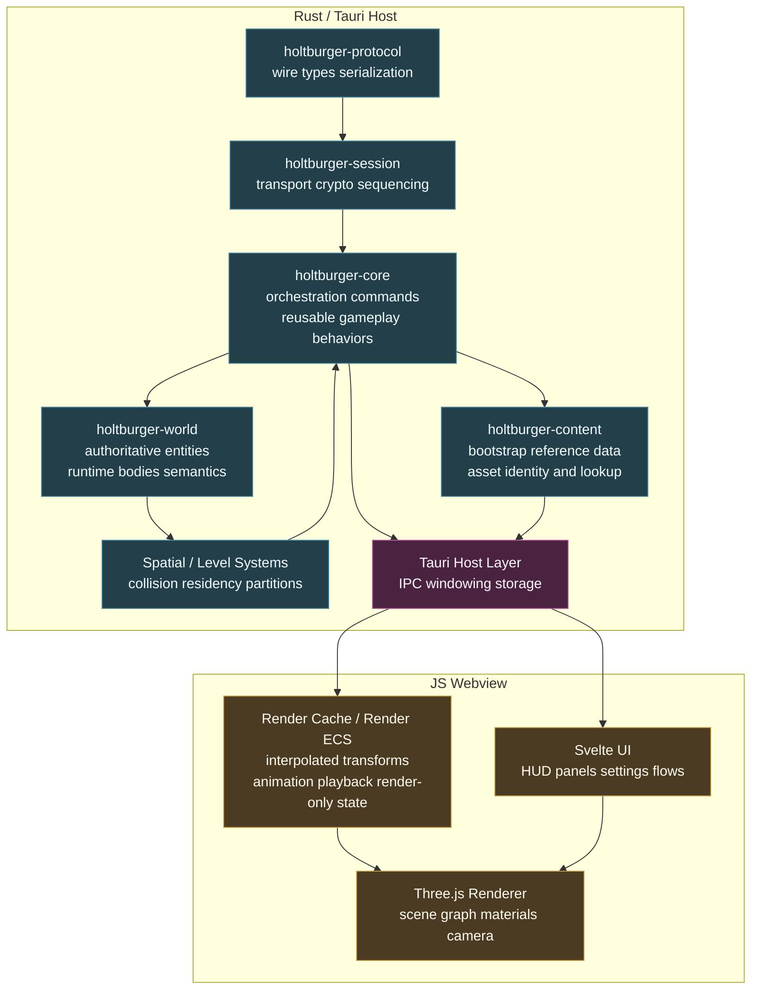
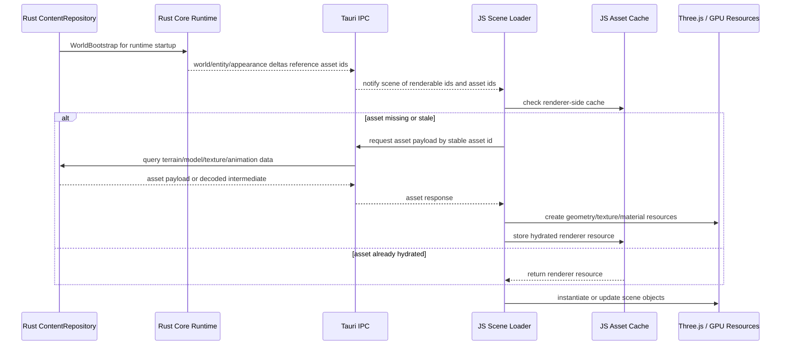
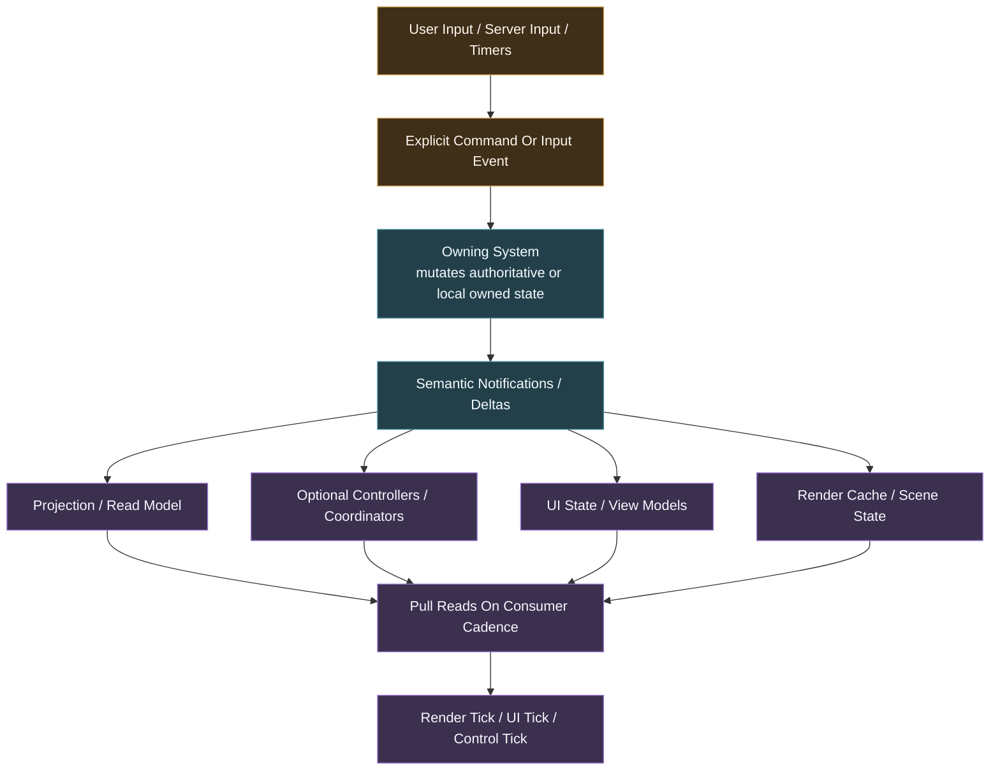

# Holtburger 3D Client Scoping Plan

## Context And Boundaries

### Goal
Define the initial architectural scope for `holtburger-3d` so the first implementation can start without smuggling renderer-specific authority into shared crates or forcing Rust to own presentation details that belong in the frontend.

### In Scope
- Define the recommended ownership split between Rust and the Tauri web frontend.
- Identify the minimum shared contracts `holtburger-3d` needs from `holtburger-core`, `holtburger-world`, and `holtburger-content`.
- Define the render/runtime data-flow shape for authoritative 30 Hz simulation plus higher-frequency visual interpolation.
- Identify the main technical risks and the seams that must stay explicit.

### Out Of Scope
- Building the actual `holtburger-3d` workspace crate or app shell in this pass.
- Finalizing the exact render engine architecture beyond the initial Three.js-based direction.
- Designing the final animation graph, skeletal runtime, or material pipeline.
- Solving the complete long-term asset streaming and cache eviction story.
- Reworking unrelated TUI architecture unless a shared seam must move first.

## Ground Truth And Existing Architectural Hints

The repo already contains important constraints for a future 3D client, but they are spread across several docs rather than captured in one dedicated scope document.

### Existing Sources
- [ARCHITECTURE.md](/home/cluracan/code/holtburger/ARCHITECTURE.md)
- [README.md](/home/cluracan/code/holtburger/README.md)
- [apps/holtburger-cli/ARCHITECTURE.md](/home/cluracan/code/holtburger/apps/holtburger-cli/ARCHITECTURE.md)
- [crates/holtburger-core/ARCHITECTURE.md](/home/cluracan/code/holtburger/crates/holtburger-core/ARCHITECTURE.md)
- [docs/reference_data_and_asset_delivery.md](/home/cluracan/code/holtburger/docs/reference_data_and_asset_delivery.md)
- [docs/plans/CLI_REORG_PLAN.md](/home/cluracan/code/holtburger/docs/plans/CLI_REORG_PLAN.md)
- [docs/plans/content-pipeline-runtime-snapshot-plan.md](/home/cluracan/code/holtburger/docs/plans/content-pipeline-runtime-snapshot-plan.md)
- [docs/plans/projection-lifecycle-hardening-plan.md](/home/cluracan/code/holtburger/docs/plans/projection-lifecycle-hardening-plan.md)
- [docs/plans/thin-client-spatial-assist-seam-working-doc.md](/home/cluracan/code/holtburger/docs/plans/thin-client-spatial-assist-seam-working-doc.md)
- [docs/plans/micro-hba-and-world-collision-plan.md](/home/cluracan/code/holtburger/docs/plans/micro-hba-and-world-collision-plan.md)

### What Those Docs Already Establish
- The TUI is a proving ground, not the target architecture.
- `holtburger-world` should remain the authority for hydrated entity state and canonical runtime body state.
- `holtburger-core` should remain the orchestrator for protocol handling, movement execution, and reusable gameplay behaviors.
- Frontends may keep mirrored read caches and local projection state, but they must not become a second advancing authority.
- Static reference data and heavy asset delivery are distinct concerns and should not be modeled as one big `ClientViewEvent` bootstrap.
- A future 3D client is expected to need an honest spatial/physics seam, not TUI-shaped hacks baked into shared runtime code.

### TUI Lessons Worth Carrying Forward
- The TUI architecture eventually converged on explicit reducer entrypoints and event-driven boundaries because direct mutator paths and ad hoc coordination made behavior harder to reason about.
- The CLI reorg work explicitly calls out the cognitive load of tracing one user action through too many imperative proxy layers.
- The projection hardening work explicitly calls out bugs caused by mixing authoritative ingest with partial derivation and by relying on event-order side effects.

The 3D client should treat those as architectural lessons, not just cleanup notes for the TUI.

### Gap This Plan Fills
There is currently no dedicated document that answers the practical question: "what should `holtburger-3d` own versus what should Rust continue to own?"

## Recommendation Summary

The proposed split is broadly sound.

Recommended high-level direction:

- Rust owns protocol/session, authoritative world state, reusable gameplay logic, client-side authoritative local simulation, content bootstrap, asset addressing, collision, and level/runtime spatial systems.
- Tauri Rust owns the host process, windowing shell, IPC surface, local storage integration, and any native-side asset/file access that should not be reimplemented in JavaScript.
- JavaScript owns rendering, presentation-time interpolation, camera behavior, input-to-intent translation, UI, render-only scene state, and raw asset interpretation for rendering.

The central architectural theme should be eventual consistency.

That means:

- systems communicate through abstract events, notifications, queries, and explicit commands rather than reaching into one another's mutable internals
- most consumers react to state changes on their own cadence instead of demanding same-stack immediate mutation everywhere
- derivation should be single-sourced inside the owning system instead of partially recomputed by whichever event handler happened to fire
- "fast enough and coherent" is the default target, not "synchronously updated in every layer before returning"

That fits games well. Most user-visible behavior does not need to resolve instantly in the same call stack. It needs to become coherent quickly, predictably, and through well-owned boundaries.

The main correction is terminology and discipline around the proposed JavaScript "shadowed ECS":

- good: a render-scene cache or render ECS that mirrors authoritative state and derives interpolated poses, animation selections, visibility groups, and UI-friendly view models
- bad: a second gameplay ECS that independently advances authoritative transforms, collision, combat semantics, or interaction truth

So yes, this design passes the vibe check, but only if the JavaScript side is treated as presentation authority rather than gameplay authority.

## Eventual Consistency As A Design Principle

`holtburger-3d` should bias toward notification-driven eventual consistency on both the Rust and JS sides.

Concretely:

- authoritative systems ingest inputs, update owned state, and emit semantic notifications
- dependent systems observe those notifications and reconcile their own local models
- render and UI systems consume snapshots and deltas, then derive presentation state on their own cadence
- cross-system coordination should prefer explicit messages such as "target changed", "runtime body updated", or "inventory projection invalidated" over direct imperative calls such as "also update these three other subsystems right now"

This does not mean everything becomes a giant event soup.

It means each subsystem should have:

- one owned state model
- a small input vocabulary
- a small output vocabulary
- a clear rule for what is authoritative, what is mirrored, and what is derived

The design smell to avoid is imperative abstraction leakage, where one subsystem knows too much about how another must update itself internally.

## Major Subsystems

This does not need to be exhaustive yet. The important thing is to identify the major subsystems early enough that they set precedent for the rest of the client.

Each major subsystem should be able to answer a few simple questions:

- what state does it own?
- what inputs does it accept?
- what outputs or notifications does it emit?
- what other subsystems is it allowed to query directly?
- what state is authoritative, mirrored, or purely derived?

If a subsystem cannot answer those questions cleanly, it is usually a sign that the boundary is still too muddy.

### Existing Rust Foundations

A lot of the Rust-side "subsystems" are already intentionally defined by the workspace crate boundaries and should not be reinvented in this doc.

Those existing foundations are already doing real architectural work:

- `holtburger-session` for transport and crypto
- `holtburger-protocol` for wire types and serialization
- `holtburger-world` for authoritative world state
- `holtburger-core` for orchestration, movement execution, and reusable client behavior
- `holtburger-content` for bootstrap and asset identity or lookup

So the more useful question for `holtburger-3d` is not "what are all the Rust subsystems?" but rather "what new seams or boundary-owning systems does the 3D client introduce on top of the existing crates?"

### Rust-Side 3D-Specific Seams

#### 1. Spatial And Level Runtime
- Owns: landblock or cell residency, collision or query structures, level streaming authority, spatial query answers that must remain engine-owned
- Inputs: authoritative world changes, regular camera-position hints from the frontend, movement or collision queries, scene residency updates
- Outputs: residency notifications, spatial query responses, collision or constraint results, level-availability state
- Direct queries allowed: content repository and world authority
- Should not own: render culling policy or purely visual scene layout

This is one of the first genuinely 3D-specific Rust seams, and it sets the precedent that honest spatial answers come from one place. Camera position should normally flow from JS to Rust because AC's visibility behavior and camera collision can depend on it, but that still does not make Rust the owner of rendering policy.

#### 2. Runtime Projection And Semantic Event Surface
- Owns: authoritative snapshots, deltas, semantic notifications, runtime-body read models derived from world-owned authority
- Inputs: `WorldEvent`s, protocol-side outcomes, simulation outputs, lifecycle events
- Outputs: runtime-channel notifications for frontend consumers
- Direct queries allowed: world authority and content or reference surfaces as needed for semantic projection
- Should not own: frontend cache policy, renderer interpolation, UI orchestration, or renderer-specific interpretation of authoritative state

This seam matters because the 3D client should consume a coherent authoritative surface instead of reaching directly into world internals just because rendering got richer. Rust should publish what is true about the world; JS should decide how to render it.

#### 3. Host Boundary And IPC Layer
- Owns: Tauri commands, event dispatch, serialization across the Rust or JS boundary, persistence hooks, shell integration
- Inputs: JS commands, JS asset requests, JS authority-sensitive queries, runtime notifications from Rust systems
- Outputs: JS-facing notifications, query responses, asset responses, host capability events
- Direct queries allowed: runtime and content systems through explicit typed interfaces
- Should not own: gameplay logic, renderer resource state, UI policy

This is a real subsystem in `holtburger-3d`, not just glue. It sets the precedent for typed, narrow, event-oriented boundary contracts.

#### 4. Locomotion And Simulation Adoption Seam
- Owns: the 3D client's usage contract for existing movement, prediction, reconciliation, and local-simulation systems that already live primarily in `holtburger-core` and `holtburger-world`
- Inputs: frontend locomotion intent, world state queries, authoritative corrections from the server, spatial-query answers
- Outputs: movement commands, movement-related notifications, local-player control intents, and any 3D-client-specific adapter state needed to drive the existing runtime cleanly
- Direct queries allowed: world authority, spatial or collision systems, and the existing core movement surfaces
- Should not own: a second simulation stack, duplicate reconciliation logic, or frontend movement UX policy beyond the explicit intent-adapter seam

This is not meant to imply that `holtburger-3d` invents a brand new movement subsystem. A lot of the real machinery already belongs to `holtburger-core` and `holtburger-world`. The important design question here is the 3D client's adoption seam: how frontend locomotion intent, richer camera-relative controls, and local interaction patterns cross into the existing primitive movement and simulation surfaces without creating a parallel movement architecture in the frontend.

#### 5. Content And Asset Service
- Owns: archive mounting, namespace lookup, bootstrap assembly, stable asset identity, typed content queries
- Inputs: startup config, asset queries, bootstrap requests, optional invalidation or patch signals later
- Outputs: `WorldBootstrap`, reference-data responses, asset payloads or decoded intermediates, content lookup errors
- Direct queries allowed: DAT or HBA sources only
- Should not own: renderer-specific caches, Three.js resource lifetimes, scene-instantiation policy

This is an existing crate boundary, but for `holtburger-3d` it becomes a major consumer-facing seam because asset identity, bootstrap, and asset queries all cross into the frontend architecture.

### JavaScript-Side Major Subsystems

#### 1. UI Shell
- Owns: Svelte app state, top-level page or route state, HUDs, menus, modal flows, settings surfaces, user-facing workflow state
- Inputs: runtime notifications, user input, query responses, asset-status notifications as needed
- Outputs: commands, settings updates, UI-local notifications
- Direct queries allowed: runtime channel and narrow authority-sensitive queries
- Should not own: gameplay truth or renderer internals beyond presentation needs

This subsystem sets the precedent that UI state is frontend-owned but not gameplay-authoritative.

That includes a page model similar to the TUI, but it does not have to start with the TUI's user flow. A 3D client can expose explicit frontend modes such as browser mode and client mode, with each mode hosting its own page stack or route set. Browser mode can focus on free world navigation from an initial coordinate, while client mode can eventually host login, character selection, reconnect, and in-world gameplay. The important boundary rule is that these modes and pages are app-shell navigation state, not authoritative gameplay state. Rust can publish authoritative session and client lifecycle facts such as "disconnected", "account authenticated", "character roster ready", "entering world", or "in world"; the frontend shell can map those facts, together with frontend-local workflow state, into the currently active mode, page, or route.

This is compatible with the eventual-consistency model as long as page or mode transitions are driven by semantic notifications and frontend policy instead of imperative cross-boundary view control. Rust should not tell Svelte which page component to mount. Rust should expose typed lifecycle and session state; the frontend should decide which mode and page the user is currently in.

#### 2. Frontend Game State / View Model Store
- Owns: frontend-owned mirrored game state needed by UI and interaction flows, such as combat status, target state, fellowship summaries, inventory view models, interaction affordances, busy state, modal-driving game context, and other semantics the UI needs to render coherently
- Inputs: runtime-channel semantic notifications, authority-sensitive query responses, local UI actions that affect presentation-only mode, and bounded local timers where the frontend is allowed to derive display state
- Outputs: stable UI-facing view models, invalidation notifications for UI components, and read models consumed by both the UI shell and interaction mapping
- Direct queries allowed: runtime-channel caches, narrow authoritative query endpoints, and frontend-local presentation state
- Should not own: authoritative gameplay truth, raw protocol handling, renderer resource state, or a second simulation model

This is the missing JS-side home for questions like "should the combat HUD be visible right now?" The answer should generally live in a frontend game-state or view-model store that subscribes to semantic runtime notifications and maintains UI-facing projected state. In other words: Rust says what happened in gameplay terms; the frontend store keeps the mirrored state that lets Svelte render the right interface.

Examples of state that plausibly lives here:

- current combat mode and combat engagement status
- selected or hovered target summaries
- current interaction mode or pending action context
- inventory, vendor, or trade presentation state
- fellowship or chat summaries used by HUD elements
- error, busy, or confirmation state that is derived from runtime notifications but owned by the frontend UX

#### 3. Render Scene Runtime
- Owns: Three.js scene graph, cameras, lights, visible scene object lifetime, renderer frame loop
- Inputs: render cache state, asset hydration results, viewport changes, UI or input hints that affect presentation
- Outputs: frame rendering, presentational picks, render metrics, optional render-driven requests
- Direct queries allowed: render cache and renderer-owned resource registries
- Should not own: authoritative entity truth or asset identity policy

This subsystem sets the precedent that the renderer is a consumer of prepared data, not the source of game truth.

#### 4. Render Cache Or Render ECS
- Owns: mirrored runtime entity state needed for presentation, interpolated transforms, animation playback state, visibility buckets, selection or hover presentation
- Inputs: runtime-channel deltas, local presentation timers, asset availability changes
- Outputs: render-ready read models, cache invalidation notifications, derived presentational state
- Direct queries allowed: runtime snapshots and asset availability state
- Should not own: combat semantics, collision truth, inventory authority, or direct server protocol concerns

This subsystem sets the precedent that mirrored state is read-optimized and disposable, not authoritative.

#### 5. Asset Worker
- Owns: asset fetch scheduling, worker-side decode or transform steps, intermediate caches, queue prioritization
- Inputs: asset requests from scene or cache systems, asset responses from Rust, cache budget signals
- Outputs: prepared asset data, hydration-ready intermediates, asset-status notifications
- Direct queries allowed: dedicated asset channel only
- Should not own: live Three.js scene objects unless the entire renderer moves into a worker

This subsystem sets the precedent that asset preparation is separate from renderer ownership.

#### 6. Input And Interaction Mapping
- Owns: browser input capture, gesture interpretation, camera-relative input translation, intent compilation, local hover or preselection behavior
- Inputs: DOM events, renderer hit-test hints, runtime notifications that affect allowed actions
- Outputs: explicit commands, authority-sensitive queries, UI-local notifications
- Direct queries allowed: runtime channel and authoritative query endpoints
- Should not own: simulation or gameplay side effects directly

This subsystem sets the precedent that input becomes explicit intent before it crosses the boundary.

### Where New Precedent Actually Matters

The strongest precedent-setting areas for `holtburger-3d` are probably these:

- the Rust or JS host boundary and its channel split
- the runtime projection surface consumed by the frontend
- the JS render cache versus renderer split
- the asset worker versus renderer ownership split
- the input or interaction mapping seam for commands and authority-sensitive queries

Those are the places where the 3D client is most likely to accidentally create abstraction leakage if we are not explicit.

## Subsystem Pattern To Repeat

When we introduce new systems later, they should generally follow the same declaration pattern.

Recommended template:

```text
Subsystem: <name>
Owns:
Inputs:
Outputs:
Direct queries allowed:
Authoritative vs mirrored vs derived:
Must not own:
```

That may look a little bureaucratic, but it is cheap insurance against the exact problems the TUI taught us: hidden mutator paths, mixed ownership, and event-order-dependent spaghetti.

## Illustrative Precedence

If we get the major subsystems above right, they establish a few healthy precedents for the rest of the client:

- systems own state instead of sharing mutable grab-bags
- commands and notifications are typed around domain meaning rather than generic effect enums
- projection, cache, and UI layers are allowed to be eventually consistent without becoming second authorities
- the host boundary is explicit and testable rather than a magical reach-through layer
- asset lookup, asset preparation, and renderer ownership are split cleanly enough that we can evolve performance strategy later without rewriting the entire client

## Architecture Diagrams

### 1. Ownership And Responsibility Map



### 2. Authoritative Runtime And Render Loop

```mermaid
sequenceDiagram
  participant Srv as Server
  participant Sess as Session
  participant Core as Core Runtime
  participant World as World State
  participant Host as Tauri IPC
  participant Cache as JS Render Cache
  participant Render as Three.js Frame Loop

  rect rgb(31, 49, 58)
    Srv->>Sess: encrypted packets
    Sess->>Core: decoded payload bytes
    Core->>World: authoritative mutations\nmovement execution\nserver reconciliation
    World-->>Core: world events\nruntime-body snapshots/deltas
    Core-->>Host: batched semantic deltas\nbatched runtime-body deltas
  end

  rect rgb(61, 49, 28)
    Host-->>Cache: apply latest authoritative samples
    loop browser frames
      Render->>Cache: read latest two samples
      Cache-->>Render: interpolated transforms\nrender-only animation state
      Render->>Render: draw scene + UI overlays
    end
  end

  Note over Cache,Render: JS may smooth and interpolate for presentation only.
  Note over World,Core: Rust remains authority for gameplay and solved simulation.
```



### 3. Asset And Scene Data Flow



This flow is demand-driven. Rust should not precociously push heavy assets into the JS runtime just because they exist or because an entity update referenced them.

The default rule should be:

- push semantic state
- pull heavy assets

Instead:

1. Rust publishes semantic world/entity/appearance deltas that reference stable asset IDs.
2. JS decides which referenced assets are needed for the current scene, camera, cache state, and quality policy.
3. JS requests missing asset payloads from Rust by ID.
4. Rust answers the request from `ContentRepository`.
5. JS hydrates the response into renderer-native GPU resources.

There may eventually be narrow preload or prefetch paths, but those should be explicit optimizations layered on top of this model, not the baseline architecture.

This same architecture should support both major loading modes the client needs:

- bootstrap burst loading: entering the world, teleporting, or any other hard scene transition where JS rapidly requests a large set of assets for the new authoritative area or scene state
- steady-state streaming: incremental asset fetches while moving through the world or when new entity types, appearances, or nearby content become relevant

Those are not two different systems. They are two request policies over the same asset channel.

Recommended framing:

- the semantic runtime channel tells JS what world state, residency, and appearance facts changed
- the asset channel lets JS choose whether to respond with a bulk fetch wave or a small incremental fetch
- the worker and cache layers absorb most of the difference between those two modes

That is a strong fit for AC. A teleport or login can trigger a bursty catch-up wave without changing the architecture, while normal traversal can remain demand-driven and incremental.

In this split, JavaScript should own the final render-side asset hydration step: turning decoded or queryable asset payloads into Three.js objects, GPU buffers, textures, materials, and scene-ready resources.

A good refinement of this design is to let the asset channel feed a dedicated JS asset worker.

Recommended split inside the JS side:

- asset worker: request asset payloads from Rust, decode or transform data, transcode textures, build CPU-side intermediate structures, manage asset-fetch concurrency, and maintain a worker-side content cache
- main thread or render thread: create final Three.js resources, perform GPU upload, instantiate scene objects, and coordinate with the visible renderer loop

That worker layer is also the natural place to implement different loading policies:

- high-priority burst queues for login, teleport, and hard scene transitions
- normal streaming queues for traversal and newly relevant spawns
- prefetch queues for likely-near-future assets when the cache budget allows

That usually gives the best tradeoff:

- expensive CPU-side asset preparation does not stall the main UI or render loop
- the final renderer-facing step still happens where the graphics context and scene ownership naturally live

So yes, feeding the asset channel into a worker is a good design.

The main caveat is terminology: if by "asset hydration" we mean all CPU-side preparation before GPU upload, that can absolutely live in a worker. If we mean the literal creation of live GPU-backed renderer resources, that often still belongs on the main thread unless we deliberately move the whole renderer into a worker.

It is therefore important not to overstate what a plain asset worker can do.

### Worker-Owned Asset Preparation vs Worker-Owned Renderer Resources

A normal web worker can absolutely:

- request asset payloads from Rust
- parse, decode, transform, or transcode them
- build CPU-side intermediate data structures
- maintain worker-local caches of decoded asset data

A normal web worker should usually not be treated as the owner of live Three.js renderer resources in the ordinary main-thread-renderer architecture.

Why:

- Three.js objects that are bound to a live renderer and graphics context naturally belong with that renderer
- GPU resource creation is tightly coupled to the owning WebGL or WebGPU context
- scene mutation and renderer resource lifetime become awkward if the asset worker "owns" objects that the main-thread renderer must actually consume and destroy

So in the default design, the worker prepares data and the renderer owns live Three.js resources.

There is one important exception: if we intentionally run the renderer itself inside a worker using `OffscreenCanvas`, then that worker can own Three.js resources because it also owns the rendering context and scene loop.

That is a valid architecture, but it is a different architecture.

The distinction is:

- asset worker architecture: worker prepares data, renderer thread owns live Three.js objects
- render worker architecture: worker owns renderer, scene, and live Three.js resources

That leads to two reasonable frontend designs:

- default recommendation: worker for asset IO, decode, transform, and pre-hydration; main thread for final Three.js resource creation and scene attachment
- more aggressive option: a render worker owning an `OffscreenCanvas`, where both scene management and GPU resource creation move off the UI thread

The second option can be great, but it is a higher-complexity choice and depends on the webview's support and ergonomics. It is probably not the first architecture to lock in unless profiling proves the main-thread renderer model is insufficient.

Rust should still own:

- asset identity
- archive mounting and lookup
- bootstrap-time content policy
- any decode or preprocessing work we choose to centralize for correctness or performance
- lightweight metadata and semantic notifications that tell JS what kinds of assets might be relevant

JavaScript should own:

- creation of renderer-native resources
- GPU upload timing
- residency and eviction in the webview render runtime
- deciding which referenced assets are actually worth hydrating for the current frame, scene, and cache state
- scene-instantiation details specific to Three.js

Recommended internal split on the JS side:

- worker-owned CPU asset preparation
- renderer-owned final GPU resource creation

That keeps shared crates renderer-agnostic while letting the frontend control the last mile into GPU state.

### 4. Notification-Driven Consistency Model



## Proposed Ownership Split

### 1. Rust-Owned Systems

These systems should stay in Rust because they either define authority, require tight coupling to the existing stack, or need to remain reusable across multiple frontends.

- `holtburger-session`: transport, sequencing, crypto, fragmentation, reconnect semantics
- `holtburger-protocol`: deterministic message encoding and decoding
- `holtburger-world`: authoritative entity graph, retention, gameplay semantics, canonical runtime body state
- `holtburger-core`: orchestration, command execution, reusable controllers, protocol-to-world handling, runtime event projection
- content pipeline: HBA mounting, bootstrap assembly, reference-data access, asset identity and lookup
- authoritative local simulation: player motion integration, contact state, collision response, server reconciliation, forced movement handling
- level systems: landblock or cell residency, spatial partitions, collision geometry ownership, future visibility or streaming source-of-truth
- Tauri host concerns: shell lifecycle, native menus, file dialogs, settings persistence, installer-facing integration

Why this belongs in Rust:

- It preserves one authoritative simulation and one authoritative interpretation of gameplay semantics.
- It keeps the 3D client on the same foundation as the TUI, harnesses, and tools.
- It avoids duplicating protocol and world logic in a slower-moving JS mirror that will inevitably drift.

### 2. JavaScript-Owned Systems

These systems are frontend-shaped and should stay in the webview layer.

- Three.js world rendering
- scene graph assembly from frontend-facing runtime snapshots and content queries
- presentation-time interpolation and extrapolation between authoritative simulation ticks
- animation playback selection and blend policy at the render layer, so long as gameplay semantics remain Rust-owned
- camera control, picking presentation, local highlight state, and diegetic UX behavior
- Svelte UI, HUDs, panels, inventory presentation, modal flows, settings UX, macro or script panels
- input mapping from browser or window events into frontend intents that are then sent to Rust as explicit commands
- render-only ECS or scene cache for meshes, materials, interpolated transforms, animation state, billboard state, and visibility buckets

Why this belongs in JavaScript:

- Render and UI iteration will be much faster there.
- The expected on-screen entity counts for AC are modest, so modern JS rendering is plausibly sufficient for the first serious client.
- Presentation systems naturally want `requestAnimationFrame` cadence, DOM integration, and GPU-adjacent scene management that do not map cleanly onto the Rust engine crates.

### 3. Shared Boundary Rules

The Rust/JS seam should be explicit about what may and may not cross it.

Rust should publish:

- authoritative world snapshots and deltas
- canonical runtime-body snapshots and deltas for entities the frontend is rendering
- semantic gameplay events
- command/query surfaces for interaction, movement, targeting, and reference-data lookup
- stable asset identifiers and lookup handles rather than raw renderer-owned objects

JavaScript should publish back to Rust:

- input intents
- frontend-only settings changes
- optional viewport or streaming hints such as current camera region, interest radius, or visible landblocks
- render-driven queries such as picking requests, if the engine needs them resolved authoritatively

JavaScript should not publish back to Rust as authoritative facts:

- solved collision
- final combat-state interpretations
- authoritative transforms for replicated entities
- authoritative grounded or contact state for general gameplay semantics

The narrow exception is local-player prediction hints where Rust explicitly defines a seam for them. Even then, Rust remains the owner of the final solved result.

One more rule matters here: boundary traffic should prefer semantic notifications over imperative cross-layer calls. If the JS side needs to know that targeting, motion, or interaction state changed, Rust should publish a clear event or delta. The JS side should then reconcile its own cache and UI state instead of expecting Rust to choreograph frontend internals.

The boundary is therefore bidirectional, but asymmetric:

- Rust to JS is mostly notifications, snapshots, deltas, and query responses.
- JS to Rust is mostly commands, intent messages, hints, and authority-sensitive queries.

That asymmetry is important. The frontend may ask questions of Rust, but it should not drive Rust by reaching into engine-owned state.

It also suggests at least two logical channels across the boundary:

- a runtime channel for semantic notifications, commands, snapshots, deltas, and authority-sensitive query responses
- an asset channel for demand-driven asset requests, payload responses, cache invalidation, and optional prefetch hints

These do not necessarily need separate low-level transports on day one. A single Tauri IPC mechanism can still carry both. But architecturally they should be treated as separate channels with different traffic shape, batching, backpressure, and observability.

## Runtime Model

### 1. Two Clocks

The first `holtburger-3d` implementation should assume two cadences:

- authoritative Rust simulation at 30 Hz
- JavaScript rendering at browser cadence, typically 60 to 144 Hz

That is a good fit for AC. The simulation does not need to run at render frequency, and the renderer should not block on simulation ticks.

Recommended model:

1. Rust advances authoritative world and local simulation on its fixed cadence.
2. Rust emits compact snapshots and deltas tagged with simulation time.
3. JavaScript stores the latest authoritative samples in a render cache.
4. JavaScript interpolates visible entities between the last two authoritative samples.
5. When interpolation is impossible, JavaScript falls back to hold-last-sample or tightly bounded extrapolation for presentation only.

This preserves responsiveness without turning the frontend into a hidden simulation owner.

It also aligns with the broader eventual-consistency theme: simulation, projection, UI, and rendering do not all need to settle in one synchronous stack frame. They need explicit inputs, explicit outputs, and bounded convergence.

Some interactions will still require request-response messaging across the boundary. That is fine. Eventual consistency is not a ban on queries. It is a warning against turning every subsystem boundary into direct imperative orchestration.

### 2. Render Cache, Not Mirror Authority

The JavaScript "shadow ECS" should be deliberately scoped as a render cache.

That cache may own:

- interpolated transforms
- animation playback time
- material state
- local culling membership
- nameplate and UI attachment state
- selection and hover state
- client-only ephemeral VFX state

That cache should not own:

- collision truth
- authoritative locomotion advancement
- combat-target validity
- inventory or trade authority
- death or action semantics derived independently from raw packets

If a system needs to answer a gameplay question that must stay consistent across TUI, tools, and 3D, the answer belongs in Rust.

This is also where eventual consistency must stay disciplined. The JS cache can be stale for a frame or two; it cannot become independently authoritative.

### 3. Level And Asset Flow

The current architecture already points toward a split where `holtburger-content` owns content discovery and typed lookup while frontends consume query surfaces.

The first 3D-client scope should assume:

- Rust owns archive mounting and asset identity.
- Rust exposes queryable raw or lightly decoded payload access for terrain, models, textures, animations, and appearance composition inputs.
- JavaScript requests the assets it needs for the current scene and interprets those payloads into Three.js resources.
- caching, GPU upload, and scene residency policy initially live in JavaScript, with room to move selected decode work to Rust later if profiling justifies it.

Important non-goal for the first cut:

- do not force the entire render asset runtime through `ClientViewEvent`

Heavy assets are demand-driven, not broadcast-driven.

That is a good reason to keep the asset path logically separate from the general semantic runtime bus. Asset traffic is larger, burstier, more cache-oriented, and more request-response shaped than gameplay or projection deltas.

"Demand-driven" here should not be read too narrowly as "one asset at a time." A bulk scene load is still demand-driven if JS is issuing the requests because the scene state, residency rules, or transition policy says those assets are now needed.

## Suggested Initial Architecture

### 1. Process Layout

Recommended first implementation:

- one Tauri app named `holtburger-3d`
- Rust side embeds or links the existing engine crates
- Svelte UI and Three.js renderer run in the Tauri webview
- the frontend subscribes to batched runtime deltas plus explicit content-query APIs

Conceptually:

```text
Rust engine/runtime
  -> session/protocol/world/core/content
  -> authoritative 30 Hz simulation
  -> event + query surface

Tauri boundary
  -> typed IPC commands
  -> batched delta delivery
  -> async content requests

JS frontend
  -> Svelte app shell
  -> Three.js scene runtime
  -> render cache / presentation ECS
  -> camera/input/UI
```

Messaging shape at a high level:

- Rust publishes subscribed world, runtime-body, and semantic deltas.
- JS sends explicit commands such as movement intent, interaction intent, regular camera-position hints, and selection requests.
- JS may also issue authority-sensitive queries that need Rust-owned answers.

Recommended channel split at the architecture level:

- runtime channel: semantic notifications, commands, world deltas, runtime-body deltas, control/query responses, and camera-position hints from JS
- asset channel: asset fetch requests, asset payload responses, decode-status responses, optional prefetch or invalidation notices

Even if both channels are multiplexed through the same IPC implementation at first, the code should avoid collapsing them into one generic "message bus" type.

### 2. Minimal Frontend Contracts

`holtburger-3d` should not wait for a perfect long-term API before starting. It needs a minimal contract that is honest about ownership.

### Contract A: Runtime Entity Feed
- spawn, despawn, authoritative transform snapshots, velocity or motion updates, appearance identity, basic interaction flags, and other authoritative game-state facts that let the frontend derive presentation

### Contract B: Local Player Feed
- authoritative local-player transform, movement mode, action or combat state, forced movement, corrected position, interaction affordances

### Contract C: Static Reference Data Queries
- spell metadata, item or weenie metadata, icon lookup, names, presentation descriptions

### Contract D: Heavy Asset Queries
- raw or lightly decoded models, textures, animation clips, terrain or level chunks, appearance composition inputs

This contract should ride a dedicated logical asset channel, not the same semantics-first path used for world and runtime deltas.

It should support both:

- bulk requests or batched fetch waves for scene bootstrap and teleport catch-up
- incremental requests for ordinary streaming

### Contract E: Input Commands
- movement intent, use, attack, interact, target selection, character actions, settings or UI-driven commands

### Contract F: Authority-Sensitive Queries
- ray-pick resolution against engine-owned spatial state

If those six contracts exist cleanly, the 3D client can start before the full render stack is finalized.

That is really six contracts now, and this new one matters. A 3D frontend will inevitably need some bidirectional request-response seams, but the first cut should keep them very small.

The key rule is that these should be named queries, not arbitrary reach-through into Rust internals.

Examples:

- JS performs screen-space ray construction and asks Rust to resolve the authoritative hit against engine-owned spatial data.
- Rust answers with a typed result or rejection, and JS updates its local presentation state.

That is a healthy boundary.

## Architecture Constraints

These are the constraints worth preserving before we talk about implementation order.

- The frontend can own interpolation, but not solved gameplay truth.
- The renderer can own asset residency and GPU upload policy, but not asset identity or bootstrap policy.
- Rust should publish authoritative world and motion state, not renderer-specific interpretation of that state.
- The Tauri boundary should carry batched deltas and query responses, not thousands of tiny per-entity IPC calls.
- If a gameplay answer must stay consistent across TUI, tools, and 3D, it belongs on the Rust side.
- Systems should expose small event or notification vocabularies instead of broad imperative mutator surfaces.
- Event ingestion and state derivation should be separated where possible so event-order side effects do not become hidden architecture.
- Read models, projections, UI state, and render state are allowed to converge eventually; they do not need same-stack synchronous mutation.
- Prefer no same-turn reads unless a future concrete problem proves they are necessary.
- GPU resource hydration should stay frontend-owned, and the first heavy-asset decode path should default to JS unless profiling proves a specific decode path belongs in Rust.
- Bidirectional messaging should exist by design, but query and command vocabularies must stay typed and narrow.

## Risks And Mitigations

### Risk: The JS Side Becomes A Second Game Client

If the frontend starts solving gameplay semantics on its own, the codebase will drift into two clients that happen to share a transport layer.

Mitigation:
- Keep the JS state model presentation-only.
- Add missing Rust-owned semantics instead of re-deriving them in the frontend.

### Risk: Tauri IPC Becomes The Bottleneck

Per-entity chatty events can drown the boundary if every small update becomes a separate IPC call.

Mitigation:
- batch deltas
- prefer compact typed payloads over ad hoc command spam
- profile early once a walkaround scene exists

### Risk: Asset Delivery Gets Confused With View Projection

Trying to ship models, textures, and terrain through the same path as semantic world events will produce a bad API and a slow renderer.

Mitigation:
- keep semantic events and asset queries as separate contracts from day one

### Risk: Shared Crates Become Renderer-Shaped

If Rust abstractions are designed around Three.js or Svelte terminology, the shared stack will get harder to reuse.

Mitigation:
- shared crates publish engine or domain concepts
- `holtburger-3d` owns renderer-specific adapters

## Current Recommendations

- Let JS handle raw or lightly decoded asset payloads by default. The client data formats are generally simple enough that the first heavy-asset decode path should live primarily in JS.
- Do not let Rust decide what is render-facing. Rust should publish authoritative world state, motion state, semantic notifications, stable asset identity, and raw asset data; JS should decide how to turn that into rendering.
- Keep residency fundamentally Rust-authoritative, but send regular camera-position hints from JS to Rust so visibility, PVS-shaped level behavior, and camera collision can use the real camera position when needed.
- Let JS infer as much animation behavior as it can from authoritative poses, motion commands, and semantic state rather than introducing a large shared animation contract early.
- Start with exactly two logical channels across the boundary: an asset channel and a runtime channel. If later evidence justifies a split inside the runtime channel, we can add it then.
- Prefer no same-turn reads if we can help it. The architecture should default to eventual consistency rather than relying on immediate cross-boundary reads.
- Use one global freshness budget at first rather than many per-subsystem budgets. If real problems show up later, we can specialize.
- Keep the first-cut authority-sensitive query list very small. Ray-pick resolution is the clearest initial candidate.

## Phased Implementation Plan

### Implementation Goal

Produce a runnable `holtburger-3d` app that establishes the architecture, ownership model, and cross-boundary patterns described in this document without trying to ship a feature-complete client.

The first implementation should prove that:

- the Rust crates can feed a 3D-oriented frontend without becoming renderer-shaped
- the Tauri boundary can carry the initial runtime and asset contracts cleanly
- the frontend can own pages, view models, render-side caches, and asset hydration without becoming a second gameplay authority
- a browser-mode-first flow can exercise the world display, asset pipeline, and spatial seams before the full client flow exists
- browser mode and client mode can share the same world display foundation instead of forking the renderer architecture early
- the project has a concrete app location and build shape that can absorb future iteration

### Foundation Scope

#### In Scope For The First Runnable App

- a new `holtburger-3d` app shell in the workspace
- a Rust Tauri host that can start, expose typed commands or events, and bridge to existing Holtburger crates
- a Svelte frontend written in TypeScript that can boot, own top-level mode state plus nested page or route state, and render placeholder application surfaces
- a browser mode that can load an initial coordinate and freely navigate landblocks or dungeons
- a shared `WorldDisplay` foundation that both browser mode and future client mode can consume
- an initial runtime channel carrying typed lifecycle state plus a small authoritative runtime feed
- an initial asset channel carrying demand-driven asset lookup requests and responses
- a world-facing shell surface that proves the in-world app shape even if the world is only represented by placeholders, debug panels, or a minimal camera or canvas surface
- enough end-to-end flow to reveal awkward seams in `holtburger-core`, `holtburger-world`, `holtburger-content`, and the host boundary

#### Out Of Scope For The First Runnable App

- a functional login experience
- a functional gameplay loop backed by live session wiring
- full world rendering, terrain streaming, or realistic scene composition
- polished UI, production HUD design, or final UX flows
- a full animation graph, final camera model, or final input system
- a complete asset cache, eviction, or streaming solution
- parity with the TUI feature surface

### Recommended Project Layout

The JS app should live with the app that owns it rather than in a separate top-level frontend folder.

Recommended layout:

```text
apps/
  holtburger-3d/
    package.json
    tsconfig.json
    vite.config.ts
    svelte.config.js
    src/
      app/
      pages/
      lib/
      workers/
    src-tauri/
      Cargo.toml
      src/
```

Notes:

- `apps/holtburger-3d/src-tauri` should be the Rust workspace member added to the root [Cargo.toml](/home/cluracan/code/holtburger/Cargo.toml).
- `apps/holtburger-3d/src` should own the Svelte-plus-TypeScript app shell, top-level mode model, nested page or route model, shared `WorldDisplay` foundation, frontend game-state store, render runtime, and workers.
- Keeping the TS app colocated with the Tauri host avoids inventing a second project root and keeps ownership obvious: one app, one shell, one frontend, one native host.
- This is also idiomatic for Tauri: the native host commonly lives under the app's frontend workspace root rather than pretending to be a separate product.

### Recommended Early Product Shape

The app should expose two top-level modes:

- browser mode: a world browser that loads a starting coordinate or location input and allows free navigation through landblocks or dungeons
- client mode: the eventual game-client flow that will later own login, character selection, live session state, and authoritative gameplay interaction

Within that structure, modes are the top-level app state and pages or routes are nested frontend navigation inside a given mode. That keeps the document's terminology consistent: browser mode and client mode are not pages themselves, even if each mode may host one or more pages.

These modes should share a common `WorldDisplay` foundation.

`WorldDisplay` should be the frontend composition boundary that owns or coordinates:

- the render cache or render ECS shell
- the scene or canvas host
- the asset worker relationship
- camera state and camera-position hints
- world-facing debug overlays and world inspection affordances
- mode-specific adapters for browser-driven versus client-driven state sources

The important design rule is that `WorldDisplay` should be shared infrastructure, not a gameplay page. Browser mode should be the first consumer because it stresses the render and asset pipeline directly. Client mode can come later as a second consumer that layers session and gameplay semantics on top of the same display foundation.

### Reference Sources Before Implementation

Before starting execution, the implementation should keep validating itself against these sources:

- shared crate boundaries in [ARCHITECTURE.md](/home/cluracan/code/holtburger/ARCHITECTURE.md)
- TUI shell and page precedent in [apps/holtburger-cli/ARCHITECTURE.md](/home/cluracan/code/holtburger/apps/holtburger-cli/ARCHITECTURE.md)
- content and asset delivery constraints in [docs/reference_data_and_asset_delivery.md](/home/cluracan/code/holtburger/docs/reference_data_and_asset_delivery.md)
- runtime snapshot and projection guidance in [docs/plans/content-pipeline-runtime-snapshot-plan.md](/home/cluracan/code/holtburger/docs/plans/content-pipeline-runtime-snapshot-plan.md)
- projection lifecycle lessons in [docs/plans/projection-lifecycle-hardening-plan.md](/home/cluracan/code/holtburger/docs/plans/projection-lifecycle-hardening-plan.md)
- spatial and collision seam guidance in [docs/plans/thin-client-spatial-assist-seam-working-doc.md](/home/cluracan/code/holtburger/docs/plans/thin-client-spatial-assist-seam-working-doc.md) and [docs/plans/micro-hba-and-world-collision-plan.md](/home/cluracan/code/holtburger/docs/plans/micro-hba-and-world-collision-plan.md)

### Existing Patterns To Reuse

- app shell plus page navigation precedent from the CLI app
- reducer entrypoint discipline from the TUI game page
- authoritative Rust state plus mirrored frontend read model separation already established in the TUI and plan docs
- demand-driven content or asset lookup patterns rather than giant one-shot bootstrap payloads

### Phase Gate Rule

These phases should not be treated as a continuous conveyor belt.

Each phase is expected to produce new information about awkward seams, missing abstractions, and bad assumptions. After each phase, we should stop and explicitly assess what we learned before committing to the next phase.

Each phase gate should answer:

- what worked well enough to keep
- what turned out to be awkward or over-designed
- which assumptions about shared crates, the Tauri boundary, or frontend ownership were wrong
- whether the next phase still has the right scope or should be split, reduced, reordered, or rewritten

The plan is intentionally allowed to change at those gates. That is a feature, not a failure.

### Phase 0: App Skeleton And Contract Worksheet

Purpose: create the app’s physical home in the repo and freeze the smallest contract list needed to start coding without prematurely designing the whole client.

Deliverables:

- create `apps/holtburger-3d/` as the app root
- add `apps/holtburger-3d/src-tauri` as a Rust workspace member in the root [Cargo.toml](/home/cluracan/code/holtburger/Cargo.toml)
- scaffold the Svelte-plus-TypeScript app and Tauri host without implementing real gameplay behavior yet
- create the initial contract worksheet, either in this document or in a short sibling contract doc, naming the exact initial payloads for:
  - browser-mode location or coordinate inputs
  - lifecycle and mode-driving state, plus any nested page-driving state that must exist on day one
  - runtime entity or body snapshots and deltas
  - authoritative state feeds used by frontend view models
  - asset lookup requests and responses
  - camera-position hints
  - the first authority-sensitive query shape for ray picks
  - the `WorldDisplay` boundary between shared world presentation infrastructure and mode-specific state sources

Acceptance Criteria:

- the repo has a stable location for the new app
- the Rust workspace recognizes the host crate
- the frontend build and native host build both start from inside the new app root
- the initial contract worksheet is explicit enough that implementation can reference named payloads instead of hand-wavy concepts

Phase Gate Review Before Phase 1:

- confirm the app layout still feels right once the real toolchains are wired up
- confirm the initial contract worksheet is small enough to start implementation rather than pretending to solve the whole client
- decide whether any contract areas should be deferred, split, or reworded before Rust adapter work begins

### Phase 1: Bottom-Up Rust Adapter And Host Boundary

Purpose: start from the existing Holtburger crates and build the thinnest 3D-oriented host seam that exposes typed lifecycle, runtime, and asset services without forcing renderer terminology into shared crates.

Deliverables:

- implement the first `src-tauri` host modules for:
  - app lifecycle and window startup
  - typed serialization DTOs for runtime and asset channels
  - command handlers or event emitters for the narrow initial surface
- add the minimal Rust-side adapter layer that translates shared-crate output into frontend-facing contracts
- identify any missing shared-crate surfaces required for:
  - authoritative runtime snapshots or deltas
  - stable asset identity and lookup
  - session or client lifecycle state suitable for mode routing and nested page selection
  - camera-position hint ingestion
- make those missing seams explicit and fix them in the shared crates only where the boundary truly belongs there

Acceptance Criteria:

- the host can start and expose a typed boundary without depending on renderer internals
- runtime and asset contracts compile as stable Rust types
- any required shared-crate changes are justified by reusable semantics, not by Svelte or Three.js terminology
- the boundary can emit a stub lifecycle feed and answer at least one stub asset query end to end

Phase Gate Review Before Phase 2:

- review whether the Rust adapter layer is staying app-local enough or whether shared crates are being bent too early
- review whether the current contract shapes are too broad, too chatty, or too renderer-shaped
- decide whether the next step should stay focused on runtime feeds or whether a smaller intermediate phase is needed first

### Phase 2: Bottom-Up Runtime Feed And Debug-First Game Data

Purpose: prove that the frontend can subscribe to authoritative runtime or world-state feeds and derive presentation-facing models before there is a serious renderer.

Deliverables:

- wire the runtime channel to produce a small but real stream of authoritative data from Rust
- prefer debug-first payloads such as:
  - client lifecycle and connection status
  - current character or session identity if available
  - a small runtime body or entity list
  - landblock, dungeon, or spatial residency information suitable for browser mode
  - selected semantic state feeds needed by future UI
- implement batching and subscription shape for runtime updates rather than ad hoc per-entity IPC calls
- keep the initial asset channel demand-driven, even if the first payloads are placeholder or diagnostic data

Acceptance Criteria:

- the host can push typed runtime updates into the frontend without chatty per-entity IPC
- the boundary supports both runtime notifications and asset queries as distinct logical channels
- the frontend can receive and inspect these payloads without relying on same-turn reads
- the resulting shape is useful enough to expose awkward fits in shared-crate state surfaces

Phase Gate Review Before Phase 3:

- assess whether the runtime feed is actually sufficient for browser mode and future client mode, or whether important state is still missing
- assess whether the runtime and asset channels are clean enough to support frontend work without immediate rewrites
- decide whether frontend work should proceed as planned or whether additional Rust seam cleanup is required first

### Phase 3: Top-Down Frontend App Shell, Mode Model, And Browser Flow

Purpose: build the smallest real frontend that proves the app-shell shape, mode ownership, and browser-mode-first navigation without waiting for polished gameplay UI.

Deliverables:

- implement the Svelte app shell with explicit top-level modes, with nested pages or routes inside each mode, such as:
  - boot or loading
  - browser mode
  - client mode placeholder
  - disconnected or reconnect state
- map typed lifecycle facts and browser inputs into frontend-owned mode and page transitions
- establish the frontend game-state or view-model store as the home for page-driving, browser-driving, and HUD-driving mirrored state
- add placeholder UI surfaces that intentionally show state plainly instead of trying to look production-ready

Acceptance Criteria:

- launching the app shows a real frontend shell rather than a blank webview
- mode and page transitions are driven by typed lifecycle state, browser inputs, and frontend policy, not imperative host-side page control
- the frontend has an explicit store boundary for mirrored game state and view models
- the app is visibly navigable and browser mode is a first-class path even if client mode is mostly placeholder driven

Phase Gate Review Before Phase 4:

- assess whether the shell, mode model, and view-model store boundaries feel stable enough to host shared world display infrastructure
- review whether browser mode is staying clearly separate from client-mode semantics instead of quietly absorbing gameplay policy
- decide whether `WorldDisplay` should be introduced as planned or whether its boundary still needs a narrower contract pass first

### Phase 4: Top-Down WorldDisplay Foundation And Browser Mode World Shell

Purpose: establish the shared `WorldDisplay` foundation as a real architectural host for both browser mode and future client mode while deliberately stopping short of a fully runnable end-to-end vertical slice.

Deliverables:

- implement `WorldDisplay` as the composition point for:
  - frontend game-state store
  - render cache or render ECS shell
  - input mapping shell
  - asset worker plumbing
  - a minimal scene or canvas host
- implement browser mode as the first consumer of `WorldDisplay`, including initial coordinate entry or selection and free navigation controls
- render simple placeholders, diagnostics, or test geometry only if needed to prove ownership boundaries
- wire camera-position hints from the frontend to Rust on a throttled path
- wire the first authority-sensitive query for ray-pick resolution, even if it only targets placeholder objects or debug entities

Acceptance Criteria:

- `WorldDisplay` exists as a stable shared shell with the right subsystems in the right place
- browser mode can reach a navigable world-facing view from an initial coordinate or location input
- camera hints travel from frontend to Rust through a typed runtime path
- the first authority-sensitive query round-trip works end to end
- the renderer or canvas surface remains a consumer of mirrored state rather than a source of authority

Phase Gate Review Before Phase 5:

- assess whether `WorldDisplay` is genuinely shared infrastructure or whether browser-mode assumptions have leaked into it
- assess whether the camera-hint and authority-sensitive query seams are appropriately narrow
- decide whether asset-worker validation can proceed on the current surface or whether `WorldDisplay` and asset ownership need another design pass first

### Phase 5: Asset Channel And Worker Pattern Validation

Purpose: prove the asset-side ownership model early enough that it does not get muddled with runtime events later.

Deliverables:

- implement the dedicated logical asset channel across the boundary
- add a frontend worker that receives raw or lightly decoded asset payloads and performs CPU-side preparation
- keep final GPU upload or live Three.js resource creation on the main render side
- demonstrate at least one demand-driven asset lookup path from frontend request to Rust response to worker processing to frontend availability notification

Acceptance Criteria:

- runtime and asset traffic are clearly separate in code shape and observability even if both use one Tauri IPC transport initially
- the worker handles asset preparation without becoming a second renderer
- a concrete asset path proves the demand-driven contract shape
- no giant bootstrap payload is required to bring the app up

Phase Gate Review Before Phase 6:

- assess whether the asset path actually supports the browser-mode vertical slice or whether it still relies on too much scaffolding
- review whether runtime and asset ownership are staying legible in code, not just in the plan
- decide whether the vertical-slice phase should focus purely on browser mode or include a very small client-mode probe as well

### Phase 6: Runnable Browser Vertical Slice And Gap-Hunting Pass

Purpose: finish with a runnable browser-mode foundation app, then use the app from the top down to expose awkward boundaries that still need to move in Rust or shared crates before client mode wiring expands.

Deliverables:

- run the app as a cohesive vertical slice: host boots, frontend boots, modes exist, browser mode enters a world-facing shell, runtime or world-state feed arrives, asset path works, basic input or query path works
- document every awkward fit discovered while integrating from the app shell downward into Rust and shared crates
- move only the seams that truly belong below the app boundary; keep presentation-shaped policy in `holtburger-3d`
- leave behind a small backlog of next-step architecture tasks for client mode rather than continuing into feature creep

Acceptance Criteria:

- a developer can run the new app locally and reach a coherent browser-mode world shell
- the app demonstrates the intended boundary patterns even if it is visually primitive
- at least one full round-trip exists for each of these categories:
  - lifecycle or browser input to mode routing
  - runtime feed to frontend store
  - asset query to worker-prepared result
  - frontend hint or query back into Rust
- the remaining gaps are documented as specific follow-up work rather than hidden in ad hoc code

Post-Phase Assessment:

- write down the concrete boundary decisions that survived first contact with implementation
- list the seams that still need to move before client mode expands
- rewrite the next-step plan based on what the runnable browser slice actually taught us

### Implementation Risks Specific To This Plan

#### Risk: We Accidentally Start With UI Or Renderer Polish

If the first passes chase visual progress, the project will dodge the real boundary problems until they are more expensive to fix.

Mitigation:

- keep placeholder UI and placeholder scene surfaces acceptable in the early phases
- measure success by boundary clarity and runnable flow, not by visual fidelity

#### Risk: Shared Crates Get Bent Around Tauri Too Early

If shared crates start returning Tauri-shaped or frontend-shaped structures, the architecture will regress immediately.

Mitigation:

- add app-local adapter code in `holtburger-3d` first
- only move a seam down into shared crates when the concept is clearly reusable across clients or tools

#### Risk: The App Does Not Become Runnable Until Too Late

If the plan waits too long to make the app boot visibly, integration problems will hide behind local tests and partial modules.

Mitigation:

- require the host and frontend to boot early
- require a visible shell and mode model by Phase 3
- require a browser-driven world shell by Phase 4 even if the renderer is mostly placeholder

### Definition Of Done For The Runnable Foundation

- the repo contains a new `apps/holtburger-3d` app root with colocated Svelte-plus-TypeScript frontend and Tauri host
- the Rust workspace builds the new host crate cleanly
- the frontend boots inside the app and owns explicit top-level mode state plus nested page or route state
- the host exposes typed runtime and asset channel contracts
- the app can reach a coherent browser-mode world shell without requiring a functional login screen or rendered world
- the boundary patterns from this document are visible in real code rather than only in diagrams
- the first integration pass has already forced at least one useful cleanup or seam clarification in Rust or shared crates

### Living Worksheet

#### Task Checklist

- [ ] create `apps/holtburger-3d` app root and workspace membership
- [ ] scaffold `src-tauri` host and Svelte-plus-TypeScript frontend
- [ ] write the initial frontend contract worksheet
- [ ] implement typed lifecycle feed across the boundary
- [ ] define browser-mode location input and world-load flow
- [ ] implement the first runtime snapshot or delta feed
- [ ] implement the first asset query and response flow
- [ ] add the frontend mode model and app shell
- [ ] add the frontend game-state or view-model store
- [ ] add `WorldDisplay` and the browser-mode world shell with placeholder render host
- [ ] add camera-position hints from frontend to Rust
- [ ] add the first authority-sensitive query for ray picks
- [ ] validate the asset worker pattern
- [ ] run the browser vertical slice and log awkward seams for follow-up

#### Decisions Log

- Keep exactly two logical channels at first: runtime and asset.
- Keep the first authority-sensitive query list minimal and start with ray-pick resolution.
- Keep raw or lightly decoded asset handling frontend-first unless profiling proves a specific Rust-side need.
- Colocate the Svelte-plus-TypeScript app with the Tauri app under `apps/holtburger-3d`.
- Use browser mode as the first implementation target and treat client mode as a second consumer of the shared `WorldDisplay` foundation.

#### Verification Log

- Pending implementation.

#### Phase Review Log

- Pending implementation.

#### Open Execution Questions

- Should browser mode start from a direct coordinate entry, a named location picker, or both?
- What exact runtime snapshot shape is small enough for Phase 2 while still exercising the right shared-crate seams?
- Should the first asset-path proof use landblock metadata, world object appearance references, or a smaller synthetic asset fixture?

## Remaining Open Questions

- How raw should the asset payload contract be before JS starts paying too much duplicated parsing or transformation cost?
- What is the smallest authoritative state surface that still gives JS enough information to infer animations and build coherent frontend game-state projections without inventing hidden gameplay semantics?
- Exactly how should camera-position hints be shaped, throttled, and prioritized on the runtime channel?
- What global freshness budget feels good in practice once the first walkaround scene exists?

## Definition Of Done For This Scoping Document

- `holtburger-3d` has a dedicated architecture direction document before implementation sprawls.
- The Rust-versus-JS split is explicit enough to reject misplaced logic during implementation review.
- The diagrams make the authority, runtime, and asset seams legible without relying on implementation details.
- The document preserves room for a richer asset and spatial system without forcing a rewrite of the shared stack.

## Recommended Near-Term Follow-Up

The next concrete planning artifact should be the Phase 0 contract worksheet, captured either in this document or in a short sibling doc, naming the exact frontend contracts for runtime-body snapshots and deltas, authoritative state feeds, demand-driven asset lookup, camera-position hints, mode-driving lifecycle state, and the initial Rust-to-Tauri batching shape.