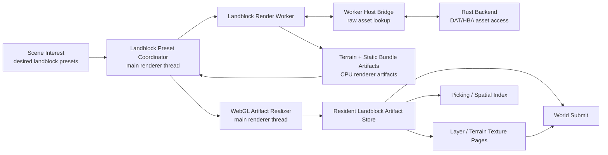
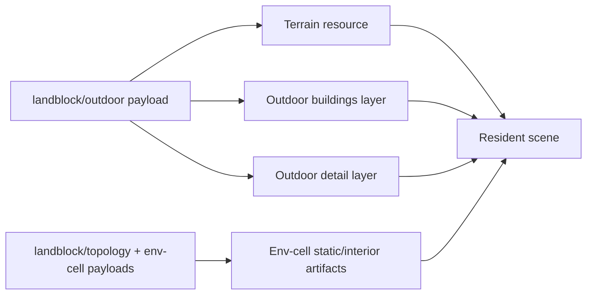
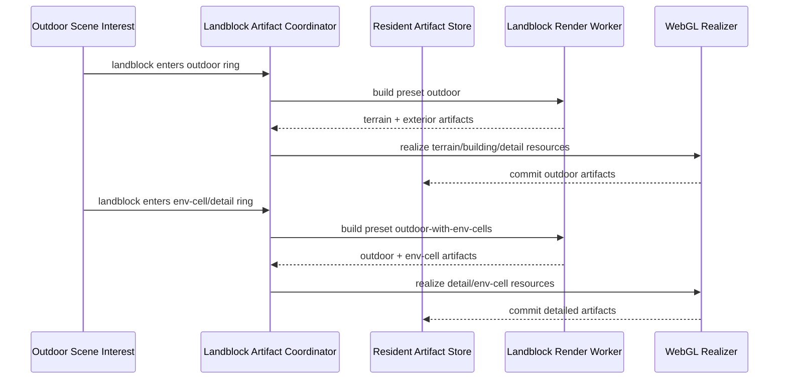
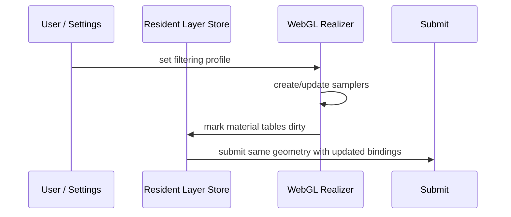
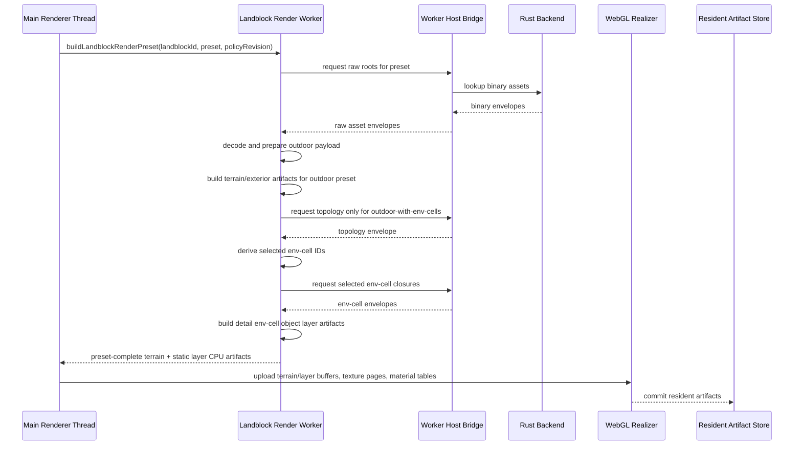

# Holtburger 3D Static Landblock Render Bundle Replacement Plan

Status: Phase 1A through Phase 1J, Phase 2A, Phase 2B, Phase 3A, Phase 3B, Phase
3C1, Phase 3C2A, and Phase 3C2B1 are implemented. Phase 3C2B2 static bundle submit
integration is the next implementation phase.
The plan has been redirected to worker-owned raw landblock closure loading, worker-built terrain
artifacts, preset-based landblock requests, and layer-scoped texture pages.

Progress:

- 2026-06-04: Added the first static bundle-layer renderer contract in
  `apps/holtburger-3d/src/lib/world-display/static-bundle-layer.ts`.
- 2026-06-04: Added a pure desired-layer planner in
  `apps/holtburger-3d/src/lib/assets/static-bundle-layer-planner.ts`.
- 2026-06-04: Added focused tests for bundle DTO shape, stable scope keys, outdoor
  building/detail layer planning, env-cell layer planning, closure blockers, and source-revision
  stability.
- 2026-06-04: Revised the target architecture so static layer workers load/prepare their own raw
  static asset closures through the worker host bridge and emit layer-owned texture page artifacts
  instead of resolving static textures against mutable global atlases.
- 2026-06-04: Dry-ran the worker-owned loading and layer-scoped page direction against the codebase.
  The asset worker already has a host binary lookup bridge and worker-local preparation path, but
  the bridge is private to `asset-worker.ts` and must be extracted before a static layer worker can
  reuse it. Env-cell layer scope discovery was initially modeled as a separate worker discovery
  step, but later phases should fold topology loading and env-cell scope derivation into the
  landblock worker call graph.
- 2026-06-04: Chose shared worker-side asset loading/preparation libraries over worker-to-worker
  delegation. `asset-worker.ts`, `static-landblock-render-worker.ts`, and future domain workers
  should import shared closure loading helpers instead of copying code or routing through a central
  asset worker service.
- 2026-06-04: Split the next work into smaller phases: shared worker asset loading foundation,
  worker-owned static contracts, worker-safe builder, static worker orchestration, renderer vertical
  slice, and expansion/deletion.
- 2026-06-04: Implemented Phase 1B. Extracted shared worker-side host asset lookup, asset
  preparation, closure dependency loading, transferable normalization, and worker profiling modules
  under `apps/holtburger-3d/src/workers/shared/`. `asset-worker.ts` now imports those helpers and
  remains the prepared-asset-cache worker instead of becoming a cross-worker service.
- 2026-06-04: Implemented Phase 1C. `DesiredStaticBundleLayer` now schedules from `rootAssetIds`
  and keeps prepared-cache closure data inside an explicit diagnostics object. Added static worker
  job/result DTOs, env-cell topology discovery DTOs, and layer-owned texture page DTOs to the static
  bundle contract.
- 2026-06-04: Implemented the first Phase 1D builder slice in
  `apps/holtburger-3d/src/lib/world-display/static-bundle-layer-builder.ts`. The builder consumes a
  Phase 1C static layer worker job plus worker-local prepared assets, expands outdoor/env-cell source
  objects, validates closure consistency, emits compacted/direct bundle DTOs, derives object/cell
  visibility records, packs layer-owned texture pages synchronously, and stays CPU-only.
- 2026-06-04: Refined the Phase 1D builder slice so material render-surface dependencies derive
  normalized `prepared-texture/...` route IDs for worker-local closure accounting and layer texture
  refs. Texture page generation no longer scans unrelated prepared texture records from the closure.
- 2026-06-04: Completed the Phase 1D normalized material texture policy refinement. The static
  bundle builder now mirrors the material texture preparation policy for raw/detail static material
  routes, validates policy-supported render-surface formats through the fixture coverage, and maps
  prepared texture payload metadata into virtual texture page usage/sample/lookup fields instead of
  assuming color RGBA pages.
- 2026-06-04: Closed Phase 1D as the worker-safe builder foundation and split its remaining broad
  extraction bucket into smaller executable phases: Phase 1E material/family eligibility, Phase 1F
  compaction geometry assembly, and Phase 1G texture/material-role hardening plus pre-worker cleanup.
- 2026-06-04: Implemented Phase 1E. Static bundle surfaces now derive material behavior and
  compacted/direct eligibility through the existing pure compaction eligibility planner instead of
  material asset ID string conventions. Static material records now carry family keys and
  transparency from those eligibility facts.
- 2026-06-04: Implemented Phase 1F. Static bundle compacted batches are now grouped by material
  family and material record instead of being merged into one layer-wide compacted batch. Builder
  tests now prove multiple compacted batches can coexist with direct entries without staged fallback
  suppression.
- 2026-06-04: Implemented Phase 1G. Layer texture page packing and virtual-ref descriptor conversion
  are now worker-safe helpers outside the static bundle builder. Focused tests cover packed vs
  single-entry layer pages and base/detail/data/control descriptor semantics.
- 2026-06-04: Added Phase 1H before worker orchestration after identifying that the new static bundle
  builder is not yet family-complete relative to the existing compaction planner. Compacted static
  material families are RGBA texture-page and indexed-paletted; detail is an optional texture role
  for both families, not a separate family. Indexed-paletted static bundle wiring must land before
  Phase 2.
- 2026-06-04: Added Phase 1I before worker orchestration after rechecking terrain. Terrain is not
  part of the static object bundle builder and has no acceptable direct-draw fallback. The existing
  renderer already has terrain tile resources, terrain blend plans, terrain color/mask/detail texture
  page families, and terrain submit code; Phase 1I must preserve that as a first-class streaming
  artifact when static worker orchestration begins.
- 2026-06-04: Redirected Phase 2 from separate topology discovery plus per-layer worker scheduling
  toward a single landblock render worker call graph. The worker should load the outdoor payload,
  build terrain, derive requested object layers, load topology when env-cell interest requires it,
  hydrate selected env cells, and return the complete set of terrain/object artifacts for the
  request.
- 2026-06-04: Refined the landblock worker request model from arbitrary artifact masks/scopes to
  monotonic landblock LoD presets that match current backend product boundaries: `outdoor` and
  `outdoor-with-env-cells`. Prepared-cache root manifests, closure diagnostics, source revisions,
  topology discovery jobs, and per-layer worker scheduling are legacy-shaped transition details, not
  the target contract.
- 2026-06-04: Dry-ran the preset model against the current codebase. The route-shaped preset
  direction is coherent; current routes are `landblock/<id>/outdoor`, `landblock/<id>/topology`,
  `env-cell/<id>`, terrain/material/profile/renderable dependencies, and prepared textures. A true
  `summary` preset should remain deferred until a cheap backend summary route/product exists.
- 2026-06-04: Implemented Phase 1H. Static bundle material route collection now detects indexed
  render surfaces, emits indexed texel and palette lookup virtual texture refs/pages from
  worker-local render-surface/palette facts, keeps optional detail refs on the indexed-paletted
  family, and feeds those descriptors into existing compaction eligibility. The phase also removed
  the stale unused camera conversion helper that had been blocking full TypeScript lint.
- 2026-06-04: Implemented Phase 1I. Added a first-class landblock terrain render artifact contract
  and builder that reuses existing terrain material, blend-plan, tile-slice, geometry, and BVH helper
  code. Terrain artifacts now stand beside static object bundle layers as CPU renderer artifacts and
  carry diagnostic roots/prepared IDs, color/mask page refs, draw-slice geometry, fallback geometry
  diagnostics, and terrain BVH keys.
- 2026-06-04: Implemented Phase 1J. Added route-shaped landblock render preset DTOs, worker job/result
  contracts, and a pure prepared-cache-free preset planner that maps current outdoor radii to one
  monotonic `outdoor` or `outdoor-with-env-cells` request per landblock. The target contract does not
  carry root manifests, topology discovery DTOs, prepared-record source revisions, or summary preset
  shims.
- 2026-06-04: Implemented Phase 2A. Added a landblock preset worker and client that load raw
  landblock/topology/env-cell closures through the worker host bridge, run worker-local asset
  preparation, build terrain plus static bundle artifacts, and return complete preset results without
  main-thread prepared asset state.
- 2026-06-04: Implemented Phase 2B. Added the resident CPU artifact store/coordinator, wired live
  browser scene interest to submit desired preset worker jobs, committed only latest worker results,
  and surfaced low-fidelity worker artifact diagnostics.
- 2026-06-04: Implemented Phase 3A. Browser terrain scene selection now consumes resident
  `LandblockTerrainRenderArtifact` results from the worker artifact store whenever the landblock
  artifact pipeline is active, so migrated outdoor terrain no longer falls back to main-thread
  prepared outdoor asset selection while worker artifacts are desired or in flight.
- 2026-06-04: Implemented Phase 3B. Worker-derived terrain tiles now carry the resident
  `LandblockTerrainRenderArtifact` into WebGL resource sync. WebGL terrain upload consumes artifact
  draw-slice geometry, fallback geometry, artifact keys, and atlas-ready terrain page bytes instead
  of rebuilding terrain blend plans or resolving prepared terrain textures from `AssetChannelState`
  for worker-derived terrain.
- 2026-06-04: Implemented Phase 3C1. Hardened the static bundle direct-entry artifact contract so
  direct static entries carry positions, normals, UVs, and indices from worker-built surfaces. This
  removes the main blocker that would have forced static direct draw realization to reach back into
  prepared gfx assets or staged draw units.
- 2026-06-04: Implemented Phase 3C2A as an immediate renderer-resource foundation before the full
  static vertical slice. Added WebGL resource ownership for static bundle layer-owned texture pages,
  material texture bindings, compacted static geometry buffers, and direct static geometry buffers.
  The resource layer validates texture page upload formats from static page sample classes and
  replaces resources by immutable layer key plus source revision.
- 2026-06-04: Corrected the Phase 3C2A indexed texture page contract so `indexed-data` pages carry
  explicit `p8` or `index16` format metadata. Static bundle page packing now keeps P8 and 16-bit
  index pages separate, and WebGL upload uses R8 for P8 pages and RG8 for 16-bit index pages.
- 2026-06-04: Implemented Phase 3C2B1. The browser render surface now forwards resident static
  landblock render artifact snapshots into the WebGL renderer. `Webgl2WorldResourceStore` owns a
  static bundle layer resource store and explicitly syncs resident `outdoor` building/detail bundle
  layers into WebGL texture/geometry/material resources without routing through staged draw-unit
  assembly, global atlas generations, or static compaction worker scheduling.
- 2026-06-04: Split the expanded detailed/static-interior migration into Phase 4A through Phase 4E.
  The detailed preset is a holistic replacement of topology/env-cell/static-interior hydration, not a
  second renderer mode. The split keeps the schedule realistic while preserving the requirement that
  all landblock-derived static geometry, portal facts, and required spatial sidecars leave the
  main-thread staged hydration path before cleanup starts.
- 2026-06-04: Corrected the post-3C2B scope: landblock-derived structured interior render geometry,
  env-cell structure metadata, portal aperture/static spatial sidecars, and staged
  `structured-interior` draw-unit assembly are in scope for the worker-artifact replacement. The
  plan must not preserve a second main-thread interior static path after outdoor/env-cell bundle
  migration.

Validation:

- `npm run test:ts -- src/lib/assets/static-bundle-layer-planner.test.ts src/lib/world-display/static-bundle-layer.test.ts`
  passed.
- `npm run check` passed.
- `npm run lint:dead` passed.
- `npm exec eslint -- src/lib/assets/static-bundle-layer-planner.ts src/lib/assets/static-bundle-layer-planner.test.ts src/lib/world-display/static-bundle-layer.ts src/lib/world-display/static-bundle-layer.test.ts`
  passed.
- `npm run lint:rust` passed.
- `npm run test:ts -- src/lib/assets/asset-channel.test.ts src/workers/shared/asset-prepare.test.ts src/workers/shared/host-asset-bridge.test.ts src/workers/shared/asset-closure-loader.test.ts src/workers/shared/transferables.test.ts`
  passed after Phase 1B.
- `npm exec eslint -- src/workers/asset-worker.ts src/workers/shared/asset-prepare.ts src/workers/shared/asset-prepare.test.ts src/workers/shared/asset-closure-loader.ts src/workers/shared/asset-closure-loader.test.ts src/workers/shared/host-asset-bridge.ts src/workers/shared/host-asset-bridge.test.ts src/workers/shared/transferables.ts src/workers/shared/transferables.test.ts src/workers/shared/worker-profile.ts src/lib/assets/asset-channel.test.ts`
  passed after Phase 1B.
- `npm run check`, `npm run lint:dead`, and `npm run lint:rust` passed after Phase 1B.
- `npm run test:ts -- src/lib/assets/static-bundle-layer-planner.test.ts src/lib/world-display/static-bundle-layer.test.ts src/lib/assets/asset-channel.test.ts src/workers/shared/asset-prepare.test.ts src/workers/shared/host-asset-bridge.test.ts src/workers/shared/asset-closure-loader.test.ts src/workers/shared/transferables.test.ts`
  passed after Phase 1C.
- `npm exec eslint -- src/lib/world-display/static-bundle-layer.ts src/lib/world-display/static-bundle-layer.test.ts src/lib/assets/static-bundle-layer-planner.ts src/lib/assets/static-bundle-layer-planner.test.ts src/workers/asset-worker.ts src/workers/shared/asset-prepare.ts src/workers/shared/asset-prepare.test.ts src/workers/shared/asset-closure-loader.ts src/workers/shared/asset-closure-loader.test.ts src/workers/shared/host-asset-bridge.ts src/workers/shared/host-asset-bridge.test.ts src/workers/shared/transferables.ts src/workers/shared/transferables.test.ts src/workers/shared/worker-profile.ts src/lib/assets/asset-channel.test.ts`
  passed after Phase 1C.
- `npm run check`, `npm run lint:dead`, and `npm run lint:rust` passed after Phase 1C.
- `npm run test:ts -- src/lib/world-display/static-bundle-layer-builder.test.ts src/lib/assets/static-bundle-layer-planner.test.ts src/lib/world-display/static-bundle-layer.test.ts src/lib/assets/asset-channel.test.ts src/workers/shared/asset-prepare.test.ts src/workers/shared/host-asset-bridge.test.ts src/workers/shared/asset-closure-loader.test.ts src/workers/shared/transferables.test.ts`
  passed after the first Phase 1D builder slice.
- `npm exec eslint -- src/lib/world-display/static-bundle-layer-builder.ts src/lib/world-display/static-bundle-layer-builder.test.ts src/lib/world-display/static-bundle-layer.ts src/lib/world-display/static-bundle-layer.test.ts src/lib/assets/static-bundle-layer-planner.ts src/lib/assets/static-bundle-layer-planner.test.ts`
  passed after the first Phase 1D builder slice.
- `npm run check`, `npm run lint:dead`, and `npm run lint:rust` passed after the first Phase 1D
  builder slice.
- `npm run test:ts -- src/lib/world-display/static-bundle-layer-builder.test.ts src/lib/assets/static-bundle-layer-planner.test.ts src/lib/world-display/static-bundle-layer.test.ts src/lib/assets/asset-channel.test.ts src/workers/shared/asset-prepare.test.ts src/workers/shared/host-asset-bridge.test.ts src/workers/shared/asset-closure-loader.test.ts src/workers/shared/transferables.test.ts`
  passed after the Phase 1D texture-route refinement.
- `npm exec eslint -- src/lib/world-display/static-bundle-layer-builder.ts src/lib/world-display/static-bundle-layer-builder.test.ts src/lib/world-display/static-bundle-layer.ts src/lib/world-display/static-bundle-layer.test.ts src/lib/assets/static-bundle-layer-planner.ts src/lib/assets/static-bundle-layer-planner.test.ts`
  passed after the Phase 1D texture-route refinement.
- `npm run check`, `npm run lint:dead`, and `npm run lint:rust` passed after the Phase 1D
  texture-route refinement.
- `npm exec prettier -- --write src/lib/world-display/static-bundle-layer-builder.ts src/lib/world-display/static-bundle-layer-builder.test.ts`
  passed from `apps/holtburger-3d` after the Phase 1D normalized material texture policy
  refinement. The same command failed from the repo root because `prettier-plugin-svelte` is not
  resolvable from that package context.
- `npm run test:ts -- src/lib/world-display/static-bundle-layer-builder.test.ts src/lib/assets/static-bundle-layer-planner.test.ts src/lib/world-display/static-bundle-layer.test.ts src/lib/assets/asset-channel.test.ts src/workers/shared/asset-prepare.test.ts src/workers/shared/host-asset-bridge.test.ts src/workers/shared/asset-closure-loader.test.ts src/workers/shared/transferables.test.ts`
  passed after the Phase 1D normalized material texture policy refinement.
- `npm exec eslint -- src/lib/world-display/static-bundle-layer-builder.ts src/lib/world-display/static-bundle-layer-builder.test.ts src/lib/world-display/static-bundle-layer.ts src/lib/world-display/static-bundle-layer.test.ts src/lib/assets/static-bundle-layer-planner.ts src/lib/assets/static-bundle-layer-planner.test.ts`
  passed after the Phase 1D normalized material texture policy refinement.
- `npm run check`, `npm run lint:dead`, and `npm run lint:rust` passed after the Phase 1D normalized
  material texture policy refinement.
- `npm run test:ts -- src/lib/world-display/static-bundle-layer-builder.test.ts src/lib/assets/static-bundle-layer-planner.test.ts src/lib/world-display/static-bundle-layer.test.ts src/lib/assets/asset-channel.test.ts src/workers/shared/asset-prepare.test.ts src/workers/shared/host-asset-bridge.test.ts src/workers/shared/asset-closure-loader.test.ts src/workers/shared/transferables.test.ts src/lib/world-display/compaction/compaction-family-planner.test.ts src/lib/world-display/material-behavior.test.ts`
  passed after Phase 1E.
- `npm exec eslint -- src/lib/world-display/static-bundle-layer-builder.ts src/lib/world-display/static-bundle-layer-builder.test.ts src/lib/world-display/compaction/compaction-family-planner.ts src/lib/world-display/compaction/compaction-family-planner.test.ts src/lib/world-display/material-behavior.ts src/lib/world-display/material-behavior.test.ts`
  passed after Phase 1E.
- `npm run check`, `npm run lint:dead`, and `npm run lint:rust` passed after Phase 1E.
- `npm run test:ts -- src/lib/world-display/static-bundle-layer-builder.test.ts src/lib/assets/static-bundle-layer-planner.test.ts src/lib/world-display/static-bundle-layer.test.ts src/lib/assets/asset-channel.test.ts src/workers/shared/asset-prepare.test.ts src/workers/shared/host-asset-bridge.test.ts src/workers/shared/asset-closure-loader.test.ts src/workers/shared/transferables.test.ts src/lib/world-display/compaction/compaction-family-planner.test.ts src/lib/world-display/material-behavior.test.ts`
  passed after Phase 1F.
- `npm exec eslint -- src/lib/world-display/static-bundle-layer-builder.ts src/lib/world-display/static-bundle-layer-builder.test.ts`
  passed after Phase 1F.
- `npm run check`, `npm run lint:dead`, and `npm run lint:rust` passed after Phase 1F.
- `npm run test:ts -- src/lib/world-display/static-bundle-layer-builder.test.ts src/lib/world-display/static-bundle-layer-texture-pages.test.ts src/lib/assets/static-bundle-layer-planner.test.ts src/lib/world-display/static-bundle-layer.test.ts src/lib/assets/asset-channel.test.ts src/workers/shared/asset-prepare.test.ts src/workers/shared/host-asset-bridge.test.ts src/workers/shared/asset-closure-loader.test.ts src/workers/shared/transferables.test.ts src/lib/world-display/compaction/compaction-family-planner.test.ts src/lib/world-display/material-behavior.test.ts`
  passed after Phase 1G.
- `npm exec eslint -- src/lib/world-display/static-bundle-layer-builder.ts src/lib/world-display/static-bundle-layer-builder.test.ts src/lib/world-display/static-bundle-layer-texture-pages.ts src/lib/world-display/static-bundle-layer-texture-pages.test.ts`
  passed after Phase 1G.
- `npm run check`, `npm run lint:dead`, and `npm run lint:rust` passed after Phase 1G.
- `npm exec vitest -- run src/lib/world-display/static-bundle-layer-builder.test.ts src/lib/world-display/static-bundle-layer-texture-pages.test.ts`
  passed after Phase 1H.
- `npm exec eslint -- src/lib/world-display/static-bundle-layer-builder.ts src/lib/world-display/static-bundle-layer-builder.test.ts src/lib/world-display/static-bundle-layer-texture-pages.ts src/lib/world-display/static-bundle-layer-texture-pages.test.ts`
  passed after Phase 1H.
- `npm run check`, `npm run lint:dead`, `npm run lint:rust`, and `npm run lint:ts` passed after
  Phase 1H.
- `npm exec vitest -- run src/lib/world-display/terrain-render-artifact.test.ts src/lib/world-display/terrain-tile-plan.test.ts src/lib/world-display/terrain-blend-plan.test.ts src/lib/world-display/terrain-materials.test.ts`
  passed after Phase 1I.
- `npm exec eslint -- src/lib/world-display/terrain-render-artifact.ts src/lib/world-display/terrain-render-artifact.test.ts src/lib/world-display/terrain-scene.ts`
  passed after Phase 1I.
- `npm run check`, `npm run lint:dead`, `npm run lint:rust`, and `npm run lint:ts` passed after
  Phase 1I.
- `npm exec vitest -- run src/lib/assets/landblock-render-preset-planner.test.ts` passed after Phase
  1J.
- `npm exec eslint -- src/lib/assets/landblock-render-preset-planner.ts src/lib/assets/landblock-render-preset-planner.test.ts src/lib/world-display/landblock-render-preset.ts`
  passed after Phase 1J.
- `npm run check`, `npm run lint:dead`, `npm run lint:rust`, and `npm run lint:ts` passed after
  Phase 1J.
- `npm exec vitest -- run src/lib/world-display/terrain-scene.test.ts` passed after Phase 3A.
- `npm run check`, `npm run lint:ts`, `npm run lint:dead`, and `npm run lint:rust` passed after
  Phase 3A.
- `npm exec vitest -- run src/lib/world-display/terrain-render-artifact.test.ts src/lib/world-display/webgl2-world-resources.test.ts src/lib/world-display/terrain-scene.test.ts`
  passed after Phase 3B.
- `npm run check`, `npm run lint:ts`, `npm run lint:dead`, and `npm run lint:rust` passed after
  Phase 3B.
- `npm exec vitest -- run src/lib/world-display/static-bundle-layer.test.ts src/lib/world-display/static-bundle-layer-builder.test.ts src/workers/static-landblock-render-worker.test.ts`
  passed after Phase 3C1.
- `npm run check`, `npm run lint:ts`, `npm run lint:dead`, and `npm run lint:rust` passed after
  Phase 3C1.
- `npm exec vitest -- run src/lib/world-display/webgl2/resources/static-bundle-layer-resources.test.ts src/lib/world-display/static-bundle-layer.test.ts src/lib/world-display/static-bundle-layer-builder.test.ts`
  passed after Phase 3C2A.
- `npm run check`, `npm run lint:ts`, `npm run lint:dead`, and `npm run lint:rust` passed after
  Phase 3C2A.
- `git diff --check` passed after Phase 3C2A.
- `npm exec vitest -- run src/lib/world-display/webgl2-world-resources.test.ts src/lib/world-display/webgl2/resources/static-bundle-layer-resources.test.ts src/lib/world-display/static-landblock-render-artifact-store.test.ts`
  passed after Phase 3C2B1.
- `npm run check`, `npm run lint:ts`, `npm run lint:dead`, and `npm run lint:rust` passed after
  Phase 3C2B1.
- `git diff --check` passed after Phase 3C2B1.

Related plans:

- [Holtburger 3D Render Resource Worker Plan](./holtburger-3d-render-resource-worker-plan.md)
- [Holtburger 3D Compacted Render Family Pipeline Replacement Plan](./holtburger-3d-compacted-render-family-pipeline-replacement-plan.md)
- [Holtburger 3D Outdoor LOD Streaming Plan](./holtburger-3d-outdoor-lod-streaming-plan.md)
- [Holtburger 3D BVH Batch Culling Plan](./holtburger-3d-bvh-batch-culling-plan.md)

This plan supersedes the render-resource worker plan for static landblock compaction and texture
packing. Do not preserve the current staged-static-to-render-resource-worker path as a compatibility
mode. The goal is to replace that pipeline, delete the old scheduling/accounting surface, and keep
only the pure CPU algorithms that are still useful inside the new landblock render worker.

## Purpose

Make open-world landblock streaming cheap enough for continuous player movement by replacing the
current static render pipeline:

```text
asset hydration -> static scene derivation -> staged draw units -> atlas planning ->
worker-scheduled packing/compaction -> pending replacement accounting -> WebGL commit
```

with an authoritative static landblock bundle-layer pipeline:

```text
landblock render request -> landblock worker builds terrain + static bundle artifacts ->
renderer uploads artifact resources -> renderer draws resident artifacts
```

Static landblock content should not pass through the staged dynamic-style renderer. A landblock
preset request should contain the complete, resolved static scene for the requested backend route
shape: terrain artifacts, static object bundle layers, compacted batches, direct static entries,
structured env-cell/interior geometry artifacts, portal/static spatial sidecars, layer-scoped
texture pages, object/cell visibility metadata, renderer diagnostics, and raw/prepared asset
dependency diagnostics. Terrain artifacts should be built by the same landblock worker request path,
not by main-thread terrain CPU prep.

## Non-Goals

- Do not keep the current static staged draw-unit pipeline as a fallback or alternate mode.
- Do not retain standalone render-resource worker job scheduling for static landblock compaction or
  texture packing.
- Do not make landblock/static workers resolve against main-thread global atlas state.
- Do not require global or shared static atlases for the first replacement.
- Do not move WebGL buffer, texture, sampler, VAO, or program ownership off the WebGL-owning thread.
- Do not move browser-mode policy into shared crates.
- Do not generalize dynamic object rendering in this plan beyond defining the boundary with static
  rendering.
- Do not preserve a separate main-thread structured-interior staging/compaction path for
  landblock-derived env-cell geometry. Interior cell render geometry, static objects, cell structure
  metadata, and portal aperture/spatial facts are in scope for worker-owned landblock presets.
- Do not require runtime assets in permanent tests.

## Current Problems

The current renderer already eventually wants landblock-scoped compacted batches, but it discovers
that boundary late. Static renderables are expanded into staged draw units first; compaction then
groups those draw units back by landblock. This does unnecessary main-thread work and makes resource
sync sensitive to changes that should not rebuild static landblock geometry.

Major costs and complexity sources:

- per-frame or dirty-frame static staging for content that is landblock-static;
- staged draw-unit identity and graph records for static content that will be compacted;
- render-resource worker scheduler groups for compaction and atlas packing;
- pending replacement retention state for resources that should instead be layer-owned;
- atlas generation identities feeding back into compacted geometry/family resources;
- global asset-state signatures invalidating too much renderer work;
- direct draw suppression because old direct draw units coexist with compacted replacements.

The replacement pipeline should eliminate the need for direct suppression. The worker emits the
complete static answer for each requested landblock preset. Within each emitted static object layer,
a surface is either represented in a compacted batch or in the bundle layer's direct static entries.

## Target Architecture

### Replacement Invariants

This is a holistic replacement of the main-thread static landblock hydration pipeline, not a second
renderer mode. The following invariants define the target:

- Landblock-derived static content must enter the renderer through resident landblock worker
  artifacts, not through `AssetChannelState`-derived static/structured scene models.
- `StaticRenderableSceneModel` must stop carrying landblock outdoor statics once the corresponding
  presets are migrated.
- `StructuredInteriorSceneModel` must stop carrying landblock/env-cell static render geometry once
  `outdoor-with-env-cells` is migrated.
- Staged draw-unit assembly must not own landblock-derived static, env-cell shell, structured
  interior, portal aperture, or static spatial facts after migration.
- Legacy compaction, atlas generation, direct suppression, and renderer graph accounting may remain
  only for non-migrated presets during the transition. They are deletion targets, not compatibility
  surfaces.
- Required culling, portal composite, portal aperture, and cell visibility facts are worker artifact
  sidecars. Picker/debug sidecars are optional, but render/spatial correctness sidecars are not.
- The main thread may request/schedule desired presets, commit resident artifacts, upload WebGL
  resources, update sampler/material binding policy, and run renderer-owned portal traversal policy.
  It must not hydrate or diff static landblock asset closures to build renderable geometry.

### Ownership Model



Responsibilities:

- Scene interest decides which landblock render presets are desired.
- The landblock preset coordinator schedules desired landblock preset requests and rejects stale worker
  results.
- The landblock render worker loads and prepares the raw closure it needs through the existing worker
  host bridge to the Rust backend. Duplicating raw asset loads in the worker is acceptable in the
  first replacement if it keeps ownership simple and moves CPU work off the main thread.
- The landblock render worker sequences terrain, outdoor static layer, topology, and env-cell
  hydration imperatively inside one async worker job. It may emit multiple independently resident
  artifacts for one request.
- Static object artifacts still own layer-scoped texture page CPU artifacts, including packed page
  bytes and virtual-ref-to-rect tables. Terrain artifacts own their terrain page artifacts.
- The WebGL renderer realizes CPU artifacts into buffers, textures, samplers, material tables, and
  VAOs.
- Resident artifact records own WebGL lifetime, layer texture page lifetime, and raw/prepared asset
  dependency diagnostics.
- Dynamic direct renderables may continue to use main-thread texture resource managers. Terrain is
  a separate first-class landblock artifact and should follow the worker-built CPU artifact model
  before object worker orchestration lands; it does not feed static object layer texture pages.

### Worker Asset Loading Reuse

Do not make the landblock render worker post work to `asset-worker.ts`, and do not copy asset-worker
logic into the landblock worker. Use shared worker-side libraries for lookup, preparation,
dependency expansion, transferables, and profiling, then let each domain worker own its own
orchestration.

Target shape:

```text
src/workers/shared/host-asset-bridge.ts
src/workers/shared/asset-prepare.ts
src/workers/shared/asset-closure-loader.ts
src/workers/shared/transferables.ts
src/workers/shared/worker-profile.ts

src/workers/asset-worker.ts
  imports shared lookup/prep helpers
  serves general main-thread prepared asset cache hydration

src/workers/static-landblock-render-worker.ts
  imports shared lookup/prep/closure helpers
  owns terrain, topology/env-cell, static object layer closure loading, compaction, and page packing

future domain workers
  import shared lookup/prep/closure helpers
  own dynamic entity, pinned scene element, skybox, effect, or other domain-specific artifacts
```

Reasons:

- Asset lookup and preparation mechanics should be shared and tested once.
- Static landblock closure completeness, dynamic entity closure completeness, and pinned/effect
  closure completeness are different orchestration policies.
- A central asset-worker service would require cross-worker scheduling, cancellation, retry/error
  routing, stale-result rejection, and transferable ownership between workers. Avoid that until a
  measured need proves it is worth the coordination cost.
- Domain workers should perform one complete domain transaction: load the closure they need, build
  the artifacts they own, and return those artifacts to the main thread.

### Desired Landblock Preset Planning

Do not let worker scheduling infer desired landblock artifacts from the whole prepared asset cache,
and do not expose an arbitrary artifact mask that recreates per-layer planner complexity. Use a pure
planner that turns renderer interest into one monotonic landblock LoD preset per landblock. Presets
should coarsely match backend route/product shapes, not every UI slider.

Target presets:

- `outdoor`: current outdoor landblock product. Backed by `landblock/<id>/outdoor`; build terrain
  plus outdoor building/detail static object artifacts and all required terrain/static page artifacts
  for exterior rendering.
- `outdoor-with-env-cells`: detailed landblock product. Backed by `landblock/<id>/outdoor`,
  `landblock/<id>/topology`, and selected `env-cell/<id>` routes; build the outdoor artifacts plus
  topology-derived env-cell static/interior artifacts.
- Future `summary`: deferred. Add only when a real cheap backend summary route/product exists. Do
  not model it as a target preset while the worker would have to load the full `landblock/<id>/outdoor`
  product anyway.

The planner may use already-prepared main-thread assets as a bootstrap source during the transition,
but the target worker contract must not require the main thread to hydrate the full static closure,
topology, env-cell roots, or per-layer root manifests before scheduling a landblock worker job.

Current code already has most of the inputs:

- `deriveOutdoorSceneInterest` owns terrain/building/detail/env-cell radii.
- `createSceneCoverageRequests` and `createStaticRenderableAssetRequests` know which outdoor,
  topology, env-cell, renderable source, material, texture, and region-profile assets are requested.
- `deriveTopologyEnvCellIdsForLandblocks` and `deriveStructuredInteriorCoverage` expand topology
  into env-cell coverage.
- `collectSelectedOutdoorSourceAssetIds` already applies the building/detail static split.

The target planner should make the preset relationship first-class:

```ts
type LandblockRenderLodPreset = "outdoor" | "outdoor-with-env-cells";

interface DesiredLandblockRenderPreset {
  landblockId: number;
  preset: LandblockRenderLodPreset;
  priority: "resident-now" | "prefetch";
  requestId: number;
  buildPolicyRevision: string;
  texturePagePolicyRevision: string;
}
```

Rules:

- Schedule one worker job per desired landblock preset, not one job per layer/root/scope.
- Preset promotion is monotonic: `outdoor` -> `outdoor-with-env-cells`. A future cheap `summary`
  preset may be inserted before `outdoor` only after a backend product exists.
- The worker decides which raw roots are needed for the requested preset. `landblock/outdoor`,
  `landblock/topology`, env-cell roots, terrain-material routes, static source routes, material
  routes, and prepared-texture routes are worker-local closure details.
- Let the worker expand the full preset closure by loading raw assets and following dependencies
  locally. For `outdoor-with-env-cells`, topology loading and selected env-cell discovery are
  internal worker steps, not a separate main-thread discovery/cache/scheduling round trip.
- `DesiredStaticBundleLayer`, `rootAssetIds`, `knownClosureAssetIds`, `knownMissingAssetIds`, and
  topology-discovery DTOs are transitional Phase 1 surfaces. Phase 2 should replace or quarantine
  them behind the landblock preset worker client.
- Do not derive target job identity from prepared-record revisions. Static DAT-derived landblock
  assets are effectively immutable during a session; stale rejection should use latest request ID,
  landblock ID, requested preset, and build/texture policy revisions.
- Keep appearance previews and other non-landblock-owned debug/editor objects out of static bundle
  layers; they should remain staged or direct dynamic entries.

### Static Bundle Layers and Outdoor LoD Presets

The current asset routes are additive in practice, but not as separate `landblock/detail` payloads.
`landblock/outdoor` provides terrain plus outdoor static member references. Renderer interest then
selects which outdoor statics should be hydrated and rendered:

- terrain radius keeps terrain resources resident;
- building radius selects outdoor static instances classified as buildings;
- detail radius selects the remaining outdoor static instances;
- env-cell radius selects topology/env-cell content for structured and interior statics.

The replacement should model those radii as landblock preset selection, not as arbitrary worker
artifact masks. The current browser exposes four policy radii, but the worker contract should target
the backend product boundaries:

- `outdoor` for terrain plus exterior outdoor statics from `landblock/<id>/outdoor`;
- `outdoor-with-env-cells` for `outdoor` plus topology/env-cell static objects, structured interior
  render geometry, cell structure metadata, portal aperture facts, and static spatial sidecars.

Terrain stays in the terrain bucket, and static object render bundle layers remain independently
resident outputs. LoD promotion can add or replace resident artifacts without passing old resident
artifacts back into the worker.



```ts
type StaticLandblockBundleLayerKind =
  | "outdoor-buildings"
  | "outdoor-detail"
  | "env-cell-static";

type StaticBundleLayerScope =
  | {
      kind: "landblock";
      landblockId: number;
      layerKind: "outdoor-buildings" | "outdoor-detail";
    }
  | {
      kind: "env-cell";
      landblockId: number;
      envCellId: number;
      layerKind: "env-cell-static";
    };
```

Layer/preset rules:

- A worker result is complete for one requested `LandblockRenderLodPreset`. It may contain terrain,
  outdoor building/detail object layers, and env-cell static layers depending on the preset.
- `outdoor-buildings` contains only building-classified outdoor static instances selected by the
  `outdoor` or `outdoor-with-env-cells` preset policy.
- `outdoor-detail` contains non-building outdoor static instances selected by the detail radius.
- `env-cell-static` contains selected env-cell static objects and structured interior render
  geometry for `outdoor-with-env-cells` and keeps cell/portal visibility metadata explicit. The
  worker derives selected env cells from topology inside the preset job.
- Existing resident layers are not passed back into the worker as mutable input.
- The resident layer store composes terrain plus zero or more static bundle layers and structured
  env-cell sidecars at submit/spatial-query time.

Promotion from distant to detailed landblock residency should be additive:



This supports both complete and additive loading without a build-on-top protocol. If interest asks
for the detailed preset immediately, the main thread schedules one `outdoor-with-env-cells` request
and the worker emits the full preset artifacts. If a landblock promotes from `outdoor` to
`outdoor-with-env-cells` later, the later request may reload raw outdoor/topology/env-cell assets
internally, but it returns a complete preset result and never consumes resident terrain/building/detail
artifacts as mutable input. The main thread may commit returned terrain, exterior, and env-cell
artifacts independently.

### Static vs Dynamic Boundary


Static landblock content is authoritative and layer-owned. Dynamic renderables remain incremental and
direct-draw unless a future proven shared system justifies a different path.

Terrain remains a separate render bucket. It may use similar page-binding concepts, but terrain
geometry, terrain texture ownership, and terrain LOD policy should not be folded into static object
bundle layers.

## Bundle Layer Contract

The bundle layer should be a renderer-shaped CPU artifact, not a direct clone of content assets and
not a WebGL resource object.

```ts
interface StaticLandblockRenderBundleLayer {
  key: string;
  scope: StaticBundleLayerScope;
  landblockId: number;
  layerKind: StaticLandblockBundleLayerKind;
  sourceRevision: string;
  rootAssetIds: readonly string[];
  preparedAssetIds: readonly string[];
  renderChunks: readonly StaticBundleRenderChunk[];
  compactedBatches: readonly StaticBundleCompactedBatch[];
  directEntries: readonly StaticBundleDirectEntry[];
  materialRecords: readonly StaticBundleMaterialRecord[];
  texturePageRefs: readonly VirtualTexturePageRef[];
  texturePages: readonly StaticBundleTexturePage[];
  objectRecords: readonly StaticBundleObjectRecord[];
  spatialHints?: readonly StaticBundleSpatialHint[];
  diagnostics: StaticLandblockBundleLayerDiagnostics;
}
```

`landblockId` and `layerKind` are denormalized from `scope` for renderer indexes and diagnostics.

Required properties:

- Complete for layer: all currently renderable static content assigned to the emitted bundle layer is
  represented or explained in diagnostics.
- Authoritative: there is no runtime direct fallback suppression for static content.
- CPU-only: no WebGL handles, no live texture objects, no renderer-thread-only state.
- Stable: IDs are derived from source landblock/object/part/material facts, not from transient
  staging order.
- Dependency-diagnostic: the bundle layer may report the roots and worker-prepared asset IDs it used
  for diagnostics and cache hints, but those lists do not drive worker scheduling, invalidation, or
  stale-result rejection in the target preset model.

### Object and Part Metadata

Visibility is already at object or cell granularity for statics. Preserve that model.

Examples:

- `outdoor-static:landblock:<id>:instance:<instance>`
- `env-static:cell:<id>:instance:<instance>`
- `env-render-geometry:cell:<id>`

Picker, selection overlay, and debug metadata are non-authoritative consumers. They must not force
staged-style per-part accounting back into the static render path. Preserve object/cell visibility
keys and minimal object identity needed by rendering. Do not design the first replacement around
richer inspection metadata. If a later diagnostic pass needs it, it must remain removable without
changing render artifacts, scheduling, or ownership.

```ts
interface StaticBundleObjectRecord {
  objectKey: string;
  visibilityKeys: readonly RenderBvhItemKey[];
  sourceAssetId: string;
  owningLandblockId: number;
  owningEnvCellId: number | null;
  kind: "scenery" | "building" | "generated-scenery" | "indoor-static";
  partHints?: readonly StaticBundlePartHint[];
}

interface StaticBundlePartHint {
  renderKey: string;
  partIndex: number;
  gfxObjAssetId?: string;
  bounds?: RenderBounds;
}
```

`spatialHints` are optional only for picker/debug fidelity. Required render/spatial facts for
visibility, cell culling, portal composites, and portal apertures are authoritative worker artifact
sidecars and must not be rebuilt from main-thread prepared asset state. Higher-fidelity picking can
be added later only if it stays removable and does not affect layer build keys, compaction layout,
layer texture page packing, or submit scheduling.

## Layer-Scoped Texture Page Model

The current renderer already treats standalone textures as degenerate atlas pages. Keep that concept
and make it explicit, but do not resolve static layer textures against mutable global atlas state in
the first replacement. Static bundle layer workers should emit complete layer-scoped texture page
artifacts: single-entry pages or packed atlas pages owned by that layer.


```ts
interface VirtualTexturePageRef {
  key: string;
  sourceAssetId: string;
  usageBucket:
    | "base-color"
    | "detail"
    | "indexed-texels"
    | "palette-lookup"
    | "terrain"
    | "road"
    | "alpha-control";
  sampleClass: "rgba-color" | "indexed-data" | "palette-data" | "control-data";
  width: number;
  height: number;
  wrapS: "clamp" | "repeat";
  wrapT: "clamp" | "repeat";
  samplingDomain: "color" | "data" | "control";
  lookup: "color-filtered" | "exact" | "control-filtered";
  bytes?: Uint8Array;
}

interface ResolvedTexturePageBinding {
  pageKind: "single-entry" | "packed-atlas";
  textureKey: string;
  rect: readonly [number, number, number, number];
  width: number;
  height: number;
  samplerProfileKey: string;
}

interface StaticBundleTexturePage {
  key: string;
  scopeKey: string;
  pageKind: "single-entry" | "packed-atlas";
  usageBucket:
    | "base-color"
    | "detail"
    | "indexed-texels"
    | "palette-lookup"
    | "terrain"
    | "road"
    | "alpha-control";
  sampleClass: "rgba-color" | "indexed-data" | "palette-data" | "control-data";
  width: number;
  height: number;
  bytes: Uint8Array;
  entries: readonly {
    virtualRefKey: string;
    sourceAssetId: string;
    rect: readonly [number, number, number, number];
  }[];
}
```

Static layer texture page rules:

- Each static bundle layer owns its texture page artifacts.
- The worker chooses single-entry vs packed layer page placement for static layer materials.
- Existing main-thread atlas state is not passed into the worker.
- Worker output may duplicate texture bytes already used by another layer. This is acceptable until
  measurements prove memory or bind count is the limiting bottleneck.
- Building, detail, and env-cell promotion stays additive because each layer owns its own pages.
- Eviction is simple: evict the resident layer and its layer-owned WebGL textures together.
- Global/shared static atlas deduplication is explicitly deferred.

Main-thread texture responsibilities:

- Upload layer-owned texture pages to WebGL.
- Create/update samplers for current global filtering policy.
- Bind material records to layer-owned page textures and rects.
- Rebuild sampler state or material binding tables when global filtering changes.

Landblock preset workers do not schedule standalone atlas-packing jobs. They call extracted packing
helpers synchronously inside the layer build and emit immutable texture page artifacts. There are no
static atlas generations in the renderer resource store for this path.

Changing global texture filtering should not rebuild static bundle layers or compacted geometry. It
should update sampler state or renderer material tables. Only CPU texture-page policy changes that
alter page bytes or placement, such as padding/extrusion rules, should rebuild layer artifacts.

### Texture Resolution Sequence



## Worker Pipeline

The landblock render worker job is asynchronous at the job boundary and synchronous internally. Do
not schedule nested render-resource worker jobs for compaction, texture packing, terrain prep, or
topology/env-cell discovery.



Internal worker steps:

1. Validate the landblock ID, requested preset, request ID, and CPU build policy.
2. Load the raw roots required by the preset through the worker host bridge and prepare them locally.
3. Build the terrain artifact first because terrain has no static direct fallback.
4. For `outdoor` and `outdoor-with-env-cells`, expand outdoor object layers:
   - building outdoor statics;
   - non-building outdoor statics and generated scenery.
5. For `outdoor-with-env-cells`, load `landblock/topology`, derive selected env-cell IDs, then load
   only those env-cell roots and closures.
6. Expand requested env-cell static/interior content.
7. Expand setup-model and setup-appearance parts for each object artifact.
8. Resolve material records into render families and virtual texture refs.
9. Decode/prepare texture inputs required by terrain and static materials.
10. Build terrain-scoped and layer-scoped single-entry or packed texture pages plus virtual-ref rect
    bindings.
11. Classify static object surfaces as compacted or direct.
12. Build compacted geometry batches with material-slot indices.
13. Build direct static entries for surfaces that cannot be compacted.
14. Emit object/cell visibility metadata and optional diagnostics.
15. Emit root asset IDs, worker-prepared dependency IDs, texture page diagnostics, and skipped
    content diagnostics.

### Scheduling Model

Use one scheduler for landblock render preset jobs, not separate schedulers for topology discovery,
env-cell hydration, per-layer roots, compaction, RGBA atlas packing, indexed atlas packing, and
renderer replacement groups.

Scheduler keys should be based on:

- `landblockId`;
- requested `preset`;
- latest `requestId`;
- renderer build policy revision;
- CPU texture-page policy revision only when it changes worker output bytes or placement.

Do not include prepared-record revisions, sampler policy, or WebGL texture object identity in the
landblock worker job key. Static DAT-derived landblock source assets are effectively immutable
during a session; stale-result rejection should be latest-request based, not prepared-cache revision
based. Static layer page placement is worker output and should be represented by the preset artifact
policy revision, not by a separate renderer atlas generation.

Scheduling behavior:

- Coalesce duplicate desired landblock preset requests before posting worker jobs.
- Limit concurrent landblock worker jobs so nearby terrain and camera interaction stay
  responsive.
- Prefer higher-priority nearby presets over prefetch presets.
- Cancel or ignore queued jobs for landblocks whose desired preset changed before they start.
- Commit ready terrain/layer artifacts in deterministic scope order when several finish in the same
  frame.
- Do not block terrain upload or dynamic direct draws on static layer completion.
- Treat worker closure loading, topology discovery, env-cell hydration, terrain CPU prep, and object
  bundle building as part of the landblock job for scheduling and cancellation.

The first implementation can reuse the existing worker-client shape, but it should not reuse
`render-resource-job-scheduler.ts` as a general abstraction unless that name and ownership still fit
after static compaction and atlas jobs are removed.

## Renderer Submit Model

Static submit should consume resident bundle-layer resources directly.


The old `replaceableDrawUnitIds` idea should be removed for static bundle layers. It exists today
because direct staged draw units and compacted replacements coexist. In the new model, the worker
decides the representation once. Submit only asks which bundle-layer entries are visible.

Dynamic direct entries may continue to use a direct submit path and a main-thread texture manager,
but they should not contribute to static layer texture pages or cause static bundle-layer
recompaction.

## Static Asset Retention and Raw Loading

Static landblock retention should move from staged renderer graph projection to resident resource
ownership. The target static path does not require main-thread prepared asset records for every
static dependency before the worker starts. The worker may load raw assets independently through the
worker host bridge.


Bundle-layer commit installs ownership records for WebGL buffers and layer-owned textures. Root and
dependency asset IDs are diagnostics/cache hints only, not ownership or scheduling inputs.
Bundle-layer eviction releases WebGL resources and diagnostic retention state. No diagnostic graph
node is required to explain static retention.

The main prepared-asset cache may still retain dynamic direct resources, appearance previews, and
transitional debug assets. It should not be the authority for static object or terrain landblock
closure completeness once worker-owned loading is in place.

## Implementation Phases

Each phase should remove or replace the old surface it makes obsolete. Do not add long-lived
parallel paths.

### Dry-Run Findings for Worker-Owned Loading

Dry run date: 2026-06-04.

What is realistic:

- `src/workers/asset-worker.ts` already proves workers can request raw asset data from the main
  thread and receive binary lookup envelopes from the Rust backend.
- `AssetWorkerHostBridge` already batches worker-originated asset lookup requests, waits for
  `host-lookup-assets-binary-complete`, decodes binary envelopes with
  `decodeBinaryAssetBatchEnvelope`, and returns `AssetLookupResponseDto` records inside the worker.
- `prepareAssetPayload` is already exported and can prepare decoded lookup responses into
  `PreparedAssetRecord` values inside a worker.
- `asset-channel.ts` already forwards worker host lookup requests to `lookupBinaryAssetEnvelopes`
  and transfers returned envelope buffers back to the worker.
- `getAssetResponseDependencies` in `assets/dependencies.ts` can drive worker-local dependency
  expansion from raw lookup responses.
- `planAtlasLayout` is renderer-neutral and can be reused by a worker-safe layer page packer.
- Existing RGBA and indexed atlas worker payloads prove texture page byte buffers can be transferred
  back to the main thread.

Gaps and refinements:

- `AssetWorkerHostBridge`, host lookup message types, transferable normalization helpers, and
  profiling helpers are currently coupled to `asset-worker.ts`. Extract shared worker-side
  lookup/prep/closure libraries before implementing `static-landblock-render-worker.ts`; do not
  copy/paste a second bridge or make the landblock worker delegate to the asset worker.
- Outdoor `outdoor-buildings` and `outdoor-detail` artifacts are schedulable from landblock IDs
  because the worker can load `landblock/outdoor` and select members locally. Env-cell static
  artifacts should also be scheduled from landblock-level interest, with topology lookup and selected
  env-cell ID derivation sequenced inside the landblock render worker call graph.
- Do not add a separate topology discovery worker job before full env-cell layer scheduling unless
  measurement proves the single landblock worker transaction is too coarse. The preferred shape is:
  the main thread requests env-cell artifacts for a landblock interest band; the worker loads
  `landblock/topology`, derives selected env cells, loads those env-cell payloads, and returns
  independently commit-ready `env-cell-static` artifacts beside terrain/building/detail artifacts.
- Worker closure loading must explicitly add `setup-appearance/<setup-model-id>` companion assets
  for setup models. Setup appearance is not discovered through generic response dependencies.
- Worker texture loading should use `NORMALIZED_MATERIAL_TEXTURE_PREPARATION_POLICY` after resolving
  material render surfaces, then request `prepared-texture/...` routes through the host bridge. Do
  not require the main thread to pre-request atlas-ready prepared textures for static layers.
- Current RGBA atlas planning helpers are staged/draw-unit-shaped. Extract a layer page packer with
  layer material/virtual-ref candidate inputs instead of reusing `drawUnitId` terminology in static
  worker code.
- Current RGBA atlas CPU generation lives under `webgl2/resources/texture-atlas-generation.ts` and
  its worker job key includes filtering/anisotropy. For layer-scoped static pages, move CPU pixel
  assembly to a renderer-neutral module and keep sampler policy out of CPU page artifact keys.
- Indexed atlas planners are closer to worker-safe because they already operate on byte candidates,
  but their candidate IDs still say `drawUnitId`; rename or wrap them before using them in static
  layer builders.

### Preset Model Dry-Run Findings

Dry run date: 2026-06-04.

The preset model is directionally cleaner than artifact masks, but the current codebase still has
several Phase 1-shaped contracts that must be replaced before Phase 2.

What fits:

- `deriveOutdoorSceneInterest` already derives deterministic terrain/building/detail/env-cell
  interest sets from one focus landblock. Mapping those sets to a single desired preset per
  landblock is straightforward.
- `WorkerHostAssetBridge`, `loadWorkerAssetClosure`, and `prepareAssetPayload` already support a
  worker imperatively loading raw route closures through the main-thread host bridge.
- The current route set gives the worker enough roots for `outdoor` and `outdoor-with-env-cells`:
  `landblock/<id>/outdoor`, `landblock/<id>/topology`, `env-cell/<id>`, terrain material,
  region-profile, renderable, material, render-surface, palette, and prepared-texture routes.
- `static-bundle-layer-builder.ts` already proves complete layer CPU artifacts can be built from
  worker-local prepared assets and synchronous texture page packing.
- Terrain CPU helpers are mostly pure enough to extract: `terrain-scene.ts`,
  `terrain-blend-plan.ts`, `terrain-materials.ts`, and `terrain-tile-plan.ts` are main-thread
  callers today but not inherently WebGL-owned.

Gaps and course corrections:

- A true `summary` preset is not backed by a live route in this checkout. The Tauri route parser and
  host DTOs recognize `landblock/<id>/outdoor`, `landblock/<id>/topology`, `env-cell/<id>`, and
  related dependency routes, but not `landblock-summary/*`. Defer `summary` until a cheap backend
  product exists.
- `landblock/<id>/outdoor` currently includes terrain, outdoor static members, prepared static mesh
  facts, dependencies, and outdoor BVH. The Rust assembler builds prepared outdoor static instances
  and meshes while assembling this payload. Treat this as the `outdoor` preset, not a cheap summary
  preset.
- `static-bundle-layer.ts` still exposes `DesiredStaticBundleLayer`,
  `StaticBundleLayerWorkerJob`, `StaticBundleEnvCellTopologyDiscoveryJob`, `sourceRevision`,
  `rootAssetIds`, and discovered env-cell scope DTOs. These are now transitional surfaces. Phase 2
  should not build a landblock worker around them.
- `static-bundle-layer-planner.ts` still derives env-cell layer scopes by reading prepared topology
  from the main-thread cache. Under the preset model this should be deleted or quarantined as
  transition-only diagnostics; env-cell derivation belongs inside the `outdoor-with-env-cells`
  worker job.
- `scene-asset-request-planner.ts` still requests topology, env cells, renderable dependencies,
  material dependencies, and prepared textures on the main thread for static landblock rendering.
  Dynamic/direct and debug paths may keep using it, but static landblock preset jobs should own that
  dependency chase.
- Terrain still crosses the renderer as a main-thread `TerrainSceneModel` derived from
  `assetState.preparedByAssetId`, then WebGL resources realize terrain tile resources from that
  scene. Phase 1I must define a terrain artifact DTO before the `outdoor` vertical slice can
  honestly move terrain and exterior statics over the worker boundary together.
- `webgl2-world-resources.ts` still builds staged world assembly, terrain resources, draw units,
  atlas generation state, graph leases, and pending compacted replacement state in one sync path.
  The preset model should insert resident artifact realization as the replacement path for migrated
  presets, then delete staged/static and staged/structured-interior pieces as coverage expands. Do
  not let the artifact path become a parallel renderer mode.

Immediate refinement:

- Add an interim preset-contract hardening phase before Phase 2. It should introduce target
  `LandblockRenderLodPreset`, `DesiredLandblockRenderPreset`, and `LandblockRenderPresetWorkerJob`
  DTOs, map current LoD radii to route-shaped presets, explicitly defer `summary` until a cheap
  backend route exists, and mark the Phase 1 layer/topology/source-revision DTOs as
  transitional-only.

### Codebase Impact Map

The dry-run target is to move behavior, not preserve current file boundaries.

Likely new or renamed modules:

- `static-bundle-layer-planner.ts`: derives `DesiredStaticBundleLayer` records from scene interest
  and root route facts. Its Phase 1A prepared-cache closure mode is transitional; Phase 2 should
  replace target scheduling use with preset planning.
- `static-landblock-render-worker-client.ts`: posts landblock preset jobs, tracks latest request IDs
  and policy revisions, consumes transferable terrain and static layer results.
- `static-landblock-render-worker.ts`: loads raw landblock closures through the worker host bridge,
  prepares assets, sequences terrain/topology/env-cell/object artifact building, packs scoped texture
  pages, and builds CPU geometry artifacts.
- `static-bundle-layer-builder.ts`: pure CPU expansion/classification/compaction/page-pack builder
  used inside the worker and tests.
- `workers/shared/host-asset-bridge.ts`: shared worker-side host lookup bridge and message helpers
  extracted from `asset-worker.ts`.
- `workers/shared/asset-prepare.ts`: shared worker-local asset preparation helpers, including
  `prepareAssetPayload`.
- `workers/shared/asset-closure-loader.ts`: reusable dependency expansion and closure loading
  helpers used by static and future domain workers.
- `workers/shared/transferables.ts`: transferable normalization helpers for typed-array payloads.
- `workers/shared/worker-profile.ts`: worker-local profiling helpers.
- `texture-pages/layer-texture-page-packer.ts`: renderer-neutral static layer page packing and CPU
  byte assembly.
- `webgl2/resources/static-bundle-layer-resources.ts`: realizes layer artifacts into WebGL buffers,
  layer-owned textures, material tables, and direct-entry resources.

Likely modules to split or heavily edit:

- `scene-asset-request-planner.ts`: keep dynamic, preview, and explicitly non-migrated transitional
  asset lookup policy only. Terrain and static landblock preset coverage must leave this planner as
  their worker artifact paths land. Stop treating full static landblock closure hydration, topology
  discovery, env-cell hydration, structured-interior geometry hydration, or static texture dependency
  preparation as a main-thread prerequisite.
- `browser-render-resource-coordinator.ts`: stop deriving full `StaticRenderableSceneModel` for
  landblock statics every update; stop deriving landblock/env-cell `StructuredInteriorSceneModel`
  payloads for renderable static geometry once detailed presets migrate; derive desired landblock
  presets and keep runtime previews separate.
- `static-renderables.ts`: extract reusable source expansion, setup-model/setup-appearance part
  expansion, material-context creation, and stable key helpers into worker-safe builder inputs.
- `render-spatial-scene.ts`: stop importing `buildStaticRenderablePartMatrix` from
  `staged-world-assembly.ts`; move transform helpers to a neutral static-render utility.
- `world-render-frame.ts`: replace the `static-staged` category with static layer/direct dynamic
  categories once staged statics are gone.
- `webgl2-world-resources.ts`: replace staged draw-unit static fields, graph leases, compaction
  plans, structured-interior static resource accounting, and atlas-generation state with resident
  layer/interior sidecar and layer-owned texture resource state.
- `webgl2-world-submit.ts`: replace runtime compacted-replacement planning with explicit static
  layer compacted/direct/interior submit passes plus dynamic direct passes.
- `src/workers/asset-worker.ts`: import shared lookup/prep/transfer/profile helpers after
  extraction. Keep it as the general prepared-asset cache worker, not as a service that static
  workers call.
- `assets/dependencies.ts`: may need worker-safe helpers for layer-specific dependency traversal so
  container assets such as `landblock/outdoor` and `landblock/topology` do not expand unrelated
  layer members.
- `world-display/webgl2/resources/texture-atlas-generation.ts`: split WebGL upload/sampler
  ownership from CPU atlas pixel assembly before using the CPU pieces in static workers.
- `world-display/texture-pages/texture-page-atlas-planner.ts`: adapt or wrap staged draw-unit
  candidate types into layer material/virtual-ref candidate types.
- `world-display/texture-pages/indexed-resource-atlas-planner.ts`: adapt or wrap `drawUnitId`
  terminology before using it for static layer candidates.

Likely deletion targets after migration:

- `worker-resources/compacted-geometry-worker-scheduler.ts`
- `worker-resources/texture-atlas-worker-scheduler.ts`
- `worker-resources/indexed-atlas-worker-scheduler.ts`
- static callers in `render-resource-worker-client.ts`
- static job payloads in `worker-resources/*worker-payloads.ts`
- static compaction sync in `webgl2/resources/compacted-geometry-sync.ts`
- global/static texture page manager concepts if they only exist to resolve static layer refs
  against mutable renderer atlas state
- static replacement metrics and tests in `webgl2-world-submit.test.ts`,
  `webgl2-world-resources.test.ts`, and family submit tests that only assert suppression behavior.

Keep or extract:

- `compaction/compacted-geometry.ts`: CPU compaction data assembly.
- parts of `compaction/compaction-family-planner.ts`: eligibility/classification logic, after
  removing staged draw-unit assumptions.
- `texture-pages/texture-page-atlas-planner.ts` and
  `texture-pages/indexed-resource-atlas-planner.ts`: packing helpers, if called synchronously inside
  the static layer worker/builder without renderer job scheduling.
- `texture-pages/texture-page-binding.ts`: terminology and shader binding model for single-entry
  and packed pages.
- `static-renderable-bvh-bindings.ts` and `prepared-bvh-visibility.ts`: object/cell visibility keys.

### Phase 1A: Define Bundle-Layer Contracts and Desired-Layer Planner

Status: Implemented on 2026-06-04.

Implemented:

- Added static bundle-layer DTOs for complete layer artifacts, including compacted batches, direct
  entries, material records, virtual texture page refs, object records, optional spatial hints, and
  diagnostics.
- Added stable static layer scope keys for landblock and env-cell layers.
- Added `DesiredStaticBundleLayer` planning for:
  - `outdoor-buildings`;
  - `outdoor-detail`;
  - `env-cell-static`.
- Added closure planning that reports missing prepared assets as blockers instead of emitting
  partial layer readiness.
- Added deterministic `sourceRevision` values from ordered closure asset IDs and prepared record
  timestamps.
- Added tests proving outdoor building/detail layers are additive, env-cell layers are derived from
  topology and env-cell payloads, root blockers are reported, and source revisions do not depend on
  prepared-record insertion order.

Decisions and course corrections:

- Container assets are closure anchors, not always transitive dependency expansion sources.
  `landblock/outdoor` is retained in an outdoor layer closure, but it must not pull every static in
  the landblock into both the building and detail layers. `landblock/topology` is retained for
  env-cell layers, but a single env-cell layer should not expand every topology-linked cell.
- Selected source assets and env-cell assets drive transitive dependency discovery. This preserves
  layer completeness without reintroducing whole-landblock incremental diff accounting.
- `setup-appearance/<setup-model-id>` is included as a known setup-model companion asset and is
  reported as a missing blocker when absent.
- Region render profile assets are included in static layer closures because outdoor static material
  signatures currently read region detail-role data.
- Negative LOD radii are not a way to suppress a layer family; the existing outdoor interest API
  clamps them to zero. Tests should assert relevant planned layers rather than inventing planner-only
  radius semantics.
- The first source-revision implementation uses `preparedAt` because prepared records do not expose
  a dedicated cache/content revision yet. Replace this with explicit prepared payload/cache revision
  fields if those are added.
- This phase was implemented before the decision to move raw static closure loading into the worker.
  Treat `closureAssetIds`/`missingAssetIds` as transitional planning diagnostics, not the final
  static worker scheduling contract.

Introduced cleanup targets:

- The new contract test keeps Phase 1 DTO exports visible to knip until real consumers exist. Delete
  any purely DTO-shape assertions once the builder and resource realizer consume the exported types.
- The planner duplicates a small amount of source/setup companion discovery that also exists in the
  current request/static-renderable paths. Phase 1C should remove that duplication from the target
  scheduling path or quarantine it as transitional validation-only code until the worker closure
  loader replaces it.

Legacy shims introduced:

- None. Phase 1A added new contracts and a pure planner only; it did not add a compatibility mode,
  reexport bridge, renderer fallback, or alternate static render path.

Legacy debt found before the next phase:

- Resolved during Phase 1H: the repeated `npm run lint:ts` blocker from unused camera conversion code
  was deleted, and full TS lint now passes.

Exit criteria:

- Bundle-layer DTOs can represent compacted and direct static outputs.
- Desired-layer planner tests prove building/detail/env-cell scope selection, transitional closure
  diagnostics, blocker reporting, stable scope keys, and stable source revisions.

### Phase 1B: Shared Worker Asset Loading Foundation

Status: Implemented on 2026-06-04.

Implemented:

- Extracted shared worker-side asset loading libraries from the existing asset worker:
  - `workers/shared/host-asset-bridge.ts`;
  - `workers/shared/asset-prepare.ts`;
  - `workers/shared/asset-closure-loader.ts`;
  - `workers/shared/transferables.ts`;
  - `workers/shared/worker-profile.ts`.
- Kept `asset-worker.ts` as a consumer of those shared libraries. It still owns the current
  prepared-asset-cache worker flow and does not become a central service that static workers call.
- Preserved current `AssetChannel` behavior while moving lookup, preparation, transfer, and profile
  implementation details out of `asset-worker.ts`.
- Added focused tests with fake host lookup responses for host request/complete/error flow, binary
  envelope decoding, worker-local `prepareAssetPayload`, dependency expansion, and transferable
  normalization.
- Kept the shared modules domain-neutral. They know about asset lookup, preparation, dependency
  traversal, transferables, and profiling, but not static landblocks, dynamic entities, skyboxes,
  effects, or renderer resource ownership.

Decisions and course corrections:

- Do not export unused convenience types/functions from the shared modules. Knip caught an early
  over-export of a bridge message union, closure lookup interface, and response-summary helper; they
  were made private instead of retained as future-facing API.
- `asset-channel.test.ts` now stays scoped to channel behavior. Payload-preparation assertions live
  with `workers/shared/asset-prepare.test.ts`, where the ownership is clearer.
- `loadWorkerAssetClosure` intentionally returns raw lookup responses and a response map. It does
  not prepare payloads itself because future domain workers may need domain-specific expansion,
  retry, and failure policy before preparation.
- The first closure-loader test uses schema-valid fixture payloads. Dependency traversal is
  intentionally contract-driven through `getAssetResponseDependencies`; fake payload shortcuts can
  hide broken loader behavior.

Introduced cleanup targets:

- `asset-worker.ts` still owns asset-worker-specific message contracts. Move or split those only
  when the static worker contract exists in Phase 1C; doing it earlier would create generic message
  abstractions with only one concrete worker.
- Shared closure loading currently uses generic response dependencies only. Phase 1C/1D must add or
  pass domain hooks for setup-appearance companions and normalized prepared-texture routes rather
  than broadening `getAssetResponseDependencies` with static-only policy.

Legacy shims introduced:

- None. `asset-worker.ts` imports the shared modules directly, and payload-preparation tests import
  the shared module instead of relying on a reexport through `asset-worker.ts`.

Legacy debt found before the next phase:

- Resolved during Phase 1H: the repeated `npm run lint:ts` blocker from unused camera conversion code
  was deleted, and full TS lint now passes.

Exit criteria:

- `asset-worker.ts` imports the shared worker asset loading libraries and still passes existing
  asset-channel tests.
- No shared worker asset loading code is duplicated in static-specific modules.
- Shared worker asset loading code is reusable by future dynamic entity, pinned scene element,
  skybox, effect, or other domain workers without routing through `asset-worker.ts`.
- Full TypeScript checks, changed-file lint, knip, and focused tests pass.

### Phase 1C: Static Bundle Contracts for Worker-Owned Loading

Status: Implemented on 2026-06-04.

Implemented:

- Replaced `DesiredStaticBundleLayer.closureAssetIds` / `missingAssetIds` as the scheduling
  contract with `rootAssetIds`.
- Kept prepared-cache closure data inside an explicit diagnostics object. These diagnostics do not
  drive static worker scheduling.
- Added layer texture page DTOs to the implemented bundle contract:
  - layer page key;
  - page kind;
  - usage/sample class;
  - dimensions;
  - packed/single-entry bytes;
  - virtual-ref-to-rect entries.
- Added `StaticBundleLayerWorkerJob`, including scope, root asset IDs, source revision, build
  policy revision, and CPU texture-page policy revision.
- Added env-cell topology discovery DTOs for worker-owned scope discovery:
  - input: landblock ID and source/build policy revision;
  - output: discovered `env-cell-static` scopes, env-cell root asset IDs, topology dependency IDs,
    and diagnostics.
- Added `StaticBundleLayerWorkerResult` so the static worker result is a complete
  `StaticLandblockRenderBundleLayer` CPU artifact.
- Updated tests for key stability, root manifest planning, transitional known-closure diagnostics,
  source revision independence from diagnostic closure changes, env-cell topology discovery output,
  and layer-scoped texture page shape.

Decisions and course corrections:

- Root manifests are intentionally shallow. `outdoor-buildings` and `outdoor-detail` currently use
  `landblock/outdoor` as the root; `env-cell-static` uses `landblock/topology` plus the selected
  `env-cell` root. Selected source/renderable assets remain known-closure diagnostics until the
  worker builder owns expansion.
- Source revisions are now derived from scope and root asset prepared revisions only. Prepared-cache
  diagnostic closure changes should not reschedule static worker jobs.
- Layer texture page helper types are private nested contract details unless a real consumer needs
  to import them. Knip caught early over-exporting, and the contract was narrowed.
- Negative outdoor radii still clamp through existing scene-interest behavior. Tests that need a
  specific layer must select by scope instead of relying on result order.

Introduced cleanup targets:

- Phase 1A's prepared-cache closure collector remains in
  `static-bundle-layer-planner.ts` only to populate transitional diagnostics. Phase 1D/2 should
  remove or quarantine it once worker-local closure loading and static builder diagnostics exist.
- Static-specific setup-appearance companion expansion and prepared-texture route derivation are not
  in the generic Phase 1B closure loader. Add them as static builder/worker policy instead of
  widening generic asset dependency traversal.
- The worker message contracts are now represented as DTOs but have no worker client yet. Phase 2
  should avoid adding compatibility message wrappers around these shapes.

Legacy shims introduced:

- None. The planner contract changed in place from closure scheduling to root scheduling; no
  alternate planner mode or compatibility reexport was added.

Legacy debt found before the next phase:

- The repeated `npm run lint:ts` blocker from unused camera conversion code was resolved during
  Phase 1H.

Exit criteria:

- Static layer scheduling can be expressed without a complete main-thread prepared closure.
- Env-cell layer scheduling no longer requires full main-thread topology hydration. The Phase 1C
  explicit topology discovery DTO is transitional and should be replaced or quarantined by the Phase
  2 landblock worker call graph, where topology loading and env-cell selection happen inside the
  worker job.
- Bundle-layer DTOs can represent compacted output, direct output, and layer-owned texture pages.
- Tests prove scope keys, source revisions, root manifests, and layer page records are stable.
- The plan and code no longer imply that global atlas state must be passed into static workers.

### Phase 1D: Worker-Safe Static Bundle Builder

Status: Implemented on 2026-06-04. This phase established the worker-safe builder foundation and
normalized material texture route policy support. Remaining work that was previously grouped under
Phase 1D is now split into Phase 1E, Phase 1F, and Phase 1G.

Implemented in the first builder slice:

- Added `static-bundle-layer-builder.ts`, a pure CPU builder that consumes `StaticBundleLayerWorkerJob`
  and worker-local `PreparedAssetRecord` values.
- Added worker-local closure dependency accounting via `collectWorkerPreparedDependencyIds`,
  including setup-appearance companion discovery for setup models.
- Added source-object expansion for `outdoor-buildings`, `outdoor-detail`, and `env-cell-static`
  scopes from worker-local prepared roots.
- Added conservative compacted/direct classification and bundle DTO emission:
  - compacted batch DTOs for compactable synthetic geometry;
  - direct entry DTOs for noncompactable layer-local surfaces.
- Added layer-local material records, object/cell visibility records, and diagnostics.
- Added synchronous layer-owned texture page packing using the renderer-neutral atlas layout planner:
  - single-entry pages;
  - packed atlas pages;
  - virtual-ref-to-rect entries.
- Added material-derived normalized prepared-texture route derivation for render-surface
  dependencies. Worker-prepared dependency accounting now includes the policy-derived
  `prepared-texture/...` routes for raw/detail static material usages, and texture page refs are
  built from the material routes actually used by the layer.
- Added virtual texture page classification from prepared texture payload metadata. Base color,
  detail, mask/control, data, and color-filtered lookup shapes can now be represented without
  hardcoding all material refs as color RGBA.
- Added fixture-based tests proving stable object/cell keys, worker-prepared dependency collection,
  hard failure for inconsistent closures, compacted/direct output, packed/single texture pages, and
  texture-page key independence from sampler/filtering policy. The render-surface fixture now uses a
  policy-supported RGBA source format so the tests exercise the normalized policy rather than
  bypassing it.

Decisions and course corrections:

- The first builder slice intentionally does not reuse staged draw units or render-resource worker
  payloads. It emits the Phase 1C bundle DTOs directly.
- The compacted-batch assembly is a conservative layer-local DTO builder, not the final optimized
  compaction-family extraction. Phase 1E and Phase 1F should extract real material/family
  eligibility and compaction assembly from the current compaction path without importing staged
  scheduling concepts.
- Texture page packing reuses `planAtlasLayout`, which is already renderer-neutral. CPU pixel
  assembly is simple RGBA placement for now; richer DXT/indexed/palette handling remains a later
  builder extraction target.
- A real bug was found and fixed in worker-prepared dependency collection: sorting an indexed queue
  while iterating could skip dependencies. The collector now uses a deterministic shift/sort loop.
- Texture route derivation is now material-driven. Unrelated prepared textures in the worker-local
  closure no longer produce layer texture pages.
- Texture route derivation now goes through `resolveNormalizedPreparedTextureAssetIds` instead of
  reconstructing `prepared-texture/...` IDs locally. This keeps the builder aligned with the scene
  asset request planner and avoids another policy fork.
- The builder currently asks the normalized policy for raw/detail material routes. Mask/control
  classification is represented at the virtual texture page layer, but selecting alpha-control routes
  still needs explicit material-role semantics before it should be scheduled for ordinary static
  objects.
- Knip caught an unused prepared-texture helper export and an over-exported build policy interface;
  both were removed/narrowed rather than kept as speculative API.

Introduced cleanup targets:

- `static-bundle-layer-builder.ts` currently owns a small amount of static source expansion logic
  that overlaps with `static-renderables.ts`. As the builder matures, keep the worker-safe version
  and delete or narrow the staged-only duplicate instead of preserving both long term.
- The first compacted DTO assembly groups compactable surfaces into one conservative batch. Replace
  this with extracted compaction-family/material eligibility before Phase 2 depends on it for real
  outdoor rendering.
- Texture page refs now come from material-derived `prepared-texture/...` routes through the
  normalized material texture preparation policy for raw/detail static material usages. The next
  cleanup target is not another route shim; it is extracting material-role semantics so alpha/control
  or indexed/palette routes can be selected only when the source material actually calls for them.
- Direct-entry bounds are currently null in the first builder slice. Add bounds only if they fall
  out of render output work; do not add picker/debug-only sidecars.

Legacy shims introduced:

- None. The builder is a new worker-safe CPU path that emits bundle DTOs directly and does not add
  alternate staged/static compatibility modes.

Legacy debt found before the next phase:

- Phase 1E should run before Phase 2. The next immediate work is extracting real material, family
  selection, and compaction eligibility helpers from the staged pipeline into worker-safe modules.
- Resolved during Phase 1H: the repeated `npm run lint:ts` blocker from unused camera conversion code
  was deleted, and full TS lint now passes.

Exit criteria:

- Unit tests prove stable IDs, worker-prepared dependency collection, object/cell visibility keys, and
  runtime preview exclusion.
- Builder tests produce at least one compacted-batch candidate and one direct-entry fallback from
  synthetic worker-local prepared closures.
- Builder tests produce at least one layer-owned packed texture page and one single-entry page.
- Builder tests prove filtering/sampler policy does not change CPU texture page artifact keys.
- The old staged static path remains present but is not extended with new static accounting.

### Phase 1E: Worker-Safe Material and Family Eligibility

Status: Implemented on 2026-06-04.

Purpose:

- Replace the builder's conservative material/family placeholders with worker-safe extraction from
  the existing staged material and compaction-family logic.
- Keep the extraction pure and CPU-only. Do not import WebGL resource stores, staged draw-unit
  schedulers, render-resource worker payloads, or browser debug state.

Implementation notes:

- Extract or recreate the smallest worker-safe helpers needed for:
  - material record resolution;
  - material transparency and direct/compact family selection;
  - part transform and material-slot association;
  - stable material/family keys;
  - compactable vs direct-entry eligibility.
- Start from worker-local prepared assets and the Phase 1C root-manifest contract. Do not require a
  complete main-thread prepared closure.
- Keep picker/debug metadata optional. Do not add part sidecars unless they are free byproducts of
  render output and do not affect layer identity, packing, compaction, or scheduling.
- Rename concepts away from "staged" when they become layer-local builder concepts.

Implemented:

- The static bundle builder now derives `LegacyMaterialBehaviorDto` from worker-local prepared
  material recipes.
- Static bundle surfaces now call the existing pure `createCompactionEligibility` helper with
  worker-local geometry readiness, material kind, material behavior, and layer-local texture page
  descriptor facts.
- Material records now receive family keys and transparency from compaction eligibility instead of
  from hardcoded compact/direct placeholders.
- Direct fallback no longer depends on material asset IDs containing strings such as `direct`.
- Builder tests now use texture-backed material fixtures and a translucent material surface flag to
  prove mixed compacted/direct output from material semantics.

Decisions and course corrections:

- Reused `createCompactionEligibility` rather than duplicating alpha/family blocker logic in the
  static bundle builder. This keeps static bundle decisions aligned with the existing compaction
  planner while staying CPU-only.
- Synthesized minimal layer-local `TexturePageDescriptor` values from `VirtualTexturePageRef` so the
  existing material eligibility helper can evaluate base-color/detail texture page compatibility.
  This is acceptable for Phase 1E, but Phase 1G should extract or formalize this adapter instead of
  growing more descriptor synthesis inside the builder.
- Corrected the builder fixture material facts. The previous compactable fixture was a
  `solid-color` material with render-surface dependencies, which made the old asset-ID string
  shortcut hide unsupported flat-material behavior.

Exit criteria:

- Builder output no longer uses material ID string conventions such as `material/direct-*` to decide
  direct vs compacted output.
- Unit tests cover mixed compactable/direct material families from synthetic worker-local closures.
- No new compatibility shims, alternate staged/static modes, or render-resource worker payload
  adapters are introduced.
- `npm run check`, `npm run lint:dead`, `npm run lint:rust`, focused tests, changed-file ESLint, and
  full `npm run lint:ts` pass.

Cleanup targets:

- Narrow or delete staged-only material/family helpers once the worker-safe versions become the
  canonical static path.
- Remove any temporary builder names that imply staged draw-unit ownership.
- Phase 1G should move the layer-local texture page descriptor adapter out of the builder if texture
  role handling grows beyond raw/detail base material refs.

Legacy shims introduced:

- None. Phase 1E reuses the existing pure eligibility helper directly and does not add a staged
  compatibility adapter or alternate render path.

Legacy debt found before the next phase:

- Phase 1F should replace the remaining one-batch compacted DTO assembly with real
  material/family-grouped compaction geometry.
- Resolved during Phase 1H: the repeated `npm run lint:ts` blocker from unused camera conversion code
  was deleted, and full TS lint now passes.

### Phase 1F: Worker-Safe Compaction Geometry Assembly

Status: Implemented on 2026-06-04.

Purpose:

- Replace the first builder slice's one-batch synthetic compaction DTO assembly with real
  worker-safe compacted geometry assembly.
- Preserve the architectural decision that static layers emit complete compacted/direct artifacts;
  do not reintroduce incremental compaction accounting, pending replacement state, or runtime direct
  fallback suppression.

Implementation notes:

- Extract pure CPU compaction helpers from the current static compaction path where useful:
  - vertex/index buffer concatenation;
  - surface/group ordering;
  - material/family grouping;
  - object key aggregation;
  - bounds or spatial hints only if they fall out of render assembly.
- Keep direct static entries as the authoritative representation for surfaces that are not eligible
  for compaction.
- Keep the builder failure mode strict for internally inconsistent worker-local closures.

Implemented:

- Replaced the first builder slice's one-batch compacted DTO assembly with deterministic grouping by
  material family key and material asset ID.
- Each compacted batch now owns concatenated positions, normals, UVs, and offset indices for only
  the surfaces in its material/family group.
- Compacted batch keys include the render chunk, group index, family key, and material asset ID so
  grouping changes are visible in the layer artifact identity.
- Builder tests now include two compactable textured materials and one translucent direct material,
  proving multiple compacted batches plus direct entries in one static bundle layer.

Decisions and course corrections:

- Phase 1F intentionally stops at material/family-grouped bundle DTO assembly. It does not recreate
  old render-resource worker draw-slice planning, atlas generation accounting, pending replacement
  state, or runtime direct fallback suppression.
- The existing concatenation and index-offset helpers were already pure and worker-safe enough for
  this phase. No new compaction scheduler abstraction was introduced.
- Direct entries remain authoritative for noncompactable surfaces. They are not suppressed by, or
  reconciled against, compacted batches at runtime.

Exit criteria:

- Builder tests prove multiple compacted batches can be emitted by family/material grouping.
- Builder tests prove noncompactable surfaces remain direct entries without staged direct fallback
  suppression.
- The compacted DTO layout is close enough to the eventual WebGL realizer that Phase 2 can run the
  builder inside the worker without another builder contract rewrite.
- Focused tests, changed-file ESLint, `npm run check`, `npm run lint:dead`, and `npm run lint:rust`
  pass.

Cleanup targets:

- Delete or quarantine staged-only static compaction helpers once no target code depends on them.
- Remove plan/code language that still describes static compaction as incremental or generation
  replacement based.
- Phase 2/WebGL realization may still need render-family-specific draw slices or material-table
  records, but those should be added to the bundle-layer artifact directly rather than reviving
  render-resource worker compaction jobs.

Legacy shims introduced:

- None. Phase 1F changed the builder's DTO assembly in place and did not add a compatibility path.

Legacy debt found before the next phase:

- Phase 1G should finish texture/material-role hardening and clean up the builder-local texture page
  descriptor adapter before worker orchestration.
- Resolved during Phase 1H: the repeated `npm run lint:ts` blocker from unused camera conversion code
  was deleted, and full TS lint now passes.

### Phase 1G: Texture Material Roles and Pre-Worker Cleanup

Status: Implemented on 2026-06-04.

Purpose:

- Finish the pre-worker hardening needed before Phase 2 by resolving texture/material role blind
  spots and deleting avoidable transitional surface area.
- Keep layer-scoped texture pages as the target. Do not add global atlas state handoff to the
  worker.

Implementation notes:

- Decide whether static material semantics require alpha/control, indexed, or palette routes beyond
  the current raw/detail normalized material routes.
- If additional routes are needed, select them from explicit material-role semantics rather than
  asking every static material for every possible prepared texture usage.
- Extract worker-safe texture page packing helpers from current atlas layout / CPU generation code
  without importing WebGL resource modules.
- Quarantine or remove Phase 1A transitional prepared-cache closure diagnostics if worker-local
  closure diagnostics now cover the needed debugging surface.
- Clean naming and comments that imply staged ownership where the code now owns layer-local
  artifacts.

Implemented:

- Added `static-bundle-layer-texture-pages.ts`, a worker-safe module for layer texture page packing
  and virtual texture page descriptor conversion.
- Moved layer-scoped packed/single-entry texture page construction out of
  `static-bundle-layer-builder.ts`.
- Moved the Phase 1E builder-local `VirtualTexturePageRef` to `TexturePageDescriptor` adapter out
  of the builder.
- Added focused tests for:
  - packed vs single-entry static bundle layer texture pages;
  - base-color and detail descriptor sources;
  - exact data sampling for indexed-style refs;
  - control-domain descriptor facts for future alpha/control refs.

Decisions and course corrections:

- Static compacted material families are RGBA texture-page and indexed-paletted. Phase 1G hardened
  the texture page artifact layer, but it did not complete indexed-paletted static bundle family
  selection; Phase 1H completed that builder wiring.
- Detail texture is an optional role for both RGBA and indexed-paletted families. Do not treat detail
  as a separate family.
- The descriptor helper can represent data/control refs, but representation is not the same as route
  selection. Phase 1H added indexed texel and palette lookup route selection for indexed-paletted
  materials. Mask/control routes should be selected later only if explicit material semantics require
  that role.
- Phase 1A's transitional prepared-cache closure diagnostics are left in place until Phase 2 worker
  orchestration provides real worker-local closure diagnostics. Removing them now would reduce
  debugging signal without simplifying the worker path.

Exit criteria:

- Texture page refs and texture pages cover the material roles Phase 2 needs, with tests for
  base-color/detail and any newly selected alpha/control or indexed/palette routes.
- Global filtering/sampler policy changes remain outside static bundle rebuild keys.
- Phase 2 can focus on worker orchestration instead of builder contract churn.
- Focused tests, changed-file ESLint, `npm run check`, `npm run lint:dead`, and `npm run lint:rust`
  pass.

Cleanup targets:

- Remove legacy or duplicated static texture helper code that exists only for staged render-resource
  worker scheduling.
- Keep diagnostics low-fidelity where needed; picker/debug consumers must not force richer static
  artifact accounting into the core render path.

Legacy shims introduced:

- None. Phase 1G extracted worker-safe helpers and did not add compatibility adapters for the old
  render-resource worker path.

Legacy debt found before the next phase:

- Resolved by Phase 1H: indexed-paletted static bundle family wiring now exists before Phase 2 worker
  orchestration.
- Phase 2 should replace Phase 1A transitional prepared-cache closure diagnostics with worker-local
  closure/load diagnostics once the static worker exists.
- Mask/control route selection remains deferred until explicit material-role semantics require that
  role; it is not a third compacted material family in the current model.
- Resolved during Phase 1H: the repeated `npm run lint:ts` blocker from unused camera conversion code
  was deleted, and full TS lint now passes.

### Phase 1H: Indexed-Paletted Static Material Family Wiring

Status: Implemented on 2026-06-04.

Purpose:

- Make the static bundle builder family-complete relative to the existing compacted static material
  model before moving the build into a worker.
- Add indexed-paletted static material support alongside the RGBA texture-page family.
- Preserve optional detail texture handling for indexed-paletted materials.

Implementation notes:

- Added worker-safe indexed material route collection to `static-bundle-layer-builder.ts`.
- Indexed material detection uses prepared material render-surface facts and `isIndexedTextureFormat`
  rather than probing every texture route.
- Indexed texel refs are emitted from render-surface source bytes. Palette lookup refs are emitted
  from prepared palette ARGB converted to RGBA bytes through the existing palette helper.
- Indexed materials no longer request normalized `raw` prepared textures for indexed render
  surfaces. If they have a non-indexed detail surface, only the `detail` prepared-texture route is
  requested for that surface.
- `createCompactionEligibility` receives `indexed-texels`, `palette-lookup`, and optional `detail`
  descriptors, so indexed-paletted compactability is decided by the existing family planner.
- The layer texture page packer now handles non-RGBA byte widths when packing page refs, so indexed
  texel pages are not forced through a 4-byte-per-pixel assumption.
- Mask/control stays a role, not a family. This phase did not add mask/control route selection.
- The phase stayed CPU-only and did not import WebGL resources, render-resource worker schedulers, or
  global atlas state.

Course corrections:

- Closure dependency collection had to become indexed-aware too. Otherwise indexed materials with a
  detail surface caused the worker-prepared dependency walk to request a nonexistent `raw` normalized
  prepared texture for the detail render surface.
- The target texture-page model needs to tolerate page refs with different bytes-per-pixel across
  buckets. The packer now validates a single byte width per packed page instead of assuming RGBA.

Exit criteria:

- Builder tests prove an indexed-paletted static material emits indexed texel and palette lookup
  refs/pages and is classified as the indexed-paletted family.
- Builder tests prove indexed-paletted with detail keeps an optional detail page/ref without
  reclassifying it as a separate family.
- RGBA static material tests continue to pass.
- No compatibility shims, alternate staged/static modes, or render-resource worker job adapters are
  introduced.
- Focused tests, changed-file ESLint, `npm run check`, `npm run lint:dead`, `npm run lint:rust`, and
  full `npm run lint:ts` pass.

Cleanup targets:

- Static builder now owns a worker-safe indexed-paletted route path. Staged indexed helper reuse
  should be revisited during Phase 2/cleanup, but no staged helper was copied or shimmed into the
  builder.
- Phase 2 worker orchestration can assume the builder can produce both RGBA and indexed-paletted
  compacted family artifacts.
- The unused `rendererPointToAcPosition` / `threeVectorToAc` camera helper was deleted because it was
  dead code and blocked full TypeScript lint.

Legacy shims introduced:

- None. Phase 1H extended the static bundle builder directly and did not add a compatibility bridge
  to staged draw units.

Legacy debt found before the next phase:

- No Phase 1H blocker remains. Phase 1I should start with the terrain DTO/contract work before Phase
  2 worker orchestration.

### Phase 1I: Terrain Worker Artifact Contract

Status: Implemented on 2026-06-04.

Purpose:

- Make terrain explicit in the replacement architecture before moving static landblock prep into
  workers.
- Preserve terrain as a first-class streaming artifact. Terrain is separate from static object
  bundle layers, but it is not optional and does not have an acceptable static direct-draw fallback.
- Prevent Phase 2 from only solving object bundle workers while leaving terrain CPU prep dependent
  on main-thread resource sync in a way that blocks open-world movement.

Current terrain facts:

- Terrain is already a separate renderer bucket with real WebGL resources and submit code:
  - `terrain-scene` / terrain tile scene models;
  - terrain tile resources and draw slices;
  - terrain blend plans and terrain tile layer plans;
  - terrain color, terrain mask, and terrain detail texture page families;
  - terrain family submit.
- Terrain texture roles are color, mask, and optional detail. These are terrain-specific page
  families, not static object material families.
- Terrain is first-class inside the outdoor preset, then building/detail/env-cell object layers are
  composed additively beside it as route-shaped presets request more backend artifacts.

Implementation notes:

- Added `terrain-render-artifact.ts`, a CPU-only terrain artifact builder separate from
  `StaticLandblockRenderBundleLayer`.
- The artifact carries:
  - terrain mesh data converted from `landblock/<id>/outdoor`;
  - terrain material resource plan diagnostics;
  - terrain blend-plan signature;
  - color/mask texture page refs from terrain blend plans;
  - layer draw-slice geometry from `terrain-tile-plan`;
  - debug fallback geometry for incomplete material/texture resources;
  - terrain BVH and terrain visibility keys;
  - diagnostic root/prepared asset IDs.
- Extracted `createPreparedTerrainMeshFromOutdoorPayload` from `terrain-scene.ts` into the terrain
  artifact module so the existing scene model and the future worker artifact path share the same mesh
  conversion.
- Kept terrain texture refs separate from static object layer texture pages. This phase did not
  introduce shared terrain/static atlases.
- The artifact builder is driven by a single outdoor landblock payload and build/texture policy
  revisions. It does not wait on or schedule building/detail/env-cell object layers.
- Existing terrain WebGL realization and submit code remain in place; this phase defines the CPU
  artifact boundary that Phase 2 can move into the landblock worker.

Course corrections:

- Terrain pcode fixtures must use encoded terrain pcodes, not raw terrain type IDs. The focused tests
  caught a fixture that decoded to terrain type 0 and correctly produced fallback diagnostics.
- Knip flagged exported helper DTOs before Phase 2 consumes them. Kept only the main terrain artifact
  contract exported and narrowed nested helper interfaces until the worker client needs them.

Exit criteria:

- The plan and Phase 2 contract explicitly preserve terrain as first-class and non-fallback.
- Focused tests prove terrain-only residency can exist before building/detail layers and still
  returns a terrain artifact, even when material resources are incomplete.
- Terrain worker artifact DTOs are defined clearly enough that Phase 2 can orchestrate terrain and
  static object artifacts as sibling resident landblock artifacts.
- No static object bundle code is made responsible for terrain geometry, terrain color/mask/detail
  pages, or terrain LOD policy.
- Focused tests, changed-file ESLint, `npm run check`, `npm run lint:dead`, `npm run lint:rust`, and
  full `npm run lint:ts` pass.

Cleanup targets:

- Phase 2 should consume `LandblockTerrainRenderArtifact` as the terrain sibling output of an
  `outdoor` preset job.
- Terrain CPU planning/page packing that remains in WebGL resource modules should be quarantined
  during Phase 2 extraction; the long-term owner is worker-safe terrain artifact construction.
- Region detail overlay handling is still outside the terrain artifact page-ref contract. Phase 2 can
  keep it out of the first terrain worker slice unless the `outdoor` vertical slice needs detail
  parity immediately.

Legacy shims introduced:

- None. Phase 1I added a real terrain artifact path and reused existing renderer-neutral terrain
  helpers instead of adding a static object fallback or a long-lived main-thread terrain prep shim.

Legacy debt found before the next phase:

- No Phase 1I blocker remains. Phase 1J should harden landblock preset request/result contracts so
  `outdoor` can return this terrain artifact beside exterior static object artifacts.

### Phase 1J: Landblock Preset Contract Hardening

Status: Implemented on 2026-06-04.

Purpose:

- Convert the target worker contract from transitional layer jobs to landblock preset jobs before
  implementing worker orchestration.
- Shape landblock LoD presets around current backend artifact routes and products.
- Prevent Phase 2 from accidentally wrapping `DesiredStaticBundleLayer`,
  `StaticBundleLayerWorkerJob`, source revisions, root manifests, or topology discovery DTOs in a
  new worker client.

Implementation notes:

- Added `landblock-render-preset.ts` with:
  - `LandblockRenderLodPreset = "outdoor" | "outdoor-with-env-cells"`;
  - `DesiredLandblockRenderPreset`;
  - `LandblockRenderPresetWorkerJob`;
  - `LandblockRenderPresetWorkerResult`;
  - helper functions for worker job creation, preset specificity, and stable desired-preset sorting.
- Added `landblock-render-preset-planner.ts`, a pure planner that maps current outdoor scene radii to
  one desired preset per landblock without prepared assets.
- Current radius mapping is:
  - terrain/building/detail outdoor rings -> `outdoor`;
  - env-cell/interior-linked ring -> `outdoor-with-env-cells`;
  - coalescing chooses the most detailed requested preset per landblock.
- `summary` remains explicitly deferred. The planner never emits a summary/fallback preset over
  `landblock/<id>/outdoor`.
- Target worker scheduling no longer includes `DesiredStaticBundleLayer`,
  `StaticBundleLayerWorkerJob`, `StaticBundleEnvCellTopologyDiscoveryJob`, `rootAssetIds`,
  `knownClosureAssetIds`, `knownMissingAssetIds`, or `sourceRevision`.
- Preset worker results explicitly contain sibling `terrainArtifact` and `staticBundleLayers`
  outputs plus low-fidelity diagnostics.
- The phase stayed CPU/DTO-only and did not add WebGL realization or a second renderer path.

Course corrections:

- Negative `envCellRadius` is treated as disabled for the preset planner before normalized outdoor
  interest clamps radii. This preserves the existing transitional test convention where `-1` means
  "do not request this ring" and prevents terrain-only/outdoor-only interest from silently promoting
  to `outdoor-with-env-cells`.
- Knip flagged the nested diagnostics DTO export as premature. The result contract remains exported,
  but the diagnostics helper interface is internal until a Phase 2 consumer needs it by name.

Exit criteria:

- Tests prove LoD radii collapse to one monotonic desired preset per landblock.
- Target preset job/result DTOs exist for Phase 2 implementation.
- Target presets match current route/product boundaries, and `summary` is explicitly deferred.
- No target code path requires main-thread topology discovery, prepared-cache root manifests, or
  prepared-record source revisions to schedule a landblock preset job.
- Focused tests, changed-file ESLint, `npm run check`, `npm run lint:dead`, `npm run lint:rust`, and
  full `npm run lint:ts` pass.

Cleanup targets:

- Phase 2 should switch new worker orchestration to `DesiredLandblockRenderPreset` /
  `LandblockRenderPresetWorkerJob` instead of wrapping the transitional static bundle layer planner.
- Existing `static-bundle-layer-planner` tests may stay as transitional coverage until Phase 2 deletes
  or quarantines the old layer/root/source-revision scheduler.
- Keep historical Phase 1 DTOs clearly marked as transitional.

Legacy shims introduced:

- None. No fake summary shim over `landblock/<id>/outdoor` was added.

Legacy debt found before the next phase:

- No Phase 1J blocker remains. Phase 2 should begin from the preset contract and terrain artifact
  contract, then quarantine/delete the old layer/root/source-revision scheduling surface as the
  worker path takes over.

### Split Boundaries to Avoid

The replacement gets harder when one landblock concept is split between old main-thread prepared
cache/resource-sync ownership and new worker-built artifact ownership. Avoid these split boundaries
before or during Phase 2:

- Terrain CPU prep on the main thread while static object CPU prep moves to workers. Terrain is the
  first visible residency layer and has no static direct fallback, so it needs a worker artifact
  contract before object worker orchestration.
- Static object closure completeness in `SceneAssetStreamingController` while workers also load raw
  closures. The prepared-cache closure facts should become diagnostics only.
- Texture page ownership split between global atlas generations for some landblock-static content
  and layer/terrain-scoped pages for other landblock-static content. Static object pages and terrain
  pages can be separate, but both should be worker-built CPU artifacts.
- Env-cell topology hydration on the main thread just to discover worker jobs. Topology loading and
  env-cell selection should be an internal landblock worker step, not a separate discovery round trip
  followed by cache lookups and later worker scheduling.
- Render-resource worker compaction/packing jobs surviving beside static bundle/terrain worker
  artifacts. Reuse pure algorithms, not old scheduling ownership.
- Picker/debug graph detail forcing staged draw-unit identity back into static object or terrain
  artifacts. Keep those consumers lower fidelity unless the data falls out of render artifacts.

### One-Shot Simplification Targets

Phase 2 should collapse transitional Phase 1 planning/accounting surfaces into the landblock preset
worker model instead of carrying them forward under new names:

- Replace `DesiredStaticBundleLayer` / `StaticBundleLayerWorkerJob` as target scheduling contracts
  with `DesiredLandblockRenderPreset` / `LandblockRenderPresetWorkerJob`.
- Replace arbitrary requested artifact masks with route-shaped monotonic presets: `outdoor` and
  `outdoor-with-env-cells`. Defer `summary` until a cheap backend product exists.
- Treat `rootAssetIds`, topology/env-cell root manifests, prepared-cache closure IDs, missing closure
  IDs, and worker-prepared dependency IDs as worker-local diagnostics. They must not schedule,
  invalidate, or retain landblock render artifacts.
- Remove `sourceRevision` from target worker identity. Use latest `requestId`, `landblockId`, preset,
  build policy revision, and CPU texture-page policy revision for stale-result rejection.
- Do not add separate outdoor/topology/env-cell worker schedulers. A landblock preset job may emit
  multiple artifacts, and the resident store may commit them independently.
- Keep texture page packing as a synchronous local helper inside the preset job. Do not reintroduce
  atlas generations, pending replacement records, or standalone packing jobs.
- Keep picker, debug, and graph diagnostics lower fidelity. Do not retain staged draw-unit identity
  or per-part graph accounting for those consumers.
- Make the Phase 3 vertical slice prove the `outdoor` preset rather than a standalone
  `outdoor-buildings` layer. Terrain and exterior statics should cross the worker boundary together
  in that slice.

### Phase 2: Landblock Worker Orchestration

Status: Implemented on 2026-06-04 across Phase 2A and Phase 2B.

This is not a compatibility mode. It replaces the main-thread terrain/static closure prep assumption
with a landblock render worker that can request raw assets through the worker host bridge and return
complete terrain plus static object artifacts for the requested landblock LoD preset.

Implemented in Phase 2A:

- Added `static-landblock-render-worker.ts` using the shared worker host bridge, shared raw closure
  loader, and shared asset preparation code instead of delegating to or duplicating the asset worker.
- Added `static-landblock-render-worker-client.ts` to post landblock preset jobs, forward worker host
  binary lookups to the existing main-thread/Tauri lookup path, dedupe identical in-flight preset
  requests, and reject stale results by latest landblock/preset/request/policy identity.
- Extended `LandblockRenderPresetWorkerJob` with concrete CPU build policy:
  - `atlasLayout`;
  - `terrainMaxLayerEntries`.
    Policy revisions remain the stale-result identity; concrete policy values are the worker's build
    inputs.
- Moved worker-local outdoor closure loading, topology loading, env-cell selection, env-cell closure
  loading, setup-appearance companion expansion, and normalized prepared-texture expansion into the
  worker runner.
- Runs Phase 1I terrain artifact construction and static bundle layer construction inside the worker.
- Returns complete preset results with sibling `terrainArtifact` and `staticBundleLayers`.
- Collects transferable typed-array buffers from terrain geometry, static compacted geometry, and
  layer-owned texture pages before posting results back to the main thread.
- Keeps WebGL realization on the main thread; no GL objects are created in the worker.
- Added focused tests for:
  - planner/job policy propagation without legacy `rootAssetIds` or `sourceRevision`;
  - worker client dedupe, stale-result rejection, and host lookup forwarding;
  - worker-runner one-shot outdoor + topology loading for an `outdoor-with-env-cells` preset.

Course corrections:

- Concrete CPU build policy had to become part of the preset worker job. Revisions alone were enough
  for identity but not enough to run atlas layout or terrain layer planning in the worker.
- Raw asset dependency closure is not enough for static texture pages. Normalized prepared-texture
  routes are derived only after material/render-surface preparation, so the worker now performs a
  second worker-local expansion pass for those routes.
- Setup-appearance companions are also worker-local expansion. The raw setup-model dependency list
  does not include them, but static object rendering may prefer setup-appearance part/material
  overrides when they exist.
- `outdoor-with-env-cells` currently selects all topology env cells for the landblock. This matches
  the coarse route/product-shaped preset model. Finer env-cell subset selection should wait until a
  real streaming need appears and should still remain inside the landblock worker call graph.

Phase 2A exit criteria:

- A landblock preset worker can request raw assets through the worker host bridge and build a
  renderer-shaped CPU artifact without main-thread prepared asset state.
- Terrain CPU work, static bundle CPU work, closure loading, topology loading, env-cell hydration,
  normalized texture route expansion, and layer texture-page packing are callable off the main
  thread through one preset worker job.
- Main-thread worker client receives complete worker artifacts only and rejects stale results.
- No separate topology discovery worker job or main-thread topology cache lookup is needed to
  schedule env-cell artifact construction in the worker path.
- Focused tests, `npm run check`, full `npm run lint:ts`, and `npm run lint:dead` pass.

Introduced cleanup targets:

- The worker still builds static object layers through an internal `StaticBundleLayerWorkerJob`
  adapter because `buildStaticLandblockRenderBundleLayer` has not yet been retargeted to a
  landblock-preset build input. This is quarantined inside the worker and must not leak back into
  scheduling or resident ownership.
- `StaticBundleLayerWorkerJob.sourceRevision` is still populated internally from `job.jobId` because
  the builder result schema requires it. Remove this once the builder accepts preset/layer build
  context directly.
- `StaticLandblockRenderWorkerClient` is not yet wired into `SceneAssetStreamingController` or WebGL
  resource sync. The old static bundle layer planner and render-resource worker schedulers therefore
  still exist for the live renderer until Phase 2B/Phase 3.
- The worker result transferable collector is intentionally structural. If future artifacts contain
  non-transferable object graphs or large non-buffer diagnostics, replace it with explicit artifact
  collectors.

Legacy shims introduced:

- No public compatibility shim or alternate renderer mode was added.
- One internal builder adapter remains inside `static-landblock-render-worker.ts` to call the
  existing static bundle builder. It is a short-lived cleanup target, not a scheduling contract.

Legacy debt found before the next phase:

- Renderer integration should not start by wiring old `DesiredStaticBundleLayer` outputs into the
  preset worker client. Add the Phase 2B resource-sync handoff first so the live renderer has one
  place to commit complete preset artifacts.
- Delete or quarantine the old layer/root/source-revision scheduling DTOs as soon as the `outdoor`
  preset is committed through the worker path. Carrying both public scheduling systems longer than
  Phase 3 will reintroduce the incremental compaction overhead this replacement is meant to remove.

### Phase 2B: Worker Artifact Handoff Prep

Status: Implemented on 2026-06-04.

Purpose:

- Prepare main-thread resource ownership for complete preset artifacts before the Phase 3 rendering
  vertical slice.
- Keep the old static scheduling surface from expanding while worker-built artifacts start crossing
  into live resource code.

Implemented:

- Added `static-landblock-render-artifact-store.ts`, a main-thread resident CPU artifact store keyed
  by landblock, preset, build policy revision, and texture-page policy revision.
- The store tracks latest desired identities separately from resident artifacts so stale worker
  results cannot replace a newer desired target.
- Added `static-landblock-render-artifact-coordinator.ts` to:
  - plan desired presets through `planDesiredLandblockRenderPresets`;
  - submit missing desired presets to `StaticLandblockRenderWorkerClient`;
  - commit only latest worker results into the resident CPU artifact store;
  - evict resident artifacts that fall out of the desired target set.
- Wired `StaticLandblockRenderArtifactCoordinator` into `BrowserWorldDisplay` so live browser scene
  interest now submits landblock preset worker jobs without invoking `static-bundle-layer-planner`
  for those desired presets.
- Threaded the store snapshot through `BrowserRenderResourceCoordinatorInput` and
  `BrowserRenderResourceSnapshot` as low-fidelity diagnostics only.
- Added a browser panel row for worker artifact handoff counts.
- Kept WebGL realization out of this phase, so no old staged draw units coexist with worker artifacts
  as renderer inputs yet.
- Added tests for:
  - stale result rejection and eviction in the resident store;
  - worker-client submission and commit through the coordinator;
  - stable request identity for unchanged scene interest.

Decisions and course corrections:

- Worker artifact residency belongs in the renderer domain, not the raw asset cache. The raw
  `SceneAssetStreamingController` continues to own legacy prepared assets until Phase 3/4 migration,
  but preset worker artifacts now have their own main-thread resident store.
- Request IDs are stable for unchanged scene interest. Regenerating request IDs on every UI update
  would make existing resident artifacts look stale without actually submitting replacement work.
- The live worker build policy currently mirrors the existing renderer atlas defaults:
  `4096` max texture size, `8` texture pages, `2` gutter pixels, and `8` terrain layer entries.
  Future WebGL capability-specific policy can revise this, but the worker job now receives concrete
  policy values rather than hidden defaults.
- Worker artifact diagnostics remain aggregate counts. Picker/debug fidelity is intentionally not
  improved in this phase.

Cleanup targets:

- The live renderer still derives terrain/static scenes from `AssetChannelState`. Phase 3 should
  consume `StaticLandblockRenderArtifactStoreSnapshot` for the `outdoor` preset and stop deriving
  migrated terrain/static objects from staged prepared assets.
- The old static bundle layer planner remains available for non-migrated renderer paths. Once
  `outdoor` renders from resident artifacts, quarantine or delete calls that produce
  `DesiredStaticBundleLayer` for that preset.
- The internal worker adapter to `StaticBundleLayerWorkerJob` remains from Phase 2A and should be
  removed once the builder accepts preset/layer build context directly.

Legacy shims introduced:

- No public compatibility shim or alternate render mode was added.
- `BrowserRenderResourceSnapshot.staticLandblockRenderArtifactText` is diagnostics-only and does not
  emulate staged draw-unit identity.

Legacy debt found before the next phase:

- Phase 3 needs a WebGL realization layer for worker terrain artifacts and static bundle layers
  before deleting old staged/static paths for `outdoor`.
- Phase 3 should add explicit resource-store tests proving that `outdoor` WebGL upload/eviction uses
  worker artifact keys and not old static source revisions.

Exit criteria:

- Desired landblock presets are submitted to `StaticLandblockRenderWorkerClient` from the live
  browser render-resource coordination path.
- Complete worker results can be committed/evicted on the main thread without static layer root
  manifests, prepared-cache closure IDs, or source revisions.
- Old static bundle layer scheduling is not used for the new preset worker handoff path.
- Focused tests, `npm run check`, full `npm run lint:ts`, `npm run lint:dead`, and
  `npm run lint:rust` pass.

The original Phase 2 exit criteria are now split across Phase 2A and Phase 2B above.

### Phase 3A: Worker Terrain Scene Handoff

Status: Implemented on 2026-06-04 as an immediate interim phase before full WebGL bundle-layer
resource realization.

Purpose:

- Move the first live renderer consumer from main-thread prepared outdoor asset selection to
  resident landblock worker artifacts.
- Keep the migration honest by preventing the active worker path from silently falling back to
  `AssetChannelState` terrain selection while desired worker artifacts are in flight.
- Establish the terrain side of the `outdoor` preset handoff before adding static bundle WebGL
  resources.

Implemented:

- Added `deriveTerrainSceneModelFromLandblockArtifacts`, which projects resident
  `LandblockTerrainRenderArtifact` results into the existing `TerrainSceneModel` surface.
- `BrowserRenderResourceCoordinator` now uses worker terrain artifacts whenever the artifact store
  has desired, in-flight, or resident preset work. The legacy `AssetChannelState` terrain selector is
  only used when the landblock artifact pipeline is inactive.
- The artifact projection filters by active terrain landblocks, sorts focus tiles first, reports
  worker artifact provenance, and chooses the most detailed resident preset when both `outdoor` and
  `outdoor-with-env-cells` artifacts are resident for the same landblock.
- Added focused tests for active-landblock filtering, preset-detail preference, and waiting on
  worker artifacts instead of prepared-cache fallback.

Decisions and course corrections:

- This phase deliberately stops at the CPU scene handoff. The existing WebGL terrain uploader still
  recreates some blend-plan and draw-slice state from `TerrainSceneTile`; that is now explicit debt
  for Phase 3B rather than hidden inside the scene selector.
- The switch predicate is artifact-store activity, not resident artifact count alone. If the worker
  path has desired or in-flight outdoor terrain, the renderer should wait for worker output instead
  of drawing stale main-thread prepared outdoor payloads.
- Worker artifact diagnostics remain aggregate and low fidelity. Picker/debug consumers are not
  upgraded in this phase.

Cleanup targets:

- `TerrainSceneTile.assetId` now carries the terrain artifact key for worker-derived tiles. Phase 3B
  should introduce explicit artifact/resource keys in the WebGL resource layer instead of relying on
  the legacy asset-id field name.
- `createOrReuseWebgl2TerrainTile` still rebuilds terrain blend plans and draw-slice geometry from
  scene tile facts. Phase 3B should consume artifact `drawSlices`, `texturePageRefs`, and
  `debugFallbackGeometry` directly for worker-derived terrain tiles.
- Main-thread terrain texture atlas planning still considers terrain page candidates through the old
  atlas generation path. Phase 3B should upload/bind worker-owned terrain page refs directly for the
  integrated preset and avoid atlas generation replacement accounting.

Legacy shims introduced:

- No public compatibility shim or alternate renderer mode was added.
- The existing `TerrainSceneModel` shape is reused as a short-lived bridge into WebGL resource sync.
  It should not grow new static bundle concepts.

Exit criteria:

- Live browser terrain scene selection can be derived from resident worker terrain artifacts.
- Active worker terrain requests wait for worker artifacts instead of drawing prepared-cache terrain.
- Focused tests and `npm run check` pass.

### Phase 3B: Terrain Artifact WebGL Realization

Status: Implemented on 2026-06-04 as the terrain half of renderer resource realization.

Purpose:

- Stop worker-derived terrain from rebuilding terrain blend plans, terrain slice geometry, or
  prepared terrain texture readiness on the main thread.
- Preserve the existing terrain submit path while changing the data source for migrated landblock
  terrain resources from prepared-cache facts to resident terrain artifacts.
- Keep the static bundle resource work separate so the next phase can focus on compacted/direct
  static object resources without terrain artifact ambiguity.

Implemented:

- `TerrainSceneTile` now carries a nullable `terrainArtifact`; worker-derived terrain tiles set it to
  the resident `LandblockTerrainRenderArtifact`, while legacy prepared-cache terrain tiles keep it
  `null`.
- `LandblockTerrainRenderArtifact.texturePageRefs` now stores atlas-ready prepared RGBA page bytes
  and prepared texture route IDs. The artifact builder no longer emits raw render-surface bytes as
  atlas page payloads.
- `createOrReuseWebgl2TerrainTile` branches on `tile.terrainArtifact`:
  - worker-derived terrain consumes artifact draw-slice geometry, fallback geometry, layer plans,
    page refs, and artifact keys;
  - legacy prepared-cache terrain keeps the old terrain blend-plan rebuild path.
- WebGL terrain atlas candidate planning now builds readiness records from artifact page bytes when
  a terrain artifact is present. It does not resolve prepared terrain textures from `AssetChannelState`
  for worker-derived terrain.
- Focused tests now prove terrain artifacts emit prepared page refs and WebGL resource sync can plan
  terrain atlas candidates from artifact geometry/page refs without prepared texture records in
  `assetState`.

Decisions and course corrections:

- Terrain artifact page refs must be atlas-ready prepared textures, not raw render-surface bytes.
  The old artifact DTO was too optimistic and would fail the atlas uploader for compressed terrain
  surfaces.
- The existing global terrain atlas generation scheduler is still used after candidate planning. This
  phase removes main-thread terrain blend/texture dependency resolution for worker terrain, but it
  does not yet replace the global atlas generation ownership model.
- Region detail overlay texture refs remain on the legacy prepared-cache path. The terrain artifact
  contract currently covers terrain blend color/mask pages; region detail overlays need an explicit
  artifact role before they can be moved cleanly.

Cleanup targets:

- `TerrainSceneTile.assetId` still doubles as the WebGL terrain resource key. Replace this with an
  explicit terrain resource/artifact key before adding static bundle resources that need their own
  identity scheme.
- Worker-derived terrain still flows through `TerrainSceneModel` as a bridge into WebGL sync. Do not
  add static bundle concepts to this scene model; static bundle resources should get their own
  resident resource path.
- Terrain atlas generation still uses `TextureAtlasWorkerScheduler` and global atlas generation
  replacement accounting. It is acceptable for this terrain slice but remains a cleanup target for a
  fully layer/preset-scoped texture ownership model.
- Region detail overlay handling should become an explicit terrain artifact role or a separate
  renderer policy decision before static cleanup removes prepared-cache texture assumptions.

Legacy shims introduced:

- No public compatibility shim or alternate renderer mode was added.
- The old prepared-cache terrain upload path remains only for non-worker terrain tiles.

Exit criteria:

- Worker-derived terrain resources consume artifact-owned terrain slices/page refs without
  main-thread terrain blend-plan reconstruction.
- Worker-derived terrain atlas candidates can be planned from artifact page bytes without
  `AssetChannelState` prepared texture records.
- Focused terrain artifact/WebGL tests and `npm run check` pass.

### Phase 3C1: Static Direct Entry Artifact Hardening

Status: Implemented on 2026-06-04 as an immediate interim phase before static bundle WebGL resource
realization.

Purpose:

- Close the static bundle contract gap discovered while dry-running Phase 3C against the codebase:
  `StaticBundleDirectEntry` represented direct static surfaces as accounting records, not renderable
  geometry.
- Prevent the upcoming WebGL direct static path from reaching back into prepared gfx assets,
  `AssetChannelState`, or staged draw-unit assembly to recover missing geometry.
- Keep the static worker output as the complete resolved picture for compacted and non-compacted
  static surfaces.

Implemented:

- `StaticBundleDirectEntry` now carries worker-built `positions`, `normals`, `uvs`, and `indices`.
- `buildStaticLandblockRenderBundleLayer` populates direct entries from the same worker-local
  surface buffers used for compaction eligibility and compacted batch assembly.
- Static bundle contract tests now include direct-entry geometry fields.
- Static bundle builder tests now assert direct entries carry non-empty renderable buffers.

Decisions and course corrections:

- Direct static entries are still part of the bundle-layer artifact, not a staged fallback. They are
  surfaces that were intentionally not compacted by the worker.
- This phase did not add WebGL resources. It was split out because adding a renderer over an
  under-shaped direct-entry DTO would either drop non-compactable static surfaces or reintroduce the
  old staged path.
- Bounds remain `null` for direct entries until the builder has a proven bounds derivation for
  individual static surfaces. Visibility/picking diagnostics remain lower priority than render
  artifact completeness.

Cleanup targets:

- Direct entries still lack explicit per-entry bounds. Add them only if needed for culling or
  diagnostics; do not block Phase 3C2 on picker fidelity.
- `StaticBundleLayerWorkerJob` and its source-revision-shaped builder adapter still exist inside the
  worker path. Remove that adapter after WebGL consumes preset-owned bundle layers.
- `StaticBundleDirectEntry` currently duplicates geometry buffer fields with compacted batches. Phase
  3C2 may introduce a small shared geometry-buffer DTO if it reduces renderer code without blurring
  compacted vs direct ownership.

Legacy shims introduced:

- No public compatibility shim or alternate renderer mode was added.
- No staged draw-unit recovery path was added for direct entries.

Exit criteria:

- Static direct-entry artifacts carry renderable geometry without main-thread asset lookups.
- Focused static bundle contract/builder/worker tests pass.

### Phase 3C2: Static Bundle Renderer Integration Vertical Slice

Status: Split on 2026-06-04. Phase 3C2A is implemented as a renderer-resource ownership foundation;
Phase 3C2B is the remaining `outdoor` static rendering vertical slice.

### Phase 3C2A: Static Bundle WebGL Resource Ownership Foundation

Status: Implemented on 2026-06-04 as an immediate interim phase before replacing staged static
submit.

Purpose:

- Give resident static bundle layers a WebGL-owned realization surface before wiring them into
  `Webgl2WorldResourceStore` and submit.
- Keep static page upload, material texture binding resolution, compacted geometry buffers, and
  direct geometry buffers scoped to immutable worker artifacts instead of staged draw units,
  prepared-cache textures, global atlas generations, or render-resource worker replacement
  accounting.
- Fail fast when a worker-emitted static texture page does not match the WebGL upload format implied
  by its sample class.

Implemented:

- Added `webgl2/resources/static-bundle-layer-resources.ts` with:
  - `Webgl2StaticBundleLayerResourceStore` for resident static bundle layer resources.
  - `syncWebgl2StaticBundleLayerResources` and
    `destroyWebgl2StaticBundleLayerResources` for deterministic resource retain/release.
  - Layer resource keys based on immutable `layer.key` plus `sourceRevision`.
  - Layer-owned texture page upload for `rgba-color`, `palette-data`, `indexed-data`, and
    `control-data` pages.
  - Material texture binding resolution from `StaticBundleMaterialRecord.texturePageRefKeys` to
    layer-owned texture pages and entry rects.
  - Shared static geometry buffer realization for compacted batches and direct entries, with
    positions, normals, UVs, indices, VAO state, index type, counts, and object key ownership.
- Added focused tests for page upload formats, material binding resolution, compacted/direct buffer
  realization, resource reuse by unchanged revision, replacement by changed revision, disposal, and
  byte-length validation.

Decisions and course corrections:

- The full Phase 3C vertical slice was too broad to land safely in one phase after Phase 3C1. The
  renderer first needed an artifact-owned resource layer so submit wiring does not reach back into
  staged draw-unit assembly.
- Texture page upload format is derived from `StaticBundleTexturePage.sampleClass` plus explicit
  indexed format metadata: `rgba-color` and `palette-data` upload as RGBA8, `indexed-data` P8 pages
  upload as R8, `indexed-data` index16 pages upload as RG8, and `control-data` uploads as R8. If
  future alpha/control material semantics need multi-channel control pages, the bundle contract
  should add explicit control upload format metadata rather than guessing in submit.
- Compacted and direct static geometry intentionally share the WebGL buffer realization helper, but
  remain separate resource arrays because their draw grouping and submit rules will differ.
- This phase does not introduce static picking or high-fidelity debug draw support. The resource
  layer preserves object keys and material/page bindings only where needed for render submit.

Cleanup targets:

- `Webgl2StaticBundleLayerResourceStore` is not yet embedded in `Webgl2WorldResourceStore`; Phase
  3C2B should wire it into the main resource store, renderer lifecycle, metrics, and eviction.
- Static layer resources currently apply texture filtering through texture parameters at upload
  time. Global filtering changes still need the planned sampler/material-binding update path so
  changing filtering does not rebuild worker artifacts or geometry.
- Submit shaders/family adapters still consume the legacy global texture atlas and compacted family
  resources. Phase 3C2B must add static bundle submit from layer-owned pages instead of adapting
  static bundle resources back into legacy atlas generation shapes.
- The resource tests use a local fake WebGL context. If more static WebGL resource tests appear,
  extract a shared app-local fake instead of copying another large fixture.

Legacy shims introduced:

- No public compatibility shim or alternate renderer mode was added.
- No staged draw-unit, prepared-cache texture, global atlas generation, or render-resource worker
  adapter was added for static bundle resources.

Exit criteria:

- Static bundle layer-owned textures, compacted geometry, direct geometry, and material page
  bindings can be realized and disposed as WebGL resources without `AssetChannelState`.
- Texture page sample classes map to explicit WebGL upload formats with byte-length validation.
- Focused resource tests and lint/check/knip pass.

### Phase 3C2B: Static Bundle Renderer Integration Vertical Slice

Status: Split on 2026-06-04. Phase 3C2B1 is implemented as the resident artifact WebGL ownership
handoff. Phase 3C2B2 is the remaining static bundle submit replacement for the `outdoor` preset.

### Phase 3C2B1: Resident Static Bundle Resource Handoff

Status: Implemented on 2026-06-04 as an immediate integration phase before static submit.

Purpose:

- Move static bundle layer WebGL realization out of isolated resource tests and into the live
  renderer resource store/lifecycle.
- Forward the Phase 2B resident artifact snapshot through `BrowserRenderResourceSurface`,
  `WorldDisplay`, the deferred renderer controller, and the WebGL renderer implementation.
- Sync resident `outdoor` building/detail bundle layers into WebGL resources without rebuilding
  staged static draw units, re-planning bundle layers, using `AssetChannelState` prepared texture
  records, or scheduling the legacy static compaction/atlas workers.

Implemented:

- Added `createEmptyStaticLandblockRenderArtifactStoreSnapshot` for renderer initialization and
  tests.
- Added `setStaticLandblockRenderArtifacts` to the browser render surface and renderer contract.
- `BrowserRenderResourceCoordinator` now applies static landblock artifact snapshots to the render
  surface with a signature derived from desired identities plus resident layer/source revisions.
- `WorldDisplay` and the deferred renderer now retain and forward the artifact snapshot like the
  other renderer-owned scene inputs.
- `webgl2-world-display-renderer-impl` now calls
  `syncWebgl2StaticLandblockRenderArtifactResources` during the resource dirty sync.
- `Webgl2WorldResourceStore` now owns `staticBundleLayerResources` and static bundle resource counts
  for layers, compacted batches, direct entries, and texture pages.
- Added a focused WebGL world-resource test proving resident `outdoor` bundle layers upload, retain
  on unchanged revision, replace on changed revision, evict when absent, and release through the
  static bundle resource store.

Decisions and course corrections:

- This phase does not add an optional `syncWebgl2WorldResources` parameter. Static artifact sync is
  an explicit renderer resource step so tests and non-migrated staged assembly are not silently
  defaulting around the new pipeline.
- The first live sync filters to the `outdoor` preset and landblock-scoped `outdoor-buildings` /
  `outdoor-detail` layers. `outdoor-with-env-cells` remains deferred until submit proves the
  exterior ownership model.
- The resource handoff deliberately does not adapt static bundle layers into legacy global atlas
  generation or compacted geometry family resource shapes. Phase 3C2B2 should submit from
  layer-owned pages/resources directly.
- Static staged draw units still exist and still drive visible static rendering. The new static
  bundle resources are resident but not submitted yet.

Cleanup targets:

- Static bundle resource counts are internal store fields only. Add renderer metrics/debug display
  only if they help verify submit replacement; avoid expanding low-priority diagnostics first.
- `syncWebgl2StaticLandblockRenderArtifactResources` currently lives beside staged world resource
  sync. Phase 3C2B2 may fold ordering into a clearer static/dynamic resource sync structure once
  static submit exists.
- `BrowserRenderResourceCoordinator` now has a static artifact surface signature helper. If future
  snapshot identity gets a canonical key in the artifact store, replace the coordinator-local
  formatter with that canonical helper.

Legacy shims introduced:

- No public compatibility shim or alternate renderer mode was added.
- No staged draw-unit adapter, prepared-cache texture lookup, global atlas generation wrapper, or
  render-resource worker bridge was added for static bundle resources.
- Existing staged static rendering remains only because submit has not switched yet, not as a
  fallback for resident static bundle artifacts.

Exit criteria:

- Resident `outdoor` static bundle artifacts flow through the browser surface to the WebGL renderer.
- `Webgl2WorldResourceStore` owns, retains, replaces, evicts, and destroys static bundle layer WebGL
  resources from resident artifacts.
- No main-thread static closure hydration, staged draw-unit assembly, or legacy compaction/atlas
  worker scheduling is used to create those static bundle resources.

### Phase 3C2B2: Static Bundle Submit Replacement

- Submit resident `outdoor` static bundle layer resources from `Webgl2WorldResourceStore` using
  layer-owned texture pages and material bindings from Phase 3C2A/3C2B1.
- Wire the `outdoor` preset through planning, worker orchestration, WebGL resource ownership,
  resident terrain/object ownership, and submit.
- Consume resident worker artifacts from the Phase 2B store; do not re-plan
  `DesiredStaticBundleLayer` or rehydrate prepared static closure for the migrated `outdoor` preset.
- For that wired preset, remove outdoor static objects from staged draw-unit assembly, static
  compaction planning, direct suppression, and visible submit. Do not only hide staged draw units at
  submit time.
- Keep dynamic transition-portal traversal policy separate, but do not keep structured-interior
  render geometry on the main-thread staged path. Landblock-derived env-cell structure, portal
  aperture facts, and interior shell/static geometry must come from resident worker artifacts before
  old static staging is deleted.
- Keep `outdoor-with-env-cells` and `env-cell-static` out of Phase 3C2B2 only to keep the first
  submit replacement reviewable. Phase 4A through Phase 4E must migrate them next; do not ship the
  outdoor slice as a stable parallel mode and do not introduce a separate topology discovery
  scheduler when env cells are added.
- Remove static draw units from compaction planning for the integrated preset.
- Delete direct suppression logic for the integrated preset once no staged direct draw units coexist
  with its compacted static replacements.

Exit criteria:

- `outdoor` renders from resident terrain/object artifacts without the static staged path.
- Layer-owned textures, compacted batches, direct static entries, material tables, and eviction work
  for the integrated preset.
- Existing static compaction scheduler is unused for the integrated preset.
- Main thread resource sync for the integrated preset does only artifact commit, upload, and
  eviction.
- The `outdoor` preset no longer contributes landblock static objects to `StaticRenderableSceneModel`
  or staged static draw-unit assembly.
- Static selection and picking are not required for the vertical slice.
- The phase is incomplete by design until Phase 4A through Phase 4E remove the
  detailed/env-cell/structured-interior static paths from main-thread hydration.

### Phase 4A: Detailed Preset Artifact Contract Expansion

- Expand the `outdoor-with-env-cells` worker result contract before building more runtime behavior.
- Add DTOs for env-cell static bundle layers, structured interior render geometry, cell structure
  metadata, portal aperture/source/target sidecars, object/cell visibility records, and required
  static spatial sidecars.
- Keep picker/debug diagnostics explicitly optional. Required render, culling, portal composite, and
  spatial sidecars are not optional diagnostics.
- Keep the contract preset-shaped, not topology-discovery-shaped. The main thread requests
  `outdoor-with-env-cells`; topology and selected env-cell discovery remain internal worker steps.
- Ensure artifact identity and eviction keys can represent terrain, exterior object layers, env-cell
  layers, structured interior sidecars, and portal/spatial sidecars without global atlas generation
  identities.
- Preserve layer-scoped texture page ownership for every static object/interior artifact emitted by
  the preset.

Exit criteria:

- `outdoor-with-env-cells` has a typed worker output contract for all landblock-derived detailed
  static render geometry and required portal/spatial facts.
- Contract tests cover transferability, identity stability, layer-scoped texture refs, and required
  sidecar presence.
- No DTO requires `AssetChannelState`, prepared-cache source revisions, topology discovery jobs, or
  main-thread atlas state as worker input.

### Phase 4B: Detailed Preset Worker Build

- Implement the worker-side `outdoor-with-env-cells` build as one imperative landblock worker call
  graph: load outdoor payload, build terrain/exterior artifacts, load topology, derive selected env
  cells, hydrate env-cell payloads, then build env-cell static/interior artifacts and sidecars.
- Reuse shared worker-side asset lookup/preparation libraries. Do not defer to the prepared asset
  worker and do not duplicate closure loading logic.
- Build `env-cell-static` artifacts, structured interior geometry artifacts, cell structure metadata,
  portal aperture/source/target sidecars, visibility keys, and static spatial sidecars in the worker.
- Ensure indexed-paletted, indexed detail, RGBA/detail, and terrain artifacts remain first-class in
  the detailed preset path.
- Fail the worker result for internally inconsistent required static dependencies instead of
  emitting partial landblock layers.
- Keep complete-preset semantics: the worker may reload outdoor/topology/env-cell raw assets, but it
  must not consume resident outdoor artifacts as mutable build inputs.

Exit criteria:

- The worker can produce complete `outdoor-with-env-cells` CPU artifacts from worker-local raw asset
  closures.
- Env-cell discovery and hydration do not require a separate topology worker, topology scheduler, or
  main-thread cache lookup phase.
- Builder tests cover topology-derived env-cell selection, structured interior artifact output,
  portal/spatial sidecar output, and detailed-preset closure failure behavior.

### Phase 4C: Detailed Preset WebGL Resource and Submit

- Realize `outdoor-with-env-cells` env-cell static layers, structured interior geometry, portal
  resource inputs, and sidecar-backed submit data from resident worker artifacts.
- Commit outdoor, terrain, env-cell static, structured interior, and sidecar artifacts independently
  as outputs of the detailed preset job.
- Submit detailed static/interior artifacts from `Webgl2WorldResourceStore` using layer-owned texture
  pages and material bindings.
- Update compacted material tables from layer-owned page bindings instead of rebuilding geometry.
- Move global filtering changes to sampler/material binding updates.
- Keep dynamic direct draw units on a separate direct texture path unless a measured need justifies
  sharing abstractions later.
- Defer global/shared static atlas deduplication.

Exit criteria:

- `outdoor-with-env-cells` terrain, exterior statics, env-cell statics, and structured interior
  geometry render from resident artifacts.
- Outdoor and env-cell artifacts can be committed, replaced, and evicted independently.
- Changing global texture filtering does not rebuild static landblock bundle layers.
- Static compacted geometry is independent of renderer atlas generations.
- No static layer worker needs main-thread atlas state as input.

### Phase 4D: Portal, Culling, and Spatial Consumer Migration

- Replace portal composite/spatial consumers that currently read `StructuredInteriorSceneModel` with
  resident artifact sidecars.
- Keep browser-mode portal traversal policy, portal mask pass ordering, cell indicator debug
  rendering, and debug overlay presentation outside the worker artifact contract.
- Move required culling and cell visibility inputs to resident artifact sidecars.
- Treat picker and debug diagnostics as expendable consumers. Do not preserve main-thread static
  hydration or staged geometry just to keep those diagnostics high fidelity.
- Remove static spatial item generation from the critical render path once required spatial sidecars
  are resident.

Exit criteria:

- Portal traversal/composite inputs, required culling facts, cell visibility facts, and required
  static spatial records come from resident artifacts.
- No render-critical portal/spatial consumer requires `StructuredInteriorSceneModel` or
  main-thread-prepared env-cell geometry.
- Picker/debug output may be missing or lower fidelity without blocking the static pipeline
  migration.

### Phase 4E: Hard Cutover From Main-Thread Static Hydration

- Stop using `scene-asset-request-planner.ts` and `AssetChannelState.preparedByAssetId` as the
  source of topology/env-cell/static/interior renderable hydration for migrated detailed presets.
- Remove outdoor static objects, env-cell statics, and structured interior geometry from
  `StaticRenderableSceneModel`, `StructuredInteriorSceneModel`, staged draw-unit assembly, static
  compaction planning, direct suppression, and visible submit.
- Delete standalone static compaction render-resource worker scheduling once static callers are gone.
- Delete standalone static texture atlas worker scheduling once static callers are gone.
- Remove global/static texture atlas generation identity from static compacted geometry keys.
- Do not start broad cleanup until no landblock-derived static/interior geometry remains in the
  staged/main-thread hydration path. Partial deletion would freeze a dual-mode architecture.

Exit criteria:

- No static landblock render path depends on render-resource worker job scheduling.
- No landblock-derived static renderable, structured-interior shell, portal aperture sidecar, or
  required static spatial record is derived from main-thread prepared asset state on the critical
  render path.
- `StaticRenderableSceneModel` and `StructuredInteriorSceneModel` no longer own landblock-derived
  renderable geometry for migrated presets.
- `staged-world-assembly.ts` no longer emits landblock-derived static or structured-interior draw
  units.

### Phase 5: Retire Legacy Static Staging and Renderer Graph Accounting

- Delete static paths from `staged-world-assembly.ts` or split the file so only non-static staged
  paths remain.
- Delete structured-interior draw-unit assembly from `staged-world-assembly.ts`; any remaining portal
  mask/debug draw units must consume resident artifact sidecars and must not retain env-cell static
  geometry hydration logic.
- Remove static compaction worker scheduler ownership and tests.
- Remove static graph projection and static staged resource metrics.
- Replace asset pruning inputs with resident layer dependency reports.
- Remove static spatial item generation from the critical render path. Reintroduce optional
  picker/debug spatial hints later only if they do not affect render artifacts or scheduling.
- Update diagnostics to report layer counts, compacted surfaces, direct surfaces, texture page
  counts, texture byte counts, and worker load/build/pack timings.

Exit criteria:

- No static landblock render path depends on staged draw-unit assembly.
- No static landblock render path depends on render-resource worker job scheduling.
- Static cache diagnostics and resident artifact ownership no longer depend on staged renderer graph
  projection.
- No landblock-derived static or structured-interior route is kept alive as a compatibility fallback
  through `AssetChannelState`, `StaticRenderableSceneModel`, `StructuredInteriorSceneModel`, or
  `staged-world-assembly.ts`.
- Dead-code tooling reports no static compaction or atlas render-resource worker scheduler exports
  with live static callers.

### Phase 6: Cleanup and Consolidation

After the replacement is functionally complete, do a dedicated cleanup pass instead of leaving
renamed old concepts scattered through the renderer.

- Delete obsolete worker payload files, scheduler owners, and tests that only supported static
  render-resource jobs.
- Remove dead static-related fields from `Webgl2WorldResourceStore`, render metrics, diagnostics,
  and browser debug reports.
- Rename remaining renderer concepts away from `staged`, `replacement`, `generation`, and
  `drawUnitId` where those names now describe historical implementation details instead of current
  behavior.
- Collapse duplicated static material/texture helper functions into the layer builder or texture
  layer page packer.
- Remove stale comments and plan references that suggest the old render-resource worker path is
  still a valid implementation route.
- Rebaseline focused tests around preset artifact ownership, layer texture pages, and WebGL realization;
  delete tests that assert old scheduler, pending replacement, or runtime suppression behavior.
- Remove or rewrite tests for `static-staged` render-frame categories once no live code can emit
  that category.
- Remove static-only imports from `staged-world-assembly.ts` consumers before deleting static staged
  helpers.
- Run broad TypeScript checks and targeted renderer tests after the deletion pass.

Exit criteria:

- There is one static landblock render pipeline in code and tests.
- Static renderer terminology matches the bundle-layer architecture.
- Dead-code tooling reports no obsolete render-resource worker exports for static compaction or
  atlas packing.
- Diagnostics and metrics describe resident layers and layer texture pages, not removed staged
  or replacement machinery.

## Test Strategy

- Unit-test bundle-layer builders with synthetic worker-local prepared closures.
- Unit-test desired landblock preset planning from terrain/building/detail/env-cell radii.
- Unit-test worker closure loading against a fake host bridge.
- Unit-test object/cell visibility keys. Do not require picker/debug sidecar coverage.
- Unit-test direct vs compacted classification with mixed-material objects.
- Unit-test virtual texture page refs for color, detail, indexed texels, and palette lookup.
- Unit-test layer-scoped texture page outputs for single-entry and packed-atlas pages.
- Unit-test global filtering changes to prove bundle layers and compacted geometry keys are
  unchanged.
- Unit-test `outdoor` -> `outdoor-with-env-cells` promotion so resident artifacts are not passed
  back into worker jobs as mutable inputs.
- Unit-test worker-local env-cell derivation from topology for `outdoor-with-env-cells`.
- Unit-test runtime appearance previews staying out of landblock preset planning.
- Unit-test worker request/result stale rejection and transferable geometry/texture buffers.
- Add renderer resource tests for commit, eviction, and layer-owned texture lifetime.

Avoid permanent tests that require repo-local runtime DAT/HBA assets.

## Risks and Decisions

### Open Questions Answered by the Dry Run

- Distant outdoor-to-detail promotion should not rebuild resident building layers. Build complete
  additive layers and compose them.
- Do not pass compacted outdoor state back into workers. Worker inputs are landblock ID, requested
  preset, latest request ID, and build/texture policy revisions. Worker outputs are preset-complete
  terrain and static artifacts.
- Static workers should load/prepare their own raw static closures through the worker host bridge.
  The main thread should not be responsible for hydrating every static dependency before a worker
  job starts.
- Static workers should not resolve texture refs against existing main-thread atlas state.
- Static worker outputs should include layer-scoped texture page artifacts. Physical WebGL texture
  objects and sampler policy remain main-thread concerns.
- Runtime appearance previews are not static landblock content. Keep them in the dynamic/direct
  path even if they reuse static setup/appearance expansion code.
- Env-cell static/interior layers are cell-scoped, but they retain `landblockId` for chunk anchoring,
  scheduling, and cache grouping.
- Structured interior render geometry, portal aperture facts, cell structure metadata, and static
  spatial records are landblock/env-cell-derived static artifacts. They must move into the
  landblock worker artifact output before the old main-thread static staging/compaction paths can be
  deleted. Portal traversal policy, mask pass scheduling, and browser debug overlay presentation can
  stay renderer-owned, but their static source facts must come from resident artifacts.

### LoD Preset Promotion and Layer Composition

Do not rebuild or mutate resident landblock artifacts in place when a landblock promotes from
`outdoor` to `outdoor-with-env-cells`. The worker should build a complete preset result, and the
resident artifact store should compose or replace returned artifacts. Passing an existing compacted
building layer into the worker as mutable input would recreate the synchronization problem this plan
is removing.

If a future cheap `summary` preset is added, the implementation may skip intermediate presets when
interest jumps directly to `outdoor-with-env-cells`. That is an optimization of scheduling, not a
different contract. Each preset job owns its own closure loading, geometry build, terrain/static page
packing, and diagnostics.

### Layer-Scoped vs Shared Texture Pages

Start with layer-scoped static texture pages. They duplicate some texture bytes across resident
layers, but they avoid passing main-thread atlas state into workers and make promotion/eviction
simple.

Layer-scoped first policy:

- exterior object artifacts own their own pages.
- detail/env-cell object artifacts own their own pages.
- terrain remains separate.
- dynamic direct textures remain separate and do not contribute packable static refs.

Global or shared static atlas deduplication is a future optimization only after measurements show
memory or bind count is the limiting bottleneck. If added later, it must not reintroduce staged
static draw units, runtime direct fallback suppression, or main-thread atlas-state inputs to static
workers.

### Object-Atomic Readiness

The current static readiness model commits a static object only when all parts are ready. The
bundle-layer builder should make this policy explicit. The conservative first replacement should
preserve object-atomic readiness unless there is a deliberate visual reason to allow partial
objects.

### Structured Interiors and Portal Sidecars

Structured interiors are part of this replacement when they are sourced from landblock topology and
env-cell payloads. The current main-thread `StructuredInteriorSceneModel` derivation and staged
`structured-interior` draw units duplicate the same static dependency chase this plan is removing.
The target worker output must therefore include:

- env-cell shell/render geometry and material/page bindings;
- static object bundle entries for env-cell statics;
- cell structure and BSP/spatial metadata needed for culling and portal composites;
- portal aperture/source/target sidecars needed by renderer-owned portal traversal and mask policy.

Portal traversal decisions, portal mask pass ordering, cell indicator debug rendering, and browser
presentation policy remain renderer-owned. They may consume resident artifact sidecars, but they must
not keep a second main-thread env-cell hydration and staged structured-interior geometry path alive.

### Closure Completeness

The current request planner can know that a source asset exists before its geometry, material,
texture, or region profile is ready. In the target architecture, the static worker owns that
dependency chase for static layers. The worker should not silently emit partial layers for missing
dependencies. It should load required raw assets through the host bridge and fail hard if the
worker-local closure is internally inconsistent.

Diagnostics may report skipped surfaces only for content that is present but unsupported by the
renderer policy. Missing required assets are worker load/build failures or retry blockers, not
normal not-rendered entries.

### Visibility, Portal Spatial Data, and Picking Granularity

Object and cell visibility keys are already the right coarse unit for draw selection. Picker,
inspector diagnostics, and selection overlays are non-goals for the replacement architecture. They
may lose fidelity or disappear for static layers if supporting them would complicate static layer
construction, worker transfer, resident resource ownership, or cleanup.

Default policy:

- Culling uses object/cell keys.
- Portal composites and portal masks consume worker-emitted portal aperture/source/target sidecars.
- Cell BSP/static spatial records needed for render correctness are worker-emitted sidecars.
- Picking coverage is optional.
- Debug inspection coverage is optional.
- Part-level sidecars are optional.
- Any picker/debug sidecar must be removable without changing render output, layer identity,
  compaction, layer texture page packing, or submit scheduling.

Do not make part-level keys drive culling unless a future BVH actually exposes finer granularity.

### Transform Ownership

Current picking code gets static part transforms through `buildStaticRenderablePartMatrix` in
`staged-world-assembly.ts`. If static picker/debug support survives the replacement, move that
helper to a neutral static transform module. If that support is dropped, delete the dependency with
the staged static path instead of preserving transform code for diagnostics alone.

### Render Graph Replacement

`renderer-resource-graph.ts` currently explains staged draw-unit/material/atlas/static-batch
retention. Static layer resources should not recreate the same graph under new names. Keep graph
diagnostics only where they explain live renderer ownership; otherwise resident layer dependency
lists and layer texture page diagnostics should replace graph nodes.

### Submit Ordering

The current submit schedule draws retained direct opaque, compacted families, then retained blended
draw units. Preserve the material-ordering intent when static layers become explicit submit passes:
opaque/cutout static compacted and static direct entries should draw before transparent direct
entries, while dynamic blended entries remain late. Do not let additive layer composition introduce
frame-order nondeterminism.

### Diagnostics

Do not keep old graph diagnostics alive to explain removed concepts. Add diagnostics for the new
system:

- layer build time;
- layer commit/upload time;
- compacted/direct surface counts;
- texture page ref counts;
- physical texture page counts;
- static object visibility counts;
- skipped/not-rendered reasons;
- root asset and worker-prepared dependency counts.

## Deleted Concepts Checklist

The replacement is complete only when these old concepts are gone from the static landblock path:

- static staged draw-unit assembly;
- static compaction family planning over staged draw units;
- static render-resource compaction worker scheduling;
- static atlas packing worker scheduling as an independent renderer job;
- pending static compacted replacement retention;
- runtime direct suppression for compacted static replacements;
- static prepared-asset retention through staged renderer graph nodes.
