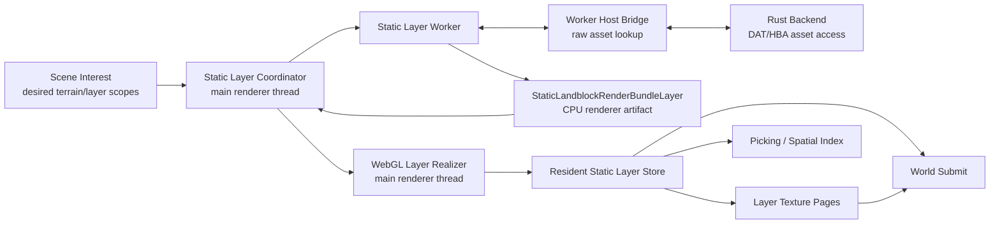
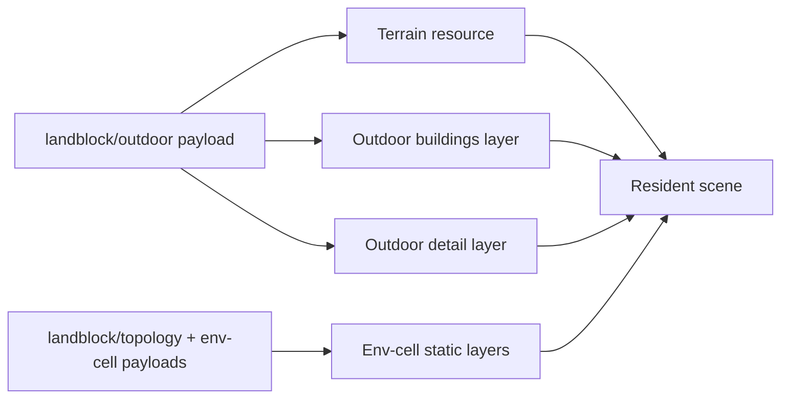
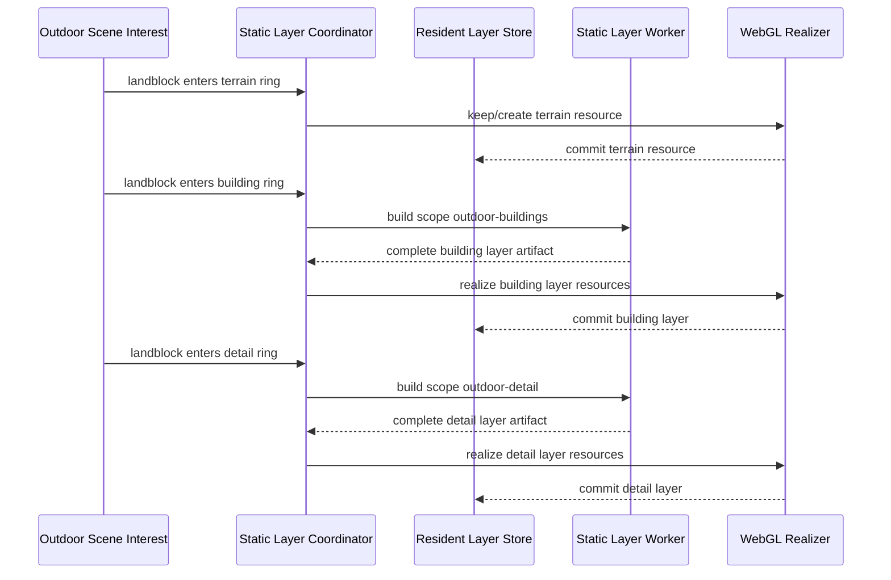
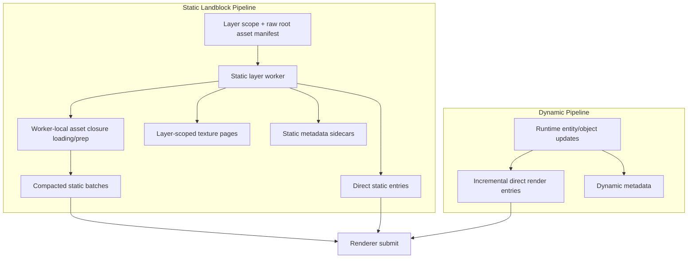
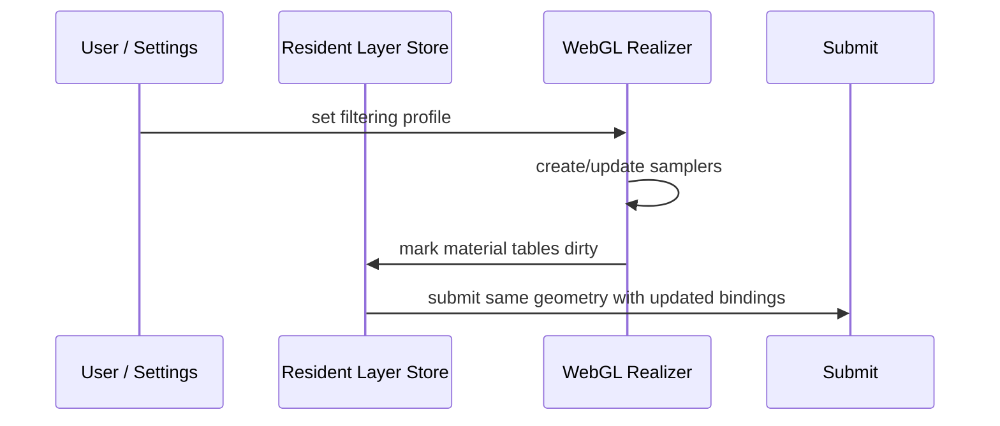
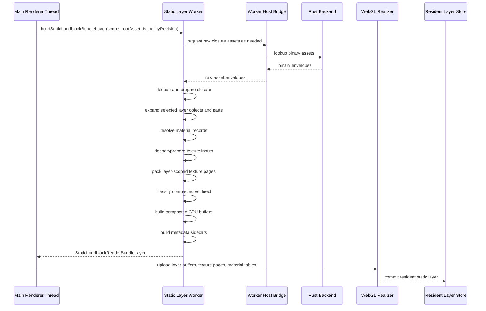
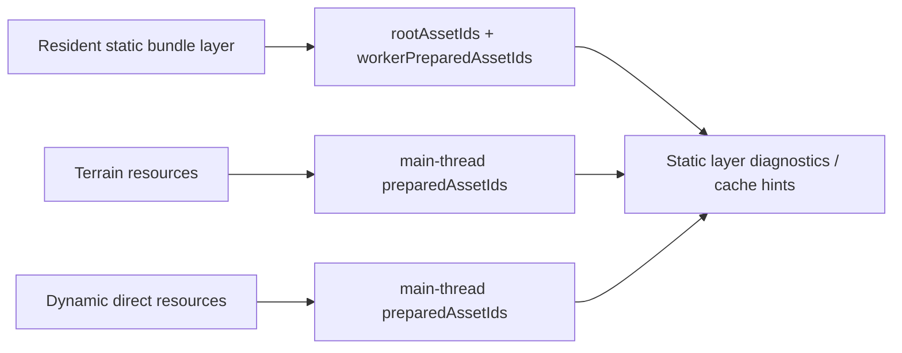

# Holtburger 3D Static Landblock Render Bundle Replacement Plan

Status: Phase 1A through Phase 1E are implemented. Phase 1F compaction geometry extraction is the
next implementation phase, followed by Phase 1G texture/material-role hardening before Phase 2
worker orchestration. The plan has been redirected to worker-owned raw static closure loading and
layer-scoped texture pages.

Progress:

- 2026-06-04: Added the first static bundle-layer renderer contract in
  `apps/holtburger-3d/src/lib/world-display/static-bundle-layer.ts`.
- 2026-06-04: Added a pure desired-layer planner in
  `apps/holtburger-3d/src/lib/assets/static-bundle-layer-planner.ts`.
- 2026-06-04: Added focused tests for bundle DTO shape, stable scope keys, outdoor
  building/detail layer planning, env-cell layer planning, closure blockers, and source-revision
  stability.
- 2026-06-04: Revised the target architecture so static layer workers load/prepare their own raw
  static asset closures through the worker host bridge and emit layer-owned texture page artifacts
  instead of resolving static textures against mutable global atlases.
- 2026-06-04: Dry-ran the worker-owned loading and layer-scoped page direction against the codebase.
  The asset worker already has a host binary lookup bridge and worker-local preparation path, but
  the bridge is private to `asset-worker.ts` and must be extracted before a static layer worker can
  reuse it. Env-cell layer scope discovery needs an explicit topology discovery step if the main
  thread stops hydrating topology.
- 2026-06-04: Chose shared worker-side asset loading/preparation libraries over worker-to-worker
  delegation. `asset-worker.ts`, `static-bundle-layer-worker.ts`, and future domain workers should
  import shared closure loading helpers instead of copying code or routing through a central asset
  worker service.
- 2026-06-04: Split the next work into smaller phases: shared worker asset loading foundation,
  worker-owned static contracts, worker-safe builder, static worker orchestration, renderer vertical
  slice, and expansion/deletion.
- 2026-06-04: Implemented Phase 1B. Extracted shared worker-side host asset lookup, asset
  preparation, closure dependency loading, transferable normalization, and worker profiling modules
  under `apps/holtburger-3d/src/workers/shared/`. `asset-worker.ts` now imports those helpers and
  remains the prepared-asset-cache worker instead of becoming a cross-worker service.
- 2026-06-04: Implemented Phase 1C. `DesiredStaticBundleLayer` now schedules from `rootAssetIds`
  and keeps prepared-cache closure data inside an explicit diagnostics object. Added static worker
  job/result DTOs, env-cell topology discovery DTOs, and layer-owned texture page DTOs to the static
  bundle contract.
- 2026-06-04: Implemented the first Phase 1D builder slice in
  `apps/holtburger-3d/src/lib/world-display/static-bundle-layer-builder.ts`. The builder consumes a
  Phase 1C static layer worker job plus worker-local prepared assets, expands outdoor/env-cell source
  objects, validates closure consistency, emits compacted/direct bundle DTOs, derives object/cell
  visibility records, packs layer-owned texture pages synchronously, and stays CPU-only.
- 2026-06-04: Refined the Phase 1D builder slice so material render-surface dependencies derive
  normalized `prepared-texture/...` route IDs for worker-local closure accounting and layer texture
  refs. Texture page generation no longer scans unrelated prepared texture records from the closure.
- 2026-06-04: Completed the Phase 1D normalized material texture policy refinement. The static
  bundle builder now mirrors the material texture preparation policy for raw/detail static material
  routes, validates policy-supported render-surface formats through the fixture coverage, and maps
  prepared texture payload metadata into virtual texture page usage/sample/lookup fields instead of
  assuming color RGBA pages.
- 2026-06-04: Closed Phase 1D as the worker-safe builder foundation and split its remaining broad
  extraction bucket into smaller executable phases: Phase 1E material/family eligibility, Phase 1F
  compaction geometry assembly, and Phase 1G texture/material-role hardening plus pre-worker cleanup.
- 2026-06-04: Implemented Phase 1E. Static bundle surfaces now derive material behavior and
  compacted/direct eligibility through the existing pure compaction eligibility planner instead of
  material asset ID string conventions. Static material records now carry family keys and
  transparency from those eligibility facts.

Validation:

- `npm run test:ts -- src/lib/assets/static-bundle-layer-planner.test.ts src/lib/world-display/static-bundle-layer.test.ts`
  passed.
- `npm run check` passed.
- `npm run lint:dead` passed.
- `npm exec eslint -- src/lib/assets/static-bundle-layer-planner.ts src/lib/assets/static-bundle-layer-planner.test.ts src/lib/world-display/static-bundle-layer.ts src/lib/world-display/static-bundle-layer.test.ts`
  passed.
- `npm run lint:rust` passed.
- `npm run test:ts -- src/lib/assets/asset-channel.test.ts src/workers/shared/asset-prepare.test.ts src/workers/shared/host-asset-bridge.test.ts src/workers/shared/asset-closure-loader.test.ts src/workers/shared/transferables.test.ts`
  passed after Phase 1B.
- `npm exec eslint -- src/workers/asset-worker.ts src/workers/shared/asset-prepare.ts src/workers/shared/asset-prepare.test.ts src/workers/shared/asset-closure-loader.ts src/workers/shared/asset-closure-loader.test.ts src/workers/shared/host-asset-bridge.ts src/workers/shared/host-asset-bridge.test.ts src/workers/shared/transferables.ts src/workers/shared/transferables.test.ts src/workers/shared/worker-profile.ts src/lib/assets/asset-channel.test.ts`
  passed after Phase 1B.
- `npm run check`, `npm run lint:dead`, and `npm run lint:rust` passed after Phase 1B.
- `npm run test:ts -- src/lib/assets/static-bundle-layer-planner.test.ts src/lib/world-display/static-bundle-layer.test.ts src/lib/assets/asset-channel.test.ts src/workers/shared/asset-prepare.test.ts src/workers/shared/host-asset-bridge.test.ts src/workers/shared/asset-closure-loader.test.ts src/workers/shared/transferables.test.ts`
  passed after Phase 1C.
- `npm exec eslint -- src/lib/world-display/static-bundle-layer.ts src/lib/world-display/static-bundle-layer.test.ts src/lib/assets/static-bundle-layer-planner.ts src/lib/assets/static-bundle-layer-planner.test.ts src/workers/asset-worker.ts src/workers/shared/asset-prepare.ts src/workers/shared/asset-prepare.test.ts src/workers/shared/asset-closure-loader.ts src/workers/shared/asset-closure-loader.test.ts src/workers/shared/host-asset-bridge.ts src/workers/shared/host-asset-bridge.test.ts src/workers/shared/transferables.ts src/workers/shared/transferables.test.ts src/workers/shared/worker-profile.ts src/lib/assets/asset-channel.test.ts`
  passed after Phase 1C.
- `npm run check`, `npm run lint:dead`, and `npm run lint:rust` passed after Phase 1C.
- `npm run test:ts -- src/lib/world-display/static-bundle-layer-builder.test.ts src/lib/assets/static-bundle-layer-planner.test.ts src/lib/world-display/static-bundle-layer.test.ts src/lib/assets/asset-channel.test.ts src/workers/shared/asset-prepare.test.ts src/workers/shared/host-asset-bridge.test.ts src/workers/shared/asset-closure-loader.test.ts src/workers/shared/transferables.test.ts`
  passed after the first Phase 1D builder slice.
- `npm exec eslint -- src/lib/world-display/static-bundle-layer-builder.ts src/lib/world-display/static-bundle-layer-builder.test.ts src/lib/world-display/static-bundle-layer.ts src/lib/world-display/static-bundle-layer.test.ts src/lib/assets/static-bundle-layer-planner.ts src/lib/assets/static-bundle-layer-planner.test.ts`
  passed after the first Phase 1D builder slice.
- `npm run check`, `npm run lint:dead`, and `npm run lint:rust` passed after the first Phase 1D
  builder slice.
- `npm run test:ts -- src/lib/world-display/static-bundle-layer-builder.test.ts src/lib/assets/static-bundle-layer-planner.test.ts src/lib/world-display/static-bundle-layer.test.ts src/lib/assets/asset-channel.test.ts src/workers/shared/asset-prepare.test.ts src/workers/shared/host-asset-bridge.test.ts src/workers/shared/asset-closure-loader.test.ts src/workers/shared/transferables.test.ts`
  passed after the Phase 1D texture-route refinement.
- `npm exec eslint -- src/lib/world-display/static-bundle-layer-builder.ts src/lib/world-display/static-bundle-layer-builder.test.ts src/lib/world-display/static-bundle-layer.ts src/lib/world-display/static-bundle-layer.test.ts src/lib/assets/static-bundle-layer-planner.ts src/lib/assets/static-bundle-layer-planner.test.ts`
  passed after the Phase 1D texture-route refinement.
- `npm run check`, `npm run lint:dead`, and `npm run lint:rust` passed after the Phase 1D
  texture-route refinement.
- `npm exec prettier -- --write src/lib/world-display/static-bundle-layer-builder.ts src/lib/world-display/static-bundle-layer-builder.test.ts`
  passed from `apps/holtburger-3d` after the Phase 1D normalized material texture policy
  refinement. The same command failed from the repo root because `prettier-plugin-svelte` is not
  resolvable from that package context.
- `npm run test:ts -- src/lib/world-display/static-bundle-layer-builder.test.ts src/lib/assets/static-bundle-layer-planner.test.ts src/lib/world-display/static-bundle-layer.test.ts src/lib/assets/asset-channel.test.ts src/workers/shared/asset-prepare.test.ts src/workers/shared/host-asset-bridge.test.ts src/workers/shared/asset-closure-loader.test.ts src/workers/shared/transferables.test.ts`
  passed after the Phase 1D normalized material texture policy refinement.
- `npm exec eslint -- src/lib/world-display/static-bundle-layer-builder.ts src/lib/world-display/static-bundle-layer-builder.test.ts src/lib/world-display/static-bundle-layer.ts src/lib/world-display/static-bundle-layer.test.ts src/lib/assets/static-bundle-layer-planner.ts src/lib/assets/static-bundle-layer-planner.test.ts`
  passed after the Phase 1D normalized material texture policy refinement.
- `npm run check`, `npm run lint:dead`, and `npm run lint:rust` passed after the Phase 1D normalized
  material texture policy refinement.
- `npm run test:ts -- src/lib/world-display/static-bundle-layer-builder.test.ts src/lib/assets/static-bundle-layer-planner.test.ts src/lib/world-display/static-bundle-layer.test.ts src/lib/assets/asset-channel.test.ts src/workers/shared/asset-prepare.test.ts src/workers/shared/host-asset-bridge.test.ts src/workers/shared/asset-closure-loader.test.ts src/workers/shared/transferables.test.ts src/lib/world-display/compaction/compaction-family-planner.test.ts src/lib/world-display/material-behavior.test.ts`
  passed after Phase 1E.
- `npm exec eslint -- src/lib/world-display/static-bundle-layer-builder.ts src/lib/world-display/static-bundle-layer-builder.test.ts src/lib/world-display/compaction/compaction-family-planner.ts src/lib/world-display/compaction/compaction-family-planner.test.ts src/lib/world-display/material-behavior.ts src/lib/world-display/material-behavior.test.ts`
  passed after Phase 1E.
- `npm run check`, `npm run lint:dead`, and `npm run lint:rust` passed after Phase 1E.
- `npm run lint:ts` currently fails on existing unrelated debt:
  `src/lib/world-display/camera.ts` defines unused `rendererPointToAcPosition`.

Related plans:

- [Holtburger 3D Render Resource Worker Plan](./holtburger-3d-render-resource-worker-plan.md)
- [Holtburger 3D Compacted Render Family Pipeline Replacement Plan](./holtburger-3d-compacted-render-family-pipeline-replacement-plan.md)
- [Holtburger 3D Outdoor LOD Streaming Plan](./holtburger-3d-outdoor-lod-streaming-plan.md)
- [Holtburger 3D BVH Batch Culling Plan](./holtburger-3d-bvh-batch-culling-plan.md)

This plan supersedes the render-resource worker plan for static landblock compaction and texture
packing. Do not preserve the current staged-static-to-render-resource-worker path as a compatibility
mode. The goal is to replace that pipeline, delete the old scheduling/accounting surface, and keep
only the pure CPU algorithms that are still useful inside the new static layer worker.

## Purpose

Make open-world landblock streaming cheap enough for continuous player movement by replacing the
current static render pipeline:

```text
asset hydration -> static scene derivation -> staged draw units -> atlas planning ->
worker-scheduled packing/compaction -> pending replacement accounting -> WebGL commit
```

with an authoritative static landblock bundle-layer pipeline:

```text
static layer closure -> static layer worker builds complete static render bundle layer ->
renderer uploads layer resources -> renderer draws resident layers
```

Static landblock content should not pass through the staged dynamic-style renderer. A static layer
worker should produce the complete, resolved static scene for the requested layer:
compacted batches, direct static entries, layer-scoped texture pages, object/cell visibility
metadata, renderer diagnostics, and raw/prepared asset dependency lists.

## Non-Goals

- Do not keep the current static staged draw-unit pipeline as a fallback or alternate mode.
- Do not retain standalone render-resource worker job scheduling for static landblock compaction or
  texture packing.
- Do not make static workers resolve against main-thread global atlas state.
- Do not require global or shared static atlases for the first replacement.
- Do not move WebGL buffer, texture, sampler, VAO, or program ownership off the WebGL-owning thread.
- Do not move browser-mode policy into shared crates.
- Do not generalize dynamic object rendering in this plan beyond defining the boundary with static
  rendering.
- Do not require runtime assets in permanent tests.

## Current Problems

The current renderer already eventually wants landblock-scoped compacted batches, but it discovers
that boundary late. Static renderables are expanded into staged draw units first; compaction then
groups those draw units back by landblock. This does unnecessary main-thread work and makes resource
sync sensitive to changes that should not rebuild static landblock geometry.

Major costs and complexity sources:

- per-frame or dirty-frame static staging for content that is landblock-static;
- staged draw-unit identity and graph records for static content that will be compacted;
- render-resource worker scheduler groups for compaction and atlas packing;
- pending replacement retention state for resources that should instead be layer-owned;
- atlas generation identities feeding back into compacted geometry/family resources;
- global asset-state signatures invalidating too much renderer work;
- direct draw suppression because old direct draw units coexist with compacted replacements.

The replacement pipeline should eliminate the need for direct suppression. The worker emits the
complete static answer for each requested layer scope. A surface is either represented in a
compacted batch or in the bundle layer's direct static entries.

## Target Architecture

### Ownership Model



Responsibilities:

- Scene interest decides which terrain resources and static layer scopes are desired.
- The static layer coordinator schedules desired static layer scopes and rejects stale worker
  results.
- The static layer worker loads and prepares the raw static closure it needs through the existing
  worker host bridge to the Rust backend. Duplicating raw asset loads in the worker is acceptable in
  the first replacement if it keeps ownership simple and moves CPU work off the main thread.
- The static layer worker builds complete static render bundle layers synchronously inside one async
  worker job.
- The static layer worker emits layer-owned texture page CPU artifacts, including packed page bytes
  and virtual-ref-to-rect tables.
- The WebGL renderer realizes CPU artifacts into buffers, textures, samplers, material tables, and
  VAOs.
- Resident layer records own WebGL lifetime, layer texture page lifetime, and raw/prepared asset
  dependency diagnostics.
- Dynamic direct renderables and terrain may continue to use main-thread texture resource managers;
  they do not feed static layer texture pages.

### Worker Asset Loading Reuse

Do not make the static layer worker post work to `asset-worker.ts`, and do not copy asset-worker
logic into the static worker. Use shared worker-side libraries for lookup, preparation, dependency
expansion, transferables, and profiling, then let each domain worker own its own orchestration.

Target shape:

```text
src/workers/shared/host-asset-bridge.ts
src/workers/shared/asset-prepare.ts
src/workers/shared/asset-closure-loader.ts
src/workers/shared/transferables.ts
src/workers/shared/worker-profile.ts

src/workers/asset-worker.ts
  imports shared lookup/prep helpers
  serves general main-thread prepared asset cache hydration

src/workers/static-bundle-layer-worker.ts
  imports shared lookup/prep/closure helpers
  owns static landblock layer closure loading, compaction, and layer texture page packing

future domain workers
  import shared lookup/prep/closure helpers
  own dynamic entity, pinned scene element, skybox, effect, or other domain-specific artifacts
```

Reasons:

- Asset lookup and preparation mechanics should be shared and tested once.
- Static landblock closure completeness, dynamic entity closure completeness, and pinned/effect
  closure completeness are different orchestration policies.
- A central asset-worker service would require cross-worker scheduling, cancellation, retry/error
  routing, stale-result rejection, and transferable ownership between workers. Avoid that until a
  measured need proves it is worth the coordination cost.
- Domain workers should perform one complete domain transaction: load the closure they need, build
  the artifact they own, and return that artifact to the main thread.

### Desired Layer Planning

Do not let worker scheduling infer desired layers from the whole prepared asset cache. Add a pure
planner that turns renderer interest into explicit desired layer scopes and root closure manifests.
The planner may use already-prepared main-thread assets as a bootstrap source during the transition,
but the target worker contract must not require the main thread to hydrate the full static closure
before scheduling a static layer job.

Current code already has most of the inputs:

- `deriveOutdoorSceneInterest` owns terrain/building/detail/env-cell radii.
- `createSceneCoverageRequests` and `createStaticRenderableAssetRequests` know which outdoor,
  topology, env-cell, renderable source, material, texture, and region-profile assets are requested.
- `deriveTopologyEnvCellIdsForLandblocks` and `deriveStructuredInteriorCoverage` expand topology
  into env-cell coverage.
- `collectSelectedOutdoorSourceAssetIds` already applies the building/detail static split.

The new planner should make those relationships first-class:

```ts
interface DesiredStaticBundleLayer {
  scope: StaticBundleLayerScope;
  priority: "resident-now" | "prefetch";
  rootAssetIds: readonly string[];
  sourceRevision: string;
  diagnostics: {
    knownClosureAssetIds: readonly string[];
    knownMissingAssetIds: readonly string[];
  };
}
```

Rules:

- Schedule a worker job when the layer roots are known. Do not block worker scheduling on the main
  thread having every source, geometry, material, texture, region-profile, topology, and env-cell
  dependency prepared.
- Include root assets that identify the layer load:
  - `landblock/outdoor` for `outdoor-buildings` and `outdoor-detail`;
  - `landblock/topology` plus the selected `env-cell` root for `env-cell-static`;
  - selected source/renderable roots when already known from prepared route data.
- Let the worker expand the full closure by loading raw assets and following dependencies locally.
- `diagnostics.knownClosureAssetIds` and `diagnostics.knownMissingAssetIds` are transitional
  diagnostics only. They may help validate the worker closure loader, but they are not the target
  scheduling gate.
- Derive `sourceRevision` from scope, ordered root asset IDs, source route revision if available,
  and CPU build policy revision. Do not use the global asset-state signature for static layer
  invalidation.
- Reject worker results whose `scope` or `sourceRevision` no longer matches the desired layer.
- Keep appearance previews and other non-landblock-owned debug/editor objects out of static bundle
  layers; they should remain staged or direct dynamic entries.

### Static Bundle Layers and Outdoor LOD

The current asset routes are additive in practice, but not as separate `landblock/detail` payloads.
`landblock/outdoor` provides terrain plus outdoor static member references. Renderer interest then
selects which outdoor statics should be hydrated and rendered:

- terrain radius keeps terrain resources resident;
- building radius selects outdoor static instances classified as buildings;
- detail radius selects the remaining outdoor static instances;
- env-cell radius selects topology/env-cell content for structured and interior statics.

The replacement should model that directly. Terrain stays in the terrain bucket. Static object
render bundle layers are scoped so LOD promotion can add detail without rebuilding or mutating the
already resident building layer.



```ts
type StaticLandblockBundleLayerKind =
  | "outdoor-buildings"
  | "outdoor-detail"
  | "env-cell-static";

type StaticBundleLayerScope =
  | {
      kind: "landblock";
      landblockId: number;
      layerKind: "outdoor-buildings" | "outdoor-detail";
    }
  | {
      kind: "env-cell";
      landblockId: number;
      envCellId: number;
      layerKind: "env-cell-static";
    };
```

Layer rules:

- A worker result is complete for one `StaticBundleLayerScope`.
- `outdoor-buildings` contains only building-classified outdoor static instances selected by the
  building radius.
- `outdoor-detail` contains non-building outdoor static instances selected by the detail radius.
- `env-cell-static` contains one selected env cell's static/interior content and keeps cell
  visibility metadata explicit.
- Existing resident layers are not passed back into the worker as mutable input.
- The resident layer store composes terrain plus zero or more static bundle layers at submit time.

Promotion from distant to detailed landblock residency should be additive:



This supports both complete and additive loading without a build-on-top protocol. If interest asks
for both building and detail at once, the main thread may schedule both layer jobs independently
from the same root layer scope information. Each worker job loads/prepares its own closure and emits
its own geometry and texture page artifacts. If detail becomes visible later, the detail layer is
built as a new complete layer and composed beside the existing building layer.

### Static vs Dynamic Boundary



Static landblock content is authoritative and layer-owned. Dynamic renderables remain incremental and
direct-draw unless a future proven shared system justifies a different path.

Terrain remains a separate render bucket. It may use similar page-binding concepts, but terrain
geometry, terrain texture ownership, and terrain LOD policy should not be folded into static object
bundle layers.

## Bundle Layer Contract

The bundle layer should be a renderer-shaped CPU artifact, not a direct clone of content assets and
not a WebGL resource object.

```ts
interface StaticLandblockRenderBundleLayer {
  key: string;
  scope: StaticBundleLayerScope;
  landblockId: number;
  layerKind: StaticLandblockBundleLayerKind;
  sourceRevision: string;
  rootAssetIds: readonly string[];
  preparedAssetIds: readonly string[];
  renderChunks: readonly StaticBundleRenderChunk[];
  compactedBatches: readonly StaticBundleCompactedBatch[];
  directEntries: readonly StaticBundleDirectEntry[];
  materialRecords: readonly StaticBundleMaterialRecord[];
  texturePageRefs: readonly VirtualTexturePageRef[];
  texturePages: readonly StaticBundleTexturePage[];
  objectRecords: readonly StaticBundleObjectRecord[];
  spatialHints?: readonly StaticBundleSpatialHint[];
  diagnostics: StaticLandblockBundleLayerDiagnostics;
}
```

`landblockId` and `layerKind` are denormalized from `scope` for renderer indexes and diagnostics.

Required properties:

- Complete for layer: all currently renderable static content for the requested layer scope is
  represented or explained in diagnostics.
- Authoritative: there is no runtime direct fallback suppression for static content.
- CPU-only: no WebGL handles, no live texture objects, no renderer-thread-only state.
- Stable: IDs are derived from source landblock/object/part/material facts, not from transient
  staging order.
- Dependency-owned: the bundle layer reports the roots and worker-prepared asset IDs it used for
  diagnostics, cache policy, and stale-result rejection.

### Object and Part Metadata

Visibility is already at object or cell granularity for statics. Preserve that model.

Examples:

- `outdoor-static:landblock:<id>:instance:<instance>`
- `env-static:cell:<id>:instance:<instance>`
- `env-render-geometry:cell:<id>`

Picker, selection overlay, and debug metadata are non-authoritative consumers. They must not force
staged-style per-part accounting back into the static render path. Preserve object/cell visibility
keys and minimal object identity needed by rendering. Do not design the first replacement around
richer inspection metadata. If a later diagnostic pass needs it, it must remain removable without
changing render artifacts, scheduling, or ownership.

```ts
interface StaticBundleObjectRecord {
  objectKey: string;
  visibilityKeys: readonly RenderBvhItemKey[];
  sourceAssetId: string;
  owningLandblockId: number;
  owningEnvCellId: number | null;
  kind: "scenery" | "building" | "generated-scenery" | "indoor-static";
  partHints?: readonly StaticBundlePartHint[];
}

interface StaticBundlePartHint {
  renderKey: string;
  partIndex: number;
  gfxObjAssetId?: string;
  bounds?: RenderBounds;
}
```

`spatialHints` are optional and non-authoritative. The static render pipeline is valid with no
picker/debug coverage for a layer. Higher-fidelity picking can be added later only if it stays
opportunistic and does not affect layer build keys, compaction layout, layer texture page packing,
or submit scheduling.

## Layer-Scoped Texture Page Model

The current renderer already treats standalone textures as degenerate atlas pages. Keep that concept
and make it explicit, but do not resolve static layer textures against mutable global atlas state in
the first replacement. Static bundle layer workers should emit complete layer-scoped texture page
artifacts: single-entry pages or packed atlas pages owned by that layer.


```ts
interface VirtualTexturePageRef {
  key: string;
  sourceAssetId: string;
  usageBucket:
    | "base-color"
    | "detail"
    | "indexed-texels"
    | "palette-lookup"
    | "terrain"
    | "road"
    | "alpha-control";
  sampleClass: "rgba-color" | "indexed-data" | "palette-data" | "control-data";
  width: number;
  height: number;
  wrapS: "clamp" | "repeat";
  wrapT: "clamp" | "repeat";
  samplingDomain: "color" | "data" | "control";
  lookup: "color-filtered" | "exact" | "control-filtered";
  bytes?: Uint8Array;
}

interface ResolvedTexturePageBinding {
  pageKind: "single-entry" | "packed-atlas";
  textureKey: string;
  rect: readonly [number, number, number, number];
  width: number;
  height: number;
  samplerProfileKey: string;
}

interface StaticBundleTexturePage {
  key: string;
  scopeKey: string;
  pageKind: "single-entry" | "packed-atlas";
  usageBucket:
    | "base-color"
    | "detail"
    | "indexed-texels"
    | "palette-lookup"
    | "terrain"
    | "road"
    | "alpha-control";
  sampleClass: "rgba-color" | "indexed-data" | "palette-data" | "control-data";
  width: number;
  height: number;
  bytes: Uint8Array;
  entries: readonly {
    virtualRefKey: string;
    sourceAssetId: string;
    rect: readonly [number, number, number, number];
  }[];
}
```

Static layer texture page rules:

- Each static bundle layer owns its texture page artifacts.
- The worker chooses single-entry vs packed layer page placement for static layer materials.
- Existing main-thread atlas state is not passed into the worker.
- Worker output may duplicate texture bytes already used by another layer. This is acceptable until
  measurements prove memory or bind count is the limiting bottleneck.
- Building, detail, and env-cell promotion stays additive because each layer owns its own pages.
- Eviction is simple: evict the resident layer and its layer-owned WebGL textures together.
- Global/shared static atlas deduplication is explicitly deferred.

Main-thread texture responsibilities:

- Upload layer-owned texture pages to WebGL.
- Create/update samplers for current global filtering policy.
- Bind material records to layer-owned page textures and rects.
- Rebuild sampler state or material binding tables when global filtering changes.

Static layer workers do not schedule standalone atlas-packing jobs. They call extracted packing
helpers synchronously inside the layer build and emit immutable texture page artifacts. There are no
static atlas generations in the renderer resource store for this path.

Changing global texture filtering should not rebuild static bundle layers or compacted geometry. It
should update sampler state or renderer material tables. Only CPU texture-page policy changes that
alter page bytes or placement, such as padding/extrusion rules, should rebuild layer artifacts.

### Texture Resolution Sequence



## Worker Pipeline

The static layer worker job is asynchronous at the job boundary and synchronous internally. Do not
schedule nested render-resource worker jobs for compaction or packing.



Internal worker steps:

1. Validate the layer scope, root asset IDs, and CPU build policy.
2. Load raw assets through the worker host bridge and prepare the worker-local closure.
3. Expand only the selected layer:
   - building outdoor statics for `outdoor-buildings`;
   - non-building outdoor statics and generated scenery for `outdoor-detail`;
   - one env cell's static/interior content for `env-cell-static`.
4. Expand setup-model and setup-appearance parts.
5. Resolve material records into render families and virtual texture refs.
6. Decode/prepare texture inputs required by static materials.
7. Build layer-scoped single-entry or packed texture pages and virtual-ref rect bindings.
8. Classify surfaces as compacted or direct.
9. Build compacted geometry batches with material-slot indices.
10. Build direct static entries for surfaces that cannot be compacted.
11. Emit object/cell visibility metadata and optional diagnostics.
12. Emit root asset IDs, worker-prepared dependency IDs, texture page diagnostics, and skipped
    content diagnostics.

### Scheduling Model

Use one scheduler for static bundle layers, not separate schedulers for compaction, RGBA atlas
packing, indexed atlas packing, and renderer replacement groups.

Scheduler keys should be based on:

- `scope`;
- `sourceRevision`;
- renderer build policy revision;
- CPU texture-page policy revision only when it changes worker output bytes or placement.

Do not include sampler policy or WebGL texture object identity in the static layer job key. Static
layer page placement is worker output and should be represented by the layer artifact revision, not
by a separate renderer atlas generation.

Scheduling behavior:

- Coalesce duplicate desired scopes before posting worker jobs.
- Limit concurrent static layer worker jobs so nearby terrain and camera interaction stay
  responsive.
- Prefer nearer resident scopes over prefetch scopes.
- Cancel or ignore queued jobs for scopes that leave interest before they start.
- Commit ready layers in deterministic scope order when several finish in the same frame.
- Do not block terrain upload or dynamic direct draws on static layer completion.
- Treat worker closure loading as part of the static layer job for scheduling and cancellation.

The first implementation can reuse the existing worker-client shape, but it should not reuse
`render-resource-job-scheduler.ts` as a general abstraction unless that name and ownership still fit
after static compaction and atlas jobs are removed.

## Renderer Submit Model

Static submit should consume resident bundle-layer resources directly.


The old `replaceableDrawUnitIds` idea should be removed for static bundle layers. It exists today
because direct staged draw units and compacted replacements coexist. In the new model, the worker
decides the representation once. Submit only asks which bundle-layer entries are visible.

Dynamic direct entries may continue to use a direct submit path and a main-thread texture manager,
but they should not contribute to static layer texture pages or cause static bundle-layer
recompaction.

## Static Asset Retention and Raw Loading

Static landblock retention should move from staged renderer graph projection to resident resource
ownership. The target static path does not require main-thread prepared asset records for every
static dependency before the worker starts. The worker may load raw assets independently through the
worker host bridge.



Bundle-layer commit installs layer ownership records for WebGL buffers, layer-owned textures, root
asset IDs, and worker-prepared dependency IDs. Bundle-layer eviction releases WebGL resources and
diagnostic retention state. No diagnostic graph node is required to explain static retention.

The main prepared-asset cache may still retain terrain, dynamic direct resources, appearance
previews, and transitional debug assets. It should not be the authority for static layer closure
completeness once worker-owned loading is in place.

## Implementation Phases

Each phase should remove or replace the old surface it makes obsolete. Do not add long-lived
parallel paths.

### Dry-Run Findings for Worker-Owned Loading

Dry run date: 2026-06-04.

What is realistic:

- `src/workers/asset-worker.ts` already proves workers can request raw asset data from the main
  thread and receive binary lookup envelopes from the Rust backend.
- `AssetWorkerHostBridge` already batches worker-originated asset lookup requests, waits for
  `host-lookup-assets-binary-complete`, decodes binary envelopes with
  `decodeBinaryAssetBatchEnvelope`, and returns `AssetLookupResponseDto` records inside the worker.
- `prepareAssetPayload` is already exported and can prepare decoded lookup responses into
  `PreparedAssetRecord` values inside a worker.
- `asset-channel.ts` already forwards worker host lookup requests to `lookupBinaryAssetEnvelopes`
  and transfers returned envelope buffers back to the worker.
- `getAssetResponseDependencies` in `assets/dependencies.ts` can drive worker-local dependency
  expansion from raw lookup responses.
- `planAtlasLayout` is renderer-neutral and can be reused by a worker-safe layer page packer.
- Existing RGBA and indexed atlas worker payloads prove texture page byte buffers can be transferred
  back to the main thread.

Gaps and refinements:

- `AssetWorkerHostBridge`, host lookup message types, transferable normalization helpers, and
  profiling helpers are currently coupled to `asset-worker.ts`. Extract shared worker-side
  lookup/prep/closure libraries before implementing `static-bundle-layer-worker.ts`; do not
  copy/paste a second bridge or make the static worker delegate to the asset worker.
- Outdoor `outdoor-buildings` and `outdoor-detail` jobs are schedulable from landblock IDs because
  the worker can load `landblock/outdoor` and select members locally. Env-cell static layers are not
  fully schedulable from landblock IDs alone because the main thread needs topology to know
  individual env-cell IDs.
- Add a topology discovery path before full env-cell layer scheduling. Preferred shape:
  `discoverStaticEnvCellLayerScopes(landblockId)` runs in the static worker, loads
  `landblock/topology`, and returns desired `env-cell-static` scopes and root asset IDs. The main
  thread then schedules normal per-env-cell layer jobs. This preserves independent env-cell layer
  ownership without keeping full topology hydration on the main thread.
- Worker closure loading must explicitly add `setup-appearance/<setup-model-id>` companion assets
  for setup models. Setup appearance is not discovered through generic response dependencies.
- Worker texture loading should use `NORMALIZED_MATERIAL_TEXTURE_PREPARATION_POLICY` after resolving
  material render surfaces, then request `prepared-texture/...` routes through the host bridge. Do
  not require the main thread to pre-request atlas-ready prepared textures for static layers.
- Current RGBA atlas planning helpers are staged/draw-unit-shaped. Extract a layer page packer with
  layer material/virtual-ref candidate inputs instead of reusing `drawUnitId` terminology in static
  worker code.
- Current RGBA atlas CPU generation lives under `webgl2/resources/texture-atlas-generation.ts` and
  its worker job key includes filtering/anisotropy. For layer-scoped static pages, move CPU pixel
  assembly to a renderer-neutral module and keep sampler policy out of CPU page artifact keys.
- Indexed atlas planners are closer to worker-safe because they already operate on byte candidates,
  but their candidate IDs still say `drawUnitId`; rename or wrap them before using them in static
  layer builders.

### Codebase Impact Map

The dry-run target is to move behavior, not preserve current file boundaries.

Likely new or renamed modules:

- `static-bundle-layer-planner.ts`: derives `DesiredStaticBundleLayer` records from scene interest
  and root route facts. Its Phase 1A prepared-cache closure mode is transitional.
- `static-bundle-layer-worker-client.ts`: posts layer jobs, tracks scope/source revisions, consumes
  transferable layer results.
- `static-bundle-layer-worker.ts`: loads raw static closures through the worker host bridge, prepares
  assets, expands layer objects, packs layer-scoped texture pages, and builds CPU geometry artifacts.
- `static-bundle-layer-builder.ts`: pure CPU expansion/classification/compaction/page-pack builder
  used inside the worker and tests.
- `workers/shared/host-asset-bridge.ts`: shared worker-side host lookup bridge and message helpers
  extracted from `asset-worker.ts`.
- `workers/shared/asset-prepare.ts`: shared worker-local asset preparation helpers, including
  `prepareAssetPayload`.
- `workers/shared/asset-closure-loader.ts`: reusable dependency expansion and closure loading
  helpers used by static and future domain workers.
- `workers/shared/transferables.ts`: transferable normalization helpers for typed-array payloads.
- `workers/shared/worker-profile.ts`: worker-local profiling helpers.
- `texture-pages/layer-texture-page-packer.ts`: renderer-neutral static layer page packing and CPU
  byte assembly.
- `webgl2/resources/static-bundle-layer-resources.ts`: realizes layer artifacts into WebGL buffers,
  layer-owned textures, material tables, and direct-entry resources.

Likely modules to split or heavily edit:

- `scene-asset-request-planner.ts`: keep terrain, dynamic, preview, and transitional asset lookup
  policy. Stop treating full static landblock closure hydration as a main-thread prerequisite.
- `browser-render-resource-coordinator.ts`: stop deriving full `StaticRenderableSceneModel` for
  landblock statics every update; derive desired layer scopes and keep runtime previews separate.
- `static-renderables.ts`: extract reusable source expansion, setup-model/setup-appearance part
  expansion, material-context creation, and stable key helpers into worker-safe builder inputs.
- `render-spatial-scene.ts`: stop importing `buildStaticRenderablePartMatrix` from
  `staged-world-assembly.ts`; move transform helpers to a neutral static-render utility.
- `world-render-frame.ts`: replace the `static-staged` category with static layer/direct dynamic
  categories once staged statics are gone.
- `webgl2-world-resources.ts`: replace staged draw-unit static fields, graph leases, compaction
  plans, and atlas-generation state with resident layer and layer-owned texture resource state.
- `webgl2-world-submit.ts`: replace runtime compacted-replacement planning with explicit static
  layer compacted/direct submit passes plus dynamic direct passes.
- `src/workers/asset-worker.ts`: import shared lookup/prep/transfer/profile helpers after
  extraction. Keep it as the general prepared-asset cache worker, not as a service that static
  workers call.
- `assets/dependencies.ts`: may need worker-safe helpers for layer-specific dependency traversal so
  container assets such as `landblock/outdoor` and `landblock/topology` do not expand unrelated
  layer members.
- `world-display/webgl2/resources/texture-atlas-generation.ts`: split WebGL upload/sampler
  ownership from CPU atlas pixel assembly before using the CPU pieces in static workers.
- `world-display/texture-pages/texture-page-atlas-planner.ts`: adapt or wrap staged draw-unit
  candidate types into layer material/virtual-ref candidate types.
- `world-display/texture-pages/indexed-resource-atlas-planner.ts`: adapt or wrap `drawUnitId`
  terminology before using it for static layer candidates.

Likely deletion targets after migration:

- `worker-resources/compacted-geometry-worker-scheduler.ts`
- `worker-resources/texture-atlas-worker-scheduler.ts`
- `worker-resources/indexed-atlas-worker-scheduler.ts`
- static callers in `render-resource-worker-client.ts`
- static job payloads in `worker-resources/*worker-payloads.ts`
- static compaction sync in `webgl2/resources/compacted-geometry-sync.ts`
- global/static texture page manager concepts if they only exist to resolve static layer refs
  against mutable renderer atlas state
- static replacement metrics and tests in `webgl2-world-submit.test.ts`,
  `webgl2-world-resources.test.ts`, and family submit tests that only assert suppression behavior.

Keep or extract:

- `compaction/compacted-geometry.ts`: CPU compaction data assembly.
- parts of `compaction/compaction-family-planner.ts`: eligibility/classification logic, after
  removing staged draw-unit assumptions.
- `texture-pages/texture-page-atlas-planner.ts` and
  `texture-pages/indexed-resource-atlas-planner.ts`: packing helpers, if called synchronously inside
  the static layer worker/builder without renderer job scheduling.
- `texture-pages/texture-page-binding.ts`: terminology and shader binding model for single-entry
  and packed pages.
- `static-renderable-bvh-bindings.ts` and `prepared-bvh-visibility.ts`: object/cell visibility keys.

### Phase 1A: Define Bundle-Layer Contracts and Desired-Layer Planner

Status: Implemented on 2026-06-04.

Implemented:

- Added static bundle-layer DTOs for complete layer artifacts, including compacted batches, direct
  entries, material records, virtual texture page refs, object records, optional spatial hints, and
  diagnostics.
- Added stable static layer scope keys for landblock and env-cell layers.
- Added `DesiredStaticBundleLayer` planning for:
  - `outdoor-buildings`;
  - `outdoor-detail`;
  - `env-cell-static`.
- Added closure planning that reports missing prepared assets as blockers instead of emitting
  partial layer readiness.
- Added deterministic `sourceRevision` values from ordered closure asset IDs and prepared record
  timestamps.
- Added tests proving outdoor building/detail layers are additive, env-cell layers are derived from
  topology and env-cell payloads, root blockers are reported, and source revisions do not depend on
  prepared-record insertion order.

Decisions and course corrections:

- Container assets are closure anchors, not always transitive dependency expansion sources.
  `landblock/outdoor` is retained in an outdoor layer closure, but it must not pull every static in
  the landblock into both the building and detail layers. `landblock/topology` is retained for
  env-cell layers, but a single env-cell layer should not expand every topology-linked cell.
- Selected source assets and env-cell assets drive transitive dependency discovery. This preserves
  layer completeness without reintroducing whole-landblock incremental diff accounting.
- `setup-appearance/<setup-model-id>` is included as a known setup-model companion asset and is
  reported as a missing blocker when absent.
- Region render profile assets are included in static layer closures because outdoor static material
  signatures currently read region detail-role data.
- Negative LOD radii are not a way to suppress a layer family; the existing outdoor interest API
  clamps them to zero. Tests should assert relevant planned layers rather than inventing planner-only
  radius semantics.
- The first source-revision implementation uses `preparedAt` because prepared records do not expose
  a dedicated cache/content revision yet. Replace this with explicit prepared payload/cache revision
  fields if those are added.
- This phase was implemented before the decision to move raw static closure loading into the worker.
  Treat `closureAssetIds`/`missingAssetIds` as transitional planning diagnostics, not the final
  static worker scheduling contract.

Introduced cleanup targets:

- The new contract test keeps Phase 1 DTO exports visible to knip until real consumers exist. Delete
  any purely DTO-shape assertions once the builder and resource realizer consume the exported types.
- The planner duplicates a small amount of source/setup companion discovery that also exists in the
  current request/static-renderable paths. Phase 1C should remove that duplication from the target
  scheduling path or quarantine it as transitional validation-only code until the worker closure
  loader replaces it.

Legacy shims introduced:

- None. Phase 1A added new contracts and a pure planner only; it did not add a compatibility mode,
  reexport bridge, renderer fallback, or alternate static render path.

Legacy debt found before the next phase:

- `npm run lint:ts` is blocked by existing unrelated dead code in
  `src/lib/world-display/camera.ts`: `rendererPointToAcPosition` is defined but unused. Clean this
  up before relying on full `npm run lint` as the phase gate.

Exit criteria:

- Bundle-layer DTOs can represent compacted and direct static outputs.
- Desired-layer planner tests prove building/detail/env-cell scope selection, transitional closure
  diagnostics, blocker reporting, stable scope keys, and stable source revisions.

### Phase 1B: Shared Worker Asset Loading Foundation

Status: Implemented on 2026-06-04.

Implemented:

- Extracted shared worker-side asset loading libraries from the existing asset worker:
  - `workers/shared/host-asset-bridge.ts`;
  - `workers/shared/asset-prepare.ts`;
  - `workers/shared/asset-closure-loader.ts`;
  - `workers/shared/transferables.ts`;
  - `workers/shared/worker-profile.ts`.
- Kept `asset-worker.ts` as a consumer of those shared libraries. It still owns the current
  prepared-asset-cache worker flow and does not become a central service that static workers call.
- Preserved current `AssetChannel` behavior while moving lookup, preparation, transfer, and profile
  implementation details out of `asset-worker.ts`.
- Added focused tests with fake host lookup responses for host request/complete/error flow, binary
  envelope decoding, worker-local `prepareAssetPayload`, dependency expansion, and transferable
  normalization.
- Kept the shared modules domain-neutral. They know about asset lookup, preparation, dependency
  traversal, transferables, and profiling, but not static landblocks, dynamic entities, skyboxes,
  effects, or renderer resource ownership.

Decisions and course corrections:

- Do not export unused convenience types/functions from the shared modules. Knip caught an early
  over-export of a bridge message union, closure lookup interface, and response-summary helper; they
  were made private instead of retained as future-facing API.
- `asset-channel.test.ts` now stays scoped to channel behavior. Payload-preparation assertions live
  with `workers/shared/asset-prepare.test.ts`, where the ownership is clearer.
- `loadWorkerAssetClosure` intentionally returns raw lookup responses and a response map. It does
  not prepare payloads itself because future domain workers may need domain-specific expansion,
  retry, and failure policy before preparation.
- The first closure-loader test uses schema-valid fixture payloads. Dependency traversal is
  intentionally contract-driven through `getAssetResponseDependencies`; fake payload shortcuts can
  hide broken loader behavior.

Introduced cleanup targets:

- `asset-worker.ts` still owns asset-worker-specific message contracts. Move or split those only
  when the static worker contract exists in Phase 1C; doing it earlier would create generic message
  abstractions with only one concrete worker.
- Shared closure loading currently uses generic response dependencies only. Phase 1C/1D must add or
  pass domain hooks for setup-appearance companions and normalized prepared-texture routes rather
  than broadening `getAssetResponseDependencies` with static-only policy.

Legacy shims introduced:

- None. `asset-worker.ts` imports the shared modules directly, and payload-preparation tests import
  the shared module instead of relying on a reexport through `asset-worker.ts`.

Legacy debt found before the next phase:

- `npm run lint:ts` remains blocked by existing unrelated dead code in
  `src/lib/world-display/camera.ts`: `rendererPointToAcPosition` is defined but unused. This should
  be cleaned before treating full TS lint as a reliable next-phase gate.

Exit criteria:

- `asset-worker.ts` imports the shared worker asset loading libraries and still passes existing
  asset-channel tests.
- No shared worker asset loading code is duplicated in static-specific modules.
- Shared worker asset loading code is reusable by future dynamic entity, pinned scene element,
  skybox, effect, or other domain workers without routing through `asset-worker.ts`.
- Full TypeScript checks, changed-file lint, knip, and focused tests pass.

### Phase 1C: Static Bundle Contracts for Worker-Owned Loading

Status: Implemented on 2026-06-04.

Implemented:

- Replaced `DesiredStaticBundleLayer.closureAssetIds` / `missingAssetIds` as the scheduling
  contract with `rootAssetIds`.
- Kept prepared-cache closure data inside an explicit diagnostics object. These diagnostics do not
  drive static worker scheduling.
- Added layer texture page DTOs to the implemented bundle contract:
  - layer page key;
  - page kind;
  - usage/sample class;
  - dimensions;
  - packed/single-entry bytes;
  - virtual-ref-to-rect entries.
- Added `StaticBundleLayerWorkerJob`, including scope, root asset IDs, source revision, build
  policy revision, and CPU texture-page policy revision.
- Added env-cell topology discovery DTOs for worker-owned scope discovery:
  - input: landblock ID and source/build policy revision;
  - output: discovered `env-cell-static` scopes, env-cell root asset IDs, topology dependency IDs,
    and diagnostics.
- Added `StaticBundleLayerWorkerResult` so the static worker result is a complete
  `StaticLandblockRenderBundleLayer` CPU artifact.
- Updated tests for key stability, root manifest planning, transitional known-closure diagnostics,
  source revision independence from diagnostic closure changes, env-cell topology discovery output,
  and layer-scoped texture page shape.

Decisions and course corrections:

- Root manifests are intentionally shallow. `outdoor-buildings` and `outdoor-detail` currently use
  `landblock/outdoor` as the root; `env-cell-static` uses `landblock/topology` plus the selected
  `env-cell` root. Selected source/renderable assets remain known-closure diagnostics until the
  worker builder owns expansion.
- Source revisions are now derived from scope and root asset prepared revisions only. Prepared-cache
  diagnostic closure changes should not reschedule static worker jobs.
- Layer texture page helper types are private nested contract details unless a real consumer needs
  to import them. Knip caught early over-exporting, and the contract was narrowed.
- Negative outdoor radii still clamp through existing scene-interest behavior. Tests that need a
  specific layer must select by scope instead of relying on result order.

Introduced cleanup targets:

- Phase 1A's prepared-cache closure collector remains in
  `static-bundle-layer-planner.ts` only to populate transitional diagnostics. Phase 1D/2 should
  remove or quarantine it once worker-local closure loading and static builder diagnostics exist.
- Static-specific setup-appearance companion expansion and prepared-texture route derivation are not
  in the generic Phase 1B closure loader. Add them as static builder/worker policy instead of
  widening generic asset dependency traversal.
- The worker message contracts are now represented as DTOs but have no worker client yet. Phase 2
  should avoid adding compatibility message wrappers around these shapes.

Legacy shims introduced:

- None. The planner contract changed in place from closure scheduling to root scheduling; no
  alternate planner mode or compatibility reexport was added.

Legacy debt found before the next phase:

- `npm run lint:ts` remains blocked by existing unrelated dead code in
  `src/lib/world-display/camera.ts`: `rendererPointToAcPosition` is defined but unused.

Exit criteria:

- Static layer scheduling can be expressed without a complete main-thread prepared closure.
- Env-cell layer scheduling has an explicit topology discovery contract and does not require full
  main-thread topology hydration.
- Bundle-layer DTOs can represent compacted output, direct output, and layer-owned texture pages.
- Tests prove scope keys, source revisions, root manifests, and layer page records are stable.
- The plan and code no longer imply that global atlas state must be passed into static workers.

### Phase 1D: Worker-Safe Static Bundle Builder

Status: Implemented on 2026-06-04. This phase established the worker-safe builder foundation and
normalized material texture route policy support. Remaining work that was previously grouped under
Phase 1D is now split into Phase 1E, Phase 1F, and Phase 1G.

Implemented in the first builder slice:

- Added `static-bundle-layer-builder.ts`, a pure CPU builder that consumes `StaticBundleLayerWorkerJob`
  and worker-local `PreparedAssetRecord` values.
- Added worker-local closure dependency accounting via `collectWorkerPreparedDependencyIds`,
  including setup-appearance companion discovery for setup models.
- Added source-object expansion for `outdoor-buildings`, `outdoor-detail`, and `env-cell-static`
  scopes from worker-local prepared roots.
- Added conservative compacted/direct classification and bundle DTO emission:
  - compacted batch DTOs for compactable synthetic geometry;
  - direct entry DTOs for noncompactable layer-local surfaces.
- Added layer-local material records, object/cell visibility records, and diagnostics.
- Added synchronous layer-owned texture page packing using the renderer-neutral atlas layout planner:
  - single-entry pages;
  - packed atlas pages;
  - virtual-ref-to-rect entries.
- Added material-derived normalized prepared-texture route derivation for render-surface
  dependencies. Worker-prepared dependency accounting now includes the policy-derived
  `prepared-texture/...` routes for raw/detail static material usages, and texture page refs are
  built from the material routes actually used by the layer.
- Added virtual texture page classification from prepared texture payload metadata. Base color,
  detail, mask/control, data, and color-filtered lookup shapes can now be represented without
  hardcoding all material refs as color RGBA.
- Added fixture-based tests proving stable object/cell keys, worker-prepared dependency collection,
  hard failure for inconsistent closures, compacted/direct output, packed/single texture pages, and
  texture-page key independence from sampler/filtering policy. The render-surface fixture now uses a
  policy-supported RGBA source format so the tests exercise the normalized policy rather than
  bypassing it.

Decisions and course corrections:

- The first builder slice intentionally does not reuse staged draw units or render-resource worker
  payloads. It emits the Phase 1C bundle DTOs directly.
- The compacted-batch assembly is a conservative layer-local DTO builder, not the final optimized
  compaction-family extraction. Phase 1E and Phase 1F should extract real material/family
  eligibility and compaction assembly from the current compaction path without importing staged
  scheduling concepts.
- Texture page packing reuses `planAtlasLayout`, which is already renderer-neutral. CPU pixel
  assembly is simple RGBA placement for now; richer DXT/indexed/palette handling remains a later
  builder extraction target.
- A real bug was found and fixed in worker-prepared dependency collection: sorting an indexed queue
  while iterating could skip dependencies. The collector now uses a deterministic shift/sort loop.
- Texture route derivation is now material-driven. Unrelated prepared textures in the worker-local
  closure no longer produce layer texture pages.
- Texture route derivation now goes through `resolveNormalizedPreparedTextureAssetIds` instead of
  reconstructing `prepared-texture/...` IDs locally. This keeps the builder aligned with the scene
  asset request planner and avoids another policy fork.
- The builder currently asks the normalized policy for raw/detail material routes. Mask/control
  classification is represented at the virtual texture page layer, but selecting alpha-control routes
  still needs explicit material-role semantics before it should be scheduled for ordinary static
  objects.
- Knip caught an unused prepared-texture helper export and an over-exported build policy interface;
  both were removed/narrowed rather than kept as speculative API.

Introduced cleanup targets:

- `static-bundle-layer-builder.ts` currently owns a small amount of static source expansion logic
  that overlaps with `static-renderables.ts`. As the builder matures, keep the worker-safe version
  and delete or narrow the staged-only duplicate instead of preserving both long term.
- The first compacted DTO assembly groups compactable surfaces into one conservative batch. Replace
  this with extracted compaction-family/material eligibility before Phase 2 depends on it for real
  outdoor rendering.
- Texture page refs now come from material-derived `prepared-texture/...` routes through the
  normalized material texture preparation policy for raw/detail static material usages. The next
  cleanup target is not another route shim; it is extracting material-role semantics so alpha/control
  or indexed/palette routes can be selected only when the source material actually calls for them.
- Direct-entry bounds are currently null in the first builder slice. Add bounds only if they fall
  out of render output work; do not add picker/debug-only sidecars.

Legacy shims introduced:

- None. The builder is a new worker-safe CPU path that emits bundle DTOs directly and does not add
  alternate staged/static compatibility modes.

Legacy debt found before the next phase:

- Phase 1E should run before Phase 2. The next immediate work is extracting real material, family
  selection, and compaction eligibility helpers from the staged pipeline into worker-safe modules.
- `npm run lint:ts` remains blocked by existing unrelated dead code in
  `src/lib/world-display/camera.ts`: `rendererPointToAcPosition` is defined but unused.

Exit criteria:

- Unit tests prove stable IDs, worker-prepared dependency collection, object/cell visibility keys, and
  runtime preview exclusion.
- Builder tests produce at least one compacted-batch candidate and one direct-entry fallback from
  synthetic worker-local prepared closures.
- Builder tests produce at least one layer-owned packed texture page and one single-entry page.
- Builder tests prove filtering/sampler policy does not change CPU texture page artifact keys.
- The old staged static path remains present but is not extended with new static accounting.

### Phase 1E: Worker-Safe Material and Family Eligibility

Status: Implemented on 2026-06-04.

Purpose:

- Replace the builder's conservative material/family placeholders with worker-safe extraction from
  the existing staged material and compaction-family logic.
- Keep the extraction pure and CPU-only. Do not import WebGL resource stores, staged draw-unit
  schedulers, render-resource worker payloads, or browser debug state.

Implementation notes:

- Extract or recreate the smallest worker-safe helpers needed for:
  - material record resolution;
  - material transparency and direct/compact family selection;
  - part transform and material-slot association;
  - stable material/family keys;
  - compactable vs direct-entry eligibility.
- Start from worker-local prepared assets and the Phase 1C root-manifest contract. Do not require a
  complete main-thread prepared closure.
- Keep picker/debug metadata optional. Do not add part sidecars unless they are free byproducts of
  render output and do not affect layer identity, packing, compaction, or scheduling.
- Rename concepts away from "staged" when they become layer-local builder concepts.

Implemented:

- The static bundle builder now derives `LegacyMaterialBehaviorDto` from worker-local prepared
  material recipes.
- Static bundle surfaces now call the existing pure `createCompactionEligibility` helper with
  worker-local geometry readiness, material kind, material behavior, and layer-local texture page
  descriptor facts.
- Material records now receive family keys and transparency from compaction eligibility instead of
  from hardcoded compact/direct placeholders.
- Direct fallback no longer depends on material asset IDs containing strings such as `direct`.
- Builder tests now use texture-backed material fixtures and a translucent material surface flag to
  prove mixed compacted/direct output from material semantics.

Decisions and course corrections:

- Reused `createCompactionEligibility` rather than duplicating alpha/family blocker logic in the
  static bundle builder. This keeps static bundle decisions aligned with the existing compaction
  planner while staying CPU-only.
- Synthesized minimal layer-local `TexturePageDescriptor` values from `VirtualTexturePageRef` so the
  existing material eligibility helper can evaluate base-color/detail texture page compatibility.
  This is acceptable for Phase 1E, but Phase 1G should extract or formalize this adapter instead of
  growing more descriptor synthesis inside the builder.
- Corrected the builder fixture material facts. The previous compactable fixture was a
  `solid-color` material with render-surface dependencies, which made the old asset-ID string
  shortcut hide unsupported flat-material behavior.

Exit criteria:

- Builder output no longer uses material ID string conventions such as `material/direct-*` to decide
  direct vs compacted output.
- Unit tests cover mixed compactable/direct material families from synthetic worker-local closures.
- No new compatibility shims, alternate staged/static modes, or render-resource worker payload
  adapters are introduced.
- `npm run check`, `npm run lint:dead`, `npm run lint:rust`, focused tests, and changed-file ESLint
  pass. Full `npm run lint:ts` may remain blocked only by the existing unrelated `camera.ts` debt
  until that debt is cleaned.

Cleanup targets:

- Narrow or delete staged-only material/family helpers once the worker-safe versions become the
  canonical static path.
- Remove any temporary builder names that imply staged draw-unit ownership.
- Phase 1G should move the layer-local texture page descriptor adapter out of the builder if texture
  role handling grows beyond raw/detail base material refs.

Legacy shims introduced:

- None. Phase 1E reuses the existing pure eligibility helper directly and does not add a staged
  compatibility adapter or alternate render path.

Legacy debt found before the next phase:

- Phase 1F should replace the remaining one-batch compacted DTO assembly with real
  material/family-grouped compaction geometry.
- `npm run lint:ts` remains blocked by existing unrelated dead code in
  `src/lib/world-display/camera.ts`: `rendererPointToAcPosition` is defined but unused.

### Phase 1F: Worker-Safe Compaction Geometry Assembly

Status: Next.

Purpose:

- Replace the first builder slice's one-batch synthetic compaction DTO assembly with real
  worker-safe compacted geometry assembly.
- Preserve the architectural decision that static layers emit complete compacted/direct artifacts;
  do not reintroduce incremental compaction accounting, pending replacement state, or runtime direct
  fallback suppression.

Implementation notes:

- Extract pure CPU compaction helpers from the current static compaction path where useful:
  - vertex/index buffer concatenation;
  - surface/group ordering;
  - material/family grouping;
  - object key aggregation;
  - bounds or spatial hints only if they fall out of render assembly.
- Keep direct static entries as the authoritative representation for surfaces that are not eligible
  for compaction.
- Keep the builder failure mode strict for internally inconsistent worker-local closures.

Exit criteria:

- Builder tests prove multiple compacted batches can be emitted by family/material grouping.
- Builder tests prove noncompactable surfaces remain direct entries without staged direct fallback
  suppression.
- The compacted DTO layout is close enough to the eventual WebGL realizer that Phase 2 can run the
  builder inside the worker without another builder contract rewrite.
- Focused tests, changed-file ESLint, `npm run check`, `npm run lint:dead`, and `npm run lint:rust`
  pass.

Cleanup targets:

- Delete or quarantine staged-only static compaction helpers once no target code depends on them.
- Remove plan/code language that still describes static compaction as incremental or generation
  replacement based.

### Phase 1G: Texture Material Roles and Pre-Worker Cleanup

Status: Pending Phase 1F.

Purpose:

- Finish the pre-worker hardening needed before Phase 2 by resolving texture/material role blind
  spots and deleting avoidable transitional surface area.
- Keep layer-scoped texture pages as the target. Do not add global atlas state handoff to the
  worker.

Implementation notes:

- Decide whether static material semantics require alpha/control, indexed, or palette routes beyond
  the current raw/detail normalized material routes.
- If additional routes are needed, select them from explicit material-role semantics rather than
  asking every static material for every possible prepared texture usage.
- Extract worker-safe texture page packing helpers from current atlas layout / CPU generation code
  without importing WebGL resource modules.
- Quarantine or remove Phase 1A transitional prepared-cache closure diagnostics if worker-local
  closure diagnostics now cover the needed debugging surface.
- Clean naming and comments that imply staged ownership where the code now owns layer-local
  artifacts.

Exit criteria:

- Texture page refs and texture pages cover the material roles Phase 2 needs, with tests for
  base-color/detail and any newly selected alpha/control or indexed/palette routes.
- Global filtering/sampler policy changes remain outside static bundle rebuild keys.
- Phase 2 can focus on worker orchestration instead of builder contract churn.
- Focused tests, changed-file ESLint, `npm run check`, `npm run lint:dead`, and `npm run lint:rust`
  pass.

Cleanup targets:

- Remove legacy or duplicated static texture helper code that exists only for staged render-resource
  worker scheduling.
- Keep diagnostics low-fidelity where needed; picker/debug consumers must not force richer static
  artifact accounting into the core render path.

### Phase 2: Static Worker Orchestration

This is not a compatibility mode. It replaces the main-thread static closure prep assumption with a
static layer worker that can request raw assets through the worker host bridge.

- Add `static-bundle-layer-worker.ts` using the extracted shared worker bridge libraries.
- Add static topology discovery worker handling for env-cell layer scopes.
- Move worker-local static closure loading and preparation into the worker job.
- Add worker-local closure expansion for setup-appearance companions and normalized prepared texture
  routes.
- Run the static bundle builder inside the worker.
- Return transferable geometry buffers and texture page byte buffers to the main thread.
- Coalesce desired scopes and reject stale worker results by scope/source revision.
- Keep WebGL realization on the main thread.

Exit criteria:

- Static bundle-layer CPU work, closure loading, and texture page packing run off the main thread.
- Main thread resource sync for statics receives complete worker artifacts only.
- Worker closure loading does not require full static prepared closure state in
  `SceneAssetStreamingController`.

### Phase 3: Renderer Integration Vertical Slice

- Add WebGL layer resource realization for compacted batches, direct static entries, material tables,
  and layer-owned texture pages.
- Wire one static layer type first, preferably `outdoor-buildings`, through planning, worker
  orchestration, WebGL realization, resident layer ownership, and submit.
- For that wired layer type, replace static staged draw-unit assembly with resident bundle layers.
- Keep structured interior and portal code separate unless a specific piece is intentionally moved.
- Keep `outdoor-detail` and `env-cell-static` out of the integration until the vertical slice proves
  the ownership model.
- Remove static draw units from compaction planning for the integrated layer type.
- Delete direct suppression logic only for the integrated layer type once no staged direct draw units
  coexist with its compacted static replacements.

Exit criteria:

- `outdoor-buildings` renders from resident bundle layers without the static staged path.
- Layer-owned textures, compacted batches, direct static entries, material tables, and eviction work
  for the integrated layer type.
- Existing static compaction scheduler is unused for the integrated layer type.
- Main thread resource sync for the integrated layer type does only layer commit, upload, and
  eviction.
- Static selection and picking are not required for the vertical slice.

### Phase 4: Expand Layer Coverage and Delete Old Static Scheduling

- Extend the Phase 3 path to `outdoor-detail`.
- Add topology discovery and per-env-cell `env-cell-static` layer scheduling if it was not fully
  exercised in Phase 3.
- Commit terrain-only, building, detail, and env-cell scopes independently.
- Remove static draw units from compaction planning for all migrated static layer types.
- Delete static direct suppression logic for all migrated static layer types.
- Delete standalone static compaction render-resource worker scheduling once static callers are gone.
- Delete standalone static texture atlas worker scheduling once static callers are gone.
- Remove global/static texture atlas generation identity from static compacted geometry keys.
- Ensure static worker output owns layer-scoped single-entry or packed pages for every static layer
  type.
- Move global filtering changes to sampler/material binding updates.
- Update compacted material tables from layer-owned page bindings instead of rebuilding geometry.
- Keep dynamic direct draw units on a separate direct texture path unless/until a measured need
  justifies sharing abstractions.
- Defer global/shared static atlas deduplication.

Exit criteria:

- Static outdoor landblocks and env-cell statics render from resident bundle layers.
- Terrain-only, building, detail, and env-cell scopes can be committed independently.
- Changing global texture filtering does not rebuild static landblock bundle layers.
- Static compacted geometry is independent of renderer atlas generations.
- No static layer worker needs main-thread atlas state as input.
- No static landblock render path depends on render-resource worker job scheduling.

### Phase 5: Retire Static Staging and Renderer Graph Accounting

- Delete static paths from `staged-world-assembly.ts` or split the file so only non-static staged
  paths remain.
- Remove static compaction worker scheduler ownership and tests.
- Remove static graph projection and static staged resource metrics.
- Replace asset pruning inputs with resident layer dependency reports.
- Remove static spatial item generation from the critical render path. Reintroduce optional spatial
  hints later only if they do not affect render artifacts or scheduling.
- Update diagnostics to report layer counts, compacted surfaces, direct surfaces, texture page
  counts, texture byte counts, and worker load/build/pack timings.

Exit criteria:

- No static landblock render path depends on staged draw-unit assembly.
- No static landblock render path depends on render-resource worker job scheduling.
- Static cache diagnostics and resident layer ownership no longer depend on staged renderer graph
  projection.

### Phase 6: Cleanup and Consolidation

After the replacement is functionally complete, do a dedicated cleanup pass instead of leaving
renamed old concepts scattered through the renderer.

- Delete obsolete worker payload files, scheduler owners, and tests that only supported static
  render-resource jobs.
- Remove dead static-related fields from `Webgl2WorldResourceStore`, render metrics, diagnostics,
  and browser debug reports.
- Rename remaining renderer concepts away from `staged`, `replacement`, `generation`, and
  `drawUnitId` where those names now describe historical implementation details instead of current
  behavior.
- Collapse duplicated static material/texture helper functions into the layer builder or texture
  layer page packer.
- Remove stale comments and plan references that suggest the old render-resource worker path is
  still a valid implementation route.
- Rebaseline focused tests around layer ownership, layer texture pages, and WebGL realization;
  delete tests that assert old scheduler, pending replacement, or runtime suppression behavior.
- Remove or rewrite tests for `static-staged` render-frame categories once no live code can emit
  that category.
- Remove static-only imports from `staged-world-assembly.ts` consumers before deleting static staged
  helpers.
- Run broad TypeScript checks and targeted renderer tests after the deletion pass.

Exit criteria:

- There is one static landblock render pipeline in code and tests.
- Static renderer terminology matches the bundle-layer architecture.
- Dead-code tooling reports no obsolete render-resource worker exports for static compaction or
  atlas packing.
- Diagnostics and metrics describe resident layers and layer texture pages, not removed staged
  or replacement machinery.

## Test Strategy

- Unit-test bundle-layer builders with synthetic worker-local prepared closures.
- Unit-test desired-layer planning against root manifests and transitional known-closure diagnostics.
- Unit-test worker closure loading against a fake host bridge.
- Unit-test object/cell visibility keys. Do not require picker/debug sidecar coverage.
- Unit-test direct vs compacted classification with mixed-material objects.
- Unit-test virtual texture page refs for color, detail, indexed texels, and palette lookup.
- Unit-test layer-scoped texture page outputs for single-entry and packed-atlas pages.
- Unit-test global filtering changes to prove bundle layers and compacted geometry keys are
  unchanged.
- Unit-test terrain-to-building-to-detail promotion so the building layer remains resident while the
  detail layer is built and committed additively.
- Unit-test env-cell scope planning from topology and structured-interior coverage.
- Unit-test runtime appearance previews staying out of static bundle-layer planning.
- Unit-test worker request/result stale rejection and transferable geometry/texture buffers.
- Add renderer resource tests for commit, eviction, and layer-owned texture lifetime.

Avoid permanent tests that require repo-local runtime DAT/HBA assets.

## Risks and Decisions

### Open Questions Answered by the Dry Run

- Distant outdoor-to-detail promotion should not rebuild resident building layers. Build complete
  additive layers and compose them.
- Do not pass compacted outdoor state back into workers. Worker inputs are layer scope, root asset
  IDs, and build policy. Worker outputs are complete layer artifacts.
- Static workers should load/prepare their own raw static closures through the worker host bridge.
  The main thread should not be responsible for hydrating every static dependency before a worker
  job starts.
- Static workers should not resolve texture refs against existing main-thread atlas state.
- Static worker outputs should include layer-scoped texture page artifacts. Physical WebGL texture
  objects and sampler policy remain main-thread concerns.
- Runtime appearance previews are not static landblock content. Keep them in the dynamic/direct
  path even if they reuse static setup/appearance expansion code.
- Env-cell static layers are cell-scoped, but they retain `landblockId` for chunk anchoring,
  scheduling, and cache grouping.
- Structured interior render geometry, portals, portal masks, and cell indicators are not the same
  thing as env-cell static object layers. Share visibility and transform helpers, not ownership.

### LOD Promotion and Layer Composition

Do not rebuild an entire landblock when a distant landblock promotes from terrain-only to buildings
or from buildings to full outdoor detail. The worker should build complete layers, and the resident
layer store should compose those complete layers. Passing an existing compacted building layer into
the worker as mutable input would recreate the synchronization problem this plan is removing.

The implementation may schedule building and detail layers together when both are desired. That is
an optimization of scheduling, not a different bundle contract. Each layer job still owns its own
closure loading, geometry build, and layer texture pages.

### Layer-Scoped vs Shared Texture Pages

Start with layer-scoped static texture pages. They duplicate some texture bytes across resident
layers, but they avoid passing main-thread atlas state into workers and make promotion/eviction
simple.

Layer-scoped first policy:

- `outdoor-buildings` owns its own pages.
- `outdoor-detail` owns its own pages.
- each `env-cell-static` layer owns its own pages.
- terrain remains separate.
- dynamic direct textures remain separate and do not contribute packable static refs.

Global or shared static atlas deduplication is a future optimization only after measurements show
memory or bind count is the limiting bottleneck. If added later, it must not reintroduce staged
static draw units, runtime direct fallback suppression, or main-thread atlas-state inputs to static
workers.

### Object-Atomic Readiness

The current static readiness model commits a static object only when all parts are ready. The
bundle-layer builder should make this policy explicit. The conservative first replacement should
preserve object-atomic readiness unless there is a deliberate visual reason to allow partial
objects.

### Structured Interiors

Outdoor static bundle layers and env-cell/structured interior rendering overlap but are not
identical. Portal traversal, portal masks, and cell visibility semantics must stay explicit. Move
only the static object expansion and rendering pieces that are proven safe.

### Closure Completeness

The current request planner can know that a source asset exists before its geometry, material,
texture, or region profile is ready. In the target architecture, the static worker owns that
dependency chase for static layers. The worker should not silently emit partial layers for missing
dependencies. It should load required raw assets through the host bridge and fail hard if the
worker-local closure is internally inconsistent.

Diagnostics may report skipped surfaces only for content that is present but unsupported by the
renderer policy. Missing required assets are worker load/build failures or retry blockers, not
normal not-rendered entries.

### Visibility and Picking Granularity

Object and cell visibility keys are already the right coarse unit for draw selection. Picker,
inspector diagnostics, and selection overlays are non-goals for the replacement architecture. They
may lose fidelity or disappear for static layers if supporting them would complicate static layer
construction, worker transfer, resident resource ownership, or cleanup.

Default policy:

- Culling uses object/cell keys.
- Picking coverage is optional.
- Debug inspection coverage is optional.
- Part-level sidecars are optional.
- Any picker/debug sidecar must be removable without changing render output, layer identity,
  compaction, layer texture page packing, or submit scheduling.

Do not make part-level keys drive culling unless a future BVH actually exposes finer granularity.

### Transform Ownership

Current picking code gets static part transforms through `buildStaticRenderablePartMatrix` in
`staged-world-assembly.ts`. If static picker/debug support survives the replacement, move that
helper to a neutral static transform module. If that support is dropped, delete the dependency with
the staged static path instead of preserving transform code for diagnostics alone.

### Render Graph Replacement

`renderer-resource-graph.ts` currently explains staged draw-unit/material/atlas/static-batch
retention. Static layer resources should not recreate the same graph under new names. Keep graph
diagnostics only where they explain live renderer ownership; otherwise resident layer dependency
lists and layer texture page diagnostics should replace graph nodes.

### Submit Ordering

The current submit schedule draws retained direct opaque, compacted families, then retained blended
draw units. Preserve the material-ordering intent when static layers become explicit submit passes:
opaque/cutout static compacted and static direct entries should draw before transparent direct
entries, while dynamic blended entries remain late. Do not let additive layer composition introduce
frame-order nondeterminism.

### Diagnostics

Do not keep old graph diagnostics alive to explain removed concepts. Add diagnostics for the new
system:

- layer build time;
- layer commit/upload time;
- compacted/direct surface counts;
- texture page ref counts;
- physical texture page counts;
- static object visibility counts;
- skipped/not-rendered reasons;
- root asset and worker-prepared dependency counts.

## Deleted Concepts Checklist

The replacement is complete only when these old concepts are gone from the static landblock path:

- static staged draw-unit assembly;
- static compaction family planning over staged draw units;
- static render-resource compaction worker scheduling;
- static atlas packing worker scheduling as an independent renderer job;
- pending static compacted replacement retention;
- runtime direct suppression for compacted static replacements;
- static prepared-asset retention through staged renderer graph nodes.
