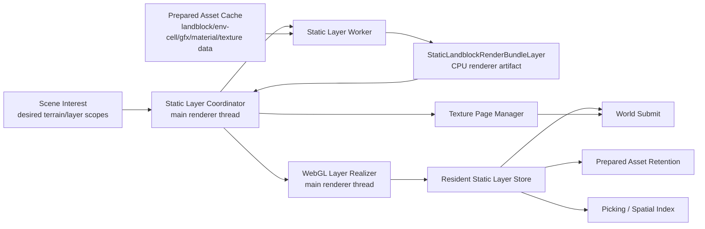
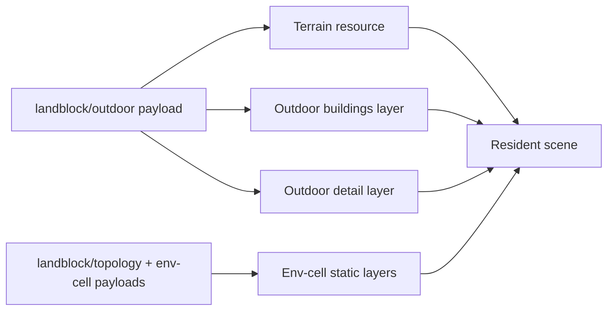
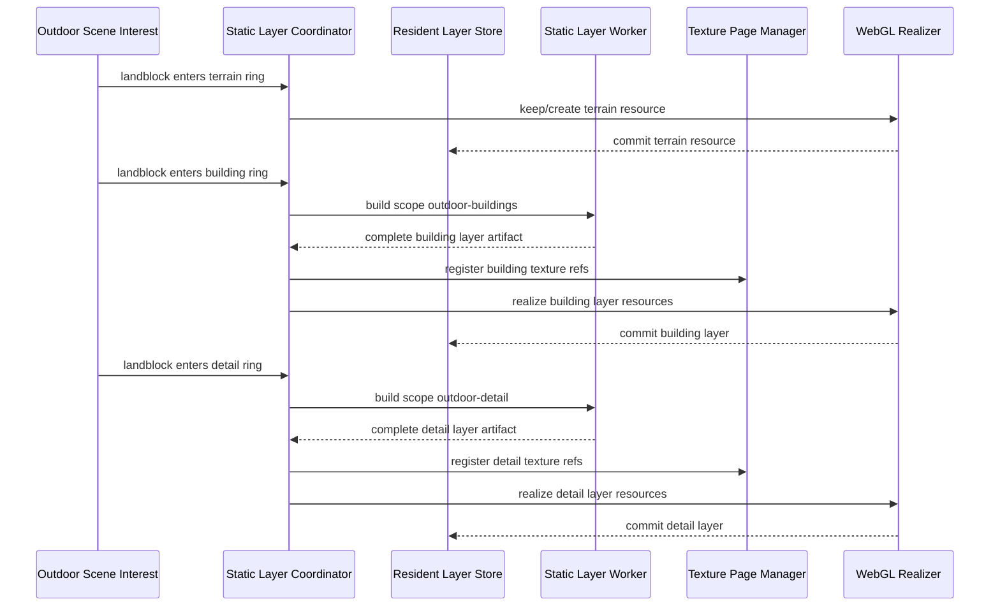
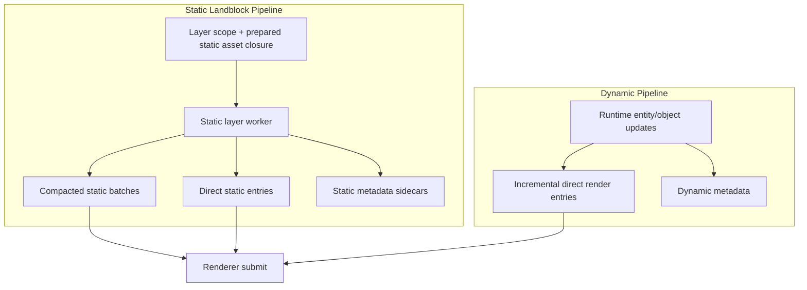
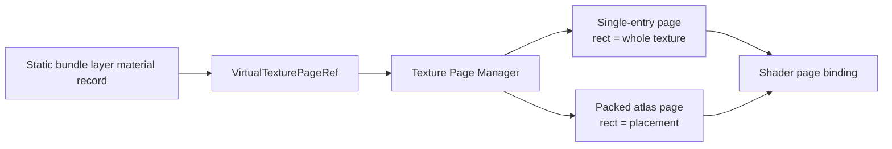
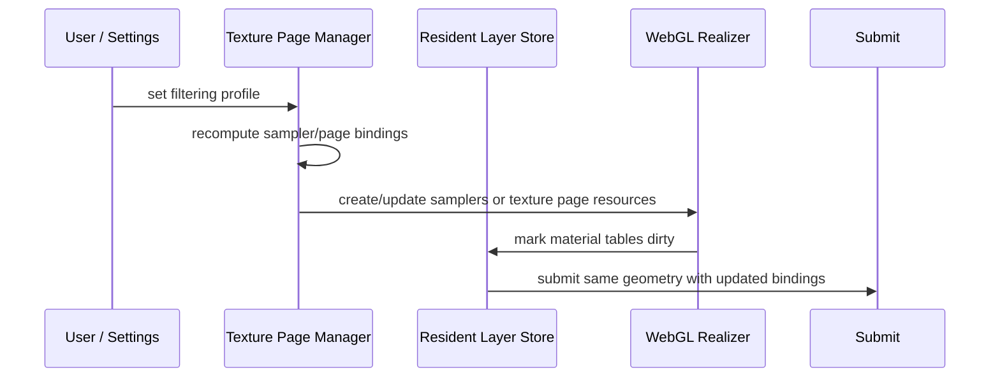
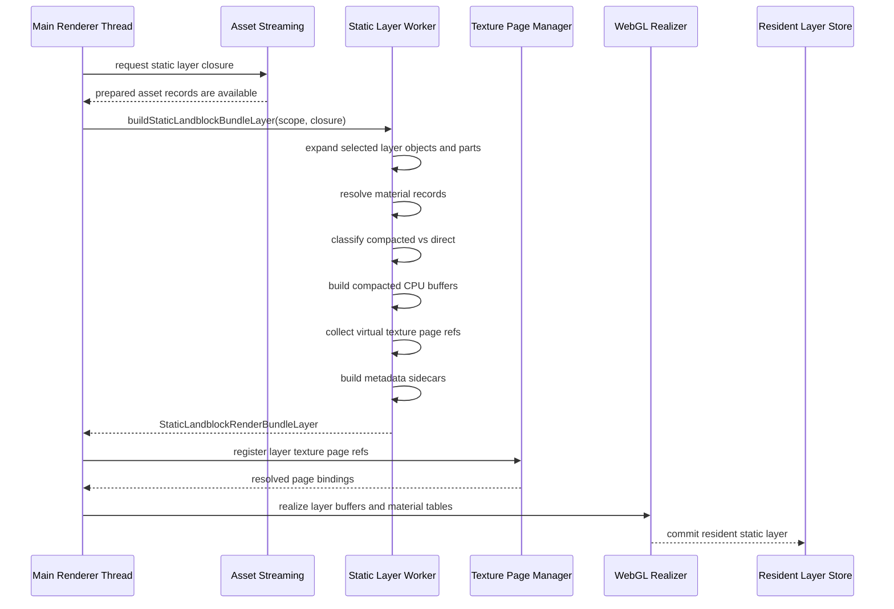
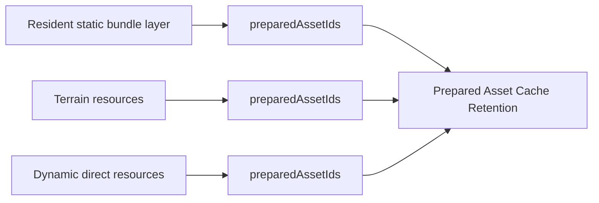

# Holtburger 3D Static Landblock Render Bundle Replacement Plan

Status: Draft implementation plan.

Related plans:

- [Holtburger 3D Render Resource Worker Plan](./holtburger-3d-render-resource-worker-plan.md)
- [Holtburger 3D Compacted Render Family Pipeline Replacement Plan](./holtburger-3d-compacted-render-family-pipeline-replacement-plan.md)
- [Holtburger 3D Outdoor LOD Streaming Plan](./holtburger-3d-outdoor-lod-streaming-plan.md)
- [Holtburger 3D BVH Batch Culling Plan](./holtburger-3d-bvh-batch-culling-plan.md)

This plan supersedes the render-resource worker plan for static landblock compaction and texture
packing. Do not preserve the current staged-static-to-render-resource-worker path as a compatibility
mode. The goal is to replace that pipeline, delete the old scheduling/accounting surface, and keep
only the pure CPU algorithms that are still useful inside the new static layer worker.

## Purpose

Make open-world landblock streaming cheap enough for continuous player movement by replacing the
current static render pipeline:

```text
asset hydration -> static scene derivation -> staged draw units -> atlas planning ->
worker-scheduled packing/compaction -> pending replacement accounting -> WebGL commit
```

with an authoritative static landblock bundle-layer pipeline:

```text
static layer closure -> static layer worker builds complete static render bundle layer ->
renderer uploads layer resources -> renderer draws resident layers
```

Static landblock content should not pass through the staged dynamic-style renderer. A static layer
worker should produce the complete, resolved static scene for the requested layer:
compacted batches, direct static entries, virtual texture page references, object/cell visibility
metadata, renderer diagnostics, and prepared asset dependency lists.

## Non-Goals

- Do not keep the current static staged draw-unit pipeline as a fallback or alternate mode.
- Do not retain standalone render-resource worker job scheduling for static landblock compaction or
  texture packing.
- Do not move WebGL buffer, texture, sampler, VAO, or program ownership off the WebGL-owning thread.
- Do not move browser-mode policy into shared crates.
- Do not generalize dynamic object rendering in this plan beyond defining the boundary with static
  rendering.
- Do not require runtime assets in permanent tests.

## Current Problems

The current renderer already eventually wants landblock-scoped compacted batches, but it discovers
that boundary late. Static renderables are expanded into staged draw units first; compaction then
groups those draw units back by landblock. This does unnecessary main-thread work and makes resource
sync sensitive to changes that should not rebuild static landblock geometry.

Major costs and complexity sources:

- per-frame or dirty-frame static staging for content that is landblock-static;
- staged draw-unit identity and graph records for static content that will be compacted;
- render-resource worker scheduler groups for compaction and atlas packing;
- pending replacement retention state for resources that should instead be layer-owned;
- atlas generation identities feeding back into compacted geometry/family resources;
- global asset-state signatures invalidating too much renderer work;
- direct draw suppression because old direct draw units coexist with compacted replacements.

The replacement pipeline should eliminate the need for direct suppression. The worker emits the
complete static answer for each requested layer scope. A surface is either represented in a
compacted batch or in the bundle layer's direct static entries.

## Target Architecture

### Ownership Model



Responsibilities:

- Scene interest decides which terrain resources and static layer scopes are desired.
- Asset streaming prepares raw content payloads and dependencies.
- The static layer worker builds complete static render bundle layers synchronously inside one async
  worker job.
- The texture page manager resolves virtual texture page references to physical single-entry or
  packed pages.
- The WebGL renderer realizes CPU artifacts into buffers, textures, samplers, material tables, and
  VAOs.
- The static layer coordinator rejects stale worker results and commits realized resources into the
  resident layer store.
- Resident layer records own WebGL lifetime and report prepared asset dependencies for cache
  retention.

### Desired Layer Planning

Do not let worker scheduling infer desired layers from the whole prepared asset cache. Add a pure
planner that turns renderer interest and prepared asset availability into explicit desired layer
scopes, closure dependencies, and blockers.

Current code already has most of the inputs:

- `deriveOutdoorSceneInterest` owns terrain/building/detail/env-cell radii.
- `createSceneCoverageRequests` and `createStaticRenderableAssetRequests` know which outdoor,
  topology, env-cell, renderable source, material, texture, and region-profile assets are requested.
- `deriveTopologyEnvCellIdsForLandblocks` and `deriveStructuredInteriorCoverage` expand topology
  into env-cell coverage.
- `collectSelectedOutdoorSourceAssetIds` already applies the building/detail static split.

The new planner should make those relationships first-class:

```ts
interface DesiredStaticBundleLayer {
  scope: StaticBundleLayerScope;
  priority: "resident-now" | "prefetch";
  closureAssetIds: readonly string[];
  missingAssetIds: readonly string[];
  sourceRevision: string;
}
```

Rules:

- Schedule a worker job only when `missingAssetIds` is empty.
- Include source, geometry, material, texture, region-profile, topology, and env-cell assets in
  `closureAssetIds` when the layer depends on them.
- Use `closureAssetIds` as both the worker input manifest and the prepared-asset retention seed.
- Derive `sourceRevision` from the ordered closure asset IDs, their prepared payload/cache
  revisions, and CPU build policy revision. Do not use the global asset-state signature for static
  layer invalidation.
- Reject worker results whose `scope` or `sourceRevision` no longer matches the desired layer.
- Keep appearance previews and other non-landblock-owned debug/editor objects out of static bundle
  layers; they should remain staged or direct dynamic entries.

### Static Bundle Layers and Outdoor LOD

The current asset routes are additive in practice, but not as separate `landblock/detail` payloads.
`landblock/outdoor` provides terrain plus outdoor static member references. Renderer interest then
selects which outdoor statics should be hydrated and rendered:

- terrain radius keeps terrain resources resident;
- building radius selects outdoor static instances classified as buildings;
- detail radius selects the remaining outdoor static instances;
- env-cell radius selects topology/env-cell content for structured and interior statics.

The replacement should model that directly. Terrain stays in the terrain bucket. Static object
render bundle layers are scoped so LOD promotion can add detail without rebuilding or mutating the
already resident building layer.



```ts
type StaticLandblockBundleLayerKind =
  | "outdoor-buildings"
  | "outdoor-detail"
  | "env-cell-static";

type StaticBundleLayerScope =
  | {
      kind: "landblock";
      landblockId: number;
      layerKind: "outdoor-buildings" | "outdoor-detail";
    }
  | {
      kind: "env-cell";
      landblockId: number;
      envCellId: number;
      layerKind: "env-cell-static";
    };
```

Layer rules:

- A worker result is complete for one `StaticBundleLayerScope`.
- `outdoor-buildings` contains only building-classified outdoor static instances selected by the
  building radius.
- `outdoor-detail` contains non-building outdoor static instances selected by the detail radius.
- `env-cell-static` contains one selected env cell's static/interior content and keeps cell
  visibility metadata explicit.
- Existing resident layers are not passed back into the worker as mutable input.
- The resident layer store composes terrain plus zero or more static bundle layers at submit time.

Promotion from distant to detailed landblock residency should be additive:



This supports both complete and additive loading without a build-on-top protocol. If interest asks
for both building and detail at once, the main thread may schedule both layer jobs from the same
prepared closure. If detail becomes visible later, the detail layer is built as a new complete layer
and composed beside the existing building layer.

### Static vs Dynamic Boundary



Static landblock content is authoritative and layer-owned. Dynamic renderables remain incremental and
direct-draw unless a future proven shared system justifies a different path.

Terrain remains a separate render bucket. It may share the virtual texture page manager, but terrain
geometry and terrain LOD policy should not be folded into static object bundle layers.

## Bundle Layer Contract

The bundle layer should be a renderer-shaped CPU artifact, not a direct clone of content assets and
not a WebGL resource object.

```ts
interface StaticLandblockRenderBundleLayer {
  key: string;
  scope: StaticBundleLayerScope;
  landblockId: number;
  layerKind: StaticLandblockBundleLayerKind;
  sourceRevision: string;
  preparedAssetIds: readonly string[];
  renderChunks: readonly StaticBundleRenderChunk[];
  compactedBatches: readonly StaticBundleCompactedBatch[];
  directEntries: readonly StaticBundleDirectEntry[];
  materialRecords: readonly StaticBundleMaterialRecord[];
  texturePageRefs: readonly VirtualTexturePageRef[];
  objectRecords: readonly StaticBundleObjectRecord[];
  spatialHints?: readonly StaticBundleSpatialHint[];
  diagnostics: StaticLandblockBundleLayerDiagnostics;
}
```

`landblockId` and `layerKind` are denormalized from `scope` for renderer indexes and diagnostics.

Required properties:

- Complete for layer: all currently renderable static content for the requested layer scope is
  represented or explained in diagnostics.
- Authoritative: there is no runtime direct fallback suppression for static content.
- CPU-only: no WebGL handles, no live texture objects, no renderer-thread-only state.
- Stable: IDs are derived from source landblock/object/part/material facts, not from transient
  staging order.
- Dependency-owned: the bundle layer reports the prepared asset IDs needed to retain it.

### Object and Part Metadata

Visibility is already at object or cell granularity for statics. Preserve that model.

Examples:

- `outdoor-static:landblock:<id>:instance:<instance>`
- `env-static:cell:<id>:instance:<instance>`
- `env-render-geometry:cell:<id>`

Picker, selection overlay, and debug metadata are non-authoritative consumers. They must not force
staged-style per-part accounting back into the static render path. Preserve object/cell visibility
keys and minimal object identity needed by rendering. Any richer inspection metadata may be emitted
only when it naturally falls out of the layer build and costs nothing meaningful to retain.

```ts
interface StaticBundleObjectRecord {
  objectKey: string;
  visibilityKeys: readonly RenderBvhItemKey[];
  sourceAssetId: string;
  owningLandblockId: number;
  owningEnvCellId: number | null;
  kind: "scenery" | "building" | "generated-scenery" | "indoor-static";
  partHints?: readonly StaticBundlePartHint[];
}

interface StaticBundlePartHint {
  renderKey: string;
  partIndex: number;
  gfxObjAssetId?: string;
  bounds?: RenderBounds;
}
```

`spatialHints` are optional and non-authoritative. The static render pipeline is valid with no
picker/debug coverage for a layer. Higher-fidelity picking can be added later only if it stays
opportunistic and does not affect layer build keys, compaction layout, texture page resolution, or
submit scheduling.

## Virtual Texture Page Model

The current renderer already treats standalone textures as degenerate atlas pages. Keep that concept
and make it explicit. Static bundle layers should reference virtual texture pages; they should not
bake physical atlas generations or global filtering policy into geometry.



```ts
interface VirtualTexturePageRef {
  key: string;
  sourceAssetId: string;
  usageBucket:
    | "base-color"
    | "detail"
    | "indexed-texels"
    | "palette-lookup"
    | "terrain"
    | "road"
    | "alpha-control";
  sampleClass: "rgba-color" | "indexed-data" | "palette-data" | "control-data";
  width: number;
  height: number;
  wrapS: "clamp" | "repeat";
  wrapT: "clamp" | "repeat";
  samplingDomain: "color" | "data" | "control";
  lookup: "color-filtered" | "exact" | "control-filtered";
  bytes?: Uint8Array;
}

interface ResolvedTexturePageBinding {
  pageKind: "single-entry" | "packed-atlas";
  textureKey: string;
  rect: readonly [number, number, number, number];
  width: number;
  height: number;
  samplerProfileKey: string;
}
```

The texture page manager owns:

- physical page placement;
- single-entry vs packed-atlas decisions;
- global filtering and sampler policy changes;
- sampler resource updates;
- page upload and eviction policy.

Static layer workers do not schedule standalone atlas-packing jobs. They emit immutable virtual
texture page refs and renderer material records. The texture page manager may call extracted packing
helpers synchronously while resolving refs, but packing generations must not feed back into static
layer identity or compacted geometry keys.

Changing global texture filtering should not rebuild static bundle layers or compacted geometry. It
should update texture page resolution, sampler state, or renderer material tables.

### Texture Resolution Sequence



## Worker Pipeline

The static layer worker job is asynchronous at the job boundary and synchronous internally. Do not
schedule nested render-resource worker jobs for compaction or packing.



Internal worker steps:

1. Validate that the static closure is complete enough for the selected layer policy.
2. Expand only the selected layer:
   - building outdoor statics for `outdoor-buildings`;
   - non-building outdoor statics and generated scenery for `outdoor-detail`;
   - one env cell's static/interior content for `env-cell-static`.
3. Expand setup-model and setup-appearance parts.
4. Resolve material records into render families and virtual texture page refs.
5. Classify surfaces as compacted or direct.
6. Build compacted geometry batches with material-slot indices.
7. Build direct static entries for surfaces that cannot be compacted.
8. Emit object/part/spatial/visibility metadata.
9. Emit prepared asset dependencies and diagnostics.

### Scheduling Model

Use one scheduler for static bundle layers, not separate schedulers for compaction, RGBA atlas
packing, indexed atlas packing, and renderer replacement groups.

Scheduler keys should be based on:

- `scope`;
- `sourceRevision`;
- renderer build policy revision;
- material/texture policy revision only when it changes CPU artifact content.

Do not include physical texture page placement, sampler policy, or packed-atlas generation in the
static layer job key. Those are texture page manager concerns.

Scheduling behavior:

- Coalesce duplicate desired scopes before posting worker jobs.
- Limit concurrent static layer worker jobs so nearby terrain and camera interaction stay
  responsive.
- Prefer nearer resident scopes over prefetch scopes.
- Cancel or ignore queued jobs for scopes that leave interest before they start.
- Commit ready layers in deterministic scope order when several finish in the same frame.
- Do not block terrain upload or dynamic direct draws on static layer completion.

The first implementation can reuse the existing worker-client shape, but it should not reuse
`render-resource-job-scheduler.ts` as a general abstraction unless that name and ownership still fit
after static compaction and atlas jobs are removed.

## Renderer Submit Model

Static submit should consume resident bundle-layer resources directly.


The old `replaceableDrawUnitIds` idea should be removed for static bundle layers. It exists today
because direct staged draw units and compacted replacements coexist. In the new model, the worker
decides the representation once. Submit only asks which bundle-layer entries are visible.

Dynamic direct entries may continue to use a direct submit path and the virtual texture page manager,
but they should not cause static bundle-layer recompaction.

## Prepared Asset Retention

Prepared asset retention should move from staged renderer graph projection to resident resource
ownership.



Bundle-layer commit installs a retained prepared-asset dependency list. Bundle-layer eviction
releases that list. No diagnostic graph node is required to explain static retention.

## Implementation Phases

Each phase should remove or replace the old surface it makes obsolete. Do not add long-lived
parallel paths.

### Codebase Impact Map

The dry-run target is to move behavior, not preserve current file boundaries.

Likely new or renamed modules:

- `static-bundle-layer-planner.ts`: derives `DesiredStaticBundleLayer` records from scene interest,
  prepared assets, and cache state.
- `static-bundle-layer-builder.ts`: pure CPU expansion/classification/compaction builder used by
  the worker and temporary main-thread phase.
- `static-bundle-layer-worker-client.ts`: posts layer jobs, tracks scope/source revisions, consumes
  transferable results.
- `webgl2/resources/static-bundle-layer-resources.ts`: realizes layer artifacts into WebGL buffers,
  material tables, and direct-entry resources.
- `texture-pages/texture-page-manager.ts`: resolves virtual texture page refs, owns sampler policy,
  packed/single-entry page resources, and page eviction.

Likely modules to split or heavily edit:

- `scene-asset-request-planner.ts`: keep asset lookup policy, but expose desired static layer
  closure planning instead of requiring render code to rediscover closure completeness.
- `browser-render-resource-coordinator.ts`: stop deriving full `StaticRenderableSceneModel` for
  landblock statics every update; derive desired layer scopes and keep runtime previews separate.
- `static-renderables.ts`: extract reusable source expansion, setup-model/setup-appearance part
  expansion, material-context creation, and stable key helpers into layer-builder inputs.
- `render-spatial-scene.ts`: stop importing `buildStaticRenderablePartMatrix` from
  `staged-world-assembly.ts`; move transform helpers to a neutral static-render utility.
- `world-render-frame.ts`: replace the `static-staged` category with static layer/direct dynamic
  categories once staged statics are gone.
- `webgl2-world-resources.ts`: replace staged draw-unit static fields, graph leases, compaction
  plans, and atlas-generation state with resident layer and texture-page-manager state.
- `webgl2-world-submit.ts`: replace runtime compacted-replacement planning with explicit static
  layer compacted/direct submit passes plus dynamic direct passes.

Likely deletion targets after migration:

- `worker-resources/compacted-geometry-worker-scheduler.ts`
- `worker-resources/texture-atlas-worker-scheduler.ts`
- `worker-resources/indexed-atlas-worker-scheduler.ts`
- static callers in `render-resource-worker-client.ts`
- static job payloads in `worker-resources/*worker-payloads.ts`
- static compaction sync in `webgl2/resources/compacted-geometry-sync.ts`
- static replacement metrics and tests in `webgl2-world-submit.test.ts`,
  `webgl2-world-resources.test.ts`, and family submit tests that only assert suppression behavior.

Keep or extract:

- `compaction/compacted-geometry.ts`: CPU compaction data assembly.
- parts of `compaction/compaction-family-planner.ts`: eligibility/classification logic, after
  removing staged draw-unit assumptions.
- `texture-pages/texture-page-atlas-planner.ts` and
  `texture-pages/indexed-resource-atlas-planner.ts`: packing helpers, if called by the texture page
  manager without renderer job scheduling.
- `texture-pages/texture-page-binding.ts`: terminology and shader binding model for single-entry
  and packed pages.
- `static-renderable-bvh-bindings.ts` and `prepared-bvh-visibility.ts`: object/cell visibility keys.

### Phase 1: Define Bundle-Layer Contracts and Pure Builders

- Add static bundle-layer DTOs and tests for key stability.
- Add desired-layer planner DTOs for `StaticBundleLayerScope`, closure asset IDs, missing asset
  blockers, priority, and source revision.
- Extract pure CPU helpers from the current staged pipeline where useful:
  - static source expansion;
  - part transform construction;
  - material record resolution;
  - compacted geometry assembly;
  - virtual texture page ref construction.
- Rename concepts away from "staged" where they become layer-local.
- Add fixture-based tests with small synthetic landblock closures.

Exit criteria:

- Bundle-layer DTOs can represent compacted and direct static outputs.
- Desired-layer planner tests prove building/detail/env-cell scope selection, closure completeness,
  and blocker reporting.
- Unit tests prove stable IDs, prepared asset dependency collection, object/part metadata, and
  runtime preview exclusion.

### Phase 2: Build Bundle Layers on the Main Thread Temporarily

This is not a compatibility mode. It is a short construction phase to prove the contract before
adding worker transport.

- Replace static staged draw-unit assembly with layer building for statics.
- Keep a temporary main-thread static layer coordinator that consumes desired-layer planner output.
- Keep structured interior and portal code separate unless a specific piece is intentionally moved.
- Realize layer direct entries and compacted batches through new WebGL layer resource code.
- Remove static draw units from compaction planning.
- Delete static direct suppression logic once no static direct draw unit coexists with compacted
  static replacements.

Exit criteria:

- Static outdoor landblocks render from resident bundle layers.
- Terrain-only, building, detail, and env-cell scopes can be committed independently.
- Existing static compaction scheduler is unused for statics.
- Static selection and picking are not required for the first static layer replacement.

### Phase 3: Move Bundle-Layer Build to the Static Layer Worker

- Add a static layer worker job contract.
- Transfer worker-owned typed-array outputs back to the main thread.
- Keep WebGL realization on the main thread.
- Coalesce desired scopes and reject stale worker results by scope/source revision.
- Delete static compaction and texture-packing render-resource worker scheduler code that no longer
  has callers.

Exit criteria:

- Static bundle-layer CPU work runs off the main thread.
- Main thread resource sync does only layer commit, upload, and eviction for statics.

### Phase 4: Replace Atlas Generations with Texture Page Manager Resolution

- Introduce virtual texture page refs as the bundle-layer material texture contract.
- Resolve layer refs to single-entry or packed pages in the texture page manager.
- Move global filtering changes to texture page resolution/sampler updates.
- Remove atlas generation identity from static compacted geometry keys.
- Update compacted material tables from resolved page bindings instead of rebuilding geometry.
- Move dynamic direct draw units onto the same virtual texture page resolution path without allowing
  them to contribute packable texture refs.

Exit criteria:

- Changing global texture filtering does not rebuild static landblock bundle layers.
- Static compacted geometry is independent of atlas placement generations.

### Phase 5: Retire Static Staging and Renderer Graph Accounting

- Delete static paths from `staged-world-assembly.ts` or split the file so only non-static staged
  paths remain.
- Remove static compaction worker scheduler ownership and tests.
- Remove static graph projection and static staged resource metrics.
- Replace asset pruning inputs with resident layer dependency reports.
- Remove static spatial item generation from the critical render path. Reintroduce optional spatial
  hints later only if they do not affect render artifacts or scheduling.
- Update diagnostics to report layer counts, compacted surfaces, direct surfaces, texture page
  resolution state, and worker build timings.

Exit criteria:

- No static landblock render path depends on staged draw-unit assembly.
- No static landblock render path depends on render-resource worker job scheduling.
- Cache pruning retains prepared assets through layer ownership.

### Phase 6: Cleanup and Consolidation

After the replacement is functionally complete, do a dedicated cleanup pass instead of leaving
renamed old concepts scattered through the renderer.

- Delete obsolete worker payload files, scheduler owners, and tests that only supported static
  render-resource jobs.
- Remove dead static-related fields from `Webgl2WorldResourceStore`, render metrics, diagnostics,
  and browser debug reports.
- Rename remaining renderer concepts away from `staged`, `replacement`, `generation`, and
  `drawUnitId` where those names now describe historical implementation details instead of current
  behavior.
- Collapse duplicated static material/texture helper functions into the layer builder or texture
  page manager.
- Remove stale comments and plan references that suggest the old render-resource worker path is
  still a valid implementation route.
- Rebaseline focused tests around layer ownership, texture page resolution, and WebGL realization;
  delete tests that assert old scheduler, pending replacement, or runtime suppression behavior.
- Remove or rewrite tests for `static-staged` render-frame categories once no live code can emit
  that category.
- Remove static-only imports from `staged-world-assembly.ts` consumers before deleting static staged
  helpers.
- Run broad TypeScript checks and targeted renderer tests after the deletion pass.

Exit criteria:

- There is one static landblock render pipeline in code and tests.
- Static renderer terminology matches the bundle-layer architecture.
- Dead-code tooling reports no obsolete render-resource worker exports for static compaction or
  atlas packing.
- Diagnostics and metrics describe resident layers and texture page resolution, not removed staged
  or replacement machinery.

## Test Strategy

- Unit-test bundle-layer builders with synthetic prepared asset closures.
- Unit-test desired-layer planning against prepared/pending/missing asset sets.
- Unit-test object/cell visibility keys. Do not require picker/debug sidecar coverage.
- Unit-test direct vs compacted classification with mixed-material objects.
- Unit-test virtual texture page refs for color, detail, indexed texels, and palette lookup.
- Unit-test texture page resolution for single-entry and packed-atlas outputs.
- Unit-test global filtering changes to prove bundle layers and compacted geometry keys are
  unchanged.
- Unit-test terrain-to-building-to-detail promotion so the building layer remains resident while the
  detail layer is built and committed additively.
- Unit-test env-cell scope planning from topology and structured-interior coverage.
- Unit-test runtime appearance previews staying out of static bundle-layer planning.
- Unit-test worker request/result stale rejection and transferable buffers.
- Add renderer resource tests for commit, eviction, and prepared asset retention.

Avoid permanent tests that require repo-local runtime DAT/HBA assets.

## Risks and Decisions

### Open Questions Answered by the Dry Run

- Distant outdoor-to-detail promotion should not rebuild resident building layers. Build complete
  additive layers and compose them.
- Do not pass compacted outdoor state back into workers. Worker inputs are prepared asset closures;
  worker outputs are complete layer artifacts.
- Keep texture refs virtual. Physical page placement and filtering policy are resolved at draw-time
  resource binding, not in layer identity.
- Runtime appearance previews are not static landblock content. Keep them in the dynamic/direct
  path even if they reuse static setup/appearance expansion code.
- Env-cell static layers are cell-scoped, but they retain `landblockId` for chunk anchoring,
  scheduling, and cache grouping.
- Structured interior render geometry, portals, portal masks, and cell indicators are not the same
  thing as env-cell static object layers. Share visibility and transform helpers, not ownership.

### LOD Promotion and Layer Composition

Do not rebuild an entire landblock when a distant landblock promotes from terrain-only to buildings
or from buildings to full outdoor detail. The worker should build complete layers, and the resident
layer store should compose those complete layers. Passing an existing compacted building layer into
the worker as mutable input would recreate the synchronization problem this plan is removing.

The implementation may schedule building and detail layers together when both are desired and their
prepared closures are available. That is an optimization of scheduling, not a different bundle
contract.

### Per-Landblock vs Shared Texture Pages

The virtual texture page model allows either per-landblock pages or shared packed pages. Start with
the simpler resolver that is easiest to reason about, then measure memory and upload cost. The
bundle-layer contract must not require either policy.

### Object-Atomic Readiness

The current static readiness model commits a static object only when all parts are ready. The
bundle-layer builder should make this policy explicit. The conservative first replacement should
preserve object-atomic readiness unless there is a deliberate visual reason to allow partial
objects.

### Structured Interiors

Outdoor static bundle layers and env-cell/structured interior rendering overlap but are not
identical. Portal traversal, portal masks, and cell visibility semantics must stay explicit. Move
only the static object expansion and rendering pieces that are proven safe.

### Closure Completeness

The current request planner can know that a source asset exists before its geometry, material,
texture, or region profile is ready. The static layer builder should not silently emit partial
layers for missing dependencies. The desired-layer planner should instead expose blockers, and the
worker should fail hard if its declared `closureAssetIds` are absent or internally inconsistent.

Diagnostics may report skipped surfaces only for content that is present but unsupported by the
renderer policy. Missing required assets are scheduling blockers, not normal not-rendered entries.

### Visibility and Picking Granularity

Object and cell visibility keys are already the right coarse unit for draw selection. Picker,
inspector diagnostics, and selection overlays are non-goals for the replacement architecture. They
may lose fidelity or disappear for static layers if supporting them would complicate static layer
construction, worker transfer, resident resource ownership, or cleanup.

Default policy:

- Culling uses object/cell keys.
- Picking coverage is optional.
- Debug inspection coverage is optional.
- Part-level sidecars are optional.
- Any picker/debug sidecar must be removable without changing render output, layer identity,
  compaction, texture page resolution, or submit scheduling.

Do not make part-level keys drive culling unless a future BVH actually exposes finer granularity.

### Transform Ownership

Current picking code gets static part transforms through `buildStaticRenderablePartMatrix` in
`staged-world-assembly.ts`. If static picker/debug support survives the replacement, move that
helper to a neutral static transform module. If that support is dropped, delete the dependency with
the staged static path instead of preserving transform code for diagnostics alone.

### Render Graph Replacement

`renderer-resource-graph.ts` currently explains staged draw-unit/material/atlas/static-batch
retention. Static layer resources should not recreate the same graph under new names. Keep graph
diagnostics only where they explain live renderer ownership; otherwise resident layer dependency
lists and texture page manager diagnostics should replace graph nodes.

### Submit Ordering

The current submit schedule draws retained direct opaque, compacted families, then retained blended
draw units. Preserve the material-ordering intent when static layers become explicit submit passes:
opaque/cutout static compacted and static direct entries should draw before transparent direct
entries, while dynamic blended entries remain late. Do not let additive layer composition introduce
frame-order nondeterminism.

### Diagnostics

Do not keep old graph diagnostics alive to explain removed concepts. Add diagnostics for the new
system:

- layer build time;
- layer commit/upload time;
- compacted/direct surface counts;
- texture page ref counts;
- physical texture page counts;
- static object visibility counts;
- skipped/not-rendered reasons;
- prepared asset dependency counts.

## Deleted Concepts Checklist

The replacement is complete only when these old concepts are gone from the static landblock path:

- static staged draw-unit assembly;
- static compaction family planning over staged draw units;
- static render-resource compaction worker scheduling;
- static atlas packing worker scheduling as an independent renderer job;
- pending static compacted replacement retention;
- runtime direct suppression for compacted static replacements;
- static prepared-asset retention through staged renderer graph nodes.
