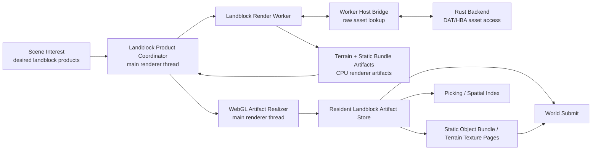
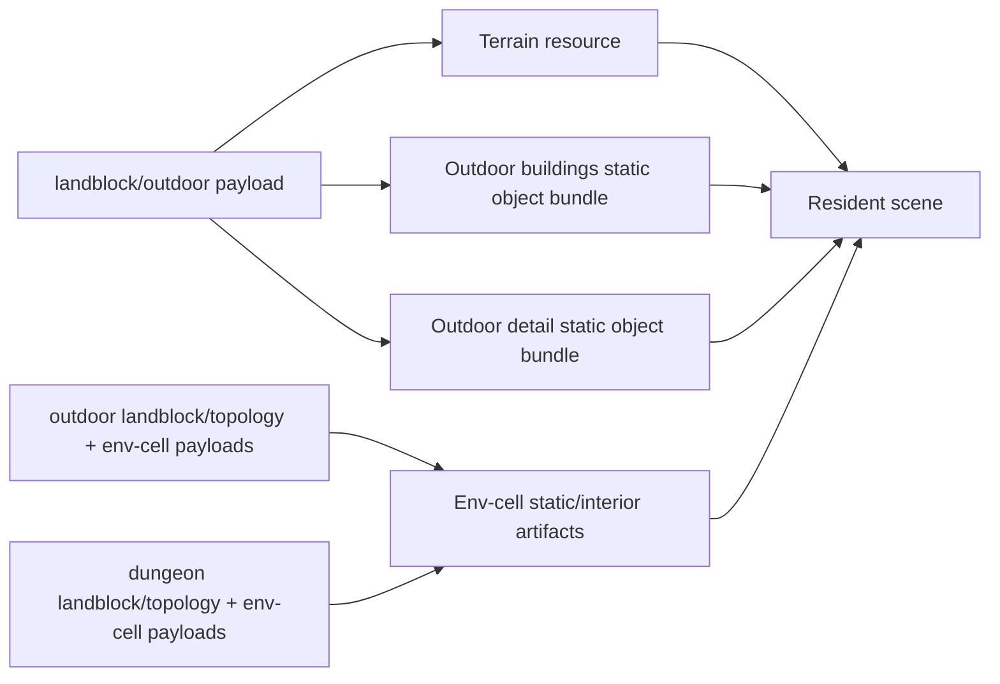
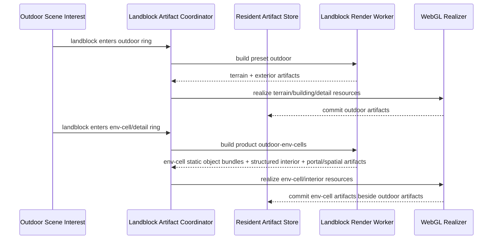
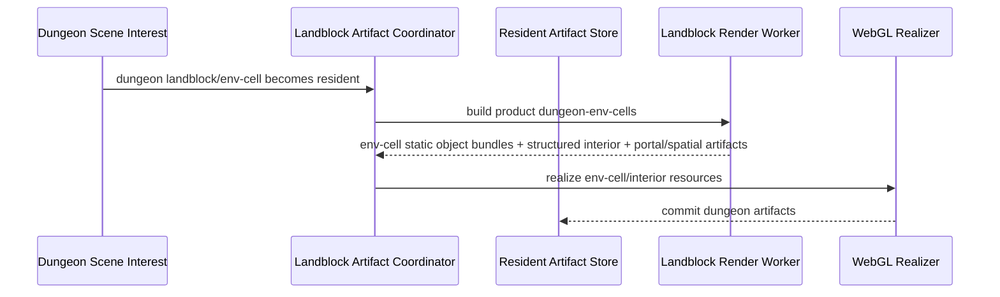
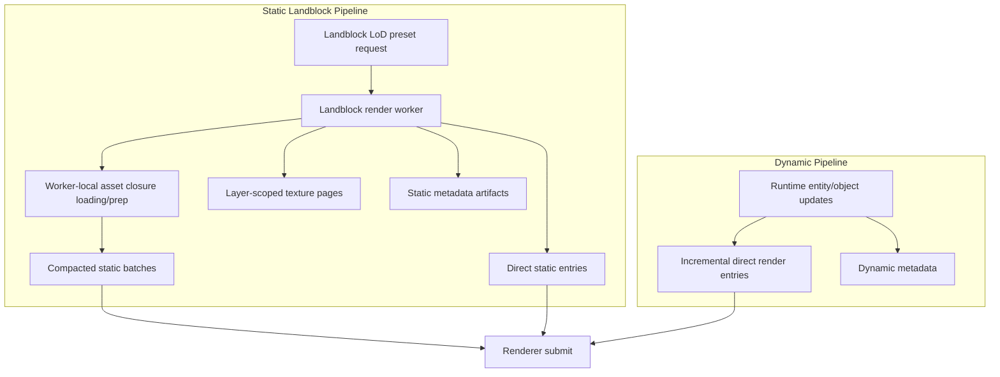
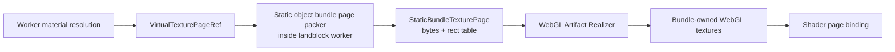
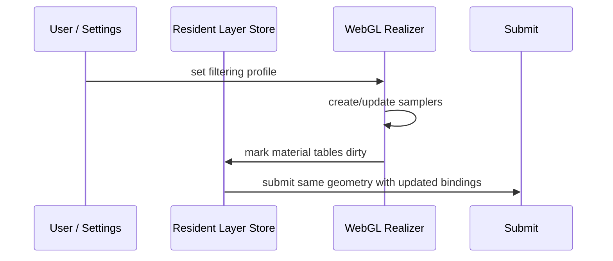
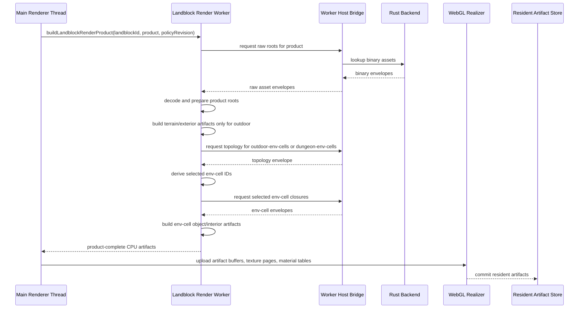
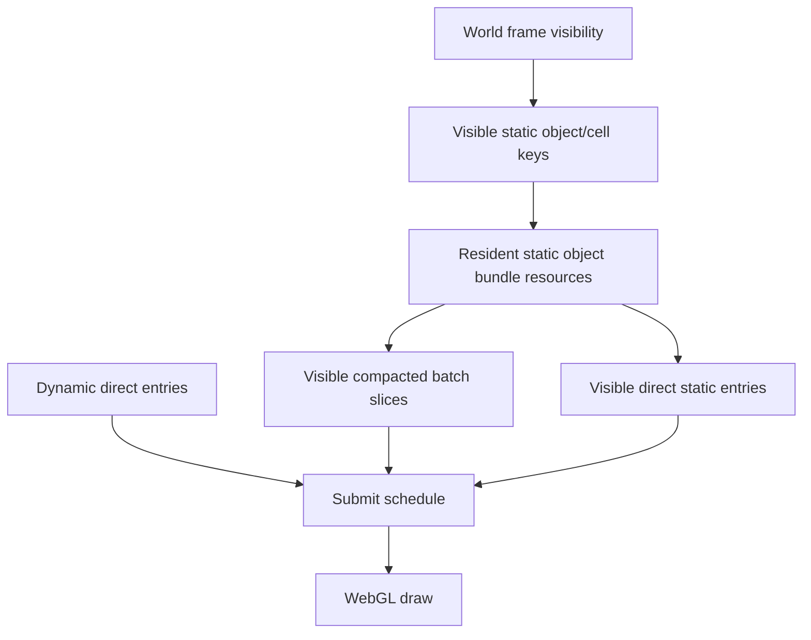
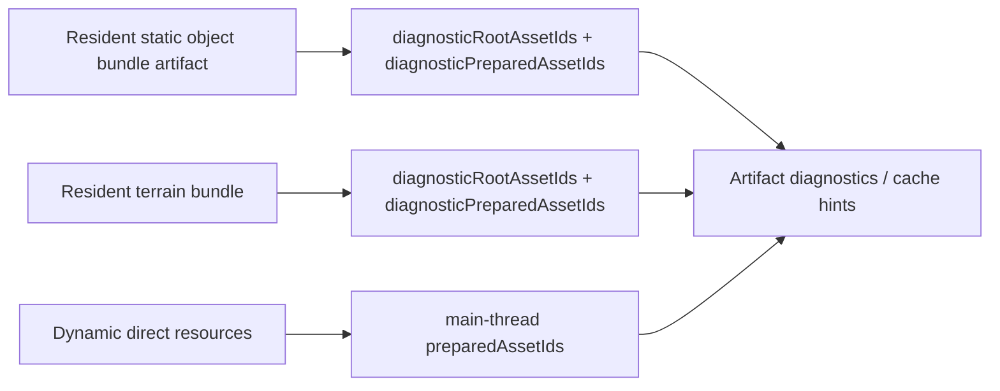

# Holtburger 3D Static Landblock Render Bundle Replacement Plan

Status: Phase 1A through Phase 1J, Phase 2A, Phase 2B, Phase 3A, Phase 3B, Phase
3C1, Phase 3C2A, Phase 3C2B1, Phase 3C2B2, Phase 3C2B3, and Phase 4A are
implemented. Phase 4B additive topology/env-cell worker product build is implemented. Phase 4C
detailed product WebGL resource and submit is split into smaller phases; Phase 4C1 env-cell static
bundle resource/submit is implemented and Phase 4C2 product artifact contract normalization is
implemented. Phase 4C3A worker detailed artifact structured-interior scene handoff is implemented;
Phase 4C3B direct WebGL structured-interior shell resource/submit is implemented. Phase 4C3C
structured-interior material artifact realization is split into smaller slices; Phase 4C3C1 worker
material artifact contract preparation is implemented. Phase 4C3C2 textured WebGL realization is
split; Phase 4C3C2A material-slice WebGL resource/submit is implemented and Phase 4C3C2B sampler
policy resource control is implemented. Phase 4C3C2C artifact texture mipmap/anisotropy policy is
implemented. Phase 4C3D portal/spatial artifact resource handoff is split into smaller slices;
Phase 4C3D1 artifact-native transition portal candidate handoff and Phase 4C3D2 portal mask
artifact input handoff are implemented. Phase 4C3D3 spatial/culling artifact input handoff is
split further; Phase 4C3D3A artifact-backed env-cell local BVH culling and Phase 4C3D3B1
artifact-backed structured spatial index items are implemented. Phase 4C3D3B2 static bundle
spatial hints and artifact-backed static spatial index items are implemented. Phase 4C3D3B3
selected static overlay artifact fallback is implemented. Phase 4C3D3B4 render BVH visibility
naming cleanup is implemented. Phase 4D1 artifact-backed portal composite BVH sources are
implemented. Phase 4D2A artifact-backed camera residency index and Phase 4D2B1 artifact-owned
render-frame env-cell BVH visibility are implemented. Phase 4D2B2 scene-domain base fallback
cleanup, Phase 4D2B3 portal composite env-cell fallback removal, and Phase 4D2B4 exterior
portal/culling source quarantine are implemented. Phase 4E0 artifact scene-bounds cutover is
implemented. Phase 4E1 latent portal-clipped BVH debt removal and Phase 4E2 scope-aware staged
static suppression are implemented. Phase 4E3 artifact-active outdoor static scene derivation
cutover is implemented. Phase 4E4 indoor/dungeon env-cell product scheduling is implemented.
Phase 4E5 artifact-active structured-interior fallback cutover is implemented.
Phase 4E6 artifact-active structured coverage cutover is implemented.
Phase 4E7 browser coordinator contract hard cutover is implemented.
Phase 4E8 staged structured-interior draw path removal is implemented.
Phase 4E9 staged static renderable draw path removal is implemented.
Phase 4E10 static compaction render-resource worker deletion is implemented.
Phase 4E11 artifact-native diagnostics/metrics cleanup is implemented.
Phase 4E12 atlas render-resource worker deletion is implemented, with Phase 4E13 added for the
remaining global atlas generation resource model cleanup.
The plan has been redirected to worker-owned raw landblock closure loading, worker-built terrain
artifacts, additive landblock worker product requests, and static-object-bundle-owned texture pages.

Progress:

- 2026-06-04: Added the first static bundle-layer renderer contract in
  `apps/holtburger-3d/src/lib/world-display/static-bundle-layer.ts`.
- 2026-06-04: Added a pure desired-layer planner in
  `apps/holtburger-3d/src/lib/assets/static-bundle-layer-planner.ts`.
- 2026-06-04: Added focused tests for bundle DTO shape, stable scope keys, outdoor
  building/detail layer planning, env-cell layer planning, closure blockers, and source-revision
  stability.
- 2026-06-04: Revised the target architecture so static layer workers load/prepare their own raw
  static asset closures through the worker host bridge and emit layer-owned texture page artifacts
  instead of resolving static textures against mutable global atlases.
- 2026-06-04: Dry-ran the worker-owned loading and layer-scoped page direction against the codebase.
  The asset worker already has a host binary lookup bridge and worker-local preparation path, but
  the bridge is private to `asset-worker.ts` and must be extracted before a static layer worker can
  reuse it. Env-cell layer scope discovery was initially modeled as a separate worker discovery
  step, but later phases should fold topology loading and env-cell scope derivation into the
  landblock worker call graph.
- 2026-06-04: Chose shared worker-side asset loading/preparation libraries over worker-to-worker
  delegation. `asset-worker.ts`, `static-landblock-render-worker.ts`, and future domain workers
  should import shared closure loading helpers instead of copying code or routing through a central
  asset worker service.
- 2026-06-04: Split the next work into smaller phases: shared worker asset loading foundation,
  worker-owned static contracts, worker-safe builder, static worker orchestration, renderer vertical
  slice, and expansion/deletion.
- 2026-06-04: Implemented Phase 1B. Extracted shared worker-side host asset lookup, asset
  preparation, closure dependency loading, transferable normalization, and worker profiling modules
  under `apps/holtburger-3d/src/workers/shared/`. `asset-worker.ts` now imports those helpers and
  remains the prepared-asset-cache worker instead of becoming a cross-worker service.
- 2026-06-04: Implemented Phase 1C. `DesiredStaticBundleLayer` now schedules from `rootAssetIds`
  and keeps prepared-cache closure data inside an explicit diagnostics object. Added static worker
  job/result DTOs, env-cell topology discovery DTOs, and layer-owned texture page DTOs to the static
  bundle contract.
- 2026-06-04: Implemented the first Phase 1D builder slice in
  `apps/holtburger-3d/src/lib/world-display/static-bundle-layer-builder.ts`. The builder consumes a
  Phase 1C static layer worker job plus worker-local prepared assets, expands outdoor/env-cell source
  objects, validates closure consistency, emits compacted/direct bundle DTOs, derives object/cell
  visibility records, packs layer-owned texture pages synchronously, and stays CPU-only.
- 2026-06-04: Refined the Phase 1D builder slice so material render-surface dependencies derive
  normalized `prepared-texture/...` route IDs for worker-local closure accounting and layer texture
  refs. Texture page generation no longer scans unrelated prepared texture records from the closure.
- 2026-06-04: Completed the Phase 1D normalized material texture policy refinement. The static
  bundle builder now mirrors the material texture preparation policy for raw/detail static material
  routes, validates policy-supported render-surface formats through the fixture coverage, and maps
  prepared texture payload metadata into virtual texture page usage/sample/lookup fields instead of
  assuming color RGBA pages.
- 2026-06-04: Closed Phase 1D as the worker-safe builder foundation and split its remaining broad
  extraction bucket into smaller executable phases: Phase 1E material/family eligibility, Phase 1F
  compaction geometry assembly, and Phase 1G texture/material-role hardening plus pre-worker cleanup.
- 2026-06-04: Implemented Phase 1E. Static bundle surfaces now derive material behavior and
  compacted/direct eligibility through the existing pure compaction eligibility planner instead of
  material asset ID string conventions. Static material records now carry family keys and
  transparency from those eligibility facts.
- 2026-06-04: Implemented Phase 1F. Static bundle compacted batches are now grouped by material
  family and material record instead of being merged into one layer-wide compacted batch. Builder
  tests now prove multiple compacted batches can coexist with direct entries without staged fallback
  suppression.
- 2026-06-04: Implemented Phase 1G. Layer texture page packing and virtual-ref descriptor conversion
  are now worker-safe helpers outside the static bundle builder. Focused tests cover packed vs
  single-entry layer pages and base/detail/data/control descriptor semantics.
- 2026-06-04: Added Phase 1H before worker orchestration after identifying that the new static bundle
  builder is not yet family-complete relative to the existing compaction planner. Compacted static
  material families are RGBA texture-page and indexed-paletted; detail is an optional texture role
  for both families, not a separate family. Indexed-paletted static bundle wiring must land before
  Phase 2.
- 2026-06-04: Added Phase 1I before worker orchestration after rechecking terrain. Terrain is not
  part of the static object bundle builder and has no acceptable direct-draw fallback. The existing
  renderer already has terrain tile resources, terrain blend plans, terrain color/mask/detail texture
  page families, and terrain submit code; Phase 1I must preserve that as a first-class streaming
  artifact when static worker orchestration begins.
- 2026-06-04: Redirected Phase 2 from separate topology discovery plus per-layer worker scheduling
  toward a single landblock render worker call graph. For outdoor-shaped presets the worker should
  load the outdoor payload, build terrain, and derive requested exterior object layers. For
  detailed/topology-shaped presets it should load topology when env-cell interest requires it,
  hydrate selected env cells, and return the complete set of terrain/object/spatial artifacts legal
  for that preset.
- 2026-06-04: Refined the landblock worker request model from arbitrary artifact masks/scopes to
  additive landblock product requests that match current backend route/product boundaries. The
  current target products are `outdoor`, `outdoor-env-cells`, and `dungeon-env-cells`. Prepared-cache
  root manifests, closure diagnostics, source revisions, topology discovery jobs, and per-layer
  worker scheduling are legacy-shaped transition details, not the target contract.
- 2026-06-04: Dry-ran the preset model against the current codebase. The route-shaped preset
  direction is coherent; current routes are `landblock/<id>/outdoor`, `landblock/<id>/topology`,
  `env-cell/<id>`, terrain/material/profile/renderable dependencies, and prepared textures. A true
  `summary` preset should remain deferred until a cheap backend summary route/product exists.
- 2026-06-04: Implemented Phase 1H. Static bundle material route collection now detects indexed
  render surfaces, emits indexed texel and palette lookup virtual texture refs/pages from
  worker-local render-surface/palette facts, keeps optional detail refs on the indexed-paletted
  family, and feeds those descriptors into existing compaction eligibility. The phase also removed
  the stale unused camera conversion helper that had been blocking full TypeScript lint.
- 2026-06-04: Implemented Phase 1I. Added a first-class landblock terrain render artifact contract
  and builder that reuses existing terrain material, blend-plan, tile-slice, geometry, and BVH helper
  code. Terrain artifacts now stand beside static object bundle layers as CPU renderer artifacts and
  carry diagnostic roots/prepared IDs, color/mask page refs, draw-slice geometry, fallback geometry
  diagnostics, and terrain BVH keys.
- 2026-06-04: Implemented Phase 1J. Added route-shaped landblock render preset DTOs, worker job/result
  contracts, and a pure prepared-cache-free preset planner that maps current outdoor radii to a
  single most-detailed request per landblock. Phase 4B planning later superseded this with additive
  product requests so env-cell/topology products do not duplicate outdoor layers. The target contract
  does not carry root manifests, topology discovery DTOs, prepared-record source revisions, or
  summary preset shims.
- 2026-06-04: Implemented Phase 2A. Added a landblock preset worker and client that load raw
  landblock/topology/env-cell closures through the worker host bridge, run worker-local asset
  preparation, build terrain plus static bundle artifacts, and return complete preset results without
  main-thread prepared asset state.
- 2026-06-04: Implemented Phase 2B. Added the resident CPU artifact store/coordinator, wired live
  browser scene interest to submit desired preset worker jobs, committed only latest worker results,
  and surfaced low-fidelity worker artifact diagnostics.
- 2026-06-04: Implemented Phase 3A. Browser terrain scene selection now consumes resident
  `LandblockTerrainRenderArtifact` results from the worker artifact store whenever the landblock
  artifact pipeline is active, so migrated outdoor terrain no longer falls back to main-thread
  prepared outdoor asset selection while worker artifacts are desired or in flight.
- 2026-06-04: Implemented Phase 3B. Worker-derived terrain tiles now carry the resident
  `LandblockTerrainRenderArtifact` into WebGL resource sync. WebGL terrain upload consumes artifact
  draw-slice geometry, fallback geometry, artifact keys, and atlas-ready terrain page bytes instead
  of rebuilding terrain blend plans or resolving prepared terrain textures from `AssetChannelState`
  for worker-derived terrain.
- 2026-06-04: Implemented Phase 3C1. Hardened the static bundle direct-entry artifact contract so
  direct static entries carry positions, normals, UVs, and indices from worker-built surfaces. This
  removes the main blocker that would have forced static direct draw realization to reach back into
  prepared gfx assets or staged draw units.
- 2026-06-04: Implemented Phase 3C2A as an immediate renderer-resource foundation before the full
  static vertical slice. Added WebGL resource ownership for static bundle layer-owned texture pages,
  material texture bindings, compacted static geometry buffers, and direct static geometry buffers.
  The resource layer validates texture page upload formats from static page sample classes and
  replaces resources by immutable layer key plus source revision.
- 2026-06-04: Corrected the Phase 3C2A indexed texture page contract so `indexed-data` pages carry
  explicit `p8` or `index16` format metadata. Static bundle page packing now keeps P8 and 16-bit
  index pages separate, and WebGL upload uses R8 for P8 pages and RG8 for 16-bit index pages.
- 2026-06-04: Implemented Phase 3C2B1. The browser render surface now forwards resident static
  landblock render artifact snapshots into the WebGL renderer. `Webgl2WorldResourceStore` owns a
  static bundle layer resource store and explicitly syncs resident `outdoor` building/detail bundle
  layers into WebGL texture/geometry/material resources without routing through staged draw-unit
  assembly, global atlas generations, or static compaction worker scheduling.
- 2026-06-04: Split the expanded detailed/static-interior migration into Phase 4A through Phase 4E.
  The detailed preset is a holistic replacement of topology/env-cell/static-interior hydration, not a
  second renderer mode. The split keeps the schedule realistic while preserving the requirement that
  all landblock-derived static geometry, portal facts, and required spatial artifacts leave the
  main-thread staged hydration path before cleanup starts.
- 2026-06-04: Corrected the post-3C2B scope: landblock-derived structured interior render geometry,
  env-cell structure metadata, portal aperture/static spatial artifacts, and staged
  `structured-interior` draw-unit assembly are in scope for the worker-artifact replacement. The
  plan must not preserve a second main-thread interior static path after outdoor/env-cell bundle
  migration.
- 2026-06-04: Implemented Phase 3C2B2. Resident `outdoor` static bundle layer resources now submit
  RGBA texture-page compacted/direct geometry through explicit static-bundle submit metrics, and
  WebGL resource sync suppresses staged outdoor static draw-unit assembly for a landblock once both
  resident outdoor bundle layers are present. The phase also exposed the resource metadata required
  for draw-time virtual texture ref resolution.
- 2026-06-04: Added Phase 3C2B3 as an immediate follow-up before detailed/env-cell expansion. The
  RGBA submit slice proved resident bundle submit and staged suppression, but indexed-paletted static
  bundle submit still needs material descriptor metadata for index format, palette size, clip
  threshold, repeat policy, and optional indexed detail binding before the outdoor submit replacement
  can be considered family-complete.
- 2026-06-04: Implemented Phase 3C2B3. Static bundle material records now carry worker-derived
  indexed material descriptors, WebGL static bundle resources retain those descriptors, and resident
  static bundle submit draws indexed-paletted P8 and 16-bit geometry through layer-owned
  indexed-texel, palette-lookup, and optional detail pages without staged draw-unit adapters or
  global indexed atlas generations.
- 2026-06-04: Implemented Phase 4A. The current code now has a strict outdoor vs detailed preset
  result union, where detailed `outdoor-with-env-cells` results require a
  `DetailedLandblockRenderArtifacts` aggregate with selected env-cell IDs, structured interior shell
  geometry, cell structure metadata, portal link/aperture artifacts, object/cell visibility records,
  and required env-cell residency/local BVH spatial artifacts. Phase 4B planning
  supersedes that name/shape with additive `outdoor-env-cells` and `dungeon-env-cells` product
  results that must not duplicate outdoor outputs.
- 2026-06-04: Identified and corrected dungeon and layering blind spots before Phase 4B
  implementation. Dungeon landblocks do not have outdoor terrain or exterior static geometry, and
  outdoor env-cell promotion should not duplicate layers already returned by `outdoor`. The target
  worker products are now additive: `outdoor` emits terrain/exterior layers, `outdoor-env-cells`
  emits only topology/env-cell/structured/portal/spatial outputs for outdoor landblocks, and
  `dungeon-env-cells` emits the same topology/env-cell output family without `landblock/<id>/outdoor`.
- 2026-06-04: Implemented Phase 4B. Renamed the active landblock render DTO surface from preset to
  product (`landblock-render-product.ts`, `landblock-render-product-planner.ts`), changed desired
  planning to emit additive products by `landblockId + product`, and split the worker build path so
  `outdoor` loads `landblock/<id>/outdoor` while `outdoor-env-cells` and `dungeon-env-cells` load
  only topology/env-cell roots. Topology products now return `terrainArtifact: null`, no
  `outdoor-buildings`/`outdoor-detail` layers, and detailed-landblock artifacts keyed by product. Browser
  terrain selection now ignores topology products because terrain ownership belongs only to
  `outdoor`.
- 2026-06-04: Implemented Phase 4C1. WebGL static bundle resource sync now accepts legal
  product/layer pairs instead of filtering only `outdoor`: `outdoor` owns `outdoor-buildings` and
  `outdoor-detail`, while `outdoor-env-cells` and `dungeon-env-cells` own `env-cell-static`. Existing
  static bundle submit is layer-kind agnostic, so env-cell static layers now submit through the same
  layer-owned texture page/material binding path as outdoor static bundles without staged draw-unit
  adapters or global atlas generations. Structured interior shell geometry and portal/spatial
  artifact realization remain Phase 4C3 because they need a distinct resource/submit shape, not a
  static bundle layer filter tweak.
- 2026-06-04: Added Phase 4C2 product artifact contract normalization before structured-interior
  resource work. The target worker product result should expose one artifact collection, not sibling
  `terrainArtifact`, `staticBundleLayers`, and detailed aggregate fields. Static object bundles become
  artifact records with scope and owned texture pages; terrain, structured interior, portal, spatial,
  and visibility outputs are peer artifact kinds.
- 2026-06-04: Implemented Phase 4C2. `LandblockRenderProductWorkerResult` now exposes
  `artifacts: readonly LandblockRenderArtifact[]` instead of `terrainArtifact`,
  `staticBundleLayers`, or `detailedArtifacts` sibling fields. Terrain artifacts carry
  `artifactKind: "terrain"`, static object bundles carry `artifactKind: "static-object-bundle"`, and
  topology/env-cell detailed aggregates carry `artifactKind: "detailed-landblock"` as a transitional
  aggregate until Phase 4C3 splits structured interior, portal, spatial, and visibility resources by
  consumer need. Active product-boundary type names were renamed to `StaticObjectBundleArtifact`,
  `StaticObjectBundleKind`, `StaticObjectBundleScope`, and `formatStaticObjectBundleScopeKey`
  without compatibility aliases.
- 2026-06-04: Implemented Phase 4C3A as the first structured-interior migration slice.
  `deriveStructuredInteriorSceneModelFromLandblockArtifacts` now derives renderable structured
  interior cells from resident `detailed-landblock` artifacts, and browser render-resource
  coordination prefers that worker-owned scene when available. This removes the main-thread
  prepared env-cell dependency for structured-interior render-critical geometry once topology/env-cell
  worker artifacts are resident, while intentionally leaving the final direct WebGL resource/submit
  replacement for Phase 4C3B.
- 2026-06-04: Implemented Phase 4C3B direct structured-interior shell resources.
  `Webgl2StructuredInteriorResourceStore` now uploads resident `detailed-landblock`
  structured-interior cell geometry into direct WebGL resources, `submitWebgl2WorldFrame` submits
  those resources through the flat world shader without world-frame draw-unit references, and
  `syncWebgl2WorldResources` suppresses staged `structured-interior` shell draw units whenever
  direct structured-interior resources are resident. This intentionally renders shell geometry with
  flat per-cell color until worker-side material/texture roles are promoted for detailed interiors.
- 2026-06-04: Added Phase 4C3C so detailed interior material realization is scheduled explicitly
  before hard cutover. Direct structured-interior geometry is not complete enough to delete the
  main-thread structured-interior path until worker detailed artifacts carry material records,
  artifact-owned texture pages, and render-family metadata for the currently supported interior
  material families.
- 2026-06-04: Implemented Phase 4C3C1 as an immediate material-artifact preparation slice. Shared
  static material route/page helper logic now feeds both static object bundles and structured
  interiors. Detailed-landblock artifacts now carry structured-interior material records,
  texture-page refs, owned texture pages, and per-cell material slices for RGBA prepared texture
  materials with optional detail. Textured WebGL structured-interior submit was split into Phase
  4C3C2A and sampler-policy follow-up Phase 4C3C2B.
- 2026-06-04: Implemented Phase 4C3C2A as the first textured structured-interior WebGL realization
  slice. Structured-interior resources now upload worker-owned texture pages, material records, and
  per-material slice geometry with UVs; submit renders RGBA texture-page and indexed-paletted
  structured-interior slices through artifact-owned texture bindings without `AssetChannelState`
  material or texture lookup. The old flat whole-cell shell path is now a narrow no-material-slice
  fallback instead of the normal path for supported material families.
- 2026-06-04: Implemented Phase 4C3C2B. Artifact-owned texture pages now accept renderer-owned
  texture filtering policy in both static object bundle and structured-interior resource sync. Color
  and detail pages update sampler parameters in place when filtering changes, while indexed texel and
  palette lookup pages remain exact sampled. Filtering changes do not rebuild CPU artifacts, static
  bundle geometry buffers, structured-interior material slice buffers, or texture objects.
- 2026-06-04: Added Phase 4C3C2C before portal/spatial handoff. Artifact-owned page mipmap and
  anisotropy behavior is renderer-side upload/resource policy, not worker output policy, and should
  be scheduled explicitly so `anisotropic-4x` does not silently behave like plain linear filtering
  for static object bundle or structured-interior color/detail pages.
- 2026-06-04: Implemented Phase 4C3C2C. Artifact-owned static object bundle and structured-interior
  color/detail pages now generate renderer-side mipmaps for non-nearest filtering, use
  `LINEAR_MIPMAP_LINEAR` minification, and apply clamped anisotropy for `anisotropic-4x`. Indexed
  texel and palette lookup pages remain exact sampled, non-mipped, and do not receive anisotropy.
  Filtering policy changes still avoid rebuilding CPU artifacts, material records, and geometry
  buffers.
- 2026-06-04: Implemented Phase 4C3D1. Transition portal candidate derivation now prefers resident
  `detailed-landblock` artifacts for topology/env-cell portal links, aperture geometry, selected
  interior env-cell coverage, render chunks, and portal target status. The browser render-resource
  coordinator uses artifact-native candidates when detailed artifacts are resident and only falls
  back to the legacy `AssetChannelState` plus `StructuredInteriorSceneModel` derivation while the
  detailed artifact is absent.
- 2026-06-05: Implemented Phase 4C3D2. Portal mask draw-unit assembly moved out of
  `staged-world-assembly.ts` into a transition-portal-specific resource input builder. WebGL
  resource sync now appends portal mask draw units from the `TransitionPortalCandidateModel`, so
  portal masks consume artifact-backed candidate aperture facts when detailed artifacts are
  resident instead of being owned by the staged static/interior assembly path. The staged assembly
  helper no longer accepts or scans transition portal candidates.
- 2026-06-05: Implemented Phase 4C3D3A. WebGL frame visibility now passes the resident static
  landblock artifact snapshot into render BVH visibility derivation. Env-cell local BVH culling
  prefers `detailed-landblock.spatial.envCellLocalBvhs` and only falls back to prepared env-cell
  payload BVHs when no resident detailed artifact BVH exists for the cell. The lower-level BVH query
  helper now accepts artifact-local BVH facts without fabricating prepared env-cell payloads.
- 2026-06-05: Implemented Phase 4C3D3B1. The browser render spatial index now prefers coarse
  structured-cell spatial items derived from resident `detailed-landblock` artifacts. This moves
  structured-interior picker/debug spatial ownership off the bridge-derived scene when detailed
  artifacts are resident while intentionally preserving only coarse cell-level fidelity.
- 2026-06-05: Implemented Phase 4C3D3B2. Static object bundle artifacts now carry coarse
  object-level `spatialHints` from prepared instance bounds when the worker builder has them, and
  the browser render spatial index prefers those artifact hints over main-thread static renderable
  part spatial items. This keeps static picking/debug spatial coverage object-level and artifact
  owned instead of part-level and staged-geometry owned.
- 2026-06-05: Implemented Phase 4C3D3B3. The selected static renderable bounds overlay now resolves
  selected static keys against resident static bundle `spatialHints` first and renders coarse
  artifact object bounds when available. The old prepared gfx object/part transform overlay path
  remains only as an absence fallback for non-migrated or hintless static selections.
- 2026-06-05: Implemented Phase 4C3D3B4. Renamed the higher-level BVH visibility snapshot module
  from `prepared-bvh-metrics.ts` to `render-bvh-visibility-snapshot.ts` and replaced the exported
  `PreparedBvhDebugMetrics`/`PreparedBvhVisibilitySnapshot` API with
  `RenderBvhVisibilityMetrics`/`RenderBvhVisibilitySnapshot`. `world-render-frame.ts` now imports
  the neutral snapshot builder. The lower-level `prepared-bvh-visibility.ts` query module remains
  intentionally named because it still describes the prepared BVH record/query format consumed by
  both prepared-payload and artifact-backed callers.
- 2026-06-05: Implemented Phase 4D1. Renamed the mixed portal composite source module from
  `prepared-bvh-render-sources.ts` to `render-bvh-sources.ts`, added resident detailed artifact
  env-cell local BVH source derivation for portal composite/interior clipped visibility, and wired
  WebGL scene-bounds source construction to pass the resident static landblock artifact snapshot.
  Prepared env-cell payload sources remain only as the existing absence fallback.
- 2026-06-05: Implemented Phase 4D2A. `world-residency-index.ts` can now build camera residency
  indexes directly from resident `detailed-landblock.structuredInteriorCells`, and the WebGL
  renderer prefers that artifact-backed index before falling back to `StructuredInteriorSceneModel`.
  Artifact-backed residency uses structured interior artifact render-geometry bounds plus cell BSP;
  the legacy conservative cell-structure vertex-array bounds remain available only for structured
  scene fallback cells.
- 2026-06-05: Implemented Phase 4D2B1. Render-frame env-cell BVH visibility now iterates resident
  detailed artifact local BVH entries with their artifact-owned structured cell render chunks before
  consulting `StructuredInteriorSceneModel`. Prepared env-cell payload culling remains only as the
  existing fallback for env cells not covered by resident detailed artifacts.
- 2026-06-05: Implemented Phase 4D2B2. The initial WebGL scene-domain base fallback no longer
  depends on `StructuredInteriorSceneModel.cells`. `deriveWebgl2BaseSceneDomain` now derives only
  from `WorldRenderSceneContext`, while the actual per-frame base scene and initial portal env-cell
  continue to come from artifact-backed camera residency.
- 2026-06-05: Implemented Phase 4D2B3. `buildPortalCompositeRenderBvhSources` no longer accepts
  `StructuredInteriorSceneModel` and no longer rebuilds env-cell portal composite sources from
  prepared env-cell payloads. Interior portal composite source facts now come from resident detailed
  artifact local BVHs or are absent.
- 2026-06-05: Implemented Phase 4D2B4 as a decision/quarantine phase. The current renderer performs
  portal aperture masking and scene-domain compositing, but `derivePortalClippedBvhVisibility` is not
  on the active draw-submission path. Exterior terrain/outdoor prepared BVH source construction in
  `render-bvh-sources.ts` is quarantined as legacy debt instead of being preserved as part of the
  static landblock replacement architecture.
- 2026-06-05: Added and implemented Phase 4E0 before the broad hard cutover. Scene-bounds
  calculation now consumes resident terrain, static object bundle, and detailed env-cell artifact
  bounds through `artifact-scene-bounds.ts` instead of calling the portal composite BVH source model
  from the renderer. This removes the last active renderer call site that needed
  `render-bvh-sources.ts` to read prepared outdoor terrain/static BVHs for scene-bounds accounting.
- 2026-06-05: Added and implemented Phase 4E1 before the broad hard cutover. Deleted the production
  dead `render-bvh-sources.ts` and `portal-clipped-bvh-candidates.ts` modules plus their tests after
  Phase 4E0 removed the final active renderer call site. This removes the quarantined prepared
  outdoor portal/composite BVH source debt instead of carrying it into Phase 4E.
- 2026-06-05: Added and implemented Phase 4E2 before the broad hard cutover. Staged static
  suppression is now scope-aware: resident outdoor static object bundle resources suppress only
  outdoor statics for their landblock, and resident env-cell static object bundle resources suppress
  only staged indoor statics for their env cell. The previous landblock-only suppression was too
  blunt and could hide indoor staged statics merely because outdoor bundles were resident.
- 2026-06-05: Added and implemented Phase 4E3 before the broad hard cutover. When outdoor static
  landblock render artifacts are desired, in flight, or resident, the browser render coordinator no
  longer derives the outdoor base `StaticRenderableSceneModel` from prepared landblock/env-cell
  assets. Runtime appearance previews still merge through the static scene because they are not
  landblock-derived static world content.
- 2026-06-05: Added and implemented Phase 4E4 before the broad hard cutover. Indoor browser
  destinations now schedule `dungeon-env-cells` worker products through the artifact coordinator, and
  artifact-active coordinator updates stop deriving landblock static renderables for indoor
  destinations as well as outdoor destinations.
- 2026-06-05: Added and implemented Phase 4E5 before the broad hard cutover. Artifact-active
  coordinator updates now stop falling back to prepared env-cell structured-interior scene derivation
  while detailed landblock artifacts are desired, in flight, or resident.
- 2026-06-05: Added and implemented Phase 4E6 before the broad hard cutover. Artifact-active
  coordinator updates now avoid prepared topology/env-cell closure expansion for structured-interior
  coverage; resident detailed artifacts provide selected env-cell coverage, and in-flight indoor
  products use the focused env cell only until artifacts arrive.
- 2026-06-05: Implemented Phase 4E7. `BrowserRenderResourceCoordinator.update` no longer calls the
  prepared static renderable, prepared structured-interior, prepared topology, or prepared transition
  portal derivation paths. Static scene content is now limited to runtime appearance previews, and
  structured interior scene content comes from resident detailed artifacts or an empty scene.
- 2026-06-05: Implemented Phase 4E8. `staged-world-assembly.ts` no longer has a structured-interior
  draw-unit type, helper, graph record path, or `StructuredInteriorSceneModel` input. WebGL staged
  resource sync no longer accepts structured-interior scene models, and the old
  `structuredInteriorDrawUnitCount` resource-store metric was removed in favor of artifact-backed
  structured resource/submit metrics.
- 2026-06-05: Implemented Phase 4E9. The staged static assembly path is now an
  appearance-preview-only assembly, emits `appearance-preview` draw units with
  `appearance-preview-staged/` IDs, ignores ordinary landblock static parts, and no longer accepts
  resident static bundle suppression scopes. WebGL preview resources are direct-only and the legacy
  static compaction sync receives no staged draw units from this path.
- 2026-06-05: Implemented Phase 4E10. Deleted the compacted-geometry render-resource worker job,
  worker scheduler, worker payloads, WebGL compacted-geometry sync path, and staged-static
  compaction scheduler tests. The remaining compacted family resource module is now a submit-time
  type surface only; resident static object bundle artifacts own their CPU compaction/page outputs.
- 2026-06-05: Implemented Phase 4E11. Removed compacted-geometry worker/resource counters from the
  public renderer debug contract, WebGL metric assembly, browser diagnostics text, and renderer
  material-type metrics. Deleted the inert compacted batch/family maps from `Webgl2WorldResourceStore`
  and reduced selected draw-unit runtime diagnostics to direct/missing path facts instead of
  reporting deleted compacted route resources.
- 2026-06-05: Implemented Phase 4E12 with a scope correction. Deleted the remaining
  render-resource-worker stack: atlas scheduler classes, worker payload modules, worker client,
  generic scheduler, worker entrypoint, worker job kinds, and worker/payload tests. Terrain and
  preview atlas generation now build CPU atlas generations synchronously inside WebGL resource sync
  and immediately upload the matching WebGL resources, so there is no pending replacement or stale
  worker-result accounting left.

Validation:

- `npm run test:ts -- src/lib/assets/static-bundle-layer-planner.test.ts src/lib/world-display/static-bundle-layer.test.ts`
  passed.
- `npm run check` passed.
- `npm run lint:dead` passed.
- `npm exec eslint -- src/lib/assets/static-bundle-layer-planner.ts src/lib/assets/static-bundle-layer-planner.test.ts src/lib/world-display/static-bundle-layer.ts src/lib/world-display/static-bundle-layer.test.ts`
  passed.
- `npm run lint:rust` passed.
- `npm run test:ts -- src/lib/assets/asset-channel.test.ts src/workers/shared/asset-prepare.test.ts src/workers/shared/host-asset-bridge.test.ts src/workers/shared/asset-closure-loader.test.ts src/workers/shared/transferables.test.ts`
  passed after Phase 1B.
- `npm exec eslint -- src/workers/asset-worker.ts src/workers/shared/asset-prepare.ts src/workers/shared/asset-prepare.test.ts src/workers/shared/asset-closure-loader.ts src/workers/shared/asset-closure-loader.test.ts src/workers/shared/host-asset-bridge.ts src/workers/shared/host-asset-bridge.test.ts src/workers/shared/transferables.ts src/workers/shared/transferables.test.ts src/workers/shared/worker-profile.ts src/lib/assets/asset-channel.test.ts`
  passed after Phase 1B.
- `npm run check`, `npm run lint:dead`, and `npm run lint:rust` passed after Phase 1B.
- `npm run test:ts -- src/lib/assets/static-bundle-layer-planner.test.ts src/lib/world-display/static-bundle-layer.test.ts src/lib/assets/asset-channel.test.ts src/workers/shared/asset-prepare.test.ts src/workers/shared/host-asset-bridge.test.ts src/workers/shared/asset-closure-loader.test.ts src/workers/shared/transferables.test.ts`
  passed after Phase 1C.
- `npm exec eslint -- src/lib/world-display/static-bundle-layer.ts src/lib/world-display/static-bundle-layer.test.ts src/lib/assets/static-bundle-layer-planner.ts src/lib/assets/static-bundle-layer-planner.test.ts src/workers/asset-worker.ts src/workers/shared/asset-prepare.ts src/workers/shared/asset-prepare.test.ts src/workers/shared/asset-closure-loader.ts src/workers/shared/asset-closure-loader.test.ts src/workers/shared/host-asset-bridge.ts src/workers/shared/host-asset-bridge.test.ts src/workers/shared/transferables.ts src/workers/shared/transferables.test.ts src/workers/shared/worker-profile.ts src/lib/assets/asset-channel.test.ts`
  passed after Phase 1C.
- `npm run check`, `npm run lint:dead`, and `npm run lint:rust` passed after Phase 1C.
- `npm exec vitest -- run src/lib/world-display/transition-portal-work-items.test.ts`,
  `npm run check`, `npm run lint:ts`, `npm run lint:dead`, and `npm run lint:rust` passed after
  Phase 4C3D1.
- `npm exec vitest -- run src/lib/world-display/transition-portal-mask-draw-units.test.ts src/lib/world-display/transition-portal-work-items.test.ts src/lib/world-display/webgl2-world-resources.test.ts`,
  `npm run check`, `npm run lint:ts`, `npm run lint:dead`, `npm run lint:rust`, and
  `git diff --check` passed after Phase 4C3D2.
- `npm exec vitest -- run src/lib/world-display/render-bvh-visibility-snapshot.test.ts`, `npm run check`,
  `npm run lint:ts`, `npm run lint:dead`, `npm run lint:rust`, and `git diff --check` passed after
  Phase 4C3D3A.
- `npm exec vitest -- run src/lib/world-display/render-spatial-scene.test.ts src/lib/world-display/render-bvh-visibility-snapshot.test.ts`,
  `npm run check`, `npm run lint:ts`, `npm run lint:dead`, `npm run lint:rust`, and
  `git diff --check` passed after Phase 4C3D3B1.
- `npm exec vitest -- run src/lib/world-display/render-spatial-scene.test.ts src/lib/world-display/static-bundle-layer-builder.test.ts`,
  `npm run check`, `npm run lint:ts`, `npm run lint:dead`, `npm run lint:rust`, and
  `git diff --check` passed after Phase 4C3D3B2.
- `npm exec vitest -- run src/lib/world-display/render-spatial-scene.test.ts src/lib/world-display/static-bundle-layer-builder.test.ts src/lib/world-display/webgl2-world-resources.test.ts`,
  `npm run check`, `npm run lint:ts`, `npm run lint:dead`, `npm run lint:rust`, and
  `git diff --check` passed after Phase 4C3D3B3.
- `npm exec vitest -- run src/lib/world-display/render-bvh-visibility-snapshot.test.ts src/lib/world-display/world-render-frame.test.ts`,
  `npm run check`, `npm run lint:ts`, `npm run lint:dead`, `npm run lint:rust`, and
  `git diff --check` passed after Phase 4C3D3B4.
- `npm exec vitest -- run src/lib/world-display/render-bvh-sources.test.ts src/lib/world-display/portal-clipped-bvh-candidates.test.ts`,
  `npm run check`, `npm run lint:ts`, `npm run lint:dead`, `npm run lint:rust`, and
  `git diff --check` passed after Phase 4D1.
- `npm exec vitest -- run src/lib/world-display/world-residency-index.test.ts`, `npm run check`,
  `npm run lint:ts`, `npm run lint:dead`, `npm run lint:rust`, and `git diff --check` passed after
  Phase 4D2A.
- `npm exec vitest -- run src/lib/world-display/render-bvh-visibility-snapshot.test.ts src/lib/world-display/world-render-frame.test.ts`,
  `npm run check`, `npm run lint:ts`, `npm run lint:dead`, `npm run lint:rust`, and
  `git diff --check` passed after Phase 4D2B1.
- `npm exec vitest -- run src/lib/world-display/webgl2-transition-portal-work.test.ts`,
  `npm run check`, `npm run lint:ts`, `npm run lint:dead`, `npm run lint:rust`, and
  `git diff --check` passed after Phase 4D2B2.
- `npm exec vitest -- run src/lib/world-display/render-bvh-sources.test.ts src/lib/world-display/portal-clipped-bvh-candidates.test.ts`,
  `npm run check`, `npm run lint:ts`, `npm run lint:dead`, `npm run lint:rust`, and
  `git diff --check` passed after Phase 4D2B3.
- `npm exec vitest -- run src/lib/world-display/artifact-scene-bounds.test.ts src/lib/world-display/render-bvh-sources.test.ts src/lib/world-display/portal-clipped-bvh-candidates.test.ts`,
  `npm run check`, `npm run lint:ts`, `npm run lint:dead`, `npm run lint:rust`, and
  `git diff --check` passed after Phase 4E0.
- `npm exec vitest -- run src/lib/world-display/artifact-scene-bounds.test.ts src/lib/world-display/render-bvh-visibility-snapshot.test.ts src/lib/world-display/world-residency-index.test.ts`,
  `npm run check`, `npm run lint:ts`, `npm run lint:dead`, `npm run lint:rust`, and
  `git diff --check` passed after Phase 4E1.
- `npm exec vitest -- run src/lib/world-display/staged-world-assembly.test.ts src/lib/world-display/webgl2-world-resources.test.ts src/lib/world-display/webgl2/resources/static-bundle-layer-resources.test.ts`,
  `npm run check`, `npm run lint:ts`, `npm run lint:dead`, `npm run lint:rust`, and
  `git diff --check` passed after Phase 4E2.
- `npm exec vitest -- run src/lib/world-display/browser-render-resource-coordinator.test.ts src/lib/world-display/staged-world-assembly.test.ts src/lib/world-display/webgl2-world-resources.test.ts src/lib/world-display/static-renderables.test.ts`,
  `npm run check`, `npm run lint:ts`, `npm run lint:dead`, `npm run lint:rust`, and
  `git diff --check` passed after Phase 4E3.
- `npm exec vitest -- run src/lib/assets/landblock-render-product-planner.test.ts src/lib/world-display/static-landblock-render-artifact-coordinator.test.ts src/lib/world-display/browser-render-resource-coordinator.test.ts`,
  `npm run check`, `npm run lint:ts`, `npm run lint:dead`, `npm run lint:rust`, and
  `git diff --check` passed after Phase 4E4.
- `npm exec vitest -- run src/lib/world-display/browser-render-resource-coordinator.test.ts src/lib/world-display/structured-interior-scene.test.ts src/lib/world-display/static-landblock-render-artifact-coordinator.test.ts src/lib/assets/landblock-render-product-planner.test.ts`,
  `npm run check`, `npm run lint:ts`, `npm run lint:dead`, `npm run lint:rust`, and
  `git diff --check` passed after Phase 4E5.
- `npm exec vitest -- run src/lib/world-display/browser-render-resource-coordinator.test.ts src/lib/world-display/structured-interior-scene.test.ts src/lib/world-display/static-landblock-render-artifact-coordinator.test.ts src/lib/assets/landblock-render-product-planner.test.ts`,
  `npm run check`, `npm run lint:ts`, `npm run lint:dead`, `npm run lint:rust`, and
  `git diff --check` passed after Phase 4E6.
- `npm exec vitest -- run src/lib/world-display/browser-render-resource-coordinator.test.ts src/lib/world-display/structured-interior-scene.test.ts src/lib/world-display/transition-portal-work-items.test.ts src/lib/world-display/static-landblock-render-artifact-coordinator.test.ts src/lib/assets/landblock-render-product-planner.test.ts`,
  `npm run check`, `npm run lint:ts`, `npm run lint:dead`, `npm run lint:rust`, and
  `git diff --check` passed after Phase 4E7.
- `npm exec vitest -- run src/lib/world-display/staged-world-assembly.test.ts src/lib/world-display/webgl2-world-resources.test.ts src/lib/world-display/webgl2-render-metrics.test.ts src/lib/world-display/webgl2-world-submit.test.ts`,
  `npm run check`, `npm run lint:ts`, `npm run lint:dead`, `npm run lint:rust`, and
  `git diff --check` passed after Phase 4E8.
- `npm exec vitest -- run src/lib/world-display/staged-world-assembly.test.ts src/lib/world-display/webgl2-world-resources.test.ts src/lib/world-display/world-render-frame.test.ts src/lib/world-display/webgl2-render-metrics.test.ts src/lib/world-display/browser-render-resource-coordinator.test.ts`,
  `npm run check`, `npm run lint:ts`, `npm run lint:dead`, `npm run lint:rust`, and
  `git diff --check` passed after Phase 4E9.
- `npm exec vitest -- run src/lib/world-display/render-resource-worker-client.test.ts src/lib/world-display/webgl2-world-resources.test.ts src/lib/world-display/static-bundle-layer-builder.test.ts`,
  `npm run check`, `npm run lint:ts`, `npm run lint:dead`, `npm run lint:rust`, and
  `git diff --check` passed after Phase 4E10.
- `npm run test:ts -- src/lib/world-display/static-bundle-layer-builder.test.ts src/lib/assets/static-bundle-layer-planner.test.ts src/lib/world-display/static-bundle-layer.test.ts src/lib/assets/asset-channel.test.ts src/workers/shared/asset-prepare.test.ts src/workers/shared/host-asset-bridge.test.ts src/workers/shared/asset-closure-loader.test.ts src/workers/shared/transferables.test.ts`
  passed after the first Phase 1D builder slice.
- `npm exec eslint -- src/lib/world-display/static-bundle-layer-builder.ts src/lib/world-display/static-bundle-layer-builder.test.ts src/lib/world-display/static-bundle-layer.ts src/lib/world-display/static-bundle-layer.test.ts src/lib/assets/static-bundle-layer-planner.ts src/lib/assets/static-bundle-layer-planner.test.ts`
  passed after the first Phase 1D builder slice.
- `npm run check`, `npm run lint:dead`, and `npm run lint:rust` passed after the first Phase 1D
  builder slice.
- `npm run test:ts -- src/lib/world-display/static-bundle-layer-builder.test.ts src/lib/assets/static-bundle-layer-planner.test.ts src/lib/world-display/static-bundle-layer.test.ts src/lib/assets/asset-channel.test.ts src/workers/shared/asset-prepare.test.ts src/workers/shared/host-asset-bridge.test.ts src/workers/shared/asset-closure-loader.test.ts src/workers/shared/transferables.test.ts`
  passed after the Phase 1D texture-route refinement.
- `npm exec eslint -- src/lib/world-display/static-bundle-layer-builder.ts src/lib/world-display/static-bundle-layer-builder.test.ts src/lib/world-display/static-bundle-layer.ts src/lib/world-display/static-bundle-layer.test.ts src/lib/assets/static-bundle-layer-planner.ts src/lib/assets/static-bundle-layer-planner.test.ts`
  passed after the Phase 1D texture-route refinement.
- `npm run check`, `npm run lint:dead`, and `npm run lint:rust` passed after the Phase 1D
  texture-route refinement.
- `npm exec prettier -- --write src/lib/world-display/static-bundle-layer-builder.ts src/lib/world-display/static-bundle-layer-builder.test.ts`
  passed from `apps/holtburger-3d` after the Phase 1D normalized material texture policy
  refinement. The same command failed from the repo root because `prettier-plugin-svelte` is not
  resolvable from that package context.
- `npm run test:ts -- src/lib/world-display/static-bundle-layer-builder.test.ts src/lib/assets/static-bundle-layer-planner.test.ts src/lib/world-display/static-bundle-layer.test.ts src/lib/assets/asset-channel.test.ts src/workers/shared/asset-prepare.test.ts src/workers/shared/host-asset-bridge.test.ts src/workers/shared/asset-closure-loader.test.ts src/workers/shared/transferables.test.ts`
  passed after the Phase 1D normalized material texture policy refinement.
- `npm exec eslint -- src/lib/world-display/static-bundle-layer-builder.ts src/lib/world-display/static-bundle-layer-builder.test.ts src/lib/world-display/static-bundle-layer.ts src/lib/world-display/static-bundle-layer.test.ts src/lib/assets/static-bundle-layer-planner.ts src/lib/assets/static-bundle-layer-planner.test.ts`
  passed after the Phase 1D normalized material texture policy refinement.
- `npm run check`, `npm run lint:dead`, and `npm run lint:rust` passed after the Phase 1D normalized
  material texture policy refinement.
- `npm run test:ts -- src/lib/world-display/static-bundle-layer-builder.test.ts src/lib/assets/static-bundle-layer-planner.test.ts src/lib/world-display/static-bundle-layer.test.ts src/lib/assets/asset-channel.test.ts src/workers/shared/asset-prepare.test.ts src/workers/shared/host-asset-bridge.test.ts src/workers/shared/asset-closure-loader.test.ts src/workers/shared/transferables.test.ts src/lib/world-display/compaction/compaction-family-planner.test.ts src/lib/world-display/material-behavior.test.ts`
  passed after Phase 1E.
- `npm exec eslint -- src/lib/world-display/static-bundle-layer-builder.ts src/lib/world-display/static-bundle-layer-builder.test.ts src/lib/world-display/compaction/compaction-family-planner.ts src/lib/world-display/compaction/compaction-family-planner.test.ts src/lib/world-display/material-behavior.ts src/lib/world-display/material-behavior.test.ts`
  passed after Phase 1E.
- `npm run check`, `npm run lint:dead`, and `npm run lint:rust` passed after Phase 1E.
- `npm run test:ts -- src/lib/world-display/static-bundle-layer-builder.test.ts src/lib/assets/static-bundle-layer-planner.test.ts src/lib/world-display/static-bundle-layer.test.ts src/lib/assets/asset-channel.test.ts src/workers/shared/asset-prepare.test.ts src/workers/shared/host-asset-bridge.test.ts src/workers/shared/asset-closure-loader.test.ts src/workers/shared/transferables.test.ts src/lib/world-display/compaction/compaction-family-planner.test.ts src/lib/world-display/material-behavior.test.ts`
  passed after Phase 1F.
- `npm exec eslint -- src/lib/world-display/static-bundle-layer-builder.ts src/lib/world-display/static-bundle-layer-builder.test.ts`
  passed after Phase 1F.
- `npm run check`, `npm run lint:dead`, and `npm run lint:rust` passed after Phase 1F.
- `npm run test:ts -- src/lib/world-display/static-bundle-layer-builder.test.ts src/lib/world-display/static-bundle-layer-texture-pages.test.ts src/lib/assets/static-bundle-layer-planner.test.ts src/lib/world-display/static-bundle-layer.test.ts src/lib/assets/asset-channel.test.ts src/workers/shared/asset-prepare.test.ts src/workers/shared/host-asset-bridge.test.ts src/workers/shared/asset-closure-loader.test.ts src/workers/shared/transferables.test.ts src/lib/world-display/compaction/compaction-family-planner.test.ts src/lib/world-display/material-behavior.test.ts`
  passed after Phase 1G.
- `npm exec eslint -- src/lib/world-display/static-bundle-layer-builder.ts src/lib/world-display/static-bundle-layer-builder.test.ts src/lib/world-display/static-bundle-layer-texture-pages.ts src/lib/world-display/static-bundle-layer-texture-pages.test.ts`
  passed after Phase 1G.
- `npm run check`, `npm run lint:dead`, and `npm run lint:rust` passed after Phase 1G.
- `npm exec vitest -- run src/lib/world-display/static-bundle-layer-builder.test.ts src/lib/world-display/static-bundle-layer-texture-pages.test.ts`
  passed after Phase 1H.
- `npm exec eslint -- src/lib/world-display/static-bundle-layer-builder.ts src/lib/world-display/static-bundle-layer-builder.test.ts src/lib/world-display/static-bundle-layer-texture-pages.ts src/lib/world-display/static-bundle-layer-texture-pages.test.ts`
  passed after Phase 1H.
- `npm run check`, `npm run lint:dead`, `npm run lint:rust`, and `npm run lint:ts` passed after
  Phase 1H.
- `npm exec vitest -- run src/lib/world-display/terrain-render-artifact.test.ts src/lib/world-display/terrain-tile-plan.test.ts src/lib/world-display/terrain-blend-plan.test.ts src/lib/world-display/terrain-materials.test.ts`
  passed after Phase 1I.
- `npm exec eslint -- src/lib/world-display/terrain-render-artifact.ts src/lib/world-display/terrain-render-artifact.test.ts src/lib/world-display/terrain-scene.ts`
  passed after Phase 1I.
- `npm run check`, `npm run lint:dead`, `npm run lint:rust`, and `npm run lint:ts` passed after
  Phase 1I.
- `npm exec vitest -- run src/lib/assets/landblock-render-preset-planner.test.ts` passed after Phase
  1J.
- `npm exec eslint -- src/lib/assets/landblock-render-preset-planner.ts src/lib/assets/landblock-render-preset-planner.test.ts src/lib/world-display/landblock-render-preset.ts`
  passed after Phase 1J.
- `npm run check`, `npm run lint:dead`, `npm run lint:rust`, and `npm run lint:ts` passed after
  Phase 1J.
- `npm exec vitest -- run src/lib/world-display/terrain-scene.test.ts` passed after Phase 3A.
- `npm run check`, `npm run lint:ts`, `npm run lint:dead`, and `npm run lint:rust` passed after
  Phase 3A.
- `npm exec vitest -- run src/lib/world-display/terrain-render-artifact.test.ts src/lib/world-display/webgl2-world-resources.test.ts src/lib/world-display/terrain-scene.test.ts`
  passed after Phase 3B.
- `npm run check`, `npm run lint:ts`, `npm run lint:dead`, and `npm run lint:rust` passed after
  Phase 3B.
- `npm exec vitest -- run src/lib/world-display/static-bundle-layer.test.ts src/lib/world-display/static-bundle-layer-builder.test.ts src/workers/static-landblock-render-worker.test.ts`
  passed after Phase 3C1.
- `npm run check`, `npm run lint:ts`, `npm run lint:dead`, and `npm run lint:rust` passed after
  Phase 3C1.
- `npm exec vitest -- run src/lib/world-display/webgl2/resources/static-bundle-layer-resources.test.ts src/lib/world-display/static-bundle-layer.test.ts src/lib/world-display/static-bundle-layer-builder.test.ts`
  passed after Phase 3C2A.
- `npm run check`, `npm run lint:ts`, `npm run lint:dead`, and `npm run lint:rust` passed after
  Phase 3C2A.
- `git diff --check` passed after Phase 3C2A.
- `npm exec vitest -- run src/lib/world-display/webgl2-world-resources.test.ts src/lib/world-display/webgl2/resources/static-bundle-layer-resources.test.ts src/lib/world-display/static-landblock-render-artifact-store.test.ts`
  passed after Phase 3C2B1.
- `npm run check`, `npm run lint:ts`, `npm run lint:dead`, and `npm run lint:rust` passed after
  Phase 3C2B1.
- `git diff --check` passed after Phase 3C2B1.
- `npm exec vitest -- run src/lib/world-display/webgl2-world-submit.test.ts src/lib/world-display/webgl2-world-resources.test.ts src/lib/world-display/webgl2/resources/static-bundle-layer-resources.test.ts`
  passed after Phase 3C2B2.
- `npm run check`, `npm run lint:ts`, `npm run lint:dead`, and `npm run lint:rust` passed after
  Phase 3C2B2.
- `npm exec vitest -- run src/lib/world-display/webgl2-world-submit.test.ts src/lib/world-display/webgl2-world-resources.test.ts src/lib/world-display/static-bundle-layer-builder.test.ts src/lib/world-display/webgl2/resources/static-bundle-layer-resources.test.ts`
  passed after Phase 3C2B3.
- `npm run check`, `npm run lint:ts`, `npm run lint:dead`, and `npm run lint:rust` passed after
  Phase 3C2B3.
- `npm exec vitest -- run src/workers/static-landblock-render-worker.test.ts src/lib/assets/landblock-render-preset-planner.test.ts src/lib/world-display/static-landblock-render-artifact-store.test.ts`
  passed after Phase 4A.
- `npm run check`, `npm run lint:ts`, `npm run lint:dead`, and `npm run lint:rust` passed after
  Phase 4A.
- `git diff --check` passed after Phase 4A.
- `npm exec vitest -- run src/workers/static-landblock-render-worker.test.ts src/lib/assets/landblock-render-product-planner.test.ts src/lib/world-display/static-landblock-render-artifact-store.test.ts src/lib/world-display/static-landblock-render-worker-client.test.ts src/lib/world-display/static-landblock-render-artifact-coordinator.test.ts src/lib/world-display/terrain-scene.test.ts`
  passed after Phase 4B.
- `npm run check`, `npm run lint:ts`, `npm run lint:dead`, and `npm run lint:rust` passed after
  Phase 4B.
- `npm exec vitest -- run src/lib/world-display/webgl2-world-resources.test.ts src/lib/world-display/webgl2-world-submit.test.ts`
  passed after Phase 4C1.
- `npm run check`, `npm run lint:ts`, `npm run lint:dead`, and `npm run lint:rust` passed after
  Phase 4C1.
- `npm exec vitest -- run src/workers/static-landblock-render-worker.test.ts src/lib/assets/landblock-render-product-planner.test.ts src/lib/world-display/static-landblock-render-artifact-store.test.ts src/lib/world-display/static-landblock-render-artifact-coordinator.test.ts src/lib/world-display/terrain-scene.test.ts src/lib/world-display/webgl2-world-resources.test.ts src/lib/world-display/webgl2-world-submit.test.ts src/lib/world-display/webgl2/resources/static-bundle-layer-resources.test.ts src/lib/world-display/static-bundle-layer.test.ts src/lib/world-display/static-bundle-layer-builder.test.ts`
  passed after Phase 4C2.
- `npm run check`, `npm run lint:ts`, `npm run lint:dead`, and `npm run lint:rust` passed after
  Phase 4C2.
- `git diff --check` passed after Phase 4C2.
- `npm exec vitest -- run src/lib/world-display/structured-interior-scene.test.ts src/lib/world-display/webgl2-world-resources.test.ts`
  passed after Phase 4C3A.
- `npm run check`, `npm run lint:ts`, `npm run lint:dead`, and `npm run lint:rust` passed after
  Phase 4C3A.
- `npm exec vitest -- run src/lib/world-display/webgl2-world-resources.test.ts src/lib/world-display/webgl2-world-submit.test.ts`
  passed after Phase 4C3B.
- `npm run check`, `npm run lint:ts`, `npm run lint:dead`, and `npm run lint:rust` passed after
  Phase 4C3B.
- `npm exec vitest -- run src/workers/static-landblock-render-worker.test.ts` passed after Phase
  4C3C1.
- `npm exec vitest -- run src/lib/world-display/static-bundle-layer-builder.test.ts src/lib/world-display/static-bundle-layer-texture-pages.test.ts`
  passed after Phase 4C3C1.
- `npm run check`, `npm run lint:ts`, `npm run lint:dead`, and `npm run lint:rust` passed after
  Phase 4C3C1.
- `git diff --check` passed after Phase 4C3C1.
- `npm exec vitest -- run src/lib/world-display/webgl2-world-resources.test.ts src/lib/world-display/webgl2-world-submit.test.ts src/lib/world-display/webgl2/resources/static-bundle-layer-resources.test.ts`
  passed after Phase 4C3C2A.
- `npm exec vitest -- run src/workers/static-landblock-render-worker.test.ts src/lib/world-display/static-bundle-layer-builder.test.ts src/lib/world-display/static-bundle-layer-texture-pages.test.ts`
  passed after Phase 4C3C2A.
- `npm run check` passed after Phase 4C3C2A.
- `npm run lint:ts`, `npm run lint:dead`, and `npm run lint:rust` passed after Phase 4C3C2A.
- `git diff --check` passed after Phase 4C3C2A.
- `npm exec vitest -- run src/lib/world-display/webgl2/resources/static-bundle-layer-resources.test.ts src/lib/world-display/webgl2-world-resources.test.ts`
  passed after Phase 4C3C2B.
- `npm exec vitest -- run src/lib/world-display/webgl2-world-resources.test.ts src/lib/world-display/webgl2-world-submit.test.ts src/lib/world-display/webgl2/resources/static-bundle-layer-resources.test.ts src/workers/static-landblock-render-worker.test.ts src/lib/world-display/static-bundle-layer-builder.test.ts src/lib/world-display/static-bundle-layer-texture-pages.test.ts`
  passed after Phase 4C3C2B.
- `npm run check` passed after Phase 4C3C2B.
- `npm run lint:ts`, `npm run lint:dead`, and `npm run lint:rust` passed after Phase 4C3C2B.
- `git diff --check` passed after Phase 4C3C2B.
- `npm exec vitest -- run src/lib/world-display/webgl2/resources/static-bundle-layer-resources.test.ts src/lib/world-display/webgl2-world-resources.test.ts`
  passed after Phase 4C3C2C.
- `npm exec vitest -- run src/lib/world-display/webgl2-world-resources.test.ts src/lib/world-display/webgl2-world-submit.test.ts src/lib/world-display/webgl2/resources/static-bundle-layer-resources.test.ts src/workers/static-landblock-render-worker.test.ts src/lib/world-display/static-bundle-layer-builder.test.ts src/lib/world-display/static-bundle-layer-texture-pages.test.ts`
  passed after Phase 4C3C2C.
- `npm run check` passed after Phase 4C3C2C.
- `npm run lint:ts`, `npm run lint:dead`, and `npm run lint:rust` passed after Phase 4C3C2C.
- `git diff --check` passed after Phase 4C3C2C.

Related plans:

- [Holtburger 3D Render Resource Worker Plan](./holtburger-3d-render-resource-worker-plan.md)
- [Holtburger 3D Compacted Render Family Pipeline Replacement Plan](./holtburger-3d-compacted-render-family-pipeline-replacement-plan.md)
- [Holtburger 3D Outdoor LOD Streaming Plan](./holtburger-3d-outdoor-lod-streaming-plan.md)
- [Holtburger 3D BVH Batch Culling Plan](./holtburger-3d-bvh-batch-culling-plan.md)

This plan supersedes the render-resource worker plan for static landblock compaction and texture
packing. Do not preserve the current staged-static-to-render-resource-worker path as a compatibility
mode. The goal is to replace that pipeline, delete the old scheduling/accounting surface, and keep
only the pure CPU algorithms that are still useful inside the new landblock render worker.

## Purpose

Make open-world landblock streaming cheap enough for continuous player movement by replacing the
current static render pipeline:

```text
asset hydration -> static scene derivation -> staged draw units -> atlas planning ->
worker-scheduled packing/compaction -> pending replacement accounting -> WebGL commit
```

with an authoritative static landblock bundle-layer pipeline:

```text
landblock render request -> landblock worker builds terrain + static bundle artifacts ->
renderer uploads artifact resources -> renderer draws resident artifacts
```

Static landblock content should not pass through the staged dynamic-style renderer. A landblock
worker product request should contain the complete, resolved static scene for that additive backend
route shape: `outdoor` returns terrain/exterior layers; topology/env-cell products return
env-cell/static-interior/portal/spatial layers. Terrain artifacts should be built by the same
landblock worker request path, not by main-thread terrain CPU prep.

## Non-Goals

- Do not keep the current static staged draw-unit pipeline as a fallback or alternate mode.
- Do not retain standalone render-resource worker job scheduling for static landblock compaction or
  texture packing.
- Do not make landblock/static workers resolve against main-thread global atlas state.
- Do not require global or shared static atlases for the first replacement.
- Do not move WebGL buffer, texture, sampler, VAO, or program ownership off the WebGL-owning thread.
- Do not move browser-mode policy into shared crates.
- Do not generalize dynamic object rendering in this plan beyond defining the boundary with static
  rendering.
- Do not preserve a separate main-thread structured-interior staging/compaction path for
  landblock-derived env-cell geometry. Interior cell render geometry, static objects, cell structure
  metadata, and portal aperture/spatial facts are in scope for worker-owned landblock products.
- Do not require runtime assets in permanent tests.

## Current Problems

The current renderer already eventually wants landblock-scoped compacted batches, but it discovers
that boundary late. Static renderables are expanded into staged draw units first; compaction then
groups those draw units back by landblock. This does unnecessary main-thread work and makes resource
sync sensitive to changes that should not rebuild static landblock geometry.

Major costs and complexity sources:

- per-frame or dirty-frame static staging for content that is landblock-static;
- staged draw-unit identity and graph records for static content that will be compacted;
- render-resource worker scheduler groups for compaction and atlas packing;
- pending replacement retention state for resources that should instead be layer-owned;
- atlas generation identities feeding back into compacted geometry/family resources;
- global asset-state signatures invalidating too much renderer work;
- direct draw suppression because old direct draw units coexist with compacted replacements.

The replacement pipeline should eliminate the need for direct suppression. The worker emits the
complete static answer for each requested landblock product, and each product emits only the layered
outputs it owns. Within each emitted static object layer, a surface is either represented in a
compacted batch or in the bundle layer's direct static entries.

## Target Architecture

### Replacement Invariants

This is a holistic replacement of the main-thread static landblock hydration pipeline, not a second
renderer mode. The following invariants define the target:

- Landblock-derived static content must enter the renderer through resident landblock worker
  artifacts, not through `AssetChannelState`-derived static/structured scene models.
- `StaticRenderableSceneModel` must stop carrying landblock outdoor statics once the corresponding
  products are migrated.
- `StructuredInteriorSceneModel` must stop carrying landblock/env-cell static render geometry once
  `outdoor-env-cells` and `dungeon-env-cells` are migrated.
- Staged draw-unit assembly must not own landblock-derived static, env-cell shell, structured
  interior, portal aperture, or static spatial facts after migration.
- Legacy compaction, atlas generation, direct suppression, and renderer graph accounting may remain
  only for non-migrated products during the transition. They are deletion targets, not compatibility
  surfaces.
- Required culling, portal composite, portal aperture, and cell visibility facts are worker
  artifacts. Picker/debug artifacts are optional, but render/spatial correctness artifacts are not.
- The main thread may request/schedule desired products, commit resident artifacts, upload WebGL
  resources, update sampler/material binding policy, and run renderer-owned portal traversal policy.
  It must not hydrate or diff static landblock asset closures to build renderable geometry.

### Ownership Model



Responsibilities:

- Scene interest decides which landblock render products are desired.
- The landblock product coordinator schedules desired landblock product requests and rejects stale worker
  results.
- The landblock render worker loads and prepares the raw closure it needs through the existing worker
  host bridge to the Rust backend. Duplicating raw asset loads in the worker is acceptable in the
  first replacement if it keeps ownership simple and moves CPU work off the main thread.
- The landblock render worker sequences the roots required by one product imperatively inside one
  async worker job. `outdoor` owns terrain and exterior static object bundle artifacts;
  topology/env-cell products own env-cell static object bundle, structured-interior, portal, spatial,
  and visibility artifacts. A product may emit multiple independently resident artifacts, but it must
  not emit artifacts owned by a different product.
- Static object bundle artifacts own texture page CPU artifacts, including packed page bytes and
  virtual-ref-to-rect tables. Terrain artifacts own their terrain page artifacts.
- The WebGL renderer realizes CPU artifacts into buffers, textures, samplers, material tables, and
  VAOs.
- Resident artifact records own WebGL lifetime, artifact texture page lifetime, and raw/prepared
  asset dependency diagnostics.
- Dynamic direct renderables may continue to use main-thread texture resource managers. Terrain is
  a separate first-class landblock artifact and should follow the worker-built CPU artifact model
  before object worker orchestration lands; it does not feed static object layer texture pages.

### Worker Asset Loading Reuse

Do not make the landblock render worker post work to `asset-worker.ts`, and do not copy asset-worker
logic into the landblock worker. Use shared worker-side libraries for lookup, preparation,
dependency expansion, transferables, and profiling, then let each domain worker own its own
orchestration.

Target shape:

```text
src/workers/shared/host-asset-bridge.ts
src/workers/shared/asset-prepare.ts
src/workers/shared/asset-closure-loader.ts
src/workers/shared/transferables.ts
src/workers/shared/worker-profile.ts

src/workers/asset-worker.ts
  imports shared lookup/prep helpers
  serves general main-thread prepared asset cache hydration

src/workers/static-landblock-render-worker.ts
  imports shared lookup/prep/closure helpers
  owns terrain, topology/env-cell, static object layer closure loading, compaction, and page packing

future domain workers
  import shared lookup/prep/closure helpers
  own dynamic entity, pinned scene element, skybox, effect, or other domain-specific artifacts
```

Reasons:

- Asset lookup and preparation mechanics should be shared and tested once.
- Static landblock closure completeness, dynamic entity closure completeness, and pinned/effect
  closure completeness are different orchestration policies.
- A central asset-worker service would require cross-worker scheduling, cancellation, retry/error
  routing, stale-result rejection, and transferable ownership between workers. Avoid that until a
  measured need proves it is worth the coordination cost.
- Domain workers should perform one complete domain transaction: load the closure they need, build
  the artifacts they own, and return those artifacts to the main thread.

### Desired Landblock Product Planning

Do not let worker scheduling infer desired landblock artifacts from the whole prepared asset cache,
and do not expose an arbitrary artifact mask that recreates per-layer planner complexity. Use a pure
planner that turns renderer interest into additive landblock worker product requests. Worker product
requests should coarsely match backend route/product shapes, not every UI slider. Product requests
are load recipes; the resident outputs are still layered artifacts.

Target worker products:

- `outdoor`: current outdoor landblock product. Backed by `landblock/<id>/outdoor`; build terrain
  plus outdoor building/detail static object artifacts and all required terrain/static page artifacts
  for exterior rendering.
- `outdoor-env-cells`: additive topology/env-cell product for outdoor landblocks. Backed by
  `landblock/<id>/topology` and selected `env-cell/<id>` routes; build topology-derived env-cell
  static/interior artifacts, portal facts, and required spatial artifacts. It does not load
  `landblock/<id>/outdoor` and must not emit terrain or outdoor building/detail layers.
- `dungeon-env-cells`: topology/env-cell product for dungeon landblocks. Backed by
  `landblock/<id>/topology` and selected `env-cell/<id>` routes; build the same topology-derived
  env-cell static/interior artifacts, portal facts, and required spatial artifacts. It does not
  require `landblock/<id>/outdoor`, does not build terrain, and must not emit outdoor
  building/detail layers.
- Future `summary`: deferred. Add only when a real cheap backend summary route/product exists. Do
  not model it as a target preset while the worker would have to load the full `landblock/<id>/outdoor`
  product anyway. For dungeons, do not model `summary` as a cheap topology-only stand-in unless the
  backend exposes a real cheap dungeon summary product.

The planner may use already-prepared main-thread assets as a bootstrap source during the transition,
but the target worker contract must not require the main thread to hydrate the full static closure,
topology, env-cell roots, or per-layer root manifests before scheduling a landblock worker job.

Current code already has most of the inputs:

- `deriveOutdoorSceneInterest` owns terrain/building/detail/env-cell radii.
- `createSceneCoverageRequests` and `createStaticRenderableAssetRequests` know which outdoor,
  topology, env-cell, renderable source, material, texture, and region-profile assets are requested.
- `deriveTopologyEnvCellIdsForLandblocks` and `deriveStructuredInteriorCoverage` expand topology
  into env-cell coverage.
- `collectSelectedOutdoorSourceAssetIds` already applies the building/detail static split.

The target planner should make product requests first-class:

```ts
type LandblockRenderWorkerProduct =
  | "outdoor"
  | "outdoor-env-cells"
  | "dungeon-env-cells";

interface DesiredLandblockRenderProduct {
  landblockId: number;
  product: LandblockRenderWorkerProduct;
  priority: "resident-now" | "prefetch";
  requestId: number;
  buildPolicyRevision: string;
  texturePagePolicyRevision: string;
}
```

Rules:

- Schedule one worker job per desired landblock product, not one job per layer/root/scope.
- Outdoor promotion is additive: keep resident `outdoor` outputs and request `outdoor-env-cells` for
  topology/env-cell layers. Do not request a product that rebuilds terrain/exterior layers merely to
  add env-cell artifacts. Dungeon residency starts at `dungeon-env-cells`; it is not promoted through
  `outdoor` because dungeon landblocks have no outdoor payload, no terrain, and no exterior static
  layers. A future cheap `summary` product may be inserted before either topology/env-cell product
  only after a backend product exists.
- The worker decides which raw roots are needed for the requested product. `landblock/outdoor`,
  `landblock/topology`, env-cell roots, terrain-material routes, static source routes, material
  routes, and prepared-texture routes are worker-local closure details.
- Let the worker expand the full product closure by loading raw assets and following dependencies
  locally. For `outdoor-env-cells` and `dungeon-env-cells`, topology loading and selected env-cell
  discovery are internal worker steps, not a separate main-thread discovery/cache/scheduling round
  trip.
- `DesiredStaticBundleLayer`, `rootAssetIds`, `knownClosureAssetIds`, `knownMissingAssetIds`, and
  topology-discovery DTOs are transitional Phase 1 surfaces. Phase 2 should replace or quarantine
  them behind the landblock preset worker client.
- Do not derive target job identity from prepared-record revisions. Static DAT-derived landblock
  assets are effectively immutable during a session; stale rejection should use latest request ID,
  landblock ID, requested product, and build/texture policy revisions.
- Keep appearance previews and other non-landblock-owned debug/editor objects out of static bundle
  layers; they should remain staged or direct dynamic entries.

### Static Bundle Layers and Outdoor LoD Presets

The current asset routes are additive in practice, but not as separate `landblock/detail` payloads.
`landblock/outdoor` provides terrain plus outdoor static member references. Renderer interest then
selects which outdoor statics should be hydrated and rendered:

- terrain radius keeps terrain resources resident;
- building radius selects outdoor static instances classified as buildings;
- detail radius selects the remaining outdoor static instances;
- env-cell radius selects topology/env-cell content for structured and interior statics.

The replacement should model those radii as additive landblock product selection, not as arbitrary
worker artifact masks. The current browser exposes four policy radii, but the worker contract should
target backend product boundaries and avoid duplicate output ownership:

- `outdoor` for terrain plus exterior outdoor statics from `landblock/<id>/outdoor`;
- `outdoor-env-cells` for topology/env-cell static objects, structured interior render geometry,
  cell structure metadata, portal aperture facts, and static spatial artifacts for an outdoor
  landblock, without terrain/exterior outputs;
- `dungeon-env-cells` for topology/env-cell static objects, structured interior render geometry, cell
  structure metadata, portal aperture facts, and static spatial artifacts without terrain or exterior
  static object bundle artifacts.

Terrain, static object bundles, structured interior geometry, portal facts, spatial facts, and
visibility facts should all be product artifacts. Dungeon landblocks simply have no terrain artifact
or outdoor static object bundle artifacts. Outdoor promotion adds `outdoor-env-cells` artifacts
beside existing `outdoor` artifacts without passing old resident artifacts back into the worker.



```ts
type LandblockRenderArtifact =
  | LandblockTerrainRenderArtifact
  | StaticObjectBundleArtifact
  | StructuredInteriorRenderArtifact
  | PortalArtifact
  | SpatialArtifact
  | VisibilityArtifact;

type StaticObjectBundleScope =
  | {
      kind: "landblock";
      landblockId: number;
      bundleKind: "outdoor-buildings" | "outdoor-detail";
    }
  | {
      kind: "env-cell";
      landblockId: number;
      envCellId: number;
      bundleKind: "env-cell-static";
    };
```

Product/artifact rules:

- A worker result is complete for one requested `LandblockRenderWorkerProduct`. It contains only the
  artifacts legal for that product.
- `outdoor` owns the terrain artifact plus `outdoor-buildings` and `outdoor-detail` static object
  bundle artifacts.
- `outdoor-buildings` static object bundles contain only building-classified outdoor static
  instances selected by the `outdoor` product.
- `outdoor-detail` static object bundles contain non-building outdoor static instances selected by
  the detail radius.
- `outdoor-env-cells` and `dungeon-env-cells` own `env-cell-static` static object bundle artifacts
  plus structured interior, portal, spatial, and visibility artifacts. The worker derives selected
  env cells from topology inside the product job.
- `outdoor-env-cells` and `dungeon-env-cells` results must have `terrainArtifact: null`, no
  `outdoor-buildings` artifact, and no `outdoor-detail` artifact. Missing `landblock/<id>/outdoor`
  is expected for `dungeon-env-cells` and unnecessary for `outdoor-env-cells`, not a partial-result
  condition.
- Existing resident artifacts are not passed back into the worker as mutable input.
- The resident artifact store composes terrain, static object bundle, structured interior, portal,
  spatial, and visibility artifacts at submit/spatial-query time.

Promotion from distant to detailed landblock residency should be additive:



This supports additive loading without a build-on-top protocol. If interest asks for exterior and
env-cell outputs immediately, the main thread may schedule `outdoor` and `outdoor-env-cells`
concurrently. If a landblock promotes from exterior-only to env-cell interest later, the main thread
keeps resident `outdoor` outputs and schedules only `outdoor-env-cells`. The env-cell worker product
never consumes resident terrain/building/detail artifacts as mutable input and does not duplicate
their output artifacts.

Dungeon residency uses the same detailed topology/env-cell builder but starts from the topology
product:



The implementation should share the topology/env-cell artifact builder used by
`outdoor-env-cells`; the product difference is scene context and which roots are legal.

### Static vs Dynamic Boundary



Static landblock content is authoritative and artifact-owned. Dynamic renderables remain incremental
and direct-draw unless a future proven shared system justifies a different path.

Terrain remains a separate render bucket. It may use similar page-binding concepts, but terrain
geometry, terrain texture ownership, and terrain LOD policy should not be folded into static object
bundle artifacts.

## Product Artifact Contract

The worker result should be a product-scoped collection of renderer-shaped CPU artifacts, not a
direct clone of content assets and not a WebGL resource object. Static object bundles are one
artifact kind in that collection; terrain, structured interior geometry, portal facts, spatial facts,
and visibility facts are peers.

```ts
interface LandblockRenderProductWorkerResult {
  landblockId: number;
  product: LandblockRenderWorkerProduct;
  requestId: string;
  artifacts: readonly LandblockRenderArtifact[];
  diagnostics: LandblockRenderProductDiagnostics;
}

interface StaticObjectBundleArtifact {
  artifactKind: "static-object-bundle";
  key: string;
  scope: StaticObjectBundleScope;
  landblockId: number;
  bundleKind: StaticObjectBundleKind;
  sourceRevision: string;
  rootAssetIds: readonly string[];
  preparedAssetIds: readonly string[];
  renderChunks: readonly StaticBundleRenderChunk[];
  compactedBatches: readonly StaticBundleCompactedBatch[];
  directEntries: readonly StaticBundleDirectEntry[];
  materialRecords: readonly StaticBundleMaterialRecord[];
  texturePageRefs: readonly VirtualTexturePageRef[];
  texturePages: readonly StaticBundleTexturePage[];
  objectRecords: readonly StaticBundleObjectRecord[];
  spatialHints?: readonly StaticBundleSpatialHint[];
  diagnostics: StaticLandblockBundleLayerDiagnostics;
}
```

`landblockId` and `bundleKind` are denormalized from `scope` for renderer indexes and diagnostics.

Required properties:

- Complete for product: every artifact legal for the requested product is represented or explained
  in product/artifact diagnostics.
- Complete for static object bundle: all currently renderable static content assigned to the emitted
  bundle artifact is represented or explained in diagnostics.
- Authoritative: there is no runtime direct fallback suppression for static content.
- CPU-only: no WebGL handles, no live texture objects, no renderer-thread-only state.
- Stable: IDs are derived from source landblock/object/part/material facts, not from transient
  staging order.
- Dependency-diagnostic: a static object bundle artifact may report the roots and worker-prepared
  asset IDs it used for diagnostics and cache hints, but those lists do not drive worker scheduling,
  invalidation, or stale-result rejection in the target product model.

### Object and Part Metadata

Visibility is already at object or cell granularity for statics. Preserve that model.

Examples:

- `outdoor-static:landblock:<id>:instance:<instance>`
- `env-static:cell:<id>:instance:<instance>`
- `env-render-geometry:cell:<id>`

Picker, selection overlay, and debug metadata are non-authoritative consumers. They must not force
staged-style per-part accounting back into the static render path. Preserve object/cell visibility
keys and minimal object identity needed by rendering. Do not design the first replacement around
richer inspection metadata. If a later diagnostic pass needs it, it must remain removable without
changing render artifacts, scheduling, or ownership.

```ts
interface StaticBundleObjectRecord {
  objectKey: string;
  visibilityKeys: readonly RenderBvhItemKey[];
  sourceAssetId: string;
  owningLandblockId: number;
  owningEnvCellId: number | null;
  kind: "scenery" | "building" | "generated-scenery" | "indoor-static";
  partHints?: readonly StaticBundlePartHint[];
}

interface StaticBundlePartHint {
  renderKey: string;
  partIndex: number;
  gfxObjAssetId?: string;
  bounds?: RenderBounds;
}
```

`spatialHints` are optional only for picker/debug fidelity. Required render/spatial facts for
visibility, cell culling, portal composites, and portal apertures are authoritative worker artifacts
and must not be rebuilt from main-thread prepared asset state. Higher-fidelity picking can
be added later only if it stays removable and does not affect layer build keys, compaction layout,
static object bundle texture page packing, or submit scheduling.

## Static Object Bundle Texture Page Model

The current renderer already treats standalone textures as degenerate atlas pages. Keep that concept
and make it explicit, but do not resolve static object bundle textures against mutable global atlas
state in the first replacement. Landblock render workers should emit complete static-object-bundle
texture page artifacts: single-entry pages or packed atlas pages owned by that bundle artifact.



```ts
interface VirtualTexturePageRef {
  key: string;
  sourceAssetId: string;
  usageBucket:
    | "base-color"
    | "detail"
    | "indexed-texels"
    | "palette-lookup"
    | "terrain"
    | "road"
    | "alpha-control";
  sampleClass: "rgba-color" | "indexed-data" | "palette-data" | "control-data";
  width: number;
  height: number;
  wrapS: "clamp" | "repeat";
  wrapT: "clamp" | "repeat";
  samplingDomain: "color" | "data" | "control";
  lookup: "color-filtered" | "exact" | "control-filtered";
  bytes?: Uint8Array;
}

interface ResolvedTexturePageBinding {
  pageKind: "single-entry" | "packed-atlas";
  textureKey: string;
  rect: readonly [number, number, number, number];
  width: number;
  height: number;
  samplerProfileKey: string;
}

interface StaticBundleTexturePage {
  key: string;
  scopeKey: string;
  pageKind: "single-entry" | "packed-atlas";
  usageBucket:
    | "base-color"
    | "detail"
    | "indexed-texels"
    | "palette-lookup"
    | "terrain"
    | "road"
    | "alpha-control";
  sampleClass: "rgba-color" | "indexed-data" | "palette-data" | "control-data";
  width: number;
  height: number;
  bytes: Uint8Array;
  entries: readonly {
    virtualRefKey: string;
    sourceAssetId: string;
    rect: readonly [number, number, number, number];
  }[];
}
```

Static object bundle texture page rules:

- Each static object bundle artifact owns its texture page artifacts.
- The worker chooses single-entry vs packed page placement for static object bundle materials.
- Existing main-thread atlas state is not passed into the worker.
- Worker output may duplicate texture bytes already used by another static object bundle artifact.
  This is acceptable until measurements prove memory or bind count is the limiting bottleneck.
- Building, detail, and env-cell promotion stays additive because each static object bundle artifact
  owns its own pages.
- Eviction is simple: evict the resident artifact and its owned WebGL textures together.
- Global/shared static atlas deduplication is explicitly deferred.

Main-thread texture responsibilities:

- Upload static object bundle texture pages to WebGL.
- Create/update samplers for current global filtering policy.
- Bind material records to artifact-owned page textures and rects.
- Rebuild sampler state or material binding tables when global filtering changes.

Landblock preset workers do not schedule standalone atlas-packing jobs. They call extracted packing
helpers synchronously inside the artifact build and emit immutable texture page artifacts. There are
no static atlas generations in the renderer resource store for this path.

Changing global texture filtering should not rebuild static object bundle artifacts or compacted geometry. It
should update sampler state or renderer material tables. Only CPU texture-page policy changes that
alter page bytes or placement, such as padding/extrusion rules, should rebuild layer artifacts.

### Texture Resolution Sequence



## Worker Pipeline

The landblock render worker job is asynchronous at the job boundary and synchronous internally. Do
not schedule nested render-resource worker jobs for compaction, texture packing, terrain prep, or
topology/env-cell discovery.



Internal worker steps:

1. Validate the landblock ID, requested product, request ID, and CPU build policy.
2. Load the raw roots required by the product through the worker host bridge and prepare them locally.
3. For the `outdoor` product, build the terrain artifact first because terrain has no static direct
   fallback.
4. For the `outdoor` product, expand outdoor static object bundle artifacts:
   - building outdoor statics;
   - non-building outdoor statics and generated scenery.
5. For `outdoor-env-cells` and `dungeon-env-cells`, load `landblock/topology`, derive selected
   env-cell IDs, then load only those env-cell roots and closures. These products must not emit a
   terrain artifact or outdoor static object bundle artifacts.
6. Expand requested env-cell static/interior content.
7. Expand setup-model and setup-appearance parts for each object artifact.
8. Resolve material records into render families and virtual texture refs.
9. Decode/prepare texture inputs required by terrain and static materials.
10. Build terrain-owned and static-object-bundle-owned single-entry or packed texture pages plus
    virtual-ref rect bindings.
11. Classify static object surfaces as compacted or direct.
12. Build compacted geometry batches with material-slot indices.
13. Build direct static entries for surfaces that cannot be compacted.
14. Emit object/cell visibility metadata and optional diagnostics.
15. Emit root asset IDs, worker-prepared dependency IDs, texture page diagnostics, and skipped
    content diagnostics.

### Scheduling Model

Use one scheduler for landblock render product jobs, not separate schedulers for topology discovery,
env-cell hydration, per-layer roots, compaction, RGBA atlas packing, indexed atlas packing, and
renderer replacement groups.

Scheduler keys should be based on:

- `landblockId`;
- requested `product`;
- latest `requestId`;
- renderer build policy revision;
- CPU texture-page policy revision only when it changes worker output bytes or placement.

Do not include prepared-record revisions, sampler policy, or WebGL texture object identity in the
landblock worker job key. Static DAT-derived landblock source assets are effectively immutable
during a session; stale-result rejection should be latest-request based, not prepared-cache revision
based. Static object bundle page placement is worker output and should be represented by the product
artifact policy revision, not by a separate renderer atlas generation.

Scheduling behavior:

- Coalesce duplicate desired landblock product requests before posting worker jobs.
- Allow multiple desired products for the same landblock when they own distinct output artifacts,
  such as `outdoor` plus `outdoor-env-cells`.
- Limit concurrent landblock worker jobs so nearby terrain and camera interaction stay
  responsive.
- Prefer higher-priority nearby products over prefetch products.
- Cancel or ignore queued jobs for landblocks whose desired product set changed before they start.
- Commit ready terrain/static-object-bundle/interior artifacts in deterministic scope order when
  several finish in the same frame.
- Do not block terrain upload or dynamic direct draws on static object bundle completion.
- Treat worker closure loading, topology discovery, env-cell hydration, terrain CPU prep, and object
  bundle building as part of the landblock job for scheduling and cancellation.

The first implementation can reuse the existing worker-client shape, but it should not reuse
`render-resource-job-scheduler.ts` as a general abstraction unless that name and ownership still fit
after static compaction and atlas jobs are removed.

## Renderer Submit Model

Static submit should consume resident static object bundle resources directly.



The old `replaceableDrawUnitIds` idea should be removed for static object bundles. It exists today
because direct staged draw units and compacted replacements coexist. In the new model, the worker
decides the representation once. Submit only asks which static object bundle entries are visible.

Dynamic direct entries may continue to use a direct submit path and a main-thread texture manager,
but they should not contribute to static object bundle texture pages or cause static object bundle
recompaction.

## Static Asset Retention and Raw Loading

Static landblock retention should move from staged renderer graph projection to resident resource
ownership. The target static path does not require main-thread prepared asset records for every
static dependency before the worker starts. The worker may load raw assets independently through the
worker host bridge.



Static object bundle artifact commit installs ownership records for WebGL buffers and owned textures.
Root and dependency asset IDs are diagnostics/cache hints only, not ownership or scheduling inputs.
Static object bundle artifact eviction releases WebGL resources and diagnostic retention state. No
diagnostic graph node is required to explain static retention.

The main prepared-asset cache may still retain dynamic direct resources, appearance previews, and
transitional debug assets. It should not be the authority for static object or terrain landblock
closure completeness once worker-owned loading is in place.

## Implementation Phases

Each phase should remove or replace the old surface it makes obsolete. Do not add long-lived
parallel paths.

### Dry-Run Findings for Worker-Owned Loading

Dry run date: 2026-06-04.

What is realistic:

- `src/workers/asset-worker.ts` already proves workers can request raw asset data from the main
  thread and receive binary lookup envelopes from the Rust backend.
- `AssetWorkerHostBridge` already batches worker-originated asset lookup requests, waits for
  `host-lookup-assets-binary-complete`, decodes binary envelopes with
  `decodeBinaryAssetBatchEnvelope`, and returns `AssetLookupResponseDto` records inside the worker.
- `prepareAssetPayload` is already exported and can prepare decoded lookup responses into
  `PreparedAssetRecord` values inside a worker.
- `asset-channel.ts` already forwards worker host lookup requests to `lookupBinaryAssetEnvelopes`
  and transfers returned envelope buffers back to the worker.
- `getAssetResponseDependencies` in `assets/dependencies.ts` can drive worker-local dependency
  expansion from raw lookup responses.
- `planAtlasLayout` is renderer-neutral and can be reused by a worker-safe layer page packer.
- Existing RGBA and indexed atlas worker payloads prove texture page byte buffers can be transferred
  back to the main thread.

Gaps and refinements:

- `AssetWorkerHostBridge`, host lookup message types, transferable normalization helpers, and
  profiling helpers are currently coupled to `asset-worker.ts`. Extract shared worker-side
  lookup/prep/closure libraries before implementing `static-landblock-render-worker.ts`; do not
  copy/paste a second bridge or make the landblock worker delegate to the asset worker.
- Outdoor `outdoor-buildings` and `outdoor-detail` artifacts are schedulable from landblock IDs
  because the worker can load `landblock/outdoor` and select members locally. Env-cell static
  artifacts should also be scheduled from landblock-level interest, with topology lookup and selected
  env-cell ID derivation sequenced inside the landblock render worker call graph.
- Do not add a separate topology discovery worker job before full env-cell artifact scheduling unless
  measurement proves the single landblock worker transaction is too coarse. The preferred shape is:
  the main thread requests env-cell artifacts for a landblock interest band; the worker loads
  `landblock/topology`, derives selected env cells, loads those env-cell payloads, and returns
  independently commit-ready `env-cell-static` artifacts beside terrain/building/detail artifacts.
- Worker closure loading must explicitly add `setup-appearance/<setup-model-id>` companion assets
  for setup models. Setup appearance is not discovered through generic response dependencies.
- Worker texture loading should use `NORMALIZED_MATERIAL_TEXTURE_PREPARATION_POLICY` after resolving
  material render surfaces, then request `prepared-texture/...` routes through the host bridge. Do
  not require the main thread to pre-request atlas-ready prepared textures for static object bundles.
- Current RGBA atlas planning helpers are staged/draw-unit-shaped. Extract a static object bundle
  page packer with bundle material/virtual-ref candidate inputs instead of reusing `drawUnitId`
  terminology in static worker code.
- Current RGBA atlas CPU generation lives under `webgl2/resources/texture-atlas-generation.ts` and
  its worker job key includes filtering/anisotropy. For static-object-bundle-owned pages, move CPU
  pixel assembly to a renderer-neutral module and keep sampler policy out of CPU page artifact keys.
- Indexed atlas planners are closer to worker-safe because they already operate on byte candidates,
  but their candidate IDs still say `drawUnitId`; rename or wrap them before using them in static
  object bundle builders.

### Product Model Dry-Run Findings

Dry run date: 2026-06-04.

The product model is directionally cleaner than artifact masks, but the current codebase still has
several Phase 1-shaped contracts and Phase 2 preset names that must be replaced before detailed
product implementation continues.

What fits:

- `deriveOutdoorSceneInterest` already derives deterministic terrain/building/detail/env-cell
  interest sets from one focus landblock. Mapping those sets to additive desired products is
  straightforward: terrain/building/detail interest requests `outdoor`; env-cell interest requests
  `outdoor-env-cells`.
- `WorkerHostAssetBridge`, `loadWorkerAssetClosure`, and `prepareAssetPayload` already support a
  worker imperatively loading raw route closures through the main-thread host bridge.
- The current route set gives the landblock render worker enough roots for `outdoor`,
  `outdoor-env-cells`, and `dungeon-env-cells`: `landblock/<id>/outdoor`,
  `landblock/<id>/topology`, `env-cell/<id>`, terrain material, region-profile, renderable,
  material, render-surface, palette, and prepared-texture routes.
- `static-bundle-layer-builder.ts` already proves complete layer CPU artifacts can be built from
  worker-local prepared assets and synchronous texture page packing.
- Terrain CPU helpers are mostly pure enough to extract: `terrain-scene.ts`,
  `terrain-blend-plan.ts`, `terrain-materials.ts`, and `terrain-tile-plan.ts` are main-thread
  callers today but not inherently WebGL-owned.

Gaps and course corrections:

- A true `summary` product is not backed by a live route in this checkout. The Tauri route parser and
  host DTOs recognize `landblock/<id>/outdoor`, `landblock/<id>/topology`, `env-cell/<id>`, and
  related dependency routes, but not `landblock-summary/*`. Defer `summary` until a cheap backend
  product exists.
- `landblock/<id>/outdoor` currently includes terrain, outdoor static members, prepared static mesh
  facts, dependencies, and outdoor BVH. The Rust assembler builds prepared outdoor static instances
  and meshes while assembling this payload. Treat this as the `outdoor` product, not a cheap summary
  product and not an input to `outdoor-env-cells`.
- `static-bundle-layer.ts` still exposes `DesiredStaticBundleLayer`,
  `StaticBundleLayerWorkerJob`, `StaticBundleEnvCellTopologyDiscoveryJob`, `sourceRevision`,
  `rootAssetIds`, and discovered env-cell scope DTOs. These are now transitional surfaces. Phase 2
  should not build a landblock worker around them.
- `static-bundle-layer-planner.ts` still derives env-cell layer scopes by reading prepared topology
  from the main-thread cache. Under the product model this should be deleted or quarantined as
  transition-only diagnostics; env-cell derivation belongs inside the `outdoor-env-cells` or
  `dungeon-env-cells` worker job.
- `scene-asset-request-planner.ts` still requests topology, env cells, renderable dependencies,
  material dependencies, and prepared textures on the main thread for static landblock rendering.
  Dynamic/direct and debug paths may keep using it, but static landblock preset jobs should own that
  dependency chase.
- Terrain still crosses the renderer as a main-thread `TerrainSceneModel` derived from
  `assetState.preparedByAssetId`, then WebGL resources realize terrain tile resources from that
  scene. Phase 1I must define a terrain artifact DTO before the `outdoor` vertical slice can
  honestly move terrain and exterior statics over the worker boundary together.
- `webgl2-world-resources.ts` still builds staged world assembly, terrain resources, draw units,
  atlas generation state, graph leases, and pending compacted replacement state in one sync path.
  The preset model should insert resident artifact realization as the replacement path for migrated
  presets, then delete staged/static and staged/structured-interior pieces as coverage expands. Do
  not let the artifact path become a parallel renderer mode.

Immediate refinement:

- Add an interim preset-contract hardening phase before Phase 2. It should introduce target
  `LandblockRenderLodPreset`, `DesiredLandblockRenderPreset`, and `LandblockRenderPresetWorkerJob`
  DTOs, map current LoD radii to route-shaped presets, explicitly defer `summary` until a cheap
  backend route exists, and mark the Phase 1 layer/topology/source-revision DTOs as
  transitional-only.

### Codebase Impact Map

The dry-run target is to move behavior, not preserve current file boundaries.

Likely new or renamed modules:

- `static-bundle-layer-planner.ts`: derives `DesiredStaticBundleLayer` records from scene interest
  and root route facts. Its Phase 1A prepared-cache closure mode is transitional; Phase 2 should
  replace target scheduling use with preset planning.
- `static-landblock-render-worker-client.ts`: posts landblock product jobs, tracks latest request IDs
  and policy revisions, consumes transferable product artifact results.
- `static-landblock-render-worker.ts`: loads raw landblock closures through the worker host bridge,
  prepares assets, sequences terrain/topology/env-cell/object artifact building, packs scoped texture
  pages, and builds CPU geometry artifacts.
- `static-bundle-layer-builder.ts`: pure CPU expansion/classification/compaction/page-pack builder
  used inside the worker and tests.
- `workers/shared/host-asset-bridge.ts`: shared worker-side host lookup bridge and message helpers
  extracted from `asset-worker.ts`.
- `workers/shared/asset-prepare.ts`: shared worker-local asset preparation helpers, including
  `prepareAssetPayload`.
- `workers/shared/asset-closure-loader.ts`: reusable dependency expansion and closure loading
  helpers used by static and future domain workers.
- `workers/shared/transferables.ts`: transferable normalization helpers for typed-array payloads.
- `workers/shared/worker-profile.ts`: worker-local profiling helpers.
- `texture-pages/static-object-bundle-texture-page-packer.ts`: renderer-neutral static object bundle
  page packing and CPU byte assembly.
- `webgl2/resources/static-object-bundle-resources.ts`: realizes static object bundle artifacts into
  WebGL buffers, owned textures, material tables, and direct-entry resources.

Likely modules to split or heavily edit:

- `scene-asset-request-planner.ts`: keep dynamic, preview, and explicitly non-migrated transitional
  asset lookup policy only. Terrain and static landblock preset coverage must leave this planner as
  their worker artifact paths land. Stop treating full static landblock closure hydration, topology
  discovery, env-cell hydration, structured-interior geometry hydration, or static texture dependency
  preparation as a main-thread prerequisite.
- `browser-render-resource-coordinator.ts`: stop deriving full `StaticRenderableSceneModel` for
  landblock statics every update; stop deriving landblock/env-cell `StructuredInteriorSceneModel`
  payloads for renderable static geometry once detailed presets migrate; derive desired landblock
  presets and keep runtime previews separate.
- `static-renderables.ts`: extract reusable source expansion, setup-model/setup-appearance part
  expansion, material-context creation, and stable key helpers into worker-safe builder inputs.
- `render-spatial-scene.ts`: stop importing `buildStaticRenderablePartMatrix` from
  `staged-world-assembly.ts`; move transform helpers to a neutral static-render utility.
- `world-render-frame.ts`: replace the `static-staged` category with static object bundle/direct
  dynamic categories once staged statics are gone.
- `webgl2-world-resources.ts`: replace staged draw-unit static fields, graph leases, compaction
  plans, structured-interior static resource accounting, and atlas-generation state with resident
  artifact/interior metadata and artifact-owned texture resource state.
- `webgl2-world-submit.ts`: replace runtime compacted-replacement planning with explicit static
  object bundle compacted/direct/interior submit passes plus dynamic direct passes.
- `src/workers/asset-worker.ts`: import shared lookup/prep/transfer/profile helpers after
  extraction. Keep it as the general prepared-asset cache worker, not as a service that static
  workers call.
- `assets/dependencies.ts`: may need worker-safe helpers for layer-specific dependency traversal so
  container assets such as `landblock/outdoor` and `landblock/topology` do not expand unrelated
  layer members.
- `world-display/webgl2/resources/texture-atlas-generation.ts`: split WebGL upload/sampler
  ownership from CPU atlas pixel assembly before using the CPU pieces in static workers.
- `world-display/texture-pages/texture-page-atlas-planner.ts`: adapt or wrap staged draw-unit
  candidate types into layer material/virtual-ref candidate types.
- `world-display/texture-pages/indexed-resource-atlas-planner.ts`: adapt or wrap `drawUnitId`
  terminology before using it for static layer candidates.

Likely deletion targets after migration:

- `worker-resources/compacted-geometry-worker-scheduler.ts`
- `worker-resources/texture-atlas-worker-scheduler.ts`
- `worker-resources/indexed-atlas-worker-scheduler.ts`
- static callers in `render-resource-worker-client.ts`
- static job payloads in `worker-resources/*worker-payloads.ts`
- static compaction sync in `webgl2/resources/compacted-geometry-sync.ts`
- global/static texture page manager concepts if they only exist to resolve static layer refs
  against mutable renderer atlas state
- static replacement metrics and tests in `webgl2-world-submit.test.ts`,
  `webgl2-world-resources.test.ts`, and family submit tests that only assert suppression behavior.

Keep or extract:

- `compaction/compacted-geometry.ts`: CPU compaction data assembly.
- parts of `compaction/compaction-family-planner.ts`: eligibility/classification logic, after
  removing staged draw-unit assumptions.
- `texture-pages/texture-page-atlas-planner.ts` and
  `texture-pages/indexed-resource-atlas-planner.ts`: packing helpers, if called synchronously inside
  the static layer worker/builder without renderer job scheduling.
- `texture-pages/texture-page-binding.ts`: terminology and shader binding model for single-entry
  and packed pages.
- `static-renderable-bvh-bindings.ts` and `prepared-bvh-visibility.ts`: object/cell visibility keys.

### Phase 1A: Define Bundle-Layer Contracts and Desired-Layer Planner

Status: Implemented on 2026-06-04.

Implemented:

- Added static bundle-layer DTOs for complete layer artifacts, including compacted batches, direct
  entries, material records, virtual texture page refs, object records, optional spatial hints, and
  diagnostics.
- Added stable static layer scope keys for landblock and env-cell layers.
- Added `DesiredStaticBundleLayer` planning for:
  - `outdoor-buildings`;
  - `outdoor-detail`;
  - `env-cell-static`.
- Added closure planning that reports missing prepared assets as blockers instead of emitting
  partial layer readiness.
- Added deterministic `sourceRevision` values from ordered closure asset IDs and prepared record
  timestamps.
- Added tests proving outdoor building/detail layers are additive, env-cell layers are derived from
  topology and env-cell payloads, root blockers are reported, and source revisions do not depend on
  prepared-record insertion order.

Decisions and course corrections:

- Container assets are closure anchors, not always transitive dependency expansion sources.
  `landblock/outdoor` is retained in an outdoor layer closure, but it must not pull every static in
  the landblock into both the building and detail layers. `landblock/topology` is retained for
  env-cell layers, but a single env-cell layer should not expand every topology-linked cell.
- Selected source assets and env-cell assets drive transitive dependency discovery. This preserves
  layer completeness without reintroducing whole-landblock incremental diff accounting.
- `setup-appearance/<setup-model-id>` is included as a known setup-model companion asset and is
  reported as a missing blocker when absent.
- Region render profile assets are included in static layer closures because outdoor static material
  signatures currently read region detail-role data.
- Negative LOD radii are not a way to suppress a layer family; the existing outdoor interest API
  clamps them to zero. Tests should assert relevant planned layers rather than inventing planner-only
  radius semantics.
- The first source-revision implementation uses `preparedAt` because prepared records do not expose
  a dedicated cache/content revision yet. Replace this with explicit prepared payload/cache revision
  fields if those are added.
- This phase was implemented before the decision to move raw static closure loading into the worker.
  Treat `closureAssetIds`/`missingAssetIds` as transitional planning diagnostics, not the final
  static worker scheduling contract.

Introduced cleanup targets:

- The new contract test keeps Phase 1 DTO exports visible to knip until real consumers exist. Delete
  any purely DTO-shape assertions once the builder and resource realizer consume the exported types.
- The planner duplicates a small amount of source/setup companion discovery that also exists in the
  current request/static-renderable paths. Phase 1C should remove that duplication from the target
  scheduling path or quarantine it as transitional validation-only code until the worker closure
  loader replaces it.

Legacy shims introduced:

- None. Phase 1A added new contracts and a pure planner only; it did not add a compatibility mode,
  reexport bridge, renderer fallback, or alternate static render path.

Legacy debt found before the next phase:

- Resolved during Phase 1H: the repeated `npm run lint:ts` blocker from unused camera conversion code
  was deleted, and full TS lint now passes.

Exit criteria:

- Bundle-layer DTOs can represent compacted and direct static outputs.
- Desired-layer planner tests prove building/detail/env-cell scope selection, transitional closure
  diagnostics, blocker reporting, stable scope keys, and stable source revisions.

### Phase 1B: Shared Worker Asset Loading Foundation

Status: Implemented on 2026-06-04.

Implemented:

- Extracted shared worker-side asset loading libraries from the existing asset worker:
  - `workers/shared/host-asset-bridge.ts`;
  - `workers/shared/asset-prepare.ts`;
  - `workers/shared/asset-closure-loader.ts`;
  - `workers/shared/transferables.ts`;
  - `workers/shared/worker-profile.ts`.
- Kept `asset-worker.ts` as a consumer of those shared libraries. It still owns the current
  prepared-asset-cache worker flow and does not become a central service that static workers call.
- Preserved current `AssetChannel` behavior while moving lookup, preparation, transfer, and profile
  implementation details out of `asset-worker.ts`.
- Added focused tests with fake host lookup responses for host request/complete/error flow, binary
  envelope decoding, worker-local `prepareAssetPayload`, dependency expansion, and transferable
  normalization.
- Kept the shared modules domain-neutral. They know about asset lookup, preparation, dependency
  traversal, transferables, and profiling, but not static landblocks, dynamic entities, skyboxes,
  effects, or renderer resource ownership.

Decisions and course corrections:

- Do not export unused convenience types/functions from the shared modules. Knip caught an early
  over-export of a bridge message union, closure lookup interface, and response-summary helper; they
  were made private instead of retained as future-facing API.
- `asset-channel.test.ts` now stays scoped to channel behavior. Payload-preparation assertions live
  with `workers/shared/asset-prepare.test.ts`, where the ownership is clearer.
- `loadWorkerAssetClosure` intentionally returns raw lookup responses and a response map. It does
  not prepare payloads itself because future domain workers may need domain-specific expansion,
  retry, and failure policy before preparation.
- The first closure-loader test uses schema-valid fixture payloads. Dependency traversal is
  intentionally contract-driven through `getAssetResponseDependencies`; fake payload shortcuts can
  hide broken loader behavior.

Introduced cleanup targets:

- `asset-worker.ts` still owns asset-worker-specific message contracts. Move or split those only
  when the static worker contract exists in Phase 1C; doing it earlier would create generic message
  abstractions with only one concrete worker.
- Shared closure loading currently uses generic response dependencies only. Phase 1C/1D must add or
  pass domain hooks for setup-appearance companions and normalized prepared-texture routes rather
  than broadening `getAssetResponseDependencies` with static-only policy.

Legacy shims introduced:

- None. `asset-worker.ts` imports the shared modules directly, and payload-preparation tests import
  the shared module instead of relying on a reexport through `asset-worker.ts`.

Legacy debt found before the next phase:

- Resolved during Phase 1H: the repeated `npm run lint:ts` blocker from unused camera conversion code
  was deleted, and full TS lint now passes.

Exit criteria:

- `asset-worker.ts` imports the shared worker asset loading libraries and still passes existing
  asset-channel tests.
- No shared worker asset loading code is duplicated in static-specific modules.
- Shared worker asset loading code is reusable by future dynamic entity, pinned scene element,
  skybox, effect, or other domain workers without routing through `asset-worker.ts`.
- Full TypeScript checks, changed-file lint, knip, and focused tests pass.

### Phase 1C: Static Bundle Contracts for Worker-Owned Loading

Status: Implemented on 2026-06-04.

Implemented:

- Replaced `DesiredStaticBundleLayer.closureAssetIds` / `missingAssetIds` as the scheduling
  contract with `rootAssetIds`.
- Kept prepared-cache closure data inside an explicit diagnostics object. These diagnostics do not
  drive static worker scheduling.
- Added layer texture page DTOs to the implemented bundle contract:
  - layer page key;
  - page kind;
  - usage/sample class;
  - dimensions;
  - packed/single-entry bytes;
  - virtual-ref-to-rect entries.
- Added `StaticBundleLayerWorkerJob`, including scope, root asset IDs, source revision, build
  policy revision, and CPU texture-page policy revision.
- Added env-cell topology discovery DTOs for worker-owned scope discovery:
  - input: landblock ID and source/build policy revision;
  - output: discovered `env-cell-static` scopes, env-cell root asset IDs, topology dependency IDs,
    and diagnostics.
- Added `StaticBundleLayerWorkerResult` so the static worker result is a complete
  `StaticLandblockRenderBundleLayer` CPU artifact.
- Updated tests for key stability, root manifest planning, transitional known-closure diagnostics,
  source revision independence from diagnostic closure changes, env-cell topology discovery output,
  and layer-scoped texture page shape.

Decisions and course corrections:

- Root manifests are intentionally shallow. `outdoor-buildings` and `outdoor-detail` currently use
  `landblock/outdoor` as the root; `env-cell-static` uses `landblock/topology` plus the selected
  `env-cell` root. Selected source/renderable assets remain known-closure diagnostics until the
  worker builder owns expansion.
- Source revisions are now derived from scope and root asset prepared revisions only. Prepared-cache
  diagnostic closure changes should not reschedule static worker jobs.
- Layer texture page helper types are private nested contract details unless a real consumer needs
  to import them. Knip caught early over-exporting, and the contract was narrowed.
- Negative outdoor radii still clamp through existing scene-interest behavior. Tests that need a
  specific layer must select by scope instead of relying on result order.

Introduced cleanup targets:

- Phase 1A's prepared-cache closure collector remains in
  `static-bundle-layer-planner.ts` only to populate transitional diagnostics. Phase 1D/2 should
  remove or quarantine it once worker-local closure loading and static builder diagnostics exist.
- Static-specific setup-appearance companion expansion and prepared-texture route derivation are not
  in the generic Phase 1B closure loader. Add them as static builder/worker policy instead of
  widening generic asset dependency traversal.
- The worker message contracts are now represented as DTOs but have no worker client yet. Phase 2
  should avoid adding compatibility message wrappers around these shapes.

Legacy shims introduced:

- None. The planner contract changed in place from closure scheduling to root scheduling; no
  alternate planner mode or compatibility reexport was added.

Legacy debt found before the next phase:

- The repeated `npm run lint:ts` blocker from unused camera conversion code was resolved during
  Phase 1H.

Exit criteria:

- Static layer scheduling can be expressed without a complete main-thread prepared closure.
- Env-cell layer scheduling no longer requires full main-thread topology hydration. The Phase 1C
  explicit topology discovery DTO is transitional and should be replaced or quarantined by the Phase
  2 landblock worker call graph, where topology loading and env-cell selection happen inside the
  worker job.
- Bundle-layer DTOs can represent compacted output, direct output, and layer-owned texture pages.
- Tests prove scope keys, source revisions, root manifests, and layer page records are stable.
- The plan and code no longer imply that global atlas state must be passed into static workers.

### Phase 1D: Worker-Safe Static Bundle Builder

Status: Implemented on 2026-06-04. This phase established the worker-safe builder foundation and
normalized material texture route policy support. Remaining work that was previously grouped under
Phase 1D is now split into Phase 1E, Phase 1F, and Phase 1G.

Implemented in the first builder slice:

- Added `static-bundle-layer-builder.ts`, a pure CPU builder that consumes `StaticBundleLayerWorkerJob`
  and worker-local `PreparedAssetRecord` values.
- Added worker-local closure dependency accounting via `collectWorkerPreparedDependencyIds`,
  including setup-appearance companion discovery for setup models.
- Added source-object expansion for `outdoor-buildings`, `outdoor-detail`, and `env-cell-static`
  scopes from worker-local prepared roots.
- Added conservative compacted/direct classification and bundle DTO emission:
  - compacted batch DTOs for compactable synthetic geometry;
  - direct entry DTOs for noncompactable layer-local surfaces.
- Added layer-local material records, object/cell visibility records, and diagnostics.
- Added synchronous layer-owned texture page packing using the renderer-neutral atlas layout planner:
  - single-entry pages;
  - packed atlas pages;
  - virtual-ref-to-rect entries.
- Added material-derived normalized prepared-texture route derivation for render-surface
  dependencies. Worker-prepared dependency accounting now includes the policy-derived
  `prepared-texture/...` routes for raw/detail static material usages, and texture page refs are
  built from the material routes actually used by the layer.
- Added virtual texture page classification from prepared texture payload metadata. Base color,
  detail, mask/control, data, and color-filtered lookup shapes can now be represented without
  hardcoding all material refs as color RGBA.
- Added fixture-based tests proving stable object/cell keys, worker-prepared dependency collection,
  hard failure for inconsistent closures, compacted/direct output, packed/single texture pages, and
  texture-page key independence from sampler/filtering policy. The render-surface fixture now uses a
  policy-supported RGBA source format so the tests exercise the normalized policy rather than
  bypassing it.

Decisions and course corrections:

- The first builder slice intentionally does not reuse staged draw units or render-resource worker
  payloads. It emits the Phase 1C bundle DTOs directly.
- The compacted-batch assembly is a conservative layer-local DTO builder, not the final optimized
  compaction-family extraction. Phase 1E and Phase 1F should extract real material/family
  eligibility and compaction assembly from the current compaction path without importing staged
  scheduling concepts.
- Texture page packing reuses `planAtlasLayout`, which is already renderer-neutral. CPU pixel
  assembly is simple RGBA placement for now; richer DXT/indexed/palette handling remains a later
  builder extraction target.
- A real bug was found and fixed in worker-prepared dependency collection: sorting an indexed queue
  while iterating could skip dependencies. The collector now uses a deterministic shift/sort loop.
- Texture route derivation is now material-driven. Unrelated prepared textures in the worker-local
  closure no longer produce layer texture pages.
- Texture route derivation now goes through `resolveNormalizedPreparedTextureAssetIds` instead of
  reconstructing `prepared-texture/...` IDs locally. This keeps the builder aligned with the scene
  asset request planner and avoids another policy fork.
- The builder currently asks the normalized policy for raw/detail material routes. Mask/control
  classification is represented at the virtual texture page layer, but selecting alpha-control routes
  still needs explicit material-role semantics before it should be scheduled for ordinary static
  objects.
- Knip caught an unused prepared-texture helper export and an over-exported build policy interface;
  both were removed/narrowed rather than kept as speculative API.

Introduced cleanup targets:

- `static-bundle-layer-builder.ts` currently owns a small amount of static source expansion logic
  that overlaps with `static-renderables.ts`. As the builder matures, keep the worker-safe version
  and delete or narrow the staged-only duplicate instead of preserving both long term.
- The first compacted DTO assembly groups compactable surfaces into one conservative batch. Replace
  this with extracted compaction-family/material eligibility before Phase 2 depends on it for real
  outdoor rendering.
- Texture page refs now come from material-derived `prepared-texture/...` routes through the
  normalized material texture preparation policy for raw/detail static material usages. The next
  cleanup target is not another route shim; it is extracting material-role semantics so alpha/control
  or indexed/palette routes can be selected only when the source material actually calls for them.
- Direct-entry bounds are currently null in the first builder slice. Add bounds only if they fall
  out of render output work; do not add picker/debug-only artifacts.

Legacy shims introduced:

- None. The builder is a new worker-safe CPU path that emits bundle DTOs directly and does not add
  alternate staged/static compatibility modes.

Legacy debt found before the next phase:

- Phase 1E should run before Phase 2. The next immediate work is extracting real material, family
  selection, and compaction eligibility helpers from the staged pipeline into worker-safe modules.
- Resolved during Phase 1H: the repeated `npm run lint:ts` blocker from unused camera conversion code
  was deleted, and full TS lint now passes.

Exit criteria:

- Unit tests prove stable IDs, worker-prepared dependency collection, object/cell visibility keys, and
  runtime preview exclusion.
- Builder tests produce at least one compacted-batch candidate and one direct-entry fallback from
  synthetic worker-local prepared closures.
- Builder tests produce at least one layer-owned packed texture page and one single-entry page.
- Builder tests prove filtering/sampler policy does not change CPU texture page artifact keys.
- The old staged static path remains present but is not extended with new static accounting.

### Phase 1E: Worker-Safe Material and Family Eligibility

Status: Implemented on 2026-06-04.

Purpose:

- Replace the builder's conservative material/family placeholders with worker-safe extraction from
  the existing staged material and compaction-family logic.
- Keep the extraction pure and CPU-only. Do not import WebGL resource stores, staged draw-unit
  schedulers, render-resource worker payloads, or browser debug state.

Implementation notes:

- Extract or recreate the smallest worker-safe helpers needed for:
  - material record resolution;
  - material transparency and direct/compact family selection;
  - part transform and material-slot association;
  - stable material/family keys;
  - compactable vs direct-entry eligibility.
- Start from worker-local prepared assets and the Phase 1C root-manifest contract. Do not require a
  complete main-thread prepared closure.
- Keep picker/debug metadata optional. Do not add part artifacts unless they are free byproducts of
  render output and do not affect layer identity, packing, compaction, or scheduling.
- Rename concepts away from "staged" when they become layer-local builder concepts.

Implemented:

- The static bundle builder now derives `LegacyMaterialBehaviorDto` from worker-local prepared
  material recipes.
- Static bundle surfaces now call the existing pure `createCompactionEligibility` helper with
  worker-local geometry readiness, material kind, material behavior, and layer-local texture page
  descriptor facts.
- Material records now receive family keys and transparency from compaction eligibility instead of
  from hardcoded compact/direct placeholders.
- Direct fallback no longer depends on material asset IDs containing strings such as `direct`.
- Builder tests now use texture-backed material fixtures and a translucent material surface flag to
  prove mixed compacted/direct output from material semantics.

Decisions and course corrections:

- Reused `createCompactionEligibility` rather than duplicating alpha/family blocker logic in the
  static bundle builder. This keeps static bundle decisions aligned with the existing compaction
  planner while staying CPU-only.
- Synthesized minimal layer-local `TexturePageDescriptor` values from `VirtualTexturePageRef` so the
  existing material eligibility helper can evaluate base-color/detail texture page compatibility.
  This is acceptable for Phase 1E, but Phase 1G should extract or formalize this adapter instead of
  growing more descriptor synthesis inside the builder.
- Corrected the builder fixture material facts. The previous compactable fixture was a
  `solid-color` material with render-surface dependencies, which made the old asset-ID string
  shortcut hide unsupported flat-material behavior.

Exit criteria:

- Builder output no longer uses material ID string conventions such as `material/direct-*` to decide
  direct vs compacted output.
- Unit tests cover mixed compactable/direct material families from synthetic worker-local closures.
- No new compatibility shims, alternate staged/static modes, or render-resource worker payload
  adapters are introduced.
- `npm run check`, `npm run lint:dead`, `npm run lint:rust`, focused tests, changed-file ESLint, and
  full `npm run lint:ts` pass.

Cleanup targets:

- Narrow or delete staged-only material/family helpers once the worker-safe versions become the
  canonical static path.
- Remove any temporary builder names that imply staged draw-unit ownership.
- Phase 1G should move the layer-local texture page descriptor adapter out of the builder if texture
  role handling grows beyond raw/detail base material refs.

Legacy shims introduced:

- None. Phase 1E reuses the existing pure eligibility helper directly and does not add a staged
  compatibility adapter or alternate render path.

Legacy debt found before the next phase:

- Phase 1F should replace the remaining one-batch compacted DTO assembly with real
  material/family-grouped compaction geometry.
- Resolved during Phase 1H: the repeated `npm run lint:ts` blocker from unused camera conversion code
  was deleted, and full TS lint now passes.

### Phase 1F: Worker-Safe Compaction Geometry Assembly

Status: Implemented on 2026-06-04.

Purpose:

- Replace the first builder slice's one-batch synthetic compaction DTO assembly with real
  worker-safe compacted geometry assembly.
- Preserve the architectural decision that static layers emit complete compacted/direct artifacts;
  do not reintroduce incremental compaction accounting, pending replacement state, or runtime direct
  fallback suppression.

Implementation notes:

- Extract pure CPU compaction helpers from the current static compaction path where useful:
  - vertex/index buffer concatenation;
  - surface/group ordering;
  - material/family grouping;
  - object key aggregation;
  - bounds or spatial hints only if they fall out of render assembly.
- Keep direct static entries as the authoritative representation for surfaces that are not eligible
  for compaction.
- Keep the builder failure mode strict for internally inconsistent worker-local closures.

Implemented:

- Replaced the first builder slice's one-batch compacted DTO assembly with deterministic grouping by
  material family key and material asset ID.
- Each compacted batch now owns concatenated positions, normals, UVs, and offset indices for only
  the surfaces in its material/family group.
- Compacted batch keys include the render chunk, group index, family key, and material asset ID so
  grouping changes are visible in the layer artifact identity.
- Builder tests now include two compactable textured materials and one translucent direct material,
  proving multiple compacted batches plus direct entries in one static bundle layer.

Decisions and course corrections:

- Phase 1F intentionally stops at material/family-grouped bundle DTO assembly. It does not recreate
  old render-resource worker draw-slice planning, atlas generation accounting, pending replacement
  state, or runtime direct fallback suppression.
- The existing concatenation and index-offset helpers were already pure and worker-safe enough for
  this phase. No new compaction scheduler abstraction was introduced.
- Direct entries remain authoritative for noncompactable surfaces. They are not suppressed by, or
  reconciled against, compacted batches at runtime.

Exit criteria:

- Builder tests prove multiple compacted batches can be emitted by family/material grouping.
- Builder tests prove noncompactable surfaces remain direct entries without staged direct fallback
  suppression.
- The compacted DTO layout is close enough to the eventual WebGL realizer that Phase 2 can run the
  builder inside the worker without another builder contract rewrite.
- Focused tests, changed-file ESLint, `npm run check`, `npm run lint:dead`, and `npm run lint:rust`
  pass.

Cleanup targets:

- Delete or quarantine staged-only static compaction helpers once no target code depends on them.
- Remove plan/code language that still describes static compaction as incremental or generation
  replacement based.
- Phase 2/WebGL realization may still need render-family-specific draw slices or material-table
  records, but those should be added to the bundle-layer artifact directly rather than reviving
  render-resource worker compaction jobs.

Legacy shims introduced:

- None. Phase 1F changed the builder's DTO assembly in place and did not add a compatibility path.

Legacy debt found before the next phase:

- Phase 1G should finish texture/material-role hardening and clean up the builder-local texture page
  descriptor adapter before worker orchestration.
- Resolved during Phase 1H: the repeated `npm run lint:ts` blocker from unused camera conversion code
  was deleted, and full TS lint now passes.

### Phase 1G: Texture Material Roles and Pre-Worker Cleanup

Status: Implemented on 2026-06-04.

Purpose:

- Finish the pre-worker hardening needed before Phase 2 by resolving texture/material role blind
  spots and deleting avoidable transitional surface area.
- Keep layer-scoped texture pages as the target. Do not add global atlas state handoff to the
  worker.

Implementation notes:

- Decide whether static material semantics require alpha/control, indexed, or palette routes beyond
  the current raw/detail normalized material routes.
- If additional routes are needed, select them from explicit material-role semantics rather than
  asking every static material for every possible prepared texture usage.
- Extract worker-safe texture page packing helpers from current atlas layout / CPU generation code
  without importing WebGL resource modules.
- Quarantine or remove Phase 1A transitional prepared-cache closure diagnostics if worker-local
  closure diagnostics now cover the needed debugging surface.
- Clean naming and comments that imply staged ownership where the code now owns layer-local
  artifacts.

Implemented:

- Added `static-bundle-layer-texture-pages.ts`, a worker-safe module for layer texture page packing
  and virtual texture page descriptor conversion.
- Moved layer-scoped packed/single-entry texture page construction out of
  `static-bundle-layer-builder.ts`.
- Moved the Phase 1E builder-local `VirtualTexturePageRef` to `TexturePageDescriptor` adapter out
  of the builder.
- Added focused tests for:
  - packed vs single-entry static bundle layer texture pages;
  - base-color and detail descriptor sources;
  - exact data sampling for indexed-style refs;
  - control-domain descriptor facts for future alpha/control refs.

Decisions and course corrections:

- Static compacted material families are RGBA texture-page and indexed-paletted. Phase 1G hardened
  the texture page artifact layer, but it did not complete indexed-paletted static bundle family
  selection; Phase 1H completed that builder wiring.
- Detail texture is an optional role for both RGBA and indexed-paletted families. Do not treat detail
  as a separate family.
- The descriptor helper can represent data/control refs, but representation is not the same as route
  selection. Phase 1H added indexed texel and palette lookup route selection for indexed-paletted
  materials. Mask/control routes should be selected later only if explicit material semantics require
  that role.
- Phase 1A's transitional prepared-cache closure diagnostics are left in place until Phase 2 worker
  orchestration provides real worker-local closure diagnostics. Removing them now would reduce
  debugging signal without simplifying the worker path.

Exit criteria:

- Texture page refs and texture pages cover the material roles Phase 2 needs, with tests for
  base-color/detail and any newly selected alpha/control or indexed/palette routes.
- Global filtering/sampler policy changes remain outside static bundle rebuild keys.
- Phase 2 can focus on worker orchestration instead of builder contract churn.
- Focused tests, changed-file ESLint, `npm run check`, `npm run lint:dead`, and `npm run lint:rust`
  pass.

Cleanup targets:

- Remove legacy or duplicated static texture helper code that exists only for staged render-resource
  worker scheduling.
- Keep diagnostics low-fidelity where needed; picker/debug consumers must not force richer static
  artifact accounting into the core render path.

Legacy shims introduced:

- None. Phase 1G extracted worker-safe helpers and did not add compatibility adapters for the old
  render-resource worker path.

Legacy debt found before the next phase:

- Resolved by Phase 1H: indexed-paletted static bundle family wiring now exists before Phase 2 worker
  orchestration.
- Phase 2 should replace Phase 1A transitional prepared-cache closure diagnostics with worker-local
  closure/load diagnostics once the static worker exists.
- Mask/control route selection remains deferred until explicit material-role semantics require that
  role; it is not a third compacted material family in the current model.
- Resolved during Phase 1H: the repeated `npm run lint:ts` blocker from unused camera conversion code
  was deleted, and full TS lint now passes.

### Phase 1H: Indexed-Paletted Static Material Family Wiring

Status: Implemented on 2026-06-04.

Purpose:

- Make the static bundle builder family-complete relative to the existing compacted static material
  model before moving the build into a worker.
- Add indexed-paletted static material support alongside the RGBA texture-page family.
- Preserve optional detail texture handling for indexed-paletted materials.

Implementation notes:

- Added worker-safe indexed material route collection to `static-bundle-layer-builder.ts`.
- Indexed material detection uses prepared material render-surface facts and `isIndexedTextureFormat`
  rather than probing every texture route.
- Indexed texel refs are emitted from render-surface source bytes. Palette lookup refs are emitted
  from prepared palette ARGB converted to RGBA bytes through the existing palette helper.
- Indexed materials no longer request normalized `raw` prepared textures for indexed render
  surfaces. If they have a non-indexed detail surface, only the `detail` prepared-texture route is
  requested for that surface.
- `createCompactionEligibility` receives `indexed-texels`, `palette-lookup`, and optional `detail`
  descriptors, so indexed-paletted compactability is decided by the existing family planner.
- The layer texture page packer now handles non-RGBA byte widths when packing page refs, so indexed
  texel pages are not forced through a 4-byte-per-pixel assumption.
- Mask/control stays a role, not a family. This phase did not add mask/control route selection.
- The phase stayed CPU-only and did not import WebGL resources, render-resource worker schedulers, or
  global atlas state.

Course corrections:

- Closure dependency collection had to become indexed-aware too. Otherwise indexed materials with a
  detail surface caused the worker-prepared dependency walk to request a nonexistent `raw` normalized
  prepared texture for the detail render surface.
- The target texture-page model needs to tolerate page refs with different bytes-per-pixel across
  buckets. The packer now validates a single byte width per packed page instead of assuming RGBA.

Exit criteria:

- Builder tests prove an indexed-paletted static material emits indexed texel and palette lookup
  refs/pages and is classified as the indexed-paletted family.
- Builder tests prove indexed-paletted with detail keeps an optional detail page/ref without
  reclassifying it as a separate family.
- RGBA static material tests continue to pass.
- No compatibility shims, alternate staged/static modes, or render-resource worker job adapters are
  introduced.
- Focused tests, changed-file ESLint, `npm run check`, `npm run lint:dead`, `npm run lint:rust`, and
  full `npm run lint:ts` pass.

Cleanup targets:

- Static builder now owns a worker-safe indexed-paletted route path. Staged indexed helper reuse
  should be revisited during Phase 2/cleanup, but no staged helper was copied or shimmed into the
  builder.
- Phase 2 worker orchestration can assume the builder can produce both RGBA and indexed-paletted
  compacted family artifacts.
- The unused `rendererPointToAcPosition` / `threeVectorToAc` camera helper was deleted because it was
  dead code and blocked full TypeScript lint.

Legacy shims introduced:

- None. Phase 1H extended the static bundle builder directly and did not add a compatibility bridge
  to staged draw units.

Legacy debt found before the next phase:

- No Phase 1H blocker remains. Phase 1I should start with the terrain DTO/contract work before Phase
  2 worker orchestration.

### Phase 1I: Terrain Worker Artifact Contract

Status: Implemented on 2026-06-04.

Purpose:

- Make terrain explicit in the replacement architecture before moving static landblock prep into
  workers.
- Preserve terrain as a first-class streaming artifact. Terrain is separate from static object
  bundle layers, but it is not optional and does not have an acceptable static direct-draw fallback.
- Prevent Phase 2 from only solving object bundle workers while leaving terrain CPU prep dependent
  on main-thread resource sync in a way that blocks open-world movement.

Current terrain facts:

- Terrain is already a separate renderer bucket with real WebGL resources and submit code:
  - `terrain-scene` / terrain tile scene models;
  - terrain tile resources and draw slices;
  - terrain blend plans and terrain tile layer plans;
  - terrain color, terrain mask, and terrain detail texture page families;
  - terrain family submit.
- Terrain texture roles are color, mask, and optional detail. These are terrain-specific page
  families, not static object material families.
- Terrain is first-class inside the `outdoor` product. Env-cell object layers are composed
  additively beside it through `outdoor-env-cells` or `dungeon-env-cells` products.

Implementation notes:

- Added `terrain-render-artifact.ts`, a CPU-only terrain artifact builder separate from
  `StaticLandblockRenderBundleLayer`.
- The artifact carries:
  - terrain mesh data converted from `landblock/<id>/outdoor`;
  - terrain material resource plan diagnostics;
  - terrain blend-plan signature;
  - color/mask texture page refs from terrain blend plans;
  - layer draw-slice geometry from `terrain-tile-plan`;
  - debug fallback geometry for incomplete material/texture resources;
  - terrain BVH and terrain visibility keys;
  - diagnostic root/prepared asset IDs.
- Extracted `createPreparedTerrainMeshFromOutdoorPayload` from `terrain-scene.ts` into the terrain
  artifact module so the existing scene model and the future worker artifact path share the same mesh
  conversion.
- Kept terrain texture refs separate from static object layer texture pages. This phase did not
  introduce shared terrain/static atlases.
- The artifact builder is driven by a single outdoor landblock payload and build/texture policy
  revisions. It does not wait on or schedule building/detail/env-cell object layers.
- Existing terrain WebGL realization and submit code remain in place; this phase defines the CPU
  artifact boundary that Phase 2 can move into the landblock worker.

Course corrections:

- Terrain pcode fixtures must use encoded terrain pcodes, not raw terrain type IDs. The focused tests
  caught a fixture that decoded to terrain type 0 and correctly produced fallback diagnostics.
- Knip flagged exported helper DTOs before Phase 2 consumes them. Kept only the main terrain artifact
  contract exported and narrowed nested helper interfaces until the worker client needs them.

Exit criteria:

- The plan and Phase 2 contract explicitly preserve terrain as first-class and non-fallback.
- Focused tests prove terrain-only residency can exist before building/detail layers and still
  returns a terrain artifact, even when material resources are incomplete.
- Terrain worker artifact DTOs are defined clearly enough that Phase 2 can orchestrate terrain and
  static object artifacts as sibling resident landblock artifacts.
- No static object bundle code is made responsible for terrain geometry, terrain color/mask/detail
  pages, or terrain LOD policy.
- Focused tests, changed-file ESLint, `npm run check`, `npm run lint:dead`, `npm run lint:rust`, and
  full `npm run lint:ts` pass.

Cleanup targets:

- Phase 2 should consume `LandblockTerrainRenderArtifact` as the terrain sibling output of an
  `outdoor` preset job.
- Terrain CPU planning/page packing that remains in WebGL resource modules should be quarantined
  during Phase 2 extraction; the long-term owner is worker-safe terrain artifact construction.
- Region detail overlay handling is still outside the terrain artifact page-ref contract. Phase 2 can
  keep it out of the first terrain worker slice unless the `outdoor` vertical slice needs detail
  parity immediately.

Legacy shims introduced:

- None. Phase 1I added a real terrain artifact path and reused existing renderer-neutral terrain
  helpers instead of adding a static object fallback or a long-lived main-thread terrain prep shim.

Legacy debt found before the next phase:

- No Phase 1I blocker remains. Phase 1J should harden landblock preset request/result contracts so
  `outdoor` can return this terrain artifact beside exterior static object artifacts.

### Phase 1J: Landblock Preset Contract Hardening

Status: Implemented on 2026-06-04.

Note: Phase 4B planning supersedes the target shape from "one most-detailed preset per landblock" to
additive product requests. The implemented Phase 1J/2 code still uses preset names and must be
renamed/reshaped before detailed topology/env-cell implementation continues.

Purpose:

- Convert the target worker contract from transitional layer jobs to landblock preset jobs before
  implementing worker orchestration.
- Shape landblock LoD presets around current backend artifact routes and products.
- Prevent Phase 2 from accidentally wrapping `DesiredStaticBundleLayer`,
  `StaticBundleLayerWorkerJob`, source revisions, root manifests, or topology discovery DTOs in a
  new worker client.

Implementation notes:

- Added `landblock-render-preset.ts` with:
  - `LandblockRenderLodPreset = "outdoor" | "outdoor-with-env-cells"`;
  - `DesiredLandblockRenderPreset`;
  - `LandblockRenderPresetWorkerJob`;
  - `LandblockRenderPresetWorkerResult`;
  - helper functions for worker job creation, preset specificity, and stable desired-preset sorting.
- Phase 4B planning supersedes the initial two-value preset set with additive products:
  `LandblockRenderWorkerProduct = "outdoor" | "outdoor-env-cells" | "dungeon-env-cells"`.
- Added `landblock-render-preset-planner.ts`, a pure planner that maps current outdoor scene radii to
  one desired preset per landblock without prepared assets.
- Current radius mapping is:
  - terrain/building/detail outdoor rings -> `outdoor`;
  - env-cell/interior-linked ring -> `outdoor-env-cells`;
  - coalescing should keep both products when both exterior and env-cell outputs are desired instead
    of choosing one most-detailed requested preset per landblock.
- `summary` remains explicitly deferred. The planner never emits a summary/fallback preset over
  `landblock/<id>/outdoor`.
- Target worker scheduling no longer includes `DesiredStaticBundleLayer`,
  `StaticBundleLayerWorkerJob`, `StaticBundleEnvCellTopologyDiscoveryJob`, `rootAssetIds`,
  `knownClosureAssetIds`, `knownMissingAssetIds`, or `sourceRevision`.
- Preset worker results explicitly contain sibling `terrainArtifact` and `staticBundleLayers`
  outputs plus low-fidelity diagnostics.
- The phase stayed CPU/DTO-only and did not add WebGL realization or a second renderer path.

Course corrections:

- Negative `envCellRadius` is treated as disabled for the preset planner before normalized outdoor
  interest clamps radii. This preserves the existing transitional test convention where `-1` means
  "do not request this ring" and prevents terrain-only/outdoor-only interest from silently promoting
  to `outdoor-with-env-cells`.
- Knip flagged the nested diagnostics DTO export as premature. The result contract remains exported,
  but the diagnostics helper interface is internal until a Phase 2 consumer needs it by name.

Exit criteria:

- Implemented tests prove LoD radii collapse to one monotonic desired preset per landblock, but Phase
  4B must replace this with additive desired product coverage.
- Target preset job/result DTOs exist for Phase 2 implementation.
- Target presets match current route/product boundaries, and `summary` is explicitly deferred.
- No target code path requires main-thread topology discovery, prepared-cache root manifests, or
  prepared-record source revisions to schedule a landblock preset job.
- Focused tests, changed-file ESLint, `npm run check`, `npm run lint:dead`, `npm run lint:rust`, and
  full `npm run lint:ts` pass.

Cleanup targets:

- Phase 2 originally switched new worker orchestration to `DesiredLandblockRenderPreset` /
  `LandblockRenderPresetWorkerJob`; Phase 4B renamed/reshaped the active path to additive product
  scheduling instead of wrapping the transitional static bundle layer planner.
- Existing `static-bundle-layer-planner` tests may stay as transitional coverage until Phase 2 deletes
  or quarantines the old layer/root/source-revision scheduler.
- Keep historical Phase 1 DTOs clearly marked as transitional.

Legacy shims introduced:

- None. No fake summary shim over `landblock/<id>/outdoor` was added.

Legacy debt found before the next phase:

- No Phase 1J blocker remains. Phase 2 should begin from the preset contract and terrain artifact
  contract, then quarantine/delete the old layer/root/source-revision scheduling surface as the
  worker path takes over.

### Split Boundaries to Avoid

The replacement gets harder when one landblock concept is split between old main-thread prepared
cache/resource-sync ownership and new worker-built artifact ownership. Avoid these split boundaries
before or during Phase 2:

- Terrain CPU prep on the main thread while static object CPU prep moves to workers. Terrain is the
  first visible residency layer and has no static direct fallback, so it needs a worker artifact
  contract before object worker orchestration.
- Static object closure completeness in `SceneAssetStreamingController` while workers also load raw
  closures. The prepared-cache closure facts should become diagnostics only.
- Texture page ownership split between global atlas generations for some landblock-static content
  and layer/terrain-scoped pages for other landblock-static content. Static object pages and terrain
  pages can be separate, but both should be worker-built CPU artifacts.
- Env-cell topology hydration on the main thread just to discover worker jobs. Topology loading and
  env-cell selection should be an internal landblock worker step, not a separate discovery round trip
  followed by cache lookups and later worker scheduling.
- Render-resource worker compaction/packing jobs surviving beside static bundle/terrain worker
  artifacts. Reuse pure algorithms, not old scheduling ownership.
- Picker/debug graph detail forcing staged draw-unit identity back into static object or terrain
  artifacts. Keep those consumers lower fidelity unless the data falls out of render artifacts.

### One-Shot Simplification Targets

Phase 2 collapsed transitional Phase 1 planning/accounting surfaces into the landblock worker model.
Phase 4B refined that model into additive product worker requests instead of carrying the
one-most-detailed-preset rule forward:

- Replace `DesiredStaticBundleLayer` / `StaticBundleLayerWorkerJob` as target scheduling contracts
  with additive `DesiredLandblockRenderProduct` / `LandblockRenderProductWorkerJob` contracts.
- Replace arbitrary requested artifact masks with route-shaped additive products: `outdoor`,
  `outdoor-env-cells`, and `dungeon-env-cells`. Defer `summary` until a cheap backend product exists.
- Treat `rootAssetIds`, topology/env-cell root manifests, prepared-cache closure IDs, missing closure
  IDs, and worker-prepared dependency IDs as worker-local diagnostics. They must not schedule,
  invalidate, or retain landblock render artifacts.
- Remove `sourceRevision` from target worker identity. Use latest `requestId`, `landblockId`, product,
  build policy revision, and CPU texture-page policy revision for stale-result rejection.
- Do not add separate outdoor/topology/env-cell worker schedulers. A landblock product job may emit
  multiple layered artifacts, and the resident store may commit them independently.
- Keep texture page packing as a synchronous local helper inside the product job. Do not reintroduce
  atlas generations, pending replacement records, or standalone packing jobs.
- Keep picker, debug, and graph diagnostics lower fidelity. Do not retain staged draw-unit identity
  or per-part graph accounting for those consumers.
- Make the Phase 3 vertical slice prove the `outdoor` product rather than a standalone
  `outdoor-buildings` layer. Terrain and exterior statics should cross the worker boundary together
  in that slice.

### Phase 2: Landblock Worker Orchestration

Status: Implemented on 2026-06-04 across Phase 2A and Phase 2B.

This is not a compatibility mode. It replaces the main-thread terrain/static closure prep assumption
with a landblock render worker that can request raw assets through the worker host bridge and return
complete layered static artifacts for the requested landblock product. Phase 4B corrected the active
contract names and removed the one-most-detailed-output assumption.

Implemented in Phase 2A:

- Added `static-landblock-render-worker.ts` using the shared worker host bridge, shared raw closure
  loader, and shared asset preparation code instead of delegating to or duplicating the asset worker.
- Added `static-landblock-render-worker-client.ts` to post landblock preset jobs, forward worker host
  binary lookups to the existing main-thread/Tauri lookup path, dedupe identical in-flight preset
  requests, and reject stale results by latest landblock/preset/request/policy identity.
- Extended `LandblockRenderPresetWorkerJob` with concrete CPU build policy:
  - `atlasLayout`;
  - `terrainMaxLayerEntries`.
    Policy revisions remain the stale-result identity; concrete policy values are the worker's build
    inputs.
- Moved worker-local outdoor closure loading, topology loading, env-cell selection, env-cell closure
  loading, setup-appearance companion expansion, and normalized prepared-texture expansion into the
  worker runner.
- Runs Phase 1I terrain artifact construction and static bundle layer construction inside the worker.
- Returns complete preset results with sibling `terrainArtifact` and `staticBundleLayers`. Phase 4B
  should split this into additive product result legality: `outdoor` may carry terrain/exterior
  layers; topology/env-cell products must not.
- Collects transferable typed-array buffers from terrain geometry, static compacted geometry, and
  layer-owned texture pages before posting results back to the main thread.
- Keeps WebGL realization on the main thread; no GL objects are created in the worker.
- Added focused tests for:
  - planner/job policy propagation without legacy `rootAssetIds` or `sourceRevision`;
  - worker client dedupe, stale-result rejection, and host lookup forwarding;
  - landblock render worker runner one-shot outdoor + topology loading for an
    `outdoor-with-env-cells` preset job.

Course corrections:

- Concrete CPU build policy had to become part of the preset worker job. Revisions alone were enough
  for identity but not enough to run atlas layout or terrain layer planning in the worker.
- Raw asset dependency closure is not enough for static texture pages. Normalized prepared-texture
  routes are derived only after material/render-surface preparation, so the worker now performs a
  second worker-local expansion pass for those routes.
- Setup-appearance companions are also worker-local expansion. The raw setup-model dependency list
  does not include them, but static object rendering may prefer setup-appearance part/material
  overrides when they exist.
- The Phase 2 implementation selected all topology env cells through `outdoor-with-env-cells`.
  Phase 4B replaced that shape with `outdoor-env-cells`, stopped loading/returning outdoor outputs
  for it, and kept finer env-cell subset selection deferred until a real streaming need appears.

Phase 2A exit criteria:

- A landblock preset worker can request raw assets through the worker host bridge and build a
  renderer-shaped CPU artifact without main-thread prepared asset state.
- Terrain CPU work, static bundle CPU work, closure loading, topology loading, env-cell hydration,
  normalized texture route expansion, and layer texture-page packing are callable off the main
  thread through one preset worker job.
- Main-thread worker client receives complete worker artifacts only and rejects stale results.
- No separate topology discovery worker job or main-thread topology cache lookup is needed to
  schedule env-cell artifact construction in the worker path.
- Focused tests, `npm run check`, full `npm run lint:ts`, and `npm run lint:dead` pass.

Introduced cleanup targets:

- The worker still builds static object layers through an internal `StaticBundleLayerWorkerJob`
  adapter because `buildStaticLandblockRenderBundleLayer` has not yet been retargeted to a
  landblock-preset build input. This is quarantined inside the worker and must not leak back into
  scheduling or resident ownership.
- `StaticBundleLayerWorkerJob.sourceRevision` is still populated internally from `job.jobId` because
  the builder result schema requires it. Remove this once the builder accepts preset/layer build
  context directly.
- `StaticLandblockRenderWorkerClient` is not yet wired into `SceneAssetStreamingController` or WebGL
  resource sync. The old static bundle layer planner and render-resource worker schedulers therefore
  still exist for the live renderer until Phase 2B/Phase 3.
- The worker result transferable collector is intentionally structural. If future artifacts contain
  non-transferable object graphs or large non-buffer diagnostics, replace it with explicit artifact
  collectors.

Legacy shims introduced:

- No public compatibility shim or alternate renderer mode was added.
- One internal builder adapter remains inside `static-landblock-render-worker.ts` to call the
  existing static bundle builder. It is a short-lived cleanup target, not a scheduling contract.

Legacy debt found before the next phase:

- Renderer integration should not start by wiring old `DesiredStaticBundleLayer` outputs into the
  preset worker client. Add the Phase 2B resource-sync handoff first so the live renderer has one
  place to commit complete preset artifacts.
- Delete or quarantine the old layer/root/source-revision scheduling DTOs as soon as the `outdoor`
  preset is committed through the worker path. Carrying both public scheduling systems longer than
  Phase 3 will reintroduce the incremental compaction overhead this replacement is meant to remove.

### Phase 2B: Worker Artifact Handoff Prep

Status: Implemented on 2026-06-04.

Purpose:

- Prepare main-thread resource ownership for complete preset artifacts before the Phase 3 rendering
  vertical slice.
- Keep the old static scheduling surface from expanding while worker-built artifacts start crossing
  into live resource code.

Implemented:

- Added `static-landblock-render-artifact-store.ts`, a main-thread resident CPU artifact store keyed
  by landblock, preset, build policy revision, and texture-page policy revision.
- The store tracks latest desired identities separately from resident artifacts so stale worker
  results cannot replace a newer desired target.
- Added `static-landblock-render-artifact-coordinator.ts` to:
  - plan desired presets through `planDesiredLandblockRenderPresets`;
  - submit missing desired presets to `StaticLandblockRenderWorkerClient`;
  - commit only latest worker results into the resident CPU artifact store;
  - evict resident artifacts that fall out of the desired target set.
- Wired `StaticLandblockRenderArtifactCoordinator` into `BrowserWorldDisplay` so live browser scene
  interest now submits landblock preset worker jobs without invoking `static-bundle-layer-planner`
  for those desired presets.
- Threaded the store snapshot through `BrowserRenderResourceCoordinatorInput` and
  `BrowserRenderResourceSnapshot` as low-fidelity diagnostics only.
- Added a browser panel row for worker artifact handoff counts.
- Kept WebGL realization out of this phase, so no old staged draw units coexist with worker artifacts
  as renderer inputs yet.
- Added tests for:
  - stale result rejection and eviction in the resident store;
  - worker-client submission and commit through the coordinator;
  - stable request identity for unchanged scene interest.

Decisions and course corrections:

- Worker artifact residency belongs in the renderer domain, not the raw asset cache. The raw
  `SceneAssetStreamingController` continues to own legacy prepared assets until Phase 3/4 migration,
  but preset worker artifacts now have their own main-thread resident store.
- Request IDs are stable for unchanged scene interest. Regenerating request IDs on every UI update
  would make existing resident artifacts look stale without actually submitting replacement work.
- The live worker build policy currently mirrors the existing renderer atlas defaults:
  `4096` max texture size, `8` texture pages, `2` gutter pixels, and `8` terrain layer entries.
  Future WebGL capability-specific policy can revise this, but the worker job now receives concrete
  policy values rather than hidden defaults.
- Worker artifact diagnostics remain aggregate counts. Picker/debug fidelity is intentionally not
  improved in this phase.

Cleanup targets:

- The live renderer still derives terrain/static scenes from `AssetChannelState`. Phase 3 should
  consume `StaticLandblockRenderArtifactStoreSnapshot` for the `outdoor` preset and stop deriving
  migrated terrain/static objects from staged prepared assets.
- The old static bundle layer planner remains available for non-migrated renderer paths. Once
  `outdoor` renders from resident artifacts, quarantine or delete calls that produce
  `DesiredStaticBundleLayer` for that preset.
- The internal worker adapter to `StaticBundleLayerWorkerJob` remains from Phase 2A and should be
  removed once the builder accepts preset/layer build context directly.

Legacy shims introduced:

- No public compatibility shim or alternate render mode was added.
- `BrowserRenderResourceSnapshot.staticLandblockRenderArtifactText` is diagnostics-only and does not
  emulate staged draw-unit identity.

Legacy debt found before the next phase:

- Phase 3 needs a WebGL realization layer for worker terrain artifacts and static bundle layers
  before deleting old staged/static paths for `outdoor`.
- Phase 3 should add explicit resource-store tests proving that `outdoor` WebGL upload/eviction uses
  worker artifact keys and not old static source revisions.

Exit criteria:

- Desired landblock presets are submitted to `StaticLandblockRenderWorkerClient` from the live
  browser render-resource coordination path.
- Complete worker results can be committed/evicted on the main thread without static layer root
  manifests, prepared-cache closure IDs, or source revisions.
- Old static bundle layer scheduling is not used for the new preset worker handoff path.
- Focused tests, `npm run check`, full `npm run lint:ts`, `npm run lint:dead`, and
  `npm run lint:rust` pass.

The original Phase 2 exit criteria are now split across Phase 2A and Phase 2B above.

### Phase 3A: Worker Terrain Scene Handoff

Status: Implemented on 2026-06-04 as an immediate interim phase before full WebGL bundle-layer
resource realization.

Purpose:

- Move the first live renderer consumer from main-thread prepared outdoor asset selection to
  resident landblock worker artifacts.
- Keep the migration honest by preventing the active worker path from silently falling back to
  `AssetChannelState` terrain selection while desired worker artifacts are in flight.
- Establish the terrain side of the `outdoor` preset handoff before adding static bundle WebGL
  resources.

Implemented:

- Added `deriveTerrainSceneModelFromLandblockArtifacts`, which projects resident
  `LandblockTerrainRenderArtifact` results into the existing `TerrainSceneModel` surface.
- `BrowserRenderResourceCoordinator` now uses worker terrain artifacts whenever the artifact store
  has desired, in-flight, or resident preset work. The legacy `AssetChannelState` terrain selector is
  only used when the landblock artifact pipeline is inactive.
- The artifact projection filters by active terrain landblocks, sorts focus tiles first, and reports
  worker artifact provenance. Phase 4B removed the old "most detailed resident preset" terrain
  selection rule; terrain belongs to the `outdoor` product only, and topology/env-cell products do
  not participate in terrain artifact selection.
- Added focused tests for active-landblock filtering, topology-product terrain exclusion, and waiting
  on worker artifacts instead of prepared-cache fallback.

Decisions and course corrections:

- This phase deliberately stops at the CPU scene handoff. The existing WebGL terrain uploader still
  recreates some blend-plan and draw-slice state from `TerrainSceneTile`; that is now explicit debt
  for Phase 3B rather than hidden inside the scene selector.
- The switch predicate is artifact-store activity, not resident artifact count alone. If the worker
  path has desired or in-flight outdoor terrain, the renderer should wait for worker output instead
  of drawing stale main-thread prepared outdoor payloads.
- Worker artifact diagnostics remain aggregate and low fidelity. Picker/debug consumers are not
  upgraded in this phase.

Cleanup targets:

- `TerrainSceneTile.assetId` now carries the terrain artifact key for worker-derived tiles. Phase 3B
  should introduce explicit artifact/resource keys in the WebGL resource layer instead of relying on
  the legacy asset-id field name.
- `createOrReuseWebgl2TerrainTile` still rebuilds terrain blend plans and draw-slice geometry from
  scene tile facts. Phase 3B should consume artifact `drawSlices`, `texturePageRefs`, and
  `debugFallbackGeometry` directly for worker-derived terrain tiles.
- Main-thread terrain texture atlas planning still considers terrain page candidates through the old
  atlas generation path. Phase 3B should upload/bind worker-owned terrain page refs directly for the
  integrated preset and avoid atlas generation replacement accounting.

Legacy shims introduced:

- No public compatibility shim or alternate renderer mode was added.
- The existing `TerrainSceneModel` shape is reused as a short-lived bridge into WebGL resource sync.
  It should not grow new static bundle concepts.

Exit criteria:

- Live browser terrain scene selection can be derived from resident worker terrain artifacts.
- Active worker terrain requests wait for worker artifacts instead of drawing prepared-cache terrain.
- Focused tests and `npm run check` pass.

### Phase 3B: Terrain Artifact WebGL Realization

Status: Implemented on 2026-06-04 as the terrain half of renderer resource realization.

Purpose:

- Stop worker-derived terrain from rebuilding terrain blend plans, terrain slice geometry, or
  prepared terrain texture readiness on the main thread.
- Preserve the existing terrain submit path while changing the data source for migrated landblock
  terrain resources from prepared-cache facts to resident terrain artifacts.
- Keep the static bundle resource work separate so the next phase can focus on compacted/direct
  static object resources without terrain artifact ambiguity.

Implemented:

- `TerrainSceneTile` now carries a nullable `terrainArtifact`; worker-derived terrain tiles set it to
  the resident `LandblockTerrainRenderArtifact`, while legacy prepared-cache terrain tiles keep it
  `null`.
- `LandblockTerrainRenderArtifact.texturePageRefs` now stores atlas-ready prepared RGBA page bytes
  and prepared texture route IDs. The artifact builder no longer emits raw render-surface bytes as
  atlas page payloads.
- `createOrReuseWebgl2TerrainTile` branches on `tile.terrainArtifact`:
  - worker-derived terrain consumes artifact draw-slice geometry, fallback geometry, layer plans,
    page refs, and artifact keys;
  - legacy prepared-cache terrain keeps the old terrain blend-plan rebuild path.
- WebGL terrain atlas candidate planning now builds readiness records from artifact page bytes when
  a terrain artifact is present. It does not resolve prepared terrain textures from `AssetChannelState`
  for worker-derived terrain.
- Focused tests now prove terrain artifacts emit prepared page refs and WebGL resource sync can plan
  terrain atlas candidates from artifact geometry/page refs without prepared texture records in
  `assetState`.

Decisions and course corrections:

- Terrain artifact page refs must be atlas-ready prepared textures, not raw render-surface bytes.
  The old artifact DTO was too optimistic and would fail the atlas uploader for compressed terrain
  surfaces.
- The existing global terrain atlas generation scheduler is still used after candidate planning. This
  phase removes main-thread terrain blend/texture dependency resolution for worker terrain, but it
  does not yet replace the global atlas generation ownership model.
- Region detail overlay texture refs remain on the legacy prepared-cache path. The terrain artifact
  contract currently covers terrain blend color/mask pages; region detail overlays need an explicit
  artifact role before they can be moved cleanly.

Cleanup targets:

- `TerrainSceneTile.assetId` still doubles as the WebGL terrain resource key. Replace this with an
  explicit terrain resource/artifact key before adding static bundle resources that need their own
  identity scheme.
- Worker-derived terrain still flows through `TerrainSceneModel` as a bridge into WebGL sync. Do not
  add static bundle concepts to this scene model; static bundle resources should get their own
  resident resource path.
- Terrain atlas generation still uses `TextureAtlasWorkerScheduler` and global atlas generation
  replacement accounting. It is acceptable for this terrain slice but remains a cleanup target for a
  fully layer/preset-scoped texture ownership model.
- Region detail overlay handling should become an explicit terrain artifact role or a separate
  renderer policy decision before static cleanup removes prepared-cache texture assumptions.

Legacy shims introduced:

- No public compatibility shim or alternate renderer mode was added.
- The old prepared-cache terrain upload path remains only for non-worker terrain tiles.

Exit criteria:

- Worker-derived terrain resources consume artifact-owned terrain slices/page refs without
  main-thread terrain blend-plan reconstruction.
- Worker-derived terrain atlas candidates can be planned from artifact page bytes without
  `AssetChannelState` prepared texture records.
- Focused terrain artifact/WebGL tests and `npm run check` pass.

### Phase 3C1: Static Direct Entry Artifact Hardening

Status: Implemented on 2026-06-04 as an immediate interim phase before static bundle WebGL resource
realization.

Purpose:

- Close the static bundle contract gap discovered while dry-running Phase 3C against the codebase:
  `StaticBundleDirectEntry` represented direct static surfaces as accounting records, not renderable
  geometry.
- Prevent the upcoming WebGL direct static path from reaching back into prepared gfx assets,
  `AssetChannelState`, or staged draw-unit assembly to recover missing geometry.
- Keep the static worker output as the complete resolved picture for compacted and non-compacted
  static surfaces.

Implemented:

- `StaticBundleDirectEntry` now carries worker-built `positions`, `normals`, `uvs`, and `indices`.
- `buildStaticLandblockRenderBundleLayer` populates direct entries from the same worker-local
  surface buffers used for compaction eligibility and compacted batch assembly.
- Static bundle contract tests now include direct-entry geometry fields.
- Static bundle builder tests now assert direct entries carry non-empty renderable buffers.

Decisions and course corrections:

- Direct static entries are still part of the bundle-layer artifact, not a staged fallback. They are
  surfaces that were intentionally not compacted by the worker.
- This phase did not add WebGL resources. It was split out because adding a renderer over an
  under-shaped direct-entry DTO would either drop non-compactable static surfaces or reintroduce the
  old staged path.
- Bounds remain `null` for direct entries until the builder has a proven bounds derivation for
  individual static surfaces. Visibility/picking diagnostics remain lower priority than render
  artifact completeness.

Cleanup targets:

- Direct entries still lack explicit per-entry bounds. Add them only if needed for culling or
  diagnostics; do not block Phase 3C2 on picker fidelity.
- `StaticBundleLayerWorkerJob` and its source-revision-shaped builder adapter still exist inside the
  worker path. Remove that adapter after WebGL consumes preset-owned bundle layers.
- `StaticBundleDirectEntry` currently duplicates geometry buffer fields with compacted batches. Phase
  3C2 may introduce a small shared geometry-buffer DTO if it reduces renderer code without blurring
  compacted vs direct ownership.

Legacy shims introduced:

- No public compatibility shim or alternate renderer mode was added.
- No staged draw-unit recovery path was added for direct entries.

Exit criteria:

- Static direct-entry artifacts carry renderable geometry without main-thread asset lookups.
- Focused static bundle contract/builder/worker tests pass.

### Phase 3C2: Static Bundle Renderer Integration Vertical Slice

Status: Split on 2026-06-04. Phase 3C2A is implemented as a renderer-resource ownership foundation;
Phase 3C2B is the remaining `outdoor` static rendering vertical slice.

### Phase 3C2A: Static Bundle WebGL Resource Ownership Foundation

Status: Implemented on 2026-06-04 as an immediate interim phase before replacing staged static
submit.

Purpose:

- Give resident static bundle layers a WebGL-owned realization surface before wiring them into
  `Webgl2WorldResourceStore` and submit.
- Keep static page upload, material texture binding resolution, compacted geometry buffers, and
  direct geometry buffers scoped to immutable worker artifacts instead of staged draw units,
  prepared-cache textures, global atlas generations, or render-resource worker replacement
  accounting.
- Fail fast when a worker-emitted static texture page does not match the WebGL upload format implied
  by its sample class.

Implemented:

- Added `webgl2/resources/static-bundle-layer-resources.ts` with:
  - `Webgl2StaticBundleLayerResourceStore` for resident static bundle layer resources.
  - `syncWebgl2StaticBundleLayerResources` and
    `destroyWebgl2StaticBundleLayerResources` for deterministic resource retain/release.
  - Layer resource keys based on immutable `layer.key` plus `sourceRevision`.
  - Layer-owned texture page upload for `rgba-color`, `palette-data`, `indexed-data`, and
    `control-data` pages.
  - Material texture binding resolution from `StaticBundleMaterialRecord.texturePageRefKeys` to
    layer-owned texture pages and entry rects.
  - Shared static geometry buffer realization for compacted batches and direct entries, with
    positions, normals, UVs, indices, VAO state, index type, counts, and object key ownership.
- Added focused tests for page upload formats, material binding resolution, compacted/direct buffer
  realization, resource reuse by unchanged revision, replacement by changed revision, disposal, and
  byte-length validation.

Decisions and course corrections:

- The full Phase 3C vertical slice was too broad to land safely in one phase after Phase 3C1. The
  renderer first needed an artifact-owned resource layer so submit wiring does not reach back into
  staged draw-unit assembly.
- Texture page upload format is derived from `StaticBundleTexturePage.sampleClass` plus explicit
  indexed format metadata: `rgba-color` and `palette-data` upload as RGBA8, `indexed-data` P8 pages
  upload as R8, `indexed-data` index16 pages upload as RG8, and `control-data` uploads as R8. If
  future alpha/control material semantics need multi-channel control pages, the bundle contract
  should add explicit control upload format metadata rather than guessing in submit.
- Compacted and direct static geometry intentionally share the WebGL buffer realization helper, but
  remain separate resource arrays because their draw grouping and submit rules will differ.
- This phase does not introduce static picking or high-fidelity debug draw support. The resource
  layer preserves object keys and material/page bindings only where needed for render submit.

Cleanup targets:

- `Webgl2StaticBundleLayerResourceStore` is not yet embedded in `Webgl2WorldResourceStore`; Phase
  3C2B should wire it into the main resource store, renderer lifecycle, metrics, and eviction.
- Static layer resources currently apply texture filtering through texture parameters at upload
  time. Global filtering changes still need the planned sampler/material-binding update path so
  changing filtering does not rebuild worker artifacts or geometry.
- Submit shaders/family adapters still consume the legacy global texture atlas and compacted family
  resources. Phase 3C2B must add static bundle submit from layer-owned pages instead of adapting
  static bundle resources back into legacy atlas generation shapes.
- The resource tests use a local fake WebGL context. If more static WebGL resource tests appear,
  extract a shared app-local fake instead of copying another large fixture.

Legacy shims introduced:

- No public compatibility shim or alternate renderer mode was added.
- No staged draw-unit, prepared-cache texture, global atlas generation, or render-resource worker
  adapter was added for static bundle resources.

Exit criteria:

- Static bundle layer-owned textures, compacted geometry, direct geometry, and material page
  bindings can be realized and disposed as WebGL resources without `AssetChannelState`.
- Texture page sample classes map to explicit WebGL upload formats with byte-length validation.
- Focused resource tests and lint/check/knip pass.

### Phase 3C2B: Static Bundle Renderer Integration Vertical Slice

Status: Split on 2026-06-04. Phase 3C2B1 is implemented as the resident artifact WebGL ownership
handoff. Phase 3C2B2 implements the RGBA outdoor submit slice and staged suppression. Phase 3C2B3
must complete indexed static bundle submit before detailed/env-cell expansion starts.

### Phase 3C2B1: Resident Static Bundle Resource Handoff

Status: Implemented on 2026-06-04 as an immediate integration phase before static submit.

Purpose:

- Move static bundle layer WebGL realization out of isolated resource tests and into the live
  renderer resource store/lifecycle.
- Forward the Phase 2B resident artifact snapshot through `BrowserRenderResourceSurface`,
  `WorldDisplay`, the deferred renderer controller, and the WebGL renderer implementation.
- Sync resident `outdoor` building/detail bundle layers into WebGL resources without rebuilding
  staged static draw units, re-planning bundle layers, using `AssetChannelState` prepared texture
  records, or scheduling the legacy static compaction/atlas workers.

Implemented:

- Added `createEmptyStaticLandblockRenderArtifactStoreSnapshot` for renderer initialization and
  tests.
- Added `setStaticLandblockRenderArtifacts` to the browser render surface and renderer contract.
- `BrowserRenderResourceCoordinator` now applies static landblock artifact snapshots to the render
  surface with a signature derived from desired identities plus resident layer/source revisions.
- `WorldDisplay` and the deferred renderer now retain and forward the artifact snapshot like the
  other renderer-owned scene inputs.
- `webgl2-world-display-renderer-impl` now calls
  `syncWebgl2StaticLandblockRenderArtifactResources` during the resource dirty sync.
- `Webgl2WorldResourceStore` now owns `staticBundleLayerResources` and static bundle resource counts
  for layers, compacted batches, direct entries, and texture pages.
- Added a focused WebGL world-resource test proving resident `outdoor` bundle layers upload, retain
  on unchanged revision, replace on changed revision, evict when absent, and release through the
  static bundle resource store.

Decisions and course corrections:

- This phase does not add an optional `syncWebgl2WorldResources` parameter. Static artifact sync is
  an explicit renderer resource step so tests and non-migrated staged assembly are not silently
  defaulting around the new pipeline.
- The first live sync filters to the `outdoor` product and landblock-scoped `outdoor-buildings` /
  `outdoor-detail` layers. Phase 4B preserved this exterior ownership split by replacing
  `outdoor-with-env-cells` with `outdoor-env-cells`, which does not sync or submit outdoor
  building/detail layers.
- The resource handoff deliberately does not adapt static bundle layers into legacy global atlas
  generation or compacted geometry family resource shapes. Phase 3C2B2 should submit from
  layer-owned pages/resources directly.
- Static staged draw units still exist and still drive visible static rendering. The new static
  bundle resources are resident but not submitted yet.

Cleanup targets:

- Static bundle resource counts are internal store fields only. Add renderer metrics/debug display
  only if they help verify submit replacement; avoid expanding low-priority diagnostics first.
- `syncWebgl2StaticLandblockRenderArtifactResources` currently lives beside staged world resource
  sync. Phase 3C2B2 may fold ordering into a clearer static/dynamic resource sync structure once
  static submit exists.
- `BrowserRenderResourceCoordinator` now has a static artifact surface signature helper. If future
  snapshot identity gets a canonical key in the artifact store, replace the coordinator-local
  formatter with that canonical helper.

Legacy shims introduced:

- No public compatibility shim or alternate renderer mode was added.
- No staged draw-unit adapter, prepared-cache texture lookup, global atlas generation wrapper, or
  render-resource worker bridge was added for static bundle resources.
- Existing staged static rendering remains only because submit has not switched yet, not as a
  fallback for resident static bundle artifacts.

Exit criteria:

- Resident `outdoor` static bundle artifacts flow through the browser surface to the WebGL renderer.
- `Webgl2WorldResourceStore` owns, retains, replaces, evicts, and destroys static bundle layer WebGL
  resources from resident artifacts.
- No main-thread static closure hydration, staged draw-unit assembly, or legacy compaction/atlas
  worker scheduling is used to create those static bundle resources.

### Phase 3C2B2: RGBA Static Bundle Submit and Outdoor Staged Suppression

Status: Implemented on 2026-06-04 as the first submit slice for resident `outdoor` bundle layers.
This phase proves direct resident bundle submit and removes migrated outdoor statics from staged
resource sync for fully resident outdoor landblocks, but Phase 3C2B3 must complete indexed-paletted
bundle submit before Phase 4A starts.

Implemented:

- Added explicit resident static-bundle submit metrics to `Webgl2WorldSubmitMetrics`.
- `submitWebgl2WorldFrame` now accepts resident static bundle layer resources and submits
  `rgba-texture-page` compacted batches and direct entries from layer-owned texture pages.
- The renderer submit callsite passes `Webgl2WorldResourceStore.staticBundleLayerResources` into
  world submit.
- Static bundle WebGL resources now carry draw-time virtual texture ref metadata: dimensions, wrap
  modes, indexed page format, and page bindings.
- `buildStagedWorldSceneAssembly` accepts excluded static landblock IDs so migrated outdoor statics
  do not produce staged draw units, renderer graph records, or compaction candidates.
- `syncWebgl2WorldResources` excludes a landblock from staged static assembly once both resident
  `outdoor-buildings` and `outdoor-detail` bundle layers are present.
- Added focused tests proving resident RGBA static bundle geometry draws without staged draw units
  and resident outdoor bundle landblocks suppress staged static resource sync.

Decisions and course corrections:

- The submit path draws resident bundle resources directly. It does not adapt bundle geometry back
  into `Webgl2WorldDrawUnit` or route through staged compacted replacement families.
- Suppression waits for both outdoor static layers for a landblock. A partial resident artifact set
  should not drop the still-unmigrated outdoor subset.
- Phase 3C2B3 completed indexed-paletted submit. Phase 3C2B2's temporary indexed fallback metrics
  should no longer appear for supported indexed bundle materials.
- Static bundle submit is currently unculled. That matches the Phase 3C2B vertical slice requirement:
  static selection and picking are not required for this slice. Required culling/portal artifacts
  remain Phase 4 work.

Cleanup targets:

- Static bundle submit duplicates some direct-family RGBA and indexed uniform setup. Extract shared
  texture-page/indexed uniform helpers only if the duplication grows during Phase 4 submit work.
- `Webgl2WorldSubmitMetrics` is now broad enough that scene-domain metric merge must stay in sync
  when new submit counters are added. Consider grouping static-bundle counters if metrics continue
  expanding.
- The staged assembly exclusion is landblock-level and outdoor-only. Phase 4E must delete the old
  staged static path rather than adding more exclusions for detailed/env-cell coverage.

Legacy shims introduced:

- No staged draw-unit adapter, global atlas generation wrapper, render-resource worker bridge, or
  compatibility renderer mode was added.
- A default empty static-bundle resource argument remains on lower-level submit helpers only so
  existing direct submit tests can exercise draw-unit paths without constructing an unrelated static
  store. The live renderer passes resident static bundle resources explicitly.

Exit criteria:

- Resident `outdoor` RGBA static bundle compacted/direct geometry submits from layer-owned texture
  pages.
- Fully resident outdoor landblocks no longer create staged outdoor static draw units, graph records,
  or compaction candidates.
- Existing static compaction scheduler is unused for resident outdoor static bundle geometry.
- Main thread resource sync for resident outdoor statics does artifact commit, upload, staged
  exclusion, and eviction; it does not rehydrate prepared static closure for those resident bundle
  resources.

### Phase 3C2B3: Indexed Static Bundle Submit Completion

Status: Implemented on 2026-06-04 as the family-completion phase for resident `outdoor` static
bundle submit.

Implemented:

- Extended `StaticBundleMaterialRecord` with a compact indexed material descriptor: index format,
  texture size, palette color count, repeat policy, and clip threshold.
- The static bundle builder now derives that descriptor from worker-local material, indexed
  render-surface, and palette routes.
- Static bundle WebGL material resources retain the indexed descriptor beside layer-owned texture
  bindings.
- Resident static bundle submit now draws indexed-paletted P8 and 16-bit compacted/direct geometry
  through existing indexed shader programs using layer-owned indexed texel, palette lookup, and
  optional detail pages.
- Added focused tests for P8 submit, 16-bit indexed submit with detail, malformed indexed material
  skip diagnostics, and builder descriptor output.

Decisions and course corrections:

- Indexed submit remains direct from resident static bundle resources. It does not adapt bundle
  geometry into staged draw units and does not use global indexed atlas generations.
- The descriptor stores only shader facts, not raw bytes or WebGL resources. Texture bytes remain in
  virtual refs/pages, and WebGL texture objects remain resource-layer owned.
- Indexed wrap policy currently mirrors the existing static bundle virtual ref policy: clamp for
  worker-built indexed pages. If later material semantics prove repeat is needed for a static family,
  update the worker descriptor and page refs together.
- Malformed indexed bundle records skip through static bundle submit fallback metrics instead of
  throwing during frame submit. Builder/resource validation still fails hard for internally
  inconsistent texture refs/pages.

Cleanup targets:

- Static bundle submit has parallel RGBA and indexed uniform upload code. Keep it local until Phase 4
  shows whether env-cell/interior submit needs shared helpers.
- The indexed descriptor overlaps semantically with `Webgl2IndexedMaterialDescriptor` but omits raw
  byte payloads and texture keys. Keep the types separate unless a shared shader-descriptor type can
  avoid dragging staged/direct resource ownership into static bundle records.

Legacy shims introduced:

- No staged draw-unit adapter, global indexed atlas wrapper, render-resource worker bridge, or
  compatibility renderer mode was added.

Exit criteria:

- Resident `outdoor` static bundle submit supports RGBA/detail, indexed-paletted P8, indexed-paletted
  16-bit, and optional indexed detail pages.
- Supported indexed static bundle materials no longer appear in static bundle submit fallback
  samples.
- Outdoor staged static suppression remains enabled only after complete resident outdoor bundle
  coverage for the landblock.
- The `outdoor` preset renders resident terrain/object artifacts without the static staged path for
  all currently supported static material families.
- Static selection and picking remain non-blocking for this vertical slice.
- `check`, TS lint, knip, Rust lint, and focused renderer submit/resource tests pass.

### Phase 4A: Detailed Topology/Env-Cell Artifact Contract Expansion

Implemented 2026-06-04.

- Expand the landblock render result DTO contract for additive topology/env-cell products before
  building more runtime behavior.
- Add DTOs for env-cell static object bundle artifacts, structured interior render geometry, cell
  structure metadata, portal aperture/source/target artifacts, object/cell visibility records, and
  required static spatial artifacts.
- Keep picker/debug diagnostics explicitly optional. Required render, culling, portal composite, and
  spatial artifacts are not optional diagnostics.
- Keep the contract product-shaped, not topology-discovery-shaped. The main thread requests an
  `outdoor-env-cells` or `dungeon-env-cells` product job from the landblock render worker; topology
  and selected env-cell discovery remain internal steps of that job.
- Ensure artifact identity and eviction keys can represent terrain, exterior object bundle
  artifacts, env-cell object bundle artifacts, structured interior artifacts, and portal/spatial
  artifacts without global atlas generation identities.
- Preserve artifact-owned texture page ownership for every static object/interior artifact emitted
  by the product.

Implemented shape:

- Phase 4A initially added the detailed-landblock aggregate behind the pre-additive preset result
  union. Phase 4B replaced that public union with additive `LandblockRenderProductWorkerResult`
  contracts where `outdoor` contains terrain/exterior static bundle layers and topology/env-cell
  products contain `DetailedLandblockRenderArtifacts` without duplicating outdoor outputs.
- `DetailedLandblockRenderArtifacts` carries selected env-cell IDs, structured interior shell
  artifacts, cell structure metadata, topology portal links, env-cell portal apertures, object/cell
  visibility records, and required env-cell residency/local BVH artifacts.
- The static landblock render worker builds the detailed-landblock aggregate from worker-local
  topology/env-cell payloads loaded by the topology product job. This keeps topology discovery
  internal to the product job and avoids a separate main-thread topology worker contract.
- Leaf artifact DTO names remain module-local until renderer/spatial consumers need named imports;
  this keeps knip from approving unused public API.

Decisions and course corrections:

- Required spatial/culling/portal data is not modeled as optional diagnostics. Debug diagnostics
  remain optional and low priority.
- The detailed result currently includes structured interior shell geometry and BVH artifacts, but
  renderer submit and portal/spatial consumers still read legacy main-thread models until Phase 4C
  and Phase 4D.
- Transferable collection remains generic over the result object, so structured interior typed-array
  buffers are picked up without a new transfer-list shim.

Cleanup targets discovered:

- `StructuredInteriorSceneModel` still duplicates much of the detailed aggregate shape and should be
  deleted or reduced to a debug/view adapter after Phase 4D.
- `StaticBundleEnvCellTopologyDiscoveryJob` and related Phase 1 topology discovery DTOs are now
  clearly transitional. They should be removed once Phase 4B proves the imperative topology/env-cell
  product worker path.
- Detailed-landblock artifacts currently reuse prepared payload subtrees for render geometry, BSP, and BVH
  records. If consumers need a smaller immutable render-only shape, perform that narrowing during
  Phase 4C/4D while keeping the worker as the owner of the conversion.

Legacy shims introduced:

- None. No main-thread atlas state, `AssetChannelState`, prepared-cache revisions, topology
  discovery job, staged draw-unit adapter, or compatibility renderer mode was added to the detailed
  result contract.

Exit criteria:

- The landblock render worker has a typed topology/env-cell product output contract for all
  landblock-derived detailed static render geometry and required portal/spatial facts.
- Contract tests cover transferability, identity stability, artifact-owned texture refs, and required
  artifact presence.
- No DTO requires `AssetChannelState`, prepared-cache source revisions, topology discovery jobs, or
  main-thread atlas state as worker input.

### Phase 4B: Additive Topology/Env-Cell Worker Product Build

Status: Implemented on 2026-06-04.

Implementation notes:

- Replaced the active preset DTO surface with additive product contracts:
  - `apps/holtburger-3d/src/lib/world-display/landblock-render-product.ts`;
  - `apps/holtburger-3d/src/lib/assets/landblock-render-product-planner.ts`.
- `DesiredLandblockRenderProduct` planning now coalesces by `landblockId + product`, so the same
  landblock can have resident `outdoor` and `outdoor-env-cells` products without treating one as the
  more detailed replacement for the other.
- `StaticLandblockRenderWorkerClient`, `StaticLandblockRenderArtifactStore`, and the artifact
  coordinator now key stale-result rejection, residency, and in-flight tracking by product identity.
- `static-landblock-render-worker.ts` now splits the imperative worker call graph by product:
  - `outdoor` loads `landblock/<id>/outdoor`, builds terrain, and emits `outdoor-buildings` plus
    `outdoor-detail`.
  - `outdoor-env-cells` loads topology, derives topology env-cell roots, hydrates env cells, emits
    `env-cell-static` layers plus detailed-landblock artifacts, and never loads
    `landblock/<id>/outdoor`.
  - `dungeon-env-cells` uses the same topology/env-cell path as `outdoor-env-cells`, also without
    outdoor or terrain output.
- Topology products return `terrainArtifact: null` and must not emit `outdoor-buildings` or
  `outdoor-detail`.
- Browser terrain selection no longer ranks resident products by detail. Only products carrying a
  terrain artifact participate, which means terrain currently belongs to `outdoor`.

Decisions and course corrections:

- Region render profile remains part of topology/env-cell closure hydration. The worker requests it
  through the same raw asset bridge; this is not main-thread dependency resolution.
- The detailed-landblock artifact builder now receives the narrowed topology product explicitly. This keeps the
  result union strict without casts or compatibility overloads.
- Worker transport message strings were renamed from preset to product alongside DTOs. No legacy
  message labels or re-export shims were retained.
- Historical Phase 1J/2 prose still mentions the former preset path as history. Active target and
  implementation sections now use product terminology.

Cleanup targets discovered:

- The internal adapter from `LandblockRenderProductWorkerJob` to `StaticBundleLayerWorkerJob`
  remains, including the builder-required `sourceRevision` value derived from `job.jobId`. This
  adapter is still quarantined inside the worker and should be removed when the static bundle builder
  accepts product/layer build context directly.
- `StaticBundleEnvCellTopologyDiscoveryJob` and other Phase 1 topology-discovery DTOs are now
  unused by the active product worker path and remain deletion targets for cleanup.
- Phase 4C/4D should decide whether detailed-landblock artifacts need smaller render-only DTOs before WebGL and
  spatial consumers start depending directly on prepared payload subtree shapes.

Legacy shims introduced:

- None. Phase 4B replaced the active preset names/contracts instead of preserving compatibility
  aliases, and topology products do not consume resident `outdoor` artifacts as mutable build input.

Exit criteria:

- Implemented. Focused worker tests cover outdoor product terrain/exterior output,
  `outdoor-env-cells` no-outdoor/no-terrain output, `dungeon-env-cells` no-outdoor/no-terrain output,
  topology-derived env-cell selection, structured interior artifact output, portal/spatial artifact
  output, transferability, and worker-local closure dependencies.
- Env-cell discovery and hydration do not require a separate topology worker, topology scheduler, or
  main-thread cache lookup phase in the active worker path.
- `npm exec vitest`, `npm run check`, `npm run lint:ts`, `npm run lint:dead`, and
  `npm run lint:rust` passed after implementation.

### Phase 4C1: Env-Cell Static Bundle WebGL Resource and Submit

Status: Implemented on 2026-06-04.

Implementation notes:

- `syncWebgl2StaticLandblockRenderArtifactResources` now accepts legal product/layer pairs:
  - `outdoor` may realize `outdoor-buildings` and `outdoor-detail`;
  - `outdoor-env-cells` may realize `env-cell-static`;
  - `dungeon-env-cells` may realize `env-cell-static`.
- Resident `outdoor` and `outdoor-env-cells` static bundle resources coexist in the same
  `Webgl2StaticBundleLayerResourceStore`; neither product replaces the other.
- Resident `dungeon-env-cells` can realize env-cell static bundle resources without any terrain or
  outdoor static resource.
- Existing static bundle submit is intentionally layer-kind agnostic, so `env-cell-static` submits
  through the same layer-owned texture page/material binding path as outdoor static bundles.

Decisions and course corrections:

- This phase intentionally did not introduce a structured-interior compatibility adapter through
  staged draw units. Structured interior shell geometry is not a static bundle layer and should get
  its own resource/submit shape after product artifacts are normalized in Phase 4C3.
- Product/artifact legality lives at WebGL artifact sync, not in the generic static bundle resource
  store. The resource store should remain a renderer resource owner for already-selected static
  object bundle artifacts.
- No global atlas generation, staged draw-unit adapter, or prepared-cache lookup was added for
  topology products.

Cleanup targets discovered:

- `syncWebgl2StaticLandblockRenderArtifactResources` now has enough product/artifact policy to justify
  extracting a small pure selector if Phase 4C3 adds structured-interior resource sync beside static
  bundle sync.
- Static bundle layer resources still use layer `sourceRevision` in their immutable resource key.
  That is acceptable for now, but the worker-side `StaticBundleLayerWorkerJob` adapter remains the
  longer-term cleanup target.

Legacy shims introduced:

- None. Env-cell static bundles use the existing static bundle resource and submit path directly,
  without compatibility draw units.

Exit criteria:

- Implemented for env-cell static bundle layers. `outdoor`, `outdoor-env-cells`, and
  `dungeon-env-cells` bundle layers can be committed, replaced, evicted, and submitted independently
  through resident worker artifacts.
- Static compacted/direct env-cell geometry is independent of renderer atlas generations.
- No static object bundle worker path needs main-thread atlas state as input.

### Phase 4C2: Product Artifact Contract Normalization

Status: Implemented on 2026-06-04.

Purpose:

- Collapse the product result shape into a single artifact collection.
- Treat static object bundles as one artifact kind with scope and owned texture pages, not as a
  privileged `staticBundleLayers` collection beside terrain and detailed aggregates.
- Make terrain, structured interior, portal, spatial, and visibility outputs explicit peer artifact
  kinds so future renderer/spatial work does not extend a lopsided DTO.

Implementation tasks:

- Replace `LandblockRenderProductWorkerResult.staticBundleLayers` and sibling detailed aggregate
  fields with `artifacts: readonly LandblockRenderArtifact[]`.
- Keep the transition mechanical but explicit:
  - `terrain` artifact entries carry the current `LandblockTerrainRenderArtifact` payload.
  - `static-object-bundle` artifact entries carry the current compacted/direct static bundle payload
    plus a `StaticObjectBundleScope`.
  - `detailed-landblock` artifact entries carry the current topology/env-cell detailed aggregate
    payload as a transitional aggregate. Phase 4C3 owns the split into structured-interior,
    portal, spatial, and visibility resource artifacts when those consumers
    migrate.
- Rename active product-boundary types instead of aliasing them:
  - `StaticLandblockRenderBundleLayer` -> `StaticObjectBundleArtifact`;
  - `StaticLandblockBundleLayerKind` -> `StaticObjectBundleKind`;
  - `StaticBundleLayerScope` -> `StaticObjectBundleScope`;
  - `formatStaticBundleLayerScopeKey` -> a static object bundle artifact scope-key helper.
- Update worker result building, transfer-list collection, resident artifact store indexes, WebGL
  resource sync, and focused tests to select artifacts by `artifactKind` plus scope legality.
- Update active documentation and diagnostics from layer-owned terminology to
  static-object-bundle-owned terminology. Historical implementation notes may continue to describe
  earlier phase names.
- Preserve the no-shim rule. Do not keep `staticBundleLayers` as an optional compatibility field,
  and do not add re-export aliases for renamed product-boundary types.

Course corrections:

- Do not realize structured interior resources in this phase. First normalize the product boundary
  so structured interior does not have to choose between becoming a faux static bundle layer or a
  sibling field outside the artifact list.
- Keep detailed outputs as one `detailed-landblock` artifact in Phase 4C2. Splitting them into
  several artifact kinds before WebGL/spatial consumers are migrated would only create unused DTO
  churn. Phase 4C3 should split them at the resource boundary where the required submit, portal, and
  spatial ownership shapes are clear.
- Do not broaden this into a global renderer-resource rename unless required by the contract change.
  Internal WebGL stores may still use static-bundle resource terminology until cleanup, but product
  DTOs, artifact-store APIs, and worker contracts should no longer expose `staticBundleLayers`.

Cleanup targets discovered:

- The worker-side `StaticBundleLayerWorkerJob` adapter becomes more obviously historical after this
  phase because it only exists to feed the current builder. Remove it when the builder accepts static
  object bundle build context directly.
- `static-bundle-layer.ts`, `static-bundle-layer-builder.ts`, and their tests now expose static
  object bundle names from files that still use the older file/module names. Rename those files
  during cleanup or when the worker builder adapter is removed.
- WebGL static bundle resource/store names should be normalized during cleanup if they still imply
  product-level layers rather than static object bundle resources.
- Tests and diagnostics that print resident "layers" should be renamed to resident artifacts or
  static object bundles once their assertions are touched.

Legacy shims allowed:

- None. This is a replacement of the active product contract, not an alternate mode.

Exit criteria:

- Implemented. Worker product results expose one `artifacts` collection.
- Implemented. Terrain and static object bundles are first-class artifact kinds; detailed
  topology/env-cell outputs are represented by the transitional `detailed-landblock` artifact until
  Phase 4C3 splits resource ownership.
- Implemented. Existing Phase 4C1 env-cell static bundle resource/submit behavior passes through
  artifact selection.
- Implemented. No active product-boundary imports expose `staticBundleLayers`,
  `StaticLandblockRenderBundleLayer`, or `StaticBundleLayerScope`.
- `check`, TS lint, knip, Rust lint, focused worker/resource/submit tests, and `git diff --check`
  pass after implementation.

### Phase 4C3A: Worker Detailed Artifact Structured-Interior Scene Handoff

Status: Implemented on 2026-06-04.

- Add a structured-interior scene derivation path from resident `detailed-landblock` artifacts.
- Prefer worker-derived structured-interior cells in browser render-resource coordination when
  matching worker artifacts are resident.
- Preserve the old prepared-cache derivation only as an in-flight fallback while worker artifacts are
  absent; do not add compatibility fields to `LandblockRenderProductWorkerResult`.
- Keep portal/debug/spatial consumers wired through the existing `StructuredInteriorSceneModel`
  bridge until the direct resource phase replaces their inputs.

Decisions and course corrections:

- This is an explicit interim slice because `StructuredInteriorSceneModel` currently feeds
  structured shell draw units, transition portal candidates, debug overlays, render spatial items,
  render chunk transforms, and metrics. Replacing all of those with direct artifact resources in one
  phase would mix DTO splitting, WebGL resource ownership, portal composition, and diagnostics.
- The scene handoff still lets existing staged `structured-interior` draw-unit submit render the
  worker-owned geometry. That is temporary debt, not the final architecture.

Cleanup targets discovered:

- `StructuredInteriorSceneModel` is now a bridge type for worker artifacts as well as legacy
  prepared-cache scenes. Phase 4C3B should move render/portal/spatial consumers to resource-specific
  artifact inputs and then reduce or delete this bridge.
- Portal aperture lookup from detailed artifacts should become a pre-indexed artifact/resource shape
  when portal consumers migrate.

Legacy shims introduced:

- No product-contract compatibility fields or reexports were added. The remaining bridge is the
  existing `StructuredInteriorSceneModel` consumer path.

Exit criteria:

- Implemented. Resident `detailed-landblock` artifacts can produce structured interior cells without
  main-thread prepared env-cell payloads.
- Implemented. Browser render-resource coordination prefers worker-derived structured interiors when
  available and falls back only while worker artifacts are absent.
- Focused structured-interior/coordinator/resource tests and `check` pass.

### Phase 4C3B: Direct Structured Interior Shell Resource Realization

Status: Implemented on 2026-06-04.

- Realize `outdoor-env-cells` and `dungeon-env-cells` structured interior shell geometry, portal
  resource inputs, and artifact-backed submit data from resident worker artifacts.
- Commit structured interior and portal/spatial artifacts independently as outputs of their owning
  topology product jobs.
- Submit detailed interior artifacts from `Webgl2WorldResourceStore` without converting them back
  into staged `structured-interior` draw units.
- Defer portal/spatial resource inputs from detailed-landblock artifacts to Phase 4C3D.
- Move global filtering changes to sampler/material binding updates.
- Keep dynamic direct draw units on a separate direct texture path unless a measured need justifies
  sharing abstractions later.
- Defer global/shared static atlas deduplication.

Decisions and course corrections:

- Direct structured-interior shell resources currently use flat per-cell color through the existing
  flat world shader. This removes staged shell draw-unit submission first; textured/material-correct
  detailed interiors need worker-side detailed material role artifacts rather than a main-thread
  material lookup fallback.
- Portal masks, portal composites, debug overlays, and spatial item generation still consume the
  existing `StructuredInteriorSceneModel` bridge. They need their own artifact/resource handoff
  because their scheduling and visibility rules differ from shell geometry submit.

Cleanup targets discovered:

- `Webgl2WorldResourceStore.structuredInteriorDrawUnitCount` now only describes legacy staged shell
  draw units. It should be removed once 4C3D/4D finish portal/spatial migration.
- `staged-world-assembly.ts` still contains structured-interior shell assembly for the fallback path
  while worker detailed artifacts are absent. Phase 4E should delete that path after portal/spatial
  consumers no longer need the bridge.
- Detailed interior material fidelity is scheduled in Phase 4C3C. Do not reintroduce main-thread
  material dependency hydration just to color shell resources.

Legacy shims introduced:

- No product-contract compatibility fields or staged draw-unit adapters were added. The old staged
  shell path remains only as an in-flight fallback while direct resources are absent.

Exit criteria:

- Implemented. `outdoor-env-cells` and `dungeon-env-cells` structured interior shell geometry can be
  uploaded and submitted from resident artifacts beside resident `outdoor` artifacts.
- Implemented. Structured interior shell geometry no longer passes through staged
  `structured-interior` draw units.
- Implemented. Changing global texture filtering does not rebuild static landblock bundle layers or
  direct structured-interior resources.

### Phase 4C3C: Structured Interior Material Artifact Realization

Status: Split after Phase 4C3B. Phase 4C3C1 is implemented on 2026-06-04. Phase
4C3C2 is split; Phase 4C3C2A and Phase 4C3C2B are implemented on 2026-06-04.

#### Phase 4C3C1: Worker Material Artifact Contract Preparation

Status: Implemented on 2026-06-04.

- Promote detailed interior material and texture facts into worker-owned detailed artifacts instead
  of resolving them from `AssetChannelState.preparedByAssetId` during WebGL resource sync or submit.
- Extend the detailed artifact contract so structured interior shell/render geometry can reference
  material records, render-family metadata, and artifact-owned texture pages.
- Support the material families currently required by landblock static rendering: RGBA texture-page
  materials and indexed-paletted materials, including optional detail textures where the source
  material provides them.
- Reuse worker-safe material-route, texture-page, and virtual-ref helpers where they match the
  interior material facts; extract shared helpers only when they remove real duplication from
  static object bundle and structured-interior builders.

Decisions and course corrections:

- Split material realization before touching WebGL submit. The current direct structured-interior
  resources upload whole-cell position-only geometry through the flat shader. Material-correct submit
  needs worker-built surface slices, material records, texture refs, and texture pages first; doing
  artifact contract and shader/resource submit in one phase would mix DTO changes with WebGL
  realization and make regressions harder to isolate.
- Extracted static material route/page helpers into a shared worker-safe module instead of copying
  the private static object bundle logic. Static object bundles and structured interiors now share
  the same raw/detail RGBA, indexed texel, palette, and optional detail route policy.
- Detailed-landblock artifacts now carry structured-interior material records, texture-page refs,
  owned texture pages, and per-cell material slices. The slices use env-cell surface/material facts
  and preserve material variant signatures from the prepared render geometry.
- Worker companion-closure loading now uses the shared static material prepared-texture route helper,
  so indexed-aware route selection is shared between closure loading and artifact construction.

Cleanup targets discovered:

- Code still uses `DetailedPortalLinkSidecar`, `DetailedPortalApertureSidecar`, and related
  sidecar-named TypeScript interfaces even though the plan has moved to artifact terminology. Rename
  those active DTO interfaces during the portal/spatial artifact handoff or cleanup, not in the
  material slice.
- `buildStagedPolygonSetGeometry` is now used by the worker-side structured-interior material slice
  builder. If more worker builders need polygon-set slicing, rename or move it to a neutral
  polygon-set geometry module so the worker path is not described as staged.
- Structured-interior material slices carry positions, UVs, and indices. Phase 4C3C2A narrowed the
  flat whole-cell resource into a no-material-slice fallback; Phase 4E should delete it once
  unsupported-material diagnostics are explicit.

Legacy shims introduced:

- No main-thread material lookup fallback, product-contract compatibility field, staged draw-unit
  adapter, or global atlas state input was added.
- The flat structured-interior resource path remains only as the current no-material-slice fallback
  until unsupported-material diagnostics can replace it.

Exit criteria:

- Implemented. Detailed-landblock artifacts carry structured-interior material records,
  material-slice geometry, texture-page refs, and artifact-owned texture pages.
- Implemented. Static object bundles and structured-interior material artifacts share worker-safe
  static material route/page helpers.
- Implemented. Focused worker tests cover RGBA structured-interior material records, raw/detail
  texture refs, owned texture pages, material slices, and transferred slice buffers.
- Implemented. Focused static object bundle builder/page tests continue to pass after the helper
  extraction.
- Implemented. `npm run check` passes after implementation.

#### Phase 4C3C2: Textured Structured Interior WebGL Resource Realization

Status: Split during implementation. Phase 4C3C2A and Phase 4C3C2B are
implemented on 2026-06-04.

#### Phase 4C3C2A: Material-Slice Resource and Submit Realization

Status: Implemented on 2026-06-04.

- Update `Webgl2StructuredInteriorResourceStore` and structured-interior submit so resident detailed
  artifacts render through material/texture bindings rather than the flat per-cell shader path.
- Keep flat per-cell color only as an unsupported-material diagnostic fallback. It must not be the
  normal path for known RGBA or indexed-paletted interior materials.

Decisions and course corrections:

- This phase is required before Phase 4E hard cutover. Deleting the legacy structured-interior path
  while detailed interiors are still flat-colored would preserve the architecture goal but lose
  expected render fidelity for a core landblock-derived static path.
- Interior materials should follow the one-shot worker product model: the topology/env-cell product
  load owns raw asset hydration, material route derivation, texture preparation, page packing, and
  geometry/material-slot output for the env cells it emits.
- Do not add a main-thread prepared-material fallback or a compatibility adapter from
  `StructuredInteriorSceneModel` material state. If the worker artifact lacks a required material
  fact for a supported family, that is a worker build bug or explicit unsupported-material
  diagnostic, not a second renderer pipeline.
- Do not broaden this phase into portal traversal policy. Portal/spatial consumers need artifacts
  next, but material-correct structured-interior submit can be implemented before their
  resource handoff.
- WebGL realization should consume the 4C3C1 material slices directly instead of rebuilding
  surface/material slices from whole-cell render geometry on the main thread.
- Split sampler/filtering policy into Phase 4C3C2B instead of forcing it into the material-slice
  submit patch. The current static object bundle resource path also creates page samplers directly
  from sample class, so global filtering policy should be solved once for artifact-owned texture
  page resources rather than only for structured interiors.
- `Webgl2StructuredInteriorResourceStore` now owns artifact texture page resources, resolved
  material records, material-slice geometry resources with UV buffers, and an optional fallback
  shell for cells without material slices. It reuses the static object bundle texture page/material
  resource helpers instead of duplicating virtual texture ref resolution.
- Structured-interior submit now renders RGBA texture-page and indexed-paletted material slices
  through the existing direct textured/indexed programs and artifact-owned texture bindings. It does
  not read `AssetChannelState`, `StructuredInteriorSceneModel`, global atlas generations, or
  prepared material caches.
- The flat structured-interior shell path remains only for cells with no material slices. Supported
  material families should reach textured/indexed submit; missing bindings increment
  structured-interior skipped/fallback metrics instead of falling back to a second material pipeline.

Cleanup targets to track:

- Collapse any duplicated static object bundle vs structured-interior material/page helper logic
  into shared worker-safe helpers after both paths prove the same assumptions.
- Remove the flat-color structured-interior shell path once unsupported-material diagnostics have a
  narrower representation. It is now isolated behind `fallbackShell` but still exists for no-slice
  cells.
- Rename structured-interior resource metrics if they still imply draw-unit ownership after material
  submit no longer uses staged draw units.
- Consider extracting common static-bundle/structured-interior material submit helpers if the
  direct RGBA/indexed submit code continues to evolve in lockstep. Do not extract prematurely while
  the sampler-policy subphase is still unsettled.
- `Webgl2StructuredInteriorResourceStore` still groups resources by cell. That matches current
  portal/cell visibility consumers, but later culling work may want material slices indexed directly
  by visibility or artifact key.

Exit criteria:

- Implemented. Worker detailed artifacts carry material records, material-slot indices,
  render-family metadata,
  texture page refs, and artifact-owned texture pages for structured interior geometry.
- Implemented. RGBA and indexed-paletted structured interior materials render from resident detailed
  artifacts without main-thread prepared material or texture lookups.
- Implemented by artifact/resource path. Optional indexed/RGBA detail texture bindings are preserved
  where material records provide them; submit enables the detail sampler when a detail binding is
  present.
- Implemented for the current resource slice. Unsupported or incomplete structured-interior material
  slices are reported through structured-interior skipped/fallback metrics and do not use
  `StructuredInteriorSceneModel` material fallback.
- Implemented. Focused resource and submit tests cover textured structured interiors, indexed
  structured interiors, and absence of staged structured-interior draw units when resident detailed
  artifacts are available.
- Implemented. `npm run check` and focused WebGL/worker/static bundle tests pass after the slice.

Legacy shims introduced:

- No main-thread material lookup fallback, staged draw-unit adapter, compatibility field, or global
  atlas input was added.
- The pre-material flat structured-interior shell submit remains only as a no-material-slice fallback
  and should be deleted or narrowed further once unsupported-material diagnostics are explicit.

#### Phase 4C3C2B: Artifact Texture Sampler Policy Control

Status: Implemented on 2026-06-04.

- Add renderer-owned sampler/filtering policy inputs for artifact-owned texture pages shared by
  static object bundles and structured interiors.
- Ensure global filtering changes can update sampler state/material bindings without rebuilding
  worker detailed artifacts, static object bundle artifacts, structured-interior geometry buffers, or
  static bundle geometry buffers.
- Keep exact sampled pages exact: indexed texel pages and palette lookup pages should remain nearest
  sampled, while color/detail pages should follow the selected renderer filtering policy.
- Add focused tests for artifact texture page resource sync under filtering policy changes for both
  static object bundles and structured interiors.

Decisions and course corrections:

- Artifact-owned texture pages now update sampler parameters on the existing WebGL texture object
  instead of creating a new page texture or replacing the owning layer/cell resource. This keeps CPU
  artifacts and geometry buffers stable when global filtering changes.
- Static object bundles and structured interiors share the same artifact page sampler helper in
  `webgl2/resources/static-bundle-layer-resources.ts`. Structured interiors call the same update path
  for their artifact-owned pages instead of carrying a separate sampler policy implementation.
- The renderer now passes `textureFilteringMode` into static-landblock artifact resource sync before
  staged world resources are rebuilt. This keeps artifact-owned static landblock resources aligned
  with the existing renderer setting.
- Exact sampled artifact pages are keyed as exact regardless of global filtering mode. Indexed texel
  and palette lookup pages remain nearest sampled and are not touched when switching between linear
  and nearest modes.

Cleanup targets discovered:

- Artifact-owned color/detail pages currently switch between nearest and linear filtering but do not
  generate mipmaps or apply anisotropy. Phase 4C3C2C is scheduled to close that renderer-side upload
  policy gap before portal/spatial handoff.
- `Webgl2StaticBundleTexturePageResource` is now the shared artifact page resource type for both
  static object bundles and structured interiors. If more artifact families use it, rename the type
  to remove the static-bundle-specific prefix during cleanup.

Legacy shims introduced:

- None. No compatibility mode, material lookup fallback, staged draw-unit adapter, or global atlas
  state input was added.
- The existing no-material-slice flat structured-interior fallback is unchanged from Phase 4C3C2A.

Exit criteria:

- Implemented. Changing renderer texture filtering policy refreshes artifact-owned page sampler state without
  replacing CPU artifacts or geometry resources.
- Implemented. Static object bundle and structured-interior resource paths share the same artifact texture page
  sampler policy helper.
- Implemented. Indexed texel/palette page sampling remains exact under every global filtering mode.
- Implemented. Focused resource tests cover policy changes for static object bundles and structured
  interiors.
- Implemented. `check`, TypeScript lint, knip, Rust lint, and `git diff --check` pass.

#### Phase 4C3C2C: Artifact Texture Mipmap and Anisotropy Policy

Status: Implemented on 2026-06-04.

- Extend artifact-owned texture page upload/resource policy so renderer-side color/detail pages can
  generate mipmaps when the selected filtering mode requires mip filtering.
- Apply anisotropy to artifact-owned color/detail pages when `textureFilteringMode` is
  `anisotropic-4x`, using the renderer material texture capability limit.
- Keep indexed texel and palette lookup pages exact: no mipmaps, no anisotropy, nearest sampling.
- Keep the worker artifact contract unchanged. Mipmap generation, anisotropy, sampler updates, and
  WebGL texture object policy remain renderer-owned.
- Preserve the Phase 4C3C2B guarantee that filtering policy changes do not rebuild CPU artifacts,
  static object bundle geometry buffers, structured-interior material slice buffers, or material
  records. If mipmap generation requires texture upload replacement, keep it scoped to page texture
  resources and document the texture-object churn explicitly.

Decisions and course corrections:

- Artifact-owned page mipmaps are generated on the renderer/WebGL side from worker-provided page
  pixels. The worker artifact contract remains unchanged.
- Color/detail artifact pages generate mipmaps at initial texture upload when the selected filtering
  mode is not `nearest`. If a page starts in `nearest` and later switches to a mip-filtered mode, the
  renderer generates mipmaps on the existing WebGL texture object in place.
- Switching a texture object back to `nearest` updates the sampler to non-mip nearest filtering and
  resets color-page anisotropy to 1 without rebuilding the texture object. Any mip levels already
  generated on that texture object remain allocated but are inactive under the nearest sampler. This
  preserves the no-geometry/no-artifact-rebuild guarantee and avoids texture-object churn for a
  cosmetic policy toggle.
- Exact pages do not receive mipmaps or anisotropy parameters. Indexed texel and palette lookup pages
  remain nearest sampled regardless of global filtering mode.
- Static object bundle and structured-interior artifact pages share the same mipmap/anisotropy
  helper path, so future artifact page consumers should reuse that path rather than adding a
  family-local sampler policy.

Cleanup targets discovered:

- `Webgl2StaticBundleTexturePageResource` is now a shared artifact texture page resource, but the
  type name still carries static-bundle terminology. Rename it during a cleanup phase if another
  artifact family starts consuming the same helper.
- If memory pressure from retained inactive mip levels becomes measurable after frequent filtering
  toggles, revisit whether color/detail page texture objects should be recreated when switching from
  mip-filtered modes back to nearest. Do not add that churn preemptively.

Legacy shims introduced:

- None. No worker contract fields, compatibility mode, staged draw-unit adapter, main-thread material
  lookup fallback, or global atlas state input was added.

Exit criteria:

- Implemented. `anisotropic-4x` no longer behaves like plain linear filtering for artifact-owned color/detail
  pages when anisotropy is supported.
- Implemented. Artifact-owned color/detail pages generate mipmaps for modes that use mip filtering,
  while initial nearest-mode uploads remain non-mipped and nearest samplers do not use mip filtering.
- Implemented. Indexed texel and palette lookup pages remain exact sampled and non-mipped under every filtering
  mode.
- Implemented. Focused resource tests cover static object bundle and structured-interior artifact page mipmap and
  anisotropy behavior.
- Implemented. `check`, TypeScript lint, knip, Rust lint, and `git diff --check` pass.

### Phase 4C3D: Portal and Spatial Artifact Resource Handoff

Phase 4C3D is split because portal candidate derivation, portal mask/composite inputs, and
render-critical spatial/culling inputs have different consumers and different cleanup blast radius.

#### Phase 4C3D1: Artifact-Native Transition Portal Candidate Handoff

- Derive transition portal candidates from resident `detailed-landblock` artifacts instead of
  scanning `StructuredInteriorSceneModel` when detailed artifacts are available.
- Join worker-emitted `portalLinks` to worker-emitted `portalApertures` and structured interior cell
  render chunks.
- Use the detailed artifact's selected env-cell set as already-resolved transition coverage. Do not
  rerun main-thread closure expansion or `deriveStructuredInteriorCoverage` for artifact-backed
  candidates.
- Keep the old `AssetChannelState` plus `StructuredInteriorSceneModel` candidate derivation only as
  a transitional fallback while no resident detailed artifact exists for the active landblock.

Decisions and course corrections:

- Implemented. `deriveTransitionPortalCandidatesFromLandblockArtifacts` pre-indexes detailed
  artifact cell portals by env cell and portal ID, reconstructs `PortalAperture` records from
  worker-owned aperture facts, and builds transition candidates from worker-selected env-cell
  coverage.
- Implemented. `BrowserRenderResourceCoordinator` now prefers artifact-native transition portal
  candidates before calling the legacy main-thread derivation path.
- Course correction: the fallback is still necessary until the hard cutover guarantees detailed
  topology/env-cell artifacts are resident for every active portal consumer. It is not a target
  compatibility mode and should be deleted in Phase 4E.

Cleanup targets discovered:

- `StructuredInteriorSceneModel` still feeds transition portal fallback derivation, debug overlays,
  render chunk placement collection, and spatial item generation. Phase 4C3D2/4D should keep moving
  render-critical consumers to artifacts before Phase 4E deletes this static hydration path.
- Portal aperture lookup from detailed artifacts is currently built inside
  `transition-portal-work-items.ts`. If portal masks/composites need the same aperture index, extract
  a small artifact portal index module instead of duplicating maps.
- `DetailedPortalLinkSidecar` and `DetailedPortalApertureSidecar` remain misleading names for active
  worker artifact records. Rename them when portal/spatial artifact contracts are split from the
  detailed aggregate.

Legacy shims introduced:

- None. The legacy candidate derivation path already existed. This phase added artifact-native
  preference plus a null result for "no detailed artifact present" so the existing fallback remains
  visibly transitional.

Exit criteria:

- Implemented. Transition portal candidates can be derived from resident detailed landblock
  artifacts without `AssetChannelState` or `StructuredInteriorSceneModel` inputs.
- Implemented. The coordinator prefers artifact-native transition portal candidates when resident
  detailed artifacts exist for the active landblock.
- Implemented. Focused tests cover artifact-backed portal derivation and the explicit null result
  that lets the old derivation remain a temporary absence fallback.
- Implemented. `check`, TypeScript lint, knip, Rust lint, and `git diff --check` pass.

#### Phase 4C3D2: Portal Mask/Composite Artifact Inputs

- Update portal/spatial resource inputs from detailed-landblock artifacts.
- Pre-index portal apertures from detailed artifacts so transition portal candidates and portal mask
  work do not need to scan `StructuredInteriorSceneModel` cells.
- Replace remaining render-critical portal mask/composite source facts that read
  `StructuredInteriorSceneModel` cells with resident detailed artifact portal/aperture indexes.
- Keep browser-mode portal traversal policy and mask pass ordering renderer-owned; only the static
  source facts move to artifacts.

Decisions and course corrections:

- Implemented. Portal mask draw-unit construction now lives in
  `transition-portal-mask-draw-units.ts` instead of `staged-world-assembly.ts`.
- Implemented. `syncWebgl2WorldResources` builds portal mask draw units directly from the
  `TransitionPortalCandidateModel` and render chunk offsets, then appends them to the generic WebGL
  draw-unit upload/reuse path.
- Implemented. `buildStagedWorldSceneAssembly` no longer accepts `TransitionPortalCandidateModel`
  and no longer performs portal readiness scans for masks it does not emit.
- Course correction: this phase did not create a separate WebGL portal-mask resource store. The
  source facts and ownership boundary moved out of staged assembly, while the existing generic
  WebGL draw-unit upload path is retained for buffer/VAO reuse. A dedicated portal mask resource
  store is optional cleanup only if the generic direct draw-unit path becomes a measurable source of
  confusion or overhead.
- Course correction: portal composites already consume visible portal mask draw units plus
  `TransitionPortalCandidateModel`; no separate composite source-fact migration was needed beyond
  ensuring those masks now come from the portal candidate/artifact path.

Cleanup targets discovered:

- `Webgl2WorldDrawUnit` now explicitly includes `portal-mask`, but compaction planning and runtime
  diagnostics still share a broad retained draw-unit diagnostic surface. Phase 5 cleanup should
  separate static/interior compaction diagnostics from portal-mask direct resources if this keeps
  leaking static terminology into portal paths.
- `transition-portal-mask-draw-units.ts` still returns the generic draw-unit assembly shape to reuse
  the current WebGL upload path. If Phase 4D/5 creates dedicated portal resources, delete this
  generic assembly adapter instead of preserving both routes.
- Portal masks still depend on `TransitionPortalCandidateModel`. That is acceptable because Phase
  4C3D1 made candidates artifact-native when detailed artifacts are resident, but Phase 4E must
  delete the old main-thread candidate derivation fallback.

Legacy shims introduced:

- None. The phase moved portal mask ownership out of staged assembly and did not add a
  compatibility mode. Reusing the existing WebGL draw-unit upload path is a resource implementation
  detail, not a second portal source path.

Exit criteria:

- Implemented. Portal mask source facts come from `TransitionPortalCandidateModel`, which is
  artifact-backed when resident detailed artifacts exist.
- Implemented. Portal mask construction no longer lives in `staged-world-assembly.ts`.
- Implemented. Portal traversal policy and pass scheduling remain renderer-owned.
- Implemented. `StructuredInteriorSceneModel` is no longer needed for render-critical portal mask
  source facts once artifact-backed candidates are resident.
- Implemented. `check`, TypeScript lint, knip, Rust lint, and `git diff --check` pass.

#### Phase 4C3D3: Spatial and Culling Artifact Inputs

Phase 4C3D3 is split because WebGL frame culling, picker/debug spatial indexes, and static
diagnostic metrics have different correctness requirements. Render-frame culling is first.

#### Phase 4C3D3A: Artifact-Backed Env-Cell Local BVH Culling

- Move render-critical spatial/culling inputs from bridge-derived structured-interior scenes to
  resident detailed artifacts.
- Pass resident static landblock render artifacts into WebGL frame visibility derivation.
- Query env-cell local BVHs from `detailed-landblock.spatial.envCellLocalBvhs` before falling back
  to prepared env-cell payloads.
- Keep the BVH query helper artifact-shaped; do not fabricate `PreparedEnvCellPayload` objects just
  to reuse the old query path.

Decisions and course corrections:

- Implemented. `buildWorldRenderFrame` now requires a `StaticLandblockRenderArtifactStoreSnapshot`
  and passes it into `deriveRenderBvhVisibilitySnapshot`.
- Implemented. `deriveRenderBvhVisibilitySnapshot` indexes resident detailed artifact env-cell
  local BVHs by env cell and uses them for visible render item key derivation when present.
- Implemented. `queryEnvCellLocalBvhVisibilityByBvh` accepts `envCellId`, local BVH facts, and a
  bounds transform directly. The prepared-payload query now delegates to the same helper.
- Implemented. Artifact local placements use `transformEnvCellLocalBoundsByPlacement`, so artifact
  culling does not need a prepared env-cell payload.
- Course correction: `render-spatial-scene.ts` remains a picker/debug spatial-index producer. It is
  not render-critical culling for submit, so it stays scheduled for the remaining spatial/debug
  cleanup rather than being forced into this slice.

Cleanup targets discovered:

- The higher-level visibility snapshot naming cleanup landed in Phase 4C3D3B4. The low-level
  `prepared-bvh-visibility.ts` query module still carries prepared naming because it describes the
  prepared BVH record/query format rather than ownership of all visibility inputs.
- Env-cell local BVH fallback to prepared env-cell payloads remains transitional while artifact
  coverage can be absent. Phase 4E should delete that fallback with the rest of the main-thread
  env-cell hydration path.
- Outdoor static BVH and terrain BVH visibility still read prepared outdoor payloads in this module.
  Terrain artifact and static bundle resources already carry render candidates, but the debug
  metrics/visibility snapshot terminology still reflects the old prepared payload source. Revisit
  this before deleting main-thread outdoor hydration.

Legacy shims introduced:

- None. The artifact BVH path is the preferred path. The existing prepared env-cell payload lookup
  remains as a transitional absence fallback and was not widened into a second target mode.

Exit criteria:

- Implemented. WebGL frame culling receives resident static landblock render artifacts.
- Implemented. Env-cell local BVH visibility queries use detailed artifact spatial facts when those
  facts are resident.
- Implemented. Artifact-backed env-cell local BVH tests cover culling without a prepared env-cell
  payload.
- Implemented. `check`, TypeScript lint, knip, Rust lint, and `git diff --check` pass.

#### Phase 4C3D3B: Remaining Spatial Diagnostics and Fallback Cleanup

#### Phase 4C3D3B1: Artifact-Backed Structured Spatial Index Items

- Keep browser debug overlays lower priority; they may continue to consume a reduced bridge or lose
  fidelity while render-critical portal/spatial consumers migrate.
- Derive coarse structured-cell spatial items directly from resident detailed landblock artifacts.
- Prefer artifact-derived structured spatial items in the browser render spatial index when detailed
  artifacts are resident.
- Preserve only cell-level picker/debug fidelity. Do not rebuild part-level static or portal debug
  detail just to keep the old diagnostics visually identical.

Decisions and course corrections:

- Implemented. `deriveStructuredInteriorSpatialItemsFromLandblockArtifacts` builds structured-cell
  spatial items from detailed artifact cell render chunks, local placements, and render geometry
  bounds.
- Implemented. `BrowserRenderResourceCoordinator` prefers those artifact-derived structured spatial
  items and falls back to bridge-derived `StructuredInteriorSceneModel` items only when no resident
  detailed artifacts are available.
- Course correction: artifact-backed structured spatial items are intentionally coarse. The
  replacement architecture does not preserve higher-fidelity picker/debug surfaces at the cost of
  keeping main-thread env-cell hydration alive.

Cleanup targets discovered:

- `render-spatial-scene.ts` still imports `buildStaticRenderablePartMatrix` from
  `staged-world-assembly.ts` for legacy static picker items. This should be deleted with staged
  static picker diagnostics or moved to a neutral transform helper only if static picking survives
  hard cutover.
- `deriveStructuredInteriorSpatialItems` remains as the transitional fallback for absent detailed
  artifacts. Phase 4E should remove that bridge-derived route with the rest of
  `StructuredInteriorSceneModel` static geometry ownership.
- Artifact-derived structured spatial items currently mark every selected artifact cell as focus for
  metadata purposes. That metadata is debug-only and should not drive rendering. If browser UX needs
  exact focus semantics after cutover, pass the browser destination into the artifact spatial helper
  rather than restoring bridge-derived scene ownership.

Legacy shims introduced:

- None. This phase added an artifact-preferred spatial item derivation path and kept the old
  structured scene spatial items only as the existing absence fallback.

Exit criteria:

- Implemented. Browser structured spatial index items come from resident detailed artifacts when
  available.
- Implemented. Focused tests cover artifact-derived structured spatial item shape and explicit null
  fallback when no detailed artifacts are resident.
- Implemented. `check`, TypeScript lint, knip, Rust lint, and `git diff --check` pass.

#### Phase 4C3D3B2: Static Bundle Spatial Hints and Static Spatial Index Items

- Emit coarse object-level spatial hints from static object bundle artifacts when prepared instance
  bounds exist.
- Prefer artifact-derived static spatial index items over bridge-derived static renderable part
  spatial items when resident artifact hints exist.
- Keep static picker/debug fidelity object-level. Do not preserve part-level picking by keeping
  staged static geometry hydrated.

Decisions and course corrections:

- Implemented. `buildStaticObjectBundleArtifact` now emits sorted `spatialHints` for source objects
  with prepared instance bounds. The hints carry object keys, visibility keys, and coarse bounds.
- Implemented. `deriveStaticRenderableSpatialItemsFromLandblockArtifacts` maps static bundle
  spatial hints into coarse static render spatial items and fills legacy static metadata with
  explicit artifact/coarse placeholders where part-level facts no longer exist.
- Implemented. `BrowserRenderResourceCoordinator` prefers artifact-derived static spatial items and
  falls back to bridge-derived part spatial items only when no resident static bundle hints exist.
- Course correction: static picker/debug coverage is intentionally object-level. The architecture
  should not keep `StaticRenderableSceneModel.parts`, prepared gfx object bounds, or staged part
  transforms alive solely for higher-fidelity diagnostics.

Cleanup targets discovered:

- `deriveStaticRenderableSpatialItems` and `buildStaticRenderablePartMatrix` remain as fallback
  dependencies for absent static bundle hints. Phase 4E/5 should delete them with staged static
  geometry unless a non-static consumer still proves it needs them.
- Selected static renderable bounds overlay in `webgl2-world-display-renderer-impl.ts` still reads
  `staticRenderableScene.parts` and prepared gfx object bounds. It is debug-oriented and should be
  dropped or rebuilt from artifact object hints before hard cutover.
- Static bundle `spatialHints` are absent when prepared instance bounds are absent. That is
  acceptable for low-priority picker/debug coverage; do not introduce main-thread fallback work just
  to backfill those bounds.

Legacy shims introduced:

- None. The artifact path is preferred and object-level. The old part-level static spatial path
  remains only as the existing absence fallback until hard cutover.

Exit criteria:

- Implemented. Static object bundle artifacts carry coarse object-level spatial hints when source
  instance bounds are available.
- Implemented. Browser static spatial index items come from resident static object bundle hints when
  available.
- Implemented. Focused tests cover builder-emitted spatial hints, artifact-derived static spatial
  item shape, and explicit null fallback when resident bundle artifacts do not contain hints.
- Implemented. `check`, TypeScript lint, knip, Rust lint, and `git diff --check` pass.

#### Phase 4C3D3B3: Selected Static Overlay Artifact Fallback

- Remove selected static bounds overlay dependency on prepared gfx object bounds or explicitly
  downgrade it to artifact object-level bounds.
- Resolve selected static keys against resident static bundle `spatialHints` before looking at
  `StaticRenderableSceneModel.parts`.
- Keep artifact overlay fidelity coarse and object-level.

Decisions and course corrections:

- Implemented. `syncSelectedStaticRenderableOverlay` now builds overlay geometry from resident
  static bundle `spatialHints` first, using the selected render key as the artifact object key.
- Implemented. Artifact-backed selected static overlay geometry uses coarse object bounds and the
  landblock render chunk offset. It does not reconstruct prepared gfx object part transforms.
- Course correction: the old prepared gfx object overlay path remains only as an absence fallback
  while non-migrated or hintless static selections can still exist. This fallback should be deleted
  during hard cutover rather than improved.

Cleanup targets discovered:

- The fallback path still imports `isPreparedGfxObjAsset`, `StaticRenderablePart`, and
  `buildStaticRenderablePartMatrix` in `webgl2-world-display-renderer-impl.ts`. Phase 4E/5 should
  delete that import chain when static bundle hints are the only supported static selection overlay
  source.
- Artifact selected overlay lookup currently scans resident static bundle artifacts. If selected
  overlay becomes more than debug affordance, pre-index spatial hints in the static bundle resource
  store instead of adding more per-frame scans.

Legacy shims introduced:

- None. The artifact overlay path is preferred. The old prepared-gfx overlay remains the existing
  absence fallback and is explicitly scheduled for deletion.

Exit criteria:

- Implemented. Selected static bounds overlay can render from resident static bundle object-level
  spatial hints.
- Implemented. The selected static overlay no longer requires prepared gfx object bounds when an
  artifact spatial hint exists for the selected key.
- Implemented. `check`, TypeScript lint, knip, Rust lint, and `git diff --check` pass.

#### Phase 4C3D3B4: Remaining Spatial Naming Cleanup

- Revisit `render-bvh-visibility-snapshot.ts`, `render-spatial-scene.ts`,
  `scene-renderable-readiness.ts`, and WebGL frame candidate assembly together. These still carry
  legacy structured-interior/spatial assumptions and should move to artifact-backed spatial facts as
  one coherent slice instead of scattering small fallback checks.
- Decide whether picker/debug spatial items for structured interiors should be rebuilt from detailed
  artifacts or allowed to lose fidelity during hard cutover.
- Rename higher-level "prepared BVH" diagnostics that now mix prepared-payload and artifact-backed
  BVH sources.
- Delete or rename remaining static picker/debug helpers that still imply part-level staged static
  ownership once artifact object-level bounds are the supported diagnostic surface.

Decisions and course corrections:

- Implemented. The higher-level visibility snapshot module was renamed from `prepared-bvh-metrics.ts`
  to `render-bvh-visibility-snapshot.ts`.
- Implemented. The exported snapshot API is now `RenderBvhVisibilityMetrics`,
  `RenderBvhVisibilitySnapshot`, `deriveRenderBvhVisibilityMetrics`, and
  `deriveRenderBvhVisibilitySnapshot`.
- Implemented. `world-render-frame.ts` now imports the neutral snapshot builder, and tests now
  cover the renamed module plus the render-frame call contract.
- Course correction: `prepared-bvh-visibility.ts`, `PreparedBvhVisibilityResult`, and
  `RenderBvhItemKey` were not renamed in this slice. That module is the low-level prepared BVH
  record/query format, while the renamed snapshot module is the higher-level renderer visibility
  source that can mix artifact-backed and prepared-fallback facts.
- Course correction: older `world-render-frame` tests now pass an explicit empty
  `StaticLandblockRenderArtifactStoreSnapshot`, matching the current renderer contract instead of
  restoring optional artifact arguments.

Cleanup targets discovered:

- The former `prepared-bvh-render-sources.ts` naming was resolved in Phase 4D1 by renaming the
  mixed portal composite source helper to `render-bvh-sources.ts`.
- `scene-renderable-readiness.ts` still accounts over `StaticRenderableSceneModel` and
  `StructuredInteriorSceneModel`. Phase 4E/5 should delete or shrink that accounting once staged
  static/interior hydration is removed from the render-critical path.
- The lower-level prepared env-cell payload fallback inside `render-bvh-visibility-snapshot.ts`
  remains transitional. Hard cutover should delete it with the old main-thread env-cell hydration
  route rather than improving it.

Legacy shims introduced:

- None. The old module/export names were removed instead of re-exported.

Exit criteria:

- Implemented. The higher-level render visibility snapshot no longer carries misleading prepared
  metrics names.
- Implemented. No compatibility aliases or re-export shims were introduced for the renamed module.
- Implemented. Required render-critical env-cell BVH facts prefer resident detailed artifacts.
- Remaining `StructuredInteriorSceneModel` usage is debug/diagnostic or transitional fallback only
  until the Phase 4D/4E hard cutover slices delete those routes.

### Phase 4D: Portal, Culling, and Spatial Consumer Migration

- Replace portal composite/spatial consumers that currently read `StructuredInteriorSceneModel` with
  resident artifacts.
- Keep browser-mode portal traversal policy, portal mask pass ordering, cell indicator debug
  rendering, and debug overlay presentation outside the worker artifact contract.
- Move required culling and cell visibility inputs to resident artifacts.
- Treat picker and debug diagnostics as expendable consumers. Do not preserve main-thread static
  hydration or staged geometry just to keep those diagnostics high fidelity.
- Remove static spatial item generation from the critical render path once required spatial artifacts
  are resident.

Status: Split during implementation. Phase 4D1 is implemented on 2026-06-05.

#### Phase 4D1: Artifact-Backed Portal Composite BVH Sources

- Move portal composite env-cell BVH source construction from prepared env-cell payloads to resident
  detailed artifact local BVH facts when available.
- Rename the mixed source helper away from `prepared-bvh-render-sources.ts` because it now combines
  artifact-backed and transitional prepared fallback sources.
- Keep exterior terrain/outdoor static portal composite sources on the existing prepared/outdoor
  route for this slice; those are not the env-cell/interior hard-cutover blocker.
- Keep portal traversal policy and clipped-frustum query logic unchanged.

Decisions and course corrections:

- Implemented. `render-bvh-sources.ts` now builds env-cell render-space BVH sources from resident
  `detailed-landblock.spatial.envCellLocalBvhs` plus the matching structured-interior cell artifact
  render chunk.
- Implemented. Artifact local BVH bounds use `transformEnvCellLocalBoundsByPlacement`, so portal
  composite source bounds no longer need a prepared env-cell payload when detailed artifacts are
  resident.
- Implemented. `webgl2-world-display-renderer-impl.ts` passes the resident static landblock render
  artifact snapshot into portal composite scene-bounds source construction.
- Course correction: the detailed local BVH sidecar does not carry its own render chunk, so the
  artifact source builder indexes `structuredInteriorCells` from the same detailed artifact by env
  cell ID. This keeps the source artifact-owned without reaching back to
  `StructuredInteriorSceneModel`.
- Course correction: the prepared env-cell payload branch remains as an absence fallback for
  nonresident detailed artifacts. It was not broadened into a compatibility mode.

Cleanup targets discovered:

- Portal composite exterior sources still read prepared outdoor payload terrain/outdoor BVHs. Phase
  4D2 should decide whether to move those to resident terrain/static object bundle artifact BVH keys
  before Phase 4E hard cutover or leave them temporarily as outdoor-only diagnostics if not
  render-critical.
- `buildPortalCompositeRenderBvhSources` still accepts `StructuredInteriorSceneModel` only for the
  prepared env-cell fallback branch. Phase 4E should delete that parameter once artifact coverage is
  mandatory.
- `PortalCompositeRenderBvhSources` remains the right neutral model for clipped portal visibility,
  but the implementation still consumes low-level prepared BVH node/item shapes. Rename only if the
  low-level BVH DTO itself changes.

Legacy shims introduced:

- None. The old `prepared-bvh-render-sources.ts` module/export path was removed instead of
  re-exported.

Exit criteria:

- Implemented. Resident detailed artifact env-cell local BVHs can feed portal composite render-space
  sources without prepared env-cell payloads or `StructuredInteriorSceneModel` cells.
- Implemented. Portal clipped visibility consumes the neutral `render-bvh-sources.ts` module.
- Implemented. Focused tests cover artifact env-cell source derivation with an empty prepared asset
  state and empty structured scene.
- Implemented. `check`, TypeScript lint, knip, Rust lint, and `git diff --check` pass.

#### Phase 4D2: Remaining Portal/Culling Consumer Cutover

Status: Split during implementation. Phase 4D2A is implemented on 2026-06-05.

#### Phase 4D2A: Artifact-Backed Camera Residency Index

- Move camera residency and scene-domain portal traversal context from bridge-derived structured
  scene cells to resident detailed artifact cells when detailed artifacts are available.
- Keep browser-mode residency query policy in the renderer. The worker emits cell geometry/BSP
  facts; the renderer still owns current camera position, active scene context, and fallback
  classification.
- Preserve the old `StructuredInteriorSceneModel` residency route only as the existing absence
  fallback until hard cutover.

Decisions and course corrections:

- Implemented. `buildWorldResidencyIndexFromLandblockArtifacts` collects
  `detailed-landblock.structuredInteriorCells` and builds the same query index shape used by the
  existing renderer camera residency path.
- Implemented. `webgl2-world-display-renderer-impl.ts` now prefers the artifact-backed residency
  index and resyncs camera residency when static landblock artifact snapshots change.
- Course correction: detailed artifact cells do not carry the legacy cell-structure vertex array
  used for conservative residency bounds. Artifact-backed residency uses structured-interior
  render-geometry bounds transformed by artifact local placement plus the artifact cell BSP. The
  old conservative vertex-array bounds remain only for structured-scene fallback cells.

Cleanup targets discovered:

- `StructuredInteriorSceneModel` is still accepted by the WebGL renderer and residency index for
  absence fallback. Phase 4E should delete that route once detailed artifact coverage is mandatory.
- Residency diagnostics do not yet report whether the index source was artifact-backed or structured
  scene fallback. Add that only if it helps hard-cutover validation; do not keep dual-mode
  diagnostics long term.
- Active render chunk placement collection still receives the structured scene model from the
  coordinator. That is currently okay because the coordinator already derives that model from
  artifacts when resident, but Phase 4E should collapse the remaining structured scene adapter.

Legacy shims introduced:

- None. The artifact residency builder is a direct entry point and the old builder remains the
  existing absence fallback, not a new compatibility layer.

Exit criteria:

- Implemented. Camera residency can be queried from resident detailed artifacts without structured
  scene cells.
- Implemented. WebGL scene-domain base scene and initial portal env-cell decisions prefer resident
  artifact-derived residency.
- Implemented. Focused tests cover artifact-backed residency with an empty structured scene route.
- Implemented. `check`, TypeScript lint, knip, Rust lint, and `git diff --check` pass.

#### Phase 4D2B: Remaining Portal/Culling Consumer Cutover

Status: Split during implementation. Phase 4D2B1 is implemented on 2026-06-05.

#### Phase 4D2B1: Artifact-Owned Render-Frame Env-Cell BVH Visibility

- Move render-frame env-cell BVH visibility iteration from `StructuredInteriorSceneModel.cells` to
  resident detailed artifact local BVH entries when detailed artifacts are available.
- Use the matching detailed artifact structured cell render chunk for artifact local BVH transforms.
- Keep prepared env-cell payload visibility only as the existing absence fallback for env cells not
  covered by resident detailed artifacts.

Decisions and course corrections:

- Implemented. `deriveRenderBvhVisibilitySnapshot` now queries resident
  `detailed-landblock.spatial.envCellLocalBvhs` first, using render chunks from the same artifact's
  `structuredInteriorCells`.
- Implemented. The structured-scene loop now skips env cells already covered by artifact BVH
  entries, preventing duplicate visible key accounting when the coordinator also exposes an
  artifact-derived structured scene adapter.
- Course correction: detailed local BVH sidecars still do not carry render chunks directly. The
  visibility snapshot indexes detailed artifact cells by env cell ID, matching the Phase 4D1 portal
  composite source approach instead of reintroducing a `StructuredInteriorSceneModel` dependency.

Cleanup targets discovered:

- `deriveRenderBvhVisibilitySnapshot` still accepts `StructuredInteriorSceneModel` only for
  prepared env-cell fallback. Phase 4E should delete that parameter after detailed artifact coverage
  is mandatory.
- Terrain and outdoor static visibility in this snapshot still read prepared outdoor payload BVHs.
  Phase 4D2B2 should decide whether those are render-critical for portal/scene-domain culling before
  hard cutover, or simplify them away if resident terrain/static candidates already provide enough
  submit visibility.
- Missing artifact structured-cell entries for artifact BVHs now produce fallback reasons. If the
  worker ever emits that inconsistent artifact shape, treat it as worker output debt rather than
  rebuilding the cell from main-thread prepared state.

Legacy shims introduced:

- None. The artifact loop is the preferred path, and the prepared env-cell branch remains the
  existing absence fallback only.

Exit criteria:

- Implemented. Env-cell render-frame BVH visibility can be derived from resident detailed artifacts
  without structured scene cells.
- Implemented. Focused tests cover artifact-owned culling with an empty structured scene route.
- Implemented. `check`, TypeScript lint, knip, Rust lint, and `git diff --check` pass.

#### Phase 4D2B2: Scene-Domain Base Fallback Cleanup

- Remove `StructuredInteriorSceneModel` from the initial WebGL scene-domain base fallback helper.
- Keep the real per-frame base scene and initial portal env-cell driven by camera residency, which
  now prefers resident detailed artifacts.
- Delete stale test helpers that only existed to feed structured cells into the fallback helper.

Decisions and course corrections:

- Implemented. `deriveWebgl2BaseSceneDomain` now accepts only `WorldRenderSceneContext` and treats
  dungeon contexts as interior fallback contexts.
- Implemented. `webgl2-world-display-renderer-impl.ts` no longer passes `structuredInteriorScene`
  to the initial base-scene fallback.
- Course correction: this fallback is intentionally coarse. It is only used before/around residency
  updates; per-frame scene-domain submission still calls `deriveWebgl2BaseSceneDomainFromResidency`.

Cleanup targets discovered:

- The renderer still stores and forwards `StructuredInteriorSceneModel` for world resource sync,
  scene bounds fallback, readiness metrics, and debug overlays. Phase 4E should collapse that
  adapter once artifact coverage is mandatory.
- `webgl2-transition-portal-work.ts` no longer imports `StructuredInteriorSceneModel`; keep future
  portal work helpers policy-oriented and artifact/residency-input based.

Legacy shims introduced:

- None. The obsolete structured-scene parameter and test helper were removed.

Exit criteria:

- Implemented. Initial scene-domain base fallback does not depend on structured scene cells.
- Implemented. Focused tests cover the context-only fallback behavior.
- Implemented. `check`, TypeScript lint, knip, Rust lint, and `git diff --check` pass.

#### Phase 4D2B3: Portal Composite Env-Cell Fallback Removal

- Remove the prepared env-cell payload fallback from portal composite render-space BVH source
  construction.
- Remove `StructuredInteriorSceneModel` from `buildPortalCompositeRenderBvhSources`.
- Keep interior portal composite source facts artifact-owned: resident detailed artifact local BVHs
  provide sources, otherwise the portal clipped query sees no loaded interior source to query.

Decisions and course corrections:

- Implemented. `buildPortalCompositeRenderBvhSources` now builds env-cell sources only from resident
  `detailed-landblock.spatial.envCellLocalBvhs` plus matching artifact structured cells.
- Implemented. `webgl2-world-display-renderer-impl.ts` no longer passes `structuredInteriorScene`
  to portal composite source construction.
- Course correction: this phase intentionally did not port exterior terrain/outdoor static portal
  composite sources away from prepared outdoor payloads. Exterior portal composite culling is tied
  to terrain/outdoor static visibility, which Phase 4E hard cutover must resolve alongside removal
  of the old outdoor prepared static hydration path.

Cleanup targets discovered:

- `render-bvh-sources.ts` still reads prepared outdoor payloads for terrain and outdoor static
  portal composite sources. Phase 4E should either replace those with resident terrain/static
  artifact source facts or simplify exterior portal composite culling so it does not preserve
  prepared outdoor BVH inputs.
- Artifact local BVH records still require matching artifact structured cells for render chunks. If
  worker output omits that matching cell, the source builder reports a fallback reason; do not
  rebuild it from prepared env-cell state.
- `StructuredInteriorSceneModel` remains in renderer resource sync and diagnostics, but portal
  composite source construction no longer consumes it.

Legacy shims introduced:

- None. The structured-scene parameter and prepared env-cell fallback were removed.

Exit criteria:

- Implemented. Interior portal composite env-cell sources come from resident detailed artifacts.
- Implemented. Portal composite source construction no longer requires `StructuredInteriorSceneModel`
  or prepared env-cell payloads.
- Implemented. Focused tests cover artifact env-cell portal composite sources with an empty prepared
  asset state.
- Implemented. `check`, TypeScript lint, knip, Rust lint, and `git diff --check` pass.

#### Phase 4D2B4: Exterior Portal/Culling Source Decision

- Decide whether exterior portal composite BVH sources need resident terrain/static artifact input
  before Phase 4E hard cutover, or whether exterior portal composite culling can be simplified
  without preserving the prepared outdoor BVH path.
- Keep picker/debug diagnostics expendable and do not restore part-level or prepared-payload
  fidelity for them.

Decisions and course corrections:

- Implemented as a decision phase. The active render path does portal aperture masking and
  scene-domain compositing, but current draw submission does not consume
  `derivePortalClippedBvhVisibility` or its exterior clipped-BVH query results.
- Course correction: exterior portal composite BVH source construction should not be ported forward
  just because it exists. Since the only active renderer use of `buildPortalCompositeRenderBvhSources`
  is scene-bounds calculation/debug-adjacent accounting, the prepared outdoor terrain/static BVH
  inputs are quarantined as legacy debt.
- Phase 4E must not preserve prepared outdoor BVH source inputs as a compatibility path. It should
  either delete the exterior portal-clipped BVH query path, or rebuild any required exterior source
  facts from resident terrain/static artifacts only after a concrete render-path consumer exists.

Debt intentionally quarantined:

- `render-bvh-sources.ts` still builds `terrainSources` and `outdoorStaticSources` from prepared
  outdoor payloads. This is not part of the target architecture and must be removed during Phase 4E
  or Phase 5 cleanup.
- `portal-clipped-bvh-candidates.ts` remains latent/test-only portal clipped BVH infrastructure. Keep
  it isolated; do not route new landblock replacement work through it unless clipped portal draw
  culling becomes an active renderer feature.
- `calculateRenderSpaceBvhSourcesBoundsFrame` currently shares the portal composite source model for
  scene-bounds accounting. If scene bounds remain useful after hard cutover, replace this with a
  resident-artifact bounds helper instead of keeping prepared outdoor BVH inputs alive.

Legacy shims introduced:

- None. No new compatibility path was added; the existing prepared outdoor source usage was labeled
  as debt to remove.

Exit criteria:

- Implemented. The plan explicitly treats exterior prepared portal/culling BVH inputs as quarantined
  debt, not target architecture.
- Implemented. Future hard-cutover work is directed to delete the latent exterior clipped-BVH path
  or rebuild it from resident artifacts only if a real renderer consumer appears.

#### Phase 4E0: Artifact Scene-Bounds Cutover

Added as an immediate prep phase before the broad Phase 4E hard cutover. The previous scene-bounds
path was the last active renderer call site that used `buildPortalCompositeRenderBvhSources`, which
kept prepared outdoor terrain/static BVH inputs relevant even after exterior portal-clipped culling
was quarantined as debt.

- Add a resident-artifact scene-bounds helper that derives bounds from terrain artifacts, static
  object bundle spatial hints, and detailed env-cell local BVHs.
- Change `webgl2-world-display-renderer-impl.ts` so `latestSceneBounds` no longer depends on
  `AssetChannelState`, `TerrainSceneModel`, `StaticRenderableSceneModel`, or portal composite BVH
  source construction.
- Keep the latent portal-clipped BVH query modules isolated until Phase 4E/5 deletes them or a real
  clipped-draw consumer justifies rebuilding them from resident artifacts.

Decisions and course corrections:

- Implemented. `artifact-scene-bounds.ts` now calculates `SceneBoundsFrame` from resident landblock
  render artifacts without main-thread prepared asset state.
- Implemented. The WebGL renderer now calls
  `calculateStaticLandblockArtifactSceneBoundsFrame` during resource sync instead of building portal
  composite render BVH sources.
- Course correction: terrain artifact BVH root bounds remain terrain-local and must use the existing
  terrain-local bounds transform. Static bundle spatial hints continue to be consumed as authored by
  the worker artifact because debug/picker spatial code already treats them that way.
- Course correction: Phase 4E is still too broad to land as one phase without freezing the codebase
  in a half-deleted state. This prep phase removes a blocking mixed-source dependency first.

Cleanup targets discovered:

- `render-bvh-sources.ts` still contains prepared outdoor terrain/static source construction after
  Phase 4E0, but the renderer no longer calls it for scene bounds. Delete it before broad hard
  cutover unless clipped portal draw culling becomes a real feature. Phase 4E1 later removed it.
- `portal-clipped-bvh-candidates.ts` remains test-only infrastructure after Phase 4E0. Do not route
  hard-cutover work through it as a compatibility path. Phase 4E1 later removed it.
- Static bundle spatial hint coordinate ownership should be clarified during cleanup. This phase
  preserves the current artifact/debug interpretation instead of broadening the scope.

Legacy shims introduced:

- None. Scene bounds moved to resident artifacts; no prepared-state fallback was added.

Exit criteria:

- Implemented. `latestSceneBounds` is derived from resident artifact data instead of the mixed
  portal/prepared BVH source model.
- Implemented. Focused tests cover empty artifact snapshots and resident terrain/static/detailed
  bounds unioning.
- Implemented. `check`, TypeScript lint, knip, and Rust lint pass.

#### Phase 4E1: Latent Portal-Clipped BVH Debt Removal

Added as an immediate debt deletion phase before the broad Phase 4E hard cutover. Phase 4E0 removed
the final active renderer call site for the mixed portal composite BVH source model, leaving the
portal-clipped BVH helpers as test-only infrastructure that still contained prepared outdoor
terrain/static source construction.

- Delete the latent portal-clipped BVH query module.
- Delete the mixed portal composite render-space BVH source module.
- Delete their focused tests because no production code consumes the feature and keeping tests would
  preserve a dead architecture surface.

Decisions and course corrections:

- Implemented. `portal-clipped-bvh-candidates.ts` and `render-bvh-sources.ts` were removed instead of
  being ported to resident artifacts.
- Course correction: current portal behavior remains aperture masking plus scene-domain compositing.
  We should not keep clipped portal draw culling infrastructure unless the renderer actually starts
  using clipped portal visibility to drive draw submission.
- Course correction: this narrows Phase 4E. The hard cutover no longer needs to account for prepared
  outdoor BVH source facts in the portal/composite path.

Cleanup targets discovered:

- Historical plan text still describes Phase 4D1/4D2B as having introduced `render-bvh-sources.ts`.
  Keep those historical entries for context, but do not use them as current implementation guidance.
- Remaining hard-cutover work should focus on staged static/structured-interior draw-unit ownership,
  render-resource worker scheduling, and global atlas generation state.

Legacy shims introduced:

- None. The dead modules and tests were deleted.

Exit criteria:

- Implemented. No source code references `render-bvh-sources.ts` or
  `portal-clipped-bvh-candidates.ts`.
- Implemented. Focused residency/BVH/artifact-bounds tests pass without the deleted modules.
- Implemented. `check`, TypeScript lint, knip, Rust lint, and `git diff --check` pass.

#### Phase 4E2: Scope-Aware Staged Static Suppression

Added as an immediate hard-cutover prep phase. The previous staged static suppression key was only
`landblockId`, which was too blunt for the additive product model: resident outdoor bundles and
resident env-cell bundles have different ownership scopes even when they belong to the same
landblock.

- Replace landblock-only staged static exclusion with a static render scope exclusion containing
  outdoor landblock IDs and env-cell IDs.
- Preserve staged indoor statics for a landblock when only outdoor static object bundle resources are
  resident.
- Suppress staged indoor statics only when the matching env-cell static object bundle resource is
  resident.
- Carry static object bundle artifact `scope` into WebGL static bundle resources so resource sync can
  make this decision from resident artifact metadata instead of inferring it from bundle kind alone.

Decisions and course corrections:

- Implemented. `buildStagedWorldSceneAssembly` and `buildStagedStaticDrawUnitAssemblies` now accept
  `excludedStaticRenderScope` instead of `excludedStaticLandblockIds`.
- Implemented. `syncWebgl2WorldResources` derives outdoor exclusions only after both
  `outdoor-buildings` and `outdoor-detail` resources are resident for a landblock, and derives
  env-cell exclusions from resident `env-cell-static` resource scopes.
- Course correction: landblock-only suppression could suppress staged indoor statics for an outdoor
  landblock before the corresponding env-cell artifact was resident. This was a transition bug and
  would make hard cutover harder to reason about.

Cleanup targets discovered:

- `StaticRenderableSceneModel` still derives landblock outdoor/env-cell statics on the main thread.
  The next hard-cutover slices should stop deriving those model entries once corresponding artifact
  products are desired/resident instead of relying on suppression after staged readiness work.
- Render-resource worker scheduling still remains for staged static draw units. This phase reduces
  the staged draw-unit surface but does not yet delete compaction/atlas schedulers.
- Static bundle resource metadata now retains artifact scope; future cleanup should prefer that
  scope over duplicated `landblockId`/`bundleKind` checks where possible.

Legacy shims introduced:

- None. The old landblock-only exclusion parameter was replaced rather than kept as an alternate
  mode.

Exit criteria:

- Implemented. Outdoor resident bundle suppression no longer suppresses indoor staged statics for
  the same landblock.
- Implemented. Resident env-cell static bundle resources suppress staged indoor statics only for the
  matching env cell.
- Implemented. Focused staged assembly and WebGL resource sync tests cover both cases.
- Implemented. `check`, TypeScript lint, knip, Rust lint, and `git diff --check` pass.

#### Phase 4E3: Artifact-Active Outdoor Static Scene Derivation Cutover

Added as an immediate hard-cutover phase after Phase 4E2. Scope-aware suppression was still too late
in the pipeline: `BrowserRenderResourceCoordinator` derived landblock outdoor/env-cell statics from
prepared assets, then resource sync suppressed staged output after the CPU-heavy source expansion,
readiness, material accounting, and staged grouping work had already happened.

- Stop deriving the outdoor base `StaticRenderableSceneModel` from prepared assets when static
  landblock render artifacts are desired, in flight, or resident for an outdoor browser destination.
- Keep runtime appearance preview statics in `StaticRenderableSceneModel` because they are
  user/debug-created scene elements, not landblock-derived static world content.
- Keep the old prepared-asset static scene derivation only for contexts that the artifact product
  scheduler does not yet cover, notably indoor/dungeon destinations.
- Suppress the old prepared-outdoor-not-rendered diagnostic while the artifact-owned outdoor static
  path is active; in-flight artifacts legitimately produce no prepared static scene.

Decisions and course corrections:

- Implemented. `BrowserRenderResourceCoordinator.update` now uses an empty outdoor base static scene
  whenever the static landblock render artifact snapshot has desired, in-flight, or resident work for
  an outdoor destination.
- Implemented. The public coordinator surface is covered by a focused test that proves prepared
  outdoor statics still flow before artifact ownership is active and stop flowing once artifact
  ownership is active.
- Course correction: this phase cuts outdoor landblock static derivation at the coordinator instead
  of waiting until WebGL resource sync. That removes the most obvious avoidable CPU work while
  preserving the remaining explicitly scheduled transition debt.
- Course correction: indoor/dungeon destinations still do not produce desired
  `dungeon-env-cells`/detail product requests in the current planner. Do not delete indoor static
  prepared-asset derivation until the next phase gives those destinations an artifact product
  request path.

Cleanup targets discovered:

- `planDesiredLandblockRenderProducts` still returns no products for indoor destinations. The next
  phase should schedule `dungeon-env-cells` or the appropriate topology/env-cell product for indoor
  browsing before deleting indoor/env-cell prepared static derivation.
- `deriveStructuredInteriorCoverageForInput` and `linkedOutdoorEnvCellIds` still read topology facts
  from `AssetChannelState.preparedByAssetId`. The next cutover phase should move coordinator
  topology/env-cell coverage to product interest/artifact facts instead of preserving prepared-state
  closure discovery.
- `StaticRenderableSceneModel` remains a mixed-purpose type for runtime appearance previews and
  legacy landblock statics. Once indoor/dungeon artifact scheduling lands, split or delete the
  landblock-derived static branch so the model no longer suggests static world ownership.
- `reportPreparedOutdoorAssetsNotRendered` remains a legacy diagnostic for the non-artifact path.
  Delete or rewrite it around artifact coordinator status once prepared outdoor rendering is gone.

Legacy shims introduced:

- None. This phase does not add a fallback path; it cuts the outdoor static prepared-asset derivation
  when artifact ownership is active. The remaining indoor/dungeon prepared-asset route is existing
  unmigrated debt, not a new compatibility mode.

Exit criteria:

- Implemented. Outdoor artifact-active coordinator updates send an empty base landblock static scene
  to the renderer even when prepared outdoor static source assets are present.
- Implemented. Runtime appearance preview support is preserved outside the landblock-derived base
  static scene.
- Implemented. Focused coordinator/resource/static-renderable tests cover the cutover boundary.
- Implemented. `check`, TypeScript lint, knip, Rust lint, and `git diff --check` pass.

#### Phase 4E4: Indoor/Dungeon Env-Cell Product Scheduling

Added as an immediate hard-cutover phase after Phase 4E3. The plan required indoor/dungeon artifact
coverage before deleting the remaining indoor/env-cell prepared static derivation path, but
`planDesiredLandblockRenderProducts` still returned no products for indoor destinations.

- Schedule `dungeon-env-cells` for indoor browser destinations using the destination landblock ID.
- Keep outdoor destinations on the existing additive `outdoor` plus `outdoor-env-cells` scheduling
  model.
- Route the new indoor product requests through `StaticLandblockRenderArtifactCoordinator` without
  adding separate indoor-specific coordinator state.
- Expand the artifact-active static-scene cutover so indoor destinations stop deriving prepared
  env-cell static renderables once artifact ownership is desired, in flight, or resident.

Decisions and course corrections:

- Implemented. The desired product planner now emits one `dungeon-env-cells` request for indoor
  destinations and does not require `landblock/<id>/outdoor`.
- Implemented. `StaticLandblockRenderArtifactCoordinator` submits the indoor/dungeon product through
  the same request/store/stale-result path as outdoor products.
- Implemented. `BrowserRenderResourceCoordinator` uses an empty base static renderable scene for any
  non-null destination while static landblock artifacts are active. Runtime appearance previews still
  merge separately.
- Course correction: this phase deliberately uses `dungeon-env-cells` for indoor destinations because
  an indoor destination does not prove outdoor-landblock ownership on the main thread. The worker
  topology/env-cell path is the same artifact builder and avoids accidentally requiring outdoor
  terrain/static roots.

Cleanup targets discovered:

- `deriveStructuredInteriorSceneModel` still falls back to prepared env-cell payloads while detailed
  artifacts are absent. The next hard-cutover phase should make structured-interior scene handoff
  artifact-active for indoor/dungeon destinations instead of preserving that prepared-state fallback.
- `deriveStructuredInteriorCoverageForInput` still uses `AssetChannelState.preparedByAssetId` for
  closure expansion. Once detailed artifacts are the mandatory env-cell source, coverage should come
  from destination/product interest and resident artifact selected env-cell IDs.
- `StaticRenderableSceneModel` still contains landblock-derived static branches for the non-artifact
  path. After structured-interior fallback is cut over, delete or split those branches so the model is
  only used for runtime appearance previews or other non-landblock scene elements.

Legacy shims introduced:

- None. The planner now schedules the target worker product for indoor destinations; no alternate
  main-thread hydration mode was added.

Exit criteria:

- Implemented. Indoor destinations plan and submit `dungeon-env-cells` product requests.
- Implemented. Artifact-active indoor coordinator updates no longer derive prepared env-cell static
  renderables into `StaticRenderableSceneModel`.
- Implemented. Focused planner, artifact coordinator, and browser render coordinator tests cover the
  new scheduling and cutover behavior.
- Implemented. `check`, TypeScript lint, knip, Rust lint, and `git diff --check` pass.

#### Phase 4E5: Artifact-Active Structured-Interior Fallback Cutover

Added as an immediate hard-cutover phase after Phase 4E4. Indoor/dungeon destinations could request
worker detailed artifacts, but `BrowserRenderResourceCoordinator` still fell back to
`deriveStructuredInteriorSceneModel` when resident detailed artifacts were absent. That fallback
expanded prepared env-cell shell geometry on the main thread while the worker product was merely
desired or in flight.

- Keep resident detailed artifacts as the authoritative structured-interior scene source.
- While static landblock artifacts are desired, in flight, or resident, return an empty structured
  interior scene instead of falling back to prepared env-cell payloads.
- Preserve the old prepared structured-interior derivation only for non-artifact-active states during
  the remaining transition.
- Add focused coordinator coverage proving prepared env-cell geometry is not surfaced as structured
  interior cells while artifact ownership is active.

Decisions and course corrections:

- Implemented. `BrowserRenderResourceCoordinator.update` now chooses
  `createEmptyStructuredInteriorSceneModel()` when detailed artifacts are absent but static landblock
  artifacts are active.
- Implemented. The existing artifact-backed structured scene handoff still wins when resident
  detailed artifacts are present.
- Course correction: this phase intentionally accepts an empty structured scene while the worker
  product is in flight. That is simpler than keeping prepared shell geometry as a visual fallback and
  avoids preserving the dual-mode hydration path.
- Course correction: the local artifact-ownership variable was renamed away from the static-only
  wording because it now gates both static renderable and structured-interior prepared fallbacks.

Cleanup targets discovered:

- `deriveStructuredInteriorCoverageForInput` still expands closure coverage through
  `AssetChannelState.preparedByAssetId`. The next phase should move that coverage input to
  product/destination interest plus resident artifact selected env-cell IDs.
- `deriveStructuredInteriorSceneModel` is now a non-artifact transition fallback. Once coverage and
  spatial/debug consumers no longer need it, delete the landblock-derived prepared env-cell branch or
  isolate it outside the critical render path.
- `staged-world-assembly.ts` still accepts structured interior scenes and can still build structured
  interior draw units in non-artifact-active states. Delete that path once the remaining prepared
  scene producers are unreachable.

Legacy shims introduced:

- None. This phase removes a fallback while artifacts are active; it does not add an alternate
  compatibility route.

Exit criteria:

- Implemented. Artifact-active coordinator updates do not derive prepared env-cell shell geometry
  into `StructuredInteriorSceneModel`.
- Implemented. Resident detailed artifacts remain the structured-interior scene source when present.
- Implemented. Focused coordinator and structured-interior tests cover the cutover boundary.
- Implemented. `check`, TypeScript lint, knip, Rust lint, and `git diff --check` pass.

#### Phase 4E6: Artifact-Active Structured Coverage Cutover

Added as an immediate hard-cutover phase after Phase 4E5. Structured-interior scene fallback was cut
off while artifacts were active, but the coordinator still computed linked outdoor env cells and
structured-interior coverage by reading topology/env-cell facts from
`AssetChannelState.preparedByAssetId` before reaching the artifact gate.

- Move static landblock artifact ownership detection before linked env-cell and structured coverage
  calculation.
- Do not call `deriveTopologyEnvCellIdsForLandblocks` while static landblock artifacts are active.
- For artifact-active indoor destinations, derive structured coverage from resident detailed
  artifact `selectedEnvCellIds` for the focused landblock when available, otherwise use the focused
  env cell while the worker product is pending.
- For artifact-active outdoor destinations, let resident detailed artifacts define their own
  structured coverage instead of expanding prepared topology closures on the main thread.

Decisions and course corrections:

- Implemented. `BrowserRenderResourceCoordinator.update` now computes
  `useStaticLandblockArtifacts` before linked env-cell discovery and routes artifact-active frames
  away from prepared topology/env-cell coverage expansion.
- Implemented. `deriveArtifactStructuredInteriorCoverageForInput` uses only browser destination data
  and resident detailed artifact selected env-cell IDs.
- Implemented. Focused indoor artifact coverage now includes all resident selected env cells for the
  focused landblock without requiring prepared topology records.
- Course correction: in-flight indoor products intentionally expose only the focused env cell as
  coverage until resident detailed artifacts arrive. This avoids reintroducing main-thread topology
  closure loading just to predict the worker output.

Cleanup targets discovered:

- The legacy `deriveStructuredInteriorCoverageForInput` helper remains only for non-artifact-active
  transition states. Once remaining prepared static/interior producers are deleted, remove it with
  the prepared structured scene path.
- `deriveTopologyEnvCellIdsForLandblocks` is no longer used by the artifact-active coordinator path,
  but other legacy planners still import it. Delete or quarantine those callers as staged static
  planning is removed.
- Snapshot/debug copy still reports `linkedOutdoorEnvCellIds` and coverage using old wording. It is
  now empty/null in artifact-active outdoor frames unless resident structured artifacts produce cells;
  future diagnostics should report artifact selected env-cell counts instead.

Legacy shims introduced:

- None. This phase removes prepared topology coverage from artifact-active frames and keeps the
  existing legacy helper only for non-artifact-active transition states.

Exit criteria:

- Implemented. Artifact-active coordinator updates do not call prepared topology linked-env-cell
  discovery.
- Implemented. Resident detailed artifact selected env-cell IDs can define focused indoor structured
  coverage with an empty prepared asset cache.
- Implemented. Focused coordinator and structured-interior tests cover the cutover boundary.
- Implemented. `check`, TypeScript lint, knip, Rust lint, and `git diff --check` pass.

### Remaining Phase Schedule

Phases 4E0 through 4E6 were split reactively because the original hard-cutover phase covered too
many ownership boundaries at once. The remaining work is now explicit so future implementation turns
can choose the next listed phase instead of adding another unscheduled interim phase by default. Add
new immediate phases only when a phase below proves unsafe to land as written or when newly
discovered debt blocks the next scheduled phase.

### Phase 4E7: Browser Coordinator Contract Hard Cutover

The remaining coordinator contract still carries `StaticRenderableSceneModel` and
`StructuredInteriorSceneModel` as if they were normal landblock render inputs. Phases 4E3 through
4E6 made those models empty for artifact-active landblock rendering, leaving them as transitional
surfaces for runtime appearance previews, non-artifact states, diagnostics, and tests.

- Split or rename the coordinator-facing static scene so runtime appearance previews are explicit and
  landblock-derived statics are not represented as a normal browser render input.
- Stop sending landblock-derived static or structured-interior scene models through
  `BrowserRenderResourceSurface` for artifact-active browser landblock rendering.
- Remove or quarantine the non-artifact-active prepared static/structured producers from the browser
  landblock render path; if a producer remains for tests or diagnostics, label it as legacy and keep
  it out of `BrowserRenderResourceCoordinator.update`.
- Keep artifact-backed terrain, static bundle, detailed structured interior, portal, spatial, and
  visibility data flowing through the artifact snapshot.
- Preserve runtime appearance previews as non-landblock scene elements until a separate dynamic/pinned
  object worker owns them.

Decisions and course corrections:

- Implemented. `BrowserRenderResourceCoordinator.update` no longer imports or calls
  `deriveStaticRenderableSceneModel`, `deriveStructuredInteriorSceneModel`,
  `deriveTopologyEnvCellIdsForLandblocks`, or the prepared-state
  `deriveTransitionPortalCandidates` fallback.
- Implemented. The coordinator static scene is now runtime appearance preview content only. Prepared
  outdoor/env-cell static facts do not enter the coordinator scene even when no artifact work is
  resident yet.
- Implemented. The coordinator structured-interior scene now comes from resident detailed artifacts
  or `createEmptyStructuredInteriorSceneModel()`.
- Course correction: this phase did not remove `setStaticRenderableScene` or
  `setStructuredInteriorScene` from renderer contracts. Phase 4E8 and Phase 4E9 deleted the staged
  structured/static consumers; Phase 4E11 narrowed the compacted/runtime diagnostics that these
  model-shaped surfaces had been keeping visible.
- Course correction: the prepared transition portal fallback was removed from the coordinator at the
  same boundary. Transition portal candidates are now artifact-native or empty; preserving the
  prepared fallback would keep topology/env-cell prepared-state coupling alive.

Cleanup targets discovered:

- `StaticRenderableSceneModel` now acts as a preview-only coordinator payload in browser landblock
  rendering. Phase 4E9 narrowed the staged renderer consumer to appearance previews; Phase 4E11
  cleaned up compacted runtime diagnostics around that handoff. Neutral preview-oriented naming is
  still Phase 6 cleanup.
- `StructuredInteriorSceneModel` still crosses the renderer surface because artifact-backed
  structured cells reuse that model shape. Phase 4E8 removed the staged structured consumer; Phase
  4E11 removed compacted-route/runtime diagnostics that were tied to the old staged static resource
  model. Full handoff renaming remains Phase 6 cleanup.
- Tests for prepared static/structured derivation still exist around the pure helper modules. Keep
  them only while those helpers have non-browser callers; delete them when knip shows no production
  usage.

Legacy shims introduced:

- None. The prepared producers were removed from the browser coordinator instead of retained behind
  another fallback switch.

Exit criteria:

- Implemented. Browser landblock rendering no longer calls `deriveStaticRenderableSceneModel` or
  `deriveStructuredInteriorSceneModel`.
- Implemented. Runtime appearance previews remain functional without using landblock-derived static scene
  derivation.
- Partially implemented. `BrowserRenderResourceSurface` still has model-shaped setters, but the
  coordinator no longer feeds them prepared landblock geometry. Phase 4E8/4E9 own the remaining
  contract deletion once staged consumers are gone.
- Implemented. Focused coordinator tests cover outdoor, indoor/dungeon, resident detailed artifacts,
  and runtime appearance preview preservation.

### Phase 4E8: Staged Structured-Interior Draw Path Removal

Once Phase 4E7 makes prepared structured-interior scenes unreachable from browser landblock
rendering, delete the renderer resource path that turns `StructuredInteriorSceneModel.cells` into
staged draw units.

- Remove structured-interior draw-unit assembly from `staged-world-assembly.ts`.
- Remove WebGL resource sync calls, readiness accounting, and staged resource metrics that exist only
  for structured-interior shell draw units.
- Ensure portal masks, debug overlays, scene-domain selection, and spatial diagnostics consume
  resident detailed artifacts or explicit debug overlay models, not prepared structured shell
  geometry.
- Delete tests that assert prepared structured-interior staged draw-unit output. Keep or rewrite tests
  that assert artifact-backed structured material resources and submit.

Decisions and course corrections:

- Implemented. `staged-world-assembly.ts` now emits only staged static draw units. The
  `StagedStructuredInteriorDrawUnitAssembly` type, structured draw-unit helper, structured surface
  key expansion, structured graph records, and `StructuredInteriorSceneModel` input were deleted.
- Implemented. `syncWebgl2WorldResources` no longer accepts a `structuredInteriorScene` argument.
  Artifact-backed structured interior WebGL resources continue to sync through
  `syncWebgl2StaticLandblockRenderArtifactResources`, using resident detailed landblock artifacts.
- Implemented. The `structuredInteriorDrawUnitCount` resource-store field was removed. Renderer
  metrics that still expose structured-interior totals now read from artifact-backed structured
  resource counts or structured resource submit metrics instead of the deleted staged draw-unit
  counter.
- Course correction: the renderer-contract metric names still say "mesh" or "geometry group" in a
  few places. They are now artifact/resource backed, but their names should be cleaned up in the
  diagnostics cleanup phase rather than widened during this draw-path deletion.
- Course correction: `deriveSceneRenderableReadinessModel` still has structured-interior readiness
  support because pure helper tests and non-browser diagnostic surfaces still reference it. It no
  longer feeds staged world assembly for structured interiors. Delete or quarantine it when knip shows
  no non-legacy production caller.

Cleanup targets discovered:

- Rename or split renderer-contract structured-interior metric fields so artifact cell resources,
  submitted structured resources, and legacy staged draw-unit names are not conflated.
- Revisit `scene-renderable-readiness.ts` after staged static removal. The structured-interior branch
  is now outside browser artifact rendering and should not survive Phase 6 unless a named diagnostic
  consumer owns it.
- `StructuredInteriorSceneModel` still crosses renderer/debug surfaces as an artifact-shaped model.
  Phase 4E11 removed the compacted-route diagnostics tied to the deleted resource path, but neutral
  model naming remains Phase 6 cleanup.

Legacy shims introduced:

- None. The structured staged helper and WebGL sync argument were deleted instead of hidden behind an
  optional compatibility flag.

Exit criteria:

- Implemented. `staged-world-assembly.ts` cannot emit structured-interior shell draw units.
- Implemented. No WebGL resource store field or sync helper retains structured-interior staged
  resource ownership.
- Implemented. Portal/debug consumers were left on artifact-native or explicit debug inputs; this
  phase did not reintroduce prepared structured shell geometry.
- Implemented. Knip reports no structured-interior staged draw helpers with live production callers.

### Phase 4E9: Staged Static Renderable Draw Path Removal

After Phase 4E7 removes landblock-derived static scene production from the browser coordinator,
delete the staged static renderable path instead of relying on scope suppression.

- Remove landblock static draw-unit assembly from `staged-world-assembly.ts`.
- Delete scope-aware staged static suppression introduced for the transition.
- Remove static renderable readiness, staged static resource metrics, direct fallback suppression, and
  visible submit inputs that exist only for landblock-derived static renderables.
- Preserve non-landblock runtime appearance previews by moving them to an explicit preview/pinned
  render path or by keeping a narrowly named preview-only staged path.
- Delete or rewrite tests that assert staged static landblock output, pending replacement behavior, or
  direct suppression.

Decisions and course corrections:

- Implemented. `staged-world-assembly.ts` was narrowed to an appearance-preview-only path. It now
  exports `buildStagedAppearancePreviewSceneAssembly`,
  `buildStagedAppearancePreviewDrawUnitAssemblies`, and
  `StagedAppearancePreviewDrawUnitAssembly`.
- Implemented. Preview draw units now use kind `appearance-preview` and IDs under
  `appearance-preview-staged/`. Ordinary landblock static parts are ignored by the preview assembly,
  so this path cannot emit landblock-derived static draw units.
- Implemented. Scope-aware staged static suppression was deleted. Once the assembly filters to
  preview instances, resident outdoor/env-cell bundle scopes do not need suppression or diffing.
- Implemented. WebGL resource sync no longer passes staged draw units into static compaction sync.
  Preview draw units remain direct WebGL draw units and are classified as non-static for compaction
  coverage diagnostics.
- Course correction: the legacy static compaction/atlas scheduler modules still exist, but the WebGL
  world-resource path now passes an explicit empty compacted draw-unit list. Phase 4E10 should delete
  the inert scheduler/payload/resource-sync surface rather than continue adapting it.
- Course correction: public renderer diagnostic fields still include static-oriented names such as
  `staticGroupMeshCount`. For this phase they are fed by preview counts to avoid a UI contract fanout;
  Phase 4E11 removed the compacted worker/resource fields. The remaining static/preview naming split
  is Phase 6 cleanup.

Cleanup targets discovered:

- Delete the now-inert staged static compaction sync, compacted geometry worker scheduler path,
  texture atlas worker scheduling, and indexed atlas worker scheduling in Phase 4E10.
- Rename WebGL store/reporting counters that still surface through static renderer-contract fields so
  appearance preview counts and artifact static counts are distinct.
- `browser-picker-diagnostics.ts` now uses the appearance-preview assembly. That is acceptable for
  low-priority preview diagnostics, but landblock static picker fidelity should come from artifact
  diagnostics if it is ever restored.

Legacy shims introduced:

- None. The old staged static suppression path and WebGL compaction handoff were removed. The
  remaining compaction scheduler surface is inert debt scheduled for deletion, not a compatibility
  mode.

Exit criteria:

- Implemented. `staged-world-assembly.ts` cannot emit landblock-derived static draw units; it filters
  to `appearance-preview/` instance IDs.
- Implemented. Browser landblock rendering no longer depends on `StaticRenderableSceneModel.parts`
  for landblock static objects. The remaining renderer input is preview-only.
- Implemented. Runtime appearance previews render through `appearance-preview` draw units and
  `appearance-preview-staged/` frame categories, not a landblock static hydration category.
- Implemented. Knip reports no staged static landblock draw helpers with live production callers.

### Phase 4E10: Static Compaction and Atlas Worker Scheduler Deletion

Once staged structured and staged static draw paths are gone, the standalone render-resource worker
pipeline for static compaction and static texture atlas generation should have no static landblock
callers.

- Delete static compaction render-resource worker scheduling, payloads, and tests that only served the
  staged-static pipeline.
- Delete static texture atlas worker scheduling and pending replacement accounting for static
  landblock draw units.
- Remove global/static texture atlas generation identity from compacted geometry keys and any
  remaining static material binding path.
- Keep pure compaction and texture page packing algorithms only where the landblock render worker or
  artifact builders still use them.

Decisions and course corrections:

- Implemented. The compacted-geometry render-resource worker job was removed from
  `render-resource-worker.ts` and `RenderResourceWorkerClient`. The deleted path no longer has a
  worker job kind, client method, payload module, scheduler module, WebGL sync module, or scheduler
  tests.
- Implemented. `webgl2-world-resources.ts` no longer owns compacted-geometry worker scheduler state,
  pending compacted replacement keys, compacted scheduler-key maps, or compacted batch graph leases.
  The world-resource sync no longer calls `syncWebgl2CompactedGeometryResources`.
- Implemented. `webgl2/resources/compacted-geometry-resources.ts` was reduced to the remaining
  submit-time resource interfaces. Its old GPU resource factories and dynamic table update helper
  were deleted because the staged-static sync path was their only production caller.
- Implemented. `compacted-geometry.ts` no longer exports the staged-source draw-unit wrapper type
  that only existed for the deleted scheduler handoff.
- Course correction: the texture atlas and indexed atlas render-resource worker schedulers are not
  deleted in this phase. The RGBA texture atlas worker remains live for terrain atlas generation and
  the indexed atlas worker remains live for non-static/preview indexed-family atlas generation.
  Deleting those schedulers requires either artifact-native terrain atlas upload or a broader
  non-static material path replacement; treating them as static-only would break live renderer
  behavior.
- Course correction resolved by Phase 4E11: public renderer diagnostics no longer expose compacted
  worker fields, zero-valued compacted worker lifecycle metrics, compacted resource counters, or
  compacted route fallback samples.
- Course correction resolved by Phase 4E11: the legacy compacted batch/family maps were removed from
  `Webgl2WorldResourceStore`. The world display implementation now passes explicit empty legacy
  family inputs to the remaining submit-family hooks until Phase 4E12 re-owns or deletes them.

Cleanup targets discovered:

- Completed in Phase 4E11: compacted-worker renderer-contract fields and BrowserWorldDisplay
  diagnostic text were removed.
- Completed in Phase 4E11: inert `compactedGeometryBatches` and
  `compactedGeometryFamilyResources` store maps were removed.
- Audit `compactionFamilyPlan` and related compaction coverage metrics in `webgl2-world-resources.ts`.
  They now describe appearance-preview/direct diagnostics, not a live static compaction pipeline.
- Complete Phase 4E12 before final cleanup. Terrain still uses the RGBA texture atlas worker/global
  generation path, and non-static indexed atlas generation still uses the indexed atlas worker.
  Those schedulers should not survive the replacement plan as unnamed cleanup debt.

Legacy shims introduced:

- None. The compacted-geometry render-resource worker API was deleted rather than hidden behind a
  compatibility adapter. Phase 4E11 then removed the temporary zero-valued renderer diagnostic
  fields instead of preserving them as a public UI compatibility mode.

Exit criteria:

- Implemented. No static landblock render path depends on `render-resource-worker-client.ts`
  compacted-geometry job scheduling; the compaction job kind and client method were removed.
- Implemented with scope correction. Static object bundle artifacts own their CPU texture pages and
  compacted/direct surfaces. Texture atlas worker scheduling remains only for live terrain and
  non-static atlas generation paths.
- Implemented. Dead-code tooling reports no static compaction render-resource worker scheduler,
  payload, or WebGL sync exports.
- Implemented. The remaining focused tests cover worker-built artifact resources and live atlas
  worker scheduling; tests that asserted staged compacted worker jobs were deleted.

### Phase 4E11: Artifact-Native Diagnostics, Metrics, and Picker Cleanup

After the render path no longer consumes staged static/structured scenes, clean up low-priority
consumers so they no longer keep legacy models alive.

- Replace static cache diagnostics and render metrics with artifact counts, static object bundle
  counts, compacted surfaces, direct surfaces, texture page counts, texture byte counts, and worker
  load/build/pack timings.
- Remove static spatial item generation from the critical render path. Reintroduce optional
  picker/debug spatial hints later only if they consume resident artifact facts and do not affect
  scheduling.
- Replace asset pruning inputs with resident artifact dependency reports.
- Remove or rewrite picker/debug diagnostics that require `StaticRenderableSceneModel` or
  `StructuredInteriorSceneModel` fidelity. These consumers may lose fidelity rather than preserving
  legacy hydration.
- Remove `static-staged` render-frame categories and tests once no live code can emit that category.

Exit criteria:

- Static cache diagnostics and resident artifact ownership no longer depend on staged renderer graph
  projection.
- No landblock-derived static or structured-interior route is kept alive as a compatibility fallback
  through `AssetChannelState`, `StaticRenderableSceneModel`, `StructuredInteriorSceneModel`, or
  `staged-world-assembly.ts`.
- Picker/debug diagnostics consume resident artifacts or explicitly report unavailable data.
- Metrics describe resident artifacts and artifact texture pages, not removed staged or replacement
  machinery.

Decisions and course corrections:

- Implemented. `WorldRenderDebugMetrics` no longer exposes compacted-geometry worker counters,
  compacted batch/resource counts, compacted buffer byte totals, compacted route fallback samples, or
  zero-valued compacted worker lifecycle metrics. `BrowserWorldDisplay.svelte` now describes
  compaction planning and submit-family draw metrics without implying a live compacted worker path.
- Implemented. `Webgl2WorldResourceStore` no longer carries inert `compactedGeometryBatches`,
  `compactedGeometryFamilyResources`, compacted resource count fields, or compacted resource fallback
  samples. Destroy/reset logic no longer clears resources that cannot be produced.
- Implemented. `deriveWebgl2DrawUnitRuntimeDiagnostics` no longer walks compacted family resources or
  reports `compacted-resource` submission paths. Selected draw-unit diagnostics now report only
  missing/direct-retained path facts plus low-fidelity compaction planning facts.
- Course correction: the reusable RGBA and indexed compacted-family submit inputs still exist on
  `submitWebgl2WorldFrame` and `submitWebgl2WorldDrawUnits` because Phase 4E12 still owns terrain
  and non-static atlas worker ownership cleanup. The WebGL renderer now passes explicit empty
  compacted-family resource arrays from the world display implementation, so no renderer store state
  or landblock static path keeps those inputs alive.
- Course correction: `StaticRenderableSceneModel`, `StructuredInteriorSceneModel`, and
  `staged-world-assembly.ts` still exist for appearance previews, transition/debug helpers, and
  renderer contract compatibility. They no longer preserve landblock-derived static or structured
  render-resource fallback paths. Full deletion/renaming belongs to Phase 6 after Phase 4E12 removes
  the remaining atlas-worker ownership.

Cleanup targets discovered:

- Delete or re-own `Webgl2RgbaTexturePageFamilyResource`,
  `Webgl2IndexedPalettedFamilyResource`, `Webgl2CompactedGeometryBatchResource`, and the compacted
  family submit functions once Phase 4E12 removes the last global atlas worker dependency or assigns
  those families to a named non-landblock renderer feature.
- Rename remaining compaction-planning debug keys such as `webgl2-compacted-*` after Phase 4E12 if
  they describe preview/direct planning rather than resident static object bundle artifacts.
- Remove or rename remaining `StaticRenderableSceneModel` and `staged-world-assembly.ts` browser
  contract surfaces during Phase 6 once appearance-preview ownership has a neutral name.

Legacy shims introduced:

- None. Removed public compacted metrics and runtime route diagnostics instead of keeping
  zero-valued fields or empty route arrays.

Validation:

- `npm exec vitest -- run src/lib/world-display/webgl2-world-resources.test.ts src/lib/world-display/webgl2-world-submit.test.ts src/lib/world-display/render-resource-worker-client.test.ts`
  passed.
- `npm run check` passed.
- `npm run lint:ts` passed.
- `npm run lint:dead` passed after deleting the now-unused
  `Webgl2CompactedGeometryFamilyResource` export.
- `npm run lint:rust` passed.

### Phase 4E12: Terrain and Non-Static Atlas Worker Ownership Cleanup

After Phase 4E10 deletes the compacted static worker path and Phase 4E11 removes diagnostics that
kept legacy compacted concepts visible, delete the remaining atlas render-resource worker schedulers
or narrow them behind a clearly non-landblock renderer feature boundary.

- Move terrain atlas ownership off `TextureAtlasWorkerScheduler` and global texture atlas generation
  replacement accounting. Prefer terrain artifact-owned page resources or synchronous CPU atlas page
  assembly from resident terrain artifacts, with WebGL upload/sampler policy handled by the renderer.
- Move indexed atlas ownership off `IndexedResourceAtlasWorkerScheduler` for landblock-derived
  static and preview paths. Prefer artifact-owned indexed page resources for landblock products and
  direct/non-atlased indexed resources for appearance previews unless a measured generic renderer
  need justifies a retained non-landblock scheduler.
- Remove `TextureAtlasWorkerScheduler` and `IndexedResourceAtlasWorkerScheduler` once no live terrain
  or non-static path schedules render-resource worker atlas jobs.
- Remove `build-texture-atlas` and `build-indexed-resource-atlas` from `render-resource-worker.ts`
  only after the last live caller is gone. If a future non-landblock renderer feature still needs a
  worker-backed atlas service, rename that service so it is not presented as part of static
  landblock replacement.
- Delete pending atlas generation replacement metrics, graph leases, tests, and debug report fields
  that only describe the old global atlas worker model.

Decisions and course corrections:

- Implemented. `TextureAtlasWorkerScheduler`, `IndexedResourceAtlasWorkerScheduler`, their payload
  modules/tests, `RenderResourceWorkerClient`, `RenderResourceJobScheduler`, and
  `render-resource-worker.ts` were deleted. No render-resource worker job kind remains for
  `build-texture-atlas` or `build-indexed-resource-atlas`.
- Implemented. `webgl2-world-display-renderer-impl.ts` no longer constructs atlas worker schedulers
  during WebGL initialization.
- Implemented. `syncWebgl2TextureAtlasGeneration` and
  `syncWebgl2IndexedResourceAtlasGeneration` no longer schedule desired worker jobs, consume ready
  results, mark committed results, or preserve old generations while replacements are pending. They
  build CPU atlas generations synchronously for the current plan and immediately create the WebGL
  generation resource.
- Implemented. Public renderer debug metrics and `BrowserWorldDisplay.svelte` no longer expose
  texture/indexed atlas worker lifecycle counters.
- Course correction: this phase removes the render-resource worker and pending replacement model, but
  it does not yet eliminate the global atlas generation resource model itself. Terrain, retained
  preview direct texture pages, and the old compacted-family submit helper inputs still reference
  `Webgl2TextureAtlasGenerationResource` / `Webgl2IndexedResourceAtlasGenerationResource`. Phase
  4E13 is added immediately before final cleanup to replace or explicitly re-own those generation
  resources.

Cleanup targets to carry into this phase:

- Completed. `syncWebgl2TextureAtlasGeneration` and
  `syncWebgl2IndexedResourceAtlasGeneration` no longer encode pending replacement state, but their
  remaining global generation resource ownership is carried into Phase 4E13.
- Completed. `TextureAtlasWorkerScheduler`, `IndexedResourceAtlasWorkerScheduler`, their payload
  modules, and render-resource worker job kinds were deleted because no named non-landblock feature
  claimed them.
- Terrain atlas metrics still report global atlas generation texture counts. Phase 4E13 should move
  those metrics to terrain artifact/direct texture page ownership or delete them with the generation
  resources.

Cleanup targets discovered:

- Delete or re-own `Webgl2TextureAtlasGenerationResource`,
  `Webgl2IndexedResourceAtlasGenerationResource`, `syncWebgl2TextureAtlasGeneration`, and
  `syncWebgl2IndexedResourceAtlasGeneration` in Phase 4E13.
- Delete or rewrite compacted-family submit helper tests that still use global atlas generation
  fixtures after Phase 4E13 replaces the last caller.
- Rename remaining material-type debug keys that say `webgl2-texture-atlas-generation-*` once the
  generation resource model is gone.

Legacy shims introduced:

- None. The render-resource worker API, schedulers, payload modules, and job kinds were deleted
  outright. The synchronous CPU atlas build is a temporary ownership simplification, documented as
  Phase 4E13 debt, not a compatibility mode.

Validation:

- `npm exec vitest -- run src/lib/world-display/webgl2-world-resources.test.ts src/lib/world-display/webgl2-world-submit.test.ts src/lib/world-display/webgl2-texture-atlas-generation.test.ts src/lib/world-display/webgl2-indexed-resource-atlas-generation.test.ts`
  passed.
- `npm run check` passed.
- `npm run lint:ts` passed.
- `npm run lint:dead` passed.
- `npm run lint:rust` passed.

Exit criteria:

- Implemented. `TextureAtlasWorkerScheduler` and `IndexedResourceAtlasWorkerScheduler` have no
  landblock-derived
  static, terrain, or preview callers.
- Implemented. No separate non-landblock renderer feature owns them, so both atlas scheduler classes,
  payloads, tests, the render-resource worker client, the generic render-resource scheduler, and
  render-resource worker job kinds were deleted.
- Implemented. Renderer metrics and debug text no longer expose global atlas worker job counters for
  landblock rendering.
- Partially implemented with course correction. Terrain and indexed texture page ownership no longer
  uses mutable async replacement state, but it still uses global atlas generation resources. Phase
  4E13 owns the remaining artifact/direct ownership cutover before final cleanup.

### Phase 4E13: Global Atlas Generation Resource Model Cleanup

Added immediately after Phase 4E12 because deleting the workers exposed a narrower remaining debt:
global atlas generation resources still sit between terrain/preview texture page plans and submit.
This is no longer async worker debt, but it is still a global generation model that should not
survive the static landblock replacement cleanup.

- Replace terrain atlas generation resources with terrain artifact-owned or terrain-resource-owned
  page textures whose keys derive from resident terrain artifact/product/page identity and sampler
  policy.
- Replace preview/direct indexed atlas generation resources with direct indexed resources or a
  clearly named non-landblock preview atlas owner. Do not reintroduce worker scheduling.
- Remove `textureAtlasGenerationGraph` and `indexedResourceAtlasGenerationGraph` lease ownership if
  generation nodes no longer represent live renderer ownership.
- Delete or rename compacted-family submit helpers that still require global atlas generation
  resources once no production caller uses them.
- Update metrics from atlas generation texture counts to terrain/preview page texture ownership
  counts.

Exit criteria:

- `Webgl2WorldResourceStore` no longer stores `textureAtlasGeneration`,
  `indexedResourceAtlasGeneration`, or atlas generation graph leases for landblock rendering.
- Terrain rendering binds terrain-owned texture page resources without global atlas generation
  replacement/state keys.
- Preview indexed rendering is direct or owned by a clearly named preview-only renderer feature.
- Metrics and debug text no longer expose global atlas generation texture counts for landblock
  rendering.

### Phase 6: Cleanup and Consolidation

After the replacement is functionally complete, do a dedicated cleanup pass instead of leaving
renamed old concepts scattered through the renderer.

- Delete obsolete worker payload files, scheduler owners, and tests that survived Phase 4E10 or
  Phase 4E12 but no longer have named production owners.
- Remove dead static-related fields from `Webgl2WorldResourceStore`, render metrics, diagnostics,
  and browser debug reports.
- Rename remaining renderer concepts away from `staged`, `replacement`, `generation`, and
  `drawUnitId` where those names now describe historical implementation details instead of current
  behavior.
- Collapse duplicated static material/texture helper functions into the static object bundle builder
  or texture page packer.
- Remove stale comments and plan references that suggest the old render-resource worker path is
  still a valid implementation route.
- Rebaseline focused tests around product artifact ownership, artifact texture pages, and WebGL
  realization; delete tests that assert old scheduler, pending replacement, or runtime suppression
  behavior.
- Remove or rewrite tests for `static-staged` render-frame categories once no live code can emit
  that category.
- Remove static-only imports from `staged-world-assembly.ts` consumers before deleting static staged
  helpers.
- Run broad TypeScript checks and targeted renderer tests after the deletion pass.

Exit criteria:

- There is one static landblock render pipeline in code and tests.
- Static renderer terminology matches the product artifact architecture.
- Dead-code tooling reports no obsolete render-resource worker exports for static compaction or
  atlas packing.
- Diagnostics and metrics describe resident artifacts and artifact texture pages, not removed staged
  or replacement machinery.

## Test Strategy

- Unit-test static object bundle builders with synthetic worker-local prepared closures.
- Unit-test desired landblock product planning from terrain/building/detail/env-cell radii.
- Unit-test worker closure loading against a fake host bridge.
- Unit-test object/cell visibility keys. Do not require picker/debug artifact coverage.
- Unit-test direct vs compacted classification with mixed-material objects.
- Unit-test virtual texture page refs for color, detail, indexed texels, and palette lookup.
- Unit-test static object bundle texture page outputs for single-entry and packed-atlas pages.
- Unit-test global filtering changes to prove static object bundle artifacts and compacted geometry keys are
  unchanged.
- Unit-test structured-interior material artifacts for RGBA, indexed-paletted, optional detail, and
  unsupported-material diagnostics.
- Unit-test additive `outdoor` + `outdoor-env-cells` promotion so resident artifacts are not passed
  back into worker jobs as mutable inputs and topology/env-cell jobs do not duplicate outdoor layers.
- Unit-test landblock render worker-local env-cell derivation from topology for the
  `outdoor-env-cells` and `dungeon-env-cells` product jobs.
- Unit-test runtime appearance previews staying out of landblock product planning.
- Unit-test worker request/result stale rejection and transferable geometry/texture buffers.
- Add renderer resource tests for commit, eviction, and artifact-owned texture lifetime.

Avoid permanent tests that require repo-local runtime DAT/HBA assets.

## Risks and Decisions

### Open Questions Answered by the Dry Run

- Distant outdoor-to-detail promotion should not rebuild resident building artifacts. Build complete
  additive artifacts and compose them.
- Do not pass compacted outdoor state back into workers. Worker inputs are landblock ID, requested
  product, latest request ID, and build/texture policy revisions. Worker outputs are product-complete
  artifacts.
- Static workers should load/prepare their own raw static closures through the worker host bridge.
  The main thread should not be responsible for hydrating every static dependency before a worker
  job starts.
- Static workers should not resolve texture refs against existing main-thread atlas state.
- Static worker outputs should include static-object-bundle-owned texture page artifacts. Physical
  WebGL texture objects and sampler policy remain main-thread concerns.
- Runtime appearance previews are not static landblock content. Keep them in the dynamic/direct
  path even if they reuse static setup/appearance expansion code.
- Env-cell static object bundle and interior artifacts are cell-scoped, but they retain `landblockId`
  for chunk anchoring, scheduling, and cache grouping.
- Structured interior render geometry, portal aperture facts, cell structure metadata, and static
  spatial records are landblock/env-cell-derived static artifacts. They must move into the
  landblock worker artifact output before the old main-thread static staging/compaction paths can be
  deleted. Portal traversal policy, mask pass scheduling, and browser debug overlay presentation can
  stay renderer-owned, but their static source facts must come from resident artifacts.

### Product Promotion and Artifact Composition

Do not rebuild or mutate resident landblock artifacts in place when a landblock promotes from
`outdoor` to env-cell interest. The landblock render worker should build a complete
`outdoor-env-cells` product result that contains only env-cell/static-interior/portal/spatial
outputs, and the resident artifact store should compose those outputs beside resident `outdoor`
artifacts. Passing an existing compacted building artifact into the worker as mutable input, or
returning duplicate building/detail artifacts from `outdoor-env-cells`, would recreate the
synchronization problem this plan is removing.

If a future cheap `summary` product is added, the implementation may schedule it beside or before
the heavier products according to interest. That is an optimization of scheduling, not a different
contract. Each product job owns its own closure loading, geometry build, page packing, and
diagnostics for the artifacts it emits.

### Static Object Bundle vs Shared Texture Pages

Start with static-object-bundle-owned texture pages. They duplicate some texture bytes across
resident static object bundle artifacts, but they avoid passing main-thread atlas state into workers
and make promotion/eviction simple.

Static object bundle first policy:

- exterior object artifacts own their own pages.
- detail/env-cell object artifacts own their own pages.
- terrain remains separate.
- dynamic direct textures remain separate and do not contribute packable static refs.

Global or shared static atlas deduplication is a future optimization only after measurements show
memory or bind count is the limiting bottleneck. If added later, it must not reintroduce staged
static draw units, runtime direct fallback suppression, or main-thread atlas-state inputs to static
workers.

### Object-Atomic Readiness

The current static readiness model commits a static object only when all parts are ready. The
bundle-layer builder should make this policy explicit. The conservative first replacement should
preserve object-atomic readiness unless there is a deliberate visual reason to allow partial
objects.

### Structured Interiors and Portal Artifacts

Structured interiors are part of this replacement when they are sourced from landblock topology and
env-cell payloads. The current main-thread `StructuredInteriorSceneModel` derivation and staged
`structured-interior` draw units duplicate the same static dependency chase this plan is removing.
The target worker output must therefore include:

- env-cell shell/render geometry and material/page bindings;
- static object bundle entries for env-cell statics;
- cell structure and BSP/spatial metadata needed for culling and portal composites;
- portal aperture/source/target artifacts needed by renderer-owned portal traversal and mask policy.

Portal traversal decisions, portal mask pass ordering, cell indicator debug rendering, and browser
presentation policy remain renderer-owned. They may consume resident artifacts, but they must
not keep a second main-thread env-cell hydration and staged structured-interior geometry path alive.

### Closure Completeness

The current request planner can know that a source asset exists before its geometry, material,
texture, or region profile is ready. In the target architecture, the static worker owns that
dependency chase for static object bundle artifacts. The worker should not silently emit partial
artifacts for missing dependencies. It should load required raw assets through the host bridge and
fail hard if the worker-local closure is internally inconsistent.

Diagnostics may report skipped surfaces only for content that is present but unsupported by the
renderer policy. Missing required assets are worker load/build failures or retry blockers, not
normal not-rendered entries.

### Visibility, Portal Spatial Data, and Picking Granularity

Object and cell visibility keys are already the right coarse unit for draw selection. Picker,
inspector diagnostics, and selection overlays are non-goals for the replacement architecture. They
may lose fidelity or disappear for static object bundles if supporting them would complicate artifact
construction, worker transfer, resident resource ownership, or cleanup.

Default policy:

- Culling uses object/cell keys.
- Portal composites and portal masks consume worker-emitted portal aperture/source/target artifacts.
- Cell BSP/static spatial records needed for render correctness are worker-emitted artifacts.
- Picking coverage is optional.
- Debug inspection coverage is optional.
- Part-level artifacts are optional.
- Any picker/debug artifact must be removable without changing render output, artifact identity,
  compaction, artifact texture page packing, or submit scheduling.

Do not make part-level keys drive culling unless a future BVH actually exposes finer granularity.

### Transform Ownership

Current picking code gets static part transforms through `buildStaticRenderablePartMatrix` in
`staged-world-assembly.ts`. If static picker/debug support survives the replacement, move that
helper to a neutral static transform module. If that support is dropped, delete the dependency with
the staged static path instead of preserving transform code for diagnostics alone.

### Render Graph Replacement

`renderer-resource-graph.ts` currently explains staged draw-unit/material/atlas/static-batch
retention. Static object bundle resources should not recreate the same graph under new names. Keep
graph diagnostics only where they explain live renderer ownership; otherwise resident artifact
dependency lists and artifact texture page diagnostics should replace graph nodes.

### Submit Ordering

The current submit schedule draws retained direct opaque, compacted families, then retained blended
draw units. Preserve the material-ordering intent when static object bundles become explicit submit
passes: opaque/cutout static compacted and static direct entries should draw before transparent
direct entries, while dynamic blended entries remain late. Do not let additive artifact composition
introduce frame-order nondeterminism.

### Diagnostics

Do not keep old graph diagnostics alive to explain removed concepts. Add diagnostics for the new
system:

- layer build time;
- layer commit/upload time;
- compacted/direct surface counts;
- texture page ref counts;
- physical texture page counts;
- static object visibility counts;
- skipped/not-rendered reasons;
- root asset and worker-prepared dependency counts.

## Deleted Concepts Checklist

The replacement is complete only when these old concepts are gone from the static landblock path:

- static staged draw-unit assembly;
- static compaction family planning over staged draw units;
- static render-resource compaction worker scheduling;
- static atlas packing worker scheduling as an independent renderer job;
- pending static compacted replacement retention;
- runtime direct suppression for compacted static replacements;
- static prepared-asset retention through staged renderer graph nodes.
