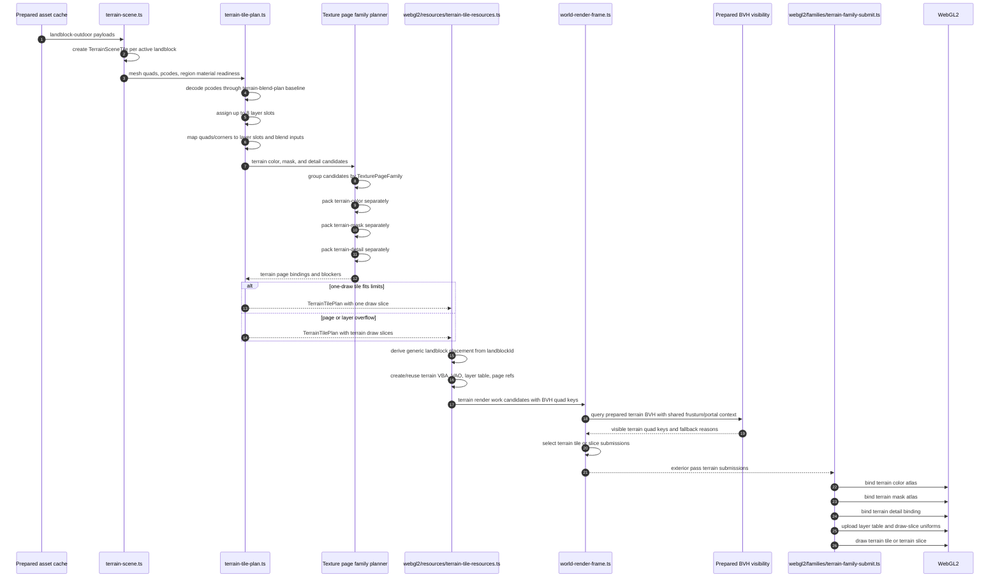

# Holtburger 3D Terrain Rendering Implementation Plan

Status: Phase T1 complete; Phase T2A is next.

Dry-run status: reviewed against the current `apps/holtburger-3d/src/lib/world-display` module graph.
The phase order below reflects that dry run.

Related plans:

- [Holtburger 3D Terrain Rendering Pipeline Scoping](./holtburger-3d-terrain-rendering-scoping.md)
- [Holtburger 3D Compacted Render Family Pipeline Replacement Plan](./holtburger-3d-compacted-render-family-pipeline-replacement-plan.md)
- [Holtburger 3D WebGL2 Material, Portal, and Atlas Continuation Plan](./holtburger-3d-webgl2-material-atlas-continuation-plan.md)

## Purpose

Replace the current terrain rendering path in `apps/holtburger-3d` with a landblock-scoped terrain
render family that renders one outdoor landblock terrain tile in one draw call when its texture page
and layer table limits fit.

This plan also removes redundant render-chunk state from landblock-owned scene models and deletes
legacy Three.js backend paths that are no longer part of the production renderer.

The target shape is:

- terrain remains landblock-scoped;
- terrain does not participate in the generic static staging, baking, or compaction pipeline;
- terrain does participate in shared renderer orchestration for visibility, passes, resource
  lifetime, diagnostics, metrics, and picking;
- terrain uses isolated terrain color, mask, and detail page families;
- terrain pcode-specific material draws are replaced with a terrain layer table and terrain-family
  shader inputs;
- draw-slice fallback is used when a terrain tile cannot fit the one-draw page or layer limits.

## Non-Goals

- Do not batch terrain vertex buffers across landblocks in the first implementation.
- Do not weaken terrain material behavior to gain batching.
- Do not move browser-mode renderer policy into shared Rust crates.
- Do not make terrain an independent renderer island outside normal pass sequencing and visibility.
- Do not delete old plan files.
- Do not expand the first terrain shader beyond the agreed layer/page limits before measuring a
  concrete overflow problem.

## Working Limits

- One terrain draw should cover one landblock terrain tile when possible.
- A terrain tile or terrain draw slice may use:
  - one terrain color page;
  - one terrain mask page;
  - one terrain detail binding;
  - up to 8 terrain layer entries.
- Terrain atlas page families are hard partitions:
  - terrain color pages contain only terrain base, overlay, and road color textures;
  - terrain mask pages contain only terrain alpha maps and road alpha masks;
  - terrain detail pages or bindings contain only terrain landscape detail textures.
- Terrain pages must not mix with static base-color, object/building detail, indexed, palette, or
  other non-terrain page families unless a later source-proven design explicitly changes that policy.
- Repeated terrain atlas sampling must use atlas-rect repeat sampling with explicit gradients for
  mipmapped color/detail inputs.

## Dry-Run Findings

The initial sequencing mostly holds, but the codebase suggests a tighter split:

- Terrain-only render-chunk cleanup is a good early phase. Broader static, structured-interior,
  portal, and debug-overlay `renderChunk` cleanup should be deferred until after terrain rendering is
  stable because it touches compaction, transition portals, render-spatial diagnostics, and several
  scene-readiness tests.
- `terrain-blend-materials.ts` is a legacy Three.js backend path. Current production terrain uses
  `terrain-blend-plan.ts`, staged terrain draw units, `Webgl2TerrainBlendResources`, and the WebGL2
  terrain program. The legacy module is only referenced by `terrain-blend-materials.test.ts`.
- Terrain is currently present in the direct render family as `family: "terrain-blend"`. Removing the
  generic draw-unit path means deleting terrain handling from `direct-render-family.ts`,
  `direct-family-adapters.ts`, `webgl2-world-submit.ts`, WebGL2 submit tests, and compaction planner
  blocker vocabulary.
- `buildStagedWorldFrame` already has a useful candidate abstraction with item keys, fallback
  reasons, category counts, and pass draws, but the `staged` name collides with staged draw-unit
  assembly. Rename it to `buildWorldRenderFrame` and generalize this module before introducing
  terrain family candidates.
- Texture page `usageBucket` already contains `"terrain"`, `"road"`, and `"alpha-control"`, but the
  atlas planner currently plans only shared RGBA base/detail pages from draw-unit candidates. Terrain
  isolation needs a real page-family dimension that partitions packing runs before layout, not just
  new usage labels.
- `terrain-blend-plan.ts` should remain the terrain behavior baseline, but the new path needs a
  terrain tile plan shape that maps quad pcodes to layer slots and page refs. Reusing the existing
  "one resolved blend plan per pcode" output directly would preserve the old draw-unit shape.
- The terrain shader source currently lives inline in `webgl2-world-display-renderer-impl.ts`. The
  terrain family rewrite should move terrain program/shader construction to a terrain-family module
  rather than growing that file further.

## Target Module Shape

Introduce terrain-specific modules instead of expanding the existing direct draw-unit files:

- `terrain-tile-plan.ts` for terrain tile layer planning, pcode-to-layer-slot mapping, page-family
  requirements, and draw-slice fallback planning.
- `webgl2/resources/terrain-tile-resources.ts` for terrain geometry buffers, VAOs, terrain page
  bindings, layer-table resources, graph leases, and lifecycle.
- `webgl2/families/terrain-family-submit.ts` for terrain family draw submission, sampler binding,
  layer-table uniform upload, and terrain-specific metrics.
- a generalized texture-page family planner that groups atlas candidates by `TexturePageFamily`
  before calling the low-level atlas layout planner.

Do not add terrain resource realization to `webgl2-world-resources.ts` as another large inline block
except as a short orchestration call. That file is already carrying direct draw-unit realization,
texture upload/cache, atlas sync, compaction sync, metrics, and graph sync.

## Target Terrain Pipeline Sequence

The final terrain path should look like this. The important boundary is that terrain becomes a
terrain tile resource before renderer resource sync and world render frame planning; it does not
become a staged generic draw unit.

Notes:

- `TexturePageFamily` controls atlas packing isolation. `usageBucket` remains sampling and diagnostic
  metadata.
- The single-draw happy path submits the whole landblock terrain tile when any terrain quad for that
  tile is visible.
- Draw-slice fallback still uses terrain quad keys for slice-specific visibility binding.
- Static, structured-interior, portal, and debug renderables keep using their non-terrain render work
  path and shared frame/pass orchestration.

## Recommended Execution Order

Execute the phases in this order:

1. T0: delete legacy Three.js terrain backend.
2. T1: remove terrain `renderChunk` storage through the placement helper.
3. T2A: rename staged frame planning to world render frame planning.
4. T3: introduce terrain tile resources and compatibility rendering.
5. T4: generalize frame/submit orchestration for terrain render work.
6. T5: add isolated terrain texture page families.
7. T6: add terrain tile layer table and geometry attributes.
8. T7: add explicit-gradient terrain atlas sampling.
9. T8: add terrain draw-slice fallback.
10. T9: delete temporary terrain compatibility paths and old pcode draw-unit paths.
11. T10: measure and decide follow-up complexity.
12. T11: run final cleanup and remove accumulated migration leftovers.
13. T2: clean up broader landblock-owned descendant `renderChunk` storage.

T11 is the living cleanup phase. As each implementation phase discovers temporary adapters, renamed
old concepts, stale tests, or dead diagnostics, add an explicit callout to T11 unless the same phase
can delete it immediately.

T11 should also audit for fake ceremony and hollow abstractions introduced while decomposing the old
pipeline. Helpers, wrapper modules, and type aliases should survive only when they enforce a real
boundary, hide real complexity, or match a stable local pattern. If a wrapper only restates a known
identity relationship, such as terrain placement being exactly landblock placement, delete it and use
the underlying primitive directly.

T2 is intentionally after the terrain-specific cleanup sweep. It is architecturally related, but it is
not required to prove the terrain batching path and it crosses more systems than terrain-only
placement.

## Phase T0: Legacy Backend Audit And Deletion

Status: Complete on 2026-06-02.

Goal: remove stale Three.js terrain/rendering backend code before adding the replacement terrain
family.

Primary targets:

- `apps/holtburger-3d/src/lib/world-display/terrain-blend-materials.ts`
- `apps/holtburger-3d/src/lib/world-display/terrain-blend-materials.test.ts`
- other Three.js-era backend files discovered by import graph audit
- behavior assertions that should move to `terrain-blend-plan.test.ts`

Tasks:

- Confirm no production imports of `terrain-blend-materials.ts` remain.
- Move still-useful pcode/material-plan assertions from `terrain-blend-materials.test.ts` to
  `terrain-blend-plan.test.ts`.
- Delete unused Three.js terrain material/backend files.
- Record any remaining Three.js imports as renderer-neutral DTO/math/model helpers, material helper
  debt, or unrelated test scaffolding. Do not treat every `three` import as a backend.

Acceptance criteria:

- No production terrain path depends on legacy Three.js material construction.
- Useful terrain pcode/material behavior coverage remains in active modules.
- The WebGL2 renderer is the only production terrain backend.

Progress:

- Deleted `apps/holtburger-3d/src/lib/world-display/terrain-blend-materials.ts`.
- Deleted `apps/holtburger-3d/src/lib/world-display/terrain-blend-materials.test.ts`.
- Confirmed `terrain-blend-materials.ts` had no production imports; its only code import was the
  deleted legacy test.
- Moved retained renderer-neutral coverage into `terrain-blend-plan.test.ts`:
  - pcode-to-plan indexing;
  - terrain alpha mask role/wrap handling;
  - alpha selector rotation output;
  - selected render-surface fallback from `PreparedSurfaceTexturePayload.renderSurfaceIds`;
  - all-road pcode resolution to road terrain without overlay masks.
- Ran full lint after the deletion. Knip identified
  `resolveRegionDetailOverlay` in `region-detail-overlays.ts` as a newly unused export, so the
  obsolete texture-producing overlay helper and its private texture upload helper were deleted.

Decisions:

- Dropped old assertions about Three.js `ShaderMaterial`, uniforms, and fragment shader strings
  instead of preserving them through a shim. Those assertions described the deleted backend, not the
  active WebGL2 path.
- Kept region-detail overlay planning and material-application helpers. Only the cache-backed helper
  that returned a fully resolved Three.js texture overlay was retired because its only consumer was
  the deleted legacy terrain backend.
- Did not classify remaining `three` imports as legacy terrain backend code. The surviving imports
  are renderer math, resource, material construction, or test helpers and should be evaluated in the
  phase that touches their owning module.

Validation:

- `npm run test:ts -- terrain-blend-plan`
- `npm run check`
- `npm run lint`

Cleanup impact:

- No compatibility shim was introduced.
- The anticipated T11 cleanup target for `terrain-blend-materials.ts` and
  `terrain-blend-materials.test.ts` is complete.
- The lint-discovered `resolveRegionDetailOverlay` dead export was deleted in T0; no T11 follow-up is
  needed for it.

## Phase T1: Renderer Placement Helper And Terrain `renderChunk` Removal

Status: Complete on 2026-06-02.

Goal: stop storing renderer chunk placement for terrain scene models.

Primary targets:

- `apps/holtburger-3d/src/lib/world-display/render-chunks.ts`
- `apps/holtburger-3d/src/lib/world-display/render-anchor.ts`
- `apps/holtburger-3d/src/lib/world-display/terrain-scene.ts`
- `apps/holtburger-3d/src/lib/world-display/staged-world-assembly.ts`
- `apps/holtburger-3d/src/lib/world-display/prepared-bvh-metrics.ts`
- `apps/holtburger-3d/src/lib/world-display/prepared-bvh-render-sources.ts`
- `apps/holtburger-3d/src/lib/world-display/browser-render-resource-coordinator.ts`

Tasks:

- Add a renderer-local placement helper that derives chunk placement from source identity.
- Make terrain placement derive from `landblockId` at renderer boundaries.
- Remove `renderChunk` from `TerrainSceneTile`.
- Update active chunk collection, staging, terrain BVH conversion, diagnostics, and resource sync to
  ask the placement helper for terrain placement.
- Add tests for terrain placement derivation and landblock normalization.

Acceptance criteria:

- Terrain source scene models no longer store `renderChunk`.
- Terrain still receives correct render-anchor-relative offsets.
- Terrain BVH diagnostics and visibility remain aligned with the landblock terrain mesh.

Progress:

- Removed `renderChunk` from `TerrainSceneTile`.
- Removed terrain chunk derivation from `terrain-scene.ts`; terrain source scene models now carry
  `landblockId` and renderer boundaries derive generic landblock placement.
- Replaced terrain `renderChunk` reads in:
  - `staged-world-assembly.ts`;
  - `prepared-bvh-metrics.ts`;
  - `prepared-bvh-render-sources.ts`;
  - `render-spatial-scene.ts`;
  - `browser-render-resource-coordinator.ts`.
- Replaced the terrain-named `deriveTerrainTileRenderChunk` helper with neutral
  `deriveLandblockRenderChunkPlacement` in `render-chunks.ts`.
- Updated terrain tile test fixtures so they no longer store chunk placement.

Decisions:

- Terrain placement is derived directly with `deriveLandblockRenderChunkPlacement(tile.landblockId)`
  at renderer boundaries. A terrain-specific placement wrapper would only restate that terrain is
  landblock-owned, so it was removed instead of kept as ceremony.
- `deriveLandblockRenderChunkPlacement` is intentionally neutral. Prepared outdoor static BVH
  conversion still needs landblock placement in this phase, but it should not call a terrain-named
  helper.
- No compatibility shim or re-export was kept for `deriveTerrainTileRenderChunk`; all callers were
  migrated.

Course corrections and refinements:

- Outdoor static prepared-BVH code was using the old terrain-named helper. T1 changed that use to
  neutral landblock placement, but did not remove stored `renderChunk` from static scene models. That
  remains Phase T2 work.
- Phase T2 should start with an inventory of remaining source-model `renderChunk` fields and classify
  each as landblock-derived, env-cell-derived, portal-derived, or genuinely renderer-owned.

Validation:

- `npm run test:ts -- render-chunks prepared-bvh-metrics non-instanced-bvh-bindings scene-renderable-readiness staged-world-assembly webgl2-world-resources`
- `npm run check`
- `npm run lint`

Cleanup impact:

- Deleted the terrain-specific render-chunk helper name by replacing it with
  `deriveLandblockRenderChunkPlacement`.
- Deleted the short-lived `terrain-placement.ts` and `terrain-placement.test.ts` wrapper because it
  added no behavior or meaningful ownership boundary.
- No legacy shim was introduced.
- No immediate interim phase is needed before Phase T2A.

## Phase T2: Landblock-Owned Descendant Placement Cleanup

Goal: apply the same placement rule to other landblock-owned assets and descendants.

Scheduling: defer this phase until after the terrain tile resource path is stable. It is related
cleanup, not a blocker for terrain batching.

Primary targets:

- `apps/holtburger-3d/src/lib/world-display/static-renderable-scene.ts`
- `apps/holtburger-3d/src/lib/world-display/structured-interior-scene.ts`
- portal/debug overlay scene modules
- `apps/holtburger-3d/src/lib/world-display/render-spatial-scene.ts`
- `apps/holtburger-3d/src/lib/world-display/transition-portal-work-items.ts`
- `apps/holtburger-3d/src/lib/world-display/browser-picker-diagnostics.ts`
- `apps/holtburger-3d/src/lib/world-display/static-renderable-readiness.ts`
- compacted geometry sync and diagnostics that consume chunk keys

Tasks:

- Inventory remaining stored `renderChunk` fields after Phase T1.
- Remove stored chunk placement from landblock-owned outdoor static records.
- Derive structured-cell placement from `envCellId` at renderer boundaries.
- Derive portal and debug overlay placement from source cell or aperture identity.
- Confirm compaction grouping still uses normalized landblock placement where needed without storing
  chunk placement in source models.
- Add placement helper tests for env-cell ids, owning landblock ids, and mixed static ownership.

Acceptance criteria:

- Landblock-owned scene records and their descendants do not store independent renderer-placement
  state.
- Renderer placement remains a boundary concern.
- Static, structured-interior, portal, debug, BVH, and compaction consumers still use consistent
  normalized landblock chunk policy.

## Phase T2A: World Render Frame Rename Prep

Goal: rename and generalize the per-frame render selection module before terrain starts using it as a
first-class terrain-family boundary.

This is a terminology and API cleanup phase. It should preserve behavior while making the next phases
read clearly: terrain exits staged draw-unit assembly, but still enters world render frame planning.

Primary targets:

- `apps/holtburger-3d/src/lib/world-display/staged-world-frame.ts`
- `apps/holtburger-3d/src/lib/world-display/staged-world-frame.test.ts`
- imports in `apps/holtburger-3d/src/lib/world-display/webgl2-world-display-renderer-impl.ts`
- imports in `apps/holtburger-3d/src/lib/world-display/webgl2-world-submit.ts`
- metrics/diagnostics that mention staged frame candidates or staged frame draws

Tasks:

- Rename `staged-world-frame.ts` to `world-render-frame.ts`.
- Rename the public API:
  - `buildStagedWorldFrame` to `buildWorldRenderFrame`;
  - `StagedWorldFrame` to `WorldRenderFrame`;
  - `StagedWorldFrameCandidate` to `WorldRenderCandidate`;
  - `StagedWorldDraw` to `WorldRenderDraw`;
  - `StagedWorldPass` to `WorldRenderPass`;
  - `StagedWorldFrameMetrics` to `WorldRenderFrameMetrics`.
- Rename category and metric vocabulary away from "staged draw unit" where it describes generic
  frame candidates.
- Keep draw-unit-specific fields named as draw units while only non-terrain render work uses them.
- Update tests without changing behavior.

Acceptance criteria:

- The frame-planning module name no longer implies terrain participates in staged draw-unit assembly.
- Existing static, structured-interior, portal-mask, debug, and terrain compatibility frame selection
  behavior is unchanged.
- The next phases can add terrain tile candidates without extending staged draw-unit vocabulary.

## Phase T3: Terrain Tile Resource Boundary

Goal: introduce the terrain render resource shape before changing shader/material behavior.

Primary targets:

- `apps/holtburger-3d/src/lib/world-display/terrain-scene.ts`
- `apps/holtburger-3d/src/lib/world-display/staged-world-assembly.ts`
- `apps/holtburger-3d/src/lib/world-display/webgl2-world-resources.ts`
- `apps/holtburger-3d/src/lib/world-display/webgl2-world-submit.ts`
- `apps/holtburger-3d/src/lib/world-display/webgl2-world-display-renderer-impl.ts`
- `apps/holtburger-3d/src/lib/world-display/world-render-frame.ts`
- `apps/holtburger-3d/src/lib/world-display/non-instanced-bvh-bindings.ts`
- WebGL2 resource modules under `apps/holtburger-3d/src/lib/world-display/webgl2/resources/`

Tasks:

- Define a terrain tile render resource with:
  - landblock id;
  - terrain geometry;
  - terrain readiness/provenance;
  - terrain BVH quad keys;
  - terrain placement identity;
  - current fallback material data as a temporary compatibility payload.
- Define a terrain render work candidate shape separate from draw-unit candidates.
- Add a terrain-family resource store beside non-terrain draw-unit resources.
- Move terrain resource realization out of generic staged draw-unit realization, but keep the first
  resource using the current terrain blend compatibility material if needed.
- Keep existing visual behavior through a temporary compatibility submit path if needed.
- Make diagnostics and resource graph reporting aware of terrain tile resources.

Acceptance criteria:

- Terrain no longer has to become a generic `Webgl2WorldDrawUnit` to participate in resource
  lifetime, visibility, or submit scheduling.
- Existing terrain rendering behavior is preserved before the atlas/layer-table rewrite.
- The temporary compatibility path is clearly named and has a deletion target in a later phase.

## Phase T4: Render-Family Frame And Submit Orchestration

Goal: loosen frame planning and submit scheduling from one universal draw-unit list.

Primary targets:

- `apps/holtburger-3d/src/lib/world-display/webgl2-world-resources.ts`
- `apps/holtburger-3d/src/lib/world-display/webgl2-world-submit.ts`
- `apps/holtburger-3d/src/lib/world-display/world-render-frame.ts`
- `apps/holtburger-3d/src/lib/world-display/prepared-bvh-visibility.ts`
- `apps/holtburger-3d/src/lib/world-display/non-instanced-bvh-bindings.ts`
- `apps/holtburger-3d/src/lib/world-display/browser-render-resource-coordinator.ts`

Tasks:

- Extend world render frame candidate vocabulary so the frame planner accepts render work candidates,
  not only draw-unit candidates.
- Split world resource store contents into:
  - non-terrain draw units;
  - terrain tile resources.
- Update frame planning to consume:
  - non-terrain draw-unit candidates;
  - terrain tile candidates;
  - combined pass inputs.
- Keep the existing candidate selection semantics: item-key match, explicit fallback, query fallback,
  stable category sorting, and per-category metrics.
- Keep terrain in exterior pass sequencing and portal/frustum visibility orchestration.
- Use quad-granular terrain BVH queries, but submit the whole terrain tile when any quad is visible
  in the single-draw path.
- Add terrain-specific metrics for visible terrain tiles, visible terrain quads, submitted terrain
  tiles, and terrain fallback slices.

Acceptance criteria:

- Terrain participates in shared culling, pass sequencing, resource lifetime, and diagnostics without
  pretending to be a static-like draw unit.
- Single-draw terrain visibility is conservative at the landblock tile level.
- Existing non-terrain draw-unit and compacted family behavior is unchanged.

## Phase T5: Isolated Terrain Texture Page Families

Goal: add terrain-only atlas/page planning for color, mask, and detail inputs.

Primary targets:

- `apps/holtburger-3d/src/lib/world-display/texture-pages/`
- `apps/holtburger-3d/src/lib/world-display/terrain-blend-plan.ts`
- `apps/holtburger-3d/src/lib/world-display/terrain-tile-plan.ts` or equivalent new module
- WebGL2 texture/page resource modules
- terrain resource realization modules added in Phase T3

Tasks:

- Extend texture-page planning so terrain color, terrain mask, and terrain detail are hard page
  families, not just diagnostic usage labels.
- Add an explicit `TexturePageFamily` field to texture-page atlas candidates and planner outputs.
- Group candidates by `TexturePageFamily` before calling `planAtlasLayout`, so entries from different
  families can never share an atlas texture page.
- Prefer this shared family-aware planner over separate one-off terrain atlas planners. Separate
  terrain-only planners are acceptable only as short-lived migration scaffolding, with an explicit
  T11 deletion target, if the shared planner refactor proves too invasive for the phase. They are not
  an accepted retained architecture.
- Initial page families should include at least:
  - `static-rgba`;
  - `static-detail`;
  - `terrain-color`;
  - `terrain-mask`;
  - `terrain-detail`.
- Build terrain color page candidates from terrain base, overlay, and road color refs.
- Build terrain mask page candidates from terrain alpha and road alpha mask refs.
- Build terrain detail page or direct single-entry bindings from landscape detail refs.
- Preserve existing non-terrain base/detail atlas planning unchanged.
- Ensure terrain page resources use the correct color/data, filtering, mipmap, and gutter policy.
- Add tests proving terrain page candidates do not share pages with static/object/indexed/palette
  candidates.

Acceptance criteria:

- Terrain texture pages are isolated from non-terrain page families.
- Terrain tile resources can resolve color, mask, and detail page bindings.
- Missing terrain page resources produce explicit blockers rather than silent fallback.

## Phase T6: Terrain Layer Table And Geometry Attributes

Goal: replace pcode-split terrain draw units with one terrain layer table per terrain tile or slice.

Primary targets:

- `apps/holtburger-3d/src/lib/world-display/terrain-blend-plan.ts`
- `apps/holtburger-3d/src/lib/world-display/terrain-tile-plan.ts` or equivalent new module
- `apps/holtburger-3d/src/lib/world-display/staged-world-geometry.ts`
- terrain WebGL2 resource/shader modules
- terrain shaders under the WebGL2 renderer

Tasks:

- Keep `terrain-blend-plan.ts` as the behavior decoder for pcode road/overlay/base semantics.
- Add a tile-level terrain plan that consumes all quad pcodes for a landblock and produces:
  - unique layer entries up to the 8-entry limit;
  - pcode-to-layer-slot mapping;
  - per-quad or per-corner layer slot attributes;
  - required terrain color/mask/detail page refs;
  - overflow/slice requirements.
- Define the terrain layer table entry format for pcode-derived base, overlay, road, mask, rotation,
  tiling, and detail data.
- Limit the first implementation to 8 layer entries per tile or slice.
- Add terrain vertex or per-corner attributes that select layer entries and blend inputs without
  duplicating geometry per pcode. Because pcode and quad-local UVs are quad-local, expect the terrain
  VBA to duplicate vertices per triangle or per quad in the final terrain-family geometry; the win is
  removing duplication once per pcode draw, not guaranteeing shared grid vertices.
- Preserve current WebGL2 pcode decoding, road/overlay behavior, detail behavior, and terrain texture
  sampling unless a specific defect is proven.
- Remove the happy-path pcode geometry filter from terrain rendering.

Acceptance criteria:

- A compatible landblock terrain tile renders through one terrain draw.
- Geometry duplication caused by one draw per pcode is removed from the happy path.
- Terrain visual behavior matches the current WebGL2 baseline within expected atlas sampling
  differences.

## Phase T7: Terrain Atlas Sampling Shader

Goal: make terrain atlas sampling correct for repeated mipmapped inputs.

Primary targets:

- terrain WebGL2 shader/program source, moved out of
  `webgl2-world-display-renderer-impl.ts` if practical
- `apps/holtburger-3d/src/lib/world-display/webgl2/families/terrain-family-submit.ts`
- texture-page atlas helper modules

Tasks:

- Implement atlas-rect repeat sampling for terrain color entries.
- Use explicit gradients derived from unwrapped local UVs before `fract`-style wrapping.
- Apply the same policy to terrain detail if detail is atlas-backed and repeated.
- Preserve control/data semantics for terrain masks.
- Verify gutter/padding behavior with generated mipmaps.

Acceptance criteria:

- Repeated terrain textures sample inside their atlas rects.
- Mipmap derivatives do not break at wrap boundaries.
- Terrain color/detail inputs remain filtered and mipmapped.
- Terrain masks keep their selected data/control sampling policy.

## Phase T8: Terrain Draw-Slice Fallback

Goal: support terrain tiles that exceed one-draw terrain limits.

Primary targets:

- terrain resource planning modules
- terrain BVH binding modules
- WebGL2 terrain family submit path
- terrain metrics and diagnostics

Tasks:

- Detect overflow when a terrain tile needs more than one color page, one mask page, one detail
  binding, or 8 layer entries.
- Partition overflow tiles into terrain draw slices grouped by compatible color page, mask page,
  detail binding, and layer table entries.
- Start with one color page and one mask page per slice.
- Bind each terrain slice only to the terrain quad keys represented by that slice.
- Report slice fallback reasons in diagnostics.
- Keep single-draw landblock terrain as the preferred path. Do not add multi-page terrain slices in
  this phase.

Acceptance criteria:

- Overflowing terrain tiles remain renderable without expanding the first shader design.
- Slice fallback uses quad-granular visibility for represented quads.
- Diagnostics clearly explain whether slicing was caused by page overflow, detail incompatibility,
  or layer table overflow.

## Phase T9: Remove Temporary Terrain Compatibility Paths

Goal: delete old pcode-sliced terrain draw-unit behavior and any temporary adapters introduced during
the migration.

Primary targets:

- `apps/holtburger-3d/src/lib/world-display/staged-world-assembly.ts`
- `apps/holtburger-3d/src/lib/world-display/staged-world-geometry.ts`
- `apps/holtburger-3d/src/lib/world-display/webgl2-world-resources.ts`
- `apps/holtburger-3d/src/lib/world-display/webgl2/families/direct-family-adapters.ts`
- `apps/holtburger-3d/src/lib/world-display/webgl2/families/direct-render-family.ts`
- `apps/holtburger-3d/src/lib/world-display/webgl2-world-submit.ts`
- `apps/holtburger-3d/src/lib/world-display/compaction/compaction-family-planner.ts`
- `apps/holtburger-3d/src/lib/world-display/staged-world-materials.ts`
- `apps/holtburger-3d/src/lib/world-display/texture-pages/texture-page-binding.ts`
- terrain compatibility resource or submit modules added in earlier phases

Tasks:

- Delete terrain participation in `StagedWorldDrawUnitAssembly`.
- Delete pcode-sliced terrain geometry generation where it is no longer used.
- Delete terrain direct retained draw-unit adapters.
- Delete `DirectTerrainBlendPayload`, `programKind: "terrain"` direct routes, ten-sampler terrain
  bindings in the direct family, and direct terrain submit tests.
- Remove `terrain-blend` from generic staged material plans if the terrain family no longer consumes
  it.
- Remove compaction planner terrain blockers such as `missing-compacted-terrain-family` once terrain
  no longer enters compaction candidates.
- Remove terrain blend entries from direct draw texture-page binding collection once terrain page
  bindings are owned by terrain resources.
- Remove temporary terrain compatibility payloads from terrain tile resources.
- Consolidate terrain diagnostics around terrain tile resources and terrain slices.

Acceptance criteria:

- Terrain rendering is owned by the terrain family path.
- No production terrain code emits one generic draw unit per pcode.
- No compatibility shim remains without an explicit follow-up plan.

## Phase T10: Measurement And Follow-Up Decisions

Goal: measure whether the first implementation solved the intended cost shape and decide whether any
additional terrain specialization is justified.

Tasks:

- Record representative outdoor scene metrics:
  - terrain tile count;
  - visible terrain quad count;
  - submitted terrain tile count;
  - terrain draw-call count;
  - terrain draw-slice fallback count and reason;
  - terrain color/mask/detail page count;
  - terrain texture binding count;
  - terrain layer count distribution.
- Compare draw calls and texture-binding churn against the old pcode-sliced path.
- Identify whether landblock-level conservative terrain submit creates measurable overdraw problems.
- Decide whether to keep the first design, add multi-page terrain slices, increase layer table
  limits, or investigate terrain patch-level rendering.

Acceptance criteria:

- Terrain draw-call count no longer scales with unique pcode count in the happy path.
- Texture binding churn is materially lower for outdoor terrain scenes.
- Any remaining fallback or overdraw problem is backed by metrics before new complexity is added.

## Phase T11: Final Cleanup Sweep

Goal: coalesce and complete cleanup discovered during the terrain rewrite so the final renderer shape
does not retain migration vocabulary, stale tests, or compatibility leftovers.

This phase is intentionally maintained throughout execution. Add explicit cleanup callouts here when a
phase creates a temporary adapter, postpones a deletion to keep a smaller diff, or discovers stale
terrain/direct-draw terminology that is not safe to delete immediately.

Primary targets:

- old terrain staged draw-unit concepts;
- old direct terrain blend resources and submit routes;
- stale terrain compatibility tests;
- obsolete diagnostics and metric fields;
- temporary terrain resource adapters added by this plan;
- duplicate terrain planning helpers replaced by tile-level planning;
- broad naming cleanup after terrain is no longer a generic draw-unit material.

Tasks:

- Review all cleanup callouts accumulated during T0 through T10.
- Delete old terrain-specific compatibility paths that remain after T9.
- Rename surviving terrain modules, types, metrics, diagnostics, and tests away from old
  `terrain-blend` or pcode-draw-unit vocabulary where that vocabulary no longer describes the
  production path.
- Remove stale fallback/blocker strings that only existed to explain terrain participation in static
  compaction or direct draw-unit routing.
- Collapse duplicate tests onto terrain tile planning, terrain page-family planning, terrain resource
  lifecycle, and terrain submit behavior.
- Re-run the final validation suite selected during implementation and update this plan with any
  remaining accepted follow-up debt.

Acceptance criteria:

- No planned temporary terrain adapter remains without a named follow-up.
- Terrain code, tests, metrics, and diagnostics use terrain-family/tile/slice vocabulary instead of
  old staged pcode draw-unit vocabulary.
- Dead terrain compatibility code is deleted rather than left behind as an alternate path.
- Any remaining cleanup debt is explicitly documented with owner module and reason.

Initial anticipated cleanup targets:

Delete or rewrite these terrain-specific old-path concepts by the end of Phase T11:

- `StagedTerrainDrawUnitAssembly`.
- `buildStagedTerrainDrawUnitAssemblies`.
- `createTerrainBlendStagedMaterial`.
- `collectTerrainBlendPlanPreparedAssetIds` in staged draw-unit assembly, unless reused by the new
  tile plan under a terrain-specific name.
- `buildStagedTerrainGeometry(mesh, { pcode })` pcode filtering. A non-pcode terrain geometry helper
  may remain if renamed/moved for terrain-family use.
- `Webgl2WorldDrawUnit.terrainBlend`.
- `Webgl2TerrainBlendResources` as a direct draw-unit resource type. If the new terrain family keeps
  a similar payload temporarily, it should be renamed to terrain-family vocabulary.
- direct-family terrain routes and sampler units in `direct-render-family.ts` and
  `direct-family-adapters.ts`.
- terrain blend binding collection in `texture-page-binding.ts`.
- compaction-family terrain blockers that only exist because terrain currently enters generic draw
  units.
- WebGL2 submit tests that assert direct terrain-blend routing.
- Any temporary wrapper, helper, type alias, or module that exists only as migration ceremony. T1
  deleted the short-lived `terrain-placement.ts` wrapper for this reason; future phases should apply
  the same standard to terrain tile resources, atlas family plumbing, and submit adapters.

Keep or migrate these concepts:

- `terrain-blend-plan.ts` pcode decoding and texture-ref resolution, unless superseded by an
  equivalent terrain tile planner with matching tests.
- `terrain-materials.ts` readiness diagnostics, expanded if needed to report atlas/page/layer
  blockers.
- quad-granular terrain BVH item keys and terrain tile batch ids, extended for slice ids.
- current WebGL2 terrain shader behavior as the visual baseline.

## Resolved Open Questions

- Legacy Three.js backend target: `terrain-blend-materials.ts` is legacy backend code. The test file
  should be migrated or deleted with it. Other `three` imports in world-display are not automatically
  legacy backends; many are math/resource/test helpers.
- Terrain atlas isolation: current `usageBucket` values are not enough. The planner should enforce a
  `TexturePageFamily` partition before atlas layout.
- Frame orchestration blocker: the current candidate abstraction is usable after a vocabulary/type
  generalization. We do not need to replace the whole frame planner before terrain resources.
- Broad render-chunk cleanup: do not schedule it before terrain resource work. It is valuable cleanup
  but crosses more systems than terrain-only placement.

## Validation Strategy

Each implementation phase should include targeted automated validation where practical:

- TypeScript typecheck for `apps/holtburger-3d`.
- Existing WebGL2/world-display unit tests affected by the changed modules.
- New placement-helper tests for normalized landblock and env-cell derivation.
- New texture-page planner tests for terrain page-family isolation.
- New terrain layer-table tests for pcode grouping, overflow detection, and slice grouping.
- Visual/manual browser validation for terrain parity after shader changes.

The expected validation command should be written into each completed phase update when the exact
changed modules are known.

## Implementation Notes

- The current WebGL2 terrain implementation is the behavior baseline. Use ACE/ACViewer or the retail
  decompile only when a specific terrain behavior question is not already proven by the active WebGL2
  path or known data.
- Prefer deleting the old path as each replacement lands. Avoid durable compatibility layers.
- Keep terrain-specific semantics inside the terrain family. Share renderer infrastructure only where
  it preserves the domain model: visibility, pass sequencing, resource lifetime, texture upload/cache,
  atlas primitives, diagnostics, metrics, and picking.
- Treat `TexturePageBinding.usageBucket` as sampling/diagnostic metadata, not the atlas isolation
  mechanism. `TexturePageFamily` should control packing isolation.
- Do not treat terrain as a static material family. Terrain uses a terrain layer table and terrain
  shader behavior, not static-style material slots.
