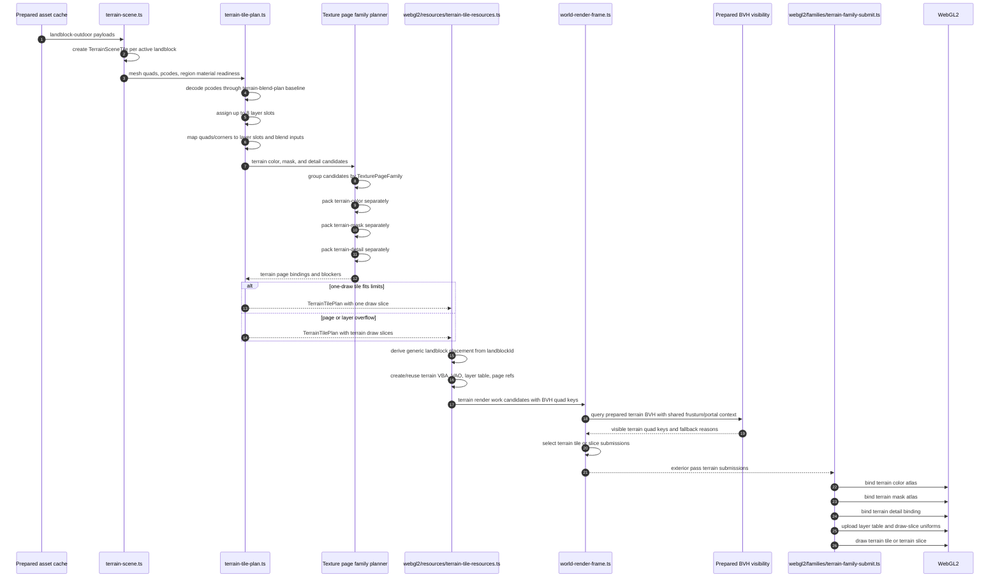

# Holtburger 3D Terrain Rendering Implementation Plan

Status: Phase T8B complete; Phase T9 compatibility path removal is next.

Dry-run status: reviewed against the current `apps/holtburger-3d/src/lib/world-display` module graph.
The phase order below reflects that dry run.

Related plans:

- [Holtburger 3D Terrain Rendering Pipeline Scoping](./holtburger-3d-terrain-rendering-scoping.md)
- [Holtburger 3D Compacted Render Family Pipeline Replacement Plan](./holtburger-3d-compacted-render-family-pipeline-replacement-plan.md)
- [Holtburger 3D WebGL2 Material, Portal, and Atlas Continuation Plan](./holtburger-3d-webgl2-material-atlas-continuation-plan.md)

## Purpose

Replace the current terrain rendering path in `apps/holtburger-3d` with a landblock-scoped terrain
render family that renders one outdoor landblock terrain tile in one draw call when its texture page
and layer table limits fit.

This plan also removes redundant render-chunk state from landblock-owned scene models and deletes
legacy Three.js backend paths that are no longer part of the production renderer.

The target shape is:

- terrain remains landblock-scoped;
- terrain does not participate in the generic static staging, baking, or compaction pipeline;
- terrain does participate in shared renderer orchestration for visibility, passes, resource
  lifetime, diagnostics, metrics, and picking;
- terrain uses isolated terrain color, mask, and detail page families;
- terrain pcode-specific material draws are replaced with a terrain layer table and terrain-family
  shader inputs;
- draw-slice fallback is used when a terrain tile cannot fit the one-draw page or layer limits.

## Non-Goals

- Do not batch terrain vertex buffers across landblocks in the first implementation.
- Do not weaken terrain material behavior to gain batching.
- Do not move browser-mode renderer policy into shared Rust crates.
- Do not make terrain an independent renderer island outside normal pass sequencing and visibility.
- Do not delete old plan files.
- Do not expand the first terrain shader beyond the agreed layer/page limits before measuring a
  concrete overflow problem.

## Working Limits

- One terrain draw should cover one landblock terrain tile when possible.
- A terrain tile or terrain draw slice may use:
  - one terrain color page;
  - one terrain mask page;
  - one terrain detail binding;
  - up to 8 terrain layer entries.
- Terrain atlas page families are hard partitions:
  - terrain color pages contain only terrain base, overlay, and road color textures;
  - terrain mask pages contain only terrain alpha maps and road alpha masks;
  - terrain detail pages or bindings contain only terrain landscape detail textures.
- Terrain pages must not mix with static base-color, object/building detail, indexed, palette, or
  other non-terrain page families unless a later source-proven design explicitly changes that policy.
- Repeated terrain atlas sampling must use atlas-rect repeat sampling with explicit gradients for
  mipmapped color/detail inputs.

## Dry-Run Findings

The initial sequencing mostly holds, but the codebase suggests a tighter split:

- Terrain-only render-chunk cleanup is a good early phase. Broader static, structured-interior,
  portal, and debug-overlay `renderChunk` cleanup should be deferred until after terrain rendering is
  stable because it touches compaction, transition portals, render-spatial diagnostics, and several
  scene-readiness tests.
- `terrain-blend-materials.ts` is a legacy Three.js backend path. Current production terrain uses
  `terrain-blend-plan.ts`, staged terrain draw units, `Webgl2TerrainBlendResources`, and the WebGL2
  terrain program. The legacy module is only referenced by `terrain-blend-materials.test.ts`.
- Terrain is currently present in the direct render family as `family: "terrain-blend"`. Removing the
  generic draw-unit path means deleting terrain handling from `direct-render-family.ts`,
  `direct-family-adapters.ts`, `webgl2-world-submit.ts`, WebGL2 submit tests, and compaction planner
  blocker vocabulary.
- `buildStagedWorldFrame` already has a useful candidate abstraction with item keys, fallback
  reasons, category counts, and pass draws, but the `staged` name collides with staged draw-unit
  assembly. Rename it to `buildWorldRenderFrame` and generalize this module before introducing
  terrain family candidates.
- Texture page `usageBucket` already contains `"terrain"`, `"road"`, and `"alpha-control"`, but the
  atlas planner currently plans only shared RGBA base/detail pages from draw-unit candidates. Terrain
  isolation needs a real page-family dimension that partitions packing runs before layout, not just
  new usage labels.
- `terrain-blend-plan.ts` should remain the terrain behavior baseline, but the new path needs a
  terrain tile plan shape that maps quad pcodes to layer slots and page refs. Reusing the existing
  "one resolved blend plan per pcode" output directly would preserve the old draw-unit shape.
- The terrain shader source currently lives inline in `webgl2-world-display-renderer-impl.ts`. The
  terrain family rewrite should move terrain program/shader construction to a terrain-family module
  rather than growing that file further.

## Target Module Shape

Introduce terrain-specific modules instead of expanding the existing direct draw-unit files:

- `terrain-tile-plan.ts` for terrain tile layer planning, pcode-to-layer-slot mapping, page-family
  requirements, and draw-slice fallback planning.
- `webgl2/resources/terrain-tile-resources.ts` for terrain geometry buffers, VAOs, terrain page
  bindings, layer-table resources, graph leases, and lifecycle.
- `webgl2/families/terrain-family-submit.ts` for terrain family draw submission, sampler binding,
  layer-table uniform upload, and terrain-specific metrics.
- a generalized texture-page family planner that groups atlas candidates by `TexturePageFamily`
  before calling the low-level atlas layout planner.

Do not add terrain resource realization to `webgl2-world-resources.ts` as another large inline block
except as a short orchestration call. That file is already carrying direct draw-unit realization,
texture upload/cache, atlas sync, compaction sync, metrics, and graph sync.

## Target Terrain Pipeline Sequence

The final terrain path should look like this. The important boundary is that terrain becomes a
terrain tile resource before renderer resource sync and world render frame planning; it does not
become a staged generic draw unit.

Notes:

- `TexturePageFamily` controls atlas packing isolation. `usageBucket` remains sampling and diagnostic
  metadata.
- The single-draw happy path submits the whole landblock terrain tile when any terrain quad for that
  tile is visible.
- Draw-slice fallback still uses terrain quad keys for slice-specific visibility binding.
- Static, structured-interior, portal, and debug renderables keep using their non-terrain render work
  path and shared frame/pass orchestration.

## Recommended Execution Order

Execute the phases in this order:

1. T0: delete legacy Three.js terrain backend.
2. T1: remove terrain `renderChunk` storage through the placement helper.
3. T2A: rename staged frame planning to world render frame planning.
4. T3: introduce terrain tile resources and compatibility rendering.
5. T4: generalize frame/submit orchestration for terrain render work.
6. T5: add isolated terrain texture page families.
7. T6A: add terrain tile layer table and geometry attributes.
8. T6B0: add explicit terrain one-draw readiness and blocker routing.
9. T6B: consume terrain layer/page resources from terrain-family submit.
10. T7: add explicit-gradient terrain atlas sampling.
11. T8A: add terrain layer-overflow draw-slice fallback.
12. T8B: add terrain page-overflow draw-slice fallback.
13. T9: delete temporary terrain compatibility paths and old pcode draw-unit paths.
14. T10: measure and decide follow-up complexity.
15. T11: run final cleanup and remove accumulated migration leftovers.
16. T2: clean up broader landblock-owned descendant `renderChunk` storage.

T11 is the living cleanup phase. As each implementation phase discovers temporary adapters, renamed
old concepts, stale tests, or dead diagnostics, add an explicit callout to T11 unless the same phase
can delete it immediately.

T11 should also audit for fake ceremony and hollow abstractions introduced while decomposing the old
pipeline. Helpers, wrapper modules, and type aliases should survive only when they enforce a real
boundary, hide real complexity, or match a stable local pattern. If a wrapper only restates a known
identity relationship, such as terrain placement being exactly landblock placement, delete it and use
the underlying primitive directly.

T2 is intentionally after the terrain-specific cleanup sweep. It is architecturally related, but it is
not required to prove the terrain batching path and it crosses more systems than terrain-only
placement.

## Phase T0: Legacy Backend Audit And Deletion

Status: Complete on 2026-06-02.

Goal: remove stale Three.js terrain/rendering backend code before adding the replacement terrain
family.

Primary targets:

- `apps/holtburger-3d/src/lib/world-display/terrain-blend-materials.ts`
- `apps/holtburger-3d/src/lib/world-display/terrain-blend-materials.test.ts`
- other Three.js-era backend files discovered by import graph audit
- behavior assertions that should move to `terrain-blend-plan.test.ts`

Tasks:

- Confirm no production imports of `terrain-blend-materials.ts` remain.
- Move still-useful pcode/material-plan assertions from `terrain-blend-materials.test.ts` to
  `terrain-blend-plan.test.ts`.
- Delete unused Three.js terrain material/backend files.
- Record any remaining Three.js imports as renderer-neutral DTO/math/model helpers, material helper
  debt, or unrelated test scaffolding. Do not treat every `three` import as a backend.

Acceptance criteria:

- No production terrain path depends on legacy Three.js material construction.
- Useful terrain pcode/material behavior coverage remains in active modules.
- The WebGL2 renderer is the only production terrain backend.

Progress:

- Deleted `apps/holtburger-3d/src/lib/world-display/terrain-blend-materials.ts`.
- Deleted `apps/holtburger-3d/src/lib/world-display/terrain-blend-materials.test.ts`.
- Confirmed `terrain-blend-materials.ts` had no production imports; its only code import was the
  deleted legacy test.
- Moved retained renderer-neutral coverage into `terrain-blend-plan.test.ts`:
  - pcode-to-plan indexing;
  - terrain alpha mask role/wrap handling;
  - alpha selector rotation output;
  - selected render-surface fallback from `PreparedSurfaceTexturePayload.renderSurfaceIds`;
  - all-road pcode resolution to road terrain without overlay masks.
- Ran full lint after the deletion. Knip identified
  `resolveRegionDetailOverlay` in `region-detail-overlays.ts` as a newly unused export, so the
  obsolete texture-producing overlay helper and its private texture upload helper were deleted.

Decisions:

- Dropped old assertions about Three.js `ShaderMaterial`, uniforms, and fragment shader strings
  instead of preserving them through a shim. Those assertions described the deleted backend, not the
  active WebGL2 path.
- Kept region-detail overlay planning and material-application helpers. Only the cache-backed helper
  that returned a fully resolved Three.js texture overlay was retired because its only consumer was
  the deleted legacy terrain backend.
- Did not classify remaining `three` imports as legacy terrain backend code. The surviving imports
  are renderer math, resource, material construction, or test helpers and should be evaluated in the
  phase that touches their owning module.

Validation:

- `npm run test:ts -- terrain-blend-plan`
- `npm run check`
- `npm run lint`

Cleanup impact:

- No compatibility shim was introduced.
- The anticipated T11 cleanup target for `terrain-blend-materials.ts` and
  `terrain-blend-materials.test.ts` is complete.
- The lint-discovered `resolveRegionDetailOverlay` dead export was deleted in T0; no T11 follow-up is
  needed for it.

## Phase T1: Renderer Placement Helper And Terrain `renderChunk` Removal

Status: Complete on 2026-06-02.

Goal: stop storing renderer chunk placement for terrain scene models.

Primary targets:

- `apps/holtburger-3d/src/lib/world-display/render-chunks.ts`
- `apps/holtburger-3d/src/lib/world-display/render-anchor.ts`
- `apps/holtburger-3d/src/lib/world-display/terrain-scene.ts`
- `apps/holtburger-3d/src/lib/world-display/staged-world-assembly.ts`
- `apps/holtburger-3d/src/lib/world-display/prepared-bvh-metrics.ts`
- `apps/holtburger-3d/src/lib/world-display/prepared-bvh-render-sources.ts`
- `apps/holtburger-3d/src/lib/world-display/browser-render-resource-coordinator.ts`

Tasks:

- Add a renderer-local placement helper that derives chunk placement from source identity.
- Make terrain placement derive from `landblockId` at renderer boundaries.
- Remove `renderChunk` from `TerrainSceneTile`.
- Update active chunk collection, staging, terrain BVH conversion, diagnostics, and resource sync to
  ask the placement helper for terrain placement.
- Add tests for terrain placement derivation and landblock normalization.

Acceptance criteria:

- Terrain source scene models no longer store `renderChunk`.
- Terrain still receives correct render-anchor-relative offsets.
- Terrain BVH diagnostics and visibility remain aligned with the landblock terrain mesh.

Progress:

- Removed `renderChunk` from `TerrainSceneTile`.
- Removed terrain chunk derivation from `terrain-scene.ts`; terrain source scene models now carry
  `landblockId` and renderer boundaries derive generic landblock placement.
- Replaced terrain `renderChunk` reads in:
  - `staged-world-assembly.ts`;
  - `prepared-bvh-metrics.ts`;
  - `prepared-bvh-render-sources.ts`;
  - `render-spatial-scene.ts`;
  - `browser-render-resource-coordinator.ts`.
- Replaced the terrain-named `deriveTerrainTileRenderChunk` helper with neutral
  `deriveLandblockRenderChunkPlacement` in `render-chunks.ts`.
- Updated terrain tile test fixtures so they no longer store chunk placement.

Decisions:

- Terrain placement is derived directly with `deriveLandblockRenderChunkPlacement(tile.landblockId)`
  at renderer boundaries. A terrain-specific placement wrapper would only restate that terrain is
  landblock-owned, so it was removed instead of kept as ceremony.
- `deriveLandblockRenderChunkPlacement` is intentionally neutral. Prepared outdoor static BVH
  conversion still needs landblock placement in this phase, but it should not call a terrain-named
  helper.
- No compatibility shim or re-export was kept for `deriveTerrainTileRenderChunk`; all callers were
  migrated.

Course corrections and refinements:

- Outdoor static prepared-BVH code was using the old terrain-named helper. T1 changed that use to
  neutral landblock placement, but did not remove stored `renderChunk` from static scene models. That
  remains Phase T2 work.
- Phase T2 should start with an inventory of remaining source-model `renderChunk` fields and classify
  each as landblock-derived, env-cell-derived, portal-derived, or genuinely renderer-owned.

Validation:

- `npm run test:ts -- render-chunks prepared-bvh-metrics non-instanced-bvh-bindings scene-renderable-readiness staged-world-assembly webgl2-world-resources`
- `npm run check`
- `npm run lint`

Cleanup impact:

- Deleted the terrain-specific render-chunk helper name by replacing it with
  `deriveLandblockRenderChunkPlacement`.
- Deleted the short-lived `terrain-placement.ts` and `terrain-placement.test.ts` wrapper because it
  added no behavior or meaningful ownership boundary.
- No legacy shim was introduced.
- No immediate interim phase is needed before Phase T2A.

## Phase T2: Landblock-Owned Descendant Placement Cleanup

Goal: apply the same placement rule to other landblock-owned assets and descendants.

Scheduling: defer this phase until after the terrain tile resource path is stable. It is related
cleanup, not a blocker for terrain batching.

Primary targets:

- `apps/holtburger-3d/src/lib/world-display/static-renderable-scene.ts`
- `apps/holtburger-3d/src/lib/world-display/structured-interior-scene.ts`
- portal/debug overlay scene modules
- `apps/holtburger-3d/src/lib/world-display/render-spatial-scene.ts`
- `apps/holtburger-3d/src/lib/world-display/transition-portal-work-items.ts`
- `apps/holtburger-3d/src/lib/world-display/browser-picker-diagnostics.ts`
- `apps/holtburger-3d/src/lib/world-display/static-renderable-readiness.ts`
- compacted geometry sync and diagnostics that consume chunk keys

Tasks:

- Inventory remaining stored `renderChunk` fields after Phase T1.
- Remove stored chunk placement from landblock-owned outdoor static records.
- Derive structured-cell placement from `envCellId` at renderer boundaries.
- Derive portal and debug overlay placement from source cell or aperture identity.
- Confirm compaction grouping still uses normalized landblock placement where needed without storing
  chunk placement in source models.
- Add placement helper tests for env-cell ids, owning landblock ids, and mixed static ownership.

Acceptance criteria:

- Landblock-owned scene records and their descendants do not store independent renderer-placement
  state.
- Renderer placement remains a boundary concern.
- Static, structured-interior, portal, debug, BVH, and compaction consumers still use consistent
  normalized landblock chunk policy.

## Phase T2A: World Render Frame Rename Prep

Status: Complete on 2026-06-02.

Goal: rename and generalize the per-frame render selection module before terrain starts using it as a
first-class terrain-family boundary.

This is a terminology and API cleanup phase. It should preserve behavior while making the next phases
read clearly: terrain exits staged draw-unit assembly, but still enters world render frame planning.

Primary targets:

- `apps/holtburger-3d/src/lib/world-display/staged-world-frame.ts`
- `apps/holtburger-3d/src/lib/world-display/staged-world-frame.test.ts`
- imports in `apps/holtburger-3d/src/lib/world-display/webgl2-world-display-renderer-impl.ts`
- imports in `apps/holtburger-3d/src/lib/world-display/webgl2-world-submit.ts`
- metrics/diagnostics that mention staged frame candidates or staged frame draws

Tasks:

- Rename `staged-world-frame.ts` to `world-render-frame.ts`.
- Rename the public API:
  - `buildStagedWorldFrame` to `buildWorldRenderFrame`;
  - `StagedWorldFrame` to `WorldRenderFrame`;
  - `StagedWorldFrameCandidate` to `WorldRenderCandidate`;
  - `StagedWorldDraw` to `WorldRenderDraw`;
  - `StagedWorldPass` to `WorldRenderPass`;
  - `StagedWorldFrameMetrics` to `WorldRenderFrameMetrics`.
- Rename category and metric vocabulary away from "staged draw unit" where it describes generic
  frame candidates.
- Keep draw-unit-specific fields named as draw units while only non-terrain render work uses them.
- Update tests without changing behavior.

Acceptance criteria:

- The frame-planning module name no longer implies terrain participates in staged draw-unit assembly.
- Existing static, structured-interior, portal-mask, debug, and terrain compatibility frame selection
  behavior is unchanged.
- The next phases can add terrain tile candidates without extending staged draw-unit vocabulary.

Progress:

- Renamed `apps/holtburger-3d/src/lib/world-display/staged-world-frame.ts` to
  `apps/holtburger-3d/src/lib/world-display/world-render-frame.ts`.
- Renamed `apps/holtburger-3d/src/lib/world-display/staged-world-frame.test.ts` to
  `apps/holtburger-3d/src/lib/world-display/world-render-frame.test.ts`.
- Renamed the public frame API:
  - `buildStagedWorldFrame` to `buildWorldRenderFrame`;
  - `StagedWorldFrame` to `WorldRenderFrame`;
  - `StagedWorldFrameCandidate` to `WorldRenderCandidate`;
  - `StagedWorldFrameMetrics` to `WorldRenderFrameMetrics`.
- Renamed internal frame-planner vocabulary:
  - `StagedWorldDraw` to `WorldRenderDraw`;
  - `StagedWorldPass` to `WorldRenderPass`;
  - `StagedWorldDrawUnitCategory` to `WorldRenderCategory`;
  - `StagedWorldDrawUnitKind` to `WorldRenderCandidateKind`;
  - staged draw-unit fallback messages to world render candidate messages.
- Updated imports and frame type usage in:
  - `webgl2-world-display-renderer-impl.ts`;
  - `webgl2-world-submit.ts`;
  - `webgl2-world-submit.test.ts`;
  - `webgl2-render-metrics.ts`.

Decisions:

- Kept `WorldRenderDraw.drawUnitId` for this phase because the current submit path still consumes
  `Webgl2WorldDrawUnit` resources keyed by draw-unit id. Renaming that field before terrain resources
  become first-class render work would be fake ceremony.
- Left `StagedWorldDrawUnitAssembly`, staged material strategy, and compacted-geometry staging names
  untouched. Those still describe the active generic draw-unit assembly path and are not part of the
  world render frame terminology cleanup.
- Renamed profile labels from `webgl2.frame.buildStagedWorldFrame` to
  `webgl2.frame.buildWorldRenderFrame` so diagnostics match the new API.

Course corrections and refinements:

- T4 should be the phase that broadens frame draws beyond draw-unit-backed work. Until then, the
  frame module is renamed but still has a compatibility field that points at current WebGL2 draw-unit
  resources.
- Add `WorldRenderDraw.drawUnitId` to the T11 cleanup watchlist. Once terrain tile resources submit
  through their own family, evaluate whether frame draws should use a generic render-work id, a
  family-specific payload, or separate typed submission arrays.

Validation:

- `npm run test:ts -- world-render-frame webgl2-world-submit`
- `npm run check`
- `npm run lint`

Cleanup impact:

- No compatibility re-export was introduced for `staged-world-frame.ts`.
- No immediate interim phase is needed before Phase T3.

## Phase T3: Terrain Tile Resource Boundary

Goal: introduce the terrain render resource shape before changing shader/material behavior.

Primary targets:

- `apps/holtburger-3d/src/lib/world-display/terrain-scene.ts`
- `apps/holtburger-3d/src/lib/world-display/staged-world-assembly.ts`
- `apps/holtburger-3d/src/lib/world-display/webgl2-world-resources.ts`
- `apps/holtburger-3d/src/lib/world-display/webgl2-world-submit.ts`
- `apps/holtburger-3d/src/lib/world-display/webgl2-world-display-renderer-impl.ts`
- `apps/holtburger-3d/src/lib/world-display/world-render-frame.ts`
- `apps/holtburger-3d/src/lib/world-display/non-instanced-bvh-bindings.ts`
- WebGL2 resource modules under `apps/holtburger-3d/src/lib/world-display/webgl2/resources/`

Tasks:

- Define a terrain tile render resource with:
  - landblock id;
  - terrain geometry;
  - terrain readiness/provenance;
  - terrain BVH quad keys;
  - terrain placement identity;
  - current fallback material data as a temporary compatibility payload.
- Define a terrain render work candidate shape separate from draw-unit candidates.
- Add a terrain-family resource store beside non-terrain draw-unit resources.
- Move terrain resource realization out of generic staged draw-unit realization, but keep the first
  resource using the current terrain blend compatibility material if needed.
- Keep existing visual behavior through a temporary compatibility submit path if needed.
- Make diagnostics and resource graph reporting aware of terrain tile resources.

Acceptance criteria:

- Terrain no longer has to become a generic `Webgl2WorldDrawUnit` to participate in resource
  lifetime, visibility, or submit scheduling.
- Existing terrain rendering behavior is preserved before the atlas/layer-table rewrite.
- The temporary compatibility path is clearly named and has a deletion target in a later phase.

Progress update, 2026-06-02:

- Added `webgl2/resources/terrain-tile-resources.ts` with explicit terrain tile resource, terrain
  readiness, terrain compatibility draw, terrain blend compatibility payload, lifecycle, texture-key
  collection, resource id, geometry signature, and graph signature types/helpers.
- Added `Webgl2WorldResourceStore.terrainTiles`, `terrainTilesById`,
  `graphLeasesByTerrainTileId`, `graphSignaturesByTerrainTileId`, `terrainTileCount`, and
  `terrainTileCompatibilityDrawCount` beside the existing non-terrain draw-unit store.
- Added direct terrain tile realization in `syncWebgl2WorldResources` from `terrainScene.tiles`.
  The tile resource is landblock scoped, owns the full terrain tile geometry VBA, records terrain
  BVH quad keys, stores terrain readiness/provenance, and derives placement from the known
  landblock id.
- Added temporary `compatibilityDraws` under each terrain tile resource. These recreate the current
  pcode-sliced terrain blend/debug payloads under terrain-family vocabulary so T4 can wire frame and
  submit orchestration without changing shader behavior first.
- Moved `Webgl2TerrainBlendResources` and `Webgl2TerrainTextureBinding` to the terrain resource
  module instead of leaving terrain blend resource types owned by the generic world draw-unit module.
- Added terrain tile resource graph leases as `scene-object` nodes with `resourceKind:
  "terrain-tile"` metadata. The graph kind was not expanded; the existing graph taxonomy is enough
  for T3 diagnostics without adding ceremony.
- Added resource-store tests for fallback-debug terrain tile realization, retained main terrain VBA
  reuse across chunk movement, graph retention, and disposal.

Decisions:

- Keep the old generic terrain draw-unit submit bridge alive for now. This is not a retained
  fallback path; it is a named migration bridge until T4/T9 move frame/submit to terrain resources
  and delete old pcode draw-unit emission.
- Terrain tile resources refresh temporary compatibility draws during sync while reusing the main
  tile geometry resource when the terrain geometry signature is unchanged. This keeps future
  terrain-family geometry stable while allowing the old pcode payload to change independently.
- Use `deriveLandblockRenderChunkPlacement(tile.landblockId)` directly at terrain resource sync.
  No terrain-specific placement wrapper was introduced.
- Use existing `scene-object` graph nodes for terrain tile resources with explicit terrain metadata.
  A new graph node kind is deferred unless diagnostics need a distinct taxonomy.

Course corrections and refinements:

- T3 did not fully remove terrain from `StagedWorldDrawUnitAssembly`; doing so would require the T4
  frame/submit changes in the same diff and would risk visual behavior. The old path is now clearly
  classified as a compatibility bridge, not a fallback path.
- Add an immediate T3B handoff before T4. T3B should define and lightly test terrain render work
  candidate creation from `Webgl2TerrainTileResource` without changing frame/submit orchestration.
- T4 no longer needs to split the resource store. It should consume the T3B terrain tile candidates
  as first-class render work, route terrain through exterior pass sequencing, and submit terrain
  through a terrain-family compatibility submit function.
- T4 should keep the first submit path pcode-compatible by consuming
  `Webgl2TerrainTileResource.compatibilityDraws`; T5-T7 can then replace that payload with terrain
  page/layer-table data.
- The readiness reason for non-ready terrain material resources is intentionally generic
  (`terrain material resources are unresolved`) until terrain resource diagnostics need per-blocker
  detail.

Validation:

- `npm run test:ts -- webgl2-world-resources`
- `npm run test:ts -- webgl2-world-resources webgl2-direct-render-family`
- `npm run check`
- `npm run lint`

Cleanup impact:

- Added `Webgl2TerrainTileResource.compatibilityDraws` as a named temporary bridge. Delete it after
  terrain-family submit consumes atlas/layer-table terrain resources.
- Added terrain compatibility resource tests; collapse or rewrite them around final terrain tile
  resource lifecycle and submit behavior after T9.
- `Webgl2TerrainBlendResources` now lives in the terrain resource module but still represents the
  old ten-sampler compatibility payload. Rename or replace it once terrain page/layer resources land.

## Phase T3B: Terrain Render Candidate Handoff

Goal: add the small missing handoff type between terrain tile resources and world render frame
planning before changing frame/submit orchestration.

Why this interim phase exists:

- T3 created terrain tile resources and resource graph ownership, but frame planning still accepts
  draw-unit candidates only.
- Jumping straight to full T4 would combine candidate vocabulary, pass planning, submit routing, and
  metrics in one large change.
- A focused T3B lets T4 consume a proven terrain candidate shape rather than inventing it during
  submit orchestration.

Primary targets:

- `apps/holtburger-3d/src/lib/world-display/webgl2/resources/terrain-tile-resources.ts`
- `apps/holtburger-3d/src/lib/world-display/webgl2-world-resources.ts`
- `apps/holtburger-3d/src/lib/world-display/webgl2-world-resources.test.ts`

Tasks:

- Define a terrain render work candidate derived from `Webgl2TerrainTileResource`.
- Include terrain tile id, landblock id, exterior scene domain, terrain BVH quad keys, fallback
  reason, and compatibility draw count in the candidate.
- Store or derive terrain candidates from the terrain resource store without routing them through
  `Webgl2WorldDrawUnit`.
- Add tests proving terrain candidates retain quad-granular BVH keys and are stable across resource
  sync.

Acceptance criteria:

- T4 can pass terrain candidates into frame planning without reaching back into raw terrain scene
  tiles.
- No new compatibility re-export or terrain placement wrapper is introduced.
- No submit behavior changes yet.

Progress update, 2026-06-02:

- Added `Webgl2TerrainTileRenderCandidate` in `webgl2/resources/terrain-tile-resources.ts`.
- Added `deriveTerrainTileRenderCandidate(resource)`, which projects a terrain tile resource into a
  frame-planning handoff shape containing:
  - candidate id;
  - terrain tile id;
  - landblock id;
  - exterior scene domain;
  - quad-granular terrain BVH item keys;
  - terrain BVH fallback reason;
  - temporary compatibility draw count.
- Added `Webgl2WorldResourceStore.terrainRenderCandidates`, derived from realized terrain tile
  resources during `syncWebgl2WorldResources`.
- Added tests proving terrain render candidates preserve terrain quad BVH keys, do not route through
  `Webgl2WorldDrawUnit`, remain stable when the main terrain tile resource is reused across chunk
  movement, and clear when terrain resources are released.

Decisions:

- Store the derived candidates in the resource store rather than deriving them ad hoc in the frame
  planner. T4 should consume `worldStore.terrainRenderCandidates` as the resource-family handoff.
- Keep the candidate id equal to the terrain tile resource id for now. The separate
  `terrainTileId` field exists so T8 can add terrain draw-slice candidate ids without losing the
  owning tile identity.
- Keep `sceneDomain: "exterior"` on the candidate. Terrain is outdoor landblock render work and T4
  can use this directly for scene-domain routing.
- No compatibility re-export, placement wrapper, or submit behavior was added.

Course corrections and refinements:

- T4 should extend world-frame planning around a generic render-work candidate interface, then adapt
  `Webgl2WorldDrawUnit` and `Webgl2TerrainTileRenderCandidate` into that interface. Avoid teaching
  terrain candidates about draw-unit ids.
- T4 should keep terrain candidate visibility quad-granular but submit the whole terrain tile
  resource through the compatibility terrain-family route when any candidate quad is visible.
- Terrain-specific submitted/visible metrics can now source candidate counts from
  `terrainRenderCandidates` instead of raw scene tiles.

Validation:

- `npm run test:ts -- webgl2-world-resources`
- `npm run check`
- `npm run lint`

Cleanup impact:

- `Webgl2WorldResourceStore.terrainRenderCandidates` is expected to survive T4 as the terrain-family
  handoff. Revisit the name in T11 if the final renderer vocabulary no longer includes WebGL2 in
  resource-store types.
- `compatibilityDrawCount` is temporary diagnostic/submit handoff data and should disappear with
  `Webgl2TerrainTileResource.compatibilityDraws`.

## Phase T4: Render-Family Frame And Submit Orchestration

Goal: loosen frame planning and submit scheduling from one universal draw-unit list.

Primary targets:

- `apps/holtburger-3d/src/lib/world-display/webgl2-world-resources.ts`
- `apps/holtburger-3d/src/lib/world-display/webgl2-world-submit.ts`
- `apps/holtburger-3d/src/lib/world-display/world-render-frame.ts`
- `apps/holtburger-3d/src/lib/world-display/prepared-bvh-visibility.ts`
- `apps/holtburger-3d/src/lib/world-display/non-instanced-bvh-bindings.ts`
- `apps/holtburger-3d/src/lib/world-display/browser-render-resource-coordinator.ts`

Tasks:

- Extend world render frame candidate vocabulary so the frame planner accepts render work candidates,
  not only draw-unit candidates.
- Update frame planning to consume:
  - non-terrain draw-unit candidates;
  - `Webgl2WorldResourceStore.terrainRenderCandidates`;
  - combined pass inputs.
- Keep the existing candidate selection semantics: item-key match, explicit fallback, query fallback,
  stable category sorting, and per-category metrics.
- Keep terrain in exterior pass sequencing and portal/frustum visibility orchestration.
- Use quad-granular terrain BVH queries, but submit the whole terrain tile when any quad is visible
  in the single-draw path.
- Add a terrain-family compatibility submit route that consumes
  `Webgl2TerrainTileResource.compatibilityDraws` and preserves current terrain blend shader behavior.
- Add terrain-specific metrics for visible terrain tiles, visible terrain quads, submitted terrain
  tiles, and terrain fallback slices.
- Stop requiring terrain to appear in the world render frame as `WorldRenderDraw.drawUnitId`.

Acceptance criteria:

- Terrain participates in shared culling, pass sequencing, resource lifetime, and diagnostics without
  pretending to be a static-like draw unit.
- Single-draw terrain visibility is conservative at the landblock tile level.
- Existing non-terrain draw-unit and compacted family behavior is unchanged.
- Terrain resources can be visible and submitted without looking up a `Webgl2WorldDrawUnit`.

Progress update, 2026-06-02:

- Extended world frame planning so visible work emits discriminated draw refs:
  - `kind: "draw-unit"` with `drawUnitId` for non-terrain draw-unit work;
  - `kind: "terrain-tile"` with `terrainTileId` for terrain tile resources.
- Added `terrain-tile` to the frame candidate vocabulary while preserving the existing terrain
  category ordering, fallback behavior, visible item-key matching, query fallback behavior, and
  per-category metrics.
- Updated the WebGL2 renderer frame build to pass non-terrain draw units plus
  `worldStore.terrainRenderCandidates`. Generic terrain draw units are no longer fed into the world
  render frame.
- Added `planWebgl2TerrainTileSubmitOrder(frame, terrainTilesById)` so terrain tile visibility is
  resolved from frame draw refs without looking up `Webgl2WorldDrawUnit`.
- Updated flat-world submit to accept visible `Webgl2TerrainTileResource` values and render their
  `compatibilityDraws` through a terrain-family compatibility pass.
- Updated scene-domain rendering to submit visible terrain tiles only through the exterior target.
  Terrain remains in shared frustum/portal-aware frame planning, and the scene-domain renderer no
  longer needs terrain to be partitioned as a draw unit.
- Added terrain submit metrics:
  - visible terrain tile count;
  - visible terrain compatibility draw count;
  - submitted terrain tile count;
  - terrain compatibility draw-call count;
  - terrain submitted triangle count.
- Added debug-color compatibility material data for fallback-debug terrain resource draws so
  unresolved terrain materials remain renderable after the old terrain draw-unit submit path is
  bypassed.
- Added tests for terrain tile frame refs, terrain tile submit planning, and frame helper behavior
  around draw-unit versus terrain-tile refs.

Decisions:

- T4 excludes `Webgl2WorldDrawUnit.kind === "terrain"` from frame candidates but does not delete old
  terrain draw-unit realization yet. Deletion stays in T9/T11 after the terrain page/layer work is in
  place and parity is easier to validate.
- The terrain compatibility submit pass intentionally lives in `webgl2-world-submit.ts` for now
  because it reuses the current inline terrain blend shader program and direct submit state. Move it
  to `webgl2/families/terrain-family-submit.ts` during T5-T7 when terrain page resources are added.
- Scene-domain terrain is submitted to the exterior target only. This matches terrain's outdoor
  landblock semantics and keeps portal compositing from duplicating terrain in interior targets.
- `WorldRenderDraw` remains private to `world-render-frame.ts`; submit code consumes it through
  `WorldRenderFrame`, so there is no new public type export.

Course corrections and refinements:

- T5 should build terrain color/mask/detail page resources around `Webgl2TerrainTileResource`, not
  around old direct draw-unit texture-page bindings.
- T5 should keep the compatibility submit route active while adding page-family resources; replacing
  the shader payload belongs to T6/T7.
- T9/T11 cleanup should now include the old generic terrain draw-unit emission and the temporary
  terrain compatibility submit functions in `webgl2-world-submit.ts`.
- No immediate interim phase is needed before T5. The remaining debt is expected migration debt and
  has explicit deletion phases.

Validation:

- `npm run test:ts -- world-render-frame webgl2-world-submit`
- `npm run test:ts -- world-render-frame webgl2-world-submit webgl2-world-resources`
- `npm run check`
- `npm run lint`

Cleanup impact:

- `submitWebgl2TerrainTileCompatibilityPass`, `uploadTerrainBlendSamplerUniforms`, and the terrain
  compatibility metrics are temporary compatibility-path code until the terrain family submit module
  owns final page/layer resources.
- Old terrain `Webgl2WorldDrawUnit` realization still exists but is no longer used for world frame
  submit. Delete it after terrain atlas/layer resources can fully replace the pcode draw-unit path.

## Phase T5: Isolated Terrain Texture Page Families

Goal: add terrain-only atlas/page planning for color, mask, and detail inputs.

Primary targets:

- `apps/holtburger-3d/src/lib/world-display/texture-pages/`
- `apps/holtburger-3d/src/lib/world-display/terrain-blend-plan.ts`
- `apps/holtburger-3d/src/lib/world-display/terrain-tile-plan.ts` or equivalent new module
- WebGL2 texture/page resource modules
- terrain resource realization modules added in Phase T3
- terrain compatibility submit route added in Phase T4

Tasks:

- Extend texture-page planning so terrain color, terrain mask, and terrain detail are hard page
  families, not just diagnostic usage labels.
- Add an explicit `TexturePageFamily` field to texture-page atlas candidates and planner outputs.
- Group candidates by `TexturePageFamily` before calling `planAtlasLayout`, so entries from different
  families can never share an atlas texture page.
- Prefer this shared family-aware planner over separate one-off terrain atlas planners. Separate
  terrain-only planners are acceptable only as short-lived migration scaffolding, with an explicit
  T11 deletion target, if the shared planner refactor proves too invasive for the phase. They are not
  an accepted retained architecture.
- Initial page families should include at least:
  - `static-rgba`;
  - `static-detail`;
  - `terrain-color`;
  - `terrain-mask`;
  - `terrain-detail`.
- Build terrain color page candidates from terrain base, overlay, and road color refs.
- Build terrain mask page candidates from terrain alpha and road alpha mask refs.
- Build terrain detail page or direct single-entry bindings from landscape detail refs.
- Preserve existing non-terrain base/detail atlas planning unchanged.
- Ensure terrain page resources use the correct color/data, filtering, mipmap, and gutter policy.
- Add tests proving terrain page candidates do not share pages with static/object/indexed/palette
  candidates.

Acceptance criteria:

- Terrain texture pages are isolated from non-terrain page families.
- Terrain tile resources can resolve color, mask, and detail page bindings.
- Missing terrain page resources produce explicit blockers rather than silent fallback.

Progress update, 2026-06-02:

- Completed the shared atlas-planner half of this phase as T5A.
- Added `TexturePageFamily` with the initial families:
  - `static-rgba`;
  - `static-detail`;
  - `terrain-color`;
  - `terrain-mask`;
  - `terrain-detail`.
- Added an optional `family` discriminator to RGBA and detail texture-page atlas candidates.
  Existing static callers default to `static-rgba` and `static-detail`, preserving current static
  base/detail atlas behavior without migration churn.
- Updated `planTexturePageAtlas` to group candidates by `TexturePageFamily` before calling
  `planAtlasLayout`. The flattened legacy `atlasTextures` and `detailAtlasTextures` outputs remain
  for current consumers, while `plan.families` records per-family page ownership for diagnostics and
  future terrain resource binding.
- Added tests in `texture-page-atlas-planner.test.ts` proving static and terrain RGBA/detail entries
  cannot share atlas texture pages even when they would otherwise fit together.

Decisions:

- Use the shared planner for terrain page-family isolation. No one-off terrain atlas planner or
  migration scaffold was introduced.
- Keep `TexturePageFamilyPlan` private for now. The plan exposes family subplans through
  `TexturePageAtlasPlan.families`; no separate public type is needed yet.
- Preserve flattened atlas outputs so compaction, atlas generation, and existing direct-draw binding
  paths remain unchanged during this isolation refactor.

Course corrections and refinements:

- T5 is split into T5A and T5B. T5A completed the shared hard-partition infrastructure. T5B must add
  terrain-derived color/mask/detail candidates and terrain tile page binding/blocker state.
- Do not start T6 until T5B is complete. The layer-table work needs terrain resource page bindings
  as input, not only planner-level family isolation.
- T5B should build terrain candidates from `Webgl2TerrainTileResource.compatibilityDraws` or a
  tile-level terrain plan shape that still uses `terrain-blend-plan.ts` as the behavior decoder.

Validation:

- `npm run test:ts -- texture-page-atlas-planner`
- `npm run test:ts -- texture-page-atlas-planner compaction-family-planner texture-page-binding webgl2-texture-atlas-generation`
- `npm run check`
- `npm run lint`

Cleanup impact:

- The flattened `atlasTextures` / `detailAtlasTextures` outputs are retained compatibility surface
  for current consumers. Revisit in T11 after terrain-family submit and static compaction have stable
  family-aware resource lookup.

## Phase T5B: Terrain Page Candidate And Binding Handoff

Goal: finish T5 by feeding terrain color, mask, and detail inputs into the isolated page families and
recording terrain page binding/blocker state on terrain tile resources.

Why this interim phase exists:

- T5A proves hard atlas family partitioning in the shared planner, but terrain tile resources still
  only carry direct compatibility texture bindings.
- T6 needs terrain page refs and explicit blockers before it can replace pcode-sliced terrain draws
  with a layer table.

Primary targets:

- `apps/holtburger-3d/src/lib/world-display/terrain-blend-plan.ts`
- `apps/holtburger-3d/src/lib/world-display/webgl2/resources/terrain-tile-resources.ts`
- `apps/holtburger-3d/src/lib/world-display/webgl2-world-resources.ts`
- `apps/holtburger-3d/src/lib/world-display/texture-pages/`

Tasks:

- Build terrain color atlas candidates from terrain base, overlay, and road color refs.
- Build terrain mask atlas candidates from terrain alpha and road alpha mask refs.
- Decide and implement the first terrain detail binding shape. If detail data is not available at
  this boundary yet, record an explicit blocker rather than silently omitting it.
- Merge terrain candidates into `TexturePageAtlasPlan` with families `terrain-color`,
  `terrain-mask`, and `terrain-detail`.
- Add terrain tile resource fields for resolved page bindings and blocker samples.
- Add tests proving terrain candidates do not share pages with static/object/indexed/palette
  candidates and that missing terrain page resources produce blockers.

Acceptance criteria:

- Terrain tile resources can resolve color, mask, and detail page bindings or explicit blockers.
- Terrain page candidates use the shared family-aware planner, not a separate terrain-only planner.
- No shader behavior changes yet.

Progress update, 2026-06-02:

- Added optional extra RGBA/detail atlas candidates to `planCompactionFamilies`, so terrain page
  candidates can enter the same shared family-aware `TexturePageAtlasPlan` as static candidates.
- Added terrain tile resource page state:
  - `texturePageBindings`;
  - `texturePageBlockers`.
- Added terrain color page candidates from terrain base, overlay, and road color refs carried by
  terrain compatibility plans.
- Added terrain mask page candidates from terrain alpha and road alpha mask refs carried by terrain
  compatibility plans.
- Merged terrain candidates into the shared atlas plan using `terrain-color` and `terrain-mask`
  families. This uses the T5A family partition; no separate terrain-only atlas planner was added.
- Added terrain tile page binding resolution from atlas placements after atlas generation. The
  bindings currently record family, atlas entry key, texture index, and atlas rect.
- Added explicit terrain page blockers when:
  - a terrain tile has no terrain blend page inputs;
  - a terrain color/mask prepared texture is missing;
  - a terrain page placement is missing;
  - terrain detail page binding is not available before terrain layer planning.
- Added resource-store coverage proving fallback terrain resources expose explicit page blockers.

Decisions:

- Terrain detail is intentionally recorded as an explicit blocker in T5B. The current terrain
  compatibility resources do not yet expose a tile-level terrain detail ref, and silently omitting it
  would hide missing shader input work from T6/T7.
- Terrain mask candidates use the shared RGBA atlas-generation path for this handoff phase while
  retaining `terrain-mask` family identity. Final mask/data upload semantics should be handled in the
  terrain-family resource/shader phases before the shader consumes these bindings.
- Terrain page binding resolution stores page refs on `Webgl2TerrainTileResource`; shader behavior is
  unchanged and still uses compatibility direct textures.

Course corrections and refinements:

- T6 should consume `texturePageBindings` and `texturePageBlockers` from terrain tile resources when
  building the tile layer table.
- T6/T7 must decide whether `terrain-mask` uses the current RGBA atlas generation path, a data
  texture page path, or a terrain-specific page upload shape. That decision is now explicit instead
  of hidden behind direct texture compatibility.
- The old direct terrain blend texture bindings remain compatibility data only. They should not be
  used as the source of final terrain shader binding once page/layer resources are available.

Validation:

- `npm run test:ts -- webgl2-world-resources texture-page-atlas-planner compaction-family-planner`
- `npm run test:ts -- webgl2-world-resources texture-page-atlas-planner compaction-family-planner texture-page-binding webgl2-texture-atlas-generation`
- `npm run check`
- `npm run lint`

Cleanup impact:

- Terrain page bindings currently duplicate information derivable from compatibility plans. Delete or
  rename this bridge data after T6/T7 introduce the final terrain tile plan/page resource shape.
- `planCompactionFamilies` now accepts extra atlas candidates. Keep this shared extension; remove it
  only if a later renderer-resource planner replaces compaction-family planning as the owner of
  global texture-page atlas planning.

## Phase T6A: Terrain Layer Table And Geometry Attributes

Goal: create the terrain tile layer-plan and geometry-resource shape needed to replace pcode-split
terrain draw units.

Primary targets:

- `apps/holtburger-3d/src/lib/world-display/terrain-blend-plan.ts`
- `apps/holtburger-3d/src/lib/world-display/terrain-tile-plan.ts` or equivalent new module
- `apps/holtburger-3d/src/lib/world-display/staged-world-geometry.ts`
- terrain WebGL2 resource/shader modules
- terrain shaders under the WebGL2 renderer

Tasks:

- Keep `terrain-blend-plan.ts` as the behavior decoder for pcode road/overlay/base semantics.
- Add a tile-level terrain plan that consumes all quad pcodes for a landblock and produces:
  - unique layer entries up to the 8-entry limit;
  - pcode-to-layer-slot mapping;
  - per-quad or per-corner layer slot attributes;
  - required terrain color/mask/detail page refs;
  - overflow/slice requirements.
- Define the terrain layer table entry format for pcode-derived base, overlay, road, mask, rotation,
  tiling, and detail data.
- Limit the first implementation to 8 layer entries per tile or slice.
- Add terrain vertex or per-corner attributes that select layer entries and blend inputs without
  duplicating geometry per pcode. Because pcode and quad-local UVs are quad-local, expect the terrain
  VBA to duplicate vertices per triangle or per quad in the final terrain-family geometry; the win is
  removing duplication once per pcode draw, not guaranteeing shared grid vertices.
- Preserve current WebGL2 pcode decoding, road/overlay behavior, detail behavior, and terrain texture
  sampling unless a specific defect is proven.
- Remove the happy-path pcode geometry filter from terrain rendering.

Acceptance criteria:

- A compatible landblock terrain tile can be represented as one terrain-family geometry resource with
  a layer table and per-vertex layer-slot attributes.
- Geometry duplication caused by one draw per pcode is removable from the happy path once submit
  consumes the new resource shape.
- Terrain visual behavior is preserved by the temporary compatibility submit bridge until T6B/T7
  consume the new shader inputs.

Progress update, 2026-06-02:

- Added `terrain-tile-plan.ts` as the first terrain-family layer planning module.
- Added `TerrainTileLayerPlan`, `TerrainTileLayerEntry`, and `TerrainTileLayerGeometry`.
- The initial layer table treats each resolved pcode `TerrainBlendPlan` as one terrain layer entry.
  This preserves the current pcode blend semantics while giving the renderer a tile-level table shape
  to consume.
- Layer entries are assigned deterministic slots by sorted pcode and are capped at the agreed
  8-entry limit.
- Overflow now produces an explicit layer-plan blocker instead of silently preserving or inventing a
  retained fallback path.
- Added final terrain-family geometry construction that duplicates vertices per terrain triangle,
  writes quad-local UVs, writes a per-vertex layer-slot attribute, and indexes linearly. This is the
  expected geometry shape for the atlas/layer-table shader because terrain UVs and layer slots are
  quad-local.
- Wired terrain tile resource sync to build the tile layer plan once per tile, use layer geometry for
  the main terrain tile resource when the plan fits, retain blockers when it does not, and keep the
  compatibility pcode draws as the temporary submit bridge.
- Added `layerPlan`, `layerPlanBlockers`, and `layerSlotBuffer` to terrain tile resources and graph
  signatures.
- Added focused planner tests for stable layer slot assignment, layer limit blockers, and duplicated
  terrain-family geometry attributes.
- Extended resource tests to assert fallback-debug terrain layer blockers.

Decisions:

- T6A does not flip terrain submit or shader sampling yet. The main terrain tile resource now carries
  the final geometry/layer-plan shape, but rendering still uses compatibility draws until T6B/T7 can
  bind layer tables and atlas pages in the terrain-family shader.
- Use one pcode blend plan as one initial layer entry. That is the least speculative interpretation
  of the current behavior and avoids prematurely decomposing pcode overlays/roads into a different
  semantic table.
- Keep blocked layer plans resident as terrain tile blockers and fall back to the old whole-tile
  geometry for the main resource until T8 draw slicing exists. This is migration-state retention, not
  a final fallback codepath.
- The layer-slot attribute is currently uploaded as a float attribute. T6B may keep this for WebGL2
  simplicity or switch to integer attributes if the shader/resource module benefits from stricter
  typing.

Course corrections and refinements:

- Split T6 into T6A and T6B in practice. T6A introduced the layer-table and geometry resource shape;
  T6B should add a terrain-family submit/shader path that actually consumes `layerPlan`,
  `texturePageBindings`, and `layerSlotBuffer`.
- T6B should move terrain program/shader construction out of
  `webgl2-world-display-renderer-impl.ts` if practical before adding more terrain-specific uniforms.
- T6B should define the concrete uniform/storage representation for up to 8 layer entries, including
  color page indices, mask page indices, atlas rects, rotations, tiling, and per-layer road/overlay
  counts.
- T6B/T7 must resolve whether `terrain-mask` stays on the current RGBA atlas generation path or moves
  to a terrain-specific data upload. The current T5B handoff deliberately kept family isolation while
  deferring upload semantics.
- T8 remains responsible for turning layer overflow blockers into draw slices. Until then, overflow
  is reported and the compatibility submit bridge keeps current rendering behavior.

Validation:

- `npm run test:ts -- terrain-tile-plan webgl2-world-resources`
- `npm run check`
- `npm run lint`

Cleanup impact:

- `Webgl2TerrainTileResource.layerPlan` and `layerPlanBlockers` are expected to survive into the
  final terrain-family path, but their exact table-entry payload should be audited in T11 after the
  shader consumes them.
- `layerSlotBuffer` on compatibility draws is always `null` and exists only because the shared terrain
  buffer helper returns the same buffer set. Delete or split that field when compatibility draws are
  removed in T9/T11.
- The old `buildStagedTerrainGeometry(tile.mesh)` whole-tile resource path remains only for
  unresolved/blocked migration states. T8/T9 should replace this with draw slices or final diagnostic
  behavior, then T11 should delete any hollow helper shape that only exists for the migration bridge.

## Phase T6B0: Terrain One-Draw Readiness Gate

Status: Complete on 2026-06-02.

Goal: add an explicit readiness gate between T6A terrain layer/page resources and the T6B
terrain-family shader submit path.

Why this interim phase exists:

- T6A created the layer-plan geometry shape, but the submit path still had no single place to ask
  whether a terrain tile was actually ready for one-draw terrain-family rendering.
- T5B still carried a universal detail-page blocker that would make every terrain tile look
  page-blocked before the shader path could make a deliberate detail decision.
- Jumping directly into the terrain-family shader would have mixed readiness policy, blocker
  diagnostics, page/detail cleanup, and actual draw submission in one diff.

Primary targets:

- `apps/holtburger-3d/src/lib/world-display/webgl2/resources/terrain-tile-resources.ts`
- `apps/holtburger-3d/src/lib/world-display/webgl2-world-resources.ts`
- `apps/holtburger-3d/src/lib/world-display/webgl2-world-submit.ts`
- `apps/holtburger-3d/src/lib/world-display/webgl2-world-submit.test.ts`
- `apps/holtburger-3d/src/lib/world-display/webgl2-world-resources.test.ts`

Tasks:

- Add `Webgl2TerrainTileOneDrawReadiness` to terrain tile resources.
- Derive readiness from:
  - layer plan presence and layer blockers;
  - one-draw geometry buffers, including UV and layer-slot buffers;
  - terrain color/mask page bindings;
  - terrain page blockers.
- Remove the unconditional detail-page blocker from the terrain page planner. Detail remains a
  shader/material design item, but it should not masquerade as a texture-page placement failure.
- Add submit-side partitioning for one-draw-ready tiles versus compatibility-routed tiles.
- Keep all visible terrain tiles routed through compatibility rendering until T6B adds the actual
  terrain-family shader draw path.
- Add metrics for visible one-draw-ready and one-draw-blocked terrain tiles.

Acceptance criteria:

- Terrain tile resources expose a single readiness field that T6B can consume without re-checking
  scattered layer/page state.
- Page blockers no longer include the old universal detail blocker.
- Submit planning can identify one-draw-ready terrain tiles without changing visual behavior yet.
- Compatibility routing remains active for every visible terrain tile until the shader path exists.

Progress update, 2026-06-02:

- Added `Webgl2TerrainTileOneDrawReadiness` with ready counts and sorted blocker lists.
- Added `deriveTerrainTileOneDrawReadiness(resource)` and initialized terrain tiles to blocked until
  page bindings are resolved.
- Recompute one-draw readiness after terrain texture page placements are resolved.
- Removed the unconditional `"terrain detail page binding is not available before terrain layer
  planning"` page blocker.
- Added `planWebgl2TerrainTileSubmitReadiness`, which partitions visible terrain tiles into
  one-draw-ready, blocked, and compatibility-routed sets.
- Added `visibleTerrainOneDrawReadyTileCount` and `visibleTerrainOneDrawBlockedTileCount` submit
  metrics.
- Updated terrain resource and submit tests for blocker routing.

Decisions:

- Detail texture absence is no longer a page-planning blocker. The current WebGL2 terrain baseline
  does not consume detail textures, and the final terrain shader should make the detail decision
  explicitly instead of inheriting a universal blocker from the migration bridge.
- Submit readiness is diagnostic/routing state only in T6B0. Ready tiles still render through
  compatibility draws until T6B introduces the real terrain-family shader draw.
- The readiness gate intentionally requires both UV and layer-slot buffers. Whole-tile shared-grid
  fallback geometry cannot enter the one-draw terrain-family path.

Course corrections and refinements:

- T6B should consume `planWebgl2TerrainTileSubmitReadiness(...).oneDrawTiles` for the new shader path
  and route `blockedTiles` through compatibility only until T8/T9 remove the bridge.
- T6B should expose blocker samples in renderer diagnostics if the aggregate ready/blocked counts are
  not enough to debug real landblocks.
- T7 should still own explicit-gradient atlas sampling; T6B can start with direct atlas-rect sampling
  only if it is immediately followed by T7.

Validation:

- `npm run test:ts -- webgl2-world-resources webgl2-world-submit terrain-tile-plan`
- `npm run check`
- `npm run lint`

Cleanup impact:

- `planWebgl2TerrainTileSubmitReadiness(...).compatibilityTiles` deliberately contains all visible
  terrain tiles until the shader draw path exists. T6B should narrow that list to blocked tiles, and
  T9/T11 should delete the compatibility route.
- The old detail blocker removal leaves detail as an explicit future shader/material task rather than
  an implicit page-planner failure.

## Phase T6B: Terrain Family Submit Consumes Layer And Page Resources

Goal: make the terrain-family submit/shader path consume the T6A layer plan, layer-slot geometry, and
T5B page bindings for the one-draw terrain tile happy path.

Primary targets:

- terrain WebGL2 shader/program source, moved out of
  `webgl2-world-display-renderer-impl.ts` if practical
- `apps/holtburger-3d/src/lib/world-display/webgl2/families/terrain-family-submit.ts`
- `apps/holtburger-3d/src/lib/world-display/webgl2/resources/terrain-tile-resources.ts`
- `apps/holtburger-3d/src/lib/world-display/webgl2-world-submit.ts`
- `apps/holtburger-3d/src/lib/world-display/terrain-tile-plan.ts`

Tasks:

- Add a terrain-family submit path that binds terrain tile resources directly instead of iterating
  `compatibilityDraws` for the one-draw happy path.
- Define the concrete WebGL2 uniform/attribute representation for up to 8 layer entries, including:
  - color page texture indices and atlas rects;
  - mask page texture indices and atlas rects;
  - pcode-derived base, overlay, road, mask rotation, tiling, and road/overlay count fields;
  - detail binding placeholder or explicit blocker.
- Bind and validate `layerSlotBuffer` as the shader's layer-entry selector.
- Consume `texturePageBindings` and `texturePageBlockers` from `Webgl2TerrainTileResource`.
- Keep compatibility submit only for unresolved/blocked migration states until T8/T9 remove it.
- Add tests for one-draw terrain tile submit planning and blocker routing.

Acceptance criteria:

- A compatible landblock terrain tile submits through one terrain-family draw call using the T6A
  layer geometry.
- The one-draw path does not depend on pcode-filtered compatibility draws.
- Terrain page blockers and layer blockers prevent the new path from silently binding incomplete
  resources.
- Current compatibility rendering remains available only as named migration debt until draw slices
  and final cleanup land.

Progress update, 2026-06-02:

- Added `webgl2/families/terrain-family-submit.ts` with the first terrain-family WebGL2 program and
  submit path.
- The new terrain-family shader consumes:
  - terrain tile position, UV, and per-vertex layer-slot attributes;
  - one terrain color atlas sampler;
  - one terrain mask atlas sampler;
  - bounded uniform arrays for up to 8 terrain layer entries;
  - pcode-derived base, overlay, road, mask rotation, and tiling data.
- Wired the renderer to create, own, pass, and dispose `terrainFamilyWorldProgram`.
- Updated world submit so one-draw-ready visible terrain tiles submit through the terrain-family
  shader, while blocked terrain tiles continue through the named compatibility route.
- Added terrain one-draw metrics:
  - shader draw call count;
  - submitted terrain tile count;
  - submitted terrain triangle count.
- Tightened one-draw readiness so a ready tile must have:
  - a layer plan;
  - UV and layer-slot buffers;
  - complete terrain color/mask page bindings for every layer ref;
  - at most one terrain color atlas texture and at most one terrain mask atlas texture.
- Added a focused submit test proving a one-draw-ready terrain tile uses the terrain-family shader
  and does not use compatibility draw calls.

Decisions:

- One-draw terrain is limited to one terrain color atlas texture and one terrain mask atlas texture
  in T6B. Tiles spanning more pages are blocked for T8 draw slicing instead of adding multi-page
  sampler complexity to the first shader path.
- Terrain masks currently bind through the same generated RGBA atlas texture resource as terrain
  color pages, preserving the T5B family distinction while deferring final mask/data upload semantics.
- T6B starts with ordinary atlas-rect repeat sampling. T7 must immediately replace this with
  explicit-gradient sampling to avoid bad mip derivatives at repeat boundaries.
- Compatibility rendering is now narrowed: ready terrain tiles use the terrain-family shader, and
  compatibility tiles are the blocked set reported by one-draw readiness.
- The legacy terrain-blend shader/program remains inline in `webgl2-world-display-renderer-impl.ts`
  for compatibility rendering. Moving or deleting it belongs to T9/T11 after blocked cases have
  draw-slice or final diagnostic handling.

Course corrections and refinements:

- T7 should operate in `webgl2/families/terrain-family-submit.ts` first, because the active
  terrain-family shader now lives there.
- T8 should turn multi-page layer/page blockers into terrain draw slices. The current blocker text
  already identifies when a tile requires multiple terrain color or mask atlas textures.
- T9 should delete compatibility draw submission only after T8 handles page/layer overflow and after
  terrain detail behavior has an explicit final decision.
- T11 should audit whether the uniform-array layer table should become a texture-backed table if real
  terrain content pushes uniform limits or shader complexity.

Validation:

- `npm run test:ts -- webgl2-world-submit webgl2-world-resources terrain-tile-plan`
- `npm run check`
- `npm run lint`

Cleanup impact:

- Added `terrainFamilyWorldProgram` as the final terrain-family program owner; keep it.
- Added `webgl2/families/terrain-family-submit.ts`; keep it as the terrain-family submit home.
- The old inline `TERRAIN_BLEND_WORLD_*` shader constants and `terrainBlendWorldProgram` are now
  compatibility-only and should be deleted with the compatibility route in T9/T11.
- `planWebgl2TerrainTileSubmitReadiness(...).compatibilityTiles` is no longer the active routing
  list. The submit path uses `blockedTiles`; revisit or remove `compatibilityTiles` when the T9
  cleanup deletes compatibility rendering.

## Phase T7: Terrain Atlas Sampling Shader

Goal: make terrain atlas sampling correct for repeated mipmapped inputs.

Primary targets:

- terrain WebGL2 shader/program source, moved out of
  `webgl2-world-display-renderer-impl.ts` if practical
- `apps/holtburger-3d/src/lib/world-display/webgl2/families/terrain-family-submit.ts`
- texture-page atlas helper modules

Tasks:

- Implement atlas-rect repeat sampling for terrain color entries.
- Use explicit gradients derived from unwrapped local UVs before `fract`-style wrapping.
- Apply the same policy to terrain detail if detail is atlas-backed and repeated.
- Preserve control/data semantics for terrain masks.
- Verify gutter/padding behavior with generated mipmaps.

Acceptance criteria:

- Repeated terrain textures sample inside their atlas rects.
- Mipmap derivatives do not break at wrap boundaries.
- Terrain color/detail inputs remain filtered and mipmapped.
- Terrain masks keep their selected data/control sampling policy.

Progress update, 2026-06-02:

- Updated the terrain-family fragment shader in `webgl2/families/terrain-family-submit.ts`.
- Repeated terrain color atlas sampling now derives gradients from unwrapped tiled UVs and then uses
  `textureGrad` against the atlas rect.
- Terrain color sampling still repeats with `fract(tiledUv)`, but mip derivatives no longer derive
  from the discontinuous wrapped coordinate.
- Terrain mask sampling remains a direct non-repeating data/control lookup through the mask atlas
  rect. It intentionally does not use repeat wrapping or explicit repeat gradients.
- Added shader-source tests proving the color path uses `textureGrad`, `dFdx(tiledUv)`,
  `dFdy(tiledUv)`, and `fract(tiledUv)`, while the mask path keeps plain `texture` sampling.

Decisions:

- T7 only changes the terrain-family shader path. The old terrain-blend compatibility shader remains
  untouched because it should be deleted rather than polished once T8/T9 remove compatibility
  rendering.
- Terrain detail remains deferred. There is no terrain detail atlas binding in the live terrain-family
  path yet, so T7 did not add a detail sampler or fake detail policy.
- Mask pages currently still bind via the generated RGBA atlas texture resource. The shader treats
  them as control/data samples by avoiding repeat wrapping and repeat-gradient sampling.

Course corrections and refinements:

- T8 should keep terrain draw slices on the terrain-family shader path and inherit the explicit
  gradient color sampling automatically.
- If T8 introduces detail-backed terrain slices, it should apply the same explicit-gradient policy to
  repeated detail sampling in this module.
- T9/T11 should delete the test-only shader source accessor if shader tests move to a compile/link
  harness or if the old compatibility shader deletion changes the module surface.

Validation:

- `npm run test:ts -- terrain-family-submit webgl2-world-submit webgl2-world-resources`
- `npm run check`
- `npm run lint`

Cleanup impact:

- Added `describeWebgl2TerrainFamilyFragmentShaderSource()` for focused shader-source regression
  tests. Keep it while GLSL is embedded as a TypeScript string; revisit in T11 if shader source gets
  extracted into loadable assets or a compile-test harness.
- The compatibility terrain-blend shader still uses its old direct texture sampling. This is
  intentional migration debt and should be deleted with compatibility rendering instead of receiving
  new sampling work.

## Phase T8A: Terrain Layer-Overflow Draw-Slice Fallback

Goal: support terrain tiles that exceed the one-draw terrain layer-entry limit.

Primary targets:

- terrain resource planning modules
- terrain BVH binding modules
- WebGL2 terrain family submit path
- terrain metrics and diagnostics

Tasks:

- Detect overflow when a terrain tile needs more than 8 layer entries.
- Partition layer-overflow tiles into terrain draw slices grouped by compatible layer table entries.
- Start with one color page and one mask page per slice.
- Bind each terrain slice only to the terrain quad keys represented by that slice.
- Report slice fallback reasons in diagnostics.
- Keep single-draw landblock terrain as the preferred path. Do not add multi-page terrain slices in
  this phase.

Acceptance criteria:

- Overflowing terrain tiles remain renderable without expanding the first shader design.
- Slice fallback uses quad-granular visibility for represented quads.
- Diagnostics clearly explain when slicing was caused by layer table overflow.

Progress update, 2026-06-02:

- Added `TerrainTileDrawSlicePlan` and `buildTerrainTileDrawSlicePlans` to `terrain-tile-plan.ts`.
- Layer-overflow tiles now partition sorted pcode blend plans into bounded layer-entry chunks.
- Added `Webgl2TerrainTileDrawSliceResource` under terrain tile resources.
- Terrain resource sync now creates WebGL2 geometry/VAO/buffers for layer-overflow slices using the
  same layer-slot geometry shape as the one-draw tile path.
- Slice resources carry their own:
  - layer plan;
  - terrain quad BVH keys;
  - texture page bindings;
  - one-draw readiness;
  - fallback reason.
- Terrain page binding resolution now filters parent tile bindings down to each slice's layer refs and
  derives slice readiness independently.
- Terrain-family submit now accepts either full terrain tile resources or draw-slice resources.
- Submit readiness now routes:
  - ready full tiles through the terrain-family shader;
  - ready draw slices through the terrain-family shader;
  - only tiles with no ready full-tile path and no ready slice path through compatibility rendering.
- Added terrain draw-slice metrics for visible ready slices and submitted slices.
- Added tests for layer-overflow slice planning and ready-slice submit routing.

Decisions:

- T8A handles layer-count overflow only. Page-overflow slicing needs grouping by resolved atlas page
  placement, which happens after atlas generation, so it gets a dedicated T8B follow-up.
- Slice resources are children of the terrain tile resource, not generic draw units. They reuse the
  terrain-family shader and do not re-enter staged/static compaction.
- Compatibility rendering is now narrower again: a blocked parent tile with ready draw slices does
  not route through compatibility.
- Slice BVH keys are derived from represented quads, preserving the quad-granular visibility contract
  for future slice-specific frame planning.

Course corrections and refinements:

- Add T8B before T9. T9 should not delete compatibility rendering until page-overflow and detail
  blocker cases have terrain-family slice handling or deliberate final diagnostics.
- T8B should group slices by resolved terrain color/mask atlas texture index and rebuild slice layer
  plans around those page-compatible groups.
- T8B should replace the current tile-level frame visibility for slices with slice-specific frame
  candidates if conservative tile visibility produces too much overdraw in real landblocks.

Validation:

- `npm run test:ts -- terrain-tile-plan webgl2-world-submit webgl2-world-resources terrain-family-submit`
- `npm run check`
- `npm run lint`

Cleanup impact:

- Added `Webgl2TerrainTileDrawSliceResource` as a real terrain-family resource. Keep it, but audit
  field names in T11 after page-overflow slicing lands.
- `planWebgl2TerrainTileSubmitReadiness(...).compatibilityTiles` remains migration-only. Delete it
  when T9 removes compatibility rendering.
- The compatibility route still covers page-overflow/detail-blocked terrain after T8A. This is now
  explicitly assigned to T8B/T9 instead of hidden as generic blocked terrain.

## Phase T8B: Terrain Page-Overflow Draw-Slice Fallback

Goal: support terrain tiles that exceed the one-draw terrain page limits without expanding the first
shader to bind multiple terrain color or mask atlas pages per draw.

Primary targets:

- terrain resource planning modules
- WebGL2 terrain family submit path
- terrain metrics and diagnostics

Tasks:

- Detect overflow when a terrain tile needs more than one terrain color page, one terrain mask page,
  or one detail binding.
- Partition overflow tiles into terrain draw slices grouped by resolved terrain color page, terrain
  mask page, detail binding, and layer table entries.
- Start with one color page and one mask page per slice.
- Preserve slice-specific terrain quad keys.
- Report page-overflow and detail-incompatibility slice reasons in diagnostics.

Acceptance criteria:

- Multi-page terrain tiles remain renderable through terrain-family slices.
- No terrain-family draw binds more than one color page or one mask page.
- Diagnostics clearly explain whether slicing was caused by color page, mask page, detail, or layer
  table overflow.

Progress update, 2026-06-02:

- Added page-overflow slice creation after terrain atlas placement resolution, where color/mask atlas
  texture indices are known.
- Page-overflow slices reuse `Webgl2TerrainTileDrawSliceResource` and the terrain-family shader path.
- Terrain resource sync now groups layer entries by resolved terrain color atlas texture index and
  terrain mask atlas texture index when the parent tile is blocked by multi-page readiness.
- Each page-overflow slice gets:
  - a slice-local layer table with remapped layer slots;
  - real slice geometry and WebGL buffers;
  - slice-local terrain page bindings;
  - slice-specific one-draw readiness;
  - a page-overflow reason naming the color/mask page group.
- Submit readiness already routes ready slices through terrain-family submit, so page-overflow slices
  do not need a separate submit path.

Decisions:

- Page-overflow slicing groups whole terrain layer entries. If a single pcode layer itself spans
  multiple color or mask pages, T8B leaves that layer blocked instead of splitting one pcode's blend
  semantics across multiple draws.
- Page slices are created post-atlas, not during initial terrain tile realization. This keeps the
  ownership honest because page texture indices do not exist until the shared atlas planner and
  generation steps finish.
- Retaining the source terrain mesh on `Webgl2TerrainTileResource` is now intentional. Post-atlas
  slicing needs the original mesh to create real slice geometry after page placement is known.
- Detail remains deferred. There is still no live terrain detail binding, so T8B does not invent a
  detail slice axis.

Course corrections and refinements:

- T9 can start removing compatibility rendering, but should first audit for the remaining blocked
  class: individual layer entries that span multiple atlas pages or need future detail handling.
- If real content shows individual pcode layers spanning pages frequently, add an interim phase before
  deleting compatibility rendering to either enforce atlas planning constraints for all refs in one
  layer or introduce a source-proven multi-pass layer strategy.
- Slice-specific frame candidates are still not implemented. Current submit routing conservatively
  uses tile visibility, then submits ready slices. If overdraw becomes material, add slice candidates
  before or during T10.

Validation:

- `npm run test:ts -- terrain-tile-plan webgl2-world-submit webgl2-world-resources terrain-family-submit`
- `npm run check`
- `npm run lint`

Cleanup impact:

- `Webgl2TerrainTileResource.mesh` was added for post-atlas slice generation. Keep it unless slice
  planning moves earlier or stores precomputed geometry another way.
- Compatibility rendering still covers unsliceable blocked terrain. T9 should delete the compatibility
  route only after auditing whether those remaining blockers are acceptable diagnostics or need one
  more targeted implementation pass.

## Phase T9: Remove Temporary Terrain Compatibility Paths

Goal: delete old pcode-sliced terrain draw-unit behavior and any temporary adapters introduced during
the migration.

Primary targets:

- `apps/holtburger-3d/src/lib/world-display/staged-world-assembly.ts`
- `apps/holtburger-3d/src/lib/world-display/staged-world-geometry.ts`
- `apps/holtburger-3d/src/lib/world-display/webgl2-world-resources.ts`
- `apps/holtburger-3d/src/lib/world-display/webgl2/families/direct-family-adapters.ts`
- `apps/holtburger-3d/src/lib/world-display/webgl2/families/direct-render-family.ts`
- `apps/holtburger-3d/src/lib/world-display/webgl2-world-submit.ts`
- `apps/holtburger-3d/src/lib/world-display/compaction/compaction-family-planner.ts`
- `apps/holtburger-3d/src/lib/world-display/staged-world-materials.ts`
- `apps/holtburger-3d/src/lib/world-display/texture-pages/texture-page-binding.ts`
- terrain compatibility resource or submit modules added in earlier phases

Tasks:

- Delete terrain participation in `StagedWorldDrawUnitAssembly`.
- Delete pcode-sliced terrain geometry generation where it is no longer used.
- Delete terrain direct retained draw-unit adapters.
- Delete `DirectTerrainBlendPayload`, `programKind: "terrain"` direct routes, ten-sampler terrain
  bindings in the direct family, and direct terrain submit tests.
- Remove `terrain-blend` from generic staged material plans if the terrain family no longer consumes
  it.
- Remove compaction planner terrain blockers such as `missing-compacted-terrain-family` once terrain
  no longer enters compaction candidates.
- Remove terrain blend entries from direct draw texture-page binding collection once terrain page
  bindings are owned by terrain resources.
- Remove temporary terrain compatibility payloads from terrain tile resources.
- Delete `Webgl2TerrainTileResource.compatibilityDraws` and
  `Webgl2TerrainTileCompatibilityDrawResource` after terrain-family submit consumes terrain
  page/layer resources directly.
- Delete old terrain draw-unit resource creation from `createOrReuseWebgl2DrawUnit` once T4 routes
  terrain frame/submit through terrain tile resources.
- Delete `submitWebgl2TerrainTileCompatibilityPass` and `uploadTerrainBlendSamplerUniforms` from
  `webgl2-world-submit.ts` once final terrain-family submit lives under
  `webgl2/families/terrain-family-submit.ts`.
- Consolidate terrain diagnostics around terrain tile resources and terrain slices.

Acceptance criteria:

- Terrain rendering is owned by the terrain family path.
- No production terrain code emits one generic draw unit per pcode.
- No compatibility shim remains without an explicit follow-up plan.

## Phase T10: Measurement And Follow-Up Decisions

Goal: measure whether the first implementation solved the intended cost shape and decide whether any
additional terrain specialization is justified.

Tasks:

- Record representative outdoor scene metrics:
  - terrain tile count;
  - visible terrain quad count;
  - submitted terrain tile count;
  - terrain draw-call count;
  - terrain draw-slice fallback count and reason;
  - terrain color/mask/detail page count;
  - terrain texture binding count;
  - terrain layer count distribution.
- Compare draw calls and texture-binding churn against the old pcode-sliced path.
- Identify whether landblock-level conservative terrain submit creates measurable overdraw problems.
- Decide whether to keep the first design, add multi-page terrain slices, increase layer table
  limits, or investigate terrain patch-level rendering.

Acceptance criteria:

- Terrain draw-call count no longer scales with unique pcode count in the happy path.
- Texture binding churn is materially lower for outdoor terrain scenes.
- Any remaining fallback or overdraw problem is backed by metrics before new complexity is added.

## Phase T11: Final Cleanup Sweep

Goal: coalesce and complete cleanup discovered during the terrain rewrite so the final renderer shape
does not retain migration vocabulary, stale tests, or compatibility leftovers.

This phase is intentionally maintained throughout execution. Add explicit cleanup callouts here when a
phase creates a temporary adapter, postpones a deletion to keep a smaller diff, or discovers stale
terrain/direct-draw terminology that is not safe to delete immediately.

Primary targets:

- old terrain staged draw-unit concepts;
- old direct terrain blend resources and submit routes;
- stale terrain compatibility tests;
- obsolete diagnostics and metric fields;
- temporary terrain resource adapters added by this plan;
- duplicate terrain planning helpers replaced by tile-level planning;
- broad naming cleanup after terrain is no longer a generic draw-unit material.

Tasks:

- Review all cleanup callouts accumulated during T0 through T10.
- Delete old terrain-specific compatibility paths that remain after T9.
- Rename surviving terrain modules, types, metrics, diagnostics, and tests away from old
  `terrain-blend` or pcode-draw-unit vocabulary where that vocabulary no longer describes the
  production path.
- Remove stale fallback/blocker strings that only existed to explain terrain participation in static
  compaction or direct draw-unit routing.
- Collapse duplicate tests onto terrain tile planning, terrain page-family planning, terrain resource
  lifecycle, and terrain submit behavior.
- Re-run the final validation suite selected during implementation and update this plan with any
  remaining accepted follow-up debt.

Acceptance criteria:

- No planned temporary terrain adapter remains without a named follow-up.
- Terrain code, tests, metrics, and diagnostics use terrain-family/tile/slice vocabulary instead of
  old staged pcode draw-unit vocabulary.
- Dead terrain compatibility code is deleted rather than left behind as an alternate path.
- Any remaining cleanup debt is explicitly documented with owner module and reason.

Initial anticipated cleanup targets:

Delete or rewrite these terrain-specific old-path concepts by the end of Phase T11:

- `StagedTerrainDrawUnitAssembly`.
- `buildStagedTerrainDrawUnitAssemblies`.
- `createTerrainBlendStagedMaterial`.
- `collectTerrainBlendPlanPreparedAssetIds` in staged draw-unit assembly, unless reused by the new
  tile plan under a terrain-specific name.
- `buildStagedTerrainGeometry(mesh, { pcode })` pcode filtering. A non-pcode terrain geometry helper
  may remain if renamed/moved for terrain-family use.
- `Webgl2WorldDrawUnit.terrainBlend`.
- `Webgl2TerrainBlendResources` as a direct draw-unit resource type. If the new terrain family keeps
  a similar payload temporarily, it should be renamed to terrain-family vocabulary.
- `Webgl2TerrainTileResource.compatibilityDraws` and
  `Webgl2TerrainTileCompatibilityDrawResource`, introduced in T3 as the temporary old-shader bridge.
- `submitWebgl2TerrainTileCompatibilityPass` and `uploadTerrainBlendSamplerUniforms`, introduced in
  T4 as the temporary world-submit bridge.
- direct-family terrain routes and sampler units in `direct-render-family.ts` and
  `direct-family-adapters.ts`.
- terrain blend binding collection in `texture-page-binding.ts`.
- compaction-family terrain blockers that only exist because terrain currently enters generic draw
  units.
- WebGL2 submit tests that assert direct terrain-blend routing.
- `WorldRenderDraw.drawUnitId` in `world-render-frame.ts`, once the frame can submit terrain-family
  render work without routing everything through `Webgl2WorldDrawUnit` ids.
- Any temporary wrapper, helper, type alias, or module that exists only as migration ceremony. T1
  deleted the short-lived `terrain-placement.ts` wrapper for this reason; future phases should apply
  the same standard to terrain tile resources, atlas family plumbing, and submit adapters.

Keep or migrate these concepts:

- `terrain-blend-plan.ts` pcode decoding and texture-ref resolution, unless superseded by an
  equivalent terrain tile planner with matching tests.
- `terrain-materials.ts` readiness diagnostics, expanded if needed to report atlas/page/layer
  blockers.
- quad-granular terrain BVH item keys and terrain tile batch ids, extended for slice ids.
- current WebGL2 terrain shader behavior as the visual baseline.

## Resolved Open Questions

- Legacy Three.js backend target: `terrain-blend-materials.ts` is legacy backend code. The test file
  should be migrated or deleted with it. Other `three` imports in world-display are not automatically
  legacy backends; many are math/resource/test helpers.
- Terrain atlas isolation: current `usageBucket` values are not enough. The planner should enforce a
  `TexturePageFamily` partition before atlas layout.
- Frame orchestration blocker: the current candidate abstraction is usable after a vocabulary/type
  generalization. We do not need to replace the whole frame planner before terrain resources.
- Broad render-chunk cleanup: do not schedule it before terrain resource work. It is valuable cleanup
  but crosses more systems than terrain-only placement.

## Validation Strategy

Each implementation phase should include targeted automated validation where practical:

- TypeScript typecheck for `apps/holtburger-3d`.
- Existing WebGL2/world-display unit tests affected by the changed modules.
- New placement-helper tests for normalized landblock and env-cell derivation.
- New texture-page planner tests for terrain page-family isolation.
- New terrain layer-table tests for pcode grouping, overflow detection, and slice grouping.
- Visual/manual browser validation for terrain parity after shader changes.

The expected validation command should be written into each completed phase update when the exact
changed modules are known.

## Implementation Notes

- The current WebGL2 terrain implementation is the behavior baseline. Use ACE/ACViewer or the retail
  decompile only when a specific terrain behavior question is not already proven by the active WebGL2
  path or known data.
- Prefer deleting the old path as each replacement lands. Avoid durable compatibility layers.
- Keep terrain-specific semantics inside the terrain family. Share renderer infrastructure only where
  it preserves the domain model: visibility, pass sequencing, resource lifetime, texture upload/cache,
  atlas primitives, diagnostics, metrics, and picking.
- Treat `TexturePageBinding.usageBucket` as sampling/diagnostic metadata, not the atlas isolation
  mechanism. `TexturePageFamily` should control packing isolation.
- Do not treat terrain as a static material family. Terrain uses a terrain layer table and terrain
  shader behavior, not static-style material slots.
