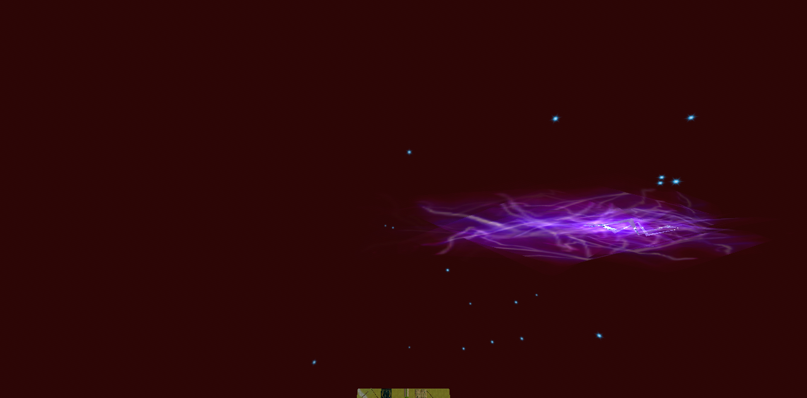

# Spell missile movement and presentation investigation

Status: **Scale, placement, particle cadence, and sloped-flight alignment fixes accepted
by the user. Effect loading and retention implemented and accepted by the user.** Updated 2026-09-16. Initial investigation used
working-tree HEAD `39e04918`. The existing ACE and ACViewer submodules had untracked
content; neither was modified. Earlier findings below are chronological evidence;
the cadence follow-up supersedes the previously unresolved distance predicate.


## Report and scope

The user observes these failures while **casting in the connected client**:

- Lightning appears to move backward or lacks the stretching appearance remembered from retail.
- Spike Strafe daggers face the wrong direction.
- Tusker Fists appears incorrectly oriented and remains stationary in the air.
- Rings such as Tectonic Rifts show ground lighting but no visible missiles.

The investigation compared production code, local `dats/weenies.hwc`, the retail
`ace-root/dats/client_portal.dat`, ACE, and the retail decompile. Local content is
diagnostic input, not a proposed checked-in test dependency.

## Findings and confidence

| Finding | Evidence level | Remaining limitation |
| --- | --- | --- |
| Scale hooks reject all seven original ring bodies and Tusker Fists | Executed production preparation; ring failure reproduced through browser/host | No connected-client packet capture of the reported casts |
| Independent objects lose wire placement; renderer selects resting | Code trace plus actual dagger poses, separated by approximately 179.5 degrees | No before/after connected-client visual verification |
| Missile alignment discards pitch | Direct comparison with retail | Not established as the cause of the horizontal lightning symptom |
| Original lightning bolt travels forward and renders growing particles | Real browser renderer, production solver, injected Launch cue | Explorer-host fixture, not a connected-client cast |
| Three additional lightning templates fail scale validation | Executed production preparation | Their player-spell associations are not established |

### 1. Original diagnosis: Scale validation prevents flight

`holtburger-core::prepare_dynamic_entity_physical_definition` reaches
`validate_default_script_collision_support` while preparing target geometry.
The original hook classifier rejected type **12**, the already-decoded Scale hook.
The gate has now been corrected as described in the follow-up below.

Relevant code:

- [Shared physical preparation](../../crates/holtburger-core/src/dynamic_entity.rs):
  `prepare_target_geometry`, `validate_default_script_collision_support`, `unsupported_collision_hook`.
- [Connected-client collision coordinator](../../crates/holtburger-core/src/client/collision.rs):
  failed remote preparation logs a warning and retains `ClientRemoteBodyStatus::Unavailable`.
  Unchanged definitions keep that terminal status; only pending bodies are scheduled for preparation.
- [Core scale preparation](../../crates/holtburger-core/src/client/dynamic_scale.rs):
  setup-direct script timelines are already prepared for world-owned scale.
- [World scale application](../../crates/holtburger-world/src/state/entity_scale.rs):
  `apply_entity_script_scale` synchronizes effective scale into the body.
- [Scene geometry update](../../crates/holtburger-world/src/spatial/scene.rs):
  `set_dynamic_body_object_scale` rebuilds movement geometry from unit geometry and updates
  the dynamic object's scale.

All seven original ring scripts and Tusker Fists begin with an immediate `Scale(2.0)`.
The following results came from calling the production preparation function with catalog
identity, setup, material appearance defaults, coefficients, and the resolved template physics mask:

```text
7269 acidring:          setup 02000882, script 330008C4: rejected hook 12
7270 flamering:         setup 02000881, script 330008C3: rejected hook 12
7271 forcering:         setup 02000887, script 330008C9: rejected hook 12
7272 frostring:         setup 02000883, script 330008C5: rejected hook 12
7273 lightningring:     setup 02000884, script 330008C6: rejected hook 12
7274 shockwavering:     setup 02000885, script 330008C7: rejected hook 12
7275 whirlingbladering: setup 02000886, script 330008C8: rejected hook 12
23144 tuskerfist:       setup 02000EAE, script 33000D77: rejected hook 12
1635 lightningbolt: OK
7278 forcewall: OK
```

The browser/host path independently reproduced:

```text
Explorer entity host explorer-entity-spawn failed (500):
WCID 7274 setup 0x02000885 physics script 0x330008C7
contains collision-mutating hook 12
```

Explorer fails the spawn request; the connected client instead retains the remote body's
unavailable status. Do not conflate those different failure presentations.

Tectonic Rifts' shockwave carrier has a setup light and uses emitter **0x320004D1** for
its visible effect. The emitter has distance trigger `2`, **zero initial particles**, and
birth spacing input `0.0566667`. Our particle system waits for displacement before emitting.
Thus rejected flight explains a stationary carrier with light but no particle missile.
This path does not require an immediate collision with the caster or reversed ring velocity.

The stationary-fist explanation is similarly supported by rejection and retained unavailable
state. **Indefinite entity lifetime is not proven.** Server deletion, interest withdrawal,
and browser resource retirement must still be traced in a connected-client reproduction.

Additional lightning-template preparation results:

```text
OK: 1635, 7266, 7280, 7305, 8635, 20977, 21919, 33527, 33865, 46033, 52621
33729: setup 020015EC, script 33001031: rejected hook 12
46032: setup 02001B6F, script 33001315: rejected hook 12
53357: setup 02001C3D, script 3300138F: rejected hook 12
```

These are selected lightning-named catalog templates, not an exhaustive spell-to-projectile census.

### 2. Spike Strafe receives a resting pose

ACE clears projectile `CurrentMotionState` and `Placement` in
[SpellProjectile.SetProjectilePhysicsState](../../ACE/Source/ACE.Server/WorldObjects/SpellProjectile.cs).
Retail initializes an absent animation-frame placement to **0** (`acclient.c:318403`),
applies it in `CPhysicsObj::set_description` (`310470`), and falls back to placement 0
when a requested setup placement is absent (`CPartArray::SetPlacementFrame`, `314297`).

Our [entity hydration](../../crates/holtburger-world/src/entity.rs), `apply_description`,
uses `animation_frame` only inside the parent/attachment branch. An independent object's
placement selection is lost. The frontend's
[`defaultPose`](../../apps/holtburger-3d/src/lib/game/systems/dynamic-entity-system.ts)
requests `RESTING_PLACEMENT_KEY`.

Spike Strafe's forcewall template, WCID **7278**, uses setup **0x0200087D** with no
default animation. Its actual part quaternions, in `w,x,y,z` order, are:

```text
Default: (0.707107, -0.707107,  0,         0)
Resting: (0.497826,  0.503903, -0.502175,  0.496056)
```

The normalized quaternion angular separation is approximately **179.5076 degrees**.
This is a strong asset-level explanation for a backward-facing dagger.

The shared collision preparation's `stable_part_frames` also prefers Resting over Default
when there is no default animation. A renderer-only correction would leave target geometry
selection inconsistent. Placement must be accounted for at both consumers; static scenery
and Explorer policy must not be changed indiscriminately.

Tusker Fists' inspected setup has only Default placement. Its reported orientation issue
is **not** explained by the dagger's resting/default discrepancy.

### 3. Flight alignment is horizontal-only

[`resolve_body_facing`](../../crates/holtburger-world/src/spatial/physical_body.rs) derives
`heading_to(displacement)` and constructs `Quaternion::from_heading`, discarding vertical
direction. Retail's `Frame::set_vector_heading` includes `asin(normal.z)` pitch
(`acclient.c:342873`); retail applies it before the transition (`310889`).

This is a shared world-physics mismatch affecting sloped flight. It does not establish a
horizontal velocity reversal, and should not be presented as the complete lightning diagnosis.

### 4. Lightning growth exists; the connected-client symptom remains open

**Connected-client follow-up:** The user briefly could not reproduce the issue, then
identified **Lightning Bolt V** as an easier reproduction: a particle appears stuck on
the caster while the main missile appears separate. The reported retail comparison is
that this particle follows the missile and stretches. This is a user observation, not
yet an instrumented attribution to an emitter or projectile. Lightning remains active
in the investigation; the lower-level control does not establish higher-level correctness.

**Instrumented follow-up:** During a second passive capture, the user confirmed that
the stuck particle remained at the casting position after moving sideways. The
[projectile-only capture](evidence/spell-missiles/lightning-v-connected.json) identifies
WCID **1635**, setup **0x020003F0**, generation 0, with Launch cue 4 at intensity
**0.6000000238418579**. At recorder time 35.078 s its position was
`(116.1398, 115.6365, 63.3045)`; 35 integrated advances brought it to
`(101.1006, 112.4183, 62.0391)` by 36.136 s. Impact cue 5 arrived at 36.152 s,
and presentation removal at 41.142 s. Thus the carrier moved successfully:
the previously confirmed body-preparation Scale rejection does not explain this cast.

The recorder ran for 72.052 s with zero dropped events and was then stopped and
removed. It captured entity motion and script cues, but not individual emitter birth
positions or rendered particle positions. Therefore it does **not** identify the
particular stuck particle. Next compare caster-animation emitters with projectile
default/Launch emitters, recording each emitter's owner, resolved part frame, birth
origin, and live origin. The authored detached Launch particles already use birth
frames in retail; do not change their parent-following flags merely to erase a trail.

**Targeted particle capture:** A subsequent 59.902-second recording (zero dropped
events; recorder removed afterward) captured emitter creation and draw-record inputs.
The user reported the stationary effect farther in front of the caster this time.
The [projectile particle evidence](evidence/spell-missiles/lightning-v-particles.json)
shows Launch at 11.2545 s, followed by creation of both default and Launch emitters
at 11.8993–11.8994 s: approximately **645 ms later**. This measures cue-to-emitter
delay, not an isolated asset-loading duration.

The projectile owns scene node 1069; its emitters ride part node 1071. Default
lightning `0x3200012D` uses a live following frame, and Launch lightning
`0x32000195` uses frozen particle birth frames, matching their authored flags.
Both use mesh `0x01001732`. The following frame moves toward impact while the
Launch particles remain at their recorded birth origins. This supplies a concrete
stationary lightning cluster candidate without caster ownership or a scale rejection.
It is not a pixel-level identification of the effect the user was watching.

By recorder time 12.110 s, each lightning emitter has reached its **20-particle cap**.
The detached emitter retains these same early birth records through 12.839 s while
the missile continues onward and impacts. Their one-second lifespans prevent slots
from freeing during most of the remaining flight. Emission starts well downrange
because of the delay, then rapidly saturates and leaves a concentrated growing cluster.

Next run a controlled local replay of this measured intensity (0.6), timing, and
trajectory across presentation cadences. Measure time-to-cap and birth-position spread,
then compare retail's distance-emission threshold and update cadence before changing
either. Independently isolate why both default and Launch emitters were delayed.
The current distance threshold is explicitly approximate; these observations establish
its visible consequence in this run, not the correct retail replacement formula.

**Force Bolt corroboration:** The user also reports Force Bolt V's trail stopping a
few meters ahead while retail continues emitting a more widely spaced trail along
the trajectory. Local catalog Force Bolt template WCID 1667 uses setup `0x020003F3`
with no default script. Its Launch table, sampled at intensity 0.6 (not yet confirmed
by a Force Bolt live capture), creates four copies of distance emitter `0x320001AA`,
on parts 0–3. Each has authored birthrate 0.25, capacity 20, lifetime 1.5 with variance
0.5, and detached particles. A separate emitter `0x32000180` has capacity 1 and
birthrate 20. These assets share the same approximate distance-trigger implementation
as lightning. This strengthens early saturation as a cross-spell hypothesis; it does
not yet measure Force Bolt's actual time-to-cap. Include both spells in the controlled
spacing/cadence comparison. The absence of a default script on this template also
distinguishes it from the default Scale-hook rejection affecting rings and fists.

### 5. Production replay reproduces early trail saturation

An isolated browser experiment instantiated the production `ParticleSystem` without
touching the live game's instances or character. Each run moved one emitter at 15 m/s
for three seconds, with a fixed part rotation, deterministic midpoint randomness,
and no culling or asset delay. Lightning used the captured `0x32000195` fields;
Force used the decoded `0x320001AA` trail fields. Mesh bounds were synthetic because
this experiment measures births, not rendering. Force's four rotating attachment
parts and actual connected trajectory remain outside this simplified experiment.

[Replay source](evidence/spell-missiles/emission-cadence-replay.js) can be evaluated
in the development client's DevTools after its particle module loads. It creates only
isolated instances, returns results, and installs no hooks.
[Full results](evidence/spell-missiles/emission-cadence-replay.json) retain every birth.

With the current spacing multiplier of 1:

| Emitter | Updates/second | First reaches 20 live particles | Longest interval between births |
| --- | ---: | ---: | ---: |
| Lightning | 30 | 0.667 s | 0.367 s |
| Lightning | 60 | 0.333 s | 0.683 s |
| Lightning | 144 | 0.139 s | 0.868 s |
| Force trail | 30 | 0.667 s | 0.867 s |
| Force trail | 60 | 0.650 s | 0.883 s |
| Force trail | 144 | 0.417 s | 1.104 s |

This reproduces the early burst and subsequent emission gap independently of loading.
At 144 Hz the lightning first-fill time agrees closely with the live capture. The
frontend owns this behavior: `#emitDue` admits at most one birth per update, interprets
`birthrate * distanceSpacingMultiplier` as linear distance, and refuses births while
the authored particle capacity is occupied. Faster presentation updates fill that
capacity over a shorter stretch of the trajectory.

Spacing multipliers 5 and 10 were tested diagnostically. Multiplier 5 kept Force below
capacity at all three cadences, but lightning still saturated. Multiplier 10 eliminated
lightning saturation at 30 Hz but still produced a 0.340-second gap at 144 Hz. A global
knob change therefore does not establish consistent or retail-correct behavior.

**Retail evidence limit:** `ParticleEmitterInfo::ShouldEmitParticle`
(`acclient.c:312447`) loses the distance comparison operands to undefined x87 flags.
Both ACE and ACViewer use `lastEmitTime < emitterOffset.LengthSquared()` with a
`// verify` comment; that is not an independent recovery of the missing comparison.
Neither source establishes that our linear-distance interpretation is correct, nor
justifies replacing it with squared distance, reciprocal rate, or a fixed update cap.
Retail does enforce the authored capacity and at most one birth per emitter update.

The next decisive reference is disassembly of retail function **0x00517F50**, including
its distance branch and constants, plus the emitter update call cadence. No client
executable or disassembly was found in the inspected reference locations. Recover this
before selecting a replacement distance formula. If that reference is unavailable,
use a measured retail trajectory/video at known frame cadence to constrain spacing;
label any chosen approximation honestly and census all distance emitters before a
global change. Do not increase particle caps to conceal early saturation.

The 645-ms activation delay is a separate observed defect candidate. The runtime
awaits presentation installation and script/emitter/mesh readiness before activation;
the capture does not break that interval into stages. Diagnose those stages separately
before choosing prefetching or scheduling changes. Fixing delay alone cannot remove
the saturation demonstrated by this zero-delay replay.

The known Scale hook is **uniform**, not per-axis: `ScaleHook::Execute`
(`acclient.c:328781`) passes one target and duration to `CPhysicsObj::SetScale`
(`308862`), which applies the same value to x/y/z. Retail particle lifetime growth also
writes one interpolated scalar to all three axes (`317650`). ACE's
`AnimationHookType` lists no separate non-uniform scale hook. These facts do not
establish how every apparent stretching effect is authored.

Attachment is a distinct decision: retail `ParticleEmitter::UpdateParticles`
(`acclient.c:318278`) uses the current owner/part frame for parent-local particles,
and the stored birth frame otherwise. Our particle system similarly distinguishes
live `frameTarget` from a frozen birth origin. For the level V reproduction, identify
the stuck emitter's owner, part, parent-following flag, and live versus birth position
before attributing it to scale. A moving carrier with an incorrectly anchored particle
would require a different explanation from rejection of that carrier's physical body.

The original bolt, WCID **1635**, uses setup **0x020003F0**, a five-frame axial rotation,
and default script **0x33000104**. Its setup animation has no root translation or scale hooks.
Retail installs default animation at 30 fps (`acclient.c:313742`).

The default script creates two emitters. The important distinction is between default and
Launch lightning emitters:

| Emitter | Role | Parent following | Authored scale progression |
| --- | --- | --- | --- |
| 0x3200012D | Default lightning | Yes | 0.1 → 2.0, plus authored random variance |
| 0x3200012E | Sparks | No | 0.8 → 0.1, plus variance |
| 0x32000193 | Low-intensity Launch lightning | No | 0.5 → 3.2, plus variance |
| 0x32000194 / 0x32000195 | Higher-intensity Launch lightning | No | 0.1 → 3.8, plus variance |

The Launch variants leave growing, rotating meshes at their birth locations as the carrier
travels. Retail performs uniform particle scale interpolation (`acclient.c:317650`), and
our particle shader implements that interpolation. No separate missing stretch operation
was established.

Browser evidence:

- Six explicit 33.333333 ms solver ticks moved the bolt from local x=96 to x=99,
  with y/z unchanged: **15 m/s forward**, with no collision.
- An injected production script cue `{cue: 4, intensity: 1}` added the two Launch emitters:
  the projectile owned four emitters rather than the two setup emitters.
- Twelve solver ticks, paced with wall-clock delays, moved x=96 to x=102. In the captured
  run the renderer reported 42 emitted particles and 39 still alive; the growing trail was visible.
- In a separate timing run, all four emitters were active by the first observation, approximately
  114 ms after cue injection. This bounds readiness in that run; it is not an exact activation
  measurement or a general latency benchmark.



Capture: browser harness, default SwiftShader, 1280×720, render scale 1, particle seed 7,
isolated airborne Explorer-host projectile. It is **not a screenshot of the user's connected cast**.

Two verified differences remain candidates for controlled comparison, not established causes:

- Retail selects whole animation frames (`CSequence::get_curr_animframe`, `acclient.c:326259`);
  our browser interpolates rigid part poses. This can alter the look of a five-frame rotating bolt.
- Browser live script cues start only after script/emitter/mesh readiness, rather than at receipt.
  See `#prepareDynamicScriptCue` in
  [game-presentation-runtime.ts](../../apps/holtburger-3d/src/lib/game/runtime/game-presentation-runtime.ts).
  Short flight lifetimes could expose that delay, but no failed connected cast was captured.

The distance-emission threshold is also an explicitly documented approximation in
[particle-system.ts](../../apps/holtburger-3d/src/lib/game/systems/particle-system.ts).
Retail's decompiled comparison has unrecovered operands (`acclient.c:312447`). Do not change
that approximation merely because lightning looks unusual.

## Reproduction and evidence limits

The existing read-only asset probe is useful for catalog/setup facts:

```sh
cargo run -q -p holtburger-debug-harness --bin weenie_motion_facts -- --wcid 23144
```

Run from `apps/holtburger-3d` to reproduce ring physical preparation failure:

```sh
npm run harness:browser -- --brief --landblock 0xda55ffff \
  --building-radius 0 --explicit-object-radius 0 --generated-object-radius 0 \
  --spawn-wcid 7274 --spawn-simulated --launch-direction 1,0,0 \
  --entity-ticks 6 --particle-seed 7
```

Use WCID 1635, `--entity-tick-ms 33.333333`, and `--screenshot <path>` for the original
lightning carrier control. **Explorer launch does not automatically deliver ACE's Launch cue.**
The pictured probe temporarily called `runtime.playDynamicEntityScriptCue` after entity upsert
and delayed each explicit tick by its duration. That instrumentation was removed after capture;
the unmodified command alone does not reproduce the additional Launch trail.

The direct preparation probe used a temporary Cargo project against workspace crates and a copy
of the workspace lockfile. Its inputs were catalog template facts, not a captured network description.
Both it and browser rendering used actual local assets. No asset-dependent tests were retained.
Local socket permissions were required for the browser content host, Vite, and Chrome.
No diagnostic account login was performed. A passive recorder was attached to the user's
existing connected client through DevTools port 9222 for approximately 48 seconds. It
observed four Launch cues, but no spell-specific failing capture was established. The
recorder was stopped and its temporary hooks/listeners removed when the user initially
reported non-reproduction; the later level V report occurred after removal. No character
controls or automated casts were issued.

## Next steps

1. **Capture Lightning Bolt V in the connected client before changing lightning.** Distinguish
   a particle following the caster from one left at the cast position, and identify its
   emitter owner/part and parent-following flag alongside the main missile's motion.
   Record spell ID,
   projectile WCID/setup, generation, creation pose/velocity/placement, Launch cue/table/intensity,
   physical preparation outcome, effective scale, accepted movement, effect readiness/activation,
   particle births, SetState/vector updates, deletion, and presentation retirement. Correlate clocks
   at their existing boundaries. Keep instrumentation in diagnostic infrastructure.
   Map the three rejected newer lightning templates to actual spells using ACE data.

2. **Reconcile scale support with physical preparation.** Audit both connected-client and Explorer
   scale owners, including scale-before-body and body-before-scale ordering, movement spheres,
   target geometry, broadphase bounds, and render projection. Remove the obsolete Scale rejection
   only once supported execution paths enforce those invariants. Retain explicit rejection for
   other unsupported collision mutations. Do not add WCID exceptions or duplicate scale state.

3. **Preserve authoritative world-object placement.** Retain the selected placement independently
   of attachment, carry it through the shared dynamic-entity contract, and consume it in visual
   and collision pose selection. Preserve retail's default/fallback behavior and animation
   precedence. Keep Explorer's local spawn policy explicit. Do not globally switch every static
   object from resting to default.

4. **Correct full 3D flight alignment.** Implement the retail direction-to-frame behavior in the
   shared world physics layer. Verify cardinal, diagonal, pitched, vertical, and zero-travel cases,
   as well as orientation ordering relative to collision. Character control heading remains a
   separate decision.

5. **Verify symptom closure.** Use synthetic unit fixtures for contracts and local-asset browser
   probes for appearance. Rings must travel outward and emit; fists must move and retire; daggers
   must use the selected pose; pitched missiles must retain pitch. Confirm the fixes through actual
   connected casts. Only then isolate lightning interpolation, emission, or cue timing with a
   controlled A/B experiment. Do not claim indefinite-lifetime closure from a spawn/despawn fixture.

## Ownership and scope constraints

- Protocol retains wire facts; world owns authoritative placement, scale, and flight semantics.
- Core coordinates content preparation and script-driven scale without a second authority.
- The host projects typed facts; it does not choose renderer poses or repair missile orientations.
- The frontend owns animation/particle presentation and consumes shared facts without re-deriving them.
- Prefer removing contradictory gates and preserving lost data over adding spell-specific behavior.
- Do not modify the retail decompile, run the TUI, or retain tests requiring untracked runtime assets.
- Authorized implementation follow-ups are recorded below. No commits or staging were performed.

## Live tuning control

The connected client's Debug panel now exposes **Particle trail spacing**, 0.1×–30×,
with reset to the shared configured default. The override applies to current and new
distance emitters without deleting existing particles or changing time emitters. It
lasts until app reload; it does not persist a new default or claim retail parity.

Validation: frontend type checks and lint passed; 88 focused particle/session tests
passed. A focused browser interaction confirmed default 1×, changing to 12.5×, and
reset. The broader showcase run stopped on character-list keyboard navigation before
the slider check; that broader failure was not diagnosed as part of this change.

## Frame-rate normalization follow-up

The user's provisional visual reference was **approximately 10× at 144 FPS**, with
retuning expected after normalization. The configured multiplier remains 1; the
debug slider can select 10 again. The old reference is not treated as a retail value.

Positive-distance emitters now accumulate traveled length over sampled line segments,
place births at spacing boundaries, and assign interpolated birth times. Capacity,
expiry, finite budgets, and duration are evaluated chronologically. Occupied spacing
boundaries are skipped instead of becoming emission debt. Snaps and hidden intervals
reset sampling; existing particles retain their positions. Time-based emitters retain
their previous behavior. A fresh DAT census found 202 distance-only emitters, all with
positive spacing (minimum 0.01). Zero-spacing synthetic inputs retain one endpoint
birth per moving update because they define no spatial interval.

[Normalized browser results](evidence/spell-missiles/normalized-emission-replay.json)
and [replay source](evidence/spell-missiles/normalized-emission-replay.js) show identical
recorded birth positions and times at 30, 60, and 144 Hz for both inspected effects
at multipliers 1, 5, and 10. At 10×, the straight 15 m/s lightning replay still has a
0.3667-second capacity gap; Force's trail emits every 0.1667 seconds without saturating.
This separates consistent spacing from the remaining visual tuning decision.

This is an explicitly authorized retail divergence, not a recovered retail algorithm.
Paths are piecewise linear between observed transforms; unsampled curvature and
attachment rotation are not reconstructed. Backdated births use the current sampled
orientation. Shared random sampling across different emitters can still vary when
frame grouping changes. The observed activation delay remains a separate open issue.

Normalization validation: frontend type checks and lint passed; 150 particle-related
tests and the 26 client-session tests passed. Browser birth-record comparisons matched
at all three tested cadences. Temporary browser probe changes were restored.

## Ring and Tusker Fists Scale-gate fix

Physical preparation now accepts Scale hooks while retaining rejection of unsupported
collision mutations. The prepared geometry is unit geometry: whole-object scale is
applied by world state, not baked into content preparation. No spell-specific bypass
or second scale owner was introduced.

Connected-client audit: preparation completion reads the current entity scale rather
than the request snapshot; later script updates rebuild movement spheres from retained
unit geometry, update dynamic object scale, invalidate contacts, and wake the body.
Target shapes and query placement multiply current object scale at placement time.
Both local and remote asynchronous installation tests now exercise scale arriving
during preparation; the remote case also changes scale after installation without
reloading content. Existing world tests cover absolute targets and timed ramps.

The production DAT probe now prepares all seven original rings and Tusker Fists
successfully, plus lightningbolt 1635 and forcewall 7278 as controls. The
[browser/host control](evidence/spell-missiles/ring-preparation-fixed.json) spawned
shockwavering 7274 and advanced all 12 requested 33.333333-ms ticks: x moved from
96 to 96.79999 with no browser console errors. This proves admission and movement,
not a connected cast's complete ring pattern or visual closure.

Explorer limitation: its host has no equivalent script-scale scheduler. Removing the
unit-geometry rejection does not implement that missing policy. The connected client
is the supported path for the reported spell verification; do not claim Explorer
scale parity from the movement control.

Validation: 464 core tests passed with local socket access, 14 world scale-related
tests passed, the expanded remote installation test passed, and core Clippy passed
with warnings denied. No runtime-asset-dependent tests were retained.

Next live check after restarting the rebuilt host: cast Tectonic Rifts and Tusker
Fists, verify outward ring emission and fist movement/removal. Indefinite lifetime
and fist orientation remain unproven; Spike Strafe placement is still a separate fix.


## Connected placement fix and user follow-up

The user confirmed that the previously blocked spells now work and look good.
They needed a trail-spacing multiplier around 3 for those effects, while the earlier
lightning tuning was around 13. Regular lightning then looked slightly wrong.
This is evidence against treating the global multiplier as a final universal fix;
no additional particle algorithm or tuning-default changes were made in this pass.

Spike Strafe's independent placement key now survives description hydration, the
connected view projection, and the frontend presentation source. Collision preparation
uses the same requested key. Missing authored keys fall back to Default, matching
`CPartArray::SetPlacementFrame` (`acclient.c:314297`); omitted ANIMFRAME initializes
to zero (`acclient.c:318475`). Default-animation precedence is retained. Explorer
world entities and authored scenery explicitly retain their resting-pose policy.

This removes the hardcoded resting pose from connected independent missiles rather
than applying a dagger-specific rotation. For the inspected forcewall setup, that
selects the authored Default pose instead of the approximately 179.5-degree-different
Resting pose. Changes to placement also invalidate collision preparation and update
already-resident unanimated visuals without restarting their scripts.

Validation: 466 core tests, the focused world description test, and 148 frontend
tests passed. Type checks, frontend lint, and core Clippy with warnings denied passed.
The release host was rebuilt. The local production-DAT preparation probe accepted
all seven ring templates, Tusker Fists, Lightning Bolt, and Spike Strafe with placement
zero. Tests cover lossless hydration/projection, requested-pose/default-fallback
selection, default-animation precedence in collision preparation, and resident
frontend pose replacement.

The [browser control](evidence/spell-missiles/spike-default-placement-browser.json)
loaded WCID 7278 through the production runtime with a temporary harness snapshot
override to placement zero. One dynamic entity was visible, no browser console
errors were recorded, and despawning returned the visible entity count to zero.
The screenshot showed the slender missile at small scale; it does not establish
facing relative to travel. The temporary harness override was restored.

Next steps:

1. Restart the connected client and cast Spike Strafe; confirm the dagger tips face
   the travel direction. Automated pose checks do not substitute for that live cast.
2. Compare the affected ring and bolt emitters at the same frame cadence and known
   travel speeds. Record authored spacing, live-particle capacity, particle lifetime,
   script intensity, and actual emission coverage before choosing another tuning
   mechanism. Preserve the frame-independent emission work; avoid per-spell constants
   until the remaining mismatch has evidence.
3. Separately revisit the observed launch-effect activation delay if trail coverage
   remains short after those checks.


## Retail cadence recovery and implementation

### Decisive new reference

A wider filesystem search found `/home/cluracan/code/ac-re/ac-bins/acclient.exe`.
The earlier search's failure to locate an executable was not evidence that none was
available. This binary matches the inspected function addresses and instruction
structure. Its SHA-256 and the extracted quantum constants are retained in
[provenance](evidence/spell-missiles/retail-particle-cadence-provenance.json).
No executable was run or modified.

[Disassembly of 0x00517F50](evidence/spell-missiles/retail-distance-predicate.asm)
recovers the comparison missing from `acclient.c:312447`:

- `0x517F91–0x517FAA` builds `x² + y² + z²` from the emitter displacement.
- `0x517FAC–0x517FAE` loads and squares the double at `this+0x50` (birthrate).
- `0x517FB0` compares birthrate² against displacement² using `fcompp`.
- `test ah, 5; jnp` accepts the ordered-less-than case (C0=1, C2=0);
  equality, greater-than, and unordered do not emit.

Thus the authored value is **minimum linear displacement**, with a strict `>` test.
It is not squared-distance units, reciprocal frequency, or elapsed time. ACE's
`lastEmitTime < emitterOffset.LengthSquared() // verify` is not the recovered rule.
This resolves the earlier reference limitation and validates the distance units.

The missing density constraint was above the emitter:

1. `CPhysics::UseTime`, `acclient.c:300073–300116`, admits physics work only when
   elapsed time reaches `MIN_QUANTUM_93`, then sets `last_update` to current time.
2. The initializer (`acclient.c:748374–748377`, exe `0x006FC1E0`) writes **1 / 30**
   to that quantum. The executable's numerator and denominator were also read:
   doubles at `0x007938C0` and `0x007C7550` are 1 and 30.
3. `CPhysicsObj::UpdateObjectInternal` calls the particle manager (`310968–310970`).
   `ParticleEmitter::UpdateParticles` admits at most one new particle (`318305–318308`).
4. Capacity remains `max_particles`, and particles retire when lifetime reaches
   lifespan (`ParticleEmitter::KillParticle`, `317417–317424`).

For ordinary moving independent missiles this limits distance-triggered births to
at most 30/s. Retail's admission is quantized by its outer update timing; it does
not guarantee exactly 30/s. Initial-particle batches are separate. Long physics
updates have their own maximum-quantum subdivision, and pauses over two seconds are
skipped (`311181–311214`); this change does not reproduce those pause policies.

### Asset comparison

The local catalog and DAT probe traced setup-default scripts and Launch cue 4 at
intensities 0, .2, .4, .6, .8, and 1 for both bolts and all seven original rings.
The selected input records are retained in
[emitter inputs](evidence/spell-missiles/cadence-emitter-inputs.json).
Launch .6 for lightning is live-capture evidence; .6 for Force remains a comparison
scenario, not a new observed cast. No script-intensity multiplication of spacing
was found: intensity selects a script, which selects authored emitter records.

| Effect | Carrier speed | Authored distance | Capacity | Lifetime | Following |
| --- | ---: | ---: | ---: | ---: | --- |
| Lightning default / V trail | 15 m/s | .05 m | 20 | 1 s | Default yes; Launch no |
| Force V trail, each of four parts | 15 m/s | .25 m | 20 | 1.5 s ± .5 | No |
| Tectonic Rifts / original rings | 2 m/s | .0566667 m | 10 | .4 s ± .1 | Yes |

All seven original ring emitters share those timing/trigger fields and have a
1.5-second emitter duration. Their motion/mesh data differ. A fresh full census
again found **202 distance-only emitters**, zero with zero spacing, and zero with
both trigger flags set.

At multiplier 3, unconstrained spatial resampling requests 100 births/s for
lightning, 20 for Force, and approximately 11.76 for a ring. Thus one global distance
multiplier is compensating for a missing time constraint differently across effects.
These numbers do not establish an aesthetic optimum for each spell.

### Corrected frontend behavior

Distance-only emitters now evaluate at a fixed **30 Hz**, independently of render
cadence. Each clock step samples an interpolated position and admits at most one
birth after checking strict displacement, capacity, lifetime, and finite budgets.
The displacement anchor is the last successful birth rather than accumulated path
length: reversing inside the spacing radius does not manufacture emission.
Capacity recovery can emit from a stationary endpoint when enough displacement from
the last birth was already reached. Occupied steps are skipped without emission debt.

This preserves the user's requested frame independence while restoring the proven
retail ceiling. It deliberately normalizes retail's render-quantized timing and uses
an emitter-local clock phase. Interpolated positions do not reconstruct unsampled
curvature or historical part rotations. These differences are marked beside the
implementation. Time-triggered emitters keep their existing behavior.

The shared spacing setting remains **3**, as saved by the user; the slider remains
a minimum-distance multiplier, not a particles-per-second control. It can now have
no visible effect over ranges where the cadence ceiling dominates. Spacing also
quantizes to admitted clock steps. No per-spell exception, cap increase, lifetime
change, or additional tuning knob was added.

### Verification and remaining limits

The [browser replay](evidence/spell-missiles/cadence-emission-replay.json), generated
by the [isolated production-runtime script](evidence/spell-missiles/cadence-emission-replay.js),
uses actual emitter fields, straight catalog-speed trajectories, fixed roll .5, and
multipliers 1, 3, and 13 at **15, 30, 60, and 144 FPS**. Birth counts and birth times
match across cadences; detached birth positions also match. Following particles
use the current frame, so their draw position at the first observation is deliberately
not treated as their birth position. This distinction resolved the initial replay
comparison failure without changing production behavior.

At multiplier 3 over a three-second replay:

| Emitter | Total births | Largest gap between births |
| --- | ---: | ---: |
| Lightning default / V trail | 60 each | .3667 s |
| Force V trail, per part | 40 | .2333 s |
| Tectonic Rifts | 14 | .1000 s |

The remaining lightning gap follows its 20-slot/one-second authored limit at 30 Hz.
At multiplier 1, Force's longer lifetime produces a .8667-second gap. The cadence
correction therefore does **not** prove continuous emission or exact visual parity.
Do not hide these remaining effects by changing capacity without new evidence.

Focused tests cover the ceiling across render rates, strict threshold equality,
backtracking, historical expiry/capacity, stationary recovery, attached motion,
zero-spacing inputs, budgets, duration, live tuning, snaps, and hidden intervals.
No test depends on locally installed DAT files.

Next connected check: keep multiplier 3 initially and compare Lightning Bolt V,
Force Bolt V, and Tectonic Rifts. Report both density and any remaining early trail
cutoff. Separate capacity gaps from the earlier measured activation delay; the
645-ms readiness interval has not been changed or re-attributed by this work.


### Acceptance ownership

The user explicitly owns visual acceptance gates. Further automated visual probes
were stopped, and temporary harness overrides and particle logging were removed.
Automated checks establish implementation behavior; they do not establish visual
acceptance. The rendered lightning control showed an extended trail, but the ring
control remained inconclusive: its capture had zero live particles and recorded
finite hidden-state reconciliation. That is not proof of a cadence regression or
of a separate product defect; no additional visibility change was made.

For user acceptance, reload the frontend and start at the saved multiplier **3**:
cast Lightning Bolt V, Force Bolt V, and Tectonic Rifts. Check trail coverage along
the full flight, density, and any early cutoff. The cadence correction is frontend
only; this follow-up does not require a new host build. Any further visual tuning
or symptom closure follows the user's results.


## Full 3D path alignment

The user visually accepted the cadence correction at the saved spacing multiplier 3.
The next authorized fix restores pitch for `AlignPath` bodies in the shared world
physics layer (`physical_body::resolve_body_facing`). That function is consumed by
both ordinary free-flight reference prediction and collision-aware body orientation.

Retail `Frame::set_vector_heading` (`acclient.c:342873–342893`) normalizes the travel
vector and combines local-X pitch with world-Z yaw, with local +Y forward. Our old
conversion went through a planar heading and discarded z. The corrected conversion
uses `atan2(z, hypot(x,y))` for pitch, mathematically equivalent to retail's
`asin(normal.z)` without normalized-z roundoff at vertical flight. Yaw follows
retail's expression, including its -90-degree yaw choice for exactly vertical
vectors. Controller-heading and Sledding policy branches are unchanged; zero/tiny
travel retains the existing facing-selection policy and threshold.

Collision ordering was audited but not redesigned: retail chooses its requested
path facing before `transition` (`310883–310897`), while our contact solver aligns
from accepted ordinary travel and then checks angular clearance. The shared helper
now preserves pitch in both prediction and accepted movement, but this is not a claim
of retail collision-order parity. Existing bounded angular clearance for offset
spheres and omega composition remain intact.

Validation: all 839 world tests passed. The new direction test covers 26 cardinal,
diagonal, pitched, and vertical directions plus zero travel, checking the local
forward axis, roll convention, and unit quaternion length. The existing projectile
sweep test now covers horizontal, ascending, descending, and vertical trajectories,
both unobstructed and hitting a small target. Impact can stop velocity without
erasing the accepted travel's pitch. World Clippy passed with warnings denied.

User-owned visual gate after restarting the rebuilt host: cast a visibly directional
missile at targets above and below the caster. Verify its tip follows the slope and
that level shots still look correct. No automated visual acceptance was performed.

The user subsequently accepted the alignment change ("lgtm").

## Agreed follow-up: effect loading and retention

### Problem and current ownership

Asset preparation is on the launch-effect critical path. The observed approximately
645-ms cue-to-emitter interval includes readiness work, but was not broken down by
stage; it is not a measurement of disk loading alone. The code establishes avoidable
waiting and repeat preparation independently of that timing attribution.

In the frontend presentation layer,
[`GamePresentationRuntime`](../../apps/holtburger-3d/src/lib/game/runtime/game-presentation-runtime.ts)
waits for the target visual to be installed before preparing its queued script cue.
Preparation then acquires the script table, selects the root script, acquires its
script closure, acquires emitter definitions sequentially, and stages particle
meshes including texture/GPU readiness. Per-entity cue serialization also serializes
preparation. Execution starts at readiness, guarded by owner/generation checks.

[`PreparedAssetRepository`](../../apps/holtburger-3d/src/lib/game/behavior/prepared-asset-repository.ts)
shares in-flight acquisitions, but deletes a ready definition when its last handle
releases. Cue tables release immediately after selection; script and emitter handles
remain owned until entity presentation retirement. A later effect can therefore
repeat definition preparation. In contrast,
[`ParticleMeshCache`](../../apps/holtburger-3d/src/lib/game/behavior/particle-mesh-cache.ts)
already retains loaded meshes for the presentation runtime's lifetime.

Host-side content caching cannot remove frontend transfer, decoding, or GPU
preparation. Retention and scheduling of prepared presentation assets belong in the
frontend presentation layer; shared world/core semantics should not acquire this
policy.

### Data distribution

A read-only census of the local retail `ace-root/dats/client_portal.dat` on
2026-09-16 grouped `DatDatabase.files` entries by their high-byte type and summed
`DatFileEntry.size`:

| Definition family | Prefix | Count | Encoded bytes | Largest record |
| --- | --- | ---: | ---: | ---: |
| Particle emitters | `0x32` | 2,051 | 360,976 | 176 |
| Physics scripts | `0x33` | 4,248 | 673,076 | 2,080 |
| Physics script tables | `0x34` | 164 | 343,424 | 4,280 |

The entire definition corpus is 1,377,476 bytes (approximately 1.31 MiB). Decoding
all emitter records also identified 343 distinct hardware mesh IDs. These numbers
describe archive content, not JavaScript heap usage or GPU residency; geometry,
textures, prepared structures, and allocation overhead require separate accounting.
Nevertheless, the small finite definition corpus supports session retention before
introducing eviction machinery.

### Agreed strategy and concessions

- Retain successfully loaded immutable effect definitions lazily for the presentation
  session. Releasing an active handle should not discard the reusable definition;
  runtime teardown remains the residency boundary. This is not an instruction to
  preload the entire corpus or change retention for every generic repository user.
- Begin preparation as soon as an entity/cue supplies the required asset identity,
  overlapping target visual installation where possible. Execute only when assets
  and the correct target generation are ready, preserving cue order and stale-work
  rejection.
- Prepare independent dependencies concurrently rather than awaiting each emitter
  in sequence. Continue sharing requests for the same asset and clean up acquired
  handles on failures or retirement.
- Keep heavy mesh, texture, and GPU resource retention separate from small immutable
  definitions. Particle meshes already remain resident; assess actual heavy-resource
  costs before introducing budgets or eviction.
- Do not prepare action-bar or spell-bar items. That adds a caster-specific prediction
  path benefiting only the player's own spells. Entity/cue-driven preparation and
  shared retention apply equally to other players, creatures, and non-spell effects.

A previously unseen effect can still arrive before its assets are ready. The first
implementation should reduce that delay and prevent repeat preparation, rather than
promise zero first-use latency. Session retention trades some memory growth for
simpler ownership and repeat-use readiness. Neither a general LRU cache nor a new
cache-budget subsystem is justified by the definition census at this stage.

### Next steps

1. Implement effect-definition residency through the existing repositories, keeping
   active handle ownership distinct from retained immutable data. Scope the policy
   to scripts, script tables, and emitter definitions; preserve teardown and error
   behavior and avoid changing unrelated asset families implicitly.
2. Restructure cue preparation to overlap visual installation and load independent
   dependencies concurrently. Preserve generation checks, ordered execution, and
   cleanup when any concurrent acquisition fails. Reuse existing effect preparation
   paths where they express the same dependency work.
3. Verify repeat acquisition avoids source reloads, concurrent requests share work,
   teardown releases retained data, and late preparation cannot execute on a retired
   or replacement entity. Use asset-independent unit tests for these contracts.
4. Compare cold and repeated effect readiness, separating definition preparation
   from mesh/texture/GPU staging. Measure retained heap and heavy resources before
   deciding whether additional preload or eviction work is warranted. This is
   validation and prioritization, not a prerequisite for addressing the proven
   structural waiting and retention issues.
5. Leave connected-client visual acceptance to the user, covering both locally cast
   and observed effects. Preserve the existing readiness-time execution semantics;
   backdating scripts is a separate behavioral change and can lose time-zero hooks.

This section records the agreed design; no loading or retention implementation has
been made as part of this documentation update.

### Implementation follow-up

The subsequently authorized implementation makes retention explicit in the shared
frontend prepared-asset repository. Physics scripts, script tables, and particle
emitter definitions remain resident until repository teardown; animations and sound
tables retain their existing last-handle-release policy. Active handles still prevent
repository destruction, and failed loads still require explicit eviction to retry.

Batch acquisition loads independent IDs concurrently, shares duplicate requests,
and waits for all results before releasing successes on partial failure. Script
closure traversal uses concurrent dependency frontiers with cycle detection. Both
default entity behavior and live cues use the same batch acquisition for emitters.

Cue table identity now belongs to the desired presentation record and becomes
available when its visual metadata resolves, before animation, behavior, and mesh
installation finish. Cue asset preparation overlaps that remaining installation work
and other queued cue preparations. Only execution waits for installation and earlier
cues. Epoch, desired-record, entity-generation, and installed-target checks prevent
late work from reaching a replacement target; abandoned staging releases its handles.
Successful execution transfers those handles to the existing entity owner. Execution
still starts at readiness rather than backdating time-zero hooks.

Validation includes focused tests for retention versus active ownership, shared
requests, partial batch failure and retry, cyclic script closures, preparation during
blocked visual installation, repeat reuse after entity retirement, cue clearing,
retirement/generation replacement, and execution order despite out-of-order asset
readiness. These tests use checked-in or synthetic fixtures, not local DAT assets.
All 159 focused tests passed, including animation repository regression coverage.
Full frontend/type checks, ESLint, dead-code checks, and diff whitespace checks passed.

A non-visual browser smoke run used real content at `0xda55ffff`, radii 1 for
buildings/explicit/generated objects, and a two-second measurement window:
`npm run harness:browser -- --brief --measure-ms 2000 --landblock 0xda55ffff --building-radius 1 --explicit-object-radius 1 --generated-object-radius 1`.
It completed successfully with 93 dynamic entities and 57 live emitters. This checks
the shared asset-loading/rendering path, not connected-client cue latency or visual
acceptance. No new cold/warm launch latency or retained-heap measurements have been
made, and the earlier 645-ms observation must not be treated as an after-change result.

Requested user-owned gate: reload the frontend, compare first and repeated casts,
and observe effects from other players or creatures as available. Check launch
timing and preservation of the accepted trails/orientations. No host rebuild is
required for this frontend-only change. Further memory budgeting or speculative
preloading remains deferred pending evidence.

The user subsequently accepted this change ("lgtm") and requested review and commit.

### Effect loading and retention code-quality review

Reviewed the working-tree diff against HEAD, including the new repository tests.
The review covered repository policy producers (scripts, tables, emitters, animations,
and sounds), batch acquisition and closure traversal, default entity staging, live
cue preparation/publication, generation replacement, and runtime shutdown. The host
script adapter and the behavior adapter's explicit-versus-setup table selection were
also inspected. This is not a whole-renderer, host-cache, or GPU-memory audit.

One bounded finding was corrected: concurrent batch failures preserved their causes
but no longer guaranteed the failed dependency's ID in the error chain. Batch
acquisition now attaches the family and requested ID to each failure before aggregating
them. This retains actionable diagnostics without caller-specific error reconstruction.

No remaining blocking design findings were identified in these seams. Asset families
own residency policy; the generic repository owns sharing and reference accounting;
the presentation runtime owns cue ordering, target eligibility, and transfer of asset
leases. The former installed-record table copy was removed when identity moved to the
desired record. The new batch primitive is shared by closure traversal, default
behavior, and live cues rather than duplicated at each caller. Added orchestration
and tests are justified by concurrent preparation and its cleanup obligations; no
production capture hooks or speculative spell-bar preparation were added.

Accepted costs remain session memory growth for encountered definitions and waiting
for outstanding acquisitions during teardown. Cold first use and real retained heap
size have not been benchmarked. Visual acceptance belongs to the user's recorded
result; this review does not infer measured latency improvements from code shape.

## Earlier missile-fix pre-commit code-quality review (2026-09-16)

Reviewed the accumulated missile diff against the current HEAD, including changed
callers, test fixtures, the investigation document, and its evidence artifacts.
No blocking code-quality finding remains. One stale host manifest comment still
called the distance predicate unrecovered; it now describes the recovered linear
displacement and frontend-owned cadence/tuning policy.

Contract coverage:

| Boundary | Inspected producer and consumers | Conclusion |
| --- | --- | --- |
| Requested setup placement | Protocol description hydration → world entity → core client projection → host event passthrough → frontend schema/adaptation → visual key and dynamic entity pose | Independent placement remains lossless through the boundary; asset lookup owns Default fallback. Explorer/scenery retain explicit Resting policy. Resident replacement preserves animated poses; attachment placement remains separately applied by the attachment path. |
| Collision preparation | Client body facts and preparation equality → core unit geometry and script classifier → world installation and later scale updates | Placement invalidates geometry preparation; instance scale does not. Scale support reuses existing world execution instead of adding a second scale owner. Other unsupported collision-mutating hooks remain rejected. |
| Particle spacing and lifecycle | Cold Svelte control → presentation session/owner construction → runtime → particle system → stored particle records | Session policy survives asynchronous construction without owning renderer lifetime. Distance sampling, birth admission, historical expiry, and snap/visibility resets are particle-system responsibilities. Existing particles retain their birth state. |
| Path alignment | Shared facing helper → free-flight prediction and contact angular solver | Pitch reaches both immediate consumers; accepted-travel facing and angular-clearance policy remain intact. Existing collision-order differences from retail are explicitly outside this fix. |

The added placement plumbing carries a previously discarded fact rather than
reconstructing it downstream. The additional particle clock state is justified by
render-independent admission, chronological capacity, and discontinuity handling;
sampled position and last admitted birth position have distinct lifetimes. No new
per-spell branches, cache framework, or production capture hooks were introduced.
The requested live spacing control is retained functionality, while replay scripts
and captures remain investigation evidence outside production code.

Validation during this review: 209 focused frontend tests, 466 core tests, and 839
world tests passed. Frontend type checks, ESLint, dead-code checks, Prettier, and
Clippy for core/world/DAT passed. The initial restricted Rust run failed two
localhost-socket tests with permission errors; both passed in the authorized rerun.
Visual acceptance remains the user's previously recorded result; this review did
not perform another visual gate.

Limits: this was not a whole-renderer or whole-protocol audit. Historical path
curvature/rotation reconstruction, retail global clock phase, and exact contact
ordering remain the documented concessions. Asset loading/retention is an agreed
follow-up design, not an implemented or benchmarked improvement in this commit.
